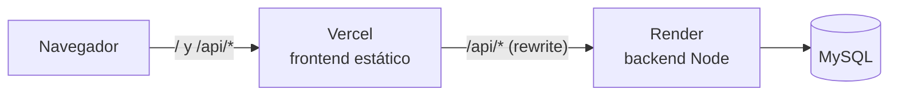

# Sistema de Gestión Logística y de Flota

Plataforma integral para la gestión y optimización de las operaciones logísticas de una empresa de transporte: administra la flota vehicular, el personal (choferes), la ejecución de viajes y el mantenimiento, con alertas automáticas, auditoría, reportes y un panel de indicadores.

Trabajo práctico de Desarrollo de Software (DSW). Full-stack con backend REST y frontend SPA.

---

## Qué hace el sistema

- **Gestión de flota:** alta/baja de vehículos, estado en tiempo real (disponible, en viaje, en taller, inactivo), historial de kilometraje y mantenimiento.
- **Gestión de choferes:** disponibilidad, documentación obligatoria (DNI, licencia, ART, psicofísico), y control de vencimientos.
- **Viajes:** planificación, asignación de chofer con selección automática de vehículo, seguimiento de estado (pendiente → en curso → finalizado) y registro de kilometraje.
- **Mantenimiento:** preventivo y correctivo, con tipos configurables, máquina de estados y comprobantes adjuntos.
- **Alertas automáticas:** vencimientos de licencia/documentación/seguro, km de mantenimiento superado, vehículos inactivos, con reconciliación (auto-resolución).
- **Auditoría:** registro inmutable de todas las acciones, con detalle de antes/después.
- **Reportes y dashboard:** indicadores clave (utilización de flota, viajes, mantenimientos, alertas) y reportes por período.
- **Roles:** Administrador (acceso total), Operador (operación diaria) y Chofer (app mobile con su viaje, historial y documentación).

---

## Tecnologías

**Backend** — Node.js + TypeScript · Express 4 · Prisma 7 (ORM) · MySQL 8 · Zod (validación) · JWT + bcrypt (auth) · Helmet · Pino (logging) · Multer (archivos) · Nodemailer (email) · Vitest (tests).

**Frontend** — React 18 + TypeScript · Vite · Material UI (MUI) · React Router · Zustand (estado) · Axios · Recharts (gráficos) · Vitest (tests).

---

## Estructura del repositorio

```
.
├── backend/          API REST (Node + Express + Prisma). 13 módulos, 57 endpoints.
│   ├── src/
│   │   ├── modules/  un módulo por entidad (routes / controller / service / repository / schemas)
│   │   ├── middlewares/  auth, validación, manejo de errores, rate limiting, uploads
│   │   ├── shared/   utilidades, errores, tipos comunes
│   │   └── config/   validación de entorno (fail-fast)
│   └── prisma/       schema, migraciones y seed de datos de demostración
├── frontend/         SPA React (Vite + MUI). Todas las pantallas por rol. Una carpeta por componente, código en inglés.
│   └── src/
│       ├── pages/<módulo>/<Componente>/  pantallas y diálogos (trips, drivers, vehicles, alerts, ...)
│       ├── components/<Componente>/      reutilizables (DataTable, SearchField, SortControl, ...)
│       ├── layouts/<Componente>/         layouts por rol (sidebar admin/operador, mobile chofer)
│       ├── api/      clientes HTTP tipados por recurso
│       ├── hooks/    hooks compartidos (sesión, avisos, listas paginadas)
│       ├── theme/    sistema de diseño (tokens de color, tema claro/oscuro)
│       └── auth/     guards de rutas
│       Cada carpeta de componente: X.tsx · X.types.ts · X.const.ts · X.data.ts · X.helpers.ts · X.styles.ts · tests
│       (solo los que hacen falta). Imports con alias `@/` = `src/`. Detalle: docs/manual-tecnico/21b-frontend-estructura.md
├── docs/             documentación del proyecto (ver abajo)
└── GUIA-PRUEBAS-E2E.md   guía de pruebas manuales end-to-end
```

---

## Documentación

Toda la documentación de diseño y desarrollo está en `docs/`: (índice completo en [docs/README.md](docs/README.md))

- **`analisis-funcional-gestion-logistica.md`** — análisis funcional completo: requisitos, reglas de negocio (RN), casos de uso. Es la fuente de verdad del proyecto.
- **`etapa-1-arquitectura.md`** — decisiones de arquitectura y convenciones.
- **`etapa-2-der-definitivo.md`** y **`etapa-2-modelo-relacional.md`** — diagrama entidad-relación y modelo relacional.
- **`schema.sql`** — DDL de referencia de la base de datos.
- **`DEVLOG.md`** — bitácora de desarrollo: historial de decisiones técnicas, etapa por etapa.
- **`PLAN-DE-PRUEBAS.md`** — plan de pruebas (automatizadas + manuales).

---

## Cómo levantar el proyecto

**Requisitos:** Node.js 20.19+ (o 22.12+), MySQL 8, y npm. Es la versión mínima que exige Prisma 7; está declarada en `backend/package.json` (`engines`).

### 1. Backend

```bash
cd backend
npm install
cp .env.example .env          # completar DATABASE_URL, JWT secrets, PASSWORD_ENCRYPTION_KEY
npx prisma migrate dev --name init
npx prisma db seed
npm run dev                   # http://localhost:3000
```

Variables de entorno necesarias (ver `backend/.env.example`): conexión a MySQL, secretos JWT, clave de cifrado de contraseñas (AES-256-GCM), y opcionalmente configuración SMTP para el envío real de credenciales.

### 2. Frontend

```bash
cd frontend
npm install
cp .env.example .env          # opcional: VITE_GOOGLE_MAPS_API_KEY (la API se alcanza por el proxy de Vite)
npm run dev                   # http://localhost:5173
```

### Backend en modo producción

`npm run dev` ejecuta TypeScript directamente. Para producción (o para probar localmente lo mismo que corre en el deploy), el backend se compila a JavaScript y se ejecuta con Node:

```bash
cd backend
npm ci                        # también regenera el cliente de Prisma (postinstall)
npm run build                 # limpia dist/ y compila src/ → dist/ (sin los tests)
npm run prisma:deploy         # aplica las migraciones pendientes; nunca borra datos
NODE_ENV=production npm start # node dist/server.js
```

En producción se usa `prisma migrate deploy`, no `migrate dev`: este último puede ofrecer resetear la base si detecta diferencias. Los archivos subidos (documentos y comprobantes) se guardan en la base de datos, así que el servidor no necesita disco persistente.

### Deploy (Vercel + Render)



El navegador habla solo con Vercel. Vercel sirve el frontend y reenvía `/api/*` al backend en Render (`frontend/vercel.json`). En desarrollo, el proxy de Vite hace lo mismo con `localhost:3000` (`frontend/vite.config.ts`). Así la cookie de sesión es del mismo sitio que la app. Si el frontend llamara directo a `onrender.com`, sería una cookie de terceros: Safari la bloquea y la sesión se perdería en cada recarga.

1. **Base de datos:** una instancia de MySQL 8 accesible desde internet. Su URL de conexión va en `DATABASE_URL`.
2. **Backend (Render):** *New → Blueprint* sobre este repositorio. Toma `render.yaml`, que define build, arranque, health check y variables. Render pide las que no puede generar:
   - `DATABASE_URL`;
   - `PASSWORD_ENCRYPTION_KEY`, que se genera con `node -e "console.log(require('crypto').randomBytes(32).toString('hex'))"`;
   - `CORS_ORIGIN` y `APP_URL`: las dos con la URL de Vercel.

   Las migraciones se aplican solas al arrancar. El seed de demostración se corre una vez desde la *Shell* del servicio: `npx prisma db seed`.
3. **Frontend (Vercel):** *Add New → Project*, con *Root Directory* `frontend`. El resto lo detecta solo (Vite). No necesita variables de entorno. Si Render le asignó al servicio una URL distinta de `gestion-logistica-api.onrender.com`, hay que corregirla en `frontend/vercel.json`.
4. **Calibrar `TRUST_PROXY`:** entrar a la app desplegada y buscar el pedido de login en los logs de Render. El campo `clientIp` tiene que coincidir con tu IP pública (por ejemplo, la que muestra `https://api.ipify.org`). Si muestra una IP de Vercel o de Render, subir el valor de a uno. Si falla, el límite de intentos de login trata a todos los usuarios como si fueran uno solo.

Limitaciones del plan gratuito de Render:
- El servicio se duerme tras 15 minutos sin tráfico, y el primer pedido después tarda alrededor de un minuto.
- Mientras duerme, el job de alertas no corre. Las alertas se evalúan una vez al día (`ALERTS_EVAL_TIME`, 06:00 hora argentina) y también al arrancar, así que se ponen al día apenas alguien despierta el servicio. "Evaluar alertas" las evalúa en cualquier momento.

### Credenciales del seed

| Rol | Email | Contraseña |
|-----|-------|-----------|
| Administrador | `admin@empresa.com` | `Admin1234!` |
| Operador | `operador@empresa.com` | `Operator1234!` |
| Chofer | `chofer@empresa.com` | `Driver1234!` |

El seed carga una empresa con ~200 días de operación (más de 400 viajes, mantenimientos, alertas resueltas y auditoría). El resto de los usuarios de demostración —otra operadora y seis choferes más, cada uno en un estado distinto— está en `GUIA-PRUEBAS-E2E.md`.

---

## Pruebas

**Automatizadas (sin base de datos):**

```bash
cd backend  && npm test      # 94 tests: crypto, fechas UTC, schemas, filtros/orden/búsqueda, concurrencia de servicios, archivos en la base, job de alertas diario, seed
cd frontend && npm test      # 144 tests: todas las pantallas por rol en modo claro y oscuro (smoke), contraste de la paleta (WCAG AA), buscador, tarjetas de alerta, mensajes de error, fechas, selector de fecha, rutas por rol, auditoría
```

**Manuales (end-to-end):** ver `GUIA-PRUEBAS-E2E.md` — guion paso a paso por rol contra la app corriendo.

---

## Notas de seguridad

- Los archivos `.env` (con secretos) están excluidos del repositorio vía `.gitignore`. Usar los `.env.example` como plantilla.
- Contraseñas de usuarios con bcrypt; contraseñas de choferes además cifradas con AES-256-GCM (requisito de negocio: consultables por el administrador).
- Autenticación con access token JWT de vida corta + refresh token opaco (hash SHA-256) en cookie httpOnly, con rotación.
