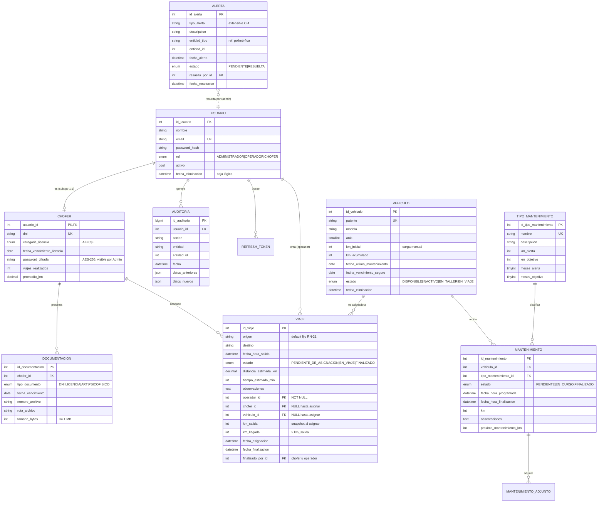

# Etapa 2 (parte 1) — DER Definitivo
## Sistema de Gestión Logística y Flota (TP DSW)

**Fuente:** documento funcional consolidado (2026-07-13). Construido desde cero a partir del documento; no se reutiliza el DER anterior.
**Estado:** propuesta para validación. El modelo relacional y el script SQL se generan tras la aprobación de este DER.

---

## 1. Diagrama entidad-relación

Entidades sin relaciones: `CONFIGURACION` (fila única con datos de empresa y preferencias).

---

## 2. Diccionario de entidades

### 2.1 usuario

| Atributo | Tipo | Restricciones | Descripción |
|:-|:-|:-|:-|
| id_usuario | INT UNSIGNED | **PK**, AUTO_INCREMENT | — |
| nombre | VARCHAR(100) | NOT NULL | Nombre completo |
| email | VARCHAR(150) | NOT NULL, **UNIQUE** | Dato de acceso al login |
| password_hash | VARCHAR(60) | NOT NULL | bcrypt (RNF) |
| rol | ENUM('ADMINISTRADOR','OPERADOR','CHOFER') | NOT NULL | Discriminador del subtipo |
| activo | BOOLEAN | NOT NULL, DEFAULT TRUE | Activar/desactivar (Admin) |
| fecha_eliminacion | DATETIME | NULL | Baja lógica (RN-20); NULL = vigente |
| created_at / updated_at | DATETIME | NOT NULL | Trazabilidad |

### 2.2 chofer (subtipo 1:1 de usuario)

| Atributo | Tipo | Restricciones | Descripción |
|:-|:-|:-|:-|
| usuario_id | INT UNSIGNED | **PK** y **FK → usuario** | PK compartida: garantiza el 1:1 |
| dni | VARCHAR(10) | NOT NULL, **UNIQUE** | — |
| categoria_licencia | ENUM('A','B','C','E') | NOT NULL | Atributo del chofer (C-2) |
| fecha_vencimiento_licencia | DATE | NOT NULL | Base de RN-1, RN-19 y alerta A-12 |
| password_cifrada | VARCHAR(255) | NOT NULL | AES-256-GCM, clave en variable de entorno; visible/modificable solo por Admin (A-9, decisión aprobada) |
| viajes_realizados | INT UNSIGNED | NOT NULL, DEFAULT 0 | Denormalizado; se actualiza en la transacción de cierre de viaje (RN-11) |
| promedio_km | DECIMAL(10,2) | NOT NULL, DEFAULT 0 | Ídem |

**No se persiste "Disponible":** es un estado derivado (licencia vigente + sin viaje activo — RN-19); se calcula por consulta, evitando inconsistencias.

### 2.3 documentacion

| Atributo | Tipo | Restricciones | Descripción |
|:-|:-|:-|:-|
| id_documentacion | INT UNSIGNED | **PK**, AUTO_INCREMENT | — |
| chofer_id | INT UNSIGNED | NOT NULL, **FK → chofer** | — |
| tipo_documento | ENUM('DNI','LICENCIA','ART','PSICOFISICO') | NOT NULL | LICENCIA = copia digitalizada; la vigencia legal vive en `chofer` (C-2) |
| fecha_vencimiento | DATE | NOT NULL | Dispara alertas 2 semanas antes (RN-17) |
| nombre_archivo | VARCHAR(255) | NOT NULL | Nombre original |
| ruta_archivo | VARCHAR(500) | NOT NULL | Ruta en filesystem del servidor |
| mime_type | VARCHAR(50) | NOT NULL | Solo PDF/JPG/PNG (validado en app) |
| tamano_bytes | INT UNSIGNED | NOT NULL, **CHECK ≤ 1.048.576** | F-9: máx. 1 MB |
| fecha_subida | DATETIME | NOT NULL | — |
| fecha_eliminacion | DATETIME | NULL | Baja lógica |

### 2.4 vehiculo

| Atributo | Tipo | Restricciones | Descripción |
|:-|:-|:-|:-|
| id_vehiculo | INT UNSIGNED | **PK**, AUTO_INCREMENT | — |
| patente | VARCHAR(10) | NOT NULL, **UNIQUE** | — |
| modelo | VARCHAR(100) | NOT NULL | — |
| anio | SMALLINT UNSIGNED | NOT NULL | — |
| km_inicial | INT UNSIGNED | NOT NULL | Carga manual al alta (A-13) |
| km_acumulado | INT UNSIGNED | NOT NULL, **CHECK ≥ km_inicial** | Actualizado al cerrar viajes (RN-11) |
| fecha_ultimo_mantenimiento | DATE | NULL | Actualizada al finalizar mantenimiento |
| fecha_vencimiento_seguro | DATE | NULL | **Propuesta:** la alerta "seguro vencido" (C-4) es imposible sin este dato |
| estado | ENUM('DISPONIBLE','INACTIVO','EN_TALLER','EN_VIAJE') | NOT NULL, DEFAULT 'DISPONIBLE' | C-1; INACTIVO solo por Admin (RN-16, en service) |
| fecha_eliminacion | DATETIME | NULL | Baja lógica (RN-20) |
| created_at / updated_at | DATETIME | NOT NULL | — |

### 2.5 tipo_mantenimiento

| Atributo | Tipo | Restricciones | Descripción |
|:-|:-|:-|:-|
| id_tipo_mantenimiento | INT UNSIGNED | **PK**, AUTO_INCREMENT | — |
| nombre | VARCHAR(50) | NOT NULL, **UNIQUE** | Seeds: "Preventivo menor", "Preventivo mayor" (C-7) |
| descripcion | VARCHAR(255) | NOT NULL | Ej.: "cambio de aceite, filtros y engrase" |
| km_alerta | INT UNSIGNED | NOT NULL | Menor: 10.000; Mayor: 80.000 |
| km_objetivo | INT UNSIGNED | NOT NULL, **CHECK ≥ km_alerta** | Menor: 20.000; Mayor: 120.000 |
| meses_alerta | TINYINT UNSIGNED | NULL | **Propuesta:** C-7 define umbrales temporales ("3 a 6 meses", "una vez por año"); sin estos campos la regla temporal no es implementable. Menor: 3; Mayor: 12 |
| meses_objetivo | TINYINT UNSIGNED | NULL, CHECK ≥ meses_alerta | Menor: 6; Mayor: 12 |

### 2.6 mantenimiento

| Atributo | Tipo | Restricciones | Descripción |
|:-|:-|:-|:-|
| id_mantenimiento | INT UNSIGNED | **PK**, AUTO_INCREMENT | Es el "nro" del DER funcional |
| vehiculo_id | INT UNSIGNED | NOT NULL, **FK → vehiculo** | — |
| tipo_mantenimiento_id | INT UNSIGNED | NOT NULL, **FK → tipo_mantenimiento** | — |
| estado | ENUM('PENDIENTE','EN_CURSO','FINALIZADO') | NOT NULL, DEFAULT 'PENDIENTE' | C-6; Programados = PENDIENTE + EN_CURSO, Historial = FINALIZADO |
| fecha_hora_programada | DATETIME | NOT NULL | — |
| fecha_hora_finalizacion | DATETIME | NULL, **CHECK: NOT NULL si estado = FINALIZADO** | — |
| km | INT UNSIGNED | NOT NULL | Kilometraje del vehículo al registrar |
| observaciones | TEXT | NULL | — |
| proximo_mantenimiento_km | INT UNSIGNED | NULL | Sugerido |
| created_at / updated_at | DATETIME | NOT NULL | — |

### 2.7 mantenimiento_adjunto

Tabla propia porque un mantenimiento admite **múltiples** comprobantes (mockup P-OP-5).

| Atributo | Tipo | Restricciones |
|:-|:-|:-|
| id_adjunto | INT UNSIGNED | **PK**, AUTO_INCREMENT |
| mantenimiento_id | INT UNSIGNED | NOT NULL, **FK → mantenimiento** |
| nombre_archivo / ruta_archivo / mime_type | VARCHAR | NOT NULL |
| tamano_bytes | INT UNSIGNED | NOT NULL, **CHECK ≤ 1.048.576** (F-9) |
| fecha_subida | DATETIME | NOT NULL |

### 2.8 viaje

| Atributo | Tipo | Restricciones | Descripción |
|:-|:-|:-|:-|
| id_viaje | INT UNSIGNED | **PK**, AUTO_INCREMENT | N° visible `VJ-00045` = formato de presentación del id (no se persiste) |
| origen | VARCHAR(120) | NOT NULL, DEFAULT 'Ciudad Industria, Autopista Córdoba - Rosario, Rosario, Santa Fe' | RN-21: fijo hoy; columna con DEFAULT para no romper el modelo si mañana se flexibiliza |
| destino | VARCHAR(120) | NOT NULL | — |
| fecha_hora_salida | DATETIME | NOT NULL | — |
| estado | ENUM('PENDIENTE_DE_ASIGNACION','EN_VIAJE','FINALIZADO') | NOT NULL, DEFAULT 'PENDIENTE_DE_ASIGNACION' | A-2; sin CANCELADO (RN-14) |
| distancia_estimada_km | DECIMAL(8,2) | NULL | De la ruta generada (Google Maps) |
| tiempo_estimado_min | INT UNSIGNED | NULL | Ídem |
| observaciones | TEXT | NULL | — |
| operador_id | INT UNSIGNED | NOT NULL, **FK → usuario** | Creador; siempre existe |
| chofer_id | INT UNSIGNED | NULL, **FK → chofer** | NULL mientras Pendiente de asignación (A-1) |
| vehiculo_id | INT UNSIGNED | NULL, **FK → vehiculo** | Ídem; asignado automáticamente (RN-12) |
| km_salida | INT UNSIGNED | NULL | Snapshot del km del vehículo al asignar; congela el dato para validar RN-5 aunque el vehículo cambie |
| km_llegada | INT UNSIGNED | NULL, **CHECK > km_salida** | RN-5 |
| fecha_asignacion | DATETIME | NULL | — |
| fecha_finalizacion | DATETIME | NULL | — |
| finalizado_por_id | INT UNSIGNED | NULL, **FK → usuario** | Chofer u operador, idéntico efecto (A-3); trazabilidad |
| created_at / updated_at | DATETIME | NOT NULL | — |

**CHECKs de consistencia de estado:** `estado='EN_VIAJE' ⇒ chofer_id, vehiculo_id, km_salida NOT NULL`; `estado='FINALIZADO' ⇒ km_llegada, fecha_finalizacion NOT NULL`.

### 2.9 alerta

| Atributo | Tipo | Restricciones | Descripción |
|:-|:-|:-|:-|
| id_alerta | INT UNSIGNED | **PK**, AUTO_INCREMENT | — |
| tipo_alerta | VARCHAR(50) | NOT NULL | **VARCHAR y no ENUM**: C-4 exige taxonomía extensible sin ALTER TABLE. Valores iniciales: LICENCIA_POR_VENCER, LICENCIA_VENCIDA, DOCUMENTACION_POR_VENCER, DOCUMENTACION_VENCIDA, MANTENIMIENTO_PENDIENTE, KM_MANTENIMIENTO_SUPERADO, SEGURO_VENCIDO, VEHICULO_INACTIVO |
| descripcion | VARCHAR(255) | NOT NULL | Texto visible en la UI |
| entidad_tipo | VARCHAR(30) | NOT NULL | Referencia polimórfica: 'CHOFER', 'VEHICULO', 'DOCUMENTACION', 'MANTENIMIENTO' |
| entidad_id | INT UNSIGNED | NOT NULL | Id dentro de la entidad afectada |
| fecha_alerta | DATETIME | NOT NULL | — |
| estado | ENUM('PENDIENTE','RESUELTA') | NOT NULL, DEFAULT 'PENDIENTE' | — |
| resuelta_por_id | INT UNSIGNED | NULL, **FK → usuario** | Admin que la resolvió |
| fecha_resolucion | DATETIME | NULL | — |

La deduplicación (no crear dos alertas pendientes idénticas) se resuelve en el service, no con UNIQUE: MySQL no soporta índices parciales por estado.

### 2.10 auditoria

| Atributo | Tipo | Restricciones | Descripción |
|:-|:-|:-|:-|
| id_auditoria | BIGINT UNSIGNED | **PK**, AUTO_INCREMENT | BIGINT: tabla de crecimiento indefinido |
| usuario_id | INT UNSIGNED | NOT NULL, **FK → usuario** | Quién |
| accion | VARCHAR(30) | NOT NULL | CREAR, EDITAR, ELIMINAR, ASIGNAR, FINALIZAR, ACTIVAR, DESACTIVAR… |
| entidad | VARCHAR(30) | NOT NULL | 'VIAJE', 'VEHICULO', … |
| entidad_id | INT UNSIGNED | NULL | — |
| fecha | DATETIME(3) | NOT NULL | Precisión de milisegundos para ordenar eventos de una misma transacción |
| datos_anteriores / datos_nuevos | JSON | NULL | RN-7; JSON nativo de MySQL: estructura variable por entidad sin proliferar columnas |

Solo INSERT y SELECT (A-5): sin UPDATE/DELETE desde la aplicación.

### 2.11 configuracion

Fila única: id TINYINT PK con CHECK (id = 1); nombre_empresa, cuit, direccion, telefono, email (VARCHAR NOT NULL), zona_horaria, idioma, formato_fecha (VARCHAR NOT NULL con DEFAULTs). Evita un sistema clave-valor innecesario para 8 campos conocidos.

### 2.12 refresh_token

Soporte del RNF de autenticación (revocación de sesiones): id PK, usuario_id FK → usuario, token_hash CHAR(64) UNIQUE (SHA-256 del token; nunca el token en claro), fecha_expiracion DATETIME NOT NULL, revocado BOOLEAN DEFAULT FALSE, created_at.

---

## 3. Relaciones y cardinalidades

| Relación | Cardinalidad | Implementación | Regla asociada |
|:-|:-|:-|:-|
| usuario — chofer | 1 : 0..1 (especialización) | PK compartida (`chofer.usuario_id` PK+FK) | Solo rol CHOFER tiene fila en `chofer`; Operador y Administrador no tienen atributos propios → sin tablas (C-2) |
| chofer — documentacion | 1 : 0..N | FK `documentacion.chofer_id` | F-4 |
| chofer — viaje | 0..1 : 0..N | FK nullable `viaje.chofer_id` | NULL hasta asignación (A-1); sin relación fija chofer-vehículo (RN-18): la combinación se define viaje a viaje |
| vehiculo — viaje | 0..1 : 0..N | FK nullable `viaje.vehiculo_id` | Asignación automática (RN-12) |
| usuario(operador) — viaje | 1 : 0..N | FK `viaje.operador_id` NOT NULL | Todo viaje tiene creador |
| usuario — viaje (finalizado_por) | 0..1 : 0..N | FK nullable | A-3 |
| vehiculo — mantenimiento | 1 : 0..N | FK `mantenimiento.vehiculo_id` | — |
| tipo_mantenimiento — mantenimiento | 1 : 0..N | FK `mantenimiento.tipo_mantenimiento_id` | RN-13 |
| mantenimiento — mantenimiento_adjunto | 1 : 0..N | FK | Múltiples comprobantes |
| usuario — auditoria | 1 : 0..N | FK `auditoria.usuario_id` | RN-7 |
| usuario — refresh_token | 1 : 0..N | FK | Multi-dispositivo |
| alerta — entidad afectada | polimórfica | `entidad_tipo` + `entidad_id` (sin FK física) | Una alerta puede apuntar a 4 entidades distintas; una FK por entidad generaría columnas mutuamente excluyentes. Integridad garantizada en el service |

**Reglas que viven en la capa de servicios (no en SQL), por diseño:** RN-6 (solapamiento de viajes: requiere comparación entre filas), RN-16 (Inactivo solo Admin: es un permiso), RN-12 (selección automática), transiciones de estado válidas, deduplicación de alertas. El SQL garantiza integridad estructural; el service, las reglas de negocio — coherente con la arquitectura de Etapa 1.

---

## 4. Decisiones de diseño (resumen)

1. **Especialización usuario/chofer con PK compartida** — 1:1 real a nivel BD, sin joins polimórficos; los otros subtipos no tienen atributos → el rol ENUM basta.
2. **Estados como ENUM** (vehículo, viaje, mantenimiento, alerta) — dominio cerrado por el documento funcional; el ENUM lo hace imposible de violar desde cualquier cliente SQL. `tipo_alerta` es la excepción deliberada (VARCHAR) por C-4.
3. **Archivos en filesystem, metadata en BD** — blobs en MySQL inflan la BD y complican backups (F-7); con 1 MB máx. y ruta en BD el servicio de archivos queda intercambiable (disco → S3) sin migrar datos.
4. **Snapshots en viaje (`km_salida`, `origen`)** — congelan los datos con los que se validó/creó el viaje; los históricos no cambian si el vehículo o la configuración cambian después.
5. **Denormalización acotada (`viajes_realizados`, `promedio_km`)** — atributos exigidos por el documento; se actualizan en la misma transacción del cierre (RN-11), nunca por procesos externos.
6. **Baja lógica con `fecha_eliminacion`** (RN-20) — más informativa que un boolean (cuándo), y distingue "desactivado" (activo=false, reversible, visible) de "eliminado" (oculto).

## 5. Propuestas que exceden el documento (requieren tu OK, incluidas en el diseño)

| # | Propuesta | Justificación |
|:-|:-|:-|
| P-A | `vehiculo.fecha_vencimiento_seguro` | La alerta SEGURO_VENCIDO (C-4, mockup P-AD-4) es inimplementable sin la fecha |
| P-B | `tipo_mantenimiento.meses_alerta/meses_objetivo` | C-7 define umbrales temporales ("cada 3 a 6 meses", "una vez por año") además de km |
| P-C | Tabla `refresh_token` | RNF JWT + refresh: sin persistencia no hay revocación de sesión |
| P-D | Tabla `mantenimiento_adjunto` | El mockup permite múltiples comprobantes; 1:N requiere tabla propia |

---

**Próximo paso (tras tu validación de este DER):** Etapa 2, parte 2 — modelo relacional definitivo + script SQL de creación (`schema.sql`) con claves, restricciones CHECK, índices justificados (búsquedas por estado, vencimientos, auditoría) y seeds mínimos de `tipo_mantenimiento` y `configuracion`.
