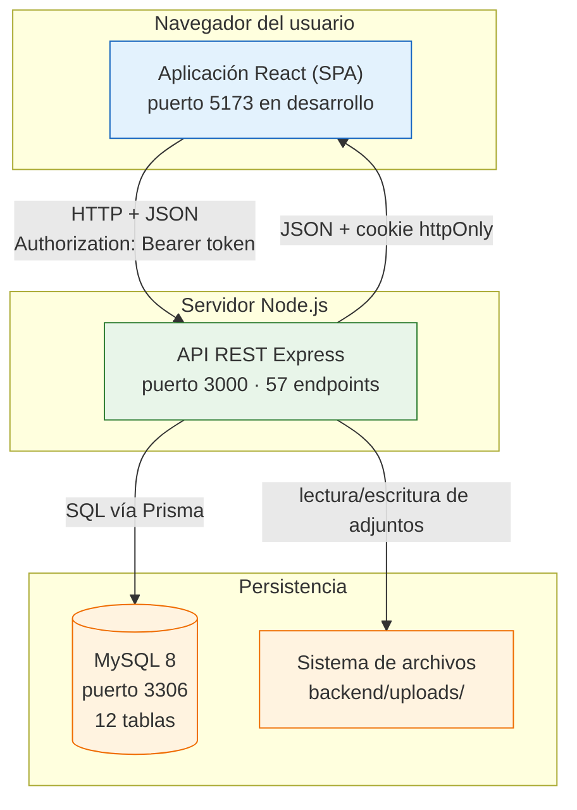

# Manual Técnico Completo
## Sistema de Gestión Logística y de Flota (TP DSW)

> **Versión del manual:** 2.0 — **completo**
> **Fecha:** 2026-08-06
> **Código documentado:** rama actual del repositorio `DSWTP`
> **Alcance:** backend (Node.js · Express · Prisma · MySQL), frontend (React · Vite · MUI) y base de datos, explicados línea por línea.

---

## 0.1 · Para quién es este documento

Este manual está escrito para una persona que:

- sabe qué es una computadora y qué es un programa;
- tiene nociones básicas de programación (sabe qué es una variable, un `if`, un bucle, una función);
- **no** necesita saber nada de TypeScript, React, Node.js, Express, Prisma, SQL, HTTP, JWT ni de ninguna otra tecnología del proyecto.

Todo lo demás se explica desde cero, en el orden en que hace falta. Cada término técnico se define **antes** de usarse por primera vez. Si en algún punto se usa una palabra sin haberla explicado antes, eso es un error del manual y debe corregirse.

El objetivo declarado es fuerte: al terminar de leer este documento, el lector debe poder **reconstruir el sistema entero desde cero** sin mirar el código original.

> **§26.5 verifica ese objetivo, sin autoindulgencia** — incluyendo lo que el manual **no** cubre (despliegue, operación, medición de rendimiento).

---

## 0.2 · Cómo leer este manual

**Lectura lineal** (recomendada la primera vez). Del capítulo 1 al 26 en orden. Cada capítulo asume solamente lo explicado en los anteriores.

**Lectura por capas.**

- *Solo base de datos*: 1, 3, 4
- *Solo backend*: 1, 2, 3, 4, 5, 6, 7, y luego los módulos 8–17
- *Solo frontend*: 1, 2, 18, 19, 20, 21, 22A, 22B, 22C

**Lectura por caso de uso.** Si lo que se quiere entender es «qué pasa exactamente cuando un operador asigna un viaje», ir directo al **capítulo 23**, que recorre seis casos completos del clic al píxel con referencias a archivo y línea.

**Lectura para decidir.** Si hay que decidir qué arreglar y con qué prioridad, **el capítulo 25 se lee primero**: consolida los 208 hallazgos en 10 causas raíz y un plan en cuatro fases.

---

## 0.3 · Estructura de cada capítulo

Del capítulo 08 en adelante, todos siguen el mismo esqueleto de diez secciones:

| # | Sección | Qué contiene |
|:-:|:--|:--|
| 1 | **Introducción** | Qué se va a explicar y por qué importa dentro del sistema |
| 2 | **Conceptos previos** | Todo lo necesario para entender el capítulo, desde cero |
| 3 | **Explicación detallada** | El tema a fondo, con su lugar en la arquitectura |
| 4 | **Explicación línea por línea** | El código real, numerado, explicado por línea o bloque atómico |
| 5 | **Flujo interno** | Qué ocurre en ejecución, paso a paso, en memoria y en la red |
| 6 | **Ejemplos** | Datos reales, llamadas reales, respuestas reales, errores reales |
| 7 | **Diagramas** | Mermaid: secuencia, clases, componentes, ER, flujo, estados |
| 8 | **Resumen** + tabla de hallazgos | Lo esencial, más los hallazgos del capítulo con su gravedad |
| 9 | **Preguntas de repaso** | Con respuestas desplegables |
| 10 | **Ejercicios propuestos** | En tres niveles: comprensión, corrección, diseño |

⚠️ **Los capítulos 02 a 07 se escribieron antes de que el formato se estabilizara** y no tienen tabla de hallazgos consolidada al final. Señalan sus problemas en el cuerpo del texto (~197 marcas 🔴/⚠️) pero no los tabulan. Es un hueco declarado en §25.2.2, y cerrarlo es el ejercicio §25.3.6.

---

## 0.4 · Convenciones tipográficas

| Convención | Significado |
|:--|:--|
| `código en línea` | Nombre de archivo, variable, función, comando o fragmento literal |
| **negrita** | Primera aparición de un término que se está definiendo |
| *cursiva* | Énfasis, o término en otro idioma |
| `backend/src/app.ts:31` | Referencia a archivo y línea concretos del repositorio |
| 🔴 | Hallazgo de gravedad alta, o consecuencia grave si se cambia algo |
| ⚠️ | Hallazgo de gravedad media o baja |
| ✅ | Decisión destacada, que conviene **proteger de un refactor** |
| 💡 | Nota de diseño: por qué se eligió esta solución y no otra |
| ⚙️ | Detalle de funcionamiento interno de una tecnología |

Los bloques de código del repositorio se muestran **sin modificar**. Si aparece un fragmento inventado para explicar algo, se aclara explícitamente.

---

## 0.5 · Índice general

### Parte I — Fundamentos

| Cap. | Archivo | Contenido | Líneas |
|:-:|:--|:--|--:|
| 1 | [`01-conceptos-previos.md`](01-conceptos-previos.md) | Proceso, servidor, cliente-servidor. IP, puertos, DNS. HTTP paso a paso. REST. JSON. JavaScript: motor, event loop, tipos, cierres, asincronía, módulos. TypeScript: tipos, interfaces, genéricos, estrechamiento, cada opción de `tsconfig`. Bases de datos relacionales, índices B+, transacciones y ACID | 1.276 |
| 2 | [`02-arquitectura.md`](02-arquitectura.md) | Acoplamiento y cohesión. Las 5 capas y sus prohibiciones. Módulos verticales. Comparación con MVC, MVVM, Clean, Hexagonal, DDD y microservicios. SOLID contra el código real. Estructura de carpetas archivo por archivo | 1.196 |

### Parte II — Datos

| Cap. | Archivo | Contenido | Líneas |
|:-:|:--|:--|--:|
| 3 | [`03-base-de-datos.md`](03-base-de-datos.md) | Modelos conceptual, lógico y físico. Diagrama ER. Tres máquinas de estados. Las **12 tablas** columna por columna: tipo, nulabilidad, defecto, por qué existe, qué pasa si desaparece. 12 FKs con sus políticas, 20 índices. `schema.prisma` línea por línea | 1.450 |
| 4 | [`04-prisma-migraciones-seed.md`](04-prisma-migraciones-seed.md) | Qué es un ORM. Active Record vs Data Mapper. El problema N+1. Prisma 7 sin motor Rust. El cliente generado (22.748 líneas) analizado conceptualmente. `migration.sql` y `seed.ts` línea por línea | 1.807 |

### Parte III — Backend

| Cap. | Archivo | Contenido | Líneas |
|:-:|:--|:--|--:|
| 5 | [`05-backend-bootstrap.md`](05-backend-bootstrap.md) | Qué es Express y cómo encadena middlewares. `env.ts` (fallo rápido), `constants.ts`, `app.ts` (el orden es la semántica), `server.ts` (apagado ordenado) | 1.677 |
| 6 | [`06-backend-shared.md`](06-backend-shared.md) | Jerarquía `AppError`. Esquemas compartidos. Aumento de módulo. `crypto.ts` (AES-256-GCM, SHA-256). `dates.ts` y el problema UTC. `files.ts`. El mailer | 1.892 |
| 7 | [`07-backend-middlewares.md`](07-backend-middlewares.md) | `authenticate` (anatomía del JWT), `authorize` (fábrica + cierre), `validate` (Zod y la asignación masiva), `error-handler` (6 casos), `rate-limiter`, `upload` | 1.449 |
| 8 | [`08-modulo-auth.md`](08-modulo-auth.md) | Dónde guardar los tokens. Estrategia de doble token. Las 5 opciones de la cookie. Login, refresh, logout y `me`, línea por línea | 1.398 |
| 9 | [`09-modulo-users.md`](09-modulo-users.md) | El módulo CRUD de referencia. `assignableRoles`. Transacciones. La lápida del email. La carrera de los administradores | 1.484 |
| 10 | [`10-modulo-vehicles.md`](10-modulo-vehicles.md) | Máquina de estados. Estado compartido entre tres módulos. Campos derivados. Inmutabilidad por acumulación | 1.178 |
| 11 | [`11-modulo-drivers-documents.md`](11-modulo-drivers-documents.md) | Creación atómica en dos tablas. `assertCanAccess`. Contraseñas cifradas reversibles (A-9). Compensación al subir archivos | 1.332 |
| 12 | [`12-modulo-trips.md`](12-modulo-trips.md) | El patrón bloquear-releer-validar-escribir. `FOR UPDATE SKIP LOCKED`. Las 7 validaciones de la asignación. Los efectos en cascada de finalizar | 1.321 |
| 13 | [`13-modulo-maintenance.md`](13-modulo-maintenance.md) | `superRefine` y la validación cruzada. `PUT` con semántica de conjunto completo. Adjuntos de solo añadir | 1.028 |
| 14 | [`14-modulo-alerts.md`](14-modulo-alerts.md) | El patrón de reconciliación. El cerrojo consultivo `GET_LOCK`. Los 8 tipos de alerta. El escáner | 1.033 |
| 15 | [`15-modulo-audit-logs.md`](15-modulo-audit-logs.md) | Auditoría vs registro. Inmutabilidad por ausencia. `sanitize()` y su límite. Dónde vive el tipo `DbClient` | 815 |
| 16 | [`16-modulo-dashboard-reports.md`](16-modulo-dashboard-reports.md) | Agregar donde están los datos. Series temporales presembradas. El período sin tope | 837 |
| 17 | [`17-modulo-settings.md`](17-modulo-settings.md) | Configuración de despliegue vs de negocio. Fila única. `PUT` con semántica de `PATCH` | 609 |

### Parte IV — Frontend

| Cap. | Archivo | Contenido | Líneas |
|:-:|:--|:--|--:|
| 18 | [`18-frontend-bootstrap.md`](18-frontend-bootstrap.md) | MPA vs SPA. Vite en desarrollo y en construcción. React desde cero: JSX, DOM virtual, reconciliación, claves, reglas de los hooks, `StrictMode`. `index.html`, `main.tsx`, `App.tsx`, `theme.ts` | 1.313 |
| 19 | [`19-frontend-api.md`](19-frontend-api.md) | Por qué una capa de API. Interceptores. El refresco transparente y sus tres protecciones. El contrato duplicado. `blob.ts`, `datetime.ts` | 1.068 |
| 20 | [`20-frontend-auth-estado.md`](20-frontend-auth-estado.md) | Zustand vs Redux vs Context. La doble interfaz del store. Los guards son ergonomía, no seguridad. `LoginPage` | 1.078 |
| 21 | [`21-frontend-componentes.md`](21-frontend-componentes.md) | Restricciones de reutilización. Componentes genéricos. `DataTable`. `usePaginatedList` y su trampa. `AppSidebarLayout`, `RouteMap` | 1.159 |
| 22A | [`22a-frontend-pantallas-abm.md`](22a-frontend-pantallas-abm.md) | **El patrón de listado explicado una vez**, con `VehiculosPage` como caso canónico. El bug de las fechas. Usuarios, choferes y sus cuatro diálogos | 1.137 |
| 22B | [`22b-frontend-viajes-mantenimiento.md`](22b-frontend-viajes-mantenimiento.md) | El diálogo como unidad de transacción. `datetime-local` bien resuelto. La máquina de estados dibujada con iconos. Los seis diálogos línea por línea | 2.276 |
| 22C | [`22c-frontend-chofer-tableros.md`](22c-frontend-chofer-tableros.md) | La pantalla de recurso único. Alcance forzado por el servidor. Las tres pantallas del chofer. Tableros, informes, auditoría y configuración | 1.777 |

### Parte V — Integración y cierre

| Cap. | Archivo | Contenido | Líneas |
|:-:|:--|:--|--:|
| 23 | [`23-flujos-end-to-end.md`](23-flujos-end-to-end.md) | **Seis casos de uso completos**, cinco capas, archivo:línea verificados: iniciar sesión · crear y asignar un viaje · finalizarlo · el token que caduca a mitad · subir un documento · evaluar las alertas | 1.536 |
| 24 | [`24-dependencias.md`](24-dependencias.md) | **Las 50 dependencias**, una por una: qué resuelve, cómo funciona por dentro, dónde se usa, alternativas, qué pasaría sin ella. Y las cuatro instaladas sin usar | 1.325 |
| 25 | [`25-hallazgos-plan-de-accion.md`](25-hallazgos-plan-de-accion.md) | **208 hallazgos → 10 causas raíz → plan en 4 fases** con estimaciones. Y qué **no** hay que hacer | 745 |
| 26 | [`26-ejercicios-y-cierre.md`](26-ejercicios-y-cierre.md) | Seis rutas de aprendizaje. El proyecto final. Las diez preguntas que resumen el sistema. La prueba del manual y sus huecos declarados | — |

---

## 0.6 · Qué es el sistema, en un párrafo

Una aplicación web para una empresa de transporte. Administra la **flota** de vehículos, el **personal** de choferes con su documentación obligatoria, la **planificación y ejecución de viajes**, y el **mantenimiento** de los vehículos. Genera **alertas automáticas** cuando algo está por vencer o ya venció, registra **auditoría** inmutable de cada acción, y expone **informes e indicadores**. Tres roles —Administrador, Operador y Chofer— con interfaces distintas.

Técnicamente son **dos aplicaciones separadas** en el mismo repositorio: un servidor que expone una API REST y una aplicación de navegador que la consume. Entre ellas viaja JSON sobre HTTP. Detrás del servidor hay MySQL.

---

## 0.7 · Mapa mental del sistema

**Cómo se lee.** Cada caja es un proceso o un almacén independiente. Las flechas indican quién **inicia** la comunicación. El navegador siempre inicia: el servidor nunca llama al navegador. No hay WebSockets ni notificaciones — y esa es la mayor carencia funcional del sistema (§22C, hallazgo 6): **un chofer no se entera de que le asignaron un viaje** salvo recargando.

---

## 0.8 · Números del proyecto

| Métrica | Valor |
|:--|--:|
| **Líneas escritas a mano** | **12.166** |
| — backend `src/` (88 archivos) | 5.887 |
| — backend `prisma/` (esquema + seed + migración) | 915 |
| — frontend `src/` (68 archivos) | 5.364 |
| Líneas de cliente Prisma autogenerado | 22.748 |
| Módulos del backend | 13 |
| Endpoints REST | 57 |
| Tablas en la base de datos | 12 |
| Pantallas y diálogos en `pages/` | 29 |
| Componentes reutilizables | 8 |
| Dependencias declaradas | **50** (backend 28 · frontend 22) |
| Casos de prueba automatizados | **28** en 8 archivos |

💡 **Sobre el tamaño.** 12.200 líneas es un proyecto *chico* en términos industriales, pero suficientemente grande para que nadie lo tenga entero en la cabeza. De ahí el valor de este manual: no es un resumen, es el mapa completo.

---

## 0.9 · Números del manual

| | |
|:--|--:|
| Capítulos | **27** (00 a 26) |
| Líneas | **35.421** |
| Palabras | ≈ **284.000** |
| Diagramas Mermaid | **128** |
| Tablas | **441** |
| Preguntas de repaso desplegables | **66** |
| Ejercicios propuestos | **> 200** |

**Proporción:** ≈ 35.400 líneas de manual para ≈ 12.200 de código. **Casi tres a uno.**

---

## 0.10 · Hallazgos: el resumen

El manual no solo describe el código: lo audita. **Cada afirmación se verificó contra el código antes de escribirse.**

| Gravedad | Cant. |
|:--|--:|
| 🔴 **Alta** | **49** |
| ⚠️ **Media** | **75** |
| ⚠️ **Baja** | **84** |
| **Total** | **208** |
| ✅ **Positivos** (decisiones a proteger) | 28 |

⚠️ Los capítulos 02-07 no están tabulados: **el censo es un piso, no un techo** (§25.2.2).

### Los cinco hallazgos que más importan

| | Hallazgo | Coste de arreglarlo |
|:-:|:--|:--|
| 1 | **La rotación de tokens no detecta el robo**, aunque el comentario afirma que sí (§8, §23.3.2) | 6 líneas |
| 2 | **Un vehículo sin seguro circula sin señal** — hueco entre cuatro archivos (§12, §14, §22A, §23.4.3) | 1 jornada |
| 3 | **Tres cierres obsoletos** que la regla `exhaustive-deps` detecta — y **ESLint no está instalado** (§22A, §22B, §22C, §24) | 3 horas |
| 4 | **Los vencimientos se muestran un día antes** en cuatro sitios — con `dayjs` instalado y sin usar (§22A.4, §24.5.3) | Media jornada |
| 5 | **Operaciones sin salida**: no se puede cancelar un viaje ni un mantenimiento. Un camión averiado bloquea vehículo y chofer permanentemente (§12, §13) | 2 jornadas |

### Las diez causas raíz

Los **49 hallazgos altos son 10 problemas** (§25.3). Y **cuatro de esas diez causas cuestan poco más de una jornada entre todas y cierran catorce hallazgos altos** — incluido el más grave.

👉 **El plan completo, en cuatro fases con estimaciones, está en el [capítulo 25](25-hallazgos-plan-de-accion.md).**

### Lo que el proyecto hace bien

Los 28 positivos no son cortesía: son decisiones que **hay que proteger de un refactor descuidado**. Las cinco que más destacan:

1. **La corrección bajo concurrencia es deliberada.** El patrón bloquear-releer-validar-escribir en cinco sitios, con cuatro mecanismos distintos y comentarios que explican el porqué.
2. **`FOR UPDATE SKIP LOCKED`** — la construcción canónica de cola de trabajo en SQL, en un TP académico.
3. **El refresco transparente** — tres protecciones en una condición, y el usuario no ve nada.
4. **La degradación elegante** — el sistema arranca sin ninguna integración externa configurada.
5. **La arquitectura por capas se respeta sin una sola excepción** en 6.802 líneas de backend.

---

## 0.11 · Estado del manual

| Cap. | Estado | Líneas |
|:-:|:--|--:|
| 00 — Índice | ✅ | 225 |
| 01 — Conceptos previos | ✅ | 1.276 |
| 02 — Arquitectura | ✅ ⚠️ *sin tabla de hallazgos* | 1.196 |
| 03 — Base de datos | ✅ ⚠️ *sin tabla* | 1.450 |
| 04 — Prisma, migraciones y seed | ✅ ⚠️ *sin tabla* | 1.807 |
| 05 — Arranque del backend | ✅ ⚠️ *sin tabla* | 1.677 |
| 06 — La capa compartida | ✅ ⚠️ *sin tabla* | 1.892 |
| 07 — Los middlewares | ✅ ⚠️ *sin tabla* | 1.449 |
| 08 — Módulo auth | ✅ | 1.398 |
| 09 — Módulo users | ✅ | 1.484 |
| 10 — Módulo vehicles | ✅ | 1.178 |
| 11 — Módulo drivers y documentos | ✅ | 1.332 |
| 12 — Módulo trips | ✅ | 1.321 |
| 13 — Módulo maintenance | ✅ | 1.028 |
| 14 — Módulo alerts | ✅ | 1.033 |
| 15 — Módulo audit logs | ✅ | 815 |
| 16 — Módulo dashboard y reports | ✅ | 837 |
| 17 — Módulo settings | ✅ | 609 |
| 18 — Arranque del frontend | ✅ | 1.313 |
| 19 — La capa de API | ✅ | 1.068 |
| 20 — Autenticación y estado | ✅ | 1.078 |
| 21 — Componentes y hooks | ✅ | 1.159 |
| 22A — Pantallas de listado y ABM | ✅ | 1.137 |
| 22B — Viajes y mantenimiento | ✅ | 2.276 |
| 22C — Chofer, tableros y consulta | ✅ | 1.777 |
| 23 — Flujos end-to-end | ✅ | 1.536 |
| 24 — Las 50 dependencias | ✅ | 1.325 |
| 25 — Hallazgos y plan de acción | ✅ | 745 |
| 26 — Ejercicios y cierre | ✅ | — |

**Cobertura de código: 100 %.** Los 88 archivos del backend, los 68 del frontend, el esquema, la migración y el seed. Única excepción declarada: las 22.748 líneas del cliente Prisma generado se explican **conceptualmente** y no línea por línea — decisión acordada al empezar, por tratarse de código generado.

### Correcciones al propio manual

Cuatro afirmaciones se corrigieron tras verificarlas contra el código. **Se dejan visibles a propósito: un informe que nunca se equivoca es un informe que no se verificó.**

| Dónde | Decía | Era |
|:--|:--|:--|
| §9.6.1 | Un comentario de auditoría era «engañoso» | `sanitize()` **sí existe** y sí redacta |
| §22B.4.2 | `AddressAutocomplete` era «el único» con bandera `cancelled` | Hay **cinco** |
| §22B.6.2 | Finalizar hace `accumulated_km + tripKm` | Hace `accumulatedKm = arrivalKm` |
| §22B ej. 3.6 | Vitest estaba «instalado y sin usar» | Se usa: **28 casos** |

---

**Empezar por aquí:** [Capítulo 1 — Conceptos previos](01-conceptos-previos.md)
**Si hay que decidir qué arreglar:** [Capítulo 25 — Hallazgos y plan de acción](25-hallazgos-plan-de-accion.md)
**Si hay que entender un caso de uso:** [Capítulo 23 — Flujos end-to-end](23-flujos-end-to-end.md)
