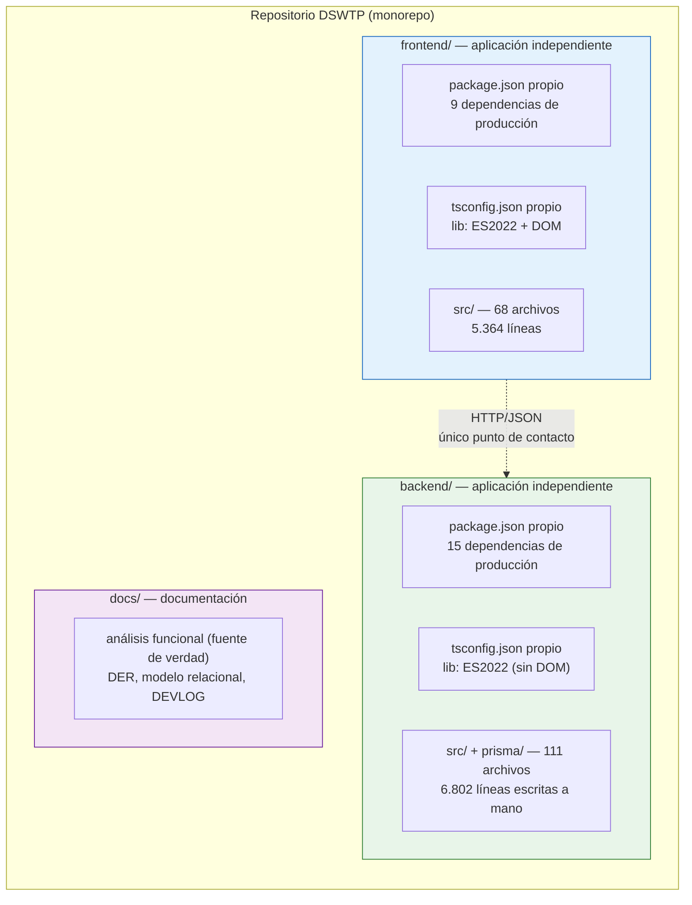
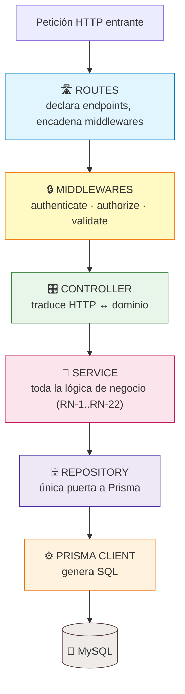
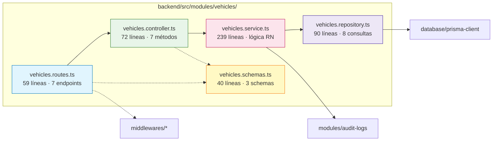
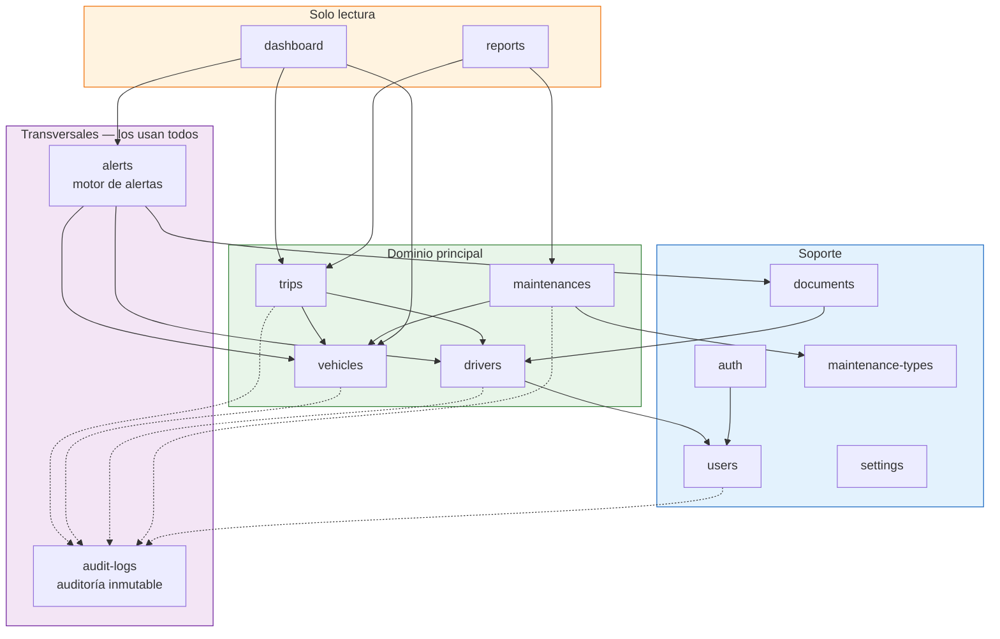
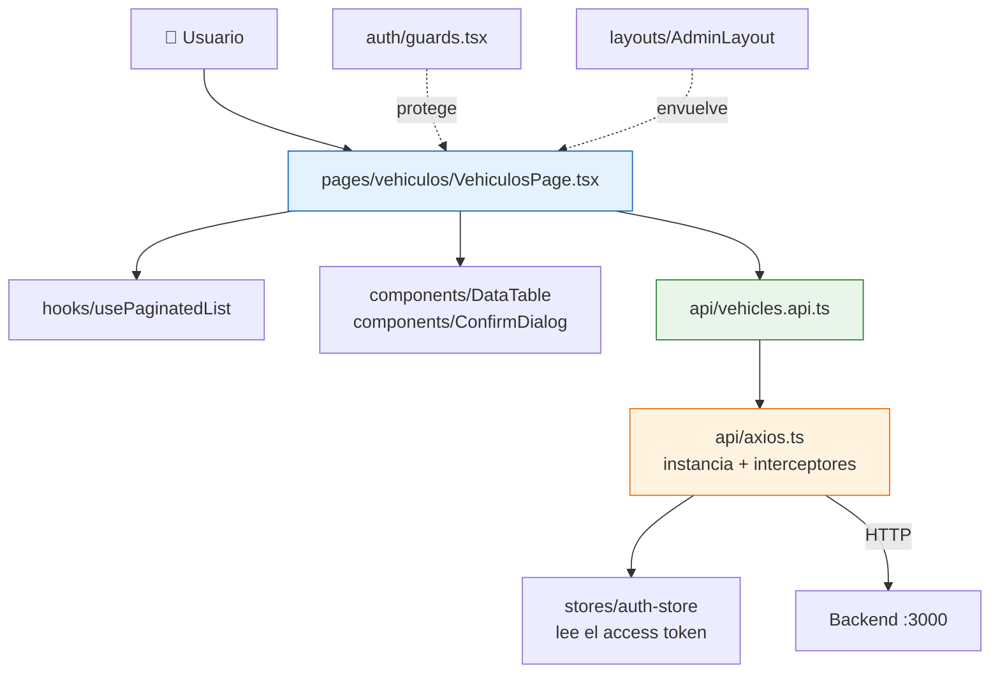
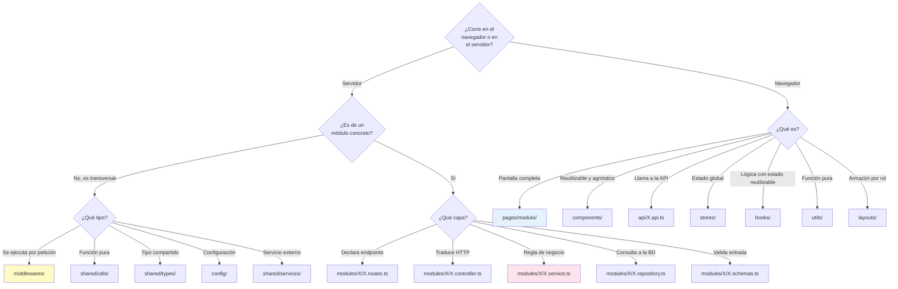
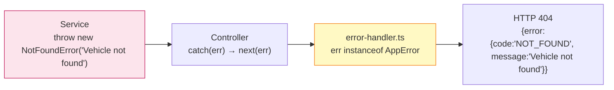
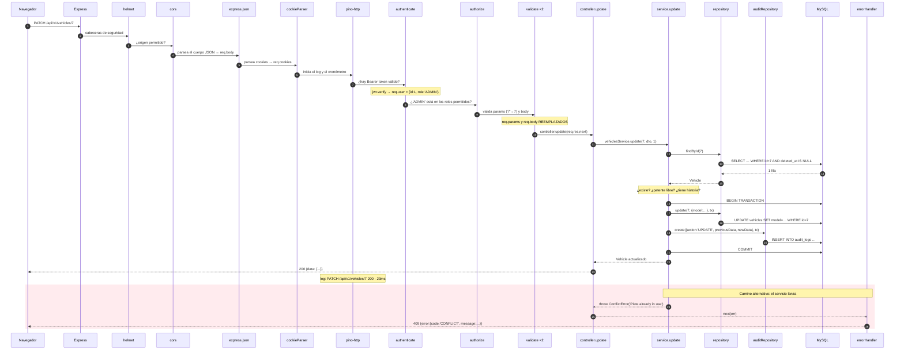
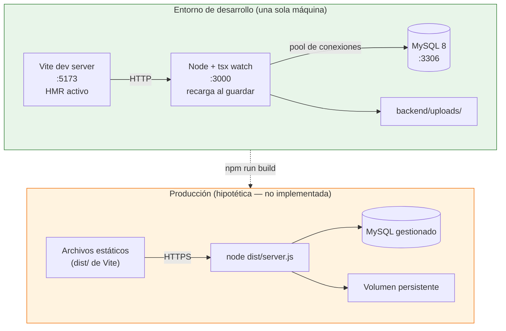
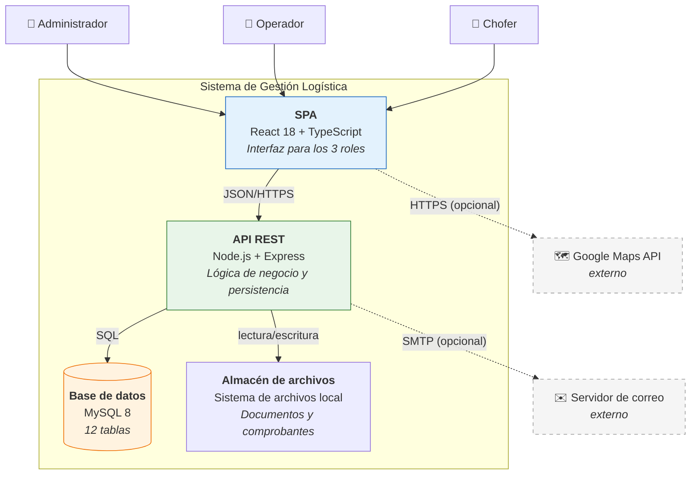

# Capítulo 2 — Arquitectura general

> **Prerrequisitos:** [Capítulo 1](01-conceptos-previos.md) completo.
> **Al terminar este capítulo** el lector podrá abrir cualquier archivo del proyecto y decir, sin leerlo, qué responsabilidad tiene y con quién habla.

---

## 2.1. Introducción

Un proyecto de 12.200 líneas repartidas en 179 archivos no se entiende leyendo archivos al azar. Se entiende cuando se conoce la **regla** que decide dónde va cada cosa.

Este capítulo explica esa regla. Concretamente responde a:

- ¿Por qué el proyecto está partido en `backend/` y `frontend/`?
- ¿Por qué el backend tiene 13 carpetas en `modules/` en vez de carpetas `controllers/`, `services/`, `repositories/`?
- ¿Qué patrón de arquitectura es este, y cómo se compara con MVC, Clean Architecture, Hexagonal y DDD?
- ¿Qué hace exactamente cada una de las cinco capas, y qué tiene **prohibido** hacer?
- ¿Dónde va un archivo nuevo?

---

## 2.2. Conceptos previos

### 2.2.1. Qué es una "arquitectura de software"

La arquitectura de un sistema es el **conjunto de decisiones difíciles de revertir**. No es cómo se llaman las variables (fácil de cambiar); es si hay una base de datos relacional o documental, si el frontend y el backend son un solo programa o dos, si la lógica de negocio vive junto al SQL o separada.

Un buen criterio para reconocer una decisión arquitectónica: *¿cuánto código habría que tocar para revertirla?* Si la respuesta es "unos pocos archivos", no es arquitectura. Si es "medio proyecto", sí lo es.

### 2.2.2. Acoplamiento y cohesión

Estas dos palabras son la métrica con la que se juzga cualquier arquitectura.

**Cohesión** = qué tan relacionadas están las cosas que viven juntas. **Alta cohesión es buena.** Un archivo donde todo trata del mismo tema es fácil de entender.

**Acoplamiento** = qué tanto depende un módulo de otro. **Bajo acoplamiento es bueno.** Si cambiar A obliga a cambiar B, C y D, el acoplamiento es alto y el sistema es frágil.

El objetivo siempre es el mismo: **alta cohesión dentro de cada módulo, bajo acoplamiento entre módulos.** Todas las decisiones de este capítulo se justifican con esas dos palabras.

### 2.2.3. Capas horizontales vs. módulos verticales

Hay dos formas clásicas de organizar carpetas, y son opuestas:

```
ORGANIZACIÓN HORIZONTAL              ORGANIZACIÓN VERTICAL
(por tipo técnico)                   (por funcionalidad)

src/                                 src/modules/
├── controllers/                     ├── trips/
│   ├── trips.ts                     │   ├── trips.routes.ts
│   ├── vehicles.ts                  │   ├── trips.controller.ts
│   └── users.ts                     │   ├── trips.service.ts
├── services/                        │   ├── trips.repository.ts
│   ├── trips.ts                     │   └── trips.schemas.ts
│   ├── vehicles.ts                  ├── vehicles/
│   └── users.ts                     │   └── (los mismos 5)
└── repositories/                    └── users/
    ├── trips.ts                         └── (los mismos 5)
    ├── vehicles.ts
    └── users.ts
```

| | Horizontal | Vertical |
|:--|:--|:--|
| Un cambio funcional ("agregar campo al viaje") toca | 3 carpetas distintas | **1 carpeta** |
| Un cambio técnico ("cambiar de ORM") toca | 1 carpeta | 13 carpetas |
| Encontrar todo lo de viajes | Hay que buscar en 3 lugares | Está todo junto |
| Borrar una funcionalidad completa | Borrar 3 archivos dispersos | **Borrar 1 carpeta** |
| Cohesión | Baja (viajes y usuarios juntos sin relación) | **Alta** |

**Este proyecto usa organización vertical.** La justificación literal está en `docs/etapa-1-arquitectura.md:132`:

> *"Módulos verticales, no capas horizontales: todo lo de un módulo vive junto → alta cohesión, se desarrolla y revisa módulo por módulo, y un cambio funcional toca una sola carpeta."*

💡 **Cuándo la horizontal es mejor.** Si el sistema tuviera 3 entidades y 40 tipos de infraestructura distintos, la horizontal ganaría. La vertical gana cuando hay muchas entidades y pocas capas — que es el caso aquí: 13 entidades, 5 capas.

---

## 2.3. Explicación detallada

### 2.3.1. Vista de 10.000 metros: dos aplicaciones, un repositorio



**Monorepo** significa: un solo repositorio Git, varios proyectos independientes dentro.

Independientes de verdad: cada uno tiene su `package.json`, su `node_modules/`, su `tsconfig.json`, sus scripts, sus tests. Se pueden desplegar en máquinas distintas. **No comparten ni una línea de código.**

🔴 **Consecuencia que sorprende a quien viene de otros lenguajes: los tipos NO se comparten.** El backend define `CreateVehicleDto` en `backend/src/modules/vehicles/vehicles.schemas.ts:21`. El frontend define su propia versión en `frontend/src/api/types.ts`. Son **dos declaraciones distintas del mismo contrato**, mantenidas a mano. Si el backend agrega un campo obligatorio y nadie actualiza el frontend, **TypeScript no lo detecta** — el error aparece en tiempo de ejecución, como un 400.

Esto es una **deuda técnica consciente**, y el capítulo 25 propone las tres soluciones habituales (paquete compartido en el monorepo, generación de tipos desde OpenAPI, o tRPC) con sus costos.

**Por qué monorepo y no dos repositorios separados.** De `docs/etapa-1-arquitectura.md:24`: un solo repositorio simplifica el versionado conjunto — un cambio que toca el contrato de la API se hace en **un solo commit** que modifica ambos lados, y nunca queda una versión del frontend hablando con una versión incompatible del backend.

### 2.3.2. El backend: arquitectura en capas

El backend implementa **Layered Architecture** (arquitectura en capas), que el documento funcional exige explícitamente (`docs/etapa-1-arquitectura.md:31`).

La regla de una arquitectura en capas es una sola, y es absoluta:

> **Cada capa solo puede llamar a la capa inmediatamente inferior. Nunca a una superior, nunca saltando una.**



#### La tabla de responsabilidades

Esta tabla es el contrato del proyecto. Cada fila dice qué **debe** hacer una capa y —tan importante— qué tiene **prohibido**.

| Capa | Sufijo | **Debe hacer** | **Tiene prohibido** | Sabe de HTTP | Sabe de SQL |
|:--|:--|:--|:--|:--:|:--:|
| **Routes** | `.routes.ts` | Declarar método + ruta, encadenar middlewares, apuntar al controlador. | Cualquier lógica. Ninguna. | ✅ | ❌ |
| **Controller** | `.controller.ts` | Extraer datos del request ya validado, llamar al servicio, elegir código HTTP, envolver en `{data}`. | Reglas de negocio, acceso a datos. | ✅ | ❌ |
| **Service** | `.service.ts` | **Toda** la lógica de negocio. Reglas RN, transiciones de estado, transacciones, alertas, auditoría. | Tocar `req`/`res`. Tocar `prisma` directamente. | ❌ | ❌ |
| **Repository** | `.repository.ts` | Consultas Prisma. Filtros de borrado lógico. Paginación. | Reglas de negocio. Decidir códigos HTTP. | ❌ | ✅ |
| **Schemas** | `.schemas.ts` | Definir la forma válida de la entrada y derivar los tipos DTO. | Todo lo demás. | ❌ | ❌ |

🔴 **La prohibición más importante: el servicio no conoce HTTP.**
Un servicio no recibe `req` ni `res`. Recibe datos planos y devuelve datos planos; si algo va mal, **lanza** una excepción. Esto tiene tres consecuencias enormes:

1. **Se puede testear sin levantar un servidor.** No hace falta simular peticiones HTTP.
2. **Se puede reutilizar desde otro contexto.** El mismo servicio podría invocarse desde una tarea programada, un script de línea de comandos o una cola de mensajes.
3. **Un cambio en la API (de REST a GraphQL, por ejemplo) no toca ni una línea de lógica de negocio.**

🔴 **La segunda prohibición: el servicio no toca Prisma.**
Esto es **Inversión de Dependencias** (la D de SOLID). El servicio depende de `vehiclesRepository` (una abstracción del proyecto), no de `prisma` (una librería de terceros). Cambiar de ORM implicaría reescribir 13 repositorios y **cero servicios**.

#### Las cinco capas sobre código real

Tomemos el módulo de vehículos completo y sigamos una sola operación —`PATCH /api/v1/vehicles/7`— a través de sus cinco archivos.

**Capa 1 — Routes** (`vehicles.routes.ts:35-41`):

```ts
vehiclesRoutes.patch(
  '/:id',
  authorize('ADMIN'),
  validate(idParamSchema, 'params'),
  validate(updateVehicleSchema),
  vehiclesController.update,
);
```

Cinco líneas, cero lógica. Se lee como una frase declarativa: *"un PATCH a /:id requiere rol ADMIN, un id válido en la ruta, un cuerpo que cumpla `updateVehicleSchema`, y lo atiende `vehiclesController.update`"*.

Obsérvese `vehiclesRoutes.use(authenticate)` en la línea 20: se aplica **una sola vez** a todo el router, en lugar de repetirse en las siete rutas. Si mañana se agrega un endpoint y alguien olvida `authenticate`, **igual queda protegido**. Es seguridad por defecto en lugar de seguridad por disciplina.

**Capa 2 — Controller** (`vehicles.controller.ts:35-43`):

```ts
async update(req: Request, res: Response, next: NextFunction): Promise<void> {
  try {
    const { id } = req.params as unknown as { id: number };
    const vehicle = await vehiclesService.update(id, req.body as UpdateVehicleDto, req.user!.id);
    res.json({ data: vehicle });
  } catch (err) {
    next(err);
  }
},
```

Nueve líneas, y **ninguna** contiene una decisión de negocio. El patrón es idéntico en los siete métodos del controlador y en los 13 módulos:

1. `try {`
2. extraer datos del request,
3. `await servicio.metodo(...)`,
4. `res.json({ data })` con el código adecuado,
5. `} catch (err) { next(err) }`.

🔴 **`req.params as unknown as { id: number }` merece explicación.** Los parámetros de ruta llegan de HTTP siempre como **string**: `/vehicles/7` da `"7"`, no `7`. Pero el middleware `validate(idParamSchema, 'params')` ya corrió antes, y `idParamSchema` (`shared/schemas.ts:5-7`) usa `z.coerce.number()`, que **convierte** el string a número. Además `validate` **reemplaza** `req.params` con el resultado (`middlewares/validate.ts:18`). Entonces en tiempo de ejecución `req.params.id` **es** un número. Pero los tipos de Express siguen diciendo `Record<string, string>`. La aserción es la forma de decirle al compilador *"esto ya fue transformado"*. Es correcta, pero frágil: si alguien borra el `validate` de la ruta, el código compila igual y `id` es un string en tiempo de ejecución. El capítulo 25 propone un `validate` genérico que preserve el tipo y elimine la aserción.

🔴 **`req.user!.id` — el operador `!`.** Le dice a TypeScript "confiá, esto no es `undefined`". Es cierto porque `authenticate` (línea 20 del router) ya corrió y lo asignó. Pero es una promesa del programador, no una garantía del compilador: si alguien registra esta ruta sin `authenticate`, el resultado es un `TypeError` en tiempo de ejecución.

**`next(err)`, explicado.** El controlador **no maneja** el error: se lo pasa a Express, que lo encamina al manejador global (`app.ts:66`). Por eso ningún controlador del proyecto tiene un `res.status(404)`: los códigos de error se deciden en **un solo lugar**. Si mañana el formato del error cambia, se cambia un archivo, no 91 métodos de controlador.

**Capa 3 — Schemas** (`vehicles.schemas.ts:23-33`):

```ts
export const updateVehicleSchema = z
  .object({
    licensePlate: licensePlateSchema.optional(),
    model: z.string().min(2).max(100).optional(),
    year: z.coerce.number().int().min(1950).max(currentYear + 1).optional(),
    initialKm: z.coerce.number().int().min(0).optional(),
    insuranceExpiryDate: z.coerce.date().nullable().optional(),
  })
  .refine((data) => Object.keys(data).length > 0, { message: 'At least one field is required' });
export type UpdateVehicleDto = z.infer<typeof updateVehicleSchema>;
```

Aquí ocurre algo notable que conviene señalar ya: **una sola declaración produce dos cosas**.

- En tiempo de ejecución, `updateVehicleSchema` es un objeto que **valida y transforma** datos.
- En tiempo de compilación, `z.infer<typeof updateVehicleSchema>` **extrae el tipo TypeScript** correspondiente: `{ licensePlate?: string; model?: string; year?: number; initialKm?: number; insuranceExpiryDate?: Date | null }`.

💡 **Por qué esto importa tanto.** Sin Zod habría que mantener **dos** definiciones: la validación y el tipo. Y quedarían desincronizadas la primera vez que alguien agregue un campo a una sola de las dos. Con `z.infer`, es **imposible** que el tipo y la validación difieran: el tipo se deriva de la validación. Esta es la razón declarada de elegir Zod sobre Joi (`docs/etapa-1-arquitectura.md:48`: *"se elige Zod por inferencia de tipos y reutilización de schemas"*).

Detalles del código que valen la pena:

- `.refine(...)`: una validación personalizada. Sin ella, un `PATCH` con cuerpo `{}` pasaría la validación (todos los campos son opcionales) y llegaría al servicio para no hacer nada. `.refine` lo rechaza con 400. Es una regla de negocio sutil expresada declarativamente.
- `z.coerce.number()`: convierte `"2023"` → `2023`. Necesario porque los parámetros de query siempre llegan como string.
- `.nullable().optional()` en `insuranceExpiryDate`: distingue tres casos. **Ausente** (`undefined`) = "no cambies este campo". **`null`** = "borrá el vencimiento del seguro". **Una fecha** = "poné esta". Tres semánticas distintas en un solo campo, expresadas con precisión.
- `licensePlateSchema` (líneas 6-11) se define **una vez** y se reutiliza en creación y actualización. Incluye `.transform(v => v.toUpperCase().trim())`, que **normaliza** el dato: la patente se guarda siempre en mayúsculas y sin espacios sobrantes, sin que el servicio tenga que acordarse.

**Capa 4 — Service.** (Se explica completo en el capítulo 10; aquí solo su rol.)
Es la única capa que puede decir "no". Comprueba que el vehículo exista, que la patente nueva no esté tomada, que si tiene historia no se pueda cambiar el kilometraje inicial, y registra la auditoría. Lanza `NotFoundError`, `ConflictError` o `BusinessRuleError` según corresponda.

**Capa 5 — Repository** (`vehicles.repository.ts:75-77`):

```ts
update(id: number, data: Prisma.VehicleUpdateInput, db: DbClient = prisma): Promise<Vehicle> {
  return db.vehicle.update({ where: { id }, data });
},
```

Tres líneas. Ninguna decisión.

🔴 **El parámetro `db: DbClient = prisma` es el detalle más importante de todo el repositorio, y es fácil pasarlo por alto.**

Es un **parámetro con valor por defecto**. Si el llamador no pasa nada, usa el cliente global `prisma` y la operación va sola. Pero si el llamador está dentro de una transacción, pasa el cliente transaccional `tx`, y **la misma función** participa de la transacción.

```ts
// — ejemplo ilustrativo del uso real, se desarrolla en el capítulo 12 —
await prisma.$transaction(async (tx) => {
  await tripsRepository.update(tripId, {...}, tx);       // misma transacción
  await vehiclesRepository.update(vehicleId, {...}, tx); // misma transacción
  await auditLogsRepository.create({...}, tx);           // misma transacción
});
```

Sin este parámetro habría que escribir **dos versiones de cada método**: una transaccional y otra no. Con él, una sola función sirve para ambos casos, y el llamador decide. Es **inyección de dependencias** en su forma más simple: la dependencia (el cliente de base de datos) se pasa como argumento en lugar de tomarse del ámbito global.

**Dos funciones más del repositorio que revelan decisiones de diseño:**

```ts
function buildWhere(filters: VehicleFilters): Prisma.VehicleWhereInput {
  return {
    deletedAt: null,     // ← RN-20: el borrado lógico se aplica SIEMPRE
    status: filters.status,
    ...(filters.search ? { OR: [ /* … */ ] } : {}),
  };
}
```

`deletedAt: null` está **codificado dentro del repositorio**, no en el servicio. Es deliberado: cualquier consulta que pase por aquí filtra los borrados **por construcción**, sin que quien la use tenga que acordarse. Si estuviera en el servicio, bastaría un olvido para que un vehículo dado de baja reapareciera en un listado.

`...(filters.search ? {...} : {})` es **propagación condicional**: si hay búsqueda, agrega la cláusula `OR`; si no, propaga un objeto vacío, que no agrega nada. Es la forma idiomática de construir objetos con propiedades opcionales sin `if` ni mutación.

```ts
softDelete(id: number, db: DbClient = prisma): Promise<Vehicle> {
  return db.vehicle.update({
    where: { id },
    data: { deletedAt: new Date(), licensePlate: `DEL-${id}` },
  });
},
```

💡 **La "lápida" (*tombstone*) de la patente.** La restricción `UNIQUE(license_plate)` de MySQL se aplica a **todas** las filas, incluidas las borradas lógicamente. Sin este truco, dar de baja el vehículo con patente `AAA111` y luego dar de alta uno nuevo con la misma patente fallaría con un error de clave duplicada — y el usuario no entendería por qué, porque en pantalla ese vehículo ya no existe. Reescribir la patente a `DEL-7` libera el valor original. `DEL-{id}` es corto (entra en `VARCHAR(10)`), único (el id lo es) y reconocible. El comentario del código (líneas 79-83) documenta que se aplica el mismo patrón a `users.email`.

🔴 **Qué se pierde con este truco:** la patente original del vehículo dado de baja. Si hiciera falta consultarla, habría que buscarla en `audit_logs` (que sí guarda el estado previo). Es un intercambio consciente entre simplicidad del esquema y completitud del dato.

#### El módulo completo, en un diagrama



Las flechas sólidas son "llama a"; las punteadas, "usa/referencia". Nótese que **no hay ninguna flecha hacia arriba**. Esa ausencia *es* la arquitectura.

### 2.3.3. Los 13 módulos y sus dependencias



Lo que revela este grafo:

- **`trips` es el módulo central.** Depende de vehículos y choferes, y es de quien dependen los reportes. Es el que concentra más lógica: 350 líneas de servicio, el archivo más grande escrito a mano del backend.
- **`audit-logs` es una hoja invertida:** nadie depende de él para funcionar, pero casi todos lo llaman. Es un servicio transversal.
- **`dashboard` y `reports` no escriben nada.** Solo leen y agregan. Por eso no tienen `schemas` complejos ni interactúan con auditoría.
- **No hay ciclos.** El grafo es dirigido y acíclico. Esto no es casualidad: si `trips` dependiera de `reports` y `reports` de `trips`, ninguno de los dos podría entenderse ni testearse por separado, y las importaciones circulares darían problemas de inicialización (capítulo 1, §1.2.6).

### 2.3.4. El frontend: arquitectura espejo

El frontend replica deliberadamente la estructura del backend (`docs/etapa-1-arquitectura.md:134`: *"Frontend espejo del backend"*).

| Backend | Frontend | Relación |
|:--|:--|:--|
| `modules/vehicles/` | `pages/vehiculos/` + `api/vehicles.api.ts` | 1 a 1 |
| `modules/trips/` | `pages/viajes/` + `api/trips.api.ts` | 1 a 1 |
| `middlewares/authenticate` | `api/axios.ts` (interceptor) | Simétrico: uno pone el token, el otro lo verifica |
| `middlewares/authorize` | `auth/guards.tsx` | Simétrico: uno oculta la pantalla, el otro bloquea el endpoint |

🔴 **Simetría no significa redundancia inútil, pero tampoco confianza.** El guard del frontend impide que el chofer *vea* la pantalla de usuarios. El `authorize` del backend impide que la *use*. **El del frontend es comodidad; el del backend es seguridad.** Quitar el guard del frontend es feo. Quitar el `authorize` del backend es una vulnerabilidad: cualquiera con `curl` y un token de chofer podría borrar usuarios.

**Estructura de `frontend/src/`:**

| Carpeta | Archivos | Responsabilidad | Qué tiene prohibido |
|:--|:-:|:--|:--|
| `api/` | 15 | Un cliente HTTP tipado por módulo + la instancia Axios con interceptores. | Contener JSX o lógica de presentación. |
| `auth/` | 3 | Guards de ruta por rol y hook de sesión. | Llamar a la API directamente (usa `api/`). |
| `components/` | 8 | Componentes reutilizables y agnósticos del dominio (`DataTable`, `ConfirmDialog`, `KpiCard`). | Llamar a la API. Conocer entidades concretas. |
| `hooks/` | 1 | Lógica reutilizable con estado (`usePaginatedList`). | Renderizar. |
| `layouts/` | 3 | Un armazón por rol: sidebar admin, sidebar operador, barra inferior móvil del chofer. | Lógica de negocio. |
| `pages/` | 29 | Una pantalla por funcionalidad, con sus diálogos. | — (es la capa que orquesta) |
| `stores/` | 1 | Estado global compartido: la sesión. | Contener estado que solo usa una página. |
| `utils/` | 3 | Funciones puras: formateo de fechas, manejo de blobs. | Tener estado o efectos. |
| `lib/` | 1 | Envoltorio de una librería externa (Google Maps). | — |

💡 **Por qué `components/` no puede llamar a la API.** Un componente que hace `fetch` por su cuenta solo funciona en un contexto. `DataTable` recibe sus filas por props, y por eso sirve igual para vehículos, viajes, choferes y auditoría. Esa restricción es lo que hace que un componente sea reutilizable.

**Diagrama del flujo en el frontend:**



### 2.3.5. La capa `api/`: un patrón que merece atención

`frontend/src/api/axios.ts` contiene una de las piezas más elegantes del proyecto: el **refresh transparente**. Se explica completo en el capítulo 19, pero su existencia es una decisión arquitectónica que conviene entender ya.

El problema: el access token dura 15 minutos (`ACCESS_TOKEN_TTL=15m`). Cuando vence, toda petición devuelve 401. Sin una solución, el usuario sería expulsado al login cada 15 minutos.

La solución, en `api/axios.ts:39-60`: un **interceptor de respuesta**. Toda respuesta pasa por él antes de llegar a quien la pidió. Si detecta un 401, llama a `/auth/refresh`, obtiene un token nuevo y **reintenta la petición original**. Quien la hizo nunca se entera: recibe la respuesta correcta, con un retraso de unos milisegundos.

Tres detalles del código que resuelven problemas reales:

```ts
let refreshPromise: Promise<string> | null = null;
// …
refreshPromise ??= refreshAccessToken().finally(() => { refreshPromise = null; });
const token = await refreshPromise;
```

1. **Deduplicación de refresh concurrentes.** Si una pantalla dispara cinco peticiones simultáneas y las cinco reciben 401, sin esta variable se llamaría a `/auth/refresh` cinco veces. Con la rotación de refresh tokens del backend (capítulo 8), las últimas cuatro fallarían y el usuario sería expulsado sin motivo. `refreshPromise ??=` garantiza que **solo la primera** dispare la renovación; las otras cuatro esperan la misma promesa.

2. **`original._retried`** (línea 45): una marca puesta sobre la configuración de la petición. Impide que una petición se reintente dos veces. Sin ella, un 401 persistente produciría un bucle infinito.

3. **`!isAuthEndpoint`** (línea 43): si el 401 vino de `/auth/refresh` mismo, no se intenta refrescar (sería recursión infinita). Y `refreshAccessToken` usa `axios.post` pelado, no `api.post`, para no pasar por sus propios interceptores — el comentario de la línea 28 lo documenta.

💡 Este es un buen ejemplo de por qué existe una capa `api/` en lugar de llamar a `fetch` desde cada página: **la complejidad se resuelve una vez, en un lugar, y las 29 páginas se benefician sin saberlo.**

---

## 2.4. Comparación con otros patrones arquitectónicos

El encargo pide comparar. Aquí está el análisis, con el criterio de qué ganaría y qué costaría el proyecto adoptando cada alternativa.

### 2.4.1. MVC (Model-View-Controller)

**Qué es.** Tres roles: el *Model* tiene los datos y la lógica, la *View* muestra, el *Controller* recibe la entrada del usuario y coordina. Nació en Smalltalk en los 70 para interfaces de escritorio.

**Cómo se relaciona con este proyecto.** El backend tiene "Controllers", pero **no es MVC**. En MVC clásico la lógica de negocio vive en el *Model*; aquí vive en el *Service*, y el "Model" (el schema de Prisma) es puramente estructural: no tiene ni un método.

| | MVC clásico | Este proyecto |
|:--|:--|:--|
| Dónde vive la lógica | Model | Service |
| Qué es el Model | Objeto con datos **y comportamiento** | Solo estructura (`schema.prisma`) |
| Hay View en el servidor | Sí (plantillas HTML) | No (responde JSON) |
| Capas | 3 | 5 |

**Veredicto.** MVC no aplica: no hay *View* en el backend, porque el backend no genera HTML. Lo que hay es MVC "partido en dos procesos": la V está en React, la C y la M están en el backend, pero la M se subdividió en Service + Repository + Schema.

### 2.4.2. MVVM (Model-View-ViewModel)

**Qué es.** Variante de MVC para interfaces con enlace de datos bidireccional. El *ViewModel* expone el estado que la vista consume y se sincroniza automáticamente. Típico de WPF, Angular y Vue.

**Cómo se relaciona.** No aplica al backend. En el **frontend** hay un parecido lejano: los hooks de React (`useState`, y el hook propio `usePaginatedList`) cumplen un papel similar al ViewModel — encapsulan estado y lo exponen al componente. Pero React no tiene enlace bidireccional automático: el flujo es explícitamente unidireccional (estado → vista, evento → función → nuevo estado). Es una diferencia de fondo, no de forma.

### 2.4.3. Clean Architecture

**Qué es.** Propuesta de Robert C. Martin. Círculos concéntricos: en el centro las entidades de negocio, luego los casos de uso, luego los adaptadores, y en el borde la infraestructura (base de datos, web, UI). **Regla de dependencia: las flechas siempre apuntan hacia adentro.** El centro no sabe nada del exterior.

**Comparación:**

| Concepto Clean | Equivalente aquí | ¿Está completo? |
|:--|:--|:--|
| Entities | Modelos de `schema.prisma` | ⚠️ Parcial: son estructuras sin comportamiento (modelo anémico). |
| Use Cases | Métodos de los `.service.ts` | ✅ Sí, es una correspondencia directa. |
| Interface Adapters | `.controller.ts` y `.repository.ts` | ✅ Sí. |
| Frameworks & Drivers | Express, Prisma, MySQL | ✅ Sí. |
| **Inversión de dependencia por interfaz** | ❌ **No** | El servicio importa el repositorio **concreto**, no una interfaz. |

🔴 **Esta es la diferencia real, y conviene ser preciso.** En Clean Architecture estricta, el servicio declararía una interfaz `IVehiclesRepository` y recibiría una implementación por inyección. Aquí, `vehicles.service.ts` hace `import { vehiclesRepository } from './vehicles.repository'`: depende de la implementación concreta.

**¿Es un error?** No necesariamente. Lo que se gana con la interfaz es poder sustituir la implementación (por ejemplo, un repositorio en memoria para los tests) sin tocar el servicio. Lo que se paga es una capa extra de indirección en 13 módulos: 13 archivos de interfaz, 13 registros en un contenedor de inyección, y un salto mental más al leer el código.

Para un proyecto de esta escala, con un solo ORM y sin planes de cambiarlo, el costo supera al beneficio. **Pero la separación estructural sí está**: el servicio no toca `prisma`. Cambiar de ORM implicaría reescribir los repositorios, no los servicios. Se obtiene el 80% del beneficio con el 10% de la ceremonia.

💡 **La deuda concreta que esto genera:** los servicios no se pueden testear con un repositorio falso sin usar herramientas de mocking a nivel de módulo. Es exactamente por eso que los 23 tests del backend prueban criptografía, fechas y schemas —todo funciones puras— y no prueban servicios. El capítulo 25 desarrolla las dos formas de resolverlo.

### 2.4.4. Arquitectura Hexagonal (Puertos y Adaptadores)

**Qué es.** Propuesta de Alistair Cockburn. La aplicación es un hexágono; a su alrededor hay *puertos* (interfaces que define la aplicación) y *adaptadores* (implementaciones que hablan con el mundo). La idea clave: la aplicación define lo que necesita, y el mundo se adapta a ella, no al revés.

**Comparación.** Comparte el objetivo con Clean, y el análisis es el mismo: la separación está, la formalización de puertos no. `vehiclesRepository` *es* un adaptador en todo menos en el nombre; lo que falta es el puerto (la interfaz) que lo obligue a cumplir un contrato definido por el servicio.

**Cuándo valdría la pena adoptarlo.** Si el sistema tuviera que soportar dos bases de datos simultáneas, o si hubiera que sustituir el envío de correo por SMS sin tocar la lógica, o si el equipo fuera lo bastante grande como para que dos personas trabajen a ambos lados del puerto en paralelo. Ninguna de las tres condiciones se da.

### 2.4.5. DDD (Domain-Driven Design)

**Qué es.** Enfoque de Eric Evans centrado en modelar el dominio del negocio con precisión, usando el mismo lenguaje que los expertos del negocio (*lenguaje ubicuo*), y organizando el código alrededor de *agregados*, *entidades*, *objetos de valor*, *repositorios* y *servicios de dominio*.

**Qué toma este proyecto de DDD:**

| Concepto DDD | Presencia | Evidencia |
|:--|:--:|:--|
| **Lenguaje ubicuo** | ✅ Fuerte | Las reglas se citan por su identificador del documento funcional (`RN-1`, `RN-19`, `A-9`) tanto en los comentarios como en los mensajes de error (`BusinessRuleError` tiene un campo `rule` — `app-error.ts:57`). Documento, código, base y UI hablan igual. |
| **Repositorios** | ✅ Sí | Uno por agregado. |
| **Agregados** | ⚠️ Implícito | `Trip` funciona como raíz de agregado (coordina vehículo y chofer en una transacción), pero no está declarado como tal. |
| **Servicios de dominio** | ✅ Sí | Los `.service.ts` son exactamente eso. |
| **Objetos de valor** | ❌ No | Una patente es un `string`, no un tipo `LicensePlate` con sus invariantes. |
| **Modelo rico** | ❌ No | Las entidades no tienen comportamiento: es un **modelo anémico**. |
| **Eventos de dominio** | ❌ No | Los efectos secundarios (alertas, auditoría) se invocan directamente, no se publican como eventos. |

💡 **"Modelo anémico" no es automáticamente un insulto.** Martin Fowler lo llamó *anti-patrón* porque desperdicia la orientación a objetos. Pero en un proyecto donde las entidades vienen generadas por un ORM y la lógica es fundamentalmente procedural ("verificá esto, cambiá aquello, auditá"), el modelo anémico + servicios es más simple y más honesto que forzar métodos dentro de tipos generados. El costo aparece cuando la lógica de una entidad se dispersa entre varios servicios; en este proyecto no ocurre porque cada entidad tiene exactamente un servicio.

### 2.4.6. Tabla resumen

| Patrón | ¿Lo usa? | Qué toma | Qué no toma |
|:--|:--:|:--|:--|
| **Layered** | ✅ **Sí, es el patrón principal** | Las 5 capas y la regla de dependencia unidireccional. | — |
| **Modular monolith** | ✅ **Sí** | 13 módulos verticales autónomos en un solo despliegue. | — |
| MVC | ❌ | El nombre "controller". | Model con lógica, View en el servidor. |
| MVVM | ❌ | — | Todo. |
| Clean Architecture | ⚠️ Parcial | Separación de capas, casos de uso como servicios. | Inversión por interfaz. |
| Hexagonal | ⚠️ Parcial | Repositorios como adaptadores. | Puertos formales. |
| DDD | ⚠️ Parcial | Lenguaje ubicuo, repositorios, servicios de dominio. | Modelo rico, objetos de valor, eventos. |
| Microservicios | ❌ | — | Todo: es un monolito, deliberadamente. |

💡 **Por qué NO microservicios, aunque estén de moda.** Trece módulos en trece procesos separados implicaría: trece despliegues, comunicación por red entre módulos (con sus fallos y latencias), **transacciones distribuidas** (finalizar un viaje toca viajes, vehículos, choferes y auditoría: como microservicios habría que implementar el patrón *saga* con compensaciones), trazabilidad distribuida, y un equipo de operaciones. Todo eso para un sistema que corre cómodo en una máquina. Es la definición de complejidad accidental. Un **monolito modular** —módulos bien separados, un solo proceso— da los beneficios organizativos sin el costo operativo. Y si algún módulo llegara a necesitar escalar por separado, la separación vertical ya existente hace que extraerlo sea factible.

---

## 2.5. Los principios SOLID sobre el código real

SOLID son cinco principios de diseño orientado a objetos. Aquí se evalúa cada uno contra el código del proyecto, con veredicto honesto.

### S — Responsabilidad Única (*Single Responsibility*)

> *Una clase o módulo debe tener una sola razón para cambiar.*

**✅ Se cumple, y de forma verificable.** El test es preguntar: *¿qué cambio en el negocio obliga a tocar este archivo?*

| Archivo | Razón para cambiar |
|:--|:--|
| `vehicles.routes.ts` | Cambia un endpoint o un permiso. |
| `vehicles.controller.ts` | Cambia el formato de la respuesta HTTP. |
| `vehicles.service.ts` | Cambia una regla de negocio. |
| `vehicles.repository.ts` | Cambia una consulta o el ORM. |
| `vehicles.schemas.ts` | Cambia qué datos acepta la API. |

Cinco archivos, cinco razones **distintas**. Si un solo cambio obligara a tocar los cinco, el principio estaría roto.

**Contraejemplo de lo que sería violarlo:** un archivo `vehicles.ts` de 400 líneas que declare rutas, valide, aplique reglas y consulte la base. Cambiaría por cinco motivos distintos, y cinco personas lo tocarían a la vez.

### O — Abierto/Cerrado (*Open/Closed*)

> *Abierto a la extensión, cerrado a la modificación.*

**✅ Se cumple en la jerarquía de errores.** Agregar `TooManyRequestsError`:

```ts
// — ejemplo ilustrativo —
export class TooManyRequestsError extends AppError {
  readonly statusCode = 429;
  readonly code = 'TOO_MANY_REQUESTS';
}
```

Y **listo**. `error-handler.ts` no se toca: su comprobación `err instanceof AppError` (línea 19) ya lo cubre, y lee `err.statusCode` y `err.code` polimórficamente. Extendido sin modificar.

**⚠️ Se incumple en el manejador de errores de terceros.** Las líneas 26-72 son una cadena de `if (err instanceof X)` para `ZodError`, `MulterError`, `P2002`, `P2003`. Agregar un nuevo tipo de error de librería externa **sí** obliga a modificar ese archivo.

¿Es evitable? Se podría usar un registro de traductores de error. ¿Vale la pena? Con cuatro casos, no: la cadena de `if` es más legible que la abstracción. **Un principio de diseño aplicado donde no aporta se convierte en ceremonia.**

### L — Sustitución de Liskov

> *Una subclase debe poder usarse en lugar de su clase base sin romper nada.*

**✅ Se cumple.** Las seis subclases de `AppError` son intercambiables: todas garantizan tener `statusCode` (número) y `code` (string). El manejador las trata igual sin saber cuál es.

El mecanismo que lo **garantiza** es la declaración `abstract readonly statusCode: number` (`app-error.ts:7`): TypeScript **impide compilar** una subclase que no la defina. La sustituibilidad no es una promesa, es una restricción del compilador.

### I — Segregación de Interfaces

> *Nadie debería depender de métodos que no usa.*

**✅ Se cumple, de forma implícita.** Cada repositorio expone solo los métodos que su servicio necesita: `vehiclesRepository` tiene 8 (`findById`, `findMany`, `count`, `plateTaken`, `hasHistory`, `create`, `update`, `softDelete`). No hay un `IRepository` genérico con veinte métodos de los que cada uno use tres.

Además `DbClient` (importado de `audit-logs.repository`) es una interfaz **mínima**: describe lo justo para representar "algo sobre lo que se pueden hacer consultas Prisma", sea el cliente global o uno transaccional.

### D — Inversión de Dependencias

> *Depender de abstracciones, no de implementaciones concretas.*

**⚠️ Se cumple parcialmente, y ya se analizó en §2.4.3.**

- ✅ El servicio **no** conoce Prisma: depende del repositorio.
- ✅ El controlador **no** conoce la base: depende del servicio.
- ❌ El servicio importa el repositorio **concreto**, no una interfaz.

El beneficio principal (aislar la lógica de negocio de la tecnología de persistencia) **se obtiene**. El beneficio secundario (sustituir la implementación en tests) **no**.

### Veredicto global

| Principio | Cumplimiento | Comentario |
|:--|:--:|:--|
| **S**RP | ✅ Alto | Cinco archivos, cinco razones de cambio. |
| **O**CP | ✅ Alto / ⚠️ parcial | Perfecto en errores de dominio; cadena de `if` en errores de terceros. |
| **L**SP | ✅ Alto | Garantizado por el compilador. |
| **I**SP | ✅ Alto | Repositorios a medida. |
| **D**IP | ⚠️ Medio | Separación estructural sí, inversión formal no. |

💡 **Lectura correcta de este cuadro.** Un proyecto con 5/5 perfectos suele ser un proyecto con más abstracciones que funcionalidades. Este está en un punto razonable: aplica los principios donde resuelven un problema real y los omite donde solo agregarían indirección. La única deuda con consecuencias medibles es la de DIP, y su consecuencia concreta es la ausencia de tests de servicios.

---

## 2.6. Estructura de carpetas, archivo por archivo

### 2.6.1. Raíz del repositorio

```
DSWTP/
├── README.md                       Presentación, stack, cómo levantar, credenciales del seed.
├── GUIA-PRUEBAS-E2E.md             Guion manual de pruebas por rol.
├── Backend-Gestion-Logistica.docx  Entregable de la cátedra.
├── .gitignore                      Excluye node_modules, dist, .env, generated, uploads.
├── docs/                           Documentación de diseño (7 archivos).
├── backend/                        Aplicación servidor.
└── frontend/                       Aplicación cliente.
```

🔴 **Qué NO está en Git y por qué importa.** `.gitignore` excluye:

| Excluido | Motivo | Consecuencia |
|:--|:--|:--|
| `node_modules/` | Se reconstruye con `npm install`. Pesa cientos de MB. | Hay que ejecutar `npm install` tras clonar. |
| `dist/`, `build/` | Artefacto derivado del fuente. | Hay que ejecutar `npm run build`. |
| `.env` | **Contiene secretos.** | Hay que copiar `.env.example` y completarlo. **Sin esto el backend no arranca** (§2.6.2). |
| `backend/src/generated/` | Lo genera `prisma generate`. | Se ejecuta solo, vía el script `postinstall`. |
| `backend/uploads/` | Archivos subidos por usuarios en ejecución. | Un clon nuevo no tiene adjuntos. |

### 2.6.2. `backend/`

```
backend/
├── package.json          Dependencias y scripts. Explicado en el capítulo 24.
├── tsconfig.json         Configuración del compilador. Explicado en §1.2.7.
├── vitest.config.ts      Configuración de tests: entorno node, solo src/**/*.test.ts.
├── prisma.config.ts      Configuración del CLI de Prisma 7 (schema, migraciones, seed).
├── .env.example          Plantilla de variables de entorno, documentada, sin secretos.
├── .env                  ❌ NO versionado. Los secretos reales.
│
├── prisma/
│   ├── schema.prisma     ⭐ El modelo de datos. Fuente única de verdad. Capítulo 3.
│   ├── migrations/       Historial versionado de cambios en la base.
│   │   ├── 20260714023014_init/migration.sql
│   │   └── migration_lock.toml
│   └── seed.ts           Datos de demostración idempotentes. Capítulo 4.
│
├── uploads/              ❌ NO versionado. Archivos subidos en ejecución.
│
└── src/
    ├── server.ts         ⭐ Punto de entrada. Abre el puerto, apagado ordenado. Capítulo 5.
    ├── app.ts            ⭐ Ensambla Express: middlewares globales + montaje de rutas. Capítulo 5.
    │
    ├── config/
    │   ├── env.ts        Variables de entorno validadas con Zod. Fail-fast. Capítulo 5.
    │   └── constants.ts  Constantes del dominio (tamaño máximo, MIME permitidos, origen fijo).
    │
    ├── database/
    │   └── prisma-client.ts   Instancia única de PrismaClient + adaptador MariaDB.
    │
    ├── generated/prisma/ ❌ NO versionado. 22.748 líneas generadas. Capítulo 4.
    │
    ├── middlewares/      6 archivos. Capítulo 7.
    │   ├── authenticate.ts   Verifica el JWT y adjunta req.user.
    │   ├── authorize.ts      Comprueba el rol. Fábrica con cierre.
    │   ├── validate.ts       Valida y reemplaza body/params/query con Zod.
    │   ├── error-handler.ts  ⭐ Punto ÚNICO de traducción error → HTTP.
    │   ├── rate-limiter.ts   10 intentos de login / 15 min por IP.
    │   └── upload.ts         Multer en memoria, 1 MB, PDF/JPG/PNG.
    │
    ├── shared/           Capítulo 6.
    │   ├── errors/app-error.ts     Jerarquía de 6 errores de dominio.
    │   ├── schemas.ts              idParamSchema, paginationSchema, PaginatedResult<T>.
    │   ├── types/auth.ts           JwtPayload, AuthenticatedUser, aumentación de Express.Request.
    │   ├── services/mailer.ts      Envío de credenciales, con modo dev sin SMTP.
    │   └── utils/
    │       ├── crypto.ts           AES-256-GCM + SHA-256. (+ crypto.test.ts)
    │       ├── dates.ts            utcStartOfToday, utcEndOfDay. (+ dates.test.ts)
    │       └── files.ts            storeFile, safeUnlink.
    │
    └── modules/          13 módulos verticales. Capítulos 8-17.
        ├── auth/                 5 archivos
        ├── users/                6 archivos (incluye .test.ts)
        ├── drivers/              6 archivos (incluye .test.ts)
        ├── documents/            5 archivos
        ├── vehicles/             5 archivos
        ├── maintenance-types/    6 archivos (incluye .test.ts)
        ├── maintenances/         5 archivos
        ├── trips/                6 archivos (incluye .test.ts)
        ├── alerts/               5 archivos
        ├── audit-logs/           5 archivos
        ├── dashboard/            4 archivos (sin schemas: no recibe entrada compleja)
        ├── reports/              5 archivos
        └── settings/             5 archivos
```

**Anomalías que dicen algo:**

- **`dashboard/` tiene 4 archivos, no 5.** No hay `dashboard.schemas.ts` porque el endpoint no recibe parámetros que validar. La estructura se adapta a la necesidad en lugar de imponerse por simetría.
- **Solo 4 módulos tienen `.test.ts`.** Los cuatro tests son de **schemas** (funciones puras, sin base de datos), no de servicios. Es la consecuencia directa de la deuda de DIP señalada en §2.5.
- **`documents/` se monta anidado bajo `drivers`** (`app.ts:51`): `apiV1.use('/drivers/:driverId/documents', documentsRoutes)`. Es un **recurso anidado**: un documento no existe fuera de un chofer, y la URL lo refleja. Requiere `mergeParams: true` en el `Router` para que `:driverId` esté disponible dentro (capítulo 11).

### 2.6.3. `frontend/`

```
frontend/
├── package.json     "type": "module" — ESM nativo. Scripts: dev, build, preview, test.
├── vite.config.ts   Plugin de React + puerto 5173 (coincide con CORS_ORIGIN del backend).
├── tsconfig.json    lib incluye DOM. jsx: react-jsx. noEmit (Vite compila, tsc solo verifica).
├── vitest.config.ts Entorno jsdom (simula un navegador para los tests).
├── index.html       ⭐ La ÚNICA página HTML del sitio. 8 líneas.
├── .env.example     VITE_API_URL, VITE_GOOGLE_MAPS_API_KEY.
│
└── src/
    ├── main.tsx        ⭐ Punto de entrada: monta React en #root, aplica el tema MUI.
    ├── App.tsx         ⭐ Router completo + rehidratación de sesión al arrancar.
    ├── theme.ts        Tema de Material UI (colores, tipografía, espaciados).
    ├── vite-env.d.ts   Tipos de las variables import.meta.env.
    │
    ├── api/            15 archivos: axios.ts + types.ts + 13 clientes por módulo.
    ├── auth/           guards.tsx (+ test), use-auth.ts
    ├── stores/         auth-store.ts (Zustand)
    ├── hooks/          usePaginatedList.ts
    ├── components/     8 componentes reutilizables
    ├── layouts/        AdminLayout, OperadorLayout, ChoferLayout
    ├── lib/            google-maps.ts
    ├── utils/          datetime.ts (+ test), blob.ts
    └── pages/          29 archivos en 12 carpetas
```

**Nota sobre `index.html` de 8 líneas.** Es literalmente todo el HTML del sitio. Contiene un `<div id="root"></div>` vacío y un `<script>` que carga `main.tsx`. **Todo** lo que el usuario ve lo genera JavaScript en tiempo de ejecución. Eso es una SPA.

🔴 **Consecuencia real de esto:** un buscador o un lector de pantalla que no ejecute JavaScript ve una página en blanco. Es el costo del modelo SPA, y es aceptable aquí porque el sistema es una herramienta interna tras un login, no un sitio público que deba posicionarse en buscadores.

### 2.6.4. Dónde va un archivo nuevo — árbol de decisión



---

## 2.7. Convenciones del proyecto

### 2.7.1. Nombres de archivo

| Patrón | Ejemplo | Dónde |
|:--|:--|:--|
| `<módulo>.<capa>.ts` | `vehicles.service.ts` | Backend, dentro de `modules/` |
| `kebab-case.ts` | `error-handler.ts`, `prisma-client.ts` | Backend, fuera de `modules/` |
| `PascalCase.tsx` | `VehiculosPage.tsx`, `DataTable.tsx` | Frontend, componentes React |
| `kebab-case.ts` | `auth-store.ts`, `use-auth.ts` | Frontend, no componentes |
| `<módulo>.api.ts` | `vehicles.api.ts` | Frontend, capa API |

💡 **Por qué `PascalCase` solo para componentes React.** No es estética: es una **regla del lenguaje JSX**. En JSX, `<datatable />` se interpreta como una etiqueta HTML literal, mientras que `<DataTable />` se interpreta como un componente. La mayúscula inicial es sintácticamente significativa. Nombrar el archivo igual que el componente hace que el import sea predecible.

### 2.7.2. Idioma: la convención híbrida

El proyecto mezcla español e inglés siguiendo una regla explícita (`docs/etapa-1-arquitectura.md:143`): **dominio en español, infraestructura en inglés.**

En la práctica, el código evolucionó hacia:

| Elemento | Idioma real | Ejemplo |
|:--|:--|:--|
| Modelos y campos de la BD | Inglés | `Vehicle.licensePlate`, `Trip.departureAt` |
| Rutas de la API | Inglés | `/api/v1/vehicles`, `/trips/:id/assign` |
| Módulos del backend | Inglés | `modules/vehicles/`, `modules/trips/` |
| Comentarios del backend | Inglés | `/** Soft-delete convention (RN-20)… */` |
| **Rutas del frontend** | **Español** | `/vehiculos`, `/viajes`, `/mi-viaje` |
| **Carpetas de páginas** | **Español** | `pages/vehiculos/`, `pages/choferes/` |
| **Texto visible al usuario** | **Español** | *"Ocurrió un error"*, *"Tus credenciales de acceso"* |
| Identificadores de reglas | Neutro | `RN-1`, `A-9`, `F-9`, `DOC-5` |

⚠️ **Observación honesta.** Esto se desvía de lo planificado: el documento de arquitectura proponía dominio en español también en el backend (`/api/v1/viajes`, `kmInicial`), pero el código quedó en inglés. La frontera terminó estando entre backend (inglés) y frontend (español), no entre dominio e infraestructura.

**¿Es un problema?** La frontera es **consistente** y por lo tanto predecible, que es lo que realmente importa. El costo es un salto mental al cruzar: `pages/vehiculos/VehiculosPage.tsx` llama a `api/vehicles.api.ts`. El capítulo 25 lo registra como deuda menor.

💡 **Lo que sí funciona muy bien: los identificadores de regla.** Ver `RN-20` en un comentario del repositorio (`vehicles.repository.ts:15`) permite buscar esa regla exacta en `docs/analisis-funcional-gestion-logistica.md` y leer su enunciado original. Es trazabilidad completa entre requisito y código, con dos caracteres.

### 2.7.3. Convención de respuesta de la API

| Situación | Código | Cuerpo |
|:--|:--:|:--|
| Lectura exitosa | 200 | `{ data: … }` |
| Lectura paginada | 200 | `{ data: [...], meta: { page, limit, total } }` |
| Creación exitosa | 201 | `{ data: … }` |
| Borrado exitoso | 204 | *(vacío)* |
| Cualquier error | 4xx/5xx | `{ error: { code, message, details? } }` |

Se puede verificar en `vehicles.controller.ts`: línea 11 (`data` + `meta`), línea 29 (`201` + `data`), línea 67 (`204` + `send()` vacío).

💡 **Por qué 204 y no 200 con un mensaje.** `204 No Content` significa "se hizo, y no hay nada que devolver". Devolver `200 {"message":"ok"}` obligaría al cliente a parsear un cuerpo que no aporta información. Además, `204` no *puede* tener cuerpo según la especificación HTTP — por eso es `res.status(204).send()` y no `.json()`.

### 2.7.4. Convención de errores

**Regla:** los servicios **lanzan**, el manejador global **traduce**. Ningún controlador escribe `res.status(404)`.



**Ventajas concretas:**

1. El formato del error se define en un archivo. Cambiarlo es un cambio de un archivo.
2. El servicio no necesita saber que existe HTTP para reportar un problema.
3. Es imposible que un endpoint devuelva un formato de error distinto a los demás.
4. Los errores no previstos (un `TypeError`, un fallo de red contra MySQL) también quedan cubiertos: caen en el `500` genérico de la línea 76, y **nunca filtran detalles internos en producción** (`isProduction ? 'Internal server error' : String(err)` — línea 79).

### 2.7.5. Convención de borrado lógico (RN-20)

**Nunca se borra físicamente una entidad con historia.** Se marca `deletedAt = new Date()`.

Aplicado en tres niveles simultáneos:

1. **Esquema:** las tablas con historia tienen `deleted_at DATETIME(3) NULL` (`users`, `vehicles`, `driver_documents`).
2. **Repositorio:** toda lectura filtra `deletedAt: null` **por construcción** (`vehicles.repository.ts:18`).
3. **Base de datos:** `ON DELETE RESTRICT` en las claves foráneas impide el borrado físico incluso si alguien lo intentara desde una consola SQL.

Tres capas de defensa para la misma regla. Eso no es redundancia: cada capa protege contra un tipo distinto de error.

---

## 2.8. Flujo interno: el ciclo de vida completo de una petición

Este es el recorrido exacto de `PATCH /api/v1/vehicles/7` con cuerpo `{"model":"Iveco Daily 2024"}`.



**Los 8 puntos donde la petición puede morir, en orden:**

| # | Dónde | Código | Motivo |
|:-:|:--|:--:|:--|
| 1 | `cors` | — | Origen no permitido: el navegador descarta la respuesta. |
| 2 | `express.json` | 400 | JSON malformado o mayor a 100 KB. |
| 3 | `authenticate` | 401 | Sin token, token inválido o vencido. |
| 4 | `authorize` | 403 | Rol insuficiente. |
| 5 | `validate` (params) | 400 | El id no es un entero positivo. |
| 6 | `validate` (body) | 400 | Cuerpo inválido o vacío. |
| 7 | `service` | 404/409/422 | El vehículo no existe / conflicto / regla de negocio. |
| 8 | `errorHandler` | 500 | Cualquier cosa inesperada. |

💡 **El orden es la seguridad.** Fíjese que la autenticación corre **antes** que la validación. Eso significa que un atacante sin token nunca llega a la lógica de validación: se lo rechaza en el paso 3, con el mínimo trabajo del servidor. Invertir ese orden desperdiciaría CPU validando cuerpos de peticiones que van a rechazarse igual, y podría filtrar información sobre el esquema de datos a quien no está autenticado.

---

## 2.9. Ejemplos

### Ejemplo 1 — Agregar una entidad nueva: checklist completo

Supongamos que hay que agregar la entidad **Proveedor** (`suppliers`). Estos son los pasos exactos, en orden:

| # | Archivo | Acción |
|:-:|:--|:--|
| 1 | `backend/prisma/schema.prisma` | Agregar el `model Supplier { … }` con sus campos, índices y `@@map("suppliers")`. |
| 2 | *(terminal)* | `npx prisma migrate dev --name add_suppliers` → genera la migración SQL **y** regenera el cliente. |
| 3 | `modules/suppliers/suppliers.schemas.ts` | `createSupplierSchema`, `updateSupplierSchema`, `listSuppliersQuerySchema` + los tipos `z.infer`. |
| 4 | `modules/suppliers/suppliers.repository.ts` | `findById`, `findMany`, `count`, `create`, `update`, `softDelete` — todos con `db: DbClient = prisma`. |
| 5 | `modules/suppliers/suppliers.service.ts` | Reglas de negocio + llamadas a auditoría. |
| 6 | `modules/suppliers/suppliers.controller.ts` | Los métodos, con el patrón try/catch/next. |
| 7 | `modules/suppliers/suppliers.routes.ts` | `Router()`, `use(authenticate)`, y una línea por endpoint. |
| 8 | `src/app.ts` | `import` + `apiV1.use('/suppliers', suppliersRoutes)`. |
| 9 | `frontend/src/api/types.ts` | Tipos `Supplier`, `CreateSupplierDto`. |
| 10 | `frontend/src/api/suppliers.api.ts` | Cliente HTTP tipado. |
| 11 | `frontend/src/pages/proveedores/ProveedoresPage.tsx` | La pantalla. |
| 12 | `frontend/src/App.tsx` | La ruta, dentro del bloque de rol correspondiente. |
| 13 | `frontend/src/layouts/AdminLayout.tsx` | El ítem en el menú lateral. |

**Trece pasos.** Es más de lo que sería en un framework como Rails o Django, donde un generador crearía todo. El intercambio: aquí **cada línea es explícita y visible**; no hay convenciones mágicas que haya que conocer de memoria. Para un proyecto académico donde el objetivo es que se entienda qué pasa, es el intercambio correcto.

### Ejemplo 2 — Rastrear una regla de negocio en 30 segundos

*"¿Dónde se comprueba que un chofer con la licencia vencida no puede recibir un viaje?"*

1. Buscar la regla en `docs/analisis-funcional-gestion-logistica.md` → es **RN-1**.
2. `grep -rn "RN-1" backend/src/` → aparece en `trips.service.ts` y en `dates.ts`.
3. `trips.service.ts` es el único que puede *decidir*: los repositorios no aplican reglas.
4. Dentro de ese archivo, el método `assign` es el único relevante.

**Cuatro pasos, sin abrir un depurador.** Esto es posible solo porque las reglas viven en un único tipo de archivo (`.service.ts`) y están anotadas con su identificador. Si la comprobación estuviera repartida entre el controlador, un middleware y una consulta, encontrarla llevaría media hora.

### Ejemplo 3 — Qué se rompe si se mueve una línea

`app.ts:62` monta el router de la API; `app.ts:65-66` montan los manejadores de error.

```ts
app.use('/api/v1', apiV1);       // línea 62
app.use(notFoundHandler);        // línea 65
app.use(errorHandler);           // línea 66
```

**Si se invirtieran las líneas 62 y 65:**

```ts
app.use(notFoundHandler);        // ← primero
app.use('/api/v1', apiV1);
```

`notFoundHandler` responde 404 a **todo**, sin condiciones. Al estar primero, **toda petición** recibiría 404 y el router de la API jamás se ejecutaría. La aplicación arrancaría sin errores, compilaría sin errores, y no funcionaría absolutamente nada.

**Si se pusiera `errorHandler` antes que `notFoundHandler`:** Express distingue los manejadores de error por su **aridad**: una función de cuatro parámetros `(err, req, res, next)` es un manejador de errores; una de tres o menos es un middleware normal. Los de error solo se invocan cuando alguien llamó a `next(err)`. Poner `errorHandler` antes no rompe nada visible… hasta que una ruta desconocida llega a `notFoundHandler` correctamente pero un error lanzado *dentro* de una ruta no encuentra manejador después de sí mismo y Express usa su manejador por defecto, que devuelve HTML en vez de JSON.

💡 **Moraleja: en Express, el orden de `app.use()` no es estilo, es semántica.** Se ejecutan en el orden exacto de declaración, y por eso `app.ts` tiene comentarios de sección (`// --- Global middlewares ---`, `// --- Error handling (always last) ---`) marcando los bloques.

---

## 2.10. Diagramas

### Arquitectura de despliegue



⚠️ **Nota honesta.** El proyecto **no incluye** configuración de despliegue: no hay Dockerfile, ni CI/CD, ni variables de producción documentadas más allá de `.env.example`. Es coherente con su alcance (trabajo práctico académico). El capítulo 25 detalla qué haría falta para llevarlo a producción.

### Diagrama de componentes (notación C4, nivel 2)



Las dos dependencias externas están punteadas porque son **opcionales**: sin SMTP el mailer funciona en modo desarrollo (construye el mensaje y lo registra, `mailer.ts:26`); sin clave de Google Maps, el mapa simplemente no se muestra.

💡 **Que las dependencias externas sean opcionales es una decisión de diseño de alto valor.** Significa que el sistema completo se puede levantar y probar sin cuentas de terceros, sin tarjetas de crédito y sin conexión a internet. Cualquiera puede clonar el repositorio y tenerlo funcionando.

---

## 2.11. Resumen

1. **Monorepo con dos aplicaciones independientes.** Comparten repositorio y ciclo de vida, no comparten código. El precio: los tipos del contrato de la API están duplicados a mano.

2. **Backend: arquitectura en capas, cinco niveles, dependencias unidireccionales.** Routes → Controller → Service → Repository → Prisma. Ninguna flecha apunta hacia arriba.

3. **Módulos verticales.** 13 carpetas, una por entidad, cada una con sus 4-5 archivos. Un cambio funcional toca una carpeta.

4. **La regla que sostiene todo: el servicio no conoce HTTP ni SQL.** De ahí se derivan la testeabilidad, la reutilización y la independencia tecnológica.

5. **El repositorio es la única puerta a Prisma**, y aplica el borrado lógico por construcción. El parámetro `db: DbClient = prisma` permite que la misma función sirva dentro y fuera de una transacción.

6. **Los errores se lanzan en los servicios y se traducen en un único lugar.** Ningún controlador decide un código de error.

7. **Frontend espejo del backend.** Guards ↔ authorize, `api/X.api.ts` ↔ `modules/X/`. El guard es comodidad; la autorización del backend es seguridad.

8. **El patrón es Layered + Modular Monolith.** Toma de Clean/Hexagonal la separación de capas, pero omite la inversión formal por interfaces. Toma de DDD el lenguaje ubicuo y los repositorios, pero mantiene un modelo anémico. Cada omisión es defendible al tamaño de este proyecto, y cada una tiene un costo identificado.

9. **SOLID: 4 de 5 cumplidos con solidez, DIP a medias.** La consecuencia medible de esa media es la ausencia de tests de servicios.

10. **En Express, el orden de `app.use()` es semántica, no estilo.** Los manejadores de error van siempre al final, y la autenticación siempre antes que la validación.

---

## 2.12. Preguntas de repaso

1. ¿Por qué el proyecto usa módulos verticales en lugar de carpetas `controllers/`, `services/`, `repositories/`? Dar un escenario concreto donde la diferencia se note.
2. Un desarrollador escribe una consulta Prisma dentro de `trips.service.ts`. ¿Qué principio arquitectónico rompe y qué consecuencia concreta tiene?
3. ¿Por qué `vehicles.repository.ts` recibe `db: DbClient = prisma` en lugar de usar `prisma` directamente?
4. ¿Qué diferencia hay entre el guard `RequireRole` del frontend y el middleware `authorize` del backend? ¿Se puede quitar alguno de los dos?
5. Explicar por qué `softDelete` reescribe la patente a `DEL-{id}`. ¿Qué se pierde con eso?
6. Este proyecto, ¿es Clean Architecture? Responder con precisión: qué sí y qué no.
7. ¿Qué pasa si se mueve `app.use(errorHandler)` desde el final de `app.ts` al principio?
8. ¿Por qué `dashboard/` tiene 4 archivos y no 5? ¿Es una inconsistencia?
9. Un cambio en el contrato de la API (agregar un campo obligatorio a `POST /vehicles`) ¿lo detecta TypeScript? Justificar.
10. ¿Por qué el proyecto **no** usa microservicios? Dar el argumento técnico más fuerte.

<details>
<summary><strong>Respuestas</strong></summary>

1. Porque los cambios reales son **funcionales**, no técnicos. Escenario: agregar el campo "peso de carga" a los viajes. Con módulos verticales se abre `modules/trips/` y se tocan los 5 archivos que están **uno al lado del otro**. Con carpetas horizontales hay que navegar a `schemas/trips.ts`, `repositories/trips.ts`, `services/trips.ts`, `controllers/trips.ts` en cuatro puntos distintos del árbol. Además, borrar la funcionalidad de viajes es `rm -rf modules/trips/` en un caso y cazar archivos en cuatro carpetas en el otro.

2. Rompe la separación de capas y, concretamente, la **Inversión de Dependencias**: el servicio pasa a depender de Prisma directamente. Consecuencias: (a) esa consulta no filtra `deletedAt: null` a menos que quien la escribió se acuerde, con lo cual pueden aparecer registros borrados; (b) cambiar de ORM ahora obliga a tocar la lógica de negocio; (c) el servicio se vuelve imposible de testear sin base de datos.

3. Para que la **misma función** sirva dentro y fuera de una transacción. Sin el parámetro habría que duplicar cada método del repositorio: una versión con `prisma` y otra con `tx`. Con el valor por defecto, quien no necesita transacción no escribe nada, y quien la necesita pasa `tx`.

4. El guard del frontend **oculta** la pantalla: es experiencia de usuario. El `authorize` del backend **bloquea** el endpoint: es seguridad. Se puede quitar el del frontend (la aplicación quedaría fea: mostraría menús que dan error al usarse) pero **nunca** el del backend: sin él, cualquiera con `curl` y un token de chofer puede llamar al endpoint directamente, saltándose el frontend por completo.

5. Porque `UNIQUE(license_plate)` se aplica también a las filas borradas lógicamente. Sin la reescritura, dar de baja `AAA111` y dar de alta un vehículo nuevo con esa patente fallaría con clave duplicada, y el usuario no entendería por qué (en pantalla ese vehículo ya no existe). Se pierde la patente original del vehículo dado de baja; queda recuperable solo desde `audit_logs`, que guarda el estado previo.

6. **Parcialmente.** Sí toma: la separación en capas, los servicios como casos de uso, los repositorios como adaptadores, y la regla de que las dependencias apuntan hacia el dominio. **No** toma: la inversión formal mediante interfaces — `vehicles.service.ts` importa `vehiclesRepository` concreto, no un `IVehiclesRepository`. Tampoco tiene entidades con comportamiento (modelo anémico). Se obtiene el beneficio de aislamiento tecnológico sin el beneficio de sustituibilidad en tests.

7. Deja de funcionar como manejador de errores del router. Express distingue los manejadores de error por tener **cuatro** parámetros, y solo los invoca cuando alguien llamó `next(err)` — pero busca hacia **adelante** en la cadena desde donde ocurrió el error. Si `errorHandler` está antes del router, un error lanzado dentro de una ruta no lo encuentra, y Express usa su manejador por defecto: devuelve HTML con el stack trace en lugar del JSON `{error:{...}}`, rompiendo el contrato de la API y filtrando información interna.

8. Le falta `dashboard.schemas.ts` porque el endpoint del dashboard no recibe parámetros que necesiten validación compleja. **No es una inconsistencia**: es la estructura adaptándose a la necesidad real. Crear un archivo de schemas vacío por simetría sería peor: agregaría ruido sin aportar nada, y el siguiente lector perdería tiempo buscando qué valida.

9. **No.** El backend define `CreateVehicleDto` en `backend/src/modules/vehicles/vehicles.schemas.ts` y el frontend define su propia versión en `frontend/src/api/types.ts`. Son dos declaraciones independientes en dos proyectos TypeScript separados. Agregar un campo obligatorio en un lado no produce ningún error de compilación en el otro. El fallo aparece en tiempo de ejecución, como un `400 VALIDATION_ERROR` cuando un usuario intenta crear un vehículo.

10. El argumento más fuerte son las **transacciones distribuidas**. Finalizar un viaje escribe atómicamente en `trips`, `vehicles`, `drivers` y `audit_logs`. En un monolito eso es una transacción ACID de la base de datos: cuatro líneas de código, garantía absoluta. Repartido en cuatro microservicios con bases separadas, haría falta implementar el patrón *saga* con transacciones compensatorias, manejar estados intermedios inconsistentes, y aceptar consistencia eventual. Se pasa de una garantía del motor de base de datos a cientos de líneas de código propenso a errores, para resolver un problema de escala que el sistema no tiene.

</details>

---

## 2.13. Ejercicios propuestos

**Nivel 1 — Comprensión estructural**

1. Sin abrir el archivo, predecir qué contiene `backend/src/modules/alerts/alerts.repository.ts`. Después abrirlo y comparar la predicción con la realidad.
2. Listar los cinco archivos de `modules/trips/` y asignar a cada uno una frase de una línea que describa su responsabilidad **y** su prohibición.
3. Dibujar el grafo de dependencias del módulo `documents`: quién lo llama, a quién llama.

**Nivel 2 — Verificación**

4. Ejecutar `grep -rn "prisma\." backend/src/modules/*/*.service.ts`. ¿Aparece algún resultado? ¿Qué significaría que apareciera?
5. Ejecutar `grep -rn "res\.status(4" backend/src/modules/`. ¿Cuántos resultados hay? Explicar por qué ese número.
6. Contar los endpoints reales: `grep -rEc "\.(get|post|patch|put|delete)\(" backend/src/modules/*/*.routes.ts`. Comparar con los 57 que declara el README.

**Nivel 3 — Modificación**

7. Agregar el endpoint `GET /api/v1/vehicles/:id/history` que devuelva los viajes y mantenimientos de un vehículo. Identificar **antes de escribir nada** qué archivos hay que tocar y en qué orden.
8. Mover una regla de negocio del servicio al controlador y documentar exactamente qué se rompe: ¿qué test falla? ¿qué se vuelve imposible de reutilizar?
9. Escribir la interfaz `IVehiclesRepository` que Clean Architecture pediría, hacer que `vehicles.service.ts` dependa de ella, e inyectar la implementación. Medir: ¿cuántas líneas de código nuevo? ¿qué se gana concretamente?
10. Extraer el módulo `alerts` a un microservicio separado. Enumerar todo lo que habría que resolver: comunicación, consistencia, despliegue, observabilidad. Estimar el esfuerzo y compararlo con el beneficio.

---

**Anterior:** [Capítulo 1 — Conceptos previos](01-conceptos-previos.md) · **Siguiente:** [Capítulo 3 — Base de datos](03-base-de-datos.md)
