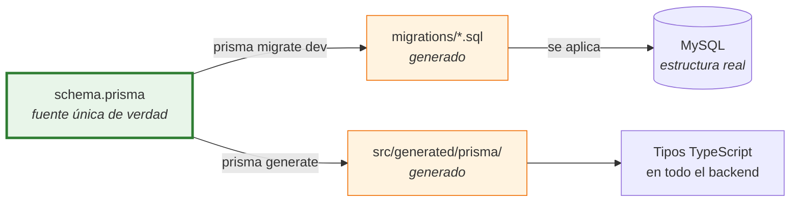
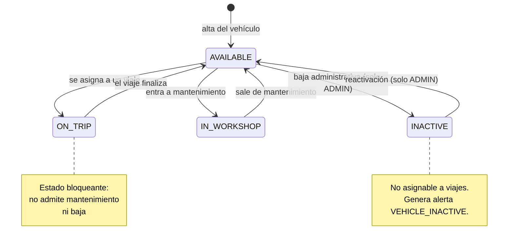
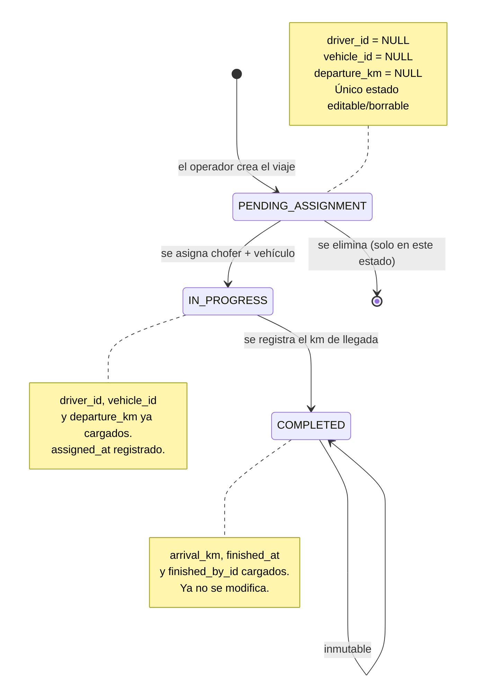
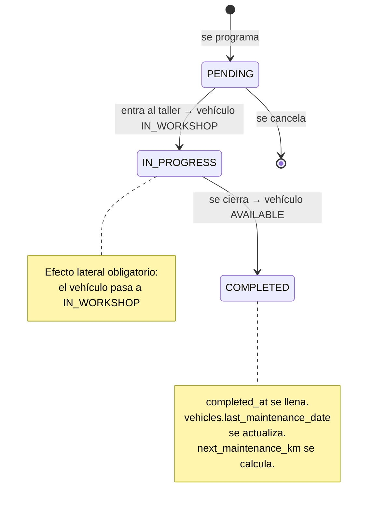
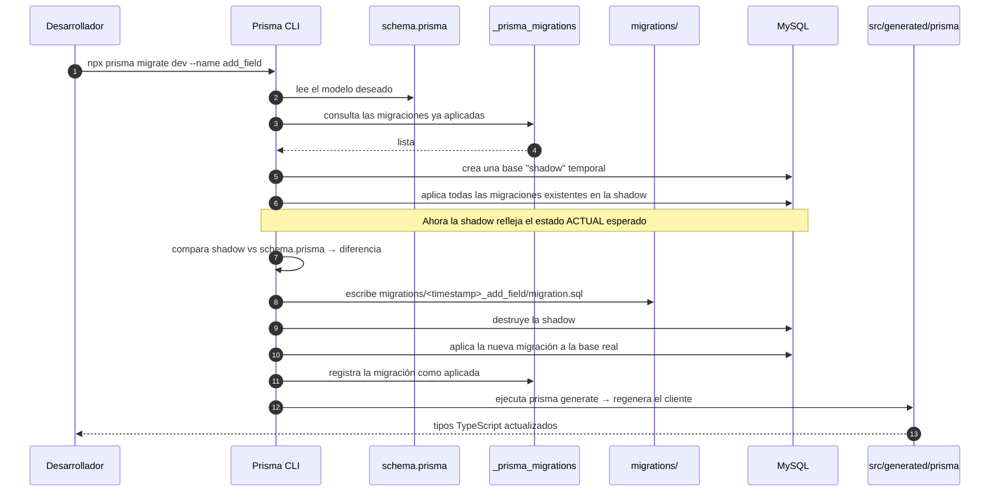
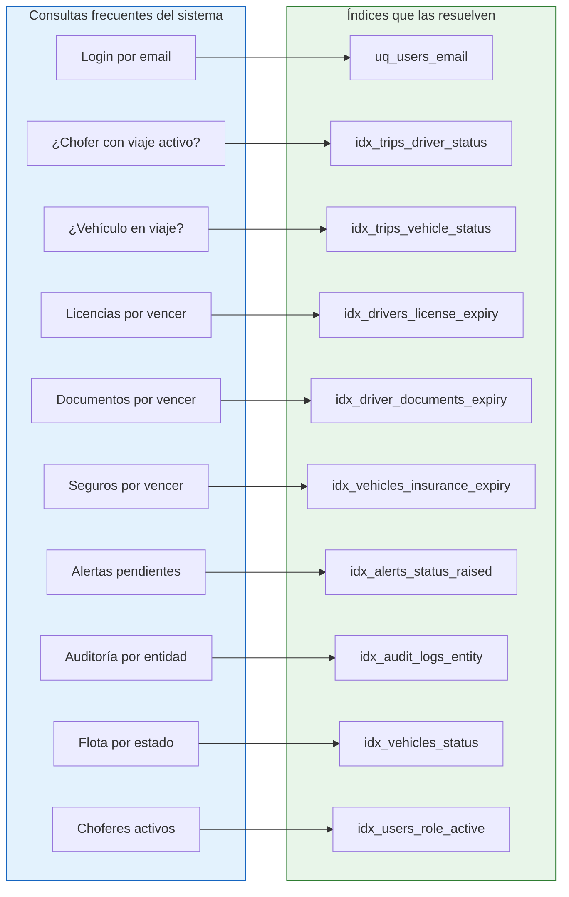
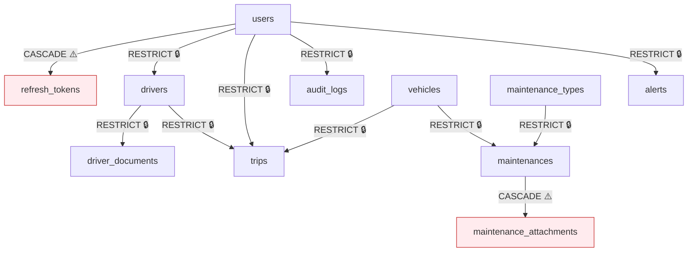

# Capítulo 3 — La base de datos

> **Prerrequisitos:** [Capítulo 1, §1.2.8](01-conceptos-previos.md) (bases relacionales y SQL) y [Capítulo 2](02-arquitectura.md).
> **Archivos que se explican aquí:** `backend/prisma/schema.prisma` (295 líneas, íntegramente) y `backend/prisma/migrations/20260714023014_init/migration.sql` (247 líneas).
> **Al terminar** el lector podrá reconstruir la base de datos completa desde cero y justificar cada decisión.

---

## 3.1. Introducción

La base de datos es la parte más difícil de cambiar de un sistema. El código se reescribe en una tarde; una tabla con dos años de datos en producción, no. Por eso el modelo de datos merece el análisis más detallado del manual.

Este capítulo cubre:

- El modelo entidad-relación completo, con su diagrama.
- Las 12 tablas, columna por columna: tipo, tamaño, nulabilidad, valor por defecto, **por qué existe** y **qué pasaría si desapareciera**.
- Las 12 claves foráneas y sus políticas de borrado.
- Los 20 índices y qué consulta acelera cada uno.
- Las 7 enumeraciones y las máquinas de estado que representan.
- `schema.prisma` línea por línea.
- Las decisiones de normalización y las desnormalizaciones deliberadas.

---

## 3.2. Conceptos previos

### 3.2.1. Modelo conceptual, lógico y físico

Un modelo de datos se describe en tres niveles, del más abstracto al más concreto:

| Nivel | Qué describe | Artefacto en este proyecto |
|:--|:--|:--|
| **Conceptual** | Qué cosas existen en el negocio y cómo se relacionan, sin tecnología. | `docs/etapa-2-der-definitivo.md` |
| **Lógico** | Tablas, columnas, claves, relaciones — sin comprometerse con un motor concreto. | `docs/etapa-2-modelo-relacional.md` |
| **Físico** | Tipos exactos, tamaños, índices, motor de almacenamiento, codificación. | `schema.prisma` → `migration.sql` |

**El físico es el que manda.** Si los tres se contradicen, la verdad es lo que está en la base de datos. En este proyecto, `schema.prisma` es la **fuente única**: la migración SQL se genera a partir de él, y el cliente TypeScript también.



🔴 **La consecuencia práctica de esto.** Nunca se modifica la base de datos con `ALTER TABLE` a mano ni con una herramienta gráfica. Todo cambio empieza en `schema.prisma`. Si alguien altera la base directamente, Prisma detecta la divergencia (*drift*) en la próxima migración y se niega a continuar, porque ya no puede garantizar que su modelo coincida con la realidad.

### 3.2.2. Cardinalidad de las relaciones

| Cardinalidad | Significado | Cómo se implementa | Ejemplo en este proyecto |
|:--|:--|:--|:--|
| **1:1** | Una fila de A ↔ exactamente una de B | Clave foránea **única**, o clave primaria compartida | `User` ↔ `Driver` |
| **1:N** | Una fila de A ↔ muchas de B | Clave foránea en la tabla del lado "muchos" | `Vehicle` → `Maintenance` |
| **N:M** | Muchas ↔ muchas | Tabla intermedia con dos claves foráneas | **No hay ninguna** en este modelo |

💡 **Que no haya relaciones N:M es un dato revelador.** Significa que el dominio es jerárquico: cada cosa pertenece a otra. Un viaje tiene *un* chofer y *un* vehículo, no varios. Si el negocio cambiara y un viaje pudiera llevar dos choferes (relevo en viajes largos), habría que crear una tabla intermedia `trip_drivers` — y ese sería un cambio estructural mayor, no un campo más.

### 3.2.3. Cómo leer la sintaxis de Prisma

Antes de mirar el archivo, el vocabulario:

```prisma
model NombreDelModelo {
  campo   Tipo   @atributo @otro(parametro)
  //  ↑      ↑        ↑
  //  │      │        └── atributos de campo (empiezan con una @)
  //  │      └── tipo: Int, String, DateTime, Boolean, Decimal, Json, BigInt, o un enum
  //  └── nombre del campo en TypeScript (camelCase)

  @@atributoDeModelo(...)   // atributos del modelo entero (empiezan con dos @@)
}
```

**Los atributos de campo que aparecen en este proyecto:**

| Atributo | Qué hace |
|:--|:--|
| `@id` | Declara la clave primaria. |
| `@default(valor)` | Valor por defecto. Puede ser literal, `now()`, `autoincrement()`. |
| `@unique(map: "nombre")` | Restricción de unicidad, con nombre explícito del índice. |
| `@map("nombre_sql")` | El nombre de la columna en SQL difiere del de TypeScript. |
| `@updatedAt` | Prisma actualiza este campo automáticamente en cada `update`. |
| `@db.Tipo(args)` | Fuerza el tipo SQL nativo exacto. |
| `@relation(...)` | Define la relación: qué campos, a qué referencias, qué política de borrado. |
| `?` (sufijo del tipo) | El campo es opcional → `NULL` en SQL. |
| `[]` (sufijo del tipo) | Campo de relación "muchos" (no existe como columna). |

**Los atributos de modelo:**

| Atributo | Qué hace |
|:--|:--|
| `@@map("tabla_sql")` | El nombre de la tabla difiere del nombre del modelo. |
| `@@index([campos], map: "nombre")` | Crea un índice (no único). |
| `@@unique([campos])` | Restricción de unicidad compuesta. *(No se usa en este proyecto.)* |

💡 **Por qué tanto `@map`.** Hay dos convenciones de nombres en conflicto: TypeScript usa `camelCase` (`passwordHash`), SQL usa `snake_case` (`password_hash`). En vez de elegir una y violar la otra, `@map` permite respetar ambas: el código TypeScript se lee natural, y la base de datos también. El precio es una anotación por campo. Es un precio bajo por no tener que escribir `password_hash` en TypeScript ni `passwordHash` en una consulta SQL manual.

---

## 3.3. Explicación detallada: el modelo completo

### 3.3.1. Diagrama entidad-relación

```mermaid
erDiagram
    USERS ||--o| DRIVERS : "es (1:1)"
    USERS ||--o{ REFRESH_TOKENS : "posee"
    USERS ||--o{ AUDIT_LOGS : "genera"
    USERS ||--o{ TRIPS : "crea como operador"
    USERS ||--o{ TRIPS : "finaliza"
    USERS ||--o{ ALERTS : "resuelve"

    DRIVERS ||--o{ DRIVER_DOCUMENTS : "presenta"
    DRIVERS ||--o{ TRIPS : "conduce"

    VEHICLES ||--o{ TRIPS : "realiza"
    VEHICLES ||--o{ MAINTENANCES : "recibe"

    MAINTENANCE_TYPES ||--o{ MAINTENANCES : "clasifica"
    MAINTENANCES ||--o{ MAINTENANCE_ATTACHMENTS : "documenta"

    COMPANY_SETTINGS {
        tinyint id PK "siempre 1"
        varchar company_name
        varchar tax_id
    }

    USERS {
        int id PK
        varchar email UK
        varchar password_hash
        enum role "ADMIN OPERATOR DRIVER"
        boolean is_active
        datetime deleted_at "NULL = activo"
    }

    DRIVERS {
        int user_id PK_FK "clave compartida"
        varchar dni UK
        enum license_category "A B C E"
        date license_expiry_date
        varchar encrypted_password "AES-256-GCM"
        int completed_trips "desnormalizado"
        decimal avg_km "desnormalizado"
    }

    DRIVER_DOCUMENTS {
        int id PK
        int driver_id FK
        enum document_type "DNI LICENSE ART PSYCHOPHYSICAL"
        date expiry_date
        varchar file_path
        datetime deleted_at
    }

    VEHICLES {
        int id PK
        varchar license_plate UK
        smallint year
        int initial_km
        int accumulated_km
        date insurance_expiry_date
        enum status "AVAILABLE INACTIVE IN_WORKSHOP ON_TRIP"
        datetime deleted_at
    }

    TRIPS {
        int id PK
        varchar origin "valor fijo por defecto"
        varchar destination
        datetime departure_at
        enum status "PENDING_ASSIGNMENT IN_PROGRESS COMPLETED"
        int operator_id FK "NOT NULL"
        int driver_id FK "NULL hasta asignar"
        int vehicle_id FK "NULL hasta asignar"
        int departure_km
        int arrival_km
        int finished_by_id FK
    }

    MAINTENANCE_TYPES {
        int id PK
        varchar name UK
        int km_alert
        int km_target
        tinyint months_alert
        tinyint months_target
    }

    MAINTENANCES {
        int id PK
        int vehicle_id FK
        int maintenance_type_id FK
        enum status "PENDING IN_PROGRESS COMPLETED"
        datetime scheduled_at
        datetime completed_at
        int km
        int next_maintenance_km
    }

    MAINTENANCE_ATTACHMENTS {
        int id PK
        int maintenance_id FK
        varchar file_path
    }

    ALERTS {
        int id PK
        varchar alert_type
        varchar entity_type "polimórfico"
        int entity_id "sin FK"
        enum status "PENDING RESOLVED"
        int resolved_by_id FK
    }

    AUDIT_LOGS {
        bigint id PK
        int user_id FK
        varchar action
        varchar entity
        int entity_id "sin FK"
        json previous_data
        json new_data
    }

    REFRESH_TOKENS {
        int id PK
        int user_id FK
        char token_hash UK "SHA-256"
        datetime expires_at
        boolean revoked
    }
```

**Cómo leer las cardinalidades de Mermaid:**

- `||--o|` = uno a cero-o-uno (1:1 opcional)
- `||--o{` = uno a cero-o-muchos (1:N)
- `PK` = clave primaria, `FK` = clave foránea, `UK` = clave única

**Dos cosas que llaman la atención en este diagrama:**

1. **`USERS` aparece en seis relaciones.** Es la tabla central. Todo lo que ocurre en el sistema lo hace alguien, y ese alguien es un usuario.
2. **`ALERTS` y `AUDIT_LOGS` no tienen clave foránea a la entidad que referencian.** Tienen `entity_type` (texto) + `entity_id` (número), sin restricción. Es una **relación polimórfica**, y se analiza en §3.4.10.

### 3.3.2. Las tres máquinas de estado

Tres de las siete enumeraciones no son simples listas: son **máquinas de estado** con transiciones válidas e inválidas. Comprenderlas es comprender el sistema.

#### Estado del vehículo (`VehicleStatus`)



**Transiciones que NO existen, y por qué:**

| Transición inexistente | Motivo |
|:--|:--|
| `ON_TRIP` → `IN_WORKSHOP` | Un vehículo en ruta no puede estar en el taller. Primero hay que finalizar el viaje. |
| `ON_TRIP` → `INACTIVE` | No se puede dar de baja un vehículo que está en la calle con carga. |
| `IN_WORKSHOP` → `ON_TRIP` | Hay que cerrar el mantenimiento primero. |
| `INACTIVE` → `ON_TRIP` | Un vehículo inactivo no es asignable (RN-2). |

🔴 **Estas restricciones NO están en la base de datos.** MySQL solo garantiza que el valor sea uno de los cuatro; no sabe nada de transiciones. **Toda la máquina de estados vive en `vehicles.service.ts` y `trips.service.ts`.** Si alguien escribiera directamente en la base con SQL, podría poner un vehículo `ON_TRIP` sin viaje asociado, y nada lo impediría.

💡 **¿Se podría poner en la base?** Con un `TRIGGER` que valide la transición en cada `UPDATE`. Se descartó porque la lógica quedaría partida en dos lenguajes (TypeScript y SQL), sería invisible desde el código, y sería mucho más difícil de testear y de versionar. La decisión general del proyecto es: **la base garantiza la integridad estructural; el servicio garantiza la integridad de negocio.**

#### Estado del viaje (`TripStatus`)



💡 **La correspondencia entre estado y nulabilidad es el corazón del diseño de `trips`.** El estado no es solo una etiqueta: **determina qué columnas están pobladas**. Un viaje `PENDING_ASSIGNMENT` con `driver_id` no nulo sería una inconsistencia. El esquema permite esa inconsistencia (no hay `CHECK`); el servicio la previene.

⚠️ **Esta es una debilidad honesta del modelo.** El comentario de `schema.prisma:2-4` lo reconoce: *"CHECK constraints are not expressible in Prisma: they are added via raw SQL in migrations and re-validated in the service layer"*. MySQL 8.0.16+ **sí** soporta `CHECK`, y se podría escribir `CHECK (status <> 'PENDING_ASSIGNMENT' OR driver_id IS NULL)`. Prisma no lo genera, pero se puede agregar a mano en una migración. El capítulo 25 lo propone como mejora.

#### Estado del mantenimiento (`MaintenanceStatus`)



**El acoplamiento entre dos máquinas de estado.** Cambiar el estado de un mantenimiento **obliga** a cambiar el estado del vehículo. Son dos tablas que deben moverse juntas, y por eso esa operación es una **transacción**. Sin ella, un fallo entre los dos `UPDATE` dejaría un vehículo `IN_WORKSHOP` sin mantenimiento activo — invisible en las pantallas y no asignable a viajes para siempre.

---

## 3.4. Las 12 tablas, columna por columna

Formato de cada tabla: se lista cada columna con su tipo SQL exacto, si admite nulos, su valor por defecto, **para qué existe** y **qué pasaría si se eliminara**.

### 3.4.1. `users` — el centro del modelo

**Propósito.** Toda persona que puede iniciar sesión. Los tres roles (`ADMIN`, `OPERATOR`, `DRIVER`) comparten esta tabla.

| Columna | Tipo SQL | Nulo | Defecto | Para qué existe | Si se eliminara |
|:--|:--|:--:|:--|:--|:--|
| `id` | `INT UNSIGNED AUTO_INCREMENT` | No | auto | Identificador estable e inmutable. Lo referencian 6 claves foráneas. | Se rompe todo el modelo: no habría a qué apuntar. |
| `name` | `VARCHAR(100)` | No | — | Nombre visible en pantallas, listados y correos. | Los listados mostrarían solo emails; la auditoría sería ilegible. |
| `email` | `VARCHAR(150)` | No | — | **Credencial de acceso.** Es el nombre de usuario del login. | Nadie podría iniciar sesión. |
| `password_hash` | `VARCHAR(60)` | No | — | Hash bcrypt de la contraseña. | No se podría verificar ninguna credencial. |
| `role` | `ENUM('ADMIN','OPERATOR','DRIVER')` | No | — | Define permisos. Se embebe en el JWT y lo lee `authorize()`. | Todos los usuarios tendrían los mismos permisos: colapso del control de acceso. |
| `is_active` | `BOOLEAN` | No | `true` | Suspensión **temporal** sin borrar. Un empleado de licencia. | Habría que borrar para suspender, perdiendo la historia. |
| `deleted_at` | `DATETIME(3)` | Sí | `NULL` | Borrado **lógico** (RN-20). `NULL` = existe. | Habría que borrar físicamente, violando `ON DELETE RESTRICT` de viajes y auditoría: sería imposible dar de baja a nadie que haya trabajado. |
| `created_at` | `DATETIME(3)` | No | `CURRENT_TIMESTAMP(3)` | Antigüedad, orden de alta, auditoría básica. | Se perdería la trazabilidad temporal de las altas. |
| `updated_at` | `DATETIME(3)` | No | *(Prisma)* | Última modificación. Base para caché y detección de cambios. | No se sabría si un registro está desactualizado. |

**Índices:**

| Índice | Columnas | Tipo | Qué acelera |
|:--|:--|:--|:--|
| *(PK)* | `id` | Agrupado | Toda búsqueda por id y todo `JOIN`. |
| `uq_users_email` | `email` | Único | El login (`WHERE email = ?`) **y** garantiza que no haya emails duplicados. |
| `idx_users_role_active` | `(role, is_active)` | Compuesto | "Todos los choferes activos" — usado por el selector de chofer al asignar un viaje. |

🔴 **`VARCHAR(60)` para `password_hash` no es arbitrario.** Un hash bcrypt mide **exactamente** 60 caracteres, siempre, con este formato:

```
$2b$10$N9qo8uLOickgx2ZMRZoMyeIjZAgcfl7p92ldGxad68LJZdL17lhWy
└┬┘└┬┘ └──────────────────────────┬──────────────────────────┘
 │  │                             └── sal (22 ch) + hash (31 ch)
 │  └── coste: 10 → 2¹⁰ = 1024 iteraciones
 └── versión del algoritmo
```

**La sal está incluida en el propio hash.** Por eso no hay una columna `salt` separada: bcrypt la genera aleatoriamente en cada hash y la guarda en el resultado. Dos usuarios con la misma contraseña tienen hashes completamente distintos, lo que hace inútiles las tablas arcoíris (*rainbow tables*).

⚙️ **Por qué bcrypt y no SHA-256 para contraseñas.** SHA-256 está diseñado para ser **rápido** — una GPU moderna calcula miles de millones por segundo, lo que permite probar un diccionario entero en minutos. bcrypt está diseñado para ser **deliberadamente lento** y con un coste **ajustable**: subir el parámetro de 10 a 11 duplica el tiempo. Se elige el coste más alto que el servidor tolere. Con coste 10, cada verificación tarda ~100 ms: imperceptible para un usuario legítimo, prohibitivo para un atacante que quiera probar millones.

💡 **Por qué `is_active` **y** `deleted_at` en la misma tabla.** Son cosas distintas: `is_active = false` es *"suspendido temporalmente, va a volver"*; `deleted_at != NULL` es *"ya no trabaja acá"*. Un usuario suspendido sigue apareciendo en el listado (marcado como inactivo); uno borrado, no. Colapsarlos en un solo campo perdería esa distinción de negocio.

### 3.4.2. `refresh_tokens` — sesiones de larga duración

**Propósito.** Guardar los tokens de refresco que permiten renovar el access token sin volver a pedir la contraseña.

| Columna | Tipo SQL | Nulo | Defecto | Para qué existe | Si se eliminara |
|:--|:--|:--:|:--|:--|:--|
| `id` | `INT UNSIGNED AUTO_INCREMENT` | No | auto | Clave primaria. | — |
| `user_id` | `INT UNSIGNED` | No | — | De quién es la sesión. | No se sabría a quién renovar. |
| `token_hash` | `CHAR(64)` | No | — | **SHA-256 en hexadecimal del token**. Nunca el token en claro. | Habría que guardar el token en claro: un volcado de la base daría acceso a todas las sesiones. |
| `expires_at` | `DATETIME(3)` | No | — | Vencimiento absoluto (7 días por `REFRESH_TOKEN_TTL_DAYS`). | Las sesiones no caducarían nunca. |
| `revoked` | `BOOLEAN` | No | `false` | Invalidación explícita: logout, o rotación del token. | No habría forma de cerrar sesión del lado del servidor. |
| `created_at` | `DATETIME(3)` | No | `CURRENT_TIMESTAMP(3)` | Cuándo se creó la sesión. Auditoría. | Se perdería el rastro de inicios de sesión. |

**Índices:** PK sobre `id`; `uq_refresh_tokens_hash` (único) sobre `token_hash`; `idx_refresh_tokens_user` sobre `user_id`.

🔴 **`CHAR(64)`, no `VARCHAR(64)`.** La diferencia importa: `CHAR` es de longitud **fija** y `VARCHAR` de longitud variable con un byte extra de encabezado. Un SHA-256 en hexadecimal mide **siempre** 64 caracteres. Usar `CHAR` ahorra ese byte, y —más importante— **documenta la invariante**: quien lea el esquema sabe que ahí va algo de longitud fija.

💡 **Por qué se guarda el hash y no el token.** Es el mismo razonamiento que con las contraseñas. Si un atacante obtuviera un volcado de la base, con los tokens en claro podría hacerse pasar por cualquier usuario. Con los hashes, no: SHA-256 no es reversible. Al llegar un token, el servidor lo hashea y busca ese hash.

⚙️ **Por qué SHA-256 acá y bcrypt para contraseñas.** Parece incoherente, pero no lo es. bcrypt es lento *a propósito*, para frenar ataques de fuerza bruta sobre contraseñas que los humanos eligen (cortas, predecibles, reutilizadas). Un refresh token es **aleatorio y de alta entropía**: no hay diccionario que probar, la fuerza bruta es computacionalmente imposible sin importar la velocidad del hash. Y como se verifica en **cada** renovación, usar bcrypt agregaría 100 ms innecesarios. SHA-256 es la elección correcta para hashear secretos aleatorios.

**Por qué `ON DELETE CASCADE` aquí (única junto con los adjuntos).** Un token de refresco de un usuario borrado no le sirve a nadie y no tiene valor histórico. Borrarlo en cascada es limpieza, no pérdida.

### 3.4.3. `drivers` — la extensión del usuario

**Propósito.** Los datos que solo tiene un usuario con rol `DRIVER`.

| Columna | Tipo SQL | Nulo | Defecto | Para qué existe | Si se eliminara |
|:--|:--|:--:|:--|:--|:--|
| `user_id` | `INT UNSIGNED` | No | — | **Clave primaria Y foránea a la vez.** Es el `id` del usuario. | Se perdería la garantía estructural del 1:1. |
| `dni` | `VARCHAR(10)` | No | — | Documento nacional. Identificación legal, única. | No se podría verificar identidad ni evitar duplicados. |
| `license_category` | `ENUM('A','B','C','E')` | No | — | Qué vehículos puede conducir. | No se podría validar la habilitación. |
| `license_expiry_date` | `DATE` | No | — | **Vencimiento de la licencia.** Base de la RN-1. | Se podría asignar un viaje a alguien con la licencia vencida: riesgo legal. |
| `encrypted_password` | `VARCHAR(255)` | No | — | Contraseña cifrada **reversiblemente** (AES-256-GCM). Requisito A-9. | El administrador no podría reenviar la contraseña a un chofer que la olvidó. |
| `completed_trips` | `INT UNSIGNED` | No | `0` | Contador **desnormalizado** de viajes finalizados. | Habría que hacer `COUNT` sobre `trips` en cada fila del listado. |
| `avg_km` | `DECIMAL(10,2)` | No | `0` | Promedio **desnormalizado** de km por viaje. | Habría que hacer `AVG` sobre `trips` en cada fila. |

**Índices:** PK sobre `user_id`; `uq_drivers_dni` (único) sobre `dni`; `idx_drivers_license_expiry` sobre `license_expiry_date`.

💡 **La clave primaria compartida, en detalle.** Esto:

```prisma
model Driver {
  userId Int @id @map("user_id") @db.UnsignedInt
  user   User @relation(fields: [userId], references: [id], onDelete: Restrict)
}
```

produce esto en SQL:

```sql
PRIMARY KEY (`user_id`),
FOREIGN KEY (`user_id`) REFERENCES `users`(`id`)
```

`user_id` es simultáneamente PK y FK. **Consecuencias estructurales, garantizadas por el motor:**

1. No puede haber dos filas de `drivers` para el mismo usuario (la PK es única).
2. No puede haber un `drivers` sin `users` (la FK lo impide).
3. La relación es 1:1 **por construcción**, no por convención.

**Alternativas y por qué se descartaron:**

| Alternativa | Problema |
|:--|:--|
| `drivers.id` propio + `user_id UNIQUE` | Dos identificadores para la misma persona. Toda consulta necesita un `JOIN` extra. Cero beneficio. |
| Todo en `users` con columnas nulas | `dni`, `license_category`, `license_expiry_date` serían `NULL` para admins y operadores. La base ya no podría exigir que un chofer tenga licencia (`NOT NULL` sería imposible). |
| Tabla `drivers` completamente independiente | Habría que duplicar `name`, `email`, `password_hash`. Cambiar un email requeriría actualizar dos tablas. Violación directa de la normalización. |

🔴 **`encrypted_password` es la decisión más discutible de todo el modelo, y merece un análisis honesto.**

Guardar contraseñas de forma reversible es, en general, **una mala práctica de seguridad**. Nadie —ni el administrador— debería poder leer la contraseña de otro.

El requisito A-9 lo exige de todas formas: el administrador debe poder consultar las credenciales de un chofer, porque los choferes usan una app móvil, olvidan sus contraseñas, y no hay flujo de recuperación por correo (muchos no tienen email corporativo).

**Lo que el proyecto hace bien dentro de esa restricción:**

1. **La contraseña sigue estando hasheada con bcrypt en `users.password_hash`.** El login **nunca** usa `encrypted_password`. El campo cifrado es un canal *aparte*, solo de consulta.
2. Usa **AES-256-GCM**, que es cifrado *autenticado*: si alguien altera un byte del texto cifrado, el descifrado falla en vez de devolver basura silenciosamente.
3. La clave **no está en la base de datos**: vive en `PASSWORD_ENCRYPTION_KEY`, en el `.env`. Un volcado de la base, por sí solo, es inútil.
4. Cada cifrado usa un **IV aleatorio** distinto (`crypto.ts:16`), así que dos choferes con la misma contraseña tienen textos cifrados diferentes.
5. Solo aplica a **choferes**, no a administradores ni operadores.

**Lo que sigue siendo un riesgo:** quien obtenga la base **y** el `.env` tiene todas las contraseñas de choferes en claro. Y si esos choferes reutilizan contraseñas (lo que la gente hace), el daño trasciende el sistema.

**La alternativa que el capítulo 25 propone:** que el administrador no *vea* la contraseña sino que la *regenere* — genera una nueva aleatoria, la envía por correo o SMS, y guarda solo el hash. Se cumple la necesidad de negocio (el chofer recupera el acceso) sin almacenar nada reversible.

**Por qué `VARCHAR(255)`.** El formato almacenado es `base64(iv):base64(authTag):base64(ciphertext)` (`crypto.ts:20`). Para una contraseña de hasta ~100 caracteres: 16 + 1 + 24 + 1 + ~140 ≈ 182. 255 deja margen cómodo.

### 3.4.4. `driver_documents` — documentación obligatoria

**Propósito.** Los cuatro documentos que debe tener vigentes un chofer para poder ser asignado (RN-4).

| Columna | Tipo SQL | Nulo | Defecto | Para qué existe | Si se eliminara |
|:--|:--|:--:|:--|:--|:--|
| `id` | `INT UNSIGNED AUTO_INCREMENT` | No | auto | Clave primaria. | — |
| `driver_id` | `INT UNSIGNED` | No | — | De qué chofer es. | El documento quedaría huérfano. |
| `document_type` | `ENUM('DNI','LICENSE','ART','PSYCHOPHYSICAL')` | No | — | Qué documento es. Dominio cerrado. | No se podría verificar que estén los cuatro. |
| `expiry_date` | `DATE` | No | — | Vencimiento. Base de las alertas de documentación. | No se podría detectar documentación vencida. |
| `file_name` | `VARCHAR(255)` | No | — | Nombre **original** subido por el usuario. | Al descargar, el archivo tendría un nombre UUID incomprensible. |
| `file_path` | `VARCHAR(500)` | No | — | Ruta **real** en disco, con nombre UUID. | El archivo sería irrecuperable. |
| `mime_type` | `VARCHAR(50)` | No | — | Tipo de contenido, para la cabecera `Content-Type` al descargar. | El navegador no sabría si mostrar o descargar. |
| `file_size` | `INT UNSIGNED` | No | — | Tamaño en bytes. Se muestra en la UI y sirve para auditoría. | Habría que consultar el disco para saberlo. |
| `uploaded_at` | `DATETIME(3)` | No | `CURRENT_TIMESTAMP(3)` | Cuándo se subió. | Sin trazabilidad. |
| `deleted_at` | `DATETIME(3)` | Sí | `NULL` | Borrado lógico. | Al reemplazar un documento se perdería el anterior. |

**Índices:** PK; `idx_driver_documents_driver` sobre `driver_id`; `idx_driver_documents_expiry` sobre `expiry_date` (lo usa el motor de alertas).

💡 **Por qué los archivos van al disco y los metadatos a la base.** Es una decisión arquitectónica declarada (*"files on filesystem, metadata in DB"*, `middlewares/upload.ts:13`).

| | Archivo en la base (`BLOB`) | Archivo en disco (elegido) |
|:--|:--|:--|
| Copias de seguridad | Todo junto, atómico ✅ | Hay que respaldar dos cosas ❌ |
| Consistencia transaccional | Garantizada ✅ | Manual (por eso existe `safeUnlink`) ❌ |
| Tamaño de la base | Crece muchísimo ❌ | Se mantiene chica ✅ |
| Rendimiento de las consultas | Se degrada ❌ | Sin impacto ✅ |
| Servir el archivo | Pasa por la base ❌ | Lo puede servir el servidor web directamente ✅ |
| Escalado horizontal | Complicado ❌ | Directo (almacenamiento de objetos) ✅ |

🔴 **El costo real de esta elección** está en `shared/utils/files.ts:34` (`safeUnlink`): *"Best-effort deletion of a stored file. Used to roll back when the accompanying DB write fails (files live outside the DB transaction)."* El archivo se escribe **fuera** de la transacción de base de datos. Si la escritura en la base falla después de guardar el archivo, hay que borrarlo a mano. Y si el proceso muere justo entre las dos operaciones, queda un archivo huérfano en disco que nadie referencia. Es una inconsistencia posible y aceptada — el capítulo 25 propone una tarea de limpieza periódica.

**Por qué `file_name` y `file_path` separados.** `storeFile` (`files.ts:24`) guarda con un nombre `randomUUID()` para evitar colisiones y ataques de sobrescritura. El nombre original se preserva como metadato para que la descarga se llame `licencia-juan-perez.pdf` y no `f47ac10b-58cc-4372-a567-0e02b2c3d479.pdf`.

### 3.4.5. `vehicles` — la flota

| Columna | Tipo SQL | Nulo | Defecto | Para qué existe | Si se eliminara |
|:--|:--|:--:|:--|:--|:--|
| `id` | `INT UNSIGNED AUTO_INCREMENT` | No | auto | Clave primaria. | — |
| `license_plate` | `VARCHAR(10)` | No | — | Patente. Identificación única y visible. | No se podría identificar el vehículo físico. |
| `model` | `VARCHAR(100)` | No | — | Marca y modelo. Descriptivo. | Los listados serían solo patentes. |
| `year` | `SMALLINT UNSIGNED` | No | — | Año de fabricación. Antigüedad de la flota. | No se podría reportar la edad de la flota. |
| `initial_km` | `INT UNSIGNED` | No | — | Kilometraje al darlo de alta (A-13). Referencia. | No se sabría cuánto recorrió **bajo esta gestión**. |
| `accumulated_km` | `INT UNSIGNED` | No | — | Kilometraje **actual**. Se actualiza al finalizar cada viaje. | No se podrían disparar mantenimientos por kilometraje. |
| `last_maintenance_date` | `DATE` | Sí | `NULL` | Fecha del último mantenimiento completado. | No se podrían disparar alertas por tiempo transcurrido. |
| `insurance_expiry_date` | `DATE` | Sí | `NULL` | Vencimiento del seguro. | Un vehículo podría circular sin seguro sin que nadie lo notara. |
| `status` | `ENUM(4 valores)` | No | `'AVAILABLE'` | Estado operativo actual. | No se sabría qué vehículos están disponibles. |
| `deleted_at` | `DATETIME(3)` | Sí | `NULL` | Borrado lógico. | Se perdería el historial de viajes del vehículo. |
| `created_at` / `updated_at` | `DATETIME(3)` | No | auto | Trazabilidad temporal. | — |

**Índices:** PK; `uq_vehicles_plate` (único); `idx_vehicles_status`; `idx_vehicles_insurance_expiry`.

💡 **Por qué `initial_km` **y** `accumulated_km` por separado.** Cuando la empresa incorpora un vehículo usado con 80.000 km, `initial_km = 80000`. A partir de ahí, `accumulated_km` va creciendo. La diferencia `accumulated_km - initial_km` responde *"¿cuánto recorrió bajo nuestra gestión?"*, que es lo relevante para los reportes de utilización de flota. Con un solo campo, esa pregunta sería incontestable.

🔴 **`accumulated_km` es un campo derivado, y esa es su fragilidad.** Debería ser igual a `initial_km` + la suma de `(arrival_km - departure_km)` de todos los viajes completados. Pero se mantiene por acumulación incremental. Si un `UPDATE` falla o si alguien escribe en `trips` sin pasar por el servicio, el valor queda mintiendo, y **la base no lo detecta**. El capítulo 25 propone una consulta de conciliación periódica.

**Por qué `SMALLINT` para `year`.** El rango es 0–65535, más que suficiente. `INT` gastaría 4 bytes donde alcanzan 2. Con miles de vehículos el ahorro es irrelevante, pero **el tipo documenta la intención**: quien lea el esquema sabe que ahí no va a haber un número grande.

**Por qué `insurance_expiry_date` es nulable pero `license_expiry_date` no.** Un chofer sin licencia no es un chofer: el dato es constitutivo. Un vehículo sin seguro cargado en el sistema sí puede existir (todavía no se cargó el dato, o está en trámite). La nulabilidad **es** la definición de qué es obligatorio en el negocio.

### 3.4.6. `maintenance_types` — catálogo configurable

**Propósito.** Definir los tipos de mantenimiento y sus umbrales de alerta. Es un **catálogo**: lo administra el usuario, no está codificado.

| Columna | Tipo SQL | Nulo | Defecto | Para qué existe | Si se eliminara |
|:--|:--|:--:|:--|:--|:--|
| `id` | `INT UNSIGNED AUTO_INCREMENT` | No | auto | Clave primaria. | — |
| `name` | `VARCHAR(50)` | No | — | Nombre único: "Preventivo menor". | No se distinguirían los tipos. |
| `description` | `VARCHAR(255)` | No | — | Qué incluye: "Cambio de aceite, filtros y engrase". | El usuario no sabría qué implica. |
| `km_alert` | `INT UNSIGNED` | No | — | Km desde el último mantenimiento a partir de los cuales **avisar**. | No habría alertas preventivas por kilometraje. |
| `km_target` | `INT UNSIGNED` | No | — | Km en los que **debe** hacerse. | No se calcularía `next_maintenance_km`. |
| `months_alert` | `TINYINT UNSIGNED` | Sí | `NULL` | Meses a partir de los cuales avisar. | Solo habría alertas por km, no por tiempo. |
| `months_target` | `TINYINT UNSIGNED` | Sí | `NULL` | Meses en los que debe hacerse. | — |

**Índices:** PK; `uq_maintenance_types_name` (único).

💡 **Umbral "alert" y umbral "target": por qué dos.** `km_alert = 10000` y `km_target = 20000` significan: *avisá a los 10.000 km, exigilo a los 20.000*. Es la diferencia entre un aviso amarillo y uno rojo. Con un solo umbral, o se avisa tarde o se molesta temprano.

**Por qué `months_*` es nulable y `km_*` no.** Todo mantenimiento tiene un criterio de kilometraje; no todos tienen criterio temporal. Un cambio de aceite se hace cada 10.000 km *o* cada 6 meses, lo que ocurra primero. Una alineación se hace solo por kilometraje. `NULL` significa "este tipo no tiene criterio temporal", y el motor de alertas simplemente no lo evalúa.

**Por qué `TINYINT` (0–255) para meses.** Un mantenimiento cada más de 255 meses (21 años) no tiene sentido. El tipo **codifica el rango válido**: intentar guardar 300 es un error de la base, no un dato absurdo que alguien descubre después.

🔴 **Esta tabla NO tiene borrado lógico.** No hay `deleted_at`. La protección es `ON DELETE RESTRICT` en `fk_maintenances_type`: intentar borrar un tipo usado por algún mantenimiento falla con error de la base, que `error-handler.ts:64` traduce a `409 CONFLICT`. Es una decisión coherente: un catálogo sin uso se puede borrar de verdad; uno con uso, no se puede tocar.

### 3.4.7. `maintenances` — las intervenciones

| Columna | Tipo SQL | Nulo | Defecto | Para qué existe | Si se eliminara |
|:--|:--|:--:|:--|:--|:--|
| `id` | `INT UNSIGNED AUTO_INCREMENT` | No | auto | Clave primaria. | — |
| `vehicle_id` | `INT UNSIGNED` | No | — | Qué vehículo. | No se sabría a qué unidad corresponde. |
| `maintenance_type_id` | `INT UNSIGNED` | No | — | Qué tipo. Aporta los umbrales. | No se podría calcular el próximo. |
| `status` | `ENUM(3 valores)` | No | `'PENDING'` | Estado del trabajo. | No se sabría si está hecho. |
| `scheduled_at` | `DATETIME(3)` | No | — | Cuándo se programó. | No se podría planificar. |
| `completed_at` | `DATETIME(3)` | Sí | `NULL` | Cuándo se completó. `NULL` = todavía no. | No se sabría la duración real. |
| `km` | `INT UNSIGNED` | No | — | Kilometraje del vehículo **al momento** del mantenimiento. | No se podría calcular el intervalo hasta el próximo. |
| `notes` | `TEXT` | Sí | `NULL` | Observaciones del taller. | Se perdería el detalle cualitativo. |
| `next_maintenance_km` | `INT UNSIGNED` | Sí | `NULL` | Km calculado del próximo (`km + km_target`). | Habría que recalcularlo en cada evaluación de alertas. |
| `created_at` / `updated_at` | `DATETIME(3)` | No | auto | Trazabilidad. | — |

**Índices:** PK; `idx_maintenances_vehicle_status` `(vehicle_id, status)`; `idx_maintenances_status`; `idx_maintenances_scheduled`.

💡 **`km` es una "foto" histórica, no una referencia.** No se puede consultar `vehicles.accumulated_km` para saber en qué kilometraje se hizo un mantenimiento de hace dos años: ese valor ya cambió. Guardar el kilometraje del momento es lo que hace posible el historial.

Este es un caso donde **duplicar el dato es correcto**. No viola la normalización: `maintenances.km` y `vehicles.accumulated_km` no son el mismo hecho. Uno es *"el kilometraje que tenía el vehículo el 14 de mayo"*, el otro es *"el kilometraje que tiene hoy"*.

**Por qué `next_maintenance_km` está guardado y no calculado.** Es `km + maintenanceType.km_target`, calculable al vuelo con un `JOIN`. Se guarda porque el motor de alertas recorre **todos** los vehículos comparando su kilometraje contra este valor; tenerlo materializado convierte un `JOIN` por fila en una comparación directa. Y tiene una ventaja adicional: si alguien cambia el `km_target` del tipo, los mantenimientos ya hechos **conservan** el objetivo con el que se calcularon, que es históricamente correcto.

### 3.4.8. `maintenance_attachments` — comprobantes

| Columna | Tipo SQL | Nulo | Defecto | Para qué existe |
|:--|:--|:--:|:--|:--|
| `id` | `INT UNSIGNED AUTO_INCREMENT` | No | auto | Clave primaria. |
| `maintenance_id` | `INT UNSIGNED` | No | — | De qué mantenimiento. |
| `file_name` | `VARCHAR(255)` | No | — | Nombre original. |
| `file_path` | `VARCHAR(500)` | No | — | Ruta real en disco. |
| `mime_type` | `VARCHAR(50)` | No | — | Tipo de contenido. |
| `file_size` | `INT UNSIGNED` | No | — | Tamaño en bytes. |
| `uploaded_at` | `DATETIME(3)` | No | `CURRENT_TIMESTAMP(3)` | Cuándo se subió. |

**Índices:** PK; `idx_maintenance_attachments_maintenance`.

🔴 **Sin `deleted_at`, y con `ON DELETE CASCADE`.** Es la excepción a la política general de borrado lógico. La justificación: un comprobante es un accesorio del mantenimiento, no un hecho de negocio independiente. Si se borra el mantenimiento, el comprobante no tiene ningún significado por sí solo.

⚠️ **Efecto secundario que hay que conocer.** El `CASCADE` borra la **fila**, pero **no el archivo del disco**. La base de datos no sabe nada del sistema de archivos. Borrar un mantenimiento con tres comprobantes deja tres archivos huérfanos en `backend/uploads/`. Es una fuga silenciosa de espacio, documentada en el capítulo 25.

**Por qué esta tabla existe en vez de columnas en `maintenances`.** Un mantenimiento puede tener **varios** comprobantes (factura, remito, foto del repuesto). Meterlos como columnas (`attachment1_path`, `attachment2_path`…) violaría la primera forma normal e impondría un límite arbitrario. Una tabla separada permite cero, uno o cien.

### 3.4.9. `trips` — la entidad más rica

**Propósito.** El viaje: la operación central del negocio.

| Columna | Tipo SQL | Nulo | Defecto | Para qué existe | Si se eliminara |
|:--|:--|:--:|:--|:--|:--|
| `id` | `INT UNSIGNED AUTO_INCREMENT` | No | auto | Clave primaria. | — |
| `origin` | `VARCHAR(120)` | No | *(texto fijo)* | Punto de partida. **Siempre el mismo** (RN-21). | Habría que cargarlo en cada viaje. |
| `destination` | `VARCHAR(120)` | No | — | Destino. Texto libre (validado por Google Maps en el frontend). | El viaje no tendría sentido. |
| `departure_at` | `DATETIME(3)` | No | — | Fecha y hora de salida **planificada**. | No se podrían detectar solapamientos ni planificar. |
| `status` | `ENUM(3 valores)` | No | `'PENDING_ASSIGNMENT'` | Estado del ciclo de vida. | Se perdería toda la lógica de transiciones. |
| `estimated_distance_km` | `DECIMAL(8,2)` | Sí | `NULL` | Distancia estimada (Google Maps). | No se podría estimar el uso de la flota. |
| `estimated_time_min` | `INT UNSIGNED` | Sí | `NULL` | Duración estimada en minutos. | No se podría planificar el solapamiento. |
| `notes` | `TEXT` | Sí | `NULL` | Observaciones. | Se perdería el detalle cualitativo. |
| `operator_id` | `INT UNSIGNED` | **No** | — | Quién creó el viaje. **Obligatorio siempre.** | No habría responsable de la planificación. |
| `driver_id` | `INT UNSIGNED` | **Sí** | `NULL` | Chofer asignado. `NULL` = pendiente. | Sería imposible crear un viaje sin asignarlo. |
| `vehicle_id` | `INT UNSIGNED` | **Sí** | `NULL` | Vehículo asignado. `NULL` = pendiente. | Ídem. |
| `departure_km` | `INT UNSIGNED` | Sí | `NULL` | Kilometraje al salir. Se llena al asignar. | No se podría calcular la distancia real. |
| `arrival_km` | `INT UNSIGNED` | Sí | `NULL` | Kilometraje al llegar. Se llena al finalizar. | Ídem. |
| `assigned_at` | `DATETIME(3)` | Sí | `NULL` | Cuándo se asignó. | Se perdería la métrica de tiempo de asignación. |
| `finished_at` | `DATETIME(3)` | Sí | `NULL` | Cuándo se finalizó **realmente**. | No se podría comparar estimado vs. real. |
| `finished_by_id` | `INT UNSIGNED` | Sí | `NULL` | Quién lo finalizó (el chofer, o un operador). | Sin responsable del cierre. |
| `created_at` / `updated_at` | `DATETIME(3)` | No | auto | Trazabilidad. | — |

**Índices (cinco, la tabla más indexada):**

| Índice | Columnas | Consulta que acelera |
|:--|:--|:--|
| `idx_trips_status` | `(status)` | "Todos los viajes pendientes de asignación" — pantalla principal del operador. |
| `idx_trips_departure` | `(departure_at)` | Listados ordenados por fecha, filtros por período en reportes. |
| `idx_trips_driver_status` | `(driver_id, status)` | **"¿Este chofer tiene un viaje en curso?"** — la comprobación de RN-19, en cada asignación. |
| `idx_trips_vehicle_status` | `(vehicle_id, status)` | "¿Este vehículo está en un viaje?" — RN-2. |
| `idx_trips_operator` | `(operator_id)` | "Viajes creados por este operador" — reportes de productividad. |

💡 **`origin` con valor por defecto fijo de 120 caracteres.** El valor es `'Ciudad Industria, Autopista Córdoba - Rosario, Rosario, Santa Fe'`. La empresa tiene **un solo** punto de partida (RN-21). Está también en `config/constants.ts:16` como `FIXED_TRIP_ORIGIN`, y el seed lo usa desde ahí.

⚠️ **Está duplicado en dos lugares.** Si la empresa se mudara, habría que cambiarlo en `schema.prisma` (generando una migración) **y** en `constants.ts`. Un olvido produciría viajes nuevos con un origen y viajes viejos con otro, sin error visible. Alternativa mejor: guardarlo en `company_settings` y leerlo de ahí. El capítulo 25 lo registra.

💡 **Dos referencias distintas a `users` desde la misma tabla.** `operator_id` (quién creó) y `finished_by_id` (quién cerró). Prisma exige nombrarlas para poder distinguirlas (`@relation("TripOperator")` y `@relation("TripFinishedBy")`, líneas 233 y 236). Sin nombres, Prisma no sabría cuál de las dos relaciones inversas de `User` corresponde a cuál clave foránea.

**¿Por qué se guardan las dos?** Porque son personas distintas y responsabilidades distintas. El operador planifica; el chofer (o un operador, si el chofer no puede) cierra. Auditar quién hizo qué requiere ambos datos.

🔴 **La correspondencia estado ↔ nulabilidad, formalizada:**

| Estado | `driver_id` | `vehicle_id` | `departure_km` | `arrival_km` | `finished_at` |
|:--|:--:|:--:|:--:|:--:|:--:|
| `PENDING_ASSIGNMENT` | `NULL` | `NULL` | `NULL` | `NULL` | `NULL` |
| `IN_PROGRESS` | **valor** | **valor** | **valor** | `NULL` | `NULL` |
| `COMPLETED` | **valor** | **valor** | **valor** | **valor** | **valor** |

Estas ocho invariantes **no están en la base de datos**. Viven en `trips.service.ts`. Un `UPDATE` manual podría violarlas todas. Es la debilidad estructural más importante del modelo, y la mejora concreta sería agregar restricciones `CHECK` en una migración manual.

### 3.4.10. `alerts` — el tablero de avisos

| Columna | Tipo SQL | Nulo | Defecto | Para qué existe |
|:--|:--|:--:|:--|:--|
| `id` | `INT UNSIGNED AUTO_INCREMENT` | No | auto | Clave primaria. |
| `alert_type` | `VARCHAR(50)` | No | — | Qué clase de alerta: `LICENSE_EXPIRING`, `INSURANCE_EXPIRED`, `MAINTENANCE_KM_EXCEEDED`, `VEHICLE_INACTIVE`, `DOCUMENT_EXPIRING`… |
| `description` | `VARCHAR(255)` | No | — | Texto legible que se muestra en pantalla. |
| `entity_type` | `VARCHAR(30)` | No | — | Sobre qué tipo de entidad: `DRIVER`, `VEHICLE`, `DOCUMENT`. |
| `entity_id` | `INT UNSIGNED` | No | — | Id de esa entidad. **Sin clave foránea.** |
| `raised_at` | `DATETIME(3)` | No | `CURRENT_TIMESTAMP(3)` | Cuándo se generó. |
| `status` | `ENUM('PENDING','RESOLVED')` | No | `'PENDING'` | Si sigue vigente. |
| `resolved_by_id` | `INT UNSIGNED` | Sí | `NULL` | Quién la resolvió. `NULL` si se auto-resolvió. |
| `resolved_at` | `DATETIME(3)` | Sí | `NULL` | Cuándo se resolvió. |

**Índices:** PK; `idx_alerts_status_raised` `(status, raised_at)`; `idx_alerts_entity` `(entity_type, entity_id)`.

🔴 **`alert_type` es `VARCHAR`, no `ENUM`. Esto es deliberado y tiene un costo.**

**Ventaja:** agregar un tipo de alerta nuevo no requiere migración. Se escribe el string y listo.

**Costo:** la base **no valida** el valor. Un error de tipeo (`'LICENCE_EXPIRING'` con C) crea silenciosamente un tipo de alerta nuevo que ninguna pantalla sabe mostrar y ningún filtro encuentra. Un `ENUM` habría hecho de eso un error inmediato.

💡 **La mitigación en el código.** El servicio de alertas define los tipos como constantes de TypeScript, y TypeScript impide el error de tipeo **dentro del proyecto**. La protección existe, pero está en la capa de aplicación, no en la de datos. Un script externo escribiendo en la base podría corromperlo.

🔴 **`entity_type` + `entity_id` sin clave foránea: una relación polimórfica.**

Una alerta puede apuntar a un chofer, un vehículo o un documento. SQL **no permite** una clave foránea que apunte a "una de tres tablas": una FK tiene exactamente un destino.

| | Con FK (imposible aquí) | Polimórfico (elegido) |
|:--|:--|:--|
| Integridad referencial | Garantizada ✅ | **Ninguna** ❌ |
| Agregar un tipo de entidad nuevo | Nueva columna + migración | Automático ✅ |
| `JOIN` para traer la entidad | Directo ✅ | Requiere `switch` en la aplicación ❌ |
| Detección de referencias rotas | La base la impide ✅ | Hay que buscarlas manualmente ❌ |

**Consecuencia real y concreta:** si se borra el chofer 5 (aunque sea lógicamente), las alertas con `entity_type='DRIVER', entity_id=5` quedan apuntando a la nada. Nada en la base lo impide ni lo señala.

**Las tres alternativas descartadas:**

1. **Tres tablas separadas** (`driver_alerts`, `vehicle_alerts`, `document_alerts`): integridad garantizada, pero listar "todas las alertas pendientes" requeriría un `UNION` de tres consultas, y agregar un tipo de entidad requeriría una tabla más.
2. **Tres columnas nulables** (`driver_id`, `vehicle_id`, `document_id`, con exactamente una no nula): integridad garantizada, pero la tabla crece con cada tipo nuevo y hay que agregar un `CHECK` para exigir que solo una esté poblada.
3. **Polimórfico** (elegido): flexible, sin integridad.

💡 **Por qué se eligió el polimórfico aquí.** Las alertas son **efímeras y derivadas**: se generan automáticamente evaluando el estado actual, y se **auto-resuelven** cuando la condición desaparece (esto es la "reconciliación" que menciona el README). Una alerta huérfana no corrompe datos de negocio: en el peor caso muestra una línea sin sentido en un tablero, y la siguiente reconciliación la limpia. El costo de una referencia rota es bajo, y la flexibilidad es alta. **Para `audit_logs`, que sí es un registro permanente, la misma decisión es más discutible.**

**Por qué `resolved_by_id` es nulable.** Hay dos formas de resolver una alerta: manualmente (un usuario la marca como vista, y su id queda) o **automáticamente** (la condición desapareció: se renovó la licencia, se hizo el mantenimiento). En el caso automático no hay usuario responsable, y `NULL` lo expresa correctamente. Poner el id del sistema o el del último administrador sería mentir en el registro.

### 3.4.11. `audit_logs` — la memoria del sistema

**Propósito.** Registro inmutable de toda acción relevante, con el estado anterior y el posterior (RN-7).

| Columna | Tipo SQL | Nulo | Defecto | Para qué existe |
|:--|:--|:--:|:--|:--|
| `id` | `BIGINT UNSIGNED AUTO_INCREMENT` | No | auto | Clave primaria. **`BIGINT`**, no `INT`. |
| `user_id` | `INT UNSIGNED` | No | — | **Quién.** Siempre obligatorio. |
| `action` | `VARCHAR(30)` | No | — | **Qué**: `CREATE`, `UPDATE`, `DELETE`, `ASSIGN`, `FINISH`, `LOGIN`… |
| `entity` | `VARCHAR(30)` | No | — | **Sobre qué**: `Vehicle`, `Trip`, `User`… |
| `entity_id` | `INT UNSIGNED` | Sí | `NULL` | Cuál. Nulable porque algunas acciones (login) no tienen entidad. |
| `occurred_at` | `DATETIME(3)` | No | `CURRENT_TIMESTAMP(3)` | **Cuándo**, con precisión de milisegundos. |
| `previous_data` | `JSON` | Sí | `NULL` | Estado **antes**. `NULL` en creaciones. |
| `new_data` | `JSON` | Sí | `NULL` | Estado **después**. `NULL` en borrados. |

**Índices:** PK; `idx_audit_logs_user_date` `(user_id, occurred_at)`; `idx_audit_logs_entity` `(entity, entity_id)`; `idx_audit_logs_date` `(occurred_at)`.

💡 **Por qué `BIGINT` solo acá.** Esta es la única tabla que crece **sin límite**: cada acción de cada usuario agrega una fila, y nunca se borra nada. `INT UNSIGNED` llega hasta 4.294.967.295. A 10.000 acciones diarias eso son 1.177 años — suficiente. Pero el costo de equivocarse es catastrófico: cuando un `AUTO_INCREMENT` se desborda, **la tabla deja de aceptar inserciones**, y el sistema entero se detiene (porque cada operación intenta auditar). `BIGINT` cuesta 4 bytes más por fila y elimina el problema para siempre. Es una póliza de seguro barata.

🔴 **`BIGINT` crea un problema real en JavaScript.** El tipo `number` de JavaScript solo representa enteros exactos hasta 9.007.199.254.740.991. Prisma devuelve estos ids como `BigInt`, que **`JSON.stringify` no sabe serializar**: lanza `TypeError: Do not know how to serialize a BigInt`. El módulo de auditoría tiene que convertirlo explícitamente. Se detalla en el capítulo 15.

💡 **Por qué `JSON` para `previous_data` y `new_data`.** Estas columnas guardan el estado de **cualquier** entidad del sistema: un vehículo, un viaje, un usuario. Cada uno con campos distintos. Sin un tipo `JSON` habría que crear una tabla `audit_log_fields` con `(log_id, campo, valor_anterior, valor_nuevo)` — normalizado, pero muchísimo más complejo de escribir y de leer.

⚙️ **`JSON` en MySQL 8 no es texto.** Se almacena en un formato binario optimizado, se **valida** al insertar (un JSON malformado es un error), y permite consultarlo con `->` y `->>`: `SELECT new_data->>'$.status' FROM audit_logs`. Se puede incluso indexar mediante columnas generadas.

🔴 **`previous_data` y `new_data` son nulables por diseño semántico:**

| Acción | `previous_data` | `new_data` | Significado |
|:--|:--|:--|:--|
| `CREATE` | `NULL` | objeto | No existía antes. |
| `UPDATE` | objeto | objeto | Cambió de esto a aquello. |
| `DELETE` | objeto | `NULL` | Existía, ya no. |
| `LOGIN` | `NULL` | `NULL` | Ninguna entidad cambió. |

La combinación de nulos **es** la información sobre qué tipo de operación ocurrió, con independencia de lo que diga `action`.

⚠️ **Un riesgo de seguridad que hay que señalar.** Si un `UPDATE` de un usuario incluye `passwordHash` en el objeto, ese hash queda guardado en `audit_logs` — una tabla que un administrador puede consultar desde la pantalla de auditoría. El servicio debe **filtrar los campos sensibles** antes de auditar. Se verifica en el capítulo 15.

**Por qué `entity_id` no tiene clave foránea.** Mismo motivo polimórfico que en `alerts`. Pero acá el costo es mayor: `audit_logs` es permanente y es evidencia. Que pueda contener referencias a entidades inexistentes es una debilidad real. La mitigación de hecho: como todo usa borrado **lógico**, las entidades casi nunca desaparecen realmente, y la referencia sigue siendo resoluble.

### 3.4.12. `company_settings` — la fila única

| Columna | Tipo SQL | Nulo | Defecto | Para qué existe |
|:--|:--|:--:|:--|:--|
| `id` | `TINYINT UNSIGNED` | No | **`1`** | Clave primaria **fijada en 1**. |
| `company_name` | `VARCHAR(150)` | No | — | Razón social. Aparece en reportes y correos. |
| `tax_id` | `VARCHAR(13)` | No | — | CUIT: `30-00000000-0` son exactamente 13 caracteres. |
| `address` | `VARCHAR(200)` | No | — | Domicilio fiscal. |
| `phone` | `VARCHAR(30)` | No | — | Teléfono de contacto. |
| `email` | `VARCHAR(150)` | No | — | Correo de contacto. |
| `timezone` | `VARCHAR(50)` | No | `'America/Argentina/Cordoba'` | Zona horaria para mostrar fechas. |
| `language` | `VARCHAR(10)` | No | `'es-AR'` | Idioma y región. |
| `date_format` | `VARCHAR(20)` | No | `'DD/MM/YYYY'` | Formato de fecha preferido. |
| `updated_at` | `DATETIME(3)` | No | *(Prisma)* | Última modificación. |

**Índices:** solo la PK.

💡 **El patrón "tabla de una sola fila" (*singleton table*).** `@default(1)` en la clave primaria de tipo `TINYINT` es la manera declarativa de decir *"acá va una sola fila, siempre la 1"*. El seed hace `upsert({ where: { id: 1 }, ... })` (`seed.ts:58-59`) y el servicio de configuración siempre lee y escribe el id 1.

**Alternativas y por qué son peores:**

| Alternativa | Problema |
|:--|:--|
| Variables de entorno | Cambiar el nombre de la empresa requeriría reiniciar el servidor. No es configuración de despliegue, es dato de negocio. |
| Un archivo JSON en disco | No es transaccional, no se respalda con la base, y no funciona con varias instancias del servidor. |
| Tabla clave-valor (`settings(key, value)`) | Pierde el tipado: todo es texto. Habría que convertir cada valor a mano y no habría validación. |

🔴 **La debilidad: nada impide insertar una fila con `id = 2`.** El valor por defecto no es una restricción. Un `CHECK (id = 1)` lo garantizaría. Sin él, la protección es que todo el código de aplicación usa el 1 explícitamente.

**Por qué `VARCHAR(13)` exacto para el CUIT.** Formato `NN-NNNNNNNN-N`: 2 + 1 + 8 + 1 + 1 = 13. El tipo documenta el formato esperado. Un `VARCHAR(50)` permitiría guardar basura sin que nada avisara.

---

## 3.5. `schema.prisma` línea por línea

Ahora el archivo completo, en orden, con explicación de cada línea significativa.

### Líneas 1-13: cabecera, generador y fuente de datos

```prisma
1  // Logistics & Fleet Management System — Prisma schema
2  // Mirrors the reference DDL (docs/schema.sql). CHECK constraints are not
3  // expressible in Prisma: they are added via raw SQL in migrations and
4  // re-validated in the service layer.
5
6  generator client {
7    provider = "prisma-client"
8    output   = "../src/generated/prisma"
9  }
10
11 datasource db {
12   provider = "mysql"
13 }
```

| Línea | Explicación |
|:--:|:--|
| 1-4 | Comentario de cabecera. **No es decorativo:** declara una limitación conocida y dónde se compensa. Un lector que se pregunte "¿por qué no hay `CHECK`?" tiene la respuesta antes de preguntar. `//` es el comentario de Prisma (no aparece en la salida); `///` sería un comentario de documentación (sí aparece en el cliente generado). |
| 6 | `generator client` declara **qué** debe generar Prisma a partir de este archivo. Puede haber varios generadores (cliente TypeScript, documentación, diagramas ER). |
| 7 | `provider = "prisma-client"` es el generador **nuevo** de Prisma 7, que produce TypeScript legible. El anterior (`prisma-client-js`) generaba JavaScript con tipos `.d.ts` aparte y requería un motor binario en Rust. Este no. |
| 8 | `output` — la ruta de salida, relativa a `schema.prisma`. Por eso `../src/generated/prisma` cae dentro de `src/`, y por eso el import es `'../generated/prisma/client'` desde `database/prisma-client.ts:2`. Que esté dentro de `src/` (y no en `node_modules/`) hace que el código generado sea **inspeccionable**: se puede abrir y leer. |
| 11-13 | `datasource db` declara a qué base conectarse. `provider = "mysql"` determina qué SQL genera Prisma (los tipos y la sintaxis difieren entre MySQL, PostgreSQL y SQLite). |

🔴 **Nótese lo que NO está: no hay `url`.** Lo habitual sería `url = env("DATABASE_URL")`. Aquí no está porque Prisma 7 con **adaptador de driver** obtiene la conexión de otro lado: de `prisma.config.ts:16` para el CLI (migraciones, seed) y de `database/prisma-client.ts:11` para el runtime (`new PrismaMariaDb(env.DATABASE_URL)`).

💡 **Por qué el adaptador MariaDB para MySQL.** El driver `mariadb` de Node es compatible con el protocolo de MySQL y es el que Prisma 7 recomienda para MySQL. El nombre confunde, pero es correcto. Se detalla en el capítulo 4.

### Líneas 19-61: las siete enumeraciones

```prisma
19 enum Role {
20   ADMIN
21   OPERATOR
22   DRIVER
23 }
```

| Enum | Valores | Corresponde a | Regla |
|:--|:--|:--|:--|
| `Role` | ADMIN, OPERATOR, DRIVER | `users.role` | Base de toda la autorización. |
| `LicenseCategory` | A, B, C, E | `drivers.license_category` | Categorías de licencia argentina. |
| `DocumentType` | DNI, LICENSE, ART, PSYCHOPHYSICAL | `driver_documents.document_type` | Los 4 documentos obligatorios (RN-4). |
| `VehicleStatus` | AVAILABLE, INACTIVE, IN_WORKSHOP, ON_TRIP | `vehicles.status` | Máquina de estados de §3.3.2. |
| `TripStatus` | PENDING_ASSIGNMENT, IN_PROGRESS, COMPLETED | `trips.status` | Máquina de estados de §3.3.2. |
| `MaintenanceStatus` | PENDING, IN_PROGRESS, COMPLETED | `maintenances.status` | Máquina de estados de §3.3.2. |
| `AlertStatus` | PENDING, RESOLVED | `alerts.status` | Binario. |

**Qué produce un `enum` de Prisma, en tres niveles:**

1. **En MySQL:** `ENUM('ADMIN','OPERATOR','DRIVER')`. Internamente MySQL lo almacena como un entero de 1-2 bytes con una tabla de correspondencia — ocupa menos que un `VARCHAR` y **valida** el valor al insertar.
2. **En TypeScript:** un tipo unión `type Role = 'ADMIN' | 'OPERATOR' | 'DRIVER'`. Escribir `'admin'` en minúscula es un error de compilación.
3. **En Zod:** se replica manualmente. Ver `vehicles.schemas.ts:37`: `z.enum(['AVAILABLE','INACTIVE','IN_WORKSHOP','ON_TRIP'])`.

⚠️ **Los valores del enum están escritos en tres lugares:** el schema de Prisma, el schema de Zod, y a veces el frontend. Es duplicación manual. Se podría importar el tipo generado de Prisma en el schema de Zod (`z.nativeEnum(VehicleStatus)`), lo que eliminaría la posibilidad de divergencia. El capítulo 25 lo propone.

🔴 **Costo de los `ENUM` de MySQL: agregar un valor requiere `ALTER TABLE`.** Y en tablas grandes, ese `ALTER TABLE` puede bloquear la tabla durante minutos. Por eso `alerts.alert_type` es `VARCHAR`: es la dimensión que más se esperaba que creciera. Es un intercambio consciente entre validación y flexibilidad, resuelto de forma distinta según el caso.

**Por qué `SCREAMING_SNAKE_CASE`.** Convención universal para constantes. Los valores del enum son constantes del dominio. Además, distinguirlos visualmente de los nombres de campo (`camelCase`) evita confusión al leer.

### Líneas 67-87: modelo `User`

```prisma
67 model User {
68   id           Int       @id @default(autoincrement()) @db.UnsignedInt
69   name         String    @db.VarChar(100)
70   email        String    @unique(map: "uq_users_email") @db.VarChar(150)
71   passwordHash String    @map("password_hash") @db.VarChar(60)
72   role         Role
73   isActive     Boolean   @default(true) @map("is_active")
74   deletedAt    DateTime? @map("deleted_at")
75   createdAt    DateTime  @default(now()) @map("created_at")
76   updatedAt    DateTime  @updatedAt @map("updated_at")
77
78   driver         Driver?
79   refreshTokens  RefreshToken[]
80   auditLogs      AuditLog[]
81   createdTrips   Trip[]         @relation("TripOperator")
82   finishedTrips  Trip[]         @relation("TripFinishedBy")
83   resolvedAlerts Alert[]        @relation("AlertResolvedBy")
84
85   @@index([role, isActive], map: "idx_users_role_active")
86   @@map("users")
87 }
```

**Línea 68 — `id Int @id @default(autoincrement()) @db.UnsignedInt`**

Cuatro decisiones en una línea:

- `Int` — entero de 32 bits en TypeScript.
- `@id` — es la clave primaria. MySQL crea automáticamente un índice **agrupado** (*clustered*): las filas se almacenan físicamente en disco ordenadas por este valor, lo que hace que buscar por `id` sea la operación más rápida posible.
- `@default(autoincrement())` — MySQL asigna 1, 2, 3… La base mantiene un contador interno que **nunca reutiliza** valores, ni siquiera tras un borrado.
- `@db.UnsignedInt` — fuerza `INT UNSIGNED`: rango 0 a 4.294.967.295 en lugar de −2.147.483.648 a 2.147.483.647. Duplica el rango útil y hace de un id negativo un error de la base.

🔴 **Qué pasaría sin `@db.UnsignedInt`.** Prisma generaría `INT` con signo. La mitad del rango (los negativos) quedaría desperdiciada, y una columna que por error recibiera −1 lo aceptaría. Es una línea de defensa gratuita.

**Línea 70 — `email String @unique(map: "uq_users_email") @db.VarChar(150)`**

- `@unique` — crea un `UNIQUE INDEX`. Doble función: **restricción** (no puede repetirse) e **índice** (acelera `WHERE email = ?`, que es exactamente la consulta del login).
- `map: "uq_users_email"` — nombre explícito del índice. Sin esto Prisma generaría `User_email_key`. Con esto, el nombre sigue la convención `uq_<tabla>_<campo>`, es legible en los mensajes de error de MySQL y coincide con lo documentado en `docs/schema.sql`.
- `@db.VarChar(150)` — 150 es generoso: la especificación RFC 5321 limita las direcciones de correo a 254 caracteres, pero en la práctica superar 150 es rarísimo. Un valor más chico rechazaría direcciones válidas; uno mayor desperdiciaría espacio de índice (los índices de MySQL tienen un límite de 3072 bytes, y con utf8mb4 cada carácter puede ocupar hasta 4).

⚠️ **Detalle que causa bugs reales: MySQL con `utf8mb4_unicode_ci` NO distingue mayúsculas.** El sufijo `_ci` significa *case-insensitive*. Entonces `Admin@empresa.com` y `admin@empresa.com` **colisionan** en el índice único. Para emails eso es lo correcto (el estándar dice que la parte del dominio no distingue mayúsculas, y en la práctica ningún proveedor las distingue en la parte local). Pero es un comportamiento que hay que conocer: la comparación en la base no funciona igual que `===` en JavaScript.

**Línea 71 — `passwordHash String @map("password_hash") @db.VarChar(60)`**

El nombre revela la decisión de seguridad: se llama `passwordHash`, no `password`. Cualquiera que lea el modelo sabe que ahí **no** hay una contraseña. `VarChar(60)` es el tamaño exacto de bcrypt (§3.4.1).

**Línea 72 — `role Role`**

Sin `@db.*`: Prisma sabe traducir un enum a `ENUM(...)` en MySQL. Sin `@map`: el nombre coincide en ambos lados. Sin `@default`: es **obligatorio** especificar el rol al crear un usuario. Esa ausencia de valor por defecto es deliberada: un rol por defecto sería un riesgo de seguridad (si alguien olvida especificarlo, el usuario quedaría con permisos que nadie decidió).

**Línea 74 — `deletedAt DateTime? @map("deleted_at")`**

El `?` es lo más importante de la línea. Hace el campo opcional:

- En SQL: `deleted_at DATETIME(3) NULL`.
- En TypeScript: `deletedAt: Date | null`.
- Semánticamente: `NULL` = el usuario existe; una fecha = fue dado de baja en ese momento.

💡 **Por qué `deletedAt` (una fecha) y no `isDeleted` (un booleano).** Un booleano solo dice *si* está borrado. Una fecha dice *si* y *cuándo*. El cuándo permite: auditorías ("¿quién se dio de baja en junio?"), políticas de retención ("borrar definitivamente lo dado de baja hace más de 5 años"), y reconstruir el estado del sistema en cualquier momento del pasado. El costo es cero: 8 bytes contra 1.

**Línea 75 — `createdAt DateTime @default(now()) @map("created_at")`**

`now()` se traduce a `DEFAULT CURRENT_TIMESTAMP(3)`. **Lo evalúa MySQL, no Node.** Eso importa: si hubiera varias instancias del servidor con relojes ligeramente distintos, todas las marcas de tiempo seguirían siendo coherentes porque las genera un único reloj, el de la base.

**Línea 76 — `updatedAt DateTime @updatedAt @map("updated_at")`**

`@updatedAt` es distinto de todo lo demás: **lo maneja Prisma, no MySQL**. En cada `update`, el cliente Prisma agrega automáticamente `updated_at = <ahora>` al SQL generado.

🔴 **Consecuencia crítica: un `UPDATE` ejecutado con SQL directo NO actualiza `updated_at`.** Solo funciona a través de Prisma. Se puede ver en `migration.sql:11`: la columna se declara `NOT NULL` **sin `DEFAULT`** — porque Prisma siempre provee el valor. Un `INSERT` manual sin especificarla fallaría.

**Líneas 78-83 — los campos de relación**

Estos **no son columnas**. No existen en `migration.sql`. Son una construcción del cliente de Prisma que permite navegar las relaciones desde el código:

```ts
// — ejemplo ilustrativo —
const user = await prisma.user.findUnique({
  where: { id: 1 },
  include: { driver: true, createdTrips: true },
});
user.driver?.dni;          // gracias a la línea 78
user.createdTrips.length;  // gracias a la línea 81
```

| Línea | Campo | Tipo | Cardinalidad |
|:--:|:--|:--|:--|
| 78 | `driver` | `Driver?` | 0 o 1 — solo los usuarios con rol DRIVER tienen. |
| 79 | `refreshTokens` | `RefreshToken[]` | 0 o N — una sesión por dispositivo. |
| 80 | `auditLogs` | `AuditLog[]` | 0 o N. |
| 81 | `createdTrips` | `Trip[]` con `@relation("TripOperator")` | 0 o N. |
| 82 | `finishedTrips` | `Trip[]` con `@relation("TripFinishedBy")` | 0 o N. |
| 83 | `resolvedAlerts` | `Alert[]` con `@relation("AlertResolvedBy")` | 0 o N. |

🔴 **Por qué las líneas 81-83 necesitan nombre y las 78-80 no.** `Trip` tiene **dos** claves foráneas a `User` (`operatorId` y `finishedById`). Sin nombres, Prisma no puede saber que `createdTrips` corresponde a `operatorId` y `finishedTrips` a `finishedById`: son ambiguas. El nombre desambigua, y **debe coincidir exactamente** con el declarado del otro lado (líneas 233 y 236). Un error de tipeo hace que `prisma generate` falle con un mensaje explícito.

**Línea 85 — `@@index([role, isActive], map: "idx_users_role_active")`**

Índice compuesto. La consulta que acelera: *"todos los choferes activos"*, que se ejecuta al abrir el selector de chofer para asignar un viaje.

🔴 **El orden `(role, isActive)` no es intercambiable.** Sirve para `WHERE role='DRIVER'` y para `WHERE role='DRIVER' AND is_active=true`. **No** sirve para `WHERE is_active=true` solo. El criterio de ordenamiento: la columna **más selectiva** (la que más filas descarta) va primero. Con 3 roles y 2 valores de `isActive`, `role` descarta más.

**Línea 86 — `@@map("users")`**

El modelo se llama `User` (singular, PascalCase — convención de TypeScript para tipos), la tabla `users` (plural, minúscula — convención de SQL). `@@map` reconcilia las dos convenciones sin que ninguna ceda.

### Líneas 89-101: `RefreshToken`

```prisma
92   tokenHash String   @unique(map: "uq_refresh_tokens_hash") @map("token_hash") @db.Char(64)
97   user User @relation(fields: [userId], references: [id], onDelete: Cascade, map: "fk_refresh_tokens_user")
```

**Línea 92 — `@db.Char(64)`**

`CHAR` en vez de `VARCHAR`: longitud fija. Un SHA-256 hexadecimal mide siempre 64. `CHAR(64)` ocupa exactamente 64 bytes; `VARCHAR(64)` ocuparía 65 (uno de longitud). Más allá del byte, **el tipo documenta que la longitud es invariante**.

**Línea 97 — la declaración de relación completa**

Es la primera relación "del lado propietario" del archivo, y conviene desarmarla:

| Fragmento | Qué significa |
|:--|:--|
| `user User` | Nombre y tipo del campo de navegación en TypeScript. |
| `@relation(...)` | Declara que esto es una relación, no un campo escalar. |
| `fields: [userId]` | **Qué columna de ESTA tabla** es la clave foránea. |
| `references: [id]` | **A qué columna de la OTRA tabla** apunta. |
| `onDelete: Cascade` | Qué hacer si se borra el usuario. |
| `map: "fk_refresh_tokens_user"` | Nombre explícito de la restricción en SQL. |

Genera exactamente `migration.sql:214`:

```sql
ALTER TABLE `refresh_tokens` ADD CONSTRAINT `fk_refresh_tokens_user`
  FOREIGN KEY (`user_id`) REFERENCES `users`(`id`)
  ON DELETE CASCADE ON UPDATE CASCADE;
```

💡 **`ON UPDATE CASCADE` aparece en las 12 claves foráneas.** Significa: si cambiara el `id` de un usuario, se propagaría a los hijos. En la práctica **nunca ocurre**, porque los ids son autoincrementales y nadie los modifica. Es el valor por defecto de Prisma y no hace daño.

**Por qué el nombre explícito de la restricción.** Cuando MySQL rechaza un borrado, el mensaje de error dice el nombre de la restricción. `fk_refresh_tokens_user` es diagnosticable de inmediato; `RefreshToken_userId_fkey` (el nombre que Prisma generaría) también, pero no coincide con `docs/schema.sql` ni con la convención del proyecto.

### Líneas 103-118: `Driver`

```prisma
104   userId            Int             @id @map("user_id") @db.UnsignedInt
110   avgKm             Decimal         @default(0) @map("avg_km") @db.Decimal(10, 2)
112   user      User             @relation(fields: [userId], references: [id], onDelete: Restrict, map: "fk_drivers_user")
```

**Línea 104 — `@id` sin `@default(autoincrement())`**

La ausencia es el punto. Al no autogenerarse, **hay que proveerlo**, y el único valor válido es el `id` de un usuario existente. La creación de un chofer es siempre en dos pasos, y en la misma transacción: crear el usuario, obtener su id, crear el chofer con ese id.

**Línea 110 — `Decimal @db.Decimal(10, 2)`**

`Decimal(10, 2)`: 10 dígitos en total, 2 después de la coma. Máximo: `99.999.999,99`.

⚙️ **Cómo lo representa MySQL.** No es coma flotante: es **decimal empaquetado**, un formato de precisión exacta. `DECIMAL(10,2)` ocupa 5 bytes y representa el valor sin error de redondeo.

🔴 **Cómo lo representa Prisma en TypeScript.** No como `number`, sino como un objeto `Decimal` de la librería `decimal.js`. Eso significa que **no se puede sumar con `+`**: hay que usar `.plus()`, o convertir con `.toNumber()` (perdiendo precisión) o `.toString()`. Es una fuente frecuente de confusión, y aparece en el módulo de reportes (capítulo 16).

**Línea 112 — `onDelete: Restrict`**

Contrasta con el `Cascade` de `refresh_tokens`. Aquí: **no se puede borrar un usuario que es chofer** sin borrar antes su fila en `drivers`. Y como `drivers` a su vez es referenciada por `trips` con `Restrict`, tampoco se puede borrar el chofer si hizo viajes. **Es una cadena de protección de la historia**, construida en la base de datos, no en el código.

### Líneas 120-137: `DriverDocument`

```prisma
132   driver Driver @relation(fields: [driverId], references: [userId], onDelete: Restrict, map: "fk_driver_documents_driver")
```

**`references: [userId]`**, no `[id]`. Porque la clave primaria de `Driver` **es** `userId`. Es la consecuencia directa de la clave primaria compartida: todo lo que apunte a un chofer apunta a `drivers.user_id`.

### Líneas 139-159: `Vehicle` — sin novedades estructurales

Ya cubierto en §3.4.5. Lo único a destacar: `status VehicleStatus @default(AVAILABLE)` (línea 148) — un vehículo recién dado de alta está disponible. Es la transición inicial de la máquina de estados, codificada como valor por defecto de la columna.

### Líneas 161-173: `MaintenanceType`

```prisma
167   monthsAlert  Int?    @map("months_alert") @db.UnsignedTinyInt
```

`Int?` con `@db.UnsignedTinyInt`: en TypeScript es `number | null`, en SQL es `TINYINT UNSIGNED NULL`. Prisma no tiene un tipo `TinyInt`; se usa `Int` y se fuerza el tipo físico con `@db`.

### Líneas 175-196: `Maintenance`

```prisma
188   vehicle         Vehicle         @relation(fields: [vehicleId], references: [id], onDelete: Restrict, map: "fk_maintenances_vehicle")
189   maintenanceType MaintenanceType @relation(fields: [maintenanceTypeId], references: [id], onDelete: Restrict, map: "fk_maintenances_type")
190   attachments     MaintenanceAttachment[]
192   @@index([vehicleId, status], map: "idx_maintenances_vehicle_status")
```

**Dos claves foráneas propietarias y una relación inversa.** `attachments` (línea 190) no tiene `@relation` con `fields`: es el lado "muchos". La clave foránea está en `maintenance_attachments`.

**Línea 192 — `(vehicleId, status)`.** Acelera *"¿tiene este vehículo un mantenimiento en curso?"*, la comprobación previa a asignarlo a un viaje.

### Líneas 213-244: `Trip` — el modelo más complejo

```prisma
215   origin   String   @default("Ciudad Industria, Autopista Córdoba - Rosario, Rosario, Santa Fe") @db.VarChar(120)
233   operator   User     @relation("TripOperator",   fields: [operatorId],   references: [id],     onDelete: Restrict, map: "fk_trips_operator")
234   driver     Driver?  @relation(                  fields: [driverId],     references: [userId], onDelete: Restrict, map: "fk_trips_driver")
235   vehicle    Vehicle? @relation(                  fields: [vehicleId],    references: [id],     onDelete: Restrict, map: "fk_trips_vehicle")
236   finishedBy User?    @relation("TripFinishedBy", fields: [finishedById], references: [id],     onDelete: Restrict, map: "fk_trips_finished_by")
```

**Cuatro claves foráneas, tres tablas destino, dos relaciones nombradas.**

**Línea 233 vs 236:** ambas apuntan a `User`. Los nombres `"TripOperator"` y `"TripFinishedBy"` las desambiguan y coinciden con las líneas 81 y 82 del modelo `User`.

**Línea 233: `operator User` sin `?`.** Obligatorio. Todo viaje tiene un operador que lo creó. **Línea 234: `driver Driver?` con `?`.** Opcional. Un viaje pendiente no tiene chofer. Esa sola diferencia de un carácter **es** la definición del estado `PENDING_ASSIGNMENT`.

**Línea 234: `references: [userId]`** — otra vez, por la clave primaria compartida de `Driver`.

**Cinco índices (238-242).** Es la tabla más consultada del sistema: aparece en el dashboard, en los reportes, en la validación de asignaciones, en el historial del chofer y en la pantalla principal del operador.

### Líneas 246-262: `Alert`

```prisma
248   alertType    String      @map("alert_type") @db.VarChar(50)
250   entityType   String      @map("entity_type") @db.VarChar(30)
251   entityId     Int         @map("entity_id") @db.UnsignedInt
257   resolvedBy User? @relation("AlertResolvedBy", fields: [resolvedById], references: [id], onDelete: Restrict, map: "fk_alerts_resolved_by")
260   @@index([entityType, entityId], map: "idx_alerts_entity")
```

**Líneas 250-251 sin `@relation`.** Es la relación polimórfica de §3.4.10: dos columnas que *conceptualmente* apuntan a algo, sin que la base lo sepa ni lo verifique.

**Línea 260.** El índice compuesto `(entityType, entityId)` es lo que hace viable el patrón: *"¿hay alertas pendientes para el vehículo 7?"* se responde con una lectura de índice, sin recorrer la tabla.

**Línea 257.** `resolvedBy User?` es la **única** relación real de esta tabla. Nótese que la relación necesita nombre (`"AlertResolvedBy"`) aunque `Alert` tenga una sola FK a `User` — porque `User` (línea 83) declara varias relaciones a distintas tablas y Prisma exige coherencia en el nombrado cuando el otro lado lo usa.

### Líneas 264-280: `AuditLog`

```prisma
265   id           BigInt   @id @default(autoincrement()) @db.UnsignedBigInt
270   occurredAt   DateTime @default(now()) @map("occurred_at") @db.DateTime(3)
271   previousData Json?    @map("previous_data")
274   user User @relation(fields: [userId], references: [id], onDelete: Restrict, map: "fk_audit_logs_user")
```

**Línea 265 — el único `BigInt` del esquema.** Ver §3.4.11.

**Línea 270 — `@db.DateTime(3)` explícito.** Es el único campo del archivo donde se especifica la precisión a mano. En el resto, Prisma usa `DATETIME(3)` por defecto en MySQL. Aquí es explícito porque **la precisión de milisegundos es funcionalmente necesaria**: dos acciones del mismo usuario en el mismo segundo deben poder ordenarse. Sin milisegundos, el orden de los eventos sería ambiguo, y una auditoría con eventos desordenados no sirve como evidencia.

**Línea 274 — `onDelete: Restrict` sobre `user_id`.** Un usuario que generó auditoría **no se puede borrar físicamente**. Es la garantía final de que la auditoría nunca queda huérfana del lado del actor. Y es la razón última por la que el sistema **necesita** borrado lógico: sin él, sería imposible dar de baja a cualquier usuario que haya hecho algo.

### Líneas 282-295: `CompanySettings`

```prisma
283   id          Int      @id @default(1) @db.UnsignedTinyInt
```

`@default(1)` sobre una clave primaria que no es autoincremental: el patrón *singleton table* de §3.4.12.

---

## 3.6. Flujo interno: de `schema.prisma` a la base de datos



**Por qué existe la base *shadow*.** Prisma necesita saber el estado *exacto* que las migraciones producen, sin confiar en la base real (que alguien pudo modificar a mano). Reconstruye ese estado en una base temporal y compara contra el schema deseado. La diferencia es la migración nueva.

🔴 **Si alguien modificó la base a mano, Prisma detecta el *drift*** y se niega a continuar, ofreciendo resetear la base (perdiendo los datos). Es molesto y es correcto: continuar significaría generar migraciones basadas en supuestos falsos.

**La tabla `_prisma_migrations`.** Prisma la crea automáticamente en la base. Registra cada migración aplicada con su nombre, su checksum y su fecha. Es lo que permite que `prisma migrate deploy` en producción aplique solo lo que falta.

---

## 3.7. Ejemplos

### Ejemplo 1 — El ciclo de vida completo de un viaje en la base

**Momento 1 — El operador (id 2) crea el viaje.**

```sql
INSERT INTO trips (origin, destination, departure_at, status, estimated_distance_km,
                   estimated_time_min, operator_id, created_at, updated_at)
VALUES ('Ciudad Industria, Autopista Córdoba - Rosario, Rosario, Santa Fe',
        'Mendoza', '2026-08-04 08:00:00.000', 'PENDING_ASSIGNMENT',
        700.00, 600, 2, NOW(3), NOW(3));
```

| id | status | driver_id | vehicle_id | departure_km | arrival_km | finished_at |
|:--|:--|:--|:--|:--|:--|:--|
| 12 | PENDING_ASSIGNMENT | `NULL` | `NULL` | `NULL` | `NULL` | `NULL` |

**Momento 2 — Se asigna el chofer 3 (una transacción, tres tablas).**

```sql
BEGIN;
  UPDATE trips SET status='IN_PROGRESS', driver_id=3, vehicle_id=1,
                   departure_km=45000, assigned_at=NOW(3), updated_at=NOW(3)
   WHERE id=12;
  UPDATE vehicles SET status='ON_TRIP', updated_at=NOW(3) WHERE id=1;
  INSERT INTO audit_logs (user_id, action, entity, entity_id, previous_data, new_data)
  VALUES (2, 'ASSIGN', 'Trip', 12,
          '{"status":"PENDING_ASSIGNMENT","driverId":null,"vehicleId":null}',
          '{"status":"IN_PROGRESS","driverId":3,"vehicleId":1}');
COMMIT;
```

| id | status | driver_id | vehicle_id | departure_km | arrival_km |
|:--|:--|:--|:--|:--|:--|
| 12 | IN_PROGRESS | 3 | 1 | 45000 | `NULL` |

**Momento 3 — El chofer finaliza con 45.700 km (una transacción, cuatro tablas).**

```sql
BEGIN;
  UPDATE trips SET status='COMPLETED', arrival_km=45700,
                   finished_at=NOW(3), finished_by_id=3, updated_at=NOW(3)
   WHERE id=12;
  UPDATE vehicles SET status='AVAILABLE', accumulated_km=45700, updated_at=NOW(3)
   WHERE id=1;
  UPDATE drivers SET completed_trips=completed_trips+1, avg_km=600.00
   WHERE user_id=3;
  INSERT INTO audit_logs (...) VALUES (3, 'FINISH', 'Trip', 12, ..., ...);
COMMIT;
```

🔴 **Si el proceso muriera entre el segundo y el tercer `UPDATE` sin transacción:** el viaje figuraría completado, el vehículo disponible, y el chofer con un viaje menos del que hizo. Sus estadísticas quedarían mal para siempre, sin ningún error visible. **La transacción es lo que hace imposible ese estado.**

### Ejemplo 2 — Qué ve MySQL cuando Prisma consulta

**El código TypeScript** (`vehicles.repository.ts:36-43`):

```ts
prisma.vehicle.findMany({
  where: { deletedAt: null, status: 'AVAILABLE' },
  orderBy: { id: 'asc' },
  skip: 0,
  take: 10,
});
```

**El SQL que genera:**

```sql
SELECT `id`, `license_plate`, `model`, `year`, `initial_km`, `accumulated_km`,
       `last_maintenance_date`, `insurance_expiry_date`, `status`,
       `deleted_at`, `created_at`, `updated_at`
  FROM `vehicles`
 WHERE `deleted_at` IS NULL AND `status` = ?
 ORDER BY `id` ASC
 LIMIT ? OFFSET ?;
```

**Detalles que revela esta traducción:**

1. `deletedAt: null` se traduce a `IS NULL`, **no** a `= NULL`. En SQL, `NULL = NULL` da `NULL` (ni verdadero ni falso), y la fila no se devolvería. Prisma lo maneja correctamente.
2. Los valores viajan como **parámetros** (`?`), no interpolados en el texto. Eso hace **imposible la inyección SQL**: MySQL recibe la consulta y los datos por canales separados, y nunca interpreta un dato como código.
3. Selecciona las columnas **explícitamente**, no `SELECT *`. Si mañana se agrega una columna, la consulta sigue devolviendo lo mismo.
4. `skip`/`take` → `OFFSET`/`LIMIT`.

⚠️ **Detalle de rendimiento que importa a escala.** `OFFSET 10000` obliga a MySQL a leer y descartar 10.000 filas antes de devolver las 10 pedidas. Con tablas grandes, la paginación por *cursor* (`WHERE id > último_id`) es órdenes de magnitud más rápida. Para el tamaño de este proyecto, `OFFSET` es perfectamente adecuado.

### Ejemplo 3 — Verificar el modelo real contra el documentado

```sql
-- Todas las tablas y su cantidad de filas estimada
SELECT TABLE_NAME, TABLE_ROWS, ENGINE, TABLE_COLLATION
  FROM information_schema.TABLES
 WHERE TABLE_SCHEMA = 'logistics_management'
 ORDER BY TABLE_NAME;

-- Todas las claves foráneas con su política de borrado
SELECT rc.CONSTRAINT_NAME, rc.TABLE_NAME, kcu.COLUMN_NAME,
       rc.REFERENCED_TABLE_NAME, kcu.REFERENCED_COLUMN_NAME,
       rc.DELETE_RULE, rc.UPDATE_RULE
  FROM information_schema.REFERENTIAL_CONSTRAINTS rc
  JOIN information_schema.KEY_COLUMN_USAGE kcu
    ON kcu.CONSTRAINT_NAME = rc.CONSTRAINT_NAME
 WHERE rc.CONSTRAINT_SCHEMA = 'logistics_management';

-- Todos los índices
SELECT TABLE_NAME, INDEX_NAME, GROUP_CONCAT(COLUMN_NAME ORDER BY SEQ_IN_INDEX) AS cols,
       NON_UNIQUE
  FROM information_schema.STATISTICS
 WHERE TABLE_SCHEMA = 'logistics_management'
 GROUP BY TABLE_NAME, INDEX_NAME, NON_UNIQUE
 ORDER BY TABLE_NAME, INDEX_NAME;
```

Ejecutar estas tres consultas contra la base real es la forma de **verificar** que lo que dice este capítulo coincide con la realidad. Es también el primer diagnóstico ante cualquier comportamiento extraño.

---

## 3.8. Diagramas

### Mapa de índices y su propósito



**Cada índice tiene una consulta que lo justifica.** Ninguno está "por si acaso". Ese es el criterio correcto: un índice sin consulta que lo use es puro costo (espacio y escrituras más lentas) sin beneficio.

### Políticas de borrado en cascada



**Solo dos `CASCADE` en doce claves foráneas.** Y las dos son sobre datos que carecen de valor independiente: un token de sesión y un archivo adjunto. Todo lo demás está protegido.

💡 **La consecuencia sistémica.** Como casi todo es `RESTRICT`, es **imposible** borrar físicamente casi cualquier entidad. Eso obliga al borrado lógico — no es una preferencia estilística, es una necesidad estructural impuesta por el modelo. Y esa necesidad es, a su vez, el mecanismo que garantiza que la historia de la empresa nunca se pierda.

---

## 3.9. Resumen

1. **`schema.prisma` es la fuente única de verdad.** De él salen la migración SQL y los tipos TypeScript. Nunca se modifica la base a mano.

2. **12 tablas, 12 claves foráneas, 20 índices, 7 enumeraciones, ninguna relación N:M.** El dominio es jerárquico.

3. **`users` es el centro.** Seis relaciones salen de ella. `trips` es la entidad más rica: 18 columnas, 4 claves foráneas y 5 índices.

4. **La clave primaria compartida de `drivers`** garantiza estructuralmente la relación 1:1 con `users`, sin columnas redundantes.

5. **La nulabilidad codifica reglas de negocio.** `trips.driver_id NULL` **es** la definición del estado `PENDING_ASSIGNMENT`. `drivers.license_expiry_date NOT NULL` **es** la regla de que un chofer sin licencia no es un chofer.

6. **`ON DELETE RESTRICT` en 10 de 12 claves foráneas** hace imposible destruir la historia, y por eso obliga al borrado lógico en toda la aplicación.

7. **Tres máquinas de estado (vehículo, viaje, mantenimiento) están acopladas entre sí**, y viven en los servicios, no en la base. MySQL solo valida que el valor pertenezca al enum; las transiciones válidas son responsabilidad del código.

8. **Dos desnormalizaciones deliberadas:** `drivers.completed_trips` y `drivers.avg_km`. Rendimiento de lectura a cambio de la obligación de mantenerlas coherentes en cada finalización de viaje.

9. **Dos relaciones polimórficas sin integridad referencial:** `alerts` y `audit_logs`. Flexibilidad a cambio de la posibilidad de referencias rotas. Aceptable en alertas (efímeras); más discutible en auditoría (permanente).

10. **Los archivos van al disco, los metadatos a la base.** Consecuencia: los archivos quedan fuera de las transacciones, de ahí `safeUnlink` y la posibilidad de huérfanos.

11. **Debilidad principal del modelo: la ausencia de restricciones `CHECK`.** Las ocho invariantes entre estado y nulabilidad de `trips` viven solo en `trips.service.ts`. MySQL 8.0.16+ las soporta; Prisma no las genera, pero se podrían agregar a mano.

---

## 3.10. Preguntas de repaso

1. ¿Por qué `drivers` usa `user_id` como clave primaria en lugar de tener su propio `id` autoincremental? Enumerar las tres garantías que eso produce.
2. `users.password_hash` es `VARCHAR(60)`. ¿De dónde sale ese 60 y qué pasaría con `VARCHAR(50)`?
3. ¿Por qué las contraseñas usan bcrypt y los refresh tokens SHA-256, si ambos son secretos que hay que proteger?
4. ¿Cuáles son las dos únicas claves foráneas con `ON DELETE CASCADE`? ¿Qué tienen en común los datos que borran?
5. El índice `idx_trips_driver_status` es `(driver_id, status)`. Escribir dos consultas que lo aprovechen y una que no, explicando por qué.
6. ¿Qué significa exactamente que `trips.driver_id` sea nulable? Relacionarlo con la máquina de estados.
7. `drivers.completed_trips` viola la tercera forma normal. ¿Por qué se aceptó, qué obligación crea y qué pasaría si esa obligación no se cumpliera?
8. `alerts.entity_id` no tiene clave foránea. ¿Por qué es técnicamente imposible ponerla, y qué se pierde?
9. ¿Por qué `audit_logs.id` es `BIGINT` y todos los demás `INT`? ¿Qué problema crea esa decisión en JavaScript?
10. ¿Por qué `maintenances.km` no viola la normalización, si el kilometraje del vehículo ya está en `vehicles.accumulated_km`?
11. ¿Qué pasa si alguien ejecuta `UPDATE vehicles SET model='X' WHERE id=1` directamente en MySQL? Pensar en `updated_at`.
12. Enumerar las ocho invariantes entre `trips.status` y la nulabilidad de sus columnas. ¿Quién las garantiza?

<details>
<summary><strong>Respuestas</strong></summary>

1. Porque modela una relación 1:1 donde el chofer *es* un usuario, no algo que *tiene* un usuario. Las tres garantías, todas del motor de base de datos: (a) no puede haber dos filas de `drivers` para el mismo usuario, porque la PK es única; (b) no puede haber un `drivers` sin `users`, porque la FK lo impide; (c) no hace falta un `JOIN` extra ni un índice único adicional para navegar la relación.

2. Un hash bcrypt mide exactamente 60 caracteres: `$2b$` (4) + coste (2) + `$` (1) + sal en base64 (22) + hash en base64 (31). Con `VARCHAR(50)`, MySQL truncaría el hash al insertarlo (o lanzaría error en modo estricto). Si truncara, **ningún login volvería a funcionar**, porque el hash almacenado nunca coincidiría con el recalculado.

3. Porque protegen contra ataques distintos. Las contraseñas las eligen humanos: son cortas, predecibles y reutilizadas, así que hay un diccionario que probar — y bcrypt, deliberadamente lento y con coste ajustable, hace ese ataque inviable. Un refresh token es aleatorio y de alta entropía: no hay diccionario, la fuerza bruta es imposible sin importar la velocidad del hash. Y como se verifica en cada renovación, bcrypt agregaría 100 ms de latencia sin ningún beneficio.

4. `fk_refresh_tokens_user` (borra los tokens al borrar el usuario) y `fk_maintenance_attachments_maintenance` (borra los adjuntos al borrar el mantenimiento). Lo que tienen en común: **son datos sin valor independiente**. Un token de sesión de un usuario borrado no le sirve a nadie; un comprobante de un mantenimiento inexistente no significa nada. Todo lo demás es historia de negocio y está protegido con `RESTRICT`.

5. **Lo aprovechan:** `WHERE driver_id = 3` (usa el prefijo izquierdo) y `WHERE driver_id = 3 AND status = 'IN_PROGRESS'` (usa el índice completo). **No lo aprovecha:** `WHERE status = 'IN_PROGRESS'` — un índice compuesto solo es utilizable desde la izquierda, igual que una guía telefónica ordenada por (apellido, nombre) no sirve para buscar por nombre. Para ese caso existe el índice separado `idx_trips_status`.

6. Significa que un viaje **puede existir sin chofer**, y ese es exactamente el estado `PENDING_ASSIGNMENT`: el operador planifica primero y asigna después. Si `driver_id` fuera `NOT NULL`, ese estado sería imposible de representar y el flujo de trabajo del sistema no funcionaría. La nulabilidad no es un detalle técnico: es la codificación de un requisito de negocio.

7. Se aceptó porque esos dos números se muestran en el listado de choferes, y calcularlos al vuelo requeriría un `COUNT` y un `AVG` sobre `trips` **por cada fila** del listado. La obligación que crea: toda finalización de viaje debe actualizarlos en la misma transacción. Si no se cumpliera, los números quedarían desactualizados **sin ningún error visible** — el listado mostraría datos falsos indefinidamente, y nadie lo notaría hasta comparar con un reporte calculado de otra forma.

8. Es imposible porque una clave foránea de SQL tiene **exactamente un destino**, y `entity_id` puede apuntar a `drivers`, `vehicles` o `driver_documents` según el valor de `entity_type`. Lo que se pierde: la garantía de integridad referencial. Si se borrara la entidad apuntada, la alerta quedaría huérfana y **nada en la base lo impediría ni lo señalaría**. La mitigación práctica es que las alertas son efímeras y se auto-resuelven por reconciliación.

9. Porque `audit_logs` es la única tabla que crece sin límite y de la que nunca se borra nada. `INT UNSIGNED` (4.294 millones) alcanzaría para más de mil años a 10.000 acciones diarias, pero el costo de equivocarse es que la tabla deje de aceptar inserciones y **el sistema entero se detenga** (toda operación intenta auditar). El problema que crea: JavaScript solo representa enteros exactos hasta 2⁵³−1, Prisma devuelve estos ids como `BigInt`, y `JSON.stringify` lanza `TypeError` al intentar serializarlo. Hay que convertirlo explícitamente antes de responder.

10. Porque **no son el mismo hecho**. `vehicles.accumulated_km` es *"el kilometraje que tiene el vehículo ahora"*; `maintenances.km` es *"el kilometraje que tenía el 14 de mayo de 2025"*. El segundo no se puede derivar del primero, porque el primero ya cambió. Es un dato histórico, no una copia. La normalización prohíbe duplicar el mismo hecho, no registrar hechos en el tiempo.

11. `updated_at` **no se actualiza**, porque `@updatedAt` lo maneja el cliente de Prisma, no MySQL: es Prisma quien agrega `updated_at = <ahora>` al SQL que genera. Un `UPDATE` manual deja la marca de tiempo mintiendo. Es una de las razones concretas por las que la regla del proyecto es que toda escritura pase por la aplicación.

12. Las invariantes son: en `PENDING_ASSIGNMENT`, deben ser `NULL` → `driver_id`, `vehicle_id`, `departure_km`, `arrival_km`, `finished_at`, `finished_by_id`, `assigned_at`. En `IN_PROGRESS`, deben tener valor → `driver_id`, `vehicle_id`, `departure_km`, `assigned_at`; y ser `NULL` → `arrival_km`, `finished_at`, `finished_by_id`. En `COMPLETED`, todas tienen valor. **Las garantiza únicamente `trips.service.ts`.** La base de datos no sabe nada de esto: un `UPDATE` manual podría violarlas todas sin error.

</details>

---

## 3.11. Ejercicios propuestos

**Nivel 1 — Lectura del modelo**

1. Sin mirar `migration.sql`, escribir el `CREATE TABLE` de `alerts` a partir de `schema.prisma`. Después comparar.
2. Listar las 12 claves foráneas indicando: tabla origen, columna, tabla destino, columna, política de borrado. Verificar con la consulta a `information_schema` de §3.7.
3. Para cada uno de los 20 índices, escribir la consulta SQL que lo justifica.

**Nivel 2 — Análisis**

4. Encontrar todas las columnas nulables del esquema y clasificarlas en: (a) opcionales de negocio, (b) se llenan más tarde en el ciclo de vida, (c) dependientes del estado. Justificar cada clasificación.
5. Ejecutar `EXPLAIN SELECT * FROM trips WHERE driver_id=3 AND status='IN_PROGRESS'` y luego `EXPLAIN SELECT * FROM trips WHERE status='IN_PROGRESS'`. Comparar las columnas `key`, `rows` y `type`. Explicar la diferencia.
6. Calcular cuánto ocupa una fila de `trips` sumando los tamaños de sus tipos. Estimar el tamaño de la tabla con 100.000 viajes, incluyendo los cinco índices.

**Nivel 3 — Modificación**

7. Agregar al modelo la entidad `Ruta` (origen, destino, distancia estándar), relacionarla con `Trip`, generar la migración y verificar el SQL producido. ¿Rompe algún dato existente?
8. Escribir las restricciones `CHECK` que faltan para las ocho invariantes de `trips` y agregarlas en una migración manual. Probar que un `UPDATE` inválido ahora falla.
9. Escribir la consulta que **verifica** la coherencia de `drivers.completed_trips` contra la realidad de `trips`, y ejecutarla contra la base sembrada. ¿Coincide?
10. Diseñar la migración que convertiría `alerts.entity_id` en una relación con integridad referencial, usando la alternativa de tres columnas nulables. Escribir el `ALTER TABLE`, el `CHECK` que garantiza que solo una esté poblada, y el script de migración de los datos existentes. Evaluar: ¿vale la pena?

---

**Anterior:** [Capítulo 2 — Arquitectura general](02-arquitectura.md) · **Siguiente:** Capítulo 4 — Prisma, migraciones y seed *(pendiente)*
