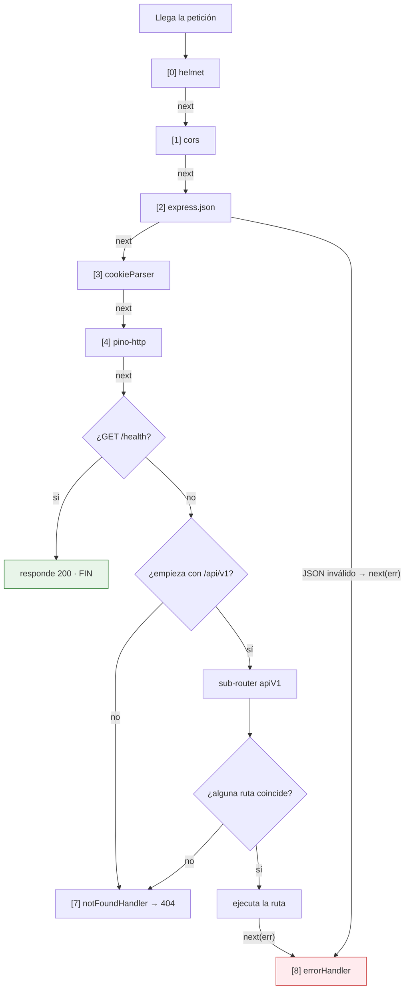
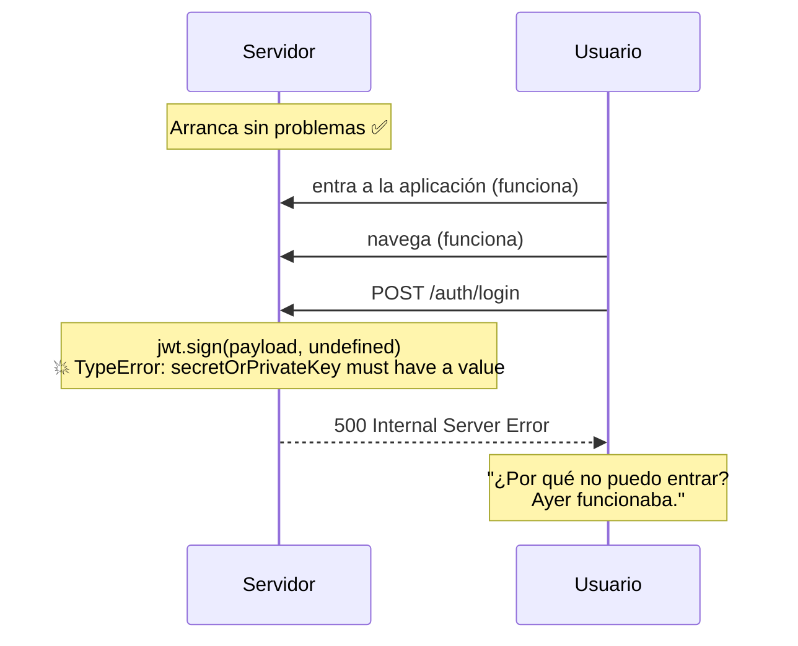
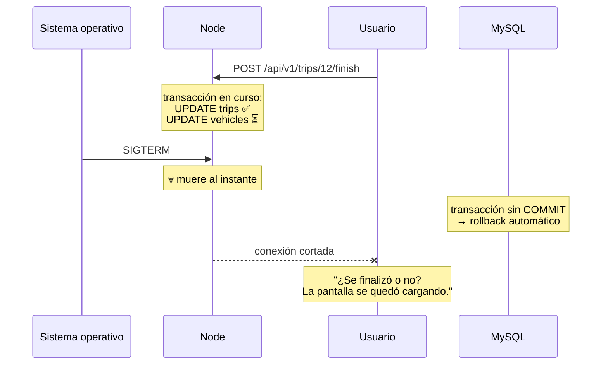
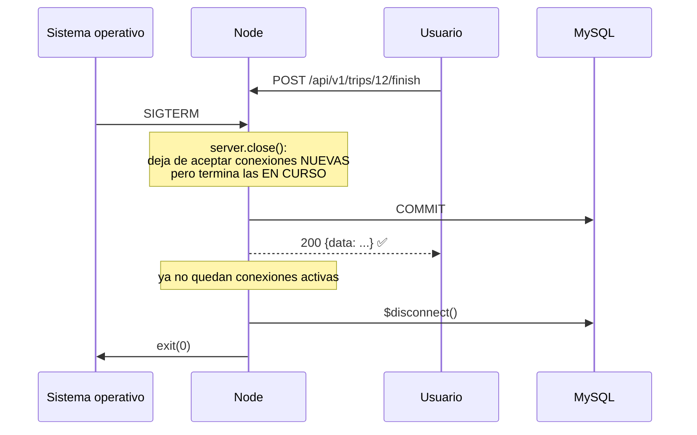
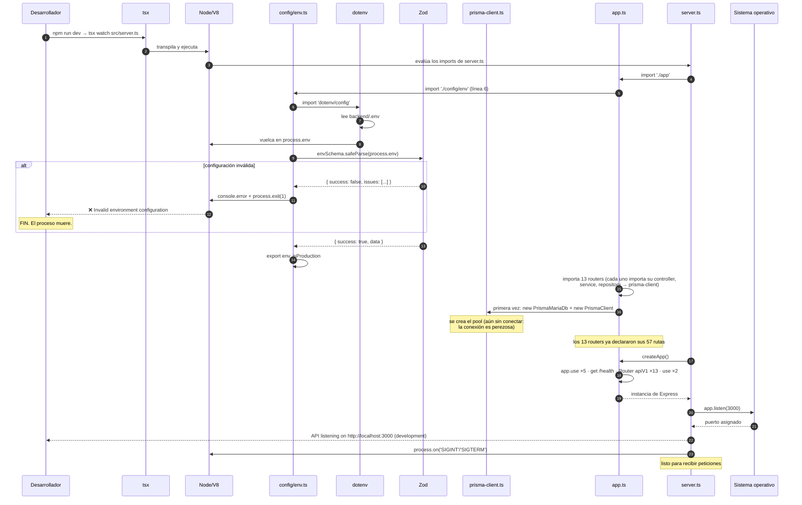
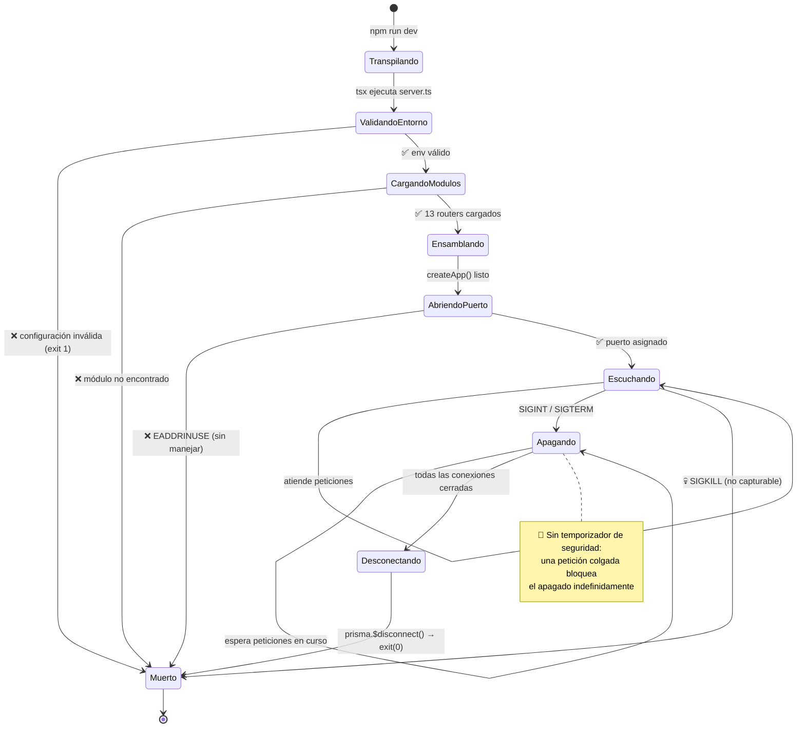
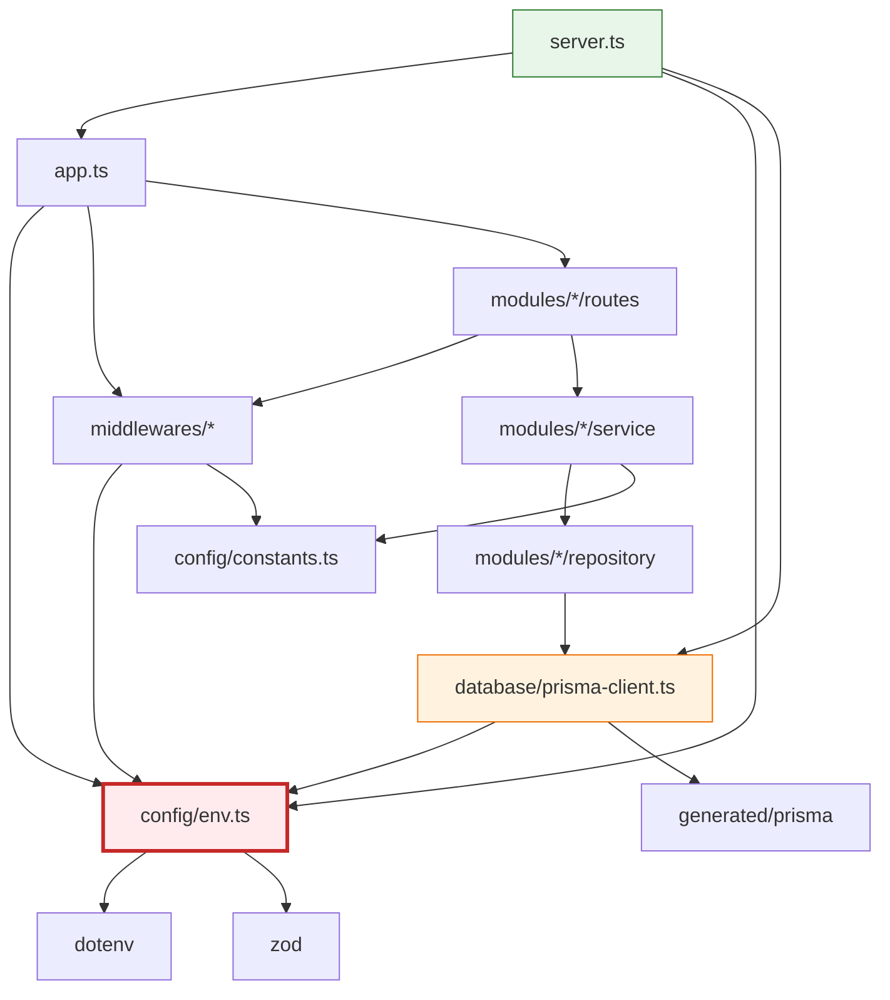

# Capítulo 5 — Arranque del backend

> **Prerrequisitos:** [Capítulo 1](01-conceptos-previos.md), [Capítulo 2](02-arquitectura.md) y [Capítulo 4, §4.4](04-prisma-migraciones-seed.md).
> **Archivos que se explican aquí:** `backend/src/server.ts` (23 líneas), `backend/src/app.ts` (69 líneas), `backend/src/config/env.ts` (50 líneas), `backend/src/config/constants.ts` (17 líneas). Total: 159 líneas, todas.
> **Al terminar** el lector podrá describir, milisegundo a milisegundo, qué ocurre desde que alguien escribe `npm run dev` hasta que el servidor responde su primera petición — y qué ocurre cuando se le pide que se apague.

---

## 5.1. Introducción

Todo proceso tiene un principio. En un servidor HTTP ese principio es más delicado de lo que parece, porque hay que hacer varias cosas en un orden que importa:

1. Cargar y **validar** la configuración, y abortar si está mal.
2. Establecer la conexión con la base de datos.
3. Ensamblar la aplicación: middlewares globales en el orden correcto, rutas montadas, manejadores de error al final.
4. Abrir el puerto y empezar a escuchar.
5. Y, simétricamente, saber **apagarse ordenadamente** cuando el sistema operativo lo pida.

Estos 159 líneas hacen exactamente eso. Son pocas, pero cada una responde a un problema concreto, y varias de ellas están donde están por razones que solo se entienden habiendo visto qué pasa cuando faltan.

---

## 5.2. Conceptos previos

### 5.2.1. Qué es Express y por qué existe

Node.js trae un módulo `http` que permite levantar un servidor:

```js
// — ejemplo ilustrativo: un servidor HTTP con Node puro —
import http from 'node:http';

const server = http.createServer((req, res) => {
  if (req.method === 'GET' && req.url === '/health') {
    res.writeHead(200, { 'Content-Type': 'application/json' });
    res.end(JSON.stringify({ status: 'ok' }));
  } else if (req.method === 'POST' && req.url === '/api/v1/vehicles') {
    let body = '';
    req.on('data', (chunk) => { body += chunk; });
    req.on('end', () => {
      const datos = JSON.parse(body);   // ¿y si el JSON está mal?
      // … y así con 57 endpoints
    });
  } else {
    res.writeHead(404);
    res.end();
  }
});
server.listen(3000);
```

**Los seis problemas que esto tiene y que crecen linealmente con el proyecto:**

1. **Enrutamiento manual.** Con 57 endpoints, ese `if/else` sería una escalera de 200 líneas. Y las rutas con parámetros (`/vehicles/:id`) habría que parsearlas con expresiones regulares.
2. **Parseo del cuerpo manual.** Node entrega el cuerpo como un **flujo de bytes**, en trozos. Hay que acumularlos, decidir cuándo terminó, parsear el JSON, y manejar el caso de JSON inválido.
3. **Sin middlewares.** Aplicar autenticación a 50 endpoints implica llamar a la función de autenticación 50 veces, y acordarse de hacerlo.
4. **Manejo de errores manual.** Un `throw` dentro de un manejador tumba el proceso si nadie lo captura.
5. **Cabeceras a mano.** `Content-Type`, `Content-Length`, códigos de estado.
6. **Nada de cookies, CORS, compresión, ni límites de tamaño.**

**Express** resuelve los seis. Es un **framework minimalista**: no impone estructura de carpetas, ni ORM, ni sistema de plantillas. Solo aporta enrutamiento y un mecanismo de middlewares.

⚙️ **Express es una capa fina sobre `http`.** `app.listen(3000)` internamente hace `http.createServer(app).listen(3000)`, donde `app` es una función `(req, res) => {…}`. Express no reemplaza el módulo `http`: lo envuelve.

💡 **Por qué Express 4 y no Express 5, Fastify, Koa o NestJS.**

| Alternativa | Ventaja | Por qué no acá |
|:--|:--|:--|
| **Express 5** | API moderna, soporte nativo de `async` | En el momento del desarrollo estaba en beta. Ecosistema de tipos menos maduro. |
| **Fastify** | 2-3× más rápido, validación con JSON Schema integrada | El rendimiento no es el cuello de botella (lo es la base de datos). Menos ejemplos y respuestas disponibles. |
| **Koa** | Middlewares async elegantes, del mismo equipo que Express | Ecosistema mucho más chico. Todo hay que armarlo. |
| **NestJS** | Estructura, inyección de dependencias, decoradores, modular | **Demasiada ceremonia** para 13 módulos. Y su magia (decoradores, metadatos por reflexión) oculta el flujo, que en un proyecto académico es justamente lo que se quiere mostrar. |

Express 4 es la opción **aburrida y correcta**: máxima documentación, máxima estabilidad, mínima magia. En un proyecto cuyo objetivo es que se entienda cómo funciona, la ausencia de magia es una característica.

🔴 **La limitación real de Express 4 que hay que conocer: no maneja errores asíncronos.** Si un manejador `async` lanza y nadie lo captura, Express 4 **no lo detecta** y la petición queda colgada hasta que el cliente se rinde por timeout. Esa es la razón por la que **todos** los métodos de **todos** los controladores del proyecto tienen `try { … } catch (err) { next(err) }`. No es paranoia ni verbosidad: es obligatorio. Express 5 lo resuelve; Express 4 no.

### 5.2.2. Qué es un middleware, en detalle

Un **middleware** es una función que se ejecuta entre la llegada de una petición y su respuesta. Su firma:

```ts
(req: Request, res: Response, next: NextFunction) => void
```

| Parámetro | Qué es |
|:--|:--|
| `req` | La petición: método, URL, cabeceras, cuerpo, parámetros. **Mutable.** |
| `res` | La respuesta: métodos para escribirla (`status()`, `json()`, `send()`). |
| `next` | Función que **cede el control al siguiente middleware**. |

**Un middleware tiene exactamente tres finales posibles**, y elegir mal es la fuente de los bugs más desconcertantes de Express:

| Final | Cómo | Qué pasa |
|:--|:--|:--|
| **Continuar** | `next()` | Pasa al siguiente de la cadena. |
| **Responder** | `res.json(...)`, `res.send(...)` | **La cadena termina.** Los siguientes no se ejecutan. |
| **Fallar** | `next(err)` | Salta directo a los manejadores de error. |

🔴 **El cuarto final, que no debería existir: no hacer nada.** Si un middleware no llama a `next()` ni responde, **la petición queda colgada para siempre**. El cliente espera hasta su timeout. En el log del servidor no aparece nada. Es el bug más difícil de diagnosticar en Express, porque no hay error, no hay excepción, no hay traza: solo silencio.

Se puede ver la disciplina de evitarlo en `middlewares/authenticate.ts:14-17`:

```ts
if (!header?.startsWith('Bearer ')) {
  next(new UnauthorizedError('Missing access token'));
  return;                                    // ← el return es obligatorio
}
```

Sin ese `return`, la ejecución seguiría y llamaría a `next()` **dos veces** — lo que produce el error `Cannot set headers after they are sent to the client`.

### 5.2.3. La cadena de middlewares como estructura de datos

Internamente, Express mantiene una **pila ordenada** de capas. Cada `app.use()` y cada `app.get()` agrega una entrada:

```
[ 0] helmet()                          ← app.ts:30
[ 1] cors({...})                       ← app.ts:31
[ 2] express.json({limit:'100kb'})     ← app.ts:32
[ 3] cookieParser()                    ← app.ts:33
[ 4] pinoHttp({...})                   ← app.ts:34
[ 5] GET /health                       ← app.ts:42
[ 6] /api/v1 → apiV1 (sub-router)      ← app.ts:62
[ 7] notFoundHandler                   ← app.ts:65
[ 8] errorHandler  (4 parámetros)      ← app.ts:66
```

Cuando llega una petición, Express recorre la pila de arriba abajo, y para cada entrada evalúa si el método y la ruta coinciden. Si coinciden, ejecuta.

⚙️ **Cómo Express distingue un manejador de error.** Por el **número de parámetros** de la función (`fn.length` en JavaScript). Una función de 4 parámetros `(err, req, res, next)` es un manejador de error; una de 3 o menos es un middleware normal.

🔴 **Esto tiene una consecuencia que sorprende.** Si se escribe:

```ts
// — ejemplo ilustrativo de un ERROR sutil —
app.use((err, req, res) => {   // ← solo 3 parámetros
  res.status(500).json({ error: 'algo' });
});
```

Express lo trata como un **middleware normal**, no como manejador de error. Nunca se invoca ante un error, y en cambio se ejecuta en toda petición normal, respondiendo 500 a todo. Por eso `error-handler.ts:13-18` declara los cuatro parámetros aunque el último no se use, y lo nombra `_next` con guion bajo para que el linter no lo marque como no usado.

**El recorrido, visualizado:**



---

## 5.3. `config/env.ts` línea por línea

Es el primer archivo que se ejecuta en la práctica (por la cadena de imports) y el que decide si el proceso vive o muere.

```ts
1  import 'dotenv/config';
2  import { z } from 'zod';
3
4  /**
5   * Environment configuration, validated at startup.
6   * The app refuses to boot with an invalid configuration (fail-fast):
7   * a misconfigured secret discovered at runtime is far more expensive.
8   */
9  const envSchema = z.object({
10   NODE_ENV: z.enum(['development', 'test', 'production']).default('development'),
11   PORT: z.coerce.number().int().positive().default(3000),
12   CORS_ORIGIN: z.string().url().default('http://localhost:5173'),
13   DATABASE_URL: z.string().min(1),
14   JWT_ACCESS_SECRET: z.string().min(32, 'JWT_ACCESS_SECRET must be at least 32 chars'),
15   JWT_REFRESH_SECRET: z.string().min(32, 'JWT_REFRESH_SECRET must be at least 32 chars'),
16   ACCESS_TOKEN_TTL: z.string().default('15m'),
17   REFRESH_TOKEN_TTL_DAYS: z.coerce.number().int().positive().default(7),
18   PASSWORD_ENCRYPTION_KEY: z
19     .string()
20     .regex(/^[0-9a-f]{64}$/i, 'PASSWORD_ENCRYPTION_KEY must be 64 hex chars (32 bytes)'),
21
22   // --- Email (credentials delivery). All optional: without SMTP config the
23   //     mailer runs in dev mode (logs the message instead of sending). ---
24   SMTP_HOST: z.string().optional(),
25   SMTP_PORT: z.coerce.number().int().positive().optional(),
26   SMTP_SECURE: z
27     .enum(['true', 'false'])
28     .transform((v) => v === 'true')
29     .optional(),
30   SMTP_USER: z.string().optional(),
31   SMTP_PASS: z.string().optional(),
32   MAIL_FROM: z.string().default('Gestión Logística <no-reply@empresa.com>'),
33   /** Login URL included in the credentials email. */
34   APP_URL: z.string().url().default('http://localhost:5173'),
35 });
36
37 const parsed = envSchema.safeParse(process.env);
38
39 if (!parsed.success) {
40   console.error('❌ Invalid environment configuration:');
41   for (const issue of parsed.error.issues) {
42     console.error(`   - ${issue.path.join('.')}: ${issue.message}`);
43   }
44   process.exit(1);
45 }
46
47 export const env = parsed.data;
48 export const isProduction = env.NODE_ENV === 'production';
```

### 5.3.1. El principio de diseño: *fail-fast*

**Fail-fast** significa: si algo está mal, fallá **inmediatamente y ruidosamente**, en lugar de arrancar y romperte más adelante.

El comentario de las líneas 6-7 lo justifica: *"a misconfigured secret discovered at runtime is far more expensive"*.

**Sin fail-fast**, con `JWT_ACCESS_SECRET` sin definir:



El error aparece en el peor momento posible: con usuarios reales, en la operación más crítica, con un mensaje que no dice nada de la causa real.

**Con fail-fast:**

```
❌ Invalid environment configuration:
   - JWT_ACCESS_SECRET: Required
   - PASSWORD_ENCRYPTION_KEY: PASSWORD_ENCRYPTION_KEY must be 64 hex chars (32 bytes)
```

El proceso muere en el arranque, antes de aceptar una sola petición, con un mensaje que dice **exactamente** qué falta.

💡 **La regla general que esto ejemplifica: mover los errores lo más temprano posible.** Un error de compilación es mejor que uno de arranque; uno de arranque es mejor que uno en la primera petición; y ese es mejor que uno que aparece tres semanas después bajo carga. **Cada escalón hacia atrás cuesta órdenes de magnitud menos.**

### 5.3.2. Las variables, una por una

**Línea 10 — `NODE_ENV`**

```ts
NODE_ENV: z.enum(['development', 'test', 'production']).default('development'),
```

`z.enum([...])` restringe a tres valores exactos. Escribir `NODE_ENV=prod` (abreviado) **falla en el arranque** con un mensaje claro, en lugar de silenciosamente no ser `'production'` y dejar activados los detalles de error en un servidor público.

🔴 **Ese modo de fallo silencioso es real y grave.** `error-handler.ts:79` decide qué mostrar según `isProduction`:

```ts
message: isProduction ? 'Internal server error' : String(err),
```

Con `NODE_ENV=prod`, `isProduction` sería `false`, y **cada error 500 filtraría el mensaje interno completo** —incluidos posibles fragmentos de consultas SQL, rutas de archivos del servidor y nombres de tablas— a cualquier usuario. El `z.enum` lo hace imposible.

**Línea 11 — `PORT`**

```ts
PORT: z.coerce.number().int().positive().default(3000),
```

Cuatro validaciones encadenadas:

| Método | Qué hace | Qué rechaza |
|:--|:--|:--|
| `z.coerce.number()` | Convierte string a número | `"abc"` → `NaN` → falla |
| `.int()` | Debe ser entero | `3000.5` |
| `.positive()` | Debe ser > 0 | `0`, `-1` |
| `.default(3000)` | Si no está definida | — |

🔴 **`z.coerce` es indispensable acá, y es un detalle que se olvida constantemente.** **Todas** las variables de entorno son **strings**, siempre, sin excepción. `process.env.PORT` es `"3000"`, nunca `3000`. Sin `coerce`, `z.number()` rechazaría el string y el servidor no arrancaría nunca.

⚙️ **Cómo funciona `coerce` internamente.** Aplica el constructor del tipo antes de validar: `Number("3000")` → `3000`. Para `z.coerce.boolean()` sería `Boolean(v)`, que tiene un comportamiento peligroso: `Boolean("false")` es **`true`** (todo string no vacío es *truthy*). Por eso la línea 26 **no** usa `z.coerce.boolean()` — se explica más abajo.

⚠️ **Lo que `.positive()` NO valida: el rango de puertos.** El máximo es 65535. `PORT=99999` pasa la validación de Zod y falla al llamar a `listen()` con un error de Node menos claro. La corrección sería `.max(65535)`. Y los puertos 1-1023 requieren privilegios de administrador en Unix: `.min(1024)` evitaría un `EACCES` desconcertante.

**Línea 12 — `CORS_ORIGIN`**

```ts
CORS_ORIGIN: z.string().url().default('http://localhost:5173'),
```

`.url()` valida que sea una URL bien formada. `localhost:5173` (sin protocolo) **falla**, y es correcto: la comprobación de origen de CORS compara el valor exacto de la cabecera `Origin`, que **siempre** incluye protocolo.

🔴 **Una trampa clásica: la barra final.** `http://localhost:5173/` (con `/`) pasa `.url()` sin problemas, pero **no coincide** con la cabecera `Origin` que manda el navegador, que es `http://localhost:5173` sin barra. El resultado sería CORS fallando con una configuración que "se ve bien". Ni Zod ni el middleware `cors` lo detectan. Una mejora concreta: `.transform(v => v.replace(/\/$/, ''))`.

⚠️ **Limitación de diseño: solo se admite UN origen.** En producción típicamente hacen falta varios (el dominio principal, un dominio de pruebas, quizá `www` y sin `www`). El middleware `cors` acepta un arreglo o una función. La variable debería ser una lista separada por comas.

**Línea 13 — `DATABASE_URL`**

```ts
DATABASE_URL: z.string().min(1),
```

Solo comprueba que no esté vacía. **Sin `.default()`**: es obligatoria, y con razón — no existe un valor por defecto sensato para la conexión a una base de datos.

⚠️ **Validación deliberadamente laxa.** Se podría validar el formato con una expresión regular (`/^mysql:\/\/.+/`), o incluso intentar parsearla como URL. No se hace, y es defendible: las URLs de conexión de MySQL admiten muchas variantes (con y sin contraseña, con socket Unix, con parámetros). Una validación estricta rechazaría configuraciones válidas. El intercambio: un error de tipeo llega hasta el driver, que da un mensaje peor.

**Líneas 14-15 — los secretos JWT**

```ts
JWT_ACCESS_SECRET: z.string().min(32, 'JWT_ACCESS_SECRET must be at least 32 chars'),
JWT_REFRESH_SECRET: z.string().min(32, 'JWT_REFRESH_SECRET must be at least 32 chars'),
```

**`.min(32)` no es un número arbitrario.** El algoritmo por defecto de `jsonwebtoken` es **HS256** (HMAC-SHA256), cuya clave debería tener al menos 256 bits = 32 bytes para igualar la fuerza del hash. Una clave más corta reduce la seguridad efectiva de la firma.

🔴 **Consecuencia de una clave débil, en concreto.** Si `JWT_ACCESS_SECRET` fuera `"secreto"`, un atacante podría hacer fuerza bruta sobre ella —hay herramientas dedicadas a esto, como `jwt_tool`— y, una vez obtenida, **firmar sus propios tokens**. Podría emitirse a sí mismo un token con `{"sub": 1, "role": "ADMIN"}` y tendría control total del sistema sin conocer ninguna contraseña. La validación de 32 caracteres es una barrera mínima, no una garantía.

💡 **El segundo argumento de `.min()` es el mensaje de error personalizado.** Sin él, Zod diría `String must contain at least 32 character(s)`, sin decir de qué campo. Como el bucle de la línea 42 imprime `issue.path` **y** `issue.message`, en este caso hay redundancia — pero el mensaje explícito es más claro para alguien que ve el error por primera vez.

⚠️ **Lo que NO se valida: que los dos secretos sean DISTINTOS.** Si alguien pusiera el mismo valor en ambos, un refresh token podría usarse como access token y viceversa. Sería un fallo de seguridad grave y silencioso. Zod puede expresarlo con `.refine()` a nivel del objeto:

```ts
// — mejora propuesta —
}).refine((e) => e.JWT_ACCESS_SECRET !== e.JWT_REFRESH_SECRET, {
  message: 'JWT_ACCESS_SECRET y JWT_REFRESH_SECRET deben ser distintos',
});
```

**`.env.example:10` documenta cómo generarlos:**

```bash
node -e "console.log(require('crypto').randomBytes(48).toString('hex'))"
```

48 bytes → 96 caracteres hexadecimales. Muy por encima del mínimo, y generados con el generador criptográficamente seguro del sistema operativo — no con `Math.random()`, que es predecible.

**Línea 16 — `ACCESS_TOKEN_TTL`**

```ts
ACCESS_TOKEN_TTL: z.string().default('15m'),
```

Un **string**, no un número, porque `jsonwebtoken` acepta la sintaxis de la librería `ms`: `'15m'`, `'2h'`, `'7d'`, `'30s'`.

🔴 **Es la validación más débil del archivo.** `z.string()` acepta **cualquier cosa**: `'quince minutos'`, `'abc'`, `''`. La librería `ms` devuelve `undefined` ante un formato inválido, y `jsonwebtoken` entonces emite un token **sin vencimiento**. Un token que nunca expira es exactamente lo contrario de lo que se buscaba con un access token de vida corta.

**La corrección es una línea:**

```ts
// — mejora propuesta —
ACCESS_TOKEN_TTL: z.string().regex(/^\d+[smhd]$/, 'Formato inválido: usar 15m, 2h, 7d').default('15m'),
```

💡 **Por qué 15 minutos es un buen valor por defecto.** Es el equilibrio entre dos riesgos: un token robado sirve como máximo 15 minutos (ventana de daño acotada), y el usuario no percibe la renovación porque el interceptor de Axios la hace transparente (§2.3.5). Bajarlo a 1 minuto multiplicaría por 15 las llamadas a `/auth/refresh` sin ganancia proporcional de seguridad; subirlo a 24 horas anularía el propósito de tener refresh tokens.

**Línea 17 — `REFRESH_TOKEN_TTL_DAYS`**

```ts
REFRESH_TOKEN_TTL_DAYS: z.coerce.number().int().positive().default(7),
```

Siete días: el usuario que entra al menos una vez por semana **nunca** vuelve a escribir su contraseña. El que se ausenta más, sí.

**Nótese la asimetría con la línea 16:** el TTL del access token es un string (`'15m'`) y el del refresh es un número de días. Es porque los consume código distinto: uno va directo a `jsonwebtoken`, el otro se usa para calcular una fecha con aritmética. Es una inconsistencia menor pero real: dos formas de expresar lo mismo en el mismo archivo.

**Líneas 18-20 — `PASSWORD_ENCRYPTION_KEY`**

```ts
PASSWORD_ENCRYPTION_KEY: z
  .string()
  .regex(/^[0-9a-f]{64}$/i, 'PASSWORD_ENCRYPTION_KEY must be 64 hex chars (32 bytes)'),
```

**La validación más estricta del archivo**, y con motivo.

Desarmemos la expresión regular:

| Fragmento | Significa |
|:--|:--|
| `^` | Inicio de la cadena |
| `[0-9a-f]` | Un carácter hexadecimal |
| `{64}` | Exactamente 64 de ellos |
| `$` | Fin de la cadena |
| `/i` | Sin distinguir mayúsculas (acepta `A-F`) |

**Por qué exactamente 64.** `crypto.ts:12` hace:

```ts
const KEY = Buffer.from(env.PASSWORD_ENCRYPTION_KEY, 'hex');
```

64 caracteres hexadecimales = 32 bytes = 256 bits, que es **exactamente** lo que exige AES-**256**-GCM.

🔴 **Qué pasaría sin esta validación, y por qué es tan grave.** `Buffer.from('xyz', 'hex')` **no lanza error**: los caracteres inválidos se descartan silenciosamente. Con una clave de 10 caracteres hexadecimales, se obtendría un buffer de 5 bytes, y `createCipheriv('aes-256-gcm', KEY, iv)` fallaría con `Invalid key length` — **en el momento de crear el primer chofer**, no al arrancar. El administrador vería un 500 al dar de alta a alguien, sin ninguna pista de que el problema es una variable de entorno.

Peor aún: si la clave tuviera caracteres no hexadecimales pero llegara a 32 bytes útiles, el cifrado **funcionaría** con una clave distinta de la que el operador cree tener. Y si alguien la "corrigiera" después, **todas las contraseñas cifradas se volverían indescifrables**.

💡 **La validación estricta acá es proporcional al costo del fallo.** Es el mismo criterio que hace que la validación de `DATABASE_URL` sea laxa: allá un error da un mensaje malo pero recuperable; acá da corrupción silenciosa de datos.

**Líneas 24-31 — la configuración SMTP, toda opcional**

```ts
SMTP_HOST: z.string().optional(),
SMTP_PORT: z.coerce.number().int().positive().optional(),
SMTP_SECURE: z.enum(['true', 'false']).transform((v) => v === 'true').optional(),
SMTP_USER: z.string().optional(),
SMTP_PASS: z.string().optional(),
```

💡 **Que sean todas opcionales es una decisión de diseño de alto valor, ya señalada en §2.10.** Sin ellas, el mailer entra en modo desarrollo (`mailer.ts:26`): construye el mensaje y lo registra sin enviarlo. Consecuencia: **el proyecto completo se levanta y se prueba sin ninguna cuenta de terceros.** Cualquiera puede clonar el repositorio y tenerlo funcionando en cinco minutos.

**Líneas 26-29 — `SMTP_SECURE` merece atención especial:**

```ts
SMTP_SECURE: z
  .enum(['true', 'false'])
  .transform((v) => v === 'true')
  .optional(),
```

**Tres operaciones encadenadas:**

1. `z.enum(['true','false'])` — valida que el **string** sea exactamente `"true"` o `"false"`.
2. `.transform(v => v === 'true')` — convierte a **booleano** real.
3. `.optional()` — puede no estar.

🔴 **¿Por qué no simplemente `z.coerce.boolean()`?** Porque sería un desastre. `z.coerce.boolean()` aplica `Boolean(v)`, y en JavaScript **todo string no vacío es `true`**:

| Valor de la variable | `z.coerce.boolean()` | Este esquema |
|:--|:--|:--|
| `"true"` | `true` ✅ | `true` ✅ |
| `"false"` | **`true`** 🔴 | `false` ✅ |
| `"0"` | **`true`** 🔴 | ❌ rechaza con error claro |
| `"no"` | **`true`** 🔴 | ❌ rechaza con error claro |

**Poner `SMTP_SECURE=false` activaría TLS.** Es un bug perfecto: silencioso, contraintuitivo, y que solo se manifiesta al intentar enviar un correo real contra un servidor que no espera TLS en ese puerto.

**Este patrón de tres pasos es la forma correcta de leer booleanos de variables de entorno**, y vale la pena memorizarlo.

⚠️ **Un detalle del tipo resultante.** El orden `.transform().optional()` produce `boolean | undefined`. Si fuera `.optional().transform()`, el `transform` recibiría `string | undefined` y `undefined === 'true'` daría `false` — perdiendo la distinción entre "configurado como false" y "no configurado". El orden importa, y este es el correcto. Se ve el efecto en `mailer.ts:21`: `secure: env.SMTP_SECURE ?? false` — el `??` solo actúa si es `undefined`.

⚠️ **`SMTP_PASS` es un secreto y está tipado como `z.string()` común.** No hay nada que impida que aparezca en un log si alguien imprimiera `env` completo. Una mejora sería marcarlo con una marca de tipo (*branded type*) o envolverlo en un objeto con `toString()` sobrescrito que devuelva `'[REDACTED]'`.

**Líneas 32-34 — valores por defecto con contenido:**

```ts
MAIL_FROM: z.string().default('Gestión Logística <no-reply@empresa.com>'),
APP_URL: z.string().url().default('http://localhost:5173'),
```

`MAIL_FROM` usa el formato RFC 5322 `Nombre <dirección>`, que los clientes de correo muestran como "Gestión Logística" en lugar de la dirección cruda.

⚠️ **`MAIL_FROM` NO valida el formato de correo.** `z.string()` acepta cualquier cosa. `.email()` no serviría directamente porque el formato incluye el nombre. Habría que usar una expresión regular específica. Un valor mal formado hace que el servidor SMTP rechace el envío — y como `sendCredentialsEmail` **nunca lanza** (`mailer.ts:71`), el fallo pasaría **completamente inadvertido**: el usuario se crearía, nadie recibiría credenciales, y el log tendría una línea que nadie mira.

### 5.3.3. La validación y el aborto (líneas 37-48)

**Línea 37 — `safeParse`, no `parse`**

```ts
const parsed = envSchema.safeParse(process.env);
```

| Método | Ante un error |
|:--|:--|
| `.parse(datos)` | **Lanza** un `ZodError` |
| `.safeParse(datos)` | Devuelve `{ success: false, error }` |

💡 **Por qué `safeParse` acá.** Con `.parse()`, el error subiría sin capturar y Node imprimiría un stack trace de 30 líneas con el interior de Zod, del que habría que extraer la información útil. Con `safeParse`, el código controla el formato del mensaje: cinco líneas legibles con exactamente lo que falta.

**Es el criterio general del proyecto:** `safeParse` cuando el código va a formatear el error (acá y en `middlewares/validate.ts:13`), `parse` cuando conviene que suba al manejador global.

**Líneas 39-45 — el reporte de errores**

```ts
if (!parsed.success) {
  console.error('❌ Invalid environment configuration:');
  for (const issue of parsed.error.issues) {
    console.error(`   - ${issue.path.join('.')}: ${issue.message}`);
  }
  process.exit(1);
}
```

- `parsed.error.issues` es un **arreglo**: Zod recolecta **todos** los problemas, no se detiene en el primero. Quien tenga tres variables mal las ve las tres de una vez.
- `issue.path.join('.')` — `path` es un arreglo de segmentos (`['SMTP_PORT']`, o `['config','nested','field']` en objetos anidados). El `join` lo convierte en una ruta legible.
- `console.error`, no `console.log`: escribe a **stderr**, que es el canal correcto para errores y el que los sistemas de supervisión leen.
- `process.exit(1)` — código **1** = error.

🔴 **Aquí NO se usa el logger `pino`, y es correcto.** Pino se configura en `app.ts:34`, que se ejecuta **después** de este archivo. En el momento en que esto falla, no hay logger disponible. `console.error` es la única opción, y es la adecuada: un fallo de arranque tiene que ser visible en la salida estándar del proceso, sin depender de infraestructura que quizá no esté lista.

**Línea 47 — `export const env = parsed.data`**

```ts
export const env = parsed.data;
```

⚙️ **El estrechamiento de tipos por flujo de control, en acción.** `parsed` tiene tipo `{ success: true, data: T } | { success: false, error: ZodError }`. Dentro del `if (!parsed.success)` TypeScript sabe que es la segunda variante. Pero ese bloque termina en `process.exit(1)`, cuyo tipo de retorno es `never` — y TypeScript entiende que **la ejecución no puede continuar por ahí**. Por eso, en la línea 47, `parsed` está estrechado a `{ success: true, data: T }` y `parsed.data` es accesible sin comprobación.

💡 **Es un ejemplo elegante de cómo el sistema de tipos entiende el flujo real del programa.** Si `process.exit(1)` se reemplazara por `return`, TypeScript se quejaría en la línea 47, porque un `return` en el ámbito de módulo no impide la continuación.

**El tipo de `env` es completamente inferido**, y es exacto:

```ts
{
  NODE_ENV: 'development' | 'test' | 'production';
  PORT: number;
  CORS_ORIGIN: string;
  DATABASE_URL: string;
  JWT_ACCESS_SECRET: string;
  JWT_REFRESH_SECRET: string;
  ACCESS_TOKEN_TTL: string;
  REFRESH_TOKEN_TTL_DAYS: number;
  PASSWORD_ENCRYPTION_KEY: string;
  SMTP_HOST?: string;
  SMTP_PORT?: number;
  SMTP_SECURE?: boolean;      // ← boolean, no string: el transform hizo su trabajo
  SMTP_USER?: string;
  SMTP_PASS?: string;
  MAIL_FROM: string;
  APP_URL: string;
}
```

**Los que tienen `.default()` NO son opcionales en el tipo.** `PORT: number`, no `PORT?: number`. Correcto: después de validar, siempre hay un valor. Es la diferencia entre "el usuario puede no proveerlo" y "el programa puede no tenerlo".

**Línea 48 — `isProduction`**

```ts
export const isProduction = env.NODE_ENV === 'production';
```

Una constante booleana derivada, calculada **una vez**. Se usa en tres lugares (`app.ts:36`, `error-handler.ts:79`, `mailer.ts:63`).

💡 **Por qué exportar esto en vez de repetir la comparación.** Tres razones: (a) evita errores de tipeo en el string `'production'`; (b) documenta que "producción" es un concepto del proyecto, no una comparación ad hoc; (c) si mañana la definición cambiara (por ejemplo, incluir un entorno `'staging'` como productivo), se cambia un lugar.

### 5.3.4. El efecto secundario del import

🔴 **Este archivo hace trabajo real al ser importado, y eso tiene consecuencias.**

```ts
import { env } from './config/env';
```

Esa línea, en cualquier archivo del proyecto, **ejecuta** la validación completa (si es la primera vez). Si falla, **mata el proceso**.

**Consecuencias, buenas y malas:**

| ✅ Bueno | 🔴 Malo |
|:--|:--|
| Es imposible usar `env` sin haberlo validado. | **Los tests que importan cualquier cosa que dependa de `env` necesitan un `.env` válido.** |
| El fallo ocurre lo más temprano posible. | No se puede probar el comportamiento con configuraciones distintas sin manipular `process.env` antes del import. |
| No hay que acordarse de llamar a nada. | Un `import` con efecto secundario oculto viola el principio de menor sorpresa. |

⚠️ **Esto explica una limitación concreta de los tests del proyecto.** `crypto.test.ts` prueba `encrypt`/`decrypt`, que importan `env` (por `crypto.ts:2`). Ese test **no puede correr sin un `.env` válido con `PASSWORD_ENCRYPTION_KEY`**. Los 23 tests del backend son de funciones puras precisamente porque cualquier cosa más ambiciosa arrastraría esta dependencia.

**La alternativa sería inyección de dependencias:** una función `loadEnv()` que devuelva la configuración, y pasarla explícitamente a quien la necesite. Más testeable, más verboso, y con el riesgo de que alguien olvide llamarla. Para este proyecto, el módulo con efecto secundario es el intercambio razonable — pero es importante saber que es un intercambio.

---

## 5.4. `config/constants.ts` línea por línea

Diecisiete líneas, cinco constantes, y cada una con su trazabilidad al documento funcional.

```ts
1  /** Project-wide constants derived from the functional document. */
2
3  /** F-9: maximum attachment size — 1 MB. */
4  export const MAX_FILE_SIZE_BYTES = 1024 * 1024;
5
6  /** Allowed upload formats (DOC-5): PDF, JPG, PNG. */
7  export const ALLOWED_MIME_TYPES = ['application/pdf', 'image/jpeg', 'image/png'] as const;
8
9  /** Root folder for uploaded files (metadata lives in the DB; files on disk). */
10 export const UPLOAD_ROOT = 'uploads';
11
12 /** A-12 / RN-17: expiry alerts fire two weeks before the due date. */
13 export const EXPIRY_ALERT_LEAD_DAYS = 14;
14
15 /** RN-21: fixed origin for every trip. */
16 export const FIXED_TRIP_ORIGIN =
17   'Ciudad Industria, Autopista Córdoba - Rosario, Rosario, Santa Fe';
```

💡 **Lo primero que hay que notar: cada constante cita su origen** (`F-9`, `DOC-5`, `A-12`, `RN-17`, `RN-21`). Eso permite ir de una línea de código al párrafo exacto del documento funcional que la justifica. Es trazabilidad de requisitos con el costo de escribir cinco caracteres.

**Línea 4 — `1024 * 1024`, no `1048576`**

```ts
export const MAX_FILE_SIZE_BYTES = 1024 * 1024;
```

Se escribe como producto porque **comunica la intención**: "un mega, es decir 1024 kilos de 1024 bytes". `1048576` sería el mismo número sin ninguna pista de dónde sale.

⚙️ **El motor evalúa `1024 * 1024` en tiempo de compilación** (*constant folding*): no hay ninguna multiplicación en tiempo de ejecución. Legibilidad gratis.

**Se usa en dos lugares con propósitos complementarios:**

| Lugar | Uso |
|:--|:--|
| `middlewares/upload.ts:28` | `limits: { fileSize: MAX_FILE_SIZE_BYTES }` — multer **aborta** la subida al superarlo |
| `middlewares/error-handler.ts:44` | Construye el mensaje: `` `File exceeds the maximum size of ${MAX_FILE_SIZE_BYTES / 1024} KB` `` |

🔴 **Un detalle de coherencia:** el mensaje dice "1024 KB", no "1 MB". Es correcto pero poco natural para un usuario. Y si alguien cambiara la constante a, digamos, 512 KB, el mensaje diría "512 KB" correctamente — el cálculo se adapta. Es mejor que un mensaje con el número escrito a mano, que se desincronizaría.

**Línea 7 — `as const` sobre un arreglo**

```ts
export const ALLOWED_MIME_TYPES = ['application/pdf', 'image/jpeg', 'image/png'] as const;
```

Sin `as const`, el tipo sería `string[]`. Con `as const`, es:

```ts
readonly ['application/pdf', 'image/jpeg', 'image/png']
```

**Dos consecuencias:**

1. **`readonly`** — `ALLOWED_MIME_TYPES.push('application/x-msdownload')` es un error de compilación. Un módulo malicioso o un descuido no pueden ampliar la lista de tipos permitidos en tiempo de ejecución. Para una lista de seguridad, esto importa.
2. **Los literales exactos** — permiten derivar el tipo unión, que es exactamente lo que hace `upload.ts:18`:

```ts
if (!ALLOWED_MIME_TYPES.includes(file.mimetype as (typeof ALLOWED_MIME_TYPES)[number])) {
```

`(typeof ALLOWED_MIME_TYPES)[number]` es un **tipo de acceso indexado sobre un arreglo**: indexar un tipo de tupla con `number` da la unión de todos sus elementos, es decir `'application/pdf' | 'image/jpeg' | 'image/png'`.

🔴 **La aserción `as` en esa línea existe por una limitación real de TypeScript.** `readonly [...].includes(x)` exige que `x` sea del tipo del arreglo. Pero `file.mimetype` es `string` (viene de una cabecera HTTP, puede ser cualquier cosa) — y comprobar si un `string` cualquiera está en la lista es **justamente el propósito** de la línea. TypeScript lo rechaza por ser demasiado estricto. La aserción lo desbloquea.

💡 **Esta es una crítica conocida a `Array.prototype.includes` en TypeScript.** La alternativa más limpia sería un `Set<string>` o una función auxiliar `isAllowedMime(m: string): m is AllowedMime`. Con tres elementos, la aserción es aceptable, pero es fricción con el sistema de tipos, no un uso natural de él.

⚠️ **La debilidad de fondo: `file.mimetype` viene del CLIENTE.** El navegador lo declara en la cabecera de la parte multipart, y **cualquiera puede mentir**. Renombrando `virus.exe` a `documento.pdf` y declarando `Content-Type: application/pdf`, la comprobación pasa. La verificación real requeriría inspeccionar los **números mágicos** del contenido (los primeros bytes: `%PDF` para PDF, `\xFF\xD8\xFF` para JPEG, `\x89PNG` para PNG). El proyecto **no lo hace**. Como los archivos se sirven como descarga y nunca se ejecutan, el riesgo está acotado — pero es una superficie de ataque real, y se detalla en el capítulo 25.

**Línea 10 — `UPLOAD_ROOT = 'uploads'`**

**Ruta relativa**, no absoluta. Se resuelve contra el **directorio de trabajo actual** del proceso.

🔴 **Esto es frágil, y de una forma que no es obvia.** Si el servidor se ejecuta desde `backend/`, los archivos van a `backend/uploads/`. Si alguien lo lanza desde la raíz del repositorio con `node backend/dist/server.js`, van a `DSWTP/uploads/` — **un directorio distinto**. Los archivos subidos antes dejarían de encontrarse, sin ningún error al arrancar.

**La corrección sería anclar la ruta al archivo, no al directorio de trabajo:**

```ts
// — mejora propuesta —
import path from 'node:path';
import { fileURLToPath } from 'node:url';
const __dirname = path.dirname(fileURLToPath(import.meta.url));
export const UPLOAD_ROOT = path.resolve(__dirname, '../../uploads');
```

💡 **Es un ejemplo del patrón general: las rutas relativas al directorio de trabajo son una bomba de tiempo en despliegue.** Funcionan siempre en desarrollo (donde uno siempre arranca desde el mismo lugar) y fallan en producción (donde el gestor de procesos elige el directorio).

**Línea 13 — `EXPIRY_ALERT_LEAD_DAYS = 14`**

Catorce días de anticipación para las alertas de vencimiento. Es el número que hace que Carlos (licencia a 10 días, `seed.ts:133`) genere alerta y Juan (400 días) no.

⚠️ **Es un único valor para todos los tipos de vencimiento.** Licencia, seguro y documentación usan los mismos 14 días. En la realidad los plazos difieren: renovar un seguro puede llevar dos días, renovar una licencia puede llevar un mes con turno previo. Un modelo más fiel tendría un plazo por tipo. Es una simplificación defendible para el alcance del proyecto, pero es una simplificación.

**Líneas 16-17 — `FIXED_TRIP_ORIGIN`**

Ya señalado en §3.4.9: **está duplicado** con el `@default` de `schema.prisma:215`. Dos fuentes de verdad para el mismo dato.

**Los tres escenarios de divergencia:**

| Situación | Qué pasa |
|:--|:--|
| Se cambia solo en `constants.ts` | Los viajes creados por la aplicación tienen el origen nuevo; los creados sin especificarlo (o directamente en la base) tienen el viejo. |
| Se cambia solo en `schema.prisma` | Requiere migración. La aplicación sigue escribiendo el viejo explícitamente, así que el `@default` nunca se usa. |
| Se cambia en ambos | Correcto, pero hay que acordarse. |

💡 **La solución correcta ya existe en el modelo: `company_settings`.** Esa tabla guarda la dirección de la empresa. El origen del viaje debería salir de ahí, y entonces cambiar de sede sería editar un formulario en lugar de generar una migración. Es la mejora de mayor relación beneficio/costo que se detecta en este archivo.

---

## 5.5. `app.ts` línea por línea

Es el archivo que **define el orden en que todo ocurre**. Sesenta y nueve líneas donde el orden es semántica.

### 5.5.1. Imports (líneas 1-20)

```ts
1  import express from 'express';
2  import cookieParser from 'cookie-parser';
3  import cors from 'cors';
4  import helmet from 'helmet';
5  import { pinoHttp } from 'pino-http';
6  import { env, isProduction } from './config/env';
7  import { errorHandler, notFoundHandler } from './middlewares/error-handler';
8  import { authRoutes } from './modules/auth/auth.routes';
   … (12 imports de routers más)
```

**El orden de los imports sigue una convención implícita pero consistente:** primero los paquetes externos (1-5), después la configuración propia (6), después los middlewares (7), después los módulos (8-20). Es la convención habitual en el ecosistema, y ayuda a leer de un vistazo qué depende de qué.

🔴 **La línea 6 tiene un efecto secundario crítico y no evidente.** `import { env } from './config/env'` **ejecuta la validación completa** del capítulo anterior. Si falta una variable, el proceso muere **aquí**, antes de que se ejecute una sola línea de `createApp()`. Es fail-fast funcionando exactamente como se diseñó.

**Los 13 imports de routers (líneas 8-20)** son la única parte "manual" del ensamblaje. Agregar un módulo requiere agregar un import y una línea de montaje.

⚠️ **Se podría automatizar** con carga dinámica de la carpeta `modules/`. **No se hace, y es la decisión correcta:** la carga automática oculta qué está montado, rompe el análisis estático (el editor no puede seguir la referencia), y hace que un archivo mal nombrado desaparezca silenciosamente de la API. **Explícito supera a mágico**, sobre todo en un proyecto que se lee para aprender.

### 5.5.2. La función y su justificación (líneas 22-27)

```ts
22 /**
23  * Express app assembly. Kept separate from server.ts so tests can import
24  * the app without opening a port.
25  */
26 export function createApp(): express.Express {
27   const app = express();
```

💡 **La separación entre `app.ts` y `server.ts` es una decisión de testeabilidad, declarada en el comentario.**

**Sin la separación**, para probar un endpoint habría que:
1. Levantar el servidor en un puerto real.
2. Hacer una petición HTTP de verdad.
3. Cerrar el servidor.
4. Y lidiar con puertos ocupados si dos tests corren en paralelo.

**Con la separación**, una librería como `supertest` puede hacer:

```ts
// — ejemplo ilustrativo de un test que ESTA arquitectura habilita —
import request from 'supertest';
import { createApp } from '../src/app';

const app = createApp();
const res = await request(app).get('/health');
expect(res.status).toBe(200);
```

**Sin abrir ningún puerto.** `supertest` invoca la función `app` directamente con objetos `req`/`res` simulados.

⚠️ **El proyecto NO tiene tests de este tipo.** La arquitectura los habilita, pero `vitest.config.ts:11` solo incluye `src/**/*.test.ts`, y esos son los cuatro archivos de schemas más los de crypto y dates. **La infraestructura está lista y no se usa.** Es la deuda de testing más concreta y de menor costo de resolver: agregar `supertest` y escribir tests de endpoints no requiere cambiar ni una línea de la aplicación.

**`createApp` es una función, no un valor exportado.** Cada llamada devuelve una instancia **nueva e independiente**. En un test, esto permite que cada caso tenga su propia aplicación sin estado compartido.

### 5.5.3. Los middlewares globales (líneas 29-39)

```ts
29 // --- Global middlewares ---
30 app.use(helmet());
31 app.use(cors({ origin: env.CORS_ORIGIN, credentials: true })); // credentials: refresh cookie
32 app.use(express.json({ limit: '100kb' })); // JSON bodies are small; files use multipart later
33 app.use(cookieParser());
34 app.use(
35   pinoHttp({
36     transport: isProduction ? undefined : { target: 'pino-pretty' },
37     redact: ['req.headers.authorization', 'req.headers.cookie'],
38   }),
39 );
```

#### Línea 30 — `helmet()`

**Qué es.** Un conjunto de ~15 middlewares que agregan cabeceras HTTP de seguridad. Cada una mitiga un ataque conocido.

**Las principales cabeceras que agrega, y contra qué protegen:**

| Cabecera | Valor | Ataque que mitiga |
|:--|:--|:--|
| `X-Content-Type-Options` | `nosniff` | El navegador **no adivina** el tipo de contenido. Sin esto, un archivo subido con contenido HTML pero declarado como imagen podría ejecutarse como HTML. |
| `X-Frame-Options` | `SAMEORIGIN` | **Clickjacking**: impide que un sitio malicioso incruste la aplicación en un `<iframe>` invisible y engañe al usuario para que haga clic en botones reales. |
| `Strict-Transport-Security` | `max-age=15552180` | **Degradación a HTTP**: obliga al navegador a usar HTTPS durante 180 días, incluso si el usuario escribe `http://`. |
| `X-DNS-Prefetch-Control` | `off` | Evita fugas de información por resolución anticipada de DNS. |
| `X-Download-Options` | `noopen` | Impide que Internet Explorer abra descargas en el contexto del sitio. |
| `Content-Security-Policy` | política por defecto | **XSS**: restringe de dónde se pueden cargar scripts. |
| `Referrer-Policy` | `no-referrer` | Evita filtrar la URL de origen a sitios externos. |
| *(elimina)* `X-Powered-By` | — | Ocultación: sin ella, un atacante sabe que es Express y puede buscar vulnerabilidades específicas. |

⚠️ **Para una API que solo devuelve JSON, varias de estas cabeceras son irrelevantes.** `Content-Security-Policy` protege páginas HTML; `X-Frame-Options` protege contra incrustación de páginas. Ninguna aplica a una respuesta `application/json`.

**¿Por qué está entonces?** Porque **el costo es cero y la cobertura es completa**. Si mañana algún endpoint devolviera HTML (una página de error, un reporte, una vista de previsualización), la protección ya estaría. Es defensa en profundidad: proteger contra lo que todavía no existe.

🔴 **Está primero en la cadena, y eso es deliberado.** Las cabeceras deben aplicarse a **todas** las respuestas, incluidas las de error y las 404. Si `helmet()` estuviera después del router, una respuesta 404 saldría sin cabeceras de seguridad.

#### Línea 31 — `cors(...)`

```ts
app.use(cors({ origin: env.CORS_ORIGIN, credentials: true }));
```

**Qué hace concretamente:**

1. Lee la cabecera `Origin` de la petición.
2. Si coincide con `env.CORS_ORIGIN`, agrega `Access-Control-Allow-Origin: <ese origen>`.
3. Con `credentials: true`, agrega `Access-Control-Allow-Credentials: true`.
4. Ante una petición `OPTIONS` (*preflight*), responde con las cabeceras de permiso y **no** deja que siga la cadena.

⚙️ **Qué es una petición *preflight*, y por qué duplica el tráfico.** El navegador, antes de enviar una petición "no simple", manda automáticamente un `OPTIONS` preguntando si está permitida. Una petición es "no simple" si usa un método distinto de GET/HEAD/POST, o si tiene cabeceras personalizadas.

🔴 **En este proyecto, CASI TODAS las peticiones son *no simples***, porque llevan `Authorization: Bearer …`. Eso significa que **cada llamada a la API son en realidad dos viajes de red**:

```http
OPTIONS /api/v1/vehicles/7 HTTP/1.1
Origin: http://localhost:5173
Access-Control-Request-Method: PATCH
Access-Control-Request-Headers: authorization, content-type

HTTP/1.1 204 No Content
Access-Control-Allow-Origin: http://localhost:5173
Access-Control-Allow-Methods: GET,POST,PATCH,DELETE
Access-Control-Allow-Headers: authorization,content-type
Access-Control-Allow-Credentials: true
Access-Control-Max-Age: 5              ← ¡solo 5 segundos!

PATCH /api/v1/vehicles/7 HTTP/1.1
...
```

⚠️ **`Access-Control-Max-Age` por defecto en el paquete `cors` es 5 segundos.** El navegador puede cachear la respuesta del preflight ese tiempo. Cinco segundos es prácticamente nada: el usuario navegando por la aplicación dispara un preflight por cada acción. Configurar `maxAge: 86400` (24 horas) **reduciría a la mitad el número de peticiones HTTP** de toda la aplicación. Es una optimización de una línea con impacto medible, y no está hecha.

**`credentials: true` es obligatorio en este proyecto.** El refresh token viaja en una cookie `httpOnly`. Sin esta opción, el navegador **no enviaría** la cookie en peticiones de origen cruzado, y `/auth/refresh` nunca funcionaría. El comentario de la línea 31 (`// credentials: refresh cookie`) lo documenta.

🔴 **Y hay que repetirlo porque es un error muy común: `origin: '*'` junto con `credentials: true` es ILEGAL** según la especificación. El navegador rechaza la respuesta. Es una protección deliberada: permitir credenciales desde cualquier origen equivaldría a desactivar la política de mismo origen por completo.

#### Línea 32 — `express.json({ limit: '100kb' })`

```ts
app.use(express.json({ limit: '100kb' }));
```

**Qué hace, paso a paso:**

1. Comprueba si `Content-Type` es `application/json`. **Si no lo es, no hace nada** y llama a `next()`.
2. Si lo es, acumula el flujo de bytes del cuerpo.
3. Verifica que no supere 100 KB.
4. Ejecuta `JSON.parse`.
5. Asigna el resultado a `req.body`.
6. Si el JSON es inválido → `next(err)` con un `SyntaxError`.

🔴 **Sin este middleware, `req.body` es `undefined` en TODAS las rutas.** Es la causa número uno de los "no me llegan los datos" en Express. El síntoma clásico: `TypeError: Cannot read properties of undefined (reading 'email')` en la primera línea de un controlador.

**El límite de 100 KB — el razonamiento completo:**

El comentario dice: *"JSON bodies are small; files use multipart later"*.

| Petición más grande del sistema | Tamaño estimado |
|:--|--:|
| Crear un viaje con notas largas | ~2 KB |
| Actualizar un mantenimiento | ~1 KB |
| Login | ~100 bytes |

100 KB es **50 veces** el caso más grande. Margen amplio sin dejar de ser un límite.

**Por qué el límite es una medida de seguridad, no una optimización.** Sin límite, el valor por defecto de Express es 100 KB de todas formas — pero declararlo explícitamente comunica que fue una decisión. El ataque que previene: enviar un JSON de 500 MB para agotar la memoria del proceso. Con el límite, Express corta la conexión al superarlo, sin haber acumulado nada.

⚠️ **Los archivos NO pasan por acá.** Un `POST` con `Content-Type: multipart/form-data` es ignorado por este middleware (paso 1) y lo procesa multer más adelante, con su propio límite de 1 MB (`constants.ts:4`). Son dos caminos con dos límites distintos, y es correcto: son dos tipos de carga distintos.

🔴 **Un error de este middleware NO tiene manejo específico.** Un JSON malformado produce un `SyntaxError` que llega a `error-handler.ts`, no coincide con ninguna comprobación `instanceof`, y cae en el `500 INTERNAL_ERROR` de la línea 76. **Debería ser un 400.** Es el mismo tipo de hueco que `P2025` (§4.9). La corrección son tres líneas:

```ts
// — mejora propuesta para error-handler.ts —
if (err instanceof SyntaxError && 'body' in err) {
  res.status(400).json({ error: { code: 'INVALID_JSON', message: 'Cuerpo JSON malformado' } });
  return;
}
```

#### Línea 33 — `cookieParser()`

Parsea la cabecera `Cookie` y la convierte en `req.cookies`, un objeto.

```
Cookie: refreshToken=abc123; theme=dark
   ↓
req.cookies = { refreshToken: 'abc123', theme: 'dark' }
```

**Sin argumentos**, lo que significa que **no** se usan cookies firmadas. Con un secreto (`cookieParser('secreto')`), Express verificaría una firma en cada cookie y expondría `req.signedCookies`.

💡 **¿Hace falta firmar el refresh token?** No, y el razonamiento es interesante. El valor de la cookie es un token aleatorio de alta entropía cuyo **hash SHA-256 está en la base de datos** (§3.4.2). Un atacante que modifique la cookie produce un valor cuyo hash no existe en `refresh_tokens`, y la renovación falla. **La base de datos es la autoridad**; la firma sería una segunda verificación redundante.

Las cookies firmadas sirven cuando el valor tiene significado por sí mismo (por ejemplo `userId=5`) y no se verifica contra nada. No es el caso.

🔴 **Su posición en la cadena importa.** Debe estar **antes** de las rutas de autenticación. Está en la posición 3, y `/api/v1/auth` se monta en la 6. Correcto.

#### Líneas 34-39 — `pinoHttp(...)`

```ts
app.use(
  pinoHttp({
    transport: isProduction ? undefined : { target: 'pino-pretty' },
    redact: ['req.headers.authorization', 'req.headers.cookie'],
  }),
);
```

**Qué es pino.** Un logger estructurado: emite **JSON**, no texto libre.

```json
{"level":30,"time":1754234567890,"pid":12345,"hostname":"srv","req":{"id":1,"method":"PATCH","url":"/api/v1/vehicles/7","headers":{"host":"localhost:3000","authorization":"[Redacted]"}},"res":{"statusCode":200},"responseTime":23,"msg":"request completed"}
```

💡 **Por qué JSON y no texto legible.** Un log de texto se lee bien con los ojos y **muy mal** con herramientas. Con JSON estructurado se puede preguntar: *"¿cuántas peticiones a `/api/v1/trips` tardaron más de 500 ms ayer entre las 9 y las 11?"* — una consulta trivial en cualquier agregador de logs (Elasticsearch, Loki, CloudWatch). Con texto libre habría que escribir expresiones regulares frágiles.

⚙️ **Por qué pino y no `morgan` o `winston`.** Pino es **el logger más rápido de Node**, y por un margen amplio. Su truco: serializa a JSON con funciones especializadas por forma de objeto (en vez de `JSON.stringify` genérico) y **puede delegar la escritura a un proceso worker**, sacando el trabajo de I/O del hilo principal. Winston es más flexible pero varias veces más lento. Morgan solo hace logging de HTTP y no es estructurado.

**Línea 36 — `transport` condicional**

```ts
transport: isProduction ? undefined : { target: 'pino-pretty' },
```

| Entorno | Salida |
|:--|:--|
| **Producción** (`undefined`) | JSON crudo a stdout, sin procesamiento. Máximo rendimiento. |
| **Desarrollo** (`pino-pretty`) | Coloreado y formateado para humanos. |

En desarrollo se ve así:

```
[18:42:11.204] INFO (12345): request completed
    req: { "method": "PATCH", "url": "/api/v1/vehicles/7" }
    res: { "statusCode": 200 }
    responseTime: 23
```

🔴 **`pino-pretty` está en `devDependencies`** (`package.json:48`). Si `NODE_ENV` no fuera `'production'` en el servidor de producción, pino intentaría cargar un módulo que no está instalado y **fallaría al arrancar**. Es un acoplamiento entre una variable de entorno y qué paquetes están instalados — sutil y peligroso. Es otra razón para que la validación estricta de `NODE_ENV` (§5.3.2) exista.

**Línea 37 — `redact`, la línea más importante del bloque**

```ts
redact: ['req.headers.authorization', 'req.headers.cookie'],
```

Reemplaza esos valores por `"[Redacted]"` en el log.

🔴 **Sin esta línea, CADA petición registraría el JWT completo y el refresh token completo.**

**Las consecuencias, en cadena:**

1. Los logs suelen tener permisos más laxos que la base de datos: los lee el equipo de soporte, el de infraestructura, cualquiera con acceso al servidor.
2. Los logs se envían a servicios externos de agregación (terceros con sus propias brechas).
3. Los logs se retienen meses.
4. **Un JWT en un log es una sesión activa robada.** Quien lo copie puede hacerse pasar por ese usuario hasta que expire.
5. **Un refresh token en un log es peor:** dura 7 días y permite generar access tokens nuevos indefinidamente.

💡 **Es una línea de código que previene una brecha de seguridad de las que salen en las noticias.** Que esté es señal de que alguien pensó en el ciclo de vida de los logs, no solo en su utilidad inmediata.

⚙️ **Cómo funciona `redact` internamente.** Pino compila las rutas a funciones de acceso optimizadas en el arranque, no en cada log. El costo por petición es prácticamente cero.

⚠️ **Lo que NO se redacta y debería revisarse:** el cuerpo de la petición. Pino-http **no** registra `req.body` por defecto, así que las contraseñas de `POST /auth/login` no llegan al log. Pero si alguien agregara `serializers` para registrar el cuerpo (algo tentador al depurar), estaría registrando contraseñas en claro. Convendría agregar `'req.body.password'` y `'req.body.currentPassword'` a la lista preventivamente.

### 5.5.4. El endpoint de salud (líneas 41-44)

```ts
41 // --- Health check (infrastructure, unversioned) ---
42 app.get('/health', (_req, res) => {
43   res.json({ status: 'ok', uptime: process.uptime() });
44 });
```

**Qué es un *health check*.** Un endpoint que responde "estoy vivo". Lo consultan:

- **Balanceadores de carga**, para decidir a qué instancia mandar tráfico.
- **Orquestadores** (Kubernetes, Docker Swarm), para reiniciar contenedores que dejaron de responder.
- **Sistemas de monitoreo**, para avisar cuando algo se cae.

💡 **Por qué NO está bajo `/api/v1`.** El comentario lo dice: *"infrastructure, unversioned"*. Un health check no es parte del contrato de negocio de la API: es infraestructura. Versionarlo obligaría a la infraestructura a saber qué versión de la API está desplegada, lo cual es exactamente al revés de lo que debe ser.

**Por qué está antes del router de la API.** Cuanto antes en la cadena, menos trabajo hace el servidor por cada consulta. Un balanceador puede consultar este endpoint cada 5 segundos: multiplicado por horas, el ahorro de saltarse el enrutamiento de 57 rutas es real.

**`_req` con guion bajo.** Convención para "este parámetro existe por la firma pero no se usa". `noUnusedParameters` (activo en el `tsconfig.json` del frontend) ignora los que empiezan con `_`. El backend no tiene esa opción activa, pero la convención se mantiene por consistencia.

**`process.uptime()`** devuelve los segundos desde que arrancó el proceso, con decimales. Es útil para detectar **reinicios en bucle**: si el uptime siempre es menor a 30 segundos, el proceso está muriendo y reiniciándose.

🔴 **Este health check es *superficial* (*shallow*), y eso es una limitación seria.**

Responde `{"status":"ok"}` **incluso si MySQL está caído**. Un balanceador seguiría mandándole tráfico a una instancia que va a devolver 500 en cada petición real.

**Un health check *profundo* (*deep*) sería:**

```ts
// — mejora propuesta —
app.get('/health', async (_req, res) => {
  try {
    await prisma.$queryRaw`SELECT 1`;
    res.json({ status: 'ok', uptime: process.uptime(), db: 'ok' });
  } catch {
    res.status(503).json({ status: 'degraded', uptime: process.uptime(), db: 'error' });
  }
});
```

⚠️ **Pero el health check profundo tiene su propio problema:** si lo consultan cada segundo desde tres balanceadores, son tres consultas por segundo a la base solo para verificar que está viva. La práctica habitual es tener **dos** endpoints: `/health/live` (superficial, para "¿el proceso responde?") y `/health/ready` (profundo, para "¿puede atender tráfico?"). Es la distinción entre *liveness* y *readiness* de Kubernetes.

### 5.5.5. El montaje de la API (líneas 46-62)

```ts
46 // --- API v1 (Stage 1 convention: versioned REST) ---
47 const apiV1 = express.Router();
48 apiV1.use('/auth', authRoutes);
49 apiV1.use('/users', usersRoutes);
50 apiV1.use('/drivers', driversRoutes);
51 apiV1.use('/drivers/:driverId/documents', documentsRoutes);
52 apiV1.use('/vehicles', vehiclesRoutes);
53 apiV1.use('/maintenance-types', maintenanceTypesRoutes);
54 apiV1.use('/maintenances', maintenancesRoutes);
55 apiV1.use('/trips', tripsRoutes);
56 apiV1.use('/reports', reportsRoutes);
57 apiV1.use('/alerts', alertsRoutes);
58 apiV1.use('/audit-logs', auditLogsRoutes);
59 apiV1.use('/dashboard', dashboardRoutes);
60 apiV1.use('/settings', settingsRoutes);
61
62 app.use('/api/v1', apiV1);
```

**Línea 47 — `express.Router()`**

Un `Router` es una **mini-aplicación**: tiene su propia pila de middlewares y rutas, y se monta como un middleware más. Es lo que permite componer la aplicación de forma modular.

**Cómo se compone la ruta final:**

```
app.use('/api/v1', apiV1)                          →  /api/v1
  apiV1.use('/vehicles', vehiclesRoutes)           →  /api/v1/vehicles
    vehiclesRoutes.patch('/:id', ...)              →  PATCH /api/v1/vehicles/:id
```

Tres niveles de anidación, tres archivos, y ninguno conoce la ruta completa. `vehicles.routes.ts` no sabe que está bajo `/api/v1`: si mañana se creara `/api/v2`, el mismo router podría montarse en ambos.

💡 **Por qué el nivel intermedio `apiV1` en vez de montar todo directamente en `app`.** Porque permite agregar middlewares que apliquen a **toda la API** pero no al health check. Por ejemplo, un limitador de velocidad global, o un middleware de versión. Hoy no hay ninguno, pero la estructura está lista.

**Línea 51 — el recurso anidado, que es el caso especial**

```ts
apiV1.use('/drivers/:driverId/documents', documentsRoutes);
```

Produce rutas como `GET /api/v1/drivers/3/documents`.

💡 **Por qué anidado y no `/documents?driverId=3`.** Porque un documento **no existe** fuera de un chofer. La URL expresa la relación de propiedad, que es exactamente lo que REST recomienda para recursos dependientes. Además, hace natural aplicar autorización basada en el chofer: el chofer 3 puede ver `/drivers/3/documents` pero no `/drivers/5/documents`.

🔴 **Esto exige `mergeParams: true` al crear el router de documentos.** Por defecto, un `Router` de Express **no hereda** los parámetros de la ruta donde se montó. Sin esa opción, `req.params.driverId` sería `undefined` dentro de `documents.routes.ts`, y el módulo no sabría de qué chofer hablar. Se verifica en el capítulo 11.

**Línea 51 está ANTES de línea 52**, y el orden general de las líneas 48-60 tiene una lógica: primero autenticación, después las entidades principales, después las derivadas.

⚠️ **Pero hay un detalle de ordenamiento que conviene entender.** `/drivers/:driverId/documents` (línea 51) está **después** de `/drivers` (línea 50). ¿No debería `driversRoutes` capturar `/drivers/3/documents` primero?

**No, y la razón es cómo funciona `Router.use()`**: monta un router para todas las rutas que **empiecen** con ese prefijo, pero dentro del router se buscan coincidencias exactas de las rutas declaradas. `driversRoutes` declara `/:id`, que coincide con `/3` pero **no** con `/3/documents` (hay un segmento extra). Al no coincidir ninguna ruta, `driversRoutes` llama a `next()` y Express continúa con la línea 51, que sí coincide.

🔴 **Este comportamiento es sutil y depende de que `driversRoutes` no declare rutas comodín.** Si alguien agregara `driversRoutes.get('/*', ...)`, capturaría `/3/documents` y el módulo de documentos dejaría de funcionar, sin ningún error visible. Es una fragilidad latente del enrutamiento por prefijos.

**Línea 62 — el versionado**

```ts
app.use('/api/v1', apiV1);
```

Todo cuelga de `/api/v1`. Ver §1.2.4 para la justificación completa.

💡 **Cómo se haría una v2 con esta estructura.** Se crearía un `apiV2` con los routers que cambian y se reutilizarían los que no:

```ts
// — ejemplo ilustrativo —
const apiV2 = express.Router();
apiV2.use('/auth', authRoutes);        // sin cambios: se reutiliza
apiV2.use('/trips', tripsRoutesV2);    // cambió el contrato: versión nueva
app.use('/api/v1', apiV1);
app.use('/api/v2', apiV2);
```

Ambas versiones conviven mientras los clientes migran. Esa posibilidad es todo el valor del versionado, y cuesta seis caracteres en la ruta.

### 5.5.6. Los manejadores finales (líneas 64-68)

```ts
64 // --- Error handling (always last) ---
65 app.use(notFoundHandler);
66 app.use(errorHandler);
67
68 return app;
```

**El comentario dice "always last", y no es una recomendación: es un requisito.**

**Por qué `notFoundHandler` va después de todas las rutas.** Responde 404 **incondicionalmente**, sin comprobar nada. Solo se llega a él si ninguna ruta anterior coincidió. Ponerlo antes haría que **toda** petición devolviera 404 (§2.9, ejemplo 3).

**Por qué `errorHandler` va último.** Express busca manejadores de error **hacia adelante** desde donde ocurrió el error. Un error en una ruta montada en la línea 62 solo encuentra manejadores registrados **después** de la línea 62.

🔴 **Un caso que revela la sutileza del orden.** Si `errorHandler` estuviera entre las líneas 61 y 62:

- Un error lanzado dentro de una ruta de la API **no lo encontraría** (está antes).
- Express usaría su manejador por defecto: responde **HTML** con el stack trace completo.
- El contrato de la API (`{error:{code,message}}`) se rompería, y en producción se filtrarían rutas de archivos del servidor y nombres de tablas.

**Por qué `notFoundHandler` va antes que `errorHandler`.** Son dos tipos distintos de middleware. `notFoundHandler` tiene **2 parámetros** (`req, res`): es un middleware normal, se ejecuta en el flujo habitual. `errorHandler` tiene **4**: solo se ejecuta ante `next(err)`. **Están en cadenas distintas y no compiten entre sí.** Pero el orden de declaración importa igual, porque `errorHandler` debe estar después de todo lo que pueda fallar — incluido `notFoundHandler`.

---

## 5.6. `server.ts` línea por línea

Veintitrés líneas: abrir el puerto y saber cerrarlo.

```ts
1  import { createApp } from './app';
2  import { env } from './config/env';
3  import { prisma } from './database/prisma-client';
4
5  const app = createApp();
6
7  const server = app.listen(env.PORT, () => {
8    // eslint-disable-next-line no-console
9    console.log(`API listening on http://localhost:${env.PORT} (${env.NODE_ENV})`);
10 });
11
12 /** Graceful shutdown: close HTTP first, then release DB connections. */
13 async function shutdown(signal: string): Promise<void> {
14   // eslint-disable-next-line no-console
15   console.log(`${signal} received, shutting down...`);
16   server.close(async () => {
17     await prisma.$disconnect();
18     process.exit(0);
19   });
20 }
21
22 process.on('SIGINT', () => void shutdown('SIGINT'));
23 process.on('SIGTERM', () => void shutdown('SIGTERM'));
```

**Línea 5 — `createApp()`**

Se invoca **una vez**. En este archivo no habría diferencia con exportar la app directamente; la fábrica existe para los tests (§5.5.2).

**Líneas 7-10 — `app.listen`**

```ts
const server = app.listen(env.PORT, () => { … });
```

`app.listen(puerto, callback)` hace tres cosas:

1. Crea un `http.Server` envolviendo la aplicación.
2. Le pide al sistema operativo el puerto (`bind` + `listen`).
3. Ejecuta el callback cuando está escuchando.

**Devuelve el objeto `http.Server`**, que se guarda en `server` porque hace falta para `server.close()` en la línea 16.

🔴 **`listen` es asíncrono y puede fallar, y aquí NO se maneja el fallo.** El error más común es `EADDRINUSE` (puerto ocupado). Sin manejador de `'error'`, Node emite una excepción no capturada y el proceso muere con un stack trace poco claro.

```ts
// — mejora propuesta —
server.on('error', (err: NodeJS.ErrnoException) => {
  if (err.code === 'EADDRINUSE') {
    console.error(`❌ El puerto ${env.PORT} ya está en uso.`);
  } else {
    console.error('❌ No se pudo iniciar el servidor:', err);
  }
  process.exit(1);
});
```

⚠️ **`app.listen(puerto)` sin especificar host escucha en `0.0.0.0`**, es decir en **todas** las interfaces de red. En una máquina de desarrollo conectada a una red pública, cualquiera en esa red puede acceder al servidor. Para desarrollo local sería más seguro `app.listen(env.PORT, '127.0.0.1', ...)`. Es un detalle que rara vez importa y que ocasionalmente importa mucho.

**Línea 9 — `console.log`, no pino**

```ts
console.log(`API listening on http://localhost:${env.PORT} (${env.NODE_ENV})`);
```

Es coherente: pino-http registra **peticiones**, no eventos del ciclo de vida del proceso. Para esos, `console` es adecuado.

**Los comentarios `// eslint-disable-next-line no-console`** (líneas 8 y 14) indican que hay una regla de ESLint que prohíbe `console` en general —correcto, para forzar el uso del logger estructurado— y que estas dos excepciones son deliberadas.

⚠️ **No hay archivo de configuración de ESLint en el repositorio.** `docs/etapa-1-arquitectura.md:152` lo menciona como convención, pero no está. Los comentarios `eslint-disable` apuntan a una herramienta que no está configurada: son un residuo de intención. **El proyecto no tiene linter activo**, lo cual se registra en el capítulo 25.

**Líneas 12-20 — el apagado ordenado**

```ts
async function shutdown(signal: string): Promise<void> {
  console.log(`${signal} received, shutting down...`);
  server.close(async () => {
    await prisma.$disconnect();
    process.exit(0);
  });
}
```

**Qué es un apagado ordenado (*graceful shutdown*) y por qué importa.**

Sin él, al recibir la señal de terminación el proceso muere **instantáneamente**:



**Con apagado ordenado:**



**Las señales, explicadas:**

| Señal | Número | Quién la manda | Se puede capturar |
|:--|:-:|:--|:--:|
| `SIGINT` | 2 | El usuario con **Ctrl+C** | ✅ Sí |
| `SIGTERM` | 15 | `kill`, Docker, Kubernetes, systemd | ✅ Sí |
| `SIGKILL` | 9 | `kill -9` | ❌ **Nunca** |

🔴 **`SIGKILL` no se puede capturar ni ignorar.** El sistema operativo mata el proceso sin avisarle. Ningún apagado ordenado sobrevive a un `kill -9`. Es la razón por la que Docker manda primero `SIGTERM`, espera 10 segundos, y solo entonces manda `SIGKILL`.

**Línea 16 — `server.close(callback)`**

Comportamiento exacto:

1. **Deja de aceptar** conexiones nuevas inmediatamente.
2. **Deja abiertas** las conexiones en curso hasta que terminen.
3. Ejecuta el callback cuando **todas** cerraron.

**Línea 17 — `await prisma.$disconnect()`**

Cierra el pool de conexiones a MySQL. Sin esto, el proceso quedaría vivo indefinidamente (§4.7.6).

**Línea 18 — `process.exit(0)`**

Código **0** = éxito. Importa: los gestores de procesos (systemd, Docker, PM2) distinguen entre "terminó bien" y "se cayó", y suelen reiniciar automáticamente solo en el segundo caso. Salir con 1 tras un apagado ordenado provocaría un reinicio en bucle.

🔴 **Falta un temporizador de seguridad, y es la omisión más importante de este archivo.**

`server.close()` espera a que **todas** las conexiones terminen. Si una petición está colgada —una consulta lentísima, un cliente que no cierra su conexión *keep-alive*— **el proceso nunca se apaga**. Docker esperaría sus 10 segundos y mandaría `SIGKILL`, con lo cual se pierde todo el beneficio del apagado ordenado justo cuando más se necesitaba.

```ts
// — mejora propuesta —
async function shutdown(signal: string): Promise<void> {
  console.log(`${signal} received, shutting down...`);

  const forzar = setTimeout(() => {
    console.error('❌ Apagado forzado tras 10s de espera');
    process.exit(1);
  }, 10_000);
  forzar.unref();   // no mantener vivo el proceso solo por este timer

  server.close(async () => {
    clearTimeout(forzar);
    await prisma.$disconnect();
    process.exit(0);
  });
}
```

⚙️ **`unref()` merece explicación.** Un temporizador activo cuenta como *handle* y mantiene vivo el proceso de Node. `unref()` le dice: "si sos lo único que queda, no impidas que el proceso termine". Sin él, este temporizador de seguridad haría que el proceso tardara siempre 10 segundos en salir, incluso en el caso feliz.

**Líneas 22-23 — el registro de las señales**

```ts
process.on('SIGINT', () => void shutdown('SIGINT'));
process.on('SIGTERM', () => void shutdown('SIGTERM'));
```

**Por qué el `void`.** `shutdown` es `async`, devuelve una promesa. `process.on` espera un manejador que devuelva `void`. Sin el operador, TypeScript avisaría (con la regla `no-misused-promises`) que se está pasando una función que devuelve una promesa donde se espera `void`. `void` la descarta **explícitamente**, comunicando: *"sé que esto es asíncrono y estoy decidiendo no esperarlo"*.

🔴 **Y es un descarte real: nadie espera esa promesa.** Si `shutdown` lanzara antes de llamar a `server.close()`, sería un **rechazo de promesa no manejado**. En Node 15+ eso mata el proceso con un error confuso. En la práctica no ocurre porque `shutdown` no puede fallar antes de esa línea, pero es frágil por construcción.

🔴 **Lo que NO se maneja, y debería:**

```ts
// — mejora propuesta —
process.on('unhandledRejection', (motivo) => {
  console.error('❌ Promesa rechazada sin manejar:', motivo);
  void shutdown('unhandledRejection');
});
process.on('uncaughtException', (err) => {
  console.error('❌ Excepción no capturada:', err);
  process.exit(1);   // el estado es indeterminado: NO seguir corriendo
});
```

**La distinción entre los dos es importante.** Ante una promesa rechazada sin manejar se puede intentar un apagado ordenado, porque el estado del proceso probablemente sigue siendo coherente. Ante una excepción no capturada, **el estado es indeterminado**: podría haber una transacción a medias o una estructura de datos corrupta. La recomendación oficial de Node es registrar el error y **terminar de inmediato**, dejando que el gestor de procesos reinicie con un estado limpio.

**El proyecto no maneja ninguno de los dos**, lo que significa que una promesa rechazada en cualquier parte del código puede tumbar el proceso con un mensaje que no dice dónde ocurrió.

---

## 5.7. Flujo interno: el arranque completo, paso a paso



**Los cuatro momentos críticos, en orden:**

| # | Momento | Si falla |
|:-:|:--|:--|
| 1 | Validación de entorno | El proceso muere con mensaje claro. **Ideal.** |
| 2 | Importación de módulos | Error de módulo no encontrado (falta `prisma generate`). |
| 3 | Ensamblaje de Express | Rarísimo: solo si un router está mal construido. |
| 4 | Apertura del puerto | `EADDRINUSE` **sin manejar** → excepción no capturada. |

🔴 **La conexión a MySQL NO se establece en el arranque.** Prisma conecta **perezosamente**, en la primera consulta. Consecuencia: el servidor arranca e informa "listening" **aunque MySQL esté apagado**. El primer usuario que intente hacer algo recibe un error `P1001`.

**Es una decisión discutible de Prisma**, y el proyecto la hereda sin compensarla. Una verificación explícita al arrancar sería:

```ts
// — mejora propuesta para server.ts —
try {
  await prisma.$queryRaw`SELECT 1`;
  console.log('✅ Conexión a la base de datos verificada');
} catch (err) {
  console.error('❌ No se pudo conectar a la base de datos:', err);
  process.exit(1);
}
```

Es la misma filosofía de fail-fast que `config/env.ts` aplica a la configuración, extendida a la dependencia externa más crítica.

---

## 5.8. Ejemplos

### Ejemplo 1 — Los cuatro fallos de arranque más comunes, con diagnóstico

**Fallo 1 — Falta el `.env`**

```
❌ Invalid environment configuration:
   - DATABASE_URL: Required
   - JWT_ACCESS_SECRET: Required
   - JWT_REFRESH_SECRET: Required
   - PASSWORD_ENCRYPTION_KEY: Required
```

**Diagnóstico:** las cuatro variables sin `.default()`. **Solución:** `cp .env.example .env` y completar.

**Fallo 2 — Clave de cifrado mal formada**

```
❌ Invalid environment configuration:
   - PASSWORD_ENCRYPTION_KEY: PASSWORD_ENCRYPTION_KEY must be 64 hex chars (32 bytes)
```

**Solución:** `node -e "console.log(require('crypto').randomBytes(32).toString('hex'))"`.

**Fallo 3 — Puerto ocupado**

```
Error: listen EADDRINUSE: address already in use :::3000
    at Server.setupListenHandle [as _listen2] (node:net:1817:16)
```

**Diagnóstico:** ya hay un proceso en el 3000. **Solución:** `lsof -i :3000` y matarlo, o cambiar `PORT`.
🔴 **Nótese que este error NO está manejado**: sale como excepción no capturada de Node, con stack trace.

**Fallo 4 — Falta el cliente de Prisma**

```
Error: Cannot find module '../generated/prisma/client'
```

**Solución:** `npm install` (que dispara `postinstall`) o `npx prisma generate`.

### Ejemplo 2 — Trazar una petición por toda la cadena

Con `log: ['query']` activado y `pino-pretty`, un `PATCH /api/v1/vehicles/7`:

```
[18:42:11.180] INFO: incoming request
    req: { "method":"PATCH", "url":"/api/v1/vehicles/7",
           "headers": { "authorization":"[Redacted]", "cookie":"[Redacted]",
                        "content-type":"application/json", "origin":"http://localhost:5173" } }

prisma:query SELECT `vehicles`.`id`, … FROM `vehicles` WHERE (`id` = ? AND `deleted_at` IS NULL) LIMIT ? +2ms
prisma:query BEGIN +1ms
prisma:query UPDATE `vehicles` SET `model` = ?, `updated_at` = ? WHERE `id` = ? +3ms
prisma:query INSERT INTO `audit_logs` (`user_id`,`action`,`entity`,`entity_id`,`previous_data`,`new_data`) VALUES (?,?,?,?,?,?) +2ms
prisma:query COMMIT +4ms

[18:42:11.203] INFO: request completed
    res: { "statusCode": 200 }
    responseTime: 23
```

**Lo que revela esta traza:**

1. Las cabeceras sensibles están **redactadas** — `redact` funcionando.
2. **Cuatro consultas**: leer, transacción, actualizar, auditar, confirmar. Ninguna de más.
3. **23 ms totales**, de los cuales ~12 son la base. El resto es Express, Zod y la serialización.
4. La auditoría está **dentro** de la transacción (entre `BEGIN` y `COMMIT`) — correcto: si la actualización falla, la auditoría no queda.

### Ejemplo 3 — Verificar el orden de los middlewares experimentalmente

```ts
// — ejercicio de diagnóstico: insertar temporalmente en app.ts —
app.use((req, _res, next) => { console.log('  → [A] antes de helmet'); next(); });
app.use(helmet());
app.use((req, _res, next) => { console.log('  → [B] después de helmet'); next(); });
app.use(cors({ origin: env.CORS_ORIGIN, credentials: true }));
app.use((req, _res, next) => { console.log('  → [C] después de cors, body =', req.body); next(); });
app.use(express.json({ limit: '100kb' }));
app.use((req, _res, next) => { console.log('  → [D] después de json, body =', req.body); next(); });
```

Salida ante un `POST` con cuerpo:

```
  → [A] antes de helmet
  → [B] después de helmet
  → [C] después de cors, body = undefined     ← todavía no se parseó
  → [D] después de json, body = { model: 'X' } ← ya está
```

💡 **Este experimento hace tangible que `req.body` NO EXISTE antes de `express.json()`.** Es la demostración práctica del error más común de Express, y vale más que cualquier explicación.

---

## 5.9. Diagramas

### Ciclo de vida completo del proceso



### Mapa de dependencias del arranque



**`config/env.ts` está resaltado porque es el nodo más crítico del grafo:** casi todo depende de él, directa o indirectamente, y su fallo mata el proceso. Nótese también que **no hay ciclos**: el grafo es dirigido y acíclico, tal como se afirmó en §2.3.3.

---

## 5.10. Resumen

1. **`config/env.ts` es el guardián del arranque.** Valida 16 variables con Zod y **aborta** con `process.exit(1)` si algo falta. Fail-fast: el error aparece en el arranque, no en la primera petición crítica.

2. **`z.coerce` es obligatorio para variables numéricas** porque todas las variables de entorno son strings. Y `z.coerce.boolean()` es una trampa: `Boolean("false")` es `true`. Por eso `SMTP_SECURE` usa `z.enum(['true','false']).transform(...)`.

3. **El tipo de `env` se infiere completo y exacto**, gracias al estrechamiento por flujo de control: `process.exit(1)` tiene tipo `never`, y TypeScript entiende que después del `if` la validación necesariamente tuvo éxito.

4. **El orden de `app.use()` es semántica, no estilo.** helmet → cors → json → cookies → logging → rutas → 404 → errores. Mover cualquiera rompe algo, a veces en silencio.

5. **`redact` en pino previene una brecha de seguridad real:** sin esa línea, cada petición registraría el JWT y el refresh token completos.

6. **`express.json()` es lo que hace existir `req.body`.** Sin él, `undefined` en todas las rutas.

7. **Los manejadores de error van SIEMPRE al final**, porque Express los busca hacia adelante desde donde ocurrió el error. Y se distinguen por tener **4 parámetros**.

8. **`createApp()` es una fábrica separada de `server.ts` para permitir tests sin abrir puertos.** La infraestructura está lista; los tests no existen.

9. **`server.ts` implementa apagado ordenado** ante `SIGINT` y `SIGTERM`: deja de aceptar conexiones nuevas, termina las en curso, desconecta la base, sale con 0.

10. **Ocho deudas concretas detectadas en este capítulo:**
    - `EADDRINUSE` no se maneja → excepción no capturada al arrancar.
    - No hay temporizador de seguridad en el apagado → una petición colgada lo bloquea para siempre.
    - No se manejan `unhandledRejection` ni `uncaughtException`.
    - El health check es superficial: dice "ok" con MySQL caído.
    - La conexión a la base no se verifica al arrancar.
    - `ACCESS_TOKEN_TTL` acepta cualquier string → un formato inválido produce tokens sin vencimiento.
    - No se valida que los dos secretos JWT sean distintos.
    - `Access-Control-Max-Age` es 5 segundos → un preflight por cada acción del usuario.
    - `UPLOAD_ROOT` es relativo al directorio de trabajo → frágil en despliegue.
    - `FIXED_TRIP_ORIGIN` duplicado con `schema.prisma`.
    - Los comentarios `eslint-disable` apuntan a un linter que **no está configurado**.

---

## 5.11. Preguntas de repaso

1. ¿Qué es *fail-fast* y por qué `config/env.ts` prefiere matar el proceso antes que arrancar con una configuración incompleta? Dar el escenario concreto que se evita.
2. ¿Por qué `PORT: z.coerce.number()` y no `z.number()`? ¿Qué pasaría exactamente sin `coerce`?
3. `SMTP_SECURE` usa `z.enum(['true','false']).transform(v => v === 'true')`. ¿Por qué no `z.coerce.boolean()`? Construir la tabla de valores que demuestra el problema.
4. En la línea 47 (`export const env = parsed.data`), ¿cómo sabe TypeScript que `parsed.data` existe, si `parsed` podría ser el caso de error?
5. ¿Qué pasa si se mueve `app.use(express.json())` después del montaje del router de la API?
6. ¿Por qué `helmet()` está primero en la cadena y no, por ejemplo, después de las rutas?
7. ¿Cuántas peticiones HTTP genera realmente un `PATCH /api/v1/vehicles/7` desde el navegador? ¿Por qué? ¿Cómo se reduce?
8. ¿Qué hace exactamente `redact: ['req.headers.authorization']` y qué brecha previene?
9. Express distingue un manejador de error de un middleware normal. ¿Cómo? ¿Qué pasa si se escribe uno con 3 parámetros?
10. ¿Por qué `/health` no está bajo `/api/v1`? ¿Y por qué está antes del router de la API?
11. Explicar por qué `apiV1.use('/drivers', driversRoutes)` en la línea 50 no captura `/drivers/3/documents` de la línea 51.
12. ¿Qué es un apagado ordenado? ¿Qué señal **no** se puede capturar y qué implica eso?
13. `process.on('SIGINT', () => void shutdown('SIGINT'))` — ¿por qué el `void`? ¿Qué riesgo introduce?
14. El servidor arranca y dice "API listening" aunque MySQL esté apagado. ¿Por qué? ¿Es correcto? ¿Cómo se arreglaría?

<details>
<summary><strong>Respuestas</strong></summary>

1. Fail-fast es fallar inmediatamente y de forma visible ante una condición inválida, en vez de continuar y romperse después. El escenario que evita: sin `JWT_ACCESS_SECRET`, el servidor arrancaría bien, la aplicación cargaría, el usuario navegaría — y **fallaría con un 500 en el primer login**, con un `TypeError: secretOrPrivateKey must have a value` que no dice nada de la causa. El error aparecería con usuarios reales, en la operación más crítica, en el peor momento posible.

2. Porque **todas** las variables de entorno son strings, sin excepción: `process.env.PORT` es `"3000"`, nunca `3000`. Sin `coerce`, `z.number()` rechazaría el string con "Expected number, received string" y el servidor **nunca arrancaría**, ni siquiera con la configuración correcta.

3. Porque `z.coerce.boolean()` aplica `Boolean(v)`, y en JavaScript todo string no vacío es *truthy*. Tabla: `"true"` → `true` (bien), `"false"` → **`true`** (mal), `"0"` → **`true`** (mal), `"no"` → **`true`** (mal). Poner `SMTP_SECURE=false` **activaría** TLS. Con `z.enum` + `transform`, `"false"` da `false` correctamente y cualquier otro valor se rechaza con un error explícito.

4. Por **estrechamiento de tipos por flujo de control**. `parsed` es `{success:true, data} | {success:false, error}`. Dentro del `if (!parsed.success)` TypeScript sabe que es la segunda variante, pero ese bloque termina en `process.exit(1)`, cuyo tipo de retorno es `never`. TypeScript entiende que la ejecución **no puede continuar por esa rama**, así que en la línea 47 `parsed` está estrechado a `{success:true, data}`. Si se reemplazara `process.exit(1)` por `return`, TypeScript se quejaría.

5. `req.body` sería `undefined` en todas las rutas de la API, porque el parseo ocurriría **después** de que los controladores ya se ejecutaron. El síntoma: `TypeError: Cannot read properties of undefined` en la primera línea de cualquier controlador que lea del cuerpo. Es el error más común de Express.

6. Porque las cabeceras de seguridad deben aplicarse a **todas** las respuestas, incluidas las de error y las 404. Si estuviera después del router, una respuesta 404 (generada por `notFoundHandler`) saldría sin `X-Content-Type-Options`, sin `X-Frame-Options`, y con `X-Powered-By: Express` revelando la tecnología.

7. **Dos**: un `OPTIONS` de *preflight* y el `PATCH` real. Porque la petición lleva la cabecera `Authorization`, lo que la convierte en "no simple" según CORS, y el navegador pregunta permiso antes de enviarla. Se reduce configurando `maxAge` en el middleware `cors`: con `maxAge: 86400` el navegador cachea el permiso 24 horas y deja de preguntar. El valor por defecto del paquete es **5 segundos**, prácticamente inútil.

8. Reemplaza el valor de esa cabecera por `"[Redacted]"` antes de escribir el log. Previene que el **JWT completo** quede escrito en archivos de log — que tienen permisos más laxos que la base de datos, se envían a servicios externos de agregación y se retienen meses. Un JWT en un log es una sesión activa robada; un refresh token en un log es peor, porque dura 7 días y permite generar access tokens indefinidamente.

9. Por el **número de parámetros** de la función (`fn.length`). Cuatro parámetros `(err, req, res, next)` = manejador de error; tres o menos = middleware normal. Si se escribe uno con 3 parámetros pensando que es manejador de error, Express lo trata como middleware normal: **nunca se invoca ante un error**, y en cambio se ejecuta en toda petición normal, respondiendo 500 a todo.

10. **No está versionado** porque es infraestructura, no contrato de negocio: versionarlo obligaría al balanceador de carga a saber qué versión de la API está desplegada, que es al revés de lo correcto. **Está antes del router** porque un balanceador puede consultarlo cada 5 segundos, y saltarse el enrutamiento de 57 rutas ahorra trabajo real acumulado en horas.

11. Porque `Router.use(prefijo, router)` monta el router para rutas que **empiecen** con ese prefijo, pero dentro del router se buscan coincidencias con las rutas declaradas. `driversRoutes` declara `/:id`, que coincide con `/3` pero **no** con `/3/documents` (hay un segmento extra). Al no coincidir ninguna ruta, `driversRoutes` llama a `next()` y Express continúa con la línea 51. 🔴 Esto sería distinto si `driversRoutes` declarara una ruta comodín `/*`: capturaría `/3/documents` y el módulo de documentos dejaría de funcionar silenciosamente.

12. Es apagarse terminando el trabajo en curso antes de morir: dejar de aceptar conexiones nuevas, esperar a que las en curso terminen, cerrar la base, salir con código 0. **`SIGKILL` (kill -9) no se puede capturar**: el sistema operativo mata el proceso sin avisarle. Implica que ningún apagado ordenado sobrevive a un `kill -9`, y es la razón por la que Docker manda primero `SIGTERM` y espera antes de recurrir a `SIGKILL`.

13. Porque `shutdown` es `async` y devuelve una promesa, mientras que `process.on` espera un manejador que devuelva `void`. El operador `void` descarta explícitamente el valor, comunicando la intención. **El riesgo**: nadie espera esa promesa, así que si `shutdown` lanzara antes de llamar a `server.close()`, sería un rechazo no manejado — y en Node 15+ eso mata el proceso con un error confuso. En la práctica no ocurre, pero es frágil por construcción.

14. Porque **Prisma conecta perezosamente**: no abre la conexión al construir el cliente, sino en la primera consulta. `app.listen()` no consulta nada. **No es correcto** desde el punto de vista operativo: un orquestador vería el proceso "sano" y le mandaría tráfico que va a fallar con `P1001`. Se arregla verificando explícitamente al arrancar con `await prisma.$queryRaw\`SELECT 1\`` y abortando si falla — la misma filosofía de fail-fast que `config/env.ts` aplica a la configuración.

</details>

---

## 5.12. Ejercicios propuestos

**Nivel 1 — Observación**

1. Borrar temporalmente `JWT_ACCESS_SECRET` del `.env` y arrancar. Documentar el mensaje exacto y rastrear qué línea de `env.ts` lo produjo.
2. Insertar los middlewares de traza del §5.8 (ejemplo 3) y verificar en qué punto exacto aparece `req.body`.
3. Con las herramientas de desarrollo del navegador, filtrar por método `OPTIONS` y contar cuántos preflights genera navegar tres pantallas.

**Nivel 2 — Experimentación**

4. Levantar dos veces el backend en el mismo puerto. Documentar el error completo y comprobar que **no** hay manejo.
5. Poner `NODE_ENV=prod` (abreviado) en el `.env`. ¿Arranca? ¿Qué protección lo impide? Ahora quitar el `z.enum` de la línea 10 y repetir: ¿qué se rompe y dónde?
6. Enviar `POST /api/v1/auth/login` con un cuerpo JSON malformado (`{"email":`). ¿Qué código devuelve? ¿Es el correcto? Rastrear por qué.
7. Iniciar una petición larga (agregar un `setTimeout` de 30 s en un controlador) y mandar `Ctrl+C` mientras corre. Cronometrar cuánto tarda el proceso en morir y explicar por qué.

**Nivel 3 — Modificación**

8. Agregar el manejo de `EADDRINUSE` con un mensaje claro y salida con código 1.
9. Agregar el temporizador de seguridad al apagado ordenado, con `unref()`. Verificar con el experimento del ejercicio 7 que ahora muere a los 10 segundos.
10. Convertir `/health` en un health check profundo que verifique MySQL, y separarlo en `/health/live` y `/health/ready`. Medir el impacto de consultar `/health/ready` cada segundo.
11. Agregar `maxAge: 86400` a la configuración de CORS y volver a medir el número de preflights del ejercicio 3. Cuantificar la mejora.
12. Corregir las tres validaciones débiles de `env.ts`: formato de `ACCESS_TOKEN_TTL`, rango de `PORT`, y que los dos secretos JWT sean distintos. Verificar que cada corrección rechaza el valor inválido correspondiente.
13. Escribir el primer test de endpoint con `supertest` contra `createApp()`, sin abrir puerto. Empezar por `GET /health`, seguir por `GET /api/v1/vehicles` sin token (esperar 401).
14. Agregar los manejadores de `unhandledRejection` y `uncaughtException`. Provocar cada uno deliberadamente y verificar el comportamiento.

---

**Anterior:** [Capítulo 4 — Prisma, migraciones y seed](04-prisma-migraciones-seed.md) · **Siguiente:** Capítulo 6 — La capa compartida *(pendiente)*
