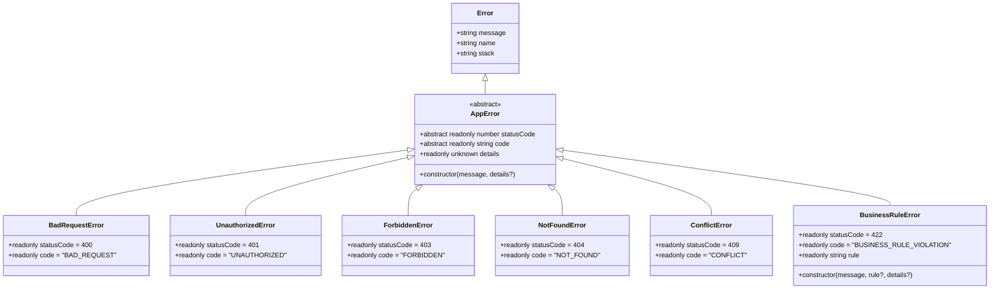
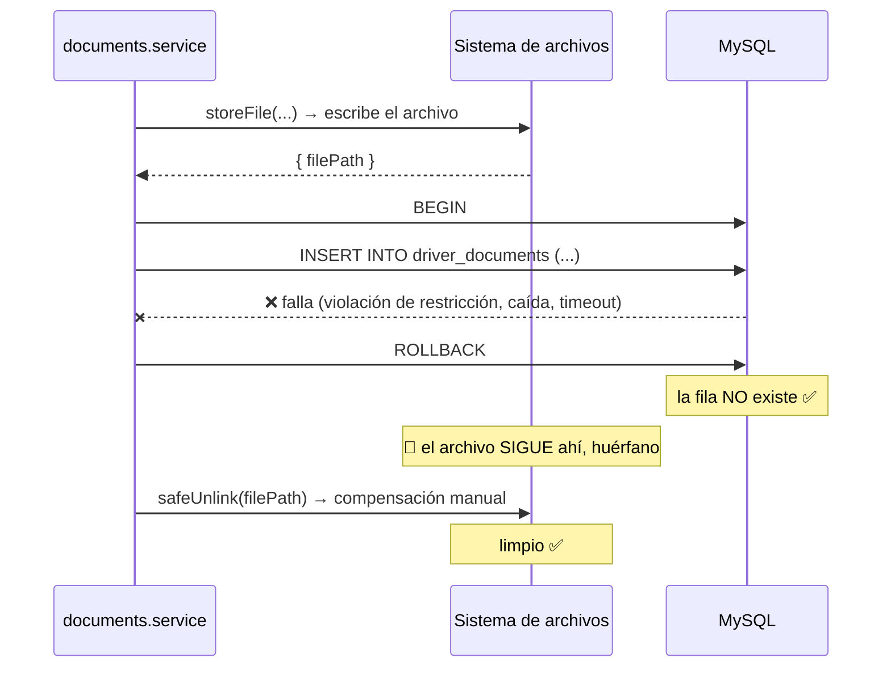
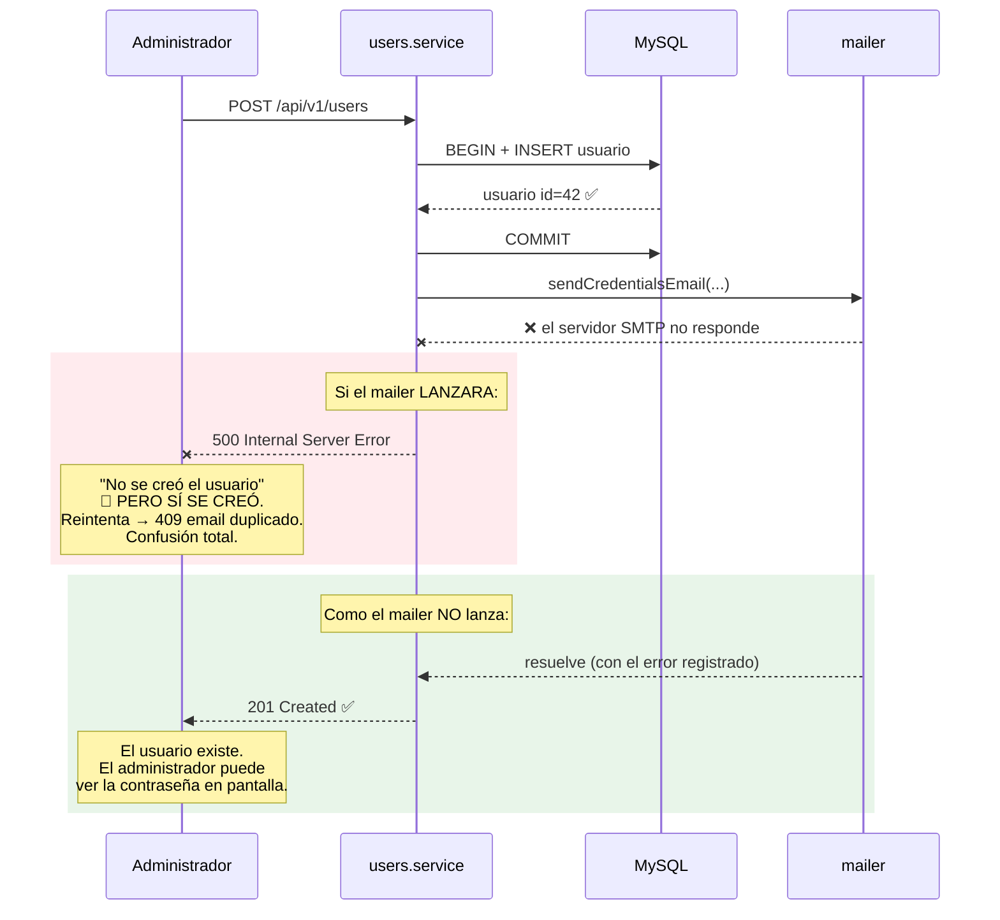
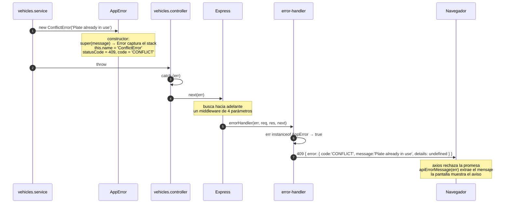
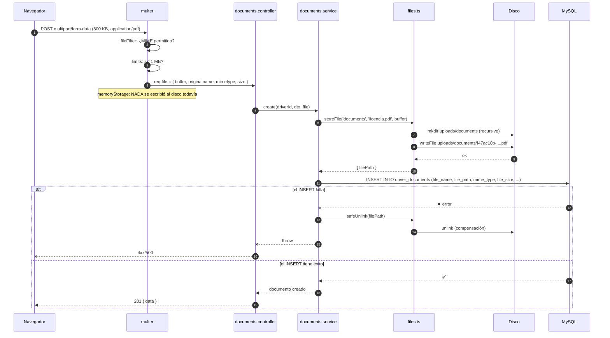

# Capítulo 6 — La capa compartida (`shared/`)

> **Prerrequisitos:** [Capítulo 1](01-conceptos-previos.md) (clases, herencia, genéricos, asincronía), [Capítulo 2](02-arquitectura.md) y [Capítulo 5](05-backend-bootstrap.md).
> **Archivos que se explican aquí:** `shared/errors/app-error.ts` (62 líneas), `shared/schemas.ts` (23), `shared/types/auth.ts` (23), `shared/utils/crypto.ts` (39), `shared/utils/dates.ts` (27), `shared/utils/files.ts` (40), `shared/services/mailer.ts` (75), más los tests `crypto.test.ts` (28) y `dates.test.ts` (29). Total: 346 líneas, todas.
> **Al terminar** el lector entenderá el contrato de errores de todo el sistema, sabrá cómo se cifran y hashean los secretos, por qué las fechas son el problema más sutil del proyecto, y cómo se almacenan los archivos fuera de las transacciones.

---

## 6.1. Introducción

`shared/` contiene lo que **no pertenece a ningún módulo porque pertenece a todos**. Es la carpeta más peligrosa de cualquier proyecto: sin disciplina se convierte en un cajón de sastre donde va a parar todo lo que no se sabe dónde poner, y en dos años nadie sabe qué contiene ni quién lo usa.

El criterio declarado del proyecto (`docs/etapa-1-arquitectura.md:133`) es explícito: *"`shared/` mínimo y explícito: solo lo verdaderamente transversal; evita el 'cajón de sastre' que degrada la mantenibilidad."*

Y se cumple. Son **siete archivos**, cada uno con una razón de existir que se puede enunciar en una frase:

| Archivo | Razón de existir |
|:--|:--|
| `errors/app-error.ts` | Define el vocabulario de fallos de todo el dominio. |
| `schemas.ts` | Evita reescribir la validación de `id` y de paginación 13 veces. |
| `types/auth.ts` | Enseña a TypeScript que `req.user` existe. |
| `utils/crypto.ts` | Cifrado reversible y hash, en un solo lugar auditable. |
| `utils/dates.ts` | Resuelve la ambigüedad UTC/local de las columnas `DATE`. |
| `utils/files.ts` | Escribe y borra archivos, que están fuera de las transacciones. |
| `services/mailer.ts` | Envía credenciales sin que un fallo de correo rompa nada. |

Este capítulo los recorre enteros. Tres de ellos —los errores, la criptografía y las fechas— concentran decisiones que afectan al sistema completo.

---

## 6.2. `shared/errors/app-error.ts`

### 6.2.1. El problema que resuelve

Sin una jerarquía de errores, hay tres formas de reportar un fallo desde un servicio, y las tres son malas:

**Opción A — devolver `null`:**
```ts
// — ejemplo ilustrativo de lo que NO se hace —
const vehiculo = await vehiclesService.getById(7);
if (!vehiculo) { /* ¿no existe? ¿está borrado? ¿falló la base? */ }
```
Se pierde toda la información sobre **por qué** falló.

**Opción B — devolver un objeto de resultado:**
```ts
const r = await vehiclesService.update(7, dto);
if (!r.ok) { return res.status(r.status).json({ error: r.message }); }
```
Funciona, pero obliga a comprobar el resultado en **cada** llamada, y un olvido pasa desapercibido: TypeScript no obliga a mirar el `.ok`.

**Opción C — lanzar strings o errores genéricos:**
```ts
throw new Error('Vehicle not found');
```
El manejador global recibe un `Error` y no tiene forma de saber si corresponde un 404, un 409 o un 500. Tendría que comparar mensajes de texto — frágil e intraducible.

**La opción elegida: una jerarquía de errores tipados.** Cada tipo de fallo del dominio es una clase que **sabe su propio código HTTP**. El manejador global no decide nada: pregunta.

### 6.2.2. La clase base, línea por línea

```ts
1  /**
2   * Domain error hierarchy.
3   * Services throw these; the global error handler is the single point
4   * that translates them into HTTP responses (Stage 1 convention).
5   */
6  export abstract class AppError extends Error {
7    abstract readonly statusCode: number;
8    abstract readonly code: string;
9
10   constructor(
11     message: string,
12     readonly details?: unknown,
13   ) {
14     super(message);
15     this.name = this.constructor.name;
16   }
17 }
```

**Línea 6 — `export abstract class AppError extends Error`**

Tres decisiones en una línea.

**`abstract`** — la clase **no se puede instanciar**. `new AppError('x')` es un error de compilación:

```
Cannot create an instance of an abstract class.
```

💡 **Por qué eso es deseable.** Un `AppError` genérico no tendría `statusCode` ni `code`: sería un error a medio definir. Obligar a usar una subclase concreta garantiza que **todo error de dominio lanzado tenga un código HTTP asignado**. La garantía la da el compilador, no la disciplina.

**`extends Error`** — hereda de la clase `Error` nativa de JavaScript, lo que aporta:

| Propiedad heredada | Qué es |
|:--|:--|
| `message` | El texto del error. |
| `stack` | La **traza de llamadas**: dónde se lanzó y qué función llamó a cuál. |
| `name` | El nombre del tipo de error. |

🔴 **El `stack` es lo más valioso de heredar de `Error`, y es la razón principal de hacerlo.** Sin él, un error en producción diría "algo falló" sin decir dónde. Con él, `req.log?.error(err)` (`error-handler.ts:75`) escribe la cadena completa de funciones hasta el punto de fallo. Un objeto plano `{ code, message }` no tendría stack.

⚙️ **Cómo se genera el `stack`.** V8 lo captura en el momento de **construir** el objeto `Error`, no al lanzarlo. Por eso `const e = new NotFoundError('x')` ya tiene el stack completo, aunque el `throw` ocurra después. Es también por eso que crear errores es relativamente caro: capturar el stack requiere recorrer los marcos de llamada.

**Líneas 7-8 — las propiedades abstractas**

```ts
abstract readonly statusCode: number;
abstract readonly code: string;
```

**`abstract` sobre una propiedad** significa: *"toda subclase concreta DEBE definir esto"*. TypeScript lo verifica en compilación:

```ts
// — ejemplo ilustrativo del error —
export class MiError extends AppError {
  readonly statusCode = 418;
  // falta 'code'
}
// Error: Non-abstract class 'MiError' is missing implementations
//        for the following members of 'AppError': 'code'.
```

💡 **Esto es lo que garantiza la sustitución de Liskov** (§2.5). El manejador global puede escribir `err.statusCode` sobre cualquier `AppError` **sin comprobar nada**, porque el compilador ya garantizó que toda subclase concreta lo tiene. No es una convención: es una restricción verificada.

**`readonly`** — solo se puede asignar en la declaración o el constructor. Impide que alguien haga `error.statusCode = 500` después de crearlo, cambiando la semántica del error a mitad de camino.

**Por qué DOS campos y no uno.** `statusCode` y `code` cumplen funciones distintas:

| Campo | Para quién | Ejemplo | Por qué |
|:--|:--|:--|:--|
| `statusCode` | El **protocolo HTTP** | `404` | Lo entienden navegadores, proxies, cachés, balanceadores. |
| `code` | El **cliente de la API** | `'NOT_FOUND'` | Es estable y legible; el frontend puede ramificar según su valor. |

🔴 **La distinción importa porque no son biyectivos.** Dos errores distintos pueden compartir código HTTP: `ConflictError` (409, `'CONFLICT'`) y el `P2002` de Prisma (409, `'CONFLICT'`). Y en el otro sentido, un mismo concepto de negocio podría mapear a códigos distintos según el contexto. Tener ambos permite que el frontend distinga con precisión (`if (err.code === 'BUSINESS_RULE_VIOLATION')`) sin depender de números.

**Líneas 10-13 — el constructor y las *parameter properties***

```ts
constructor(
  message: string,
  readonly details?: unknown,
) {
```

**`readonly details?: unknown` es una *parameter property*** — un atajo exclusivo de TypeScript. Poner un modificador de acceso (`readonly`, `public`, `private`, `protected`) sobre un parámetro del constructor lo convierte **automáticamente** en propiedad de la instancia.

Equivale a:

```ts
// — lo que TypeScript genera —
readonly details?: unknown;
constructor(message: string, details?: unknown) {
  super(message);
  this.details = details;
}
```

💡 **Ahorra escribir la declaración y la asignación.** Con una propiedad la ganancia es marginal; con cinco (como en un servicio con muchas dependencias inyectadas) es sustancial. Es idiomático en TypeScript y aparece también en `BusinessRuleError`.

**`details?: unknown` — la elección del tipo importa.**

`unknown` en vez de `any`: quien reciba `details` **no puede usarlo sin comprobar su tipo primero**. Es exactamente lo que se quiere: `details` puede ser cualquier cosa (un arreglo de campos inválidos, un objeto con contexto, un string), y forzar la comprobación evita que alguien asuma una forma que no tiene.

⚠️ **`details` viaja al cliente sin filtrar** (`error-handler.ts:21`):

```ts
res.status(err.statusCode).json({
  error: { code: err.code, message: err.message, details: err.details },
});
```

**Eso es una superficie de fuga de información.** Si algún servicio lanzara `new ConflictError('mensaje', usuarioCompleto)`, el objeto entero —incluido `passwordHash`— llegaría al navegador. Hoy no ocurre, pero **nada lo impide**: no hay validación de qué puede ir en `details`. Una mejora sería tipar `details` como una forma acotada (`Record<string, string | number>` o un tipo unión de estructuras conocidas) en lugar de `unknown`.

**Línea 14 — `super(message)`**

**Obligatorio.** En JavaScript, una subclase **debe** llamar a `super()` antes de usar `this`. Omitirlo produce:

```
ReferenceError: Must call super constructor in derived class before accessing 'this'
```

⚙️ **Por qué es obligatorio.** En una clase derivada, el objeto `this` **lo crea el constructor de la clase base**. Antes de `super()`, `this` literalmente no existe todavía. No es una regla arbitraria: es cómo funciona la construcción de objetos en el modelo de clases de ECMAScript.

**Línea 15 — `this.name = this.constructor.name`**

```ts
this.name = this.constructor.name;
```

Esta línea merece atención porque es sutil y muy útil.

**Sin ella**, `error.name` valdría `'Error'` para todas las subclases (lo hereda de `Error.prototype.name`). Los logs mostrarían:

```
Error: Vehicle not found
    at VehiclesService.getById (...)
```

**Con ella**, `this.constructor` apunta a la clase **real** del objeto en tiempo de ejecución, y `.name` da su nombre:

```
NotFoundError: Vehicle not found
    at VehiclesService.getById (...)
```

💡 **Es polimorfismo en tiempo de ejecución.** La misma línea, en la clase base, produce un resultado distinto para cada subclase. `new NotFoundError('x').name` es `'NotFoundError'`; `new ConflictError('x').name` es `'ConflictError'`. Una línea, seis comportamientos.

⚠️ **Una advertencia sobre minificación.** Los minificadores de JavaScript renombran clases (`NotFoundError` → `n`). Si el backend se minificara, `this.constructor.name` daría `'n'` y los logs serían ilegibles. El backend **no se minifica** (`tsc` no minifica), así que no es problema aquí — pero es una trampa conocida si alguien agregara un empaquetador.

🔴 **Lo que falta y sería una mejora clásica: `Error.captureStackTrace`.**

```ts
// — mejora propuesta —
constructor(message: string, readonly details?: unknown) {
  super(message);
  this.name = this.constructor.name;
  Error.captureStackTrace?.(this, this.constructor);
}
```

Elimina del stack los marcos correspondientes al **propio constructor del error**, de modo que la primera línea del stack sea el lugar donde se lanzó, no el interior de `AppError`. Es una función específica de V8, de ahí el `?.` para no romper en otros motores.

### 6.2.3. Las seis subclases

```ts
19 /** 400 — malformed input (should normally be caught by Zod first). */
20 export class BadRequestError extends AppError {
21   readonly statusCode = 400;
22   readonly code = 'BAD_REQUEST';
23 }
   … (cinco más)
```

**Cuatro líneas por clase, sin constructor propio** (heredan el de la base).

⚙️ **Detalle de tipos: `readonly statusCode = 400` no es `number`, es el literal `400`.** TypeScript infiere el tipo literal para propiedades `readonly` inicializadas con constantes. Es compatible con `abstract readonly statusCode: number` (400 es asignable a `number`), y aporta precisión adicional: dentro de esa clase, TypeScript sabe que el valor es exactamente 400.

**Inventario completo con su uso real:**

| Clase | HTTP | `code` | Cuándo se lanza |
|:--|:-:|:--|:--|
| `BadRequestError` | 400 | `BAD_REQUEST` | Entrada malformada que Zod no cubre. Usado en `upload.ts:19` para MIME no permitido. |
| `UnauthorizedError` | 401 | `UNAUTHORIZED` | Sin token, token inválido o vencido. `authenticate.ts:15` y `:24`. |
| `ForbiddenError` | 403 | `FORBIDDEN` | Rol insuficiente. `authorize.ts:16`. |
| `NotFoundError` | 404 | `NOT_FOUND` | El recurso no existe o está dado de baja. |
| `ConflictError` | 409 | `CONFLICT` | Conflicto de estado: patente duplicada, vehículo no disponible. |
| `BusinessRuleError` | 422 | `BUSINESS_RULE_VIOLATION` | Violación de una RN del documento funcional. |

**El comentario de la línea 19 es revelador:** *"should normally be caught by Zod first"*. Reconoce que `BadRequestError` es en gran medida **redundante**: el middleware `validate` ya rechaza la entrada malformada con un 400 antes de llegar al servicio. Existe para los casos que Zod no puede expresar — como la validación de MIME de un archivo, que ocurre en el flujo de multer, fuera de Zod.

### 6.2.4. `BusinessRuleError`: la subclase con constructor propio

```ts
49 /** 422 — business rule violation (RN-1..RN-22). */
50 export class BusinessRuleError extends AppError {
51   readonly statusCode = 422;
52   readonly code = 'BUSINESS_RULE_VIOLATION';
53
54   constructor(
55     message: string,
56     /** Rule identifier from the functional document, e.g. "RN-5". */
57     readonly rule?: string,
58     details?: unknown,
59   ) {
60     super(message, details);
61   }
62 }
```

Es la única que sobrescribe el constructor, para agregar el campo `rule`.

💡 **`rule` es trazabilidad de requisitos llevada hasta la respuesta HTTP.** Cuando el sistema rechaza una asignación porque el chofer tiene la licencia vencida, la respuesta puede incluir `rule: 'RN-1'`. Eso permite:

- Que el frontend muestre un mensaje específico según la regla.
- Que soporte técnico busque `RN-1` en el documento funcional y lea el enunciado original.
- Que un reporte agregue: *"¿cuáles son las reglas que más se violan?"* — información valiosa para el negocio (quizá RN-4 se viola tanto porque el proceso de carga de documentación es engorroso).

⚠️ **Pero `rule` NO se serializa en la respuesta.** `error-handler.ts:20-22` solo envía `code`, `message` y `details`:

```ts
res.status(err.statusCode).json({
  error: { code: err.code, message: err.message, details: err.details },
});
```

**El campo existe en el objeto y nunca llega al cliente.** Es una funcionalidad a medio construir: la información está, la infraestructura para transportarla no. La corrección son dos líneas en el manejador:

```ts
// — mejora propuesta —
if (err instanceof AppError) {
  res.status(err.statusCode).json({
    error: {
      code: err.code,
      message: err.message,
      details: err.details,
      ...(err instanceof BusinessRuleError && err.rule ? { rule: err.rule } : {}),
    },
  });
  return;
}
```

**Nótese que `details` en la línea 58 NO tiene `readonly`.** No hace falta: se pasa a `super()`, que lo declara como *parameter property* en la clase base. Repetir el modificador crearía una propiedad duplicada que sombrearía a la heredada.

**Por qué 422 y no 400 para las reglas de negocio.** Esta distinción es importante y a menudo se ignora:

| Código | Significado | Ejemplo |
|:--|:--|:--|
| **400** Bad Request | *"No entiendo lo que me mandaste."* | `year: "abc"`, JSON malformado, falta un campo obligatorio. |
| **422** Unprocessable Entity | *"Entiendo perfectamente lo que me pedís, y no puedo hacerlo."* | Asignar el chofer 5 al viaje 12: los datos son válidos, pero el chofer tiene la licencia vencida. |

💡 **La diferencia importa para el usuario.** Un 400 significa "corregí el formulario". Un 422 significa "el formulario está bien, pero la operación no es posible en este momento" — y el mensaje debería explicar por qué y qué hacer al respecto. Son dos experiencias de usuario distintas.

### 6.2.5. El diagrama de la jerarquía



---

## 6.3. `shared/schemas.ts`

Veintitrés líneas que eliminan duplicación en los 13 módulos.

```ts
1  import { z } from 'zod';
2
3  /** Shared request schemas — one definition, reused by every module. */
4
5  export const idParamSchema = z.object({
6    id: z.coerce.number().int().positive(),
7  });
8  export type IdParam = z.infer<typeof idParamSchema>;
9
10 export const paginationSchema = z.object({
11   page: z.coerce.number().int().min(1).default(1),
12   limit: z.coerce.number().int().min(1).max(100).default(10),
13 });
14 export type Pagination = z.infer<typeof paginationSchema>;
15
16 export interface PaginatedResult<T> {
17   items: T[];
18   total: number;
19 }
20
21 export function paginationMeta(pagination: Pagination, total: number) {
22   return { page: pagination.page, limit: pagination.limit, total };
23 }
```

### 6.3.1. `idParamSchema` (líneas 5-8)

```ts
export const idParamSchema = z.object({
  id: z.coerce.number().int().positive(),
});
```

**Se usa en 30+ rutas** con la forma `validate(idParamSchema, 'params')`.

**Las tres validaciones y qué rechaza cada una:**

| Método | Rechaza | Por qué importa |
|:--|:--|:--|
| `z.coerce.number()` | `/vehicles/abc` | Los parámetros de ruta llegan **siempre** como string. Sin `coerce`, todo fallaría. |
| `.int()` | `/vehicles/1.5` | Los ids son enteros; un decimal indica un error del cliente. |
| `.positive()` | `/vehicles/0`, `/vehicles/-1` | Las columnas son `INT UNSIGNED`: no hay ids ≤ 0. |

🔴 **`positive()` no es cosmético: es una defensa real.** Sin él, `/vehicles/-1` llegaría al repositorio como `-1`. Prisma emitiría `WHERE id = -1`, MySQL no encontraría nada, y el servicio lanzaría `NotFoundError` — funcionalmente correcto, pero habiendo gastado una consulta a la base. Con `positive()`, se rechaza en el borde con un 400, sin tocar la base. **Rechazar temprano ahorra recursos y reduce la superficie de ataque.**

⚠️ **Lo que NO valida: el límite superior.** `/vehicles/999999999999999999999` pasa la validación (es un entero positivo), pero excede el rango de `INT UNSIGNED` (4.294.967.295). Prisma o MySQL fallarían con un error poco claro. `.max(4294967295)` lo cubriría.

Peor aún: números mayores a `Number.MAX_SAFE_INTEGER` (9.007.199.254.740.991) pierden precisión en JavaScript. `/vehicles/9007199254740993` se convertiría en `9007199254740992` silenciosamente.

**Línea 8 — `export type IdParam = z.infer<typeof idParamSchema>`**

Produce `{ id: number }`.

⚠️ **Este tipo está exportado pero se usa poco.** Los controladores escriben la aserción a mano (`vehicles.controller.ts:19`):

```ts
const { id } = req.params as unknown as { id: number };
```

En lugar de:

```ts
const { id } = req.params as unknown as IdParam;
```

Es duplicación menor pero real: el tipo existe y no se aprovecha. Se resolvería, junto con la aserción entera, si `validate` fuera genérico (se propone en el capítulo 7).

### 6.3.2. `paginationSchema` (líneas 10-14)

```ts
export const paginationSchema = z.object({
  page: z.coerce.number().int().min(1).default(1),
  limit: z.coerce.number().int().min(1).max(100).default(10),
});
```

**`page` empieza en 1, no en 0.** Es una decisión de interfaz de usuario: la primera página es la 1 para una persona. La conversión al `OFFSET` de SQL (que sí empieza en 0) se hace en el servicio: `skip = (page - 1) * limit`.

🔴 **`.max(100)` en `limit` es una defensa contra denegación de servicio, y es imprescindible.**

Sin ese límite, un atacante (o un desarrollador distraído) pide `?limit=1000000`:

1. MySQL lee un millón de filas del disco.
2. El driver las convierte a un millón de objetos JavaScript.
3. `JSON.stringify` serializa un millón de objetos.
4. La respuesta pesa cientos de megabytes.
5. **El proceso se queda sin memoria** o el event loop se bloquea durante segundos.

Y no hace falta ser malicioso: basta con que alguien pruebe `?limit=99999` "para ver todos". Con `.max(100)`, la petición se rechaza con un 400 antes de tocar la base.

**Los `.default()` hacen la paginación opcional para el cliente.** `GET /vehicles` sin parámetros equivale a `?page=1&limit=10`. El cliente que no sabe de paginación obtiene un comportamiento sensato.

💡 **Diez es un valor por defecto conservador.** Cabe en una pantalla sin desplazamiento y hace la primera carga rápida. Muchas APIs usan 20 o 25. Diez es defendible para tablas con muchas columnas como las de este sistema.

### 6.3.3. `PaginatedResult<T>` (líneas 16-19)

```ts
export interface PaginatedResult<T> {
  items: T[];
  total: number;
}
```

Un **genérico** (§1.2.7). `PaginatedResult<Vehicle>` es `{ items: Vehicle[]; total: number }`.

**Por qué `total` y no `totalPages`.** `total` es el dato **primitivo**; `totalPages` se deriva (`Math.ceil(total / limit)`). Enviar el derivado obligaría al servidor a conocer el `limit` en el momento de construir la respuesta, y el cliente igual necesitaría `total` para mostrar "42 resultados". Enviar el primitivo y dejar que el cliente derive es la decisión correcta.

⚠️ **`total` obliga a una consulta `COUNT` adicional en cada listado.** `vehicles.repository.ts:45-47` tiene un método `count` separado, y el servicio ejecuta `findMany` **y** `count`. Son **dos** consultas por listado.

**Alternativas y sus intercambios:**

| Estrategia | Consultas | Puede mostrar "página 5 de 42" | Rendimiento con tablas grandes |
|:--|:-:|:-:|:--|
| `findMany` + `count` (elegida) | 2 | ✅ Sí | El `COUNT` degrada con millones de filas |
| Pedir `limit+1` y ver si sobra | 1 | ❌ Solo "hay más" | Excelente |
| Paginación por cursor | 1 | ❌ No | Excelente, pero no permite saltar a una página |

Para el tamaño de este proyecto (miles de filas, no millones), dos consultas es perfectamente adecuado y habilita la interfaz de paginación completa que las pantallas usan.

### 6.3.4. `paginationMeta` (líneas 21-23)

```ts
export function paginationMeta(pagination: Pagination, total: number) {
  return { page: pagination.page, limit: pagination.limit, total };
}
```

Construye el objeto `meta` de la respuesta. Se usa en `vehicles.controller.ts:11`:

```ts
res.json({ data: items, meta: paginationMeta(query, total) });
```

**Es una función de tres líneas que parece innecesaria**, y no lo es. Garantiza que las **13 respuestas paginadas del sistema tengan exactamente la misma forma**. Sin ella, un módulo podría devolver `{page, limit, total}`, otro `{pagina, limite, total}`, y otro olvidar `total`. La función convierte una convención en una garantía.

⚠️ **Sin tipo de retorno declarado.** Es la única función exportada del proyecto sin anotación de retorno, lo que contradice la convención señalada en §1.2.7. TypeScript lo infiere como `{ page: number; limit: number; total: number }`, así que funciona — pero es una inconsistencia de estilo.

⚠️ **Y no incluye `totalPages`.** Cada pantalla del frontend calcula `Math.ceil(total/limit)` por su cuenta. Es una línea repetida en varias páginas. Agregarlo aquí sería centralizarlo, aunque duplicaría información en la respuesta.

---

## 6.4. `shared/types/auth.ts`

Veintitrés líneas que resuelven un problema de tipos con implicaciones en todo el backend.

```ts
1  import type { Role } from '../../generated/prisma/client';
2
3  /** Payload embedded in every access token. Kept minimal on purpose. */
4  export interface JwtPayload {
5    /** User id (subject). */
6    sub: number;
7    role: Role;
8  }
9
10 /** Authenticated user attached to the request by the authenticate middleware. */
11 export interface AuthenticatedUser {
12   id: number;
13   role: Role;
14 }
15
16 declare global {
17   // eslint-disable-next-line @typescript-eslint/no-namespace
18   namespace Express {
19     interface Request {
20       user?: AuthenticatedUser;
21     }
22   }
23 }
```

### 6.4.1. `JwtPayload` (líneas 4-8)

**`sub` es un *claim* estándar de JWT.** La especificación RFC 7519 define un conjunto de claims registrados:

| Claim | Nombre | Significado |
|:--|:--|:--|
| `sub` | *subject* | **De quién** habla el token. |
| `iss` | *issuer* | Quién lo emitió. |
| `aud` | *audience* | Para quién es. |
| `exp` | *expiration* | Cuándo vence (marca Unix). |
| `iat` | *issued at* | Cuándo se emitió. |
| `nbf` | *not before* | A partir de cuándo es válido. |

💡 **Usar `sub` en vez de `userId` es respetar el estándar**, y tiene un beneficio concreto: cualquier herramienta genérica de JWT (jwt.io, un proxy de autenticación, un depurador) sabe interpretarlo. Un campo propietario `userId` sería opaco para ellas.

**`exp` e `iat` no están en la interfaz**, aunque **sí están en el token**: los agrega `jsonwebtoken` automáticamente a partir de la opción `expiresIn`. La interfaz describe solo lo que el proyecto pone explícitamente.

⚠️ **Esa omisión tiene una consecuencia.** Si algún código necesitara leer `exp` del payload (por ejemplo, para mostrar "tu sesión vence en 3 minutos"), tendría que hacer una aserción de tipo adicional. Sería más completo declarar `exp?: number; iat?: number` como opcionales.

**El comentario "Kept minimal on purpose" (línea 3) declara una decisión de seguridad importante.**

🔴 **El payload de un JWT NO está cifrado, solo firmado.** Cualquiera que tenga el token puede leerlo:

```bash
echo 'eyJzdWIiOjEsInJvbGUiOiJBRE1JTiJ9' | base64 -d
# → {"sub":1,"role":"ADMIN"}
```

La firma garantiza **integridad** (nadie puede modificarlo sin invalidar la firma), **no confidencialidad**.

**Por eso el payload contiene solo `sub` y `role`.** Si contuviera el email, el nombre y el DNI, esa información viajaría en claro en cada petición, quedaría en el historial del navegador, y podría filtrarse por cualquier log mal configurado.

**Tres razones más para mantenerlo mínimo:**

1. **Tamaño.** El token viaja en **cada** petición. Cada campo agregado son bytes multiplicados por miles de peticiones.
2. **Obsolescencia.** Los datos del token son una **foto** del momento de emisión. Si el nombre del usuario cambia, el token sigue diciendo el viejo durante 15 minutos. Cuantos menos datos, menos oportunidades de mostrar información desactualizada.
3. **Superficie de ataque.** Menos datos expuestos es menos información para un atacante que capture un token.

🔴 **Pero incluir `role` en el token tiene un costo real que hay que nombrar.** Si un administrador degrada a un usuario de `ADMIN` a `OPERATOR`, **ese usuario sigue siendo ADMIN hasta que su token expire** — hasta 15 minutos con privilegios que ya le fueron quitados. El middleware `authenticate` no consulta la base (`authenticate.ts:9-10` lo declara: *"Stateless by design"*).

**Las tres formas de resolverlo, con sus costos:**

| Solución | Costo |
|:--|:--|
| Consultar la base en cada petición | Anula el beneficio de los JWT sin estado: una consulta extra por petición. |
| Lista negra de tokens revocados | Requiere almacenamiento compartido (Redis) y una consulta por petición. |
| **Reducir el TTL** | La ventana de exposición baja, pero suben las renovaciones. |

**El proyecto elige la tercera implícitamente**, con 15 minutos. Es el intercambio estándar de la industria y es defendible. Lo criticable es que la decisión no está documentada como tal en ningún lado: el comentario dice "stateless by design" pero no menciona esta consecuencia.

### 6.4.2. `AuthenticatedUser` (líneas 11-14)

```ts
export interface AuthenticatedUser {
  id: number;
  role: Role;
}
```

**Casi idéntica a `JwtPayload`, pero con `id` en vez de `sub`.**

💡 **La duplicación aparente es deliberada y correcta.** Son dos conceptos distintos que casualmente tienen la misma forma:

- `JwtPayload` es el **formato de transporte**, y usa la nomenclatura del estándar JWT.
- `AuthenticatedUser` es el **modelo de dominio de la aplicación**, y usa la nomenclatura del proyecto (`id`, como todas las entidades).

La traducción entre ambos ocurre en una sola línea (`authenticate.ts:21`):

```ts
req.user = { id: payload.sub, role: payload.role };
```

**Si fueran el mismo tipo**, el resto del código tendría que escribir `req.user.sub`, arrastrando un detalle del protocolo JWT a través de 57 endpoints. Cambiar de JWT a otro mecanismo de autenticación obligaría a tocar todos.

**Con la separación, cambiar de mecanismo toca una línea.** Es una **capa anticorrupción** en miniatura: un patrón de DDD que consiste en traducir el vocabulario externo al interno en el borde del sistema.

### 6.4.3. La aumentación de módulo (líneas 16-23)

```ts
declare global {
  namespace Express {
    interface Request {
      user?: AuthenticatedUser;
    }
  }
}
```

**Esta es la construcción más avanzada de TypeScript en todo el proyecto, y merece desarmarse.**

**El problema.** Express define su propia `interface Request` en `@types/express`. `authenticate.ts:21` le agrega una propiedad:

```ts
req.user = { id: payload.sub, role: payload.role };
```

Sin este bloque, TypeScript diría:

```
Property 'user' does not exist on type 'Request<...>'.
```

**Las cuatro alternativas, y por qué se descartan:**

| Alternativa | Problema |
|:--|:--|
| `(req as any).user` en cada uso | Pierde todo el tipado. Un error de tipeo (`req.usr`) no se detecta. |
| Un tipo propio `AuthedRequest extends Request` | Habría que cambiar la firma de **todos** los controladores, y Express seguiría pasando un `Request` común: haría falta una aserción igual. |
| Guardar el usuario en otro lado | No hay dónde: cada petición es independiente. |
| **Aumentación de módulo** (elegida) | Ninguno. |

**Cómo funciona, pieza por pieza:**

| Pieza | Qué hace |
|:--|:--|
| `declare global` | *"Lo que sigue afecta al ámbito global de tipos, no solo a este archivo."* |
| `namespace Express` | Se refiere al espacio de nombres global que `@types/express` declara. |
| `interface Request` | **Fusión de declaraciones**: como ya existe una `Request` en ese espacio, TypeScript **suma** los miembros en vez de reemplazarla. |
| `user?: AuthenticatedUser` | La propiedad nueva. Opcional. |

⚙️ **La fusión de declaraciones es exclusiva de `interface`.** Con `type` sería un error de identificador duplicado. Es la razón técnica por la que aquí **hay que** usar `interface` y no `type` (§1.2.7).

**Línea 20 — el `?` es lo más importante del bloque.**

```ts
user?: AuthenticatedUser;
```

El tipo real es `AuthenticatedUser | undefined`.

💡 **Es correcto y es una protección.** En las rutas públicas (`POST /auth/login`), `authenticate` **no** corrió y `req.user` es genuinamente `undefined`. Declararlo obligatorio sería mentir, y TypeScript dejaría de exigir la comprobación.

**Consecuencia directa:** `authorize.ts:11` **está obligado** a comprobar:

```ts
if (!req.user) {
  next(new UnauthorizedError('Authentication required'));
  return;
}
```

Sin el `?`, TypeScript no exigiría esa comprobación, y un `authorize` mal colocado (sin `authenticate` antes) produciría un `TypeError` en tiempo de ejecución en vez de un 401 limpio.

🔴 **Y por eso mismo aparece `req.user!.id` en los controladores** (`vehicles.controller.ts:28`). El `!` afirma "no es undefined". Es cierto **porque el router aplicó `authenticate`** (línea 20 de `vehicles.routes.ts`), pero eso es una garantía **del ensamblaje de rutas**, no del sistema de tipos. Si alguien registrara una ruta olvidando `authenticate`, el código compilaría y fallaría con `TypeError: Cannot read properties of undefined` en tiempo de ejecución.

**La forma de eliminar ese riesgo** sería que `authenticate` devolviera un tipo estrechado, cosa que Express 4 no permite expresar. Es una limitación conocida de este patrón, y el costo de la solución (envolver todos los controladores en un tipo genérico) supera el beneficio en un proyecto de este tamaño.

**Línea 17 — `// eslint-disable-next-line @typescript-eslint/no-namespace`**

La regla `no-namespace` desaconseja los `namespace` de TypeScript, que son una construcción anterior a los módulos ES y que en general no debe usarse. **Pero para aumentar los tipos de Express es obligatorio**, porque así están declarados en `@types/express`. El comentario documenta que la excepción es deliberada.

⚠️ **Y otra vez: no hay ESLint configurado en el proyecto** (§5.6). Este comentario, como los de `server.ts`, apunta a una herramienta que no está.

🔴 **Un detalle de funcionamiento que confunde: este archivo debe ser IMPORTADO para que la aumentación tenga efecto.**

TypeScript solo procesa un archivo si forma parte del grafo de compilación. `authenticate.ts:5` lo importa:

```ts
import type { JwtPayload } from '../shared/types/auth';
```

Ese import trae `JwtPayload` **y**, como efecto secundario, activa el bloque `declare global`. Si nadie importara nada de este archivo, `req.user` no existiría para TypeScript en ningún lado.

⚠️ **Es una dependencia frágil e implícita.** Si alguien "limpiara" ese import (porque `JwtPayload` dejara de usarse), rompería el tipado de `req.user` en todo el proyecto — con un error que aparecería en 15 archivos y cuya causa estaría en uno completamente distinto. Sería más robusto declarar el archivo en `"include"` del `tsconfig.json` o renombrarlo a `.d.ts`.

---

## 6.5. `shared/utils/crypto.ts`

Treinta y nueve líneas que implementan cifrado y hash. Es el archivo con mayor densidad de decisiones de seguridad del proyecto.

```ts
1  import { createCipheriv, createDecipheriv, createHash, randomBytes } from 'node:crypto';
2  import { env } from '../../config/env';
3
4  /**
5   * AES-256-GCM encryption for driver passwords (A-9 decision):
6   * every login password is bcrypt-hashed; ADDITIONALLY, driver passwords
7   * are stored encrypted (reversible) so the Admin can view them.
8   * GCM provides authenticated encryption: tampered ciphertext fails to decrypt.
9   *
10  * Stored format: base64(iv):base64(authTag):base64(ciphertext)
11  */
12 const KEY = Buffer.from(env.PASSWORD_ENCRYPTION_KEY, 'hex');
13 const IV_LENGTH = 12; // GCM recommended IV size
```

### 6.5.1. Conceptos previos de criptografía

Antes del código, el vocabulario mínimo.

**Hash vs. cifrado — la distinción fundamental:**

| | **Hash** | **Cifrado** |
|:--|:--|:--|
| Dirección | Un solo sentido | Dos sentidos |
| ¿Se puede volver al original? | **No** | **Sí**, con la clave |
| Necesita clave | No (o una sal) | **Sí** |
| Uso típico | Contraseñas, integridad | Datos que hay que recuperar |
| En este proyecto | bcrypt (contraseñas), SHA-256 (refresh tokens) | AES-256-GCM (contraseñas de choferes) |

**Cifrado simétrico vs. asimétrico:**

- **Simétrico**: la misma clave cifra y descifra. Rápido. Ejemplo: AES.
- **Asimétrico**: una clave pública cifra, una privada descifra. Lento. Ejemplo: RSA.

Este proyecto usa **simétrico**, que es lo correcto: el mismo servidor cifra y descifra.

**Modos de operación de un cifrado por bloques.** AES cifra bloques de 16 bytes. Para cifrar un mensaje más largo hay que encadenar bloques, y **cómo** se encadenan es el "modo":

| Modo | Seguridad | Autenticado |
|:--|:--|:--:|
| **ECB** | 🔴 **Roto.** Bloques iguales producen cifrados iguales: se ven patrones. | ❌ |
| **CBC** | Aceptable, pero vulnerable a ataques de oráculo de relleno si no se autentica. | ❌ |
| **CTR** | Bueno, convierte el cifrado por bloques en uno de flujo. | ❌ |
| **GCM** | ✅ **El recomendado.** CTR + autenticación integrada. | ✅ |

💡 **GCM (*Galois/Counter Mode*) provee *cifrado autenticado***: además de cifrar, genera una **etiqueta de autenticación** que detecta cualquier modificación del texto cifrado. Sin autenticación, un atacante puede alterar bytes del cifrado y el descifrado produce basura **sin avisar** — y en ciertos protocolos esa basura puede explotarse.

**IV (*Initialization Vector*)** — un valor **aleatorio y único por operación** que se combina con la clave para que cifrar el mismo texto dos veces produzca resultados distintos.

🔴 **Reutilizar un IV con la misma clave en GCM es catastrófico.** No es una debilidad gradual: permite recuperar la clave de autenticación y falsificar mensajes. Es el error más grave posible con GCM, y por eso la línea 16 genera uno nuevo en **cada** llamada.

### 6.5.2. Las constantes (líneas 12-13)

```ts
const KEY = Buffer.from(env.PASSWORD_ENCRYPTION_KEY, 'hex');
const IV_LENGTH = 12; // GCM recommended IV size
```

**Línea 12 — la clave, convertida una sola vez**

`Buffer.from(hex, 'hex')` convierte 64 caracteres hexadecimales en 32 bytes binarios.

💡 **Está en el ámbito del módulo, no dentro de las funciones.** La conversión ocurre **una vez** al cargar el módulo, no en cada cifrado. Con miles de operaciones, el ahorro es real; pero el beneficio principal es otro: si la clave fuera inválida, el fallo ocurriría al arrancar (aunque, como se vio en §5.3.2, `Buffer.from` no valida — por eso la validación está en Zod).

🔴 **`KEY` es un `Buffer` con material criptográfico en memoria durante toda la vida del proceso.** Si alguien obtuviera un volcado de memoria del proceso, tendría la clave. Es inevitable en Node (no hay memoria protegida ni bloqueada), pero conviene saberlo: **la seguridad de este esquema depende de que nadie tenga acceso al proceso ni al `.env`**.

**Línea 13 — `IV_LENGTH = 12`, y por qué 12 y no 16**

El comentario dice "GCM recommended IV size", y hay una razón matemática detrás.

⚙️ **GCM está especificado para IVs de 96 bits (12 bytes).** Con esa longitud, el IV se usa **directamente** como contador inicial. Con cualquier otra longitud, la especificación exige pasarlo por una función de derivación (GHASH), lo que:

1. Agrega cómputo innecesario.
2. **Aumenta la probabilidad de colisión** entre IVs derivados.

**Usar 16 bytes con GCM no es "más seguro" por ser más largo: es menos seguro y más lento.** Es un caso donde la intuición ("más bits = mejor") falla, y por eso el comentario existe.

### 6.5.3. `encrypt` línea por línea

```ts
15 export function encrypt(plainText: string): string {
16   const iv = randomBytes(IV_LENGTH);
17   const cipher = createCipheriv('aes-256-gcm', KEY, iv);
18   const encrypted = Buffer.concat([cipher.update(plainText, 'utf8'), cipher.final()]);
19   const authTag = cipher.getAuthTag();
20   return `${iv.toString('base64')}:${authTag.toString('base64')}:${encrypted.toString('base64')}`;
21 }
```

**Línea 16 — `randomBytes(12)`**

⚙️ **`randomBytes` usa el generador criptográficamente seguro del sistema operativo** (`/dev/urandom` en Unix, `BCryptGenRandom` en Windows). No es `Math.random()`, que es un generador pseudoaleatorio **predecible**: conociendo unos pocos valores se puede predecir el resto. Usar `Math.random()` para un IV rompería el cifrado por completo.

**Línea 17 — `createCipheriv('aes-256-gcm', KEY, iv)`**

El nombre del algoritmo codifica tres cosas: `aes` (el cifrado), `256` (bits de clave), `gcm` (el modo).

🔴 **`createCipheriv` verifica la longitud de la clave y lanza si no coincide.** `aes-256-*` exige exactamente 32 bytes. Es la última línea de defensa si la validación de Zod fallara — pero el error (`Invalid key length`) ocurriría en el momento de crear un chofer, no al arrancar, que es exactamente el escenario que §5.3.2 describe como problemático.

**Línea 18 — `Buffer.concat([cipher.update(...), cipher.final()])`**

La API de cifrado de Node es de **flujo**: se alimenta con `update()` (varias veces si hace falta) y se cierra con `final()`.

| Llamada | Qué devuelve |
|:--|:--|
| `cipher.update(datos, 'utf8')` | Los bloques completos que se pudieron cifrar hasta ahora. |
| `cipher.final()` | El último bloque, con el relleno. |

**Ambas devuelven `Buffer`**, y hay que concatenarlas. Omitir `final()` produciría un cifrado **truncado** que no se puede descifrar.

⚙️ **`'utf8'` especifica cómo interpretar el string de entrada como bytes.** Importa para caracteres no ASCII: una contraseña con `ñ` o con un emoji ocupa más de un byte por carácter. Sin especificar la codificación, Node usaría UTF-8 igual por defecto, pero declararlo es explícito y a prueba de cambios de comportamiento.

**Línea 19 — `cipher.getAuthTag()`**

🔴 **DEBE llamarse DESPUÉS de `final()`.** La etiqueta se calcula sobre **todo** el texto cifrado; antes de `final()` no está completa. Llamarla antes lanza `Error: Unsupported state`.

La etiqueta mide 16 bytes y es, en esencia, un MAC (código de autenticación de mensaje) del cifrado.

**Línea 20 — el formato de almacenamiento**

```ts
return `${iv.toString('base64')}:${authTag.toString('base64')}:${encrypted.toString('base64')}`;
```

Produce algo como:

```
qJk3mZp2Rr8vLx0F:8YtN2xQwErTyUiOpAsDfGh==:kL9mNbVcXzAsQwErTyUiOp1234567890abcdef==
└──── IV (12B) ────┘ └─── authTag (16B) ───┘ └────────── cifrado ──────────────┘
```

💡 **Por qué se guardan los tres juntos en una sola columna.**

- **El IV no es secreto.** Debe ser único e impredecible, pero puede almacenarse en claro. Sin él es imposible descifrar.
- **La etiqueta tampoco es secreta.** Es una verificación, no un secreto.
- **Guardarlos juntos hace la fila autocontenida.** Un solo `VARCHAR(255)` en vez de tres columnas.

**Por qué base64 y no hexadecimal.** Base64 codifica 3 bytes en 4 caracteres (expansión ×1,33); el hexadecimal codifica 1 byte en 2 caracteres (expansión ×2). Base64 es **un 33% más compacto**. Con `VARCHAR(255)` de límite, eso importa.

⚠️ **Base64 estándar usa `+`, `/` y `=`. Ninguno es `:`**, así que el separador nunca aparece dentro de los datos. **Es una coincidencia afortunada, no una garantía diseñada.** Si alguien cambiara a base64url (que usa `-` y `_`), seguiría funcionando; si cambiara el separador a `-`, el formato se rompería. Un comentario advirtiéndolo sería prudente.

### 6.5.4. `decrypt` línea por línea

```ts
23 export function decrypt(payload: string): string {
24   const [iv, authTag, ciphertext] = payload.split(':');
25   if (!iv || !authTag || !ciphertext) {
26     throw new Error('Invalid encrypted payload format');
27   }
28   const decipher = createDecipheriv('aes-256-gcm', KEY, Buffer.from(iv, 'base64'));
29   decipher.setAuthTag(Buffer.from(authTag, 'base64'));
30   return Buffer.concat([
31     decipher.update(Buffer.from(ciphertext, 'base64')),
32     decipher.final(),
33   ]).toString('utf8');
34 }
```

**Línea 24 — desestructuración posicional del `split`**

```ts
const [iv, authTag, ciphertext] = payload.split(':');
```

**Líneas 25-27 — la comprobación de las tres partes**

🔴 **Esta comprobación existe por `noUncheckedIndexedAccess`** (`tsconfig.json:10`). Con esa opción, `split()` devuelve `string[]` cuyos elementos se tipan como `string | undefined` — porque TypeScript no puede saber cuántos elementos tiene. Sin la comprobación, la línea 28 no compilaría.

💡 **Es un ejemplo perfecto de una opción del compilador que fuerza código defensivo correcto.** Sin `noUncheckedIndexedAccess`, un desarrollador escribiría directamente `Buffer.from(iv, 'base64')` con `iv` posiblemente `undefined`, y el error aparecería en tiempo de ejecución con un mensaje confuso. La opción convierte un bug potencial en un error de compilación.

⚠️ **Se lanza un `Error` genérico, no un `AppError`.** Si esto llegara al manejador global, produciría un **500** en vez de un 400/422. **¿Es correcto?** Sí, y por una razón sutil: este error solo puede ocurrir si el dato **almacenado en la base** está corrupto — no por entrada del usuario. Un 500 es la respuesta adecuada a corrupción de datos internos. Pero convendría que el mensaje fuera más específico para el diagnóstico.

**Línea 28 — reconstruir el descifrador con el mismo IV**

`Buffer.from(iv, 'base64')` decodifica el IV. **Debe ser exactamente el mismo** que se usó al cifrar: es parte del estado inicial del algoritmo.

**Línea 29 — `decipher.setAuthTag(...)`**

🔴 **DEBE llamarse ANTES de `final()`**, al revés que en el cifrado. El motivo: `final()` es donde se **verifica** la etiqueta, así que tiene que estar establecida antes.

**Si no se llama**, Node lanza `Unsupported state or unable to authenticate data`. Y aquí está el punto crítico: **omitir esta línea NO desactivaría la verificación, haría fallar el descifrado**. Es un diseño de API a prueba de errores: no se puede olvidar la autenticación por descuido.

**Líneas 30-33 — descifrar y verificar**

```ts
return Buffer.concat([
  decipher.update(Buffer.from(ciphertext, 'base64')),
  decipher.final(),
]).toString('utf8');
```

🔴 **`decipher.final()` es donde ocurre la verificación de autenticidad.** Si el texto cifrado fue alterado —aunque sea un bit— la etiqueta calculada no coincide con la almacenada y `final()` **lanza**:

```
Error: Unsupported state or unable to authenticate data
```

💡 **Esto es lo que "autenticado" significa en la práctica, y es una propiedad muy fuerte.** Con AES-CBC, alterar un byte del cifrado produce un texto descifrado distinto **sin ningún error**: la aplicación seguiría trabajando con datos manipulados sin saberlo. Con GCM, la manipulación es **detectable e imposible de ignorar**.

**El test lo verifica explícitamente** (`crypto.test.ts:15-21`):

```ts
it('rejects tampered ciphertext (authenticated encryption)', () => {
  const payload = encrypt('secret');
  const [iv, tag, data] = payload.split(':');
  const tampered = `${iv}:${tag}:${Buffer.from('zzzz').toString('base64')}${data}`;
  expect(() => decrypt(tampered)).toThrow();
});
```

Corrompe el texto cifrado anteponiéndole basura y verifica que `decrypt` lanza. **Es un test de una propiedad de seguridad, no de funcionalidad** — es el tipo de test que más valor aporta y el que más se omite.

### 6.5.5. `sha256` (líneas 36-39)

```ts
/** SHA-256 hex digest — used to store refresh tokens (never in plain text). */
export function sha256(value: string): string {
  return createHash('sha256').update(value).digest('hex');
}
```

**Tres llamadas encadenadas:**

| Llamada | Qué hace |
|:--|:--|
| `createHash('sha256')` | Crea un objeto de hash. |
| `.update(value)` | Alimenta datos (se puede llamar varias veces). |
| `.digest('hex')` | Finaliza y devuelve el resultado en hexadecimal. |

**Siempre 64 caracteres hexadecimales** (256 bits ÷ 4 bits por carácter). Es exactamente lo que declara `refresh_tokens.token_hash CHAR(64)` (§3.4.2).

**El test lo verifica** (`crypto.test.ts:23-27`):

```ts
const a = sha256('token');
expect(a).toBe(sha256('token'));          // determinista
expect(a).toMatch(/^[0-9a-f]{64}$/);      // formato exacto
```

🔴 **Sin sal — y aquí es correcto.** Los refresh tokens son valores **aleatorios de alta entropía** generados por el servidor. No hay diccionario que probar, no hay tabla arcoíris posible, y no hay dos usuarios que puedan tener "el mismo token" por coincidencia (como sí pasa con las contraseñas).

**Contrasta deliberadamente con bcrypt para contraseñas:**

| | Contraseña de usuario | Refresh token |
|:--|:--|:--|
| Origen | Elegida por un humano | Generada aleatoriamente |
| Entropía | Baja (~30 bits típicos) | Alta (256+ bits) |
| Predecible | Sí (diccionarios, patrones) | No |
| Reutilizada entre sitios | Frecuentemente | Nunca |
| **Algoritmo correcto** | **bcrypt** (lento, con sal) | **SHA-256** (rápido, sin sal) |
| Frecuencia de verificación | Una vez por login | Cada renovación |

💡 **Usar bcrypt para los refresh tokens sería un error de diseño**, no una mejora: agregaría ~100 ms a cada renovación sin ningún beneficio de seguridad, porque el ataque que bcrypt previene (fuerza bruta sobre un espacio pequeño) no aplica a un valor aleatorio de 256 bits.

**Y usar SHA-256 para contraseñas sería un error grave en el otro sentido:** una GPU moderna calcula miles de millones de SHA-256 por segundo, y un diccionario de contraseñas comunes se agota en segundos.

### 6.5.6. Análisis de seguridad honesto

**Lo que este archivo hace bien:**

| ✅ | Detalle |
|:--|:--|
| AES-256-GCM | Cifrado autenticado, el estándar actual. |
| IV aleatorio por operación | `randomBytes(12)`, nunca reutilizado. |
| IV de 12 bytes | El tamaño especificado para GCM, ni más ni menos. |
| Clave fuera de la base | En el `.env`; un volcado de la base es inútil por sí solo. |
| Longitud de clave validada | La expresión regular de `env.ts:20`. |
| Formato autocontenido | IV + etiqueta + cifrado en un campo. |
| `randomBytes`, no `Math.random` | Generador criptográficamente seguro. |
| Comprobación de formato en `decrypt` | Falla explícitamente ante datos corruptos. |
| **Tests de la propiedad de seguridad** | El test de manipulación es el más valioso de los cuatro. |

**Lo que sigue siendo un riesgo:**

| 🔴 | Detalle |
|:--|:--|
| **Contraseñas reversibles** | El requisito A-9 lo exige, pero sigue siendo una mala práctica. Quien tenga base **y** `.env` tiene todas las contraseñas de choferes. |
| Sin rotación de clave | Si `PASSWORD_ENCRYPTION_KEY` se compromete, hay que descifrar todo con la vieja y recifrar con la nueva. No hay mecanismo ni versionado de clave en el formato almacenado. |
| Sin datos asociados (AAD) | GCM permite autenticar datos adicionales no cifrados (por ejemplo el `userId`). Sin AAD, un atacante con acceso de escritura a la base podría **copiar** el `encryptedPassword` de un chofer a otro, y el descifrado funcionaría perfectamente. |
| La clave vive en memoria | Inevitable en Node, pero es una superficie real. |

💡 **La mejora de mayor impacto y menor costo es el AAD.** Cifrando con `cipher.setAAD(Buffer.from(String(userId)))` y verificando lo mismo al descifrar, el texto cifrado quedaría **atado** a un chofer concreto. Copiarlo a otra fila haría fallar el descifrado. Son dos líneas.

**La mejora estructural sigue siendo la de §3.4.3:** que el administrador **regenere** la contraseña en vez de verla. Elimina la necesidad de cifrado reversible por completo.

---

## 6.6. `shared/utils/dates.ts`

Veintisiete líneas, de las cuales **veinte son comentario**. Esa proporción es la señal más clara de que aquí hay un problema sutil.

```ts
1  /**
2   * Date helpers for DATE columns.
3   *
4   * MySQL DATE columns come back from Prisma as midnight UTC of the calendar
5   * date (e.g. 2026-07-15 → 2026-07-15T00:00:00Z). To compare them against
6   * "today" the reference must ALSO be midnight UTC of the local calendar
7   * date — building local midnight would shift the boundary by the timezone
8   * offset (UTC-3 in Argentina) and make a license expiring today read as
9   * already expired (violating RN-1: valid through its expiry date).
10  */
11 export function utcStartOfToday(): Date {
12   const now = new Date();
13   return new Date(Date.UTC(now.getFullYear(), now.getMonth(), now.getDate()));
14 }
15
16 /**
17  * End of the given calendar day in UTC (23:59:59.999). Used as an inclusive
18  * upper bound for date-range queries, coherent with how DATE values and
19  * date query params are parsed as UTC midnight — building local end-of-day
20  * would shift the boundary by the server's timezone offset (e.g. in UTC-3,
21  * "to July 31" would end at 2026-07-31T02:59Z and drop most of that day).
22  */
23 export function utcEndOfDay(date: Date): Date {
24   const d = new Date(date);
25   d.setUTCHours(23, 59, 59, 999);
26   return d;
27 }
```

### 6.6.1. El problema, planteado con precisión

**Un objeto `Date` de JavaScript es un instante absoluto**: milisegundos desde el 1 de enero de 1970 UTC. **No tiene zona horaria.** La zona horaria solo aparece al **formatearlo** o al usar métodos locales.

**Una columna `DATE` de MySQL es un día calendario**: `2026-07-15`. **No tiene hora.**

**Cuando Prisma lee una columna `DATE`, tiene que producir un `Date` de JavaScript** — y para eso debe inventar una hora. La convención que usa: **medianoche UTC**.

```
MySQL:      2026-07-15                    (día calendario, sin hora)
       ↓ Prisma
JavaScript: 2026-07-15T00:00:00.000Z      (instante absoluto)
```

**El problema aparece al comparar con "hoy".**

Supongamos que son las **21:00 del 15 de julio en Argentina** (UTC−3). En UTC son las **00:00 del 16 de julio**.

| Forma de construir "hoy" | Resultado |
|:--|:--|
| `new Date()` | `2026-07-16T00:00:00Z` — ¡ya es 16 en UTC! |
| `new Date(); d.setHours(0,0,0,0)` | `2026-07-15T00:00:00` **local** = `2026-07-15T03:00:00Z` |
| **`utcStartOfToday()`** | **`2026-07-15T00:00:00Z`** ✅ |

**La licencia que vence el 15 de julio está almacenada como `2026-07-15T00:00:00Z`.**

| Comparación | Resultado | ¿Correcto? |
|:--|:--|:--|
| `vencimiento >= new Date()` | `2026-07-15T00:00Z >= 2026-07-16T00:00Z` → **false** | 🔴 Dice vencida siendo el día 15 |
| `vencimiento >= localMidnight` | `2026-07-15T00:00Z >= 2026-07-15T03:00Z` → **false** | 🔴 Dice vencida todo el día |
| `vencimiento >= utcStartOfToday()` | `2026-07-15T00:00Z >= 2026-07-15T00:00Z` → **true** | ✅ Válida hasta el final del día |

🔴 **La consecuencia de negocio, en concreto: un chofer no podría trabajar el último día de validez de su licencia.** Y peor: en el escenario de la segunda fila, el error ocurriría **todo el día 15**, no solo por la noche. La regla RN-1 dice explícitamente que la licencia es válida **hasta e incluyendo** su fecha de vencimiento.

**Este es el tipo de bug que:**
- No lo detecta ninguna prueba escrita en el mismo huso horario que UTC (¡en Europa occidental en invierno funcionaría bien!).
- Se manifiesta de forma intermitente según la hora del día.
- Produce un reporte de usuario del tipo *"a veces no me deja asignar a Juan"*, imposible de reproducir.
- Es fácil de "arreglar" mal, agregando un día de margen en algún lado.

💡 **Que este archivo tenga 20 líneas de comentario para 6 de código es proporcional al costo de equivocarse.** Los comentarios largos suelen ser cicatrices; este parece serlo.

### 6.6.2. `utcStartOfToday` línea por línea

```ts
export function utcStartOfToday(): Date {
  const now = new Date();
  return new Date(Date.UTC(now.getFullYear(), now.getMonth(), now.getDate()));
}
```

**Línea 12 — `new Date()`** — el instante actual, con hora completa.

**Línea 13 — la construcción, desarmada**

```ts
new Date(Date.UTC(now.getFullYear(), now.getMonth(), now.getDate()))
```

| Llamada | Qué devuelve | Zona |
|:--|:--|:--|
| `now.getFullYear()` | El año **según la hora local** | 🏠 local |
| `now.getMonth()` | El mes **local** (0-11) | 🏠 local |
| `now.getDate()` | El día **local** (1-31) | 🏠 local |
| `Date.UTC(a, m, d)` | Milisegundos de esa fecha a medianoche **UTC** | 🌍 UTC |
| `new Date(ms)` | El objeto `Date` de ese instante | — |

💡 **La combinación es exactamente la correcta, y es contraintuitiva:** se toma el **día calendario local** (el que el usuario ve en su calendario) y se lo convierte a **medianoche UTC** (que es como Prisma representa las columnas `DATE`).

**Es la traducción entre dos sistemas de referencia:** *"el día en que estamos según el usuario"* → *"el instante que la base usa para representar ese día"*.

🔴 **`Date.UTC` devuelve un NÚMERO, no un `Date`.** Por eso hace falta envolverlo en `new Date(...)`. Es una asimetría desconcertante de la API de JavaScript: `Date.UTC(2026, 6, 15)` da `1784073600000`, no un objeto.

⚠️ **`getMonth()` es 0-based: enero es 0, diciembre es 11.** Es otro pozo clásico de la API de `Date`. Aquí no causa problemas porque `getMonth()` y `Date.UTC` usan la misma convención — pero mezclar `getMonth()` con un número literal (`Date.UTC(2026, 7, 15)` para agosto) es un error frecuentísimo.

**El test lo verifica** (`dates.test.ts:5-11`):

```ts
const d = utcStartOfToday();
expect(d.getUTCHours()).toBe(0);
expect(d.getUTCMinutes()).toBe(0);
expect(d.getUTCSeconds()).toBe(0);
expect(d.getUTCMilliseconds()).toBe(0);
```

Verifica que **los cuatro componentes horarios en UTC** son cero. Nótese que usa `getUTCHours()`, no `getHours()`: probar con métodos locales daría 21 en Argentina y el test fallaría según dónde corra.

⚠️ **El segundo test es tautológico** (`dates.test.ts:13-17`):

```ts
it('a license expiring today is still valid today (RN-1)', () => {
  const today = utcStartOfToday();
  expect(today >= utcStartOfToday()).toBe(true);
});
```

Compara `utcStartOfToday()` consigo misma. **Siempre pasa**, sin importar qué haga la función. No prueba nada: si `utcStartOfToday` devolviera `new Date(0)`, el test seguiría en verde.

**El test que realmente probaría RN-1 sería:**

```ts
// — mejora propuesta —
it('a license expiring today is still valid today (RN-1)', () => {
  // Simular lo que Prisma devuelve para una columna DATE de hoy
  const hoy = new Date();
  const vencimientoHoy = new Date(Date.UTC(hoy.getFullYear(), hoy.getMonth(), hoy.getDate()));
  expect(vencimientoHoy >= utcStartOfToday()).toBe(true);
  // Y una vencida ayer NO debe ser válida
  const ayer = new Date(vencimientoHoy);
  ayer.setUTCDate(ayer.getUTCDate() - 1);
  expect(ayer >= utcStartOfToday()).toBe(false);
});
```

🔴 **Un test que no puede fallar es peor que no tener test**: da una falsa sensación de cobertura. Es un hallazgo concreto de este capítulo.

### 6.6.3. `utcEndOfDay` línea por línea

```ts
export function utcEndOfDay(date: Date): Date {
  const d = new Date(date);
  d.setUTCHours(23, 59, 59, 999);
  return d;
}
```

**Línea 24 — `const d = new Date(date)` es una COPIA, y es fundamental**

🔴 **Los objetos `Date` de JavaScript son MUTABLES.** `setUTCHours` **modifica el objeto** en lugar de devolver uno nuevo.

**Sin la copia:**

```ts
// — ejemplo ilustrativo del bug que se evita —
function utcEndOfDayMal(date: Date): Date {
  date.setUTCHours(23, 59, 59, 999);   // 🔴 modifica el argumento del llamador
  return date;
}

const desde = new Date('2026-07-01T00:00:00Z');
const hasta = utcEndOfDayMal(desde);
console.log(desde.toISOString());   // 2026-07-01T23:59:59.999Z  ← ¡se modificó!
console.log(hasta === desde);       // true  ← ¡son el MISMO objeto!
```

El llamador tendría su variable `desde` corrompida sin haber hecho nada. Y `desde` y `hasta` apuntarían al mismo objeto, con lo cual un rango de fechas sería un solo instante.

💡 **`new Date(otraDate)` crea una copia independiente.** Es el idioma estándar en JavaScript para no mutar argumentos. La línea 24 es tres caracteres de código y previene una clase entera de bugs de aliasing.

⚠️ **Nótese la asimetría con `utcStartOfToday`:** esa función no recibe argumentos, así que no tiene nada que mutar. `utcEndOfDay` sí, y por eso copia. La disciplina está aplicada donde hace falta.

**Línea 25 — `setUTCHours(23, 59, 59, 999)`**

Los cuatro argumentos son hora, minuto, segundo y milisegundo. `23:59:59.999` es el **último milisegundo representable** del día.

🔴 **Y aquí hay una imprecisión latente que conviene nombrar.** `DATETIME(3)` de MySQL tiene precisión de milisegundo, así que `.999` es efectivamente el último instante. Pero conceptualmente, "el fin del día" es el instante **justo antes** de la medianoche siguiente. Con precisión de microsegundos (que MySQL soporta con `DATETIME(6)`), habría 999 microsegundos entre `23:59:59.999` y el día siguiente, y un registro en ese intervalo quedaría fuera del rango.

**La alternativa robusta es usar un límite exclusivo:**

```ts
// — patrón alternativo —
// en vez de:  WHERE fecha BETWEEN inicio AND finDelDia
// usar:       WHERE fecha >= inicio AND fecha < inicioDelDiaSiguiente
```

Es el patrón *half-open interval* `[inicio, fin)`, que es correcto para **cualquier** precisión. El proyecto usa el inclusivo, que funciona con `DATETIME(3)` pero se rompería si alguien cambiara la precisión de una columna.

**Los tests** (`dates.test.ts:19-28`) verifican ambas propiedades:

```ts
const end = utcEndOfDay(new Date('2026-07-31T00:00:00.000Z'));
expect(end.toISOString()).toBe('2026-07-31T23:59:59.999Z');
```

Usa `toISOString()`, que **siempre** formatea en UTC. Es la comparación correcta: `toString()` daría un resultado distinto en cada zona horaria y el test fallaría según dónde corra.

```ts
const lateInDay = new Date('2026-07-31T23:00:00.000Z');
expect(lateInDay <= utcEndOfDay(day)).toBe(true);
```

Verifica el caso de uso real: un instante tardío del día cae dentro del rango. **Este test sí es significativo**, a diferencia del segundo test de `utcStartOfToday`.

### 6.6.4. Por qué no se usa una librería de fechas

`date-fns`, `dayjs`, `luxon` o `Temporal` (la API nueva del lenguaje) resolverían esto con una línea:

```ts
// — ejemplo ilustrativo con dayjs —
dayjs().utc().startOf('day').toDate();
```

**Por qué el proyecto no lo hace:**

| Argumento | Peso |
|:--|:--|
| Solo hacen falta **dos** funciones | Fuerte: 6 líneas de código propio vs. una dependencia de ~200 KB. |
| Menos dependencias que auditar y actualizar | Fuerte en el backend. |
| El comportamiento es **explícito y legible** | Fuerte: `Date.UTC(...)` no oculta nada. Una librería con plugins de zona horaria sí. |
| No hay que aprender la API de la librería | Moderado. |

⚠️ **Pero el frontend SÍ usa `dayjs`** (`package.json:22`), porque `@mui/x-date-pickers` lo requiere. **Hay dos enfoques de fechas en el mismo proyecto.** Es una inconsistencia justificable (son dos aplicaciones independientes, con necesidades distintas: el frontend formatea para humanos, el backend compara instantes) pero es una inconsistencia, y conviene que quien mantenga el proyecto lo sepa.

---

## 6.7. `shared/utils/files.ts`

Cuarenta líneas que gestionan el almacenamiento en disco: el único estado del sistema que vive **fuera** de las transacciones.

```ts
1  import { randomUUID } from 'node:crypto';
2  import path from 'node:path';
3  import fs from 'node:fs/promises';
4  import { UPLOAD_ROOT } from '../../config/constants';
5
6  export interface StoredFile {
7    /** Relative path on disk, persisted as metadata. */
8    filePath: string;
9  }
10
11 /**
12  * Persist an in-memory upload to disk under uploads/<subfolder>/ with a
13  * random, collision-free name (the original name is kept as DB metadata).
14  * Only called after size/MIME validation has passed.
15  */
16 export async function storeFile(
17   subfolder: string,
18   originalName: string,
19   buffer: Buffer,
20 ): Promise<StoredFile> {
21   const dir = path.join(UPLOAD_ROOT, subfolder);
22   await fs.mkdir(dir, { recursive: true });
23   const ext = path.extname(originalName).toLowerCase();
24   const filePath = path.join(dir, `${randomUUID()}${ext}`);
25   await fs.writeFile(filePath, buffer);
26   return { filePath };
27 }
```

**Línea 3 — `node:fs/promises`, no `node:fs`**

Node ofrece **tres** APIs de sistema de archivos:

| API | Estilo | Bloquea el event loop |
|:--|:--|:--:|
| `fs.readFileSync` | Síncrono | 🔴 **Sí** |
| `fs.readFile(cb)` | Callback | No |
| `fs/promises.readFile` | Promesa | No |

🔴 **Usar la versión síncrona en un servidor sería un error grave.** `fs.writeFileSync` de 1 MB bloquea el hilo único de Node durante la escritura completa, **congelando todas las demás peticiones**. Es el error que convierte un servidor que atiende 500 peticiones por segundo en uno que atiende 20.

**Línea 1 — `randomUUID`**

Genera un UUID versión 4 (aleatorio): `f47ac10b-58cc-4372-a567-0e02b2c3d479`. 122 bits de aleatoriedad.

⚙️ **¿Cuál es la probabilidad de colisión?** Para tener un 50% de probabilidad de una sola colisión harían falta ~2⁶¹ UUIDs — unos 2,3 **trillones**. Con miles de archivos, la probabilidad es efectivamente cero. Y `randomUUID` usa el generador criptográficamente seguro, no `Math.random`.

**Por qué UUID y no el nombre original.** Tres razones, todas de seguridad:

| Riesgo con el nombre original | Qué previene el UUID |
|:--|:--|
| **Colisión**: dos usuarios suben `dni.pdf` → el segundo pisa al primero. | Nombres únicos garantizados. |
| **Traversal de rutas**: un nombre como `../../etc/passwd` escribiría fuera del directorio. | El nombre generado no contiene separadores. |
| **Enumeración**: si los archivos se llamaran `dni-juan-perez.pdf`, alguien podría adivinar URLs. | Un UUID es imposible de adivinar. |

🔴 **El traversal de rutas merece detalle porque es un ataque clásico.** Si el código hiciera `path.join(dir, originalName)` y el atacante enviara `originalName = "../../../../etc/cron.d/malicioso"`, `path.join` **resolvería los `..`** y escribiría fuera del directorio de subidas. Con permisos suficientes, eso es ejecución remota de código. Usar un UUID lo hace estructuralmente imposible.

**Línea 21 — `path.join(UPLOAD_ROOT, subfolder)`**

`path.join` usa el separador correcto del sistema operativo (`/` en Unix, `\` en Windows) y normaliza la ruta.

⚠️ **Pero `subfolder` viene del llamador, no del usuario.** Los valores son literales del código (`'documents'`, `'maintenances'`). **Si alguna vez viniera de entrada del usuario**, el traversal volvería a ser posible por esa vía. Hoy no lo es; conviene que quede documentado como invariante.

**Línea 22 — `fs.mkdir(dir, { recursive: true })`**

`recursive: true` hace dos cosas:

1. Crea los directorios intermedios que falten (`uploads/documents` crea `uploads` si no existe).
2. **No lanza error si el directorio ya existe.**

💡 **La segunda propiedad es la que importa.** Sin `recursive`, habría que comprobar la existencia antes de crear — y eso introduce una **condición de carrera**: entre la comprobación y la creación, otro proceso podría crearlo. `recursive: true` hace la operación idempotente y libre de carreras.

**Línea 23 — `path.extname(originalName).toLowerCase()`**

Extrae la extensión: `documento.PDF` → `.pdf`.

**Por qué preservar la extensión** si el nombre es aleatorio:

1. El sistema operativo y los editores la usan para elegir con qué abrir el archivo.
2. Un servidor web estático la usa para inferir el `Content-Type`.
3. Facilita el diagnóstico manual: `ls uploads/documents/` muestra qué tipo de archivos hay.

**`.toLowerCase()` normaliza.** Sin él habría `.PDF`, `.pdf` y `.Pdf` mezclados, y cualquier comparación por extensión tendría que ser insensible a mayúsculas en cada lugar.

⚠️ **La extensión viene del nombre que envía el cliente y NO se valida.** Un archivo llamado `virus.exe` produciría `f47ac10b-....exe` en el disco. La validación de MIME (`upload.ts:18`) comprueba el `Content-Type` declarado, **no la extensión**. Son dos datos independientes, ambos controlados por el cliente, y ninguno verificado contra el contenido real.

**El riesgo está acotado** porque los archivos se sirven como descarga y nunca se ejecutan. Pero una defensa adicional sería derivar la extensión del MIME validado en vez de tomarla del nombre:

```ts
// — mejora propuesta —
const EXT_POR_MIME = { 'application/pdf': '.pdf', 'image/jpeg': '.jpg', 'image/png': '.png' } as const;
const ext = EXT_POR_MIME[mimeType];
```

**Línea 25 — `fs.writeFile(filePath, buffer)`**

Escribe el buffer completo. Sin `encoding` porque es binario.

🔴 **Esta operación NO es atómica.** Si el proceso muere a mitad de la escritura, queda un archivo **truncado** en el disco. El registro de la base diría que hay un documento de 800 KB y el archivo tendría 300 KB, sin que nada lo detecte.

**El patrón robusto** es escribir a un archivo temporal y renombrarlo (el renombrado **sí** es atómico en la mayoría de los sistemas de archivos):

```ts
// — mejora propuesta —
const temporal = `${filePath}.tmp`;
await fs.writeFile(temporal, buffer);
await fs.rename(temporal, filePath);   // atómico
```

### 6.7.1. `safeUnlink` (líneas 29-40)

```ts
/**
 * Best-effort deletion of a stored file. Used to roll back when the
 * accompanying DB write fails (files live outside the DB transaction).
 * Never throws: a missing file is a no-op.
 */
export async function safeUnlink(filePath: string): Promise<void> {
  try {
    await fs.unlink(filePath);
  } catch {
    // Already gone or never written — nothing to undo.
  }
}
```

**El comentario declara el problema central:** *"files live outside the DB transaction"*.

🔴 **El sistema de archivos NO participa de las transacciones de MySQL.** Esta es una limitación fundamental, no un descuido del proyecto.

**La secuencia problemática:**



**`safeUnlink` es una *transacción compensatoria***: una operación que deshace manualmente lo que no puede revertirse automáticamente.

**El `catch` vacío es deliberado y correcto**, y merece justificarse porque un `catch` vacío es normalmente una mala señal:

| Situación de fallo | Por qué está bien ignorarla |
|:--|:--|
| El archivo no existe | Ya está el resultado deseado. |
| Permisos denegados | No hay nada que se pueda hacer en ese momento. |
| El disco falló | El error real ya se está propagando por otro lado. |

💡 **La clave está en el contexto de uso: `safeUnlink` se llama DENTRO de un manejador de error.** Si lanzara, **enmascararía el error original** — el usuario recibiría "no se pudo borrar el archivo temporal" en vez de "el documento ya existe". El error de limpieza taparía el error real.

⚠️ **Aun así, el `catch` silencioso tiene un costo.** Un fallo persistente de permisos produciría archivos huérfanos acumulándose sin que **nadie se entere jamás**. Una mejora de bajo costo sería registrarlo sin lanzar:

```ts
// — mejora propuesta —
} catch (err) {
  console.warn(`[files] no se pudo borrar ${filePath}:`, err);
}
```

Se conserva la propiedad de no lanzar, y se gana visibilidad.

### 6.7.2. Las tres formas de quedarse con archivos huérfanos

Este es el análisis completo del problema, porque el capítulo 25 lo retoma:

| # | Escenario | ¿Lo cubre `safeUnlink`? |
|:-:|:--|:--|
| 1 | La escritura en la base falla tras guardar el archivo | ✅ Sí, si el servicio lo llama |
| 2 | **El proceso muere entre `storeFile` y el `INSERT`** | ❌ **No.** Nadie ejecuta la compensación. |
| 3 | **Se borra un mantenimiento con `ON DELETE CASCADE`** | ❌ **No.** MySQL borra las filas de `maintenance_attachments` **sin saber nada del disco**. |

🔴 **El caso 3 es el más grave porque es silencioso y sistemático.** Cada mantenimiento borrado deja sus comprobantes en el disco para siempre. No hay error, no hay log, no hay forma de notarlo salvo comparando el contenido del directorio con la base.

**La solución para el caso 3** es que el servicio de mantenimientos consulte los adjuntos, los borre del disco, y **después** borre el mantenimiento — perdiendo el beneficio del `CASCADE` pero ganando coherencia.

**La solución general** es una tarea de limpieza periódica:

```sql
-- — consulta de diagnóstico: qué archivos referencia la base —
SELECT file_path FROM driver_documents WHERE deleted_at IS NULL
UNION
SELECT file_path FROM maintenance_attachments;
```

Y comparar con el listado real del directorio. Todo lo que esté en el disco y no en el resultado es huérfano.

### 6.7.3. `StoredFile`: una interfaz de un solo campo

```ts
export interface StoredFile {
  filePath: string;
}
```

**¿Por qué no devolver directamente un `string`?**

💡 **Por extensibilidad sin ruptura.** Si mañana `storeFile` necesitara devolver también el tamaño real escrito, un checksum, o el identificador de un almacenamiento de objetos, se agrega un campo a la interfaz y **ningún llamador se rompe** (siguen leyendo `.filePath`). Con un `string` de retorno, cualquier dato adicional obligaría a cambiar la firma y todos los usos.

Es un ejemplo pequeño del principio de **diseñar para la extensión**, y cuesta cuatro líneas.

---

## 6.8. `shared/services/mailer.ts`

Setenta y cinco líneas para enviar correos de credenciales. Su rasgo distintivo: **está diseñado para no romper nada cuando falla**.

### 6.8.1. El transporte perezoso (líneas 13-29)

```ts
13 let transporter: Transporter | null = null;
14
15 function getTransporter(): Transporter {
16   if (transporter) return transporter;
17   if (env.SMTP_HOST) {
18     transporter = nodemailer.createTransport({
19       host: env.SMTP_HOST,
20       port: env.SMTP_PORT ?? 587,
21       secure: env.SMTP_SECURE ?? false,
22       auth: env.SMTP_USER ? { user: env.SMTP_USER, pass: env.SMTP_PASS } : undefined,
23     });
24   } else {
25     // Dev/test: don't send, just build the message (inspectable in logs).
26     transporter = nodemailer.createTransport({ jsonTransport: true });
27   }
28   return transporter;
29 }
```

**Línea 13 — la variable de módulo**

`let transporter: Transporter | null = null` en el ámbito del módulo. Como los módulos se evalúan una sola vez (§4.4), esta variable es efectivamente un **singleton perezoso**.

**Línea 16 — el patrón de inicialización perezosa**

```ts
if (transporter) return transporter;
```

Si ya existe, se devuelve. Solo la primera llamada construye.

💡 **Por qué perezoso y no en el ámbito del módulo directamente.** Construir el transporte al cargar el módulo obligaría a evaluar `env.SMTP_HOST` en ese momento, **aunque nunca se enviara un correo**. Con la inicialización perezosa, un sistema que nunca crea usuarios nunca construye el transporte. Es un ahorro pequeño, pero también evita que un error de configuración SMTP impida arrancar el servidor.

**Líneas 17-27 — la bifurcación crítica**

| Condición | Transporte | Comportamiento |
|:--|:--|:--|
| `SMTP_HOST` definido | SMTP real | Envía de verdad. |
| `SMTP_HOST` ausente | `jsonTransport: true` | **Construye el mensaje y NO lo envía.** |

🔴 **`jsonTransport` es la pieza que hace el proyecto ejecutable sin infraestructura externa.** Serializa el mensaje a JSON y lo devuelve en `info.message`. Nada sale a la red. Nadie necesita una cuenta SMTP para clonar el proyecto y probarlo.

**Línea 20 — `env.SMTP_PORT ?? 587`**

587 es el puerto estándar de **envío** (*submission*) con STARTTLS, definido en el RFC 6409.

**Los tres puertos de correo y su relación con `secure`:**

| Puerto | Nombre | Cifrado | `secure` |
|:--:|:--|:--|:--:|
| 25 | SMTP | Ninguno o STARTTLS | `false` |
| **587** | Submission | STARTTLS (se negocia) | **`false`** |
| 465 | SMTPS | TLS desde el primer byte | **`true`** |

⚠️ **El desajuste más común: `port: 465` con `secure: false`.** El cliente intenta hablar en claro con un servidor que espera TLS inmediato, y la conexión se cuelga o falla con un error incomprensible. La combinación por defecto aquí (587 + `secure: false`) es coherente.

**Línea 21 — `env.SMTP_SECURE ?? false`**

El `??` funciona correctamente **gracias a la transformación de `env.ts:26-29`** (§5.3.2): si el usuario configuró `SMTP_SECURE=false`, el valor es el booleano `false` y `??` lo respeta. Si no lo configuró, es `undefined` y `??` aplica el `false` por defecto.

🔴 **Con `z.coerce.boolean()` en `env.ts`, esta línea estaría rota**: `SMTP_SECURE=false` daría `true`, y `true ?? false` es `true`. Es un buen ejemplo de cómo un error de validación en un archivo produce un comportamiento incorrecto en otro, sin ningún error visible.

**Línea 22 — la autenticación condicional**

```ts
auth: env.SMTP_USER ? { user: env.SMTP_USER, pass: env.SMTP_PASS } : undefined,
```

Sin usuario, `auth: undefined` y nodemailer no intenta autenticarse. Es el caso de un relé SMTP interno que confía en la red.

⚠️ **`SMTP_PASS` podría ser `undefined` mientras `SMTP_USER` está definido.** El tipo lo permite (ambos son opcionales independientes). Nodemailer intentaría autenticarse con contraseña vacía y fallaría. Un `.refine()` en `env.ts` que exija que ambos estén o ninguno lo cubriría.

### 6.8.2. La plantilla HTML (líneas 31-49)

```ts
31 interface CredentialsEmailParams {
32   to: string;
33   name: string;
34   email: string;
35   password: string;
36 }
37
38 function credentialsHtml(p: CredentialsEmailParams): string {
39   return `
40     <p>Hola ${p.name},</p>
41     <p>Se creó tu cuenta en el Sistema de Gestión Logística. Tus credenciales de acceso son:</p>
42     <ul>
43       <li><strong>Usuario:</strong> ${p.email}</li>
44       <li><strong>Contraseña:</strong> ${p.password}</li>
45     </ul>
46     <p>Podés ingresar en <a href="${env.APP_URL}">${env.APP_URL}</a>.</p>
47     <p>Por seguridad, no compartas este correo.</p>
48   `;
49 }
```

🔴 **Aquí hay una vulnerabilidad de inyección HTML, y conviene analizarla con precisión.**

`p.name` viene del formulario de creación de usuario. Si un administrador (o alguien que comprometa esa cuenta) creara un usuario llamado:

```html
Juan
```

ese HTML se **interpolaría literalmente** en el correo. Al abrirlo, un cliente que ejecute JavaScript ejecutaría el código.

**Los factores que atenúan el riesgo:**

1. **La mayoría de los clientes de correo modernos (Gmail, Outlook) bloquean JavaScript** en los mensajes.
2. **Solo un administrador puede crear usuarios**, así que el atacante ya tendría privilegios altos.
3. El correo va a **una** persona, no a una lista.

**Los factores que lo agravan:**

1. `` sigue funcionando en varios clientes de escritorio antiguos.
2. Aunque no ejecute código, se puede **desfigurar** el mensaje o insertar un enlace de phishing: `Juan</p><p>Hacé clic <a href="https://falso.com">acá</a> para verificar tu cuenta`.
3. **La corrección es trivial**, así que no hay excusa.

```ts
// — mejora propuesta —
function escaparHtml(s: string): string {
  return s.replace(/&/g, '&amp;').replace(/</g, '&lt;').replace(/>/g, '&gt;')
          .replace(/"/g, '&quot;').replace(/'/g, '&#039;');
}
// y usar: <p>Hola ${escaparHtml(p.name)},</p>
```

🔴 **La segunda observación, más importante: se envía la contraseña en claro por correo.**

**Por qué es una mala práctica reconocida:**

| Problema | Detalle |
|:--|:--|
| El correo viaja sin cifrado extremo a extremo | Cada servidor intermedio ve el contenido. |
| Queda en la bandeja de entrada **para siempre** | Y en la de "enviados" del servidor. |
| Se indexa y se respalda | Copias en múltiples sistemas. |
| Reenvío accidental | Un usuario que reenvía el hilo comparte su contraseña. |

**La alternativa estándar de la industria: un enlace de un solo uso.** Se envía `https://app/set-password?token=<aleatorio>`, con vencimiento corto. El usuario elige su contraseña; el sistema nunca la conoce ni la transmite.

⚠️ **Pero eso choca con el requisito A-9**, que exige que el administrador pueda **consultar** la contraseña del chofer. Ambas cosas no pueden coexistir: o el sistema conoce la contraseña (y entonces puede enviarla y mostrarla), o no la conoce (y entonces no puede hacer ninguna de las dos). **La decisión de negocio determinó la arquitectura de seguridad.**

**El texto del correo es correcto en español rioplatense** (*"Podés ingresar"*), coherente con el público del sistema.

💡 **Y la línea 47 (*"Por seguridad, no compartas este correo"*) es un reconocimiento implícito del problema.** Es mitigación por advertencia, que es la más débil de todas las mitigaciones.

### 6.8.3. `sendCredentialsEmail` (líneas 51-75)

```ts
55 export async function sendCredentialsEmail(params: CredentialsEmailParams): Promise<void> {
56   try {
57     const info = await getTransporter().sendMail({
58       from: env.MAIL_FROM,
59       to: params.to,
60       subject: 'Tus credenciales de acceso — Gestión Logística',
61       html: credentialsHtml(params),
62     });
63     if (!isProduction && !env.SMTP_HOST) {
64       console.log(`[mailer:dev] credentials email for ${params.to} (not sent — no SMTP configured)`);
65     } else {
66       console.log(`[mailer] credentials email sent to ${params.to} (id: ${info.messageId})`);
67     }
68   } catch (err) {
69     console.error(`[mailer] failed to send credentials email to ${params.to}:`, err);
70   }
71 }
```

**El comentario de las líneas 52-54 declara el contrato:** *"Never throws: on failure it logs and resolves, so the caller (user/driver creation) is unaffected."*

🔴 **"Nunca lanza" es una decisión de diseño deliberada, y es la correcta.**

**El escenario que evita:**



💡 **El principio general: un efecto secundario opcional no debe hacer fallar la operación principal.** La creación del usuario es lo esencial; notificar por correo es deseable. Acoplarlos convierte un fallo de un sistema externo en un fallo del sistema propio.

**Y hay un factor que hace esta decisión especialmente segura aquí:** el administrador puede **consultar la contraseña del chofer en la pantalla** (`DriverCredentialsDialog.tsx`). El correo no es el único canal. Si fuera el único, no enviarlo dejaría al usuario sin acceso, y entonces el intercambio sería distinto.

**Líneas 63-67 — el logging diferenciado**

```ts
if (!isProduction && !env.SMTP_HOST) {
  console.log(`[mailer:dev] ... (not sent — no SMTP configured)`);
} else {
  console.log(`[mailer] ... (id: ${info.messageId})`);
}
```

💡 **La distinción evita un malentendido concreto.** Sin ella, en desarrollo el log diría "credentials email sent to..." y alguien iría a buscar el correo a su bandeja, no lo encontraría, y perdería media hora investigando un problema inexistente. El prefijo `[mailer:dev]` y el texto explícito lo previenen.

⚠️ **Tres observaciones sobre el logging:**

1. **Usa `console`, no pino.** Es un servicio de dominio, no un middleware HTTP, así que no tiene acceso a `req.log`. Aceptable, pero significa que estos mensajes no salen estructurados y no se pueden consultar en un agregador.
2. **Registra la dirección de correo del destinatario**, que es un dato personal. Bajo normativas como el RGPD europeo, eso puede requerir justificación y política de retención.
3. **`console.error` con el objeto de error completo** (línea 69) podría incluir credenciales SMTP en el mensaje del error, según qué error emita nodemailer.

⚠️ **Y una limitación funcional: no hay reintentos.** Un fallo transitorio de red (que es la causa más común de fallo de envío) pierde el correo definitivamente. La solución industrial es una **cola de trabajos** con reintentos y retroceso exponencial (BullMQ, por ejemplo). Para el alcance del proyecto, la ausencia es defendible; pero significa que en producción una parte de los correos simplemente no llegaría.

---

## 6.9. Flujo interno

### 6.9.1. Un error desde el servicio hasta el navegador



**El punto clave: entre el `throw` del servicio y la respuesta HTTP, ninguna capa intermedia decide nada.** El controlador solo reenvía; Express solo encamina; el manejador solo lee las propiedades del error. **La decisión completa la tomó el servicio al elegir la clase de error.**

### 6.9.2. El ciclo de vida de un archivo subido



💡 **La decisión de `memoryStorage` (§7, `upload.ts:9-14`) tiene una consecuencia visible en este diagrama:** nada toca el disco hasta que **todas** las validaciones pasaron. Con `diskStorage`, multer escribiría mientras recibe, y al superar el límite de tamaño abortaría dejando un archivo parcial que habría que limpiar.

---

## 6.10. Resumen

1. **La jerarquía de errores es el contrato de fallos de todo el sistema.** `AppError` es abstracta y sus miembros `abstract` **obligan** a cada subclase a declarar su código HTTP. La sustitución de Liskov está garantizada por el compilador, no por convención.

2. **`this.name = this.constructor.name` es polimorfismo en una línea:** hace que los logs digan `NotFoundError` en vez de `Error`.

3. **`BusinessRuleError.rule` existe pero no se serializa.** La trazabilidad al documento funcional llega hasta el objeto y se pierde antes de la respuesta. Corrección: dos líneas.

4. **422 vs. 400 no es un matiz:** 400 es *"no entiendo lo que mandaste"*, 422 es *"entiendo y no puedo hacerlo"*. Son dos experiencias de usuario distintas.

5. **`paginationSchema.limit.max(100)` es una defensa contra denegación de servicio**, no una preferencia de interfaz.

6. **La aumentación de módulo de `Express.Request` es lo que hace que `req.user` exista para TypeScript.** Requiere `interface` (no `type`), `declare global`, y que alguien importe el archivo — una dependencia frágil e implícita.

7. **El `?` en `user?: AuthenticatedUser` es lo que obliga a `authorize` a comprobar.** Y es la razón de los `req.user!` en los controladores, cuya garantía viene del ensamblaje de rutas, no del compilador.

8. **AES-256-GCM provee cifrado autenticado:** un texto cifrado manipulado **falla al descifrar** en vez de producir basura silenciosamente. El test de manipulación verifica esa propiedad.

9. **IV de 12 bytes no es arbitrario:** es el tamaño especificado para GCM. Usar 16 sería más lento y menos seguro.

10. **bcrypt para contraseñas, SHA-256 para refresh tokens.** No es inconsistencia: es adecuación del algoritmo a la naturaleza del secreto (baja entropía elegida por humanos vs. alta entropía aleatoria).

11. **`utcStartOfToday` traduce entre "el día del usuario" y "el instante que la base usa para ese día".** Sin ella, un chofer no podría trabajar el último día de validez de su licencia — un bug intermitente, dependiente del huso horario e imposible de reproducir.

12. **`new Date(date)` en `utcEndOfDay` es una copia**, porque `Date` es mutable y `setUTCHours` modifica el objeto. Sin ella, la función corrompería el argumento del llamador.

13. **Los archivos viven fuera de las transacciones.** `safeUnlink` es una compensación manual, y **no cubre** ni la muerte del proceso ni el `ON DELETE CASCADE` de MySQL.

14. **El mailer nunca lanza**, para que un fallo de SMTP no haga fallar la creación del usuario. Es seguro **porque** el administrador tiene un canal alternativo (ver la contraseña en pantalla).

15. **Cinco hallazgos concretos de este capítulo:**
    - `BusinessRuleError.rule` no llega al cliente.
    - El test `'a license expiring today is still valid today'` es **tautológico**: compara una función consigo misma y no puede fallar.
    - `credentialsHtml` interpola `p.name` **sin escapar**: inyección HTML posible.
    - `details` de `AppError` viaja al cliente sin filtro: superficie de fuga de información.
    - `storeFile` no es atómica: un fallo a mitad deja un archivo truncado.
    - Falta AAD en el cifrado: un `encryptedPassword` copiado de un chofer a otro descifraría correctamente.
    - `safeUnlink` no cubre el `CASCADE` de mantenimientos → archivos huérfanos sistemáticos.

---

## 6.11. Preguntas de repaso

1. ¿Por qué `AppError` es `abstract` y por qué sus propiedades `statusCode` y `code` también lo son? ¿Qué garantiza eso?
2. ¿Qué hace `this.name = this.constructor.name` y qué se pierde sin esa línea?
3. `BusinessRuleError` tiene un campo `rule`. ¿Llega al cliente? Rastrearlo desde el `throw` hasta la respuesta HTTP.
4. Explicar la diferencia entre 400 y 422 con un ejemplo concreto de este sistema para cada uno.
5. ¿Por qué `paginationSchema` limita `limit` a 100? Describir el ataque que previene, paso a paso.
6. ¿Por qué `types/auth.ts` usa `interface` y no `type` para aumentar `Express.Request`? ¿Qué pasaría con `type`?
7. Si un administrador degrada a un usuario de ADMIN a OPERATOR, ¿cuándo pierde efectivamente los privilegios? ¿Por qué?
8. ¿Por qué el IV de GCM mide 12 bytes y no 16? ¿Sería "más seguro" usar 16?
9. ¿Qué pasa exactamente si se altera un byte del texto cifrado antes de llamar a `decrypt`? ¿Qué línea produce ese comportamiento?
10. ¿Por qué las contraseñas usan bcrypt y los refresh tokens SHA-256? ¿Qué pasaría si se intercambiaran?
11. Son las 21:00 en Argentina. Un chofer tiene la licencia con vencimiento hoy. ¿Qué devuelve `vencimiento >= new Date()`? ¿Y con `utcStartOfToday()`? Explicar la diferencia numéricamente.
12. ¿Por qué `utcEndOfDay` hace `const d = new Date(date)` en vez de modificar `date` directamente? Escribir el bug que se evita.
13. Enumerar las tres formas de quedarse con archivos huérfanos en el disco. ¿Cuáles cubre `safeUnlink`?
14. ¿Por qué `sendCredentialsEmail` no lanza nunca? ¿Qué factor del sistema hace que esa decisión sea segura?
15. Encontrar la vulnerabilidad de inyección en `credentialsHtml`. ¿Qué la atenúa y qué la agrava?

<details>
<summary><strong>Respuestas</strong></summary>

1. `abstract` sobre la clase impide `new AppError(...)`: un error genérico sin código HTTP asignado sería un error a medio definir. `abstract` sobre las propiedades **obliga** a cada subclase concreta a declararlas, y TypeScript lo verifica en compilación. Eso **garantiza la sustitución de Liskov**: el manejador global puede leer `err.statusCode` sobre cualquier `AppError` sin comprobar nada, porque el compilador ya aseguró que existe.

2. Asigna a `name` el nombre de la clase **real** del objeto en tiempo de ejecución (`this.constructor` apunta a la subclase, no a `AppError`). Sin ella, `error.name` valdría `'Error'` para las seis subclases, y los logs dirían `Error: Vehicle not found` en vez de `NotFoundError: Vehicle not found` — perdiendo la clasificación del fallo en el diagnóstico.

3. **No llega.** El servicio lanza `new BusinessRuleError('...', 'RN-1')`, el controlador hace `next(err)`, y `error-handler.ts:20-22` construye la respuesta con **solo** `code`, `message` y `details`. El campo `rule` existe en el objeto en memoria y se descarta al serializar. Es funcionalidad a medio construir: la información está, el transporte no.

4. **400**: `POST /vehicles` con `{"year": "mil novecientos"}` — el servidor no puede interpretar el dato, es un problema de formato. **422**: `POST /trips/12/assign` con `{"driverId": 5}` donde el chofer 5 tiene la licencia vencida — los datos son perfectamente válidos y comprensibles, pero la operación viola RN-1. El primero significa "corregí el formulario"; el segundo, "el formulario está bien, pero esto no se puede hacer".

5. Sin el límite, un cliente pide `?limit=1000000`. MySQL lee un millón de filas del disco; el driver las convierte a un millón de objetos JavaScript; `JSON.stringify` serializa un millón de objetos (bloqueando el event loop, que es de un solo hilo); la respuesta pesa cientos de megabytes. El proceso se queda sin memoria o queda congelado varios segundos. **Y no hace falta ser malicioso**: basta que alguien pruebe `?limit=99999` para "ver todo".

6. Porque la **fusión de declaraciones** (que suma miembros a una interfaz ya existente en vez de reemplazarla) es exclusiva de `interface`. Con `type` sería un error de identificador duplicado: `Duplicate identifier 'Request'`. Es la razón técnica por la que aquí no hay elección entre ambos.

7. **Hasta 15 minutos después**, cuando su access token expira. El middleware `authenticate` es **sin estado** por diseño (`authenticate.ts:9-10`): verifica la firma del JWT y lee el `role` **del propio token**, sin consultar la base. El token viejo sigue diciendo `ADMIN` y sigue siendo criptográficamente válido. Es el intercambio estándar de los JWT: rendimiento (cero consultas por petición) a cambio de una ventana de privilegios obsoletos acotada por el TTL.

8. Porque **GCM está especificado para IVs de 96 bits (12 bytes)**: con esa longitud, el IV se usa directamente como contador inicial. Con cualquier otra, la especificación exige pasarlo por una función de derivación (GHASH), lo que agrega cómputo **y aumenta la probabilidad de colisión entre IVs derivados**. **No, 16 bytes no sería "más seguro"**: sería más lento y estrictamente menos seguro. Es un caso donde la intuición "más bits es mejor" falla.

9. `decipher.final()` (línea 32) **lanza** `Error: Unsupported state or unable to authenticate data`. Es la verificación de la etiqueta de autenticación: GCM calcula la etiqueta sobre el texto cifrado recibido y la compara con la almacenada; si no coinciden, se niega a devolver nada. Con AES-CBC (sin autenticación), la misma manipulación produciría un texto descifrado **distinto sin ningún error**, y la aplicación seguiría trabajando con datos manipulados.

10. Porque protegen secretos de naturaleza opuesta. Las contraseñas las eligen humanos: baja entropía, predecibles, reutilizadas — hay un diccionario que probar, y bcrypt (deliberadamente lento, con coste ajustable) hace ese ataque inviable. Los refresh tokens son aleatorios de 256+ bits: no hay diccionario, la fuerza bruta es imposible sin importar la velocidad del hash. **Si se intercambiaran**: SHA-256 para contraseñas permitiría probar miles de millones por segundo en una GPU (agotando un diccionario de contraseñas comunes en segundos); bcrypt para refresh tokens agregaría ~100 ms a cada renovación sin ningún beneficio.

11. Son las 21:00 del 15 de julio en Argentina (UTC−3), es decir `2026-07-16T00:00:00Z`. La licencia con vencimiento hoy está almacenada como `2026-07-15T00:00:00Z`. Con `new Date()`: `2026-07-15T00:00Z >= 2026-07-16T00:00Z` → **`false`** (dice vencida, incorrecto). Con `utcStartOfToday()`: `2026-07-15T00:00Z >= 2026-07-15T00:00Z` → **`true`** (correcto). La diferencia son las 3 horas de desplazamiento horario aplicadas al límite de comparación.

12. Porque `Date` es **mutable** y `setUTCHours` modifica el objeto en lugar de devolver uno nuevo. Sin la copia: `const hasta = utcEndOfDay(desde)` modificaría `desde` a `23:59:59.999` **y** devolvería el mismo objeto, con lo cual `desde === hasta` y el "rango de fechas" sería un solo instante. El llamador tendría su variable corrompida sin haber hecho nada.

13. (a) La escritura en la base falla tras guardar el archivo → ✅ **la cubre**, si el servicio la llama. (b) El proceso muere entre `storeFile` y el `INSERT` → ❌ **no la cubre**: nadie ejecuta la compensación. (c) Se borra un mantenimiento y `ON DELETE CASCADE` borra las filas de `maintenance_attachments` → ❌ **no la cubre**, y es la peor: MySQL no sabe nada del disco, así que cada mantenimiento borrado deja sus comprobantes ahí para siempre, sin error ni log.

14. Para que un fallo del servidor SMTP **no haga fallar la creación del usuario**. Si lanzara, el administrador recibiría un 500 y creería que no se creó — pero sí se creó, y al reintentar recibiría un 409 de email duplicado. **El factor que hace segura la decisión**: el administrador tiene un canal alternativo, porque puede ver la contraseña del chofer en la pantalla de credenciales. Si el correo fuera el único canal, no enviarlo dejaría al usuario sin acceso y el intercambio sería distinto.

15. `${p.name}` se interpola en HTML **sin escapar** (línea 40). Un nombre como `Juan` se inserta como HTML literal. **Lo atenúa**: los clientes modernos (Gmail, Outlook) bloquean JavaScript en correos; solo un administrador puede crear usuarios; el correo va a una sola persona. **Lo agrava**: `` sigue funcionando en varios clientes de escritorio antiguos; aunque no ejecute código, permite desfigurar el mensaje o insertar un enlace de phishing; **y la corrección es una función de cinco líneas**, así que no hay excusa para no hacerla.

</details>

---

## 6.12. Ejercicios propuestos

**Nivel 1 — Observación**

1. Ejecutar `npm test` en `backend/` y verificar que los 4 tests de crypto y los 4 de dates pasan. Leer cada aserción y decir qué propiedad verifica.
2. Escribir un script que llame a `encrypt('hola')` cinco veces e imprima los resultados. Confirmar que los tres segmentos difieren y explicar por qué.
3. Buscar todos los `throw new` de errores de dominio en `backend/src/modules/` y contar cuántos hay de cada clase. ¿Cuál se usa más? ¿Tiene sentido?

**Nivel 2 — Experimentación**

4. Cambiar la zona horaria del sistema a `Pacific/Auckland` (UTC+13) y volver a ejecutar los tests de fechas. ¿Pasan? Ahora reemplazar `Date.UTC` por `setHours` en `utcStartOfToday` y repetir. Documentar exactamente qué falla y por qué.
5. Demostrar el bug de mutación: escribir la versión de `utcEndOfDay` **sin** la copia y un caso que muestre que el argumento se corrompe.
6. Demostrar que el segundo test de `dates.test.ts` es tautológico: hacer que `utcStartOfToday` devuelva `new Date(0)` y verificar que el test **sigue pasando**.
7. Crear un usuario con nombre `<b>PRUEBA</b>` y revisar el JSON del correo en el log de desarrollo. Confirmar que el HTML se interpola sin escapar.

**Nivel 3 — Modificación**

8. Hacer que `rule` de `BusinessRuleError` llegue al cliente. Verificar con un caso real que viole una RN.
9. Escribir `escaparHtml` y aplicarla a los tres campos interpolados de `credentialsHtml`. Verificar con el caso del ejercicio 7.
10. Reescribir el test tautológico de `dates.test.ts` para que verifique realmente RN-1, incluyendo el caso negativo (una licencia vencida ayer **no** debe ser válida).
11. Agregar AAD al cifrado: `cipher.setAAD(Buffer.from(String(userId)))` en `encrypt` y la verificación correspondiente en `decrypt`. Escribir un test que demuestre que copiar un `encryptedPassword` de un chofer a otro ahora falla.
12. Hacer `storeFile` atómica escribiendo a un archivo temporal y renombrando. Verificar que un fallo simulado a mitad no deja archivos truncados.
13. Escribir el script de detección de archivos huérfanos: listar el contenido de `uploads/` recursivamente, consultar todos los `file_path` de la base, e informar la diferencia en ambos sentidos (huérfanos en disco y referencias rotas en la base).
14. Agregar el logging a `safeUnlink` sin romper la propiedad de que nunca lanza. Verificar que un fallo de permisos ahora es visible.

---

**Anterior:** [Capítulo 5 — Arranque del backend](05-backend-bootstrap.md) · **Siguiente:** Capítulo 7 — Los middlewares *(pendiente)*
