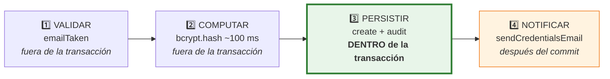
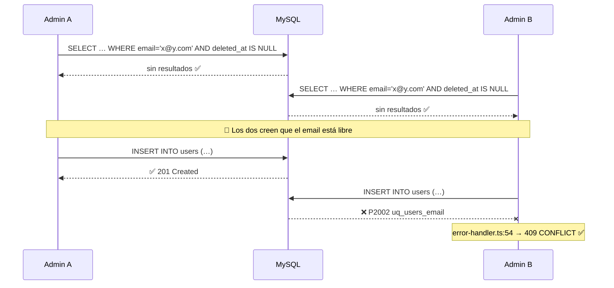
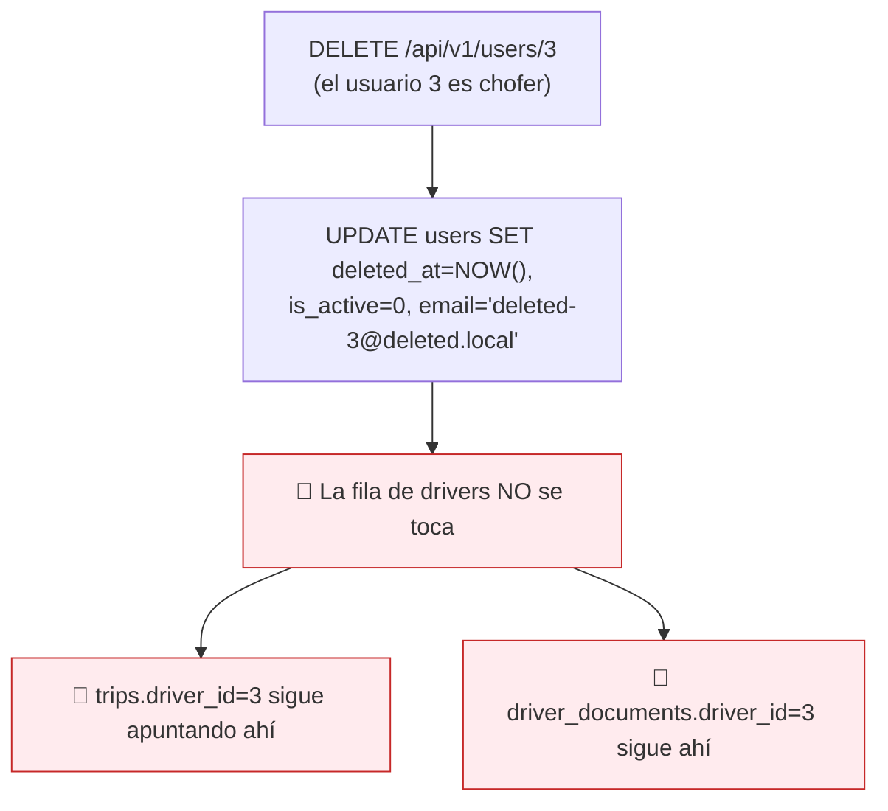
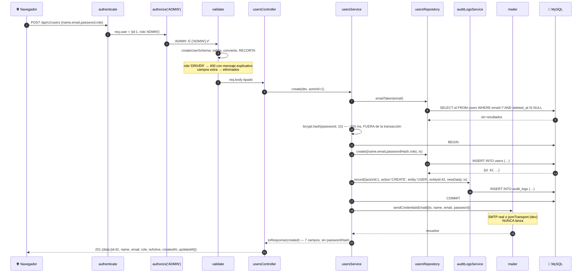
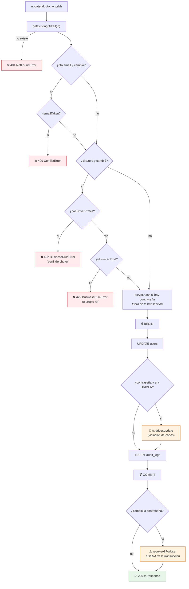

# Capítulo 9 — El módulo de usuarios

> **Prerrequisitos:** [Capítulo 6](06-backend-shared.md), [Capítulo 7](07-backend-middlewares.md) y [Capítulo 8](08-modulo-auth.md).
> **Archivos que se explican aquí:** `modules/users/users.routes.ts` (29 líneas), `users.schemas.ts` (66), `users.controller.ts` (73), `users.repository.ts` (95), `users.service.ts` (200). Total: 463 líneas, todas.
> **Al terminar** el lector conocerá el módulo CRUD de referencia del proyecto —el patrón que replican los otros doce— y habrá visto la primera **condición de carrera con consecuencias catastróficas** del sistema.

---

## 9.1. Introducción

Si el capítulo 8 explicó cómo se entra al sistema, este explica **quién puede entrar**. El módulo de usuarios administra las cuentas: altas, bajas, modificaciones, suspensión y reactivación.

Es también el **módulo de referencia arquitectónica**. Los doce restantes replican su estructura casi literalmente:

```
create → verificar unicidad → hashear → transacción { crear + auditar } → efectos posteriores
update → cargar existente → validar reglas → transacción { actualizar + auditar } → efectos
delete → cargar existente → transacción { baja lógica + auditar } → efectos
```

Leer este capítulo con atención hace que los capítulos 10 a 17 sean mucho más rápidos: en ellos solo cambian las reglas de negocio, no la forma.

**Pero el módulo también concentra tres cosas que merecen escrutinio:**

1. Una **violación de la separación de capas** que el propio proyecto declara.
2. Una **condición de carrera** que puede dejar al sistema sin ningún administrador.
3. Efectos secundarios **fuera de la transacción** que pueden dejar estados incoherentes.

---

## 9.2. Conceptos previos

### 9.2.1. Qué es un CRUD y por qué no es trivial

**CRUD** es el acrónimo de *Create, Read, Update, Delete*: las cuatro operaciones básicas sobre una entidad.

Suena mecánico, y en un tutorial lo es. En un sistema real, cada letra esconde preguntas difíciles:

| Operación | Preguntas que hay que responder |
|:--|:--|
| **Create** | ¿Qué campos son obligatorios? ¿Qué valores son únicos y cómo se garantiza bajo concurrencia? ¿Quién queda como autor? ¿Hay efectos secundarios (notificar, inicializar)? |
| **Read** | ¿Qué campos se exponen y cuáles no? ¿Cómo se pagina? ¿Qué filtros? ¿Se ven los borrados? |
| **Update** | ¿Qué campos son editables? ¿Cuáles solo bajo condiciones? ¿Se pueden editar a uno mismo? ¿Qué se invalida al cambiar? |
| **Delete** | ¿Físico o lógico? ¿Qué pasa con lo que referencia esta fila? ¿Se puede recuperar? |

💡 **Este módulo responde las 14 preguntas explícitamente en el código.** Es lo que separa un CRUD de tutorial de uno de producción: las 200 líneas del servicio son, casi enteramente, respuestas a esas preguntas.

### 9.2.2. Transacciones en Prisma

Ya se explicó qué es una transacción (§1.2.8). Aquí aparece por primera vez en código real:

```ts
const created = await prisma.$transaction(async (tx) => {
  const user = await usersRepository.create({...}, tx);
  await auditLogsService.record({...}, tx);
  return user;
});
```

**Las reglas de `$transaction` con callback (*interactive transaction*):**

| Regla | Detalle |
|:--|:--|
| Todo lo que use `tx` va en la misma transacción | Si se usa `prisma` en vez de `tx`, **esa operación queda fuera** |
| Si el callback lanza → `ROLLBACK` automático | No hay que escribirlo |
| Si el callback termina → `COMMIT` automático | Idem |
| El valor devuelto por el callback es el resultado | Por eso `return user` |
| Hay un **timeout** (5 s por defecto) | Superarlo aborta la transacción |

🔴 **El error más peligroso con este patrón es usar `prisma` en lugar de `tx` dentro del callback.** El código compila, se ejecuta, y **parece** funcionar. Pero esa operación va por una conexión distinta, fuera de la transacción: si algo falla después, no se revierte. Es un bug silencioso que solo se manifiesta bajo fallos.

💡 **Aquí es donde el parámetro `db: DbClient = prisma` de los repositorios (§2.3.2) paga.** Sin él, cada repositorio necesitaría dos versiones de cada método.

### 9.2.3. Por qué las operaciones caras van FUERA de la transacción

Este módulo hace algo que conviene notar antes de leer el código:

```ts
const passwordHash = await bcrypt.hash(dto.password, BCRYPT_ROUNDS);   // ← FUERA

const created = await prisma.$transaction(async (tx) => {              // ← la transacción
  const user = await usersRepository.create({..., passwordHash}, tx);
  await auditLogsService.record({...}, tx);
  return user;
});
```

🔴 **`bcrypt.hash` tarda ~100 ms.** Si estuviera dentro de la transacción, esa transacción mantendría **una conexión del pool ocupada y bloqueos abiertos en la base durante 100 ms extra**, sin hacer ningún trabajo de base de datos.

**Con un pool de 10 conexiones (§4.4), diez altas simultáneas agotarían el pool durante un segundo entero**, congelando todas las demás operaciones del sistema.

💡 **La regla general: las transacciones deben ser lo más cortas posible.** Todo el cómputo, las llamadas a servicios externos y las validaciones que no requieran consistencia transaccional van **antes** o **después**, nunca dentro.

**El módulo cumple esta regla en `create` y en `update`.** Es una decisión correcta y no obvia.

---

## 9.3. `users.routes.ts` línea por línea

```ts
9  /**
10  * User management is Admin-only (functional doc §2.1).
11  * State changes (activate/deactivate) are explicit POST actions,
12  * not generic PATCHes (Stage 1 convention).
13  */
14 export const usersRoutes = Router();
15
16 usersRoutes.use(authenticate, authorize('ADMIN'));
17
18 usersRoutes.get('/', validate(listUsersQuerySchema, 'query'), usersController.list);
19 usersRoutes.get('/:id', validate(idParamSchema, 'params'), usersController.getById);
20 usersRoutes.post('/', validate(createUserSchema), usersController.create);
21 usersRoutes.patch(
22   '/:id',
23   validate(idParamSchema, 'params'),
24   validate(updateUserSchema),
25   usersController.update,
26 );
27 usersRoutes.post('/:id/activate', validate(idParamSchema, 'params'), usersController.activate);
28 usersRoutes.post('/:id/deactivate', validate(idParamSchema, 'params'), usersController.deactivate);
29 usersRoutes.delete('/:id', validate(idParamSchema, 'params'), usersController.remove);
```

**Línea 16 — la protección de todo el módulo en una línea**

```ts
usersRoutes.use(authenticate, authorize('ADMIN'));
```

💡 **`use` acepta múltiples middlewares y los aplica en orden a TODAS las rutas del router.** Es la forma más segura de expresar "este módulo entero es solo para administradores":

| Enfoque | Riesgo |
|:--|:--|
| **`use` a nivel de router** (elegido) | ✅ Un endpoint nuevo queda protegido **automáticamente**. |
| Repetir en cada ruta | 🔴 Agregar un endpoint y olvidar el `authorize` deja un hueco silencioso. |

**Es seguridad por defecto en lugar de seguridad por disciplina**, y contrasta con `vehicles.routes.ts:20`, que aplica solo `authenticate` a nivel de router porque los permisos varían por endpoint.

**Líneas 27-28 — las transiciones de estado como acciones POST**

```ts
usersRoutes.post('/:id/activate', ...);
usersRoutes.post('/:id/deactivate', ...);
```

El comentario de las líneas 11-12 lo justifica: *"State changes are explicit POST actions, not generic PATCHes."*

🔴 **La razón es de control, y es sólida.** Con un `PATCH { isActive: false }` genérico, el cliente decide el valor y el servidor obedece. Con acciones explícitas:

1. **El servidor controla la transición.** No hay forma de que el cliente proponga un estado inválido.
2. **Se puede auditar con precisión.** La auditoría registra `ACTIVATE` o `DEACTIVATE`, no un `UPDATE` genérico del que habría que deducir qué cambió (`users.service.ts:164`).
3. **Se pueden aplicar reglas distintas por transición.** Desactivar revoca sesiones; activar no.
4. **El esquema de actualización no necesita incluir `isActive`** — y de hecho `updateUserSchema` **no lo incluye**, lo que hace imposible cambiarlo por la vía genérica.

💡 **Verificación cruzada:** `updateUserSchema` (`users.schemas.ts:29-36`) tiene `name`, `email`, `password` y `role`. **No tiene `isActive`.** Un `PATCH { isActive: true }` sería recortado por Zod (§7.5) y produciría un 400 por el `.refine()` de "al menos un campo". **La separación no es solo convención: está impuesta por el esquema.**

⚠️ **Lo que falta: un endpoint para restaurar un usuario borrado lógicamente.** El sistema tiene `deletedAt`, lo que implica que la información sigue ahí — pero **no hay forma de deshacer un borrado desde la API**. Un administrador que se equivoca tiene que ir a la base de datos a mano. Es una funcionalidad natural del borrado lógico que no se implementó.

---

## 9.4. `users.schemas.ts` línea por línea

Sesenta y seis líneas, y el esquema más sofisticado del proyecto.

### 9.4.1. `assignableRoles` (líneas 4-13)

```ts
4  /**
5   * DRIVER is intentionally absent from create/update role options:
6   * drivers require DNI + license data and are created atomically
7   * (user + driver row) through the Drivers module (POST /drivers).
8   */
9  const assignableRoles = z.enum(['ADMIN', 'OPERATOR'], {
10   errorMap: () => ({
11     message: 'Role must be ADMIN or OPERATOR. Drivers are created via POST /api/v1/drivers',
12   }),
13 });
```

🔴 **La ausencia de `DRIVER` es una decisión de diseño de primer orden, y es correcta.**

**El problema que evita.** Un chofer no es solo un usuario con otro rol: es una fila en `users` **más** una fila en `drivers` con DNI, categoría de licencia, vencimiento y contraseña cifrada (§3.4.3). Si `POST /users` aceptara `role: 'DRIVER'`, crearía la fila de `users` **sin** la de `drivers`.

**El resultado sería un usuario en un estado imposible:**

| Consecuencia | Detalle |
|:--|:--|
| Podría iniciar sesión | `authenticate` le daría `role: 'DRIVER'`. |
| El frontend lo mandaría al layout de chofer | `guards.tsx` decide por rol. |
| Todas sus pantallas fallarían | "Mi viaje", "Mi documentación" y "Mi historial" consultan `drivers`, que no existe. |
| Sería invisible en el listado de choferes | Ese listado consulta `drivers`. |
| No se podría reparar por la API | No hay endpoint para "agregar perfil de chofer a un usuario existente". |

💡 **Es un caso donde restringir la API previene un estado inconsistente que la base de datos NO puede impedir.** MySQL no tiene forma de expresar "si `users.role = 'DRIVER'`, debe existir una fila en `drivers`". La restricción vive en el esquema de Zod, y **es la única barrera**.

⚠️ **Y por eso mismo es frágil:** un `INSERT` manual, un script de migración o un módulo futuro que use `usersRepository.create` directamente podrían crear el estado imposible. Una restricción `CHECK` no puede expresarlo; un `TRIGGER` sí, pero el proyecto rechaza los triggers por política (§3.3.2).

**El `errorMap` — un detalle de calidad poco frecuente**

```ts
errorMap: () => ({ message: 'Role must be ADMIN or OPERATOR. Drivers are created via POST /api/v1/drivers' })
```

Sin él, Zod diría:

```
Invalid enum value. Expected 'ADMIN' | 'OPERATOR', received 'DRIVER'
```

Correcto y **completamente inútil**: no explica *por qué* falta `DRIVER` ni qué hacer.

Con él, el mensaje **enseña la API**: dice qué está mal, por qué, y cuál es el endpoint correcto.

💡 **Es un mensaje de error que reduce la carga de soporte.** Alguien integrando la API descubre el flujo correcto sin leer documentación ni preguntar. Es el mejor mensaje de error del proyecto, y contrasta con el resto de mensajes de Zod, que están en inglés genérico (§7.6.3).

### 9.4.2. `passwordSchema` (líneas 15-19)

```ts
const passwordSchema = z
  .string()
  .min(8, 'Password must be at least 8 characters')
  .regex(/[A-Za-z]/, 'Password must contain a letter')
  .regex(/\d/, 'Password must contain a number');
```

**Tres reglas: 8 caracteres, al menos una letra, al menos un número.**

🔴 **Contrasta deliberadamente con `loginSchema.password`, que solo exige `.min(1)`** (§8.4).

**No es una inconsistencia: es el principio correcto.** Validar la política **al establecer** la credencial, nunca **al verificarla**. Validar en el login filtraría información sobre las contraseñas existentes y bloquearía a usuarios creados antes de la política.

**Evaluación honesta de esta política:**

| Regla | ¿Aporta? | Comentario |
|:--|:--|:--|
| `.min(8)` | ✅ Sí | Es el mínimo absoluto recomendado. |
| Al menos una letra | ⚠️ Marginal | Impide `12345678`. |
| Al menos un número | ⚠️ Marginal | Impide `password`. |

⚠️ **Las reglas de composición son un enfoque cuestionado desde 2017.** La guía NIST SP 800-63B **desaconseja** explícitamente exigir mezclas de tipos de carácter, porque el resultado predecible es `Password1!` — que cumple todas las reglas y está en el primer millar de cualquier diccionario. Mientras tanto, `correcto caballo batería grapa` (mucho más fuerte y memorable) **sería rechazada** por no tener números.

**Lo que la guía recomienda en su lugar:**

| Recomendación | ¿Está? |
|:--|:--|
| Longitud mínima de 8, idealmente más | ✅ Sí (8) |
| **Longitud máxima alta (≥64)** | ❌ **No hay máximo** |
| **Contrastar contra listas de contraseñas comprometidas** | ❌ No |
| No exigir composición | ❌ Sí la exige |
| No forzar cambios periódicos | ✅ No los fuerza |

🔴 **La ausencia de máximo es un problema concreto**, ya señalado en §8.4: `bcrypt` **trunca silenciosamente a 72 bytes**, y una contraseña de 10 MB consumiría CPU proporcional bloqueando el hilo único de Node. Un `.max(72)` resolvería ambas cosas.

💡 **La mejora de mayor impacto real** sería contrastar contra una lista de contraseñas filtradas (el paquete `zxcvbn` o la API k-anonymous de *Have I Been Pwned*). Rechazar `Password1` haría más por la seguridad que las dos reglas de composición juntas.

**Se reutiliza en creación y actualización** (líneas 24 y 33), con `.optional()` en la segunda. Definir una vez y reutilizar garantiza que la política no diverja.

### 9.4.3. `listUsersQuerySchema` (líneas 39-65)

Es la construcción más avanzada de Zod en todo el proyecto.

```ts
39 const roleEnum = z.enum(['ADMIN', 'OPERATOR', 'DRIVER']);
40
41 /**
42  * `role` accepts a single role or a comma-separated list (e.g. "ADMIN,OPERATOR")
43  * so a caller can list only administrative accounts. Always normalized to an
44  * array of valid roles.
45  */
46 export const listUsersQuerySchema = paginationSchema.extend({
47   role: z
48     .string()
49     .optional()
50     .transform((v, ctx) => {
51       if (!v) return undefined;
52       const parsed = v.split(',').map((r) => r.trim().toUpperCase());
53       const result = z.array(roleEnum).safeParse(parsed);
54       if (!result.success) {
55         ctx.addIssue({ code: z.ZodIssueCode.custom, message: 'Invalid role value' });
56         return z.NEVER;
57       }
58       return result.data;
59     }),
60   isActive: z
61     .enum(['true', 'false'])
62     .transform((v) => v === 'true')
53     .optional(),
64   search: z.string().max(150).optional(),
65 });
```

**Línea 39 — `roleEnum` incluye `DRIVER`**

💡 **Contraste deliberado con `assignableRoles`**, que lo excluye. **Filtrar** por rol `DRIVER` tiene sentido (se quiere ver a los choferes en el listado); **asignar** ese rol no. Dos enums para dos propósitos distintos, correctamente separados.

**Línea 46 — `paginationSchema.extend({...})`**

`.extend()` produce un esquema nuevo con los campos de `paginationSchema` (`page`, `limit`) más los propios. **No muta el original**: `paginationSchema` sigue sirviendo para los otros 12 módulos.

💡 **Es composición de esquemas**, y es lo que permite que la paginación se defina una sola vez (§6.3.2) y se reutilice trece veces sin copiar.

**Líneas 47-59 — el transform con contexto, desarmado**

Este bloque resuelve un problema concreto: **las cadenas de consulta no tienen arreglos nativos**.

`?role=ADMIN,OPERATOR` llega como el string `"ADMIN,OPERATOR"`. Hay que partirlo, normalizarlo y validarlo.

**Paso a paso:**

| Línea | Qué hace |
|:--:|:--|
| 48 | Acepta un `string` (lo que realmente llega). |
| 49 | `.optional()` — el filtro no es obligatorio. |
| 50 | `.transform((v, ctx) => ...)` — el segundo parámetro `ctx` permite **agregar errores desde dentro del transform**. |
| 51 | Si no vino, devuelve `undefined`. Sin filtro. |
| 52 | Parte por comas, quita espacios, pasa a mayúsculas. `" admin , Operator "` → `['ADMIN','OPERATOR']`. |
| 53 | Valida el arreglo resultante **con otro esquema Zod anidado**. |
| 55 | Si algo no es un rol válido, agrega un error al contexto. |
| 56 | `return z.NEVER` — señal para Zod de que este transform falló. |
| 58 | Si todo bien, devuelve el arreglo tipado. |

⚙️ **`z.NEVER` merece explicación.** Es un valor centinela que Zod exporta. Un `transform` **debe** devolver algo, pero cuando falla no hay un valor sensato que devolver. `z.NEVER` tiene tipo `never`, lo que le dice a TypeScript "esta rama no produce un valor" y a Zod "descartá este resultado, ya hay un error registrado". **Sin él, TypeScript se quejaría de que la función puede devolver `undefined` en un camino de error.**

**El tipo resultante:** `Role[] | undefined`.

💡 **La normalización a mayúsculas hace la API tolerante:** `?role=admin`, `?role=Admin` y `?role=ADMIN` funcionan igual. Es lo contrario de lo que hace `loginSchema` con el email (§8.4), donde falta esa normalización. **La misma consideración aplicada en un lugar y olvidada en otro.**

⚠️ **Dos casos límite no cubiertos:**

| Entrada | Resultado | ¿Correcto? |
|:--|:--|:--|
| `?role=` (vacío) | `undefined` (por `if (!v)`) | ✅ Sí |
| `?role=ADMIN,` (coma final) | `['ADMIN', '']` → `''` no es rol → **400** | ⚠️ Discutible |
| `?role=ADMIN,ADMIN` | `['ADMIN','ADMIN']` → duplicado en el `IN` | ⚠️ Inofensivo pero sucio |

Un `.filter(Boolean)` antes de validar y un `[...new Set(...)]` después resolverían ambos.

**Líneas 60-63 — `isActive`**

El mismo patrón de tres pasos que `SMTP_SECURE` (§5.3.2): `z.enum(['true','false']).transform(v => v === 'true').optional()`.

🔴 **Repetido porque es importante: `z.coerce.boolean()` sería un desastre**, porque `Boolean("false")` es `true`. `?isActive=false` filtraría por **activos**, que es exactamente lo contrario de lo pedido — y sin ningún error.

**Línea 64 — `search`**

```ts
search: z.string().max(150).optional(),
```

`.max(150)` acota el tamaño. Se usa en `buildWhere` con `contains` sobre `name` y `email` (`users.repository.ts:25`).

⚠️ **`contains` genera `LIKE '%texto%'` en SQL, y eso NO puede usar índices.** Un `LIKE` con comodín inicial obliga a un recorrido completo de la tabla. Con cientos de usuarios es irrelevante; con cientos de miles sería el cuello de botella del listado.

**La solución para escala** sería un índice `FULLTEXT` de MySQL con `MATCH ... AGAINST`, o un motor de búsqueda externo. Para este proyecto, `LIKE` es la elección correcta: simple y suficiente.

⚠️ **Y un detalle de seguridad tranquilizador:** el texto de búsqueda **no** se interpola en SQL. Prisma lo pasa como parámetro (§4.8.2), así que `%'; DROP TABLE users; --` es un dato literal. Lo que sí hace es escapar mal los comodines: buscar `%` o `_` devuelve todo, porque son comodines de `LIKE`. Es un detalle cosmético.

---

## 9.5. `users.repository.ts` línea por línea

### 9.5.1. `buildWhere` (líneas 17-29)

```ts
17 /** Soft-delete convention (RN-20): every read filters deletedAt = null. */
18 function buildWhere(filters: UserFilters): Prisma.UserWhereInput {
19   return {
20     deletedAt: null,
21     role: filters.role ? { in: filters.role } : undefined,
22     isActive: filters.isActive,
23     ...(filters.search
24       ? {
25           OR: [{ name: { contains: filters.search } }, { email: { contains: filters.search } }],
26         }
27       : {}),
28   };
29 }
```

**Línea 20 — `deletedAt: null` codificado, no opcional**

Es la aplicación de RN-20 **por construcción** (§2.3.2). Quien use este repositorio no puede olvidarse de filtrar los borrados: no hay forma de pedirlos.

⚠️ **Y esa rigidez tiene un costo:** no hay manera de listar los usuarios dados de baja, ni siquiera para un administrador que quiera auditarlos o restaurarlos. Enlaza con la funcionalidad faltante de §9.3.

**Línea 21 — `{ in: filters.role }` o `undefined`**

⚙️ **`undefined` en un `where` de Prisma significa "ignorá este campo".** No genera ninguna cláusula SQL. Es distinto de `null`, que generaría `IS NULL`.

**Es la diferencia que hace funcionar el filtrado opcional:**

| Valor | SQL generado |
|:--|:--|
| `role: undefined` | *(nada — no filtra por rol)* |
| `role: { in: ['ADMIN'] }` | `AND role IN ('ADMIN')` |
| `role: null` | `AND role IS NULL` — 🔴 **nunca coincidiría** |

**Línea 22 — `isActive: filters.isActive`**

Mismo mecanismo, sin ternario: si es `undefined`, Prisma lo ignora. Más limpio que la línea 21, que necesita el ternario solo por la envoltura `{ in: ... }`.

**Líneas 23-27 — la propagación condicional**

```ts
...(filters.search ? { OR: [...] } : {})
```

Si hay búsqueda, agrega la cláusula `OR`; si no, propaga un objeto vacío que no agrega nada.

💡 **Por qué no `OR: filters.search ? [...] : undefined`.** Funcionaría igual (Prisma ignora `undefined`), y sería más corto. La forma elegida es la idiomática para "agregar una propiedad condicionalmente", y se usa consistentemente en los 13 repositorios. La coherencia vale más que dos caracteres.

### 9.5.2. `softDelete` y la lápida del email (líneas 71-86)

```ts
/**
 * Soft delete with email tombstone: the DB-level UNIQUE(email) also covers
 * soft-deleted rows, so the email is replaced with a short, collision-free
 * placeholder (one row per id) to free it for future users. The original
 * email is preserved in the audit trail (previousData).
 */
softDelete(id: number, db: DbClient = prisma): Promise<User> {
  return db.user.update({
    where: { id },
    data: {
      deletedAt: new Date(),
      isActive: false,
      email: `deleted-${id}@deleted.local`,
    },
  });
},
```

**Tres campos se modifican, y cada uno tiene su razón:**

| Campo | Valor | Por qué |
|:--|:--|:--|
| `deletedAt` | `new Date()` | La marca de baja lógica. |
| `isActive` | `false` | **Defensa en profundidad**: aunque algo lea sin filtrar `deletedAt`, el usuario figura inactivo. |
| `email` | `deleted-{id}@deleted.local` | Libera el email para reutilizarlo. |

🔴 **La lápida del email resuelve un problema real y no obvio**, ya visto con las patentes (§2.3.2). `UNIQUE(email)` se aplica a **todas** las filas, incluidas las borradas lógicamente. Sin la reescritura, dar de baja a `juan@empresa.com` y volver a darlo de alta fallaría con clave duplicada — **y el administrador no entendería por qué**, porque en pantalla ese usuario ya no existe.

**El formato es cuidadoso:**

- `deleted-{id}@` — el id garantiza unicidad (es la clave primaria).
- `.local` — es un **TLD reservado** por el RFC 6762 para uso en redes locales. **Nunca será un dominio real**, así que no puede colisionar con un email legítimo ni recibir correo por accidente.
- Longitud: `deleted-999999@deleted.local` son 28 caracteres, muy por debajo de `VARCHAR(150)`.

💡 **Elegir `.local` en vez de `.com` o `.deleted` es un detalle de calidad.** Es la diferencia entre un valor centinela pensado y uno improvisado.

**El comentario declara la contrapartida:** *"The original email is preserved in the audit trail (previousData)."*

✅ **Verificado:** `users.service.ts:193` pasa `previousData: toAuditSnapshot(existing)`, y `toAuditSnapshot` (línea 40) incluye `email`. **El dato no se pierde: se mueve a `audit_logs`.** La afirmación del comentario es cierta, a diferencia de la de `auth.service.ts:75-76` (§8.6.5).

⚠️ **Pero recuperarlo requiere consultar la auditoría manualmente.** No hay endpoint que diga "¿cuál era el email del usuario 5 antes de borrarlo?".

### 9.5.3. `hasDriverProfile` (líneas 88-94)

```ts
/** Whether the user has a driver row (blocks role changes — see service). */
async hasDriverProfile(id: number): Promise<boolean> {
  const driver = await prisma.driver.findUnique({
    where: { userId: id },
    select: { userId: true },
  });
  return driver !== null;
},
```

**`select: { userId: true }`** — pide una sola columna. La consulta se responde **enteramente desde el índice de la clave primaria**, sin tocar la tabla. Es lo más barato posible para una pregunta de existencia.

⚠️ **Dos observaciones críticas:**

🔴 **1. Este método consulta `prisma.driver` desde el repositorio de USUARIOS.**

Es un cruce de fronteras entre módulos. La alternativa "pura" sería importar `driversRepository` y llamarlo.

**¿Es grave?** Moderadamente. Argumentos a favor de la forma actual: evita un acoplamiento entre repositorios y la consulta es trivial. Argumentos en contra: si mañana `drivers` cambiara su forma de resolver la existencia (por ejemplo, agregando su propio borrado lógico), este método **no se enteraría** y devolvería un resultado obsoleto.

⚠️ **2. NO acepta el parámetro `db: DbClient = prisma`.**

Los otros seis métodos del repositorio lo tienen. Este no, así que **no puede participar de una transacción**.

🔴 **Y eso importa, porque el servicio lo usa fuera de la transacción para decidir si permite un cambio de rol** (`users.service.ts:109`). Entre esa comprobación y el `UPDATE` posterior hay una ventana en la que otro proceso podría crear el perfil de chofer. Es una condición de carrera de baja probabilidad, pero es exactamente el tipo de hueco que el parámetro `db` existe para cerrar.

---

## 9.6. `users.service.ts` línea por línea

Doscientas líneas: el servicio de referencia del proyecto.

### 9.6.1. Las funciones auxiliares (líneas 15-47)

```ts
15 export interface UserResponse {
16   id: number;
17   name: string;
18   email: string;
19   role: Role;
20   isActive: boolean;
21   createdAt: Date;
22   updatedAt: Date;
23 }
24
25 /** API shape: never exposes passwordHash or soft-delete internals. */
26 function toResponse(user: User): UserResponse {
27   return {
28     id: user.id, name: user.name, email: user.email, role: user.role,
29     isActive: user.isActive, createdAt: user.createdAt, updatedAt: user.updatedAt,
30   };
31 }
```

**`toResponse` es una lista blanca**, igual que `toPublicUser` (§8.6.1). Siete de los nueve campos de `User`.

**Los dos excluidos, y por qué:**

| Campo excluido | Motivo |
|:--|:--|
| `passwordHash` | 🔴 Material para fuerza bruta offline sin límite de velocidad. |
| `deletedAt` | Detalle interno. Si aparece en la respuesta, siempre valdría `null` (el repositorio filtra los borrados), así que no aporta nada y expone la estrategia de persistencia. |

💡 **Nótese la diferencia con `PublicUser` del módulo de auth** (§8.6.1), que tiene **cuatro** campos. Son dos formas distintas de la misma entidad para dos audiencias distintas:

| | `PublicUser` (auth) | `UserResponse` (users) |
|:--|:--|:--|
| Para quién | El propio usuario, tras iniciar sesión | Un administrador gestionando cuentas |
| Campos | 4 | 7 |
| Incluye `isActive` | ❌ No | ✅ Sí |
| Incluye fechas | ❌ No | ✅ Sí |

**Es correcto que sean distintas.** Un usuario que inicia sesión no necesita saber cuándo se creó su cuenta; un administrador sí. **Cada módulo define la forma de salida que su caso de uso requiere** — es el principio de segregación de interfaces (§2.5) aplicado a los DTO.

⚠️ **Pero implica que `User` tiene tres representaciones distintas en el sistema** (`PublicUser`, `UserResponse`, y la entidad Prisma). Sin una convención clara, es fácil que una tercera aparezca en otro módulo y exponga un campo de más. **La disciplina depende de que cada autor se acuerde.**

**Líneas 38-41 — `toAuditSnapshot`**

```ts
/** Snapshot for the audit trail (sensitive fields are redacted downstream). */
function toAuditSnapshot(user: User) {
  return { name: user.name, email: user.email, role: user.role, isActive: user.isActive };
}
```

✅ **El comentario es correcto, y se verifica en el capítulo 15.** *"Sensitive fields are redacted downstream"* se refiere a `auditLogsService.sanitize` (`audit-logs.service.ts:41-52`), que reemplaza por `'[REDACTED]'` los campos `passwordHash`, `encryptedPassword` y `tokenHash` antes de escribir en la base.

💡 **Hay entonces DOS barreras encadenadas**, y es defensa en profundidad legítima:

| Barrera | Dónde | Alcance |
|:--|:--|:--|
| 1 — Lista blanca | `toAuditSnapshot`, aquí | Los cuatro campos que este módulo decide auditar |
| 2 — Lista negra | `sanitize`, en el servicio de auditoría | **Cualquier** dato que llegue de **cualquier** módulo |

🔴 **La segunda es la que importa de verdad**, porque protege también a los módulos que **no** usan lista blanca. Y tiene una limitación que se analiza en §15.4.2: **solo recorre el primer nivel del objeto.**

💡 **La ausencia de `createdAt`/`updatedAt` en el snapshot es deliberada y correcta:** son metadatos técnicos, no cambios de negocio. Incluirlos haría que **toda** actualización mostrara una diferencia en `updatedAt`, ensuciando el diff de la auditoría.

**Líneas 43-47 — `getExistingOrFail`**

```ts
async function getExistingOrFail(id: number): Promise<User> {
  const user = await usersRepository.findById(id);
  if (!user) throw new NotFoundError(`User ${id} not found`);
  return user;
}
```

Elimina cinco repeticiones de `if (!user) throw`. El tipo de retorno es `User`, no `User | null`, así que los llamadores no comprueban nulos.

💡 **Es el patrón "obtener o fallar", y su valor está en el tipo:** convierte una comprobación que hay que recordar en una garantía del compilador.

⚠️ **Pero `getExistingOrFail` tampoco acepta `db`**, así que siempre lee **fuera** de la transacción. Es la fuente de las condiciones de carrera que se analizan en §9.6.5.

### 9.6.2. `list` (líneas 50-64)

```ts
async list(query: ListUsersQuery): Promise<PaginatedResult<UserResponse>> {
  const filters: UserFilters = { role: query.role, isActive: query.isActive, search: query.search };
  const [users, total] = await Promise.all([
    usersRepository.findMany(filters, { skip: (query.page - 1) * query.limit, take: query.limit }),
    usersRepository.count(filters),
  ]);
  return { items: users.map(toResponse), total };
}
```

**`Promise.all` — las dos consultas van EN PARALELO.**

```mermaid
gantt
    dateFormat SSS
    axisFormat %L ms
    title Secuencial vs. Promise.all
    section Secuencial (await + await)
    findMany  :a1, 000, 12
    count     :a2, after a1, 8
    section Promise.all (elegido)
    findMany  :b1, 000, 12
    count     :b2, 000, 8
```



**Secuencial: 20 ms. En paralelo: 12 ms.** Un 40% menos.

⚙️ **Por qué funciona.** Node es de un solo hilo, pero las consultas a la base son **I/O**: se despachan y el hilo queda libre. `Promise.all` lanza ambas y espera a las dos. Las dos viajan **por conexiones distintas del pool** y MySQL las procesa concurrentemente.

🔴 **`Promise.all` falla rápido: si una promesa se rechaza, el resultado se rechaza inmediatamente**, aunque la otra siga en curso. Aquí es correcto (si una consulta falla, la respuesta no sirve). Pero es un comportamiento que hay que conocer: `Promise.allSettled` esperaría a ambas.

⚠️ **Las dos consultas NO son atómicas entre sí.** Entre `findMany` y `count` podría insertarse una fila, y el `total` no coincidiría exactamente con lo listado. En un listado paginado eso es irrelevante (la siguiente recarga lo corrige); en un reporte financiero no lo sería.

**Línea 58 — `skip: (query.page - 1) * query.limit`**

La conversión de "página 1-based" (humana) a `OFFSET` 0-based (SQL), ya anticipada en §6.3.2. Página 1 → offset 0; página 3 con límite 10 → offset 20.

### 9.6.3. `create` (líneas 70-97)

```ts
70 async create(dto: CreateUserDto, actorId: number): Promise<UserResponse> {
71   if (await usersRepository.emailTaken(dto.email)) {
72     throw new ConflictError(`Email ${dto.email} is already in use`);
73   }
74   const passwordHash = await bcrypt.hash(dto.password, BCRYPT_ROUNDS);
75
76   const created = await prisma.$transaction(async (tx) => {
77     const user = await usersRepository.create(
78       { name: dto.name, email: dto.email, passwordHash, role: dto.role },
79       tx,
80     );
81     await auditLogsService.record(
82       { actorId, action: 'CREATE', entity: 'USER', entityId: user.id, newData: toAuditSnapshot(user) },
83       tx,
84     );
85     return user;
86   });
87
88   // Deliver credentials by email (DOC-1), after the commit and best-effort:
89   // a mail failure must not undo the created user.
90   await sendCredentialsEmail({
91     to: created.email, name: created.name, email: created.email, password: dto.password,
92   });
93   return toResponse(created);
94 }
```

**La estructura tiene cuatro fases claramente separadas**, y esa separación es la lección principal del método:



**Línea 71 — la comprobación de unicidad, FUERA de la transacción**

```ts
if (await usersRepository.emailTaken(dto.email)) {
  throw new ConflictError(`Email ${dto.email} is already in use`);
}
```

🔴 **Hay una ventana de carrera**, exactamente la analizada en §7.6.5:



💡 **El sistema queda correcto**, porque `error-handler` traduce el `P2002` a un 409 con un mensaje genérico. **La comprobación previa no es la garantía: es la mejora de experiencia.** Da un mensaje específico (*"Email x@y.com is already in use"*) en el 99,9% de los casos; la restricción de la base cubre el resto.

⚠️ **Aun así, el mensaje del caso de carrera es peor** (*"A record with this unique value already exists"*, sin decir cuál). La mejora propuesta en §7.6.5 —leer `err.meta.target`— lo resolvería.

**Línea 74 — el hash, fuera de la transacción**

Ya justificado en §9.2.3. **Es la decisión de rendimiento más importante del método.**

**Líneas 76-86 — la transacción**

Dos operaciones atómicas: crear el usuario y registrar la auditoría.

🔴 **Que la auditoría esté DENTRO es esencial.** Si estuviera fuera:

| Fallo | Consecuencia |
|:--|:--|
| Falla el `INSERT` de usuario | Quedaría un registro de auditoría de un usuario inexistente. |
| Falla el `INSERT` de auditoría | El usuario existiría **sin rastro de quién lo creó**. |

**La auditoría solo sirve si es completa.** Un registro con huecos no es evidencia: es una lista de algunas cosas que pasaron.

💡 **Y es la razón por la que `auditLogsService.record` acepta `tx`** — el mismo patrón `db: DbClient = prisma` de los repositorios, propagado a un servicio.

**Líneas 88-92 — el correo, DESPUÉS del commit**

El comentario declara las dos propiedades: *"after the commit and best-effort"*.

**Por qué después del commit:**

| Si estuviera dentro | Problema |
|:--|:--|
| El correo tarda (SMTP puede tardar segundos) | La transacción quedaría abierta ocupando una conexión y bloqueos. |
| Si el commit fallara tras enviar | El usuario recibiría credenciales de una cuenta que **no existe**. |

**Por qué "best-effort":** `sendCredentialsEmail` **nunca lanza** (§6.8.3). Un fallo de SMTP no revierte el usuario ya creado.

🔴 **Pero hay un `await` en la línea 90, y eso tiene una consecuencia que conviene notar.**

El `await` significa que **la respuesta HTTP espera al envío del correo**. Con un servidor SMTP lento (2-3 segundos es común), el administrador ve la pantalla congelada esos segundos **aunque el usuario ya esté creado y confirmado en la base**.

**Como la función no puede fallar, el `await` no aporta nada al resultado:** solo agrega latencia. Sería mejor:

```ts
// — mejora propuesta —
void sendCredentialsEmail({...});   // sin await: respuesta inmediata
return toResponse(created);
```

⚠️ **Con un matiz:** sin `await`, si el proceso muriera justo después de responder, el correo no se enviaría y nadie lo sabría. La solución robusta es una **cola de trabajos** (§6.8.3), que hoy no existe. Entre las dos opciones disponibles, quitar el `await` es la mejor: el administrador tiene la contraseña en pantalla de todos modos.

🔴 **Y el problema de fondo, ya señalado en §6.8.2: se envía la contraseña en claro por correo.** La línea 91 pasa `password: dto.password` — el valor original, que sigue en memoria después de haberse hasheado.

**Nótese que `dto.password` sobrevive todo el método.** Es inevitable dado el requisito, pero significa que la contraseña en claro está en la memoria del proceso desde que llega la petición hasta que se responde.

⚠️ **Y un detalle final: `create` NO cifra la contraseña con AES**, aunque `update` sí lo hace para choferes (línea 127-132). Es coherente, porque este endpoint **no puede crear choferes** (§9.4.1). Pero muestra que la lógica de "mantener sincronizada la copia AES" está repartida entre dos módulos.

### 9.6.4. `update` (líneas 99-150) — el método más denso

```ts
99  async update(id: number, dto: UpdateUserDto, actorId: number): Promise<UserResponse> {
100   const existing = await getExistingOrFail(id);
101
102   if (dto.email && dto.email !== existing.email) {
103     if (await usersRepository.emailTaken(dto.email, id)) {
104       throw new ConflictError(`Email ${dto.email} is already in use`);
105     }
106   }
107   // A role change on a user with a driver profile would orphan its
108   // driver data (DNI, license, documents) — structurally inconsistent.
109   if (dto.role && dto.role !== existing.role && (await usersRepository.hasDriverProfile(id))) {
110     throw new BusinessRuleError('Cannot change the role of a user with a driver profile');
111   }
112   // An admin demoting themselves would lock them out of user management.
113   if (dto.role && dto.role !== existing.role && id === actorId) {
114     throw new BusinessRuleError('You cannot change your own role');
115   }
116
117   const passwordHash = dto.password ? await bcrypt.hash(dto.password, BCRYPT_ROUNDS) : undefined;
118
119   const updated = await prisma.$transaction(async (tx) => {
120     const user = await usersRepository.update(
121       id, { name: dto.name, email: dto.email, role: dto.role, passwordHash }, tx,
122     );
123     // A-9 consistency: if a driver's password changes, the AES copy
124     // visible to the Admin must stay in sync with the bcrypt hash.
125     if (dto.password && existing.role === 'DRIVER') {
126       await tx.driver.update({
127         where: { userId: id },
128         data: { encryptedPassword: encrypt(dto.password) },
129       });
130     }
131     await auditLogsService.record({ ... }, tx);
132     return user;
133   });
134   // A changed password must invalidate existing sessions.
135   if (dto.password) await authRepository.revokeAllForUser(id);
136   return toResponse(updated);
137 }
```

#### Las tres reglas de negocio

**Regla 1 (líneas 102-106) — email único, solo si cambió**

```ts
if (dto.email && dto.email !== existing.email) {
```

💡 **La segunda condición evita una consulta innecesaria.** Si el administrador envía el formulario sin tocar el email, no hay nada que verificar.

**`emailTaken(dto.email, id)` recibe un segundo argumento**: el id a excluir (`users.repository.ts:54-60`). Sin él, el usuario chocaría **consigo mismo**: su propio email figuraría como "tomado".

⚠️ **Pero con la primera condición, ese `excludeId` es redundante**: si el email no cambió, ni siquiera se consulta. Sirve como defensa por si alguien quita la comparación. Es redundancia defensiva barata.

🔴 **Lo que falta: cambiar el email NO revoca las sesiones ni notifica al usuario.**

**El escenario problemático:** un atacante que comprometa una cuenta de administrador puede cambiar el email de otro usuario a uno propio, y ese usuario **no se entera de nada**. Combinado con la falta de un flujo de recuperación de contraseña, el efecto práctico es limitado — pero en cualquier sistema con recuperación por email, esto es la primera mitad de un secuestro de cuenta.

**Lo estándar es notificar al email ANTERIOR** cuando cambia la dirección, precisamente para que el titular pueda reaccionar.

**Regla 2 (líneas 107-111) — no cambiar el rol de un chofer**

```ts
if (dto.role && dto.role !== existing.role && (await usersRepository.hasDriverProfile(id))) {
  throw new BusinessRuleError('Cannot change the role of a user with a driver profile');
}
```

**Es la contrapartida de la restricción de `assignableRoles`** (§9.4.1). Aquella impide **crear** un chofer sin su perfil; esta impide **dejar huérfano** un perfil existente.

**Qué pasaría sin la regla:** un chofer con viajes históricos, documentación y DNI pasa a `OPERATOR`. Su fila en `drivers` **sigue existiendo** (nada la borra) y `trips.driver_id` **sigue apuntando a ella**. Resultado:

| Vista | Qué muestra |
|:--|:--|
| Listado de usuarios | Aparece como OPERATOR ✅ |
| Listado de choferes | **Sigue apareciendo** (consulta `drivers`) 🔴 |
| Asignación de viaje | Podría seleccionárselo 🔴 |
| Sus pantallas de chofer | Inaccesibles (su rol ya no es DRIVER) 🔴 |

**Un usuario que es y no es chofer a la vez.** La regla lo previene.

💡 **`BusinessRuleError` (422) y no `ConflictError` (409) es la elección correcta:** los datos son válidos y comprensibles, pero la operación viola una regla del dominio (§6.2.4).

⚠️ **Aunque `BusinessRuleError` acepta un identificador de regla como segundo argumento** (`app-error.ts:57`) **y aquí no se pasa ninguno.** El campo existe, el módulo no lo usa, y aunque lo usara no llegaría al cliente (§6.2.4). Es una funcionalidad muerta en tres niveles.

**Regla 3 (líneas 112-115) — no cambiarse el propio rol**

```ts
if (dto.role && dto.role !== existing.role && id === actorId) {
  throw new BusinessRuleError('You cannot change your own role');
}
```

El comentario lo explica: *"An admin demoting themselves would lock them out of user management."*

💡 **Es una protección contra el error propio, no contra un atacante.** Un administrador que se degrada a `OPERATOR` pierde inmediatamente el acceso a `/api/v1/users` — y por lo tanto **no puede volver a promoverse**. Necesitaría a otro administrador, o acceso directo a la base.

**Es la clase de error que se comete una vez y cuesta horas.**

#### 🔴 La condición de carrera que puede dejar el sistema sin administradores

Las tres reglas protegen contra el error individual. **Ninguna protege contra la concurrencia.**

**El sistema garantiza que siempre quede al menos un administrador… si las operaciones son secuenciales:**

| Operación | ¿Bloqueada sobre uno mismo? |
|:--|:--|
| Cambiar el propio rol | ✅ Sí (línea 113) |
| Desactivarse a uno mismo | ✅ Sí (línea 153) |
| Borrarse a uno mismo | ✅ Sí (línea 180) |

**Con dos administradores A y B, secuencialmente:** A degrada a B → queda A, que no puede tocarse a sí mismo. **Siempre queda uno.** ✅

**Pero en paralelo:**

```mermaid
sequenceDiagram
    participant A as Admin A
    participant DB as MySQL
    participant B as Admin B

    Note over A,B: Ambos son ADMIN. Actúan simultáneamente.
    A->>DB: getExistingOrFail(B) → B es ADMIN, activo
    B->>DB: getExistingOrFail(A) → A es ADMIN, activo
    Note over A: id(B) ≠ actorId(A) → ✅ pasa la validación
    Note over B: id(A) ≠ actorId(B) → ✅ pasa la validación
    A->>DB: BEGIN; UPDATE users SET is_active=0 WHERE id=B; COMMIT
    B->>DB: BEGIN; UPDATE users SET is_active=0 WHERE id=A; COMMIT
    rect rgb(255, 235, 238)
    Note over DB: 🔴 CERO ADMINISTRADORES ACTIVOS
    Note over DB: Nadie puede entrar a /api/v1/users.<br/>Nadie puede reactivar a nadie.<br/>SOLO SE ARREGLA CON ACCESO DIRECTO A LA BASE.
    end
```

🔴 **El mismo escenario funciona con `softDelete` (A borra a B mientras B borra a A) y con cambios de rol mutuos.** El sistema queda **permanentemente bloqueado** para la administración, y la única salida es un `UPDATE` manual en MySQL.

**Por qué ninguna validación lo detecta:**

1. `getExistingOrFail` lee **fuera** de la transacción.
2. La comprobación `id === actorId` solo mira **al actor**, no al conjunto de administradores.
3. No hay ninguna regla que diga *"debe quedar al menos un ADMIN activo"*.

**Las dos correcciones necesarias, y son independientes:**

```ts
// — corrección 1: la regla de negocio que falta —
async function assertNoEsElUltimoAdmin(id: number, tx: DbClient): Promise<void> {
  const objetivo = await tx.user.findFirst({ where: { id, deletedAt: null } });
  if (objetivo?.role !== 'ADMIN') return;
  const adminsActivos = await tx.user.count({
    where: { role: 'ADMIN', isActive: true, deletedAt: null },
  });
  if (adminsActivos <= 1) {
    throw new BusinessRuleError('No se puede dejar el sistema sin administradores activos');
  }
}
```

```ts
// — corrección 2: bloqueo pesimista, DENTRO de la transacción —
await prisma.$transaction(async (tx) => {
  // Bloquea todas las filas de administradores hasta el COMMIT.
  await tx.$queryRaw`SELECT id FROM users WHERE role='ADMIN' AND deleted_at IS NULL FOR UPDATE`;
  await assertNoEsElUltimoAdmin(id, tx);
  // … el resto de la operación
});
```

💡 **La corrección 1 sola no basta.** Sin el bloqueo, ambas transacciones contarían "2 administradores activos" antes de que ninguna escribiera, y ambas pasarían. **Es exactamente el mismo patrón de carrera que el email duplicado**, pero sin una restricción `UNIQUE` de la base que lo salve.

🔴 **Y aquí está la diferencia crítica: la base de datos NO puede rescatar este caso.** Con el email, `UNIQUE` es la última línea de defensa. Con "al menos un administrador", **no hay ninguna restricción declarativa posible en SQL**. La única defensa es el bloqueo explícito en la aplicación.

⚠️ **Nótese que el proyecto SÍ usa `SELECT ... FOR UPDATE` en otros módulos** (`trips.repository.ts:107`, `maintenances.repository.ts:81` — §4.8.2). **La técnica está en el proyecto; no se aplicó aquí.** Es una omisión, no un desconocimiento.

**¿Qué tan probable es?** Baja: requiere dos administradores actuando en el mismo segundo. Pero **el impacto es máximo** (sistema administrativamente inutilizable) y **la recuperación requiere acceso a la base de datos** — algo que en un despliegue gestionado puede no ser trivial. En análisis de riesgo, "baja probabilidad × impacto catastrófico × recuperación difícil" merece atención.

#### 🔴 La violación de capas de la línea 126

```ts
if (dto.password && existing.role === 'DRIVER') {
  await tx.driver.update({
    where: { userId: id },
    data: { encryptedPassword: encrypt(dto.password) },
  });
}
```

**El servicio de usuarios escribe directamente con `tx.driver.update`.**

🔴 **Esto viola dos reglas explícitas de la arquitectura del proyecto** (§2.3.2):

| Regla violada | Enunciado |
|:--|:--|
| El servicio no toca Prisma | *"Services … Qué NO hace: conocer HTTP ni SQL"* (`docs/etapa-1-arquitectura.md:37`) |
| El repositorio es la única puerta a Prisma | *"Repositories como única puerta a Prisma aplica Dependency Inversion"* (línea 43) |

**Las consecuencias concretas, no teóricas:**

1. **Si `drivers` incorporara borrado lógico o alguna invariante**, esta escritura la ignoraría.
2. **Cambiar de ORM** obligaría a tocar este servicio, no solo los repositorios.
3. **No se puede testear** sin base de datos, ni siquiera con un repositorio falso.
4. **Es un precedente**: el siguiente que necesite algo parecido copiará el patrón.

**La corrección natural sería `driversRepository.update(id, { encryptedPassword }, tx)`.**

⚠️ **¿Por qué no se hizo?** Probablemente por evitar un import cruzado `users → drivers` (que sería una dependencia entre módulos). Pero el módulo **ya cruza fronteras**: importa `authRepository` (línea 9) y `auditLogsService` (línea 8), y `users.repository.ts:90` ya consulta `prisma.driver`. **La frontera ya está cruzada; lo que falta es cruzarla por la capa correcta.**

💡 **Y hay una alternativa arquitectónica mejor:** que la sincronización de la copia AES viva en el **módulo de choferes**, expuesta como `driversService.syncEncryptedPassword(userId, password, tx)`. El módulo de usuarios llamaría a esa operación sin saber cómo se implementa. Sería la aplicación correcta de la separación de responsabilidades: **quien es dueño del dato es quien lo escribe.**

**Lo que la línea 125 hace bien:** `existing.role === 'DRIVER'` usa el rol **anterior**, no el nuevo. Es correcto porque la regla 2 impide cambiar el rol de un chofer — el rol no puede haber cambiado en esta misma operación.

**Líneas 133-143 — la auditoría del cambio**

```ts
newData: { ...toAuditSnapshot(user), passwordChanged: Boolean(dto.password) },
```

🔴 **`passwordChanged: Boolean(...)` es un detalle excelente.** Registra **que** la contraseña cambió sin registrar **cuál** es.

**Las tres alternativas malas:**

| Alternativa | Problema |
|:--|:--|
| Guardar `password: dto.password` | 🔴 La contraseña en claro, en una tabla que un administrador puede consultar por pantalla. |
| Guardar `passwordHash` | 🔴 Material para fuerza bruta offline, en una tabla accesible. |
| No registrar nada | ⚠️ La auditoría no mostraría diferencias: *"¿qué cambió?"* quedaría sin respuesta. |

💡 **El booleano da exactamente la información auditable sin ninguna exposición.** Es el tipo de decisión que distingue una auditoría útil de una peligrosa.

**Línea 135 — la revocación de sesiones**

```ts
if (dto.password) await authRepository.revokeAllForUser(id);
```

El comentario lo justifica: *"whoever held the old credentials keeps at most one short-lived access token"*.

**Es la respuesta correcta al caso de uso principal:** un administrador cambia la contraseña de alguien **porque sospecha que se comprometió**. Sin revocar, el atacante seguiría con sesión activa hasta 7 días.

🔴 **Pero está FUERA de la transacción, y eso abre una ventana de inconsistencia:**

```mermaid
sequenceDiagram
    participant S as users.service
    participant DB as MySQL
    participant A as 🦹 Atacante con sesión

    S->>DB: BEGIN; UPDATE users SET password_hash=…; INSERT audit; COMMIT
    DB-->>S: ✅ contraseña cambiada
    Note over S: 💥 el proceso muere ANTES de la línea 135
    Note over DB: 🔴 Contraseña nueva, sesiones VIEJAS intactas
    A->>DB: sigue usando su refresh token durante 7 días
```

**El administrador cree que cortó el acceso. No lo hizo.**

**La corrección:** meter la revocación en la transacción, lo que requiere que `authRepository.revokeAllForUser` acepte `db: DbClient = prisma` — que **no lo acepta** (§8.6.6), a diferencia de todos los repositorios del proyecto.

⚠️ **Y el mismo patrón se repite en `setActive` (línea 175) y `softDelete` (línea 198).** **Las tres revocaciones están fuera de sus transacciones.** Es una inconsistencia sistemática del módulo, y su origen es que `authRepository` no sigue la convención `db: DbClient` del resto del proyecto.

### 9.6.5. `setActive` (líneas 152-177)

```ts
async setActive(id: number, isActive: boolean, actorId: number): Promise<UserResponse> {
  if (id === actorId) {
    throw new BusinessRuleError('You cannot activate or deactivate your own account');
  }
  const existing = await getExistingOrFail(id);
  if (existing.isActive === isActive) return toResponse(existing); // idempotent

  const updated = await prisma.$transaction(async (tx) => {
    const user = await usersRepository.update(id, { isActive }, tx);
    await auditLogsService.record({
      actorId,
      action: isActive ? 'ACTIVATE' : 'DEACTIVATE',
      entity: 'USER', entityId: id,
      previousData: { isActive: existing.isActive },
      newData: { isActive },
    }, tx);
    return user;
  });
  if (!isActive) await authRepository.revokeAllForUser(id);
  return toResponse(updated);
}
```

**Un método para dos operaciones.** El controlador llama con `true` (activate) o `false` (deactivate). Evita duplicar 25 líneas casi idénticas.

**Línea 153 — la comprobación va PRIMERO, antes de cargar el usuario**

💡 **El orden ahorra una consulta:** si el administrador intenta desactivarse a sí mismo, se rechaza sin tocar la base. Es una micro-optimización correcta y gratuita.

⚠️ **Con un efecto secundario menor:** si el administrador intenta desactivar el usuario 999 (inexistente) siendo él el 999… imposible, porque su propio id existe. **No hay ambigüedad real.**

**Línea 157 — la idempotencia**

```ts
if (existing.isActive === isActive) return toResponse(existing); // idempotent
```

Desactivar un usuario ya desactivado devuelve **200 con el usuario**, no un error.

💡 **Es la definición de idempotencia** (§1.2.3): el resultado de N llamadas es el mismo que el de una. Y tiene un beneficio secundario importante: **no se genera un registro de auditoría espurio.** Sin esta guarda, hacer doble clic en "Desactivar" crearía dos entradas `DEACTIVATE`, la segunda sin ningún cambio real — ensuciando la evidencia.

**Línea 164 — la acción de auditoría diferenciada**

```ts
action: isActive ? 'ACTIVATE' : 'DEACTIVATE',
```

💡 **Aquí se ve el pago de la decisión de §9.3** (acciones POST explícitas). La auditoría registra la **intención semántica**, no un `UPDATE` genérico del que habría que deducir qué campo cambió. Buscar *"¿quién desactivó cuentas el mes pasado?"* es `WHERE action = 'DEACTIVATE'`, no un análisis de los JSON de `previous_data`/`new_data`.

**Líneas 167-168 — el snapshot mínimo**

```ts
previousData: { isActive: existing.isActive },
newData: { isActive },
```

**No usa `toAuditSnapshot`**, que traería cuatro campos. Solo registra el que cambió.

💡 **Es más preciso y más honesto:** el diff muestra exactamente un campo, sin ruido. Contrasta con `update` (línea 139-140), que sí guarda el snapshot completo — correcto ahí, porque `update` puede tocar varios campos a la vez.

**Línea 175 — la revocación condicional**

```ts
if (!isActive) await authRepository.revokeAllForUser(id);
```

**Solo al desactivar.** Activar a alguien no debería cerrarle sesiones (aunque, estando inactivo, no podría tener ninguna válida — `refresh` las habría revocado ya, §8.6.5).

⚠️ **Fuera de la transacción**, con el mismo problema de §9.6.4.

### 9.6.6. `softDelete` (líneas 179-199)

```ts
async softDelete(id: number, actorId: number): Promise<void> {
  if (id === actorId) {
    throw new BusinessRuleError('You cannot delete your own account');
  }
  const existing = await getExistingOrFail(id);

  await prisma.$transaction(async (tx) => {
    await usersRepository.softDelete(id, tx);
    await auditLogsService.record({
      actorId, action: 'DELETE', entity: 'USER', entityId: id,
      previousData: toAuditSnapshot(existing),
    }, tx);
  });
  await authRepository.revokeAllForUser(id);
}
```

**`previousData` sin `newData`** — es la convención semántica de §3.4.11: en un borrado, no hay estado posterior.

💡 **Y `previousData: toAuditSnapshot(existing)` es lo que preserva el email original** que la lápida está a punto de destruir (§9.5.2). **La auditoría es literalmente la copia de respaldo del dato borrado.**

**`Promise<void>`** — no devuelve nada; el controlador responde 204 (§2.7.3).

🔴 **Aquí está el hueco más importante del método: NO se comprueba `hasDriverProfile`.**

`update` lo comprueba para bloquear cambios de rol (línea 109). **`softDelete` no comprueba nada equivalente.**

**Qué ocurre al dar de baja lógica a un usuario que es chofer:**



**Por qué la base de datos no lo impide:** `fk_drivers_user` es `ON DELETE RESTRICT` (§3.4.3) — pero **el borrado lógico es un `UPDATE`, no un `DELETE`**. La restricción **nunca se dispara**.

**Las preguntas abiertas que esto deja:**

| Pregunta | Respuesta |
|:--|:--|
| ¿El chofer sigue apareciendo en el listado de choferes? | **Depende de si `driversRepository` hace `JOIN` con `users` filtrando `deletedAt`.** Se verifica en el capítulo 11. |
| ¿Se le puede asignar un viaje? | Depende de lo mismo. |
| ¿Puede iniciar sesión? | **No** — `findByEmail` filtra `deletedAt` (§8.6.4). ✅ |
| ¿Sus viajes históricos siguen? | Sí, y es correcto. |

💡 **Si `driversRepository` filtra correctamente, el sistema queda coherente por casualidad — porque el módulo de choferes es cuidadoso, no porque este lo sea.** La responsabilidad de mantener la coherencia debería estar aquí, en el punto donde se rompe.

**La corrección natural** sería rechazar el borrado (como hace `update` con el rol) o propagarlo:

```ts
// — mejora propuesta (opción conservadora) —
if (await usersRepository.hasDriverProfile(id)) {
  throw new BusinessRuleError(
    'Este usuario tiene perfil de chofer. Dalo de baja desde DELETE /api/v1/drivers/:id',
  );
}
```

**Es exactamente la simetría de `assignableRoles`:** si los choferes se **crean** por el módulo de choferes, deberían **borrarse** por el módulo de choferes.

---

## 9.7. Flujo interno

### 9.7.1. `POST /api/v1/users` completo



### 9.7.2. El árbol de decisión de `update`



---

## 9.8. Ejemplos

### Ejemplo 1 — El mensaje de error que enseña la API

```http
POST /api/v1/users HTTP/1.1
Authorization: Bearer <token de ADMIN>
Content-Type: application/json

{"name":"Pedro Gómez","email":"pedro@empresa.com","password":"Chofer123","role":"DRIVER"}
```

```http
HTTP/1.1 400 Bad Request

{"error":{"code":"VALIDATION_ERROR","message":"Invalid request data","details":[
  {"path":"role","message":"Role must be ADMIN or OPERATOR. Drivers are created via POST /api/v1/drivers"}
]}}
```

💡 **El mensaje dice qué está mal, por qué, y qué hacer.** Compárese con el mensaje por defecto de Zod (*"Invalid enum value. Expected 'ADMIN' | 'OPERATOR', received 'DRIVER'"*), que dice solo lo primero.

### Ejemplo 2 — Demostrar el recorte de Zod contra la asignación masiva

```http
POST /api/v1/users
{"name":"Ana","email":"ana@empresa.com","password":"Segura123",
 "role":"OPERATOR","isActive":false,"id":999,"deletedAt":"2020-01-01","passwordHash":"hackeado"}
```

```http
HTTP/1.1 201 Created

{"data":{"id":43,"name":"Ana","email":"ana@empresa.com","role":"OPERATOR",
         "isActive":true,"createdAt":"2026-08-03T…","updatedAt":"2026-08-03T…"}}
```

**Los cuatro campos maliciosos fueron eliminados por Zod** (§7.5):

| Enviado | Resultado |
|:--|:--|
| `isActive: false` | ❌ Recortado → el usuario nace **activo** (valor por defecto de la base) |
| `id: 999` | ❌ Recortado → id 43, asignado por `AUTO_INCREMENT` |
| `deletedAt` | ❌ Recortado |
| `passwordHash: 'hackeado'` | ❌ Recortado → se usó el hash real de `password` |

🔴 **Sin el recorte de Zod, `passwordHash: 'hackeado'` habría llegado al `create` y —dependiendo de cómo se construyera el objeto— podría haber pisado el hash real, creando un usuario cuya contraseña nadie conoce.** El recorte no es una comodidad: es una barrera de seguridad.

### Ejemplo 3 — Reproducir la condición de carrera de los administradores

```bash
# Requisito: exactamente 2 administradores activos (ids 1 y 7)
TOKEN_A="<access token del admin 1>"
TOKEN_B="<access token del admin 7>"

# Ejecutar AMBAS peticiones simultáneamente
curl -X POST http://localhost:3000/api/v1/users/7/deactivate -H "Authorization: Bearer $TOKEN_A" &
curl -X POST http://localhost:3000/api/v1/users/1/deactivate -H "Authorization: Bearer $TOKEN_B" &
wait
```

**Verificación:**

```sql
SELECT COUNT(*) AS admins_activos
  FROM users
 WHERE role = 'ADMIN' AND is_active = TRUE AND deleted_at IS NULL;
```

🔴 **Si el resultado es `0`, el sistema quedó administrativamente bloqueado.** Ambas peticiones devolvieron 200; ninguna regla las detuvo.

**La única recuperación:**

```sql
UPDATE users SET is_active = TRUE WHERE id = 1;
```

⚠️ **En un despliegue gestionado sin acceso directo a la base, esto es un incidente serio.**

### Ejemplo 4 — Verificar el hueco del borrado de choferes

```bash
# El usuario 3 (chofer@empresa.com) tiene perfil de chofer
curl -X DELETE http://localhost:3000/api/v1/users/3 -H "Authorization: Bearer $TOKEN_ADMIN"
# → 204 No Content  🔴 (no valida hasDriverProfile)
```

```sql
-- El usuario está dado de baja
SELECT id, email, deleted_at, is_active FROM users WHERE id = 3;
-- → deleted-3@deleted.local, deleted_at = NOW(), is_active = 0

-- 🔴 Pero la fila de drivers sigue intacta
SELECT user_id, dni, license_expiry_date FROM drivers WHERE user_id = 3;
-- → 1 fila

-- 🔴 Y sus viajes siguen apuntando ahí
SELECT id, status FROM trips WHERE driver_id = 3;
-- → varias filas
```

**La pregunta que queda abierta para el capítulo 11:** ¿el listado de choferes lo filtra? Si no lo hace, hay un chofer fantasma asignable a viajes.

### Ejemplo 5 — Auditar un cambio de contraseña

```sql
SELECT action, entity, entity_id, occurred_at,
       previous_data->>'$.email'          AS email_antes,
       new_data->>'$.email'               AS email_despues,
       new_data->>'$.passwordChanged'     AS cambio_password
  FROM audit_logs
 WHERE entity = 'USER' AND entity_id = 42
 ORDER BY occurred_at DESC;
```

**Resultado esperado tras cambiar la contraseña:**

| action | email_antes | email_despues | cambio_password |
|:--|:--|:--|:--|
| UPDATE | ana@empresa.com | ana@empresa.com | **true** |
| CREATE | *(null)* | ana@empresa.com | *(null)* |

✅ **Se registra QUE cambió, no CUÁL es.** Ninguna columna contiene la contraseña ni su hash.

---

## 9.9. Resumen

1. **Este es el módulo de referencia arquitectónica.** Los otros doce replican su forma: validar fuera → computar fuera → transacción {escribir + auditar} → efectos posteriores.

2. **`usersRoutes.use(authenticate, authorize('ADMIN'))`** protege todo el módulo en una línea. Un endpoint nuevo queda protegido automáticamente.

3. **Las transiciones de estado son acciones POST explícitas**, y `updateUserSchema` **no incluye `isActive`**: la separación está impuesta por el esquema, no solo por convención.

4. **`assignableRoles` excluye `DRIVER`** para impedir un estado que la base de datos no puede prevenir: un usuario con rol de chofer sin fila en `drivers`. Y su `errorMap` es el mejor mensaje de error del proyecto.

5. **`bcrypt.hash` va FUERA de la transacción.** Dentro, mantendría una conexión y bloqueos ocupados 100 ms sin hacer trabajo de base de datos.

6. **La auditoría va DENTRO de la transacción.** Una auditoría con huecos no es evidencia.

7. **El correo va DESPUÉS del commit y no puede fallar**, pero el `await` innecesario agrega latencia a la respuesta.

8. **La lápida del email (`deleted-{id}@deleted.local`) libera el email para reutilizarlo**, y el original se preserva en `audit_logs.previous_data`. El TLD `.local` está reservado por RFC: nunca colisiona.

9. **`passwordChanged: Boolean(...)` en la auditoría** registra el hecho sin exponer el secreto. Es la decisión correcta entre cuatro alternativas.

10. **Ocho hallazgos concretos, ordenados por gravedad:**

    | # | Hallazgo | Gravedad |
    |:-:|:--|:--|
    | 1 | 🔴 **Condición de carrera que puede dejar el sistema con CERO administradores activos.** Dos administradores desactivándose mutuamente en paralelo. No hay regla de "último admin" ni bloqueo. **La base de datos no puede rescatar este caso.** Recuperación: solo con acceso directo a MySQL. | **Alta** |
    | 2 | 🔴 **`softDelete` no comprueba `hasDriverProfile`**, a diferencia de `update`. Da de baja al usuario dejando intacta su fila en `drivers` y sus referencias. La coherencia depende de que otro módulo filtre bien. | **Alta** |
    | 3 | 🔴 **Violación de capas en la línea 126:** el servicio escribe con `tx.driver.update` en lugar de pasar por un repositorio. Rompe dos reglas explícitas de `docs/etapa-1-arquitectura.md`. | Media |
    | 4 | 🔴 **Las tres revocaciones de sesión están FUERA de sus transacciones.** Un fallo entre el commit y la revocación deja la contraseña cambiada y las sesiones viejas activas. Origen: `authRepository` no acepta `db: DbClient`. | Media |
    | 5 | ⚠️ **Cambiar el email no revoca sesiones ni notifica al titular.** | Media |
    | 6 | ⚠️ **No hay endpoint para restaurar un usuario borrado**, aunque el dato sigue en la base. | Baja |
    | 7 | ✅ *(hallazgo retirado tras verificar el capítulo 15)* — el comentario de `toAuditSnapshot` sobre la redacción **es correcto**: `auditLogsService.sanitize` existe y redacta `passwordHash`, `encryptedPassword` y `tokenHash`. Su limitación real es que **solo recorre el primer nivel** (§15.4.2). | — |
    | 8 | ⚠️ **`passwordSchema` no tiene máximo** (bcrypt trunca a 72 bytes; una contraseña enorme bloquea el hilo) ni contrasta contra listas de contraseñas comprometidas. | Baja |
    | 9 | ⚠️ `hasDriverProfile` **no acepta `db`**, así que la comprobación de la línea 109 ocurre fuera de la transacción. | Baja |
    | 10 | ⚠️ El `await` de `sendCredentialsEmail` agrega latencia sin aportar nada, porque la función no puede fallar. | Baja |

---

## 9.10. Preguntas de repaso

1. ¿Por qué `createUserSchema` **no** permite `role: 'DRIVER'`? Describir el estado imposible que previene y por qué MySQL no puede impedirlo.
2. ¿Por qué `bcrypt.hash` está fuera de la transacción y `auditLogsService.record` dentro? ¿Qué pasaría en cada caso si se invirtieran?
3. `loginSchema.password` exige `.min(1)` y `passwordSchema` exige `.min(8)` más composición. ¿Es una inconsistencia? Justificar.
4. Explicar el patrón `z.NEVER` en el transform de `role`. ¿Por qué no basta con `return undefined`?
5. ¿Qué hace la "lápida" `deleted-{id}@deleted.local` y por qué el TLD es `.local` y no `.com`?
6. Dos administradores se desactivan mutuamente al mismo tiempo. Describir el resultado y explicar por qué ninguna de las tres reglas de negocio lo impide.
7. ¿Por qué la corrección del problema anterior necesita **dos** cambios y no solo la regla de "último admin"?
8. ¿Por qué `error-handler` puede rescatar la carrera del email duplicado pero **no** la de los administradores?
9. La línea 126 hace `tx.driver.update`. ¿Qué reglas de la arquitectura viola y cuáles son las cuatro consecuencias concretas?
10. ¿Qué pasa si el proceso muere entre el `COMMIT` de `update` y `revokeAllForUser`? ¿Por qué está fuera de la transacción?
11. Se da de baja lógica a un usuario que es chofer. Enumerar qué se modifica y qué queda intacto. ¿Por qué `ON DELETE RESTRICT` no lo impide?
12. ¿Por qué la auditoría guarda `passwordChanged: true` en vez de la contraseña o su hash? Analizar las cuatro alternativas.
13. ¿Por qué `setActive` devuelve 200 (y no error) si el usuario ya está en el estado pedido? ¿Qué beneficio secundario tiene?
14. Comparar `PublicUser` (4 campos) y `UserResponse` (7 campos). ¿Es duplicación? Justificar.

<details>
<summary><strong>Respuestas</strong></summary>

1. Porque un chofer necesita **dos** filas: una en `users` y otra en `drivers` con DNI, licencia y vencimiento. Crear solo la primera produce un usuario que puede iniciar sesión, es enviado al layout de chofer por el frontend, y **todas sus pantallas fallan** porque consultan `drivers`. Además sería invisible en el listado de choferes e irreparable por la API. **MySQL no puede impedirlo** porque no hay forma declarativa de expresar "si `users.role='DRIVER'` debe existir una fila en `drivers`": no es una clave foránea ni un `CHECK` expresable. La restricción vive únicamente en el esquema de Zod.

2. **`bcrypt.hash` fuera** porque tarda ~100 ms: dentro mantendría una conexión del pool y bloqueos de base abiertos ese tiempo sin hacer ningún trabajo de base de datos — con 10 conexiones, diez altas simultáneas congelarían el sistema un segundo. **La auditoría dentro** porque si fallara el `INSERT` de usuario quedaría un registro de auditoría de algo inexistente, y si fallara la auditoría el usuario existiría sin rastro de quién lo creó. **Invertidos**: transacciones largas y bloqueantes por un lado, auditoría con huecos por el otro.

3. **No es inconsistencia: es el principio correcto.** Validar la política **al establecer** la credencial (create/update), nunca **al verificarla** (login). Validar en el login (a) filtraría información sobre las contraseñas existentes —si exige 8, el atacante sabe que ninguna tiene menos— y (b) bloquearía a usuarios creados antes de la política, que no podrían entrar con su contraseña correcta.

4. Un `transform` **debe** devolver algo, pero cuando falla no hay valor sensato. `z.NEVER` tiene tipo `never`: le dice a TypeScript "esta rama no produce valor" y a Zod "descartá el resultado, ya hay un error en el contexto". **`return undefined` no basta** porque significaría "sin filtro" —un resultado válido— y la petición continuaría como si no hubiera error, ignorando silenciosamente un rol inválido.

5. Libera el email para que pueda reutilizarse: `UNIQUE(email)` se aplica también a las filas borradas lógicamente, así que sin la reescritura, dar de baja a alguien y volver a darlo de alta con el mismo email fallaría con clave duplicada — y el administrador no entendería por qué, porque en pantalla ese usuario ya no existe. **`.local` está reservado por el RFC 6762** para uso en redes locales: **nunca será un dominio real**, así que no puede colisionar con un email legítimo ni recibir correo por accidente. `.com` podría registrarse.

6. **Ambos quedan desactivados: cero administradores activos.** Ninguna regla lo impide porque: (a) `getExistingOrFail` lee **fuera** de la transacción, así que ambos ven el estado anterior; (b) la comprobación `id === actorId` solo mira al **actor**, y A no es B; (c) **no existe ninguna regla** que exija que quede al menos un administrador. El sistema queda administrativamente bloqueado y solo se recupera con un `UPDATE` manual en MySQL.

7. Porque **la regla sola sería vulnerable a la misma carrera**. Sin bloqueo, ambas transacciones ejecutarían `COUNT(*) WHERE role='ADMIN' AND is_active=1` **antes** de que ninguna escribiera, ambas obtendrían 2, y ambas concluirían que pueden proceder. Hace falta un `SELECT … FOR UPDATE` sobre las filas de administradores **dentro** de la transacción, que serialice las dos operaciones: la segunda esperará al `COMMIT` de la primera y entonces contará 1.

8. Porque para el email existe una **restricción declarativa en la base** (`UNIQUE(email)`) que es atómica y no tiene ventana de carrera: la segunda inserción choca contra el motor, Prisma lanza `P2002`, y `error-handler.ts:54` lo traduce a 409. **Para "al menos un administrador activo" no hay ninguna restricción SQL posible**: no es unicidad, ni clave foránea, ni un `CHECK` sobre una fila. Es una invariante sobre el **conjunto** de filas, y SQL no puede expresarla declarativamente. La única defensa es el bloqueo explícito en la aplicación.

9. Viola (a) *"los servicios no conocen SQL"* y (b) *"los repositorios son la única puerta a Prisma"*, ambas de `docs/etapa-1-arquitectura.md:37,43`. **Consecuencias**: (1) si `drivers` incorporara borrado lógico o alguna invariante, esta escritura la ignoraría; (2) cambiar de ORM obligaría a tocar este servicio, no solo repositorios; (3) el método no se puede testear sin base de datos ni con repositorios falsos; (4) sienta un precedente que el siguiente desarrollador copiará.

10. **La contraseña queda cambiada y las sesiones viejas siguen activas** hasta 7 días. El administrador cree que cortó el acceso —que suele ser el motivo del cambio— y no lo hizo. **Está fuera de la transacción** porque `authRepository.revokeAllForUser` **no acepta el parámetro `db: DbClient = prisma`**, a diferencia de todos los demás repositorios del proyecto. Es una inconsistencia de `authRepository` que se propaga como tres bugs potenciales en este módulo.

11. **Se modifica**: `users.deleted_at = NOW()`, `users.is_active = 0`, `users.email = 'deleted-3@deleted.local'`. **Queda intacto**: la fila completa de `drivers` (DNI, licencia, contraseña cifrada), todas las filas de `driver_documents`, y todas las de `trips` con `driver_id = 3`. **`ON DELETE RESTRICT` no se dispara porque el borrado lógico es un `UPDATE`, no un `DELETE`**: la restricción de clave foránea solo actúa ante eliminación física.

12. **Guardar la contraseña en claro**: quedaría en una tabla que un administrador puede consultar desde la pantalla de auditoría — el peor de los mundos. **Guardar el hash**: material para fuerza bruta offline sin límite de velocidad, en una tabla accesible. **No registrar nada**: la auditoría no mostraría ninguna diferencia y la pregunta *"¿qué cambió?"* quedaría sin respuesta. **El booleano** da exactamente la información auditable (que hubo un cambio de credencial, quién y cuándo) con cero exposición del secreto.

13. Porque **es idempotente**: el resultado de N llamadas es el mismo que el de una, y el estado deseado ya se alcanzó. Devolver un error sería técnicamente defendible y prácticamente inútil. **El beneficio secundario es que no se genera un registro de auditoría espurio**: sin la guarda, hacer doble clic en "Desactivar" crearía dos entradas `DEACTIVATE`, la segunda sin ningún cambio real, ensuciando la evidencia.

14. **No es duplicación: son dos formas de la misma entidad para dos audiencias distintas.** `PublicUser` es lo que un usuario ve **de sí mismo** al iniciar sesión: no necesita saber si su cuenta está activa (si no lo estuviera no habría entrado) ni cuándo se creó. `UserResponse` es lo que un **administrador** ve al gestionar cuentas: necesita `isActive` para saber a quién reactivar y las fechas para auditar. Es segregación de interfaces aplicada a los DTO. El riesgo es que sin convención clara aparezca una tercera representación que exponga un campo de más.

</details>

---

## 9.11. Ejercicios propuestos

**Nivel 1 — Observación**

1. Crear un usuario con `role: 'DRIVER'` y documentar el mensaje exacto. Comparar con el mensaje por defecto de Zod quitando temporalmente el `errorMap`.
2. Reproducir el ejemplo 2 (asignación masiva) y verificar los cuatro campos recortados.
3. Dar de baja un usuario y consultar `SELECT email FROM users WHERE id = X`. Después recuperar el email original desde `audit_logs`.
4. Listar usuarios con `?role=admin,OPERATOR` (mayúsculas mezcladas). ¿Funciona? ¿Por qué? Comparar con `?role=ADMIN,` (coma final).

**Nivel 2 — Verificación de los hallazgos**

5. Reproducir la **condición de carrera de los administradores** (ejemplo 3). Documentar el resultado y el procedimiento de recuperación.
6. Reproducir el **borrado de un usuario con perfil de chofer** (ejemplo 4). Después abrir el listado de choferes en la aplicación: ¿sigue apareciendo? Rastrear en `drivers.repository.ts` por qué.
7. Medir el impacto del `await` de `sendCredentialsEmail`: cronometrar `POST /users` con y sin SMTP configurado.
8. Ejecutar `grep -rn "prisma\.\|tx\." backend/src/modules/*/*.service.ts` y contar cuántas violaciones de capa hay en todo el proyecto, no solo en este módulo.
9. Verificar que `toAuditSnapshot` nunca incluye `passwordHash`: crear, actualizar y borrar un usuario, y revisar los tres registros de `audit_logs`.

**Nivel 3 — Corrección**

10. Implementar la regla "no dejar el sistema sin administradores activos" **con** el bloqueo `SELECT … FOR UPDATE`, y verificar con el ejercicio 5 que la carrera ahora se serializa.
11. Agregar la comprobación de `hasDriverProfile` a `softDelete` con un mensaje que indique el endpoint correcto, en simetría con `assignableRoles`.
12. Corregir la violación de capas de la línea 126 pasando por `driversRepository`. Después evaluar la alternativa de mover la lógica a `driversService.syncEncryptedPassword` y argumentar cuál es mejor.
13. Agregar `db: DbClient = prisma` a `authRepository.revokeAllForUser` y meter las tres revocaciones dentro de sus transacciones. Verificar que un fallo simulado ahora revierte todo.
14. Agregar `.max(72)` a `passwordSchema` y documentar en el mensaje por qué ese número.
15. Implementar `POST /api/v1/users/:id/restore` que revierta un borrado lógico, incluyendo la restauración del email desde `audit_logs`. Decidir qué hacer si ese email ya fue tomado por otro usuario.
16. Agregar notificación al email **anterior** cuando un administrador cambia el email de un usuario.

---

**Anterior:** [Capítulo 8 — El módulo de autenticación](08-modulo-auth.md) · **Siguiente:** Capítulo 10 — El módulo de vehículos *(pendiente)*
