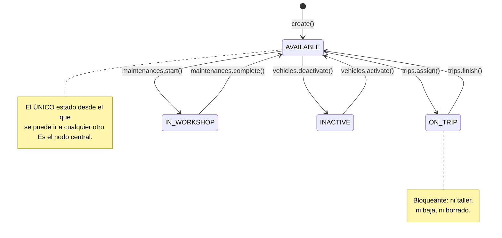
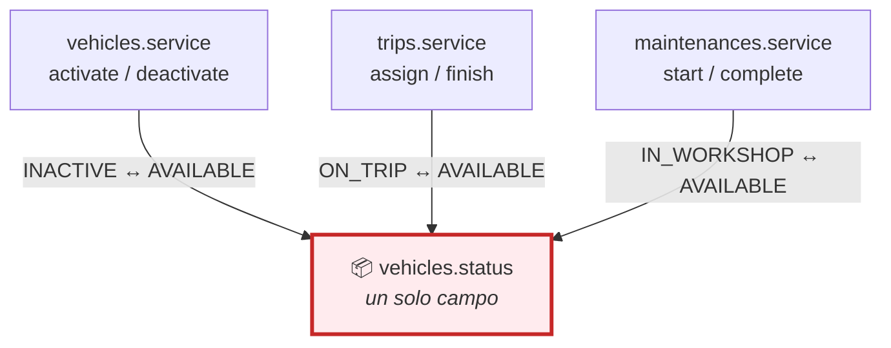
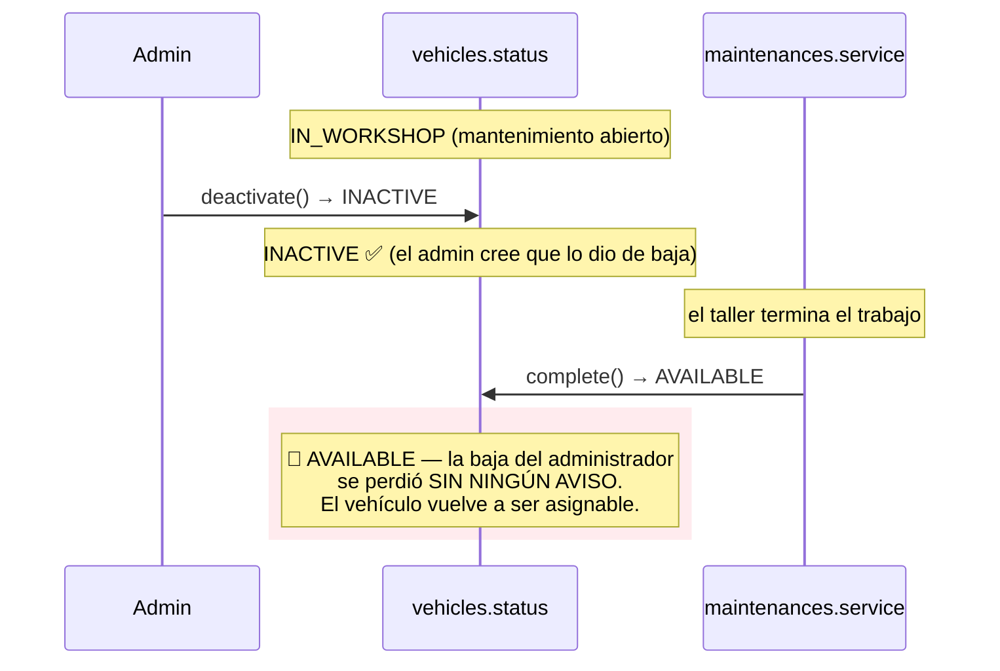
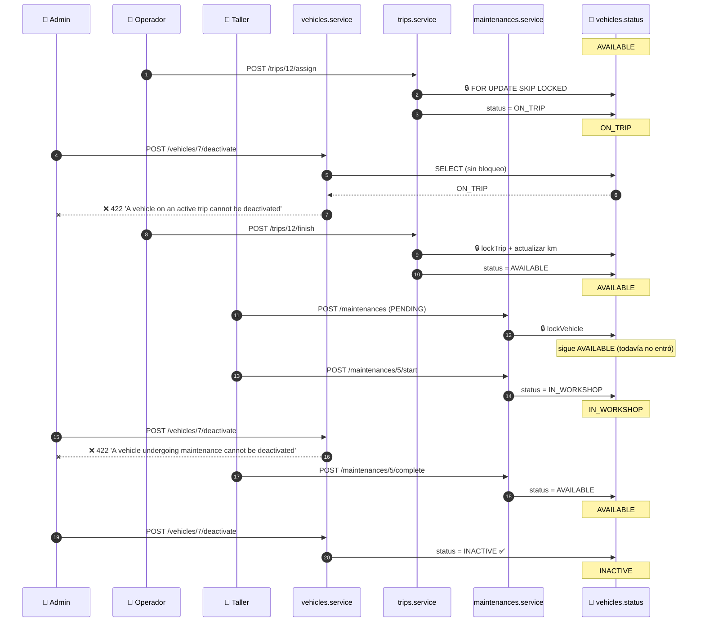
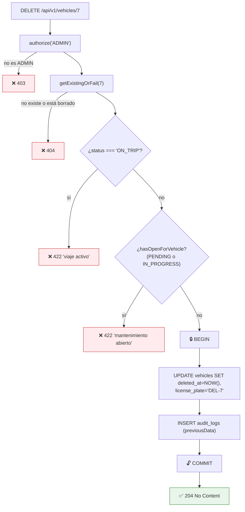

# Capítulo 10 — El módulo de vehículos

> **Prerrequisitos:** [Capítulo 3, §3.3.2](03-base-de-datos.md) (máquina de estados del vehículo) y [Capítulo 9](09-modulo-users.md) (el patrón CRUD de referencia).
> **Archivos que se explican aquí:** `modules/vehicles/vehicles.routes.ts` (59 líneas), `vehicles.schemas.ts` (40), `vehicles.controller.ts` (72), `vehicles.repository.ts` (90), `vehicles.service.ts` (239). Total: 500 líneas, todas.
> **Al terminar** el lector entenderá la primera **máquina de estados** del sistema, por qué ciertos campos se vuelven inmutables al acumular historia, y habrá visto una **condición de carrera entre módulos** que el proyecto previene en un sentido y no en el otro.

---

## 10.1. Introducción

Los vehículos son el primer recurso **físico** del sistema. Eso cambia la naturaleza de las reglas: un usuario puede tener cualquier nombre, pero un vehículo **no puede estar en dos lugares a la vez**. Está en la calle, en el taller, disponible o dado de baja — y nunca dos cosas simultáneamente.

De ahí surgen los tres temas del capítulo:

1. **La máquina de estados.** Cuatro estados, seis transiciones válidas, y unas cuantas prohibidas. La base de datos solo garantiza que el valor pertenezca al enum; **todo lo demás lo garantiza este servicio**.

2. **La inmutabilidad por historia.** `initialKm` es editable hasta que el vehículo tiene su primer viaje o mantenimiento; después, cambiarlo corrompería todas las cifras derivadas.

3. **Los campos derivados.** `insuranceValid` no existe en la base: se calcula al construir la respuesta.

Y aparece un problema que los capítulos anteriores anticipaban pero no habían mostrado: **este módulo comparte estado con `trips` y `maintenances`**, y los tres pueden escribir `vehicles.status`. Coordinarlos requiere bloqueos — que los otros dos módulos usan y **este no**.

---

## 10.2. Conceptos previos

### 10.2.1. Qué es una máquina de estados y por qué importa

Una **máquina de estados finitos** es un modelo con tres partes:

- Un conjunto **finito** de estados.
- Un **estado actual**.
- Un conjunto de **transiciones** válidas entre estados.

Lo esencial no son los estados: son las transiciones **que no existen**.

**Sin máquina de estados** (con un `PATCH { status }` genérico), cualquier valor puede seguir a cualquier otro: 4 estados = **16 transiciones posibles**. **Con máquina de estados**, solo 6 son válidas. Las otras 10 son errores que el sistema debe rechazar.



🔴 **`AVAILABLE` es el único hub.** Todas las transiciones pasan por él: no se puede ir de `ON_TRIP` a `IN_WORKSHOP` directamente, ni de `INACTIVE` a `ON_TRIP`. Eso simplifica enormemente el razonamiento: para saber si una transición es posible, basta preguntar *"¿está disponible?"*.

💡 **Y tiene una consecuencia de diseño elegante:** las reglas se pueden expresar como prohibiciones sobre el estado actual (*"no si está en viaje"*, *"no si está en el taller"*) en lugar de como una tabla de 16 celdas.

### 10.2.2. Estado compartido entre módulos

**Este es el concepto clave del capítulo, y el que genera el problema más serio.**

`vehicles.status` lo escriben **tres módulos distintos**:

| Módulo | Transición que provoca | Dónde |
|:--|:--|:--|
| `vehicles` | `AVAILABLE ↔ INACTIVE` | `vehicles.service.ts:178,187` |
| `trips` | `AVAILABLE → ON_TRIP → AVAILABLE` | Al asignar y al finalizar |
| `maintenances` | `AVAILABLE → IN_WORKSHOP → AVAILABLE` | Al iniciar y al completar |



🔴 **Tres escritores sobre un mismo campo, sin coordinación centralizada, es la definición de una carrera esperando ocurrir.** La disciplina necesaria es que **los tres** lean y escriban dentro de una transacción con la fila bloqueada.

**Adelanto del hallazgo de §10.6.4:** `trips` y `maintenances` **sí** bloquean la fila del vehículo (`trips.repository.ts:91-103` con `FOR UPDATE SKIP LOCKED`, `maintenances.repository.ts:80-82` con `FOR UPDATE`). **`vehicles` no.** La protección es de dos tercios.

### 10.2.3. Campos derivados: calcular vs. almacenar

Un **campo derivado** es un valor que se puede obtener de otros. Hay tres formas de tratarlo:

| Estrategia | Ejemplo en el proyecto | Ventaja | Costo |
|:--|:--|:--|:--|
| **Calcular al leer** | `insuranceValid` (`vehicles.service.ts:37`) | Siempre correcto | Cómputo por lectura |
| **Almacenar y mantener** | `drivers.completedTrips` (§3.4.3) | Lectura instantánea | Puede desincronizarse |
| **Almacenar y no mantener** | *(ninguno, afortunadamente)* | — | Miente sin avisar |

💡 **`insuranceValid` usa la primera y es la elección correcta.** Su valor depende de **qué día es hoy**: un vehículo con seguro válido ayer puede no tenerlo hoy sin que nada haya cambiado en la base. **Un campo almacenado sería incorrecto cada medianoche**, y mantenerlo requeriría una tarea programada que recorriera toda la flota diariamente — infraestructura que el proyecto no tiene (§4.7.5).

🔴 **La regla general que esto ilustra: si el valor depende del tiempo, NO se almacena.** Almacenar `insuranceValid` sería el mismo error que almacenar "¿el usuario es mayor de edad?" en vez de su fecha de nacimiento.

---

## 10.3. `vehicles.routes.ts` línea por línea

```ts
13 /**
14  * Reads: ADMIN + OPERATOR (fleet listing by status is an operator view).
15  * Mutations: ADMIN. INACTIVE transitions: ADMIN only — RN-16/A-8 says no
16  * other role has that permission, and it is enforced here at the route.
17  */
18 export const vehiclesRoutes = Router();
19
20 vehiclesRoutes.use(authenticate);
21
22 vehiclesRoutes.get('/', authorize('ADMIN', 'OPERATOR'), validate(listVehiclesQuerySchema, 'query'), vehiclesController.list);
28 vehiclesRoutes.get('/:id', authorize('ADMIN', 'OPERATOR'), validate(idParamSchema, 'params'), vehiclesController.getById);
34 vehiclesRoutes.post('/', authorize('ADMIN'), validate(createVehicleSchema), vehiclesController.create);
35 vehiclesRoutes.patch('/:id', authorize('ADMIN'), validate(idParamSchema, 'params'), validate(updateVehicleSchema), vehiclesController.update);
42 vehiclesRoutes.post('/:id/activate', authorize('ADMIN'), validate(idParamSchema, 'params'), vehiclesController.activate);
48 vehiclesRoutes.post('/:id/deactivate', authorize('ADMIN'), validate(idParamSchema, 'params'), vehiclesController.deactivate);
54 vehiclesRoutes.delete('/:id', authorize('ADMIN'), validate(idParamSchema, 'params'), vehiclesController.remove);
```

**Línea 20 — solo `authenticate` a nivel de router**

```ts
vehiclesRoutes.use(authenticate);
```

🔴 **Contraste deliberado con `users.routes.ts:16`**, que aplica `authenticate` **y** `authorize('ADMIN')` de golpe.

**La diferencia responde a una realidad distinta:** en `users`, **todos** los endpoints son de administrador. En `vehicles`, los permisos **varían por endpoint**: lectura para dos roles, escritura para uno.

⚠️ **Y eso tiene un costo de seguridad real:** cada ruta debe declarar su `authorize` a mano. **Agregar un endpoint y olvidarlo lo deja abierto a cualquier usuario autenticado** — incluido un chofer.

**La alternativa más segura** sería aplicar el permiso más restrictivo a nivel de router y relajarlo donde corresponda… pero Express no permite "quitar" un middleware ya aplicado. La forma correcta sería **dos routers**:

```ts
// — mejora propuesta —
const lectura = Router();
lectura.use(authenticate, authorize('ADMIN', 'OPERATOR'));
lectura.get('/', validate(listVehiclesQuerySchema, 'query'), vehiclesController.list);
lectura.get('/:id', validate(idParamSchema, 'params'), vehiclesController.getById);

const escritura = Router();
escritura.use(authenticate, authorize('ADMIN'));
escritura.post('/', validate(createVehicleSchema), vehiclesController.create);
// …

vehiclesRoutes.use(lectura);
vehiclesRoutes.use(escritura);
```

Ahora un endpoint nuevo hereda el permiso de su grupo, y olvidarse es imposible.

**El comentario de las líneas 14-16 documenta la decisión más importante del archivo**

> *"INACTIVE transitions: ADMIN only — RN-16/A-8 says no other role has that permission, and **it is enforced here at the route**."*

💡 **"Se aplica aquí, en la ruta" es una afirmación arquitectónica.** La regla RN-16 no se comprueba dentro del servicio: se cumple **por construcción** en la declaración de la ruta.

**Ventaja:** leyendo `vehicles.routes.ts` se conoce el modelo de permisos completo del módulo, sin abrir el servicio.

🔴 **Desventaja — y es real:** si algún otro módulo llamara a `vehiclesService.deactivate()` directamente (por ejemplo, un futuro proceso automático), **saltaría la comprobación de rol**, porque esta vive en la capa HTTP, no en la lógica de negocio. La regla no está en el dominio: está en el borde.

⚠️ **Hoy no hay ningún llamador interno**, pero `vehicles.service.ts:190` expone `transition()` como método público del objeto — y ese método **no comprueba nada** (§10.6.5).

**Por qué `activate`/`deactivate` son POST y `remove` es DELETE**

| Operación | Verbo | Razón |
|:--|:--|:--|
| Activar/desactivar | `POST /:id/activate` | Transición de estado: acción explícita (§9.3). |
| Borrar | `DELETE /:id` | Es la semántica estándar de HTTP para eliminar. |

⚠️ **Con una ironía: `DELETE` no borra.** Hace una baja lógica (§10.6.6). Es una divergencia entre la semántica del verbo HTTP y lo que realmente ocurre — universalmente aceptada, pero que conviene tener presente al leer el código.

---

## 10.4. `vehicles.schemas.ts` línea por línea

```ts
1  import { z } from 'zod';
2  import { paginationSchema } from '../../shared/schemas';
3
4  const currentYear = new Date().getFullYear();
5
6  const licensePlateSchema = z
7    .string()
8    .min(6)
9    .max(10)
10   .regex(/^[A-Z0-9 ]+$/i, 'License plate must contain only letters, numbers and spaces')
11   .transform((v) => v.toUpperCase().trim());
```

**Línea 4 — `currentYear` calculado al CARGAR EL MÓDULO**

```ts
const currentYear = new Date().getFullYear();
```

🔴 **Este es un bug latente, sutil y real.**

El valor se evalúa **una sola vez**, cuando Node importa el módulo — es decir, **al arrancar el servidor**. Y se usa en la línea 16 como límite superior:

```ts
year: z.coerce.number().int().min(1950).max(currentYear + 1),
```

**El escenario de fallo:**

| Momento | `currentYear` | Máximo aceptado | Situación |
|:--|--:|--:|:--|
| El servidor arranca el 3/8/2026 | 2026 | 2027 | ✅ Correcto |
| 1 de enero de 2027, sin reiniciar | **2026** | **2027** | ⚠️ Ya no acepta modelos 2028 |
| 1 de enero de 2028, sin reiniciar | **2026** | **2027** | 🔴 **Rechaza vehículos de 2028** |

**Un servidor que corre sin reiniciarse durante 18 meses empieza a rechazar vehículos nuevos con el mensaje `Number must be less than or equal to 2027`** — y nadie entiende por qué, porque el código "dice" que acepta el año siguiente.

💡 **Es la clase de bug que solo aparece en producción, meses después del despliegue, y que es imposible de reproducir en desarrollo** (donde el servidor se reinicia cada vez que se guarda un archivo).

**La corrección es mover el cálculo dentro del validador**, para que se evalúe en cada petición:

```ts
// — corrección propuesta —
year: z.coerce.number().int().min(1950)
  .refine((y) => y <= new Date().getFullYear() + 1, {
    message: 'El año no puede superar el próximo año',
  }),
```

⚠️ **`.max()` no acepta funciones**, por eso hace falta `.refine()`.

**Líneas 6-11 — el esquema de patente reutilizable**

```ts
const licensePlateSchema = z
  .string().min(6).max(10)
  .regex(/^[A-Z0-9 ]+$/i, 'License plate must contain only letters, numbers and spaces')
  .transform((v) => v.toUpperCase().trim());
```

**Cinco operaciones encadenadas:**

| Método | Qué hace | Ejemplo rechazado |
|:--|:--|:--|
| `.min(6)` | Al menos 6 caracteres | `AA11` |
| `.max(10)` | Como máximo 10 | `AAA111BBB222` |
| `.regex(...)` con `/i` | Solo letras, números y espacios | `AA-111` (guion) |
| `.transform(toUpperCase)` | Normaliza a mayúsculas | — |
| `.trim()` | Quita espacios de los extremos | — |

🔴 **El orden importa: `.regex` corre ANTES de `.transform`.** Por eso la expresión regular necesita el modificador `/i` (insensible a mayúsculas): en ese momento el valor todavía puede venir en minúsculas. Sin `/i`, `aaa111` sería rechazado antes de tener oportunidad de normalizarse.

💡 **La normalización en el esquema —y no en el servicio— es la decisión correcta.** Significa que **toda** patente que llega al servicio ya está en mayúsculas y sin espacios sobrantes, sin que ningún servicio tenga que acordarse. Y `plateTaken('aaa111')` compara contra `'AAA111'`… bueno, **casi**:

⚠️ **Detalle sutil que se cruza con §4.6.3.** La comparación de unicidad la resuelve MySQL con colación `utf8mb4_unicode_ci`, que **no distingue mayúsculas**. Así que aunque la normalización fallara, la base seguiría detectando el duplicado. **Dos capas para la misma garantía** — pero solo una es explícita.

🔴 **Y la validación es más laxa de lo que parece.** `/^[A-Z0-9 ]+$/i` acepta **espacios en cualquier posición**: `A A A 1 1 1` es una patente válida de 11 caracteres… no, de 11 supera el `.max(10)`. Pero `A A 111` (7 caracteres) pasa. Y el `.trim()` solo quita los extremos, no los internos.

**Las patentes argentinas tienen dos formatos conocidos:**

| Formato | Ejemplo | Vigencia |
|:--|:--|:--|
| Antiguo | `AAA111` | Hasta 2016 |
| Mercosur | `AA111AA` | Desde 2016 |

Una validación específica (`/^([A-Z]{3}\d{3}|[A-Z]{2}\d{3}[A-Z]{2})$/`) rechazaría datos basura. **La laxitud es defendible** (hay vehículos importados, patentes provisorias, remolques con formatos distintos), pero es una decisión implícita: nadie la documentó.

**Línea 18 — el comentario que explica `initialKm`**

```ts
/** A-13: initial km is entered manually when the vehicle is registered. */
initialKm: z.coerce.number().int().min(0),
```

**Es obligatorio en la creación.** No hay valor por defecto: dar de alta un vehículo exige declarar su kilometraje.

💡 **Y no hay `accumulatedKm` en el esquema.** Es deliberado y muy importante: **el kilometraje acumulado NO es editable por la API**. Solo cambia como efecto de finalizar un viaje (`trips.service`). Si estuviera en el esquema, un administrador podría falsear el odómetro con un `PATCH`, y todos los cálculos de mantenimiento por kilometraje perderían sentido.

**Línea 30 — el triple estado de `insuranceExpiryDate`**

```ts
insuranceExpiryDate: z.coerce.date().nullable().optional(),
```

Ya analizado en §2.3.2: distingue **ausente** (no cambiar), **`null`** (borrar el vencimiento) y **una fecha** (establecerla). Tres semánticas en un campo.

⚠️ **`z.coerce.date()` acepta cualquier cosa que `new Date()` pueda parsear**, incluido `"2026"` (que se interpreta como 1 de enero de 2026) o `1754234567890` (una marca de tiempo). Es tolerante, quizá demasiado: `"mañana"` produce `Invalid Date`, que Zod sí rechaza, pero `"2026-13-45"` produce una fecha desplazada silenciosamente en algunos motores.

**Línea 32 — la guarda contra el `PATCH` vacío**

```ts
.refine((data) => Object.keys(data).length > 0, { message: 'At least one field is required' })
```

Sin ella, `PATCH /vehicles/7` con cuerpo `{}` pasaría la validación (todos los campos son opcionales), llegaría al servicio, ejecutaría una transacción, escribiría un registro de auditoría **sin ningún cambio**, y devolvería 200.

💡 **Es una regla de negocio sutil expresada declarativamente**, y su beneficio principal es **no ensuciar la auditoría** con entradas vacías — el mismo razonamiento que la guarda de idempotencia de `setActive` (§9.6.5).

---

## 10.5. `vehicles.repository.ts` — lo específico del módulo

La estructura general (el `buildWhere` con `deletedAt: null`, el `db: DbClient = prisma`, la lápida en `softDelete`) ya se explicó en §2.3.2 y §9.5. Aquí solo lo que este repositorio agrega.

### 10.5.1. `hasHistory` (líneas 62-69)

```ts
/** A vehicle with trips or maintenances has history — some edits are blocked. */
async hasHistory(id: number): Promise<boolean> {
  const [trip, maintenance] = await Promise.all([
    prisma.trip.findFirst({ where: { vehicleId: id }, select: { id: true } }),
    prisma.maintenance.findFirst({ where: { vehicleId: id }, select: { id: true } }),
  ]);
  return trip !== null || maintenance !== null;
},
```

**`Promise.all` para dos consultas independientes** — el mismo patrón de paralelización de §9.6.2. Aquí el ahorro es del 50%: dos consultas de ~4 ms en paralelo tardan 4 ms, no 8.

**`findFirst` + `select: { id: true }`** — solo se necesita saber **si existe**, no qué es. Se pide una columna, y MySQL puede resolverlo desde el índice `idx_trips_vehicle_status` sin tocar la tabla.

⚠️ **`count() > 0` habría sido peor:** obliga a MySQL a contar **todas** las filas coincidentes. `findFirst` se detiene en la primera. Con un vehículo de 5.000 viajes, la diferencia es de tres órdenes de magnitud.

🔴 **Dos observaciones críticas, las mismas que en §9.5.3:**

1. **Consulta `prisma.trip` y `prisma.maintenance` desde el repositorio de vehículos.** Cruza fronteras entre módulos sin pasar por sus repositorios. Si `trips` incorporara borrado lógico, esta consulta contaría viajes borrados como historia.

2. **No acepta `db: DbClient`.** Se ejecuta necesariamente fuera de la transacción, lo que abre la ventana de carrera de §10.6.3.

**Y una tercera, específica de aquí:**

⚠️ **`hasHistory` no filtra por estado.** Un viaje en estado `PENDING_ASSIGNMENT` no tiene `vehicleId` (es `NULL`, §3.4.9), así que no cuenta. Pero un viaje **cancelado**… no existe ese estado. En la práctica cualquier fila de `trips` con `vehicleId` implica un viaje asignado o completado, que sí es historia real. **La consulta es correcta**, aunque por una propiedad del modelo que no está documentada aquí.

### 10.5.2. `plateTaken` y la exclusión (líneas 49-60)

```ts
/** True if another non-deleted vehicle already owns this plate. */
async plateTaken(licensePlate: string, excludeId?: number): Promise<boolean> {
  const existing = await prisma.vehicle.findFirst({
    where: {
      licensePlate,
      deletedAt: null,
      ...(excludeId ? { id: { not: excludeId } } : {}),
    },
    select: { id: true },
  });
  return existing !== null;
},
```

Idéntico en forma a `usersRepository.emailTaken` (§9.6.4).

🔴 **`deletedAt: null` en esta consulta es lo que hace necesaria la lápida de la patente.** La consulta ignora los vehículos borrados, así que **cree** que la patente está libre — pero la restricción `UNIQUE(license_plate)` de MySQL **no** ignora los borrados. Sin la lápida `DEL-{id}`, la consulta diría "libre" y el `INSERT` fallaría con `P2002`.

💡 **Es un buen ejemplo de dos capas que discrepan y de cómo se reconcilian:** la aplicación tiene una noción de "existe" (no borrado) y la base tiene otra (la fila está ahí). La lápida alinea ambas.

---

## 10.6. `vehicles.service.ts` línea por línea

### 10.6.1. `toResponse` y el campo derivado (líneas 27-43)

```ts
function toResponse(vehicle: Vehicle): VehicleResponse {
  return {
    id: vehicle.id,
    licensePlate: vehicle.licensePlate,
    // …
    insuranceValid:
      vehicle.insuranceExpiryDate !== null && vehicle.insuranceExpiryDate >= utcStartOfToday(),
    status: vehicle.status,
    createdAt: vehicle.createdAt,
    updatedAt: vehicle.updatedAt,
  };
}
```

**Once campos: diez de la entidad, uno calculado.**

**Líneas 37-38 — `insuranceValid`, desarmado**

```ts
vehicle.insuranceExpiryDate !== null && vehicle.insuranceExpiryDate >= utcStartOfToday()
```

**Dos condiciones:**

1. **Hay fecha cargada.** Sin ella, no se puede afirmar validez.
2. **La fecha es hoy o posterior.**

🔴 **El `>=` es la regla RN-1 aplicada a seguros:** un seguro que vence **hoy** sigue siendo válido **hoy**. Con `>` estricto, un vehículo con seguro venciendo hoy figuraría sin cobertura desde la primera hora del día.

💡 **Y `utcStartOfToday()` es lo que hace que la comparación funcione**, por todo lo explicado en §6.6: la columna es `DATE`, Prisma la devuelve como medianoche UTC, y la referencia debe construirse igual. Con `new Date()` la comparación fallaría desde el momento en que empieza el día.

**El comentario de la línea 20 documenta una decisión discutible:**

> *"Insurance valid today (or no expiry recorded yet → false, surfaced as alertable)."*

⚠️ **`insuranceExpiryDate === null` produce `insuranceValid: false`.** Es decir, **un vehículo sin fecha de seguro cargada se muestra igual que uno con seguro vencido.**

**Los dos lados del argumento:**

| A favor | En contra |
|:--|:--|
| "Sin dato" es operativamente equivalente a "sin cobertura demostrable". | Son situaciones distintas: falta de dato ≠ falta de seguro. |
| Fuerza a cargar el dato (aparece como alertable). | Un vehículo recién dado de alta figura "sin seguro" aunque lo tenga. |

💡 **Un tercer estado sería más honesto:** `insuranceStatus: 'VALID' | 'EXPIRED' | 'UNKNOWN'`. El frontend podría distinguir "⚠️ vencido" de "❓ sin datos", que requieren acciones distintas (renovar vs. cargar el dato). Como está, ambos aparecen igual y el operador no sabe cuál es cuál sin abrir el detalle.

⚠️ **Y hay una inconsistencia con `lastMaintenanceDate`**, que **sí** se expone crudo como `Date | null` sin campo derivado equivalente. El módulo calcula la validez del seguro pero no la del mantenimiento — esa la calcula el motor de alertas, con otra lógica (§4.7.5). **Dos criterios de "vigencia" en dos lugares distintos.**

### 10.6.2. `create` (líneas 80-111)

```ts
async create(dto: CreateVehicleDto, actorId: number): Promise<VehicleResponse> {
  if (await vehiclesRepository.plateTaken(dto.licensePlate)) {
    throw new ConflictError(`License plate ${dto.licensePlate} is already registered`);
  }

  const created = await prisma.$transaction(async (tx) => {
    const vehicle = await vehiclesRepository.create({
      licensePlate: dto.licensePlate,
      model: dto.model,
      year: dto.year,
      initialKm: dto.initialKm,
      // The odometer starts at the manually entered value (A-13).
      accumulatedKm: dto.initialKm,
      insuranceExpiryDate: dto.insuranceExpiryDate,
    }, tx);
    await auditLogsService.record({ actorId, action: 'CREATE', entity: 'VEHICLE', entityId: vehicle.id, newData: toAuditSnapshot(vehicle) }, tx);
    return vehicle;
  });
  return toResponse(created);
}
```

**La estructura es la del capítulo 9**, con dos particularidades.

**Línea 93 — `accumulatedKm: dto.initialKm`**

🔴 **El odómetro arranca en el kilometraje inicial, no en cero.** Es la única forma de que la resta `accumulatedKm - initialKm` responda *"¿cuánto recorrió bajo nuestra gestión?"* (§3.4.5).

**Y es la razón por la que `accumulatedKm` no está en el esquema de entrada:** el cliente **no lo provee**, el servicio **lo deriva**. Un campo que el sistema controla enteramente.

💡 **Aquí se ve la diferencia entre un DTO de entrada y una entidad.** `CreateVehicleDto` tiene 5 campos; la fila de `vehicles` tiene 12. Los 7 restantes los completa el sistema: `id` (autoincremental), `accumulatedKm` (derivado), `status` (valor por defecto `AVAILABLE`), `lastMaintenanceDate` (`null`), `deletedAt` (`null`), `createdAt` y `updatedAt` (automáticos).

**Lo que NO está: `status` explícito**

No se pasa `status`, así que MySQL aplica su `DEFAULT 'AVAILABLE'` (`schema.prisma:148`).

⚠️ **Es correcto pero implícito.** Alguien leyendo solo el servicio no sabe en qué estado nace un vehículo: hay que abrir `schema.prisma`. Pasarlo explícitamente (`status: 'AVAILABLE'`) documentaría la transición inicial de la máquina de estados en el mismo lugar donde viven las demás.

**Lo que falta: la carrera de la patente**

Idéntica a la del email (§9.6.3): `plateTaken` corre fuera de la transacción, dos altas simultáneas con la misma patente pasan la comprobación, y la segunda choca con `uq_vehicles_plate` → `P2002` → 409 genérico. **El sistema queda correcto; el mensaje es peor.**

### 10.6.3. `update` y la inmutabilidad por historia (líneas 113-161)

```ts
113 async update(id: number, dto: UpdateVehicleDto, actorId: number): Promise<VehicleResponse> {
114   const existing = await getExistingOrFail(id);
115
116   if (dto.licensePlate && dto.licensePlate !== existing.licensePlate) {
117     if (await vehiclesRepository.plateTaken(dto.licensePlate, id)) {
118       throw new ConflictError(`License plate ${dto.licensePlate} is already registered`);
119     }
120   }
121   // initialKm anchors the whole km history (RN-5 snapshots, RN-11 updates):
122   // once the vehicle has trips or maintenances, changing it would corrupt
123   // every derived figure. Editable only while there is no history.
124   let accumulatedKm: number | undefined;
125   if (dto.initialKm !== undefined && dto.initialKm !== existing.initialKm) {
126     if (await vehiclesRepository.hasHistory(id)) {
127       throw new BusinessRuleError(
128         'Initial km cannot be changed once the vehicle has trips or maintenances',
129       );
130     }
131     accumulatedKm = dto.initialKm; // no history → odometer follows the correction
132   }
133   // … transacción
134 }
```

**Este bloque es lo más interesante del módulo.**

#### Qué significa "anclar la historia"

El comentario de las líneas 121-123 dice que `initialKm` **ancla** todo el historial de kilometraje. Vale la pena desarrollar por qué.

**Las cifras que dependen de `initialKm`:**

| Cifra derivada | Fórmula | Dónde se usa |
|:--|:--|:--|
| Km recorridos bajo gestión | `accumulatedKm − initialKm` | Reportes de utilización de flota |
| Km desde el último mantenimiento | `accumulatedKm − maintenance.km` | Motor de alertas (§4.7.5) |
| Distancia real de un viaje | `arrivalKm − departureKm` | Estadísticas del chofer |

🔴 **Si `initialKm` cambiara con historia existente, la primera cifra se corrompería retroactivamente.** Un vehículo con `initialKm = 0` y `accumulatedKm = 45.000` figura con 45.000 km recorridos. Cambiando `initialKm` a 40.000, **los mismos datos** pasan a decir 5.000 km. **Ningún registro histórico cambió, pero todos los reportes ahora mienten** — y no hay forma de detectarlo mirando la base.

💡 **Es lo que se llama un dato *inmutable por acumulación*: mutable hasta que algo depende de él, inmutable después.** Es un patrón menos conocido que la inmutabilidad total, y más útil: permite corregir un error de carga en los primeros minutos y protege la integridad para siempre después.

#### Las tres condiciones de la línea 125

```ts
if (dto.initialKm !== undefined && dto.initialKm !== existing.initialKm) {
```

🔴 **`!== undefined`, no `if (dto.initialKm)`.** La diferencia es crítica: `initialKm` puede ser legítimamente **`0`** (un vehículo cero kilómetro), y `0` es *falsy*. Con `if (dto.initialKm)`, corregir el kilometraje a 0 sería **silenciosamente ignorado**.

💡 **Es exactamente el mismo pozo que `??` vs `||`** (§1.2.6), aplicado a una comparación en vez de a un operador. El código lo evita correctamente.

**`!== existing.initialKm`** — si el valor no cambió, no hay nada que validar. Ahorra la consulta de `hasHistory`, que son dos consultas a la base.

**Línea 131 — el efecto colateral controlado**

```ts
accumulatedKm = dto.initialKm; // no history → odometer follows the correction
```

**Si no hay historia, el odómetro se recalibra junto con el kilometraje inicial.**

**Por qué es correcto:** sin historia, `accumulatedKm === initialKm` (lo estableció `create`, línea 93). Corregir uno y no el otro dejaría el vehículo con "km recorridos" negativos o inventados:

| Situación | `initialKm` | `accumulatedKm` | Km recorridos |
|:--|--:|--:|--:|
| Alta con error | 0 | 0 | 0 |
| Corrección **sin** ajustar el odómetro | 40.000 | 0 | **−40.000** 🔴 |
| Corrección **con** ajuste (elegido) | 40.000 | 40.000 | 0 ✅ |

**La variable `accumulatedKm` declarada con `let` en la línea 124** y usada en la línea 142 dentro del objeto de actualización. Si queda `undefined`, Prisma la ignora (§9.5.1) y el campo no se toca.

💡 **Es un uso legítimo de `let`** en un proyecto que prefiere `const`: la variable se asigna condicionalmente. La alternativa sería un ternario largo o una función auxiliar; `let` con un ámbito de ocho líneas es más legible.

#### 🔴 La carrera de `hasHistory`

```ts
if (await vehiclesRepository.hasHistory(id)) { throw … }   // ← fuera de la transacción
// … 
const updated = await prisma.$transaction(async (tx) => { … });  // ← la escritura
```

**Entre la comprobación y la escritura hay una ventana.**

```mermaid
sequenceDiagram
    participant A as Admin (PATCH initialKm)
    participant DB as MySQL
    participant O as Operador (asigna viaje)

    A->>DB: hasHistory(7)? → sin viajes ni mantenimientos
    DB-->>A: false ✅
    O->>DB: BEGIN; INSERT trip (vehicle_id=7); UPDATE vehicles SET status='ON_TRIP'; COMMIT
    Note over DB: 🔴 Ahora SÍ hay historia
    A->>DB: BEGIN; UPDATE vehicles SET initial_km=40000, accumulated_km=40000; COMMIT
    rect rgb(255, 235, 238)
    Note over DB: El vehículo tiene un viaje en curso con departure_km=0<br/>y ahora accumulated_km=40000.<br/>Al finalizar, arrival_km − departure_km dará una cifra absurda.
    end
```

**La probabilidad es bajísima** (requiere que ambas cosas ocurran en la misma fracción de segundo, sobre el mismo vehículo, y que el vehículo no tuviera historia previa). Pero **la corrección es trivial**: mover `hasHistory` dentro de la transacción con el `db` propagado, y bloquear la fila del vehículo — exactamente lo que hacen `trips` y `maintenances`.

### 10.6.4. `deactivate` y `activate` (líneas 163-188)

```ts
163 /**
164  * RN-16 / A-8: only an ADMIN moves a vehicle to INACTIVE, manually
165  * (enforced by route authorization + this explicit transition).
166  */
167 async deactivate(id: number, actorId: number): Promise<VehicleResponse> {
168   const existing = await getExistingOrFail(id);
169   if (existing.status === 'INACTIVE') return toResponse(existing); // idempotent
170   if (existing.status === 'ON_TRIP') {
171     throw new BusinessRuleError('A vehicle on an active trip cannot be deactivated');
172   }
173   // A vehicle in the workshop has an open maintenance whose completion would
174   // move it back to AVAILABLE, silently overwriting an INACTIVE set here.
175   if (existing.status === 'IN_WORKSHOP') {
176     throw new BusinessRuleError('A vehicle undergoing maintenance cannot be deactivated');
177   }
178   return toResponse(await this.transition(existing, 'INACTIVE', 'DEACTIVATE', actorId));
179 }
```

**Línea 169 — idempotencia**

El mismo patrón de `setActive` (§9.6.5): desactivar algo ya desactivado devuelve 200 sin generar auditoría espuria.

**Línea 170 — la prohibición obvia**

Un vehículo en la calle con carga no se da de baja. Es la regla que cualquiera esperaría.

**Líneas 173-177 — la prohibición NO obvia, y su comentario es excelente**

> *"A vehicle in the workshop has an open maintenance whose completion would move it back to AVAILABLE, **silently overwriting an INACTIVE set here**."*

🔴 **El razonamiento es de segundo orden y merece desarrollarse**, porque es el tipo de análisis que distingue el código pensado del código escrito.

**Qué pasaría sin esta regla:**



💡 **El problema de fondo: `maintenances.complete()` no sabe que hubo una baja intermedia.** Escribe `AVAILABLE` incondicionalmente porque asume que viene de `IN_WORKSHOP`. **Prohibir la transición en el origen es más simple que enseñarle al otro módulo a reconocer el caso.**

⚠️ **La alternativa —que `complete()` comprobara el estado actual antes de escribir— sería más flexible pero más frágil:** habría que replicar ese cuidado en cada módulo que devuelva un vehículo a `AVAILABLE`. La solución elegida centraliza la protección en un solo lugar.

**Línea 178 — `this.transition(...)`**

🔴 **El uso de `this` dentro de un método de objeto literal es frágil, y conviene señalarlo.**

`vehiclesService` es un **objeto literal**, no una clase. `this` dentro de sus métodos se resuelve **en el momento de la llamada**, según cómo se invoque (§1.2.6):

| Forma de llamada | ¿`this` está definido? |
|:--|:--|
| `vehiclesService.deactivate(7, 1)` | ✅ Sí — es `vehiclesService` |
| `const { deactivate } = vehiclesService; deactivate(7, 1)` | 🔴 **No** — `TypeError: Cannot read properties of undefined (reading 'transition')` |
| `[7,8].map(vehiclesService.deactivate)` | 🔴 **No** |

**Hoy funciona** porque el controlador siempre escribe `vehiclesService.deactivate(...)` (`vehicles.controller.ts:57`). Pero es una dependencia implícita de **cómo** se llama, no de **qué** se llama.

💡 **La corrección es una palabra:** reemplazar `this.transition` por `vehiclesService.transition` — o, mejor, extraer `transition` como función privada del módulo, que es lo que realmente es (§10.6.5).

**`activate` (líneas 181-188) — la regla inversa**

```ts
async activate(id: number, actorId: number): Promise<VehicleResponse> {
  const existing = await getExistingOrFail(id);
  if (existing.status !== 'INACTIVE') {
    throw new BusinessRuleError(`Only INACTIVE vehicles can be activated (current: ${existing.status})`);
  }
  return toResponse(await this.transition(existing, 'AVAILABLE', 'ACTIVATE', actorId));
}
```

**Asimetría deliberada con `deactivate`:**

| | `deactivate` | `activate` |
|:--|:--|:--|
| Estilo de la regla | **Lista negra**: prohíbe `ON_TRIP` e `IN_WORKSHOP` | **Lista blanca**: solo permite `INACTIVE` |
| Idempotente | ✅ Sí (línea 169) | ❌ **No** — activar algo ya activo lanza 422 |

🔴 **La lista blanca de `activate` es más segura**, por la misma razón que las listas blancas siempre lo son (§8.6.1): si mañana se agregara un estado `RESERVED`, `deactivate` lo permitiría por omisión, mientras que `activate` lo rechazaría por omisión.

⚠️ **Pero la falta de idempotencia es una inconsistencia.** `activate` sobre un vehículo ya `AVAILABLE` devuelve **422**, mientras que `deactivate` sobre uno ya `INACTIVE` devuelve **200**. Dos endpoints hermanos con comportamientos opuestos ante la misma situación.

**El mensaje de `activate` incluye el estado actual** (`current: ${existing.status}`), lo que es una buena práctica de diagnóstico — y contrasta con los mensajes de `deactivate`, que no lo incluyen.

#### 🔴 La carrera entre módulos: el hallazgo principal del capítulo

**Todas las comprobaciones de estado de `deactivate` y `softDelete` ocurren FUERA de la transacción y sin bloquear la fila.**

**Comparación con los otros dos escritores del mismo campo:**

| Módulo | ¿Bloquea `vehicles`? | Cómo |
|:--|:--:|:--|
| `trips` | ✅ **Sí** | `FOR UPDATE SKIP LOCKED` en `pickAvailableVehicle` (`trips.repository.ts:96-101`) |
| `maintenances` | ✅ **Sí** | `FOR UPDATE` en `lockVehicle` (`maintenances.repository.ts:80-82`) |
| **`vehicles`** | ❌ **No** | Lee `getExistingOrFail` fuera de toda transacción |

**El escenario concreto:**

```mermaid
sequenceDiagram
    participant A as Admin (POST /vehicles/7/deactivate)
    participant DB as MySQL
    participant O as Operador (POST /trips/12/assign)

    A->>DB: SELECT * FROM vehicles WHERE id=7 (sin bloqueo)
    DB-->>A: status = 'AVAILABLE'
    Note over A: ✅ pasa las tres validaciones

    O->>DB: BEGIN
    O->>DB: SELECT id FROM vehicles WHERE status='AVAILABLE' … FOR UPDATE SKIP LOCKED
    Note over DB: 🔒 fila 7 bloqueada — pero A NO está esperando ese bloqueo
    O->>DB: UPDATE trips SET vehicle_id=7, status='IN_PROGRESS'
    O->>DB: UPDATE vehicles SET status='ON_TRIP' WHERE id=7
    O->>DB: COMMIT 🔓

    A->>DB: BEGIN; UPDATE vehicles SET status='INACTIVE' WHERE id=7; COMMIT

    rect rgb(255, 235, 238)
    Note over DB: 🔴 vehicles.status = 'INACTIVE'<br/>trips.status = 'IN_PROGRESS' con vehicle_id = 7<br/>Un vehículo dado de baja está haciendo un viaje.
    end
```

**Las consecuencias, en cadena:**

1. El vehículo figura `INACTIVE` en la flota, así que el motor de alertas emite `VEHICLE_INACTIVE`.
2. Al finalizar el viaje, `trips.service` lo devolverá a `AVAILABLE`, **borrando la baja del administrador sin aviso** — el mismo problema que la regla de `IN_WORKSHOP` previene explícitamente.
3. Ninguna de las dos operaciones falló. Ambas devolvieron 200.

🔴 **La ironía es que el módulo ya identificó este patrón de fallo** (el comentario de las líneas 173-174 razona exactamente sobre "una baja sobrescrita silenciosamente") **y lo resolvió para `IN_WORKSHOP` pero no para `ON_TRIP` bajo concurrencia.** La regla de la línea 170 protege el caso secuencial y es inútil ante el concurrente.

**La corrección, siguiendo el patrón que el propio proyecto usa en otros módulos:**

```ts
// — corrección propuesta —
async deactivate(id: number, actorId: number): Promise<VehicleResponse> {
  return prisma.$transaction(async (tx) => {
    // 1. Bloquear la fila ANTES de leer el estado
    await maintenancesRepository.lockVehicle(id, tx);   // o un lockVehicle propio

    // 2. Releer DENTRO de la transacción, con el bloqueo tomado
    const existing = await vehiclesRepository.findById(id, tx);
    if (!existing) throw new NotFoundError(`Vehicle ${id} not found`);
    if (existing.status === 'INACTIVE') return toResponse(existing);
    if (existing.status === 'ON_TRIP') throw new BusinessRuleError('…');
    if (existing.status === 'IN_WORKSHOP') throw new BusinessRuleError('…');

    // 3. Escribir con la garantía de que nadie cambió el estado en el medio
    const vehicle = await vehiclesRepository.update(id, { status: 'INACTIVE' }, tx);
    await auditLogsService.record({ … }, tx);
    return toResponse(vehicle);
  });
}
```

💡 **Nótese que `vehiclesRepository.findById` YA acepta `db`** (`vehicles.repository.ts:32`). **La infraestructura para la corrección ya existe; solo hay que usarla.**

⚠️ **Y el módulo importa `maintenancesRepository`** (línea 7) para `hasOpenForVehicle`, así que `lockVehicle` estaría disponible sin agregar dependencias nuevas — aunque lo limpio sería un `lockVehicle` propio en `vehiclesRepository`.

### 10.6.5. `transition` (líneas 190-211)

```ts
async transition(
  existing: Vehicle,
  status: VehicleStatus,
  action: 'ACTIVATE' | 'DEACTIVATE',
  actorId: number,
): Promise<Vehicle> {
  return prisma.$transaction(async (tx) => {
    const vehicle = await vehiclesRepository.update(existing.id, { status }, tx);
    await auditLogsService.record({
      actorId, action, entity: 'VEHICLE', entityId: existing.id,
      previousData: { status: existing.status },
      newData: { status },
    }, tx);
    return vehicle;
  });
}
```

**Extrae lo común entre `activate` y `deactivate`:** la transacción, la escritura y la auditoría. Sin ella, esas 15 líneas estarían duplicadas.

**El snapshot mínimo** (`{ status }` en lugar de `toAuditSnapshot`) es correcto: solo cambió un campo, y registrar los siete ensuciaría el diff (§9.6.5).

🔴 **Pero `transition` es un método PÚBLICO del objeto de servicio, y no debería serlo.**

**Es una fuga de encapsulamiento con consecuencias reales.** Cualquier módulo puede escribir:

```ts
// — ejemplo ilustrativo de lo que el código permite hoy —
await vehiclesService.transition(vehiculo, 'ON_TRIP', 'ACTIVATE', 1);
```

**Y eso:**

1. **Saltea las tres validaciones de estado.** Pone `ON_TRIP` sin ningún viaje asociado.
2. **Saltea el `authorize('ADMIN')`**, porque el permiso vive en la ruta (§10.3), no en el servicio.
3. **Registra una auditoría mentirosa:** el tipo del parámetro solo admite `'ACTIVATE' | 'DEACTIVATE'`, así que una transición a `ON_TRIP` quedaría registrada como una activación.

⚠️ **Hoy nadie lo hace**, pero la superficie está expuesta. **La corrección es sacarla del objeto exportado:**

```ts
// — corrección propuesta —
async function transition(existing: Vehicle, status: VehicleStatus,
                          action: 'ACTIVATE' | 'DEACTIVATE', actorId: number): Promise<Vehicle> {
  // … igual
}

export const vehiclesService = {
  // … los métodos públicos llaman a transition(…) directamente,
  //     sin `this`, resolviendo también el problema de §10.6.4
};
```

💡 **Una sola corrección resuelve dos problemas:** elimina la fuga de encapsulamiento **y** el `this` frágil. Es exactamente el patrón que el propio módulo usa para `toResponse`, `toAuditSnapshot` y `getExistingOrFail` — funciones privadas del módulo, no propiedades del objeto exportado. **`transition` es la excepción, y la excepción es el error.**

### 10.6.6. `softDelete` (líneas 213-238)

```ts
async softDelete(id: number, actorId: number): Promise<void> {
  const existing = await getExistingOrFail(id);
  if (existing.status === 'ON_TRIP') {
    throw new BusinessRuleError('A vehicle on an active trip cannot be deleted');
  }
  // An open maintenance (PENDING/IN_PROGRESS) would end up pointing at a
  // deleted vehicle. Covers IN_WORKSHOP and any scheduled-but-not-started
  // maintenance — broader and more precise than checking the status alone.
  if (await maintenancesRepository.hasOpenForVehicle(id)) {
    throw new BusinessRuleError('A vehicle with an open maintenance cannot be deleted');
  }

  await prisma.$transaction(async (tx) => {
    await vehiclesRepository.softDelete(id, tx);
    await auditLogsService.record({
      actorId, action: 'DELETE', entity: 'VEHICLE', entityId: id,
      previousData: toAuditSnapshot(existing),
    }, tx);
  });
}
```

**El comentario de las líneas 218-220 explica una decisión de precisión que vale la pena destacar:**

> *"Covers IN_WORKSHOP and any scheduled-but-not-started maintenance — **broader and more precise than checking the status alone**."*

🔴 **Comprobar `status === 'IN_WORKSHOP'` NO habría sido suficiente**, y esta es la razón:

| Estado del mantenimiento | `vehicles.status` | ¿Lo detecta `status`? | ¿Lo detecta `hasOpenForVehicle`? |
|:--|:--|:-:|:-:|
| `IN_PROGRESS` | `IN_WORKSHOP` | ✅ Sí | ✅ Sí |
| **`PENDING`** (programado, sin empezar) | **`AVAILABLE`** | ❌ **No** | ✅ **Sí** |
| `COMPLETED` | `AVAILABLE` | ✅ (no bloquea) | ✅ (no bloquea) |

💡 **El caso `PENDING` es el que justifica la consulta.** Un mantenimiento **programado para la semana que viene** deja el vehículo en `AVAILABLE` (todavía no entró al taller). Borrando el vehículo, ese mantenimiento quedaría apuntando a una fila dada de baja: aparecería en la agenda del taller, sería inabrible, y nadie sabría por qué.

**`hasOpenForVehicle` consulta el estado del mantenimiento, no el del vehículo** (`maintenances.repository.ts:64-69`: `status: { in: ['PENDING', 'IN_PROGRESS'] }`). **Es la fuente de verdad correcta.**

⚠️ **Es un cruce de módulos** (`vehicles` importa `maintenancesRepository`, línea 7), pero aquí es **por la capa correcta**: usa el repositorio del otro módulo en vez de consultar `prisma.maintenance` directamente. **Contrasta favorablemente con `users.service.ts:126`** (§9.6.4), que sí baja a Prisma. **El mismo proyecto, dos criterios distintos.**

🔴 **Lo que NO se comprueba: viajes futuros.**

`softDelete` bloquea si el vehículo está `ON_TRIP` (viaje en curso) y si tiene mantenimientos abiertos. **No comprueba viajes en estado `PENDING_ASSIGNMENT`** — pero eso es correcto por construcción: un viaje pendiente tiene `vehicle_id = NULL` (§3.4.9), así que no referencia a ningún vehículo.

**Y los viajes `COMPLETED` sí referencian al vehículo, y no deben bloquear el borrado:** son historia, y el borrado es lógico. Las filas siguen ahí y el `JOIN` sigue resolviendo. ✅ **Correcto.**

⚠️ **Pero hay una asimetría con `users.softDelete`** (§9.6.6), que **no** comprueba nada equivalente. **Este módulo es más cuidadoso que aquel** — lo cual es bueno, pero significa que el nivel de rigor varía entre módulos sin una razón visible.

**Y la misma carrera de §10.6.4 aplica:** las dos comprobaciones ocurren fuera de la transacción. Un mantenimiento podría crearse justo entre `hasOpenForVehicle` y el `softDelete`.

⚠️ **Aunque aquí hay una mitigación parcial:** `maintenances.service` **bloquea la fila del vehículo** al crear un mantenimiento (`lockVehicle`). Si `softDelete` también lo hiciera, las dos operaciones se serializarían. **Falta un solo lado del bloqueo.**

---

## 10.7. Flujo interno

### 10.7.1. Las tres transiciones y quién las dispara



### 10.7.2. El árbol de decisión de `softDelete`



---

## 10.8. Ejemplos

### Ejemplo 1 — La normalización de la patente, en tráfico real

```http
POST /api/v1/vehicles
{"licensePlate":"  fff666  ","model":"Fiat Ducato","year":2023,"initialKm":15000}
```

```http
HTTP/1.1 201 Created

{"data":{"id":6,"licensePlate":"FFF666","model":"Fiat Ducato","year":2023,
         "initialKm":15000,"accumulatedKm":15000,"lastMaintenanceDate":null,
         "insuranceExpiryDate":null,"insuranceValid":false,"status":"AVAILABLE",
         "createdAt":"2026-08-03T…","updatedAt":"2026-08-03T…"}}
```

**Cuatro cosas que verificar:**

1. ✅ `"  fff666  "` → `"FFF666"` — el `.transform` normalizó.
2. ✅ `accumulatedKm: 15000` — el servicio lo derivó de `initialKm` (línea 93), el cliente no lo envió.
3. ✅ `status: "AVAILABLE"` — valor por defecto de la base.
4. ⚠️ `insuranceValid: false` **con `insuranceExpiryDate: null`** — el vehículo aparece como "sin seguro válido" cuando en realidad **no se cargó el dato**. Es la ambigüedad de §10.6.1.

### Ejemplo 2 — La inmutabilidad de `initialKm`, demostrada

```bash
# Vehículo 6 recién creado, sin historia
curl -X PATCH http://localhost:3000/api/v1/vehicles/6 \
  -H "Authorization: Bearer $ADMIN" -H 'Content-Type: application/json' \
  -d '{"initialKm": 20000}'
# → 200 ✅  accumulatedKm también pasa a 20000
```

```bash
# Ahora se le asigna un viaje… y se reintenta
curl -X PATCH http://localhost:3000/api/v1/vehicles/1 \
  -H "Authorization: Bearer $ADMIN" -H 'Content-Type: application/json' \
  -d '{"initialKm": 40000}'
```

```http
HTTP/1.1 422 Unprocessable Entity

{"error":{"code":"BUSINESS_RULE_VIOLATION",
          "message":"Initial km cannot be changed once the vehicle has trips or maintenances"}}
```

**Verificación en la base:**

```sql
SELECT id, initial_km, accumulated_km, accumulated_km - initial_km AS km_bajo_gestion
  FROM vehicles WHERE id IN (1, 6);
```

| id | initial_km | accumulated_km | km_bajo_gestion |
|:--|--:|--:|--:|
| 1 | 0 | 45.000 | 45.000 |
| 6 | 20.000 | 20.000 | **0** ✅ |

💡 **Sin la línea 131 (`accumulatedKm = dto.initialKm`), el vehículo 6 tendría `km_bajo_gestion = −5000`.**

### Ejemplo 3 — Reproducir la carrera entre módulos

```bash
# Vehículo 1 en estado AVAILABLE, viaje 13 en PENDING_ASSIGNMENT

# Lanzar AMBAS simultáneamente
curl -X POST http://localhost:3000/api/v1/trips/13/assign \
     -H "Authorization: Bearer $OPERADOR" -H 'Content-Type: application/json' \
     -d '{"driverId":3}' &
curl -X POST http://localhost:3000/api/v1/vehicles/1/deactivate \
     -H "Authorization: Bearer $ADMIN" &
wait
```

**Verificación:**

```sql
SELECT v.id, v.status AS vehiculo, t.id AS viaje, t.status AS estado_viaje
  FROM vehicles v
  LEFT JOIN trips t ON t.vehicle_id = v.id AND t.status = 'IN_PROGRESS'
 WHERE v.id = 1;
```

🔴 **Si el resultado es `vehiculo = 'INACTIVE'` con `estado_viaje = 'IN_PROGRESS'`, la carrera se reprodujo.** Ambas peticiones devolvieron 200 y el sistema quedó en un estado que la máquina de estados declara imposible.

⚠️ **Es difícil de reproducir a mano** (la ventana es de milisegundos). Un script con 50 intentos concurrentes lo consigue de forma fiable.

### Ejemplo 4 — El bug del año, acelerado

```bash
# Simular que el servidor lleva dos años corriendo:
# cambiar la fecha del sistema DESPUÉS de arrancar el backend
sudo date -s "2028-01-15"

curl -X POST http://localhost:3000/api/v1/vehicles \
  -H "Authorization: Bearer $ADMIN" -H 'Content-Type: application/json' \
  -d '{"licensePlate":"GGG777","model":"Modelo 2029","year":2029,"initialKm":0}'
```

```http
HTTP/1.1 400 Bad Request

{"error":{"code":"VALIDATION_ERROR","details":[
  {"path":"year","message":"Number must be less than or equal to 2027"}
]}}
```

🔴 **El límite quedó congelado en el año de arranque + 1.** Reiniciar el servidor lo "arregla" — que es exactamente el tipo de solución que oculta el bug en vez de corregirlo.

### Ejemplo 5 — Verificar que `accumulatedKm` no es editable

```bash
curl -X PATCH http://localhost:3000/api/v1/vehicles/1 \
  -H "Authorization: Bearer $ADMIN" -H 'Content-Type: application/json' \
  -d '{"accumulatedKm": 999999}'
```

```http
HTTP/1.1 400 Bad Request

{"error":{"code":"VALIDATION_ERROR","message":"Invalid request data","details":[
  {"path":"","message":"At least one field is required"}
]}}
```

💡 **Zod recortó `accumulatedKm`** (no está en el esquema), lo que dejó el objeto **vacío**, y entonces el `.refine()` de la línea 32 lo rechazó. **Dos protecciones encadenadas producen un mensaje algo confuso** (dice "se requiere al menos un campo" cuando el cliente envió uno), pero el resultado es correcto: **el odómetro no se puede falsear por la API.**

---

## 10.9. Resumen

1. **La máquina de estados tiene 4 estados y solo 6 transiciones válidas de las 16 posibles.** `AVAILABLE` es el único nodo central: todo pasa por él.

2. **`vehicles.status` lo escriben TRES módulos** (`vehicles`, `trips`, `maintenances`). Es estado compartido, y coordinarlo requiere bloqueos.

3. **`insuranceValid` se calcula al leer, no se almacena**, porque depende de qué día es hoy. Almacenarlo sería incorrecto cada medianoche.

4. **`initialKm` es inmutable por acumulación:** editable hasta el primer viaje o mantenimiento, inmutable después. Cambiarlo con historia corrompería retroactivamente todos los reportes de utilización.

5. **`accumulatedKm` no está en ningún esquema de entrada.** Solo lo modifica `trips.service` al finalizar un viaje. Es lo que impide falsear el odómetro.

6. **La prohibición de desactivar un vehículo `IN_WORKSHOP`** es una regla de segundo orden excelente: previene que `maintenances.complete()` sobrescriba silenciosamente la baja.

7. **`softDelete` consulta `hasOpenForVehicle` en vez del estado del vehículo**, porque un mantenimiento `PENDING` deja el vehículo en `AVAILABLE` y el estado solo no lo detectaría.

8. **Ocho hallazgos concretos:**

   | # | Hallazgo | Gravedad |
   |:-:|:--|:--|
   | 1 | 🔴 **Carrera entre módulos:** `deactivate` y `softDelete` leen el estado **sin bloquear la fila**, mientras `trips` y `maintenances` **sí** la bloquean. Un vehículo puede quedar `INACTIVE` con un viaje en curso. **El proyecto ya tiene la técnica (`FOR UPDATE`) y no la aplicó aquí.** | **Alta** |
   | 2 | 🔴 **`currentYear` se calcula al cargar el módulo.** Un servidor sin reiniciar durante dos años rechaza vehículos del año en curso, con un mensaje que nadie sabe interpretar. | **Alta** |
   | 3 | 🔴 **`transition` es público** en el objeto de servicio: permite escribir cualquier estado salteando las validaciones y el `authorize`, y registrando una auditoría mentirosa. | Media |
   | 4 | ⚠️ **`this.transition` es frágil:** funciona solo porque el controlador siempre invoca con la forma `objeto.metodo()`. Desestructurar el servicio produciría un `TypeError`. | Media |
   | 5 | ⚠️ **`insuranceValid: false` no distingue "vencido" de "sin datos".** Dos situaciones que requieren acciones distintas se muestran igual. | Media |
   | 6 | ⚠️ **`activate` no es idempotente y `deactivate` sí.** Dos endpoints hermanos con comportamientos opuestos ante el mismo caso. | Baja |
   | 7 | ⚠️ **`hasHistory` no acepta `db`** y consulta `prisma.trip`/`prisma.maintenance` directamente, cruzando módulos sin pasar por sus repositorios. | Baja |
   | 8 | ⚠️ **`authenticate` sin `authorize` a nivel de router:** un endpoint nuevo que olvide su `authorize` queda abierto a cualquier usuario autenticado, incluido un chofer. | Baja |
   | 9 | ⚠️ **La validación de patente es muy laxa:** acepta espacios internos y no distingue los formatos argentinos reales. Decisión implícita, no documentada. | Baja |

---

## 10.10. Preguntas de repaso

1. La máquina de estados del vehículo tiene 4 estados. ¿Cuántas transiciones son posibles en teoría y cuántas son válidas? ¿Qué papel juega `AVAILABLE`?
2. ¿Por qué `insuranceValid` se calcula al leer en vez de almacenarse? Dar el escenario concreto que rompería la versión almacenada.
3. ¿Por qué la comparación usa `>=` y no `>`? ¿Y por qué `utcStartOfToday()` y no `new Date()`?
4. ¿Qué significa que `initialKm` sea "inmutable por acumulación"? Describir numéricamente cómo se corromperían los reportes si se pudiera cambiar con historia.
5. La línea 125 usa `dto.initialKm !== undefined` y no `if (dto.initialKm)`. ¿Qué caso concreto se rompería con la segunda forma?
6. ¿Por qué al corregir `initialKm` sin historia también se ajusta `accumulatedKm`? Construir la tabla de los tres escenarios.
7. Explicar el razonamiento de la prohibición de desactivar un vehículo `IN_WORKSHOP`. ¿Por qué es una regla "de segundo orden"?
8. `deactivate` usa lista negra y `activate` lista blanca. ¿Cuál es más segura y por qué? ¿Qué pasaría si se agregara un estado `RESERVED`?
9. `trips` y `maintenances` bloquean la fila del vehículo; `vehicles` no. Describir el estado inconsistente que eso permite y por qué ninguna de las dos operaciones falla.
10. ¿Por qué `transition` no debería ser un método público del objeto de servicio? Enumerar las tres cosas que permite saltear.
11. ¿En qué caso `this.transition` fallaría con un `TypeError`? ¿Por qué hoy no ocurre?
12. `softDelete` consulta `hasOpenForVehicle` en vez de mirar `vehicles.status`. ¿Qué caso detecta el primero que el segundo no?
13. Un vehículo tiene 3 viajes `COMPLETED`. ¿Se puede dar de baja? ¿Es correcto? Justificar.
14. ¿Por qué `PATCH { accumulatedKm: 999999 }` devuelve "At least one field is required" en vez de "campo no permitido"?

<details>
<summary><strong>Respuestas</strong></summary>

1. **16 en teoría** (4 estados × 4 destinos), **6 válidas**. `AVAILABLE` es el **único nodo central**: todas las transiciones pasan por él, así que no existen `ON_TRIP → IN_WORKSHOP`, `INACTIVE → ON_TRIP`, etc. Eso simplifica el razonamiento: para saber si una transición es posible basta preguntar "¿está disponible?", y permite expresar las reglas como prohibiciones sobre el estado actual en vez de una tabla de 16 celdas.

2. Porque **su valor depende de qué día es hoy**: un vehículo con seguro válido ayer puede no tenerlo hoy sin que nada haya cambiado en la base. **Un campo almacenado sería incorrecto cada medianoche**, y mantenerlo requeriría una tarea programada que recorriera toda la flota diariamente — infraestructura que el proyecto no tiene. La regla general: si el valor depende del tiempo, no se almacena.

3. **`>=`** porque un seguro que vence **hoy** sigue vigente **hoy** (la misma lógica de RN-1 para licencias). Con `>` estricto, el vehículo figuraría sin cobertura desde la primera hora de su último día válido. **`utcStartOfToday()`** porque la columna es `DATE` y Prisma la devuelve como medianoche UTC; construir la referencia con `new Date()` (que incluye la hora actual) haría que la comparación fallara durante todo el día del vencimiento.

4. Significa **mutable hasta que algo depende de él, inmutable después**. Numéricamente: un vehículo con `initialKm=0` y `accumulatedKm=45000` figura con **45.000 km recorridos bajo gestión**. Cambiando `initialKm` a 40.000, **los mismos datos** pasan a decir **5.000 km**. Ningún registro histórico cambió, pero todos los reportes de utilización de flota ahora mienten, y no hay forma de detectarlo mirando la base.

5. **`initialKm = 0`**. Un vehículo cero kilómetro es un caso perfectamente legítimo, y `0` es *falsy* en JavaScript. Con `if (dto.initialKm)`, corregir el kilometraje inicial a 0 sería **silenciosamente ignorado**: el campo no se actualizaría y la respuesta diría 200 como si hubiera funcionado. Es el mismo pozo que `||` vs `??`.

6. Porque sin historia se cumple `accumulatedKm === initialKm` (lo estableció `create`). Tabla: **(a)** alta con error → `initialKm=0`, `accumulatedKm=0`, recorridos = 0. **(b)** corrección sin ajustar → `initialKm=40000`, `accumulatedKm=0`, recorridos = **−40.000** 🔴. **(c)** corrección con ajuste (elegido) → `initialKm=40000`, `accumulatedKm=40000`, recorridos = 0 ✅.

7. Sin la regla: el administrador desactiva un vehículo en el taller; el estado pasa a `INACTIVE`; cuando el taller termina, `maintenances.complete()` escribe `AVAILABLE` **incondicionalmente** —porque asume que viene de `IN_WORKSHOP`— y **la baja se pierde sin ningún aviso**. Es **de segundo orden** porque no razona sobre el estado actual, sino sobre lo que **otro módulo hará más adelante**. La alternativa (que `complete()` comprobara el estado antes de escribir) sería más flexible pero obligaría a replicar ese cuidado en cada módulo que devuelva un vehículo a `AVAILABLE`.

8. **La lista blanca de `activate` es más segura.** Con un estado nuevo `RESERVED`: `deactivate` (lista negra: prohíbe `ON_TRIP` e `IN_WORKSHOP`) **lo permitiría por omisión**, desactivando un vehículo reservado; `activate` (lista blanca: solo `INACTIVE`) **lo rechazaría por omisión**. Las listas blancas fallan hacia la seguridad; las negras, hacia el permiso.

9. `deactivate` lee el estado **sin bloquear la fila**, ve `AVAILABLE` y pasa las validaciones. Mientras tanto, `trips.assign` bloquea la fila con `FOR UPDATE SKIP LOCKED`, la marca `ON_TRIP` y confirma. Después, `deactivate` escribe `INACTIVE`. **Resultado: un vehículo `INACTIVE` con un viaje `IN_PROGRESS`.** Ninguna falla porque cada una fue individualmente válida en el momento en que leyó: la validación de `deactivate` se hizo sobre un estado que ya había caducado cuando escribió.

10. Porque permite: **(1)** escribir cualquier `VehicleStatus` **salteando las tres validaciones** de estado (poner `ON_TRIP` sin viaje asociado); **(2)** saltear el `authorize('ADMIN')`, porque el permiso vive en la ruta y no en el servicio; **(3)** registrar una auditoría mentirosa, porque el parámetro `action` solo admite `'ACTIVATE' | 'DEACTIVATE'` y una transición a `ON_TRIP` quedaría registrada como activación.

11. Fallaría si se llamara **desestructurando**: `const { deactivate } = vehiclesService; deactivate(7, 1)` → `this` sería `undefined` → `TypeError: Cannot read properties of undefined (reading 'transition')`. Lo mismo con `[7,8].map(vehiclesService.deactivate)`. **Hoy no ocurre** porque el controlador siempre escribe `vehiclesService.deactivate(...)`, con lo cual `this` queda ligado al objeto — pero es una dependencia implícita de **cómo** se llama, no de **qué** se llama.

12. Un mantenimiento en estado **`PENDING`** (programado pero no iniciado). En ese caso `vehicles.status` sigue siendo `AVAILABLE` —el vehículo todavía no entró al taller— así que mirar el estado del vehículo no lo detectaría. Borrando el vehículo, ese mantenimiento quedaría apuntando a una fila dada de baja: aparecería en la agenda del taller, sería inabrible, y nadie sabría por qué. `hasOpenForVehicle` consulta `status IN ('PENDING','IN_PROGRESS')` sobre `maintenances`, que es la fuente de verdad correcta.

13. **Sí, y es correcto.** Los viajes completados son historia, y el borrado es **lógico**: la fila de `vehicles` sigue existiendo con `deleted_at` poblado, así que `trips.vehicle_id` sigue resolviendo y los reportes históricos siguen siendo consultables. Bloquear el borrado por tener historia haría **imposible** dar de baja cualquier vehículo que haya trabajado alguna vez — que es precisamente lo contrario de lo que se busca.

14. Porque ocurren **dos protecciones encadenadas**. Primero, Zod **recorta** `accumulatedKm` (no está en `updateVehicleSchema`), dejando el objeto **vacío**. Después, el `.refine()` de la línea 32 rechaza el objeto vacío con "At least one field is required". El mensaje es confuso —el cliente sí envió un campo— pero el resultado es el correcto: el odómetro no se puede falsear por la API. Un mensaje mejor requeriría `.strict()` en el esquema, que hace fallar explícitamente ante campos desconocidos.

</details>

---

## 10.11. Ejercicios propuestos

**Nivel 1 — Observación**

1. Crear un vehículo con la patente `"  aaa 999  "` y verificar exactamente qué se guardó en la base. Explicar qué hizo cada eslabón de `licensePlateSchema`.
2. Recorrer la máquina de estados completa por la API: crear → asignar viaje → finalizar → programar mantenimiento → iniciar → completar → desactivar → activar. Documentar el estado tras cada paso.
3. Intentar cada una de las 10 transiciones **inválidas** y anotar el código y mensaje de cada rechazo. ¿Todas están cubiertas?

**Nivel 2 — Verificación de los hallazgos**

4. Reproducir el **bug del año** (ejemplo 4) cambiando la fecha del sistema sin reiniciar el backend.
5. Reproducir la **carrera entre módulos** (ejemplo 3) con un script que haga 50 intentos concurrentes. Documentar la tasa de éxito.
6. Demostrar la fragilidad de `this.transition`: escribir un script que haga `const { deactivate } = vehiclesService` y llamarlo. Documentar el error exacto.
7. Llamar a `vehiclesService.transition(vehiculo, 'ON_TRIP', 'ACTIVATE', 1)` directamente desde un script y verificar el estado resultante en la base **y** el registro de auditoría generado.
8. Crear un vehículo sin `insuranceExpiryDate` y otro con seguro vencido. Compararlos en la respuesta de la API y en la pantalla. ¿Se distinguen?

**Nivel 3 — Corrección**

9. Corregir el bug del año moviendo el cálculo dentro de un `.refine()`. Verificar con el ejercicio 4.
10. Agregar `lockVehicle` a `vehiclesRepository` y envolver `deactivate` y `softDelete` en transacciones con bloqueo y relectura. Verificar con el ejercicio 5 que la carrera desaparece.
11. Sacar `transition` del objeto exportado y convertirla en función privada del módulo. Verificar que resuelve simultáneamente los hallazgos 3 y 4.
12. Reemplazar `insuranceValid: boolean` por `insuranceStatus: 'VALID' | 'EXPIRED' | 'UNKNOWN'` y actualizar el frontend para mostrar los tres casos con iconos distintos.
13. Hacer `activate` idempotente, en simetría con `deactivate`. Argumentar si es la decisión correcta o si sería mejor hacer `deactivate` no idempotente.
14. Reestructurar el router en dos sub-routers (lectura y escritura) con sus permisos a nivel de router. Verificar que un endpoint nuevo hereda el permiso correcto.
15. Escribir una validación de patente específica para los formatos argentinos (`AAA111` y `AA111AA`), con una opción de configuración para permitir formatos extranjeros. Evaluar si vale la pena.

---

**Anterior:** [Capítulo 9 — El módulo de usuarios](09-modulo-users.md) · **Siguiente:** Capítulo 11 — Choferes y documentación *(pendiente)*
