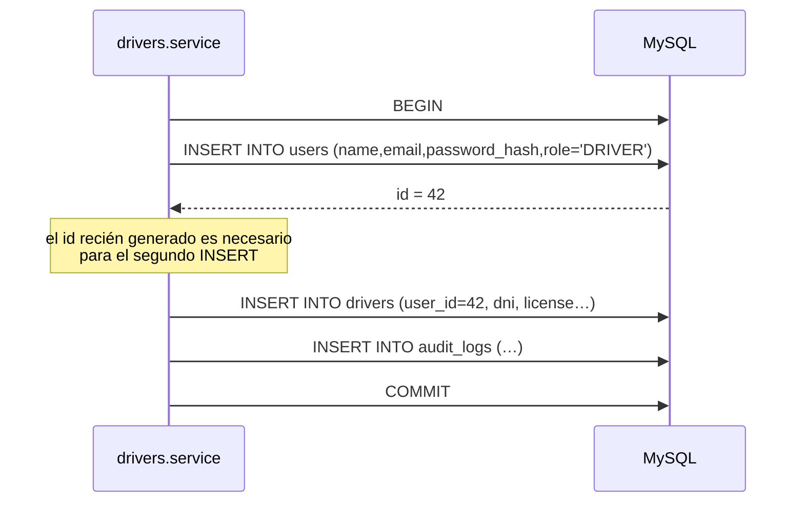
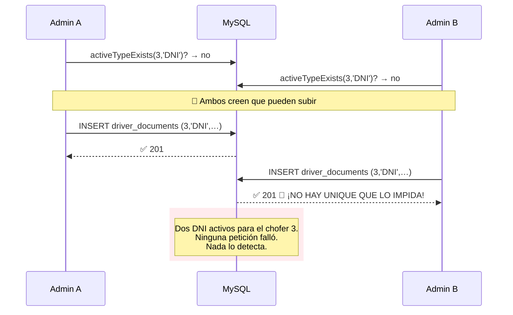
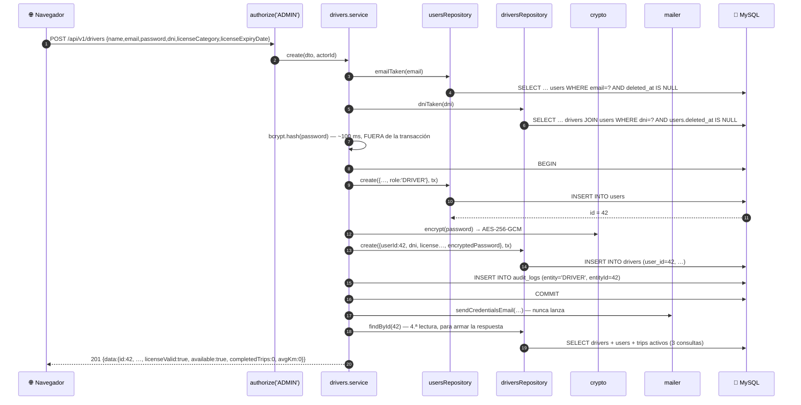
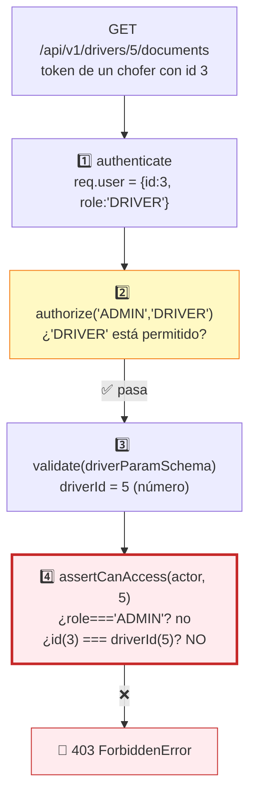

# Capítulo 11 — Choferes y documentación

> **Prerrequisitos:** [Capítulo 3, §3.4.3](03-base-de-datos.md) (clave primaria compartida), [Capítulo 6, §6.5](06-backend-shared.md) (AES-256-GCM), [Capítulo 6, §6.7](06-backend-shared.md) (archivos), [Capítulo 7, §7.8](07-backend-middlewares.md) (multer) y [Capítulo 9](09-modulo-users.md).
> **Archivos que se explican aquí:** los 5 de `modules/drivers/` (525 líneas) y los 5 de `modules/documents/` (456 líneas). Total: 981 líneas, todas.
> **Al terminar** el lector entenderá cómo se crea una entidad que abarca **dos tablas atómicamente**, cómo se implementa la **autorización a nivel de recurso** (que `authorize` no puede expresar), y verá el **único endpoint del sistema que devuelve una contraseña en claro**.

---

## 11.1. Introducción

Estos dos módulos van juntos porque un chofer **sin documentación válida no puede trabajar** (RN-4). Son dos módulos y una sola realidad operativa.

Y concentran los problemas más interesantes vistos hasta ahora:

1. **Una entidad que vive en dos tablas.** Crear un chofer significa insertar en `users` **y** en `drivers`, atómicamente. Es la primera operación del sistema que abarca dos agregados.

2. **Autorización que `authorize` no puede expresar.** *"Un chofer puede ver SUS documentos"* no es una regla de rol: es una regla de **propiedad**. El middleware compara roles; esto requiere comparar identidades. Aquí se resuelve el problema que el §7.4.1 dejó abierto.

3. **El endpoint que devuelve una contraseña en claro.** `GET /drivers/:id/password`. Es la materialización del requisito A-9 (§3.4.3), y merece un análisis de seguridad completo.

4. **Archivos fuera de la transacción.** `documents.create` es el único lugar del sistema que aplica el patrón de compensación de `safeUnlink` (§6.7).

5. **Una regla de unicidad que la base de datos NO puede garantizar**, con un comentario que explica exactamente por qué.

---

## 11.2. Conceptos previos

### 11.2.1. Autorización por rol vs. por recurso

`authorize('ADMIN', 'DRIVER')` responde *"¿tu rol está en esta lista?"*. Es una pregunta sobre **quién sos en general**.

Pero hay preguntas que dependen del **recurso concreto**:

| Pregunta | ¿La responde `authorize`? |
|:--|:--:|
| ¿Sos administrador? | ✅ Sí |
| ¿Sos chofer? | ✅ Sí |
| **¿Sos el chofer 3, mirando los documentos del chofer 3?** | ❌ **No** |

🔴 **Un `authorize('DRIVER')` sobre `GET /drivers/:driverId/documents` permitiría que CUALQUIER chofer viera los documentos de CUALQUIER otro** — DNI, licencia, psicofísico. Es la vulnerabilidad llamada **IDOR** (*Insecure Direct Object Reference*): referencias directas a objetos sin comprobación de propiedad.

**Es una de las vulnerabilidades más comunes en APIs REST**, precisamente porque el middleware de autorización parece suficiente y no lo es.

💡 **La solución de este proyecto está en `documents.service.ts:47-51`**, y se analiza en §11.7.2. Es la respuesta a la pregunta que quedó abierta en §7.4.1.

### 11.2.2. Crear una entidad que abarca dos tablas

Un chofer **es** un usuario con datos adicionales (§3.4.3). Crearlo requiere dos `INSERT`:



🔴 **La transacción es obligatoria, y hay un orden forzado.** El segundo `INSERT` necesita el `id` que genera el primero (clave primaria compartida). Si el segundo fallara sin transacción, quedaría **exactamente el estado imposible que `assignableRoles` previene** (§9.4.1): un usuario con rol `DRIVER` sin fila en `drivers`.

💡 **Es la razón por la que `POST /users` no acepta `role: 'DRIVER'`.** No es una restricción arbitraria: es que crear un chofer requiere una operación de dos pasos que solo este módulo implementa.

### 11.2.3. La unicidad que MySQL no puede expresar

El comentario de `documents.repository.ts:28-33` documenta una limitación real y poco conocida:

> *"Enforced in the service, not by a DB UNIQUE: soft-delete keeps the row, and MySQL has no partial unique index filtered on deleted_at, so a re-upload after deletion would collide with the tombstoned row."*

**La regla de negocio:** un chofer tiene **como máximo un documento activo de cada tipo**. Un DNI, una licencia, un ART, un psicofísico.

**El intento natural sería:**

```sql
UNIQUE (driver_id, document_type)
```

🔴 **Y estaría mal**, porque el borrado es **lógico**: la fila borrada sigue ahí. Al subir un DNI nuevo tras borrar el viejo, la restricción vería dos filas con `(3, 'DNI')` y rechazaría la inserción — aunque una de las dos esté dada de baja.

**Lo que haría falta es un índice único PARCIAL:**

```sql
-- PostgreSQL: sí puede
CREATE UNIQUE INDEX uq_doc_activo ON driver_documents (driver_id, document_type)
  WHERE deleted_at IS NULL;
```

⚠️ **MySQL 8 no soporta índices parciales.** Es una de las diferencias funcionales más significativas con PostgreSQL, y aquí tiene una consecuencia directa: **la regla solo se puede aplicar en la capa de aplicación**.

**Los tres rodeos posibles en MySQL, y sus costos:**

| Solución | Cómo | Costo |
|:--|:--|:--|
| **Solo en la aplicación** (elegida) | `activeTypeExists` antes de insertar | 🔴 **Ventana de carrera sin red de seguridad** |
| Columna generada | `activo = IF(deleted_at IS NULL, 1, NULL)` + `UNIQUE(driver_id, document_type, activo)` | Funciona (los `NULL` no colisionan en `UNIQUE`), pero agrega una columna artificial |
| Borrado físico | Sin `deleted_at` | Se pierde la historia — inaceptable (RN-20) |

💡 **La segunda opción es el truco estándar de MySQL y funciona:** en un índice `UNIQUE`, los valores `NULL` **no** colisionan entre sí, así que todas las filas borradas (con `activo = NULL`) pueden coexistir, y solo puede haber una activa por combinación. **El proyecto no lo usa**, y el resultado es que la regla queda sin red de seguridad en la base (§11.7.4).

---

## 11.3. `drivers.routes.ts` línea por línea

```ts
14 /**
15  * Reads: ADMIN + OPERATOR (the Operator sidebar includes "Choferes" and the
16  * trip-assignment flow needs the available-drivers list, RN-19).
17  * Mutations and credentials (A-9/F-4): ADMIN only.
18  */
19 export const driversRoutes = Router();
20
21 driversRoutes.use(authenticate);
22
23 driversRoutes.get('/', authorize('ADMIN','OPERATOR'), validate(listDriversQuerySchema,'query'), driversController.list);
29 driversRoutes.get('/:id', authorize('ADMIN','OPERATOR'), validate(idParamSchema,'params'), driversController.getById);
35 driversRoutes.post('/', authorize('ADMIN'), validate(createDriverSchema), driversController.create);
36 driversRoutes.patch('/:id', authorize('ADMIN'), validate(idParamSchema,'params'), validate(updateDriverSchema), driversController.update);
43 driversRoutes.get('/:id/password', authorize('ADMIN'), validate(idParamSchema,'params'), driversController.getPassword);
49 driversRoutes.put('/:id/password', authorize('ADMIN'), validate(idParamSchema,'params'), validate(changeDriverPasswordSchema), driversController.changePassword);
```

🔴 **Lo primero y más importante: NO hay endpoint `DELETE`.**

**Seis endpoints, ninguno para dar de baja un chofer.**

**¿Cómo se da de baja entonces?** Por `DELETE /api/v1/users/:id`, que hace la baja lógica del usuario.

💡 **Y aquí se resuelve la pregunta que quedó abierta en §9.6.6.** Allí se señaló que `users.softDelete` **no comprueba** `hasDriverProfile`, dejando la fila de `drivers` intacta. La pregunta era: *¿el chofer sigue apareciendo en el listado?*

**Respuesta verificada:** **no**, porque `driversRepository.buildWhere` (línea 29) y `findById` (línea 56) filtran `user: { deletedAt: null }`. **El chofer desaparece de todos los listados y consultas del módulo.**

✅ **El sistema queda coherente.** ⚠️ **Pero por una razón que conviene nombrar con precisión: NO porque `users` valide, sino porque `drivers` filtra.** La coherencia depende de que este módulo sea cuidadoso, no de que aquel lo sea. Si alguien escribiera una consulta de choferes sin ese filtro —o si un módulo futuro consultara `prisma.driver` directamente— reaparecerían los choferes fantasma.

🔴 **Y quedan tres consecuencias reales del diseño actual:**

| Consecuencia | Detalle |
|:--|:--|
| **La fila de `drivers` queda huérfana** | Nadie la borra ni la marca. Ocupa espacio y aparece en consultas SQL directas. |
| **El DNI se libera** | `dniTaken` filtra `user: { deletedAt: null }`, así que el DNI vuelve a estar disponible. ✅ Correcto y probablemente no intencional. |
| **No hay forma de restaurar** | Ni el usuario ni el chofer. Mismo hueco que §9.3. |

**Línea 49 — `PUT`, no `PATCH`, para la contraseña**

```ts
driversRoutes.put('/:id/password', …);
```

💡 **La elección es correcta y poco frecuente.** `PUT` significa *"reemplazá completamente este recurso"*. Una contraseña **no se modifica parcialmente**: se reemplaza entera. Y `PUT` es **idempotente**: enviar la misma contraseña dos veces deja el sistema en el mismo estado.

⚠️ **Con un matiz: no es perfectamente idempotente.** Cada llamada genera una sal bcrypt nueva (§3.4.1), un texto cifrado AES nuevo (IV aleatorio, §6.5.3), un registro de auditoría nuevo y una revocación de sesiones. El **estado observable** (qué contraseña funciona) sí es idempotente; los efectos secundarios, no.

🔴 **Y aquí está el hallazgo más incómodo del módulo: hay DOS caminos para cambiar la contraseña de un chofer.**

| Camino | Implementación | Sincroniza la copia AES | Revoca sesiones | Capa |
|:--|:--|:--:|:--:|:--|
| `PUT /drivers/:id/password` | `drivers.service.ts:208` | ✅ Sí | ✅ Sí | ✅ Vía `driversRepository` |
| `PATCH /users/:id { password }` | `users.service.ts:117-135` | ✅ Sí | ✅ Sí | 🔴 **Vía `tx.driver.update` directo** (§9.6.4) |

**Dos implementaciones del mismo requisito, en dos módulos, con la misma lógica duplicada y distinta calidad arquitectónica.**

**Los riesgos concretos:**

1. Un cambio en la política (por ejemplo, exigir que la contraseña anterior sea distinta) hay que hacerlo **en dos lugares**, y olvidar uno pasa desapercibido.
2. Las dos rutas auditan distinto: una registra `entity: 'DRIVER'`, la otra `entity: 'USER'`. **Un reporte de "cambios de contraseña" tiene que consultar ambas.**
3. La versión de `users` viola la separación de capas; la de `drivers` no. **El mismo proyecto, dos criterios.**

💡 **La corrección natural** es que `users.service.update` **rechace** el cambio de contraseña para usuarios con perfil de chofer, indicando el endpoint correcto — exactamente la misma simetría que `assignableRoles` aplica a la creación (§9.4.1).

---

## 11.4. `drivers.schemas.ts` línea por línea

```ts
10 const dniSchema = z.string().regex(/^\d{7,10}$/, 'DNI must be 7 to 10 digits');
```

**Es un `string`, no un `number`.** Correcto y deliberado:

| Si fuera `number` | Problema |
|:--|:--|
| `01234567` | Se convertiría en `1234567` — **el cero inicial se pierde** |
| DNI de 10 dígitos | Cabe en `number`, pero comparar `===` con strings de la base fallaría |
| Aritmética accidental | Un DNI no se suma ni se promedia |

💡 **Regla general: los identificadores NO son números aunque estén compuestos de dígitos.** DNI, CUIT, teléfono, código postal, número de tarjeta. Ninguno admite operaciones aritméticas, y todos pueden tener ceros a la izquierda. La columna es `VARCHAR(10)` (§3.4.3), coherente.

⚠️ **`{7,10}` es más laxo que la realidad argentina** (7-8 dígitos). Los dos dígitos extra probablemente contemplan documentos extranjeros. Es una decisión implícita: nadie la documentó.

⚠️ **Y no hay normalización.** `"12.345.678"` con puntos se rechaza (la expresión regular exige solo dígitos), lo que obliga al usuario a escribirlo sin separadores. Un `.transform(v => v.replace(/\D/g, ''))` antes del `regex` sería más amable — y funcionaría igual que `licensePlateSchema` con las patentes (§10.4).

**Líneas 4-8 — `passwordSchema` duplicado**

```ts
const passwordSchema = z.string()
  .min(8, 'Password must be at least 8 characters')
  .regex(/[A-Za-z]/, 'Password must contain a letter')
  .regex(/\d/, 'Password must contain a number');
```

🔴 **Es un COPIA EXACTA de `users.schemas.ts:15-19`.** Carácter por carácter, incluidos los mensajes.

**La política de contraseñas está definida en dos archivos.** Cambiar el mínimo a 12 requiere tocar ambos, y olvidar uno crea una asimetría silenciosa: los choferes podrían tener contraseñas más débiles que los operadores, o al revés.

💡 **Debería vivir en `shared/schemas.ts`**, junto a `idParamSchema` y `paginationSchema` — que existen exactamente por este motivo (§6.3). **Es la misma clase de duplicación que el proyecto ya resolvió para la paginación, sin resolver para las contraseñas.**

**Líneas 44-51 — el filtro `available`**

```ts
export const listDriversQuerySchema = paginationSchema.extend({
  /** RN-19 filter: license valid + no active trip (+ active user). */
  available: z.enum(['true','false']).transform((v) => v === 'true').optional(),
  search: z.string().max(150).optional(),
});
```

**El mismo patrón de tres pasos para booleanos** (§5.3.2). Repetido correctamente por tercera vez en el proyecto.

💡 **`available` no es un campo de la base: es un predicado compuesto de tres condiciones.** El esquema solo lo declara; la traducción a SQL ocurre en el repositorio (§11.5.2), y es la parte más interesante del módulo.

---

## 11.5. `drivers.repository.ts` línea por línea

### 11.5.1. El agregado y su `include` (líneas 6-15)

```ts
6  /**
7   * Driver aggregate = driver row + its user row (1:1, shared PK) + the
8   * "has an active trip" flag needed to compute availability (RN-19).
9   */
10 const driverInclude = {
11   user: true,
12   trips: { where: { status: 'IN_PROGRESS' as const }, select: { id: true }, take: 1 },
13 } satisfies Prisma.DriverInclude;
14
15 export type DriverWithUser = Prisma.DriverGetPayload<{ include: typeof driverInclude }>;
```

**Línea 12 — la optimización más elegante del módulo**

```ts
trips: { where: { status: 'IN_PROGRESS' }, select: { id: true }, take: 1 }
```

**Tres restricciones combinadas:**

| Restricción | Efecto |
|:--|:--|
| `where: { status: 'IN_PROGRESS' }` | Solo viajes en curso, no los 500 completados |
| `select: { id: true }` | Una sola columna |
| `take: 1` | **Como máximo una fila** |

🔴 **El `take: 1` es lo decisivo.** La pregunta que hay que responder es *"¿tiene AL MENOS un viaje activo?"* — un booleano. Traer todos los viajes activos para después contarlos sería desperdicio.

**Y el resultado se consume así** (`drivers.service.ts:45`):

```ts
const hasActiveTrip = driver.trips.length > 0;
```

Un arreglo de 0 o 1 elemento convertido en booleano.

⚙️ **La consulta que genera Prisma** aprovecha el índice `idx_trips_driver_status` `(driver_id, status)` (§3.4.9). **El índice existe exactamente para esta consulta**, y se resuelve sin tocar la tabla de viajes.

⚠️ **Pero conviene dimensionar el costo real.** Con `include`, Prisma emite **consultas separadas** (§4.2.3):

```sql
SELECT … FROM drivers WHERE …  LIMIT 10;                     -- 1
SELECT … FROM users WHERE id IN (3,5,8,…);                    -- 2
SELECT id, driver_id FROM trips WHERE driver_id IN (3,5,8,…) AND status='IN_PROGRESS';  -- 3
```

**Tres consultas para listar choferes, más el `count` del servicio: cuatro.** No es N+1 (no crece con el número de filas), y es correcto.

**Línea 13 — `satisfies`, un operador que merece explicación**

```ts
} satisfies Prisma.DriverInclude;
```

⚙️ **`satisfies` (TypeScript 4.9+) verifica que un valor cumple un tipo SIN cambiar su tipo inferido.**

| Forma | Tipo resultante | Verificación |
|:--|:--|:--|
| `const x = {…}` | Literal exacto | ❌ Ninguna |
| `const x: Prisma.DriverInclude = {…}` | `Prisma.DriverInclude` (**genérico**) | ✅ Sí |
| `const x = {…} satisfies Prisma.DriverInclude` | **Literal exacto** | ✅ **Sí** |

🔴 **Y la diferencia es funcionalmente crítica en la línea siguiente.** `Prisma.DriverGetPayload<{ include: typeof driverInclude }>` deriva el tipo del resultado **a partir de la forma exacta del `include`**. Con la anotación normal (`: Prisma.DriverInclude`), `typeof driverInclude` sería el tipo genérico, y `DriverWithUser` no sabría que `user` y `trips` están presentes.

💡 **Resultado: `DriverWithUser` es un tipo exacto** con `driver.user.name` y `driver.trips[0]` tipados. Es el mecanismo que hace que `toResponse` compile sin ninguna aserción — a diferencia de los controladores, llenos de `as unknown as` (§7.5).

### 11.5.2. `buildWhere` y la lógica de disponibilidad (líneas 27-51)

```ts
27 function buildWhere(filters: DriverFilters): Prisma.DriverWhereInput {
28   const where: Prisma.DriverWhereInput = {
29     user: { deletedAt: null },
30   };
31   if (filters.search) {
32     where.OR = [
33       { dni: { contains: filters.search } },
34       { user: { is: { name: { contains: filters.search }, deletedAt: null } } },
35     ];
36   }
37   if (filters.available === true) {
38     // RN-19: valid license + no active trip (+ active, non-deleted user).
39     // A license expiring today is still valid today (RN-1).
40     where.user = { is: { deletedAt: null, isActive: true } };
41     where.licenseExpiryDate = { gte: utcStartOfToday() };
42     where.trips = { none: { status: 'IN_PROGRESS' } };
43   } else if (filters.available === false) {
44     where.NOT = {
45       user: { is: { deletedAt: null, isActive: true } },
46       licenseExpiryDate: { gte: utcStartOfToday() },
47       trips: { none: { status: 'IN_PROGRESS' } },
48     };
49   }
50   return where;
51 }
```

**Este es el `buildWhere` más complejo del proyecto, y el único que usa mutación en vez de construcción declarativa.**

**Línea 29 — el filtro base sobre la relación**

```ts
user: { deletedAt: null }
```

🔴 **Filtra por una propiedad de la tabla RELACIONADA.** Prisma lo traduce a un `JOIN` (o a una subconsulta `EXISTS`, según el caso). Es lo que hace que un chofer cuyo usuario fue dado de baja **desaparezca de todas las consultas** — la respuesta a la pregunta abierta de §9.6.6.

**Líneas 37-42 — `available: true`, las tres condiciones de RN-19**

| Línea | Condición | Regla |
|:--|:--|:--|
| 40 | Usuario no borrado **y** activo | Un chofer suspendido no es asignable |
| 41 | `licenseExpiryDate >= hoy` | RN-1: licencia vigente |
| 42 | Ningún viaje `IN_PROGRESS` | RN-19: un viaje a la vez |

**`{ gte: utcStartOfToday() }`** — el `>=` y la referencia UTC, por todo lo explicado en §6.6. **Una licencia que vence hoy sigue siendo válida hoy.**

**`{ none: { status: 'IN_PROGRESS' } }`** — `none` es un filtro de relación de Prisma que se traduce a `NOT EXISTS (SELECT 1 FROM trips WHERE driver_id = drivers.user_id AND status = 'IN_PROGRESS')`.

⚠️ **La línea 40 SOBRESCRIBE la línea 29.** No es un bug —la condición nueva incluye `deletedAt: null` y agrega `isActive: true`— pero es frágil: si alguien agregara una condición a la línea 29 y olvidara replicarla en la 40, se perdería silenciosamente. **Una construcción declarativa con propagación (`...`) sería más segura**, como la que usan los otros repositorios.

**Líneas 43-48 — `available: false` y De Morgan**

🔴 **Este bloque es correcto por una razón sutil que conviene desarrollar.**

`where.NOT` con un **objeto de tres propiedades** significa `NOT (A AND B AND C)`. Por las leyes de De Morgan, eso equivale a:

```
NOT A  OR  NOT B  OR  NOT C
```

Es decir: **"no disponible" = usuario inactivo/borrado O licencia vencida O tiene viaje activo.**

✅ **Y esa es exactamente la definición correcta de "no disponible":** basta que falle **una** condición.

⚠️ **Si el desarrollador hubiera escrito tres `NOT` separados**, habría obtenido `NOT A AND NOT B AND NOT C` — es decir, "no disponible **por las tres razones a la vez**", que solo devolvería choferes inactivos **y** con licencia vencida **y** en viaje. Un conjunto casi siempre vacío.

💡 **Es un caso donde la sintaxis de Prisma coincide con la lógica correcta**, pero es fácil equivocarse. Un comentario explicándolo habría ayudado: hoy el lector tiene que reconstruir De Morgan mentalmente para verificar que está bien.

⚠️ **Un detalle: `available: false` NO filtra `user: { deletedAt: null }` de la línea 29… sí lo hace**, porque `where.user` no se sobrescribe en esta rama. Así que un chofer con usuario borrado tampoco aparece en "no disponibles". ✅ Correcto: los borrados no aparecen en ningún lado.

---

## 11.6. `drivers.service.ts` línea por línea

### 11.6.1. `toResponse` y los dos campos derivados (líneas 38-59)

```ts
38 /** A license expiring today is still valid today (RN-1). */
39 function isLicenseValid(expiry: Date): boolean {
40   return expiry >= utcStartOfToday();
41 }
42
43 function toResponse(driver: DriverWithUser): DriverResponse {
44   const licenseValid = isLicenseValid(driver.licenseExpiryDate);
45   const hasActiveTrip = driver.trips.length > 0;
46   return {
47     id: driver.userId,
48     name: driver.user.name,
49     email: driver.user.email,
50     isActive: driver.user.isActive,
51     dni: driver.dni,
52     licenseCategory: driver.licenseCategory,
53     licenseExpiryDate: driver.licenseExpiryDate,
54     licenseValid,
55     available: driver.user.isActive && licenseValid && !hasActiveTrip,
56     completedTrips: driver.completedTrips,
57     avgKm: Number(driver.avgKm),
58   };
59 }
```

**Línea 47 — `id: driver.userId`**

💡 **El renombrado es una decisión de API deliberada.** Internamente la clave es `userId` (por la clave primaria compartida). Hacia afuera se llama `id`, como en todas las demás entidades. **El cliente no necesita saber que un chofer es un usuario por dentro.**

Es una **capa anticorrupción** en miniatura, igual que la traducción `sub → id` de §6.4.2.

**Línea 55 — `available` calculado en dos lugares**

```ts
available: driver.user.isActive && licenseValid && !hasActiveTrip
```

🔴 **La MISMA regla RN-19 está implementada dos veces:**

| Lugar | Forma | Propósito |
|:--|:--|:--|
| `drivers.repository.ts:37-42` | Cláusula `WHERE` de SQL | **Filtrar** el listado |
| `drivers.service.ts:55` | Expresión booleana de TypeScript | **Mostrar** el estado de cada fila |

**Y tienen que dar el mismo resultado siempre.**

⚠️ **No hay nada que lo garantice.** Si alguien agregara una cuarta condición a RN-19 (por ejemplo, "documentación vigente") y la pusiera solo en el repositorio, el listado filtrado sería correcto pero cada fila mostraría `available: true` incorrectamente. **El usuario vería un chofer marcado como disponible que el filtro excluye.**

💡 **Es duplicación inevitable en cierta medida** —SQL y TypeScript son lenguajes distintos— pero mitigable: un test que compare ambas implementaciones sobre el mismo conjunto de datos detectaría la divergencia. Ese test no existe.

🔴 **Y de hecho las dos implementaciones YA divergen del enunciado de RN-4.** La documentación vigente **no** entra en el cálculo de `available`, aunque RN-4 la exige para asignar un viaje. La comprobación existe (`documentsRepository.hasExpiredActive`) pero se aplica **solo al asignar** (capítulo 12), no al listar. **Un chofer con el ART vencido aparece como "disponible" y falla al asignarlo.**

**Línea 57 — `avgKm: Number(driver.avgKm)`**

🔴 **Conversión de `Decimal` a `number`, con pérdida de precisión potencial.**

Como se explicó en §3.5, Prisma devuelve `DECIMAL(10,2)` como un objeto `Decimal` de `decimal.js`, no como `number`. La conversión es necesaria para que `JSON.stringify` produzca un número y no un objeto.

**El riesgo:** `DECIMAL(10,2)` admite hasta `99.999.999,99`. Un `number` de JavaScript representa exactamente hasta 2⁵³−1 ≈ 9×10¹⁵, así que **para este rango la conversión es exacta**. ✅

⚠️ **Pero es exacta por casualidad, no por diseño.** Si mañana la columna pasara a `DECIMAL(20,4)`, la conversión empezaría a redondear silenciosamente. La alternativa segura es `driver.avgKm.toString()` y que el cliente decida — a costa de que el JSON lleve un string donde el consumidor espera un número.

💡 **La decisión actual es correcta para este rango y es una bomba de relojería si el rango cambia.** Un comentario advirtiéndolo sería prudente.

### 11.6.2. `create`: la operación de dos tablas (líneas 94-140)

```ts
94  /** Atomic creation: user (role DRIVER) + driver profile in one transaction. */
95  async create(dto: CreateDriverDto, actorId: number): Promise<DriverResponse> {
96    if (await usersRepository.emailTaken(dto.email)) {
97      throw new ConflictError(`Email ${dto.email} is already in use`);
98    }
99    if (await driversRepository.dniTaken(dto.dni)) {
100     throw new ConflictError(`DNI ${dto.dni} is already registered`);
101   }
102   const passwordHash = await bcrypt.hash(dto.password, BCRYPT_ROUNDS);
103
104   const createdId = await prisma.$transaction(async (tx) => {
105     const user = await usersRepository.create(
106       { name: dto.name, email: dto.email, passwordHash, role: 'DRIVER' },
107       tx,
108     );
109     await driversRepository.create(
110       {
111         userId: user.id,
112         dni: dto.dni,
113         licenseCategory: dto.licenseCategory,
114         licenseExpiryDate: dto.licenseExpiryDate,
115         encryptedPassword: encrypt(dto.password), // A-9: Admin-visible copy
116       },
117       tx,
118     );
119     await auditLogsService.record({ actorId, action: 'CREATE', entity: 'DRIVER',
120                                     entityId: user.id,
121                                     newData: { name: dto.name, email: dto.email, dni: dto.dni } }, tx);
122     return user.id;
123   });
124
125   await sendCredentialsEmail({ to: dto.email, name: dto.name, email: dto.email, password: dto.password });
126   return toResponse((await driversRepository.findById(createdId))!);
127 }
```

**Líneas 105-118 — el orden es obligatorio**

🔴 **No hay elección.** `driversRepository.create` necesita `user.id` (línea 111), que solo existe después del primer `INSERT`. **La secuencia está impuesta por la clave primaria compartida.**

💡 **Y es exactamente por esto que la transacción es obligatoria.** Si el segundo `INSERT` fallara —por un DNI duplicado que se coló en la ventana de carrera, por ejemplo— sin transacción quedaría un usuario con rol `DRIVER` **sin perfil**: el estado imposible que todo el diseño intenta evitar (§9.4.1).

**Línea 106 — `role: 'DRIVER'` en literal**

**Este es el ÚNICO lugar del sistema donde se crea un usuario con rol `DRIVER`.** No viene del DTO: lo impone el servicio. Es la contrapartida exacta de `assignableRoles`, que lo prohíbe en el otro módulo.

**Línea 115 — el cifrado AES**

```ts
encryptedPassword: encrypt(dto.password), // A-9: Admin-visible copy
```

🔴 **Aquí conviven las dos representaciones de la misma contraseña:**

| Campo | Tabla | Algoritmo | Reversible | Para qué |
|:--|:--|:--|:--:|:--|
| `passwordHash` | `users` | bcrypt (coste 10) | ❌ No | **Verificar** el login |
| `encryptedPassword` | `drivers` | AES-256-GCM | ✅ **Sí** | Que el administrador la **vea** (A-9) |

💡 **El login NUNCA usa `encryptedPassword`** (§8.6.4: `bcrypt.compare(dto.password, user.passwordHash)`). Son dos canales independientes. Si `encryptedPassword` se corrompiera, el chofer seguiría entrando normalmente; solo fallaría la consulta del administrador.

⚠️ **Y ambas se escriben en la misma transacción**, así que no pueden desincronizarse **en esta operación**. Pero sí en otras: §11.3 mostró que hay dos caminos para cambiar la contraseña, y §9.6.4 que uno de ellos usa `tx.driver.update` directo.

🔴 **`encrypt()` se ejecuta DENTRO de la transacción** (línea 115).

**AES es rápido** (microsegundos, a diferencia de bcrypt), así que el impacto es despreciable. Pero contradice el principio de §9.2.3 (*"todo el cómputo va fuera de la transacción"*). **Es una inconsistencia menor de estilo, no un problema de rendimiento.**

**Líneas 119-121 — la auditoría incompleta**

```ts
await auditLogsService.record({
  actorId, action: 'CREATE', entity: 'DRIVER', entityId: user.id,
  newData: { name: dto.name, email: dto.email, dni: dto.dni },
}, tx);
```

🔴 **Se creó una fila en `users` y otra en `drivers`, y la auditoría registra UNA sola entrada con `entity: 'DRIVER'`.**

**La consecuencia concreta:**

```sql
-- "¿Qué usuarios se crearon este mes?"
SELECT * FROM audit_logs WHERE entity = 'USER' AND action = 'CREATE';
```

🔴 **Esta consulta NO devuelve los choferes.** Aparecen bajo `entity = 'DRIVER'`. Cualquier reporte de altas de usuarios los omite silenciosamente.

**Las dos correcciones posibles:**

| Opción | Costo |
|:--|:--|
| Registrar **dos** entradas (`USER` + `DRIVER`) | Duplica filas, pero cada consulta funciona |
| Documentar que `DRIVER` implica `USER` | Cero costo, pero todo consumidor debe saberlo |

💡 **Y hay una inconsistencia adicional en el snapshot:** `newData` incluye solo tres campos (`name`, `email`, `dni`), omitiendo `licenseCategory` y `licenseExpiryDate` — que **sí** están en `toAuditSnapshot` (línea 61-69), usado en `update`. **Crear registra menos información que modificar.**

**Línea 126 — la lectura extra**

```ts
return toResponse((await driversRepository.findById(createdId))!);
```

⚠️ **Una cuarta consulta a la base, después del commit**, solo para construir la respuesta.

**Es necesaria** porque `toResponse` requiere un `DriverWithUser` (con `user` y `trips` incluidos), y `driversRepository.create` devuelve un `Driver` pelado. **Pero se podría evitar** construyendo la respuesta a mano con los datos que ya están en memoria:

```ts
// — alternativa sin consulta extra —
return {
  id: user.id, name: dto.name, email: dto.email, isActive: true,
  dni: dto.dni, licenseCategory: dto.licenseCategory,
  licenseExpiryDate: dto.licenseExpiryDate,
  licenseValid: isLicenseValid(dto.licenseExpiryDate),
  available: isLicenseValid(dto.licenseExpiryDate),  // recién creado: sin viajes
  completedTrips: 0, avgKm: 0,
};
```

**El intercambio: menos consultas vs. una tercera implementación de la regla `available`.** La forma actual es más segura (una sola fuente de verdad) a costa de una consulta. **Defendible, pero conviene saber que se está pagando.**

🔴 **Y el `!` es una aserción peligrosa.** Afirma que el chofer recién creado existe. Es cierto **salvo** que otra petición lo haya borrado en los microsegundos entre el commit y esta lectura — improbable, pero si ocurriera el resultado sería `TypeError: Cannot read properties of null` en vez de un error manejable.

### 11.6.3. `update` y las tres lecturas (líneas 142-186)

```ts
142 async update(id: number, dto: UpdateDriverDto, actorId: number): Promise<DriverResponse> {
143   const existing = await getExistingOrFail(id);          // ← lectura 1
144   … validaciones de email y DNI …
156   await prisma.$transaction(async (tx) => {
157     if (dto.name || dto.email) {
158       await usersRepository.update(id, { name: dto.name, email: dto.email }, tx);
159     }
160     if (dto.dni || dto.licenseCategory || dto.licenseExpiryDate) {
161       await driversRepository.update(id, { dni: dto.dni, licenseCategory: dto.licenseCategory,
162                                            licenseExpiryDate: dto.licenseExpiryDate }, tx);
163     }
171     const updated = await driversRepository.findById(id, tx);   // ← lectura 2
172     await auditLogsService.record({ …, previousData: toAuditSnapshot(existing),
179                                      newData: toAuditSnapshot(updated!) }, tx);
183   });
185   return toResponse((await driversRepository.findById(id))!);   // ← lectura 3
186 }
```

**Líneas 157 y 160 — actualización condicional por tabla**

💡 **Es correcto y necesario.** Los campos del DTO se reparten entre dos tablas: `name` y `email` van a `users`; `dni`, `licenseCategory` y `licenseExpiryDate` van a `drivers`. **Sin las guardas, un `PATCH { name: 'X' }` ejecutaría un `UPDATE drivers SET` sin ningún campo** — que Prisma rechaza con un error.

⚠️ **Y hay un efecto secundario silencioso:** si solo se actualiza `dni`, la tabla `users` no se toca, así que **`users.updated_at` no cambia**. Dos tablas del mismo agregado con marcas de tiempo divergentes. No es un bug, pero complica cualquier lógica basada en "última modificación del chofer".

🔴 **Tres lecturas completas del agregado para una actualización.**

Cada `findById` trae el chofer **con su usuario y sus viajes activos**: tres consultas SQL cada una (§11.5.1). **Nueve consultas de lectura, más las de escritura.**

| Lectura | Línea | ¿Necesaria? |
|:--|:-:|:--|
| 1 — `getExistingOrFail` | 143 | ✅ Sí: valida existencia y provee `previousData` |
| 2 — dentro de la transacción | 171 | ✅ Sí: provee `newData` con el estado ya actualizado |
| 3 — después del commit | 185 | 🔴 **No**: podría reutilizar el resultado de la lectura 2 |

**La corrección es trivial:**

```ts
// — mejora propuesta —
const updated = await prisma.$transaction(async (tx) => {
  … los dos updates …
  const fresh = await driversRepository.findById(id, tx);
  await auditLogsService.record({ …, newData: toAuditSnapshot(fresh!) }, tx);
  return fresh!;                    // ← devolverlo desde la transacción
});
return toResponse(updated);         // ← sin cuarta consulta
```

⚠️ **Y la lectura 3 tiene un problema conceptual además del de rendimiento: ocurre FUERA de la transacción.** Entre el commit y esa lectura, otra petición podría haber modificado el chofer. **La respuesta que se devuelve al cliente puede no reflejar lo que esta operación escribió.** Es improbable y benigno, pero es un dato incorrecto devuelto como si fuera el resultado de la operación.

### 11.6.4. `getPassword`: el endpoint que devuelve un secreto (líneas 188-201)

```ts
188 /**
189  * A-9: the Admin can VIEW a driver's password (decrypted from the AES copy).
190  * Security-sensitive read → it leaves an audit trail (VIEW_CREDENTIALS).
191  */
192 async getPassword(id: number, actorId: number): Promise<{ password: string }> {
193   const driver = await getExistingOrFail(id);
194   await auditLogsService.record({
195     actorId,
196     action: 'VIEW_CREDENTIALS',
197     entity: 'DRIVER',
198     entityId: id,
199   });
200   return { password: decrypt(driver.encryptedPassword) };
201 }
```

**Diez líneas, y son las más sensibles del backend.**

🔴 **Este es el único endpoint del sistema que devuelve una contraseña en claro.** Existe por el requisito A-9 (§3.4.3), analizado allí en profundidad. Aquí interesa **cómo se implementó dentro de esa restricción**.

**Lo que el código hace bien, punto por punto:**

| ✅ | Detalle |
|:--|:--|
| **Auditoría de una LECTURA** | Es el único caso del sistema. Normalmente solo se auditan escrituras. |
| **`action: 'VIEW_CREDENTIALS'`** | Acción específica, no un `READ` genérico. Buscable. |
| **La auditoría va ANTES del `return`** | El `await` de la línea 194 se completa antes de la 200. |
| **Solo `authorize('ADMIN')`** | La ruta lo restringe (línea 45). |
| **No hay endpoint de "ver todas las contraseñas"** | Hay que pedirlas de a una, y cada una deja rastro. |

🔴 **El orden de las líneas 194-200 es una decisión de seguridad, no de estilo.**

Como `record` está antes del `return` **y** se espera con `await`, si el registro de auditoría falla, **se lanza la excepción y la contraseña NO se devuelve**.

💡 **Es la política correcta: sin auditoría, no hay acceso.** Un sistema que devolviera el secreto aunque falle el registro permitiría a un atacante con acceso de administrador saturar la tabla de auditoría (o provocar su fallo) y consultar contraseñas sin dejar rastro.

**Lo que sigue siendo problemático:**

| 🔴 | Detalle |
|:--|:--|
| **La contraseña viaja en un cuerpo JSON** | Queda en el búfer de red, en cualquier proxy intermedio, y en la memoria del navegador. |
| **`auditLogsService.record` sin `tx`** | Es una escritura fuera de transacción. Aceptable (es la única operación), pero inconsistente con el resto del módulo. |
| **No hay límite de velocidad** | Un administrador comprometido puede extraer **todas** las contraseñas de choferes en un bucle. Cada una audita, pero nadie mira la auditoría en tiempo real. |
| **No hay alerta** | Consultar 50 contraseñas en un minuto debería disparar algo. No dispara nada. |

⚠️ **Y una observación sobre el registro de auditoría: no se guarda `previousData` ni `newData`, lo cual es correcto** (no hubo cambio de estado). Pero significa que la entrada de auditoría **no dice qué chofer** más allá de `entityId`. Para un informe legible haría falta un `JOIN`. Es coherente con el resto del sistema.

💡 **La mejora de mayor impacto sigue siendo la de §3.4.3:** reemplazar "ver la contraseña" por "regenerarla y enviarla". Elimina la necesidad de cifrado reversible **y** este endpoint.

### 11.6.5. `changePassword` (líneas 203-227)

```ts
async changePassword(id: number, dto: ChangeDriverPasswordDto, actorId: number): Promise<void> {
  await getExistingOrFail(id);
  const passwordHash = await bcrypt.hash(dto.password, BCRYPT_ROUNDS);

  await prisma.$transaction(async (tx) => {
    await usersRepository.update(id, { passwordHash }, tx);
    await driversRepository.update(id, { encryptedPassword: encrypt(dto.password) }, tx);
    await auditLogsService.record({ actorId, action: 'UPDATE', entity: 'DRIVER',
                                    entityId: id, newData: { passwordChanged: true } }, tx);
  });
  await authRepository.revokeAllForUser(id);
}
```

✅ **Las dos representaciones se actualizan en la MISMA transacción** (líneas 213-214). Es imposible que `passwordHash` y `encryptedPassword` queden desincronizados por esta vía.

✅ **`newData: { passwordChanged: true }`** — el mismo patrón correcto de §9.6.4: registra el hecho sin el secreto.

✅ **Pasa por `driversRepository.update`**, respetando la separación de capas — **a diferencia de `users.service.ts:126`**, que hace lo mismo con `tx.driver.update` directo (§9.6.4). **Dos implementaciones del mismo requisito, una correcta y otra no.**

🔴 **`revokeAllForUser` FUERA de la transacción** (línea 226) — el mismo hueco de §9.6.4, por la misma causa (`authRepository` no acepta `db`). **Tercera aparición del mismo problema.**

⚠️ **`getExistingOrFail(id)` se llama y su resultado se descarta.** Solo sirve para validar existencia. Es correcto, pero desperdicia las tres consultas del `include` (usuario y viajes activos) cuando bastaría un `SELECT user_id FROM drivers WHERE user_id = ?`. Un método `existsById` sería más apropiado.

---

## 11.7. El módulo de documentos

### 11.7.1. `documents.routes.ts` y el router anidado

```ts
14 /**
15  * Nested under /drivers/:driverId/documents (mergeParams to read :driverId).
16  *
17  * Permissions (compliance): a DRIVER may only VIEW/download (GET) their OWN
18  * documents. Uploading (POST), editing (PATCH) and deleting (DELETE) are
19  * ADMIN-only, so a driver cannot upload, falsify or hide their own
20  * compliance status. Resource-level ownership (driver ↔ own documents) is
21  * resolved in the service. Operators are excluded from this flow entirely.
22  */
23 export const documentsRoutes = Router({ mergeParams: true });
```

**Línea 23 — `mergeParams: true`, y por qué es obligatorio**

🔴 **Por defecto, un `Router` de Express NO hereda los parámetros de la ruta donde se montó.**

El montaje es `apiV1.use('/drivers/:driverId/documents', documentsRoutes)` (`app.ts:51`). Sin `mergeParams`, dentro de este router `req.params.driverId` sería **`undefined`**, y el módulo no sabría de qué chofer habla.

**Con `mergeParams: true`**, los parámetros del padre se fusionan con los propios: `req.params` contiene `driverId` **y** `documentId`.

⚠️ **Es un detalle fácil de olvidar y produce un fallo desconcertante:** el endpoint devuelve un 400 de validación diciendo que `driverId` es requerido, cuando la URL claramente lo incluye.

**El comentario de las líneas 17-21 es el mejor razonamiento de permisos del proyecto**

> *"a DRIVER may only VIEW/download their OWN documents. Uploading, editing and deleting are ADMIN-only, **so a driver cannot upload, falsify or hide their own compliance status**."*

💡 **La justificación no es técnica: es de control interno.** Un chofer con permiso de escritura sobre su propia documentación podría:

| Acción | Consecuencia |
|:--|:--|
| Subir un psicofísico falso | Habilitarse sin estar apto |
| Editar la fecha de vencimiento de su licencia | Seguir siendo asignable con la licencia vencida |
| Borrar un documento vencido | Ocultar su incumplimiento — **y como RN-4 comprueba documentos vencidos, borrarlo lo "arregla"** |

🔴 **La tercera es la más grave y la menos obvia.** `hasExpiredActive` (`documents.repository.ts:20-26`) busca documentos **activos y vencidos**. Un documento borrado lógicamente ya no es "activo", así que **borrarlo elimina la señal de incumplimiento**. Si el chofer pudiera borrar, "arreglaría" su estado destruyendo la evidencia.

💡 **Es un ejemplo claro de por qué la separación de deberes importa:** quien es evaluado no debe controlar la evidencia de su evaluación.

**Los operadores están excluidos por completo**

**Ningún endpoint permite `OPERATOR`.** Es coherente con que la documentación es información personal sensible (DNI, psicofísico): el operador necesita saber si un chofer **está disponible**, no ver sus documentos.

⚠️ **Con una consecuencia práctica:** un operador que no puede asignar un viaje porque el chofer tiene documentación vencida **no puede ver cuál documento es**. Tiene que pedirle al administrador que lo verifique. Es fricción operativa aceptada a cambio de privacidad.

**Líneas 35-36 — un comentario que documenta un cambio de decisión**

```ts
// Upload is Admin-only (decision change): the driver only views their
// documents; the Admin uploads them from the Drivers module.
```

💡 **"decision change" es un rastro honesto.** Originalmente el chofer podía subir; se cambió por el razonamiento de control interno.

🔴 **Pero el cambio dejó código inconsistente.** `documents.service.ts:85` (dentro de `create`) sigue llamando a `assertCanAccess`, que **permite a un chofer crear sus propios documentos**:

```ts
function assertCanAccess(actor: AuthenticatedUser, driverId: number): void {
  if (actor.role === 'ADMIN') return;
  if (actor.role === 'DRIVER' && actor.id === driverId) return;   // ← permitiría subir
  throw new ForbiddenError('You can only access your own documents');
}
```

**El servicio es MÁS PERMISIVO que la ruta.** Hoy no importa (la ruta bloquea antes), pero:

1. Es **defensa en profundidad al revés**: la capa interna es más laxa que la externa.
2. Si alguien invocara `documentsService.create` desde otro contexto, el chofer podría subir.
3. **Es código residual de la decisión anterior**, y nadie lo limpió.

### 11.7.2. `assertCanAccess`: la autorización por recurso

```ts
43 /**
44  * Resource-level authorization (F-4 / P-CH-3): an Admin manages any driver's
45  * documents; a driver only their own. Operators are not in this flow.
46  */
47 function assertCanAccess(actor: AuthenticatedUser, driverId: number): void {
48   if (actor.role === 'ADMIN') return;
49   if (actor.role === 'DRIVER' && actor.id === driverId) return;
50   throw new ForbiddenError('You can only access your own documents');
51 }
```

🔴 **Estas cinco líneas son la respuesta a la pregunta que quedó abierta en §7.4.1: el IDOR está prevenido.**

**Línea 49 — la comparación decisiva**

```ts
actor.role === 'DRIVER' && actor.id === driverId
```

💡 **`actor.id === driverId` funciona porque el id del chofer ES el id del usuario** (clave primaria compartida, §3.4.3). Sin ese diseño, habría que consultar la base para resolver "¿qué chofer corresponde a este usuario?" — una consulta extra en cada comprobación.

**La decisión de modelado del capítulo 3 paga aquí, en una comparación de enteros sin ninguna consulta.**

**Se aplica en las CINCO operaciones del servicio:**

| Método | Línea |
|:--|:-:|
| `list` | 72 |
| `create` | 85 |
| `update` | 137 |
| `remove` | 182 |
| `getForDownload` | 205 |

✅ **Cobertura completa. Ningún camino de acceso lo saltea.**

⚠️ **Pero se llama a mano cinco veces.** Olvidarlo en un método nuevo no produce ningún error: el endpoint simplemente quedaría abierto. **Un middleware específico** (que leyera `req.params.driverId` y `req.user`) lo aplicaría a nivel de router y haría el olvido imposible.

**Es exactamente el mismo argumento de `use` a nivel de router** (§9.3), aplicado a la autorización por recurso.

**Por qué es `ForbiddenError` (403) y no `NotFoundError` (404)**

⚠️ **Es una decisión discutible.**

| Código | Mensaje | Lo que revela |
|:--|:--|:--|
| **403** (elegido) | *"You can only access your own documents"* | 🔴 Confirma que el chofer `driverId` **existe** |
| 404 | *"Not found"* | ✅ No revela nada |

**Con 403, un chofer puede enumerar qué ids de chofer existen** probando `/drivers/1/documents`, `/drivers/2/documents`… y distinguiendo 403 (existe, sin permiso) de 404 (no existe).

💡 **Es una fuga de información de bajo impacto** (los ids son secuenciales y adivinables de todos modos, y saber cuántos choferes hay no es un secreto). **Pero devolver 404 sería estrictamente mejor**, y es la práctica de GitHub para repositorios privados: prefieren mentir sobre la existencia antes que confirmarla.

⚠️ **Y hay una inconsistencia interna:** `getOwnedDocumentOrFail` (líneas 59-68) **sí** devuelve 404 cuando el documento pertenece a otro chofer:

```ts
if (!doc || doc.driverId !== driverId) {
  throw new NotFoundError(`Document ${documentId} not found for driver ${driverId}`);
}
```

**El mismo módulo usa dos políticas distintas** para el mismo tipo de situación: 403 al comprobar el chofer, 404 al comprobar el documento. **La segunda es la correcta.**

### 11.7.3. `create` y la compensación de archivos (líneas 78-128)

```ts
96   const stored = await storeFile('documents', file.originalname, file.buffer);
97   try {
98     const created = await prisma.$transaction(async (tx) => {
99       const doc = await documentsRepository.create({ …, filePath: stored.filePath, … }, tx);
111      await auditLogsService.record({ …, entity: 'DRIVER_DOCUMENT', … }, tx);
121      return doc;
122    });
123    return toResponse(created);
124  } catch (err) {
125    await safeUnlink(stored.filePath);
126    throw err;
127  }
```

🔴 **Este es el ÚNICO lugar del proyecto que aplica el patrón de compensación de `safeUnlink`** (§6.7.1). Y está bien implementado.

**La secuencia y su punto débil:**

```mermaid
sequenceDiagram
    participant S as documents.service
    participant FS as 💾 Disco
    participant DB as 🐬 MySQL

    S->>FS: storeFile() → escribe el archivo
    FS-->>S: { filePath }
    Note over S,DB: ⚠️ El archivo YA existe, la transacción todavía NO empezó
    S->>DB: BEGIN
    S->>DB: INSERT INTO driver_documents (…)
    alt éxito
        S->>DB: INSERT audit_logs; COMMIT
        S-->>S: ✅ 201
    else fallo
        DB--xS: ❌ ROLLBACK (la fila NO queda)
        S->>FS: safeUnlink(filePath) — compensación
        S-->>S: ❌ propaga el error
    end
```

**Lo que el `try/catch` cubre:** cualquier fallo dentro de la transacción.

🔴 **Lo que NO cubre** (§6.7.2): que el proceso **muera** entre `storeFile` y el `INSERT`. Nadie ejecuta la compensación, y queda un archivo huérfano que ninguna fila referencia.

⚠️ **La ventana es de milisegundos y el impacto es un archivo de hasta 1 MB olvidado.** El capítulo 25 propone la tarea de limpieza.

**`throw err` en la línea 126 es esencial.** Sin él, el `catch` **se tragaría el error** y la función devolvería `undefined` — que el controlador enviaría como `{"data": undefined}` con un 201. **El cliente creería que se subió un documento que no existe.**

💡 **Es el patrón correcto para un `catch` que solo hace limpieza: limpiar y relanzar.** Nunca absorber.

### 11.7.4. La regla de un documento activo por tipo

```ts
88 // One active document per type per driver. To replace it, the Admin must
89 // delete the current one first — a driver cannot silently stack documents.
90 if (await documentsRepository.activeTypeExists(driverId, dto.documentType)) {
91   throw new ConflictError(`Driver ${driverId} already has an active ${dto.documentType} document`);
92 }
```

**La justificación de negocio del comentario es sólida:** sin la regla, un chofer (o un administrador distraído) podría acumular tres DNI con fechas distintas, y `hasExpiredActive` encontraría el vencido aunque exista uno vigente. **La ambigüedad rompería RN-4.**

🔴 **Y aquí está el hallazgo: la regla NO tiene red de seguridad en la base de datos.**

Como se explicó en §11.2.3, MySQL no soporta índices únicos parciales, y el comentario del repositorio lo documenta con precisión.

**La consecuencia es una carrera SIN protección:**



🔴 **Compárese con el email duplicado** (§9.6.3): allí la carrera existe pero **`UNIQUE(email)` la atrapa** y `error-handler` la traduce a 409. **Aquí no hay nada.** Ambas inserciones tienen éxito y el estado queda inconsistente.

**Y es peor que la carrera de los administradores** (§9.6.4) en un sentido: aquella requiere dos administradores actuando simultáneamente **sobre entidades distintas**; esta requiere dos peticiones sobre **el mismo chofer y el mismo tipo** — más improbable, pero también más fácil de provocar accidentalmente con un doble clic en un formulario lento.

**Las dos correcciones:**

```sql
-- Opción 1: columna generada + UNIQUE (la solución estándar de MySQL)
ALTER TABLE driver_documents
  ADD COLUMN activo TINYINT AS (IF(deleted_at IS NULL, 1, NULL)) STORED,
  ADD UNIQUE KEY uq_doc_activo (driver_id, document_type, activo);
-- Los NULL no colisionan en UNIQUE → múltiples borrados coexisten,
-- solo puede haber UNA fila activa por (chofer, tipo).
```

```ts
// Opción 2: bloqueo pesimista, siguiendo el patrón de trips y maintenances
await prisma.$transaction(async (tx) => {
  await tx.$queryRaw`SELECT user_id FROM drivers WHERE user_id = ${driverId} FOR UPDATE`;
  if (await documentsRepository.activeTypeExists(driverId, dto.documentType, undefined, tx)) {
    throw new ConflictError(…);
  }
  // … el INSERT
});
```

💡 **La opción 1 es superior** porque protege contra **cualquier** escritor, incluido un script externo o una migración de datos. La opción 2 solo protege a quien pase por este servicio.

**El `excludeId` en `update`** (líneas 142-148) es el mismo mecanismo de `emailTaken`/`plateTaken`: al cambiar el tipo de un documento, hay que excluirse de la comprobación para no chocar consigo mismo.

### 11.7.5. `remove` y la decisión sobre el archivo (líneas 172-198)

```ts
/**
 * Soft-delete the document (RN-20). The file on disk is intentionally kept:
 * the record still references it for audit/history; physical cleanup, if
 * ever needed, is a separate maintenance concern.
 */
```

💡 **La decisión está documentada y es defendible:** el registro sigue existiendo (borrado lógico) y sigue apuntando al archivo. Borrar el archivo dejaría una fila con `file_path` roto — peor que un archivo de más.

⚠️ **Y hay un argumento de cumplimiento adicional que el comentario no menciona:** en un sistema de documentación laboral, destruir el archivo de un psicofísico podría tener implicancias legales. Conservarlo es probablemente lo correcto.

🔴 **Pero contrasta agudamente con `maintenance_attachments`, que usa `ON DELETE CASCADE`** (§3.4.8): allí las filas **se borran físicamente** y los archivos **quedan huérfanos sin ninguna referencia**.

| | `driver_documents` | `maintenance_attachments` |
|:--|:--|:--|
| Borrado | Lógico (`deleted_at`) | **Físico** (`CASCADE`) |
| La fila sobrevive | ✅ Sí | ❌ No |
| El archivo sobrevive | ✅ Sí, **referenciado** | ⚠️ Sí, **huérfano** |
| ¿Está documentado? | ✅ Sí | ❌ No |

**Dos políticas opuestas para dos tipos de archivo, y solo una está justificada por escrito.**

### 11.7.6. `download` y la entrega del archivo

```ts
64 async download(req: Request, res: Response, next: NextFunction): Promise<void> {
70   const file = await documentsService.getForDownload(driverId, documentId, req.user!);
71   res.type(file.mimeType);
72   res.setHeader('Content-Disposition', `inline; filename="${encodeURIComponent(file.fileName)}"`);
73   res.sendFile(path.resolve(file.filePath), (err) => {
74     if (err && !res.headersSent) next(new NotFoundError('File is no longer available'));
75   });
76 }
```

**Línea 71 — `res.type(file.mimeType)`**

Establece `Content-Type` con el MIME **guardado en la base** — que a su vez vino de lo que el cliente declaró al subir (§7.8.3).

🔴 **Aquí se cierra el análisis de seguridad de la subida.** El riesgo teórico sería: subir un archivo HTML declarando `application/pdf`, y que el navegador lo interprete como HTML al descargarlo (XSS almacenado).

✅ **No ocurre**, y por una razón concreta: el MIME almacenado **solo puede ser uno de los tres permitidos** (`application/pdf`, `image/jpeg`, `image/png`). Aunque el contenido sea HTML, el navegador recibe `Content-Type: image/png` y **no ejecuta HTML** bajo ese tipo. La cabecera `X-Content-Type-Options: nosniff` de helmet (§5.5.3) refuerza la protección impidiendo que el navegador "adivine" el tipo real.

💡 **Tres capas independientes convergen para cerrar el vector:** la lista blanca de MIME (multer), el `Content-Type` fijo de la respuesta, y `nosniff` (helmet). **Ninguna sola bastaría.**

**Línea 72 — `inline` vs `attachment`**

| Valor | Comportamiento |
|:--|:--|
| `inline` (elegido) | El navegador **muestra** el archivo si puede (PDF, imagen) |
| `attachment` | Fuerza la **descarga** |

💡 **`inline` es la elección correcta para este caso de uso:** un administrador verificando la documentación quiere **verla**, no acumular archivos en su carpeta de descargas.

**`encodeURIComponent(file.fileName)`** escapa el nombre. 🔴 **Es una protección necesaria contra inyección de cabeceras HTTP:** un nombre de archivo con comillas o saltos de línea podría romper la cabecera o inyectar otras. Como `fileName` es el nombre **original que subió el usuario**, es entrada no confiable.

⚠️ **Aunque el escapado no es exactamente el correcto para este contexto.** El estándar RFC 6266 define `filename*=UTF-8''<codificado>` para nombres no ASCII. Con `encodeURIComponent` dentro de `filename="..."`, un archivo llamado `licencia año.pdf` se descargaría como `licencia%20a%C3%B1o.pdf` — legible pero feo. Es un defecto cosmético, no de seguridad.

**Líneas 73-75 — `sendFile` y su callback**

```ts
res.sendFile(path.resolve(file.filePath), (err) => {
  if (err && !res.headersSent) next(new NotFoundError('File is no longer available'));
});
```

⚙️ **`res.sendFile` transmite el archivo por streaming**, sin cargarlo entero en memoria. Con archivos de 1 MB es irrelevante, pero es la API correcta.

🔴 **`!res.headersSent` es una comprobación imprescindible.** Si el fallo ocurre **a mitad de la transmisión** (el disco falla, el cliente corta la conexión), las cabeceras ya se enviaron y **no se puede cambiar el código de estado**. Intentar responder produciría el error `ERR_HTTP_HEADERS_SENT` (§7.3.2). La guarda lo evita.

**`NotFoundError('File is no longer available')`** — el mensaje es preciso: la fila existe (se validó), el archivo no. **Es exactamente el escenario que el seed produce** (§4.7.5): documentos sembrados cuyos archivos nunca se crearon.

💡 **Así que este mensaje es lo que ve cualquiera que pruebe descargar un documento del seed.** El manual lo predijo en el capítulo 4; aquí está el código que lo emite.

**`path.resolve(file.filePath)`** — convierte la ruta relativa (`uploads/documents/uuid.pdf`) en absoluta.

🔴 **Y hereda la fragilidad de `UPLOAD_ROOT`** (§5.4): resuelve contra el **directorio de trabajo actual**. Si el proceso se lanza desde un directorio distinto al de desarrollo, **todas las descargas fallan** con este mismo mensaje, y el diagnóstico es confuso porque los archivos "están ahí".

⚠️ **Y `getForDownload` NO audita**, mientras que `getPassword` sí. **Descargar el DNI o el psicofísico de un chofer es una lectura de datos personales sensibles y no deja rastro.** Es una inconsistencia de criterio: se audita ver una contraseña pero no ver un documento de identidad.

---

## 11.8. Flujo interno

### 11.8.1. Creación de un chofer, completa



### 11.8.2. Las dos capas de autorización de documentos



🔴 **`authorize` deja pasar la petición.** El rol `DRIVER` está en la lista permitida. **La única barrera real es `assertCanAccess`, en el servicio.** Sin ella, cualquier chofer vería los documentos de cualquier otro.

---

## 11.9. Ejemplos

### Ejemplo 1 — Crear un chofer y verificar las dos tablas

```http
POST /api/v1/drivers
{"name":"Pedro Gómez","email":"pedro@empresa.com","password":"Chofer123",
 "dni":"30999888","licenseCategory":"C","licenseExpiryDate":"2027-06-30"}
```

```http
HTTP/1.1 201 Created

{"data":{"id":42,"name":"Pedro Gómez","email":"pedro@empresa.com","isActive":true,
         "dni":"30999888","licenseCategory":"C","licenseExpiryDate":"2027-06-30T00:00:00.000Z",
         "licenseValid":true,"available":true,"completedTrips":0,"avgKm":0}}
```

```sql
SELECT u.id, u.role, u.email, d.dni, LEFT(d.encrypted_password, 30) AS cifrado
  FROM users u JOIN drivers d ON d.user_id = u.id WHERE u.id = 42;
```

| id | role | email | dni | cifrado |
|:--|:--|:--|:--|:--|
| 42 | DRIVER | pedro@empresa.com | 30999888 | `qJk3mZp2Rr8vLx0F:8YtN2xQwEr…` |

✅ **Dos filas, una transacción.** El formato del cifrado es el de §6.5.3: `base64(iv):base64(tag):base64(cifrado)`.

### Ejemplo 2 — Demostrar el IDOR prevenido

```bash
# Token de Juan Pérez (chofer, id 3)
curl http://localhost:3000/api/v1/drivers/3/documents -H "Authorization: Bearer $JUAN"
# → 200 ✅ ve los suyos

curl http://localhost:3000/api/v1/drivers/5/documents -H "Authorization: Bearer $JUAN"
```

```http
HTTP/1.1 403 Forbidden

{"error":{"code":"FORBIDDEN","message":"You can only access your own documents"}}
```

⚠️ **Nótese que el 403 CONFIRMA que el chofer 5 existe.** Probando ids secuencialmente, Juan puede mapear cuántos choferes hay: los que devuelven 403 existen, los que devuelven 404 no. **Un 404 uniforme no revelaría nada** (§11.7.2).

### Ejemplo 3 — Ver la contraseña y su rastro de auditoría

```bash
curl http://localhost:3000/api/v1/drivers/3/password -H "Authorization: Bearer $ADMIN"
```

```http
HTTP/1.1 200 OK
{"data":{"password":"Driver1234!"}}
```

```sql
SELECT al.occurred_at, u.name AS quien, al.action, al.entity, al.entity_id
  FROM audit_logs al JOIN users u ON u.id = al.user_id
 WHERE al.action = 'VIEW_CREDENTIALS' ORDER BY al.occurred_at DESC;
```

| occurred_at | quien | action | entity | entity_id |
|:--|:--|:--|:--|:--|
| 2026-08-03 18:42:11.204 | Administrador General | VIEW_CREDENTIALS | DRIVER | 3 |

✅ **La lectura sensible queda registrada.** 🔴 **Pero nada impide repetirla 50 veces en un minuto**, y nadie mira esta tabla en tiempo real.

### Ejemplo 4 — Reproducir la carrera de documentos duplicados

```bash
# El chofer 3 no tiene ART activo
for i in 1 2; do
  curl -X POST http://localhost:3000/api/v1/drivers/3/documents \
    -H "Authorization: Bearer $ADMIN" \
    -F "documentType=ART" -F "expiryDate=2027-01-01" -F "file=@art.pdf" &
done
wait
```

```sql
SELECT id, document_type, expiry_date, deleted_at
  FROM driver_documents WHERE driver_id = 3 AND document_type = 'ART' AND deleted_at IS NULL;
```

🔴 **Si aparecen DOS filas, la carrera se reprodujo.** Ambas peticiones devolvieron 201. **No hay `UNIQUE` que lo impida** — a diferencia del email o la patente.

### Ejemplo 5 — El filtro `available` y su divergencia con RN-4

```bash
curl "http://localhost:3000/api/v1/drivers?available=true" -H "Authorization: Bearer $OPERADOR"
```

Con la base sembrada, devuelve a **Juan** (licencia +400 d, sin viaje activo) y **Carlos** (licencia +10 d, sin viaje). No devuelve a María (viaje en curso) ni a Lucía (licencia vencida).

🔴 **Pero Juan tiene el ART venciendo en 12 días y María tiene el ART VENCIDO hace 3** (`seed.ts:232,235`). **Carlos no tiene NINGÚN documento cargado.**

```bash
# Intentar asignar a Carlos, que figura "disponible"
curl -X POST http://localhost:3000/api/v1/trips/13/assign \
  -H "Authorization: Bearer $OPERADOR" -H 'Content-Type: application/json' \
  -d '{"driverId":<id de Carlos>}'
```

**El resultado depende de si RN-4 comprueba "documentos vencidos" o "documentos completos"** — se verifica en el capítulo 12. **Si comprueba completitud, Carlos figura disponible y falla al asignarlo.** La lista miente.

---

## 11.10. Resumen

1. **Un chofer abarca dos tablas** y se crea en una transacción con orden forzado (el `id` del usuario alimenta la fila del chofer). Es la razón por la que `POST /users` no acepta `role: 'DRIVER'`.

2. **No hay `DELETE /drivers`.** La baja va por `/users`, y el chofer desaparece de los listados **porque `driversRepository` filtra `user.deletedAt`** — no porque `users` valide. La coherencia depende del módulo correcto, no del que ejecuta la acción.

3. **`assertCanAccess` previene el IDOR** que `authorize` no puede expresar. Funciona con una comparación de enteros gracias a la clave primaria compartida del capítulo 3.

4. **El chofer solo puede LEER su documentación.** No puede subir, editar ni borrar — porque borrar un documento vencido eliminaría la señal de incumplimiento de RN-4.

5. **`satisfies` es lo que hace que `DriverWithUser` sea un tipo exacto** en vez de genérico, permitiendo `toResponse` sin aserciones.

6. **`GET /drivers/:id/password` audita ANTES de devolver**, con `await`: si la auditoría falla, la contraseña no se entrega. La política correcta.

7. **`create` de documentos es el único uso de `safeUnlink`** en el proyecto, y está bien implementado (limpiar y relanzar).

8. **Once hallazgos concretos:**

   | # | Hallazgo | Gravedad |
   |:-:|:--|:--|
   | 1 | 🔴 **La regla "un documento activo por tipo" no tiene red de seguridad en la base.** MySQL no soporta índices únicos parciales, y el proyecto no usa el rodeo de la columna generada. **Dos inserciones concurrentes tienen éxito y nada lo detecta** — a diferencia del email o la patente, donde `UNIQUE` salva. | **Alta** |
   | 2 | 🔴 **Dos caminos para cambiar la contraseña de un chofer** (`PUT /drivers/:id/password` y `PATCH /users/:id`), con lógica duplicada, auditoría bajo entidades distintas y **distinta calidad arquitectónica** (uno viola capas, el otro no). | **Alta** |
   | 3 | 🔴 **`available` se calcula en dos lugares** (SQL y TypeScript) sin nada que garantice la coincidencia. **Y ya diverge de RN-4:** no considera la documentación, así que un chofer con el ART vencido figura disponible y falla al asignarlo. | **Alta** |
   | 4 | 🔴 **`create` audita solo `entity:'DRIVER'`**, aunque crea también una fila en `users`. Un reporte de "usuarios creados" omite silenciosamente a los choferes. Y registra menos campos que `update`. | Media |
   | 5 | ⚠️ **`assertCanAccess` es más permisivo que la ruta** para `create`: permitiría a un chofer subir sus propios documentos. Código residual de una decisión revertida. | Media |
   | 6 | ⚠️ **`getForDownload` no audita**, mientras `getPassword` sí. Descargar un DNI o un psicofísico no deja rastro. | Media |
   | 7 | ⚠️ **`update` de choferes hace TRES lecturas completas del agregado** (nueve consultas SQL), y la tercera ocurre **fuera de la transacción**: puede devolver un estado distinto al que escribió. | Media |
   | 8 | ⚠️ **`passwordSchema` está duplicado carácter por carácter** entre `users.schemas.ts` y `drivers.schemas.ts`. Debería estar en `shared/`. | Baja |
   | 9 | ⚠️ **`assertCanAccess` devuelve 403 y confirma la existencia del chofer**, permitiendo enumeración. `getOwnedDocumentOrFail`, en el mismo archivo, usa 404 — la política correcta. | Baja |
   | 10 | ⚠️ **`revokeAllForUser` fuera de la transacción** en `changePassword`. Tercera aparición del mismo problema. | Baja |
   | 11 | ⚠️ **`avgKm: Number(decimal)`** es exacto para `DECIMAL(10,2)` **por casualidad del rango**; sería una bomba de relojería si la columna creciera. | Baja |

---

## 11.11. Preguntas de repaso

1. ¿Por qué crear un chofer requiere una transacción y por qué el orden de los dos `INSERT` no se puede invertir?
2. No hay `DELETE /drivers`. ¿Cómo se da de baja un chofer y por qué el sistema queda coherente pese a que `users.softDelete` no valida nada?
3. ¿Qué es un IDOR? ¿Por qué `authorize('DRIVER')` no lo previene y qué lo previene aquí?
4. ¿Por qué `actor.id === driverId` funciona sin ninguna consulta a la base?
5. ¿Por qué un chofer no puede borrar sus propios documentos? Dar el razonamiento de control interno.
6. Explicar por qué MySQL no puede garantizar "un documento activo por tipo" y cuáles son los tres rodeos posibles.
7. `where.NOT` con tres propiedades — ¿qué significa lógicamente? ¿Qué habría pasado con tres `NOT` separados?
8. ¿Qué hace `satisfies` y por qué la línea 15 no funcionaría con una anotación de tipo normal?
9. En `getPassword`, ¿por qué la auditoría va antes del `return` y con `await`? ¿Qué política implementa eso?
10. ¿Por qué `dniSchema` usa `string` y no `number`? Dar tres razones.
11. Hay dos caminos para cambiar la contraseña de un chofer. ¿Cuáles son las tres diferencias y cuál es la corrección natural?
12. `available` se calcula en el repositorio y en el servicio. ¿Por qué es duplicación inevitable y en qué ya divergen del enunciado de RN-4?
13. ¿Por qué `create` de documentos usa `try/catch` con `safeUnlink` y por qué el `throw err` es esencial?
14. Un atacante sube un archivo HTML declarando `image/png`. ¿Se ejecuta al descargarlo? Enumerar las tres capas que lo impiden.
15. ¿Por qué `!res.headersSent` en el callback de `sendFile`?

<details>
<summary><strong>Respuestas</strong></summary>

1. Porque el `INSERT` en `drivers` necesita el `user_id` que genera el `INSERT` en `users` (clave primaria compartida, §3.4.3). **El orden está impuesto por el modelo de datos.** La transacción es obligatoria porque si el segundo fallara sin ella, quedaría un usuario con `role='DRIVER'` **sin fila en `drivers`**: exactamente el estado imposible que `assignableRoles` previene desde el otro módulo.

2. Por `DELETE /api/v1/users/:id`. El sistema queda coherente porque **`driversRepository` filtra `user: { deletedAt: null }`** en `buildWhere` (línea 29) y en `findById` (línea 56), así que el chofer desaparece de todos los listados y consultas. **Pero la coherencia depende de que `drivers` filtre, no de que `users` valide**: si alguien escribiera una consulta de choferes sin ese filtro, o consultara `prisma.driver` directamente, reaparecerían choferes fantasma. Además la fila de `drivers` queda huérfana y no hay forma de restaurar.

3. **IDOR** = *Insecure Direct Object Reference*: acceder a un recurso ajeno cambiando un identificador en la URL. `authorize('DRIVER')` responde "¿tu rol es chofer?" — una pregunta sobre **quién sos en general**, no sobre **este recurso concreto**. Cualquier chofer pasaría la comprobación para `/drivers/5/documents`. Lo previene **`assertCanAccess`** (`documents.service.ts:47-51`), que compara `actor.id` con `driverId`.

4. Porque **el id del chofer ES el id del usuario**: `drivers.user_id` es simultáneamente clave primaria y foránea (§3.4.3). Sin ese diseño habría que consultar la base para resolver "¿qué chofer corresponde a este usuario?" en **cada** comprobación de acceso. La decisión de modelado del capítulo 3 se paga aquí con una comparación de enteros y cero consultas.

5. Porque podría **destruir la evidencia de su propio incumplimiento**. `hasExpiredActive` busca documentos **activos y vencidos**; un documento borrado lógicamente ya no es activo, así que **borrar un documento vencido "arregla" el estado de cumplimiento del chofer**. Junto con no poder subir (documentos falsos) ni editar (fechas de vencimiento), es separación de deberes: quien es evaluado no controla la evidencia de su evaluación.

6. Porque el borrado es **lógico**: un `UNIQUE(driver_id, document_type)` vería la fila borrada y rechazaría la re-subida. Haría falta un índice **único parcial** (`WHERE deleted_at IS NULL`), que **MySQL 8 no soporta** (PostgreSQL sí). **Los tres rodeos:** (a) solo en la aplicación — lo elegido, sin red de seguridad; (b) **columna generada** `activo = IF(deleted_at IS NULL, 1, NULL)` más `UNIQUE(driver_id, document_type, activo)`, que funciona porque los `NULL` no colisionan en `UNIQUE`; (c) borrado físico, inaceptable por RN-20.

7. `NOT (A AND B AND C)`, que por De Morgan equivale a **`NOT A OR NOT B OR NOT C`** — es decir, "no disponible" si falla **cualquiera** de las tres condiciones. **Es la definición correcta.** Con tres `NOT` separados se obtendría `NOT A AND NOT B AND NOT C`: "no disponible por las tres razones a la vez", que solo devolvería choferes inactivos **y** con licencia vencida **y** en viaje — un conjunto casi siempre vacío.

8. `satisfies` **verifica que un valor cumple un tipo sin cambiar su tipo inferido**. Con la anotación normal (`const x: Prisma.DriverInclude = {…}`), `typeof driverInclude` sería el tipo **genérico** `DriverInclude`, y `Prisma.DriverGetPayload<{ include: typeof driverInclude }>` no podría saber que `user` y `trips` están presentes. Con `satisfies`, el tipo inferido sigue siendo el **literal exacto**, así que `DriverWithUser` tiene `user` y `trips` tipados y `toResponse` compila sin aserciones.

9. Porque implementa la política **"sin auditoría, no hay acceso"**. Como `record` se espera con `await` y está **antes** del `return`, si el registro falla se lanza la excepción y **la contraseña no se devuelve**. Un sistema que devolviera el secreto aunque falle el registro permitiría a un atacante con acceso de administrador saturar o romper la tabla de auditoría y consultar contraseñas sin dejar rastro.

10. **(a)** Los ceros a la izquierda se perderían: `01234567` → `1234567`. **(b)** Un DNI no admite operaciones aritméticas: no se suma ni se promedia. **(c)** La columna es `VARCHAR(10)` y comparar un `number` con strings de la base produciría conversiones implícitas. **Regla general:** los identificadores no son números aunque estén compuestos de dígitos (DNI, CUIT, teléfono, código postal, tarjeta).

11. **Las tres diferencias:** (a) auditan bajo entidades distintas (`DRIVER` vs `USER`), así que un reporte de cambios de contraseña debe consultar ambas; (b) `drivers` pasa por `driversRepository` (correcto) mientras `users` usa `tx.driver.update` directo (viola la separación de capas, §9.6.4); (c) la lógica de sincronizar bcrypt + AES está **duplicada**, y un cambio de política requiere tocar ambos. **La corrección natural:** que `users.service.update` **rechace** el cambio de contraseña para usuarios con perfil de chofer, indicando el endpoint correcto — la misma simetría que `assignableRoles` aplica a la creación.

12. Es inevitable **hasta cierto punto** porque son dos lenguajes distintos: el repositorio necesita una cláusula `WHERE` de SQL para **filtrar**, y el servicio una expresión booleana de TypeScript para **mostrar** el estado de cada fila. **Ya divergen de RN-4** porque ninguna de las dos considera la documentación vigente: la comprobación existe (`hasExpiredActive`) pero se aplica solo al asignar un viaje. **Resultado: un chofer con el ART vencido figura como disponible en el listado y falla al asignarlo.**

13. Porque **el archivo se escribe en disco ANTES de la transacción**, y el sistema de archivos no participa del `ROLLBACK`. Si la escritura en la base falla, la fila no queda pero el archivo sí: `safeUnlink` es la **compensación manual**. **El `throw err` es esencial** porque sin él el `catch` se tragaría el error, la función devolvería `undefined`, y el controlador respondería `201 {"data": undefined}` — el cliente creería que subió un documento que no existe. El patrón correcto para un `catch` de limpieza es **limpiar y relanzar**, nunca absorber.

14. **No se ejecuta.** Tres capas convergen: **(a)** la lista blanca de MIME de multer limita el valor almacenado a `application/pdf`, `image/jpeg` o `image/png`; **(b)** `res.type(file.mimeType)` fija ese `Content-Type` en la respuesta, y un navegador **no interpreta HTML bajo `image/png`**; **(c)** la cabecera `X-Content-Type-Options: nosniff` de helmet impide que el navegador "adivine" el tipo real del contenido. Ninguna sola bastaría: sin (c), algunos navegadores antiguos harían *sniffing* y detectarían el HTML.

15. Porque `sendFile` transmite por streaming y el fallo puede ocurrir **a mitad de la transmisión** — cuando las cabeceras ya se enviaron. En ese punto **el código de estado ya no se puede cambiar**; intentar responder produciría `ERR_HTTP_HEADERS_SENT`. La guarda distingue "falló antes de empezar" (se puede responder 404) de "falló a mitad de camino" (solo queda cortar la conexión).

</details>

---

## 11.12. Ejercicios propuestos

**Nivel 1 — Observación**

1. Crear un chofer y verificar con SQL que existen las dos filas y que `encrypted_password` tiene el formato `iv:tag:cifrado`.
2. Listar con `?available=true` y con `?available=false`. Verificar que los conjuntos son complementarios y que la suma es el total.
3. Consultar la contraseña de un chofer y localizar el registro `VIEW_CREDENTIALS` en `audit_logs`.
4. Descargar un documento del seed y documentar el error. Relacionarlo con §4.7.5.

**Nivel 2 — Verificación de los hallazgos**

5. Reproducir el IDOR bloqueado (ejemplo 2) y confirmar que el 403 permite enumerar choferes existentes.
6. Reproducir la **carrera de documentos duplicados** (ejemplo 4) con 20 intentos concurrentes. Documentar la tasa de éxito y compararla con la del email duplicado.
7. Cambiar la contraseña de un chofer por **los dos caminos** y comparar los registros de auditoría resultantes.
8. Verificar la divergencia de `available`: encontrar un chofer que figure disponible en el listado y falle al asignarlo por documentación.
9. Contar las consultas SQL que dispara un `PATCH /drivers/:id` activando `log: ['query']`. Comparar con la teoría de §11.6.3.

**Nivel 3 — Corrección**

10. Implementar la **columna generada + `UNIQUE`** para documentos activos. Verificar con el ejercicio 6 que la carrera ahora produce un 409.
11. Hacer que `users.service.update` rechace el cambio de contraseña para usuarios con perfil de chofer, indicando el endpoint correcto.
12. Mover `passwordSchema` a `shared/schemas.ts` y usarlo desde los dos módulos.
13. Agregar auditoría a `getForDownload` con una acción `DOWNLOAD_DOCUMENT`, en simetría con `VIEW_CREDENTIALS`.
14. Eliminar la tercera lectura de `update` devolviendo el resultado desde dentro de la transacción.
15. Convertir `assertCanAccess` en un middleware de router que lea `req.params.driverId`, y quitar las cinco llamadas manuales. Verificar que un método nuevo queda protegido automáticamente.
16. Unificar la política de códigos: hacer que `assertCanAccess` devuelva 404 en vez de 403, en coherencia con `getOwnedDocumentOrFail`. Evaluar el impacto en la experiencia de usuario.
17. Agregar la documentación vigente al cálculo de `available`, en el repositorio **y** en el servicio, y escribir un test que compare ambas implementaciones sobre el mismo conjunto de datos.

---

**Anterior:** [Capítulo 10 — El módulo de vehículos](10-modulo-vehicles.md) · **Siguiente:** Capítulo 12 — El módulo de viajes *(pendiente)*
