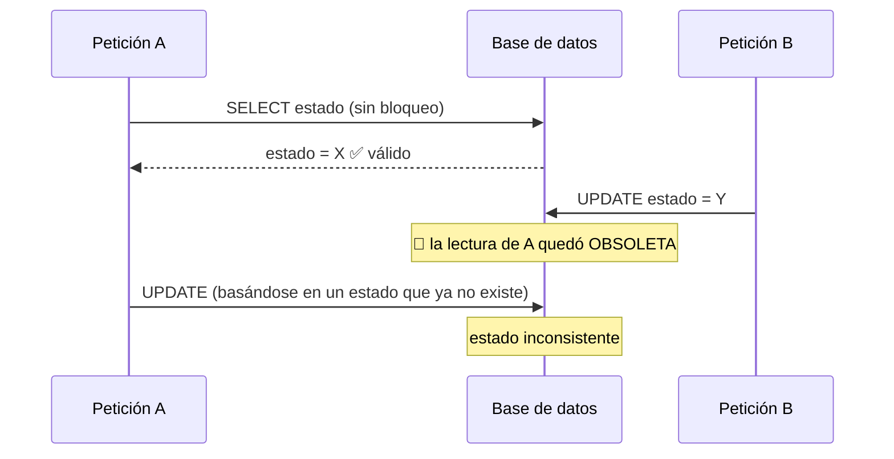
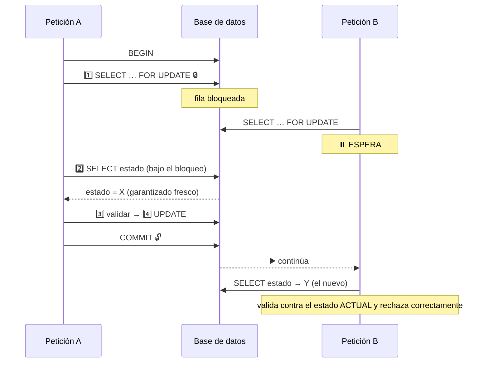
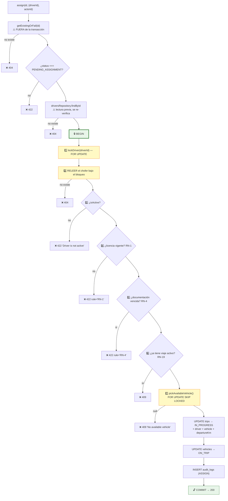
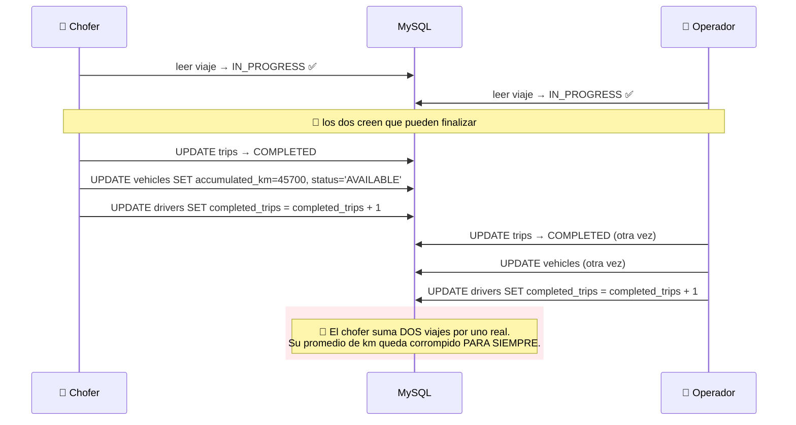

# Capítulo 12 — El módulo de viajes

> **Prerrequisitos:** [Capítulo 3, §3.4.9](03-base-de-datos.md) (la tabla `trips`), [Capítulo 10](10-modulo-vehicles.md) (estado compartido del vehículo) y [Capítulo 11](11-modulo-drivers-documents.md) (disponibilidad del chofer).
> **Archivos que se explican aquí:** los 5 de `modules/trips/` (702 líneas). Total: 702 líneas, todas.
> **Al terminar** el lector entenderá la operación más compleja del sistema —asignar un viaje— con sus siete validaciones, tres bloqueos y cinco escrituras atómicas; y verá **el módulo mejor escrito del proyecto**, junto con las tres reglas de negocio que le faltan.

---

## 12.1. Introducción

Los viajes son **la razón de ser del sistema**. Todo lo demás existe para que un viaje pueda planificarse, asignarse y completarse: la flota, los choferes, la documentación, el mantenimiento.

Y es el módulo donde converge todo:

| Operación | Entidades que toca | Escrituras atómicas |
|:--|:--|:-:|
| `create` | `trips` | 2 |
| `update` | `trips` | 2 |
| **`assign`** | **`trips` + `vehicles` + `drivers` + `driver_documents`** | **3** |
| **`finish`** | **`trips` + `vehicles` + `drivers`** | **4** |
| `delete` | `trips` | 2 |

💡 **Es también el módulo con la mejor disciplina de concurrencia del proyecto**, y por un margen amplio. Mientras `users` deja una carrera que puede dejar el sistema sin administradores (§9.6.4) y `vehicles` no bloquea nada (§10.6.4), este módulo aplica el patrón correcto de forma consistente: **bloquear, releer bajo el bloqueo, validar, escribir**.

**Pero tiene tres huecos de reglas de negocio** que el capítulo desarrolla, y uno de ellos tiene implicaciones legales.

---

## 12.2. Conceptos previos

### 12.2.1. El patrón "bloquear, releer, validar, escribir"

Es el patrón que resuelve las carreras que los capítulos 9, 10 y 11 dejaron abiertas. Vale la pena formalizarlo antes de verlo en código.

**El problema, en abstracto:**



**La solución, en cuatro pasos:**



🔴 **El paso 2 —releer bajo el bloqueo— es el que casi siempre se olvida.** Bloquear sin releer no sirve de nada: se seguiría validando contra la lectura obsoleta. **Este módulo lo hace en las líneas 190 y 270**, y los comentarios lo explican explícitamente.

### 12.2.2. `FOR UPDATE` vs `FOR UPDATE SKIP LOCKED`

El módulo usa **dos** variantes de bloqueo, y la diferencia importa.

| Variante | Si la fila está bloqueada | Uso aquí |
|:--|:--|:--|
| `FOR UPDATE` | **Espera** hasta que se libere | `lockDriver`, `lockTrip` |
| `FOR UPDATE SKIP LOCKED` | **Salta** esa fila y sigue con la siguiente | `pickAvailableVehicle` |

💡 **La elección de `SKIP LOCKED` para la selección de vehículo es excelente**, y responde a una diferencia de naturaleza:

- **El chofer y el viaje son específicos.** El operador eligió *ese* chofer, *ese* viaje. Si están ocupados, hay que esperar y después rechazar con un mensaje correcto.
- **El vehículo es intercambiable.** El sistema elige *cualquiera* disponible. Si el vehículo con menos kilómetros está siendo tomado por otra asignación simultánea, **lo correcto es tomar el siguiente**, no esperar.

🔴 **Sin `SKIP LOCKED`, dos asignaciones simultáneas se serializarían inútilmente:** ambas apuntarían al mismo vehículo (el de menor kilometraje), la segunda esperaría, y al desbloquearse encontraría que ya está `ON_TRIP` y tendría que reintentar. **Con `SKIP LOCKED`, cada una toma un vehículo distinto y ambas tienen éxito en paralelo.**

⚙️ **`SKIP LOCKED` está disponible en MySQL desde la versión 8.0.** Es una de las razones por las que el proyecto exige MySQL 8 y no 5.7.

### 12.2.3. Borrado físico vs. lógico: cuándo cada uno

Este módulo es el **único del proyecto que borra físicamente**, y el comentario lo justifica (líneas 331-336):

> *"Such a trip has no operational history (no vehicle/driver touched), so a hard delete is correct; RN-20 (soft delete) targets entities with history."*

💡 **El criterio es preciso: se borra lógicamente lo que TIENE historia, físicamente lo que NO la tiene.**

Un viaje `PENDING_ASSIGNMENT` es una **intención**, no un hecho: no tocó ningún vehículo, no ocupó a ningún chofer, no generó kilómetros. Borrarlo no destruye información operativa.

| Estado | ¿Qué es? | ¿Borrable? |
|:--|:--|:--|
| `PENDING_ASSIGNMENT` | Una intención de viaje | ✅ **Sí, físicamente** |
| `IN_PROGRESS` | Un hecho en curso | ❌ No |
| `COMPLETED` | Un hecho consumado | ❌ No |

⚠️ **Y hay una consecuencia lateral:** el registro de auditoría del borrado queda apuntando a un `entity_id` **que ya no existe**. Es la debilidad de la relación polimórfica de `audit_logs` (§3.4.11) materializándose. **No es grave** (el `previousData` conserva los datos), pero es una referencia rota real.

---

## 12.3. `trips.routes.ts` línea por línea

```ts
15 /**
16  * Trips are the operator's core workflow; admins have full access. Drivers
17  * can read their own trips (list/detail scoped in the service) and finish
18  * their current one (A-3). State transitions are explicit POST actions so
19  * the PENDING_ASSIGNMENT → IN_PROGRESS → COMPLETED machine can't be bypassed.
20  */
23 tripsRoutes.use(authenticate);
26 tripsRoutes.get('/', authorize('ADMIN','OPERATOR','DRIVER'), validate(listTripsQuerySchema,'query'), tripsController.list);
32 tripsRoutes.get('/:id', authorize('ADMIN','OPERATOR','DRIVER'), validate(idParamSchema,'params'), tripsController.getById);
40 tripsRoutes.post('/', authorize('ADMIN','OPERATOR'), validate(createTripSchema), tripsController.create);
41 tripsRoutes.patch('/:id', authorize('ADMIN','OPERATOR'), …, tripsController.update);
48 tripsRoutes.post('/:id/assign', authorize('ADMIN','OPERATOR'), …, tripsController.assign);
57 tripsRoutes.post('/:id/finish', authorize('ADMIN','OPERATOR','DRIVER'), …, tripsController.finish);
66 tripsRoutes.delete('/:id', authorize('ADMIN','OPERATOR'), …, tripsController.remove);
```

**El único módulo donde los TRES roles aparecen**

| Endpoint | ADMIN | OPERATOR | DRIVER |
|:--|:-:|:-:|:-:|
| `GET /` | ✅ | ✅ | ✅ *(solo los suyos)* |
| `GET /:id` | ✅ | ✅ | ✅ *(solo los suyos)* |
| `POST /` | ✅ | ✅ | ❌ |
| `PATCH /:id` | ✅ | ✅ | ❌ |
| `POST /:id/assign` | ✅ | ✅ | ❌ |
| **`POST /:id/finish`** | ✅ | ✅ | ✅ *(solo el suyo)* |
| `DELETE /:id` | ✅ | ✅ | ❌ |

🔴 **Tres endpoints donde `authorize` NO es suficiente**, y el comentario lo declara: *"driver results are scoped to their own trips in service"*.

**Es el mismo problema que en documentos** (§11.7.2): la propiedad no es un rol. Pero aquí se resuelve de **dos formas distintas**, y esa diferencia es interesante:

| Endpoint | Mecanismo | Efecto |
|:--|:--|:--|
| `GET /` | **Filtrado forzado** (`trips.service.ts:88`) | El chofer ve una lista más corta |
| `GET /:id` | **Rechazo** (`trips.service.ts:99`) | 403 |
| `POST /:id/finish` | **Rechazo** (`trips.service.ts:259`) | 403 |

💡 **El filtrado en el listado es la solución correcta para una colección**, porque devolver 403 al listar sería absurdo (el chofer sí puede listar; lo que no puede es ver todo). **El rechazo es correcto para un recurso individual.**

**Línea 57 — `finish` permite a los tres roles**

El comentario cita **A-3**: el chofer finaliza idealmente, pero un operador puede hacerlo si el chofer no puede (sin batería, sin señal, olvido).

💡 **Es una decisión operativa sensata**, y el sistema registra **quién** lo hizo (`finishedById`, §3.4.9), así que la trazabilidad no se pierde.

⚠️ **Falta un endpoint que el modelo sugiere: cancelar un viaje.** El comentario de la línea 335 lo explica: *"Trips are never cancellable (RN-14)"*. Un viaje `IN_PROGRESS` **debe** terminar en `COMPLETED`; no hay forma de abortarlo.

🔴 **Y eso deja un caso operativo sin resolver:** ¿qué pasa si un camión se rompe a mitad de camino y el viaje no se completa? El sistema **no tiene respuesta**. El viaje queda `IN_PROGRESS` para siempre, el vehículo queda `ON_TRIP` para siempre (no asignable, no reparable — no se le puede abrir un mantenimiento porque `IN_WORKSHOP` requiere pasar por `AVAILABLE`), y el chofer queda ocupado para siempre (RN-19 lo bloquea).

**Es un bloqueo permanente que solo se resuelve con SQL manual.** El capítulo 25 lo registra como la funcionalidad faltante de mayor impacto operativo.

---

## 12.4. `trips.schemas.ts` línea por línea

```ts
4  /**
5   * Trip creation only generates the route (A-1). The origin is fixed (RN-21)
6   * and therefore NOT accepted from the client. Driver and vehicle are set
7   * later, during assignment. estimatedDistanceKm/estimatedTimeMin come from
8   * the route preview (Google Maps) and are optional.
9   */
10 export const createTripSchema = z.object({
11   destination: z.string().min(2).max(120),
12   departureAt: z.coerce.date(),
13   notes: z.string().max(1000).optional(),
14   estimatedDistanceKm: z.coerce.number().positive().max(99999).optional(),
15   estimatedTimeMin: z.coerce.number().int().positive().max(100000).optional(),
16 });
```

🔴 **Lo más importante es lo que NO está: `origin`, `driverId`, `vehicleId`, `departureKm`, `status`.**

**Cinco campos de la tabla que el cliente no puede tocar**, cada uno por una razón distinta:

| Campo ausente | Por qué |
|:--|:--|
| `origin` | RN-21: es fijo. Lo impone el servicio (línea 110). |
| `driverId` | Se asigna en `POST /:id/assign`, con siete validaciones. |
| `vehicleId` | **Lo elige el sistema**, no el cliente (RN-12). |
| `departureKm` | Es una foto del odómetro al asignar. |
| `status` | Lo controla la máquina de estados. |

💡 **Un esquema de entrada define la superficie de ataque tanto como los permisos.** Si `status` estuviera aquí, un operador podría crear un viaje directamente en `COMPLETED`, salteando toda la máquina de estados. **La ausencia es la protección.**

**Línea 12 — `departureAt` sin restricción temporal**

```ts
departureAt: z.coerce.date(),
```

🔴 **Se puede crear un viaje con salida en el pasado.** `2020-01-01` es aceptado.

**¿Es un problema?** Hay argumentos en ambos sentidos:

| A favor de permitirlo | En contra |
|:--|:--|
| Registrar viajes ocurridos y no cargados | Un error de tipeo (`2025` en vez de `2026`) pasa desapercibido |
| Correcciones administrativas | El viaje aparece al principio del listado (ordenado por fecha desc… no, al final) |
| El sistema no valida nada temporal en ningún lado | Los reportes por período incluyen datos absurdos |

⚠️ **Y se combina con el hallazgo de §4.7.5:** el seed tiene un viaje que **llega antes de salir** (`finishedAt < departureAt`), y **nada en el sistema lo impide**. Aquí se confirma: no hay validación temporal en la creación, ni en la actualización, ni en la finalización.

**La validación mínima razonable** sería que un viaje nuevo no pueda tener salida anterior a, digamos, 24 horas atrás — permitiendo correcciones sin permitir errores de año.

**Líneas 14-15 — los límites numéricos**

```ts
estimatedDistanceKm: z.coerce.number().positive().max(99999).optional(),
estimatedTimeMin: z.coerce.number().int().positive().max(100000).optional(),
```

**`max(99999)`** coincide con `DECIMAL(8,2)` de la columna (§3.4.9), que admite hasta `999.999,99`. Es más restrictivo que la base — correcto: 99.999 km es más de dos vueltas al mundo.

**`max(100000)` minutos** son 69 días. Generoso, pero es un límite.

⚠️ **`estimatedDistanceKm` NO es entero** (`z.coerce.number()` sin `.int()`), coherente con `DECIMAL(8,2)`. **`estimatedTimeMin` sí lo es**, coherente con `INT UNSIGNED`. **Los tipos del esquema reflejan los de la base.** Es un detalle de coherencia que muchos proyectos pierden.

**Línea 24 — `notes` con `.nullable()` solo en `update`**

```ts
// create:  notes: z.string().max(1000).optional(),
// update:  notes: z.string().max(1000).nullable().optional(),
```

💡 **La asimetría es correcta.** Al **crear**, "sin notas" se expresa omitiendo el campo. Al **actualizar**, hay que poder distinguir "no toques las notas" (`undefined`) de "**borrá** las notas" (`null`). Es el mismo triple estado de `insuranceExpiryDate` (§10.4).

**Líneas 35-38 — `assignTripSchema`: un solo campo**

```ts
/**
 * Assignment: the operator picks the driver; the vehicle is chosen
 * automatically by the system among AVAILABLE ones (RN-12 / C-8).
 */
export const assignTripSchema = z.object({
  driverId: z.coerce.number().int().positive(),
});
```

🔴 **El operador elige el chofer; el sistema elige el vehículo.** Es una decisión de producto codificada en un esquema de un campo.

**Por qué esa asimetría tiene sentido:**

| | Chofer | Vehículo |
|:--|:--|:--|
| ¿Son intercambiables? | ❌ No — turnos, zonas, preferencias, disponibilidad real | ✅ Sí, dentro de los disponibles |
| ¿El operador tiene información que el sistema no? | ✅ Sí | ❌ No |
| Criterio de selección automática | Imposible de formalizar | **Menor kilometraje** (reparte el uso) |

💡 **Automatizar la elección del vehículo elimina un sesgo humano real:** sin el criterio automático, los operadores tienden a elegir siempre el mismo vehículo (el más nuevo, el que conocen), desgastándolo desproporcionadamente. **El algoritmo reparte el uso por construcción.**

---

## 12.5. `trips.repository.ts` línea por línea

### 12.5.1. El `include` con `select` anidado (líneas 6-12)

```ts
const tripInclude = {
  vehicle: { select: { id: true, licensePlate: true, model: true } },
  driver:  { select: { userId: true, dni: true, user: { select: { name: true } } } },
  operator:{ select: { id: true, name: true } },
} satisfies Prisma.TripInclude;
```

💡 **Combinar `include` con `select` anidado es la forma eficiente de traer relaciones.**

| Forma | Qué trae del vehículo |
|:--|:--|
| `vehicle: true` | **Las 12 columnas**, incluidas `deletedAt`, `initialKm`, `createdAt`… |
| `vehicle: { select: {…} }` | **Solo 3**: `id`, `licensePlate`, `model` |

🔴 **Y la diferencia no es solo de tráfico: es de seguridad.** Con `operator: true` se traerían **todas** las columnas de `users`, incluido **`passwordHash`**. Si alguien después hiciera `res.json(trip)` sin pasar por `toResponse`, el hash del operador llegaría al navegador.

**Con `select: { id: true, name: true }`, ese campo NUNCA sale de la base.** Es defensa en profundidad: la lista blanca se aplica en la consulta, no solo en la serialización.

**`driver.user.select.name`** — dos niveles de anidación. Trae el nombre del usuario asociado al chofer, sin traer el resto de `users`.

⚠️ **Nótese que `driver` NO filtra `user.deletedAt`.** Un viaje de un chofer dado de baja seguirá mostrando su nombre. **Es correcto**: es historia, y ocultar el nombre haría ilegible el registro. **Contrasta deliberadamente con `driversRepository`**, que sí filtra (§11.5.2) — porque ahí se listan choferes activos, aquí se muestra historia.

### 12.5.2. `buildWhere` y el rango de fechas (líneas 27-42)

```ts
if (filters.dateFrom || filters.dateTo) {
  // utcEndOfDay makes dateTo an inclusive upper bound; a raw lte would drop
  // the last day of the range (timezone boundary, same fix as reports).
  where.departureAt = {
    ...(filters.dateFrom ? { gte: filters.dateFrom } : {}),
    ...(filters.dateTo ? { lte: utcEndOfDay(filters.dateTo) } : {}),
  };
}
```

🔴 **El comentario explica un bug que este código previene, y vale la pena desarrollarlo.**

`dateTo` llega como `?dateTo=2026-07-31`. `z.coerce.date()` lo convierte a `2026-07-31T00:00:00.000Z` — **medianoche**.

**Sin `utcEndOfDay`:**

```sql
WHERE departure_at <= '2026-07-31 00:00:00.000'
```

**Un viaje que sale el 31 de julio a las 08:00 quedaría FUERA del rango.** El usuario pide "hasta el 31 de julio" y **pierde casi todo el 31 de julio** — solo entrarían los viajes de exactamente medianoche.

**Con `utcEndOfDay`:**

```sql
WHERE departure_at <= '2026-07-31 23:59:59.999'
```

✅ **Límite superior inclusivo**, que es lo que un usuario entiende por "hasta el 31".

💡 **Es exactamente el tipo de bug que genera reportes de usuario del tipo "faltan viajes" imposibles de reproducir** — porque solo se manifiesta con datos del último día del rango. El comentario menciona que es *"the same fix as reports"*, así que el equipo se encontró con esto más de una vez.

⚠️ **Y persiste la imprecisión de `23:59:59.999`** señalada en §6.6.3: con precisión de milisegundo funciona, con microsegundos habría un hueco. El patrón robusto sería `< inicioDelDiaSiguiente`.

**Líneas 29-31 — la asignación directa**

```ts
status: filters.status,
driverId: filters.driverId,
vehicleId: filters.vehicleId,
```

Sin ternarios: si son `undefined`, Prisma los ignora (§9.5.1). **Más limpio que la propagación condicional**, y posible aquí porque no hay envoltura (`{ in: … }`).

### 12.5.3. `pickAvailableVehicle`: el algoritmo de RN-12 (líneas 84-103)

```ts
/**
 * Automatic vehicle selection (RN-12 / C-8): pick and row-lock the AVAILABLE
 * vehicle with the lowest accumulated km (efficiency criterion — spreads
 * usage across the fleet). FOR UPDATE SKIP LOCKED lets concurrent
 * assignments each grab a different vehicle instead of racing for one.
 * Returns the chosen vehicle id, or null if the fleet has none available.
 */
async pickAvailableVehicle(tx: Prisma.TransactionClient): Promise<number | null> {
  // $queryRaw returns the id as a JS BigInt (e.g. 1n); typing it as bigint
  // (not number) keeps the type honest, and Number() converts it back so
  // downstream Prisma calls receive an Int, not a BigInt.
  const rows = await tx.$queryRaw<{ id: bigint }[]>`
    SELECT id FROM vehicles
    WHERE status = 'AVAILABLE' AND deleted_at IS NULL
    ORDER BY accumulated_km ASC
    LIMIT 1
    FOR UPDATE SKIP LOCKED
  `;
  return rows[0] ? Number(rows[0].id) : null;
}
```

**Es la única consulta SQL escrita a mano del módulo, y las cuatro razones están justificadas:**

| Necesidad | Por qué Prisma no alcanza |
|:--|:--|
| `FOR UPDATE SKIP LOCKED` | Prisma **no expone** bloqueos pesimistas en su API |
| Selección + bloqueo atómicos | Un `findFirst` seguido de un bloqueo tendría una ventana |
| `ORDER BY … LIMIT 1` con bloqueo | Idem |
| Parametrización | ✅ La tiene: es `$queryRaw` con plantilla etiquetada (§4.8.2) |

**El criterio de selección: `ORDER BY accumulated_km ASC`**

💡 **Elegir el vehículo con MENOS kilómetros reparte el desgaste por construcción.** Sin ese criterio (por ejemplo, `ORDER BY id`), el vehículo 1 haría todos los viajes hasta entrar en mantenimiento, y el resto de la flota quedaría subutilizada.

**Y tiene un efecto secundario deseable:** el vehículo **más cercano a necesitar mantenimiento** (el de más kilómetros) es el **último** en ser elegido. El algoritmo aleja naturalmente a los vehículos del umbral de mantenimiento.

**El comentario sobre `bigint` (líneas 92-94) documenta un detalle real de Prisma**

```ts
const rows = await tx.$queryRaw<{ id: bigint }[]>`…`;
return rows[0] ? Number(rows[0].id) : null;
```

🔴 **`$queryRaw` devuelve los enteros de MySQL como `BigInt` de JavaScript**, no como `number`. Es una decisión de Prisma para no perder precisión con `BIGINT`.

**Tipar el resultado como `{ id: bigint }` es honesto:** dice lo que realmente llega. La alternativa (tiparlo como `number` y confiar) sería una mentira que TypeScript no detectaría, y produciría un fallo sutil: `vehicleId` sería un `BigInt` y `vehiclesRepository.findById(1n)` fallaría porque Prisma espera `Int`.

💡 **`Number(rows[0].id)` es la conversión explícita**, y es segura porque los ids de vehículo son `INT UNSIGNED` (máximo 4.294.967.295), muy por debajo del entero seguro de JavaScript.

**`rows[0] ? … : null`** — la comprobación es obligatoria por `noUncheckedIndexedAccess` (§5.3.2). **Y el `null` tiene significado de negocio:** *"la flota no tiene ningún vehículo disponible"*, que el servicio traduce a un 409 (línea 215).

🔴 **Y aquí está el primer hueco importante del módulo: la consulta solo filtra por `status` y `deleted_at`.**

**Lo que NO comprueba:**

| Condición no verificada | Consecuencia |
|:--|:--|
| **Seguro vigente** (`insurance_expiry_date >= hoy`) | 🔴 **Un vehículo sin seguro puede salir a la ruta** |
| **Mantenimiento al día** | Un vehículo con el mantenimiento vencido sigue siendo asignable |

**El primero es grave y tiene implicaciones legales.** El sistema **detecta** el seguro vencido (genera la alerta `INSURANCE_EXPIRED`, §4.7.5) y **expone** el campo `insuranceValid` (§10.6.1) — pero **no lo usa para bloquear la asignación**. Es información que se calcula, se muestra, y no se aplica.

⚠️ **El segundo es más discutible.** `vehicles.service.ts:181` dice *"Maintenance rules may re-block it later (RN-3)"*, sugiriendo que RN-3 debería impedir asignar un vehículo con mantenimiento vencido. **No está implementado en ningún lado.**

**La corrección del primero es una línea:**

```sql
-- — mejora propuesta —
SELECT id FROM vehicles
 WHERE status = 'AVAILABLE'
   AND deleted_at IS NULL
   AND insurance_expiry_date IS NOT NULL
   AND insurance_expiry_date >= CURDATE()      -- ← el filtro que falta
 ORDER BY accumulated_km ASC
 LIMIT 1 FOR UPDATE SKIP LOCKED
```

💡 **Y el mensaje de error ya existe y sigue siendo correcto:** *"No available vehicle to assign"*. Un vehículo sin seguro **no está disponible** en ningún sentido operativo real.

---

## 12.6. `trips.service.ts` línea por línea

### 12.6.1. `list` y el filtrado forzado (líneas 78-95)

```ts
78 async list(query: ListTripsQuery, actor: AuthenticatedUser): Promise<PaginatedResult<TripResponse>> {
79   const filters: TripFilters = {
80     status: query.status, driverId: query.driverId, vehicleId: query.vehicleId,
83     dateFrom: query.dateFrom, dateTo: query.dateTo,
85   };
86   // A driver only ever sees their own trips (current trip + history,
87   // P-CH-2/P-CH-5), regardless of any driverId passed in the query.
88   if (actor.role === 'DRIVER') filters.driverId = actor.id;
```

🔴 **La línea 88 es una de las líneas más importantes del módulo, y su valor está en la palabra "regardless".**

**El filtro se SOBRESCRIBE, no se combina.** Si un chofer envía `?driverId=5`, ese valor se **descarta** y se reemplaza por su propio id.

**Las tres formas de hacerlo, y por qué esta es la correcta:**

| Implementación | Qué pasa con `?driverId=5` desde el chofer 3 |
|:--|:--|
| **Sobrescribir** (elegida) | Se ignora. Ve sus propios viajes. ✅ |
| Rechazar con 403 | Funcional, pero el chofer no hizo nada malo — quizá el frontend agregó el parámetro. |
| 🔴 **Combinar con `AND`** | `driverId=5 AND driverId=3` → lista vacía. **Confuso** y podría sugerir que no hay viajes. |

💡 **Sobrescribir hace que el parámetro sea inofensivo en lugar de peligroso.** El chofer no puede construir ninguna consulta que devuelva viajes ajenos.

⚠️ **Y el orden importa: la línea 88 va DESPUÉS de construir `filters`.** Si estuviera antes, `query.driverId` la pisaría. Es una línea que solo funciona en ese lugar exacto.

**Nótese que el chofer SÍ puede usar los otros filtros** (`status`, `dateFrom`, `dateTo`, `vehicleId`), lo cual es correcto: filtrar dentro de sus propios viajes es legítimo.

⚠️ **Aunque `vehicleId` permite algo curioso:** un chofer puede consultar `?vehicleId=3` y ver **cuáles de sus viajes** usaron ese vehículo. Inofensivo, pero también podría deducir qué vehículos existen probando ids. Fuga de información mínima.

### 12.6.2. `getById` y el 403 revelador (líneas 97-103)

```ts
async getById(id: number, actor: AuthenticatedUser): Promise<TripResponse> {
  const trip = await getExistingOrFail(id);
  if (actor.role === 'DRIVER' && trip.driverId !== actor.id) {
    throw new ForbiddenError('You can only view your own trips');
  }
  return toResponse(trip);
}
```

⚠️ **Mismo problema que en documentos** (§11.7.2): el **403 confirma que el viaje existe**.

**Un chofer puede enumerar viajes probando ids:** 403 = existe pero no es suyo; 404 = no existe. Con eso puede deducir **cuántos viajes hace la empresa** y a qué ritmo.

**Devolver 404 uniformemente** eliminaría la fuga. Es la práctica de GitHub para repositorios privados: prefieren negar la existencia antes que confirmarla.

⚠️ **Y hay una inconsistencia interna en el mismo archivo:** `getExistingOrFail` (línea 73) lanza `NotFoundError` y esta línea lanza `ForbiddenError`. **Dos políticas para dos comprobaciones consecutivas sobre el mismo recurso.**

### 12.6.3. `create` (líneas 105-127)

```ts
/** Create a trip: generates the route only (A-1). Origin is fixed (RN-21). */
async create(dto: CreateTripDto, actorId: number): Promise<TripResponse> {
  const created = await prisma.$transaction(async (tx) => {
    const trip = await tripsRepository.create({
      origin: FIXED_TRIP_ORIGIN,      // ← RN-21: impuesto, no recibido
      destination: dto.destination,
      departureAt: dto.departureAt,
      notes: dto.notes,
      estimatedDistanceKm: dto.estimatedDistanceKm,
      estimatedTimeMin: dto.estimatedTimeMin,
      operatorId: actorId,            // ← del token, no del cuerpo
    }, tx);
    await auditLogsService.record({ actorId, action:'CREATE', entity:'TRIP',
                                    entityId: trip.id, newData: auditSnapshot(trip) }, tx);
    return trip;
  });
  return toResponse(created);
}
```

**El método más simple del módulo: ninguna validación de negocio.**

💡 **Y es correcto.** Un viaje `PENDING_ASSIGNMENT` no toca ningún recurso: no ocupa chofer, no ocupa vehículo, no genera kilómetros. **No hay nada que validar más allá del formato**, que Zod ya hizo.

**Línea 110 — `origin: FIXED_TRIP_ORIGIN`**

El origen viene de `config/constants.ts:16`, **no del cliente**. Es RN-21 aplicada en el único lugar donde importa.

🔴 **Y aquí se materializa la duplicación señalada en §3.4.9 y §5.4:** el mismo valor está en `constants.ts` **y** como `@default` de `schema.prisma:215`. Como el servicio siempre lo pasa explícitamente, **el `@default` de la base NUNCA se usa**. Es código muerto que da falsa sensación de respaldo: alguien podría pensar que un `INSERT` manual sin `origin` quedaría correcto, y lo quedaría — pero con un valor que podría haber divergido.

**Línea 116 — `operatorId: actorId`**

🔴 **El operador se toma del TOKEN, no del cuerpo.** `actorId` viene de `req.user!.id`.

**Si `operatorId` estuviera en el esquema**, un operador podría crear viajes atribuidos a otro — falsificando el registro de quién planificó qué. **La ausencia del campo es la protección.**

💡 **Es el mismo principio que `origin`: los campos que el sistema conoce, el sistema los impone.** El cliente solo provee lo que el sistema no puede saber.

### 12.6.4. `update` y la ventana de edición (líneas 129-162)

```ts
async update(id: number, dto: UpdateTripDto, actorId: number): Promise<TripResponse> {
  const existing = await getExistingOrFail(id);
  // A-4/RN-22: once assigned, a trip cannot be edited.
  if (existing.status !== 'PENDING_ASSIGNMENT') {
    throw new BusinessRuleError('Only trips pending assignment can be edited');
  }
  // … transacción con update + auditoría
}
```

**Una sola regla, expresada como lista blanca.**

💡 **La lista blanca (`!== 'PENDING_ASSIGNMENT'`) es más segura que una lista negra**, por lo mismo que en `activate` (§10.6.4): un estado nuevo quedaría bloqueado por omisión.

**Por qué un viaje asignado no se puede editar:** ya empezó. El chofer salió hacia `destination`; cambiarlo en el sistema no cambia adónde va el camión. **La edición dejaría el registro divergiendo de la realidad.**

🔴 **Y aquí hay una carrera, aunque de bajo impacto.** `getExistingOrFail` lee **fuera** de la transacción, sin bloqueo. Entre la validación y la escritura, otro operador podría asignar el viaje.

**El resultado:** un viaje `IN_PROGRESS` con el destino cambiado después de que el chofer salió.

⚠️ **Es la misma carrera de §10.6.4, y contrasta con `assign` y `finish` del propio módulo, que sí bloquean.** **La disciplina de concurrencia de este módulo es excelente en dos métodos y ausente en los otros tres** (`update`, `delete`, y el `getExistingOrFail` de `assign`).

### 12.6.5. `assign`: la operación más compleja del sistema (líneas 164-248)

```ts
164 /**
165  * Assign a trip (A-1): the operator picks the driver; the system picks the
166  * vehicle automatically (RN-12). The trip starts effectively — it moves to
167  * IN_PROGRESS and the vehicle to ON_TRIP. All validations and both state
168  * changes happen in one transaction, with row locks to serialize
169  * concurrent assignments (no DB constraint backs "one active trip/vehicle").
170  */
```

🔴 **La frase clave del comentario: *"no DB constraint backs 'one active trip/vehicle'"*.**

**Es el reconocimiento explícito de la situación de §11.2.3, aplicada a viajes:** *"un chofer tiene como máximo un viaje activo"* **no se puede expresar como restricción SQL**. No es unicidad de una columna, ni clave foránea, ni `CHECK` sobre una fila: es una invariante sobre un **conjunto filtrado** de filas.

**Y a diferencia del caso de los documentos —donde el proyecto simplemente no protegió— aquí sí lo hizo, con bloqueos.**

#### La estructura completa



**Siete validaciones, dos bloqueos, tres escrituras.**

#### Líneas 177-179 — la lectura previa y su honestidad

```ts
// Driver eligibility (read outside the tx; re-verified under lock below).
const driver = await driversRepository.findById(dto.driverId);
if (!driver) throw new NotFoundError(`Driver ${dto.driverId} not found`);
```

💡 **El comentario declara que esta lectura NO es la validación real.** Sirve para dar un 404 rápido si el chofer no existe, sin abrir una transacción. **La validación que cuenta es la de la línea 190.**

⚠️ **La variable `driver` se declara y NUNCA se usa.** Solo importa que no sea `null`. Un `if (!(await driversRepository.existsById(...)))` sería más honesto y evitaría las tres consultas del `include` (§11.5.1).

#### Líneas 185-191 — el patrón completo, aplicado correctamente

```ts
await tripsRepository.lockDriver(dto.driverId, tx);

// Re-read the driver UNDER the lock: the pre-lock read could be stale
// if the driver was deactivated in the meantime. isActive/license are
// checked on this fresh copy.
const lockedDriver = await driversRepository.findById(dto.driverId, tx);
if (!lockedDriver) throw new NotFoundError(`Driver ${dto.driverId} not found`);
```

🔴 **Estas seis líneas son el estándar de oro de concurrencia del proyecto**, y el comentario explica exactamente por qué.

**`lockDriver`** ejecuta `SELECT user_id FROM drivers WHERE user_id = ? FOR UPDATE`. Bloquea la fila hasta el `COMMIT`. Cualquier otra transacción que intente bloquear esa misma fila **espera**.

**La relectura de la línea 190** obtiene el estado **garantizadamente fresco**: nadie puede haberlo cambiado desde que se tomó el bloqueo, y nadie podrá cambiarlo hasta el `COMMIT`.

💡 **Sin la relectura, el bloqueo sería inútil.** Se estaría validando contra la lectura de la línea 178, que puede tener milisegundos de antigüedad — suficiente para que el chofer haya sido desactivado.

⚠️ **Detalle importante: `lockDriver` bloquea `drivers`, no `users`.** Si un administrador desactivara al usuario (`UPDATE users SET is_active=0`) mientras esta transacción tiene bloqueada la fila de `drivers`, **no habría conflicto de bloqueo** — son tablas distintas.

**¿Se rompe entonces?** No, por una razón sutil: la relectura de la línea 190 hace `JOIN` con `users`, y **lee el estado confirmado en ese momento**. Si la desactivación se confirmó antes, se ve; si se confirma después, la transacción de asignación ya tomó su decisión. **El resultado es correcto en ambos casos**, aunque por aislamiento de transacciones y no por el bloqueo.

🔴 **Pero eso deja una ventana teórica:** desactivación confirmada **entre** la línea 190 y el `COMMIT`. La asignación tendría éxito con un chofer recién desactivado. **La probabilidad es ínfima y el impacto bajo** (el chofer ya está en ruta; al terminar el viaje quedará bloqueado). Bloquear también `users` lo cerraría.

#### Líneas 192-210 — las cuatro reglas de negocio

```ts
if (!lockedDriver.user.isActive) {
  throw new BusinessRuleError('Driver is not active');
}
// RN-1: license valid through its expiry date.
if (lockedDriver.licenseExpiryDate < utcStartOfToday()) {
  throw new BusinessRuleError('Driver license is expired', 'RN-1');
}
// RN-4: no EXPIRED active documentation blocks assignment.
// Deliberate simplification (business decision for this case): the
// ABSENCE of documents does NOT block — a driver with no documents
// loaded is still assignable. This avoids day-to-day operational
// blocks; it is intentional, not an oversight.
if (await documentsRepository.hasExpiredActive(dto.driverId, tx)) {
  throw new BusinessRuleError('Driver has expired documentation', 'RN-4');
}
// RN-19/RN-6: driver must not already be on an active trip.
if (await tripsRepository.hasActiveTrip(dto.driverId, tx)) {
  throw new ConflictError('Driver already has an active trip');
}
```

🔴 **Estas son las ÚNICAS tres apariciones en todo el proyecto del segundo parámetro de `BusinessRuleError`** (el identificador de regla, `app-error.ts:57`): líneas 197, 205 y 279.

💡 **Es donde la trazabilidad al documento funcional funciona como se diseñó.** ⚠️ **Y sigue sin llegar al cliente** (§6.2.4): `error-handler.ts:20-22` no serializa `rule`. **La información se genera correctamente en el único módulo que la usa, y se descarta al responder.**

**Líneas 199-203 — la simplificación deliberada, documentada con precisión**

> *"the ABSENCE of documents does NOT block — a driver with no documents loaded is still assignable. This avoids day-to-day operational blocks; **it is intentional, not an oversight**."*

🔴 **La distinción es entre dos interpretaciones de RN-4:**

| Interpretación | Comprobación | Efecto |
|:--|:--|:--|
| **Estricta** | ¿Tiene los 4 documentos, todos vigentes? | Carlos y Lucía (sin documentos) **no** serían asignables |
| **Laxa** (elegida) | ¿Tiene algún documento **vencido**? | Solo bloquea a María (ART vencido) |

**El argumento a favor de la laxa:** evita que un sistema recién implantado bloquee toda la operación hasta que se cargue la documentación de los 40 choferes. **Es una decisión de adopción, no de seguridad.**

⚠️ **El argumento en contra:** un chofer sin ningún documento cargado es, desde el punto de vista de cumplimiento, **peor** que uno con un documento vencido — al menos del segundo se sabe qué le falta.

💡 **Que esté documentada como intencional es lo importante.** Sin ese comentario, un auditor futuro la leería como un bug y la "arreglaría", rompiendo la operación.

🔴 **Y confirma la divergencia señalada en §11.6.1:** el listado de choferes calcula `available` **sin** considerar la documentación. Con la interpretación laxa, la divergencia es menor de lo que parecía: solo María figuraría disponible y fallaría al asignarse. **Pero la divergencia existe** — el listado y el asignador aplican criterios distintos.

**Línea 208 — RN-19 y por qué es `ConflictError` y no `BusinessRuleError`**

```ts
if (await tripsRepository.hasActiveTrip(dto.driverId, tx)) {
  throw new ConflictError('Driver already has an active trip');
}
```

⚠️ **Es la única de las cuatro que usa 409 en vez de 422.**

**¿Es coherente?** Discutible. **409 Conflict** significa "conflicto con el estado actual del recurso" — y tener un viaje activo *es* un conflicto de estado, no una violación de política. **422** significa "los datos son válidos pero la operación no es posible".

**Ambas defendibles.** Lo criticable es que **las cuatro comprobaciones consecutivas usan dos códigos distintos sin un criterio explícito**. Un cliente que quiera distinguir "error de negocio recuperable" de "conflicto temporal" tiene que conocer cada caso.

**El comentario de las líneas 182-184 aclara una duda del modelo:**

> *"RN-6 reduces to RN-19 here because assignment starts the trip immediately, so a driver can hold only one at a time."*

💡 **RN-6 habla de *solapamiento de horarios*, que solo tendría sentido si un viaje pudiera asignarse por adelantado.** Como la asignación **inicia** el viaje inmediatamente (`status → IN_PROGRESS`), no hay viajes futuros asignados que puedan solaparse. **La regla más compleja se reduce a la más simple por una decisión de diseño.**

⚠️ **Con una consecuencia operativa real: no se puede planificar la asignación.** Un operador no puede dejar el viaje de mañana ya asignado a Juan; tiene que esperar a que Juan efectivamente salga. **Es una limitación del modelo, no un descuido**, pero conviene nombrarla.

#### Líneas 212-232 — la selección del vehículo y las escrituras

```ts
const vehicleId = await tripsRepository.pickAvailableVehicle(tx);
if (vehicleId === null) throw new ConflictError('No available vehicle to assign');
const vehicle = await vehiclesRepository.findById(vehicleId, tx);
if (!vehicle) throw new ConflictError('No available vehicle to assign');

const trip = await tripsRepository.update(id, {
  status: 'IN_PROGRESS',
  driver:  { connect: { userId: dto.driverId } },
  vehicle: { connect: { id: vehicleId } },
  departureKm: vehicle.accumulatedKm,     // ← la foto del odómetro
  assignedAt: new Date(),
}, tx);
await vehiclesRepository.update(vehicleId, { status: 'ON_TRIP' }, tx);
```

**Línea 217 — la segunda consulta del vehículo**

`pickAvailableVehicle` devuelve solo el `id`. Hace falta el `accumulatedKm` para la línea 228, así que se lee la fila completa.

⚠️ **Se podría evitar** haciendo que la consulta cruda devolviera también `accumulated_km`. Es una consulta extra dentro de la transacción — pequeña, pero dentro de la ventana de bloqueo.

**Línea 228 — `departureKm: vehicle.accumulatedKm`, el dato más importante de la operación**

🔴 **Es una FOTO del odómetro en el momento de la asignación**, y de ella dependen tres cosas:

| Depende | Fórmula | Dónde |
|:--|:--|:--|
| Validación al finalizar | `arrivalKm > departureKm` | Línea 276 |
| Kilómetros del viaje | `arrivalKm − departureKm` | Línea 282 |
| Estadísticas del chofer | Promedio de esos kilómetros | Línea 307 |

**Y se lee bajo el bloqueo del vehículo** (`FOR UPDATE SKIP LOCKED` lo tomó), así que nadie puede haberlo cambiado.

💡 **Por eso `accumulatedKm` no es editable por la API** (§10.4): si un administrador pudiera falsearlo entre la asignación y la finalización, `arrivalKm − departureKm` daría un número inventado.

**Líneas 226-227 — la sintaxis `connect` de Prisma**

```ts
driver:  { connect: { userId: dto.driverId } },
vehicle: { connect: { id: vehicleId } },
```

⚙️ **`connect` establece una relación con una fila existente.** Es equivalente a `driverId: dto.driverId`, pero pasa por la validación de relaciones de Prisma: si el chofer no existiera, fallaría con un error explícito en vez de con una violación de clave foránea.

⚠️ **Es más verboso y ligeramente más lento** (Prisma verifica la existencia). En un contexto donde ya se validó la existencia bajo bloqueo, `driverId: dto.driverId` habría bastado. **Es una inconsistencia de estilo**: el mismo módulo usa `operatorId: actorId` directo en `create` (línea 116).

**Línea 233 — el cambio de estado del vehículo**

```ts
await vehiclesRepository.update(vehicleId, { status: 'ON_TRIP' }, tx);
```

🔴 **Aquí `trips` escribe en `vehicles`.** Es el estado compartido de §10.2.2, y **es correcto que lo haga**: la transición `AVAILABLE → ON_TRIP` es consecuencia de asignar un viaje, y el módulo de viajes es quien sabe que ocurrió.

✅ **Y pasa por `vehiclesRepository`**, no por `tx.vehicle` directo — respetando la separación de capas, **a diferencia de `users.service.ts:126`** (§9.6.4).

**Líneas 234-244 — la auditoría del cambio compuesto**

```ts
previousData: { status: 'PENDING_ASSIGNMENT' },
newData: { status: 'IN_PROGRESS', driverId: dto.driverId, vehicleId, vehicleStatus: 'ON_TRIP' },
```

💡 **Registra el efecto sobre AMBAS entidades en un solo registro**, incluido `vehicleStatus`. Quien lea la auditoría entiende la operación completa sin cruzar con el registro del vehículo — que además **no existe**, porque el cambio del vehículo no genera su propia entrada.

⚠️ **Y eso es una decisión con contrapartida:** buscar *"¿qué le pasó al vehículo 3?"* con `WHERE entity='VEHICLE' AND entity_id=3` **no devuelve** los cambios de estado por asignación. Están bajo `entity='TRIP'`. **La auditoría es completa por operación pero fragmentada por entidad.**

### 12.6.6. `finish`: cuatro efectos en cascada (líneas 250-329)

```ts
250 /**
251  * Finish a trip (A-3): the driver (ideally) or an operator closes it, with
252  * identical effect. Effects (RN-5/8/11): validate arrival km > departure km,
253  * update the vehicle odometer, release the vehicle (→ AVAILABLE), move the
254  * trip to COMPLETED, and refresh the driver's denormalized stats.
255  */
```

#### Líneas 256-261 — la comprobación de propiedad, fuera de la transacción

```ts
// Early ownership check (authorization does not change with concurrency).
const preview = await getExistingOrFail(id);
if (actor.role === 'DRIVER' && preview.driverId !== actor.id) {
  throw new ForbiddenError('You can only finish your own trip');
}
```

💡 **El comentario justifica por qué esta lectura SÍ puede estar fuera del bloqueo:** *"authorization does not change with concurrency"*.

**Es un razonamiento correcto y sutil.** El `driverId` de un viaje `IN_PROGRESS` **no cambia**: se fijó al asignar y solo se modificaría al reasignar, cosa que no existe. **Es un dato inmutable en ese estado, así que leerlo sin bloqueo es seguro.**

🔴 **Contrasta con las validaciones de estado, que SÍ cambian** — y por eso están dentro del bloqueo.

**El módulo distingue explícitamente qué necesita bloqueo y qué no.** Es el único del proyecto que hace esa distinción con conocimiento de causa.

#### Líneas 264-274 — el bloqueo y la relectura

```ts
await tripsRepository.lockTrip(id, tx);
const existing = await tripsRepository.findById(id, tx);
if (!existing) throw new NotFoundError(`Trip ${id} not found`);
if (existing.status !== 'IN_PROGRESS') {
  throw new BusinessRuleError('Only in-progress trips can be finished');
}
```

**El comentario de las líneas 265-268 explica el escenario exacto:**

> *"two concurrent finishes (driver and operator at once) serialize here, so the effects (odometer, driver stats) are applied exactly once. The loser sees the trip already COMPLETED and is rejected."*

🔴 **Es un escenario REAL, no teórico**, porque el endpoint permite a tres roles finalizar el mismo viaje.

**Sin el bloqueo:**



💡 **La corrupción de `completedTrips` sería permanente y silenciosa.** No hay ninguna forma de detectarla salvo recalcular desde `trips` — que es exactamente la consulta de conciliación propuesta en §4.9.

**Con el bloqueo:** el segundo espera, relee, encuentra `COMPLETED` y es rechazado con un 422 correcto.

#### Líneas 275-282 — RN-5 y el cálculo de kilómetros

```ts
// RN-5: arrival km strictly greater than departure km.
if (existing.departureKm === null || dto.arrivalKm <= existing.departureKm) {
  throw new BusinessRuleError(
    `Arrival km must be greater than departure km (${existing.departureKm})`, 'RN-5',
  );
}
const tripKm = dto.arrivalKm - existing.departureKm;
```

**Dos comprobaciones en una condición:**

1. **`departureKm === null`** — no debería ocurrir en un viaje `IN_PROGRESS` (la asignación siempre lo puebla), pero TypeScript lo exige porque el tipo es `number | null`. **Es defensa contra una invariante del modelo que la base no garantiza** (§3.4.9).

2. **`<=`** — estrictamente mayor. Un viaje de **cero kilómetros no es un viaje**.

⚠️ **Y eso podría ser un problema operativo real.** Un viaje cancelado en el punto de partida, o un destino a 200 metros, tendrían el mismo odómetro. **El sistema los rechaza y no ofrece alternativa** — combinado con la ausencia de cancelación (§12.3), el viaje queda bloqueado permanentemente.

💡 **El mensaje incluye el valor esperado** (`(${existing.departureKm})`), lo que permite al usuario corregir sin adivinar. Es un buen mensaje de error, y contrasta con los genéricos de otros módulos.

🔴 **Lo que NO se valida: un `arrivalKm` absurdamente alto.** `departureKm = 45.000` y `arrivalKm = 999.999.999` pasa la validación. El vehículo quedaría con un odómetro de mil millones de kilómetros, y **todos los cálculos de mantenimiento por kilometraje se romperían para siempre**.

**Una cota razonable** sería `arrivalKm - departureKm <= 5000` (ningún viaje terrestre de un día supera eso), o contrastar contra `estimatedDistanceKm` con un margen.

#### Líneas 284-301 — las escrituras del viaje y el vehículo

```ts
const trip = await tripsRepository.update(id, {
  status: 'COMPLETED',
  arrivalKm: dto.arrivalKm,
  finishedAt: now,
  finishedBy: { connect: { id: actor.id } },
}, tx);

if (existing.vehicleId !== null) {
  await vehiclesRepository.update(existing.vehicleId,
    { accumulatedKm: dto.arrivalKm, status: 'AVAILABLE' }, tx);
}
```

🔴 **`accumulatedKm: dto.arrivalKm` — se REEMPLAZA, no se suma.**

**Y es correcto**, porque `arrivalKm` es la **lectura del odómetro**, no la distancia recorrida. El odómetro del vehículo *es* ese número.

⚠️ **Sumar (`accumulatedKm + tripKm`) daría el mismo resultado en el caso normal**, pero divergiría si alguien hubiera modificado el odómetro entre la asignación y la finalización. **Reemplazar hace que la lectura física sea la fuente de verdad**, que es lo correcto para un odómetro.

**`now` se calcula en la línea 263, ANTES de la transacción**

```ts
const now = new Date();
```

💡 **Deliberado: el mismo instante se usa en `finishedAt`.** Si se calculara dentro, el valor incluiría el tiempo de espera del bloqueo — un viaje podría figurar finalizado varios segundos después de cuando el usuario apretó el botón.

#### Líneas 302-314 — las estadísticas del chofer, y el problema del promedio

```ts
if (existing.driverId !== null) {
  const driver = await driversRepository.findById(existing.driverId, tx);
  if (driver) {
    const newCount = driver.completedTrips + 1;
    const newAvg = (Number(driver.avgKm) * driver.completedTrips + tripKm) / newCount;
    await driversRepository.update(existing.driverId,
      { completedTrips: newCount, avgKm: newAvg }, tx);
  }
}
```

**Es el mantenimiento de la desnormalización de §3.4.3.**

**La fórmula del promedio incremental:**

```
nuevoPromedio = (promedioViejo × cantidadVieja + kmDelViaje) / cantidadNueva
```

💡 **Matemáticamente correcta**: reconstruye la suma total (`promedio × cantidad`), agrega el viaje nuevo, y divide.

🔴 **Pero tiene un problema de precisión ACUMULATIVA que conviene analizar, porque no es obvio.**

**El ciclo completo de cada iteración:**

1. Se lee `avgKm` de la base: un `DECIMAL(10,2)` — **ya redondeado a 2 decimales**.
2. Se convierte a `number` con `Number()` — coma flotante binaria.
3. Se calcula el promedio nuevo — con el error de coma flotante.
4. Se guarda en `DECIMAL(10,2)` — **se redondea otra vez a 2 decimales**.

**El error se reintroduce en cada viaje.** No es que se calcule mal una vez: es que **el valor redondeado se usa como entrada del siguiente cálculo**, y el error se propaga.

**Ejemplo numérico:**

| Viaje | km | Promedio real | Almacenado | Error |
|:-:|--:|--:|--:|--:|
| 1 | 333 | 333,000000 | 333,00 | 0,000000 |
| 2 | 333 | 333,000000 | 333,00 | 0,000000 |
| 3 | 100 | 255,333333 | 255,33 | 0,003333 |
| 4 | 100 | 216,500000 | **216,4975** → 216,50 | 0,0025 |
| … | | | | **acumula** |

⚠️ **Tras cientos de viajes, el promedio almacenado puede desviarse perceptiblemente del real.** No es catastrófico (es una estadística informativa, no un dato contable), pero es una **degradación silenciosa** que nadie detecta.

**Las dos correcciones:**

```ts
// — opción 1: almacenar la SUMA en vez del promedio —
// drivers.totalKm (INT) + drivers.completedTrips → el promedio se calcula al leer.
// Sin acumulación de error: la suma es exacta.

// — opción 2: recalcular desde trips —
const agg = await tx.trip.aggregate({
  where: { driverId, status: 'COMPLETED' },
  _count: true,
  _avg: { /* requiere una columna con los km del viaje */ },
});
```

💡 **La opción 1 es superior**: convierte una desnormalización frágil en una exacta, con el mismo costo de escritura. **Almacenar sumas en vez de promedios es una regla general para valores derivados incrementales.**

🔴 **Y hay un problema adicional: `trips` no almacena `tripKm`.** Los kilómetros del viaje se calculan al vuelo (`arrivalKm − departureKm`) y **no se persisten**. Eso hace que recalcular el promedio desde cero requiera una expresión SQL, y que un cambio en `departureKm` o `arrivalKm` alteraría retroactivamente todas las estadísticas.

**Línea 305 — `if (driver)` silencioso**

```ts
const driver = await driversRepository.findById(existing.driverId, tx);
if (driver) { … }
```

⚠️ **Si el chofer no se encuentra, las estadísticas NO se actualizan y NADIE se entera.** No hay `else`, ni log, ni error.

**¿Cuándo puede ocurrir?** Si el usuario del chofer fue dado de baja mientras su viaje estaba en curso — posible, porque `users.softDelete` **no valida** que el chofer tenga viajes activos (§9.6.6), y `driversRepository.findById` filtra `user.deletedAt`.

🔴 **Es un escenario alcanzable: dar de baja un chofer con viaje en curso, y al finalizarlo sus estadísticas quedan desactualizadas en silencio.** La cadena de causalidad atraviesa tres módulos.

---

## 12.7. Flujo interno

### 12.7.1. El ciclo de vida completo de un viaje

```mermaid
sequenceDiagram
    autonumber
    participant O as 👤 Operador
    participant C as 📱 Chofer
    participant S as trips.service
    participant DR as driversRepository
    participant DOC as documentsRepository
    participant VR as vehiclesRepository
    participant DB as 🐬 MySQL

    Note over DB: === CREAR ===
    O->>S: POST /trips {destination:'Mendoza', departureAt}
    S->>DB: BEGIN; INSERT trips (origin=FIJO, operator_id=O, status=PENDING); audit; COMMIT
    S-->>O: 201 {status:'PENDING_ASSIGNMENT', driver:null, vehicle:null}

    Note over DB: === ASIGNAR ===
    O->>S: POST /trips/12/assign {driverId:3}
    S->>DB: SELECT trip → PENDING ✅ (fuera de la tx)
    S->>DR: findById(3) → existe (fuera de la tx)
    S->>DB: BEGIN
    S->>DB: 🔒 SELECT user_id FROM drivers WHERE user_id=3 FOR UPDATE
    S->>DR: findById(3, tx) — RELECTURA bajo el bloqueo
    Note over S: isActive ✅ · licencia vigente ✅ (RN-1)
    S->>DOC: hasExpiredActive(3, tx) → false ✅ (RN-4)
    S->>DB: hasActiveTrip(3, tx) → false ✅ (RN-19)
    S->>DB: 🔒 SELECT id FROM vehicles WHERE status='AVAILABLE'<br/>ORDER BY accumulated_km ASC LIMIT 1 FOR UPDATE SKIP LOCKED
    DB-->>S: id = 1
    S->>VR: findById(1, tx) → accumulatedKm = 45000
    S->>DB: UPDATE trips SET status='IN_PROGRESS', driver_id=3,<br/>vehicle_id=1, departure_km=45000, assigned_at=NOW()
    S->>VR: update(1, {status:'ON_TRIP'}, tx)
    S->>DB: INSERT audit_logs (ASSIGN)
    S->>DB: COMMIT 🔓
    S-->>O: 200 {status:'IN_PROGRESS', departureKm:45000}

    Note over DB: === FINALIZAR ===
    C->>S: POST /trips/12/finish {arrivalKm:45700}
    S->>DB: SELECT trip → driverId===3 === actor.id ✅
    S->>DB: BEGIN
    S->>DB: 🔒 SELECT id FROM trips WHERE id=12 FOR UPDATE
    S->>DB: RELECTURA → IN_PROGRESS ✅
    Note over S: 45700 > 45000 ✅ (RN-5) → tripKm = 700
    S->>DB: UPDATE trips SET status='COMPLETED', arrival_km=45700,<br/>finished_at, finished_by_id=3
    S->>VR: update(1, {accumulatedKm:45700, status:'AVAILABLE'}, tx)
    S->>DR: findById(3, tx) → completedTrips=2, avgKm=500
    S->>DR: update(3, {completedTrips:3, avgKm:566.67}, tx)
    S->>DB: INSERT audit_logs (FINISH)
    S->>DB: COMMIT 🔓
    S-->>C: 200 {status:'COMPLETED'}
```

**Cinco escrituras atómicas en `finish`**, sobre tres tablas distintas. **Es la operación con más efectos en cascada del sistema**, y es exactamente el escenario que §1.2.8 usó para justificar las transacciones.

### 12.7.2. Dos asignaciones simultáneas con `SKIP LOCKED`

```mermaid
sequenceDiagram
    participant A as Asignación A (viaje 12, chofer 3)
    participant DB as MySQL
    participant B as Asignación B (viaje 13, chofer 5)

    A->>DB: BEGIN; 🔒 lockDriver(3)
    B->>DB: BEGIN; 🔒 lockDriver(5)
    Note over DB: choferes distintos → sin conflicto
    A->>DB: pickAvailableVehicle → 🔒 vehículo 1 (30.000 km)
    B->>DB: pickAvailableVehicle → vehículo 1 BLOQUEADO → SKIP
    Note over B: ▶️ toma el vehículo 4 (45.000 km) — el siguiente
    A->>DB: UPDATE trips 12 + vehicles 1; COMMIT 🔓
    B->>DB: UPDATE trips 13 + vehicles 4; COMMIT 🔓

    rect rgb(232, 245, 233)
    Note over DB: ✅ Ambas asignaciones tuvieron éxito, en paralelo,<br/>con vehículos distintos y sin ninguna espera.
    end
```

💡 **Sin `SKIP LOCKED`, B habría esperado a A, y al desbloquearse habría encontrado el vehículo 1 en `ON_TRIP` — teniendo que reintentar toda la selección.** El rendimiento bajo carga sería sustancialmente peor.

---

## 12.8. Ejemplos

### Ejemplo 1 — Asignación exitosa, tráfico real

```http
POST /api/v1/trips/13/assign
Authorization: Bearer <operador>
{"driverId": 3}
```

```http
HTTP/1.1 200 OK

{"data":{"id":13,"origin":"Ciudad Industria, Autopista Córdoba - Rosario, Rosario, Santa Fe",
         "destination":"Rosario Centro","departureAt":"2026-08-04T…","status":"IN_PROGRESS",
         "estimatedDistanceKm":15,"estimatedTimeMin":25,"notes":null,
         "operator":{"id":2,"name":"Operador de Logística"},
         "driver":{"id":3,"name":"Juan Pérez","dni":"30123456"},
         "vehicle":{"id":1,"licensePlate":"AAA111","model":"Mercedes-Benz Sprinter"},
         "departureKm":45000,"arrivalKm":null,"assignedAt":"2026-08-03T…","finishedAt":null,
         "createdAt":"2026-08-03T…"}}
```

**Cuatro verificaciones:**

1. ✅ `origin` es el valor fijo, aunque el cliente nunca lo envió.
2. ✅ `vehicle` lo eligió el sistema — el cliente solo mandó `driverId`.
3. ✅ `departureKm: 45000` es el odómetro del vehículo en ese instante.
4. ✅ Ningún `passwordHash` en `operator` ni en `driver.user`: el `select` del `include` los excluyó en la consulta (§12.5.1).

### Ejemplo 2 — Las cuatro validaciones de RN, provocadas

```bash
# Lucía: licencia vencida hace 5 días (seed.ts:137)
curl -X POST .../trips/13/assign -d '{"driverId":<lucia>}'
# → 422 {"code":"BUSINESS_RULE_VIOLATION","message":"Driver license is expired"}
#   🔴 rule='RN-1' se genera y NO llega al cliente (§6.2.4)

# María: ART vencido hace 3 días (seed.ts:235)
curl -X POST .../trips/13/assign -d '{"driverId":<maria>}'
# → 422 {"message":"Driver has expired documentation"}   (rule='RN-4', tampoco llega)

# María otra vez, si no tuviera el ART vencido: ya tiene un viaje IN_PROGRESS
# → 409 {"code":"CONFLICT","message":"Driver already has an active trip"}

# Carlos: SIN ningún documento cargado
curl -X POST .../trips/13/assign -d '{"driverId":<carlos>}'
# → 200 ✅  la simplificación deliberada de RN-4: la AUSENCIA no bloquea
```

### Ejemplo 3 — Demostrar que el seguro vencido NO bloquea

```sql
-- CCC333 tiene el seguro vencido hace 15 días (seed.ts:179) pero está INACTIVE.
-- Para la prueba, ponerlo AVAILABLE con el seguro vencido:
UPDATE vehicles SET status='AVAILABLE', accumulated_km=0 WHERE license_plate='CCC333';
```

```bash
curl -X POST .../trips/13/assign -H "Authorization: Bearer $OPERADOR" -d '{"driverId":3}'
```

```sql
SELECT t.id, v.license_plate, v.insurance_expiry_date, v.status
  FROM trips t JOIN vehicles v ON v.id = t.vehicle_id WHERE t.id = 13;
```

🔴 **`CCC333` es elegido** (tiene el menor `accumulated_km` tras el `UPDATE`) **con el seguro vencido hace 15 días.** El sistema lo sabe —genera la alerta `INSURANCE_EXPIRED`— y lo asigna igual.

**Es información que se calcula, se muestra en `insuranceValid`, se alerta… y no se aplica.**

### Ejemplo 4 — La doble finalización, bloqueada

```bash
# Viaje 12 IN_PROGRESS, chofer 3. Lanzar chofer y operador simultáneamente:
curl -X POST .../trips/12/finish -H "Authorization: Bearer $CHOFER"   -d '{"arrivalKm":45700}' &
curl -X POST .../trips/12/finish -H "Authorization: Bearer $OPERADOR" -d '{"arrivalKm":45700}' &
wait
```

**Resultado esperado:** una devuelve **200**, la otra **422** *"Only in-progress trips can be finished"*.

```sql
SELECT completed_trips, avg_km FROM drivers WHERE user_id = 3;
```

✅ **`completed_trips` debe haber aumentado en EXACTAMENTE 1.** Si aumentó 2, el bloqueo falló.

### Ejemplo 5 — La deriva del promedio

```sql
-- Comparar el promedio almacenado con el real
SELECT d.user_id, u.name,
       d.completed_trips                                    AS guardado_n,
       COUNT(t.id)                                          AS real_n,
       d.avg_km                                             AS guardado_avg,
       ROUND(AVG(t.arrival_km - t.departure_km), 2)         AS real_avg,
       ROUND(d.avg_km - AVG(t.arrival_km - t.departure_km), 4) AS deriva
  FROM drivers d
  JOIN users u ON u.id = d.user_id
  LEFT JOIN trips t ON t.driver_id = d.user_id AND t.status = 'COMPLETED'
 GROUP BY d.user_id, u.name, d.completed_trips, d.avg_km;
```

💡 **Con el seed la deriva es 0** (los números son redondos). **Simulando 200 viajes con kilómetros no divisibles, la columna `deriva` se vuelve visiblemente distinta de cero** — y crece.

### Ejemplo 6 — El viaje bloqueado permanentemente

```bash
# Un camión se rompe en ruta. El viaje no se puede completar:
curl -X POST .../trips/12/finish -d '{"arrivalKm":45000}'   # mismo km que la salida
# → 422 "Arrival km must be greater than departure km (45000)"
```

**Y no hay endpoint de cancelación.** Estado resultante:

| Entidad | Estado | Consecuencia |
|:--|:--|:--|
| Viaje 12 | `IN_PROGRESS` para siempre | Aparece en todos los listados de activos |
| Vehículo 1 | `ON_TRIP` para siempre | 🔴 No asignable, **y no se le puede abrir mantenimiento** |
| Chofer 3 | Con viaje activo | 🔴 No asignable (RN-19) |

🔴 **Tres recursos bloqueados permanentemente por un evento operativo normal.** La única salida es `UPDATE` manual en MySQL.

---

## 12.9. Resumen

1. **Es el módulo mejor escrito del proyecto en disciplina de concurrencia.** `assign` y `finish` aplican correctamente **bloquear → releer bajo el bloqueo → validar → escribir**, con comentarios que explican por qué.

2. **`FOR UPDATE SKIP LOCKED` para el vehículo es la elección correcta**, porque el vehículo es intercambiable: dos asignaciones simultáneas toman vehículos distintos y ambas tienen éxito en paralelo.

3. **El operador elige el chofer, el sistema elige el vehículo** (menor kilometraje). Automatizarlo elimina el sesgo humano de usar siempre el mismo vehículo.

4. **`departureKm` es una foto del odómetro tomada bajo bloqueo.** De ella dependen la validación de RN-5, los kilómetros del viaje y las estadísticas del chofer.

5. **El filtrado forzado del listado (`filters.driverId = actor.id`) sobrescribe, no combina** — haciendo el parámetro inofensivo en lugar de peligroso.

6. **Es el único módulo que usa el campo `rule` de `BusinessRuleError`** (tres veces). Y sigue sin llegar al cliente.

7. **El borrado es físico y está justificado:** un viaje pendiente es una intención, no un hecho.

8. **La simplificación de RN-4 (la ausencia de documentos no bloquea) está documentada como intencional**, lo que impide que un auditor futuro la "arregle" y rompa la operación.

9. **Once hallazgos concretos:**

   | # | Hallazgo | Gravedad |
   |:-:|:--|:--|
   | 1 | 🔴 **`pickAvailableVehicle` NO verifica el seguro.** Un vehículo con seguro vencido se asigna normalmente. El sistema lo detecta, lo alerta, lo expone en `insuranceValid` — **y no lo aplica**. Implicaciones legales. | **Alta** |
   | 2 | 🔴 **No existe cancelación de viaje.** Un camión averiado deja el viaje, el vehículo y el chofer **bloqueados permanentemente**, sin salida por la API. RN-5 (`arrivalKm > departureKm`) impide incluso cerrarlo con cero kilómetros. | **Alta** |
   | 3 | 🔴 **El promedio `avgKm` acumula error de redondeo.** Se lee un `DECIMAL(10,2)` ya redondeado, se recalcula y se vuelve a redondear, **usando el valor redondeado como entrada del siguiente cálculo**. Degradación silenciosa. La corrección es almacenar la suma, no el promedio. | Media |
   | 4 | 🔴 **`arrivalKm` sin cota superior.** Un valor absurdo corrompe el odómetro del vehículo permanentemente y rompe todos los cálculos de mantenimiento por kilometraje. | Media |
   | 5 | ⚠️ **No se valida el mantenimiento vencido al asignar**, aunque `vehicles.service.ts:181` sugiere que RN-3 debería hacerlo. | Media |
   | 6 | ⚠️ **`update` y `delete` NO bloquean** — a diferencia de `assign` y `finish` del mismo módulo. Un viaje puede editarse justo mientras se asigna. | Media |
   | 7 | ⚠️ **Sin validación temporal:** se puede crear un viaje con salida en 2020, y nada impide `finishedAt < departureAt` (el bug del seed, §4.7.5). | Media |
   | 8 | ⚠️ **`if (driver)` silencioso en `finish`:** si el chofer fue dado de baja durante el viaje, las estadísticas no se actualizan y nadie se entera. Cadena de tres módulos. | Baja |
   | 9 | ⚠️ **La auditoría del vehículo queda bajo `entity='TRIP'`.** Buscar el historial del vehículo 3 no devuelve sus cambios de estado por asignación. | Baja |
   | 10 | ⚠️ **403 en `getById` confirma la existencia del viaje**, permitiendo enumeración. Inconsistente con `getExistingOrFail`, que usa 404 en el mismo archivo. | Baja |
   | 11 | ⚠️ **Ventana teórica en `assign`:** `lockDriver` bloquea `drivers`, no `users`; una desactivación confirmada entre la relectura y el `COMMIT` pasaría. | Baja |

---

## 12.10. Preguntas de repaso

1. Describir el patrón "bloquear, releer, validar, escribir". ¿Cuál de los cuatro pasos se olvida habitualmente y por qué es inútil el bloqueo sin él?
2. ¿Por qué `lockDriver` usa `FOR UPDATE` y `pickAvailableVehicle` usa `FOR UPDATE SKIP LOCKED`? ¿Qué pasaría si se intercambiaran?
3. `createTripSchema` omite cinco campos de la tabla. Enumerarlos y explicar qué ataque previene cada omisión.
4. ¿Por qué el operador elige el chofer pero el sistema elige el vehículo? Dar el argumento de producto y el efecto secundario deseable del criterio `ORDER BY accumulated_km ASC`.
5. Explicar el bug que previene `utcEndOfDay` en el filtro `dateTo`. ¿Qué vería el usuario sin esa corrección?
6. En `list`, ¿por qué `filters.driverId = actor.id` **sobrescribe** en vez de combinar con `AND`? ¿Qué vería el chofer con cada alternativa?
7. ¿Por qué la comprobación de propiedad de `finish` puede estar fuera del bloqueo y las de estado no?
8. Describir qué pasaría sin `lockTrip` si el chofer y el operador finalizan el mismo viaje simultáneamente. ¿Qué dato queda corrompido y por qué es irreversible?
9. ¿Por qué `accumulatedKm: dto.arrivalKm` reemplaza en vez de sumar? ¿En qué caso divergirían las dos formas?
10. Explicar cómo el promedio `avgKm` acumula error. ¿Por qué almacenar la suma sería mejor?
11. `pickAvailableVehicle` filtra por `status` y `deleted_at`. ¿Qué dos condiciones importantes NO verifica y cuál de las dos tiene implicaciones legales?
12. Un camión se avería a mitad de camino. Describir el estado en que quedan las tres entidades y por qué no hay salida por la API.
13. ¿Por qué RN-6 (solapamiento de horarios) "se reduce a RN-19" en este diseño? ¿Qué limitación operativa introduce eso?
14. El borrado de viajes es físico, no lógico. ¿Cuál es el criterio y qué efecto lateral tiene sobre `audit_logs`?
15. `assign` usa `ConflictError` (409) para RN-19 y `BusinessRuleError` (422) para RN-1 y RN-4. ¿Es coherente? Justificar.

<details>
<summary><strong>Respuestas</strong></summary>

1. **(1)** Bloquear la fila con `SELECT … FOR UPDATE` dentro de una transacción; **(2)** **releer el estado bajo el bloqueo**; **(3)** validar contra esa lectura fresca; **(4)** escribir y confirmar. **El paso 2 es el que se olvida.** Sin él se sigue validando contra una lectura anterior al bloqueo, que puede tener milisegundos de antigüedad — suficiente para que otra transacción haya cambiado el estado. El bloqueo impide escrituras concurrentes, pero no vuelve fresca una lectura vieja.

2. Porque **el chofer y el viaje son específicos** (el operador eligió *ese* chofer, *ese* viaje): si están ocupados hay que esperar y después rechazar con el mensaje correcto. **El vehículo es intercambiable**: el sistema elige cualquiera disponible, así que si el de menor kilometraje está bloqueado, lo correcto es tomar el siguiente. **Intercambiándolos**: con `SKIP LOCKED` en el chofer, una asignación concurrente sobre el mismo chofer lo "saltearía" y no encontraría fila, dando un 404 incorrecto; con `FOR UPDATE` en el vehículo, dos asignaciones simultáneas se serializarían inútilmente y la segunda tendría que reintentar toda la selección.

3. **`origin`** (RN-21: lo impone el servicio; si el cliente pudiera enviarlo, la regla del origen fijo sería opcional). **`driverId`** (se asigna en `/assign` con siete validaciones; aquí saltearía todas). **`vehicleId`** (RN-12: lo elige el sistema; el cliente podría elegir uno en mantenimiento o de otro tipo). **`departureKm`** (es una foto del odómetro; falsearlo corrompería el cálculo de kilómetros). **`status`** (crear directamente en `COMPLETED` saltearía toda la máquina de estados).

4. **Argumento de producto:** los choferes **no son intercambiables** —turnos, zonas, preferencias, disponibilidad real— y el operador tiene información que el sistema no puede formalizar; los vehículos **sí** lo son dentro de los disponibles. **Efecto secundario del criterio:** elegir el de menor kilometraje reparte el desgaste por construcción **y** deja al vehículo más cercano al umbral de mantenimiento como el **último** en ser elegido, alejando naturalmente a la flota del vencimiento.

5. `?dateTo=2026-07-31` se convierte a `2026-07-31T00:00:00.000Z` — **medianoche**. Sin la corrección, `WHERE departure_at <= '2026-07-31 00:00:00'` **excluye casi todo el 31 de julio**: solo entrarían los viajes de exactamente medianoche. El usuario pide "hasta el 31" y ve que **faltan los viajes de ese día**, sin ningún error. Con `utcEndOfDay` el límite es `23:59:59.999`, inclusivo.

6. Porque **sobrescribir hace el parámetro inofensivo**. Con `AND`, un chofer que enviara `?driverId=5` obtendría `driverId=5 AND driverId=3` → **lista vacía**, lo que es confuso y podría sugerir que no tiene viajes. Con rechazo (403), el chofer recibe un error aunque no hizo nada malo (quizá el frontend agregó el parámetro). **Sobrescribiendo, el chofer ve sus propios viajes sin importar qué envíe**, y no puede construir ninguna consulta que devuelva viajes ajenos.

7. Porque **la propiedad de un viaje no cambia con la concurrencia**: `driverId` se fija al asignar y solo cambiaría al reasignar, operación que no existe. Es un dato **inmutable en el estado `IN_PROGRESS`**, así que leerlo sin bloqueo es seguro. **El estado sí cambia** —otra petición puede completarlo en cualquier momento— así que validarlo requiere la lectura fresca bajo bloqueo. El módulo distingue explícitamente ambos casos.

8. Ambos leerían `IN_PROGRESS`, ambos pasarían la validación, y **ambos aplicarían los efectos**: el viaje se marcaría `COMPLETED` dos veces (inofensivo), el odómetro se escribiría dos veces con el mismo valor (inofensivo), pero **`completedTrips` se incrementaría DOS veces por un solo viaje real**, y `avgKm` se recalcularía sobre esa cuenta inflada. **Es irreversible** porque no hay forma de saber, mirando la base, que ese incremento fue doble — solo recalculando desde `trips`.

9. Porque **`arrivalKm` es la lectura del odómetro**, no la distancia recorrida: el odómetro del vehículo *es* ese número. **Divergirían** si alguien hubiera modificado `accumulatedKm` entre la asignación y la finalización: sumar arrastraría esa modificación, reemplazar la descarta. **Reemplazar hace que la lectura física sea la fuente de verdad**, que es lo correcto para un odómetro.

10. Porque el ciclo es: leer un `DECIMAL(10,2)` **ya redondeado** → convertir a coma flotante → recalcular → **redondear otra vez** al guardar. **El valor redondeado es la entrada del siguiente cálculo**, así que el error se reintroduce en cada viaje y se propaga. **Almacenar la suma** (`totalKm`) sería exacto: la suma de enteros no acumula error, y el promedio se calcula al leer dividiendo por `completedTrips`. Mismo costo de escritura, precisión perfecta.

11. **No verifica (a) el seguro vigente ni (b) el mantenimiento al día.** **El seguro tiene implicaciones legales:** un vehículo sin cobertura circulando con carga es una infracción y, ante un siniestro, una responsabilidad no cubierta. Lo notable es que el sistema **sí detecta** el seguro vencido —genera la alerta `INSURANCE_EXPIRED` y expone `insuranceValid`— pero **no lo usa para bloquear**. Es información que se calcula, se muestra, se alerta y no se aplica.

12. **El viaje** queda `IN_PROGRESS` para siempre (no se puede finalizar porque RN-5 exige `arrivalKm > departureKm` y el camión no avanzó; no se puede cancelar porque no existe esa operación). **El vehículo** queda `ON_TRIP` para siempre: no es asignable, y **tampoco se le puede abrir un mantenimiento**, porque `IN_WORKSHOP` requiere pasar por `AVAILABLE`. **El chofer** queda con viaje activo, así que RN-19 lo bloquea para toda asignación futura. **Tres recursos bloqueados permanentemente**, sin salida por la API: solo `UPDATE` manual en MySQL.

13. Porque **la asignación INICIA el viaje inmediatamente** (`status → IN_PROGRESS`): no existen viajes futuros ya asignados que puedan solaparse en horario. La regla compleja (comparar ventanas temporales) se reduce a la simple (¿tiene un viaje activo?). **La limitación operativa:** **no se puede planificar la asignación por adelantado.** Un operador no puede dejar el viaje de mañana ya asignado a Juan; tiene que esperar a que Juan efectivamente salga.

14. **El criterio: se borra lógicamente lo que TIENE historia, físicamente lo que NO la tiene.** Un viaje `PENDING_ASSIGNMENT` es una **intención**: no tocó ningún vehículo, no ocupó a ningún chofer, no generó kilómetros. **El efecto lateral:** el registro de auditoría del borrado queda con un `entity_id` que ya no existe — la debilidad de la relación polimórfica de `audit_logs` (§3.4.11) materializándose. No es grave porque `previousData` conserva los datos, pero es una referencia rota real.

15. **Discutible.** 409 significa "conflicto con el estado actual del recurso" y tener un viaje activo *es* un conflicto de estado; 422 significa "los datos son válidos pero la operación no es posible". **Ambas lecturas son defendibles.** Lo criticable es que **cuatro comprobaciones consecutivas, en el mismo bloque, usan dos códigos distintos sin un criterio explícito**. Un cliente que quiera distinguir "error de negocio" de "conflicto temporal reintentable" tiene que conocer cada caso individualmente en vez de aplicar una regla.

</details>

---

## 12.11. Ejercicios propuestos

**Nivel 1 — Observación**

1. Recorrer el ciclo completo de un viaje por la API y anotar, tras cada paso, el estado de las tres entidades (`trips`, `vehicles`, `drivers`) con SQL.
2. Activar `log: ['query']` y contar las consultas que dispara un `assign`. Identificar las dos con `FOR UPDATE`.
3. Provocar las cuatro validaciones de `assign` con los choferes del seed (ejemplo 2) y anotar código, mensaje y si `rule` aparece en la respuesta.
4. Listar viajes como chofer con `?driverId=<otro>` y verificar que se ignora.

**Nivel 2 — Verificación de los hallazgos**

5. Reproducir el **ejemplo 3**: asignar un vehículo con seguro vencido. Verificar en la base que el viaje quedó asociado a él.
6. Reproducir la **doble finalización** (ejemplo 4) con 20 intentos concurrentes y verificar que `completed_trips` nunca se incrementa de más.
7. Reproducir el **viaje bloqueado** (ejemplo 6) e intentar, por la API, devolver el vehículo a `AVAILABLE` o abrirle un mantenimiento. Documentar por qué ninguna funciona.
8. Escribir un script que simule 200 finalizaciones con kilómetros no divisibles y medir la **deriva de `avgKm`** con la consulta del ejemplo 5.
9. Finalizar un viaje con `arrivalKm = 999999999` y verificar el estado resultante del vehículo y qué alertas genera después.

**Nivel 3 — Corrección**

10. Agregar el filtro de seguro vigente a `pickAvailableVehicle` y verificar con el ejercicio 5 que ahora devuelve 409.
11. Implementar `POST /trips/:id/cancel` que devuelva el vehículo a `AVAILABLE`, libere al chofer y marque el viaje con un estado nuevo `CANCELLED`. Analizar el impacto en la migración, en los reportes y en RN-14.
12. Reemplazar `avgKm` por `totalKm` (suma exacta) y calcular el promedio al leer. Verificar con el ejercicio 8 que la deriva desaparece.
13. Agregar una cota superior a `arrivalKm` (por ejemplo, `departureKm + 5000`) con un mensaje claro, y evaluar si el margen debería ser configurable.
14. Agregar bloqueo y relectura a `update` y `delete`, en coherencia con `assign` y `finish`.
15. Persistir `tripKm` como columna de `trips` al finalizar, y reescribir la consulta de conciliación del ejemplo 5 usándola.
16. Hacer que `error-handler` serialice el campo `rule` y verificar con el ejercicio 3 que `RN-1` y `RN-4` ahora llegan al cliente.

---

**Anterior:** [Capítulo 11 — Choferes y documentación](11-modulo-drivers-documents.md) · **Siguiente:** Capítulo 13 — Mantenimiento *(pendiente)*
