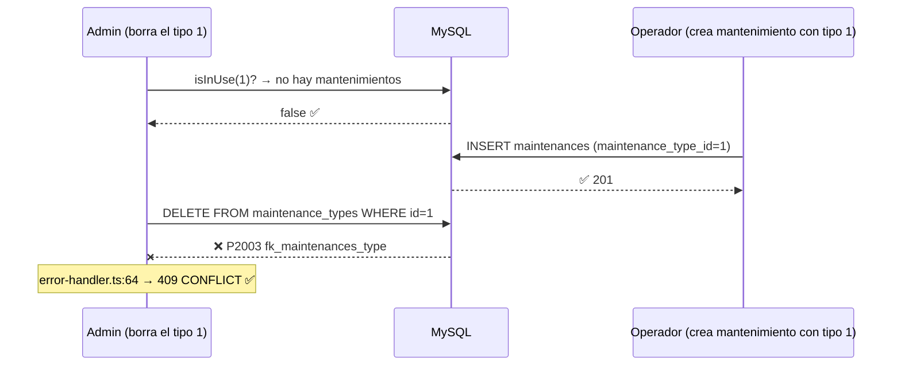
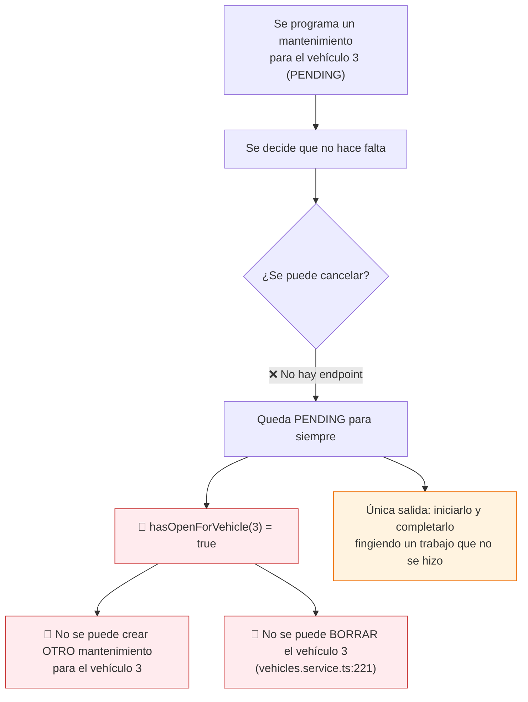
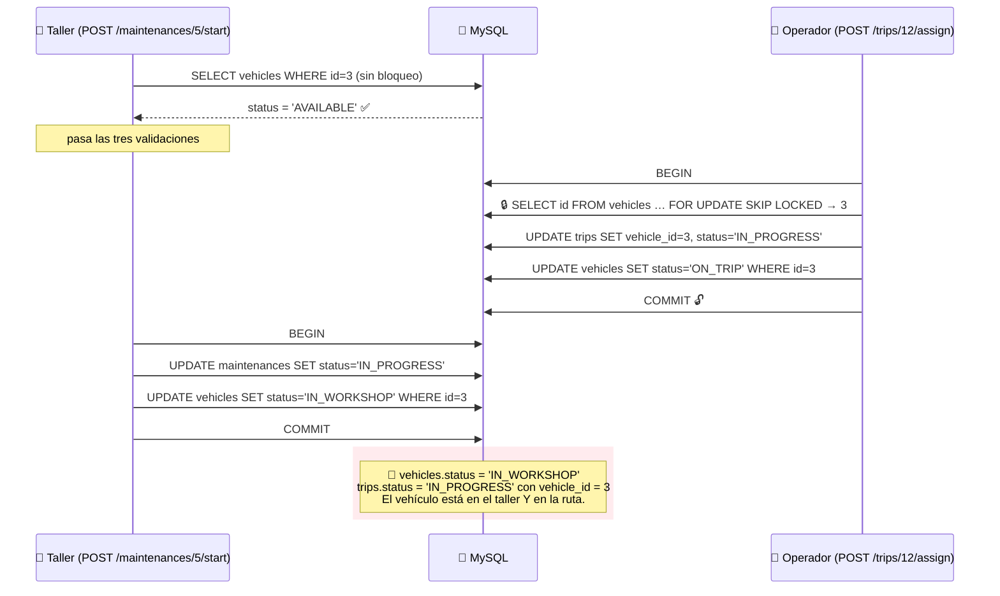
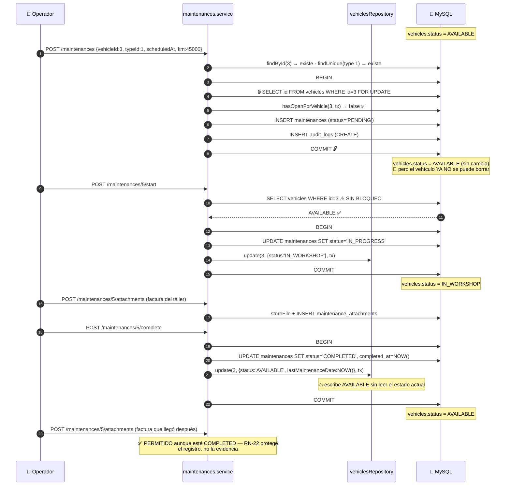
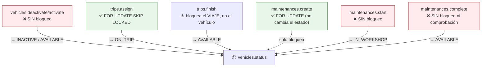

# Capítulo 13 — Mantenimiento: tipos e intervenciones

> **Prerrequisitos:** [Capítulo 3, §3.4.6-3.4.8](03-base-de-datos.md), [Capítulo 10](10-modulo-vehicles.md) (estado del vehículo) y [Capítulo 12](12-modulo-trips.md) (el patrón de bloqueo).
> **Archivos que se explican aquí:** los 6 de `modules/maintenance-types/` (403 líneas) y los 5 de `modules/maintenances/` (678 líneas). Total: 1.081 líneas, todas.
> **Al terminar** el lector entenderá la validación entre campos con `superRefine`, verá el **único módulo que protege una regla sin respaldo de la base de datos correctamente**, y descubrirá que ese mismo módulo **tiene la herramienta y no la usa** en su método más crítico.

---

## 13.1. Introducción

Estos dos módulos forman un par catálogo/operación:

- **`maintenance-types`** es un **catálogo**: define qué clases de mantenimiento existen y con qué umbrales. Lo administra el administrador y cambia poco.
- **`maintenances`** es la **operación**: cada intervención concreta sobre un vehículo concreto. Lo opera el operador y cambia constantemente.

Los temas del capítulo:

1. **Validación entre campos con `superRefine`.** `kmTarget >= kmAlert` no se puede expresar validando cada campo por separado. Es la primera aparición de este mecanismo.

2. **`PUT` con semántica de conjunto completo.** El catálogo se actualiza entero o nada, y el comentario explica por qué un `PATCH` parcial rompería la invariante.

3. **La regla protegida correctamente.** *"Un vehículo no puede tener dos mantenimientos abiertos"* no tiene respaldo en la base — igual que la de documentos (§11.2.3) — pero **aquí sí se protege con bloqueo**, y el comentario contrasta explícitamente ambos casos.

4. **Y el contraste incómodo:** el mismo módulo que sabe bloquear en `create` **no bloquea en `start`**, que es donde ocurre la transición de estado compartido con `trips`.

5. **Los adjuntos, deliberadamente de solo-agregar**, con un razonamiento sobre qué protege RN-22 que es el mejor comentario de negocio del proyecto.

---

## 13.2. Conceptos previos

### 13.2.1. Validación entre campos: por qué `refine` no alcanza

Zod valida **campo por campo** de forma natural:

```ts
kmAlert: z.coerce.number().int().positive(),
kmTarget: z.coerce.number().int().positive(),
```

🔴 **Pero `kmTarget >= kmAlert` es una relación ENTRE campos.** Ningún validador individual la puede expresar: al validar `kmTarget`, Zod no tiene acceso a `kmAlert`.

**Zod ofrece dos mecanismos para el objeto completo:**

| Mecanismo | Devuelve | Puede reportar varios errores | Puede asignar el error a un campo |
|:--|:--|:-:|:-:|
| `.refine(fn, {message})` | booleano | ❌ No | ⚠️ Con `path`, uno solo |
| **`.superRefine(fn, ctx)`** | nada; usa `ctx.addIssue` | ✅ **Sí** | ✅ **Sí, por cada error** |

💡 **Este módulo usa `superRefine` porque hay DOS invariantes independientes** (km y meses), y quien envíe ambas mal debe ver ambos errores. Con `.refine` habría que encadenarlos, y el primero que fallara cortaría.

**Y el `path` es lo que hace útil el error en un formulario:**

```ts
ctx.addIssue({ code: z.ZodIssueCode.custom, path: ['kmTarget'], message: '…' });
```

Sin `path`, el error saldría con `path: ''` y el frontend no sabría **qué campo** marcar en rojo. Con él, `error-handler.ts:31` produce `{"path":"kmTarget","message":"…"}` y la pantalla puede resaltar exactamente ese campo.

### 13.2.2. `PATCH` parcial vs `PUT` completo: cuándo cada uno

El proyecto usa `PATCH` en casi todos los módulos. **Aquí usa `PUT`**, y el comentario de `maintenance-types.schemas.ts:47-51` lo justifica:

> *"Update requires the full threshold set (PUT semantics for thresholds): partial threshold edits could silently break the target >= alert invariant across fields, so the catalog is always updated as a whole."*

🔴 **El problema concreto de un `PATCH` parcial con invariantes entre campos:**

Estado actual: `kmAlert = 10.000`, `kmTarget = 20.000`. ✅ Válido.

```http
PATCH /maintenance-types/1
{"kmAlert": 30000}
```

**El esquema solo ve `kmAlert: 30000`.** No tiene acceso a `kmTarget`, que sigue valiendo 20.000. **La validación pasa**, y el catálogo queda con `kmAlert (30.000) > kmTarget (20.000)` — un estado imposible.

**Las tres soluciones, y por qué esta es la mejor aquí:**

| Solución | Costo |
|:--|:--|
| **`PUT` con conjunto completo** (elegida) | El cliente envía los 6 campos siempre. Simple y a prueba de errores. |
| `PATCH` + revalidar en el servicio contra lo almacenado | Funciona, pero duplica la validación en dos lugares. |
| `PATCH` sin revalidar | 🔴 Permite el estado imposible. |

💡 **Y el módulo de mantenimientos usa la SEGUNDA opción** (`maintenances.service.ts:154-162`), porque ahí un `PUT` completo sería incómodo (hay más campos y muchos opcionales). **El mismo proyecto elige distinto según el caso, y ambas elecciones están justificadas por escrito.**

### 13.2.3. Reglas con y sin respaldo en la base de datos

Este capítulo permite completar un cuadro que los anteriores fueron construyendo:

| Regla | ¿La respalda la base? | ¿Se protege con bloqueo? | Resultado ante carrera |
|:--|:--|:--:|:--|
| Email único (§9.6.3) | ✅ `UNIQUE` | ❌ No | 409 correcto (P2002) |
| Patente única (§10.6.2) | ✅ `UNIQUE` | ❌ No | 409 correcto (P2002) |
| Nombre de tipo único | ✅ `UNIQUE` | ❌ No | 409 correcto (P2002) |
| Tipo en uso no borrable | ✅ `FK RESTRICT` | ❌ No | 409 correcto (P2003) |
| **Un documento activo por tipo** (§11.7.4) | ❌ **No** | ❌ **No** | 🔴 **Duplicado silencioso** |
| **Un mantenimiento abierto por vehículo** | ❌ **No** | ✅ **Sí** | ✅ 409 correcto |
| **Un viaje activo por chofer** (§12.6.5) | ❌ No | ✅ Sí | ✅ 409 correcto |
| **Al menos un admin activo** (§9.6.4) | ❌ No | ❌ **No** | 🔴 **Sistema bloqueado** |

💡 **La regla de oro que emerge: cuando la base NO puede respaldar la invariante, el bloqueo pesimista es obligatorio.** El proyecto lo cumple en 2 de 4 casos.

---

## 13.3. `maintenance-types` — el catálogo

### 13.3.1. Las rutas y el `PUT`

```ts
13 /**
14  * Reads: ADMIN + OPERATOR (the operator picks a type when registering a
15  * maintenance, P-OP-5). Catalog mutations: ADMIN.
16  */
19 maintenanceTypesRoutes.use(authenticate);
21 …get('/',    authorize('ADMIN','OPERATOR'), validate(listMaintenanceTypesQuerySchema,'query'), …list);
27 …get('/:id', authorize('ADMIN','OPERATOR'), validate(idParamSchema,'params'), …getById);
33 …post('/',   authorize('ADMIN'), validate(createMaintenanceTypeSchema), …create);
39 …put('/:id', authorize('ADMIN'), validate(idParamSchema,'params'), validate(updateMaintenanceTypeSchema), …update);
46 …delete('/:id', authorize('ADMIN'), validate(idParamSchema,'params'), …remove);
```

💡 **El operador puede LEER el catálogo pero no modificarlo.** Es la separación correcta: quien opera necesita elegir un tipo al registrar un mantenimiento; definir qué tipos existen y con qué umbrales es una decisión de política de flota.

**`PUT` en lugar de `PATCH`** — la razón está en §13.2.2, y es la única aparición de `PUT` en el proyecto junto con `PUT /drivers/:id/password` (§11.3). **Ambas por el mismo motivo: reemplazo completo, no modificación parcial.**

⚠️ **No hay endpoint para "desactivar" un tipo.** Solo borrar (si no está en uso) o dejarlo. Un tipo que ya no se usa pero tiene historia **queda en el catálogo para siempre**, apareciendo en el selector del formulario de mantenimientos. **Un campo `isActive` permitiría retirarlo sin perder la historia** — es la funcionalidad que falta.

### 13.3.2. `superRefine` y las dos invariantes

```ts
18 function validateThresholds(data: {…}, ctx: z.RefinementCtx): void {
24   if (data.kmTarget < data.kmAlert) {
25     ctx.addIssue({
26       code: z.ZodIssueCode.custom,
27       path: ['kmTarget'],
28       message: 'kmTarget must be greater than or equal to kmAlert',
29     });
30   }
31   if (
32     data.monthsAlert !== undefined &&
33     data.monthsTarget !== undefined &&
34     data.monthsTarget < data.monthsAlert
35   ) {
36     ctx.addIssue({ …, path: ['monthsTarget'], message: '…' });
37   }
42 }
```

**Las dos invariantes tienen tratamientos distintos, y la diferencia es correcta:**

| Invariante | Condición previa | Por qué |
|:--|:--|:--|
| `kmTarget >= kmAlert` | Ninguna | Ambos son **obligatorios** |
| `monthsTarget >= monthsAlert` | Ambos deben existir | Ambos son **opcionales** |

🔴 **Sin la comprobación de `!== undefined`, la segunda invariante fallaría de forma sutil.** Si solo se envía `monthsTarget: 6`, la comparación sería `6 < undefined` → **`false`** en JavaScript (toda comparación con `undefined` da `false`). **No lanzaría error**, así que en este caso concreto el resultado sería accidentalmente correcto — pero por la razón equivocada. Con `monthsAlert: 6` y `monthsTarget` ausente, sería `undefined < 6` → también `false`. **Funciona por accidente en ambos casos**, y la comprobación explícita lo convierte en intencional.

⚠️ **Lo que NO se valida: que ambos meses estén o ninguno.** Se puede crear un tipo con `monthsAlert: 3` y sin `monthsTarget`. **Es un umbral de aviso sin umbral de exigencia** — semánticamente incompleto. Un `superRefine` adicional lo cubriría.

**Línea 52 — la reutilización total del esquema**

```ts
export const updateMaintenanceTypeSchema = createMaintenanceTypeSchema;
```

💡 **Una línea que expresa la semántica de `PUT`:** actualizar exige exactamente lo mismo que crear. Sin `.optional()` en ningún campo, sin `.refine` de "al menos un campo".

**Y tiene una consecuencia elegante en el servicio** (`maintenance-types.service.ts:99-100`):

```ts
monthsAlert: dto.monthsAlert ?? null,
monthsTarget: dto.monthsTarget ?? null,
```

🔴 **Ausente significa "borrar el umbral temporal", no "no cambiarlo".** Es exactamente la semántica de `PUT`: lo que no se envía, no existe.

**Contrasta deliberadamente con `PATCH`**, donde ausente significa "no tocar" (§10.4). **Dos semánticas opuestas para la ausencia, cada una coherente con su verbo HTTP.**

⚠️ **Y es una trampa para el cliente.** Un frontend que envíe solo los campos "modificados" **borraría** los umbrales temporales sin querer. El comentario del esquema advierte, pero el comentario está en el backend y quien escribe el frontend puede no verlo. **Es el riesgo inherente a `PUT`**, y por eso la mayoría de las APIs modernas prefieren `PATCH` con revalidación.

### 13.3.3. `delete` y las dos capas de protección

```ts
120 /**
121  * Hard delete, only when unused: catalog rows without references carry no
122  * history (RN-20 targets entities with operational history). A referenced
123  * type is blocked here — and by the DB FK RESTRICT as a second layer.
124  */
125 async delete(id: number, actorId: number): Promise<void> {
126   const existing = await getExistingOrFail(id);
127   if (await maintenanceTypesRepository.isInUse(id)) {
128     throw new BusinessRuleError(
129       'This maintenance type is referenced by existing maintenances and cannot be deleted',
130     );
131   }
132   … transacción con delete + auditoría
```

💡 **El comentario declara explícitamente las DOS capas**, y es el único lugar del proyecto que lo hace:

| Capa | Mecanismo | Qué aporta |
|:--|:--|:--|
| 1 — Aplicación | `isInUse(id)` | **Mensaje claro**: dice *por qué* no se puede borrar |
| 2 — Base de datos | `fk_maintenances_type … ON DELETE RESTRICT` | **Garantía**: cubre la carrera |

🔴 **Y aquí la carrera SÍ está cubierta**, a diferencia de la de documentos (§11.7.4):



**El mensaje del 409 genérico** (*"This record is referenced by other records and cannot be deleted"*) **es peor que el específico**, pero el estado queda correcto.

💡 **Es la misma estructura que el email duplicado** (§9.6.3): comprobación previa para el mensaje, restricción de la base para la garantía. **Cuando existe una restricción declarativa, la comprobación en la aplicación es una mejora de experiencia, no una barrera de seguridad.**

**El borrado es FÍSICO**, y el criterio es el mismo que en viajes (§12.2.3): se borra físicamente lo que no tiene historia. Un tipo de catálogo sin uso **es una definición, no un hecho**.

🔴 **Lo que el borrado físico rompe: la auditoría.** El registro `DELETE` queda con `entity_id` apuntando a un tipo inexistente. El `previousData` conserva el nombre y los umbrales, así que la información no se pierde — pero la referencia sí. **Tercera aparición de la debilidad de la relación polimórfica** (§3.4.11).

### 13.3.4. El umbral que nadie usa

🔴 **Aquí se confirma y amplía el hallazgo de §4.7.5.**

**`kmTarget` está validado con cuidado** (`superRefine` garantiza `kmTarget >= kmAlert`), **expuesto en la API**, **editable por el administrador**… **y ninguna lógica del sistema lo lee.**

**Verificación:**

| Consumidor potencial | ¿Usa `kmTarget`? |
|:--|:--|
| `maintenances.service` (cálculo de `nextMaintenanceKm`) | ❌ **No** — el valor lo escribe el usuario a mano |
| `alerts.service` (umbral de alerta por km) | ❌ **No** — usa `_min: { kmAlert }` |
| Reportes | ❌ No |

💡 **`kmAlert` sí se usa** (`alerts.service.ts:133-134`), pero de una forma sorprendente: **el motor de alertas toma el MÍNIMO `kmAlert` de todos los tipos** y lo aplica globalmente, sin distinguir qué tipo corresponde a cada vehículo. Se analiza en el capítulo 14.

**Resultado: hay un campo del catálogo que el administrador configura cuidadosamente y que no afecta a nada.** Y una validación entre campos que protege una invariante entre un campo usado de forma global y otro que no se usa.

⚠️ **No es un bug** —nada falla— pero es **funcionalidad incompleta que aparenta estar completa**. Un administrador que ajuste `kmTarget` esperando cambiar el comportamiento del sistema no verá ningún efecto, y no tendrá forma de saber por qué.

---

## 13.4. `maintenances` — la operación

### 13.4.1. Las rutas y la máquina de estados

```ts
15 /**
16  * Maintenance operation is the Operator's job (P-OP-5); Admin has full
17  * access too. State transitions are explicit POST actions (Stage 1
18  * convention) so the C-6 state machine cannot be bypassed.
19  */
23 maintenancesRoutes.use(authenticate, authorize('ADMIN', 'OPERATOR'));
…
38 …post('/:id/start',    validate(idParamSchema,'params'), maintenancesController.start);
39 …post('/:id/complete', validate(idParamSchema,'params'), maintenancesController.complete);
44 …post('/:id/attachments', validate(idParamSchema,'params'), upload.single('file'), …addAttachment);
50 …get('/:id/attachments/:attachmentId', validate(attachmentParamsSchema,'params'), …downloadAttachment);
55 // Note: attachments are append-only (RN-22 integrity) — no delete/replace route.
```

**Línea 23 — permiso a nivel de router, como en `users`**

Todos los endpoints comparten el mismo permiso, así que se aplica una vez. **Es el patrón seguro** (§9.3): un endpoint nuevo queda protegido automáticamente.

🔴 **Lo que NO existe: `DELETE /maintenances/:id`.**

**Un mantenimiento no se puede cancelar ni borrar.** Y eso tiene una consecuencia en cadena que conviene desarrollar:



🔴 **Un mantenimiento programado por error bloquea el vehículo indefinidamente**, y la única salida por la API es **falsificar el registro**: iniciarlo y completarlo como si el trabajo se hubiera hecho. Eso escribe `lastMaintenanceDate` con una fecha falsa, lo que a su vez afecta al motor de alertas.

💡 **Es el mismo patrón que la ausencia de cancelación de viajes** (§12.3): el sistema modela el camino feliz y deja sin salida los casos de corrección. **Y aquí es peor**, porque la "solución" disponible corrompe datos en vez de solo bloquear recursos.

**Línea 55 — el comentario que documenta una ausencia**

```ts
// Note: attachments are append-only (RN-22 integrity) — no delete/replace route.
```

💡 **Documentar por qué algo NO existe es tan valioso como documentar lo que existe.** Sin este comentario, alguien agregaría el endpoint de borrado pensando que faltó por descuido.

### 13.4.2. `create` y el bloqueo bien aplicado

```ts
96  async create(dto: CreateMaintenanceDto, actorId: number): Promise<MaintenanceResponse> {
97    const vehicle = await vehiclesRepository.findById(dto.vehicleId);
98    if (!vehicle) throw new NotFoundError(`Vehicle ${dto.vehicleId} not found`);
99
100   const type = await prisma.maintenanceType.findUnique({
101     where: { id: dto.maintenanceTypeId },
102     select: { id: true },
103   });
104   if (!type) throw new NotFoundError(`Maintenance type ${dto.maintenanceTypeId} not found`);
105
106   const created = await prisma.$transaction(async (tx) => {
107     // Lock the vehicle row, then check for an open maintenance INSIDE the
108     // transaction: two concurrent creates for the same vehicle serialize
109     // here, so at most one open maintenance can exist (no DB UNIQUE backs
110     // this rule, unlike email/plate).
111     await maintenancesRepository.lockVehicle(dto.vehicleId, tx);
112     if (await maintenancesRepository.hasOpenForVehicle(dto.vehicleId, undefined, tx)) {
113       throw new ConflictError('This vehicle already has an open maintenance');
114     }
115     const maintenance = await maintenancesRepository.create({…}, tx);
126     await auditLogsService.record({…}, tx);
137   });
```

🔴 **Las líneas 107-114 son el ejemplo canónico del patrón de §13.2.3, y el comentario lo explica con precisión quirúrgica.**

> *"no DB UNIQUE backs this rule, **unlike email/plate**"*

💡 **El autor identificó exactamente la diferencia** entre las reglas que la base respalda y las que no, y aplicó bloqueo pesimista donde hacía falta. **Es el mismo reconocimiento que hace `trips.service.ts:169`** (*"no DB constraint backs 'one active trip/vehicle'"*).

**Y contrasta agudamente con `documents.service.ts:90`** (§11.7.4), donde la situación es **idéntica** —una regla de unicidad condicional sin respaldo en la base— y **no se aplica ningún bloqueo**. **El mismo proyecto, la misma clase de problema, dos tratamientos opuestos.**

**Línea 112 — `hasOpenForVehicle(vehicleId, undefined, tx)`**

El segundo parámetro es `excludeId` (`maintenances.repository.ts:61`), que aquí no aplica: al crear no hay nada que excluir. **Pasar `undefined` explícitamente es necesario** porque `tx` es el tercer parámetro posicional.

⚠️ **Es un olor de diseño menor:** una firma con tres parámetros posicionales donde el del medio suele ser `undefined`. Un objeto de opciones (`{ excludeId?, db? }`) sería más legible.

🔴 **Líneas 100-103: la violación de capas.**

```ts
const type = await prisma.maintenanceType.findUnique({ … });
```

**El servicio de mantenimientos consulta Prisma directamente**, sin pasar por `maintenanceTypesRepository`. Y se repite en la línea 148, dentro de `update`.

**Es exactamente la misma violación de `users.service.ts:126`** (§9.6.4), y con el mismo agravante: **el repositorio correcto existe y tiene el método** (`maintenanceTypesRepository.findById`).

**Las cuatro consecuencias, idénticas a las de §9.6.4:**

1. Si el catálogo incorporara borrado lógico (que es la funcionalidad faltante de §13.3.1), esta consulta **devolvería tipos retirados**.
2. Cambiar de ORM obliga a tocar este servicio.
3. No se puede testear con un repositorio falso.
4. Sienta precedente.

⚠️ **Segunda aparición del mismo antipatrón**, en un módulo que por lo demás es cuidadoso. **Sugiere que la regla arquitectónica no está automatizada** (no hay linter, §5.6) y depende de la memoria de cada autor.

### 13.4.3. `update` y la revalidación entre campos

```ts
154 // Cross-field invariant against effective values: the schema only sees
155 // fields present in this request, so a partial edit (only km, or only
156 // nextMaintenanceKm) is re-checked here against the stored record.
157 const effectiveKm = dto.km ?? existing.km;
158 const effectiveNextKm =
159   dto.nextMaintenanceKm !== undefined ? dto.nextMaintenanceKm : existing.nextMaintenanceKm;
160 if (effectiveNextKm !== null && effectiveNextKm < effectiveKm) {
161   throw new BusinessRuleError('nextMaintenanceKm must be greater than or equal to km');
162 }
```

💡 **Este bloque es la SEGUNDA solución al problema de §13.2.2**, y el comentario la justifica: el esquema no tiene acceso al registro almacenado, así que la revalidación tiene que ocurrir en el servicio.

**El concepto de "valor efectivo" merece nombrarse:**

```
valorEfectivo = el que llega en la petición, si vino; si no, el almacenado
```

**Línea 157 — `dto.km ?? existing.km`**

🔴 **`??` y no `||`**, porque `km` puede ser legítimamente **`0`** (un vehículo cero kilómetro). Con `||`, un `km: 0` sería descartado en favor del almacenado. **Tercera aparición del mismo pozo** en el manual (§1.2.6, §10.6.3).

**Líneas 158-159 — por qué NO se usa `??` para `nextMaintenanceKm`**

```ts
const effectiveNextKm =
  dto.nextMaintenanceKm !== undefined ? dto.nextMaintenanceKm : existing.nextMaintenanceKm;
```

🔴 **Aquí `??` NO serviría, y la diferencia es sutil pero decisiva.**

`nextMaintenanceKm` es `number | null | undefined` (§13.4.5), con tres significados:

| Valor | Significa |
|:--|:--|
| `undefined` | "no toques este campo" |
| **`null`** | **"borrá el próximo kilometraje"** |
| número | "ponelo en este valor" |

**Con `??`**: `null ?? existing` devolvería `existing` — **descartando la intención de borrar**. El usuario pide quitar el umbral y el sistema conserva el viejo.

**Con `!== undefined`**: `null` se preserva como `null`, y la comprobación de la línea 160 (`effectiveNextKm !== null`) lo salta correctamente.

💡 **Es la distinción entre "ausente" y "explícitamente nulo" aplicada con precisión**, y demuestra por qué el triple estado de §10.4 no es una sutileza académica: elegir el operador equivocado aquí produce un bug que el usuario percibe como "no me deja borrar el campo".

**Línea 144 — la única regla de estado**

```ts
if (existing.status === 'COMPLETED') {
  throw new BusinessRuleError('A completed maintenance cannot be edited');
}
```

🔴 **Es una LISTA NEGRA** (prohíbe `COMPLETED`), a diferencia de `trips.update` que usa lista blanca (§12.6.4).

**Consecuencia: un mantenimiento `IN_PROGRESS` SÍ se puede editar.** Se puede cambiar el kilometraje, el tipo y la fecha programada mientras el vehículo está en el taller.

💡 **Es razonable operativamente:** el taller descubre que hace falta más trabajo, o que el kilometraje real difiere del anotado. **Editar durante la intervención es normal; editar después de cerrarla es falsificar historia.**

⚠️ **Pero la lista negra tiene el riesgo habitual:** un estado nuevo (por ejemplo `CANCELLED`) sería editable por omisión.

### 13.4.4. `start`: el hueco del módulo

```ts
194 /**
195  * PENDING → IN_PROGRESS. Effect: vehicle AVAILABLE → IN_WORKSHOP (F-6).
196  * The vehicle must be AVAILABLE — a unit on a trip or already inactive
197  * cannot enter the workshop.
198  */
199 async start(id: number, actorId: number): Promise<MaintenanceResponse> {
200   const existing = await getExistingOrFail(id);
201   if (existing.status !== 'PENDING') {
202     throw new BusinessRuleError(`Only PENDING maintenances can be started (current: ${existing.status})`);
203   }
204   const vehicle = await vehiclesRepository.findById(existing.vehicleId);
205   if (!vehicle) throw new NotFoundError(`Vehicle ${existing.vehicleId} not found`);
206   if (vehicle.status !== 'AVAILABLE') {
207     throw new BusinessRuleError(
208       `Vehicle must be AVAILABLE to start maintenance (current: ${vehicle.status})`,
209     );
210   }
211
212   const updated = await prisma.$transaction(async (tx) => {
213     const maintenance = await maintenancesRepository.update(id, { status: 'IN_PROGRESS' }, tx);
214     await vehiclesRepository.update(existing.vehicleId, { status: 'IN_WORKSHOP' }, tx);
215     …
216   });
```

**Lo que hace bien:**

✅ **La comprobación de la línea 206 es la lista blanca correcta.** Exige `AVAILABLE` explícitamente, así que ni `ON_TRIP`, ni `INACTIVE`, ni un estado futuro pasarían.

✅ **El mensaje incluye el estado actual**, igual que en `vehicles.activate` (§10.6.4).

✅ **Las dos escrituras están en la misma transacción**, y la del vehículo pasa por `vehiclesRepository`, respetando las capas.

🔴 **Lo que hace mal: TODAS las validaciones ocurren FUERA de la transacción, y sin bloquear la fila del vehículo.**

**Y el agravante es que este mismo módulo TIENE el método `lockVehicle`** (`maintenances.repository.ts:80-82`) **y lo usa en `create`** (línea 111). **La herramienta está, en el mismo archivo, y no se aplica aquí.**

**La carrera concreta:**



**Las consecuencias en cadena:**

1. El vehículo figura en el taller mientras hace un viaje.
2. Al finalizar el viaje, `trips.finish` escribe `AVAILABLE` — **sacando el vehículo del taller sin que el mantenimiento haya terminado**.
3. Al completar el mantenimiento, se escribe `AVAILABLE` otra vez y `lastMaintenanceDate` — **sobre un trabajo que se hizo con el vehículo circulando**.

🔴 **Es exactamente el mismo escenario que `vehicles.deactivate`** (§10.6.4), y la ironía es la misma: **`trips` bloquea, `maintenances.create` bloquea, y `maintenances.start` no.**

**La corrección son cuatro líneas, usando código que ya existe en el archivo:**

```ts
// — corrección propuesta —
async start(id: number, actorId: number): Promise<MaintenanceResponse> {
  return prisma.$transaction(async (tx) => {
    const existing = await maintenancesRepository.findById(id, tx);
    if (!existing) throw new NotFoundError(`Maintenance ${id} not found`);
    if (existing.status !== 'PENDING') throw new BusinessRuleError(…);

    await maintenancesRepository.lockVehicle(existing.vehicleId, tx);   // ← ya existe
    const vehicle = await vehiclesRepository.findById(existing.vehicleId, tx);  // ← acepta tx
    if (!vehicle) throw new NotFoundError(…);
    if (vehicle.status !== 'AVAILABLE') throw new BusinessRuleError(…);

    // … las dos escrituras, ahora con la garantía del bloqueo
  });
}
```

💡 **Y `vehiclesRepository.findById` YA acepta el parámetro `db`** (§10.5). **Toda la infraestructura está lista.**

### 13.4.5. `complete` y el escritor incondicional

```ts
231 /**
232  * IN_PROGRESS → COMPLETED. Effects (RN-9, F-6): vehicle IN_WORKSHOP →
233  * AVAILABLE, lastMaintenanceDate updated, maintenance moves to history.
234  */
235 async complete(id: number, actorId: number): Promise<MaintenanceResponse> {
236   const existing = await getExistingOrFail(id);
237   if (existing.status !== 'IN_PROGRESS') { throw new BusinessRuleError(…); }
243   const now = new Date();
244   const updated = await prisma.$transaction(async (tx) => {
245     const maintenance = await maintenancesRepository.update(id, { status:'COMPLETED', completedAt: now }, tx);
250     // RN-9: completing the maintenance unblocks the vehicle.
251     await vehiclesRepository.update(existing.vehicleId,
252       { status: 'AVAILABLE', lastMaintenanceDate: now }, tx);
256     await auditLogsService.record({…}, tx);
267     return maintenance;
268   });
```

🔴 **La línea 251 escribe `status: 'AVAILABLE'` INCONDICIONALMENTE, sin leer el estado actual del vehículo.**

**Es exactamente el comportamiento que `vehicles.deactivate` documenta y previene** (§10.6.4):

> *"A vehicle in the workshop has an open maintenance whose completion would move it back to AVAILABLE, **silently overwriting an INACTIVE set here**."*

💡 **La prohibición de desactivar un vehículo `IN_WORKSHOP` existe precisamente porque ESTA línea no comprueba nada.** Es una solución de un módulo a un problema causado por otro.

⚠️ **Y esa solución es incompleta**, porque solo cubre el camino de `deactivate`. **No cubre la carrera de `start`** descrita arriba: si el vehículo terminó en `ON_TRIP` por la carrera, `complete` lo pondría en `AVAILABLE` con un viaje en curso.

**La defensa más robusta sería que `complete` comprobara:**

```ts
// — mejora propuesta —
await maintenancesRepository.lockVehicle(existing.vehicleId, tx);
const vehicle = await vehiclesRepository.findById(existing.vehicleId, tx);
if (vehicle?.status !== 'IN_WORKSHOP') {
  throw new BusinessRuleError(
    `El vehículo no está en el taller (estado actual: ${vehicle?.status}). ` +
    `Verificá su situación antes de cerrar el mantenimiento.`,
  );
}
```

**Esto haría innecesaria la regla de `vehicles.deactivate`** y cerraría la carrera de `start` simultáneamente. **Una comprobación en el lugar correcto reemplaza a dos parches en lugares equivocados.**

**Línea 253 — `lastMaintenanceDate: now`**

⚙️ **`now` es un `DateTime` completo y la columna es `DATE`** (`schema.prisma:146`). **Prisma trunca la hora al escribir.** Correcto, pero implícito: el valor guardado es `2026-08-03`, no `2026-08-03T18:42:11`.

🔴 **Y `lastMaintenanceDate` es la fecha de HOY, no `scheduledAt`.** Es correcto —el mantenimiento se hizo hoy, no cuando se programó— pero significa que si alguien registra hoy un mantenimiento hecho la semana pasada, la fecha queda mal. **No hay forma de registrar un mantenimiento retroactivo.**

🔴 **Lo que `complete` NO hace: calcular `nextMaintenanceKm`.**

**Esto confirma definitivamente el hallazgo de §4.7.5.** `nextMaintenanceKm` **es un campo de entrada del usuario** (`maintenances.schemas.ts:39`), no un valor derivado. `complete` no lo toca.

**El circuito completo, verificado:**

| Campo | Origen | Consumidor |
|:--|:--|:--|
| `maintenanceType.kmTarget` | Configurado por el admin | 🔴 **Nadie** |
| `maintenanceType.kmAlert` | Configurado por el admin | `alerts.service` (como **mínimo global**) |
| `maintenance.nextMaintenanceKm` | **Escrito a mano** por el operador | 🔴 **Nadie** |
| `vehicle.lastMaintenanceDate` | `complete` | `alerts.service` (línea base para los km) |

💡 **Dos de los cuatro campos del circuito de mantenimiento preventivo no se leen desde ningún lado.** El sistema los pide, los valida con `superRefine`, los muestra — y no los usa. **El mantenimiento preventivo por kilometraje funciona con una heurística global (§14) en vez de con la configuración por tipo que el modelo sugiere.**

### 13.4.6. `addAttachment` y el mejor comentario de negocio del proyecto

```ts
272 /**
273  * Attach a receipt (F-9). The upload is validated in memory (size/MIME);
274  * here we persist it to disk and record its metadata. If the DB write
275  * fails, the just-written file is removed so no orphan is left behind.
276  *
277  * Intentionally allowed even when the maintenance is COMPLETED: RN-22
278  * protects the maintenance RECORD (km, dates, type, status), not its
279  * supporting documentation. A receipt is additive evidence — the invoice
280  * usually arrives after the work is closed — not a mutation of history.
281  * Attachments are append-only: they can be added but never edited or
282  * deleted (no delete/replace endpoint exists). If one is ever added, it
283  * must be restricted, to preserve the historical integrity of the record.
284  */
```

💡 **Doce líneas de comentario para 35 de código, y cada afirmación aporta.**

**El razonamiento central:**

> *"RN-22 protects the maintenance RECORD (km, dates, type, status), **not its supporting documentation**. A receipt is additive evidence — the invoice usually arrives after the work is closed — not a mutation of history."*

🔴 **Es una distinción conceptual que la mayoría de los sistemas se pierde.** La reacción instintiva ante "un mantenimiento completado es inmutable" sería bloquear **todo**, incluidos los adjuntos. **Y eso rompería el flujo real del negocio:** la factura del taller llega días después de que el trabajo terminó.

**La distinción correcta:**

| Qué | ¿Inmutable tras completar? | Por qué |
|:--|:--|:--|
| El **registro** (km, fechas, tipo, estado) | ✅ **Sí** | Cambiarlo falsifica lo que ocurrió |
| La **evidencia** (comprobantes) | ❌ **No** | Agregar evidencia **fortalece** el registro |

**Y la salvaguarda: solo se puede AGREGAR.**

> *"Attachments are append-only: they can be added but never edited or deleted."*

💡 **Solo-agregar es lo que hace segura la excepción.** Si se pudieran borrar adjuntos, alguien podría eliminar la factura que contradice el registro. **Agregar nunca destruye; borrar sí.** Es el mismo principio que hace inmutable a `audit_logs`.

**Y la advertencia a futuros mantenedores:**

> *"If one is ever added, it must be restricted, to preserve the historical integrity of the record."*

⚠️ **Anticipa que alguien va a querer agregar el endpoint de borrado** y deja escrito que, si se agrega, debe restringirse. **Es documentación defensiva contra decisiones futuras.**

**El código: la segunda compensación de archivos del proyecto**

```ts
const stored = await storeFile('maintenances', file.originalname, file.buffer);
try {
  await prisma.$transaction(async (tx) => { … });
} catch (err) {
  await safeUnlink(stored.filePath); // roll back the just-written file
  throw err;
}
return toResponse((await maintenancesRepository.findById(id))!);
```

✅ **Idéntico en estructura a `documents.service.ts:96-127`** (§11.7.3): escribir el archivo, transacción, y compensar en el `catch` con relanzamiento.

⚠️ **Y con la misma limitación:** no cubre que el proceso muera entre `storeFile` y el `INSERT` (§6.7.2).

🔴 **Y con una limitación adicional que `documents` no tiene: los archivos de mantenimiento se PIERDEN.**

`maintenance_attachments` usa `ON DELETE CASCADE` (§3.4.8). Si se borrara un mantenimiento —cosa que hoy no se puede hacer por la API, pero sí desde SQL o desde una migración— **MySQL borra las filas y los archivos quedan huérfanos en disco, sin ninguna referencia**.

**Contrasta con `driver_documents`, que usa borrado lógico y conserva la referencia** (§11.7.5). **Dos políticas opuestas para dos tipos de archivo, y solo una está justificada por escrito.**

**Línea 319 — la lectura extra**

```ts
return toResponse((await maintenancesRepository.findById(id))!);
```

Cuarta consulta, fuera de la transacción, solo para armar la respuesta con la lista de adjuntos actualizada. **Mismo patrón (y mismo costo) que `drivers.create`** (§11.6.2).

### 13.4.7. `getAttachment` y el acotamiento del recurso

```ts
322 /**
323  * Resolve an attachment for download: … Scoped to the maintenance so an
326  * attachment id from another record cannot be fetched through this maintenance.
327  */
328 async getAttachment(maintenanceId: number, attachmentId: number): Promise<{…}> {
332   const attachment = await maintenancesRepository.findAttachment(attachmentId, maintenanceId);
333   if (!attachment) {
334     throw new NotFoundError(`Attachment ${attachmentId} not found for maintenance ${maintenanceId}`);
337   }
```

💡 **`findAttachment(attachmentId, maintenanceId)` recibe AMBOS ids y filtra por los dos.**

🔴 **Sin el segundo, habría un IDOR:** `GET /maintenances/1/attachments/999` devolvería el adjunto 999 aunque perteneciera al mantenimiento 42.

**Es el mismo mecanismo que `getOwnedDocumentOrFail`** (§11.7.2), y aquí también devuelve **404 y no 403** — la política correcta, que no confirma la existencia del recurso ajeno.

⚠️ **Nótese que este módulo NO tiene autorización por recurso**, a diferencia de documentos. **No hace falta:** solo `ADMIN` y `OPERATOR` acceden al módulo (línea 23), y ambos ven toda la flota. **No hay "mantenimientos propios".**

---

## 13.5. Flujo interno

### 13.5.1. El ciclo completo y su acoplamiento con el vehículo



### 13.5.2. Los tres escritores de `vehicles.status`, revisados



🔴 **Cinco escrituras sobre el mismo campo, y solo UNA (la de `trips.assign`) toma el bloqueo antes de escribir.**

💡 **La conclusión del análisis acumulado de los capítulos 10, 12 y 13: el proyecto entiende el problema del estado compartido, tiene la herramienta (`lockVehicle`, `FOR UPDATE`), la aplica en dos lugares, y la omite en cuatro.** No es desconocimiento: es aplicación inconsistente.

---

## 13.6. Ejemplos

### Ejemplo 1 — Las dos invariantes de `superRefine`

```http
POST /api/v1/maintenance-types
{"name":"Preventivo X","description":"Prueba","kmAlert":20000,"kmTarget":10000,
 "monthsAlert":12,"monthsTarget":6}
```

```http
HTTP/1.1 400 Bad Request

{"error":{"code":"VALIDATION_ERROR","message":"Invalid request data","details":[
  {"path":"kmTarget","message":"kmTarget must be greater than or equal to kmAlert"},
  {"path":"monthsTarget","message":"monthsTarget must be greater than or equal to monthsAlert"}
]}}
```

💡 **LOS DOS errores, cada uno con su `path`.** Con `.refine` encadenado solo se vería el primero. El frontend puede marcar ambos campos en rojo.

### Ejemplo 2 — La trampa de `PUT`

```bash
# Estado inicial del tipo 1
curl .../maintenance-types/1 -H "Authorization: Bearer $ADMIN"
# → {"kmAlert":10000,"kmTarget":20000,"monthsAlert":3,"monthsTarget":6}

# Un cliente "actualiza solo lo que cambió"
curl -X PUT .../maintenance-types/1 -H "Authorization: Bearer $ADMIN" \
  -H 'Content-Type: application/json' \
  -d '{"name":"Preventivo menor","description":"Cambio de aceite","kmAlert":12000,"kmTarget":24000}'
```

```sql
SELECT name, km_alert, km_target, months_alert, months_target
  FROM maintenance_types WHERE id = 1;
```

| name | km_alert | km_target | months_alert | months_target |
|:--|--:|--:|:--|:--|
| Preventivo menor | 12000 | 24000 | **NULL** | **NULL** |

🔴 **Los umbrales temporales se BORRARON**, aunque el cliente no los mencionó. **Es la semántica de `PUT` funcionando exactamente como se documentó** — y exactamente como un cliente distraído no espera.

### Ejemplo 3 — La regla protegida por bloqueo

```bash
# El vehículo 1 no tiene mantenimientos abiertos. Dos creaciones simultáneas:
for i in 1 2; do
  curl -X POST .../maintenances -H "Authorization: Bearer $OPERADOR" \
    -H 'Content-Type: application/json' \
    -d '{"vehicleId":1,"maintenanceTypeId":1,"scheduledAt":"2026-08-10","km":45000}' &
done
wait
```

```sql
SELECT COUNT(*) FROM maintenances
 WHERE vehicle_id = 1 AND status IN ('PENDING','IN_PROGRESS');
```

✅ **Resultado esperado: 1.** Una petición devolvió 201, la otra **409** *"This vehicle already has an open maintenance"*.

🔴 **Compárese con el ejemplo 4 de §11.9** (documentos), donde la misma prueba produce **2 filas y ningún error**. **La misma clase de regla, dos tratamientos.**

### Ejemplo 4 — Reproducir la carrera de `start`

```bash
# Vehículo 3 AVAILABLE, mantenimiento 5 PENDING para ese vehículo,
# viaje 13 PENDING_ASSIGNMENT

curl -X POST .../maintenances/5/start -H "Authorization: Bearer $OPERADOR" &
curl -X POST .../trips/13/assign -H "Authorization: Bearer $OPERADOR" \
     -H 'Content-Type: application/json' -d '{"driverId":3}' &
wait
```

```sql
SELECT v.id, v.status AS vehiculo,
       m.status AS mantenimiento,
       t.status AS viaje
  FROM vehicles v
  LEFT JOIN maintenances m ON m.vehicle_id = v.id AND m.status = 'IN_PROGRESS'
  LEFT JOIN trips t        ON t.vehicle_id = v.id AND t.status = 'IN_PROGRESS'
 WHERE v.id = 3;
```

🔴 **Si aparece una fila con `vehiculo='IN_WORKSHOP'`, `mantenimiento='IN_PROGRESS'` Y `viaje='IN_PROGRESS'`, la carrera se reprodujo:** el vehículo está simultáneamente en el taller y en la ruta.

**Ambas peticiones devolvieron 200.**

### Ejemplo 5 — Verificar que el circuito de umbrales está incompleto

```bash
# Cambiar kmTarget del tipo 1 de 20.000 a 500
curl -X PUT .../maintenance-types/1 -H "Authorization: Bearer $ADMIN" \
  -H 'Content-Type: application/json' \
  -d '{"name":"Preventivo menor","description":"x","kmAlert":400,"kmTarget":500}'

# Ejecutar el motor de alertas
curl -X POST .../alerts/evaluate -H "Authorization: Bearer $ADMIN"
```

```sql
SELECT alert_type, description FROM alerts WHERE alert_type LIKE 'MAINTENANCE%';
```

⚠️ **El comportamiento cambia por `kmAlert`** (que el motor usa como mínimo global), **no por `kmTarget`**, que sigue sin ser leído por nadie. Bajar solo `kmTarget` **no produce ningún efecto observable**.

### Ejemplo 6 — Agregar un comprobante a un mantenimiento cerrado

```bash
# El mantenimiento 1 está COMPLETED (seed.ts:240-251)
curl -X POST .../maintenances/1/attachments \
  -H "Authorization: Bearer $OPERADOR" \
  -F "file=@factura-taller.pdf"
```

```http
HTTP/1.1 200 OK
{"data":{"id":1,"status":"COMPLETED", …,"attachments":[{"id":7,"fileName":"factura-taller.pdf", …}]}}
```

✅ **Permitido deliberadamente**, y el registro (`km`, `status`, `completedAt`) sigue intacto. **La evidencia crece; la historia no cambia.**

```bash
# Intentar editar el registro sí falla:
curl -X PATCH .../maintenances/1 -H "Authorization: Bearer $OPERADOR" \
  -H 'Content-Type: application/json' -d '{"km": 99999}'
# → 422 "A completed maintenance cannot be edited"
```

---

## 13.7. Resumen

1. **`superRefine` permite validar relaciones ENTRE campos** y reportar varios errores con su `path`, para que el formulario marque el campo correcto.

2. **El catálogo usa `PUT` con conjunto completo** porque un `PATCH` parcial podría romper `kmTarget >= kmAlert` sin que el esquema lo detecte. **Ausente significa "borrar", no "no tocar"** — la trampa inherente a `PUT`.

3. **`maintenance-types.delete` tiene DOS capas explícitas:** comprobación en la aplicación (mensaje claro) y `FK RESTRICT` en la base (garantía ante carreras). Es el modelo correcto cuando la base puede respaldar la regla.

4. **`maintenances.create` protege con bloqueo una regla que la base NO respalda**, y el comentario contrasta explícitamente con email/patente. **Es el tratamiento correcto**, y contrasta con documentos (§11.7.4), donde la misma situación no se protege.

5. **Los adjuntos son de solo-agregar y se permiten sobre mantenimientos cerrados.** RN-22 protege el **registro**, no la **evidencia** — la factura del taller llega después. Es la mejor distinción conceptual del proyecto.

6. **`??` vs `!== undefined` en `update`:** el primero para `km` (donde `0` es válido), el segundo para `nextMaintenanceKm` (donde `null` significa "borrar"). Elegir mal produce bugs opuestos.

7. **Nueve hallazgos concretos:**

   | # | Hallazgo | Gravedad |
   |:-:|:--|:--|
   | 1 | 🔴 **`start` no bloquea el vehículo**, aunque el módulo **tiene `lockVehicle` y lo usa en `create`**. Un vehículo puede quedar simultáneamente `IN_WORKSHOP` y con un viaje `IN_PROGRESS`. | **Alta** |
   | 2 | 🔴 **`complete` escribe `AVAILABLE` sin leer el estado actual.** Es la causa de que `vehicles.deactivate` tenga que prohibir desactivar un vehículo en el taller — un parche en otro módulo para un problema de este. Y no cubre la carrera de `start`. | **Alta** |
   | 3 | 🔴 **No existe cancelar/borrar un mantenimiento.** Uno programado por error **bloquea el vehículo indefinidamente** (no se puede crear otro, no se puede borrar el vehículo), y la única salida por la API es **falsificar el registro** iniciándolo y completándolo. | **Alta** |
   | 4 | 🔴 **`kmTarget` y `nextMaintenanceKm` no los lee NADIE.** Se validan con `superRefine`, se exponen, se configuran — y no afectan a nada. El mantenimiento preventivo funciona con una heurística global (`min(kmAlert)`) en vez de con la configuración por tipo. | Media |
   | 5 | 🔴 **Violación de capas:** `create` (línea 100) y `update` (línea 148) consultan `prisma.maintenanceType` directamente, existiendo `maintenanceTypesRepository`. Segunda aparición del antipatrón (§9.6.4). | Media |
   | 6 | ⚠️ **No se puede retirar un tipo del catálogo** sin borrarlo. Un tipo con historia queda en el selector para siempre. Falta `isActive`. | Media |
   | 7 | ⚠️ **`maintenance_attachments` usa `CASCADE`** y perdería los archivos en disco, a diferencia de `driver_documents`, que conserva la referencia. Dos políticas opuestas, una sola justificada. | Baja |
   | 8 | ⚠️ **No se valida que `monthsAlert` y `monthsTarget` estén ambos o ninguno.** Se puede configurar un aviso temporal sin umbral de exigencia. | Baja |
   | 9 | ⚠️ **No hay registro retroactivo:** `lastMaintenanceDate` siempre es hoy, no `scheduledAt`. Un mantenimiento hecho la semana pasada y cargado hoy queda con la fecha equivocada. | Baja |

---

## 13.8. Preguntas de repaso

1. ¿Por qué `kmTarget >= kmAlert` necesita `superRefine` y no se puede validar campo por campo?
2. ¿Cuál es la diferencia entre `.refine` y `.superRefine`? ¿Por qué este módulo necesita la segunda?
3. Explicar por qué el catálogo usa `PUT` y no `PATCH`. Construir el ejemplo del estado imposible que un `PATCH` permitiría.
4. En `PUT`, ¿qué significa que `monthsAlert` esté ausente? ¿Y en `PATCH`? ¿Por qué son opuestos?
5. `maintenance-types.delete` tiene dos capas de protección. ¿Cuál da el mensaje y cuál da la garantía? ¿Qué pasa en la carrera?
6. ¿Por qué `maintenances.create` bloquea el vehículo y `maintenance-types.delete` no bloquea nada? ¿Cuál es el criterio?
7. Comparar `maintenances.create` con `documents.create` (§11.7.4). Misma clase de regla, ¿por qué distinto tratamiento? ¿Cuál es correcto?
8. En `update`, ¿por qué `dto.km ?? existing.km` pero `dto.nextMaintenanceKm !== undefined ? … : …`? ¿Qué bug produciría usar `??` en el segundo?
9. `start` valida que el vehículo esté `AVAILABLE`. ¿Es suficiente? Describir la carrera y por qué es especialmente llamativa en este módulo.
10. `complete` escribe `AVAILABLE` incondicionalmente. ¿Qué regla de otro módulo existe por culpa de eso? ¿Qué caso sigue sin cubrir?
11. ¿Por qué se permite agregar comprobantes a un mantenimiento `COMPLETED` si RN-22 dice que es inmutable?
12. ¿Por qué los adjuntos son de solo-agregar? ¿Qué se rompería si se pudieran borrar?
13. Se programa un mantenimiento por error. Enumerar todo lo que queda bloqueado y cuál es la única salida por la API.
14. Rastrear el circuito completo de `kmTarget`: quién lo escribe, quién lo valida, quién lo lee.

<details>
<summary><strong>Respuestas</strong></summary>

1. Porque es una **relación entre dos campos**, no una propiedad de uno solo. Al validar `kmTarget`, Zod ejecuta los validadores de ese campo **en aislamiento**: no tiene acceso a `kmAlert`. Solo un validador a nivel del objeto completo (`refine` o `superRefine`) ve ambos valores a la vez.

2. **`.refine`** devuelve un booleano, produce **un solo error** y solo puede asignarle un `path`. **`.superRefine`** recibe un contexto y puede llamar a `ctx.addIssue` **tantas veces como haga falta**, cada una con su propio `path` y mensaje. Este módulo tiene **dos invariantes independientes** (km y meses); con `.refine` encadenado, el primero que fallara cortaría y el usuario vería un solo error, teniendo que reenviar para descubrir el segundo.

3. Porque los umbrales tienen una invariante **entre campos** que el esquema solo puede verificar si ve **todos** los valores. Ejemplo: estado `kmAlert=10000, kmTarget=20000` (válido). Un `PATCH {"kmAlert": 30000}` haría que el esquema viera **solo** `kmAlert=30000` —sin acceso a `kmTarget`— y la validación pasaría, dejando `kmAlert (30.000) > kmTarget (20.000)`: un catálogo imposible.

4. En **`PUT`**, ausente significa **"borrá el umbral temporal"**: el servicio hace `dto.monthsAlert ?? null`, escribiendo `NULL`. En **`PATCH`**, ausente significa **"no toques este campo"**: Prisma ignora los `undefined`. **Son opuestos porque los verbos lo son:** `PUT` reemplaza el recurso completo (lo que no se envía, no existe); `PATCH` aplica un cambio parcial (lo que no se envía, se conserva).

5. **La comprobación `isInUse` da el mensaje claro** (*"is referenced by existing maintenances"*); **la `FK RESTRICT` da la garantía**. En la carrera —el admin comprueba, un operador crea un mantenimiento con ese tipo, el admin borra— el `DELETE` choca contra la clave foránea, Prisma lanza `P2003`, y `error-handler.ts:64` lo traduce a **409** con un mensaje genérico. **El estado queda correcto; solo el mensaje es peor.**

6. **El criterio es si la base puede respaldar la regla.** "Un tipo en uso no se borra" **se puede expresar** como `FK RESTRICT`, así que la base es la última línea de defensa y el bloqueo sería redundante. "Un vehículo no tiene dos mantenimientos abiertos" **no se puede expresar** en SQL (es una invariante sobre un conjunto filtrado de filas), así que **el bloqueo pesimista es la única defensa posible**.

7. **Son la misma clase de regla:** unicidad condicional sin respaldo en la base. `maintenances.create` **bloquea el vehículo y comprueba dentro de la transacción**; `documents.create` **comprueba fuera y no bloquea nada**. **El de mantenimientos es el correcto**: la prueba de concurrencia produce 409 en uno y dos filas duplicadas sin error en el otro. La única diferencia es que el autor de mantenimientos identificó la ausencia de respaldo y actuó en consecuencia.

8. Porque los dos campos tienen **dominios de valores distintos**. `km` puede ser legítimamente **`0`** (vehículo cero kilómetro), y `0` es *falsy* — pero `??` solo reemplaza ante `null`/`undefined`, así que funciona correctamente. `nextMaintenanceKm` es `number | null | undefined`, donde **`null` significa "borrar el umbral"**: con `??`, `null ?? existing` devolvería el valor almacenado, **descartando la intención de borrar**. El usuario pediría quitar el campo y el sistema lo conservaría.

9. **No es suficiente**, porque la lectura ocurre **fuera de la transacción y sin bloquear la fila**. Entre la comprobación y la escritura, `trips.assign` puede tomar el vehículo (con `FOR UPDATE SKIP LOCKED`) y ponerlo `ON_TRIP`; después `start` escribe `IN_WORKSHOP` encima. **Resultado: el vehículo está en el taller y en la ruta simultáneamente.** Es especialmente llamativo porque **`maintenances.repository` TIENE el método `lockVehicle` y `create` lo usa** — la herramienta está en el mismo archivo, cuatro líneas más arriba, y no se aplica.

10. **La prohibición de `vehicles.deactivate` sobre vehículos `IN_WORKSHOP`** (§10.6.4) existe exactamente por eso: si se pudiera desactivar, `complete` escribiría `AVAILABLE` encima y **la baja del administrador se perdería sin aviso**. **Sigue sin cubrir la carrera de `start`**: si el vehículo terminó en `ON_TRIP` por esa carrera, `complete` lo pondría `AVAILABLE` con un viaje en curso. La defensa robusta sería que `complete` comprobara que el vehículo está efectivamente `IN_WORKSHOP` antes de escribir.

11. Porque **RN-22 protege el REGISTRO, no la EVIDENCIA**. El registro son los hechos (km, fechas, tipo, estado): cambiarlos falsificaría lo que ocurrió. Los comprobantes son **evidencia aditiva**: la factura del taller normalmente llega días después de cerrado el trabajo, y agregarla **fortalece** el registro en vez de alterarlo. Bloquear los adjuntos por coherencia superficial rompería el flujo real del negocio.

12. Porque **agregar nunca destruye; borrar sí**. Si se pudieran borrar adjuntos, alguien podría eliminar la factura que contradice el registro —por ejemplo, una que muestre un kilometraje distinto al anotado— destruyendo evidencia. **Solo-agregar es lo que hace segura la excepción a RN-22.** Es el mismo principio que hace inmutable a `audit_logs`.

13. **Queda bloqueado:** (a) crear otro mantenimiento para ese vehículo (`hasOpenForVehicle` lo impide); (b) **borrar el vehículo** (`vehicles.service.ts:221` comprueba `hasOpenForVehicle`); (c) el mantenimiento en sí, que queda `PENDING` para siempre. **La única salida por la API es iniciarlo y completarlo**, lo que **falsifica el registro**: escribe `completedAt` y `lastMaintenanceDate` de un trabajo que nunca se hizo, afectando además al motor de alertas.

14. **Lo escribe** el administrador vía `POST`/`PUT /maintenance-types`. **Lo valida** `superRefine` garantizando `kmTarget >= kmAlert`. **Lo lee: NADIE.** `maintenances.complete` no calcula `nextMaintenanceKm` (es entrada manual del operador), y `alerts.service.ts:133-134` usa `_min: { kmAlert }` como umbral global, sin tocar `kmTarget`. **Es un campo del catálogo cuidadosamente configurado y validado que no afecta a ningún comportamiento del sistema.**

</details>

---

## 13.9. Ejercicios propuestos

**Nivel 1 — Observación**

1. Crear un tipo con ambas invariantes violadas y verificar que se reportan los dos errores con su `path`.
2. Reproducir la **trampa de `PUT`** (ejemplo 2) y confirmar que los meses se borran.
3. Recorrer el ciclo completo de un mantenimiento anotando el estado del vehículo tras cada paso.
4. Agregar un comprobante a un mantenimiento `COMPLETED` y después intentar editar su `km`. Comparar las dos respuestas.

**Nivel 2 — Verificación de los hallazgos**

5. Reproducir el **ejemplo 3** (regla protegida) y compararlo con el ejemplo 4 de §11.9 (regla sin proteger). Documentar la diferencia.
6. Reproducir la **carrera de `start`** (ejemplo 4) con 30 intentos concurrentes.
7. Verificar el **hallazgo 4**: cambiar `kmTarget` a un valor extremo, ejecutar `/alerts/evaluate` y confirmar que no cambia nada. Después cambiar `kmAlert` y confirmar que sí.
8. Programar un mantenimiento por error e intentar, por la API, deshacerlo, borrar el vehículo, o crear otro mantenimiento. Documentar los tres bloqueos.
9. Ejecutar `grep -rn "prisma\.[a-z]" backend/src/modules/*/*.service.ts` y contar las violaciones de capa en todo el proyecto.

**Nivel 3 — Corrección**

10. Agregar `lockVehicle` + relectura a `start`, usando `maintenancesRepository.lockVehicle` y `vehiclesRepository.findById(id, tx)`. Verificar con el ejercicio 6.
11. Agregar a `complete` la comprobación de que el vehículo está `IN_WORKSHOP`. Después evaluar si eso permite **eliminar** la regla de `vehicles.deactivate` (§10.6.4).
12. Implementar `DELETE /maintenances/:id` restringido a `PENDING`, en simetría con `DELETE /trips/:id`. Verificar que desbloquea el vehículo.
13. Implementar el cálculo automático de `nextMaintenanceKm = km + type.kmTarget` en `complete`, y evaluar si `nextMaintenanceKm` debería seguir siendo editable.
14. Reemplazar las dos consultas directas a `prisma.maintenanceType` por `maintenanceTypesRepository.findById`.
15. Agregar `isActive` al catálogo de tipos, filtrar el listado por defecto, y verificar que un tipo retirado desaparece del selector sin romper el historial.
16. Agregar la validación de que `monthsAlert` y `monthsTarget` estén ambos o ninguno, con un mensaje claro.

---

**Anterior:** [Capítulo 12 — El módulo de viajes](12-modulo-trips.md) · **Siguiente:** Capítulo 14 — El motor de alertas *(pendiente)*
