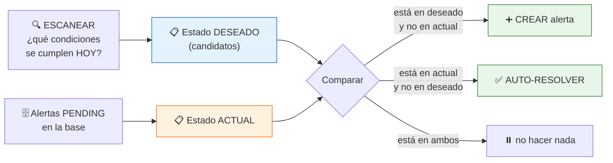
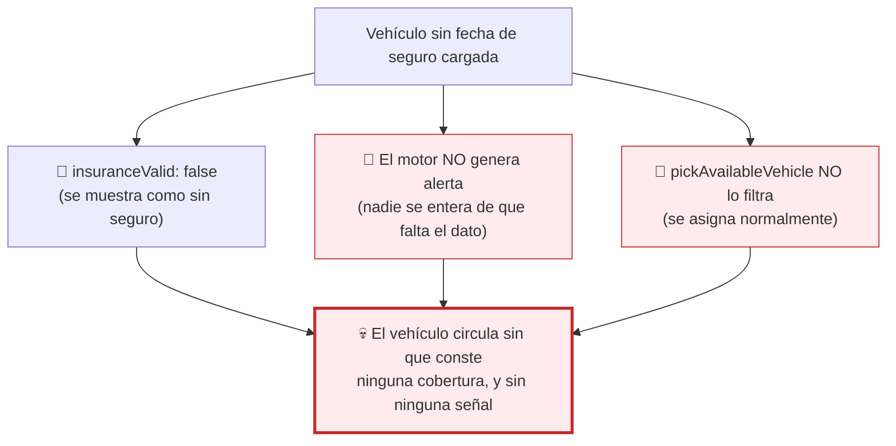
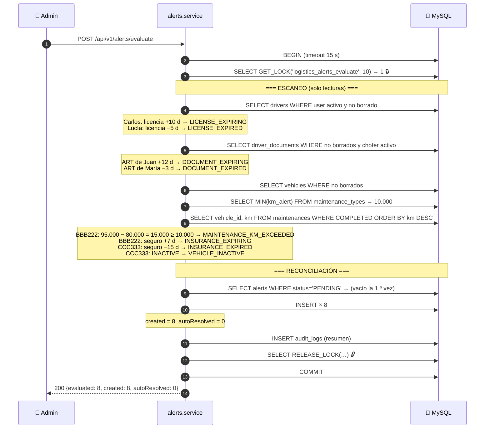
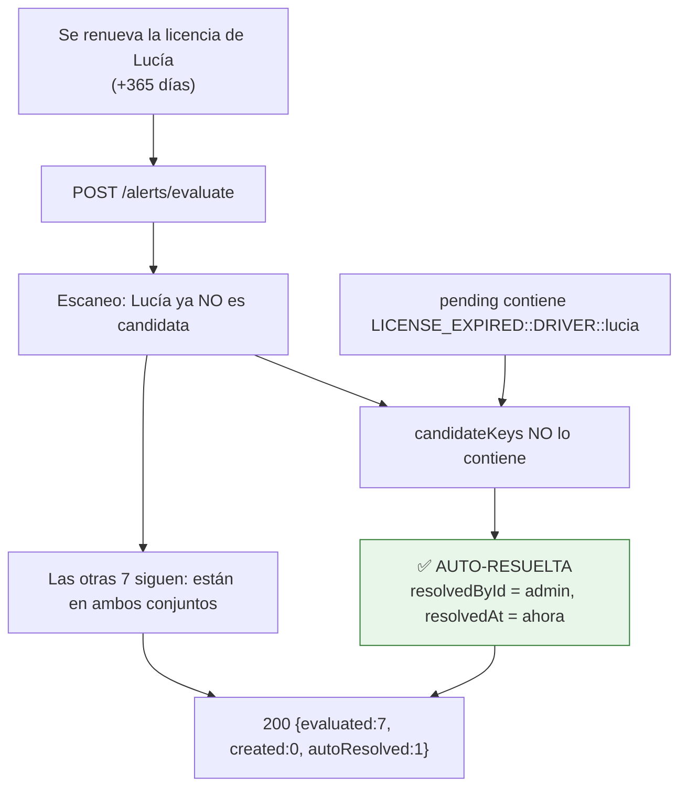

# Capítulo 14 — El motor de alertas

> **Prerrequisitos:** [Capítulo 6, §6.6](06-backend-shared.md) (fechas UTC), [Capítulo 10](10-modulo-vehicles.md), [Capítulo 11](11-modulo-drivers-documents.md) y [Capítulo 13](13-modulo-maintenance.md).
> **Archivos que se explican aquí:** los 5 de `modules/alerts/` (457 líneas). Total: 457 líneas, todas.
> **Al terminar** el lector entenderá el **patrón de reconciliación** —el más sofisticado del proyecto—, el bloqueo consultivo de MySQL, y por qué el motor de alertas **contradice** lo que el módulo de vehículos afirma.

---

## 14.1. Introducción

Las alertas son la única parte del sistema que **no reacciona a una acción del usuario**: nadie "crea" una alerta. Las alertas **se descubren** recorriendo el estado del sistema y comparándolo con un conjunto de condiciones.

Eso las hace conceptualmente distintas de todo lo visto hasta ahora:

| | Los otros 12 módulos | Alertas |
|:--|:--|:--|
| Origen del dato | El usuario lo envía | El sistema lo **deriva** |
| Cuándo se crea | En el momento de la acción | Al **evaluar** |
| Quién decide | El usuario | Un **escáner de condiciones** |
| Puede desaparecer solo | No | ✅ **Sí** (auto-resolución) |

El capítulo cubre:

1. **El patrón de reconciliación**: comparar el estado *deseado* (las condiciones que se cumplen) con el estado *actual* (las alertas pendientes) y ajustar la diferencia en ambos sentidos. Es el mismo patrón que usan Kubernetes y Terraform.

2. **El bloqueo consultivo de MySQL** (`GET_LOCK`), la tercera técnica de concurrencia del proyecto — y la que tiene un hueco sutil.

3. **Ocho tipos de alerta**, cada uno con su lógica de detección.

4. **Y la contradicción**: `vehicles.service.ts` afirma que un vehículo sin fecha de seguro queda *"surfaced as alertable"*. **El motor de alertas no lo alerta.**

---

## 14.2. Conceptos previos

### 14.2.1. El patrón de reconciliación

**El enfoque ingenuo** sería emitir la alerta en el momento en que ocurre el evento: al vencer una licencia, crear la alerta.

🔴 **Y no funciona, porque "vencer" no es un evento: es el paso del tiempo.** Nadie ejecuta código el día que una licencia vence. No hay ningún `UPDATE` que disparar.

**El enfoque correcto es declarativo:**



💡 **Es exactamente el bucle de reconciliación de Kubernetes:** describís el estado deseado, el sistema observa el actual, y actúa sobre la diferencia. **La operación es idempotente**: ejecutarla dos veces seguidas no cambia nada la segunda vez.

**Las tres propiedades que esto garantiza:**

| Propiedad | Consecuencia |
|:--|:--|
| **Idempotencia** | Ejecutar el evaluador 100 veces produce el mismo resultado que una. |
| **Auto-corrección** | Una licencia renovada **borra su alerta sola**, sin que nadie la marque. |
| **Sin estado intermedio** | No hace falta recordar "qué ya se alertó": se recalcula todo. |

🔴 **La tercera es la más valiosa.** Un sistema que recordara qué alertó tendría que mantener ese registro sincronizado. Aquí, **la base de datos de alertas ES el registro**, y se reconstruye por comparación en cada evaluación.

### 14.2.2. Identidad de una condición

Para comparar dos conjuntos hace falta saber **cuándo dos elementos son "el mismo"**.

```ts
function conditionKey(c: { alertType: string; entityType: string; entityId: number }): string {
  return `${c.alertType}::${c.entityType}::${c.entityId}`;
}
```

**Tres campos forman la identidad:** `LICENSE_EXPIRED::DRIVER::7`.

💡 **Y NO incluye `description`.** Es deliberado: si el nombre del chofer cambia, la descripción cambia pero **la condición es la misma**. Incluirla haría que un cambio de nombre auto-resolviera la alerta vieja y creara una nueva idéntica.

⚠️ **Tampoco incluye `raisedAt`.** Correcto: una condición que persiste tres semanas debe seguir siendo **la misma alerta**, no una nueva cada evaluación.

**El separador `::`** es una elección práctica: ningún `alertType` ni `entityType` lo contiene, así que no puede haber colisiones por concatenación ambigua (el problema clásico de `"a" + "bc"` vs `"ab" + "c"`).

### 14.2.3. Bloqueos consultivos: la tercera técnica de concurrencia

El proyecto usa **tres** mecanismos de concurrencia, y este es el más raro:

| Técnica | Qué bloquea | Ámbito | Dónde |
|:--|:--|:--|:--|
| `FOR UPDATE` | Una **fila** concreta | Transacción | `trips`, `maintenances` |
| `FOR UPDATE SKIP LOCKED` | Una fila, sin esperar | Transacción | `trips.pickAvailableVehicle` |
| **`GET_LOCK(nombre, timeout)`** | **Un nombre arbitrario** | **Conexión** | `alerts.evaluate` |

⚙️ **`GET_LOCK` es un bloqueo *consultivo* (*advisory*)**: no protege ninguna fila ni tabla. Es un semáforo con nombre que las aplicaciones acuerdan respetar. MySQL solo garantiza que **un solo cliente a la vez** puede tener el bloqueo con ese nombre.

**Por qué hace falta aquí y no basta `FOR UPDATE`:**

🔴 **La evaluación no toca una fila: recorre CUATRO TABLAS ENTERAS.** No hay una fila que bloquear. Lo que hay que serializar es **la operación completa**, y para eso el bloqueo por nombre es la herramienta correcta.

**La firma completa:**

```sql
SELECT GET_LOCK('logistics_alerts_evaluate', 10) AS locked
```

| Valor devuelto | Significa |
|:--|:--|
| `1` | Bloqueo obtenido |
| `0` | **Timeout**: otro cliente lo tiene desde hace más de 10 segundos |
| `NULL` | Error (por ejemplo, falta de memoria) |

⚠️ **El bloqueo está atado a la CONEXIÓN, no a la transacción.** Si la conexión se cae, MySQL lo libera automáticamente — lo que evita bloqueos permanentes por procesos muertos. **Pero también significa que no participa del `COMMIT`/`ROLLBACK`**, y de ahí sale el hueco de §14.5.2.

---

## 14.3. `alerts.schemas.ts` y la taxonomía abierta

```ts
4  /**
5   * Alert types are an open, extensible taxonomy (C-4): stored as VARCHAR, not
6   * an enum. These are the values the evaluator currently emits; new ones can
7   * be added without a schema/DB change.
8   */
9  export const ALERT_TYPES = [
10   'LICENSE_EXPIRING', 'LICENSE_EXPIRED',
12   'DOCUMENT_EXPIRING', 'DOCUMENT_EXPIRED',
14   'INSURANCE_EXPIRING', 'INSURANCE_EXPIRED',
16   'MAINTENANCE_KM_EXCEEDED',
17   'VEHICLE_INACTIVE',
18 ] as const;
19
20 export const ENTITY_TYPES = ['DRIVER', 'VEHICLE', 'DRIVER_DOCUMENT'] as const;
```

**El comentario justifica la decisión de §3.4.10:** `alert_type` es `VARCHAR(50)` y no `ENUM` porque la taxonomía debe poder crecer sin migración.

⚠️ **Y hay una asimetría curiosa en el esquema de consulta** (líneas 22-26):

```ts
entityType: z.enum(ENTITY_TYPES).optional(),      // ← cerrado
alertType: z.string().max(50).optional(),          // ← abierto
```

🔴 **`entityType` se valida contra la lista; `alertType` NO.**

**Consecuencia:** `?alertType=LICENCE_EXPIRED` (con error de tipeo) **devuelve una lista vacía sin ningún error**. El usuario ve "no hay alertas" y concluye que todo está bien.

**Con `z.enum(ALERT_TYPES)` daría un 400 explicando qué valores son válidos.** La constante **ya existe y está exportada** — solo hay que usarla.

💡 **El argumento a favor de dejarlo abierto** sería la extensibilidad: si se agregara un tipo nuevo, el filtro funcionaría sin tocar el esquema. **Pero eso es exactamente al revés de lo deseable en un filtro**: quien consulta quiere saber si escribió mal, no recibir silencio.

**Los ocho tipos, ordenados por par:**

| Par | Condición "EXPIRING" | Condición "EXPIRED" | Entidad |
|:--|:--|:--|:--|
| Licencia | Vence en ≤ 14 días | Ya venció | `DRIVER` |
| Documento | Vence en ≤ 14 días | Ya venció | `DRIVER_DOCUMENT` |
| Seguro | Vence en ≤ 14 días | Ya venció | `VEHICLE` |
| Mantenimiento | — | Umbral de km superado | `VEHICLE` |
| Inactividad | — | Vehículo dado de baja operativa | `VEHICLE` |

🔴 **Los dos últimos NO tienen versión "EXPIRING"**, y la razón es distinta en cada caso:

- **`MAINTENANCE_KM_EXCEEDED`**: el umbral `kmAlert` **ya es** el aviso anticipado (§13.3.2). El "target" sería el segundo nivel — y no se usa (§13.3.4).
- **`VEHICLE_INACTIVE`**: no es un vencimiento sino un **estado**. No hay nada que anticipar.

---

## 14.4. `scanConditions`: el escáner, línea por línea

```ts
60 /**
61  * Scan every expiry/threshold condition and return the alerts that should
62  * exist. Pure reads; no writes. "Expiring" means due within
63  * EXPIRY_ALERT_LEAD_DAYS (A-12: two weeks); "expired" means already past.
64  */
65 async function scanConditions(db: DbClient): Promise<Candidate[]> {
66   const today = utcStartOfToday();
67   const soon = addDaysUtc(today, EXPIRY_ALERT_LEAD_DAYS);
68   const candidates: Candidate[] = [];
```

💡 **"Pure reads; no writes"** es una propiedad importante: la función se puede ejecutar sin efectos, lo que la hace **testeable** y permite razonar sobre ella sin pensar en transacciones.

**Líneas 66-67 — las dos referencias temporales**

```ts
const today = utcStartOfToday();
const soon = addDaysUtc(today, EXPIRY_ALERT_LEAD_DAYS);
```

🔴 **Ambas se calculan UNA VEZ, al principio.** Es esencial para la coherencia: si `today` se recalculara en cada comparación, una evaluación que cruzara la medianoche produciría resultados inconsistentes entre los primeros y los últimos elementos.

**`utcStartOfToday()`** por todo lo de §6.6: las columnas son `DATE` y Prisma las devuelve como medianoche UTC.

**`addDaysUtc`** (líneas 54-58) es **la cuarta implementación de "sumar días" del proyecto**, después de `seed.ts:22` (`daysFromNow`), y las manipulaciones inline de otros módulos. **Todas hacen `new Date(date)` + `setUTCDate(getUTCDate() + n)`.**

⚠️ **Cuatro copias de la misma lógica de fechas delicada**, en un proyecto que tiene `shared/utils/dates.ts` exactamente para esto. Es la misma duplicación que `passwordSchema` (§11.4).

### 14.4.1. Licencias (líneas 70-91)

```ts
const drivers = await db.driver.findMany({
  where: { user: { deletedAt: null, isActive: true } },
  select: { userId: true, licenseExpiryDate: true, user: { select: { name: true } } },
});
for (const d of drivers) {
  if (d.licenseExpiryDate < today) {
    candidates.push({ alertType: 'LICENSE_EXPIRED', … });
  } else if (d.licenseExpiryDate <= soon) {
    candidates.push({ alertType: 'LICENSE_EXPIRING', … });
  }
}
```

✅ **El filtro `{ deletedAt: null, isActive: true }` es correcto y no obvio.** Un chofer dado de baja o suspendido **no debe generar alertas**: su licencia vencida es irrelevante porque no va a conducir.

💡 **Sin ese filtro, dar de baja a un chofer con licencia vencida dejaría su alerta viva para siempre** — ruido permanente en el tablero.

**El `if/else if` es una cadena excluyente, y el orden importa**

🔴 **`EXPIRED` se comprueba PRIMERO.** Si el orden fuera inverso, una licencia vencida hace un año también cumpliría `<= soon` (cualquier fecha pasada es ≤ dentro de 14 días) y se emitiría `LICENSE_EXPIRING` — **avisando de que "vence pronto" algo que venció hace un año**.

**Los tres casos, con la frontera exacta:**

| Vencimiento | `< today` | `<= soon` | Alerta |
|:--|:-:|:-:|:--|
| Hace 5 días | ✅ | ✅ | `LICENSE_EXPIRED` |
| **Hoy** | ❌ | ✅ | `LICENSE_EXPIRING` |
| En 14 días | ❌ | ✅ | `LICENSE_EXPIRING` |
| En 15 días | ❌ | ❌ | *(ninguna)* |

💡 **Una licencia que vence HOY produce `EXPIRING`, no `EXPIRED`** — coherente con RN-1 (§6.6.1): es válida hasta el final de su día de vencimiento. **La misma semántica que aplica `trips.assign`** (§12.6.5), que la acepta.

✅ **Es coherencia real entre dos módulos que calculan lo mismo con criterios independientes.**

⚠️ **`select` trae solo tres campos** — buena práctica que evita traer `encryptedPassword` a la memoria del proceso (§12.5.1).

### 14.4.2. Documentos (líneas 93-117)

```ts
// Filter by the driver too (active, non-deleted) — same criterion as the
// license scan; a deactivated or soft-deleted driver must not raise
// document alerts.
const documents = await db.driverDocument.findMany({
  where: { deletedAt: null, driver: { user: { deletedAt: null, isActive: true } } },
  select: { id: true, documentType: true, expiryDate: true },
});
```

**Filtro en TRES niveles:**

1. El documento no está borrado.
2. Su chofer existe y no está borrado.
3. Su chofer está activo.

💡 **El comentario documenta que es el mismo criterio que la licencia**, y es una coherencia deliberada. **Sin el segundo y tercer nivel, dar de baja a un chofer dejaría sus alertas de documentación vivas.**

🔴 **Y el `deletedAt: null` del documento tiene una consecuencia que conecta con §11.7.1:** borrar un documento vencido **hace que su alerta se auto-resuelva** en la siguiente evaluación.

**Es exactamente lo que el módulo de documentos previene impidiendo que el chofer borre.** El motor de alertas confirma que el razonamiento de control interno era correcto: **la ruta de "arreglar" el incumplimiento borrando la evidencia existe y funciona** — solo está cerrada por permisos.

⚠️ **La descripción es pobre:** `` `${doc.documentType} document is expired` `` produce *"ART document is expired"* — **sin decir de qué chofer**. La consulta no trae el nombre.

**En un tablero con 40 alertas, "ART document is expired" repetido cinco veces es inútil.** El usuario tiene que hacer clic en cada una y resolver `entityId` contra `driver_documents` para saber a quién corresponde. **Agregar el nombre al `select` y a la descripción es trivial**, y es lo que hacen las otras dos secciones del escáner.

### 14.4.3. Vehículos y la optimización contra N+1 (líneas 119-146)

```ts
// Lowest km_alert in the catalog implements the maintenance threshold (RN-3).
const minType = await db.maintenanceType.aggregate({ _min: { kmAlert: true } });
const kmAlertThreshold = minType._min.kmAlert;

// Baseline km per vehicle = km of its last COMPLETED maintenance (fallback:
// initialKm). Fetched in one query and reduced in memory to avoid N+1.
const completed = await db.maintenance.findMany({
  where: { status: 'COMPLETED' },
  select: { vehicleId: true, km: true },
  orderBy: { km: 'desc' },
});
const lastMaintenanceKm = new Map<number, number>();
for (const m of completed) {
  if (!lastMaintenanceKm.has(m.vehicleId)) lastMaintenanceKm.set(m.vehicleId, m.km);
}
```

**Líneas 136-146 — la optimización, explicada**

🔴 **El enfoque ingenuo sería un N+1 clásico:**

```ts
// — ejemplo ilustrativo de lo que se EVITA —
for (const v of vehicles) {
  const last = await db.maintenance.findFirst({
    where: { vehicleId: v.id, status: 'COMPLETED' },
    orderBy: { km: 'desc' },
  });
  // … 1 consulta POR VEHÍCULO
}
```

Con 50 vehículos: **51 consultas**. Con 500: **501**.

**La solución: una consulta + reducción en memoria.**

⚙️ **El truco de las líneas 143-146** aprovecha que los resultados vienen **ordenados por `km` descendente**: el primer mantenimiento de cada vehículo que aparece es el de mayor kilometraje. `if (!map.has(...))` conserva solo ese.

**Es el patrón "primero por grupo" (*first per group*) resuelto en memoria**, evitando la consulta con ventana que MySQL requeriría.

⚠️ **Pero tiene un costo de memoria que el comentario no menciona: trae TODOS los mantenimientos completados de la historia.** Con 100.000 mantenimientos son 100.000 objetos en RAM, de los cuales se usan tantos como vehículos haya.

**Para el tamaño del proyecto es irrelevante.** A escala, la consulta correcta sería:

```sql
-- — alternativa que escala —
SELECT vehicle_id, MAX(km) AS baseline
  FROM maintenances WHERE status = 'COMPLETED'
 GROUP BY vehicle_id
```

Que devuelve **una fila por vehículo** en lugar de todas las filas históricas.

🔴 **Y hay un problema de corrección, no solo de escala: `orderBy: { km: 'desc' }` toma el de mayor KILOMETRAJE, no el más RECIENTE.**

**Normalmente coinciden** (el kilometraje crece con el tiempo). **Pero divergen si:**

| Escenario | Consecuencia |
|:--|:--|
| Se cargó un mantenimiento con `km` mal tipeado (un dígito de más) | Ese queda como línea base **para siempre**, y la alerta de km **nunca** se dispara |
| Se corrigió el odómetro a la baja | Idem |
| Se registró un mantenimiento retroactivo | Puede quedar fuera del cálculo |

**El criterio correcto sería `orderBy: { completedAt: 'desc' }`** — la última intervención cronológica, que es lo que "desde el último mantenimiento" significa.

### 14.4.4. El umbral global de mantenimiento

```ts
const minType = await db.maintenanceType.aggregate({ _min: { kmAlert: true } });
const kmAlertThreshold = minType._min.kmAlert;
…
if (v.accumulatedKm - baseline >= kmAlertThreshold) { … }
```

🔴 **Este es el hallazgo funcional más importante del capítulo, y confirma definitivamente lo anticipado en §4.7.5 y §13.3.4.**

**El umbral es el MÍNIMO `kmAlert` de TODO el catálogo, aplicado a TODOS los vehículos por igual.**

**Lo que eso significa en la práctica**, con el catálogo del seed:

| Tipo | `kmAlert` | `kmTarget` |
|:--|--:|--:|
| Preventivo menor | 10.000 | 20.000 |
| Preventivo mayor | 80.000 | 120.000 |

**El umbral efectivo es 10.000 km para todos.** Un vehículo que superó 10.000 km desde su último mantenimiento genera `MAINTENANCE_KM_EXCEEDED`, **sin importar qué tipo de mantenimiento le corresponda**.

**Las cuatro consecuencias:**

1. 🔴 **El tipo de mantenimiento es irrelevante para la alerta.** Un vehículo que necesita "Preventivo mayor" (cada 80.000 km) se alerta a los 10.000.
2. 🔴 **Agregar un tipo con `kmAlert` bajo cambia el comportamiento de TODA la flota.** Crear un "Revisión de luces cada 2.000 km" bajaría el umbral global a 2.000, y **todos** los vehículos empezarían a alertar constantemente.
3. 🔴 **La alerta no dice QUÉ mantenimiento hace falta.** La descripción es *"exceeded the maintenance km threshold"*, genérica.
4. 🔴 **`kmTarget` no participa en absoluto** (§13.3.4).

💡 **El modelo de datos soporta un cálculo por tipo** —`maintenance_types` tiene umbrales por tipo, `maintenances` tiene `maintenanceTypeId`— **y la implementación lo ignora usando un mínimo global.**

**El cálculo correcto sería por (vehículo, tipo):**

```ts
// — mejora propuesta, esbozo —
// Para cada vehículo y cada tipo del catálogo:
//   baseline = km del último mantenimiento COMPLETED de ESE tipo para ESE vehículo
//              (o initialKm si nunca se hizo)
//   si accumulatedKm - baseline >= tipo.kmAlert → alerta indicando el tipo
```

**Y la descripción podría ser útil:** *"El vehículo AAA111 superó el umbral de Preventivo menor (12.500 km desde el último)"*.

⚠️ **`kmAlertThreshold` puede ser `null`** si el catálogo está vacío, y la línea 180 lo comprueba (`kmAlertThreshold !== null`). **Correcto**: sin tipos configurados no hay umbral, y no se alerta.

**Líneas 176-180 — las exclusiones documentadas**

```ts
// Skipped for INACTIVE and IN_WORKSHOP vehicles: the former isn't in
// service, the latter is already being serviced — alerting would be redundant.
if (kmAlertThreshold !== null && v.status !== 'INACTIVE' && v.status !== 'IN_WORKSHOP') {
```

💡 **Ambas exclusiones son correctas y están justificadas.** Un vehículo en el taller ya está siendo atendido; alertar de que necesita mantenimiento sería ruido. Uno inactivo no circula.

⚠️ **Pero `ON_TRIP` NO se excluye**, y es correcto: un vehículo en ruta que superó el umbral **sí** debe alertar, porque hay que programar el mantenimiento para cuando vuelva.

### 14.4.5. La contradicción del seguro (líneas 148-165)

```ts
for (const v of vehicles) {
  if (v.insuranceExpiryDate) {          // ← 🔴 la condición completa
    if (v.insuranceExpiryDate < today) {
      candidates.push({ alertType: 'INSURANCE_EXPIRED', … });
    } else if (v.insuranceExpiryDate <= soon) {
      candidates.push({ alertType: 'INSURANCE_EXPIRING', … });
    }
  }
  …
}
```

🔴 **`if (v.insuranceExpiryDate)` significa que un vehículo SIN fecha de seguro NO genera ninguna alerta.**

**Y eso contradice directamente lo que afirma el módulo de vehículos** (`vehicles.service.ts:20`):

> *"Insurance valid today (**or no expiry recorded yet → false, surfaced as alertable**)."*

**Confrontando ambos módulos:**

| Situación | `vehicles.insuranceValid` | ¿El motor alerta? |
|:--|:--|:--|
| Seguro vigente | `true` | ❌ No ✅ correcto |
| Seguro vencido | `false` | ✅ `INSURANCE_EXPIRED` ✅ correcto |
| **Sin fecha cargada** | **`false`** ("alertable") | 🔴 **NO alerta** |

🔴 **El comentario de `vehicles.service.ts` describe un comportamiento que no existe.** Es el **cuarto comentario incorrecto** que encuentra el manual, después de:

| # | Comentario incorrecto | Capítulo |
|:-:|:--|:--|
| 1 | Detección de robo de tokens "implementada" | §8.6.5 |
| 2 | `toAuditSnapshot` "redacted downstream" | §9.6.1 |
| 3 | `alerts.resolve` "Idempotent guard" (§14.5.3) | este |
| 4 | Vehículo sin seguro "surfaced as alertable" | este |

**La consecuencia práctica es grave y encadena con §12.5.3:**



💡 **Tres módulos independientes contribuyen al mismo agujero**, y ninguno es individualmente irrazonable. **Es el tipo de fallo que solo aparece leyendo el sistema completo**, que es exactamente el propósito de este manual.

**La corrección es una línea:**

```ts
// — corrección propuesta —
if (v.insuranceExpiryDate === null) {
  candidates.push({
    alertType: 'INSURANCE_MISSING',
    entityType: 'VEHICLE', entityId: v.id,
    description: `El vehículo ${v.licensePlate} no tiene seguro registrado`,
  });
} else if (v.insuranceExpiryDate < today) { … }
```

---

## 14.5. `evaluate`: la reconciliación, línea por línea

```ts
222 async evaluate(actorId: number): Promise<{ evaluated: number; created: number; autoResolved: number }> {
225   return prisma.$transaction(
226     async (tx) => {
227       const rows = await tx.$queryRaw<{ locked: number | bigint | null }[]>`
228         SELECT GET_LOCK(${EVALUATE_LOCK}, 10) AS locked
229       `;
230       if (Number(rows[0]?.locked ?? 0) !== 1) {
231         throw new ConflictError('Another evaluation is already in progress');
232       }
233
234       try {
235         const candidates = await scanConditions(tx);
236         const candidateKeys = new Set(candidates.map(conditionKey));
237         const pending = await alertsRepository.findPending(tx);
238         const pendingKeys = new Set(pending.map(conditionKey));
239
240         let created = 0;
241         for (const c of candidates) {
242           if (pendingKeys.has(conditionKey(c))) continue;
243           await alertsRepository.create({…}, tx);
252           created += 1;
253         }
254
255         let autoResolved = 0;
256         for (const p of pending) {
257           if (candidateKeys.has(conditionKey(p))) continue;
258           await alertsRepository.resolve(p.id, actorId, tx);
259           autoResolved += 1;
260         }
261
262         if (created > 0 || autoResolved > 0) {
263           await auditLogsService.record({…}, tx);
272         }
273         return { evaluated: candidates.length, created, autoResolved };
274       } finally {
275         await tx.$queryRaw`SELECT RELEASE_LOCK(${EVALUATE_LOCK})`;
276       }
277     },
278     { timeout: 15000 },
279   );
280 }
```

### 14.5.1. El uso de `Set` y su justificación

```ts
const candidateKeys = new Set(candidates.map(conditionKey));
const pendingKeys = new Set(pending.map(conditionKey));
```

⚙️ **Un `Set` de JavaScript busca en tiempo O(1)** (tabla de dispersión), mientras que `Array.includes` es O(n).

**El impacto con 100 candidatos y 100 alertas pendientes:**

| Estructura | Comparaciones |
|:--|--:|
| Dos arreglos con `includes` | 100 × 100 = **10.000** |
| **Dos `Set`** | 100 + 100 = **200** |

💡 **Y la asimetría del código es interesante:** se itera sobre los **arreglos** (para tener el objeto completo) pero se consulta contra los **`Set`** (para la búsqueda rápida). **Cada estructura se usa para lo que es buena.**

### 14.5.2. El bloqueo consultivo y su hueco

**Línea 230 — la comprobación del resultado**

```ts
if (Number(rows[0]?.locked ?? 0) !== 1) {
  throw new ConflictError('Another evaluation is already in progress');
}
```

**Tres protecciones en una línea:**

| Fragmento | Contra qué |
|:--|:--|
| `rows[0]?` | El arreglo vacío (`noUncheckedIndexedAccess`, §5.3.2) |
| `?? 0` | `GET_LOCK` devolvió `NULL` (error de MySQL) |
| `Number(...)` | El valor puede llegar como `bigint` (§12.5.3) |

💡 **Tratar `NULL` como fallo es la decisión correcta:** ante un error de bloqueo, no continuar.

**Líneas 274-276 — el `finally`**

```ts
} finally {
  await tx.$queryRaw`SELECT RELEASE_LOCK(${EVALUATE_LOCK})`;
}
```

✅ **El `finally` garantiza la liberación** aunque `scanConditions` lance. Sin él, una excepción dejaría el bloqueo tomado hasta que la conexión se cerrara.

🔴 **Y aquí está el hueco: `GET_LOCK` NO participa de la transacción.**

⚙️ **Los bloqueos consultivos de MySQL están atados a la CONEXIÓN, no a la transacción.** `RELEASE_LOCK` se ejecuta **inmediatamente**, mientras que el `COMMIT` de la transacción ocurre **después** de que el callback retorna.

**La secuencia real:**

```mermaid
sequenceDiagram
    participant A as Evaluación A
    participant DB as MySQL
    participant B as Evaluación B

    A->>DB: BEGIN
    A->>DB: GET_LOCK → 1 🔒
    A->>DB: escanear + INSERT alertas (sin confirmar)
    A->>DB: RELEASE_LOCK 🔓  ← el finally
    rect rgb(255, 235, 238)
    Note over A,B: ⚠️ VENTANA: bloqueo liberado, transacción SIN confirmar
    B->>DB: BEGIN
    B->>DB: GET_LOCK → 1 🔒 (¡lo consigue!)
    B->>DB: escanear — con REPEATABLE READ NO ve las alertas de A
    B->>DB: INSERT las MISMAS alertas
    end
    A->>DB: COMMIT
    B->>DB: RELEASE_LOCK; COMMIT
    Note over DB: 🔴 Alertas DUPLICADAS
```

**Por qué B no ve las inserciones de A:** el nivel de aislamiento por defecto de InnoDB es **REPEATABLE READ**, que toma una instantánea consistente en la primera lectura. Las escrituras no confirmadas de A son invisibles para B.

⚠️ **La ventana es de microsegundos** (entre el `RELEASE_LOCK` y el `COMMIT`) y requiere que dos evaluaciones coincidan exactamente ahí. **Es improbable pero real**, y el comentario de las líneas 217-220 afirma que el bloqueo previene los duplicados — **lo previene en el 99,99% de los casos, no en el 100%.**

**La corrección es sacar el bloqueo fuera de la transacción:**

```ts
// — corrección propuesta —
const [{ locked }] = await prisma.$queryRaw<{ locked: number }[]>`
  SELECT GET_LOCK(${EVALUATE_LOCK}, 10) AS locked`;
if (Number(locked) !== 1) throw new ConflictError('…');
try {
  return await prisma.$transaction(async (tx) => { … }, { timeout: 15000 });
} finally {
  await prisma.$queryRaw`SELECT RELEASE_LOCK(${EVALUATE_LOCK})`;
}
```

🔴 **Con un matiz importante que hay que verificar:** `GET_LOCK` es por **conexión**, y fuera de la transacción Prisma podría usar una conexión distinta del pool para el `RELEASE_LOCK` — en cuyo caso fallaría silenciosamente (devuelve `0`, no lanza). **La solución robusta exigiría fijar la conexión**, algo que Prisma no expone directamente. **Es un problema real sin solución trivial**, y merece registrarse como tal.

**Línea 278 — el timeout de 15 segundos**

```ts
{ timeout: 15000 }
```

💡 **Es el ÚNICO lugar del proyecto que ajusta el timeout de transacción.** El valor por defecto de Prisma es 5 segundos, y esta operación puede superarlo: recorre cuatro tablas completas y hace un `INSERT` o `UPDATE` por cada diferencia.

⚠️ **15 segundos es una transacción MUY larga**, y durante todo ese tiempo mantiene una conexión del pool ocupada y bloqueos de lectura activos. **Con un pool de 10 conexiones (§4.4), una evaluación consume el 10% de la capacidad durante 15 segundos.** Para una operación que se ejecuta manualmente y de vez en cuando, es aceptable.

### 14.5.3. `resolve` y el comentario contradictorio

```ts
282 /** Mark a pending alert as resolved (Admin). Idempotent guard on state. */
283 async resolve(id: number, actorId: number): Promise<AlertResponse> {
284   const existing = await alertsRepository.findById(id);
285   if (!existing) throw new NotFoundError(`Alert ${id} not found`);
286   if (existing.status === 'RESOLVED') {
287     throw new BusinessRuleError('Alert is already resolved');
288   }
```

🔴 **El comentario dice "Idempotent guard on state" y el código NO es idempotente: LANZA.**

**Comparación con las operaciones equivalentes del proyecto:**

| Operación | Estado ya alcanzado | Respuesta |
|:--|:--|:--|
| `users.setActive` (§9.6.5) | Ya activo/inactivo | **200** con el recurso ✅ idempotente |
| `vehicles.deactivate` (§10.6.4) | Ya inactivo | **200** ✅ idempotente |
| `auth.logout` (§8.6.6) | Sin sesión | **204** ✅ idempotente |
| **`alerts.resolve`** | Ya resuelta | 🔴 **422** ❌ **no idempotente** |

**Es una "guarda de estado", que es lo contrario de idempotencia.** El comentario usa ambos términos como si fueran lo mismo.

⚠️ **Y produce una experiencia peor:** un doble clic en "Resolver" muestra un error al usuario, cuando el estado deseado ya se alcanzó. **Y una inconsistencia con `vehicles.activate`**, que tampoco es idempotente (§10.6.4) — así que hay dos módulos con un criterio y dos con el opuesto.

### 14.5.4. El problema de la resolución manual

🔴 **Hay una interacción entre `resolve` y `evaluate` que el código no documenta y que produce un comportamiento desconcertante.**

**El escenario:**

1. El vehículo 3 está `INACTIVE` → el evaluador genera `VEHICLE_INACTIVE`.
2. El administrador ve la alerta, sabe que es intencional, y hace clic en **Resolver**. → `status = RESOLVED` ✅
3. Alguien ejecuta `POST /alerts/evaluate`.
4. **El vehículo sigue `INACTIVE`**, así que el escáner lo emite como candidato.
5. `pendingKeys` **no** lo contiene (se resolvió en el paso 2).
6. 🔴 **Se crea una alerta NUEVA, idéntica.**

**Desde la perspectiva del usuario: "resolví la alerta y volvió".**

💡 **Es correcto desde la lógica de reconciliación** —la condición sigue vigente, así que la alerta debe existir— **pero significa que la resolución manual es inútil para condiciones persistentes.**

**Los cuatro tipos afectados:**

| Tipo | ¿Se puede "arreglar"? | ¿La resolución manual sirve? |
|:--|:--|:--|
| `LICENSE_EXPIRED` | Sí, renovando | ❌ No: vuelve hasta que se renueve |
| `INSURANCE_EXPIRED` | Sí, renovando | ❌ No |
| `MAINTENANCE_KM_EXCEEDED` | Sí, haciendo el mantenimiento | ❌ No |
| **`VEHICLE_INACTIVE`** | **Solo reactivando el vehículo** | ❌ **No — y es un estado deliberado** |

🔴 **`VEHICLE_INACTIVE` es el peor caso:** un vehículo dado de baja **a propósito** genera una alerta permanente que **no se puede silenciar**. El tablero acumula ruido irreducible.

**Las dos soluciones habituales:**

| Solución | Cómo |
|:--|:--|
| **Silenciar** (*snooze*) | Un campo `snoozedUntil`: la reconciliación no recrea la alerta hasta esa fecha |
| **Reconocer** (*acknowledge*) | Separar "resuelta" (la condición desapareció) de "reconocida" (alguien la vio y la acepta) |

💡 **La segunda es conceptualmente más correcta:** hoy `RESOLVED` mezcla dos significados distintos —"se arregló" y "un humano la cerró"— que la reconciliación trata igual.

### 14.5.5. La auditoría condicional

```ts
if (created > 0 || autoResolved > 0) {
  await auditLogsService.record({
    actorId, action: 'UPDATE', entity: 'ALERT',
    newData: { evaluated: candidates.length, created, autoResolved },
  }, tx);
}
```

💡 **Solo se audita si hubo cambios.** Evita llenar `audit_logs` con evaluaciones sin efecto, que es lo que ocurriría si se automatizara con un cron cada hora.

🔴 **Pero tiene una consecuencia: NO HAY REGISTRO DE CUÁNDO SE EVALUÓ POR ÚLTIMA VEZ.**

**Y eso es un problema operativo real, dado que no hay tareas programadas** (§4.7.5). Nadie puede responder:

- *"¿Se evaluaron las alertas hoy?"*
- *"¿Hace cuánto que nadie ejecuta el evaluador?"*
- *"¿Estas alertas están al día?"*

⚠️ **Un tablero de alertas sin garantía de frescura es peligroso:** muestra cero alertas críticas, y el usuario concluye que todo está bien — cuando en realidad nadie evaluó desde hace tres semanas.

**Nótese además que el registro no lleva `entityId`** (es un resumen, no afecta a una alerta concreta). `audit_logs.entity_id` es nulable (§3.4.11), así que es válido — **es el único uso de esa nulabilidad en el proyecto.**

---

## 14.6. Flujo interno

### 14.6.1. Una evaluación completa sobre la base sembrada



**Ocho alertas, exactamente las predichas en §4.10** — y CCC333 genera **dos**, porque cumple dos condiciones independientes.

### 14.6.2. La segunda evaluación y la auto-resolución



💡 **Nadie tocó la alerta. La renovación de la licencia la cerró sola.** Ese es todo el valor del patrón de reconciliación.

⚠️ **`resolvedById` queda con el id del administrador que ejecutó el evaluador**, no `NULL`. **Contradice §3.4.10**, donde se argumentó que `resolvedById` es nulable precisamente para las auto-resoluciones. **La columna nulable existe y el código nunca la usa como `NULL`** — así que en la auditoría, una auto-resolución es indistinguible de una manual.

---

## 14.7. Ejemplos

### Ejemplo 1 — La primera evaluación

```bash
curl -X POST http://localhost:3000/api/v1/alerts/evaluate -H "Authorization: Bearer $ADMIN"
```

```json
{"data":{"evaluated":8,"created":8,"autoResolved":0}}
```

```sql
SELECT alert_type, entity_type, entity_id, description FROM alerts WHERE status='PENDING' ORDER BY id;
```

| alert_type | entity_type | entity_id | description |
|:--|:--|--:|:--|
| LICENSE_EXPIRING | DRIVER | 5 | License of driver Carlos Ruiz expires within 14 days |
| LICENSE_EXPIRED | DRIVER | 6 | License of driver Lucía Fernández is expired |
| DOCUMENT_EXPIRING | DRIVER_DOCUMENT | 3 | **ART document expires within 14 days** |
| DOCUMENT_EXPIRED | DRIVER_DOCUMENT | 6 | **ART document is expired** |
| INSURANCE_EXPIRING | VEHICLE | 2 | Insurance of vehicle BBB222 expires within 14 days |
| INSURANCE_EXPIRED | VEHICLE | 3 | Insurance of vehicle CCC333 is expired |
| MAINTENANCE_KM_EXCEEDED | VEHICLE | 2 | Vehicle BBB222 exceeded the maintenance km threshold |
| VEHICLE_INACTIVE | VEHICLE | 3 | Vehicle CCC333 is inactive |

🔴 **Las dos de documentos NO dicen de quién son.** Comparar con las de licencia y seguro, que sí identifican al chofer o el vehículo.

### Ejemplo 2 — Idempotencia demostrada

```bash
curl -X POST .../alerts/evaluate -H "Authorization: Bearer $ADMIN"
```

```json
{"data":{"evaluated":8,"created":0,"autoResolved":0}}
```

✅ **Cero creadas, cero resueltas.** El estado ya coincidía. **Ejecutarlo 100 veces daría lo mismo.**

### Ejemplo 3 — La auto-resolución

```bash
# Renovar la licencia de Lucía
curl -X PATCH .../drivers/6 -H "Authorization: Bearer $ADMIN" \
  -H 'Content-Type: application/json' -d '{"licenseExpiryDate":"2028-12-31"}'

curl -X POST .../alerts/evaluate -H "Authorization: Bearer $ADMIN"
```

```json
{"data":{"evaluated":7,"created":0,"autoResolved":1}}
```

```sql
SELECT alert_type, status, resolved_by_id, resolved_at
  FROM alerts WHERE entity_type='DRIVER' AND entity_id=6;
```

| alert_type | status | resolved_by_id | resolved_at |
|:--|:--|--:|:--|
| LICENSE_EXPIRED | **RESOLVED** | **1** | 2026-08-03 18:52:… |

⚠️ **`resolved_by_id = 1`** (el administrador que ejecutó el evaluador), **no `NULL`**. La distinción entre resolución manual y automática se pierde.

### Ejemplo 4 — La resolución manual que no sirve

```bash
# Resolver a mano la alerta de vehículo inactivo (id 8)
curl -X POST .../alerts/8/resolve -H "Authorization: Bearer $ADMIN"
# → 200 ✅ status = RESOLVED

curl -X POST .../alerts/evaluate -H "Authorization: Bearer $ADMIN"
```

```json
{"data":{"evaluated":8,"created":1,"autoResolved":0}}
```

🔴 **`created: 1` — la alerta VOLVIÓ**, con un id nuevo. El vehículo sigue `INACTIVE`, así que la condición persiste.

```sql
SELECT id, alert_type, status FROM alerts
 WHERE entity_type='VEHICLE' AND entity_id=3 AND alert_type='VEHICLE_INACTIVE';
```

| id | alert_type | status |
|:--|:--|:--|
| 8 | VEHICLE_INACTIVE | RESOLVED |
| **17** | VEHICLE_INACTIVE | **PENDING** |

💡 **Y este ciclo se repite en cada evaluación**, acumulando filas resueltas sin límite.

### Ejemplo 5 — El umbral global demostrado

```bash
# Agregar un tipo con umbral muy bajo
curl -X POST .../maintenance-types -H "Authorization: Bearer $ADMIN" \
  -H 'Content-Type: application/json' \
  -d '{"name":"Revisión de luces","description":"Control semanal","kmAlert":500,"kmTarget":1000}'

curl -X POST .../alerts/evaluate -H "Authorization: Bearer $ADMIN"
```

```sql
SELECT COUNT(*) FROM alerts WHERE alert_type='MAINTENANCE_KM_EXCEEDED' AND status='PENDING';
```

🔴 **El conteo salta de 1 a casi toda la flota.** El umbral global bajó de 10.000 a **500**, y **todos** los vehículos con más de 500 km desde su último mantenimiento alertan — aunque el tipo nuevo no tenga nada que ver con ellos.

**Agregar un tipo de catálogo cambió el comportamiento de toda la flota.**

### Ejemplo 6 — La contradicción del seguro

```bash
# Crear un vehículo SIN fecha de seguro
curl -X POST .../vehicles -H "Authorization: Bearer $ADMIN" \
  -H 'Content-Type: application/json' \
  -d '{"licensePlate":"ZZZ999","model":"Prueba","year":2024,"initialKm":0}'
# → insuranceValid: false   (§10.6.1: "surfaced as alertable")

curl -X POST .../alerts/evaluate -H "Authorization: Bearer $ADMIN"
```

```sql
SELECT COUNT(*) FROM alerts
 WHERE entity_type='VEHICLE' AND entity_id=(SELECT id FROM vehicles WHERE license_plate='ZZZ999');
```

🔴 **Resultado: 0.** El comentario de `vehicles.service.ts:20` dice *"surfaced as alertable"* y **el motor no lo alerta**.

**Y como `pickAvailableVehicle` tampoco filtra el seguro** (§12.5.3), **ese vehículo es perfectamente asignable, sin cobertura registrada y sin ninguna señal en el sistema.**

---

## 14.8. Resumen

1. **El patrón de reconciliación** compara el estado deseado (condiciones que se cumplen hoy) con el actual (alertas pendientes) y ajusta en **ambos sentidos**: crea las que faltan y resuelve las que sobran. Es idempotente y auto-correctivo.

2. **`conditionKey` define la identidad** con tres campos, excluyendo deliberadamente `description` y `raisedAt` para que un cambio de nombre no reinicie la alerta.

3. **`GET_LOCK` es la tercera técnica de concurrencia del proyecto**: un bloqueo con nombre, no sobre filas, apropiado para serializar una operación que recorre tablas enteras.

4. **La optimización del `Map`** evita un N+1 clásico resolviendo "primero por grupo" en memoria, a costa de traer todo el historial de mantenimientos.

5. **Los filtros de chofer activo y no borrado** son correctos y no obvios: sin ellos, dar de baja a alguien dejaría sus alertas vivas para siempre.

6. **El orden `EXPIRED` antes que `EXPIRING`** es esencial: invertirlo haría que algo vencido hace un año figurara como "vence pronto".

7. **Diez hallazgos concretos:**

   | # | Hallazgo | Gravedad |
   |:-:|:--|:--|
   | 1 | 🔴 **Un vehículo SIN fecha de seguro no genera ninguna alerta**, contradiciendo el comentario de `vehicles.service.ts:20` (*"surfaced as alertable"*). Combinado con que `pickAvailableVehicle` no filtra el seguro (§12.5.3), **el vehículo circula sin cobertura registrada y sin ninguna señal**. Tres módulos contribuyen al mismo agujero. | **Alta** |
   | 2 | 🔴 **El umbral de mantenimiento es el MÍNIMO GLOBAL `kmAlert`**, aplicado a toda la flota sin distinguir tipos. Agregar un tipo con umbral bajo hace alertar a todos los vehículos. El modelo soporta el cálculo por tipo y la implementación lo ignora. `kmTarget` no se usa. | **Alta** |
   | 3 | 🔴 **La resolución manual es inútil para condiciones persistentes:** la alerta vuelve en la siguiente evaluación con id nuevo. `VEHICLE_INACTIVE` es ruido irreducible. Falta *snooze* o *acknowledge*. | **Alta** |
   | 4 | 🔴 **`GET_LOCK` está DENTRO de la transacción y `RELEASE_LOCK` se ejecuta antes del `COMMIT`**, dejando una ventana en la que otra evaluación puede entrar y, bajo REPEATABLE READ, no ver las inserciones sin confirmar → **alertas duplicadas**. La corrección no es trivial: el bloqueo es por conexión y Prisma no permite fijarla. | Media |
   | 5 | 🔴 **No hay registro de cuándo se evaluó por última vez** (la auditoría es condicional). Sin tareas programadas, nadie puede saber si el tablero está al día — y un tablero vacío por falta de evaluación parece un sistema sano. | Media |
   | 6 | ⚠️ **`orderBy: { km: 'desc' }` toma el mantenimiento de mayor kilometraje, no el más reciente.** Un `km` mal cargado queda como línea base para siempre y la alerta nunca se dispara. Debería ser `completedAt`. | Media |
   | 7 | ⚠️ **Las alertas de documento no dicen de qué chofer son.** *"ART document is expired"* repetido cinco veces es inútil en un tablero. | Media |
   | 8 | ⚠️ **El comentario de `resolve` dice "Idempotent" y el código lanza 422.** Cuarto comentario incorrecto del proyecto, e inconsistente con `users.setActive` y `vehicles.deactivate`. | Baja |
   | 9 | ⚠️ **`resolvedById` nunca es `NULL`**, ni siquiera en auto-resoluciones: queda el id de quien ejecutó el evaluador. La columna nulable de §3.4.10 existe y no se usa como se diseñó. | Baja |
   | 10 | ⚠️ **`alertType` no se valida contra `ALERT_TYPES`** en el filtro, aunque la constante existe y está exportada. Un error de tipeo devuelve lista vacía sin error. | Baja |
   | 11 | ⚠️ **Cuarta implementación de "sumar días"** en el proyecto, existiendo `shared/utils/dates.ts`. | Baja |

---

## 14.9. Preguntas de repaso

1. ¿Por qué las alertas no se pueden emitir "cuando ocurre el evento"? ¿Qué patrón se usa en su lugar?
2. ¿Qué tres propiedades garantiza el patrón de reconciliación? ¿Cuál es la más valiosa y por qué?
3. `conditionKey` excluye `description` y `raisedAt`. ¿Qué pasaría si los incluyera?
4. ¿Por qué `GET_LOCK` y no `FOR UPDATE`? ¿Qué diferencia hay en el ámbito de cada uno?
5. Explicar el hueco del bloqueo consultivo. ¿Por qué la segunda evaluación no ve las alertas de la primera?
6. ¿Por qué `EXPIRED` se comprueba antes que `EXPIRING`? Dar el caso concreto que se rompería.
7. Una licencia vence HOY. ¿Qué alerta genera? ¿Es coherente con lo que hace `trips.assign`?
8. Explicar la optimización del `Map` de las líneas 143-146. ¿Qué N+1 evita y qué costo tiene?
9. `orderBy: { km: 'desc' }` toma el de mayor kilometraje. ¿Cuándo diverge del más reciente y qué consecuencia tiene?
10. ¿Qué umbral usa `MAINTENANCE_KM_EXCEEDED`? Describir qué pasa al agregar un tipo con `kmAlert: 500`.
11. Un vehículo no tiene fecha de seguro. ¿Genera alerta? ¿Qué dice el comentario de `vehicles.service.ts`? ¿Qué otros dos módulos contribuyen al problema?
12. Un administrador resuelve manualmente `VEHICLE_INACTIVE` de un vehículo dado de baja a propósito. ¿Qué pasa en la siguiente evaluación? ¿Cuáles son las dos soluciones habituales?
13. ¿Por qué la auditoría es condicional? ¿Qué información se pierde y por qué es peligroso?
14. `resolvedById` es nulable en el esquema. ¿Se usa como `NULL` alguna vez? ¿Qué se pierde?

<details>
<summary><strong>Respuestas</strong></summary>

1. Porque **"vencer" no es un evento: es el paso del tiempo**. Nadie ejecuta código el día que una licencia vence; no hay ningún `UPDATE` que disparar. Se usa el **patrón de reconciliación**: escanear periódicamente qué condiciones se cumplen (estado deseado), compararlo con las alertas pendientes (estado actual), y ajustar la diferencia en ambos sentidos.

2. **(a) Idempotencia**: ejecutar el evaluador N veces produce el mismo resultado que una. **(b) Auto-corrección**: una licencia renovada borra su alerta sola. **(c) Sin estado intermedio**: no hace falta recordar "qué ya se alertó". **La tercera es la más valiosa** porque un sistema que recordara qué alertó tendría que mantener ese registro sincronizado con la realidad; aquí la tabla de alertas **es** el registro y se reconstruye por comparación en cada evaluación.

3. **Con `description`**: cambiar el nombre de un chofer cambiaría la descripción, la clave dejaría de coincidir, la alerta vieja se auto-resolvería y se crearía una nueva idéntica — ruido y pérdida de `raisedAt`. **Con `raisedAt`**: **ninguna** alerta coincidiría nunca (el instante siempre difiere), así que en cada evaluación se resolverían todas las pendientes y se crearían de nuevo. La tabla crecería sin límite y la fecha de detección original se perdería.

4. Porque **la evaluación no toca una fila: recorre cuatro tablas enteras**. No hay una fila que bloquear; lo que hay que serializar es la **operación completa**. `FOR UPDATE` bloquea filas concretas y su ámbito es la **transacción**; `GET_LOCK` bloquea un **nombre arbitrario** y su ámbito es la **conexión** — MySQL lo libera solo si la conexión se cae, evitando bloqueos permanentes por procesos muertos.

5. Porque **`GET_LOCK` no participa de la transacción**: `RELEASE_LOCK` está en el `finally` y se ejecuta **antes** de que el callback retorne y Prisma haga `COMMIT`. En esa ventana, otra evaluación obtiene el bloqueo. **No ve las alertas de la primera** porque el nivel de aislamiento por defecto de InnoDB es **REPEATABLE READ**: toma una instantánea consistente en la primera lectura, y las escrituras sin confirmar de la otra transacción son invisibles. Resultado: ambas insertan las mismas alertas.

6. Porque **una fecha pasada también cumple `<= soon`** (cualquier fecha anterior a hoy es menor que "dentro de 14 días"). Con el orden invertido, una licencia vencida **hace un año** entraría en la rama `EXPIRING` y el sistema avisaría de que *"vence dentro de 14 días"* algo que venció hace 365. La cadena `if/else if` funciona **solo** con `EXPIRED` primero.

7. Genera **`LICENSE_EXPIRING`**, no `EXPIRED`: `licenseExpiryDate < today` es `false` (son iguales) y `<= soon` es `true`. **Es coherente con `trips.assign`** (§12.6.5), que rechaza solo si `licenseExpiryDate < utcStartOfToday()` — es decir, **acepta** una licencia que vence hoy. Ambos módulos implementan RN-1 ("válida hasta e incluyendo su fecha de vencimiento") con criterios independientes y llegan al mismo resultado.

8. **Evita** hacer un `findFirst` por vehículo para obtener su último mantenimiento: con 50 vehículos serían 51 consultas. Trae **todos** los mantenimientos completados **ordenados por `km` descendente** en una sola consulta, y recorre el resultado quedándose con el primero de cada vehículo (`if (!map.has(...))`) — que por el orden es el de mayor kilometraje. **El costo:** trae todo el historial a memoria; con 100.000 mantenimientos son 100.000 objetos en RAM para usar tantos como vehículos haya. La alternativa que escala es `GROUP BY vehicle_id` con `MAX(km)`.

9. **Divergen** si se cargó un mantenimiento con el `km` mal tipeado (un dígito de más), si se corrigió el odómetro a la baja, o si se registró un mantenimiento retroactivo. **Consecuencia:** ese registro erróneo queda como línea base **para siempre**, y como `accumulatedKm - baseline` da un número negativo o pequeño, **la alerta de kilometraje nunca se dispara** para ese vehículo. El criterio correcto es `orderBy: { completedAt: 'desc' }`.

10. **El MÍNIMO `kmAlert` de todo el catálogo**, aplicado globalmente a todos los vehículos. Agregando un tipo con `kmAlert: 500`, el umbral global baja de 10.000 a 500 y **toda la flota** con más de 500 km desde su último mantenimiento empieza a alertar — aunque el tipo nuevo no tenga nada que ver con esos vehículos. **Agregar una fila de catálogo cambia el comportamiento del sistema entero.**

11. **No genera ninguna alerta**: la condición `if (v.insuranceExpiryDate)` descarta el caso `null` por completo. **El comentario de `vehicles.service.ts:20` dice** *"or no expiry recorded yet → false, **surfaced as alertable**"* — describe un comportamiento que no existe. **Los otros dos módulos:** `vehicles` lo muestra como `insuranceValid: false` (indistinguible de "vencido"), y `trips.pickAvailableVehicle` (§12.5.3) **no filtra por seguro**, así que lo asigna normalmente. **Resultado: circula sin cobertura registrada y sin ninguna señal.**

12. **La alerta vuelve**, con un id nuevo: el vehículo sigue `INACTIVE`, así que el escáner lo emite como candidato; `pendingKeys` no lo contiene (se resolvió), y se crea una alerta nueva. **Desde la perspectiva del usuario: "la resolví y volvió".** Es correcto desde la lógica de reconciliación pero hace inútil la resolución manual para condiciones persistentes. **Las dos soluciones:** *snooze* (un campo `snoozedUntil` que impide recrearla hasta esa fecha) o separar **resuelta** (la condición desapareció) de **reconocida** (un humano la vio y la acepta) — hoy `RESOLVED` mezcla ambos significados.

13. Para **evitar llenar `audit_logs` con evaluaciones sin efecto**, que es lo que ocurriría si se automatizara con un cron cada hora. **Se pierde** el registro de cuándo se evaluó por última vez. **Es peligroso** porque, sin tareas programadas, nadie puede saber si el tablero está al día: **un tablero con cero alertas críticas parece un sistema sano**, cuando en realidad puede significar que nadie ejecutó el evaluador en tres semanas.

14. **Nunca se usa como `NULL`.** En la auto-resolución, `alertsRepository.resolve(p.id, actorId, tx)` pasa el `actorId` **del administrador que ejecutó el evaluador**. **Se pierde la distinción entre resolución manual y automática**: en la auditoría y en la interfaz, una alerta que se cerró sola porque la licencia se renovó es indistinguible de una que un administrador cerró a mano. La columna nulable de §3.4.10 se diseñó exactamente para esa distinción y el código no la aprovecha.

</details>

---

## 14.10. Ejercicios propuestos

**Nivel 1 — Observación**

1. Ejecutar `/alerts/evaluate` sobre la base sembrada y verificar que salen las 8 alertas predichas en §4.10.
2. Ejecutarlo dos veces seguidas y confirmar que la segunda devuelve `created: 0, autoResolved: 0`.
3. Renovar la licencia de Lucía y verificar la auto-resolución. Revisar `resolved_by_id`.
4. Filtrar por `?alertType=LICENCE_EXPIRED` (con error de tipeo) y documentar la respuesta.

**Nivel 2 — Verificación de los hallazgos**

5. Reproducir el **ejemplo 6**: crear un vehículo sin seguro, evaluar, y confirmar que no hay alerta. Después asignarlo a un viaje y confirmar que se permite.
6. Reproducir el **ejemplo 5**: agregar un tipo con `kmAlert: 500` y contar cuántos vehículos alertan antes y después.
7. Reproducir el **ejemplo 4**: resolver manualmente `VEHICLE_INACTIVE` y verificar que vuelve con id nuevo. Repetirlo cinco veces y contar las filas resueltas acumuladas.
8. Cargar un mantenimiento completado con un `km` un dígito mayor que el real y verificar que la alerta de kilometraje deja de dispararse para ese vehículo.
9. Medir el tiempo de `/alerts/evaluate` con la base sembrada y estimar cómo escalaría con 500 vehículos y 50.000 mantenimientos completados.

**Nivel 3 — Corrección**

10. Agregar el tipo `INSURANCE_MISSING` para vehículos sin fecha de seguro, y corregir el comentario de `vehicles.service.ts:20`.
11. Reescribir el cálculo de mantenimiento **por tipo**: para cada par (vehículo, tipo), comparar contra el último mantenimiento **de ese tipo**. Incluir el nombre del tipo en la descripción.
12. Cambiar `orderBy: { km: 'desc' }` por `completedAt` y verificar con el ejercicio 8 que la alerta vuelve a dispararse.
13. Agregar el nombre del chofer a las descripciones de las alertas de documento.
14. Implementar `snoozedUntil` en `alerts` para que la reconciliación no recree una alerta silenciada. Decidir qué hacer cuando el plazo vence.
15. Sacar `GET_LOCK` fuera de la transacción y **verificar experimentalmente** si `RELEASE_LOCK` funciona (puede caer en otra conexión del pool). Documentar el resultado.
16. Registrar siempre la evaluación en `audit_logs` (aunque no haya cambios) o agregar un campo `lastEvaluatedAt` en `company_settings`, y mostrarlo en el tablero de alertas.
17. Programar la evaluación automática con `node-cron` cada hora, y medir el impacto en `audit_logs` con y sin la corrección del ejercicio 16.

---

**Anterior:** [Capítulo 13 — Mantenimiento](13-modulo-maintenance.md) · **Siguiente:** Capítulo 15 — Auditoría *(pendiente)*
