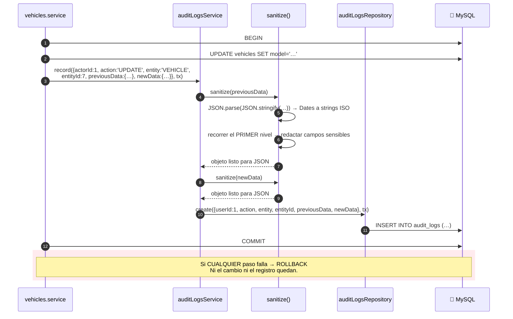
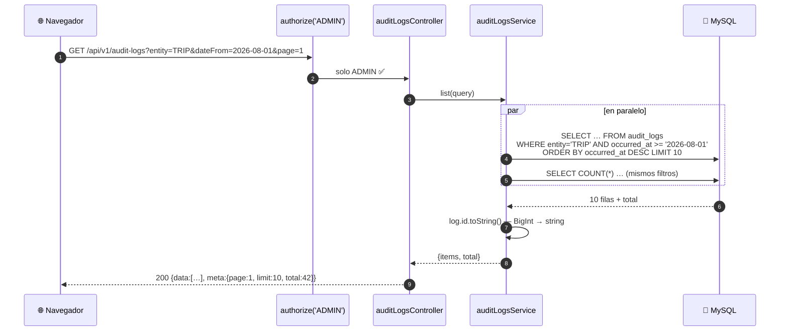

# Capítulo 15 — La auditoría

> **Prerrequisitos:** [Capítulo 3, §3.4.11](03-base-de-datos.md) (la tabla `audit_logs`) y los capítulos 9 a 14, donde `auditLogsService.record` aparece en cada operación.
> **Archivos que se explican aquí:** los 5 de `modules/audit-logs/` (224 líneas). Total: 224 líneas, todas.
> **Al terminar** el lector entenderá el único módulo del sistema **sin operaciones de escritura expuestas**, la función que protege a todos los demás de filtrar secretos, y por qué esa protección tiene un agujero.

---

## 15.1. Introducción

La auditoría es el módulo más pequeño (224 líneas) y el más transversal: **doce de los trece módulos lo invocan**. No tiene endpoints de escritura, no tiene reglas de negocio propias, y su servicio se llama desde dentro de las transacciones de otros.

Y concentra tres cosas que merecen atención:

1. **Es de solo lectura desde la API.** Un único endpoint `GET`. La escritura ocurre exclusivamente desde otros servicios, dentro de sus transacciones.

2. **`sanitize` es la última línea de defensa contra la filtración de secretos.** Es la función que impide que un `passwordHash` termine en una tabla que un administrador consulta por pantalla — y aquí se verifica su alcance real.

3. **`DbClient` —el tipo del que dependen los trece repositorios del proyecto— se define aquí.** Una decisión de ubicación curiosa que dice algo sobre cómo creció el código.

---

## 15.2. Conceptos previos

### 15.2.1. Qué distingue una auditoría de un log

Se confunden con frecuencia y son cosas distintas:

| | **Log** (pino, §5.5.3) | **Auditoría** (`audit_logs`) |
|:--|:--|:--|
| Para quién | Desarrolladores, operaciones | **Negocio, cumplimiento, legal** |
| Qué registra | Eventos técnicos: peticiones, errores | **Acciones de negocio**: quién cambió qué |
| Dónde vive | Archivos, stdout, agregadores | **La base de datos transaccional** |
| Retención | Días o semanas | **Años** |
| ¿Se puede perder? | Sí, es tolerable | ❌ **No** |
| ¿Es transaccional? | No | ✅ **Sí** |

🔴 **La propiedad decisiva es la última.** Un log se escribe "cuando se puede"; si el proceso muere, se pierde. **Una auditoría debe confirmarse en la misma transacción que el cambio que registra**: o quedan los dos, o no queda ninguno.

💡 **Por eso `auditLogsService.record` acepta el cliente transaccional `tx`**, y por eso todos los servicios lo llaman **dentro** de su `$transaction`. Es lo que garantiza que no exista un cambio sin registro ni un registro sin cambio.

### 15.2.2. Inmutabilidad: qué significa aquí

Una auditoría solo sirve si **nadie puede alterarla**. Si un administrador pudiera borrar el registro de una acción, la auditoría no sería evidencia de nada.

**Hay tres niveles posibles de inmutabilidad:**

| Nivel | Mecanismo | ¿Lo tiene el proyecto? |
|:--|:--|:--:|
| **De API** | No exponer endpoints de escritura | ✅ **Sí** |
| **De aplicación** | El repositorio no expone `update`/`delete` | ✅ **Sí** |
| **De base de datos** | Permisos, triggers, o tablas de solo-anexado | ❌ **No** |

⚠️ **Los dos primeros protegen contra el uso normal del sistema. El tercero protegería contra alguien con acceso a MySQL** — que en este proyecto es cualquiera que tenga las credenciales del `.env`.

**Un `TRIGGER` de MySQL cerraría el hueco:**

```sql
-- — mejora propuesta —
CREATE TRIGGER audit_logs_no_update BEFORE UPDATE ON audit_logs
FOR EACH ROW SIGNAL SQLSTATE '45000'
  SET MESSAGE_TEXT = 'audit_logs es inmutable';

CREATE TRIGGER audit_logs_no_delete BEFORE DELETE ON audit_logs
FOR EACH ROW SIGNAL SQLSTATE '45000'
  SET MESSAGE_TEXT = 'audit_logs es inmutable';
```

🔴 **Con un costo real: impediría también la limpieza legítima** de registros antiguos según una política de retención. Habría que desactivar el trigger para purgar, lo que reabre el hueco. **Es un intercambio sin solución perfecta**, y por eso muchos sistemas optan por replicar la auditoría a un almacenamiento externo de solo-anexado.

---

## 15.3. `audit-logs.repository.ts` línea por línea

### 15.3.1. `DbClient`: el tipo que sostiene el proyecto

```ts
1 import { prisma } from '../../database/prisma-client';
2 import type { Prisma } from '../../generated/prisma/client';
…
5 /** Either the global client or a transaction client — repositories accept both. */
6 export type DbClient = typeof prisma | Prisma.TransactionClient;
```

🔴 **Estas dos líneas son el fundamento del patrón `db: DbClient = prisma` que usan los TRECE repositorios del proyecto** (§2.3.2).

**Es un tipo unión de dos cosas estructuralmente parecidas pero no idénticas:**

| Tipo | Qué es | Qué NO tiene |
|:--|:--|:--|
| `typeof prisma` | El cliente global | — |
| `Prisma.TransactionClient` | El `tx` dentro de `$transaction` | `$transaction`, `$connect`, `$disconnect`, `$on` |

💡 **La unión funciona porque el repositorio solo usa los métodos de modelo** (`db.user.create`, `db.vehicle.findFirst`), que ambos tienen. Si un repositorio intentara `db.$transaction(...)`, TypeScript lo rechazaría — **y con razón: anidar transacciones desde un repositorio sería un error de diseño.**

⚠️ **El tipo está definido en el LUGAR EQUIVOCADO.**

`DbClient` no tiene nada que ver con la auditoría: es un concepto de infraestructura de persistencia. **Debería vivir en `shared/types/` o en `database/prisma-client.ts`.**

**La consecuencia concreta:** los trece repositorios escriben

```ts
import type { DbClient } from '../audit-logs/audit-logs.repository';
```

**creando una dependencia artificial de todos los módulos hacia el módulo de auditoría.** El grafo de dependencias de §2.3.3 muestra a `audit-logs` como servicio transversal — y esta línea lo hace transversal también en un sentido que no debería.

💡 **Probablemente sea un accidente histórico:** `audit-logs` fue el primer módulo que necesitó el parámetro `tx`, el tipo se definió ahí, y los siguientes lo importaron de donde estaba. **Mover el tipo es una refactorización de quince minutos** que nadie hizo.

### 15.3.2. La superficie de escritura, deliberadamente mínima

```ts
47 /**
48  * Audit persistence (RN-7). Only INSERT and SELECT are exposed — never
49  * update/delete (A-5): the trail is immutable from the application.
50  */
51 export const auditLogsRepository = {
52   create(data: CreateAuditLogData, db: DbClient = prisma) { … },
56   findMany(filters: AuditLogFilters, page: PageArgs) { … },
66   count(filters: AuditLogFilters): Promise<number> { … },
69 };
```

🔴 **Tres métodos: uno escribe, dos leen. NO hay `update` ni `delete`.**

💡 **La inmutabilidad se implementa por AUSENCIA**, y es la forma más robusta: no se puede llamar a un método que no existe. Ni siquiera por error, ni desde otro módulo, ni con una aserción de tipo.

**Compárese con los otros doce repositorios**, todos los cuales exponen `update` y la mayoría `softDelete`. **La ausencia aquí es la afirmación.**

⚠️ **Y contrasta con `alerts`**, que también es "derivado" pero sí permite `resolve` (un `update`). **La diferencia conceptual: una alerta describe un estado presente que cambia; un registro de auditoría describe un hecho pasado que no cambia.**

**Línea 52 — `create` con `db: DbClient = prisma`**

El valor por defecto permite escribir auditoría **fuera** de una transacción, que es lo que hace `drivers.getPassword` (§11.6.4) — una lectura sensible sin cambio de estado asociado.

**Líneas 8-15 — la interfaz de entrada**

```ts
interface CreateAuditLogData {
  userId: number;
  action: string;
  entity: string;
  entityId?: number;
  previousData?: Prisma.InputJsonValue;
  newData?: Prisma.InputJsonValue;
}
```

⚠️ **`action` y `entity` son `string`**, no los tipos `AuditAction` y `AuditEntity` que el servicio define (líneas 7-28 de `audit-logs.service.ts`).

**El tipado fuerte está en el servicio y se pierde en el repositorio.** Funciona porque el único llamador es el servicio, pero significa que un módulo que llamara al repositorio directamente podría escribir `action: 'CUALQUIER_COSA'`.

⚙️ **`Prisma.InputJsonValue`** es el tipo que Prisma acepta para columnas `JSON`: cualquier valor serializable (objeto, arreglo, string, número, booleano, `null`). **No acepta `undefined`**, y por eso `sanitize` devuelve `undefined` explícitamente cuando no hay datos — para que Prisma omita la columna en lugar de escribir `null`.

### 15.3.3. `buildWhere` y la reutilización del patrón de fechas

```ts
if (filters.dateFrom || filters.dateTo) {
  // utcEndOfDay makes dateTo an inclusive upper bound (same timezone
  // semantics as reports); a raw lte would drop the last day of the range.
  where.occurredAt = {
    ...(filters.dateFrom ? { gte: filters.dateFrom } : {}),
    ...(filters.dateTo ? { lte: utcEndOfDay(filters.dateTo) } : {}),
  };
}
```

💡 **Idéntico a `trips.repository.ts:33-40`** (§12.5.2), incluido el razonamiento del comentario. **Es duplicación**, pero de tres líneas y con la lógica delicada centralizada en `utcEndOfDay` — la parte que importa **no** está duplicada.

⚠️ **El comentario dice *"same timezone semantics as reports"***, lo que sugiere que hay una **tercera** copia en `reports`. Se verifica en el capítulo 16.

**Línea 60 — el orden**

```ts
orderBy: { occurredAt: 'desc' }
```

**Lo más reciente primero**, que es lo que se espera de un registro de actividad. Y usa el índice `idx_audit_logs_date` (§3.4.11).

⚠️ **`occurredAt` tiene precisión de milisegundo** (`@db.DateTime(3)`), pero **dos acciones en el mismo milisegundo tendrían un orden indeterminado**. Agregar `{ id: 'desc' }` como criterio secundario daría un orden total estable — y el `id` es autoincremental, así que refleja exactamente el orden de inserción.

**Línea 59 — el `include` del usuario**

```ts
include: { user: { select: { id: true, name: true, email: true } } }
```

✅ **`select` explícito**, así que `passwordHash` **nunca sale de la base** (§12.5.1). Es especialmente importante aquí: la pantalla de auditoría muestra datos de usuarios.

🔴 **Y no filtra `deletedAt`.** Es correcto: la auditoría debe mostrar quién hizo cada acción **aunque esa persona ya no trabaje en la empresa**. Ocultar el nombre haría ilegible el registro histórico.

⚠️ **Con un efecto colateral: para un usuario dado de baja, el email mostrado es la lápida** `deleted-42@deleted.local` (§9.5.2), no el real. **El nombre sí es el verdadero** (la lápida solo reescribe el email). Así que la auditoría es legible, aunque con un email inútil.

---

## 15.4. `audit-logs.service.ts` línea por línea

### 15.4.1. El vocabulario tipado (líneas 6-28)

```ts
6  /** Audit actions vocabulary — grows as modules are added. */
7  export type AuditAction =
8    | 'CREATE' | 'UPDATE' | 'DELETE'
11   | 'ACTIVATE' | 'DEACTIVATE'
13   | 'ASSIGN' | 'FINISH' | 'RESOLVE'
16   /** Security-sensitive read: an Admin viewed a driver's password (A-9). */
17   | 'VIEW_CREDENTIALS';
19
20 export type AuditEntity =
21   | 'USER' | 'DRIVER' | 'VEHICLE'
23   | 'MAINTENANCE_TYPE' | 'MAINTENANCE'
25   | 'DRIVER_DOCUMENT' | 'TRIP' | 'ALERT' | 'COMPANY_SETTINGS';
```

💡 **Uniones de literales, no `enum`** — por las razones de §4.5.4, y con la ventaja de que agregar un valor es una línea sin migración (las columnas son `VARCHAR`).

**Las nueve acciones, agrupadas por naturaleza:**

| Grupo | Acciones | Módulos que las usan |
|:--|:--|:--|
| CRUD genérico | `CREATE`, `UPDATE`, `DELETE` | Todos |
| Transición de estado | `ACTIVATE`, `DEACTIVATE` | `users`, `vehicles` |
| Operación de dominio | `ASSIGN`, `FINISH` | `trips`, `maintenances` |
| Gestión de alertas | `RESOLVE` | `alerts` |
| **Lectura sensible** | **`VIEW_CREDENTIALS`** | `drivers` |

🔴 **`VIEW_CREDENTIALS` es la única acción que registra una LECTURA**, y el comentario lo justifica citando A-9. Es la excepción que confirma la regla: **solo se audita lo que cambia el estado… salvo cuando leer ya es peligroso.**

⚠️ **Y hay una inconsistencia notable:** `documents.getForDownload` (§11.7.6) **no** audita, aunque descargar el DNI o el psicofísico de alguien es también una lectura de datos personales sensibles. **El criterio se aplicó a las contraseñas y no a los documentos.**

⚠️ **Otra observación sobre el vocabulario:** `maintenances.complete` usa `action: 'FINISH'` (§13.4.5) y `maintenances.start` usa `'UPDATE'`. **La transición de inicio no tiene su propia acción**, así que un reporte de "mantenimientos iniciados" tendría que inferirlo del `newData`. Faltaría un `START`.

**Y `AuditEntity` tiene nueve valores para trece módulos**, porque `auth`, `documents` (que usa `DRIVER_DOCUMENT`), `dashboard` y `reports` no auditan. **`auth` es la ausencia significativa**, ya señalada en §8.6.4: **los inicios de sesión no dejan rastro.**

### 15.4.2. `sanitize`: la última línea de defensa

```ts
40 /** Credentials must never reach the audit trail, even for Admin eyes. */
41 const SENSITIVE_FIELDS = new Set(['passwordHash', 'encryptedPassword', 'tokenHash']);
42
43 function sanitize(data: unknown): Prisma.InputJsonValue | undefined {
44   if (data === undefined || data === null) return undefined;
45   const plain = JSON.parse(JSON.stringify(data)) as unknown; // strips Dates/Decimals to JSON-safe values
46   if (typeof plain !== 'object' || plain === null) return plain as Prisma.InputJsonValue;
47   const result: Record<string, unknown> = {};
48   for (const [key, value] of Object.entries(plain as Record<string, unknown>)) {
49     result[key] = SENSITIVE_FIELDS.has(key) ? '[REDACTED]' : value;
50   }
51   return result as Prisma.InputJsonValue;
52 }
```

🔴 **Esta función protege a los otros doce módulos**, y es la razón por la que el comentario de `users.service.ts:38` (§9.6.1) es correcto.

**El comentario de la línea 40 declara el riesgo con precisión:** *"even for Admin eyes"*. La pantalla de auditoría la consulta un administrador; un `passwordHash` ahí sería material para fuerza bruta offline con permisos legítimos.

**Línea 44 — la guarda de nulos**

```ts
if (data === undefined || data === null) return undefined;
```

💡 **Devuelve `undefined`, no `null`.** Es deliberado: con `undefined`, Prisma **omite la columna** del `INSERT` y MySQL escribe su valor por defecto (`NULL`). Con `null` explícito, Prisma escribiría `NULL`. **El resultado es el mismo, pero `undefined` es la forma idiomática** y coherente con la semántica de §9.5.1.

**Línea 45 — el viaje de ida y vuelta por JSON**

```ts
const plain = JSON.parse(JSON.stringify(data)) as unknown;
```

**Es un truco con tres efectos, y el comentario menciona solo uno:**

| Efecto | Detalle |
|:--|:--|
| **Convierte tipos no serializables** | `Date` → string ISO; `Decimal` de Prisma → string (tiene `toJSON`) |
| **Copia profunda** | El resultado no comparte referencias con el original |
| **Elimina lo no serializable** | Funciones, `Symbol` y `undefined` desaparecen |

⚙️ **La conversión de `Date` es la más importante.** Prisma acepta objetos `Date` en columnas normales, pero **no** dentro de un valor `JSON`: `Prisma.InputJsonValue` no incluye `Date`. Sin esta línea, pasar un snapshot con `departureAt: Date` produciría un error de tipo o un valor mal serializado.

🔴 **Pero tiene un modo de fallo que nadie previó: `JSON.stringify` LANZA ante un `BigInt`.**

```
TypeError: Do not know how to serialize a BigInt
```

**¿Puede ocurrir?** Sí, en al menos dos escenarios:

1. Si algún servicio pasara un `audit_logs.id` (que es `BigInt`, §3.4.11) dentro de `previousData`.
2. Si `$queryRaw` devolviera un entero y ese valor terminara en un snapshot — exactamente lo que `pickAvailableVehicle` produce (§12.5.3), aunque ahí se convierte con `Number()` antes.

🔴 **Y el fallo sería especialmente malo por dónde ocurre: DENTRO de la transacción de negocio.** Un `TypeError` en `sanitize` **revierte la operación completa** — el usuario no podría crear el viaje, y el mensaje sería un 500 genérico sobre serialización de BigInt, sin ninguna relación aparente con lo que intentaba hacer.

**La corrección es un reemplazador (*replacer*) en `stringify`:**

```ts
// — corrección propuesta —
const plain = JSON.parse(
  JSON.stringify(data, (_k, v) => (typeof v === 'bigint' ? v.toString() : v)),
) as unknown;
```

**Línea 46 — el caso no-objeto**

```ts
if (typeof plain !== 'object' || plain === null) return plain as Prisma.InputJsonValue;
```

Si el dato es un string, un número o un booleano, se devuelve tal cual. **Ningún módulo lo usa así** (todos pasan objetos), pero la función es defensiva.

⚠️ **`typeof [] === 'object'`**, así que un **arreglo** entra en el bucle de la línea 48 y `Object.entries` lo convierte en un objeto con claves `"0"`, `"1"`… **Un arreglo pasado a `sanitize` se convierte en un objeto.** Ningún módulo lo hace hoy, pero es un comportamiento sorprendente que no está documentado.

#### 🔴 El agujero: `sanitize` solo recorre el PRIMER NIVEL

```ts
for (const [key, value] of Object.entries(plain as Record<string, unknown>)) {
  result[key] = SENSITIVE_FIELDS.has(key) ? '[REDACTED]' : value;
}
```

**El bucle es plano. No hay recursión.**

**Lo que protege:**

```jsonc
{ "name": "Ana", "passwordHash": "$2b$10$..." }
// → { "name": "Ana", "passwordHash": "[REDACTED]" }  ✅
```

**Lo que NO protege:**

```jsonc
{ "name": "Ana", "user": { "passwordHash": "$2b$10$..." } }
// → { "name": "Ana", "user": { "passwordHash": "$2b$10$..." } }  🔴 SIN REDACTAR
```

🔴 **Y el escenario es alcanzable.** Varios módulos manejan agregados con objetos anidados:

| Módulo | Objeto anidado | Riesgo |
|:--|:--|:--|
| `drivers` | `DriverWithUser` tiene `.user` completo | 🔴 **`user.passwordHash`** |
| `trips` | `TripWithRelations` tiene `.operator`, `.driver.user` | ⚠️ Mitigado por el `select` del `include` (§12.5.1) |
| `maintenances` | `MaintenanceWithRelations` tiene `.vehicle`, `.maintenanceType` | Sin campos sensibles |

**El caso de `drivers` merece verificarse.** `toAuditSnapshot` (`drivers.service.ts:61-69`) es una lista blanca de cinco campos planos, así que **hoy no filtra nada**. ✅

⚠️ **Pero la protección viene de la lista blanca del módulo, no de `sanitize`.** Si alguien escribiera `newData: existingDriver` (el agregado completo), **el `passwordHash` del usuario anidado llegaría a la tabla de auditoría sin redactar** — y `sanitize`, que existe precisamente para evitarlo, no lo detectaría.

**La corrección es hacerla recursiva:**

```ts
// — corrección propuesta —
function sanitize(data: unknown): Prisma.InputJsonValue | undefined {
  if (data === undefined || data === null) return undefined;
  const plain = JSON.parse(
    JSON.stringify(data, (_k, v) => (typeof v === 'bigint' ? v.toString() : v)),
  ) as unknown;
  return walk(plain) as Prisma.InputJsonValue;
}

function walk(value: unknown): unknown {
  if (Array.isArray(value)) return value.map(walk);
  if (typeof value !== 'object' || value === null) return value;
  const out: Record<string, unknown> = {};
  for (const [k, v] of Object.entries(value as Record<string, unknown>)) {
    out[k] = SENSITIVE_FIELDS.has(k) ? '[REDACTED]' : walk(v);
  }
  return out;
}
```

⚠️ **La lista de campos sensibles también es corta.** Tres nombres. **No incluye** `password` (el valor en claro), `refreshToken`, `accessToken` ni `SMTP_PASS`. Si algún módulo futuro pasara un DTO de entrada al snapshot —algo perfectamente plausible— **el campo `password` en claro llegaría a `audit_logs`.**

💡 **Una lista negra siempre es más frágil que una lista blanca** (§8.6.1). El sistema tiene ambas: lista blanca por módulo (`toAuditSnapshot`) y lista negra global (`sanitize`). **La defensa real es la primera; la segunda es la red.** Y la red tiene los agujeros descritos.

### 15.4.3. `record`: el punto de entrada de doce módulos

```ts
54 /**
55  * Domain service invoked BY other services inside their transactions (RN-7):
56  * the audit entry commits or rolls back together with the business change.
57  */
…
69 export const auditLogsService = {
70   async record(params: RecordAuditParams, db?: DbClient): Promise<void> {
71     await auditLogsRepository.create(
72       {
73         userId: params.actorId,
74         action: params.action,
75         entity: params.entity,
76         entityId: params.entityId,
77         previousData: sanitize(params.previousData),
78         newData: sanitize(params.newData),
79       },
80       db,
81     );
82   },
```

💡 **El comentario declara la propiedad central:** *"the audit entry commits or rolls back together with the business change"*.

**Línea 73 — la traducción de nomenclatura**

```ts
userId: params.actorId,
```

El servicio habla de **actor** (quién ejecuta la acción); la base tiene `user_id`. **Es una capa anticorrupción en miniatura**, como `sub → id` (§6.4.2) y `userId → id` (§11.6.1). **Tercera aparición del mismo patrón**, y es coherente: el vocabulario de dominio no se contamina con el de la persistencia.

**Línea 70 — `db?: DbClient` opcional**

⚠️ **Nótese que es `db?`, no `db: DbClient = prisma`.** El valor por defecto está en el repositorio (línea 52). Funciona igual, pero **es la única de las catorce firmas del proyecto que lo hace así.** Inconsistencia menor de estilo.

🔴 **Y una consecuencia real: si un servicio OLVIDA pasar `tx`, la auditoría se escribe FUERA de la transacción, en silencio.**

**El código compila, se ejecuta, y el registro queda escrito aunque la operación de negocio se revierta.** Resultado: una auditoría que afirma que algo ocurrió cuando no ocurrió.

**No hay forma de detectarlo automáticamente**, porque `db` es opcional por diseño (`drivers.getPassword` lo omite legítimamente). **Es un riesgo estructural del patrón**, y solo la revisión de código lo previene.

**`Promise<void>`** — no devuelve nada. El llamador no puede usar el registro creado.

💡 **Es correcto: la auditoría es un efecto secundario, no un resultado.** Devolver la entrada invitaría a que alguien la usara para algo, acoplando la lógica de negocio a la de auditoría.

### 15.4.4. `list` y el `BigInt` resuelto

```ts
return {
  items: logs.map((log) => ({
    id: log.id.toString(), // AuditLog PK is BigInt
    …
  })),
  total,
};
```

🔴 **`log.id.toString()` resuelve el problema anticipado en §3.4.11.**

`audit_logs.id` es `BIGINT UNSIGNED`, y Prisma lo devuelve como `BigInt` de JavaScript. **`JSON.stringify` lanza `TypeError` ante un `BigInt`**, así que devolverlo tal cual rompería la respuesta HTTP.

**Las tres opciones y por qué esta es la correcta:**

| Opción | Problema |
|:--|:--|
| `Number(log.id)` | 🔴 Pierde precisión más allá de 2⁵³−1 |
| `JSON.stringify` con reemplazador global | Afectaría a toda la aplicación |
| **`.toString()`** (elegida) | ✅ Exacto, explícito, local |

💡 **Y el tipo lo declara:** `AuditLogResponse.id` es `string`, con el comentario *"BigInt serialized as string (safe for JSON and JS clients)"*.

⚠️ **El cliente recibe `"12345"` en vez de `12345`.** Es la práctica estándar para identificadores de 64 bits (Twitter, Discord y Stripe lo hacen), pero **el frontend debe saberlo**: comparar `id === 12345` fallaría.

**Líneas 108-109 — los datos sin transformar**

```ts
previousData: log.previousData,
newData: log.newData,
```

Se devuelven **tal como salieron de la columna `JSON`**, con tipo `unknown`.

💡 **Es honesto:** el servidor no sabe qué forma tienen (varía por entidad), así que no puede tiparlos. **El frontend los renderiza genéricamente** — se verifica en `AuditLogDetailDialog.tsx` (capítulo 22).

⚠️ **Y significa que la redacción de `sanitize` es visible en la respuesta:** un campo sensible aparece como el string `"[REDACTED]"`, que es exactamente lo deseable — el administrador ve que **hubo** un valor y que está protegido, en lugar de no ver el campo.

---

## 15.5. Análisis transversal: qué se audita y qué no

Este es el único lugar del manual donde se puede hacer el inventario completo, con los doce módulos ya analizados.

### 15.5.1. Cobertura por módulo

| Módulo | Acciones auditadas | Huecos |
|:--|:--|:--|
| `auth` | 🔴 **NINGUNA** | Login, logout, refresh, intentos fallidos (§8.6.4) |
| `users` | CREATE, UPDATE, ACTIVATE, DEACTIVATE, DELETE | ✅ Completa |
| `drivers` | CREATE, UPDATE, **VIEW_CREDENTIALS** | ⚠️ Solo `entity:'DRIVER'`, no `USER` (§11.6.2) |
| `documents` | CREATE, UPDATE, DELETE | 🔴 **Descargas no auditadas** (§11.7.6) |
| `vehicles` | CREATE, UPDATE, ACTIVATE, DEACTIVATE, DELETE | ✅ Completa |
| `maintenance-types` | CREATE, UPDATE, DELETE | ✅ Completa |
| `maintenances` | CREATE, UPDATE (start), FINISH (complete), UPDATE (adjunto) | ⚠️ Falta acción `START` propia |
| `trips` | CREATE, UPDATE, **ASSIGN**, **FINISH**, DELETE | ✅ Completa |
| `alerts` | UPDATE (evaluación), RESOLVE | ⚠️ Solo si hubo cambios (§14.5.5) |
| `audit-logs` | — | No se audita a sí mismo (correcto) |
| `dashboard` | — | Solo lectura |
| `reports` | — | ⚠️ Lecturas agregadas no auditadas |
| `settings` | UPDATE | ✅ Completa |

🔴 **El hueco de `auth` es el más grave del sistema.** La auditoría cubre exhaustivamente **qué se cambió** y es completamente ciega a **quién entró y cuándo**.

**Las cuatro preguntas que el sistema no puede responder:**

1. *"¿Quién accedió el sábado a las 3 de la mañana?"*
2. *"¿Hubo intentos de acceso fallidos contra la cuenta del administrador?"*
3. *"¿Desde cuándo esta cuenta no se usa?"*
4. *"¿Este usuario estuvo conectado cuando ocurrió el incidente?"*

💡 **La cuarta se puede responder indirectamente** (si hay acciones auditadas suyas), pero solo si hizo algo. **Una sesión de solo lectura es invisible.**

### 15.5.2. El problema de la fragmentación por entidad

Los capítulos anteriores señalaron varios casos donde la auditoría de una operación queda registrada bajo una entidad que no es la afectada:

| Operación | Entidades afectadas | Registrado bajo |
|:--|:--|:--|
| `trips.assign` | `trips` **y** `vehicles` | `TRIP` (§12.6.5) |
| `trips.finish` | `trips`, `vehicles`, `drivers` | `TRIP` |
| `maintenances.start` | `maintenances` **y** `vehicles` | `MAINTENANCE` (§13.4.4) |
| `maintenances.complete` | `maintenances` **y** `vehicles` | `MAINTENANCE` |
| `drivers.create` | `users` **y** `drivers` | `DRIVER` (§11.6.2) |

🔴 **Consecuencia concreta: la consulta natural NO funciona.**

```sql
-- "¿Qué le pasó al vehículo 3?"
SELECT * FROM audit_logs WHERE entity = 'VEHICLE' AND entity_id = 3;
```

**Esta consulta devuelve solo los cambios hechos DESDE el módulo de vehículos** (alta, edición, activación, baja). **No devuelve** las decenas de transiciones `AVAILABLE ↔ ON_TRIP ↔ IN_WORKSHOP` que sufrió por viajes y mantenimientos.

**Para reconstruir la historia real del vehículo 3 hay que buscar:**

```sql
SELECT * FROM audit_logs
 WHERE (entity = 'VEHICLE' AND entity_id = 3)
    OR (entity = 'TRIP'        AND JSON_EXTRACT(new_data, '$.vehicleId') = 3)
    OR (entity = 'MAINTENANCE' AND JSON_EXTRACT(new_data, '$.vehicleId') = 3)
 ORDER BY occurred_at DESC;
```

⚠️ **Y esa consulta no puede usar índices**: `JSON_EXTRACT` sobre una columna JSON obliga a recorrer toda la tabla.

💡 **La alternativa —registrar una entrada por entidad afectada— duplicaría filas pero haría cada consulta trivial y usable con índices.** Es el intercambio clásico entre normalizar por operación o por entidad. **El proyecto eligió por operación sin documentar la consecuencia.**

---

## 15.6. Flujo interno

### 15.6.1. El camino de un registro de auditoría



### 15.6.2. Consulta desde la pantalla de auditoría



---

## 15.7. Ejemplos

### Ejemplo 1 — La redacción funcionando

```bash
# Cambiar la contraseña de un usuario
curl -X PATCH .../users/42 -H "Authorization: Bearer $ADMIN" \
  -H 'Content-Type: application/json' -d '{"password":"NuevaClave123"}'
```

```sql
SELECT action, entity, entity_id, new_data FROM audit_logs
 WHERE entity='USER' AND entity_id=42 ORDER BY id DESC LIMIT 1;
```

| action | entity | entity_id | new_data |
|:--|:--|--:|:--|
| UPDATE | USER | 42 | `{"name":"Ana","email":"ana@empresa.com","role":"OPERATOR","isActive":true,"passwordChanged":true}` |

✅ **Ni la contraseña ni su hash aparecen.** La lista blanca de `toAuditSnapshot` (§9.6.1) los excluyó, y `passwordChanged: true` registra el hecho.

### Ejemplo 2 — Demostrar el agujero de la recursión

```ts
// — script de diagnóstico —
import { auditLogsService } from './src/modules/audit-logs/audit-logs.service';

// Nivel 1: SÍ se redacta
await auditLogsService.record({
  actorId: 1, action: 'UPDATE', entity: 'USER', entityId: 1,
  newData: { name: 'X', passwordHash: '$2b$10$SECRETO' },
});

// Nivel 2 (anidado): NO se redacta
await auditLogsService.record({
  actorId: 1, action: 'UPDATE', entity: 'DRIVER', entityId: 3,
  newData: { dni: '30123456', user: { name: 'X', passwordHash: '$2b$10$SECRETO' } },
});
```

```sql
SELECT entity, new_data FROM audit_logs ORDER BY id DESC LIMIT 2;
```

| entity | new_data |
|:--|:--|
| DRIVER | `{"dni":"30123456","user":{"name":"X","passwordHash":"$2b$10$SECRETO"}}` 🔴 |
| USER | `{"name":"X","passwordHash":"[REDACTED]"}` ✅ |

🔴 **El hash anidado llegó sin redactar a una tabla que un administrador consulta por pantalla.**

### Ejemplo 3 — El fallo por `BigInt`

```ts
// — script de diagnóstico —
await auditLogsService.record({
  actorId: 1, action: 'UPDATE', entity: 'ALERT',
  newData: { referencia: 123n },   // un BigInt
});
```

```
TypeError: Do not know how to serialize a BigInt
    at JSON.stringify (<anonymous>)
    at sanitize (audit-logs.service.ts:45)
```

🔴 **Y si esto ocurriera dentro de una transacción de negocio, revertiría la operación completa** con un error incomprensible para el usuario.

### Ejemplo 4 — La fragmentación por entidad

```bash
# Historia "oficial" del vehículo 1
curl ".../audit-logs?entity=VEHICLE" -H "Authorization: Bearer $ADMIN"
```

Devuelve solo el `CREATE` del vehículo.

```sql
-- La historia REAL, incluyendo lo que le hicieron otros módulos
SELECT occurred_at, entity, action,
       COALESCE(JSON_EXTRACT(new_data,'$.vehicleStatus'),
                JSON_EXTRACT(new_data,'$.status')) AS estado
  FROM audit_logs
 WHERE (entity='VEHICLE'    AND entity_id=1)
    OR (entity='TRIP'        AND JSON_EXTRACT(new_data,'$.vehicleId')=1)
    OR (entity='MAINTENANCE' AND JSON_EXTRACT(new_data,'$.vehicleId')=1)
 ORDER BY occurred_at;
```

| occurred_at | entity | action | estado |
|:--|:--|:--|:--|
| … | VEHICLE | CREATE | "AVAILABLE" |
| … | TRIP | ASSIGN | "ON_TRIP" |
| … | TRIP | FINISH | "AVAILABLE" |
| … | MAINTENANCE | UPDATE | "IN_WORKSHOP" |
| … | MAINTENANCE | FINISH | "AVAILABLE" |

⚠️ **Cuatro de los cinco eventos son invisibles desde la pantalla de auditoría filtrada por vehículo.**

### Ejemplo 5 — Verificar la ausencia de auditoría de acceso

```sql
SELECT DISTINCT action FROM audit_logs ORDER BY action;
```

**Resultado:** `ACTIVATE, ASSIGN, CREATE, DEACTIVATE, DELETE, FINISH, RESOLVE, UPDATE, VIEW_CREDENTIALS`

🔴 **Ningún `LOGIN`, `LOGOUT` ni `LOGIN_FAILED`.** El sistema registra exhaustivamente qué se cambió y **no sabe quién entró**.

---

## 15.8. Resumen

1. **Auditoría ≠ log.** La auditoría es transaccional, permanente y de negocio; el log es efímero y técnico. Por eso `record` acepta `tx` y se llama dentro de las transacciones.

2. **La inmutabilidad se implementa por AUSENCIA:** el repositorio expone `create`, `findMany` y `count` — nunca `update` ni `delete`. Pero **no hay inmutabilidad a nivel de base de datos**: cualquiera con acceso a MySQL puede alterarla.

3. **`DbClient` —el tipo del que dependen los trece repositorios— se define en este módulo**, creando una dependencia artificial de todo el proyecto hacia `audit-logs`. Debería estar en `shared/`.

4. **`sanitize` es la red de seguridad global** contra la filtración de credenciales, y **el comentario de `users.service.ts` sobre la redacción es correcto** (corrigiendo lo señalado en §9.6.1).

5. **`log.id.toString()` resuelve el problema del `BigInt`** anticipado en §3.4.11, devolviendo el id como string — práctica estándar para identificadores de 64 bits.

6. **`VIEW_CREDENTIALS` es la única acción que audita una LECTURA**, y es la excepción correcta: cuando leer ya es peligroso, hay que registrarlo.

7. **Nueve hallazgos concretos:**

   | # | Hallazgo | Gravedad |
   |:-:|:--|:--|
   | 1 | 🔴 **`sanitize` solo recorre el PRIMER NIVEL.** Un `passwordHash` dentro de un objeto anidado llega **sin redactar** a una tabla que el administrador consulta por pantalla. La protección real hoy viene de las listas blancas de cada módulo, no de esta red. | **Alta** |
   | 2 | 🔴 **`auth` no audita NADA.** Ni login, ni logout, ni intentos fallidos. El sistema sabe exhaustivamente qué se cambió y es **ciego a quién entró y cuándo**. (Ya señalado en §8.6.4; aquí se confirma con el inventario completo.) | **Alta** |
   | 3 | 🔴 **`JSON.stringify` LANZA ante un `BigInt`**, y `sanitize` corre **dentro** de las transacciones de negocio: un valor `BigInt` en un snapshot **revertiría la operación completa** con un error sin relación aparente. | Media |
   | 4 | 🔴 **La auditoría está fragmentada por operación, no por entidad.** *"¿Qué le pasó al vehículo 3?"* no se puede responder con un filtro simple: la mayoría de sus cambios de estado están bajo `TRIP` y `MAINTENANCE`, y recuperarlos exige `JSON_EXTRACT` sin índices. | Media |
   | 5 | ⚠️ **La lista `SENSITIVE_FIELDS` tiene solo tres nombres.** No incluye `password` (en claro), `refreshToken` ni `accessToken`. Un módulo que auditara un DTO de entrada filtraría la contraseña. | Media |
   | 6 | ⚠️ **No hay inmutabilidad a nivel de base de datos.** Sin triggers ni permisos restringidos, `UPDATE audit_logs` funciona desde cualquier cliente MySQL. | Media |
   | 7 | ⚠️ **`db?` es opcional y olvidar pasarlo escribe la auditoría FUERA de la transacción, en silencio** — dejando un registro de algo que se revirtió. No hay forma de detectarlo automáticamente. | Media |
   | 8 | ⚠️ **`DbClient` está definido en el módulo equivocado**, creando una dependencia artificial de los trece repositorios hacia `audit-logs`. | Baja |
   | 9 | ⚠️ **`orderBy: { occurredAt: 'desc' }` sin criterio secundario:** dos acciones en el mismo milisegundo tienen orden indeterminado. Agregar `{ id: 'desc' }` daría orden total. | Baja |
   | 10 | ⚠️ **Falta una acción `START`** para `maintenances.start`, que usa `UPDATE` genérico — mientras que `complete` sí tiene `FINISH`. | Baja |

---

## 15.9. Preguntas de repaso

1. ¿Cuáles son las cinco diferencias entre un log y una auditoría? ¿Cuál es la decisiva?
2. ¿Por qué `auditLogsService.record` acepta `tx` y se llama dentro de las transacciones?
3. ¿Cómo se implementa la inmutabilidad en este módulo? ¿Qué nivel falta y cuál es su intercambio?
4. `DbClient` es la unión de dos tipos. ¿Cuáles? ¿Qué método NO tiene el segundo y por qué eso es correcto?
5. ¿Dónde está definido `DbClient` y por qué es un problema?
6. ¿Qué hace `JSON.parse(JSON.stringify(data))`? Enumerar los tres efectos y el modo de fallo.
7. Demostrar con un ejemplo concreto el agujero de `sanitize`. ¿De dónde viene la protección real hoy?
8. ¿Por qué `sanitize` devuelve `undefined` y no `null` cuando no hay datos?
9. ¿Por qué `log.id.toString()`? ¿Qué pasaría con `Number(log.id)`?
10. ¿Qué es `VIEW_CREDENTIALS` y por qué es una excepción? ¿Qué otra lectura sensible NO se audita?
11. Se quiere responder *"¿qué le pasó al vehículo 3?"*. ¿Funciona un filtro por `entity='VEHICLE'`? ¿Por qué?
12. ¿Qué pasa si un servicio olvida pasar `tx` a `record`? ¿Se puede detectar?
13. Listar las cuatro preguntas de seguridad que el sistema no puede responder por la ausencia de auditoría en `auth`.

<details>
<summary><strong>Respuestas</strong></summary>

1. **Público** (desarrolladores vs. negocio/legal), **contenido** (eventos técnicos vs. acciones de negocio), **almacenamiento** (archivos vs. base transaccional), **retención** (días vs. años) y **transaccionalidad** (no vs. **sí**). **La decisiva es la última**: un log se escribe "cuando se puede" y perderlo es tolerable; una auditoría debe confirmarse en la misma transacción que el cambio que registra — o quedan los dos, o no queda ninguno.

2. Para que **el registro se confirme o revierta junto con el cambio de negocio**. Si estuviera fuera, un fallo posterior al `INSERT` de auditoría dejaría un registro de algo que nunca ocurrió; y un fallo del `INSERT` de auditoría dejaría un cambio sin rastro. **Una auditoría con huecos no es evidencia: es una lista de algunas cosas que pasaron.**

3. **Por ausencia**: el repositorio expone solo `create`, `findMany` y `count` — no se puede llamar a un método que no existe. **Falta el nivel de base de datos**: sin triggers ni permisos restringidos, `UPDATE audit_logs` funciona desde cualquier cliente MySQL. **El intercambio de agregar triggers**: impedirían también la purga legítima según una política de retención, y desactivarlos para purgar reabre el hueco.

4. `typeof prisma` (el cliente global) y `Prisma.TransactionClient` (el `tx`). **El segundo NO tiene `$transaction`**, ni `$connect`/`$disconnect`/`$on`. **Es correcto** porque un repositorio que intentara abrir una transacción anidada sería un error de diseño: TypeScript lo rechaza en tiempo de compilación.

5. En `audit-logs.repository.ts:6`. **Es un problema** porque `DbClient` no tiene nada que ver con la auditoría: es un concepto de infraestructura de persistencia. Su ubicación obliga a los **trece** repositorios a escribir `import type { DbClient } from '../audit-logs/audit-logs.repository'`, **creando una dependencia artificial de todo el proyecto hacia el módulo de auditoría**. Debería estar en `shared/types/` o en `database/prisma-client.ts`.

6. **(a)** Convierte tipos no serializables: `Date` → string ISO, `Decimal` de Prisma → string. **(b)** Hace una copia profunda sin referencias compartidas. **(c)** Elimina funciones, `Symbol` y `undefined`. **El modo de fallo: `JSON.stringify` LANZA ante un `BigInt`** con `TypeError: Do not know how to serialize a BigInt` — y como `sanitize` corre dentro de las transacciones de negocio, eso **revertiría la operación completa** con un error sin relación aparente para el usuario.

7. `{ name:'X', passwordHash:'$2b$10$...' }` → se redacta ✅. `{ name:'X', user:{ passwordHash:'$2b$10$...' } }` → **NO se redacta** 🔴, porque el bucle de la línea 48 es plano, sin recursión. **La protección real hoy viene de las listas blancas de cada módulo** (`toAuditSnapshot`, que selecciona campos planos), **no de `sanitize`**. Si un módulo pasara un agregado completo —como `DriverWithUser`, que tiene `.user`— el hash llegaría sin redactar.

8. Porque con **`undefined`** Prisma **omite la columna** del `INSERT` y MySQL escribe su valor por defecto; con `null` explícito, Prisma escribiría `NULL`. **El resultado almacenado es el mismo**, pero `undefined` es la forma idiomática de Prisma para "este campo no participa de la operación" (§9.5.1), y mantiene la coherencia con el resto del proyecto.

9. Porque `audit_logs.id` es `BIGINT UNSIGNED` y Prisma lo devuelve como `BigInt` de JavaScript, que **`JSON.stringify` no sabe serializar** — devolverlo tal cual rompería la respuesta HTTP. **Con `Number(log.id)` se perdería precisión** más allá de 2⁵³−1 (9.007.199.254.740.991): dos ids distintos podrían convertirse en el mismo número. `.toString()` es exacto y es la práctica estándar para identificadores de 64 bits.

10. Es la **única acción que audita una LECTURA**: registra que un administrador consultó la contraseña de un chofer (A-9). **Es la excepción correcta** al principio de "solo se audita lo que cambia el estado": cuando leer ya es peligroso, hay que registrarlo. **La lectura sensible que NO se audita es `documents.getForDownload`** (§11.7.6): descargar el DNI o el psicofísico de alguien es también acceso a datos personales y no deja ningún rastro.

11. **No funciona.** Devuelve solo los cambios hechos **desde el módulo de vehículos** (alta, edición, activación, baja). **No devuelve** las transiciones `AVAILABLE ↔ ON_TRIP ↔ IN_WORKSHOP` provocadas por viajes y mantenimientos, que están registradas bajo `entity='TRIP'` y `entity='MAINTENANCE'`. Recuperarlas exige `JSON_EXTRACT(new_data,'$.vehicleId')`, **que no puede usar índices** y obliga a recorrer toda la tabla.

12. **La auditoría se escribe FUERA de la transacción, en silencio.** El código compila y se ejecuta; el registro queda escrito **aunque la operación de negocio se revierta** — dejando una auditoría que afirma que algo ocurrió cuando no ocurrió. **No se puede detectar automáticamente**, porque `db` es opcional por diseño (`drivers.getPassword` lo omite legítimamente). Solo la revisión de código lo previene.

13. *(a)* ¿Quién accedió el sábado a las 3 de la mañana? *(b)* ¿Hubo intentos de acceso fallidos contra la cuenta del administrador? *(c)* ¿Desde cuándo no se usa esta cuenta? *(d)* ¿Este usuario estuvo conectado cuando ocurrió el incidente? **La cuarta se puede responder indirectamente** si el usuario hizo alguna acción auditada, pero **una sesión de solo lectura es completamente invisible**.

</details>

---

## 15.10. Ejercicios propuestos

**Nivel 1 — Observación**

1. Cambiar la contraseña de un usuario y verificar que ni la contraseña ni su hash aparecen en `audit_logs`.
2. Recorrer las nueve acciones del vocabulario y encontrar en la base al menos un ejemplo de cada una. ¿Cuáles no aparecen nunca?
3. Consultar `GET /api/v1/audit-logs` y verificar que `id` llega como string en el JSON.
4. Ejecutar `SELECT DISTINCT action, entity FROM audit_logs` y contrastarlo con la tabla de cobertura de §15.5.1.

**Nivel 2 — Verificación de los hallazgos**

5. Reproducir el **ejemplo 2** y confirmar que un `passwordHash` anidado no se redacta.
6. Reproducir el **ejemplo 3** y confirmar que un `BigInt` lanza. Después provocarlo dentro de una transacción de negocio y verificar que revierte la operación.
7. Reproducir el **ejemplo 4** y comparar la historia "oficial" del vehículo con la real.
8. Ejecutar `UPDATE audit_logs SET action='NADA' WHERE id=1` desde el cliente MySQL y confirmar que funciona.
9. Escribir un servicio de prueba que llame a `record` **sin** pasar `tx` dentro de una transacción que después falle, y verificar que el registro queda.

**Nivel 3 — Corrección**

10. Hacer `sanitize` recursiva y verificar con el ejercicio 5 que ahora redacta en profundidad. Agregar también el manejo de arreglos.
11. Agregar el reemplazador de `BigInt` a `JSON.stringify` y verificar con el ejercicio 6.
12. Ampliar `SENSITIVE_FIELDS` con `password`, `refreshToken`, `accessToken` y `smtpPass`. Escribir un test que verifique cada uno.
13. Mover `DbClient` a `shared/types/db.ts` y actualizar los trece repositorios. Verificar que el grafo de dependencias mejora.
14. Implementar la auditoría de `auth`: `LOGIN`, `LOGOUT` y `LOGIN_FAILED`. Resolver el problema de que `audit_logs.user_id` es `NOT NULL` cuando el email no existe.
15. Agregar los triggers de inmutabilidad y evaluar cómo convivir con una política de retención.
16. Registrar **una entrada por entidad afectada** en `trips.assign` (una para `TRIP` y otra para `VEHICLE`). Medir el impacto en el volumen de la tabla y comparar la usabilidad de las consultas.

---

**Anterior:** [Capítulo 14 — El motor de alertas](14-modulo-alerts.md) · **Siguiente:** Capítulo 16 — Dashboard y reportes *(pendiente)*
