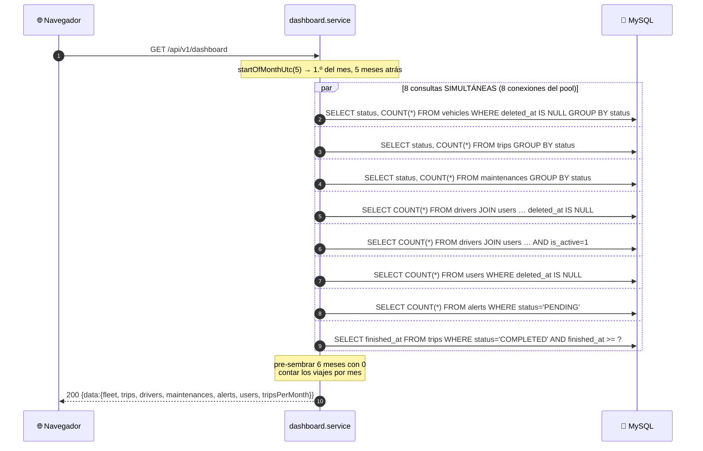
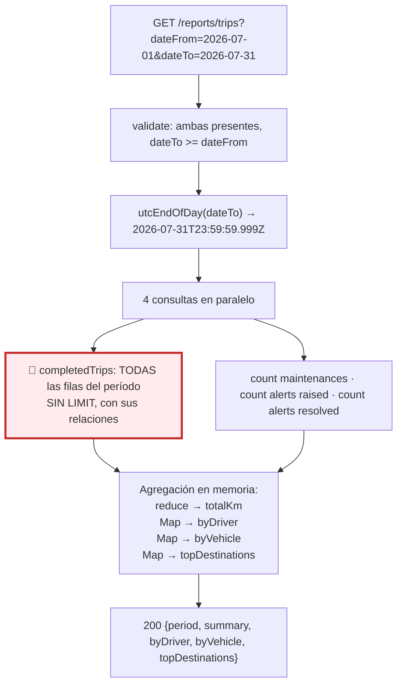

# Capítulo 16 — Dashboard y reportes

> **Prerrequisitos:** [Capítulo 6, §6.6](06-backend-shared.md) (fechas UTC) y los capítulos 10 a 14 (las entidades que se agregan aquí).
> **Archivos que se explican aquí:** los 4 de `modules/dashboard/` (168 líneas) y los 4 de `modules/reports/` (212 líneas). Total: 380 líneas, todas.
> **Al terminar** el lector entenderá los dos módulos de **solo lectura** del sistema, la diferencia entre agregar en SQL y agregar en memoria, y por qué un reporte sin límite de período es un riesgo.

---

## 16.1. Introducción

Estos son los únicos dos módulos del proyecto que **no escriben nada**. No tienen `create`, ni `update`, ni transacciones, ni auditoría. Solo leen y agregan.

Y esa simplicidad estructural deja al descubierto un problema que los demás módulos ocultan: **cómo agregar datos eficientemente**.

| | **Dashboard** | **Reportes** |
|:--|:--|:--|
| Pregunta que responde | *"¿Cómo está el sistema **ahora**?"* | *"¿Qué pasó **entre estas dos fechas**?"* |
| Período | Instantánea + serie de 6 meses | Definido por el usuario |
| Permiso | ADMIN + OPERATOR | **Solo ADMIN** |
| Endpoints | 1 | 1 |
| Estrategia | `groupBy` en SQL | **Agregación en memoria** |
| Volumen de datos | Acotado | 🔴 **Sin límite** |

El capítulo cubre:

1. **Ocho consultas en paralelo** y por qué `groupBy` es la herramienta correcta para los conteos.
2. **La serie temporal pre-sembrada**, un detalle pequeño con impacto grande en la interfaz.
3. **Por qué los reportes agregan en memoria** y no en SQL — con la justificación del código y su límite.
4. **Y el riesgo que nadie acotó:** un reporte sobre diez años carga diez años de viajes en RAM.

---

## 16.2. Conceptos previos

### 16.2.1. Agregar en SQL vs. agregar en memoria

Cuando hay que calcular totales, promedios o conteos, hay dos lugares donde hacerlo:

| | **En SQL** | **En memoria (Node)** |
|:--|:--|:--|
| Quién calcula | El motor de base de datos | El proceso de la aplicación |
| Datos que viajan | **Solo el resultado** | **Todas las filas** |
| Memoria usada | La de MySQL, optimizada | La del proceso Node |
| Puede usar índices | ✅ Sí | ❌ No |
| Expresiones calculadas | ✅ Sí (`SUM(a - b)`) | ✅ Sí |
| Lógica compleja | ⚠️ Limitada | ✅ Cualquiera |

🔴 **La regla general es agregar en SQL siempre que se pueda.** Traer 100.000 filas para contarlas es desperdiciar red, memoria y tiempo cuando `COUNT(*)` devuelve un número.

**Este proyecto usa las dos estrategias, y la elección de cada una está justificada:**

| Módulo | Estrategia | Razón |
|:--|:--|:--|
| **Dashboard** | `groupBy` de Prisma (SQL) | Los conteos por estado son agregaciones simples |
| **Reportes** | Agregación en memoria | Necesita `SUM(arrivalKm - departureKm)`, **una expresión calculada que el `groupBy` de Prisma no soporta** |

💡 **La limitación de Prisma es real:** su `groupBy` solo puede agregar **columnas**, no expresiones. `_sum: { arrivalKm }` funciona; `_sum: { arrivalKm - departureKm }` no existe.

⚠️ **Pero `$queryRaw` sí podría hacerlo**, y el proyecto ya lo usa en tres módulos (§4.8.2). **La justificación del comentario es correcta sobre Prisma y omite la alternativa disponible.**

### 16.2.2. Instantánea vs. período

**El dashboard responde sobre el AHORA:** *"¿cuántos vehículos están disponibles en este instante?"*. No tiene parámetros: siempre devuelve el estado actual.

**El reporte responde sobre un INTERVALO:** *"¿cuántos viajes se completaron en julio?"*. Exige dos fechas.

🔴 **Y la diferencia tiene una consecuencia de diseño que el dashboard resuelve mal:**

```ts
trips: { inProgress, pendingAssignment, completed }
```

**`completed` cuenta TODOS los viajes completados de la historia**, sin límite temporal. Al principio es un número informativo; después de tres años es un número que solo crece y no dice nada sobre el estado actual del sistema.

💡 **Un KPI de tablero debe ser *accionable*.** "Hay 3 viajes pendientes de asignación" invita a actuar. "Se completaron 14.328 viajes desde 2024" es trivia.

---

## 16.3. El dashboard

### 16.3.1. Las rutas: un solo endpoint

```ts
6  /**
7   * Live KPI dashboard (P-AD-1). Both the Operator and the Admin have a
8   * dashboard; the payload is the same and the frontend renders per role.
9   */
12 dashboardRoutes.use(authenticate, authorize('ADMIN', 'OPERATOR'));
14 dashboardRoutes.get('/', dashboardController.metrics);
```

💡 **El comentario declara una decisión de diseño interesante:** *"the payload is the same and the frontend renders per role"*.

**Un solo endpoint sirve a dos roles con necesidades distintas**, y el filtrado por rol ocurre en el frontend.

| Enfoque | Ventaja | Desventaja |
|:--|:--|:--|
| **Un payload, filtrado en el frontend** (elegido) | Un endpoint, una caché, menos código | 🔴 El operador **recibe** datos que no debería ver |
| Payload distinto por rol | Cada uno recibe lo suyo | Dos formas de respuesta, más complejidad |

🔴 **Y el problema es concreto: `users.total` está en el payload.**

**El operador no tiene acceso al módulo de usuarios** (`users.routes.ts:16` exige `ADMIN`), pero **recibe el conteo total de usuarios** en el dashboard. No es un dato crítico, pero es información que su rol no debería obtener — y **el frontend puede ocultarlo, la respuesta HTTP no.**

💡 **Es exactamente el mismo error conceptual que confiar en los guards del frontend** (§7.2.2): ocultar en la interfaz no es lo mismo que no enviar. Cualquiera con las herramientas de desarrollo abiertas lo ve.

**El controlador es el más corto del proyecto** (12 líneas) y `metrics` no recibe parámetros: `_req` con guion bajo.

### 16.3.2. `groupBy` y las ocho consultas

```ts
10 fleetByStatus(): Promise<{ status: VehicleStatus; _count: number }[]> {
11   return prisma.vehicle
12     .groupBy({ by: ['status'], where: { deletedAt: null }, _count: true })
13     .then((rows) => rows.map((r) => ({ status: r.status, _count: r._count })));
14 },
```

⚙️ **`groupBy` se traduce a SQL nativo:**

```sql
SELECT status, COUNT(*) AS _count
  FROM vehicles WHERE deleted_at IS NULL
 GROUP BY status;
```

**Devuelve como máximo cuatro filas** (una por estado del enum), sin importar si hay 5 vehículos o 5.000. **MySQL puede resolverlo enteramente desde el índice `idx_vehicles_status`** (§3.4.5) sin tocar la tabla.

**Línea 13 — el `.then` con `map`**

```ts
.then((rows) => rows.map((r) => ({ status: r.status, _count: r._count })))
```

⚠️ **Parece redundante** (copia cada objeto tal cual), pero cumple una función de **tipado**: el tipo que Prisma devuelve para `groupBy` es complejo y depende de las opciones; el `map` lo "aplana" al tipo simple declarado en la firma.

💡 **Es una transformación de tipo, no de datos.** Podría lograrse con una aserción, pero el `map` es honesto: construye realmente lo que promete.

🔴 **Nótese la asimetría de los filtros de borrado:**

| Consulta | ¿Filtra borrados? | ¿Correcto? |
|:--|:--:|:--|
| `fleetByStatus` | ✅ `deletedAt: null` | Sí — `vehicles` tiene borrado lógico |
| `tripsByStatus` | ❌ No filtra | ✅ Correcto — `trips` **no tiene** `deletedAt` (§12.2.3) |
| `maintenancesByStatus` | ❌ No filtra | ✅ Correcto — tampoco lo tiene |
| `driversTotal` / `driversActive` | ✅ `user: { deletedAt: null }` | Sí |
| `usersTotal` | ✅ `deletedAt: null` | Sí |
| `pendingAlerts` | ❌ No filtra | ✅ Correcto — `alerts` no tiene borrado |

✅ **Cada consulta filtra exactamente si la tabla lo requiere.** Es coherencia real con el modelo de datos, no aplicación mecánica de un patrón.

**Líneas 43-53 — las ocho consultas en paralelo**

```ts
const [fleet, trips, maint, driversTotal, driversActive, usersTotal, pendingAlerts, completed] =
  await Promise.all([
    dashboardRepository.fleetByStatus(),
    dashboardRepository.tripsByStatus(),
    dashboardRepository.maintenancesByStatus(),
    dashboardRepository.driversTotal(),
    dashboardRepository.driversActive(),
    dashboardRepository.usersTotal(),
    dashboardRepository.pendingAlerts(),
    dashboardRepository.completedTripsSince(since),
  ]);
```

💡 **Ocho consultas independientes, todas en paralelo** (§9.6.2). Si cada una tarda 5 ms:

| Estrategia | Tiempo total |
|:--|--:|
| Secuencial | **40 ms** |
| `Promise.all` | **~8 ms** |

🔴 **Pero consume OCHO conexiones del pool simultáneamente**, y el pool tiene 10 por defecto (§4.4). **Dos dashboards cargando a la vez saturan el pool**, y cualquier otra petición espera.

⚠️ **Con un dashboard que se recarga automáticamente cada 30 segundos y cinco usuarios conectados, eso es una carga constante y no despreciable.** No hay caché de ningún tipo: **cada carga ejecuta las ocho consultas de nuevo.**

**Una caché de 30 segundos en memoria reduciría la carga en un orden de magnitud** para un dato que, por naturaleza, no necesita ser exacto al milisegundo.

### 16.3.3. La serie temporal y el pre-sembrado

```ts
30 /** First day (UTC) of the month, `monthsBack` months before the current one. */
31 function startOfMonthUtc(monthsBack: number): Date {
32   const now = new Date();
33   return new Date(Date.UTC(now.getUTCFullYear(), now.getUTCMonth() - monthsBack, 1));
34 }
```

⚙️ **`Date.UTC` normaliza los meses negativos automáticamente.** En enero de 2026, `getUTCMonth()` es `0`; con `monthsBack = 5`, el argumento es `-5`, y `Date.UTC(2026, -5, 1)` produce correctamente **agosto de 2025**.

💡 **Es la misma propiedad de `setUTCDate` explotada en §4.7.2**, y evita toda la aritmética de "si el mes es negativo, restar un año".

⚠️ **Y es la quinta implementación de manipulación de fechas del proyecto** (§14.4), fuera de `shared/utils/dates.ts`.

**Líneas 59-69 — el detalle que hace usable el gráfico**

```ts
// Per-month series: pre-seed the last 6 months with 0 so the chart has a
// continuous axis even for months without completed trips.
const series = new Map<string, number>();
for (let i = MONTHS_WINDOW - 1; i >= 0; i--) {
  series.set(monthKey(startOfMonthUtc(i)), 0);
}
for (const t of completed) {
  if (!t.finishedAt) continue;
  const key = monthKey(t.finishedAt);
  if (series.has(key)) series.set(key, (series.get(key) ?? 0) + 1);
}
```

🔴 **El pre-sembrado con ceros resuelve un problema real de visualización.**

**Sin él**, un sistema con viajes solo en marzo y julio produciría:

```json
[{"month":"2026-03","count":12},{"month":"2026-07","count":8}]
```

**Y el gráfico dibujaría una línea de marzo a julio como si fueran meses consecutivos** — sugiriendo una tendencia que no existe. **Los meses vacíos desaparecerían del eje.**

**Con el pre-sembrado:**

```json
[{"month":"2026-03","count":12},{"month":"2026-04","count":0},
 {"month":"2026-05","count":0},{"month":"2026-06","count":0},
 {"month":"2026-07","count":8},{"month":"2026-08","count":3}]
```

💡 **El eje es continuo y los ceros son informativos:** "no hubo actividad" es un dato, no una ausencia de dato.

**El bucle descendente (`i = 5; i >= 0; i--`)** inserta los meses **del más antiguo al más reciente**, y `Map` **conserva el orden de inserción** — así que `[...series.entries()]` (línea 88) sale cronológicamente ordenado sin necesidad de `sort`.

⚙️ **La garantía de orden de `Map` es parte del estándar de JavaScript desde ES2015**, a diferencia de los objetos planos, cuyo orden de claves es más sutil. **Elegir `Map` aquí no es casual.**

**Línea 68 — `if (series.has(key))`**

Descarta los viajes cuyo mes **no está en la ventana**. En principio no debería ocurrir (la consulta ya filtra `finishedAt >= since`), pero es defensa contra un viaje con `finishedAt` en el futuro — que **el sistema permite**, porque no valida fechas (§12.4).

**Línea 66 — `if (!t.finishedAt) continue;`**

⚠️ **Un viaje `COMPLETED` sin `finishedAt` no debería existir** (§3.4.9), pero el tipo es `Date | null` y TypeScript exige la comprobación. **Si existiera, se descartaría en silencio** — sin log ni advertencia.

### 16.3.4. El KPI mal nombrado

```ts
maintenances: { pending: maintCount('PENDING') + maintCount('IN_PROGRESS') },
```

Y en la interfaz (línea 18):

```ts
maintenances: { pending: number }; // scheduled = PENDING + IN_PROGRESS (C-6)
```

🔴 **El campo se llama `pending` y contiene `PENDING + IN_PROGRESS`.**

**El comentario reconoce la discrepancia** (*"scheduled = PENDING + IN_PROGRESS"*) **y no la corrige.** El nombre correcto sería `scheduled`, que es el término que usa el propio proyecto en `listMaintenancesQuerySchema.view` (`maintenances.schemas.ts:73`).

⚠️ **Es un nombre que miente al consumidor.** Un desarrollador de frontend que vea `maintenances.pending` mostrará "Mantenimientos pendientes: 3" — cuando dos de esos tres **ya están en curso en el taller**.

💡 **Es el tipo de deuda que cuesta cinco caracteres arreglar hoy y se vuelve permanente en cuanto un cliente depende del nombre.**

---

## 16.4. Los reportes

### 16.4.1. El esquema y la validación cruzada

```ts
3  /**
4   * Trip report over a selectable period (A-11). Both bounds are required;
5   * dateTo must not precede dateFrom. The period is inclusive of full days:
6   * the service normalizes dateTo to the end of that day.
7   */
8  export const reportQuerySchema = z
9    .object({
10     dateFrom: z.coerce.date(),
11     dateTo: z.coerce.date(),
12   })
13   .refine((data) => data.dateTo >= data.dateFrom, {
14     path: ['dateTo'],
15     message: 'dateTo must be greater than or equal to dateFrom',
16   });
```

✅ **Ambas fechas son obligatorias** (sin `.optional()`), a diferencia de los filtros de listado. **Correcto: un reporte sin período no tiene sentido.**

✅ **`.refine` con `path: ['dateTo']`** asigna el error al campo correcto, para que el formulario lo marque (§13.2.1).

✅ **`>=` permite un reporte de un solo día** (`dateFrom === dateTo`), que con `utcEndOfDay` cubre las 24 horas.

🔴 **Lo que NO valida: la LONGITUD MÁXIMA del período.**

**`?dateFrom=1900-01-01&dateTo=2100-12-31` es una petición perfectamente válida.**

**Y en `reports.service.ts:100`:**

```ts
reportsRepository.completedTrips(from, to),
```

**Que ejecuta:**

```sql
SELECT … FROM trips
 WHERE status='COMPLETED' AND finished_at >= ? AND finished_at <= ?
 ORDER BY finished_at ASC;
```

🔴 **Sin `LIMIT`. Todas las filas del período, con sus relaciones, cargadas en memoria.**

**El escalado del problema:**

| Viajes en el período | Filas en RAM | Memoria aproximada |
|--:|--:|--:|
| 1.000 | 1.000 | ~1 MB |
| 100.000 | 100.000 | ~100 MB |
| 1.000.000 | 1.000.000 | 🔴 **~1 GB → proceso caído** |

⚠️ **Y no hace falta ser malicioso:** el formulario del frontend probablemente ofrezca un selector de fechas sin restricciones, y un usuario que quiera "todo el histórico" pondrá 2020-2030.

💡 **Es exactamente la misma clase de riesgo que `paginationSchema.limit.max(100)` previene en los listados** (§6.3.2) — y aquí no hay equivalente.

**Las tres mitigaciones posibles:**

```ts
// — opción 1: acotar el período —
.refine((d) => (d.dateTo.getTime() - d.dateFrom.getTime()) <= 366 * 24 * 3600 * 1000,
        { path: ['dateTo'], message: 'El período no puede superar un año' })
```

```ts
// — opción 2: acotar las filas —
const trips = await prisma.trip.findMany({ …, take: 50_000 });
if (trips.length === 50_000) throw new BusinessRuleError('Período demasiado amplio, acotalo');
```

```sql
-- — opción 3: agregar en SQL (la solución de fondo) —
SELECT d.user_id, u.name, COUNT(*) AS trips, SUM(t.arrival_km - t.departure_km) AS km
  FROM trips t JOIN drivers d ON d.user_id = t.driver_id JOIN users u ON u.id = d.user_id
 WHERE t.status='COMPLETED' AND t.finished_at BETWEEN ? AND ?
 GROUP BY d.user_id, u.name;
```

💡 **La tercera elimina el problema de raíz:** devuelve una fila por chofer en vez de una por viaje, sin importar el período.

### 16.4.2. `finishedAt` y no `departureAt`

```ts
4  /**
5   * Trips completed within the period, with the minimal relations the report
6   * needs. "Completed within the period" is keyed on finishedAt (when the trip
7   * was actually done), not departureAt.
…
21   where: { status: 'COMPLETED', finishedAt: { gte: from, lte: to } },
```

💡 **La decisión está documentada y es correcta**, y merece desarrollarse porque no es obvia.

**Un viaje que sale el 30 de junio y llega el 2 de julio: ¿de qué mes es?**

| Criterio | Mes asignado | Argumento |
|:--|:--|:--|
| `departureAt` | Junio | "Se planificó en junio" |
| **`finishedAt`** (elegido) | **Julio** | **"Los kilómetros se recorrieron cuando terminó"** |

🔴 **El criterio de `finishedAt` es el correcto para este reporte porque los kilómetros solo se conocen al finalizar.** Un viaje en curso no tiene `arrivalKm`, así que no puede aportar al total de ningún mes. **Contarlo por `departureAt` obligaría a decidir qué hacer con los viajes que aún no terminaron.**

⚠️ **Y produce un efecto que hay que conocer: un reporte de junio ejecutado el 1 de julio puede cambiar si se ejecuta el 5 de julio**, porque viajes que salieron en junio y terminaron en julio se cuentan en julio. **El reporte de un mes no es estable hasta que todos sus viajes cerraron.**

⚠️ **Nótese además que los otros tres contadores usan campos distintos:**

| Contador | Campo de filtro |
|:--|:--|
| `completedTrips` | `finishedAt` |
| `maintenancesCompleted` | `completedAt` |
| `alertsRaised` | `raisedAt` |
| `alertsResolved` | `resolvedAt` |

✅ **Cada uno usa el momento en que el hecho ocurrió**, que es lo coherente. **Pero significa que las cuatro cifras del resumen no responden exactamente a la misma pregunta temporal** — una alerta puede haberse generado en junio y resuelto en julio, contando en ambos reportes de forma distinta.

### 16.4.3. La agregación en memoria

```ts
41 /** Per-trip distance (RN-5 guarantees arrival > departure when both set). */
42 function tripKm(trip: ReportTrip): number {
43   if (trip.arrivalKm === null || trip.departureKm === null) return 0;
44   return trip.arrivalKm - trip.departureKm;
45 }
```

⚠️ **Devolver `0` ante datos incompletos es una decisión silenciosa.**

**Un viaje `COMPLETED` siempre debería tener ambos kilometrajes** (§3.4.9), pero **si la invariante se violara** —por un `UPDATE` manual, o por la carrera de §12.6.4— **ese viaje contribuiría 0 km al total sin ninguna señal.**

💡 **El comentario cita RN-5 como garantía**, pero RN-5 se aplica **al finalizar**, no impide que alguien altere la fila después. **Un `console.warn` costaría una línea y haría visible la corrupción.**

**Líneas 47-60 — el patrón de agrupación con `Map`**

```ts
function aggregateByDriver(trips: ReportTrip[]): DriverBreakdown[] {
  const map = new Map<number, DriverBreakdown>();
  for (const trip of trips) {
    if (!trip.driver) continue;
    const id = trip.driver.userId;
    const entry = map.get(id) ??
      { driverId: id, name: trip.driver.user.name, dni: trip.driver.dni, tripCount: 0, totalKm: 0 };
    entry.tripCount += 1;
    entry.totalKm += tripKm(trip);
    map.set(id, entry);
  }
  return [...map.values()].sort((a, b) => b.tripCount - a.tripCount);
}
```

**El patrón "agrupar y acumular" en cinco pasos:**

1. Un `Map` con la clave de agrupación.
2. Recorrer los elementos.
3. `map.get(id) ?? {valorInicial}` — obtener la entrada o crearla.
4. Acumular sobre la entrada.
5. Convertir a arreglo y ordenar.

💡 **`?? {…}` es la forma concisa de "obtener o inicializar"**, y funciona porque `Map.get` devuelve `undefined` (no `null`) cuando la clave no existe.

⚠️ **`map.set(id, entry)` en la línea 57 es redundante cuando la entrada ya existía**, porque `entry` es la **misma referencia** que está en el `Map` y las mutaciones de las líneas 55-56 ya la modificaron. **Solo hace falta la primera vez.** No es un error —es idempotente— pero es una operación innecesaria por cada viaje.

**Línea 50 — `if (!trip.driver) continue;`**

⚠️ **Un viaje `COMPLETED` sin chofer no debería existir**, pero el tipo lo permite y se descarta en silencio. **Esos viajes SÍ cuentan en `summary.totalKm`** (línea 106, que recorre todos) **pero NO en `byDriver`**.

🔴 **Consecuencia: `sum(byDriver.totalKm)` puede ser MENOR que `summary.totalKm`**, sin que nada lo explique. Un usuario que sume la columna del desglose y no llegue al total no tendría forma de saber por qué.

**Línea 59 — el orden**

```ts
.sort((a, b) => b.tripCount - a.tripCount)
```

**Descendente por cantidad de viajes.** El chofer más activo primero.

⚠️ **Ordena por `tripCount`, no por `totalKm`.** Un chofer con 20 viajes cortos aparece antes que uno con 5 viajes de larga distancia. **Es una elección razonable** (la actividad importa) **pero no es configurable**, y para un reporte de utilización de flota el kilometraje podría ser más relevante.

**`aggregateByVehicle` es una copia casi literal** de `aggregateByDriver` (líneas 62-81): mismo patrón, distinta clave y distintos campos.

💡 **Es duplicación estructural genuina**, y se podría factorizar con un genérico:

```ts
// — mejora propuesta —
function aggregate<K, T>(
  items: ReportTrip[],
  keyOf: (t: ReportTrip) => K | null,
  init: (t: ReportTrip) => T,
): (T & { tripCount: number; totalKm: number })[] { … }
```

⚠️ **Con el intercambio habitual:** el genérico es más abstracto y más difícil de leer que dos funciones concretas de 18 líneas. **Para dos casos, la duplicación es defendible.**

**Líneas 83-92 — `topDestinations`**

```ts
function topDestinations(trips: ReportTrip[], limit = 10): DestinationBreakdown[] {
  const map = new Map<string, number>();
  for (const trip of trips) {
    map.set(trip.destination, (map.get(trip.destination) ?? 0) + 1);
  }
  return [...map.entries()]
    .map(([destination, tripCount]) => ({ destination, tripCount }))
    .sort((a, b) => b.tripCount - a.tripCount)
    .slice(0, limit);
}
```

**Más compacto porque solo acumula un número**, sin objeto intermedio.

🔴 **Y aquí hay un problema de calidad de datos que el código no puede resolver: `destination` es texto libre** (`createTripSchema.destination: z.string().min(2).max(120)`, §12.4).

**Consecuencia:**

| Destino escrito | ¿Se agrupan? |
|:--|:--|
| `"Córdoba"` | — |
| `"Cordoba"` (sin tilde) | 🔴 **No** — entrada distinta |
| `"córdoba"` (minúscula) | 🔴 **No** |
| `"Córdoba "` (espacio final) | 🔴 **No** |

**El "top 10 de destinos" puede tener el mismo destino cuatro veces**, repartiendo sus viajes y desplazando destinos reales fuera del ranking.

💡 **La solución de fondo sería una tabla `destinations`** con una clave foránea desde `trips` — que es lo que sugiere el ejercicio 7 de §3.11. **La mitigación barata sería normalizar en el esquema** (`.transform(v => v.trim())`), como hace `licensePlateSchema` con las patentes (§10.4).

⚠️ **`limit = 10` es un parámetro con valor por defecto que nadie sobrescribe:** el servicio lo llama sin argumento (línea 123). **Es extensibilidad no usada**, y sería trivial exponerlo como parámetro de consulta.

### 16.4.4. El servicio y `utcEndOfDay`

```ts
async tripReport(query: ReportQuery): Promise<TripReport> {
  const from = query.dateFrom;
  const to = utcEndOfDay(query.dateTo);
  …
}
```

💡 **Tercera aparición de `utcEndOfDay`** (tras `trips` §12.5.2 y `audit-logs` §15.3.3), y con el mismo propósito: hacer inclusivo el límite superior.

**Sin ella, un reporte "del 1 al 31 de julio" perdería casi todo el 31.**

⚠️ **Y aquí es MÁS grave que en los listados**, porque un reporte se usa para tomar decisiones o para facturar. **Un total de kilómetros al que le falta el último día del mes es un error de negocio, no una molestia de interfaz.**

**Línea 112 — `period: { from, to }` en la respuesta**

```ts
period: { from, to },
```

✅ **Excelente detalle:** el reporte **devuelve el período que efectivamente usó**, con `to` ya normalizado a `23:59:59.999`.

💡 **Eso hace el reporte auto-descriptivo:** si alguien lo exporta o lo archiva, el rango exacto viaja con los datos. **Y permite verificar que la normalización ocurrió** — el cliente ve `2026-07-31T23:59:59.999Z`, no la medianoche que envió.

**Líneas 106-109 — el resumen**

```ts
const totalKm = trips.reduce((sum, t) => sum + tripKm(t), 0);
const completedTrips = trips.length;
const averageDistanceKm =
  completedTrips > 0 ? Math.round((totalKm / completedTrips) * 100) / 100 : 0;
```

**`Math.round(x * 100) / 100`** es el idioma estándar para redondear a dos decimales en JavaScript.

⚠️ **Y arrastra la imprecisión de la coma flotante:** `Math.round(1.005 * 100) / 100` da `1` y no `1.01`, porque `1.005 * 100` es `100.49999999999999` en binario. **Para un promedio de kilómetros es irrelevante; para dinero sería inaceptable.**

✅ **La guarda `completedTrips > 0` evita la división por cero**, que en JavaScript daría `NaN` — un valor que `JSON.stringify` convierte en `null` y que rompería cualquier gráfico.

---

## 16.5. Flujo interno

### 16.5.1. El dashboard: ocho consultas paralelas



### 16.5.2. El reporte: una consulta grande y agregación en memoria



---

## 16.6. Ejemplos

### Ejemplo 1 — El dashboard sobre la base sembrada

```bash
curl http://localhost:3000/api/v1/dashboard -H "Authorization: Bearer $OPERADOR"
```

```json
{"data":{
  "fleet":{"total":5,"available":2,"inWorkshop":1,"onTrip":1,"inactive":1},
  "trips":{"inProgress":1,"pendingAssignment":1,"completed":3},
  "drivers":{"total":4,"active":4},
  "maintenances":{"pending":1},
  "alerts":{"pending":8},
  "users":{"total":6},
  "tripsPerMonth":[
    {"month":"2026-03","count":0},{"month":"2026-04","count":0},
    {"month":"2026-05","count":0},{"month":"2026-06","count":0},
    {"month":"2026-07","count":0},{"month":"2026-08","count":3}]
}}
```

**Cuatro verificaciones:**

1. ✅ `fleet` suma 5 = los cinco vehículos del seed.
2. ✅ La serie tiene **seis** entradas, cinco con `0` — el pre-sembrado funcionando.
3. ⚠️ `maintenances.pending: 1` es el mantenimiento `IN_PROGRESS` de EEE555. **El nombre dice "pending" y el dato es "en curso".**
4. 🔴 **`users.total: 6` lo recibe el OPERADOR**, que no tiene acceso al módulo de usuarios.

### Ejemplo 2 — La fuga de información al operador

```bash
# Confirmar que el operador NO puede listar usuarios
curl .../users -H "Authorization: Bearer $OPERADOR"
# → 403 Forbidden ✅

# Pero SÍ recibe el conteo
curl .../dashboard -H "Authorization: Bearer $OPERADOR" | grep -o '"users":{[^}]*}'
# → "users":{"total":6}   🔴
```

💡 **El frontend puede ocultarlo; la respuesta HTTP no.** Cualquiera con F12 abierto lo ve.

### Ejemplo 3 — El reporte sin límite

```bash
curl ".../reports/trips?dateFrom=1900-01-01&dateTo=2100-12-31" \
  -H "Authorization: Bearer $ADMIN"
```

**Con el seed devuelve 3 viajes.** Pero la consulta ejecutada es:

```sql
SELECT … FROM trips WHERE status='COMPLETED'
   AND finished_at >= '1900-01-01' AND finished_at <= '2100-12-31 23:59:59.999'
 ORDER BY finished_at ASC;
```

🔴 **Sin `LIMIT`.** Con 500.000 viajes históricos, esa consulta traería 500.000 objetos a la memoria del proceso.

**Simulación del riesgo:**

```sql
-- Estimar el volumen antes de pedir el reporte
SELECT COUNT(*) FROM trips WHERE status='COMPLETED';
```

⚠️ **El sistema no ofrece esta estimación al usuario**, ni rechaza períodos amplios, ni pagina.

### Ejemplo 4 — Los destinos que no se agrupan

```bash
# Crear tres viajes con el mismo destino escrito distinto
for d in "Córdoba" "Cordoba" "córdoba "; do
  curl -X POST .../trips -H "Authorization: Bearer $OPERADOR" \
    -H 'Content-Type: application/json' \
    -d "{\"destination\":\"$d\",\"departureAt\":\"2026-08-05T08:00:00Z\"}"
done
# … asignarlos y finalizarlos …

curl ".../reports/trips?dateFrom=2026-08-01&dateTo=2026-08-31" -H "Authorization: Bearer $ADMIN"
```

```json
"topDestinations":[
  {"destination":"Córdoba","tripCount":1},
  {"destination":"Cordoba","tripCount":1},
  {"destination":"córdoba ","tripCount":1}]
```

🔴 **Tres entradas para el mismo destino.** El "top 10" queda inutilizable, y destinos reales quedan fuera del ranking.

### Ejemplo 5 — La descuadratura del desglose

```sql
-- Provocar la inconsistencia: un viaje completado sin chofer
UPDATE trips SET driver_id = NULL WHERE id = 1 AND status = 'COMPLETED';
```

```bash
curl ".../reports/trips?dateFrom=2026-08-01&dateTo=2026-08-31" -H "Authorization: Bearer $ADMIN"
```

🔴 **`summary.totalKm` incluye los kilómetros de ese viaje** (línea 106 recorre todos), **pero `byDriver` no lo cuenta** (línea 50 lo descarta).

**Sumando la columna `totalKm` del desglose por chofer, el resultado es MENOR que el total del resumen — y nada lo explica.**

### Ejemplo 6 — El reporte de junio que cambia

```bash
# El 1 de julio
curl ".../reports/trips?dateFrom=2026-06-01&dateTo=2026-06-30" -H "Authorization: Bearer $ADMIN"
# → completedTrips: 42

# Un viaje que salió el 30 de junio se finaliza el 2 de julio
# El 5 de julio, MISMO reporte:
curl ".../reports/trips?dateFrom=2026-06-01&dateTo=2026-06-30" -H "Authorization: Bearer $ADMIN"
# → completedTrips: 42   ← NO cambia, porque se cuenta por finishedAt (julio)
```

💡 **El reporte de junio es estable**, y el viaje aparece en el de julio. **Es coherente**, pero un usuario que espere ver ese viaje en junio (porque salió en junio) no lo encontrará. **La decisión está documentada en el código y no en la interfaz.**

---

## 16.7. Resumen

1. **Son los dos únicos módulos de solo lectura del proyecto:** sin transacciones, sin auditoría, sin reglas de negocio.

2. **El dashboard usa `groupBy` (agregación en SQL)** y ejecuta ocho consultas en paralelo. Cada una filtra los borrados **exactamente si su tabla los tiene** — coherencia real con el modelo.

3. **El pre-sembrado de la serie temporal con ceros** hace que el gráfico tenga un eje continuo, y aprovecha que `Map` conserva el orden de inserción para salir cronológicamente ordenado sin `sort`.

4. **Los reportes agregan en memoria** porque el `groupBy` de Prisma no puede sumar expresiones calculadas (`arrivalKm - departureKm`). La justificación es correcta y omite que `$queryRaw` —ya usado en tres módulos— sí podría.

5. **`finishedAt` y no `departureAt`** es el criterio correcto para el período, porque los kilómetros solo se conocen al finalizar.

6. **`period` en la respuesta hace el reporte auto-descriptivo**, mostrando el rango ya normalizado.

7. **Nueve hallazgos concretos:**

   | # | Hallazgo | Gravedad |
   |:-:|:--|:--|
   | 1 | 🔴 **`/reports/trips` no acota el período ni las filas.** Un reporte sobre diez años carga todos los viajes del período en RAM, sin `LIMIT` ni paginación. No hace falta ser malicioso: un selector de fechas sin restricciones basta. | **Alta** |
   | 2 | 🔴 **El operador recibe `users.total`**, aunque no tiene acceso al módulo de usuarios. El frontend puede ocultarlo; la respuesta HTTP no. Mismo error conceptual que confiar en los guards. | Media |
   | 3 | 🔴 **`topDestinations` no normaliza el texto libre.** *"Córdoba"*, *"Cordoba"* y *"córdoba "* son tres entradas distintas, y el ranking se vuelve inutilizable. | Media |
   | 4 | 🔴 **`sum(byDriver.totalKm)` puede no coincidir con `summary.totalKm`:** los viajes sin chofer cuentan en el total y se descartan del desglose, en silencio. | Media |
   | 5 | ⚠️ **`maintenances.pending` contiene `PENDING + IN_PROGRESS`.** El comentario reconoce la discrepancia y no corrige el nombre. Debería llamarse `scheduled`. | Media |
   | 6 | ⚠️ **Sin caché en el dashboard:** cada carga ejecuta 8 consultas y consume 8 de las 10 conexiones del pool. Con recarga automática y varios usuarios, es carga constante evitable. | Media |
   | 7 | ⚠️ **`trips.completed` cuenta toda la historia**, sin ventana temporal. Un KPI que solo crece y deja de ser accionable. | Baja |
   | 8 | ⚠️ **`tripKm` devuelve 0 ante datos incompletos, en silencio.** Una corrupción de datos se traduce en kilómetros faltantes sin ninguna señal. | Baja |
   | 9 | ⚠️ **Solo existe UN reporte** (viajes), sin exportación a CSV o PDF, sin parámetro de ordenamiento y con `limit = 10` fijo en los destinos. | Baja |
   | 10 | ⚠️ **Quinta implementación de manipulación de fechas** fuera de `shared/utils/dates.ts`. | Baja |

---

## 16.8. Preguntas de repaso

1. ¿Cuándo conviene agregar en SQL y cuándo en memoria? ¿Por qué los reportes eligen memoria y cuál es la alternativa que se omitió?
2. ¿Por qué `fleetByStatus` filtra `deletedAt` y `tripsByStatus` no? ¿Es una inconsistencia?
3. ¿Qué problema de visualización resuelve el pre-sembrado de la serie con ceros? Describir el gráfico incorrecto que se evita.
4. ¿Por qué la serie sale ordenada cronológicamente sin llamar a `sort`?
5. `Date.UTC(2026, -5, 1)` — ¿qué devuelve y por qué eso simplifica el código?
6. El operador recibe `users.total`. ¿Por qué es un problema si el frontend lo oculta?
7. ¿Por qué `maintenances.pending` está mal nombrado? ¿Qué vería un usuario del frontend?
8. ¿Por qué el reporte se filtra por `finishedAt` y no por `departureAt`? ¿Qué efecto secundario tiene?
9. ¿Qué pasa si alguien pide un reporte de 1900 a 2100? Describir el escalado del problema y las tres mitigaciones.
10. `sum(byDriver.totalKm)` no coincide con `summary.totalKm`. ¿Cómo puede ocurrir?
11. ¿Por qué `map.set(id, entry)` es redundante en `aggregateByDriver` cuando la entrada ya existía?
12. ¿Por qué `topDestinations` puede mostrar el mismo destino varias veces? ¿Cuáles son las dos soluciones?
13. ¿Qué hace `utcEndOfDay` en el reporte y por qué es más grave omitirlo aquí que en un listado?
14. ¿Por qué la respuesta incluye `period` si el cliente ya sabe qué pidió?

<details>
<summary><strong>Respuestas</strong></summary>

1. **En SQL siempre que se pueda**: el motor calcula, solo viaja el resultado, y puede usar índices. **En memoria** cuando la lógica es demasiado compleja para SQL o cuando el ORM no la soporta. **Los reportes eligen memoria** porque el `groupBy` de Prisma solo agrega **columnas**, no expresiones: `_sum: { arrivalKm }` existe, `_sum: { arrivalKm - departureKm }` no. **La alternativa omitida es `$queryRaw`**, que sí puede hacer `SUM(arrival_km - departure_km)` y que el proyecto ya usa en tres módulos.

2. **No es inconsistencia: es coherencia con el modelo.** `vehicles` tiene `deleted_at` (borrado lógico, §3.4.5), así que hay que filtrarlo. `trips` **no tiene** borrado lógico — su borrado es físico y solo para viajes pendientes (§12.2.3) — así que no hay nada que filtrar. Cada consulta filtra exactamente si su tabla lo requiere.

3. Sin el pre-sembrado, los meses sin viajes **desaparecen del arreglo**, y el gráfico dibuja una línea directa entre los meses que sí tienen datos — **sugiriendo una tendencia continua donde en realidad hubo meses de inactividad**. Con ceros explícitos, el eje es continuo y "no hubo actividad" se representa como el dato que es.

4. Porque el bucle de pre-sembrado va **del más antiguo al más reciente** (`i = 5; i >= 0; i--`) y **`Map` conserva el orden de inserción** — garantía del estándar de JavaScript desde ES2015, a diferencia de los objetos planos. Así que `[...series.entries()]` sale ya ordenado.

5. Devuelve **agosto de 2025** (si estamos en enero de 2026). `Date.UTC` **normaliza automáticamente los meses fuera del rango 0-11**, restando años según haga falta. **Simplifica el código** porque evita toda la aritmética de "si el mes resultante es negativo, sumarle 12 y restar un año al año".

6. Porque **ocultar en la interfaz no es lo mismo que no enviar**. El dato viaja en la respuesta HTTP y cualquiera con las herramientas de desarrollo abiertas —o con `curl`— lo ve. Es el mismo error conceptual que confiar en los guards del frontend para la seguridad (§7.2.2): **la barrera real tiene que estar en el servidor**.

7. Porque **contiene `PENDING + IN_PROGRESS`**, y el comentario de la línea 18 lo reconoce (*"scheduled = PENDING + IN_PROGRESS"*) sin corregir el nombre. **Un desarrollador de frontend mostraría "Mantenimientos pendientes: 3"** cuando dos de esos tres **ya están en curso en el taller**. El nombre correcto sería `scheduled`, que es el término que el propio proyecto usa en `listMaintenancesQuerySchema.view`.

8. Porque **los kilómetros solo se conocen al finalizar**: un viaje en curso no tiene `arrivalKm` y no puede aportar al total de ningún mes. Contarlo por `departureAt` obligaría a decidir qué hacer con los viajes aún no cerrados. **El efecto secundario:** un viaje que sale el 30 de junio y llega el 2 de julio **cuenta en julio**, así que un usuario que lo busque en el reporte de junio no lo encontrará — y el reporte de un mes no es definitivo hasta que todos sus viajes cerraron.

9. La consulta trae **todas** las filas del período, con sus relaciones, **sin `LIMIT`**, a la memoria del proceso. Escalado: 1.000 viajes ≈ 1 MB; 100.000 ≈ 100 MB; **1.000.000 ≈ 1 GB → el proceso cae**. **Las tres mitigaciones:** (a) acotar el período con un `.refine` (máximo un año); (b) acotar las filas con `take` y rechazar si se alcanza el tope; (c) **agregar en SQL con `GROUP BY`**, que devuelve una fila por chofer sin importar el período — la solución de fondo.

10. Porque **`summary.totalKm` recorre TODOS los viajes** (línea 106) mientras **`aggregateByDriver` descarta los que no tienen chofer** (`if (!trip.driver) continue`, línea 50). Un viaje `COMPLETED` con `driver_id = NULL` —que no debería existir pero el tipo permite— **aporta kilómetros al total y no aparece en ningún renglón del desglose**. El usuario suma la columna, no llega al total, y nada lo explica.

11. Porque **`entry` es la misma referencia que ya está guardada en el `Map`**. Las mutaciones de las líneas 55-56 (`entry.tripCount += 1`) modifican **ese mismo objeto**, así que volver a guardarlo no cambia nada. **Solo hace falta la primera vez**, cuando la entrada se acaba de crear con el `??`. No es un error (es idempotente) pero es una operación innecesaria por cada viaje.

12. Porque **`destination` es texto libre** (`z.string().min(2).max(120)`) y el `Map` agrupa por igualdad exacta de strings: *"Córdoba"*, *"Cordoba"*, *"córdoba"* y *"Córdoba "* son cuatro claves distintas. **Las dos soluciones:** (a) **de fondo**, una tabla `destinations` con clave foránea desde `trips`; (b) **barata**, normalizar en el esquema con `.transform(v => v.trim())` y quizá comparación insensible a mayúsculas y acentos — igual que `licensePlateSchema` hace con las patentes.

13. Convierte `dateTo` de medianoche a `23:59:59.999`, haciendo el límite superior **inclusivo**: sin ella, un reporte "hasta el 31 de julio" perdería casi todo el 31 de julio. **Es más grave aquí que en un listado** porque un reporte se usa para tomar decisiones o para facturar: **un total de kilómetros al que le falta el último día del mes es un error de negocio**, no una molestia de interfaz que se corrige recargando.

14. Porque **devuelve el período que EFECTIVAMENTE se usó**, con `dateTo` ya normalizado a `23:59:59.999`. Eso hace el reporte **auto-descriptivo**: si se exporta o se archiva, el rango exacto viaja con los datos. Y **permite verificar que la normalización ocurrió** — el cliente ve el fin de día real, no la medianoche que envió.

</details>

---

## 16.9. Ejercicios propuestos

**Nivel 1 — Observación**

1. Cargar el dashboard con `log: ['query']` activado y contar las consultas. Verificar que se emiten en paralelo comparando las marcas de tiempo.
2. Verificar que `tripsPerMonth` tiene siempre seis entradas, incluso con la base recién sembrada.
3. Pedir un reporte de un solo día (`dateFrom === dateTo`) y verificar en `period` que `to` es `23:59:59.999`.
4. Pedir un reporte con `dateTo < dateFrom` y documentar el mensaje y su `path`.

**Nivel 2 — Verificación de los hallazgos**

5. Reproducir el **ejemplo 2**: confirmar que el operador recibe `users.total` pese al 403 en `/users`.
6. Reproducir el **ejemplo 4**: crear viajes con el mismo destino escrito de tres formas y ver el ranking roto.
7. Reproducir el **ejemplo 5** y verificar que el desglose no cuadra con el resumen.
8. Generar 10.000 viajes completados con un script y medir el tiempo, la memoria y el tamaño de la respuesta de un reporte que los cubra.
9. Cargar el dashboard desde tres pestañas simultáneamente con `log: ['query']` y observar la contención del pool.

**Nivel 3 — Corrección**

10. Agregar el límite de período (máximo un año) al esquema de reportes y verificar con el ejercicio 8.
11. Reescribir `byDriver` y `byVehicle` como agregaciones SQL con `$queryRaw` y `GROUP BY`. Comparar el tiempo y la memoria con el ejercicio 8.
12. Quitar `users.total` del payload del dashboard cuando el actor es `OPERATOR`, o dividir el endpoint por rol.
13. Renombrar `maintenances.pending` a `maintenances.scheduled` y actualizar el frontend.
14. Normalizar `destination` con `.trim()` en el esquema, y evaluar si conviene además comparar sin acentos ni mayúsculas en `topDestinations`.
15. Agregar una caché en memoria de 30 segundos al dashboard y medir la reducción de consultas con cinco usuarios recargando.
16. Agregar exportación a CSV del reporte, con las tres tablas del desglose. Decidir cómo manejar el límite de filas.
17. Acotar `trips.completed` del dashboard a los últimos 30 días y evaluar si el KPI se vuelve más accionable.

---

**Anterior:** [Capítulo 15 — La auditoría](15-modulo-audit-logs.md) · **Siguiente:** Capítulo 17 — Configuración de empresa *(pendiente)*
