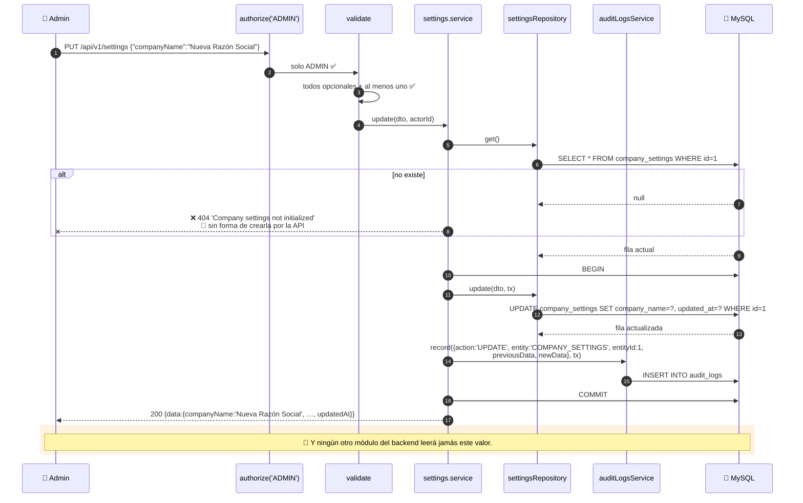

# Capítulo 17 — Configuración de empresa

> **Prerrequisitos:** [Capítulo 3, §3.4.12](03-base-de-datos.md) (la tabla de una sola fila) y [Capítulo 13, §13.2.2](13-modulo-maintenance.md) (`PUT` vs `PATCH`).
> **Archivos que se explican aquí:** los 4 de `modules/settings/` (133 líneas). Total: 133 líneas, todas.
> **Al terminar** el lector entenderá el módulo más pequeño del sistema, verá **el mismo verbo HTTP usado con semánticas opuestas en dos módulos**, y descubrirá que la configuración que el sistema guarda **no la usa nadie del lado del servidor**.

---

## 17.1. Introducción

Ciento treinta y tres líneas, dos endpoints, una sola fila en la base. Es el módulo más simple del proyecto.

Y precisamente por eso sirve para ver con claridad tres cosas que en módulos grandes quedan tapadas:

1. **Una inconsistencia de contrato entre módulos.** `PUT /settings` acepta campos parciales; `PUT /maintenance-types/:id` exige el conjunto completo. **El mismo verbo, semánticas opuestas, en el mismo proyecto.**

2. **Configuración que se almacena y no se consume.** `timezone`, `language` y `dateFormat` se guardan cuidadosamente. **Ningún código del backend los lee.**

3. **Un permiso que probablemente esté mal.** Solo `ADMIN` puede leer la configuración — pero el formato de fecha lo necesita **toda** la interfaz.

---

## 17.2. Conceptos previos

### 17.2.1. Configuración de despliegue vs. configuración de negocio

Un sistema tiene dos clases de configuración, y confundirlas es un error frecuente:

| | **De despliegue** (`.env`) | **De negocio** (`company_settings`) |
|:--|:--|:--|
| Quién la define | Quien opera el servidor | **El usuario administrador** |
| Cuándo cambia | Al desplegar | En cualquier momento, desde la interfaz |
| Requiere reinicio | ✅ Sí | ❌ No |
| Ejemplos | `DATABASE_URL`, `JWT_ACCESS_SECRET`, `PORT` | Razón social, CUIT, teléfono |
| Dónde vive | Archivo, fuera de Git | **Base de datos** |
| ¿Se audita? | No | ✅ **Sí** |

💡 **El criterio para decidir: ¿la cambiaría el cliente sin llamar al equipo técnico?** Si la respuesta es sí, va en la base de datos.

🔴 **Y aquí se ve por qué `FIXED_TRIP_ORIGIN` está en el lugar equivocado.** Vive en `config/constants.ts:16` **y** como `@default` de `schema.prisma:215` (§3.4.9, §5.4). Es el domicilio de la empresa: **cambia si la empresa se muda**, no si se despliega el sistema. **Debería salir de `company_settings.address`.**

**Con la ubicación actual, mudarse requiere:**

1. Editar `constants.ts`.
2. Editar `schema.prisma` y generar una migración.
3. Compilar y desplegar.

**Con la ubicación correcta:** editar un campo en la pantalla de configuración.

### 17.2.2. El patrón de fila única, revisado

`company_settings` tiene una sola fila, con `id = 1` (§3.4.12). El módulo lo implementa con una constante:

```ts
const SETTINGS_ID = 1;
```

**Y solo expone dos operaciones:**

| Operación | ¿Existe? | Por qué |
|:--|:--:|:--|
| `get` | ✅ | Leer la fila 1 |
| `update` | ✅ | Modificar la fila 1 |
| **`create`** | ❌ | **La crea el seed** |
| `delete` | ❌ | Nunca se borra |

🔴 **La ausencia de `create` tiene una consecuencia operativa concreta**, que se analiza en §17.4.1: **si el seed no se ejecutó, el módulo devuelve 404 para siempre y no hay forma de inicializarlo desde la API.**

---

## 17.3. Las rutas y el esquema

```ts
8  /** Company settings (P-AD-6). Admin-only. */
9  export const settingsRoutes = Router();
10
11 settingsRoutes.use(authenticate, authorize('ADMIN'));
12
13 settingsRoutes.get('/', settingsController.get);
14 settingsRoutes.put('/', validate(updateSettingsSchema), settingsController.update);
```

**Línea 13 — sin `:id`**

💡 **La ruta es `/settings`, no `/settings/1`.** Es coherente con el patrón de fila única: **el recurso es singular**, no una colección con un elemento. Exponer el id obligaría al cliente a conocer un detalle de implementación que no le aporta nada.

**Línea 13 — `get` sin `validate`**

No hay parámetros que validar: la ruta no tiene `:id` ni acepta filtros.

### 17.3.1. El permiso que probablemente esté mal

```ts
settingsRoutes.use(authenticate, authorize('ADMIN'));
```

🔴 **`GET /settings` es solo para administradores. Y eso deja sin acceso a datos que la interfaz necesita para TODOS los roles.**

**Los tres campos de presentación:**

| Campo | Para qué sirve | ¿Quién lo necesita? |
|:--|:--|:--|
| `dateFormat` (`DD/MM/YYYY`) | Formatear todas las fechas de la interfaz | **Todos los roles** |
| `language` (`es-AR`) | Localización de textos y números | **Todos los roles** |
| `timezone` (`America/Argentina/Cordoba`) | Mostrar los `DATETIME` en hora local | **Todos los roles** |

**Un operador ve fechas en cada pantalla: viajes, mantenimientos, alertas. Un chofer ve la fecha de su viaje y el vencimiento de sus documentos.** Ninguno de los dos puede consultar el formato configurado.

**Las consecuencias en el frontend:**

| Consecuencia | Detalle |
|:--|:--|
| El formato se codifica a mano | El frontend usa `dayjs` con un formato fijo, ignorando la configuración |
| Cambiar `dateFormat` no tiene efecto visible | Salvo, quizá, en las pantallas de administrador |
| **La configuración es decorativa para dos de los tres roles** | — |

💡 **La corrección natural sería separar los permisos:**

```ts
// — mejora propuesta —
settingsRoutes.get('/', authenticate, authorize('ADMIN','OPERATOR','DRIVER'), settingsController.get);
settingsRoutes.put('/', authenticate, authorize('ADMIN'), validate(updateSettingsSchema), settingsController.update);
```

⚠️ **Con un matiz de privacidad:** `GET /settings` devuelve también el CUIT, el teléfono y el correo de contacto de la empresa. **No son secretos** (aparecen en cualquier factura), pero un endpoint de "preferencias de presentación" separado sería más limpio que exponer los datos fiscales a un chofer.

### 17.3.2. El esquema y la contradicción de `PUT`

```ts
3  /**
4   * Company settings update (P-AD-6). Partial: any subset of fields can be sent.
5   * The single settings row (id = 1) is created by the seed and only updated.
6   */
7  export const updateSettingsSchema = z
8    .object({
9      companyName: z.string().min(1).max(150).optional(),
10     taxId: z.string().min(1).max(13).optional(),
11     address: z.string().min(1).max(200).optional(),
12     phone: z.string().min(1).max(30).optional(),
13     email: z.string().email().max(150).optional(),
14     timezone: z.string().min(1).max(50).optional(),
15     language: z.string().min(1).max(10).optional(),
16     dateFormat: z.string().min(1).max(20).optional(),
17   })
18   .refine((data) => Object.keys(data).length > 0, { message: 'At least one field is required' });
```

🔴 **El verbo es `PUT` y la semántica es de `PATCH`.**

**El comentario lo dice explícitamente:** *"**Partial**: any subset of fields can be sent."* Y todos los campos son `.optional()`, con el `.refine` de "al menos un campo" característico de las actualizaciones parciales.

**Comparación directa con el otro `PUT` de recurso del proyecto:**

| | `PUT /settings` | `PUT /maintenance-types/:id` |
|:--|:--|:--|
| Campos opcionales | ✅ **Todos** | ❌ **Ninguno** |
| Tiene `.refine` de "al menos uno" | ✅ Sí | ❌ No |
| Ausente significa | **"no tocar"** | **"borrar"** (§13.3.2) |
| Semántica real | **PATCH** | **PUT** |

🔴 **El mismo verbo HTTP, con significados opuestos, en el mismo proyecto.**

**Y el riesgo es concreto para quien consuma la API:** un cliente que aprenda el comportamiento en un módulo y lo aplique en el otro **borra datos sin querer** o **no borra cuando cree que sí**.

💡 **`PATCH` sería el verbo correcto aquí**, y dejaría `PUT` reservado para la semántica de reemplazo completo que usa `maintenance-types`. **Es un cambio de cinco caracteres** con impacto en la coherencia del contrato.

⚠️ **Nótese que hay un tercer `PUT` en el proyecto:** `PUT /drivers/:id/password` (§11.3), que **sí** tiene semántica de reemplazo (una contraseña se reemplaza entera). **Dos de tres `PUT` son correctos.**

### 17.3.3. Las validaciones que faltan

**Los ocho campos usan `z.string()` con longitud acotada.** Solo `email` valida formato.

🔴 **Tres campos tienen un dominio conocido y NO se validan contra él:**

| Campo | Valor esperado | Validación actual | Qué pasa con basura |
|:--|:--|:--|:--|
| `timezone` | Una zona IANA (`America/Argentina/Cordoba`) | `string(1..50)` | Se guarda `"cualquier cosa"` |
| `language` | Una etiqueta BCP 47 (`es-AR`) | `string(1..10)` | Se guarda `"xx"` |
| `dateFormat` | Un patrón de `dayjs` (`DD/MM/YYYY`) | `string(1..20)` | Se guarda `"???"` |

⚠️ **El fallo ocurriría en el frontend, no aquí.** `dayjs.tz('...')` con una zona inválida lanza; un formato absurdo produce texto ilegible en toda la interfaz. **El error se manifiesta lejos de donde se originó**, que es la peor propiedad que puede tener un bug.

**Y las tres validaciones son fáciles:**

```ts
// — mejora propuesta —
timezone: z.string().refine((v) => Intl.supportedValuesOf('timeZone').includes(v),
                            'Zona horaria inválida').optional(),
language: z.string().regex(/^[a-z]{2}(-[A-Z]{2})?$/, 'Formato BCP 47 inválido').optional(),
dateFormat: z.enum(['DD/MM/YYYY', 'MM/DD/YYYY', 'YYYY-MM-DD']).optional(),
```

⚙️ **`Intl.supportedValuesOf('timeZone')`** está disponible en Node 18+ y devuelve la lista completa de zonas IANA que el runtime reconoce. **Es la validación exacta, sin mantener una lista propia.**

🔴 **Y `taxId` merece mención aparte.** `z.string().min(1).max(13)` acepta `"a"` y `"1234567890123"`.

**El CUIT argentino tiene formato fijo `NN-NNNNNNNN-N`** — 13 caracteres exactos — **y un dígito verificador calculable.** La columna es `VARCHAR(13)` precisamente por eso (§3.4.12).

**Una validación de formato sería:**

```ts
taxId: z.string().regex(/^\d{2}-\d{8}-\d$/, 'Formato de CUIT inválido (NN-NNNNNNNN-N)').optional(),
```

💡 **Y el dígito verificador se podría validar con un `.refine`**, lo que atraparía errores de tipeo que el formato solo no detecta. Para un dato que aparece en documentación fiscal, vale la pena.

---

## 17.4. El servicio

```ts
34 export const settingsService = {
35   async get(): Promise<SettingsResponse> {
36     const settings = await settingsRepository.get();
37     if (!settings) throw new NotFoundError('Company settings not initialized');
38     return toResponse(settings);
39   },
40
41   async update(dto: UpdateSettingsDto, actorId: number): Promise<SettingsResponse> {
42     const existing = await settingsRepository.get();
43     if (!existing) throw new NotFoundError('Company settings not initialized');
44
45     const updated = await prisma.$transaction(async (tx) => {
46       const settings = await settingsRepository.update(dto, tx);
47       await auditLogsService.record({
48         actorId, action: 'UPDATE', entity: 'COMPANY_SETTINGS', entityId: settings.id,
53         previousData: toResponse(existing),
54         newData: toResponse(settings),
55       }, tx);
58       return settings;
59     });
60     return toResponse(updated);
61   },
62 };
```

### 17.4.1. El callejón sin salida de la inicialización

```ts
if (!settings) throw new NotFoundError('Company settings not initialized');
```

🔴 **El mensaje es honesto y el sistema no ofrece salida.**

**El escenario:** alguien despliega el backend, ejecuta las migraciones (`prisma migrate deploy`) **y no ejecuta el seed** — que es exactamente lo que el flujo de producción correcto haría, porque el seed carga datos de demostración (§4.7.5) que nadie quiere en producción.

**Resultado:**

| Operación | Respuesta |
|:--|:--|
| `GET /api/v1/settings` | **404 para siempre** |
| `PUT /api/v1/settings` | **404 para siempre** |
| Crear la fila desde la API | ❌ **Imposible** |

**La única salida es un `INSERT` manual:**

```sql
INSERT INTO company_settings (id, company_name, tax_id, address, phone, email, updated_at)
VALUES (1, 'Empresa', '30-00000000-0', 'Dirección', '+54 000', 'x@x.com', NOW(3));
```

💡 **La corrección natural es un `upsert`** — la misma operación que el seed usa (§4.7.3):

```ts
// — corrección propuesta —
async update(dto: UpdateSettingsDto, actorId: number): Promise<SettingsResponse> {
  const existing = await settingsRepository.get();
  const updated = await prisma.$transaction(async (tx) => {
    const settings = existing
      ? await settingsRepository.update(dto, tx)
      : await settingsRepository.create({ id: 1, ...VALORES_POR_DEFECTO, ...dto }, tx);
    await auditLogsService.record({
      actorId, action: existing ? 'UPDATE' : 'CREATE',
      entity: 'COMPANY_SETTINGS', entityId: 1,
      previousData: existing ? toResponse(existing) : undefined,
      newData: toResponse(settings),
    }, tx);
    return settings;
  });
  return toResponse(updated);
}
```

⚠️ **Con una complicación real: los campos obligatorios.** `companyName`, `taxId`, `address`, `phone` y `email` son `NOT NULL` sin valor por defecto (§3.4.12). Un `create` necesita los cinco, y el DTO los tiene todos opcionales. **Habría que exigirlos en el caso de creación o definir valores por defecto**, que es lo que la propuesta hace con `VALORES_POR_DEFECTO`.

**La alternativa más limpia:** que la **migración** inserte la fila inicial en lugar del seed. Así existe siempre, independientemente de si se cargaron datos de demostración.

### 17.4.2. La doble lectura

```ts
const existing = await settingsRepository.get();   // ← lectura 1
…
const settings = await settingsRepository.update(dto, tx);   // devuelve la fila actualizada
```

**Dos accesos a la fila**, y ambos son necesarios:

| Lectura | Para qué |
|:--|:--|
| `existing` (línea 42) | Validar existencia **y** proveer `previousData` para la auditoría |
| El retorno de `update` | Proveer `newData` con el estado ya modificado |

✅ **No hay lectura redundante**, a diferencia de `drivers.update` (§11.6.3), que hace tres.

🔴 **Pero la primera lectura ocurre FUERA de la transacción**, con la ventana de carrera habitual: dos administradores actualizando simultáneamente podrían producir un `previousData` que no refleja el estado real anterior.

⚠️ **El impacto es bajísimo** (la configuración cambia rara vez y el "último gana" es aceptable), **pero la auditoría podría registrar un `previousData` que nunca existió** — un estado intermedio que la otra transacción ya había pisado.

### 17.4.3. `entityId: settings.id`

```ts
entityId: settings.id,
```

**Siempre vale `1`.** Es redundante, pero mantiene la coherencia del formato de auditoría: todos los registros tienen `entityId` salvo los que genuinamente no aplican (§14.5.5).

💡 **Y tiene una ventaja sutil:** si algún día hubiera configuración por sucursal (varias filas), el registro de auditoría ya estaría preparado.

### 17.4.4. `toResponse` y el id ausente

```ts
export interface SettingsResponse {
  companyName: string; taxId: string; address: string; phone: string; email: string;
  timezone: string; language: string; dateFormat: string;
  updatedAt: Date;
}
```

🔴 **Nueve campos de la entidad, y `id` NO está.**

💡 **Es coherente con la ruta sin `:id`** (§17.3): el cliente no necesita saber que hay un `id`, ni que vale 1. **El recurso es singular.**

✅ **Y `updatedAt` sí se expone**, lo que permite a la interfaz mostrar *"última modificación: hace 3 días"* — información útil para una configuración que cambia poco.

⚠️ **Los datos de auditoría guardan `toResponse`, no la entidad**, así que `previousData`/`newData` tampoco incluyen el `id`. **Coherente, aunque significa que el registro de auditoría no es un volcado completo de la fila.**

---

## 17.5. El hallazgo de fondo: configuración que nadie consume

🔴 **Este es el hallazgo más importante del capítulo, y solo es visible habiendo leído los otros doce módulos.**

**Verificación campo por campo de quién lee cada valor:**

| Campo | ¿Lo lee el backend? | ¿Para qué debería servir? |
|:--|:--|:--|
| `companyName` | ❌ **No** | Encabezado de reportes, remitente de correos |
| `taxId` | ❌ **No** | Documentación fiscal |
| `address` | ❌ **No** | 🔴 **Debería ser el origen de los viajes** (§17.2.1) |
| `phone` | ❌ **No** | Contacto en documentos |
| `email` | ❌ **No** | 🔴 **Debería ser el `MAIL_FROM` del mailer** |
| `timezone` | ❌ **No** | Mostrar fechas en hora local |
| `language` | ❌ **No** | Localización |
| `dateFormat` | ❌ **No** | Formatear fechas |

**Ninguno de los ocho campos se lee desde ningún otro módulo del backend.**

**Las tres oportunidades desaprovechadas más claras:**

**1. `address` vs. `FIXED_TRIP_ORIGIN`**

`config/constants.ts:16` define el origen fijo de los viajes con una dirección **codificada en el código fuente**, duplicada además en `schema.prisma:215` (§3.4.9). **`company_settings.address` es exactamente ese dato**, editable desde la interfaz. Mudarse de sede debería ser editar un formulario, no generar una migración.

**2. `email` vs. `MAIL_FROM`**

`config/env.ts:32` define `MAIL_FROM` como variable de entorno, con valor por defecto `"Gestión Logística <no-reply@empresa.com>"`. **`company_settings.email` es el correo de contacto de la empresa.** Cambiar el remitente de las credenciales requiere reiniciar el servidor.

⚠️ **Con un matiz técnico real:** el remitente debe pertenecer a un dominio autorizado en el servidor SMTP, así que **no puede ser cualquier valor**. Es más configuración de despliegue que de negocio. **Pero el nombre visible sí podría venir de `companyName`.**

**3. `timezone` y la interfaz**

El backend trabaja **enteramente en UTC** (§6.6), lo cual es correcto. **Convertir a hora local es responsabilidad del frontend** — pero el frontend **no puede leer la configuración** salvo que el usuario sea administrador (§17.3.1). **La zona horaria configurada es inaccesible para quienes la necesitan.**

💡 **La conclusión: el módulo almacena correctamente una configuración que el sistema ignora.** No está roto —todo funciona— pero un administrador que edite estos campos esperando ver un cambio **no verá ninguno**.

⚠️ **Y es funcionalidad que aparenta estar completa**: la pantalla existe, guarda, audita y devuelve 200. **El fallo es invisible.**

---

## 17.6. Flujo interno



---

## 17.7. Ejemplos

### Ejemplo 1 — La actualización parcial con `PUT`

```http
PUT /api/v1/settings
Authorization: Bearer <admin>
{"phone":"+54 341 555-1234"}
```

```http
HTTP/1.1 200 OK

{"data":{"companyName":"Empresa de Servicios Logísticos","taxId":"30-00000000-0",
         "address":"Ciudad Industria, Rosario, Santa Fe","phone":"+54 341 555-1234",
         "email":"contacto@empresa.com","timezone":"America/Argentina/Cordoba",
         "language":"es-AR","dateFormat":"DD/MM/YYYY","updatedAt":"2026-08-03T…"}}
```

✅ **Los otros siete campos NO se tocaron**, pese al verbo `PUT`.

🔴 **Compárese con `PUT /maintenance-types/1`** enviando solo dos campos (§13.6, ejemplo 2): **ahí los umbrales temporales se BORRAN.**

**El mismo verbo, resultados opuestos.** Un cliente que aprenda un comportamiento y aplique el otro pierde datos.

### Ejemplo 2 — El callejón sin salida

```bash
# Simular un despliegue sin seed
mysql -e "DELETE FROM company_settings;"

curl .../settings -H "Authorization: Bearer $ADMIN"
```

```http
HTTP/1.1 404 Not Found
{"error":{"code":"NOT_FOUND","message":"Company settings not initialized"}}
```

```bash
curl -X PUT .../settings -H "Authorization: Bearer $ADMIN" \
  -H 'Content-Type: application/json' -d '{"companyName":"Mi Empresa"}'
```

```http
HTTP/1.1 404 Not Found
{"error":{"code":"NOT_FOUND","message":"Company settings not initialized"}}
```

🔴 **No hay ninguna forma de salir de este estado por la API.** El mensaje dice *"not initialized"* y no ofrece cómo inicializarla.

### Ejemplo 3 — Las validaciones que no existen

```bash
curl -X PUT .../settings -H "Authorization: Bearer $ADMIN" \
  -H 'Content-Type: application/json' \
  -d '{"timezone":"Marte/Olympus","language":"zz","dateFormat":"???","taxId":"a"}'
```

```http
HTTP/1.1 200 OK    🔴

{"data":{…,"taxId":"a","timezone":"Marte/Olympus","language":"zz","dateFormat":"???",…}}
```

🔴 **Los cuatro valores absurdos se guardaron.** El fallo aparecería en el frontend, al intentar `dayjs.tz('Marte/Olympus')` — **lejos de donde se originó**.

### Ejemplo 4 — El operador que no puede leer el formato de fecha

```bash
curl .../settings -H "Authorization: Bearer $OPERADOR"
```

```http
HTTP/1.1 403 Forbidden
{"error":{"code":"FORBIDDEN","message":"Insufficient permissions for this operation"}}
```

🔴 **El operador ve fechas en todas sus pantallas y no puede saber en qué formato mostrarlas.** El frontend necesariamente usa un formato codificado a mano, ignorando la configuración.

### Ejemplo 5 — La auditoría de un cambio de configuración

```sql
SELECT occurred_at,
       previous_data->>'$.companyName' AS antes,
       new_data->>'$.companyName'      AS despues
  FROM audit_logs WHERE entity = 'COMPANY_SETTINGS' ORDER BY id DESC LIMIT 3;
```

| occurred_at | antes | despues |
|:--|:--|:--|
| 2026-08-03 19:02:… | Empresa de Servicios Logísticos | Nueva Razón Social |

✅ **El cambio queda registrado con el estado completo antes y después**, y sin ningún campo sensible (esta entidad no tiene ninguno).

---

## 17.8. Resumen

1. **Es el módulo más pequeño del proyecto:** 133 líneas, dos endpoints, una fila.

2. **La distinción entre configuración de despliegue y de negocio** es lo que decide si un valor va en `.env` o en la base: **¿lo cambiaría el cliente sin llamar al equipo técnico?**

3. **El recurso es singular:** la ruta no tiene `:id` y la respuesta no expone el `id`. Coherente con el patrón de fila única.

4. **La auditoría registra el estado completo antes y después**, y es el único rastro de quién cambió qué en la configuración.

5. **Siete hallazgos concretos:**

   | # | Hallazgo | Gravedad |
   |:-:|:--|:--|
   | 1 | 🔴 **NINGÚN campo de la configuración lo lee el backend.** Ocho campos que se guardan, se validan, se auditan y se muestran — y no afectan a nada. **Funcionalidad que aparenta estar completa.** | **Alta** |
   | 2 | 🔴 **`PUT` con semántica de `PATCH`**, opuesta a la de `PUT /maintenance-types/:id` en el mismo proyecto. Un cliente que aprenda un comportamiento y aplique el otro **pierde datos**. | **Alta** |
   | 3 | 🔴 **Sin `create`: si el seed no corrió, 404 permanente** y no hay forma de inicializar por la API. Y el flujo de producción correcto (migrar sin sembrar) produce exactamente ese estado. | **Alta** |
   | 4 | 🔴 **`GET /settings` es solo para ADMIN**, pero `dateFormat`, `language` y `timezone` los necesitan las tres interfaces. **El operador y el chofer no pueden leer el formato de las fechas que ven en cada pantalla.** | Media |
   | 5 | ⚠️ **`timezone`, `language` y `dateFormat` no se validan contra sus dominios conocidos.** El fallo se manifiesta en el frontend, lejos del origen. `Intl.supportedValuesOf('timeZone')` resolvería el primero. | Media |
   | 6 | ⚠️ **`taxId` acepta `"a"`.** Un CUIT tiene formato fijo y dígito verificador calculable; la columna es `VARCHAR(13)` precisamente por eso. | Media |
   | 7 | ⚠️ **`FIXED_TRIP_ORIGIN` está duplicado en `constants.ts` y `schema.prisma`** cuando debería salir de `company_settings.address`. Mudarse de sede requiere una migración. | Media |
   | 8 | ⚠️ **La lectura de `existing` ocurre fuera de la transacción**, así que la auditoría podría registrar un `previousData` que otra transacción ya había pisado. | Baja |

---

## 17.9. Preguntas de repaso

1. ¿Cuál es el criterio para decidir si un valor va en `.env` o en `company_settings`?
2. ¿Por qué la ruta es `/settings` y no `/settings/1`? ¿Y por qué la respuesta no incluye `id`?
3. `PUT /settings` y `PUT /maintenance-types/:id` usan el mismo verbo. ¿Qué hace cada uno con un campo ausente? ¿Cuál es el riesgo?
4. Se despliega el sistema en producción ejecutando solo las migraciones. ¿Qué pasa con la configuración? ¿Cómo se sale?
5. ¿Por qué el permiso de lectura probablemente esté mal? ¿Qué campos y qué roles están afectados?
6. Enumerar los ocho campos de la configuración y decir cuáles lee el backend.
7. ¿Por qué `FIXED_TRIP_ORIGIN` debería salir de `company_settings.address`? ¿Qué cuesta hoy mudarse de sede?
8. ¿Qué pasa si se guarda `timezone: "Marte/Olympus"`? ¿Dónde se manifiesta el fallo y por qué eso es lo peor?
9. ¿Por qué `entityId: settings.id` es redundante y por qué se pone igual?
10. `update` hace dos accesos a la fila. ¿Son ambos necesarios? ¿Qué problema tiene el primero?

<details>
<summary><strong>Respuestas</strong></summary>

1. **¿La cambiaría el cliente sin llamar al equipo técnico?** Si la respuesta es sí, va en la base de datos: cambia en cualquier momento, desde la interfaz, sin reiniciar, y se audita. Si es configuración de infraestructura —conexión a la base, secretos, puerto— va en `.env`: la define quien opera el servidor, cambia al desplegar y requiere reinicio.

2. Porque **el recurso es singular**: hay una sola configuración de empresa, no una colección con un elemento. Exponer el `id` obligaría al cliente a conocer un detalle de implementación (que vale 1) que no le aporta nada, y sugeriría falsamente que podría haber otras filas.

3. **`PUT /settings`**: un campo ausente significa **"no tocar"** — semántica de `PATCH`. **`PUT /maintenance-types/:id`**: un campo ausente significa **"borrar"** (`monthsAlert ?? null`) — semántica de `PUT` real. **El riesgo:** un cliente que aprenda el comportamiento en `settings` y envíe solo los campos modificados a `maintenance-types` **borra los umbrales temporales sin querer**; y al revés, quien espere que `PUT /settings` borre lo no enviado se sorprenderá de que no lo haga.

4. **La fila `company_settings` no existe**, porque la crea el **seed**, no la migración. Y el flujo de producción correcto es migrar **sin** sembrar (el seed carga datos de demostración). **Resultado:** `GET` y `PUT` devuelven **404 permanente**, y **no hay endpoint de creación**. La única salida es un `INSERT` manual en MySQL. La corrección correcta es que la **migración** inserte la fila inicial, o que `update` haga `upsert`.

5. Porque **`dateFormat`, `language` y `timezone` los necesitan las tres interfaces** para mostrar fechas correctamente, y el endpoint es solo para `ADMIN`. **El operador** ve fechas en viajes, mantenimientos y alertas; **el chofer** ve la fecha de su viaje y los vencimientos de sus documentos. **Ninguno puede consultar el formato configurado**, así que el frontend usa uno codificado a mano y la configuración es decorativa para dos de los tres roles.

6. `companyName`, `taxId`, `address`, `phone`, `email`, `timezone`, `language`, `dateFormat`. **El backend NO lee ninguno.** Se almacenan, se validan, se auditan y se devuelven — y ningún otro módulo los consume. Es funcionalidad que **aparenta** estar completa: la pantalla guarda, responde 200, y no produce ningún efecto observable.

7. Porque **es el mismo dato**: el domicilio de la empresa, que es el origen fijo de todos los viajes (RN-21). Hoy vive **duplicado** en `config/constants.ts:16` y como `@default` de `schema.prisma:215`. **Mudarse de sede cuesta**: editar `constants.ts`, editar `schema.prisma`, **generar una migración**, compilar y desplegar. **Debería costar**: editar un campo en la pantalla de configuración.

8. **Se guarda tal cual** y la API responde 200. **El fallo se manifiesta en el frontend**, cuando `dayjs.tz('Marte/Olympus')` lanza al formatear cualquier fecha. **Eso es lo peor** porque el error aparece **lejos de donde se originó**: quien vea la pantalla rota no tiene forma de relacionarla con un cambio hecho en otra sección, quizá días antes, por otra persona. `Intl.supportedValuesOf('timeZone')` validaría exactamente en el momento de guardar.

9. Es redundante porque **siempre vale 1** (es el patrón de fila única). **Se pone igual** por dos razones: mantiene la coherencia del formato de auditoría —todos los registros tienen `entityId` salvo los que genuinamente no aplican, como el resumen de evaluación de alertas— y **prepara el terreno** por si algún día hubiera configuración por sucursal, con varias filas.

10. **Sí, ambos son necesarios**: la primera lectura valida la existencia **y** provee `previousData` para la auditoría; el retorno de `update` provee `newData` con el estado ya modificado. **No hay lectura redundante**, a diferencia de `drivers.update`, que hace tres. **El problema del primero** es que ocurre **fuera de la transacción**: dos administradores actualizando simultáneamente podrían producir un `previousData` que refleja un estado ya pisado por la otra transacción — una auditoría de una transición que nunca ocurrió exactamente así.

</details>

---

## 17.10. Ejercicios propuestos

**Nivel 1 — Observación**

1. Actualizar un solo campo con `PUT /settings` y verificar que los otros siete no cambian.
2. Hacer lo mismo con `PUT /maintenance-types/:id` omitiendo los meses, y comparar. Documentar la diferencia.
3. Ejecutar `grep -rn "settingsRepository\|companySettings" backend/src/` y confirmar que solo el propio módulo lo usa.

**Nivel 2 — Verificación de los hallazgos**

4. Reproducir el **ejemplo 2**: borrar la fila y confirmar que no hay forma de recrearla por la API.
5. Reproducir el **ejemplo 3**: guardar valores absurdos y después abrir la aplicación para ver dónde falla.
6. Reproducir el **ejemplo 4**: confirmar el 403 con un token de operador.
7. Cambiar `dateFormat` a `YYYY-MM-DD` y recorrer las pantallas de los tres roles buscando algún cambio. Documentar el resultado.

**Nivel 3 — Corrección**

8. Cambiar el verbo a `PATCH`, dejando `PUT` reservado para la semántica de reemplazo. Actualizar el frontend.
9. Convertir `update` en `upsert` con valores por defecto, y verificar con el ejercicio 4. Evaluar la alternativa de insertar la fila en la migración.
10. Separar los permisos: lectura para los tres roles, escritura solo para `ADMIN`. Evaluar si conviene además dividir en `/settings/public` (presentación) y `/settings` (datos fiscales).
11. Agregar las validaciones de `timezone` (con `Intl.supportedValuesOf`), `language` (BCP 47) y `dateFormat` (enum). Verificar con el ejercicio 5.
12. Agregar la validación de formato y dígito verificador del CUIT.
13. Hacer que `FIXED_TRIP_ORIGIN` salga de `company_settings.address`: quitar la constante, quitar el `@default` del esquema, y leerlo en `trips.create`. Evaluar el impacto en el rendimiento (una consulta extra por viaje) y si conviene cachearlo.
14. Hacer que el frontend consuma `dateFormat` y `timezone` reales en las tres interfaces, y verificar con el ejercicio 7 que ahora sí cambia algo.

---

**Anterior:** [Capítulo 16 — Dashboard y reportes](16-modulo-dashboard-reports.md) · **Siguiente:** Capítulo 18 — Arranque del frontend *(pendiente)*
