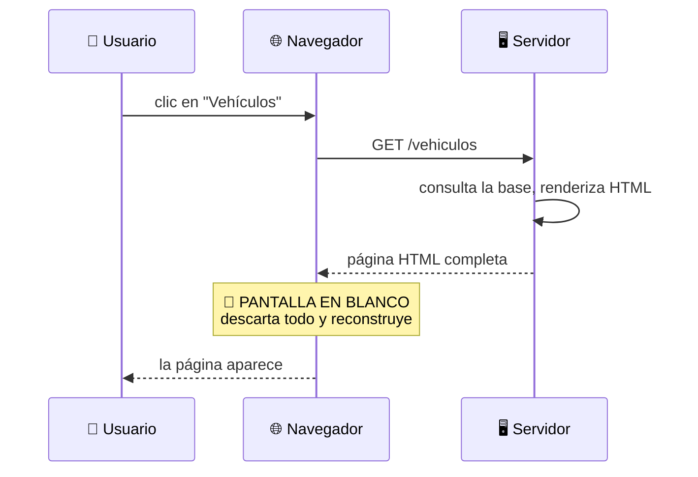
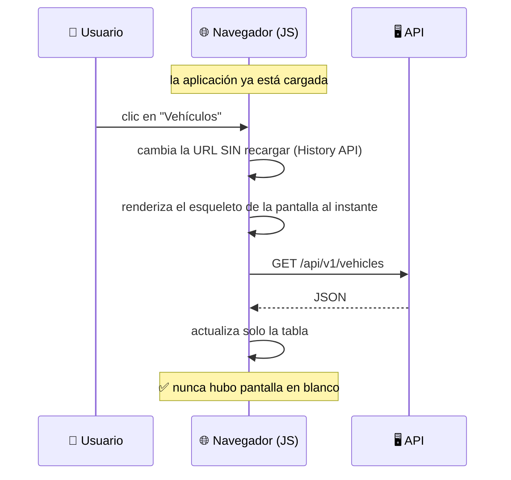
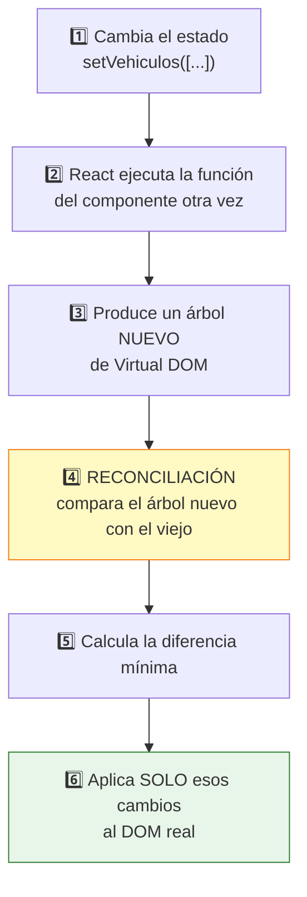
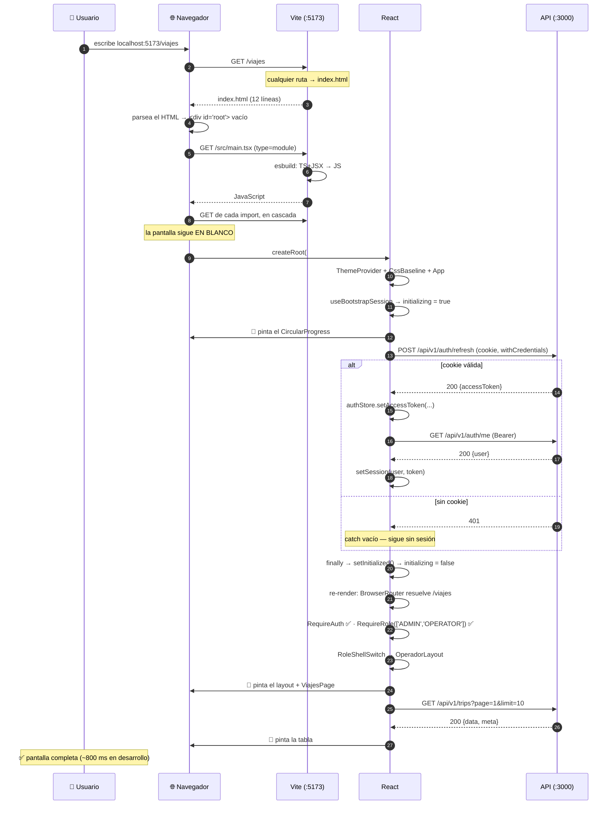

# Capítulo 18 — Arranque del frontend

> **Prerrequisitos:** [Capítulo 1](01-conceptos-previos.md) completo (especialmente JavaScript, TypeScript y el navegador como runtime) y [Capítulo 2, §2.3.4](02-arquitectura.md).
> **Archivos que se explican aquí:** `frontend/index.html` (12 líneas), `vite.config.ts` (9), `tsconfig.json` (23), `vitest.config.ts` (13), `src/vite-env.d.ts` (10), `src/main.tsx` (14), `src/App.tsx` (150), `src/theme.ts` (24). Total: 255 líneas, todas.
> **Al terminar** el lector entenderá React desde cero —JSX, componentes, Virtual DOM, hooks, re-render— y sabrá exactamente qué ocurre entre que el navegador pide una URL y aparece la primera pantalla.

---

## 18.1. Introducción

A partir de aquí cambia el runtime. Todo lo anterior corría en **Node.js**: un proceso en un servidor, con acceso a disco y a la red, sin interfaz. Lo que sigue corre en el **navegador**: un entorno con pantalla, con eventos de usuario, sin disco, y donde **cada usuario tiene su propia copia ejecutándose**.

Ese cambio trae problemas nuevos:

| Problema del servidor | Problema del navegador |
|:--|:--|
| ¿Cómo garantizo la consistencia? | ¿Cómo mantengo la pantalla sincronizada con los datos? |
| ¿Qué pasa si dos peticiones concurren? | ¿Qué pasa si el usuario hace clic dos veces? |
| ¿Cómo protejo el secreto? | **No puedo:** todo el código es visible |
| Un solo proceso | Miles de copias, cada una con su estado |

Este capítulo cubre:

1. **Qué es una SPA** y qué se gana y se pierde respecto del modelo clásico.
2. **Vite**: qué hace en desarrollo, qué hace al construir, y por qué es distinto de Webpack.
3. **React desde cero**: JSX, componentes, el Virtual DOM, el ciclo de renderizado, y los hooks.
4. **`main.tsx`**: catorce líneas que montan la aplicación.
5. **`App.tsx`**: el router completo, la rehidratación de sesión, y el problema que resuelve el token en memoria.
6. **`theme.ts`**: el sistema de diseño en veinticuatro líneas.

---

## 18.2. Conceptos previos

### 18.2.1. MPA vs. SPA

**El modelo clásico (MPA, *Multi Page Application*):**



**El modelo SPA (*Single Page Application*), que es el de este proyecto:**



**La comparación completa:**

| | MPA | **SPA** (elegido) |
|:--|:--|:--|
| Navegación | Recarga completa | ✅ Instantánea |
| Primera carga | ✅ Rápida | ❌ Más lenta (hay que bajar todo el JS) |
| Estado entre pantallas | Se pierde | ✅ Se conserva en memoria |
| Funciona sin JavaScript | ✅ Sí | ❌ **No** |
| Indexable por buscadores | ✅ Sí | ❌ Requiere renderizado en servidor |
| Complejidad del cliente | Baja | **Alta** |
| El servidor genera HTML | Sí | ❌ **No: solo JSON** |

🔴 **La última fila es la que define la arquitectura del proyecto entero.** El backend **nunca** genera HTML: expone 57 endpoints que devuelven JSON (§2.3.1). Eso permite que las tres interfaces por rol —y un futuro cliente móvil— consuman la misma API.

**Y explica por qué `index.html` tiene 12 líneas** (§18.3.1): no hay nada que generar en el servidor.

### 18.2.2. Vite: qué hace y por qué

**Vite** (del francés *vite*, "rápido") cumple dos funciones muy distintas según el modo:

#### En desarrollo: servidor con módulos nativos

⚙️ **No empaqueta nada.** Sirve los archivos fuente directamente al navegador, aprovechando que los navegadores modernos soportan módulos ES nativos:

```html
<script type="module" src="/src/main.tsx"></script>
```

**El navegador pide `main.tsx`; Vite lo transpila al vuelo (TypeScript → JavaScript, JSX → llamadas a función) y lo devuelve.** El navegador ve los `import` y pide los siguientes archivos, uno por uno.

| | **Webpack** (el enfoque anterior) | **Vite** |
|:--|:--|:--|
| Al arrancar | Empaqueta **toda** la aplicación | ✅ Arranca al instante |
| Al guardar un archivo | Reempaqueta el bloque afectado | ✅ Transpila **ese** archivo |
| Tiempo de arranque | Segundos a minutos | **< 1 segundo** |
| Actualización en caliente | Segundos | **Milisegundos** |

💡 **La transpilación la hace esbuild, escrito en Go, entre 10 y 100 veces más rápido que hacerlo con TypeScript.** El truco: esbuild **solo borra los tipos**, no los verifica. La verificación de tipos es un paso aparte (`npm run typecheck`).

🔴 **Consecuencia práctica que sorprende: en desarrollo, un error de tipos NO impide que la aplicación funcione.** Vite transpila y sirve; el error solo aparece en el editor o al ejecutar `tsc --noEmit`. **Es más rápido y menos seguro.**

#### En producción: empaquetado con Rollup

`npm run build` ejecuta `tsc -b && vite build` (`package.json:9`):

1. **`tsc -b`** — verifica los tipos. **Si hay errores, se detiene.**
2. **`vite build`** — empaqueta con Rollup: junta todo, minifica, divide en fragmentos, genera nombres con hash.

💡 **El orden importa: primero verificar, después construir.** Es lo que hace que el error de tipos que no bloquea en desarrollo **sí bloquee el despliegue**.

**El resultado en `dist/`:**

```
dist/
├── index.html                      (con las rutas ya reescritas)
└── assets/
    ├── index-a1b2c3d4.js           (la aplicación, minificada)
    └── index-e5f6g7h8.css
```

⚙️ **El hash en el nombre resuelve el problema de la caché.** Un archivo llamado `index-a1b2c3d4.js` se puede cachear **para siempre**: si el contenido cambia, el hash cambia, y el navegador pide un archivo con otro nombre. **Sin el hash, habría que elegir entre caché agresiva (los usuarios ven una versión vieja) o sin caché (se descarga todo en cada visita).**

### 18.2.3. React desde cero

#### El problema que resuelve

**Sin React**, mantener la pantalla sincronizada con los datos es manual:

```js
// — ejemplo ilustrativo de manipulación directa del DOM —
const vehiculos = await fetch('/api/v1/vehicles').then((r) => r.json());
const tbody = document.querySelector('#tabla tbody');
tbody.innerHTML = '';
for (const v of vehiculos.data) {
  const tr = document.createElement('tr');
  tr.innerHTML = `<td>${v.licensePlate}</td><td>${v.model}</td>`;
  tbody.appendChild(tr);
}
```

🔴 **Los cuatro problemas de este enfoque, que crecen con la aplicación:**

1. **Hay que describir CÓMO cambiar la pantalla**, no cómo debe quedar.
2. **Al cambiar un vehículo hay que encontrar su fila** y actualizarla — o reconstruir toda la tabla, perdiendo el desplazamiento y el foco.
3. **`innerHTML` con datos del usuario es una vulnerabilidad XSS.** Un modelo llamado `` ejecutaría código.
4. **El estado vive en el DOM**, así que leer "qué está seleccionado" significa consultar la pantalla.

**Con React**, se describe **cómo debe verse** la pantalla para un estado dado, y React se encarga del resto:

```tsx
// — el mismo caso, en React —
function TablaVehiculos({ vehiculos }: { vehiculos: Vehicle[] }) {
  return (
    <tbody>
      {vehiculos.map((v) => (
        <tr key={v.id}>
          <td>{v.licensePlate}</td>
          <td>{v.model}</td>
        </tr>
      ))}
    </tbody>
  );
}
```

💡 **Es programación declarativa: se declara el resultado, no los pasos.** La misma diferencia que hay entre SQL (`SELECT … WHERE …`) y recorrer un archivo a mano.

#### JSX: qué es realmente

**JSX no es HTML.** Es una extensión de sintaxis que se **compila a llamadas a función**:

```tsx
// Lo que se escribe:
<div className="caja"><span>Hola</span></div>

// En lo que se convierte (React 17+, transformación automática):
jsx('div', { className: 'caja', children: jsx('span', { children: 'Hola' }) })
```

**Las cinco diferencias con HTML que hay que conocer:**

| HTML | JSX | Por qué |
|:--|:--|:--|
| `class` | **`className`** | `class` es palabra reservada de JavaScript |
| `for` | **`htmlFor`** | Ídem |
| `onclick="..."` | **`onClick={fn}`** | Se pasa una **función**, no un string |
| `style="color: red"` | **`style={{ color: 'red' }}`** | Un **objeto**, con propiedades en camelCase |
| `<br>` | **`<br />`** | Todo elemento debe cerrarse |

**Y las llaves `{}` insertan expresiones JavaScript:**

```tsx
<p>Hola {usuario.nombre}, tenés {mensajes.length} mensajes</p>
```

🔴 **JSX escapa automáticamente lo que se interpola.** Un nombre `<script>alert(1)</script>` se muestra como **texto literal**, no se ejecuta. **Es protección contra XSS por construcción** — exactamente lo contrario de `innerHTML`.

💡 **Y es la diferencia con `credentialsHtml` del mailer** (§6.8.2), que interpola en un string sin escapar y **sí** es vulnerable. **El frontend está protegido por el framework; el backend no tenía quién lo protegiera.**

**Línea 8 del `tsconfig.json`:**

```json
"jsx": "react-jsx"
```

⚙️ **Activa la transformación automática de React 17+.** Con el modo antiguo (`"react"`), cada archivo con JSX necesitaba `import React from 'react'` aunque no usara `React` explícitamente. **Por eso ningún archivo del proyecto lo importa.**

#### Componentes

Un **componente** es una función que recibe **props** y devuelve JSX:

```tsx
function KpiCard({ titulo, valor }: { titulo: string; valor: number }) {
  return <div><h3>{titulo}</h3><p>{valor}</p></div>;
}

// Se usa como si fuera una etiqueta:
<KpiCard titulo="Vehículos disponibles" valor={5} />
```

🔴 **La mayúscula inicial es OBLIGATORIA**, y ya se anticipó en §2.7.1: en JSX, `<kpicard />` se interpreta como una etiqueta HTML literal desconocida; `<KpiCard />` se interpreta como un componente. **Es sintácticamente significativa, no una convención de estilo.**

**Las props son de solo lectura.** Un componente **nunca** modifica lo que recibe. Es lo que hace predecible el flujo: los datos bajan del padre al hijo, y los eventos suben del hijo al padre mediante funciones pasadas como props.

#### El Virtual DOM y el renderizado

⚙️ **Tocar el DOM real es caro.** Cada modificación puede disparar recálculo de estilos, reposicionamiento (*reflow*) y repintado — operaciones que el navegador realiza sobre miles de elementos.

**React mantiene una representación en memoria (el *Virtual DOM*): un árbol de objetos JavaScript que describe cómo debe verse la pantalla.**



💡 **La reconciliación es lo que evita reconstruir la tabla entera** cuando cambia una fila. React compara los dos árboles y descubre que solo un `<td>` cambió de texto.

**Y `key` es lo que hace eficiente ese proceso en las listas:**

```tsx
{vehiculos.map((v) => <tr key={v.id}>…</tr>)}
```

🔴 **Sin `key`, React compara por POSICIÓN.** Al insertar un elemento al principio de una lista de 100, concluiría que **los 100 cambiaron**. Con `key={v.id}`, reconoce que son los mismos elementos desplazados y solo inserta uno.

⚠️ **Y usar el índice como `key` (`key={i}`) es un antipatrón conocido:** al reordenar o eliminar, los índices se reasignan y React asocia el estado interno de un elemento (por ejemplo, el texto escrito en un input) al elemento equivocado.

#### Hooks

Un **hook** es una función que empieza con `use` y permite que un componente tenga estado o efectos.

**Los cinco que usa este proyecto:**

| Hook | Para qué |
|:--|:--|
| `useState` | Estado local que, al cambiar, provoca un re-render |
| `useEffect` | Ejecutar código **después** del render (peticiones, suscripciones) |
| `useMemo` | Memorizar un cálculo caro |
| `useCallback` | Memorizar una función |
| `useNavigate`, `useParams` | De React Router |

🔴 **Las dos reglas de los hooks, que no son opcionales:**

1. **Solo en el nivel superior** del componente — nunca dentro de un `if`, un bucle o una función anidada.
2. **Solo desde componentes o desde otros hooks** — nunca desde una función común.

⚙️ **La razón de la primera regla:** React identifica los hooks **por su orden de llamada**, no por su nombre. Internamente mantiene un arreglo por componente e incrementa un índice en cada llamada. Si un `if` altera el orden entre renders, **el estado del hook 2 se asocia al hook 3** y todo se corrompe.

```tsx
// — ejemplo ilustrativo de lo PROHIBIDO —
if (usuario) {
  const [nombre, setNombre] = useState('');   // 🔴 se salta cuando usuario es null
}
```

---

## 18.3. Los archivos de configuración

### 18.3.1. `index.html` — doce líneas

```html
1  <!doctype html>
2  <html lang="es">
3    <head>
4      <meta charset="UTF-8" />
5      <meta name="viewport" content="width=device-width, initial-scale=1.0" />
6      <title>Gestión Logística</title>
7    </head>
8    <body>
9      <div id="root"></div>
10     <script type="module" src="/src/main.tsx"></script>
11   </body>
12 </html>
```

**Línea 2 — `lang="es"`**

💡 **No es decorativo.** Los lectores de pantalla lo usan para elegir la pronunciación; el navegador, para la corrección ortográfica y la separación silábica.

⚠️ **Está codificado a `"es"`** aunque `company_settings.language` sea configurable (§17.5). **Otra evidencia de que esa configuración no se consume.**

**Línea 5 — el viewport**

🔴 **Es lo que hace que la aplicación funcione en móvil**, y sin él la interfaz del chofer sería inutilizable. `width=device-width` le dice al navegador que use el ancho real del dispositivo en lugar de simular una pantalla de escritorio de 980px y reducirlo todo.

**Línea 9 — el punto de anclaje**

```html
<div id="root"></div>
```

🔴 **Un `div` vacío. Es TODO el contenido de la página.**

**Las 29 pantallas, los tres layouts, las tablas, los formularios y los diálogos se crean en tiempo de ejecución** dentro de ese elemento.

**Línea 10 — el punto de entrada**

```html
<script type="module" src="/src/main.tsx"></script>
```

⚙️ **`type="module"`** habilita los módulos ES nativos (`import`/`export`) e implica **`defer`**: el script se ejecuta **después** de que el HTML se parseó. Por eso `main.tsx` puede buscar `#root` sin esperar a ningún evento.

⚠️ **`src/main.tsx` es TypeScript, y ningún navegador lo ejecuta.** Funciona porque Vite lo transpila al vuelo. **En producción, `vite build` reescribe esta línea** apuntando al archivo empaquetado con hash.

🔴 **Lo que NO tiene, y son omisiones reales:**

| Falta | Consecuencia |
|:--|:--|
| `<noscript>` | Con JavaScript desactivado, el usuario ve una **página en blanco sin ninguna explicación** |
| `<meta name="description">` | — (irrelevante: la aplicación está tras un login) |
| `favicon` | La pestaña muestra el icono genérico |
| `<meta name="theme-color">` | En móvil, la barra del navegador no toma el color de la aplicación |

💡 **El `<noscript>` es el único que importa**, y son tres líneas:

```html
<noscript>Esta aplicación requiere JavaScript. Activalo para continuar.</noscript>
```

### 18.3.2. `vite.config.ts` y `vite-env.d.ts`

```ts
1 import { defineConfig } from 'vite';
2 import react from '@vitejs/plugin-react';
3
4 // Dev server on 5173 (matches the backend CORS_ORIGIN). API calls go to
5 // the backend on 3000 through the VITE_API_URL env var (see src/api/axios.ts).
6 export default defineConfig({
7   plugins: [react()],
8   server: { port: 5173 },
9 });
```

**Nueve líneas.** El plugin de React aporta la transformación de JSX y la **actualización en caliente preservando el estado** (*Fast Refresh*): al guardar un componente, se reemplaza sin perder lo que el usuario tenía escrito en el formulario.

**Línea 8 — el puerto fijo**

💡 **`5173` está fijado a propósito**, no dejado al azar. Debe coincidir **exactamente** con `CORS_ORIGIN` del backend (§5.3.2). Sin el puerto fijo, Vite elegiría otro si el 5173 estuviera ocupado, y **todas las peticiones fallarían por CORS** con un error que no menciona el puerto.

⚠️ **Y sigue habiendo un modo de fallo:** si el 5173 está ocupado, Vite **avisa y usa el 5174**. La aplicación arranca y **ninguna petición funciona.** Agregar `strictPort: true` haría que fallara al arrancar con un mensaje claro — mejor que fallar silenciosamente después.

**`vite-env.d.ts` — el tipado de las variables de entorno**

```ts
1  /// <reference types="vite/client" />
2
3  interface ImportMetaEnv {
4    readonly VITE_API_URL?: string;
5    readonly VITE_GOOGLE_MAPS_API_KEY?: string;
6  }
7
8  interface ImportMeta {
9    readonly env: ImportMetaEnv;
10 }
```

**Línea 1 — una directiva de triple barra**, sintaxis antigua de TypeScript para incluir tipos. Trae los tipos de Vite (`import.meta.env`, `import.meta.hot`).

**Líneas 3-10 — aumentación de interfaz**, el mismo mecanismo que `Express.Request` (§6.4.3): agrega propiedades a interfaces existentes mediante fusión de declaraciones.

🔴 **El prefijo `VITE_` es OBLIGATORIO y es una medida de seguridad.**

⚙️ **Vite inyecta en el paquete final solo las variables que empiezan con `VITE_`.** Una variable llamada `DATABASE_URL` en el `.env` del frontend **no llegaría** al navegador.

**Es una protección deliberada:** todo lo que va al frontend es **público** — cualquiera lo ve abriendo las herramientas de desarrollo. El prefijo obliga a declarar explícitamente "sé que esto será visible".

⚠️ **Y por eso `VITE_GOOGLE_MAPS_API_KEY` está EXPUESTA en el código descargado.** Es inevitable (el navegador debe usarla) y la mitigación correcta es restringir la clave por dominio en la consola de Google, **no** intentar ocultarla. **El `.env.example` no lo advierte.**

**Ambas son `?` (opcionales)**, coherente con que `axios.ts:5` tiene un valor por defecto y con que el mapa es opcional (§2.10).

### 18.3.3. `tsconfig.json` — las diferencias con el backend

| Línea | Opción | Backend | Frontend | Por qué difiere |
|:--:|:--|:--|:--|:--|
| 5 | `lib` | `["ES2022"]` | **`+ DOM, DOM.Iterable`** | 🔴 El navegador **sí** tiene `document`, `window`, `fetch` |
| 7 | `moduleResolution` | `nodenext` | **`bundler`** | Vite resuelve los módulos, no Node |
| 8 | `jsx` | *(ausente)* | **`react-jsx`** | Transformación automática de JSX |
| 11 | `noUnusedLocals` | *(ausente)* | **`true`** | Error ante variables sin usar |
| 12 | `noUnusedParameters` | *(ausente)* | **`true`** | Ídem para parámetros |
| 13 | `noFallthroughCasesInSwitch` | *(ausente)* | **`true`** | Error si un `case` no termina en `break` |
| 17 | `isolatedModules` | *(ausente)* | **`true`** | Cada archivo se transpila por separado |
| 20 | `noEmit` | *(ausente)* | **`true`** | 🔴 **`tsc` NO genera JavaScript** |

🔴 **`noEmit: true` es la diferencia conceptual más importante.**

**En el backend, `tsc` compila:** lee TypeScript y escribe JavaScript en `dist/`.

**En el frontend, `tsc` solo VERIFICA.** No produce nada. **Quien genera el JavaScript es Vite/esbuild.**

💡 **Es una división de responsabilidades: `tsc` es el verificador, esbuild es el traductor.** Y explica por qué son dos pasos en `npm run build` (§18.2.2).

🔴 **`isolatedModules: true` impone una restricción real.** esbuild transpila **cada archivo por separado**, sin conocer los demás. Eso hace imposible distinguir si `export { Foo }` exporta un tipo o un valor, así que TypeScript **exige** `export type { Foo }` cuando es un tipo.

**Y es la razón por la que el proyecto usa el patrón objeto-como-enum** (§4.5.4) en vez de `enum` de TypeScript: los `enum` no son compatibles con `isolatedModules`.

⚠️ **`noUnusedLocals` y `noUnusedParameters` están en el frontend y NO en el backend.** Es una inconsistencia sin justificación aparente: el mismo rigor sería útil en ambos. **Y explica por qué el frontend usa `_` como prefijo** para parámetros deliberadamente no usados.

### 18.3.4. `vitest.config.ts` y el entorno simulado

```ts
6 export default defineConfig({
7   plugins: [react()],
8   test: {
9     environment: 'jsdom',
10    include: ['src/**/*.test.{ts,tsx}'],
11    globals: true,
12  },
13 });
```

**Línea 9 — `environment: 'jsdom'`**

⚙️ **jsdom es una implementación de las APIs del navegador escrita en JavaScript puro**, que corre dentro de Node. Provee `document`, `window`, `localStorage`, eventos — todo salvo el renderizado real de píxeles.

💡 **Permite probar componentes de React sin abrir un navegador**, con tests que corren en milisegundos.

⚠️ **Con límites conocidos:** jsdom **no calcula estilos ni posiciones**. `getBoundingClientRect()` devuelve ceros, así que nada que dependa de geometría se puede probar. Para eso hacen falta Playwright o Cypress, que **el proyecto no tiene** (usa una guía manual, `GUIA-PRUEBAS-E2E.md`).

**Línea 11 — `globals: true`**

Hace que `describe`, `it` y `expect` estén disponibles sin importarlos.

⚠️ **Contrasta con el backend**, donde `crypto.test.ts:1` **sí** los importa explícitamente. **Dos configuraciones distintas para la misma herramienta**, sin razón aparente. Los imports explícitos son mejores para el análisis estático.

🔴 **Y hay una duplicación estructural:** este archivo repite `plugins: [react()]` de `vite.config.ts`. **Vitest puede leer `vite.config.ts` directamente** si se fusionan las configuraciones con `mergeConfig`. Mantener dos archivos que deben coincidir es una fuente de divergencia.

---

## 18.4. `main.tsx` — catorce líneas

```tsx
1  import { StrictMode } from 'react';
2  import { createRoot } from 'react-dom/client';
3  import { CssBaseline, ThemeProvider } from '@mui/material';
4  import { theme } from './theme';
5  import App from './App';
6
7  createRoot(document.getElementById('root')!).render(
8    <StrictMode>
9      <ThemeProvider theme={theme}>
10       <CssBaseline />
11       <App />
12     </ThemeProvider>
13   </StrictMode>,
14 );
```

**Línea 7 — `createRoot` y el `!`**

```tsx
createRoot(document.getElementById('root')!)
```

⚙️ **`createRoot` es la API de React 18.** Sustituye a `ReactDOM.render` de React 17, y habilita el **renderizado concurrente**: React puede interrumpir un render largo para atender una interacción del usuario y retomarlo después.

🔴 **El `!` afirma que `#root` existe.** `getElementById` devuelve `HTMLElement | null`.

**Es cierto porque `index.html:9` lo define y el script tiene `defer` implícito** (§18.3.1) — el HTML ya está parseado cuando esto se ejecuta.

⚠️ **Pero si alguien renombrara el `id` en el HTML, el error sería `Cannot read properties of null`** — poco claro. Un mensaje explícito ayudaría:

```tsx
// — mejora propuesta —
const root = document.getElementById('root');
if (!root) throw new Error('Falta <div id="root"> en index.html');
createRoot(root).render(…);
```

**Línea 8 — `StrictMode` y el doble render**

⚙️ **`StrictMode` NO afecta a producción.** En desarrollo, hace tres cosas:

1. **Renderiza cada componente DOS VECES**, para detectar renders con efectos secundarios.
2. **Ejecuta cada `useEffect` dos veces** (montar → desmontar → montar), para detectar limpiezas faltantes.
3. Advierte sobre APIs obsoletas.

🔴 **El punto 2 tiene una consecuencia directa en este proyecto**, y explica un detalle de `App.tsx` que de otro modo parecería innecesario.

**`useBootstrapSession` llama a `/auth/refresh` en un `useEffect`.** Con `StrictMode`, ese efecto **se ejecuta dos veces en desarrollo**, disparando **dos** peticiones de refresh.

**Y con la rotación de tokens del backend** (§8.6.5), la segunda usaría un token ya revocado por la primera → **401 → sesión perdida.**

💡 **Por eso `App.tsx` implementa la bandera `cancelled`** (§18.5.2). **Sin `StrictMode` nadie habría detectado el problema en desarrollo — y habría aparecido en producción con dos pestañas abiertas.**

**Líneas 9-12 — el orden de los proveedores**

```tsx
<ThemeProvider theme={theme}>
  <CssBaseline />
  <App />
</ThemeProvider>
```

⚙️ **`ThemeProvider` usa el Context de React** para que **cualquier** componente descendiente acceda al tema sin pasarlo por props. Es el mecanismo que evita el "taladro de props" (*prop drilling*).

🔴 **`CssBaseline` debe ir DENTRO de `ThemeProvider` y ANTES de `App`.**

**`CssBaseline` es la normalización de estilos de MUI**: elimina los márgenes por defecto del navegador, unifica el modelo de caja, aplica la tipografía y el color de fondo **del tema**.

- **Dentro de `ThemeProvider`** porque lee `theme.palette.background.default`.
- **Antes de `App`** porque los estilos se inyectan en orden, y los de la aplicación deben poder sobrescribir la normalización, no al revés.

**Lo que NO hay: ningún proveedor de estado global**

⚠️ **No hay `<Provider>` de Redux ni `<QueryClientProvider>`**, porque:

- **Zustand no necesita proveedor** (§20): el store es un módulo importable.
- **No hay librería de estado de servidor** (React Query, SWR): cada pantalla gestiona sus datos con `useState` + `useEffect`.

🔴 **La segunda ausencia tiene costos reales que se analizan en el capítulo 22:** sin caché compartida, cada pantalla vuelve a pedir los mismos datos; sin deduplicación, dos componentes que necesiten los vehículos hacen dos peticiones; y no hay reintentos ni revalidación automática.

---

## 18.5. `App.tsx` — el router y la sesión

### 18.5.1. Los imports y el problema que anuncian

```tsx
1  import { useEffect } from 'react';
2  import { BrowserRouter, Navigate, Route, Routes } from 'react-router-dom';
3  import { Box, CircularProgress } from '@mui/material';
4  import axios from 'axios';
5  import { useAuthStore } from './stores/auth-store';
6  import { authStore } from './stores/auth-store';
7  import { authApi } from './api/auth.api';
8  import { RequireAuth, RequireRole, homePathForRole } from './auth/guards';
   … 3 layouts + 14 páginas …
27 const API_URL = import.meta.env.VITE_API_URL ?? 'http://localhost:3000/api/v1';
```

⚠️ **Líneas 5 y 6: DOS imports del mismo módulo.**

```tsx
import { useAuthStore } from './stores/auth-store';
import { authStore } from './stores/auth-store';
```

**Podrían combinarse en uno.** Son dos exportaciones distintas del mismo archivo:

| Exportación | Qué es | Cuándo se usa |
|:--|:--|:--|
| `useAuthStore` | El **hook** de Zustand | Dentro de componentes, con suscripción a cambios |
| `authStore` | El acceso **imperativo** | Fuera de React (interceptores de Axios) |

💡 **La distinción es real y necesaria** (§20), pero **separarlas en dos líneas de import no aporta nada** — es ruido.

🔴 **Línea 4 — el import de `axios` crudo, y por qué importa.**

El proyecto tiene una instancia configurada en `api/axios.ts` con interceptores (§2.3.5). **Aquí se importa `axios` a secas.**

**Es deliberado y necesario:** el interceptor de respuesta reacciona a los 401 llamando a `/auth/refresh`. **Si la rehidratación inicial usara `api`, un 401 dispararía el interceptor, que llamaría a `/auth/refresh`, que también fallaría con 401… en un bucle.**

⚠️ **Y `api/axios.ts:29` hace lo mismo por la misma razón** (con un comentario que lo explica). **Aquí no hay comentario**, así que alguien podría "unificarlo" y romper la rehidratación.

**Línea 27 — la duplicación de `API_URL`**

```tsx
const API_URL = import.meta.env.VITE_API_URL ?? 'http://localhost:3000/api/v1';
```

🔴 **Literalmente idéntica a `api/axios.ts:5`**, incluida la URL por defecto.

**Cambiar el valor por defecto en un solo lugar produciría dos clientes apuntando a servidores distintos.** Debería exportarse desde `api/axios.ts` y reutilizarse.

### 18.5.2. `useBootstrapSession` — el hook más importante del frontend

```tsx
29 /**
30  * On startup, try to re-hydrate the session from the refresh cookie: the
31  * access token lives only in memory and is lost on reload. If refresh
32  * succeeds we fetch the current user; either way we mark init as done so the
33  * guards can decide.
34  */
35 function useBootstrapSession() {
36   const setSession = useAuthStore((s) => s.setSession);
37   const setInitialized = useAuthStore((s) => s.setInitialized);
38
39   useEffect(() => {
40     let cancelled = false;
41     (async () => {
42       try {
43         const { data } = await axios.post<{ data: { accessToken: string } }>(
44           `${API_URL}/auth/refresh`, {}, { withCredentials: true },
47         );
48         if (cancelled) return;
49         authStore.setAccessToken(data.data.accessToken);
50         const user = await authApi.me();
51         if (!cancelled) setSession(user, data.data.accessToken);
52       } catch {
53         // No valid refresh cookie — stay logged out.
54       } finally {
55         if (!cancelled) setInitialized();
56       }
57     })();
58     return () => {
59       cancelled = true;
60     };
61   }, [setSession, setInitialized]);
62 }
```

#### El problema que resuelve

🔴 **El access token vive SOLO en memoria** (§8.2.2), en una variable JavaScript del store de Zustand.

**Recargar la página (F5) destruye toda la memoria del JavaScript.** El token se pierde.

**Sin este hook, el usuario sería expulsado al login cada vez que recargue** — y eso incluye abrir un enlace en una pestaña nueva, o volver del historial.

**La solución:** al arrancar, intentar `/auth/refresh`. **La cookie `httpOnly` SÍ sobrevive a la recarga** (el navegador la administra, no el JavaScript). Si es válida, se obtiene un token nuevo y la sesión se recupera de forma transparente.

💡 **Es la contrapartida necesaria de la decisión de seguridad del capítulo 8.** El token en memoria es más seguro que en `localStorage`, y el precio es este hook.

#### Línea 36-37 — el selector de Zustand

```tsx
const setSession = useAuthStore((s) => s.setSession);
```

⚙️ **El argumento es un *selector*: una función que extrae una parte del store.** Zustand solo provoca un re-render si **esa parte concreta** cambió.

🔴 **Sin selector (`useAuthStore()` a secas), el componente se re-renderizaría ante CUALQUIER cambio del store** — incluido el token, el usuario o la bandera de inicialización.

**Y como `App` es la raíz del árbol, eso re-renderizaría toda la aplicación.**

💡 **`setSession` y `setInitialized` son funciones que Zustand crea una vez y nunca cambian**, así que este componente **nunca** se re-renderiza por ellas. Es la forma correcta de suscribirse a acciones sin suscribirse a datos.

#### Líneas 39-61 — el `useEffect` y sus tres partes

**El array de dependencias `[setSession, setInitialized]` (línea 61)**

⚙️ **React compara las dependencias entre renders y solo re-ejecuta el efecto si alguna cambió** (comparación por identidad, `Object.is`).

**Como ambas son estables**, el efecto se ejecuta **una sola vez, al montar**.

⚠️ **Un `[]` vacío habría tenido el mismo efecto práctico y sería más honesto sobre la intención** ("ejecutar solo al montar"). Declarar dependencias que nunca cambian es correcto pero indirecto.

**La función asíncrona autoejecutada (líneas 41-57)**

```tsx
(async () => { … })();
```

🔴 **`useEffect` NO puede recibir una función `async`.** Su valor de retorno debe ser la función de limpieza o `undefined`, y una función `async` **siempre devuelve una promesa** — que React interpretaría como función de limpieza e intentaría invocar, produciendo un error.

**La solución estándar: definir una función `async` dentro y ejecutarla inmediatamente.**

**La bandera `cancelled` (líneas 40, 48, 51, 55, 58-60)**

🔴 **Este es el patrón más importante del hook, y protege contra el escenario de `StrictMode` descrito en §18.4.**

```mermaid
sequenceDiagram
    participant R as React (StrictMode)
    participant E1 as Efecto #1
    participant E2 as Efecto #2
    participant A as API

    R->>E1: montar → ejecutar efecto
    E1->>A: POST /auth/refresh (token A)
    R->>E1: DESMONTAR (simulación de StrictMode)
    E1->>E1: limpieza: cancelled = true 🚩
    R->>E2: montar otra vez → efecto nuevo
    E2->>A: POST /auth/refresh (token B, el rotado)
    A-->>E1: respuesta de la 1.ª petición
    Note over E1: if (cancelled) return; ✅ se descarta
    A-->>E2: respuesta de la 2.ª petición
    E2->>E2: setSession(...) ✅ se aplica
```

**Sin la bandera, ocurrirían dos problemas:**

1. **Condición de carrera:** la respuesta de la primera petición (con un token ya rotado) podría llegar **después** de la segunda y sobrescribir el token válido con uno obsoleto.
2. **Advertencia de React:** actualizar el estado de un componente desmontado.

💡 **La limpieza (líneas 58-60) es la función que React invoca al desmontar el componente o antes de re-ejecutar el efecto.** Es el mecanismo de React para cancelar suscripciones, temporizadores y peticiones en vuelo.

⚠️ **Aunque `cancelled` no CANCELA la petición**, solo descarta su resultado. Cancelarla de verdad requeriría un `AbortController`:

```tsx
// — mejora propuesta —
const controller = new AbortController();
await axios.post(url, {}, { withCredentials: true, signal: controller.signal });
return () => controller.abort();
```

**Con la ventaja adicional de liberar la conexión.**

**Línea 45 — `withCredentials: true`**

🔴 **Sin esta opción, el navegador NO envía la cookie de refresh** en una petición de origen cruzado (§1.2.3), y la rehidratación fallaría siempre — con un 401 que parecería "sesión vencida" cuando en realidad la cookie nunca viajó.

**Líneas 52-53 — el `catch` vacío intencional**

```tsx
} catch {
  // No valid refresh cookie — stay logged out.
}
```

💡 **Es el camino normal para un usuario no autenticado**, no un error. Un `console.error` aquí llenaría la consola en cada visita de alguien sin sesión.

⚠️ **Pero absorbe TODOS los errores**, incluidos los que sí importan: si el backend está caído, el usuario ve la pantalla de login sin ninguna pista de que el servidor no responde. **Distinguir por código de estado sería más útil:**

```tsx
// — mejora propuesta —
} catch (err) {
  if (!axios.isAxiosError(err) || err.response?.status !== 401) {
    console.error('Error al rehidratar la sesión:', err);
  }
}
```

**Líneas 54-56 — el `finally` que desbloquea la aplicación**

```tsx
} finally {
  if (!cancelled) setInitialized();
}
```

🔴 **Es imprescindible.** `initializing` empieza en `true` y `App` muestra un indicador de carga mientras lo sea (líneas 74-80).

**Si `setInitialized()` no se llamara, la aplicación quedaría con el spinner girando para siempre.**

**El `finally` garantiza que se llame en los tres caminos:** éxito, fallo del refresh, y fallo de `authApi.me()`.

**Línea 50 — la segunda petición**

```tsx
const user = await authApi.me();
```

💡 **`/auth/refresh` devuelve el token; `/auth/me` devuelve los datos del usuario.** Son dos peticiones porque el JWT lleva el payload mínimo (§6.4.1): solo `sub` y `role`, sin nombre ni email.

⚠️ **Es un intercambio consciente:** un token más grande viajando en las 57 peticiones, contra una petición extra al arrancar. **La decisión actual es la correcta.**

🔴 **Y `authApi.me()` usa la instancia `api`, no `axios` crudo** — así que sí pasa por los interceptores. **Es correcto:** en este punto ya hay un token válido en el store, y si expirara durante la carga, el interceptor lo renovaría.

### 18.5.3. `App` y el árbol de rutas

```tsx
70 export default function App() {
71   useBootstrapSession();
72   const initializing = useAuthStore((s) => s.initializing);
73
74   if (initializing) {
75     return (
76       <Box sx={{ display:'flex', minHeight:'100vh', alignItems:'center', justifyContent:'center' }}>
77         <CircularProgress />
78       </Box>
79     );
80   }
81
82   return (
83     <BrowserRouter>
84       <Routes>
85         <Route path="/login" element={<LoginPage />} />
   …
139   </BrowserRouter>
141 }
```

**Líneas 74-80 — el retorno temprano**

🔴 **Es esencial para evitar un parpadeo visible.**

**Sin él**, mientras `useBootstrapSession` está en vuelo, `user` sería `null`, los guards concluirían "no autenticado" y **redirigirían al login** — para volver a la pantalla real un instante después, cuando la sesión se rehidrate.

**El usuario vería: pantalla de login → destello → dashboard.**

💡 **La bandera `initializing` distingue tres estados que sin ella se confundirían:**

| Estado | `initializing` | `user` | Qué mostrar |
|:--|:--:|:--|:--|
| Verificando | `true` | `null` | **Cargando** |
| No autenticado | `false` | `null` | Login |
| Autenticado | `false` | objeto | La aplicación |

⚠️ **`minHeight: '100vh'`** centra el indicador verticalmente en toda la ventana. `100vh` tiene un problema conocido en navegadores móviles (incluye la barra de direcciones, causando desplazamiento), y `100dvh` sería más correcto — irrelevante para un spinner.

**Línea 83 — `BrowserRouter`**

⚙️ **Usa la History API del navegador** (`pushState`) para cambiar la URL **sin recargar**. El usuario ve `/vehiculos` en la barra de direcciones, los botones de atrás y adelante funcionan, y el enlace se puede copiar.

🔴 **Requiere configuración del servidor en producción.** Cuando alguien escribe directamente `https://app.com/vehiculos`, el servidor debe devolver `index.html` (no un 404), para que React Router resuelva la ruta del lado del cliente.

⚠️ **El proyecto no documenta esa configuración** (§5.9). En desarrollo Vite lo hace solo; en producción hay que configurarlo en nginx, Apache o el servicio de alojamiento. **Es una de las razones más comunes de "funciona en desarrollo y falla al desplegar".**

**La alternativa `HashRouter`** (`/#/vehiculos`) no requiere configuración pero produce URLs feas y peor comportamiento con buscadores.

### 18.5.4. Las rutas anidadas y los tres layouts

```tsx
87  {/* Admin + Operator web app (dark sidebar layout) */}
88  <Route
89    element={
90      <RequireAuth>
91        <RequireRole roles={['ADMIN', 'OPERATOR']}>
92          <RoleShellSwitch />
93        </RequireRole>
94      </RequireAuth>
95    }
96  >
97    <Route path="/dashboard" element={<DashboardPage />} />
98    <Route path="/viajes" element={<ViajesPage />} />
…
103 </Route>
```

⚙️ **Un `<Route>` SIN `path` es una *ruta de diseño* (*layout route*).** No coincide con ninguna URL: su función es **envolver** a sus hijas con un elemento común.

**Lo que produce:**

```
RequireAuth
  └── RequireRole(['ADMIN','OPERATOR'])
        └── RoleShellSwitch  (AdminLayout u OperadorLayout)
              └── <Outlet /> → la página que corresponda a la URL
```

💡 **Ventaja concreta: el layout NO se desmonta al navegar entre páginas.** Ir de `/dashboard` a `/viajes` reemplaza solo el contenido del `<Outlet />`; **el menú lateral no se vuelve a construir, ni pierde su desplazamiento, ni parpadea.**

🔴 **Y los guards se ejecutan una sola vez para el grupo**, no una por página. Sin rutas anidadas, cada `<Route>` tendría que repetir `<RequireAuth><RequireRole …>`, con el riesgo habitual de olvidarlo en una.

**Los tres grupos:**

| Grupo | Roles | Rutas | Layout |
|:--|:--|:--|:--|
| Operación | ADMIN, OPERATOR | `/dashboard`, `/viajes`, `/vehiculos`, `/choferes`, `/mantenimiento`, `/alertas` | Según rol |
| Administración | **ADMIN** | `/usuarios`, `/auditoria`, `/reportes`, `/configuracion` | `AdminLayout` |
| Chofer | **DRIVER** | `/mi-viaje`, `/mi-documentacion`, `/mi-historial` | `ChoferLayout` |

✅ **La correspondencia con los permisos del backend es exacta** (§7.4.1). El administrador ve 10 secciones, el operador 6, el chofer 3.

⚠️ **Es la duplicación inevitable del modelo de permisos** (§2.3.4): definido en el backend por rutas y en el frontend por grupos. **Nada garantiza que coincidan**; si divergen, el usuario ve una opción de menú que devuelve 403.

**Líneas 143-150 — `RoleShellSwitch`**

```tsx
/**
 * Admin and Operator share the /dashboard, /viajes, … routes but see
 * different sidebars, so the shell is chosen by role.
 */
function RoleShellSwitch() {
  const role = useAuthStore((s) => s.user?.role);
  return role === 'ADMIN' ? <AdminLayout /> : <OperadorLayout />;
}
```

💡 **Resuelve un caso que las rutas anidadas solas no cubren:** dos roles comparten las mismas URLs pero necesitan menús distintos.

🔴 **El ternario tiene un sesgo hacia `OperadorLayout`:** cualquier rol que no sea `ADMIN` cae ahí, **incluido `undefined`**.

**En la práctica no ocurre** —`RequireRole` ya filtró a los dos roles permitidos y `RequireAuth` garantiza que hay usuario— pero **la protección viene del ensamblaje, no de este código**. Un `switch` exhaustivo sería más robusto.

⚠️ **Y `s.user?.role` usa encadenamiento opcional**, reconociendo que `user` puede ser `null` — mientras el ternario asume que no lo será. **Inconsistencia menor entre la defensa del selector y la del retorno.**

**Líneas 64-68 y 136-137 — el destino por rol**

```tsx
/** Redirects "/" to the appropriate home for the current role. */
function RoleHome() {
  const user = useAuthStore((s) => s.user);
  return <Navigate to={user ? homePathForRole(user.role) : '/login'} replace />;
}
…
<Route path="/" element={<RoleHome />} />
<Route path="*" element={<RoleHome />} />
```

**`<Navigate>` es una redirección declarativa:** al renderizarse, cambia la ruta.

🔴 **`replace` REEMPLAZA la entrada del historial en vez de agregar una.**

**Sin `replace`**, el historial quedaría: `/` → `/dashboard`. **El botón "atrás" volvería a `/`, que redirige a `/dashboard`… en un bucle del que el usuario no puede salir.**

💡 **Es una regla general: toda redirección automática debe usar `replace`.**

**Línea 137 — `path="*"`, el comodín**

Captura **cualquier** ruta no reconocida y la redirige al inicio del rol.

⚠️ **Es una decisión discutible.** Un usuario que escribe mal una URL o sigue un enlace roto **es llevado silenciosamente al dashboard**, sin saber que la página no existía.

**Una pantalla 404 explícita** ("Esta página no existe" + enlace al inicio) sería más informativa. **Es el equivalente frontend del `notFoundHandler` del backend** (§7.6.7), que sí devuelve un 404 explícito con la ruta. **Dos criterios opuestos en el mismo proyecto.**

⚠️ **Y hay un caso peor:** un chofer que escribe `/usuarios` **no ve un 403**, sino que es redirigido a `/mi-viaje` sin explicación. El backend le habría dicho "sin permiso"; el frontend simplemente lo mueve.

---

## 18.6. `theme.ts` — el sistema de diseño

```ts
5  export const theme = createTheme({
6    palette: {
7      primary: { main: '#1e88e5' },
8      secondary: { main: '#5e35b1' },
9      background: { default: '#f4f6f8' },
10     success: { main: '#2e7d32' },
11     warning: { main: '#ed6c02' },
12     error: { main: '#d32f2f' },
13   },
14   shape: { borderRadius: 8 },
15   typography: {
16     fontFamily: 'system-ui, -apple-system, "Segoe UI", Roboto, sans-serif',
17     h4: { fontWeight: 600 }, h5: { fontWeight: 600 }, h6: { fontWeight: 600 },
20   },
21   components: {
22     MuiButton: { defaultProps: { disableElevation: true } },
23   },
24 });
```

⚙️ **`createTheme` produce un objeto que MUI distribuye por Context.** Los ~50 componentes de la librería lo leen automáticamente.

💡 **Definir solo `main` es suficiente:** MUI **calcula** `light`, `dark` y `contrastText` a partir de él, garantizando contraste accesible sin que nadie elija esos valores.

**Los seis colores semánticos**, y su uso en la aplicación:

| Color | Valor | Dónde se usa |
|:--|:--|:--|
| `primary` | Azul `#1e88e5` | Botones principales, enlaces, elementos activos |
| `secondary` | Violeta `#5e35b1` | Acciones alternativas |
| `success` | Verde `#2e7d32` | Estados `AVAILABLE`, `COMPLETED` |
| `warning` | Naranja `#ed6c02` | Alertas de vencimiento próximo |
| `error` | Rojo `#d32f2f` | Vencido, inactivo, errores |
| `background.default` | Gris `#f4f6f8` | Fondo de la aplicación |

🔴 **Los tres últimos son los que usa `StatusChip`** (§21) para mapear estados de dominio a colores. **Cambiar `warning` aquí cambia el color de todas las alertas de vencimiento del sistema, en un solo lugar.**

**Línea 16 — la pila de fuentes del sistema**

```ts
fontFamily: 'system-ui, -apple-system, "Segoe UI", Roboto, sans-serif',
```

💡 **Usa la tipografía nativa de cada sistema operativo** en lugar de descargar una fuente web.

| Ventaja | Detalle |
|:--|:--|
| **Cero descarga** | Ahorra 50-200 KB y una petición |
| **Sin destello de texto** | No hay FOIT/FOUT (texto invisible o cambio de fuente al cargar) |
| **Familiar** | La aplicación se ve nativa en cada plataforma |

⚠️ **La contrapartida: la aplicación se ve DISTINTA en cada sistema.** Un diseñador que quiera control pixel a pixel preferiría una fuente web. **Para una herramienta interna de gestión, la decisión es correcta.**

**Nótese que `Roboto` está en la lista pero MUI no la incluye por defecto**, así que solo se usa si el sistema ya la tiene (Android). **Es un respaldo, no una descarga.**

**Línea 14 — `borderRadius: 8`**

El valor por defecto de MUI es `4`. **Ocho píxeles dan un aspecto más redondeado y moderno**, y se aplica a **todos** los componentes: botones, tarjetas, campos, diálogos.

**Línea 22 — `disableElevation` global**

```ts
components: { MuiButton: { defaultProps: { disableElevation: true } } }
```

⚙️ **`components` permite cambiar los valores por defecto de un componente de MUI en toda la aplicación.** Sin esto, habría que escribir `disableElevation` en cada `<Button variant="contained">`.

💡 **Elimina la sombra de los botones**, produciendo un estilo plano. **Es una decisión estética aplicada una vez y respetada en las 29 pantallas.**

🔴 **Lo que NO hay: modo oscuro.**

El comentario de las líneas 3-4 dice *"Dark sidebar layouts (DOC-5) are handled per-layout"* — es decir, **el menú lateral oscuro se implementa con estilos locales**, no con un tema oscuro.

⚠️ **Consecuencia: los colores oscuros del menú están codificados en los archivos de layout**, fuera del tema. **Cambiar el color del sidebar requiere editar los tres layouts**, no una línea aquí. Es la excepción que rompe la centralización que el tema promete.

---

## 18.7. Flujo interno: los primeros dos segundos



🔴 **Nótese el orden: la aplicación pinta el indicador de carga ANTES de saber si hay sesión, y la pantalla real DESPUÉS.** Sin `initializing`, entre los pasos 12 y 20 se vería la pantalla de login.

---

## 18.8. Ejemplos

### Ejemplo 1 — Ver la SPA en acción

1. Abrir la aplicación con la pestaña *Network* de las herramientas de desarrollo.
2. Navegar entre `/dashboard`, `/viajes` y `/vehiculos`.

**Observaciones esperadas:**

| Observación | Explicación |
|:--|:--|
| **No aparece ninguna petición de documento HTML** | La navegación es del lado del cliente |
| Solo aparecen peticiones `fetch/xhr` a `/api/v1/...` | Solo viajan datos |
| La URL cambia en la barra de direcciones | History API |
| El botón "atrás" funciona | Ídem |
| El menú lateral **no parpadea** | El layout no se desmonta |

### Ejemplo 2 — La rehidratación de sesión

```
1. Iniciar sesión.
2. Abrir la consola y ejecutar:  document.cookie
   → NO aparece refresh_token (es httpOnly) ✅
3. Pulsar F5.
4. Observar en Network:
   → POST /api/v1/auth/refresh   ← useBootstrapSession
   → GET  /api/v1/auth/me
   → GET  /api/v1/... (los datos de la pantalla)
5. La sesión se mantiene sin volver a escribir la contraseña ✅
```

**Ahora el caso contrario:**

```
6. Borrar la cookie desde Application → Cookies.
7. Pulsar F5.
   → POST /api/v1/auth/refresh → 401
   → catch vacío → la aplicación redirige al login
```

### Ejemplo 3 — El doble render de StrictMode

```tsx
// — insertar temporalmente en useBootstrapSession —
useEffect(() => {
  console.log('🔵 efecto EJECUTADO');
  let cancelled = false;
  (async () => { … })();
  return () => {
    console.log('🔴 efecto LIMPIADO');
    cancelled = true;
  };
}, [setSession, setInitialized]);
```

**Salida en desarrollo:**

```
🔵 efecto EJECUTADO
🔴 efecto LIMPIADO
🔵 efecto EJECUTADO
```

🔴 **Dos ejecuciones, dos peticiones a `/auth/refresh`.** La bandera `cancelled` descarta el resultado de la primera.

**Quitando `<StrictMode>` de `main.tsx`, la salida es una sola línea** — confirmando que es un comportamiento exclusivo de desarrollo.

### Ejemplo 4 — El parpadeo sin `initializing`

```tsx
// — modificación temporal en App.tsx —
// if (initializing) { return <CircularProgress />; }   ← comentar
```

**Con una sesión activa y recargando la página:**

1. Aparece la **pantalla de login** (~200 ms).
2. Salta al **dashboard**.

🔴 **El parpadeo es visible y desconcertante:** el usuario ve por un instante que "se cerró la sesión".

### Ejemplo 5 — El bucle de historial sin `replace`

```tsx
// — modificación temporal en RoleHome —
return <Navigate to={homePathForRole(user.role)} />;   // sin replace
```

1. Ir a `/`.
2. Se redirige a `/dashboard`.
3. Pulsar **atrás**.
4. Vuelve a `/` → redirige a `/dashboard` → **el usuario no puede salir.**

### Ejemplo 6 — El escapado de JSX contra XSS

```bash
# Crear un vehículo con un modelo malicioso
curl -X POST .../vehicles -H "Authorization: Bearer $ADMIN" \
  -H 'Content-Type: application/json' \
  -d '{"licensePlate":"XSS001","model":"","year":2024,"initialKm":0}'
```

**En la pantalla de vehículos, la celda muestra el texto literal:**

```

```

✅ **No se ejecuta.** JSX escapa la interpolación por construcción.

🔴 **Compárese con el mismo dato en el correo de credenciales** (§6.8.2), donde `credentialsHtml` interpola sin escapar **y sí sería vulnerable.** **El frontend está protegido por el framework; el backend no tenía quién lo protegiera.**

---

## 18.9. Resumen

1. **Una SPA carga una sola página HTML y todo lo demás lo genera JavaScript.** El backend nunca produce HTML: solo JSON. Eso permite las tres interfaces por rol sobre la misma API.

2. **Vite sirve módulos ES nativos en desarrollo** (arranque instantáneo, esbuild sin verificar tipos) y **empaqueta con Rollup en producción** (verificando tipos primero).

3. **JSX se compila a llamadas a función y escapa automáticamente lo interpolado** — protección contra XSS por construcción, a diferencia de la plantilla del mailer.

4. **El Virtual DOM y la reconciliación** permiten declarar cómo debe verse la pantalla en vez de cómo cambiarla. `key` es lo que hace eficiente la comparación en listas.

5. **Los hooks se identifican por ORDEN de llamada**, de ahí la regla de no llamarlos condicionalmente.

6. **`StrictMode` ejecuta los efectos dos veces en desarrollo**, y es lo que reveló la necesidad de la bandera `cancelled` — protegiendo contra una carrera que en producción ocurriría con dos pestañas.

7. **`useBootstrapSession` es la contrapartida del token en memoria:** recupera la sesión desde la cookie `httpOnly` al recargar. Sin él, cada F5 expulsaría al usuario.

8. **`initializing` distingue "verificando" de "no autenticado"**, evitando un parpadeo visible hacia el login.

9. **Diez hallazgos concretos:**

   | # | Hallazgo | Gravedad |
   |:-:|:--|:--|
   | 1 | 🔴 **`BrowserRouter` requiere configuración del servidor** en producción (toda ruta → `index.html`) y el proyecto **no lo documenta**. Causa clásica de "funciona en desarrollo y falla al desplegar". | **Alta** |
   | 2 | 🔴 **`API_URL` está duplicada** entre `App.tsx:27` y `api/axios.ts:5`, con el mismo valor por defecto. Cambiar uno solo produce dos clientes apuntando a servidores distintos. | Media |
   | 3 | 🔴 **`path="*"` redirige silenciosamente al inicio.** Un chofer que escribe `/usuarios` es movido a `/mi-viaje` sin explicación; el backend le habría dicho 403. Criterio opuesto al `notFoundHandler`. | Media |
   | 4 | ⚠️ **Sin `<noscript>`:** con JavaScript desactivado, el usuario ve una página en blanco sin ninguna explicación. | Media |
   | 5 | ⚠️ **Sin `strictPort: true`:** si el 5173 está ocupado, Vite usa otro puerto y **todas** las peticiones fallan por CORS, sin que el error mencione el puerto. | Media |
   | 6 | ⚠️ **El import de `axios` crudo en `App.tsx` no tiene comentario**, a diferencia del mismo caso en `api/axios.ts:28`. Alguien podría "unificarlo" y romper la rehidratación con un bucle de refresh. | Media |
   | 7 | ⚠️ **La bandera `cancelled` no cancela la petición**, solo descarta el resultado. Un `AbortController` la cancelaría de verdad. | Baja |
   | 8 | ⚠️ **El `catch` vacío absorbe todos los errores**, incluida una API caída: el usuario ve el login sin saber que el servidor no responde. | Baja |
   | 9 | ⚠️ **`RoleShellSwitch` cae en `OperadorLayout` para cualquier rol que no sea ADMIN**, incluido `undefined`. La protección viene del ensamblaje de rutas, no del código. | Baja |
   | 10 | ⚠️ **`vitest.config.ts` duplica `plugins: [react()]`** en vez de fusionar con `vite.config.ts`; y usa `globals: true` mientras el backend importa explícitamente. Dos configuraciones divergentes de la misma herramienta. | Baja |
   | 11 | ⚠️ **`lang="es"` codificado** aunque `company_settings.language` sea configurable — más evidencia de §17.5. | Baja |

---

## 18.10. Preguntas de repaso

1. ¿Cuáles son las cinco diferencias entre MPA y SPA? ¿Cuál define la arquitectura de este proyecto?
2. ¿Qué hace Vite en desarrollo y qué hace al construir? ¿Por qué un error de tipos no rompe el desarrollo pero sí el despliegue?
3. ¿Por qué los archivos empaquetados llevan un hash en el nombre?
4. JSX no es HTML. Enumerar cinco diferencias y explicar por qué protege contra XSS.
5. ¿Por qué los componentes deben empezar con mayúscula? ¿Es convención o sintaxis?
6. ¿Qué es la reconciliación? ¿Para qué sirve `key` y por qué el índice es mal candidato?
7. ¿Por qué los hooks no se pueden llamar dentro de un `if`? Explicar el mecanismo interno.
8. `index.html` tiene 12 líneas y un `div` vacío. ¿Dónde están las 29 pantallas?
9. ¿Por qué el puerto de Vite está fijado en 5173? ¿Qué pasa si está ocupado?
10. ¿Por qué el prefijo `VITE_` es obligatorio? ¿Qué implica para `VITE_GOOGLE_MAPS_API_KEY`?
11. `noEmit: true` en el frontend y no en el backend. ¿Qué significa y quién genera el JavaScript?
12. ¿Qué hace `StrictMode` y qué problema reveló en este proyecto?
13. ¿Por qué `CssBaseline` debe ir dentro de `ThemeProvider` y antes de `App`?
14. ¿Por qué existe `useBootstrapSession`? ¿Qué decisión del capítulo 8 lo hace necesario?
15. ¿Para qué sirve la bandera `cancelled`? Describir la carrera que previene.
16. ¿Por qué `App.tsx` usa `axios` crudo y no la instancia `api`?
17. ¿Qué pasa si se quita el retorno temprano de `initializing`?
18. ¿Por qué `<Navigate replace />` y no `<Navigate />`?

<details>
<summary><strong>Respuestas</strong></summary>

1. **Navegación** (recarga vs. instantánea), **primera carga** (rápida vs. lenta), **estado entre pantallas** (se pierde vs. se conserva), **funciona sin JS** (sí vs. no), y **quién genera el HTML** (servidor vs. cliente). **La última define la arquitectura**: como el backend nunca genera HTML sino solo JSON, las tres interfaces por rol —y un futuro cliente móvil— pueden consumir la misma API de 57 endpoints.

2. **En desarrollo**: sirve los archivos fuente como módulos ES nativos, transpilando al vuelo con esbuild — que **solo borra los tipos, no los verifica**. **Al construir**: ejecuta `tsc -b` (que **sí** verifica y se detiene ante errores) y después `vite build` con Rollup. **Por eso** un error de tipos no impide que la aplicación funcione en desarrollo pero **sí bloquea el despliegue**.

3. Para resolver el problema de la caché. Un archivo llamado `index-a1b2c3d4.js` se puede cachear **indefinidamente**: si el contenido cambia, el hash cambia y el navegador pide un archivo con otro nombre. Sin el hash habría que elegir entre caché agresiva (los usuarios ven una versión vieja tras un despliegue) o sin caché (se descarga todo en cada visita).

4. `className` en vez de `class`, `htmlFor` en vez de `for`, `onClick={fn}` con una **función** en vez de un string, `style={{...}}` con un **objeto**, y todo elemento debe cerrarse (`<br />`). **Protege contra XSS** porque **escapa automáticamente lo que se interpola con `{}`**: un texto `<script>alert(1)</script>` se muestra como texto literal, no se ejecuta. Es lo contrario de `innerHTML`.

5. **Es sintaxis, no convención.** En JSX, una etiqueta en minúscula (`<kpicard />`) se interpreta como un **elemento HTML literal**; una con mayúscula inicial (`<KpiCard />`) se interpreta como una **referencia a un componente**. La mayúscula es lo que distingue ambos casos en la compilación.

6. **La reconciliación** es la comparación entre el árbol de Virtual DOM nuevo y el anterior, para calcular la diferencia mínima a aplicar al DOM real. **`key` da identidad estable a cada elemento de una lista**: sin ella React compara por posición y, al insertar un elemento al principio de 100, concluiría que los 100 cambiaron. **El índice es mal candidato** porque al reordenar o eliminar los índices se reasignan, y React asocia el estado interno de un elemento (el texto de un input, por ejemplo) al elemento equivocado.

7. Porque **React identifica los hooks por su ORDEN de llamada, no por su nombre**. Internamente mantiene un arreglo por componente e incrementa un índice en cada llamada. Si un `if` altera el orden entre renders —por ejemplo, el hook 2 se salta— **el estado guardado para la posición 2 se entrega al hook que ahora ocupa esa posición**, y todo el estado del componente se corrompe.

8. **Se crean en tiempo de ejecución dentro del `<div id="root">`**, por JavaScript. Es la definición de una SPA: el HTML es solo un punto de anclaje, y todo el contenido —los tres layouts, las tablas, los formularios, los diálogos— lo genera React al montarse.

9. Porque debe coincidir **exactamente** con `CORS_ORIGIN` del backend (`http://localhost:5173`). **Si está ocupado**, Vite avisa y usa el 5174: la aplicación arranca normalmente y **todas las peticiones fallan por CORS**, con un error que no menciona el puerto. `strictPort: true` haría que fallara al arrancar con un mensaje claro.

10. Porque **Vite inyecta en el paquete final SOLO las variables con ese prefijo**. Es una protección deliberada: todo lo que llega al frontend es **público**, y el prefijo obliga a declarar explícitamente "sé que esto será visible". **Para `VITE_GOOGLE_MAPS_API_KEY` implica que la clave está expuesta** en el código descargado — es inevitable, y la mitigación correcta es restringirla por dominio en la consola de Google, no intentar ocultarla.

11. Significa que **`tsc` NO genera JavaScript: solo verifica los tipos**. **Quien genera el JavaScript es Vite/esbuild.** Es una división de responsabilidades: `tsc` es el verificador, esbuild es el traductor. En el backend, en cambio, `tsc` sí compila a `dist/`.

12. En desarrollo, **renderiza cada componente dos veces y ejecuta cada `useEffect` dos veces** (montar → desmontar → montar), para detectar efectos secundarios y limpiezas faltantes. **Reveló que `useBootstrapSession` dispara dos peticiones a `/auth/refresh`**, y con la rotación de tokens del backend la segunda usaría uno ya revocado → 401 → sesión perdida. De ahí la bandera `cancelled`.

13. **Dentro de `ThemeProvider`** porque lee valores del tema (`theme.palette.background.default`) para aplicar el color de fondo y la tipografía. **Antes de `App`** porque los estilos se inyectan en orden de aparición, y los estilos de la aplicación deben poder **sobrescribir** la normalización, no al revés.

14. Porque **el access token vive solo en memoria** (decisión de §8.2.2, para no exponerlo a XSS), y **recargar la página destruye toda la memoria del JavaScript**. Sin este hook, cada F5 —o abrir un enlace en una pestaña nueva— expulsaría al usuario al login. La cookie `httpOnly` **sí** sobrevive, así que se usa para obtener un token nuevo.

15. Para **descartar el resultado de un efecto que ya fue limpiado**. Previene dos cosas: **(a)** la carrera en que la respuesta de la primera petición (con un token ya rotado) llega **después** de la segunda y sobrescribe el token válido con uno obsoleto; **(b)** la advertencia de React por actualizar el estado de un componente desmontado. Es especialmente necesaria por el doble efecto de `StrictMode`.

16. Porque **el interceptor de respuesta de `api` reacciona a los 401 llamando a `/auth/refresh`**. Si la rehidratación usara `api`, un 401 de refresh dispararía el interceptor, que llamaría a `/auth/refresh` otra vez, que también fallaría… **en un bucle infinito**. `api/axios.ts:29` hace lo mismo por la misma razón, con un comentario que lo explica; aquí no hay comentario.

17. **Aparece un parpadeo visible**: mientras la rehidratación está en vuelo, `user` es `null`, los guards concluyen "no autenticado" y **redirigen al login**; un instante después la sesión se rehidrata y salta a la pantalla real. **El usuario ve por ~200 ms que "se cerró la sesión"**. La bandera distingue "verificando" de "no autenticado", que sin ella se confundirían.

18. Porque `replace` **reemplaza** la entrada actual del historial en lugar de agregar una nueva. Sin él, el historial quedaría `/` → `/dashboard`, y el botón **atrás** volvería a `/`, que redirige a `/dashboard`, en un **bucle del que el usuario no puede salir**. Es una regla general: toda redirección automática debe usar `replace`.

</details>

---

## 18.11. Ejercicios propuestos

**Nivel 1 — Observación**

1. Navegar entre tres secciones con la pestaña *Network* abierta y confirmar que no hay peticiones de documento HTML.
2. Ejecutar `document.cookie` en la consola con sesión activa y confirmar que `refresh_token` no aparece.
3. Reproducir el **ejemplo 3** y contar las ejecuciones del efecto con y sin `StrictMode`.
4. Ver el HTML real que entrega el servidor con `curl http://localhost:5173/viajes` y compararlo con lo que muestra el inspector.

**Nivel 2 — Experimentación**

5. Reproducir el **ejemplo 4** (parpadeo sin `initializing`) y cronometrar cuánto dura.
6. Reproducir el **ejemplo 5** (bucle de historial sin `replace`).
7. Reproducir el **ejemplo 6** (XSS bloqueado) y verificar el mismo dato en el correo de credenciales del log de desarrollo.
8. Ocupar el puerto 5173 con otro proceso, arrancar Vite y documentar el error que ve el usuario al usar la aplicación.
9. Desactivar JavaScript en el navegador y abrir la aplicación. Documentar exactamente lo que ve el usuario.
10. Cambiar `dateFormat` en la configuración y recorrer las pantallas buscando algún cambio (enlaza con §17.10, ejercicio 7).

**Nivel 3 — Modificación**

11. Agregar `<noscript>` con un mensaje útil y verificar con el ejercicio 9.
12. Agregar `strictPort: true` y verificar con el ejercicio 8 que ahora falla al arrancar con un mensaje claro.
13. Exportar `API_URL` desde `api/axios.ts` y eliminar la duplicación de `App.tsx`.
14. Reemplazar la bandera `cancelled` por un `AbortController` y verificar en *Network* que la primera petición se cancela.
15. Crear una página 404 explícita en lugar de la redirección de `path="*"`, y una pantalla 403 para cuando el rol no coincide.
16. Agregar un comentario al import de `axios` crudo en `App.tsx` explicando por qué no puede usar `api`.
17. Fusionar `vitest.config.ts` con `vite.config.ts` usando `mergeConfig` y verificar que los tests siguen pasando.
18. Agregar modo oscuro al tema y mover los colores del sidebar desde los layouts al tema.

---

**Anterior:** [Capítulo 17 — Configuración de empresa](17-modulo-settings.md) · **Siguiente:** Capítulo 19 — La capa API del frontend *(pendiente)*
