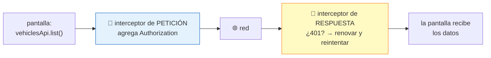
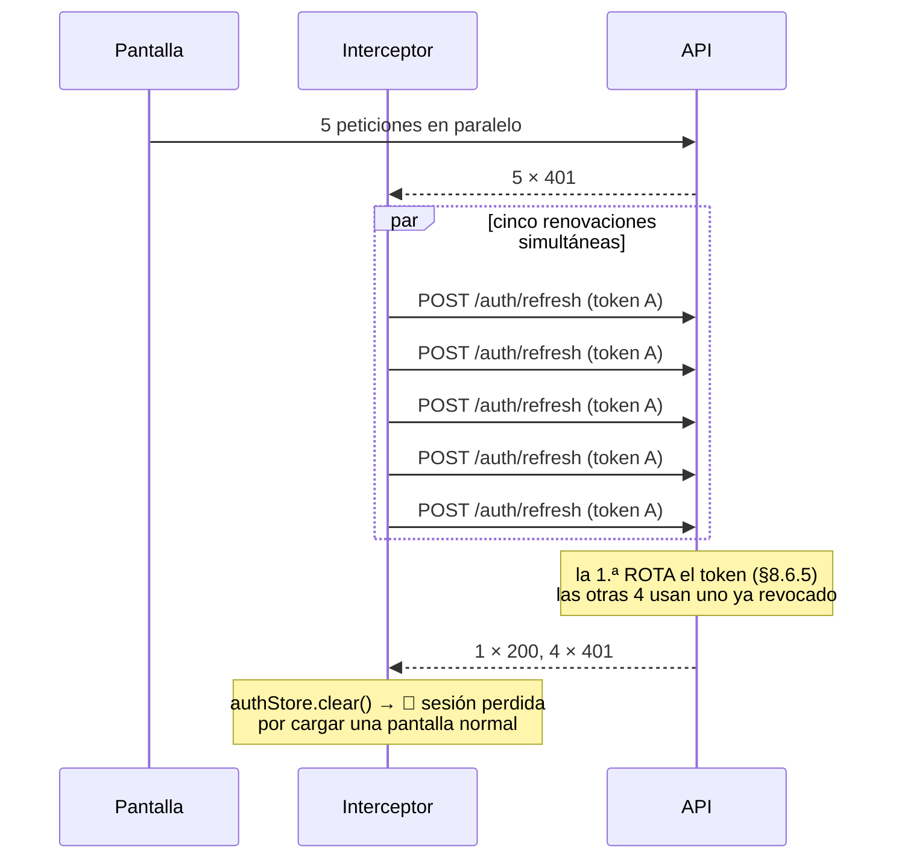
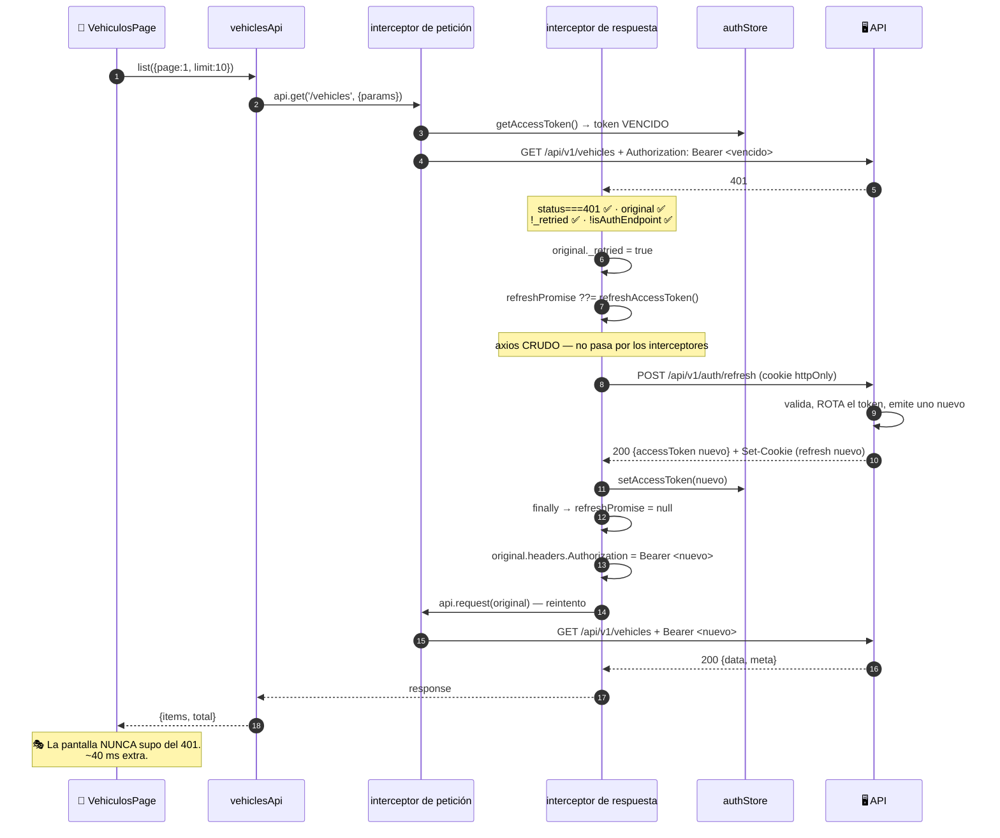
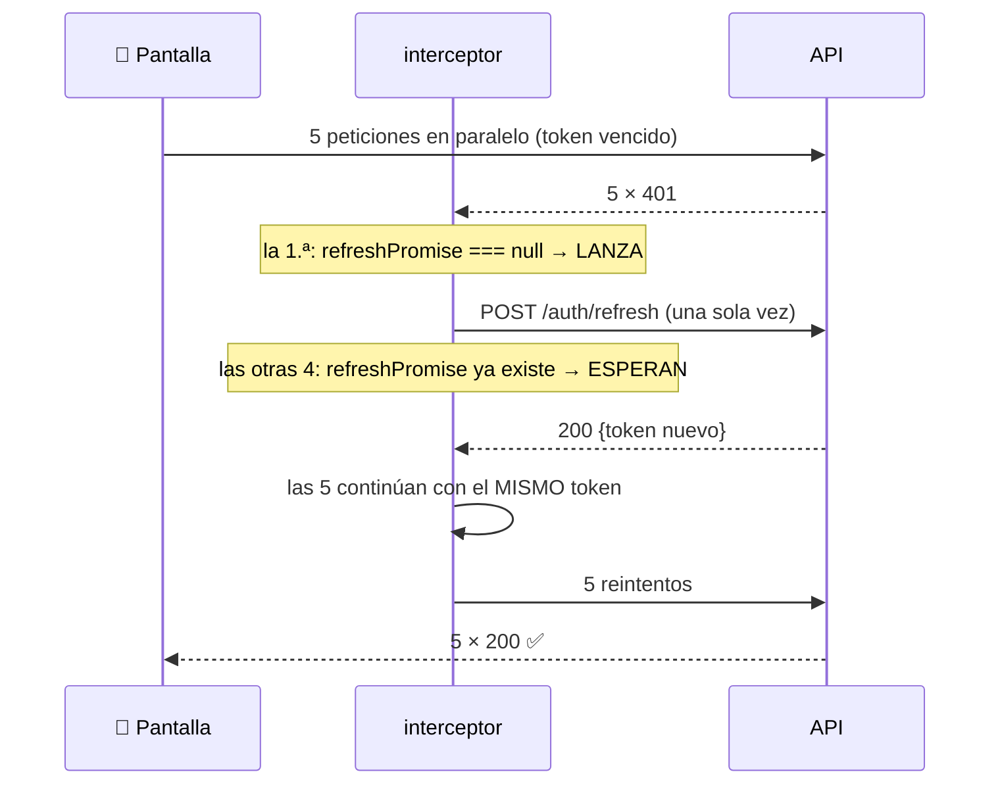

# Capítulo 19 — La capa API del frontend

> **Prerrequisitos:** [Capítulo 1, §1.2.3-1.2.5](01-conceptos-previos.md) (HTTP, REST, JSON), [Capítulo 8](08-modulo-auth.md) (el esquema de doble token) y [Capítulo 18](18-frontend-bootstrap.md).
> **Archivos que se explican aquí:** los 15 de `src/api/` (722 líneas) más `src/utils/blob.ts` (17) y `src/utils/datetime.ts` (25) con su test (24). Total: 788 líneas.
> **Al terminar** el lector entenderá el mecanismo de renovación transparente de sesión —la pieza más ingeniosa del frontend—, por qué las fechas son el problema recurrente del proyecto, y dónde el contrato entre las dos aplicaciones se sostiene solo con disciplina.

---

## 19.1. Introducción

La carpeta `api/` es la **frontera** del frontend: el único lugar que sabe que existe un servidor. Las 29 pantallas llaman a `vehiclesApi.list()` sin saber si eso es HTTP, una consulta local o datos de prueba.

Contiene tres capas:

| Capa | Archivos | Responsabilidad |
|:--|:-:|:--|
| **Transporte** | `axios.ts` | La instancia, los interceptores, la renovación transparente |
| **Contrato** | `types.ts` | Los tipos del sobre de respuesta |
| **Dominio** | 13 clientes `*.api.ts` | Un cliente tipado por módulo del backend |

Los temas del capítulo:

1. **La renovación transparente**, con sus tres protecciones contra bucles y carreras.
2. **El contrato duplicado a mano** entre los dos proyectos, y qué lo sostiene.
3. **La aserción que puede romper el listado**, y por qué nadie la nota.
4. **Las fechas como string**, tercera aparición del problema que atraviesa el proyecto.
5. **Dos utilidades pequeñas y muy bien pensadas**: la apertura de archivos y la conversión de `datetime-local`.

---

## 19.2. Conceptos previos

### 19.2.1. Por qué una capa API y no `fetch` en cada pantalla

**Sin capa API**, cada pantalla haría:

```tsx
// — ejemplo ilustrativo de lo que se evita —
const res = await fetch('http://localhost:3000/api/v1/vehicles?page=1', {
  headers: { Authorization: `Bearer ${token}` },
  credentials: 'include',
});
if (!res.ok) { /* ¿y si es 401? ¿renuevo el token acá? */ }
const json = await res.json();
setVehiculos(json.data);
```

🔴 **Los seis problemas, multiplicados por 29 pantallas:**

| Problema | Consecuencia |
|:--|:--|
| La URL base repetida | Cambiar de entorno obliga a tocar 29 archivos |
| El token adjuntado a mano | Olvidarlo en una pantalla produce un 401 inexplicable |
| **La renovación en cada llamada** | 29 implementaciones del mismo mecanismo delicado |
| `res.ok` comprobado a mano | Olvidarlo hace que un error se procese como éxito |
| Sin tipos | `json.data` es `any` |
| El desenvuelto de `{data}` repetido | Ruido en cada componente |

💡 **La capa API resuelve los seis una vez.** Es la misma justificación que la capa de repositorios en el backend (§2.3.2): **centralizar el acceso a un recurso externo hace que la complejidad se resuelva en un lugar.**

### 19.2.2. Interceptores: el mecanismo

Un **interceptor** de Axios es una función que se ejecuta automáticamente en cada petición o respuesta. Es el equivalente de un middleware de Express, del lado del cliente.



**Axios permite dos manejadores por interceptor de respuesta:**

```ts
api.interceptors.response.use(
  (response) => response,        // ← éxito (2xx)
  async (error) => { … },        // ← fallo (todo lo demás)
);
```

🔴 **El manejador de error DEBE devolver una promesa rechazada** (o lanzar) si no puede resolver el problema. Devolver un valor normal convertiría un error en un éxito, y la pantalla procesaría datos inexistentes.

### 19.2.3. El contrato duplicado

Ya se anticipó en §2.3.1 y aquí se ve materializado.

**El backend define en `vehicles.service.ts:11-25`:**

```ts
export interface VehicleResponse {
  id: number; licensePlate: string; model: string; year: number;
  initialKm: number; accumulatedKm: number;
  lastMaintenanceDate: Date | null; insuranceExpiryDate: Date | null;
  insuranceValid: boolean; status: VehicleStatus;
  createdAt: Date; updatedAt: Date;
}
```

**El frontend define en `vehicles.api.ts:6-19`:**

```ts
export interface Vehicle {
  id: number; licensePlate: string; model: string; year: number;
  initialKm: number; accumulatedKm: number;
  lastMaintenanceDate: string | null; insuranceExpiryDate: string | null;
  insuranceValid: boolean; status: VehicleStatus;
  createdAt: string; updatedAt: string;
}
```

🔴 **Dos declaraciones independientes del mismo contrato, en dos proyectos TypeScript separados.** Nada las verifica entre sí.

**Y no son idénticas: los cuatro campos de fecha son `Date` en el backend y `string` en el frontend.**

💡 **La diferencia es CORRECTA, y refleja lo que realmente ocurre:** `JSON.stringify` convierte un `Date` en un string ISO (§1.2.5). **Lo que sale del backend como `Date` llega al frontend como `string`.** Declararlo `Date` en el frontend sería mentir — el tipo diría que se puede llamar a `.getTime()` y en tiempo de ejecución fallaría.

⚠️ **Pero también significa que el frontend debe convertir en cada uso**, y ahí está la fricción que el capítulo 22 examinará.

**Lo que ocurre si el contrato diverge:**

| Cambio en el backend | ¿Lo detecta el frontend? | Cuándo falla |
|:--|:--:|:--|
| Se agrega un campo opcional | ❌ No | Nunca (se ignora) |
| Se renombra un campo | ❌ **No** | En tiempo de ejecución: `undefined` en la pantalla |
| Se agrega un campo obligatorio a un DTO de entrada | ❌ **No** | Al enviar: **400** |
| Se cambia un tipo (`number` → `string`) | ❌ **No** | Comportamiento raro, sin error |

🔴 **Ninguno se detecta en compilación.** La disciplina es la única garantía.

---

## 19.3. `axios.ts` línea por línea

Sesenta y nueve líneas: el archivo más importante del frontend.

### 19.3.1. La instancia (líneas 1-8)

```ts
1 import axios, { AxiosError, type AxiosRequestConfig } from 'axios';
2 import { authStore } from '../stores/auth-store';
3 import type { ApiError, LoginResponse } from './types';
4
5 const baseURL = import.meta.env.VITE_API_URL ?? 'http://localhost:3000/api/v1';
6
7 /** Main API client. withCredentials so the refresh cookie travels. */
8 export const api = axios.create({ baseURL, withCredentials: true });
```

**Línea 2 — `authStore`, no `useAuthStore`**

🔴 **Aquí se ve por qué el store tiene dos formas de acceso** (§18.5.1).

**Este archivo NO es un componente de React.** No puede usar hooks (§18.2.3, regla 2): no hay ningún componente montado desde el cual llamarlos. Necesita acceso **imperativo** al estado.

💡 **Es una restricción real del modelo de hooks**, y la razón por la que Zustand expone ambas interfaces.

**Línea 8 — la instancia y sus dos opciones**

```ts
export const api = axios.create({ baseURL, withCredentials: true });
```

**`baseURL`** hace que los clientes escriban `/vehicles` en vez de la URL completa. **Cambiar de entorno es cambiar una variable.**

🔴 **`withCredentials: true` es obligatorio para el esquema de sesión.** Sin él, el navegador **no envía la cookie de refresh** en peticiones de origen cruzado (§1.2.3), y `/auth/refresh` fallaría siempre.

⚠️ **Y requiere que el backend responda `Access-Control-Allow-Credentials: true`**, que hace `app.ts:31`. **Las dos mitades de la misma decisión, en proyectos distintos** — si alguien quitara `credentials: true` del backend, el frontend seguiría enviando la cookie y el navegador **descartaría la respuesta** con un error de CORS.

🔴 **Lo que NO se configura: `timeout`.**

**Por defecto, Axios espera INDEFINIDAMENTE.** Si el backend se cuelga —una consulta lenta, un bloqueo de base de datos, un `finish` esperando `lockTrip` (§12.6.6)— **la pantalla queda cargando para siempre**, sin error y sin forma de que el usuario sepa qué pasa.

**La corrección es una línea:**

```ts
// — mejora propuesta —
export const api = axios.create({ baseURL, withCredentials: true, timeout: 30_000 });
```

⚠️ **Con un matiz:** un timeout demasiado corto cortaría operaciones legítimamente lentas, como `POST /alerts/evaluate`, cuya transacción tiene 15 segundos de margen (§14.5.2). **30 segundos deja espacio para eso y acota lo indefinido.**

### 19.3.2. El interceptor de petición (líneas 10-17)

```ts
10 /** Attach the in-memory access token to every request. */
11 api.interceptors.request.use((config) => {
12   const token = authStore.getAccessToken();
13   if (token) {
14     config.headers.Authorization = `Bearer ${token}`;
15   }
16   return config;
17 });
```

**Siete líneas que hacen que ninguna pantalla se ocupe del token.**

**Línea 13 — el `if`**

💡 **Sin token, no se agrega la cabecera.** Es correcto y necesario: `POST /auth/login` se llama **sin** sesión, y enviar `Authorization: Bearer undefined` produciría un 401 en el único endpoint que no lo necesita.

**Línea 12 — la lectura en CADA petición**

🔴 **El token se lee del store en el momento de enviar, no al crear la instancia.**

**Es lo que hace funcionar la renovación:** cuando el interceptor de respuesta obtiene un token nuevo y lo guarda (línea 35), **la siguiente petición lo toma automáticamente**. Si el token se hubiera capturado en un cierre al crear la instancia, quedaría congelado el primero.

**Línea 16 — `return config`**

🔴 **Obligatorio.** Un interceptor de petición debe devolver la configuración (o una promesa de ella). Olvidarlo produce `undefined` y Axios falla con un error poco claro.

⚠️ **No hay manejador de error** en este interceptor. Es el segundo argumento de `use`, y aquí se omite porque el cuerpo no puede fallar.

### 19.3.3. La renovación transparente (líneas 19-60)

```ts
19 /**
20  * Transparent refresh on 401: when a request fails with 401, try
21  * POST /auth/refresh once, update the token and replay the original request.
22  * Concurrent 401s share a single in-flight refresh so we don't hammer the
23  * endpoint. A failed refresh clears the session (the app redirects to login).
24  */
25 let refreshPromise: Promise<string> | null = null;
26
27 async function refreshAccessToken(): Promise<string> {
28   // A bare axios call (not `api`) to avoid recursive interceptors.
29   const { data } = await axios.post<{ data: LoginResponse }>(
30     `${baseURL}/auth/refresh`, {}, { withCredentials: true },
33   );
34   const token = data.data.accessToken;
35   authStore.setAccessToken(token);
36   return token;
37 }
38
39 api.interceptors.response.use(
40   (response) => response,
41   async (error: AxiosError<ApiError>) => {
42     const original = error.config as (AxiosRequestConfig & { _retried?: boolean }) | undefined;
43     const isAuthEndpoint = original?.url?.includes('/auth/');
44
45     if (error.response?.status === 401 && original && !original._retried && !isAuthEndpoint) {
46       original._retried = true;
47       try {
48         refreshPromise ??= refreshAccessToken().finally(() => {
49           refreshPromise = null;
50         });
51         const token = await refreshPromise;
52         original.headers = { ...original.headers, Authorization: `Bearer ${token}` };
53         return api.request(original);
54       } catch {
55         authStore.clear();
56       }
57     }
58     return Promise.reject(error);
59   },
60 );
```

#### El problema

**El access token dura 15 minutos** (§5.3.2). Al vencer, **toda** petición devuelve 401.

**Sin este mecanismo, el usuario sería expulsado al login cada 15 minutos**, perdiendo lo que estuviera haciendo.

#### Las cuatro condiciones de la línea 45

```ts
if (error.response?.status === 401 && original && !original._retried && !isAuthEndpoint)
```

**Cada una previene un fallo distinto:**

| Condición | Qué previene |
|:--|:--|
| `error.response?.status === 401` | Renovar ante un 403, un 500 o un fallo de red — donde renovar no ayuda |
| `original` | Un error sin configuración (fallo de red antes de enviar) |
| **`!original._retried`** | 🔴 **Bucle infinito** |
| **`!isAuthEndpoint`** | 🔴 **Recursión** |

**`error.response?.status`** — el `?.` importa: **un fallo de red no tiene `response`**. Sin él, un servidor caído produciría `TypeError: Cannot read properties of undefined` **dentro del manejador de errores**, ocultando el error real.

#### Línea 46 — la marca `_retried`

```ts
original._retried = true;
```

🔴 **Sin ella, un 401 persistente produce un bucle infinito.**

**El escenario:** el token se renueva correctamente, pero el backend **sigue** devolviendo 401 —porque el usuario fue desactivado, por ejemplo (§8.6.5)—. La petición se reintenta, vuelve 401, se renueva, se reintenta… **hasta agotar la pila o colgar el navegador.**

💡 **La marca se guarda en el objeto de configuración de la petición**, que Axios conserva y pasa a `api.request(original)` (línea 53). **Cuando ese reintento falle, `original._retried` ya será `true`** y la condición cortará.

⚠️ **El guion bajo indica "propiedad interna"** por convención, y el tipo se extiende en la línea 42 con una intersección: `AxiosRequestConfig & { _retried?: boolean }`. **Es una aserción**, así que TypeScript no verifica que Axios preserve la propiedad — pero lo hace.

#### Línea 43 — la protección contra recursión

```ts
const isAuthEndpoint = original?.url?.includes('/auth/');
```

🔴 **Si `POST /auth/refresh` devuelve 401 y el interceptor intentara renovar, llamaría a `/auth/refresh` otra vez.** Recursión infinita.

**Doble protección, en realidad:** `refreshAccessToken` usa **`axios` crudo** (línea 29), no la instancia `api`, así que **no pasa por este interceptor**. El comentario de la línea 28 lo dice: *"A bare axios call (not `api`) to avoid recursive interceptors."*

💡 **Es la misma técnica que `App.tsx`** (§18.5.1), y aquí **sí** está documentada.

⚠️ **`includes('/auth/')` es una comprobación por subcadena, no exacta.** Una URL que contuviera `/auth/` en otra posición —por ejemplo, `/drivers/1/auth/x`— también se excluiría. **Hoy no existe ninguna así**, pero `startsWith('/auth/')` sería más preciso.

#### Líneas 48-51 — la deduplicación

```ts
refreshPromise ??= refreshAccessToken().finally(() => {
  refreshPromise = null;
});
const token = await refreshPromise;
```

🔴 **Esta es la parte más ingeniosa del archivo, y previene un fallo que sin ella sería sistemático.**

**El escenario:** una pantalla carga cinco recursos en paralelo. El token está vencido. **Los cinco reciben 401 casi simultáneamente.**

**Sin la deduplicación:**



**Con la deduplicación:**

⚙️ **`??=` (asignación con fusión nula) solo asigna si el valor actual es `null` o `undefined`.**

- La **primera** petición encuentra `refreshPromise === null` y **lanza** la renovación.
- Las **otras cuatro** encuentran la promesa ya en curso y **la esperan**.
- **Una sola llamada a `/auth/refresh`**, cinco peticiones reintentadas con el mismo token nuevo.

**El `.finally(() => { refreshPromise = null })`** limpia la variable **al terminar**, para que la próxima vez que haga falta renovar se lance una nueva.

🔴 **Y `finally` es esencial, no `then`:** si la renovación **falla**, la variable debe limpiarse igual. Con `.then`, una renovación fallida dejaría la promesa rechazada guardada para siempre, y **todas** las renovaciones futuras fallarían al esperarla.

💡 **Este mecanismo existe porque el backend ROTA los refresh tokens** (§8.6.5). Sin rotación, cinco renovaciones simultáneas funcionarían todas. **Es una decisión de seguridad del backend que obliga a una solución de concurrencia en el frontend** — el tipo de acoplamiento que solo se ve leyendo ambos lados.

#### Líneas 52-53 — el reintento

```ts
original.headers = { ...original.headers, Authorization: `Bearer ${token}` };
return api.request(original);
```

🔴 **Hay que reemplazar la cabecera explícitamente.** `original` es la configuración de la petición **original**, con el token **viejo** ya puesto por el interceptor de petición. Sin esta línea, el reintento enviaría el token vencido y fallaría igual.

💡 **La propagación `{ ...original.headers, ... }` preserva las demás cabeceras** (`Content-Type`, por ejemplo) y solo pisa `Authorization`.

**`return api.request(original)`** vuelve a ejecutar la petición **a través de la instancia**, así que pasa otra vez por los interceptores — **pero con `_retried = true`**, así que un segundo 401 ya no intentará renovar.

🔴 **Devolver la promesa del reintento es lo que hace la renovación TRANSPARENTE.** Quien llamó a `vehiclesApi.list()` recibe los datos correctos, con unos 40 ms extra. **Nunca se entera de que hubo un 401.**

#### Líneas 54-56 — el fallo de la renovación

```ts
} catch {
  authStore.clear();
}
```

**Si `/auth/refresh` falla** (cookie vencida, revocada, o usuario desactivado), **se limpia la sesión**.

⚙️ **`authStore.clear()` actualiza el estado de Zustand**, lo que provoca un re-render de los componentes suscritos. `RequireAuth` ve `user === null` y redirige al login (§20).

💡 **No hay `navigate('/login')` aquí**, y es correcto: este archivo **no es un componente** y no tiene acceso al router. **La redirección se produce declarativamente, como consecuencia del cambio de estado.**

⚠️ **Y después del `catch`, la ejecución continúa a la línea 58** (`return Promise.reject(error)`), así que la pantalla **también** recibe el error original. **Es correcto**: la pantalla puede mostrar su propio mensaje mientras la redirección ocurre.

**Línea 58 — el rechazo final**

```ts
return Promise.reject(error);
```

🔴 **Todo error que no se resolvió se propaga.** Sin esto, un error se convertiría en un éxito con valor `undefined`, y la pantalla intentaría renderizar datos inexistentes.

### 19.3.4. `apiErrorMessage` (líneas 62-69)

```ts
/** Extract a human-readable message from an API error (for toasts/forms). */
export function apiErrorMessage(err: unknown, fallback = 'Ocurrió un error'): string {
  if (axios.isAxiosError(err)) {
    const data = err.response?.data as ApiError | undefined;
    return data?.error?.message ?? fallback;
  }
  return fallback;
}
```

💡 **Traduce el sobre de error del backend** (§2.7.4) a un string para mostrar.

**`axios.isAxiosError(err)`** es un *type guard* (§1.2.7): dentro del `if`, TypeScript sabe que `err` tiene `response`.

**`data?.error?.message ?? fallback`** — encadenamiento opcional en dos niveles más un valor por defecto. **Cubre los tres casos de fallo**: sin respuesta (error de red), respuesta sin el sobre esperado, o mensaje ausente.

⚠️ **El valor por defecto está en español** (`'Ocurrió un error'`) **y los mensajes del backend en inglés** (§7.6.3). **Una pantalla puede mostrar "Ocurrió un error" o "Vehicle 7 not found" según el caso** — mezcla de idiomas visible para el usuario.

🔴 **Y `details` se ignora por completo.** Un error de validación de Zod trae un arreglo con el campo y el mensaje de cada problema (§7.6.3):

```json
{"error":{"code":"VALIDATION_ERROR","message":"Invalid request data","details":[
  {"path":"licensePlate","message":"String must contain at least 6 character(s)"}]}}
```

**El usuario ve solo `"Invalid request data"`** — que no dice **qué** campo está mal.

**La mejora sería aprovechar `details` para marcar los campos del formulario:**

```ts
// — mejora propuesta —
export function apiFieldErrors(err: unknown): Record<string, string> {
  if (!axios.isAxiosError(err)) return {};
  const details = (err.response?.data as ApiError | undefined)?.error?.details;
  if (!Array.isArray(details)) return {};
  return Object.fromEntries(
    details.filter((d): d is { path: string; message: string } =>
      typeof d === 'object' && d !== null && 'path' in d && 'message' in d,
    ).map((d) => [d.path, d.message]),
  );
}
```

⚠️ **El backend ya envía la información y el frontend la descarta.** Es funcionalidad completa en un lado e ignorada en el otro.

---

## 19.4. `types.ts` y el patrón de los clientes

### 19.4.1. El sobre tipado

```ts
12 /** Success envelope: { data, meta? }. */
13 export interface ApiResponse<T> {
14   data: T;
15   meta?: PaginationMeta;
16 }
…
24 /** Error envelope: { error: { code, message, details? } }. */
25 export interface ApiError {
26   error: { code: string; message: string; details?: unknown };
27 }
```

💡 **`ApiResponse<T>` es un genérico** (§1.2.7) que refleja exactamente la convención del backend (§2.7.3): `{ data }` en éxito, `{ error }` en fallo.

**`meta?` es opcional** porque solo los listados paginados lo traen. **Y esa opcionalidad causa el problema de §19.4.3.**

**`details?: unknown`** — coincide con el tipo del backend (§6.2.2). **Honesto**: nadie sabe qué forma tiene.

### 19.4.2. El patrón de los trece clientes

**Los trece siguen la misma forma**, ejemplificada por `vehicles.api.ts`:

```ts
// 1. Tipos de dominio (espejo del backend)
export type VehicleStatus = 'AVAILABLE' | 'INACTIVE' | 'IN_WORKSHOP' | 'ON_TRIP';
export interface Vehicle { … }

// 2. Tipos de entrada
export interface ListVehiclesParams { page: number; limit: number; status?: …; search?: string }
export interface CreateVehicleInput { … }
export type UpdateVehicleInput = Partial<CreateVehicleInput>;

// 3. El objeto con los métodos
export const vehiclesApi = {
  async list(params): Promise<{ items: Vehicle[]; total: number }> { … },
  async create(input): Promise<Vehicle> { … },
  …
};
```

**Cada método hace tres cosas:**

```ts
async create(input: CreateVehicleInput): Promise<Vehicle> {
  const { data } = await api.post<ApiResponse<Vehicle>>('/vehicles', input);
  return data.data;
}
```

| Paso | Qué hace |
|:--|:--|
| `api.post<ApiResponse<Vehicle>>` | Declara el tipo esperado |
| `const { data } = await …` | Desestructura la respuesta de Axios |
| `return data.data` | **Desenvuelve** el sobre `{ data }` |

🔴 **`data.data` es confuso a primera vista, y es correcto:** el primero es la propiedad de la respuesta de Axios (el cuerpo), el segundo es el `data` del sobre del backend.

💡 **Desenvolver aquí es la decisión correcta:** las pantallas trabajan con `Vehicle[]`, no con `ApiResponse<Vehicle[]>`. **El sobre es un detalle del transporte que no debe filtrarse a la interfaz.**

**Línea 36 — `Partial<CreateVehicleInput>`**

```ts
export type UpdateVehicleInput = Partial<CreateVehicleInput>;
```

⚙️ **`Partial<T>` es un tipo utilitario de TypeScript** que hace opcionales todas las propiedades de `T`.

💡 **Expresa exactamente la semántica de `PATCH`** con cinco palabras, y garantiza que crear y actualizar no diverjan: agregar un campo a `CreateVehicleInput` lo hace disponible en la actualización automáticamente.

⚠️ **Con una imprecisión:** el backend permite `insuranceExpiryDate: null` en la actualización (para borrar el vencimiento, §10.4), y `Partial<CreateVehicleInput>` **no** admite `null` — solo `string | undefined`. **El frontend no puede expresar "borrar el vencimiento"**, aunque el backend lo soporte.

**Línea 55 — el mapeo de la acción**

```ts
async setActive(id: number, active: boolean): Promise<Vehicle> {
  const action = active ? 'activate' : 'deactivate';
  const { data } = await api.post<ApiResponse<Vehicle>>(`/vehicles/${id}/${action}`);
  return data.data;
}
```

💡 **Un método del cliente para dos endpoints**, espejo de `usersService.setActive` en el backend (§9.6.5). **La API expone dos acciones explícitas; el cliente ofrece una función booleana**, que es más cómoda para un interruptor de interfaz.

### 19.4.3. 🔴 La aserción que puede romper el listado

```ts
async list(params: ListVehiclesParams): Promise<{ items: Vehicle[]; total: number }> {
  const { data } = await api.get<ApiResponse<Vehicle[]>>('/vehicles', { params });
  return { items: data.data, total: (data.meta as PaginationMeta).total };
}
```

🔴 **`(data.meta as PaginationMeta)` fuerza un tipo opcional a obligatorio.**

`ApiResponse<T>.meta` es `PaginationMeta | undefined`. **La aserción le dice a TypeScript "confiá, siempre está".**

**Si el backend NO enviara `meta`:**

```
TypeError: Cannot read properties of undefined (reading 'total')
```

**Y no en la capa API, sino propagándose hasta la pantalla como un error inexplicable.**

**¿Cuándo puede faltar `meta`?**

| Escenario | ¿Probable? |
|:--|:--|
| El controlador olvida `paginationMeta(...)` en un endpoint nuevo | ⚠️ Sí |
| Un proxy o un middleware altera la respuesta | Poco |
| El backend devuelve un error con forma inesperada | ⚠️ Posible |

💡 **Se repite en los siete clientes con listados paginados.** La alternativa segura es una línea:

```ts
// — corrección propuesta —
return { items: data.data, total: data.meta?.total ?? data.data.length };
```

**Con un valor por defecto sensato:** si no hay `meta`, asumir que lo devuelto es todo.

⚠️ **Y revela algo más profundo: NO HAY VALIDACIÓN DE LAS RESPUESTAS.**

🔴 **El frontend confía ciegamente en la forma de lo que recibe.** El backend valida **todo** lo que entra con Zod (§7.5); el frontend no valida **nada** de lo que le llega.

**Es asimétrico y tiene una justificación parcial:** el backend es "de confianza" y el frontend es su único cliente. **Pero significa que cualquier divergencia del contrato se manifiesta como un `TypeError` en tiempo de ejecución**, en el componente que intenta usar el dato, lejos de donde llegó.

**Zod también funciona en el navegador**, y validar las respuestas convertiría esos fallos en errores explícitos con el campo exacto. **El costo: duplicar los esquemas o generarlos desde el backend.**

### 19.4.4. Las fechas como string

```ts
export interface Vehicle {
  lastMaintenanceDate: string | null;
  insuranceExpiryDate: string | null;
  createdAt: string;
  updatedAt: string;
}
```

🔴 **Tercera aparición del problema de las fechas** (tras §6.6 y §12.5.2), ahora en el frontend.

**Lo que llega literalmente:**

```json
{"insuranceExpiryDate":"2027-02-19T00:00:00.000Z","createdAt":"2026-08-03T18:42:11.204Z"}
```

**Y la consecuencia para cada uso:**

| Necesidad | Qué hay que hacer |
|:--|:--|
| Mostrar la fecha | `dayjs(v.createdAt).format('DD/MM/YYYY')` |
| Comparar dos fechas | `new Date(a) < new Date(b)` |
| Ordenar | Funciona con comparación de strings **solo si son ISO con la misma zona** |
| Calcular días restantes | `dayjs(v.insuranceExpiryDate).diff(dayjs(), 'day')` |

⚠️ **Ordenar strings ISO funciona por casualidad**, porque el formato ISO 8601 está diseñado para que el orden lexicográfico coincida con el cronológico. **Es una propiedad del formato, no una garantía del tipo.**

🔴 **Y hay una trampa específica con las columnas `DATE`**, que enlaza directamente con §6.6:

`insuranceExpiryDate` sale del backend como `"2027-02-19T00:00:00.000Z"` — **medianoche UTC**. Al mostrarlo con `dayjs(...).format('DD/MM/YYYY')` **en Argentina (UTC−3)**, dayjs convierte a hora local: `2027-02-18T21:00` → **muestra "18/02/2027"**.

**El vencimiento se muestra un día antes del real.**

💡 **La solución correcta es formatear en UTC:** `dayjs.utc(fecha).format('DD/MM/YYYY')`, o tratar las columnas `DATE` como strings de fecha pura (`fecha.slice(0, 10)`).

⚠️ **El capítulo 22 verificará qué hace realmente cada pantalla.** **Es el mismo error que `shared/utils/dates.ts` documenta y previene en el backend** (§6.6.1), reapareciendo del otro lado de la red.

---

## 19.5. Dos utilidades bien pensadas

### 19.5.1. `openBlobInNewTab` — el bloqueo de ventanas emergentes

```ts
1  /**
2   * Open a fetched blob in a new tab. An <a target="_blank"> click works even
3   * after an await, whereas window.open() loses the user gesture and is
4   * blocked as a popup. The object URL is revoked after a delay so the new
5   * tab has time to load it.
6   */
7  export function openBlobInNewTab(blob: Blob): void {
8    const url = URL.createObjectURL(blob);
9    const a = document.createElement('a');
10   a.href = url;
11   a.target = '_blank';
12   a.rel = 'noopener';
13   document.body.appendChild(a);
14   a.click();
15   a.remove();
16   setTimeout(() => URL.revokeObjectURL(url), 60_000);
17 }
```

#### El problema que resuelve

**El archivo no se puede abrir con un enlace directo**, porque el endpoint **requiere el token** (§11.7.6), que vive en memoria y no viaja en una navegación normal.

**Hay que descargarlo con Axios (que sí adjunta el token) y después mostrarlo.**

🔴 **Y ahí aparece el bloqueo de ventanas emergentes.**

⚙️ **Los navegadores solo permiten `window.open()` durante el manejo de un gesto del usuario** (un clic). Ese permiso se llama **activación transitoria** y **se pierde al cruzar un `await`**.

```ts
// — ejemplo ilustrativo de lo que NO funciona —
async function abrir() {
  const res = await api.get(url, { responseType: 'blob' });   // ← se pierde el gesto
  window.open(URL.createObjectURL(res.data));                  // 🔴 BLOQUEADO
}
```

**El usuario hace clic, no pasa nada, y el navegador muestra un aviso discreto de "ventana emergente bloqueada" que muchos ni ven.**

#### La solución

💡 **Un clic programático sobre un `<a target="_blank">` NO está sujeto al bloqueo de ventanas emergentes.** Los navegadores lo tratan como navegación, no como apertura de ventana.

**Los siete pasos:**

| Línea | Paso |
|:--:|:--|
| 8 | `URL.createObjectURL(blob)` — crea una URL `blob:` que apunta a los datos en memoria |
| 9-12 | Construye un `<a>` invisible con `target="_blank"` y `rel="noopener"` |
| 13 | Lo agrega al DOM — **necesario**: un elemento fuera del documento no dispara navegación al hacerle clic |
| 14 | `a.click()` — clic programático |
| 15 | Lo quita inmediatamente |
| 16 | Revoca la URL **60 segundos después** |

🔴 **`rel="noopener"` es una medida de seguridad.** Sin él, la pestaña nueva recibe `window.opener` apuntando a la original, y podría redirigirla a un sitio de phishing (ataque *tabnabbing*). **Con archivos propios el riesgo es bajo, pero es la práctica correcta.**

**Línea 16 — el retardo de 60 segundos**

⚙️ **`URL.revokeObjectURL` libera la memoria del blob.** Sin revocarlo, **el blob queda en memoria hasta que se cierre la pestaña** — con archivos de hasta 1 MB, abrir 100 documentos serían 100 MB retenidos.

🔴 **Pero revocarlo inmediatamente rompería la apertura:** la pestaña nueva todavía no cargó el contenido. **Los 60 segundos son un margen para que lo haga.**

⚠️ **Es una heurística, no una garantía.** Con una conexión muy lenta o el navegador ocupado, 60 segundos podrían no alcanzar. **Y si el usuario cierra la pestaña antes, el blob queda 60 segundos de más.**

**No hay forma limpia de saber cuándo la pestaña terminó de cargar** un blob — es una limitación conocida de la plataforma, y el retardo generoso es la solución habitual.

⚠️ **Y hay una fuga real: si el usuario navega o recarga antes de que se cumpla el temporizador, `revokeObjectURL` nunca se ejecuta.** El blob se libera igual al descargarse la página, así que el impacto es nulo — pero conviene saber que el temporizador no es una garantía.

### 19.5.2. `datetime.ts` — el problema de `datetime-local`

```ts
1  /**
2   * Helpers to bridge an ISO instant and the value of an <input type="datetime-local">.
3   *
4   * A datetime-local input has NO timezone: its value is "YYYY-MM-DDTHH:mm" in
5   * the user's local wall-clock time. Slicing an ISO string mixes UTC digits
6   * with a local interpretation and shifts the time by the timezone offset.
7   * These functions convert through the Date object so the local wall-clock
8   * time stays consistent between create, edit and the list view.
9   */
11 function pad(n: number): string { return String(n).padStart(2, '0'); }
15 /** ISO instant → datetime-local value in local time. */
16 export function isoToLocalInput(iso: string): string {
17   const d = new Date(iso);
18   return `${d.getFullYear()}-${pad(d.getMonth()+1)}-${pad(d.getDate())}T${pad(d.getHours())}:${pad(d.getMinutes())}`;
19 }
21 /** datetime-local value (local time) → ISO instant (UTC), unambiguous for the API. */
22 export function localInputToIso(value: string): string {
23   return new Date(value).toISOString();
24 }
```

💡 **Nueve líneas de comentario para diez de código.** Como en `shared/utils/dates.ts` (§6.6), **la proporción indica un problema sutil que alguien ya sufrió.**

#### El problema

**Un `<input type="datetime-local">` NO tiene zona horaria.** Su valor es literalmente `"2026-08-01T08:00"` — la hora que el usuario ve en su reloj.

**La API espera un instante ISO con zona:** `"2026-08-01T11:00:00.000Z"`.

🔴 **El error que el comentario describe: cortar el string ISO.**

```ts
// — ejemplo ilustrativo del bug que se evita —
const valorInput = trip.departureAt.slice(0, 16);   // "2026-08-01T11:00"
```

**Toma los dígitos UTC y los presenta como hora local.** En Argentina (UTC−3), un viaje que sale a las **08:00 locales** está guardado como `11:00Z`, y el recorte mostraría **"11:00"** en el formulario.

**El usuario abre el formulario de edición, ve las 11:00, guarda sin tocar nada — y el viaje se corre tres horas.**

⚠️ **Y cada edición lo corre otras tres**, así que el error **se acumula**: dos ediciones y el viaje sale seis horas después.

#### La solución

**Convertir a través del objeto `Date`, que sí entiende zonas:**

**`isoToLocalInput`** — usa `getFullYear()`, `getMonth()`, `getHours()` (métodos **locales**, sin `UTC`). El objeto `Date` traduce el instante a hora local, y esos métodos leen los componentes ya convertidos.

**`localInputToIso`** — `new Date("2026-08-01T08:00")` **sin `Z`** se parsea como **hora local**, y `toISOString()` lo convierte a UTC.

⚙️ **La asimetría del parseo de `Date` es lo que hace funcionar esto**, y es una fuente clásica de bugs:

| Cadena | Cómo se interpreta |
|:--|:--|
| `"2026-08-01T08:00"` | **Hora LOCAL** |
| `"2026-08-01T08:00Z"` | **UTC** |
| `"2026-08-01"` | **UTC** (solo fecha) |

🔴 **La tercera fila es la trampa:** `new Date("2026-08-01")` da medianoche **UTC**, mientras que `new Date("2026-08-01T00:00")` da medianoche **local**. **Una diferencia de tres horas por escribir tres caracteres.**

💡 **Y es exactamente el mismo problema que `utcStartOfToday` resuelve en el backend** (§6.6.2). **El proyecto lo enfrentó dos veces, en dos lenguajes de ejecución distintos, y lo resolvió correctamente en ambos.**

#### Los tests

```ts
it('round-trips a local input value without drift', () => {
  const input = '2026-08-01T08:00';
  const iso = localInputToIso(input);
  expect(isoToLocalInput(iso)).toBe(input);
});
```

✅ **Es un test de ida y vuelta**, y es exactamente el correcto: verifica que el valor del usuario sobrevive el viaje a la API y de vuelta **sin desplazamiento**.

💡 **Y es independiente de la zona horaria donde corra:** la conversión de ida y la de vuelta usan el mismo desplazamiento, así que se cancelan. **Pasa en Buenos Aires, en Madrid y en Tokio.**

🔴 **Contrasta favorablemente con el test tautológico de `dates.test.ts`** (§6.6.2), que compara una función consigo misma y no puede fallar. **Aquí el test verifica una propiedad real**: si alguien reemplazara `isoToLocalInput` por `iso.slice(0,16)`, **el test fallaría** en cualquier zona distinta de UTC.

⚠️ **Aunque en UTC pasaría igual**, así que un pipeline de integración continua configurado en UTC **no detectaría la regresión**. Fijar `TZ=America/Argentina/Cordoba` en la configuración de tests lo aseguraría.

---

## 19.6. Flujo interno: la renovación transparente completa



**Y el caso de cinco peticiones concurrentes:**



---

## 19.7. Ejemplos

### Ejemplo 1 — Ver la renovación transparente

```
1. Iniciar sesión y esperar 15 minutos (o bajar ACCESS_TOKEN_TTL a 30s en el backend).
2. Abrir la pestaña Network y navegar a Vehículos.
```

**Secuencia esperada:**

| # | Petición | Estado |
|:-:|:--|:--|
| 1 | `GET /api/v1/vehicles?page=1&limit=10` | **401** |
| 2 | `POST /api/v1/auth/refresh` | 200 |
| 3 | `GET /api/v1/vehicles?page=1&limit=10` | **200** |

💡 **La pantalla no muestra ningún error.** Los datos aparecen ~40 ms más tarde de lo normal.

### Ejemplo 2 — La deduplicación en acción

```
1. Bajar ACCESS_TOKEN_TTL a 10s.
2. Abrir el Dashboard, que carga varios recursos.
3. Esperar a que el token venza y recargar.
```

**En Network, filtrando por `refresh`:**

✅ **Debe aparecer UNA sola llamada a `/auth/refresh`**, aunque haya varios 401.

**Para ver el fallo que se evita**, quitar temporalmente la deduplicación:

```ts
// — modificación temporal —
const token = await refreshAccessToken();   // sin refreshPromise
```

🔴 **Ahora aparecen N llamadas a `/auth/refresh`**, la primera con 200 y el resto con **401** — porque el backend rotó el token (§8.6.5). **Y `authStore.clear()` cierra la sesión.**

### Ejemplo 3 — El bucle sin `_retried`

```ts
// — modificación temporal —
if (error.response?.status === 401 && original && !isAuthEndpoint) {   // sin _retried
```

**Después, desactivar el usuario desde otra sesión de administrador y hacer cualquier petición:**

🔴 **En Network aparecen decenas de pares `refresh` → petición → 401 → `refresh`…** hasta que el navegador se satura.

**Con `_retried`, la secuencia es: 401 → refresh → reintento → 401 → fin.**

### Ejemplo 4 — El timeout que no existe

```ts
// — simular un backend colgado: agregar en un controlador —
async list(req, res, next) {
  await new Promise((r) => setTimeout(r, 300_000));   // 5 minutos
  …
}
```

🔴 **La pantalla queda cargando indefinidamente.** Sin `timeout`, Axios espera para siempre; el usuario no ve error, no ve datos, y no tiene forma de saber qué pasa.

**Con `timeout: 30_000`, a los 30 segundos aparece un error manejable.**

### Ejemplo 5 — La fecha que se muestra un día antes

```bash
# Un vehículo con seguro que vence el 19/02/2027
curl .../vehicles/1 -H "Authorization: Bearer $ADMIN" | grep insurance
# → "insuranceExpiryDate":"2027-02-19T00:00:00.000Z"
```

```js
// En la consola del navegador, con zona horaria de Argentina:
dayjs('2027-02-19T00:00:00.000Z').format('DD/MM/YYYY')
// → "18/02/2027"   🔴 un día antes

dayjs.utc('2027-02-19T00:00:00.000Z').format('DD/MM/YYYY')
// → "19/02/2027"   ✅ correcto
```

🔴 **El mismo problema que `shared/utils/dates.ts` documenta y previene en el backend**, reapareciendo en el frontend.

### Ejemplo 6 — El desplazamiento de `datetime-local`

```js
// El bug que datetime.ts evita:
const iso = '2026-08-01T11:00:00.000Z';   // 08:00 en Argentina

iso.slice(0, 16)              // → "2026-08-01T11:00"  🔴 muestra las 11:00
isoToLocalInput(iso)          // → "2026-08-01T08:00"  ✅ muestra las 08:00

// Y el efecto acumulativo del bug:
localInputToIso('2026-08-01T11:00')   // → "2026-08-01T14:00:00.000Z"
// Guardar sin tocar nada correría el viaje TRES horas. Otra edición, seis.
```

---

## 19.8. Resumen

1. **La capa API es la única frontera con el servidor.** Las 29 pantallas no saben que existe HTTP.

2. **El interceptor de petición adjunta el token leyéndolo del store en CADA envío**, lo que permite que la renovación surta efecto inmediatamente.

3. **La renovación transparente tiene tres protecciones**: `_retried` contra el bucle infinito, `isAuthEndpoint` más el uso de `axios` crudo contra la recursión, y `refreshPromise ??=` contra la avalancha de renovaciones concurrentes.

4. **La deduplicación existe porque el backend ROTA los refresh tokens.** Es una decisión de seguridad del servidor que obliga a una solución de concurrencia en el cliente — acoplamiento visible solo leyendo ambos lados.

5. **`.finally` y no `.then` en la limpieza de `refreshPromise`:** una renovación fallida debe limpiar la variable igual, o todas las futuras fallarían.

6. **El contrato está duplicado a mano** entre los dos proyectos. Las fechas difieren correctamente (`Date` vs `string`), y ninguna divergencia se detecta en compilación.

7. **`openBlobInNewTab` sortea el bloqueo de ventanas emergentes** usando un clic programático sobre un `<a target="_blank">`, que no pierde la activación transitoria tras un `await`.

8. **`datetime.ts` resuelve el desplazamiento de `datetime-local`** convirtiendo a través de `Date` en vez de cortar el string ISO — el mismo problema que `shared/utils/dates.ts` en el backend, del otro lado de la red, con un test de ida y vuelta que sí verifica una propiedad real.

9. **Diez hallazgos concretos:**

   | # | Hallazgo | Gravedad |
   |:-:|:--|:--|
   | 1 | 🔴 **Sin `timeout` en Axios.** Un backend colgado deja la pantalla cargando **indefinidamente**, sin error ni forma de que el usuario sepa qué pasa. | **Alta** |
   | 2 | 🔴 **`(data.meta as PaginationMeta)` fuerza un tipo opcional**, en los siete clientes con listados. Si `meta` faltara, `TypeError` propagándose hasta la pantalla. | **Alta** |
   | 3 | 🔴 **No hay ninguna validación de las respuestas.** El backend valida todo lo que entra con Zod; el frontend confía ciegamente en lo que recibe. Cualquier divergencia del contrato es un `TypeError` lejos del origen. | **Alta** |
   | 4 | 🔴 **`apiErrorMessage` descarta `details`.** El backend envía qué campo falló y con qué mensaje; el usuario ve solo *"Invalid request data"*. Funcionalidad completa en un lado e ignorada en el otro. | Media |
   | 5 | 🔴 **Las fechas `DATE` se muestran un día antes** si se formatean en hora local. El mismo error que el backend documenta y previene, reapareciendo en el frontend. | Media |
   | 6 | ⚠️ **Mezcla de idiomas:** el valor por defecto de `apiErrorMessage` está en español y los mensajes del backend en inglés. El usuario ve ambos. | Media |
   | 7 | ⚠️ **`Partial<CreateVehicleInput>` no admite `null`**, así que el frontend **no puede expresar "borrar el vencimiento del seguro"**, aunque el backend lo soporte. | Baja |
   | 8 | ⚠️ **`includes('/auth/')` es comprobación por subcadena**, no por prefijo. Hoy inofensivo. | Baja |
   | 9 | ⚠️ **El retardo de 60 s de `revokeObjectURL` es una heurística**, y si el usuario navega antes, el temporizador nunca se ejecuta. | Baja |
   | 10 | ⚠️ **El test de ida y vuelta de fechas pasaría igual en UTC**, así que un pipeline configurado en UTC no detectaría una regresión. Fijar `TZ` lo aseguraría. | Baja |

---

## 19.9. Preguntas de repaso

1. ¿Cuáles son los seis problemas que resuelve tener una capa API? ¿Con qué capa del backend es análoga?
2. ¿Por qué `axios.ts` importa `authStore` y no `useAuthStore`?
3. ¿Por qué el interceptor de petición lee el token en cada envío y no una sola vez?
4. Enumerar las cuatro condiciones de la línea 45 y qué previene cada una.
5. ¿Qué pasa sin `_retried`? Describir el escenario concreto.
6. ¿Por qué `refreshAccessToken` usa `axios` crudo? ¿Qué otra protección cubre lo mismo?
7. Explicar `refreshPromise ??=`. ¿Qué fallo previene y por qué ese fallo existe?
8. ¿Por qué `.finally` y no `.then` al limpiar `refreshPromise`?
9. ¿Por qué hay que reemplazar la cabecera antes de reintentar?
10. Al fallar la renovación se llama a `authStore.clear()` pero no a `navigate('/login')`. ¿Por qué funciona igual?
11. ¿Por qué las fechas son `string` en el frontend y `Date` en el backend? ¿Es un error?
12. ¿Qué riesgo tiene `(data.meta as PaginationMeta)` y cuál es la corrección?
13. ¿Por qué `window.open()` no funciona después de un `await`? ¿Cómo lo sortea `openBlobInNewTab`?
14. ¿Por qué se revoca la URL del blob 60 segundos después y no inmediatamente?
15. ¿Qué bug evita `isoToLocalInput`? Describir el efecto acumulativo.
16. ¿En qué se diferencian `new Date("2026-08-01")` y `new Date("2026-08-01T00:00")`?

<details>
<summary><strong>Respuestas</strong></summary>

1. **La URL base repetida** (cambiar de entorno tocaría 29 archivos), **el token adjuntado a mano** (olvidarlo en una pantalla da un 401 inexplicable), **la renovación implementada 29 veces**, **`res.ok` comprobado a mano**, **la falta de tipos** (`json.data` sería `any`), y **el desenvuelto de `{data}` repetido**. Es análoga a la **capa de repositorios** del backend: centralizar el acceso a un recurso externo para que la complejidad se resuelva una vez.

2. Porque **`axios.ts` no es un componente de React**. Los hooks solo pueden llamarse desde componentes o desde otros hooks (§18.2.3, regla 2); aquí no hay ningún componente montado desde el cual llamarlos. Necesita acceso **imperativo** al estado, y por eso el store de Zustand expone ambas interfaces.

3. Porque **es lo que hace funcionar la renovación**: cuando el interceptor de respuesta obtiene un token nuevo y lo guarda en el store, **la siguiente petición lo toma automáticamente**. Si el token se hubiera capturado en un cierre al crear la instancia, quedaría congelado el primero y todas las peticiones posteriores usarían uno vencido.

4. **`status === 401`**: evita renovar ante un 403, un 500 o un fallo de red, donde renovar no ayuda. **`original`**: evita procesar un error sin configuración (fallo de red antes de enviar). **`!original._retried`**: evita el **bucle infinito**. **`!isAuthEndpoint`**: evita la **recursión** al renovar el propio endpoint de renovación.

5. **Bucle infinito.** El escenario: el token se renueva correctamente pero el backend **sigue** devolviendo 401 —por ejemplo, porque el usuario fue desactivado—. La petición se reintenta, vuelve 401, se renueva, se reintenta… hasta agotar la pila o colgar el navegador. Con la marca, el segundo 401 ya tiene `_retried === true` y la condición corta.

6. Porque **si usara la instancia `api`, un 401 de `/auth/refresh` dispararía este mismo interceptor**, que llamaría a `/auth/refresh` otra vez, en recursión infinita. **La otra protección es `isAuthEndpoint`** (línea 43), que excluye explícitamente las URLs de autenticación. **Son dos protecciones para el mismo fallo**, lo cual es correcto: si alguien "unificara" el cliente, la segunda seguiría cubriendo.

7. **`??=` solo asigna si el valor es `null` o `undefined`.** La primera petición que recibe 401 encuentra `refreshPromise === null` y **lanza** la renovación; las demás encuentran la promesa en curso y **la esperan**. **Previene la avalancha**: sin ella, cinco peticiones concurrentes dispararían cinco `/auth/refresh`, y **como el backend ROTA los tokens** (§8.6.5), la primera funcionaría y las otras cuatro fallarían con 401 → `authStore.clear()` → **sesión perdida por cargar una pantalla normal**.

8. Porque **si la renovación falla, la variable debe limpiarse igual**. Con `.then`, una renovación fallida dejaría la promesa **rechazada** guardada en `refreshPromise` para siempre, y **todas** las renovaciones futuras fallarían inmediatamente al esperarla — el usuario no podría recuperar la sesión ni volviendo a iniciarla.

9. Porque **`original` es la configuración de la petición original, con el token VIEJO ya puesto** por el interceptor de petición. Sin reemplazar la cabecera, el reintento enviaría el token vencido y volvería a fallar con 401 — esta vez sin posibilidad de renovar, porque `_retried` ya es `true`.

10. Porque **`authStore.clear()` actualiza el estado de Zustand**, lo que provoca un re-render de los componentes suscritos. `RequireAuth` ve `user === null` y **redirige declarativamente** con `<Navigate>`. Es correcto que no haya `navigate()` aquí: este archivo **no es un componente** y no tiene acceso al router.

11. Porque **`JSON.stringify` convierte un `Date` en un string ISO**: lo que el backend declara como `Date` **llega al frontend como `string`**. **No es un error: es honestidad.** Declararlo `Date` en el frontend sería mentir — el tipo diría que se puede llamar a `.getTime()` y en tiempo de ejecución fallaría, porque es un string.

12. **`meta` es opcional en el tipo (`PaginationMeta | undefined`) y la aserción lo fuerza a obligatorio.** Si el backend no lo enviara —por un endpoint nuevo que olvide `paginationMeta(...)`, o una respuesta con forma inesperada— se produciría `TypeError: Cannot read properties of undefined (reading 'total')`, **propagándose hasta la pantalla**. **La corrección es `data.meta?.total ?? data.data.length`**: si no hay metadatos, asumir que lo devuelto es todo.

13. Porque el permiso para abrir ventanas se llama **activación transitoria** y **se pierde al cruzar un `await`**. El navegador ya no considera la llamada parte del manejo del clic y la bloquea como ventana emergente. **`openBlobInNewTab` lo sortea** creando un `<a target="_blank">`, agregándolo al DOM y disparando `click()` programáticamente: **los navegadores tratan eso como navegación, no como apertura de ventana**, y no lo bloquean.

14. Porque **revocarla inmediatamente rompería la apertura**: la pestaña nueva todavía no cargó el contenido del blob, y revocar la URL lo dejaría sin datos. **Los 60 segundos son un margen** para que la pestaña termine de cargar. **Es una heurística, no una garantía**: con una conexión muy lenta podría no alcanzar, y si el usuario navega antes, el temporizador nunca se ejecuta (aunque entonces el blob se libera al descargarse la página).

15. **Evita el desplazamiento por zona horaria al editar.** Cortando el string ISO (`iso.slice(0,16)`) se toman los **dígitos UTC** y se presentan como **hora local**: un viaje guardado como `11:00Z` (08:00 en Argentina) mostraría **"11:00"** en el formulario. **El efecto acumulativo:** el usuario abre el formulario, ve 11:00, guarda sin tocar nada, y el viaje **se corre tres horas**. Otra edición lo corre **seis**. El error se multiplica con cada edición.

16. **`new Date("2026-08-01")`** se interpreta como **UTC** (medianoche UTC). **`new Date("2026-08-01T00:00")`** se interpreta como **hora LOCAL** (medianoche local). **Tres horas de diferencia en Argentina, por escribir tres caracteres.** Es una asimetría del parseo de `Date` definida por la especificación —solo fecha implica UTC, fecha con hora sin zona implica local— y una fuente clásica de bugs de fechas.

</details>

---

## 19.10. Ejercicios propuestos

**Nivel 1 — Observación**

1. Bajar `ACCESS_TOKEN_TTL` a 30 segundos y observar en *Network* la secuencia 401 → refresh → reintento.
2. Verificar en el interceptor de petición que las peticiones a `/auth/login` **no** llevan `Authorization`.
3. Abrir un documento de un chofer y observar en *Network* que se descarga como blob, no como navegación.
4. Provocar un error de validación (patente de 3 caracteres) y comparar lo que devuelve el backend con lo que muestra la pantalla.

**Nivel 2 — Experimentación**

5. Reproducir el **ejemplo 2**: quitar la deduplicación y confirmar que la sesión se cierra al cargar el dashboard con el token vencido.
6. Reproducir el **ejemplo 3**: quitar `_retried` y contar las peticiones del bucle.
7. Reproducir el **ejemplo 4**: colgar un endpoint y confirmar que la pantalla espera indefinidamente.
8. Reproducir el **ejemplo 5** en la consola y verificar cómo se muestran realmente los vencimientos en la pantalla de vehículos.
9. Cambiar la zona horaria del sistema a `Pacific/Auckland` y ejecutar `npm test`. ¿Pasan los tests de `datetime`? ¿Y si se cambia `isoToLocalInput` por `iso.slice(0,16)`?

**Nivel 3 — Corrección**

10. Agregar `timeout: 30_000` a la instancia y verificar con el ejercicio 7. Decidir si `/alerts/evaluate` necesita un timeout mayor.
11. Reemplazar la aserción de `meta` por `data.meta?.total ?? data.data.length` en los siete clientes.
12. Implementar `apiFieldErrors` y usarla en un formulario para marcar en rojo el campo exacto que el backend rechazó.
13. Agregar validación de respuestas con Zod en un cliente (por ejemplo `vehiclesApi`) y medir el costo en líneas y en rendimiento.
14. Corregir el formateo de las columnas `DATE` usando `dayjs.utc(...)` y verificar con el ejercicio 8.
15. Traducir al español los mensajes de error del backend, o agregar un mapa de traducción por `code` en el frontend. Evaluar cuál es mejor.
16. Extender `UpdateVehicleInput` para admitir `insuranceExpiryDate: string | null`, y verificar que borrar el vencimiento funciona de extremo a extremo.
17. Fijar `TZ=America/Argentina/Cordoba` en la configuración de tests y confirmar con el ejercicio 9 que ahora la regresión sí se detecta.

---

**Anterior:** [Capítulo 18 — Arranque del frontend](18-frontend-bootstrap.md) · **Siguiente:** Capítulo 20 — Estado y autorización en el cliente *(pendiente)*
