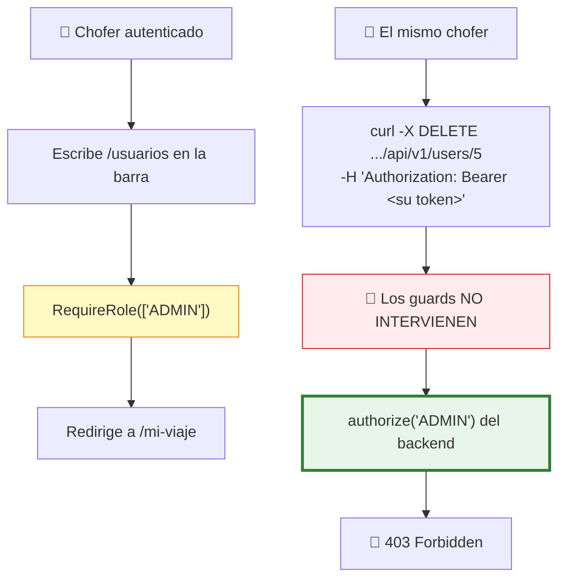
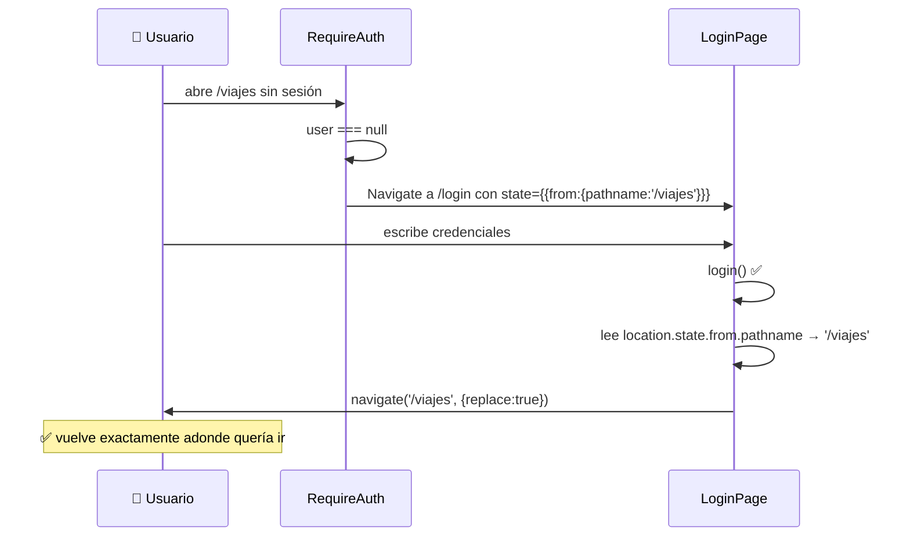
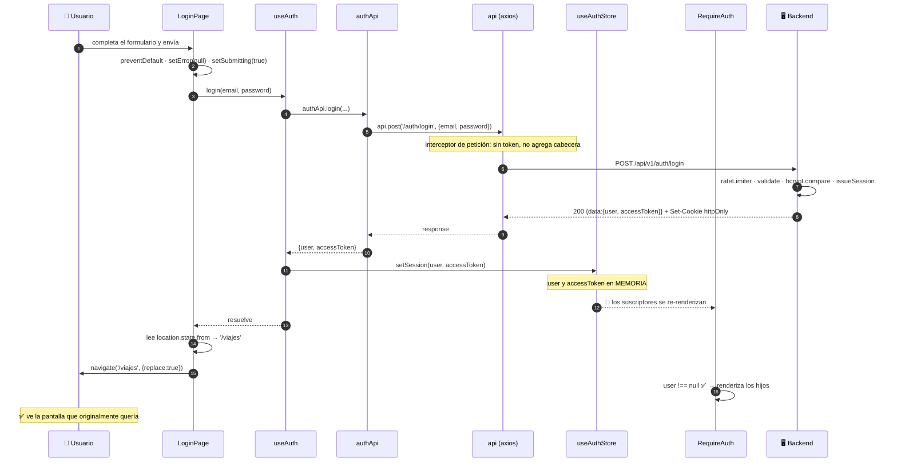
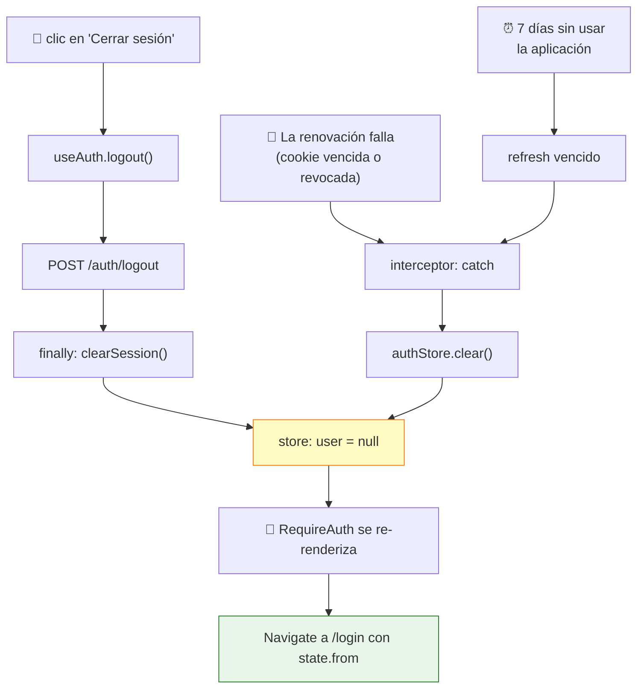

# Capítulo 20 — Estado y autorización en el cliente

> **Prerrequisitos:** [Capítulo 8](08-modulo-auth.md) (el esquema de doble token), [Capítulo 18](18-frontend-bootstrap.md) (hooks y rutas) y [Capítulo 19](19-frontend-api.md).
> **Archivos que se explican aquí:** `src/stores/auth-store.ts` (37 líneas), `src/auth/guards.tsx` (38), `src/auth/use-auth.ts` (25), `src/auth/guards.test.ts` (13) y `src/pages/auth/LoginPage.tsx` (123). Total: 236 líneas, todas.
> **Al terminar** el lector entenderá cómo se gestiona el estado global sin Redux, cómo se implementa la autorización del lado del cliente, y por qué las 38 líneas de `guards.tsx` **no son seguridad**.

---

## 20.1. Introducción

Este capítulo cubre el estado que **sobrevive a la navegación**: quién está conectado.

Es el único estado global de la aplicación. Todo lo demás —la lista de vehículos, el formulario abierto, la página actual de la tabla— vive dentro de su pantalla y desaparece al salir de ella.

**Y esa decisión tiene consecuencias que el capítulo 22 examinará:** sin estado de servidor compartido, cada pantalla vuelve a pedir sus datos cada vez.

Los temas:

1. **Zustand**: por qué se eligió sobre Redux y qué significa "sin proveedor".
2. **La doble interfaz del store**: reactiva para componentes, imperativa para el interceptor de Axios.
3. **Los guards**: 38 líneas que son **experiencia de usuario, no seguridad** — y por qué esa distinción es la más importante del capítulo.
4. **El patrón de exhaustividad** en `homePathForRole`, que hace que agregar un rol sea un error de compilación.
5. **La pantalla de login**, con sus decisiones de accesibilidad y su detalle sobre el destino tras autenticarse.

---

## 20.2. Conceptos previos

### 20.2.1. Qué estado necesita ser global

**No todo el estado debe compartirse.** La regla práctica:

| Estado | ¿Global? | Por qué |
|:--|:--:|:--|
| Usuario conectado, token | ✅ **Sí** | Lo necesitan los guards, los layouts, el interceptor y varias pantallas |
| Lista de vehículos de la pantalla actual | ❌ No | Solo la usa esa pantalla |
| Si un diálogo está abierto | ❌ No | Es local al componente |
| Página actual de una tabla | ❌ No | Ídem |
| Tema claro/oscuro | ✅ Sí *(si existiera)* | Lo lee toda la aplicación |

💡 **El proyecto tiene UN solo store**, y contiene exactamente lo primero.

⚠️ **`docs/etapa-1-arquitectura.md:126` planificaba dos:** *"stores/ — Zustand: authStore, uiStore"*. **El `uiStore` nunca se implementó**, y no hace falta: no hay estado de interfaz verdaderamente global (no hay notificaciones emergentes centralizadas ni tema conmutable).

🔴 **Y hay una tercera categoría que el proyecto NO gestiona: el estado de SERVIDOR.**

**Los datos que vienen de la API** —vehículos, viajes, choferes— no son ni locales ni globales: son **una copia en caché de algo que vive en el servidor**. Herramientas como React Query o SWR los tratan como categoría propia, con caché, deduplicación, revalidación y reintentos.

**Aquí cada pantalla los guarda en un `useState` local**, con las consecuencias de §22.

### 20.2.2. Zustand vs. Redux

**Redux** es la solución tradicional, y su ceremonia es notable:

```tsx
// — ejemplo ilustrativo del enfoque Redux —
const authSlice = createSlice({
  name: 'auth',
  initialState: { user: null, accessToken: null },
  reducers: {
    setSession: (state, action) => { state.user = action.payload.user; … },
  },
});
const store = configureStore({ reducer: { auth: authSlice.reducer } });

// En main.tsx:
<Provider store={store}><App /></Provider>

// En un componente:
const user = useSelector((s) => s.auth.user);
const dispatch = useDispatch();
dispatch(setSession({ user, accessToken }));
```

**Zustand** hace lo mismo en un tercio del código:

```tsx
export const useAuthStore = create<AuthState>((set) => ({
  user: null,
  accessToken: null,
  setSession: (user, accessToken) => set({ user, accessToken }),
}));

// En un componente — sin Provider, sin dispatch:
const user = useAuthStore((s) => s.user);
useAuthStore.getState().setSession(user, token);
```

| | Redux Toolkit | **Zustand** |
|:--|:--|:--|
| Requiere `<Provider>` | ✅ Sí | ❌ **No** |
| Acciones y reductores separados | ✅ Sí | ❌ Todo junto |
| Acceso fuera de React | Con el objeto `store` | ✅ `getState()` |
| Herramientas de desarrollo | Excelentes | Con un middleware |
| Tamaño | ~12 KB | **~1 KB** |
| Curva de aprendizaje | Alta | Baja |

💡 **La justificación del proyecto** (`docs/etapa-1-arquitectura.md:206`): *"Zustand: mínima ceremonia, suficiente para el estado global real (sesión, UI) — el estado de servidor vive en cada página vía API"*.

🔴 **La frase final es la que reconoce la decisión de §20.2.1**, y sus costos.

⚙️ **Por qué Zustand no necesita proveedor:** el store **no vive en el Context de React**, sino en un módulo. `create()` devuelve un hook que se suscribe a un objeto externo. **Cualquier archivo que lo importe accede al mismo store** — incluido `axios.ts`, que no es un componente (§19.3.1).

⚠️ **La contrapartida: el store es un singleton del módulo**, así que **no se puede tener dos instancias** (por ejemplo, para aislar tests). Con Redux y su proveedor, sí.

### 20.2.3. Autorización en el cliente: qué es y qué no es

🔴 **Esta es la distinción más importante del capítulo, y ya se anticipó en §7.2.2.**

**Los guards del frontend NO son seguridad.** Son **experiencia de usuario**.



**Los guards del frontend solo se ejecutan cuando el usuario usa el frontend.** Cualquiera puede saltárselos:

| Forma de saltear los guards | Dificultad |
|:--|:--|
| `curl` con el token copiado | **Trivial** |
| Postman o Insomnia | Trivial |
| Editar el store desde la consola | Fácil |
| Modificar el JavaScript descargado | Moderada |

💡 **La conclusión operativa: TODA regla de autorización debe existir en el backend.** La del frontend es una comodidad para que el usuario legítimo no vea opciones que no puede usar.

**Y funciona en ambos sentidos:** quitar un guard del frontend produce una interfaz confusa (menús que dan error); quitar un `authorize` del backend produce una **vulnerabilidad**.

---

## 20.3. `auth-store.ts` línea por línea

```ts
1  import { create } from 'zustand';
2  import type { PublicUser } from '../api/types';
3
4  /**
5   * Session store (Zustand). The access token lives in memory only (never in
6   * localStorage) to minimize XSS exposure; the refresh token is an httpOnly
7   * cookie handled by the browser. On a full page reload the token is gone and
8   * the app silently re-hydrates the session via POST /auth/refresh (see
9   * bootstrapSession in App).
10  */
11 interface AuthState {
12   user: PublicUser | null;
13   accessToken: string | null;
14   /** True until the initial refresh attempt has resolved. */
15   initializing: boolean;
16   setSession: (user: PublicUser, accessToken: string) => void;
17   setAccessToken: (accessToken: string) => void;
18   clearSession: () => void;
19   setInitialized: () => void;
20 }
21
22 export const useAuthStore = create<AuthState>((set) => ({
23   user: null,
24   accessToken: null,
25   initializing: true,
26   setSession: (user, accessToken) => set({ user, accessToken }),
27   setAccessToken: (accessToken) => set({ accessToken }),
28   clearSession: () => set({ user: null, accessToken: null }),
29   setInitialized: () => set({ initializing: false }),
30 }));
31
32 /** Non-reactive accessors for use outside React (e.g. Axios interceptors). */
33 export const authStore = {
34   getAccessToken: () => useAuthStore.getState().accessToken,
35   setAccessToken: (token: string) => useAuthStore.getState().setAccessToken(token),
36   clear: () => useAuthStore.getState().clearSession(),
37 };
```

### 20.3.1. El comentario que documenta la decisión de seguridad

Las líneas 4-10 resumen todo el capítulo 8 en seis líneas, y merece verificarse punto por punto:

| Afirmación | ¿Verificada? |
|:--|:--|
| *"The access token lives in memory only"* | ✅ Línea 24: es una propiedad del objeto, no `localStorage` |
| *"never in localStorage"* | ✅ `grep -rn "localStorage" src/` no devuelve nada |
| *"to minimize XSS exposure"* | ✅ §8.2.1: un XSS no puede exfiltrarlo para usarlo después |
| *"the refresh token is an httpOnly cookie"* | ✅ `auth.controller.ts:14` |
| *"On a full page reload the token is gone"* | ✅ Toda la memoria de JavaScript se destruye |
| *"the app silently re-hydrates"* | ✅ `useBootstrapSession` (§18.5.2) |

💡 **Es un comentario que sí describe lo que el código hace** — a diferencia de los cuatro incorrectos que el manual encontró (§14.7).

### 20.3.2. La forma del estado

**Tres datos y cuatro acciones**, todo en una interfaz.

⚠️ **Zustand mezcla estado y acciones en el mismo objeto**, a diferencia de Redux, que los separa. **Es más simple y tiene una consecuencia:** `useAuthStore((s) => s)` devolvería el estado **y** las funciones, y como las funciones son estables, no causaría re-renders adicionales — pero cualquier cambio de estado sí.

**Línea 12 — `PublicUser`, el tipo del backend**

```ts
user: PublicUser | null;
```

💡 **Es exactamente lo que devuelve `GET /auth/me`** (§8.6.1): `{ id, name, email, role }`. **Cuatro campos, sin `isActive` ni fechas** — el mínimo que el frontend necesita.

**`| null` es la representación de "sin sesión"**, y obliga a comprobar antes de usar. Es lo que hace que `guards.tsx:10` (`if (!user)`) sea obligatorio y no opcional.

**Línea 15 — `initializing`, la tercera pieza**

```ts
/** True until the initial refresh attempt has resolved. */
initializing: boolean;
```

🔴 **Ya se justificó en §18.5.3:** distingue "verificando" de "no autenticado", evitando el parpadeo hacia el login.

⚠️ **Empieza en `true` y solo pasa a `false`.** **Nunca vuelve a `true`.** Es correcto —la rehidratación ocurre una sola vez por carga de página— pero significa que el nombre es algo impreciso: describe una fase única, no un estado recurrente.

### 20.3.3. Las cuatro acciones y una asimetría

```ts
setSession: (user, accessToken) => set({ user, accessToken }),
setAccessToken: (accessToken) => set({ accessToken }),
clearSession: () => set({ user: null, accessToken: null }),
setInitialized: () => set({ initializing: false }),
```

⚙️ **`set` de Zustand hace una FUSIÓN SUPERFICIAL**, no un reemplazo. `set({ accessToken })` deja `user` e `initializing` intactos. **Es distinto de Redux**, donde el reductor debe devolver el estado completo.

💡 **Y explica por qué `setAccessToken` funciona:** el interceptor renueva el token **sin** tocar el usuario.

**Las tres acciones cubren tres momentos distintos:**

| Acción | Cuándo | Quién la llama |
|:--|:--|:--|
| `setSession` | Al iniciar sesión o rehidratar | `useAuth.login`, `useBootstrapSession` |
| `setAccessToken` | Al renovar | **El interceptor de Axios** |
| `clearSession` | Al cerrar sesión o fallar la renovación | `useAuth.logout`, el interceptor |

🔴 **`clearSession` NO limpia `initializing`**, y es correcto: cerrar sesión no significa volver a verificar. Si lo pusiera en `true`, la aplicación mostraría el indicador de carga para siempre (nadie volvería a llamar a `setInitialized`).

⚠️ **Es una sutileza que un cambio descuidado rompería.** Un `clearSession: () => set({ user: null, accessToken: null, initializing: true })` —que parece "más limpio"— **colgaría la aplicación** al cerrar sesión.

### 20.3.4. La doble interfaz

```ts
/** Non-reactive accessors for use outside React (e.g. Axios interceptors). */
export const authStore = {
  getAccessToken: () => useAuthStore.getState().accessToken,
  setAccessToken: (token: string) => useAuthStore.getState().setAccessToken(token),
  clear: () => useAuthStore.getState().clearSession(),
};
```

🔴 **`useAuthStore.getState()` lee el estado SIN suscribirse.** Es la vía de escape de Zustand para código que no es React.

**Las dos interfaces, comparadas:**

| | `useAuthStore(selector)` | `authStore.*` |
|:--|:--|:--|
| Dónde se usa | Componentes | **Interceptores, utilidades** |
| Provoca re-render | ✅ Sí, al cambiar el valor seleccionado | ❌ No |
| Es un hook | ✅ Sí (reglas de hooks) | ❌ **No** |
| Devuelve | El valor actual, reactivo | Una instantánea |

💡 **Sin esta segunda interfaz, `axios.ts` no podría leer el token** (§19.3.1): no es un componente y no puede llamar hooks.

⚠️ **Y hay una inconsistencia de nombres:**

| En `AuthState` | En `authStore` |
|:--|:--|
| `clearSession` | **`clear`** |
| `setAccessToken` | `setAccessToken` ✅ |

**Dos nombres para la misma operación**, sin ninguna razón. **Un lector que busque `clearSession` en `axios.ts` no lo encuentra.**

🔴 **Y `authStore` NO expone todo lo que `AuthState` tiene:** falta `setSession`, `setInitialized`, `getUser` y `getInitializing`. **Hoy no hacen falta**, pero significa que agregar una utilidad no-React que necesite el usuario obligaría a ampliar el objeto — o a usar `useAuthStore.getState()` directamente, saltando la abstracción.

**Lo que NO tiene: persistencia**

🔴 **Zustand ofrece un middleware `persist`** que guarda el store en `localStorage` automáticamente. **Deliberadamente NO se usa.**

**Si se usara, el token quedaría en `localStorage`** — exactamente lo que la decisión de seguridad del capítulo 8 evita. **La ausencia del middleware es la implementación de esa decisión.**

⚠️ **Y es una omisión frágil:** alguien que quiera "mejorar la experiencia" agregando `persist(...)` **anularía la protección contra XSS sin darse cuenta**. Un comentario advirtiéndolo estaría bien — el de las líneas 4-10 lo insinúa (*"never in localStorage"*) pero no dice "no agregues `persist`".

---

## 20.4. `guards.tsx` línea por línea

### 20.4.1. `RequireAuth`

```ts
6  /** Blocks access to a route until the user is authenticated. */
7  export function RequireAuth({ children }: { children: ReactNode }) {
8    const user = useAuthStore((s) => s.user);
9    const location = useLocation();
10   if (!user) {
11     return <Navigate to="/login" replace state={{ from: location }} />;
12   }
13   return <>{children}</>;
14 }
```

**Ocho líneas. Es un componente de orden superior expresado como envoltorio.**

**Línea 8 — el selector**

```ts
const user = useAuthStore((s) => s.user);
```

💡 **Se suscribe SOLO a `user`.** Cuando el interceptor renueva el token (`setAccessToken`), **este componente no se re-renderiza** — porque `user` no cambió.

🔴 **Sin el selector (`useAuthStore()` a secas), cada renovación de token re-renderizaría todos los guards**, y con ellos todo el árbol de páginas. **Con la renovación ocurriendo cada 15 minutos, sería un re-render completo periódico e innecesario.**

**Línea 11 — `state={{ from: location }}`**

🔴 **Guarda de dónde venía el usuario, y NO es funcionalidad muerta.**

`LoginPage.tsx:45-46` lo consume:

```tsx
const from = (location.state as { from?: { pathname: string } } | null)?.from?.pathname;
navigate(from ?? '/', { replace: true });
```

**El flujo completo:**



💡 **Es un detalle de experiencia de usuario que muchas aplicaciones omiten**, y que se nota: un enlace compartido a `/viajes/12` lleva al usuario al login y **después al viaje 12**, no al dashboard.

**Y `?? '/'` es un valor por defecto elegante:** `/` resuelve a `RoleHome` (§18.5.4), que redirige al inicio del rol. **Así que no hay caso sin destino.**

**Línea 13 — `<>{children}</>`**

⚙️ **`<>...</>` es un fragmento**: agrupa hijos sin agregar un elemento al DOM. Sin él habría que envolver en un `<div>`, que rompería el diseño (un `<div>` extra entre el layout y sus hijos altera el flujo de CSS).

**Línea 11 — `replace`**

Por lo mismo de §18.5.4: sin `replace`, el botón "atrás" volvería a la ruta protegida, que redirigiría al login otra vez, en bucle.

### 20.4.2. `RequireRole` y la decisión de no mostrar un 403

```ts
16 /**
17  * Restricts a route to specific roles. Assumes RequireAuth ran first.
18  * A wrong-role user is sent to their own home instead of seeing a 403 page.
19  */
20 export function RequireRole({ roles, children }: { roles: Role[]; children: ReactNode }) {
21   const user = useAuthStore((s) => s.user);
22   if (!user) return <Navigate to="/login" replace />;
23   if (!roles.includes(user.role)) {
24     return <Navigate to={homePathForRole(user.role)} replace />;
25   }
26   return <>{children}</>;
27 }
```

**Línea 22 — la comprobación redundante**

```ts
if (!user) return <Navigate to="/login" replace />;
```

⚠️ **El comentario dice *"Assumes RequireAuth ran first"***, y `App.tsx` siempre lo anida dentro. **Así que esta línea nunca se alcanza en la práctica.**

🔴 **Y es correcta igualmente**, por dos razones:

1. **TypeScript la exige.** `user` es `PublicUser | null`, y la línea 23 lee `user.role`. Sin la comprobación, no compila.
2. **Defensa contra un error de ensamblaje.** Si alguien usara `RequireRole` sin `RequireAuth`, esto lo cubre en vez de producir un `TypeError`.

💡 **Es el mismo patrón que `authorize.ts:11` en el backend** (§7.4), que también comprueba `req.user` aunque `authenticate` debería haberlo poblado. **Coherencia entre las dos capas de autorización.**

**Líneas 23-25 — la decisión documentada**

> *"A wrong-role user is sent to their own home **instead of seeing a 403 page**."*

**Las dos alternativas:**

| Enfoque | Qué ve el usuario |
|:--|:--|
| **Redirección** (elegido) | Aparece en su inicio, sin explicación |
| Pantalla 403 | *"No tenés permiso para acceder a esta sección"* + enlace |

🔴 **La redirección silenciosa tiene un problema de experiencia real, ya señalado en §18.5.4.**

**El escenario:** un chofer recibe de un compañero el enlace `/usuarios`. Hace clic, y **aparece en "Mi viaje"** sin ninguna explicación. **Concluye que el enlace estaba roto**, o que la aplicación falló.

**Con una pantalla 403 sabría exactamente qué pasó.**

⚠️ **Y hay una inconsistencia con el backend**, que **sí** devuelve un 403 explícito con mensaje (§7.4). **El servidor explica; el cliente disimula.**

💡 **El argumento a favor de la redirección** es que evita callejones sin salida: el usuario siempre termina en una pantalla útil. **Una pantalla 403 CON un botón "Ir al inicio" tendría ambas ventajas.**

### 20.4.3. `homePathForRole` y el patrón de exhaustividad

```ts
29 /** Landing route per role (the driver has a mobile-style app). */
30 export function homePathForRole(role: Role): string {
31   switch (role) {
32     case 'ADMIN':
33     case 'OPERATOR':
34       return '/dashboard';
35     case 'DRIVER':
36       return '/mi-viaje';
37   }
38 }
```

🔴 **Nótese lo que NO tiene: `default`.**

**Y aun así compila**, porque TypeScript verifica la **exhaustividad**: `Role` es `'ADMIN' | 'OPERATOR' | 'DRIVER'`, los tres casos están cubiertos, así que el compilador sabe que la función siempre retorna.

💡 **Y ahí está la propiedad valiosa: si se agregara un rol `SUPERVISOR` al tipo, esta función DEJARÍA DE COMPILAR** con:

```
Function lacks ending return statement and return type does not include 'undefined'.
```

**Agregar un rol se convierte en un error de compilación que señala exactamente dónde hay que decidir su pantalla de inicio.**

🔴 **Con un `default: return '/dashboard'`, ese rol nuevo iría silenciosamente al dashboard** — probablemente incorrecto, y sin ninguna señal.

⚠️ **Y depende de una opción del compilador:** `noImplicitReturns` (o `strict`, que la incluye). **`tsconfig.json:9` tiene `"strict": true`**, así que la protección está activa. Sin ella, la función devolvería `undefined` y `<Navigate to={undefined}>` fallaría en tiempo de ejecución.

**El `case` agrupado (líneas 32-33)** aprovecha la caída de `switch`: `ADMIN` y `OPERATOR` comparten destino. **Es el único uso legítimo de la caída**, y por eso `noFallthroughCasesInSwitch` (`tsconfig.json:13`) **no** lo marca: solo prohíbe la caída cuando el `case` tiene cuerpo.

### 20.4.4. El test que cubre lo trivial

```ts
describe('homePathForRole', () => {
  it('sends admins and operators to the dashboard', () => {
    expect(homePathForRole('ADMIN')).toBe('/dashboard');
    expect(homePathForRole('OPERATOR')).toBe('/dashboard');
  });
  it('sends drivers to their current trip', () => {
    expect(homePathForRole('DRIVER')).toBe('/mi-viaje');
  });
});
```

✅ **Cubre los tres roles.** Es correcto y completo **para esa función**.

🔴 **Pero `RequireAuth` y `RequireRole` NO están testeados**, y son los componentes que realmente importan.

**Y la infraestructura está instalada:**

| Paquete | Versión | ¿Se usa? |
|:--|:--|:--:|
| `@testing-library/react` | ^16.3.2 | ❌ **No** |
| `@testing-library/jest-dom` | ^7.0.0 | ❌ **No** |
| `jsdom` | ^29.1.1 | Solo por el entorno de Vitest |

⚠️ **Tres dependencias de desarrollo instaladas para probar componentes, y ningún test de componente.**

**Un test de `RequireRole` sería:**

```tsx
// — test propuesto —
import { render, screen } from '@testing-library/react';
import { MemoryRouter, Routes, Route } from 'react-router-dom';
import { useAuthStore } from '../stores/auth-store';

it('redirige a un chofer que intenta una ruta de ADMIN', () => {
  useAuthStore.setState({ user: { id: 3, name: 'Juan', email: 'j@x.com', role: 'DRIVER' } });
  render(
    <MemoryRouter initialEntries={['/usuarios']}>
      <Routes>
        <Route path="/usuarios" element={
          <RequireRole roles={['ADMIN']}><div>Secreto</div></RequireRole>
        } />
        <Route path="/mi-viaje" element={<div>Mi viaje</div>} />
      </Routes>
    </MemoryRouter>,
  );
  expect(screen.queryByText('Secreto')).toBeNull();
  expect(screen.getByText('Mi viaje')).toBeDefined();
});
```

💡 **Quince líneas que verifican la lógica de autorización del cliente completa.** Y `useAuthStore.setState(...)` permite preparar el estado sin montar toda la aplicación — otra ventaja de que Zustand no use proveedor.

**El balance de tests del proyecto, ahora completo:**

| Proyecto | Tests | Qué cubren |
|:--|--:|:--|
| Backend | 23 | Criptografía, fechas, esquemas de Zod |
| Frontend | 5 | Fechas (3) + `homePathForRole` (2) |
| **Total** | **28** | **Solo funciones puras** |

🔴 **Ni un solo test de un componente, de un servicio, de un endpoint o de un flujo.** La infraestructura para los cuatro está instalada (§5.5.2 para endpoints, aquí para componentes).

---

## 20.5. `use-auth.ts` — la fachada para componentes

```ts
1  import { useAuthStore } from '../stores/auth-store';
2  import { authApi } from '../api/auth.api';
3
4  /** Session hook: exposes the current user and session actions to components. */
5  export function useAuth() {
6    const user = useAuthStore((s) => s.user);
7    const initializing = useAuthStore((s) => s.initializing);
8    const setSession = useAuthStore((s) => s.setSession);
9    const clearSession = useAuthStore((s) => s.clearSession);
10
11   async function login(email: string, password: string): Promise<void> {
12     const { user: loggedUser, accessToken } = await authApi.login(email, password);
13     setSession(loggedUser, accessToken);
14   }
15
16   async function logout(): Promise<void> {
17     try {
18       await authApi.logout();
19     } finally {
20       clearSession();
21     }
22   }
23
24   return { user, initializing, isAuthenticated: user !== null, login, logout };
25 }
```

💡 **Es un hook personalizado que combina store y API en una sola interfaz.** Los componentes no necesitan saber que existen `authApi` y `useAuthStore` por separado.

**Líneas 11-14 — `login`**

```ts
const { user: loggedUser, accessToken } = await authApi.login(email, password);
setSession(loggedUser, accessToken);
```

**Dos pasos: llamar a la API y guardar el resultado.**

⚠️ **Nótese el renombrado en la desestructuración** (`user: loggedUser`), necesario porque `user` ya existe en el ámbito (línea 6). **Sombrear la variable habría compilado** pero sería confuso.

🔴 **`login` NO captura errores**, así que un fallo se propaga al llamador. **Es correcto:** `LoginPage` necesita mostrarlo (`LoginPage.tsx:47-48`). Capturarlo aquí ocultaría el error o requeriría devolver un resultado que el llamador podría ignorar.

**Líneas 16-22 — `logout` y el `finally`**

```ts
try {
  await authApi.logout();
} finally {
  clearSession();
}
```

🔴 **El `finally` es la decisión clave: la sesión se limpia SIEMPRE, haya funcionado la llamada o no.**

**Los tres escenarios:**

| Situación | ¿Se llama al backend? | ¿Se limpia local? |
|:--|:--:|:--:|
| Todo bien | ✅ | ✅ |
| **El backend no responde** | ❌ | ✅ **Sí** |
| **El token ya venció (401)** | Falla | ✅ **Sí** |

💡 **Es el comportamiento correcto:** cerrar sesión es una acción del usuario que **debe funcionar siempre**. Si el servidor está caído y el `finally` no existiera, el usuario quedaría atrapado en una sesión que no puede cerrar.

⚠️ **Con una consecuencia de seguridad:** si la llamada falla, **el refresh token NO se revoca en el servidor** (§8.6.6). La sesión local se cierra pero la cookie sigue siendo válida hasta 7 días. **Es aceptable** —el usuario cerró sesión en su dispositivo— pero significa que "cerrar sesión" no siempre invalida la sesión del lado del servidor.

**Línea 24 — `isAuthenticated` derivado**

```ts
return { user, initializing, isAuthenticated: user !== null, login, logout };
```

💡 **Un valor calculado, no almacenado** — la misma decisión que `insuranceValid` en el backend (§10.2.3). **Imposible que se desincronice con `user`.**

⚠️ **Y no se usa en ningún lado:** `grep -rn "isAuthenticated" src/` solo lo encuentra aquí. **Los componentes usan `user` directamente.** Es una comodidad no aprovechada.

🔴 **`useAuth` se recrea en cada render**, y con él `login` y `logout`. Si alguien las pasara a un `useEffect` con dependencias, **el efecto se re-ejecutaría en cada render**. `useCallback` las estabilizaría.

**Hoy no ocurre** (solo `LoginPage` las usa, en un manejador de eventos), pero es una trampa esperando.

---

## 20.6. `LoginPage.tsx` — la puerta de entrada

### 20.6.1. La redirección de usuario ya autenticado

```tsx
28 const [email, setEmail] = useState('');
29 const [password, setPassword] = useState('');
30 const [showPassword, setShowPassword] = useState(false);
31 const [error, setError] = useState<string | null>(null);
32 const [submitting, setSubmitting] = useState(false);
33
34 // Already logged in → go to the role's home.
35 if (user) {
36   return <Navigate to={homePathForRole(user.role)} replace />;
37 }
```

🔴 **El retorno temprano está DESPUÉS de todos los hooks**, y eso es obligatorio (§18.2.3): un `return` antes de un `useState` alteraría el orden de los hooks entre renders y corrompería el estado.

💡 **Cubre dos casos:** un usuario con sesión que escribe `/login` a mano, y el instante posterior a un login exitoso, si la navegación de la línea 46 no se hubiera producido todavía.

### 20.6.2. El envío del formulario

```tsx
39 async function handleSubmit(e: FormEvent) {
40   e.preventDefault();
41   setError(null);
42   setSubmitting(true);
43   try {
44     await login(email, password);
45     const from = (location.state as { from?: { pathname: string } } | null)?.from?.pathname;
46     navigate(from ?? '/', { replace: true });
47   } catch (err) {
48     setError(apiErrorMessage(err, 'No se pudo iniciar sesión'));
49   } finally {
50     setSubmitting(false);
51   }
52 }
```

**Línea 40 — `e.preventDefault()`**

🔴 **Sin él, el formulario haría un envío HTML nativo**, recargando la página y perdiendo todo el estado de React. **Es el primer paso obligatorio de cualquier manejador de `onSubmit`.**

**Línea 41 — limpiar el error anterior**

💡 **Sin esto, un segundo intento fallido dejaría visible el mensaje del primero** mientras la petición está en curso — el usuario no sabría si el error es nuevo o viejo.

**Línea 42 y 50 — el estado de envío**

```tsx
setSubmitting(true);
…
finally { setSubmitting(false); }
```

**Deshabilita el botón** (línea 112) y muestra un indicador de progreso (línea 115). **Previene el doble envío**, que con el limitador del backend (10 intentos / 15 min, §7.7) consumiría dos intentos por un solo clic doble.

⚠️ **Y hay un detalle sutil: si el login tiene éxito, la línea 46 navega y el componente se DESMONTA.** El `setSubmitting(false)` del `finally` se ejecutaría sobre un componente desmontado.

🔴 **En React 18 eso ya no produce advertencia** (se eliminó en la versión 18), pero **en versiones anteriores llenaba la consola**. **Funciona por la versión de React, no por diseño.**

**Línea 45 — la lectura del origen**

```tsx
const from = (location.state as { from?: { pathname: string } } | null)?.from?.pathname;
```

⚠️ **`location.state` es `any` en los tipos de React Router**, así que hace falta una aserción. **Y el doble `?.` la hace segura**: si no hay estado, o no hay `from`, o no hay `pathname`, el resultado es `undefined` y el `??` de la línea 46 aplica el valor por defecto.

**Línea 48 — el mensaje de error**

```tsx
setError(apiErrorMessage(err, 'No se pudo iniciar sesión'));
```

💡 **El valor por defecto está en español y es específico del contexto.**

**Qué ve el usuario en cada caso:**

| Situación | Mensaje mostrado | Origen |
|:--|:--|:--|
| Credenciales incorrectas | *"Invalid credentials"* | 🔴 Backend, **en inglés** |
| Más de 10 intentos | *"Too many login attempts, try again later"* | 🔴 Backend, en inglés |
| Email malformado | *"Invalid email"* | 🔴 Backend, en inglés |
| **Servidor caído** | *"No se pudo iniciar sesión"* | ✅ El valor por defecto, en español |

🔴 **Tres de cuatro mensajes están en inglés en una aplicación en español.** Es la manifestación más visible de la deuda de §7.6.3, **y ocurre en la primera pantalla que ve cualquier usuario.**

### 20.6.3. Los detalles de accesibilidad y usabilidad

```tsx
77 <TextField label="Usuario (email)" type="email" … autoComplete="username" required fullWidth />
86 <TextField label="Contraseña" type={showPassword ? 'text' : 'password'} …
91   autoComplete="current-password" required fullWidth
94   InputProps={{ endAdornment: (
96     <InputAdornment position="end">
97       <IconButton onClick={() => setShowPassword((v) => !v)} edge="end"
100        aria-label="Mostrar u ocultar contraseña">
102        {showPassword ? <VisibilityOff /> : <Visibility />}
103      </IconButton>
104    </InputAdornment>
105  ) }}
```

**Cinco decisiones correctas que suelen omitirse:**

| Detalle | Por qué importa |
|:--|:--|
| **`type="email"`** | En móvil muestra el teclado con `@`; el navegador valida el formato |
| **`autoComplete="username"` / `"current-password"`** | 🔴 **Los gestores de contraseñas los necesitan** para ofrecer autocompletado y para guardar la credencial |
| **`required`** | Validación nativa antes de enviar, sin JavaScript |
| **`aria-label`** en el botón de ojo | El botón solo tiene un icono; sin la etiqueta, un lector de pantalla diría "botón" |
| **`type={showPassword ? 'text' : 'password'}`** | Alternar visibilidad reduce errores de tipeo en móvil |

💡 **`autoComplete` es el más subestimado.** Sin los valores correctos, los gestores de contraseñas **no reconocen el formulario** y el usuario tiene que copiar y pegar. Con ellos, el navegador ofrece guardar la credencial tras el primer login exitoso.

**Línea 98 — la actualización funcional**

```tsx
onClick={() => setShowPassword((v) => !v)}
```

🔴 **`setShowPassword((v) => !v)` y no `setShowPassword(!showPassword)`.**

💡 **La forma funcional recibe el valor actual garantizado.** Con la forma directa, si hubiera dos actualizaciones en el mismo ciclo, la segunda leería un valor obsoleto del cierre.

**Aquí no hay riesgo real** (un clic, una actualización), pero **es la forma correcta por defecto** y evita una categoría entera de bugs.

**Línea 76 — el error como alerta**

```tsx
{error && <Alert severity="error">{error}</Alert>}
```

⚙️ **`{condición && <Elemento/>}` es el idioma de React para renderizado condicional.** Si `error` es `null`, la expresión vale `null` y React no renderiza nada.

🔴 **Y hay una trampa clásica que este código evita por casualidad:** con `{lista.length && <X/>}`, si la longitud es `0`, React renderiza **el número `0`** en la pantalla. **Con strings y `null` no ocurre**, porque `null` no se renderiza.

⚠️ **El `<Alert>` no tiene `role="alert"` explícito** — aunque MUI lo agrega internamente, así que un lector de pantalla anuncia el error al aparecer. ✅

**Lo que NO hay: enlace de recuperación de contraseña**

```tsx
/** Login screen (P-CH-1). No password recovery link (A-9). */
```

💡 **El comentario documenta la ausencia**, y enlaza con toda la decisión A-9 (§3.4.3): **no hay recuperación de contraseña porque el administrador las gestiona.** Un chofer que olvida la suya llama al administrador, que la consulta (§11.6.4) o la cambia (§11.6.5).

🔴 **Documentar una ausencia deliberada es tan valioso como documentar una presencia**, y aquí evita que alguien "agregue lo que falta".

---

## 20.7. Flujo interno

### 20.7.1. Login completo, de la pantalla al store



### 20.7.2. Los tres caminos de la desautenticación



💡 **Los tres caminos convergen en el mismo punto:** poner `user` en `null`. **La redirección es una consecuencia declarativa del cambio de estado**, no una llamada imperativa — y por eso funciona desde `axios.ts`, que no tiene acceso al router.

---

## 20.8. Ejemplos

### Ejemplo 1 — Demostrar que los guards no son seguridad

```
1. Iniciar sesión como CHOFER.
2. Intentar navegar a /usuarios → redirige a /mi-viaje ✅
3. En la consola del navegador:
```

```js
// Leer el token del store (Zustand lo expone)
const token = useAuthStore.getState().accessToken;
// (o desde las herramientas de React si el store no es global)
```

```bash
# Con ese token, saltarse el frontend por completo:
curl -X DELETE http://localhost:3000/api/v1/users/5 \
  -H "Authorization: Bearer <token del chofer>"
```

```http
HTTP/1.1 403 Forbidden
{"error":{"code":"FORBIDDEN","message":"Insufficient permissions for this operation"}}
```

🔴 **Los guards no intervinieron en absoluto.** **La única barrera real fue `authorize('ADMIN')` del backend.**

**Ahora al revés:** comentar `authorize('ADMIN')` en `users.routes.ts:16` y repetir el `curl`.

```http
HTTP/1.1 204 No Content
```

💀 **El chofer borró un usuario.** Los guards del frontend seguían en su lugar y no sirvieron de nada.

### Ejemplo 2 — El destino tras el login

```
1. Cerrar sesión.
2. Escribir directamente:  http://localhost:5173/viajes
3. Redirige a /login.
4. En React DevTools, inspeccionar la ubicación:
   → state: { from: { pathname: '/viajes', … } }
5. Iniciar sesión.
6. ✅ Aparece en /viajes, NO en /dashboard.
```

**Comparar con entrar directamente a `/login`:**

```
1. Ir a http://localhost:5173/login
2. Iniciar sesión.
3. location.state es null → from es undefined → navigate('/')
4. '/' → RoleHome → homePathForRole(role) → /dashboard ✅
```

### Ejemplo 3 — La redirección silenciosa de rol

```
1. Iniciar sesión como CHOFER.
2. Escribir /usuarios en la barra de direcciones.
3. Observar: aparece "Mi viaje" SIN ningún mensaje.
```

🔴 **El usuario no tiene forma de saber que la página existía y que no tiene permiso.**

**Comparar con la respuesta del backend ante lo mismo:**

```bash
curl .../users -H "Authorization: Bearer $CHOFER"
# → 403 {"message":"Insufficient permissions for this operation"}
```

⚠️ **El servidor explica; el cliente disimula.**

### Ejemplo 4 — La exhaustividad protegiendo un cambio

```ts
// — modificación temporal en api/types.ts —
export type Role = 'ADMIN' | 'OPERATOR' | 'DRIVER' | 'SUPERVISOR';
```

```bash
npm run typecheck
```

```
src/auth/guards.tsx:30:44 - error TS2366: Function lacks ending return statement
and return type does not include 'undefined'.
```

✅ **El compilador señala exactamente dónde hay que decidir el destino del rol nuevo.**

**Con un `default: return '/dashboard'`, el mismo cambio compilaría en silencio** y el supervisor iría al dashboard — probablemente incorrecto, y sin ninguna señal.

### Ejemplo 5 — El `finally` de `logout`

```
1. Iniciar sesión.
2. Detener el backend (Ctrl+C).
3. Hacer clic en "Cerrar sesión".
```

**Observaciones:**

| Aspecto | Resultado |
|:--|:--|
| `POST /auth/logout` | ❌ Falla (sin conexión) |
| La sesión local | ✅ **Se cierra igual** |
| Redirección al login | ✅ Ocurre |
| El refresh token en el servidor | 🔴 **Sigue válido hasta 7 días** |

💡 **La experiencia es correcta.** ⚠️ **La revocación del servidor no ocurrió**, así que "cerrar sesión" no invalidó la sesión del lado del servidor.

### Ejemplo 6 — Los idiomas mezclados

```
1. Intentar iniciar sesión con una contraseña incorrecta.
   → "Invalid credentials"                                   🔴 inglés
2. Repetir 11 veces.
   → "Too many login attempts, try again later"              🔴 inglés
3. Detener el backend e intentar de nuevo.
   → "No se pudo iniciar sesión"                             ✅ español
```

🔴 **Tres de cuatro mensajes en inglés, en la primera pantalla que ve cualquier usuario.**

---

## 20.9. Resumen

1. **Zustand no necesita proveedor** porque el store vive en un módulo, no en el Context de React. Eso es lo que permite que `axios.ts` —que no es un componente— acceda al token.

2. **La doble interfaz** (`useAuthStore` reactiva, `authStore` imperativa) resuelve la restricción de que los hooks solo se pueden llamar desde componentes.

3. **`set` de Zustand hace fusión superficial**, así que `setAccessToken` no toca `user`. Y `clearSession` **no** resetea `initializing`, lo cual es correcto: hacerlo colgaría la aplicación.

4. **La ausencia del middleware `persist` ES la implementación** de la decisión de seguridad del capítulo 8. Agregarlo anularía la protección contra XSS.

5. **Los guards son experiencia de usuario, no seguridad.** Se saltean con `curl`. Toda regla de autorización debe existir en el backend.

6. **`state={{ from: location }}` devuelve al usuario adonde quería ir** tras autenticarse — un detalle que muchas aplicaciones omiten.

7. **`homePathForRole` sin `default` aprovecha la verificación de exhaustividad de TypeScript:** agregar un rol se convierte en un error de compilación que señala dónde decidir.

8. **El `finally` de `logout` garantiza que cerrar sesión funcione siempre**, aunque el servidor no responda.

9. **`LoginPage` acierta en cinco detalles de accesibilidad y usabilidad** que suelen omitirse: `type="email"`, `autoComplete`, `required`, `aria-label` y la alternancia de visibilidad.

10. **Nueve hallazgos concretos:**

    | # | Hallazgo | Gravedad |
    |:-:|:--|:--|
    | 1 | 🔴 **`RequireAuth` y `RequireRole` NO están testeados**, pese a que `@testing-library/react` y `jest-dom` están instalados y sin usar. Solo se prueba `homePathForRole`. **El proyecto tiene 28 tests y ninguno cubre un componente, un servicio, un endpoint ni un flujo.** | **Alta** |
    | 2 | 🔴 **Tres de cuatro mensajes de error del login están en inglés** en una aplicación en español, y es la primera pantalla que ve cualquier usuario. | **Alta** |
    | 3 | 🔴 **La redirección silenciosa por rol no explica nada.** Un chofer que abre `/usuarios` aparece en "Mi viaje" y concluye que el enlace estaba roto. El backend sí devuelve un 403 con mensaje. | Media |
    | 4 | ⚠️ **Si `POST /auth/logout` falla, el refresh token NO se revoca** en el servidor y sigue válido hasta 7 días, aunque la sesión local se cierre. | Media |
    | 5 | ⚠️ **Inconsistencia de nombres**: `clearSession` en el store y `clear` en la interfaz imperativa. Buscar uno no encuentra el otro. | Baja |
    | 6 | ⚠️ **`authStore` no expone `getUser` ni `setSession`**, así que una utilidad no-React que los necesite tendría que saltarse la abstracción. | Baja |
    | 7 | ⚠️ **`useAuth` recrea `login` y `logout` en cada render**; pasarlas a un `useEffect` con dependencias produciría un bucle. Falta `useCallback`. | Baja |
    | 8 | ⚠️ **`isAuthenticated` no se usa en ningún lado.** Comodidad no aprovechada. | Baja |
    | 9 | ⚠️ **`setSubmitting(false)` se ejecuta sobre un componente ya desmontado** tras un login exitoso. Inofensivo en React 18, ruidoso en versiones anteriores. | Baja |
    | 10 | ⚠️ **Nada advierte contra agregar el middleware `persist`**, que anularía silenciosamente la decisión de mantener el token fuera de `localStorage`. | Baja |

---

## 20.10. Preguntas de repaso

1. ¿Qué estado debe ser global y cuál no? ¿Qué tercera categoría no gestiona el proyecto?
2. ¿Por qué Zustand no necesita `<Provider>`? ¿Qué permite eso que Redux dificultaría?
3. ¿Para qué existen las dos interfaces del store? ¿Por qué `axios.ts` no puede usar el hook?
4. `set` de Zustand hace fusión superficial. ¿Por qué eso hace posible `setAccessToken`?
5. ¿Por qué `clearSession` NO pone `initializing` en `true`? ¿Qué pasaría si lo hiciera?
6. ¿Qué middleware de Zustand se omite deliberadamente y por qué?
7. Demostrar en tres pasos que los guards no son seguridad.
8. ¿Qué hace `state={{ from: location }}` y quién lo consume? ¿Qué pasa si no hay estado?
9. ¿Por qué `RequireRole` comprueba `!user` si `RequireAuth` ya lo hizo? Dar las dos razones.
10. `homePathForRole` no tiene `default`. ¿Por qué compila y qué propiedad valiosa aporta?
11. ¿Por qué el `case 'ADMIN':` sin cuerpo no dispara `noFallthroughCasesInSwitch`?
12. ¿Por qué el `finally` de `logout`? ¿Qué consecuencia de seguridad tiene?
13. ¿Por qué el retorno temprano de `LoginPage` está después de los `useState`?
14. Enumerar los cinco detalles de accesibilidad del formulario y explicar el más subestimado.
15. ¿Por qué `setShowPassword((v) => !v)` y no `setShowPassword(!showPassword)`?

<details>
<summary><strong>Respuestas</strong></summary>

1. **Global**: lo que necesitan varias partes no relacionadas del árbol — aquí, la sesión (la usan los guards, los layouts, el interceptor y varias pantallas). **Local**: lo que solo usa una pantalla — la lista actual, si un diálogo está abierto, la página de una tabla. **La tercera categoría es el estado de SERVIDOR**: los datos que vienen de la API no son ni locales ni globales, sino una **caché de algo que vive en el servidor**, y herramientas como React Query los tratan con caché, deduplicación, revalidación y reintentos. **El proyecto los guarda en `useState` local en cada pantalla.**

2. Porque **el store vive en un módulo, no en el Context de React**. `create()` devuelve un hook que se suscribe a un objeto externo, así que cualquier archivo que lo importe accede al mismo store. **Eso permite que `axios.ts` —que no es un componente y no puede llamar hooks— lea y escriba el token con `getState()`.** Con Redux haría falta exportar el objeto `store` y usar `store.getState()`/`store.dispatch()`, que es posible pero más ceremonioso.

3. Porque **los hooks solo se pueden llamar desde componentes o desde otros hooks** (§18.2.3). `axios.ts` **no es un componente**: no hay ningún componente montado desde el cual invocar `useAuthStore()`. Necesita una lectura **imperativa** y no reactiva, que es lo que provee `authStore` mediante `useAuthStore.getState()`.

4. Porque `set({ accessToken })` **solo reemplaza esa propiedad** y deja `user` e `initializing` intactos. **Es lo que permite que el interceptor renueve el token sin tocar al usuario**: si `set` reemplazara el estado completo (como exige un reductor de Redux), habría que reconstruir el objeto entero y sería fácil perder campos.

5. Porque **cerrar sesión no significa volver a verificar si hay una**. Si `clearSession` pusiera `initializing: true`, `App.tsx` volvería a mostrar el indicador de carga (§18.5.3) **y nadie llamaría a `setInitialized()`** —el efecto de rehidratación solo corre al montar—, así que **la aplicación quedaría con el spinner girando para siempre**. Es una sutileza que un cambio "más limpio" rompería.

6. **`persist`**, que guarda el store en `localStorage` automáticamente. **Se omite porque guardaría el access token en `localStorage`**, que es exactamente lo que la decisión del capítulo 8 evita: un XSS podría exfiltrarlo con una línea. **La ausencia del middleware ES la implementación de esa decisión de seguridad** — y es frágil, porque nada advierte contra agregarlo.

7. **(1)** Iniciar sesión como chofer y comprobar que `/usuarios` redirige. **(2)** Copiar el token del store desde la consola. **(3)** Ejecutar `curl -X DELETE .../api/v1/users/5 -H "Authorization: Bearer <token>"`. **Los guards no intervienen**: la petición no pasa por el frontend. La única barrera es `authorize('ADMIN')` del backend, que devuelve 403. **Comentando esa línea del backend, el mismo `curl` borra el usuario** con los guards intactos.

8. **Guarda la ubicación desde la que se redirigió al login**, para volver ahí después de autenticarse. **Lo consume `LoginPage.tsx:45-46`**: lee `location.state.from.pathname` y navega ahí. **Si no hay estado** —porque el usuario fue directamente a `/login`— el doble `?.` devuelve `undefined` y el `?? '/'` aplica el valor por defecto: `/` resuelve a `RoleHome`, que redirige al inicio del rol.

9. **(a) TypeScript la exige**: `user` es `PublicUser | null` y la línea siguiente lee `user.role`; sin la comprobación, no compila. **(b) Defensa contra un error de ensamblaje**: si alguien usara `RequireRole` sin anidarlo en `RequireAuth`, esto lo cubre con una redirección al login en vez de producir un `TypeError`. **Es el mismo patrón que `authorize.ts:11` en el backend**, que también comprueba `req.user` aunque `authenticate` debería haberlo poblado.

10. **Compila porque TypeScript verifica la exhaustividad**: `Role` tiene exactamente tres variantes y las tres están cubiertas, así que el compilador sabe que la función siempre retorna. **La propiedad valiosa: si se agregara un rol al tipo, la función DEJARÍA DE COMPILAR** con "Function lacks ending return statement". **Agregar un rol se convierte en un error que señala exactamente dónde decidir su pantalla de inicio**, en lugar de mandarlo silenciosamente al dashboard.

11. Porque `noFallthroughCasesInSwitch` **solo prohíbe la caída cuando el `case` tiene cuerpo**. `case 'ADMIN':` seguido inmediatamente de `case 'OPERATOR':` no tiene sentencias entre ambos, así que es una **agrupación intencional de casos**, no una caída accidental. Es el único uso legítimo del mecanismo.

12. Para que **la sesión local se limpie SIEMPRE**, funcione o no la llamada al backend. Sin él, con el servidor caído el usuario quedaría atrapado en una sesión que no puede cerrar. **La consecuencia de seguridad**: si la llamada falla, **el refresh token no se revoca en el servidor** y sigue válido hasta 7 días. La sesión local se cierra pero la del servidor no — aceptable en el dispositivo del usuario, pero significa que "cerrar sesión" no siempre invalida la sesión remota.

13. Porque **los hooks se identifican por su orden de llamada** (§18.2.3). Un `return` antes de los `useState` haría que en un render se llamen cinco hooks y en otro ninguno, **alterando el orden y corrompiendo el estado del componente**. Todos los hooks deben ejecutarse incondicionalmente antes de cualquier retorno.

14. `type="email"` (teclado con `@` en móvil, validación nativa), **`autoComplete="username"` y `"current-password"`**, `required` (validación nativa sin JS), `aria-label` en el botón de ojo (que solo tiene un icono), y la alternancia de visibilidad de la contraseña. **El más subestimado es `autoComplete`**: sin los valores correctos, **los gestores de contraseñas no reconocen el formulario** y el usuario tiene que copiar y pegar; con ellos, el navegador ofrece guardar la credencial tras el primer login exitoso.

15. Porque **la forma funcional recibe el valor actual garantizado**, mientras que la directa lee del cierre del render en curso — que puede estar obsoleto si hubiera varias actualizaciones en el mismo ciclo. **Aquí no hay riesgo real** (un clic produce una sola actualización), **pero es la forma correcta por defecto** y evita una categoría entera de bugs de estado desactualizado.

</details>

---

## 20.11. Ejercicios propuestos

**Nivel 1 — Observación**

1. Con sesión activa, ejecutar `localStorage` en la consola y confirmar que no hay ningún token.
2. Reproducir el **ejemplo 2** (destino tras el login) en sus dos variantes.
3. Reproducir el **ejemplo 3** y comparar con la respuesta del backend ante la misma situación.
4. Reproducir el **ejemplo 6** y anotar los cuatro mensajes.

**Nivel 2 — Experimentación**

5. Reproducir el **ejemplo 1** completo, incluido comentar el `authorize` del backend.
6. Reproducir el **ejemplo 4** (exhaustividad) y después agregar un `default` para ver la diferencia.
7. Reproducir el **ejemplo 5** (`logout` con el backend caído) y verificar en la base que el refresh token sigue sin revocar.
8. Agregar el middleware `persist` al store, iniciar sesión, y confirmar que el token aparece en `localStorage`. Documentar el riesgo.
9. Quitar el selector de `RequireAuth` (`useAuthStore()` a secas) y contar los re-renders con React DevTools Profiler durante una renovación de token.

**Nivel 3 — Corrección**

10. Escribir los tests de `RequireAuth` y `RequireRole` con `@testing-library/react` y `MemoryRouter`, usando `useAuthStore.setState` para preparar el estado.
11. Traducir los mensajes de error del login, decidiendo entre traducir en el backend o mapear por `code` en el frontend.
12. Reemplazar la redirección silenciosa por una pantalla 403 con un botón "Ir al inicio", y evaluar si mejora o empeora la experiencia.
13. Unificar los nombres: `clear` → `clearSession` en la interfaz imperativa.
14. Envolver `login` y `logout` de `useAuth` en `useCallback` y verificar con un `useEffect` de prueba que ya no se re-ejecuta.
15. Agregar un comentario en el store advirtiendo explícitamente contra el middleware `persist`, con la razón.
16. Hacer que `logout` reintente la revocación en segundo plano si la primera llamada falla, sin bloquear el cierre local.

---

**Anterior:** [Capítulo 19 — La capa API del frontend](19-frontend-api.md) · **Siguiente:** Capítulo 21 — Componentes y layouts *(pendiente)*
