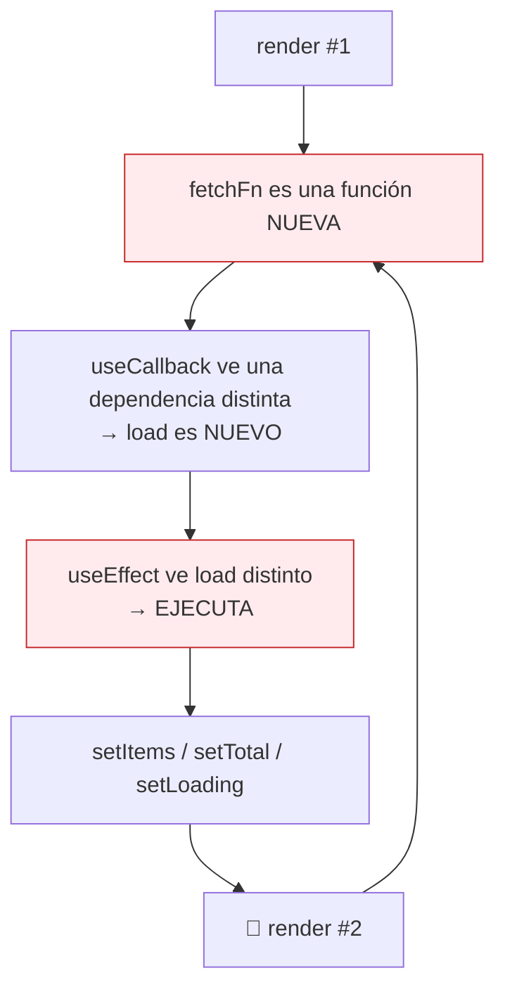
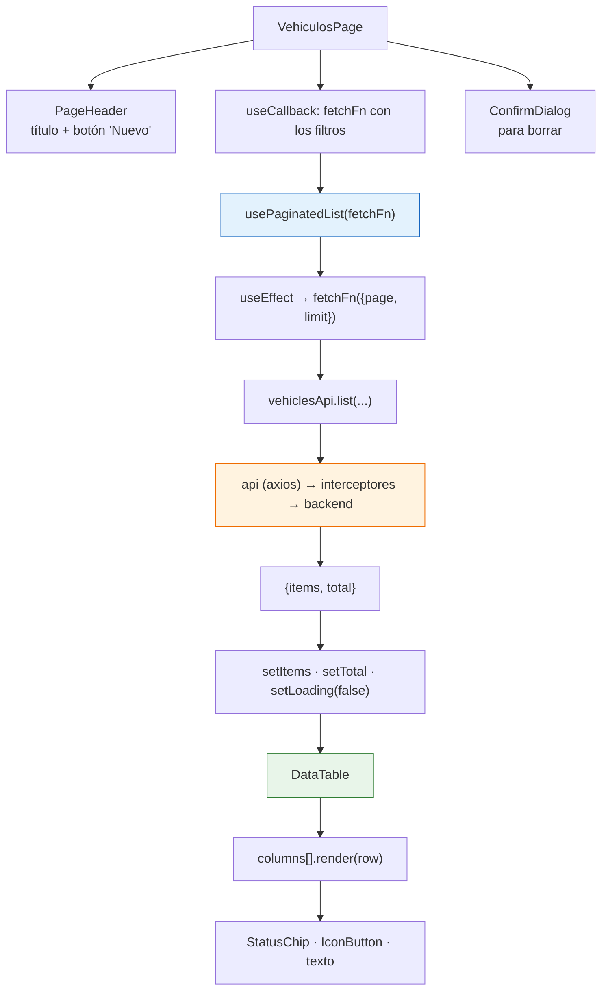
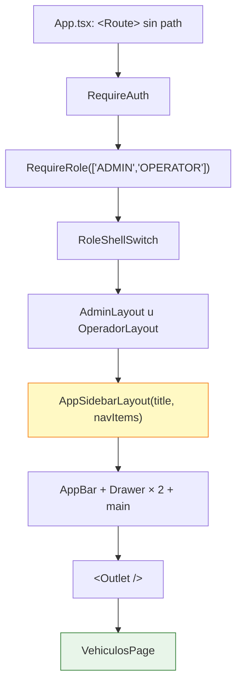

# Capítulo 21 — Componentes reutilizables y layouts

> **Prerrequisitos:** [Capítulo 18](18-frontend-bootstrap.md) (React, JSX, hooks) y [Capítulo 20](20-frontend-auth-estado.md).
> **Archivos que se explican aquí:** los 8 de `src/components/` (514 líneas), los 3 de `src/layouts/` (121), `src/hooks/usePaginatedList.ts` (49) y `src/lib/google-maps.ts` (28). Total: 712 líneas, todas.
> **Al terminar** el lector entenderá qué hace reutilizable a un componente, cómo se comparte lógica con estado mediante hooks personalizados, y por qué el hook de paginación tiene una trampa que puede producir un bucle infinito.

---

## 21.1. Introducción

Esta es la capa que evita que las 29 pantallas del capítulo 22 sean 29 implementaciones de la misma tabla.

**Ocho componentes, tres layouts y un hook**, con una división de responsabilidades clara:

| Categoría | Archivos | Conocen el dominio | Llaman a la API |
|:--|:--|:-:|:-:|
| **Genéricos** | `DataTable`, `ConfirmDialog`, `KpiCard`, `PageHeader` | ❌ No | ❌ No |
| **Semi-específicos** | `StatusChip`, `RouteMap`, `AddressAutocomplete` | ⚠️ Parcial | ❌ No |
| **Estructurales** | `AppSidebarLayout` + los 3 layouts | ⚠️ Solo la sesión | ❌ No |
| **Lógica compartida** | `usePaginatedList` | ❌ No | ⚠️ Recibe la función |

🔴 **Ninguno llama a la API directamente**, y esa restricción es lo que los hace reutilizables (§2.3.4). `DataTable` recibe sus filas por props, y por eso sirve igual para vehículos, viajes, choferes y auditoría.

Los temas del capítulo:

1. **Componentes genéricos con TypeScript**: `DataTable<T>` funciona con cualquier entidad sin perder tipado.
2. **El hook personalizado como unidad de reutilización**: `usePaginatedList` comparte *lógica con estado*, no marcado.
3. **La trampa de `useCallback`**: la línea que puede producir un bucle infinito de peticiones.
4. **Un layout, dos configuraciones**: cómo dos sidebars distintos comparten 157 líneas.
5. **Degradación elegante**: `RouteMap` funciona con y sin clave de Google Maps.

---

## 21.2. Conceptos previos

### 21.2.1. Qué hace reutilizable a un componente

**Un componente es reutilizable cuando no sabe para qué se lo usa.**

```tsx
// 🔴 NO reutilizable: sabe qué son los vehículos y de dónde salen
function TablaVehiculos() {
  const [vehiculos, setVehiculos] = useState<Vehicle[]>([]);
  useEffect(() => { vehiclesApi.list({page:1, limit:10}).then(r => setVehiculos(r.items)); }, []);
  return <table>…<td>{v.licensePlate}</td>…</table>;
}

// ✅ Reutilizable: recibe todo, no sabe nada
function DataTable<T>({ columns, rows, rowKey, … }: DataTableProps<T>) { … }
```

**Las tres restricciones que hacen reutilizable a un componente:**

| Restricción | Por qué |
|:--|:--|
| **No llama a la API** | Ataría el componente a un endpoint concreto |
| **No conoce entidades del dominio** | `Vehicle` en la firma lo limitaría a vehículos |
| **Todo entra por props** | El padre decide qué mostrar y cómo |

💡 **Es exactamente el mismo principio que la inversión de dependencias del backend** (§2.5): depender de una abstracción (`Column<T>[]`) en vez de una implementación (`Vehicle[]`).

### 21.2.2. Componentes genéricos en TypeScript

```tsx
export interface Column<T> {
  key: string;
  label: string;
  align?: 'left' | 'right' | 'center';
  render: (row: T) => ReactNode;
}

export function DataTable<T>({ columns, rows, rowKey, … }: DataTableProps<T>) { … }
```

⚙️ **`<T>` es un parámetro de tipo del componente**, igual que en una función (§1.2.7). TypeScript lo **infiere** desde las props en el punto de uso.

```tsx
// El compilador deduce T = Vehicle a partir de `rows`
<DataTable
  rows={vehiculos}                                  // Vehicle[]
  columns={[
    { key: 'plate', label: 'Patente',
      render: (v) => v.licensePlate },              // ✅ v es Vehicle
    { key: 'x', label: 'X',
      render: (v) => v.noExiste },                  // ❌ error de compilación
  ]}
  rowKey={(v) => v.id}                              // ✅ v es Vehicle
/>
```

🔴 **La inferencia es lo que hace útil el genérico.** Sin él, `render: (row: any) => ReactNode` compilaría cualquier cosa y un error de tipeo en un nombre de campo produciría una celda vacía en producción.

⚠️ **Con una limitación de sintaxis:** en archivos `.tsx`, `<T>` puede confundirse con una etiqueta JSX. **Aquí no ocurre** porque está en la declaración de una función con nombre; en una función flecha haría falta `<T,>` con coma.

### 21.2.3. Hooks personalizados: compartir lógica, no marcado

**Un componente comparte *qué se ve*. Un hook comparte *cómo funciona*.**

**El problema:** las siete pantallas de listado necesitan lo mismo — página actual, límite, elementos, total, cargando, error, y recargar al cambiar cualquier parámetro. **Son ~25 líneas de estado y efectos, idénticas.**

**Un componente no puede compartirlas**, porque cada pantalla renderiza cosas distintas.

**Un hook sí:**

```tsx
const { items, total, page, setPage, limit, setLimit, loading, error, reload } =
  usePaginatedList(fetchFn);
```

🔴 **La regla que lo hace posible: un hook personalizado es una función que empieza con `use` y llama a otros hooks.** Cada componente que lo invoca obtiene **su propia copia independiente del estado** — no hay nada compartido entre instancias.

💡 **Es la diferencia con un store global:** dos pantallas que usen `usePaginatedList` tienen dos paginaciones separadas. Con un store, compartirían una.

---

## 21.3. `DataTable` — la tabla de las siete pantallas

### 21.3.1. El contrato de props

```tsx
16 export interface Column<T> {
17   key: string;
18   label: string;
19   align?: 'left' | 'right' | 'center';
20   render: (row: T) => ReactNode;
21 }
22
23 interface DataTableProps<T> {
24   columns: Column<T>[];
25   rows: T[];
26   rowKey: (row: T) => string | number;
27   loading?: boolean;
28   page: number; // 1-based
29   limit: number;
30   total: number;
31   onPageChange: (page: number) => void;
32   onLimitChange: (limit: number) => void;
33   emptyMessage?: string;
34 }
```

**`render: (row: T) => ReactNode` es la pieza central del diseño.**

🔴 **La columna no declara *qué campo* mostrar, sino *cómo renderizar la fila*.** Eso permite cualquier cosa:

```tsx
{ key: 'status', label: 'Estado', render: (v) => <StatusChip status={v.status} /> }
{ key: 'km',     label: 'Km', align: 'right', render: (v) => v.accumulatedKm.toLocaleString('es-AR') }
{ key: 'acc',    label: '', render: (v) => <IconButton onClick={() => editar(v)}><EditIcon/></IconButton> }
```

💡 **Con un diseño alternativo (`field: keyof T`), la columna solo podría mostrar el valor crudo.** Nada de chips, formato ni botones. **La función es lo que hace la tabla universal.**

**Línea 28 — el comentario que documenta una traducción**

```tsx
page: number; // 1-based
```

🔴 **Y en la línea 93 aparece la razón:**

```tsx
page={page - 1} // MUI is 0-based
onPageChange={(_e, newPage) => onPageChange(newPage + 1)}
```

**El componente expone una API 1-based** (coherente con el backend, §6.3.2) **y traduce a la 0-based de MUI en un solo lugar.**

💡 **Es una capa anticorrupción en miniatura** — cuarta aparición del patrón (§6.4.2, §11.6.1, §15.4.3). **Todo el proyecto habla en base 1; la conversión ocurre en la frontera con la librería.**

⚠️ **Y es exactamente donde se producen los errores de "una unidad de diferencia" (*off-by-one*).** Concentrarlos en dos líneas hace que un bug aquí sea evidente en las siete pantallas a la vez, en vez de sutil en una sola.

**Las props obligatorias vs. opcionales**

| Obligatorias | Opcionales (con valor por defecto) |
|:--|:--|
| `columns`, `rows`, `rowKey`, `page`, `limit`, `total`, `onPageChange`, `onLimitChange` | `loading = false`, `emptyMessage = 'No hay datos…'` |

💡 **`rowKey` obligatoria fuerza al llamador a proveer una clave estable** (§18.2.3). Sin ella habría que usar el índice, con los problemas conocidos.

### 21.3.2. Los tres estados del cuerpo

```tsx
63 {loading ? (
64   <TableRow><TableCell colSpan={columns.length} align="center" sx={{ py: 6 }}>
66     <CircularProgress size={28} />
67   </TableCell></TableRow>
69 ) : rows.length === 0 ? (
70   <TableRow><TableCell colSpan={columns.length} align="center" sx={{ py: 6 }}>
72     <Typography color="text.secondary">{emptyMessage}</Typography>
73   </TableCell></TableRow>
75 ) : (
76   rows.map((row) => ( … ))
85 )}
```

**Un ternario anidado con tres ramas: cargando, vacío, con datos.**

💡 **Distinguir "cargando" de "vacío" es esencial para la experiencia.** Sin la primera rama, el usuario vería *"No hay datos para mostrar"* durante la carga y concluiría que la tabla está vacía — para verla llenarse un instante después.

🔴 **`colSpan={columns.length}` hace que la fila de estado ocupe todo el ancho.** Sin él, el mensaje quedaría comprimido en la primera columna y el resto de la fila vacío.

⚠️ **Los ternarios anidados son legibles con tres ramas y dejan de serlo con cuatro.** Si hiciera falta un estado de error, convendría extraer una función:

```tsx
// — alternativa si crecen los estados —
function renderBody() {
  if (loading) return <FilaEstado colSpan={columns.length}><CircularProgress/></FilaEstado>;
  if (error) return <FilaEstado colSpan={columns.length}><Alert>{error}</Alert></FilaEstado>;
  if (rows.length === 0) return <FilaEstado colSpan={columns.length}>{emptyMessage}</FilaEstado>;
  return rows.map(…);
}
```

🔴 **Y de hecho `DataTable` NO tiene estado de error**, aunque `usePaginatedList` sí lo expone. **Cada pantalla tiene que mostrarlo por su cuenta**, lo que produce siete implementaciones distintas del mismo mensaje.

### 21.3.3. La localización de la paginación

```tsx
rowsPerPageOptions={[10, 25, 50]}
labelRowsPerPage="Filas por página"
labelDisplayedRows={({ from, to, count }) => `${from}–${to} de ${count}`}
```

💡 **MUI viene en inglés por defecto** (*"Rows per page"*, *"1–10 of 42"*). **Estas tres líneas lo traducen para todas las tablas.**

✅ **Y usa el guion medio tipográfico (`–`, U+2013), no el guion normal.** Es el carácter correcto para rangos numéricos — un detalle tipográfico que casi nadie cuida.

🔴 **`rowsPerPageOptions={[10, 25, 50]}` coincide con `paginationSchema.limit.max(100)` del backend** (§6.3.2): ninguna opción lo supera. **Si alguien agregara `100` seguiría funcionando; agregar `200` produciría un 400.**

⚠️ **Y es coordinación implícita entre los dos proyectos.** Nada lo verifica.

⚠️ **La localización es parcial:** solo se traducen estas tres etiquetas. **Los `aria-label` de los botones de navegación siguen en inglés** (*"Go to next page"*), lo que un lector de pantalla anuncia así. MUI ofrece `getItemAriaLabel` para traducirlos.

---

## 21.4. `usePaginatedList` — y su trampa

```tsx
14 /**
15  * Generic paginated-list state used by every listing screen.
16  * `fetchFn` should be memoized (useCallback) by the caller and include any
17  * active filters via closure; changing its identity triggers a reload.
18  */
19 export function usePaginatedList<T>(
20   fetchFn: (params: PageParams) => Promise<PaginatedFetchResult<T>>,
21   initialLimit = 10,
22 ) {
23   const [page, setPage] = useState(1);
24   const [limit, setLimit] = useState(initialLimit);
25   const [items, setItems] = useState<T[]>([]);
26   const [total, setTotal] = useState(0);
27   const [loading, setLoading] = useState(false);
28   const [error, setError] = useState<string | null>(null);
29
30   const load = useCallback(async () => {
31     setLoading(true);
32     setError(null);
33     try {
34       const result = await fetchFn({ page, limit });
35       setItems(result.items);
36       setTotal(result.total);
37     } catch (err) {
38       setError(apiErrorMessage(err));
39     } finally {
40       setLoading(false);
41     }
42   }, [fetchFn, page, limit]);
43
44   useEffect(() => {
45     void load();
46   }, [load]);
47
48   return { items, total, page, setPage, limit, setLimit, loading, error, reload: load };
49 }
```

### 21.4.1. 🔴 La trampa del comentario

> *"`fetchFn` **should be memoized (useCallback) by the caller**"*

**Es una advertencia, y describe un modo de fallo grave.**

**La cadena de dependencias:**

```
load  depende de  [fetchFn, page, limit]
useEffect  depende de  [load]
```

**Si `fetchFn` cambia de identidad en cada render:**



🔴 **Bucle infinito de peticiones.** La pantalla dispara `GET /vehicles` continuamente, a decenas por segundo, hasta que el navegador o el servidor se saturan.

**El uso INCORRECTO, que es el natural:**

```tsx
// — ejemplo ilustrativo del bug —
function VehiculosPage() {
  const [search, setSearch] = useState('');
  const { items } = usePaginatedList((p) =>          // 🔴 función NUEVA en cada render
    vehiclesApi.list({ ...p, search }),
  );
}
```

**El uso CORRECTO:**

```tsx
const fetchFn = useCallback(
  (p: PageParams) => vehiclesApi.list({ ...p, search }),
  [search],                                          // ✅ solo cambia si cambia el filtro
);
const { items } = usePaginatedList(fetchFn);
```

⚠️ **El hook NO puede protegerse de esto.** No hay forma de detectar en tiempo de ejecución si una función fue memorizada. **La única defensa es el comentario y la disciplina.**

💡 **Y el comentario documenta también la parte inteligente del diseño:** *"include any active filters via closure; changing its identity triggers a reload"*.

🔴 **El cambio de identidad de `fetchFn` ES el mecanismo de recarga por filtro.** No hace falta un parámetro `filters` ni un `reload()` manual: cuando `search` cambia, `useCallback` produce una función nueva, `load` cambia, el efecto se dispara. **El filtro se propaga por el cierre.**

**Es elegante y frágil a la vez:** el mismo mecanismo que hace funcionar los filtros es el que produce el bucle si se usa mal.

⚠️ **Una alternativa más robusta** sería recibir los filtros como un objeto y compararlos por valor:

```tsx
// — alternativa propuesta —
usePaginatedList(vehiclesApi.list, { search, status });
// con JSON.stringify(filters) en las dependencias del useCallback interno
```

**Más difícil de usar mal**, a costa de perder flexibilidad y de una comparación por serialización.

### 21.4.2. El resto del hook

**Seis piezas de estado** (líneas 23-28), todas necesarias y ninguna redundante.

**Línea 32 — `setError(null)` al empezar**

💡 **Limpia el error anterior antes de cada carga.** Sin esto, un error viejo seguiría visible mientras la nueva petición está en curso, y el usuario no sabría si es actual.

**Es el mismo patrón que `LoginPage.handleSubmit`** (§20.6.2).

**Línea 45 — `void load()`**

⚙️ **`useEffect` no puede recibir una función `async`** (§18.5.2). Aquí `load` **ya es** async, así que se invoca y se descarta la promesa con `void`.

💡 **Es más limpio que la función autoejecutada de `useBootstrapSession`**, porque `load` está definida fuera.

🔴 **Y aquí NO hay bandera `cancelled`**, a diferencia de `useBootstrapSession`.

**Consecuencia:** si el usuario cambia rápido de página (1 → 2 → 3), se disparan tres peticiones. **Si la respuesta de la página 2 llega DESPUÉS de la de la 3, la tabla muestra la página 2 mientras el paginador dice 3.**

⚠️ **Es una condición de carrera real**, poco probable con una red rápida y muy probable con una lenta. **La corrección es el mismo patrón:**

```tsx
// — corrección propuesta —
useEffect(() => {
  let cancelled = false;
  (async () => {
    setLoading(true);
    try {
      const result = await fetchFn({ page, limit });
      if (!cancelled) { setItems(result.items); setTotal(result.total); }
    } catch (err) {
      if (!cancelled) setError(apiErrorMessage(err));
    } finally {
      if (!cancelled) setLoading(false);
    }
  })();
  return () => { cancelled = true; };
}, [fetchFn, page, limit]);
```

💡 **El proyecto aplicó la protección en `useBootstrapSession` y no aquí** — donde el escenario es **mucho más frecuente** (cambiar de página es una acción cotidiana; recargar la aplicación, no).

**Línea 48 — `reload: load`**

**Expone la función de carga con otro nombre**, para que las pantallas puedan recargar tras crear, editar o borrar:

```tsx
await vehiclesApi.create(input);
await reload();     // vuelve a pedir la página actual
```

⚠️ **Es una recarga completa, no una actualización optimista.** Tras crear un vehículo, la pantalla vuelve a pedir los 10 de la página actual. **Con una librería de estado de servidor se podría invalidar la caché y actualizar solo lo necesario.**

🔴 **Y no hay ninguna coordinación entre pantallas:** crear un vehículo desde `/vehiculos` **no** actualiza el conteo del dashboard. **El usuario ve datos desactualizados hasta recargar esa pantalla.**

**Línea 21 — `initialLimit = 10`**

Coincide con el valor por defecto del backend (§6.3.2). ✅ **Coordinación implícita, otra vez sin verificación.**

---

## 21.5. Los componentes semi-específicos

### 21.5.1. `StatusChip` — el mapa de traducción

```tsx
6  /** Maps domain status codes to a colored chip with a Spanish label (UI). */
7  const STATUS_MAP: Record<string, { label: string; color: ChipColor }> = {
8    AVAILABLE: { label: 'Disponible', color: 'success' },
9    INACTIVE: { label: 'Inactivo', color: 'default' },
10   IN_WORKSHOP: { label: 'En taller', color: 'warning' },
11   ON_TRIP: { label: 'En viaje', color: 'info' },
13   PENDING_ASSIGNMENT: { label: 'Pendiente de asignación', color: 'warning' },
14   IN_PROGRESS: { label: 'En viaje', color: 'info' },
15   COMPLETED: { label: 'Finalizado', color: 'success' },
17   PENDING: { label: 'Pendiente', color: 'warning' },
19   RESOLVED: { label: 'Resuelta', color: 'success' },
21   ACTIVE: { label: 'Activo', color: 'success' },
23   ADMIN: { label: 'Administrador', color: 'primary' },
24   OPERATOR: { label: 'Operador', color: 'info' },
25   DRIVER: { label: 'Chofer', color: 'default' },
26 };
28 export function StatusChip({ status }: { status: string }) {
29   const entry = STATUS_MAP[status] ?? { label: status, color: 'default' as const };
30   return <Chip label={entry.label} color={entry.color} size="small" />;
31 }
```

🔴 **Este componente es donde se resuelve la convención de idiomas de §2.7.2.** El backend habla en inglés; la interfaz, en español. **Aquí ocurre la traducción, en un solo lugar.**

**Línea 29 — el valor de respaldo**

```tsx
const entry = STATUS_MAP[status] ?? { label: status, color: 'default' as const };
```

💡 **Ante un estado desconocido, muestra el código crudo en gris** en vez de romperse o mostrar vacío. **Degradación elegante**: si el backend agrega `CANCELLED`, la interfaz muestra "CANCELLED" —feo pero funcional— hasta que alguien lo traduzca.

🔴 **Y es exactamente el escenario de las funcionalidades faltantes de §12.3 y §13.4.1.** Si se implementara la cancelación de viajes, este componente **no se rompería**.

**Los tres problemas del diseño:**

⚠️ **1. `Record<string, …>` acepta cualquier string.** Un error de tipeo en el mapa (`AVAILABE`) no se detecta: simplemente esa entrada nunca coincide y todos los vehículos disponibles muestran "AVAILABLE" en gris.

**Un tipo unión de los estados conocidos lo atraparía:**

```tsx
// — mejora propuesta —
type KnownStatus = VehicleStatus | TripStatus | MaintenanceStatus | AlertStatus | Role | 'ACTIVE';
const STATUS_MAP: Record<KnownStatus, { label: string; color: ChipColor }> = { … };
// Ahora falta una entrada = error de compilación; una de más = error también
```

🔴 **2. Colisión de claves entre dominios.** `IN_PROGRESS` significa cosas distintas:

| Entidad | Significado real | Etiqueta mostrada |
|:--|:--|:--|
| `Trip` | El viaje está en curso | **"En viaje"** ✅ |
| `Maintenance` | El mantenimiento está en curso | **"En viaje"** 🔴 |

**Un mantenimiento en curso se muestra como "En viaje".** Es un bug real y visible en la pantalla de mantenimiento.

**Y `PENDING` colisiona parcialmente:** significa "programado" en mantenimientos y "sin resolver" en alertas; "Pendiente" funciona para ambos por casualidad.

💡 **La corrección requiere un espacio de nombres:**

```tsx
// — corrección propuesta —
<StatusChip domain="maintenance" status={m.status} />
// con STATUS_MAP = { trip: {...}, maintenance: {...}, vehicle: {...} }
```

⚠️ **3. `ACTIVE` no corresponde a ningún enum del backend.** Es un valor sintético que las pantallas construyen (`isActive ? 'ACTIVE' : 'INACTIVE'`). **Funciona, pero mezcla estados reales con etiquetas inventadas** — y `INACTIVE` sirve simultáneamente para "usuario inactivo" y "vehículo dado de baja", que son cosas distintas.

### 21.5.2. `RouteMap` — degradación elegante

```tsx
5  const MAPS_KEY = import.meta.env.VITE_GOOGLE_MAPS_API_KEY;
…
24 if (!MAPS_KEY) {
25   return (
26     <Stack spacing={1} alignItems="flex-start">
27       <Button variant="outlined" startIcon={<OpenInNewIcon />} href={externalUrl} target="_blank" rel="noopener">
28         Ver recorrido en Google Maps
29       </Button>
30       <Typography variant="caption" color="text.secondary">
32         Configurá VITE_GOOGLE_MAPS_API_KEY para ver el mapa embebido.
33       </Typography>
34     </Stack>
35   );
36 }
```

💡 **Es la materialización de la decisión de §2.10:** las dependencias externas son **opcionales**. Sin clave, la funcionalidad **se degrada** en vez de romperse.

**Los dos modos:**

| Con clave | Sin clave |
|:--|:--|
| Mapa embebido con la ruta trazada | Botón que abre Google Maps en otra pestaña |
| Requiere cuenta y facturación | ✅ **Funciona siempre** |

🔴 **Y el mensaje de la línea 32 le dice al desarrollador exactamente qué configurar.** Es documentación en el lugar donde hace falta.

**Línea 22 — la URL externa**

```tsx
const externalUrl = `https://www.google.com/maps/dir/?api=1&origin=${encodeURIComponent(origin)}&destination=${encodeURIComponent(destination)}`;
```

✅ **`encodeURIComponent` en ambos**, necesario porque el origen fijo contiene comas y espacios (§3.4.9).

**Líneas 42-50 — el iframe**

```tsx
<iframe
  title="Recorrido del viaje"
  width="100%" height={height}
  style={{ border: 0, display: 'block' }}
  loading="lazy"
  referrerPolicy="no-referrer-when-downgrade"
  src={embedUrl}
/>
```

| Atributo | Por qué |
|:--|:--|
| **`title`** | 🔴 **Obligatorio para accesibilidad**: un lector de pantalla lo anuncia. Sin él, dice "marco" |
| `loading="lazy"` | No carga el mapa hasta que está por verse — ahorra peticiones y cuota de Google |
| `referrerPolicy` | Envía el referente solo a HTTPS, no degradando a HTTP |
| `display: 'block'` | Elimina el espacio inferior que los iframes heredan de ser `inline` |

🔴 **`display: 'block'` corrige un problema clásico:** un iframe es `inline` por defecto, así que se alinea con la línea base del texto y deja unos píxeles de espacio abajo — visible como una franja dentro del borde.

⚠️ **La clave de API va en la URL del iframe** (línea 38), así que **es visible en el HTML**. Es inevitable con la Maps Embed API, y ya se señaló en §18.3.2: **la mitigación correcta es restringir la clave por dominio referente en la consola de Google.**

**Nótese que se usa la Embed API (un iframe) y NO el SDK de JavaScript**, aunque `lib/google-maps.ts` exista para cargarlo. **Es la opción de menor costo** y no requiere gestionar el ciclo de vida de un mapa.

### 21.5.3. `lib/google-maps.ts` — el cargador con promesa compartida

```tsx
6  let loadPromise: Promise<void> | null = null;
7
8  export function loadGoogleMaps(apiKey: string): Promise<void> {
9    if (loadPromise) return loadPromise;
10
11   loadPromise = new Promise<void>((resolve, reject) => {
12     if (window.google?.maps?.places) { resolve(); return; }
16     const script = document.createElement('script');
17     script.src = `https://maps.googleapis.com/maps/api/js?key=${encodeURIComponent(apiKey)}&libraries=places&loading=async`;
18     script.async = true;
19     script.defer = true;
20     script.onload = () => resolve();
21     script.onerror = () => {
22       loadPromise = null; // allow a retry on a later mount
23       reject(new Error('No se pudo cargar Google Maps'));
24     };
25     document.head.appendChild(script);
26   });
27   return loadPromise;
28 }
```

🔴 **Es exactamente el mismo patrón de deduplicación que `refreshPromise`** (§19.3.3): una promesa compartida a nivel de módulo para que varios llamadores concurrentes reutilicen una sola operación.

**Sin él**, dos `AddressAutocomplete` montados a la vez agregarían **dos** etiquetas `<script>` de Google Maps, que se cargarían dos veces y podrían pisarse.

**Línea 12 — la comprobación previa**

```tsx
if (window.google?.maps?.places) { resolve(); return; }
```

💡 **Si el SDK ya está cargado** —por ejemplo, tras una recarga en caliente de Vite que preservó el `window`— resuelve inmediatamente sin agregar otro script.

**Línea 22 — la diferencia con `refreshPromise`**

```tsx
script.onerror = () => {
  loadPromise = null; // allow a retry on a later mount
  reject(new Error('No se pudo cargar Google Maps'));
};
```

🔴 **Solo se limpia en el ERROR, no siempre.**

**Contrasta deliberadamente con `refreshPromise`, que usa `.finally`** (§19.3.3):

| | `refreshPromise` | `loadPromise` |
|:--|:--|:--|
| Se limpia | **Siempre** (`.finally`) | **Solo en error** |
| Por qué | Cada renovación necesita una petición nueva | **Cargar el SDK dos veces sería un desperdicio** |

💡 **Ambas decisiones son correctas para su caso**, y la diferencia demuestra que el patrón se aplicó con criterio y no por copia.

⚠️ **`loading=async` en la URL** es el parámetro que Google recomienda desde 2023 para evitar una advertencia de rendimiento en la consola. **Detalle actualizado.**

---

## 21.6. `AppSidebarLayout` — un componente, dos aplicaciones

### 21.6.1. La parametrización

```tsx
25 export interface NavItem {
26   label: string;
27   path: string;
28   icon: ReactNode;
29 }
34 export function AppSidebarLayout({ title, navItems }: { title: string; navItems: NavItem[] }) {
```

🔴 **Dos props convierten un layout en dos.**

`AdminLayout` (29 líneas) y `OperadorLayout` (21) **no tienen ninguna lógica**: solo declaran su lista de ítems y delegan.

```tsx
// AdminLayout.tsx — 10 ítems
export function AdminLayout() {
  return <AppSidebarLayout title="Administración" navItems={navItems} />;
}

// OperadorLayout.tsx — 6 ítems
export function OperadorLayout() {
  return <AppSidebarLayout title="Operación" navItems={navItems} />;
}
```

💡 **157 líneas compartidas, 50 de configuración.** Sin la parametrización habría dos copias de la barra superior, el cajón lateral, el menú móvil, el avatar y el diálogo de cierre de sesión — **y arreglar un bug de responsive requeriría hacerlo dos veces.**

**Y el comentario de `OperadorLayout.tsx:9` documenta la diferencia funcional:**

```tsx
/** Operator sidebar (DOC-5 §5.1) — no Users/Audit/Config/Reports. */
```

✅ **Las cuatro secciones ausentes coinciden exactamente con el grupo de rutas solo-ADMIN de `App.tsx`** (§18.5.4) **y con los permisos del backend** (§7.4.1).

🔴 **Es la tercera declaración del mismo modelo de permisos**, ahora como menú:

| Declaración | Dónde | Formato |
|:--|:--|:--|
| 1 | `*.routes.ts` del backend | `authorize('ADMIN')` |
| 2 | `App.tsx` | Grupos de `<Route>` |
| 3 | `AdminLayout`/`OperadorLayout` | Listas de `NavItem` |

⚠️ **Nada verifica que las tres coincidan.** Si alguien agregara `/reportes` al menú del operador, aparecería la opción, el guard lo redirigiría al dashboard **sin explicación** (§20.4.2), y el usuario pensaría que la aplicación falla.

### 21.6.2. El cajón doble para responsive

```tsx
118 <Drawer variant="temporary" open={mobileOpen} onClose={() => setMobileOpen(false)}
122   ModalProps={{ keepMounted: true }}
123   sx={{ display: { xs: 'block', md: 'none' }, … }}>
128   {drawer}
129 </Drawer>
130 <Drawer variant="permanent" open
133   sx={{ display: { xs: 'none', md: 'block' }, … }}>
138   {drawer}
139 </Drawer>
```

🔴 **DOS cajones con el MISMO contenido, mostrados alternativamente por CSS.**

| Cajón | Variante | Visible en | Comportamiento |
|:--|:--|:--|:--|
| 1 | `temporary` | `xs` (móvil) | Se abre sobre el contenido, con fondo oscuro |
| 2 | `permanent` | `md`+ (escritorio) | Siempre visible, empuja el contenido |

💡 **Es el patrón recomendado por MUI**, y la variable `drawer` (línea 46) evita duplicar el marcado: se define una vez y se usa en ambos.

⚙️ **`display: { xs: 'block', md: 'none' }`** es la sintaxis de puntos de corte de MUI, que se traduce a consultas de medios de CSS. **El cambio es puramente visual**: ambos cajones existen en el DOM.

**Línea 122 — `ModalProps={{ keepMounted: true }}`**

⚙️ **Mantiene el cajón móvil en el DOM aunque esté cerrado.**

| Ventaja | Desventaja |
|:--|:--|
| **Abrir es instantáneo** (no hay que montar nada) | Más nodos en el DOM |
| **Mejor para SEO y accesibilidad** | — |

💡 **MUI lo recomienda explícitamente para móviles**, donde el rendimiento de montaje importa más.

**Línea 143 — `<Toolbar />` vacío**

```tsx
<Box component="main" sx={{ flexGrow: 1, p: 3, … }}>
  <Toolbar />
  <Outlet />
</Box>
```

🔴 **Un `<Toolbar />` sin contenido, cuya única función es OCUPAR ESPACIO.**

**Por qué:** la `AppBar` de la línea 76 tiene `position="fixed"`, así que **sale del flujo del documento** y se superpone al contenido. **El `<Toolbar/>` vacío tiene exactamente la misma altura** y empuja el contenido hacia abajo.

💡 **Es el truco oficial de MUI**, y es superior a un `margin-top` fijo: **la altura de la barra cambia según el punto de corte** (56px en móvil, 64px en escritorio), y el `<Toolbar/>` la sigue automáticamente.

### 21.6.3. La cabecera y sus detalles

```tsx
89  <IconButton color="inherit" edge="start" aria-label="Abrir menú"
93    onClick={() => setMobileOpen(true)} sx={{ display: { md: 'none' } }}>
96    <MenuIcon />
97  </IconButton>
…
101 <IconButton color="inherit" aria-label="Notificaciones">
102   <NotificationsIcon />
103 </IconButton>
104 <Tooltip title={user?.email ?? ''}>
105   <Avatar sx={{ width: 32, height: 32, bgcolor: 'primary.main' }}>
106     {user?.name?.charAt(0).toUpperCase()}
107   </Avatar>
108 </Tooltip>
```

✅ **Los tres `IconButton` tienen `aria-label`** — sin ellos, un lector de pantalla anunciaría solo "botón".

**Línea 106 — la inicial del avatar**

```tsx
{user?.name?.charAt(0).toUpperCase()}
```

**Doble encadenamiento opcional.** Si `user` es `null`, el avatar queda vacío pero no rompe.

⚠️ **`charAt(0)` sobre un nombre con un emoji o un carácter fuera del plano básico** devolvería medio par sustituto y mostraría un rombo. **Es un caso extremo irrelevante para nombres de personas**, pero `[...name][0]` sería correcto.

🔴 **Líneas 101-103: el botón de notificaciones NO HACE NADA.**

```tsx
<IconButton color="inherit" aria-label="Notificaciones">
  <NotificationsIcon />
</IconButton>
```

**Sin `onClick`. Sin contador. Sin menú.**

💡 **Es un elemento decorativo que promete funcionalidad inexistente.** Un usuario que lo vea asumirá que hay notificaciones y hará clic esperando algo.

⚠️ **Y es especialmente llamativo porque el sistema TIENE alertas** (§14) y una pantalla `/alertas`. **Conectarlo sería trivial:** mostrar el conteo de alertas pendientes y navegar a esa pantalla.

**El comentario de `docs/etapa-1-arquitectura.md:216` menciona *"Tiempo real (F-6) — Pendiente de definición"***, así que probablemente sea un marcador de posición para notificaciones en tiempo real. **Pero un botón muerto es peor que ningún botón.**

### 21.6.4. El cierre de sesión con confirmación

```tsx
40 async function handleLogout() {
41   setLogoutOpen(false);
42   await logout();
43   navigate('/login', { replace: true });
44 }
…
147 <ConfirmDialog
148   open={logoutOpen}
149   title="Cerrar sesión"
150   message="¿Seguro que querés cerrar sesión?"
151   confirmLabel="Cerrar sesión"
152   onConfirm={handleLogout}
153   onCancel={() => setLogoutOpen(false)}
154 />
```

💡 **Confirmar el cierre de sesión evita el clic accidental**, especialmente en móvil donde el botón está cerca del borde.

**Línea 41 — cerrar el diálogo ANTES de la operación**

⚠️ **Se cierra inmediatamente, sin esperar a `logout()`.** El usuario ve el diálogo desaparecer al instante.

🔴 **Y `ConfirmDialog` tiene una prop `loading` que NO se usa aquí.** El diseño previsto sería:

```tsx
// — uso previsto de la prop loading —
async function handleLogout() {
  setLoggingOut(true);
  await logout();
  setLogoutOpen(false);
  navigate('/login', { replace: true });
}
// … <ConfirmDialog loading={loggingOut} … />
```

**Con el cierre inmediato, si `logout()` tarda, el usuario no ve ninguna señal de progreso.** Como el `finally` de `useAuth.logout` garantiza que la sesión se cierre igual (§20.5), **el resultado es correcto pero la experiencia es peor de lo que el componente permite.**

**Línea 43 — `navigate('/login', { replace: true })`**

⚠️ **Es redundante:** `logout()` limpia el store, `RequireAuth` detecta `user === null` y redirige por su cuenta (§20.4.1).

**Pero es defensa razonable:** hace explícito el destino en vez de depender de un efecto indirecto, y evita un render intermedio.

🔴 **Y hay una diferencia con la redirección del guard:** el guard agrega `state={{ from: location }}`, así que **tras volver a iniciar sesión el usuario regresaría adonde estaba** — que es lo contrario de lo deseado tras cerrar sesión voluntariamente. **La navegación explícita, sin estado, es la correcta.**

💡 **Es una redundancia que resulta ser una corrección.**

### 21.6.5. `ChoferLayout` — la aplicación móvil

```tsx
30 <Box sx={{ minHeight: '100vh', pb: 8, maxWidth: 480, mx: 'auto' }}>
…
46 <Paper sx={{ position: 'fixed', bottom: 0, left: 0, right: 0, maxWidth: 480, mx: 'auto' }} elevation={3}>
47   <BottomNavigation showLabels>
48     {navItems.map((item) => (
49       <BottomNavigationAction key={item.path} component={NavLink} to={item.path}
52         label={item.label} icon={item.icon}
55         sx={{ '&.active': { color: 'primary.main' } }} />
57     ))}
58   </BottomNavigation>
59 </Paper>
```

🔴 **Estructura completamente distinta: navegación INFERIOR, no lateral.**

💡 **Es la convención de las aplicaciones móviles nativas** (iOS y Android), y responde a DOC-5 §5.3. **El chofer usa el sistema desde el teléfono, en la calle.**

**Línea 30 — `maxWidth: 480, mx: 'auto'`**

**Limita el ancho a 480px y lo centra.** En un escritorio, la interfaz del chofer aparece como una columna angosta centrada — **imitando la proporción de un teléfono.**

⚠️ **Es una decisión discutible.** Un chofer que use la aplicación desde una computadora ve una columna angosta con mucho espacio desperdiciado. **Pero garantiza que el diseño se vea igual en todos lados**, y el caso de uso principal es el teléfono.

**Línea 30 — `pb: 8`**

🔴 **Padding inferior de 64px, para que la barra fija no tape el final del contenido.** Es el equivalente del `<Toolbar/>` vacío de la barra superior (§21.6.2), resuelto con relleno en vez de un elemento.

⚠️ **Y es un número mágico:** `8` × 8px = 64px, que **debe coincidir** con la altura de `BottomNavigation`. Si MUI cambiara esa altura, el contenido quedaría tapado. **La barra superior usa `<Toolbar/>` precisamente para no depender de un número.** **Dos soluciones al mismo problema, una robusta y otra frágil, en el mismo archivo.**

**Línea 46 — el `maxWidth` repetido**

La barra inferior repite `maxWidth: 480, mx: 'auto'` porque es `position: fixed` y **sale del contenedor**. Sin eso, ocuparía todo el ancho de la pantalla mientras el contenido queda centrado en 480px.

⚠️ **El valor 480 está codificado dos veces** en el mismo archivo. Una constante lo evitaría.

**Lo que NO tiene, comparado con `AppSidebarLayout`:**

| Elemento | Sidebar | Chofer |
|:--|:-:|:-:|
| Avatar con inicial | ✅ | ❌ |
| Tooltip con el email | ✅ | ❌ |
| Botón de notificaciones | ✅ (muerto) | ❌ |
| Título contextual | ✅ | ❌ (fijo) |

💡 **La simplificación es correcta para móvil**, donde el espacio horizontal es escaso. **Pero el chofer no ve en ningún lado con qué usuario está conectado** — un dato útil si comparte el dispositivo.

---

## 21.7. Los componentes triviales

**`ConfirmDialog`** (48 líneas), **`KpiCard`** (31) y **`PageHeader`** (18) son directos, pero tienen decisiones que vale la pena señalar.

### 21.7.1. `ConfirmDialog`

```tsx
confirmLabel = 'Confirmar',
confirmColor = 'primary',
loading = false,
```

💡 **`confirmColor` permite `'error'` para acciones destructivas**, con lo que el botón de borrar aparece en rojo. **Un detalle de prevención de errores**: el color comunica la irreversibilidad.

🔴 **`loading` deshabilita AMBOS botones** (líneas 39 y 42), no solo el de confirmar. **Es correcto**: cancelar a mitad de una operación en curso dejaría al usuario sin saber si se ejecutó.

⚠️ **Pero no muestra ningún indicador de progreso**: los botones quedan grises sin explicación. **Un `<CircularProgress size={20}/>` dentro del botón de confirmar sería más claro** — exactamente lo que hace `LoginPage.tsx:115`.

⚠️ **Y `onClose={onCancel}`** hace que pulsar Escape o hacer clic fuera cancele. **Correcto para un diálogo de confirmación**, y potencialmente peligroso si `loading` es `true` — porque `onClose` **no** comprueba `loading`.

### 21.7.2. `KpiCard`

```tsx
<Card sx={{ height: '100%' }}>
```

💡 **`height: '100%'` hace que todas las tarjetas de una fila tengan la misma altura**, aunque sus etiquetas ocupen una o dos líneas. **Sin eso, una cuadrícula de KPIs se ve desalineada.**

**`value: number | string`** — acepta ambos, para poder mostrar `"—"` cuando no hay dato.

⚠️ **No formatea el número.** `1234567` se muestra sin separadores de miles. **Un `toLocaleString('es-AR')` interno lo resolvería para todas las tarjetas a la vez** — hoy cada pantalla debe acordarse.

### 21.7.3. `PageHeader`

**Dieciocho líneas: título a la izquierda, acción opcional a la derecha.**

💡 **`action?: ReactNode`** acepta cualquier cosa: un botón, un grupo de botones, un campo de búsqueda. **La flexibilidad viene de no tipar la acción como "botón".**

⚠️ **`variant="h4"` está codificado**, así que todos los títulos de página tienen el mismo tamaño. **Correcto para la consistencia**, e inflexible si alguna pantalla necesitara otro.

---

## 21.8. Flujo interno: cómo se compone una pantalla de listado



💡 **La pantalla no escribe ni una línea de tabla, paginación, estado de carga ni HTTP.** Solo declara **qué columnas** y **de dónde salen los datos**.

**Y el árbol de layouts que la envuelve:**



🔴 **Al navegar de `/vehiculos` a `/viajes`, SOLO cambia el nodo final.** El layout, el menú y la barra superior **no se desmontan** (§18.5.4).

---

## 21.9. Ejemplos

### Ejemplo 1 — El bucle infinito de `usePaginatedList`

```tsx
// — modificación temporal en VehiculosPage —
const { items } = usePaginatedList((p) => vehiclesApi.list({ ...p }));   // 🔴 sin useCallback
```

**Abrir la pestaña *Network* y cargar la pantalla:**

🔴 **Aparecen decenas de `GET /api/v1/vehicles` por segundo**, sin parar, hasta cerrar la pestaña.

**Con `useCallback`:**

```tsx
const fetchFn = useCallback((p: PageParams) => vehiclesApi.list({ ...p }), []);
const { items } = usePaginatedList(fetchFn);
```

✅ **Una sola petición.**

### Ejemplo 2 — La carrera al cambiar de página rápido

```
1. Limitar la red a "Slow 3G" en las herramientas de desarrollo.
2. En una tabla con varias páginas, hacer clic rápido: 1 → 2 → 3.
3. Observar la tabla y el paginador.
```

🔴 **Si la respuesta de la página 2 llega después de la de la 3, la tabla muestra los datos de la 2 mientras el paginador dice 3.**

**Y no hay forma de detectarlo salvo notando que los datos no corresponden.**

### Ejemplo 3 — La colisión de `IN_PROGRESS`

```
1. Ir a /mantenimiento.
2. Buscar el mantenimiento de EEE555, que está IN_PROGRESS (seed.ts:267).
3. Observar su chip de estado.
```

🔴 **Muestra "En viaje"** — porque `STATUS_MAP.IN_PROGRESS` fue definido para viajes (línea 14) y los mantenimientos comparten el código.

**Debería decir "En curso" o "En taller".**

### Ejemplo 4 — La degradación de `RouteMap`

```bash
# Sin la clave (estado por defecto del .env.example)
```

**En el detalle de un viaje aparece:**

```
[ 🔗 Ver recorrido en Google Maps ]
🗺 Configurá VITE_GOOGLE_MAPS_API_KEY para ver el mapa embebido.
```

**Con la clave configurada**, el mismo lugar muestra el mapa embebido con la ruta trazada.

✅ **La aplicación funciona en ambos casos**, y el mensaje le dice al desarrollador qué hacer.

### Ejemplo 5 — El botón que no hace nada

```
1. Iniciar sesión como administrador u operador.
2. Hacer clic en el icono de campana de la barra superior.
3. No ocurre absolutamente nada.
```

🔴 **Y el sistema tiene 8 alertas pendientes en la base sembrada** (§14.7), con una pantalla dedicada. **El botón podría mostrar el conteo y navegar ahí.**

### Ejemplo 6 — La traducción centralizada

```
1. Abrir /vehiculos y observar los chips: "Disponible", "En taller", "En viaje", "Inactivo".
2. Con la pestaña Network, mirar la respuesta cruda:
   → "status":"AVAILABLE"
```

💡 **El backend habla en inglés y la interfaz en español**, con la traducción ocurriendo en 31 líneas.

**Ahora crear un estado desconocido:**

```sql
-- Simular un estado futuro
UPDATE vehicles SET status = 'AVAILABLE' WHERE id = 1;
-- (no se puede escribir un valor fuera del ENUM, así que se prueba en el componente)
```

```tsx
<StatusChip status="CANCELLED" />   // → chip gris con el texto "CANCELLED"
```

✅ **Degradación elegante:** feo pero funcional, en vez de romperse.

---

## 21.10. Resumen

1. **Un componente es reutilizable cuando no sabe para qué se lo usa:** no llama a la API, no conoce entidades del dominio, y todo entra por props.

2. **`DataTable<T>` es genérico y la inferencia hace el resto:** el compilador deduce `T` desde `rows` y tipa todos los `render`.

3. **`render: (row: T) => ReactNode` es lo que hace universal la tabla.** Una columna no declara un campo: declara cómo renderizar la fila, y por eso puede contener chips, botones o texto formateado.

4. **La conversión 1-based/0-based está en dos líneas**, concentrando la fuente clásica de errores de una unidad.

5. **`usePaginatedList` comparte lógica con estado**, no marcado. Cada pantalla obtiene su propia copia independiente.

6. **El cambio de identidad de `fetchFn` ES el mecanismo de recarga por filtro** — elegante, y la misma propiedad que produce el bucle infinito si no se memoriza.

7. **Dos props convierten `AppSidebarLayout` en dos aplicaciones.** 157 líneas compartidas, 50 de configuración.

8. **`RouteMap` y `lib/google-maps.ts` implementan la decisión de que las dependencias externas sean opcionales**, con degradación elegante y un mensaje que dice qué configurar.

9. **Once hallazgos concretos:**

   | # | Hallazgo | Gravedad |
   |:-:|:--|:--|
   | 1 | 🔴 **`usePaginatedList` produce un BUCLE INFINITO de peticiones** si `fetchFn` no se memoriza. El hook no puede protegerse; la única defensa es un comentario. | **Alta** |
   | 2 | 🔴 **`STATUS_MAP` colisiona entre dominios:** un mantenimiento `IN_PROGRESS` se muestra como **"En viaje"**. Bug visible en la pantalla de mantenimiento. | **Alta** |
   | 3 | 🔴 **`usePaginatedList` no tiene bandera `cancelled`**, a diferencia de `useBootstrapSession`. Cambiar de página rápido puede mostrar los datos de una página con el número de otra. El escenario es **mucho más frecuente** que el que sí se protegió. | **Alta** |
   | 4 | 🔴 **El botón de notificaciones no hace nada.** Promete funcionalidad inexistente, y el sistema tiene alertas y una pantalla dedicada a las que podría enlazar. | Media |
   | 5 | ⚠️ **`DataTable` no tiene estado de error**, aunque `usePaginatedList` lo expone. Cada pantalla lo resuelve por su cuenta, con siete implementaciones distintas. | Media |
   | 6 | ⚠️ **El modelo de permisos está declarado TRES veces** (rutas del backend, grupos de `App.tsx`, listas de `NavItem`) sin nada que verifique la coincidencia. | Media |
   | 7 | ⚠️ **`Record<string, …>` en `STATUS_MAP` no detecta errores de tipeo** ni entradas faltantes. Un tipo unión los convertiría en errores de compilación. | Media |
   | 8 | ⚠️ **`ConfirmDialog.loading` no se usa en el cierre de sesión**, así que no hay señal de progreso si la operación tarda. Y `onClose` no comprueba `loading`. | Baja |
   | 9 | ⚠️ **`ChoferLayout` usa `pb: 8` (número mágico)** para compensar la barra fija, mientras la barra superior usa `<Toolbar/>` — que se adapta solo. Dos soluciones al mismo problema en el mismo archivo. | Baja |
   | 10 | ⚠️ **`KpiCard` no formatea números:** `1234567` se muestra sin separadores. Un `toLocaleString` interno lo resolvería para todas las tarjetas. | Baja |
   | 11 | ⚠️ **La localización de MUI es parcial:** las tres etiquetas visibles están en español, pero los `aria-label` de los botones de paginación siguen en inglés. | Baja |

---

## 21.11. Preguntas de repaso

1. ¿Cuáles son las tres restricciones que hacen reutilizable a un componente? ¿Con qué principio del backend se corresponden?
2. ¿Por qué `Column<T>.render` es una función y no un `field: keyof T`? ¿Qué habilita?
3. ¿Dónde se traduce entre la paginación 1-based del proyecto y la 0-based de MUI? ¿Por qué importa concentrarlo?
4. ¿Por qué `DataTable` distingue "cargando" de "vacío"? ¿Qué vería el usuario sin esa distinción?
5. Explicar la cadena de dependencias que produce el bucle infinito de `usePaginatedList`. ¿Por qué el hook no puede protegerse?
6. ¿Cómo se propagan los filtros a `usePaginatedList` si el hook no recibe ningún parámetro de filtro?
7. ¿Qué carrera puede producirse al cambiar de página rápido? ¿Qué patrón del proyecto la resolvería?
8. ¿Por qué `STATUS_MAP` muestra "En viaje" para un mantenimiento en curso? ¿Cuál es la corrección?
9. ¿Qué hace el valor de respaldo de `StatusChip` y por qué es relevante para las funcionalidades faltantes de los capítulos 12 y 13?
10. Comparar la limpieza de `loadPromise` con la de `refreshPromise`. ¿Por qué son distintas y ambas correctas?
11. ¿Por qué hay DOS `<Drawer>` con el mismo contenido?
12. ¿Qué hace el `<Toolbar />` vacío de la línea 143? ¿Por qué es mejor que un margen fijo?
13. ¿Es redundante el `navigate('/login')` tras `logout()`? ¿Qué corrige?
14. ¿Cuántas veces está declarado el modelo de permisos en el proyecto? ¿Qué pasa si divergen?

<details>
<summary><strong>Respuestas</strong></summary>

1. **No llama a la API** (lo ataría a un endpoint), **no conoce entidades del dominio** (`Vehicle` en la firma lo limitaría a vehículos), y **todo entra por props** (el padre decide). **Se corresponde con la inversión de dependencias** del backend (§2.5): depender de una abstracción (`Column<T>[]`) en vez de una implementación concreta.

2. Porque **una función permite renderizar cualquier cosa**, no solo el valor crudo del campo: un `<StatusChip>`, un número formateado con `toLocaleString`, un botón de acción, o una combinación. **Con `field: keyof T`, la columna solo podría mostrar el valor tal cual**, y las siete pantallas necesitarían tablas distintas para poder incluir chips y botones.

3. En **`DataTable`, líneas 93-94**: `page={page - 1}` al pasar a MUI y `onPageChange(newPage + 1)` al recibir. **Importa concentrarlo** porque es la fuente clásica de errores de una unidad: teniéndolo en dos líneas, un bug se manifiesta en las siete pantallas a la vez (evidente) en vez de sutilmente en una sola (difícil de encontrar).

4. Porque **son estados distintos con significados opuestos**. Sin la distinción, durante la carga el usuario vería *"No hay datos para mostrar"* y **concluiría que la tabla está vacía** — para verla llenarse un instante después. La primera impresión sería falsa.

5. `load` depende de `[fetchFn, page, limit]`; el `useEffect` depende de `[load]`. **Si `fetchFn` cambia de identidad en cada render**, `useCallback` produce un `load` nuevo, el efecto lo ve distinto y se ejecuta, las llamadas a `setItems`/`setTotal` provocan un render, y el ciclo se repite. **El hook no puede protegerse** porque no hay forma en tiempo de ejecución de saber si una función fue memorizada: dos funciones con el mismo cuerpo son objetos distintos.

6. **Por el cierre de `fetchFn`.** El llamador la define con `useCallback((p) => api.list({...p, search}), [search])`: la función **captura `search`** y su identidad cambia solo cuando `search` cambia. **Ese cambio de identidad dispara el efecto y recarga.** No hace falta un parámetro de filtros ni un `reload()` manual.

7. Si el usuario va 1 → 2 → 3 rápidamente, se disparan tres peticiones; **si la respuesta de la 2 llega después de la de la 3, la tabla muestra los datos de la página 2 con el paginador en 3**. **Lo resolvería la bandera `cancelled` con la función de limpieza del `useEffect`** — exactamente el patrón que `useBootstrapSession` sí aplica (§18.5.2), en un escenario **mucho menos frecuente** que este.

8. Porque **`IN_PROGRESS` es una clave compartida**: `STATUS_MAP` es un mapa plano y la entrada se definió pensando en viajes (`{ label: 'En viaje' }`), pero los mantenimientos usan el mismo código de estado. **La corrección requiere un espacio de nombres**: `<StatusChip domain="maintenance" status={...} />` con `STATUS_MAP = { trip: {...}, maintenance: {...} }`.

9. **Ante un estado desconocido muestra el código crudo en un chip gris**, en vez de romperse o quedar vacío. **Es relevante** porque si se implementara la cancelación de viajes (§12.3) o de mantenimientos (§13.4.1) —las funcionalidades faltantes de mayor impacto— **la interfaz no se rompería**: mostraría "CANCELLED" hasta que alguien lo traduzca. Es degradación elegante.

10. **`refreshPromise` se limpia SIEMPRE** (`.finally`), porque cada renovación de token necesita una petición nueva. **`loadPromise` se limpia SOLO en error**, porque cargar el SDK de Google Maps dos veces sería un desperdicio: una vez cargado, la promesa resuelta debe reutilizarse indefinidamente. **Ambas son correctas para su caso**, y la diferencia demuestra que el patrón se aplicó con criterio.

11. Porque **MUI necesita variantes distintas según el tamaño de pantalla**: en móvil, un cajón `temporary` que se abre sobre el contenido con fondo oscuro; en escritorio, uno `permanent` que empuja el contenido. **Se muestran alternativamente por CSS** (`display: { xs: 'block', md: 'none' }` y viceversa), y la variable `drawer` evita duplicar el contenido.

12. **Ocupa el espacio que la `AppBar` fija le quita al flujo del documento.** Como la barra tiene `position="fixed"`, sale del flujo y se superpondría al contenido; el `<Toolbar/>` vacío tiene **exactamente la misma altura** y lo empuja hacia abajo. **Es mejor que un margen fijo** porque la altura de la barra cambia según el punto de corte (56px en móvil, 64px en escritorio) y el `<Toolbar/>` la sigue automáticamente — a diferencia del `pb: 8` de `ChoferLayout`, que es un número mágico.

13. **Es redundante** porque `logout()` limpia el store y `RequireAuth` redirige por su cuenta al detectar `user === null`. **Pero corrige un detalle importante**: la redirección del guard agrega `state={{ from: location }}`, así que tras volver a iniciar sesión el usuario **regresaría a la pantalla donde estaba** — lo contrario de lo deseado tras cerrar sesión voluntariamente. **La navegación explícita, sin estado, evita eso.**

14. **Tres veces:** (1) los `authorize(...)` de los 13 archivos de rutas del backend; (2) los grupos de `<Route>` de `App.tsx`; (3) las listas de `NavItem` de `AdminLayout` y `OperadorLayout`. **Nada verifica que coincidan.** Si el menú del operador incluyera `/reportes`, la opción aparecería, el guard lo redirigiría al dashboard **sin ninguna explicación** (§20.4.2), y el usuario concluiría que la aplicación falla.

</details>

---

## 21.12. Ejercicios propuestos

**Nivel 1 — Observación**

1. Contar en cuántas pantallas se usa `DataTable` y comparar sus definiciones de `columns`.
2. Reproducir el **ejemplo 3** y confirmar el chip incorrecto en la pantalla de mantenimiento.
3. Reproducir el **ejemplo 5**: hacer clic en la campana y confirmar que no ocurre nada.
4. Redimensionar la ventana cruzando el punto de corte `md` y observar el cambio de cajón.

**Nivel 2 — Experimentación**

5. Reproducir el **ejemplo 1** (bucle infinito) y contar las peticiones por segundo.
6. Reproducir el **ejemplo 2** (carrera de páginas) con la red limitada.
7. Quitar el `<Toolbar />` vacío de `AppSidebarLayout` y observar cómo la barra tapa el contenido.
8. Cambiar la altura de `BottomNavigation` con `sx={{ height: 100 }}` y verificar que `pb: 8` deja de alcanzar.
9. Agregar `/reportes` al menú del operador y documentar exactamente lo que ve el usuario al hacer clic.

**Nivel 3 — Corrección**

10. Agregar la bandera `cancelled` a `usePaginatedList` y verificar con el ejercicio 6 que la carrera desaparece.
11. Convertir `STATUS_MAP` en un mapa por dominio y corregir el chip de mantenimiento. Tipar las claves con uniones para que falten entradas sea un error de compilación.
12. Conectar el botón de notificaciones: mostrar el conteo de alertas pendientes con un `Badge` y navegar a `/alertas`.
13. Agregar una prop `error` a `DataTable` y eliminar las implementaciones dispersas en las pantallas.
14. Usar la prop `loading` de `ConfirmDialog` en el cierre de sesión, con un indicador de progreso en el botón.
15. Reemplazar `pb: 8` de `ChoferLayout` por una medición real de la altura de la barra, o extraer una constante compartida.
16. Rediseñar la API de `usePaginatedList` para recibir los filtros como objeto, haciendo imposible el bucle infinito. Comparar ergonomía y robustez con la versión actual.
17. Agregar formato de números a `KpiCard` con `toLocaleString('es-AR')` y verificar en el dashboard.

---

**Anterior:** [Capítulo 20 — Estado y autorización en el cliente](20-frontend-auth-estado.md) · **Siguiente:** Capítulo 22 — Las pantallas *(pendiente)*
