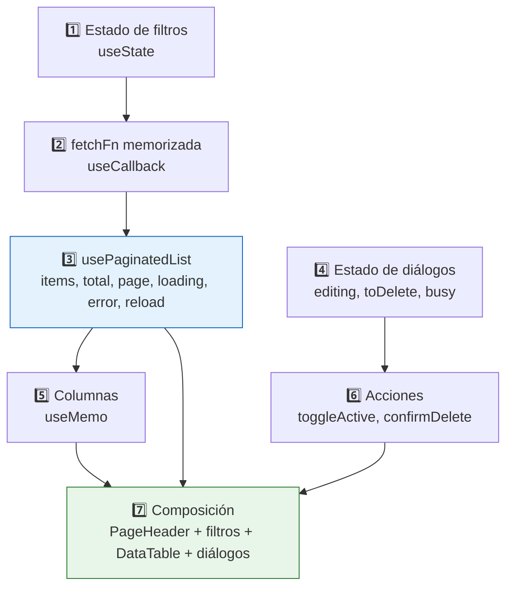
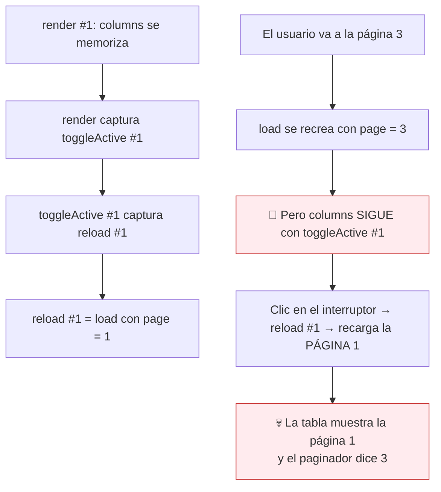
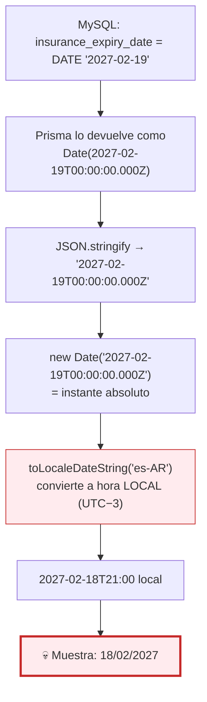
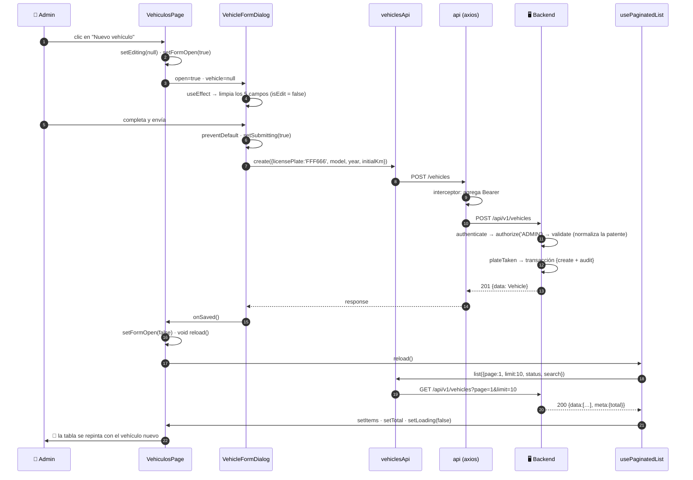

# Capítulo 22A — Las pantallas: el patrón de listado y el ABM

> **Prerrequisitos:** [Capítulo 19](19-frontend-api.md) (la capa API), [Capítulo 20](20-frontend-auth-estado.md) (sesión y guards) y [Capítulo 21](21-frontend-componentes.md) (`DataTable`, `usePaginatedList`, `StatusChip`).
> **Archivos que se explican aquí:** `pages/vehiculos/` (2), `pages/usuarios/` (2), `pages/choferes/` (4). Total: 8 archivos, 1.261 líneas.
> **Nota de método:** el patrón de pantalla de listado se explica **una vez, línea por línea**, usando `VehiculosPage` como caso canónico. Las otras dos pantallas se cubren **solo en lo que las diferencia**. Los diálogos sí se analizan completos, porque ahí vive la lógica específica.
> **Al terminar** el lector podrá leer cualquiera de las siete pantallas de listado del proyecto, y habrá visto el bug de fechas que atraviesa toda la interfaz.

---

## 22A.1. Introducción

Las 29 pantallas son 3.553 líneas, pero **no son 29 diseños distintos**. Siete siguen exactamente el mismo patrón, que este capítulo desarma.

**La anatomía de una pantalla de listado**, en siete piezas:



**Y las tres pantallas de este capítulo comparten las siete piezas**, difiriendo solo en:

| | Vehículos | Usuarios | Choferes |
|:--|:--|:--|:--|
| Filtros | Estado + búsqueda | Rol + búsqueda | Disponibilidad + búsqueda |
| Acciones en fila | Editar, activar/desactivar, eliminar | Idem | **Editar, credenciales, documentación** |
| Diálogos | 1 (formulario) + confirmación | 1 + confirmación | **3** |
| Oculta por rol | ✅ `canManage` | ❌ No hace falta | ✅ `canManage` |

🔴 **Y en las tres aparece el mismo bug de fechas**, que se analiza en §22A.4 y que afecta a **toda** la interfaz.

---

## 22A.2. Conceptos previos

### 22A.2.1. Búsqueda diferida vs. búsqueda instantánea

```tsx
const [search, setSearch] = useState('');           // lo que el usuario escribe
const [appliedSearch, setAppliedSearch] = useState('');  // lo que se envía al servidor
```

🔴 **Dos estados para un solo campo de texto.** Es una decisión deliberada.

| Enfoque | Peticiones al escribir "Mercedes" | Experiencia |
|:--|--:|:--|
| **Instantánea** (`search` en las dependencias) | **8** (una por letra) | Resultados que aparecen mientras se escribe |
| **Con retardo** (*debounce* de 400 ms) | 1-2 | Buena, pero necesita un temporizador |
| **Diferida** (elegida) | **1** — al pulsar Enter o el botón | Explícita, sin sorpresas |

💡 **Con la búsqueda instantánea, cada tecla cambiaría `appliedSearch`, que está en las dependencias de `useCallback`, que cambia `fetchFn`, que dispara el efecto de `usePaginatedList`** (§21.4.1). **Ocho peticiones y ocho renders para escribir una palabra.**

⚠️ **El retardo sería la solución de mejor experiencia**, y requeriría un `useDebounce` que el proyecto no tiene. **La búsqueda diferida es la opción sin dependencias adicionales**, a costa de que el usuario tenga que pulsar Enter.

### 22A.2.2. Ocultar lo que el backend va a rechazar

```tsx
const { user } = useAuth();
// Vehicle mutations are ADMIN-only in the backend; the Operator has read
// access here (shared route), so hide the actions that would 403.
const canManage = user?.role === 'ADMIN';
```

💡 **El comentario declara el principio: no mostrar acciones que producirían un 403.**

**Es la aplicación práctica de §20.2.3:** los guards del frontend no son seguridad, son **experiencia de usuario**. Un operador que ve el botón "Eliminar" y recibe *"Insufficient permissions"* al usarlo concluye que la aplicación está rota.

🔴 **Y es la CUARTA declaración del modelo de permisos** en el proyecto:

| # | Dónde | Formato |
|:-:|:--|:--|
| 1 | `*.routes.ts` del backend | `authorize('ADMIN')` |
| 2 | `App.tsx` | Grupos de `<Route>` |
| 3 | `AdminLayout` / `OperadorLayout` | Listas de `NavItem` |
| **4** | **Cada pantalla** | **`canManage`** |

⚠️ **Nada verifica que las cuatro coincidan.** Y a diferencia de las tres primeras —que son groseras (una sección entera)— esta es **fina**: distingue permisos por acción dentro de una misma pantalla. **Es la más fácil de desincronizar.**

---

## 22A.3. El patrón de listado, línea por línea

Se usa `VehiculosPage.tsx` como caso canónico. **Las otras seis pantallas de listado del proyecto siguen esta misma estructura.**

### 22A.3.1. Pieza 1 — El estado de filtros (líneas 26-32)

```tsx
26 const { user } = useAuth();
29 const canManage = user?.role === 'ADMIN';
30 const [statusFilter, setStatusFilter] = useState<VehicleStatus | ''>('');
31 const [search, setSearch] = useState('');
32 const [appliedSearch, setAppliedSearch] = useState('');
```

**Línea 30 — `VehicleStatus | ''`**

💡 **La cadena vacía representa "sin filtro"**, y no `undefined`. **Es un requisito de MUI:** un `<TextField select>` controlado con `value={undefined}` se convierte en no controlado y React emite una advertencia.

**La conversión ocurre al construir la petición** (línea 38): `statusFilter || undefined`.

⚠️ **`||` y no `??`** — aquí es correcto porque `''` es *falsy* y es exactamente el valor a descartar. **Es uno de los pocos lugares del proyecto donde `||` es la elección adecuada** (§1.2.6).

### 22A.3.2. Pieza 2 — La función de carga memorizada (líneas 34-42)

```tsx
34 const fetchFn = useCallback(
35   (params: PageParams) =>
36     vehiclesApi.list({
37       ...params,
38       status: statusFilter || undefined,
39       search: appliedSearch || undefined,
40     }),
41   [statusFilter, appliedSearch],
42 );
```

🔴 **Esta es la pieza que evita el bucle infinito de §21.4.1.**

**Sin `useCallback`, `fetchFn` sería una función nueva en cada render**, `usePaginatedList` la vería distinta, dispararía el efecto, el efecto provocaría un render, y así indefinidamente — **decenas de peticiones por segundo.**

✅ **Verificado: las nueve pantallas que usan `usePaginatedList` lo hacen correctamente.**

```
mantenimiento/TiposMantenimientoTab · mantenimiento/MaintenanceListTab · viajes/ViajesPage
alertas/AlertasPage · choferes/ChoferesPage · usuarios/UsuariosPage
chofer/MiHistorialPage · vehiculos/VehiculosPage · auditoria/AuditoriaPage
```

💡 **Y las dependencias `[statusFilter, appliedSearch]` son el mecanismo de recarga por filtro:** cuando cualquiera cambia, `fetchFn` cambia de identidad, y `usePaginatedList` recarga automáticamente. **No hace falta llamar a `reload()` al filtrar.**

**Líneas 37-39 — la composición de parámetros**

```tsx
{ ...params, status: …, search: … }
```

**`params` trae `{page, limit}` del hook; la pantalla agrega sus filtros.** La separación es limpia: el hook gestiona la paginación, la pantalla los filtros.

### 22A.3.3. Pieza 3 — El hook (líneas 44-45)

```tsx
const { items, total, page, setPage, limit, setLimit, loading, error, reload } =
  usePaginatedList<Vehicle>(fetchFn);
```

**Nueve valores desestructurados**, todos usados.

⚠️ **`usePaginatedList<Vehicle>` con el genérico explícito**, aunque TypeScript podría inferirlo de `fetchFn`. **Es redundante pero documenta**: quien lee la línea sabe qué contiene `items` sin rastrear el tipo de retorno de `vehiclesApi.list`.

### 22A.3.4. Pieza 4 — El estado de diálogos (líneas 47-51)

```tsx
47 const [formOpen, setFormOpen] = useState(false);
48 const [editing, setEditing] = useState<Vehicle | null>(null);
49 const [toDelete, setToDelete] = useState<Vehicle | null>(null);
50 const [actionError, setActionError] = useState<string | null>(null);
51 const [busy, setBusy] = useState(false);
```

💡 **`editing: Vehicle | null` cumple DOS funciones a la vez:**

| Valor | Significa |
|:--|:--|
| `null` | El diálogo está en modo **creación** |
| Un vehículo | El diálogo está en modo **edición** de ese vehículo |

**Y el diálogo lo interpreta con una línea** (`VehicleFormDialog.tsx:25`):

```tsx
const isEdit = vehicle !== null;
```

🔴 **Nótese la asimetría con `toDelete`:** ese **no** tiene un `deleteOpen` separado, porque `ConfirmDialog` recibe `open={toDelete !== null}` (línea 192). **El propio dato es la bandera.**

⚠️ **`formOpen` sí es una bandera separada**, porque `editing === null` significa "crear", no "cerrado". **Son dos casos distintos que exigen soluciones distintas** — y la inconsistencia aparente es en realidad precisión.

**`busy` vs. `loading`**

| Estado | Qué representa | De dónde viene |
|:--|:--|:--|
| `loading` | La **tabla** está cargando | `usePaginatedList` |
| `busy` | Una **acción** está en curso | Local |

💡 **Separarlos permite que el diálogo de confirmación muestre su propio progreso** sin bloquear la tabla, y viceversa.

⚠️ **Pero `toggleActive` (líneas 53-61) NO usa `busy`.** Un doble clic rápido en el interruptor dispara dos peticiones. **La segunda fallaría con un 422** (`vehicles.activate` no es idempotente, §10.6.4) **y mostraría un error confuso.**

### 22A.3.5. Pieza 5 — Las columnas y 🔴 el cierre obsoleto

```tsx
78 const columns = useMemo<Column<Vehicle>[]>(
79   () => [
80     { key: 'plate', label: 'Patente', render: (v) => v.licensePlate },
…
93     ...(canManage ? [ { key: 'actions', …, render: (v) => ( … onClick={() => toggleActive(v)} … ) } ] : []),
123   ],
124   [canManage],
125 );
```

**Línea 93 — la columna condicional**

```tsx
...(canManage ? [ { … } ] : [])
```

💡 **Propagación condicional de un arreglo** — el mismo idioma que los `buildWhere` del backend (§9.5.1). Si no puede gestionar, la columna **no existe**: el encabezado tampoco aparece, y la tabla no queda con una columna vacía.

#### 🔴 El cierre obsoleto de `toggleActive`

**Las dependencias del `useMemo` son `[canManage]`**, que **nunca cambia** durante la vida de la pantalla (el rol del usuario es fijo).

**Así que el arreglo de columnas se calcula UNA sola vez, en el primer render** — y sus funciones `render` capturan por cierre las variables **de ese render**.

**La cadena del problema:**



**El detalle técnico:** `reload` es el `load` de `usePaginatedList`, que es `useCallback(..., [fetchFn, page, limit])` (§21.4). **Cuando `page` cambia, `load` cambia de identidad** — pero el `useMemo` de columnas ya no se recalcula.

⚠️ **Las demás funciones capturadas NO tienen el problema:** `setEditing`, `setFormOpen` y `setToDelete` son actualizadores de `useState`, que React **garantiza estables** entre renders.

🔴 **`toggleActive` es la única función no estable capturada, y por eso es la única afectada.**

**Las tres correcciones:**

```tsx
// — opción 1: agregar la dependencia (la más simple) —
}, [canManage, toggleActive]);
// …pero toggleActive se recrea en cada render, así que el useMemo dejaría de servir

// — opción 2: memorizar toggleActive —
const toggleActive = useCallback(async (v: Vehicle) => { … }, [reload]);
// … y agregarlo a las dependencias del useMemo

// — opción 3: quitar el useMemo (recomendada) —
const columns: Column<Vehicle>[] = [ … ];   // sin memorizar
```

💡 **La tercera es la correcta aquí.** El `useMemo` **no aporta nada medible**: construir un arreglo de siete objetos en cada render es despreciable, y `DataTable` no está envuelto en `React.memo`, así que **no evita ningún re-render**. **Es una optimización prematura que introdujo un bug.**

⚠️ **Y un linter con la regla `react-hooks/exhaustive-deps` habría avisado** — pero el proyecto **no tiene ESLint configurado** (§5.6). **Es la primera consecuencia concreta de esa ausencia.**

### 22A.3.6. Pieza 6 — Las acciones (líneas 53-76)

```tsx
53 async function toggleActive(v: Vehicle) {
54   setActionError(null);
55   try {
56     await vehiclesApi.setActive(v.id, v.status === 'INACTIVE');
57     await reload();
58   } catch (err) {
59     setActionError(apiErrorMessage(err));
60   }
61 }
```

**Línea 56 — la conversión de estado a booleano**

```tsx
vehiclesApi.setActive(v.id, v.status === 'INACTIVE')
```

💡 **Si está inactivo, activar; si no, desactivar.** El cliente traduce el estado a la acción, y `vehiclesApi.setActive` traduce el booleano al endpoint (§19.4.2).

**Líneas 63-76 — `confirmDelete`, el patrón completo**

```tsx
async function confirmDelete() {
  if (!toDelete) return;
  setBusy(true);
  setActionError(null);
  try {
    await vehiclesApi.remove(toDelete.id);
    setToDelete(null);      // ← cierra el diálogo SOLO si tuvo éxito
    await reload();
  } catch (err) {
    setActionError(apiErrorMessage(err));
  } finally {
    setBusy(false);
  }
}
```

🔴 **`setToDelete(null)` está DENTRO del `try`, después del `await`.**

**Consecuencia: si el borrado falla, el diálogo queda abierto** y el usuario ve el error… **no, no lo ve.** El `<Alert>` de `actionError` se renderiza en la página (línea 143), **detrás del diálogo modal.**

⚠️ **El usuario ve el diálogo de confirmación que no se cierra, sin ninguna explicación.** Tiene que cancelar para descubrir el mensaje de error debajo.

💡 **La corrección sería mostrar el error dentro del diálogo**, que es lo que hacen `VehicleFormDialog` y `DriverCredentialsDialog`. **`ConfirmDialog` no tiene prop para eso** (§21.7.1).

### 22A.3.7. Pieza 7 — La composición (líneas 127-202)

**Líneas 140-144 — el error, con una precedencia discutible**

```tsx
{error ? (
  <Alert severity="error" sx={{ mb: 2 }}>{error}</Alert>
) : actionError ? (
  <Alert severity="error" sx={{ mb: 2 }} onClose={() => setActionError(null)}>{actionError}</Alert>
) : null}
```

⚠️ **Solo se muestra UNO.** Si la carga falla **y** una acción falla, el de la acción queda oculto.

💡 **`onClose` solo en el segundo** es correcto: un error de acción es puntual y se descarta; uno de carga persiste hasta recargar.

🔴 **Y esto es la manifestación del hallazgo de §21.3.2:** `DataTable` no tiene prop de error, así que **cada pantalla lo resuelve por su cuenta**. `ChoferesPage:110` usa una sola línea (`{error && <Alert …>}`), `VehiculosPage` usa el ternario doble. **Dos implementaciones distintas del mismo requisito.**

**Línea 152 — `setPage(1)` al filtrar**

```tsx
onChange={(e) => { setStatusFilter(...); setPage(1); }}
```

🔴 **Esencial.** Si el usuario está en la página 5 y aplica un filtro que deja 2 páginas, sin el reinicio pediría la página 5 de un conjunto de 2 y **la tabla quedaría vacía** — pareciendo que el filtro no encontró nada.

✅ **Se aplica en los tres puntos de cambio de filtro** (líneas 152, 165, 168) **y también al cambiar el tamaño de página** (línea 180).

**Línea 165 — Enter para buscar**

```tsx
onKeyDown={(e) => { if (e.key === 'Enter') { setAppliedSearch(search); setPage(1); } }}
```

💡 **Duplica lo que hace el botón**, y es lo que espera un usuario acostumbrado a buscar con Enter.

⚠️ **El campo de búsqueda NO está dentro de un `<form>`**, así que hace falta el manejador manual. **Envolverlo en un formulario daría el comportamiento gratis** y además accesibilidad de formulario de búsqueda.

**Línea 188 — la recarga tras guardar**

```tsx
onSaved={() => { setFormOpen(false); void reload(); }}
```

**El diálogo no sabe recargar la tabla: avisa y la pantalla decide.** Es la separación correcta.

⚠️ **`void reload()` sin `await`**, así que el diálogo se cierra inmediatamente y la tabla se actualiza cuando llegue. **Correcto para la experiencia**, aunque durante un instante la tabla muestra datos viejos.

---

## 22A.4. 🔴 El bug de fechas que atraviesa la interfaz

**Línea 90 de `VehiculosPage`:**

```tsx
render: (v) =>
  v.insuranceExpiryDate
    ? new Date(v.insuranceExpiryDate).toLocaleDateString('es-AR')
    : '—',
```

🔴 **Esto muestra el vencimiento del seguro UN DÍA ANTES del real**, y es la confirmación del problema predicho en §19.4.4.

### 22A.4.1. La cadena completa del error



**El error son exactamente las 3 horas del desplazamiento horario**, que al restarse de medianoche cruzan al día anterior.

### 22A.4.2. Dónde ocurre

**Las cinco apariciones sobre columnas `DATE`, que son las afectadas:**

| Archivo | Línea | Qué muestra mal |
|:--|:-:|:--|
| `VehiculosPage` | 90 | **Vencimiento del seguro** |
| `ChoferesPage` | 53 | **Vencimiento de la licencia** |
| `DriverDocumentsDialog` | 168 | **Vencimiento de cada documento** |
| `MiDocumentacionPage` | 72 | Ídem, en la app del chofer |
| `MaintenanceListTab` | 42 | Fecha programada *(es `DATETIME`, ver abajo)* |

🔴 **Las cuatro primeras son exactamente los datos sobre los que el sistema genera alertas.** Un administrador ve *"Vence: 18/02/2027"* mientras el motor de alertas calcula sobre el 19 — **y ambos tienen razón desde su punto de vista.**

⚠️ **Las columnas `DATETIME`** (`departureAt`, `occurredAt`, `raisedAt`, `scheduledAt`) **NO tienen este problema**: son instantes reales, y convertirlos a hora local es exactamente lo correcto. **`new Date(t.departureAt).toLocaleString('es-AR')` está bien.**

💡 **La distinción es la misma que el backend documenta en `shared/utils/dates.ts`** (§6.6): las columnas `DATE` son **días calendario** disfrazados de instante; las `DATETIME` son instantes de verdad.

### 22A.4.3. 🔴 El contraste que lo hace evidente

**El MISMO dato se muestra correctamente en el formulario de edición** (`VehicleFormDialog.tsx:40`):

```tsx
setInsuranceExpiryDate(vehicle?.insuranceExpiryDate?.slice(0, 10) ?? '');
```

**`.slice(0, 10)` toma los primeros diez caracteres del string ISO:** `"2027-02-19T00:00:00.000Z"` → `"2027-02-19"`. ✅ **Correcto.**

**Y es correcto precisamente porque NO convierte a hora local:** trabaja sobre el texto, que ya está en UTC.

| Lugar | Método | Resultado |
|:--|:--|:--|
| **Tabla** | `new Date(x).toLocaleDateString('es-AR')` | 🔴 **18/02/2027** |
| **Formulario** | `x.slice(0, 10)` | ✅ **2027-02-19** |

🔴 **El usuario abre la tabla, ve "18/02/2027", hace clic en editar, y el formulario dice "19/02/2027".** Sin tocar nada, dos fechas distintas para el mismo campo.

⚠️ **Y es un caso donde la solución "sucia" es la correcta.** El capítulo 19 (§19.5.2) explicó que **cortar el string ISO es un BUG para `datetime-local`**, porque mezcla dígitos UTC con interpretación local. **Para `<input type="date">` sobre una columna `DATE`, es exactamente lo correcto** — porque no hay hora que interpretar.

💡 **Las dos reglas, que conviene fijar:**

| Tipo de columna | Para MOSTRAR | Para un INPUT |
|:--|:--|:--|
| **`DATE`** (vencimientos) | `x.slice(0,10)` reformateado, o `dayjs.utc(x)` | `x.slice(0, 10)` con `type="date"` ✅ |
| **`DATETIME`** (instantes) | `new Date(x).toLocaleString('es-AR')` ✅ | `isoToLocalInput(x)` con `type="datetime-local"` ✅ |

**La corrección de las cuatro apariciones:**

```tsx
// — corrección propuesta —
function formatDateOnly(iso: string): string {
  const [y, m, d] = iso.slice(0, 10).split('-');
  return `${d}/${m}/${y}`;
}
// render: (v) => v.insuranceExpiryDate ? formatDateOnly(v.insuranceExpiryDate) : '—'
```

**Cinco líneas en `utils/datetime.ts`, junto a las dos funciones que ya resuelven el caso `DATETIME`.**

---

## 22A.5. Lo específico de cada pantalla

### 22A.5.1. `UsuariosPage` — el filtro que nunca muestra choferes

```tsx
33 const fetchFn = useCallback(
34   (params: PageParams) =>
35     usersApi.list({
36       ...params,
37       // Empty filter → all administrative roles (never drivers).
38       role: roleFilter || ADMINISTRATIVE_ROLES,
39       search: appliedSearch || undefined,
40     }),
41   [roleFilter, appliedSearch],
42 );
```

🔴 **La diferencia con las otras pantallas: "sin filtro" NO significa "todos".**

**Significa `ADMINISTRATIVE_ROLES`** — es decir, `['ADMIN', 'OPERATOR']`. **Los choferes nunca aparecen en esta pantalla**, ni siquiera sin filtro.

💡 **Es coherente con toda la decisión de §9.4.1:** los choferes se crean, editan y consultan desde `/choferes`, porque necesitan DNI y licencia. **Mostrarlos aquí ofrecería un botón "Editar" que no podría editar su perfil de chofer.**

⚠️ **Y aprovecha que el backend acepta una lista de roles** (`listUsersQuerySchema.role`, §9.4.3), que se transforma en un `IN` de SQL. **Es la única pantalla que usa esa capacidad.**

**Lo que NO tiene: `canManage`**

`UsuariosPage` **no importa `useAuth`.** Todas las acciones se muestran siempre.

✅ **Es correcto**, porque el módulo entero es solo para administradores (`users.routes.ts:16`, §9.3) y la ruta `/usuarios` está en el grupo solo-ADMIN de `App.tsx` (§18.5.4). **Quien llega a esta pantalla ya es administrador.**

#### 🔴 Las tres acciones que el backend rechaza sobre uno mismo

**El backend bloquea explícitamente** (§9.6.4, §9.6.5, §9.6.6):

| Acción sobre uno mismo | Respuesta del backend |
|:--|:--|
| Cambiar el propio rol | 422 *"You cannot change your own role"* |
| Desactivarse | 422 *"You cannot activate or deactivate your own account"* |
| Borrarse | 422 *"You cannot delete your own account"* |

🔴 **La pantalla muestra los tres botones para la propia fila del administrador conectado.**

**Y como `UsuariosPage` ni siquiera importa `useAuth`, no tiene forma de saber cuál fila es la suya.**

**El resultado:** el administrador se ve a sí mismo en la lista, hace clic en "Desactivar", confirma, y recibe *"You cannot activate or deactivate your own account"* **en inglés** (§20.6.2).

💡 **La corrección es una condición:**

```tsx
// — corrección propuesta —
const { user } = useAuth();
const isSelf = (u: User) => u.id === user?.id;
// … y en render: {!isSelf(u) && <Tooltip title="Desactivar">…</Tooltip>}
```

⚠️ **O mejor, deshabilitar con explicación** en vez de ocultar, para que el administrador entienda por qué no puede:

```tsx
<Tooltip title={isSelf(u) ? 'No podés desactivar tu propia cuenta' : 'Desactivar'}>
  <span><IconButton disabled={isSelf(u)} …/></span>
</Tooltip>
```

🔴 **Es la desincronización de la cuarta declaración de permisos** anunciada en §22A.2.2, materializada.

### 22A.5.2. `VehiculosPage` — la regla que se oculta a medias

```tsx
106 {v.status !== 'ON_TRIP' && (
107   <Tooltip title={v.status === 'INACTIVE' ? 'Activar' : 'Desactivar'}>
108     <IconButton size="small" onClick={() => toggleActive(v)}>
```

✅ **Oculta el interruptor cuando el vehículo está `ON_TRIP`**, coherente con la regla del backend (`vehicles.service.ts:170`, §10.6.4).

🔴 **Pero el backend bloquea DOS estados, no uno:**

```ts
if (existing.status === 'ON_TRIP')     throw new BusinessRuleError('A vehicle on an active trip cannot be deactivated');
if (existing.status === 'IN_WORKSHOP') throw new BusinessRuleError('A vehicle undergoing maintenance cannot be deactivated');
```

⚠️ **La pantalla solo oculta el primero.** Un vehículo `IN_WORKSHOP` **muestra el botón "Desactivar"**, y al usarlo devuelve **422**.

**La corrección es agregar un estado a la condición:**

```tsx
// — corrección propuesta —
{v.status !== 'ON_TRIP' && v.status !== 'IN_WORKSHOP' && ( … )}
```

💡 **Y el botón "Eliminar" tiene el mismo problema, ampliado:** `vehicles.softDelete` rechaza si el vehículo está `ON_TRIP` **o si tiene un mantenimiento abierto** (§10.6.6) — condición que el frontend **no puede evaluar** porque el listado no trae esa información.

**Ahí ocultar es imposible**, y lo correcto es lo que ya hace: intentar y mostrar el error. ⚠️ **Aunque el error quede tapado por el diálogo** (§22A.3.6).

### 22A.5.3. `ChoferesPage` — tres diálogos y un chip con doble señal

```tsx
47 {
48   key: 'expiry',
49   label: 'Vencimiento',
50   render: (d) => (
51     <Chip
52       size="small"
53       label={new Date(d.licenseExpiryDate).toLocaleDateString('es-AR')}
54       color={d.licenseValid ? 'default' : 'error'}
55       variant={d.licenseValid ? 'outlined' : 'filled'}
56     />
57   ),
58 },
```

💡 **El chip codifica dos informaciones en una celda:** la fecha (texto) y la validez (color y relleno). **Una licencia vencida aparece en rojo sólido; una vigente, en contorno neutro.**

🔴 **Y `licenseValid` viene calculado del backend** (`drivers.service.ts:54`, §11.6.1), **no se recalcula en el cliente.**

✅ **Es la decisión correcta**, y evita exactamente el bug de §22A.4: **el color es correcto aunque la fecha se muestre mal.** El servidor comparó con `utcStartOfToday()` (§6.6) y acertó.

⚠️ **Con un efecto desconcertante posible:** el día del vencimiento, la fecha muestra el día anterior y el chip está en gris (válido). **Un usuario podría leer "venció ayer y está marcado como válido".**

**Línea 62 — el otro chip derivado**

```tsx
render: (d) => <Chip size="small" label={d.available ? 'Sí' : 'No'} color={d.available ? 'success' : 'default'} />
```

🔴 **Y aquí se manifiesta el hallazgo de §11.6.1:** `available` **no considera la documentación**. Un chofer con el ART vencido figura **"Disponible: Sí"** y falla al asignarlo con *"Driver has expired documentation"*.

💡 **La pantalla muestra fielmente lo que el backend calcula.** El problema no está aquí: está en que el criterio de `available` diverge del de `trips.assign` (§12.6.5).

**Las tres acciones — un diseño distinto al de las otras pantallas**

| Acción | Icono | Abre |
|:--|:--|:--|
| Editar | ✏️ | `DriverFormDialog` |
| Credenciales | 🔑 | `DriverCredentialsDialog` |
| Documentación | 📄 | `DriverDocumentsDialog` |

🔴 **NO hay "Eliminar"**, y es coherente: **no existe `DELETE /drivers`** (§11.3). La baja va por el módulo de usuarios.

⚠️ **Con la consecuencia de §11.3:** un administrador que quiera dar de baja a un chofer tiene que ir a `/usuarios`… **donde el chofer no aparece**, porque el filtro es `ADMINISTRATIVE_ROLES` (§22A.5.1).

🔴 **Es un callejón sin salida real: NO HAY FORMA de dar de baja a un chofer desde la interfaz.**

**Ni el listado de choferes tiene la acción, ni el de usuarios los muestra.** El endpoint existe (`DELETE /api/v1/users/:id`) y es alcanzable con `curl`, pero **ninguna pantalla lo expone para un chofer.**

💡 **Es el hallazgo funcional más importante de este capítulo**, y solo se ve cruzando dos pantallas con el capítulo 11.

---

## 22A.6. Los diálogos

### 22A.6.1. El patrón de formulario

**`VehicleFormDialog`, `UserFormDialog` y `DriverFormDialog` comparten estructura**, ejemplificada por el primero:

```tsx
34 useEffect(() => {
35   if (open) {
36     setLicensePlate(vehicle?.licensePlate ?? '');
40     setInsuranceExpiryDate(vehicle?.insuranceExpiryDate?.slice(0, 10) ?? '');
41     setError(null);
42   }
43 }, [open, vehicle]);
```

🔴 **El efecto que rellena el formulario al abrir es la pieza clave, y el `if (open)` es lo que lo hace correcto.**

**Sin él, el efecto se ejecutaría también al cerrar** (cuando `open` pasa a `false`), reiniciando los campos **mientras el diálogo se desvanece** — produciendo un parpadeo visible del contenido.

💡 **Y `[open, vehicle]` cubre los dos disparadores:** abrir el diálogo, y cambiar de vehículo con el diálogo abierto (que no ocurre en esta pantalla, pero es correcto por si acaso).

⚠️ **El componente NO se desmonta al cerrar:** MUI mantiene el `<Dialog>` montado con `open={false}`. **Por eso hace falta reiniciar explícitamente** — un componente que se desmontara perdería su estado solo.

**El envoltorio `<form onSubmit>`**

```tsx
<form onSubmit={handleSubmit}>
  <DialogTitle>…</DialogTitle>
  <DialogContent>…</DialogContent>
  <DialogActions>
    <Button type="submit" …>
```

💡 **Envolver el diálogo entero en un `<form>` da tres cosas gratis:** enviar con Enter, la validación nativa de `required`, y el rol de formulario para lectores de pantalla.

✅ **Es lo que `VehiculosPage` **no** hace con su campo de búsqueda** (§22A.3.7), y por eso ahí hace falta el manejador de Enter manual.

**La normalización espejo del backend**

```tsx
onChange={(e) => setLicensePlate(e.target.value.toUpperCase())}
```

💡 **Convierte a mayúsculas mientras se escribe**, replicando el `.transform(v => v.toUpperCase().trim())` de `licensePlateSchema` (§10.4).

🔴 **No es redundante: es retroalimentación.** El usuario **ve** que la patente se normaliza, en vez de escribir en minúsculas y descubrir después que se guardó distinto.

⚠️ **Pero no aplica `.trim()`**, así que un espacio final llega al backend y **ahí sí** se recorta. **Normalización parcial.**

**`inputProps={{ maxLength: 10 }}`** coincide con el `.max(10)` del esquema. ✅ **Coordinación implícita**, verificada.

**La actualización parcial de la contraseña**

```tsx
// UserFormDialog:54
...(password ? { password } : {}),
```

💡 **En edición, si el campo está vacío no se envía** — así que la contraseña no cambia. **Y el `required={!isEdit}` de la línea 88** hace que sea obligatoria solo al crear.

✅ **Coherente con `updateUserSchema`, donde `password` es opcional** (§9.4.2).

⚠️ **`DriverFormDialog` va más allá y OCULTA el campo en edición** (`{!isEdit && <TextField label="Contraseña" …/>}`).

🔴 **Es la decisión correcta**, porque los choferes tienen su propio diálogo de credenciales (§22A.6.2) — **y evita el camino duplicado de cambio de contraseña señalado en §11.3.** El frontend cierra por diseño un hueco que el backend deja abierto.

### 22A.6.2. `DriverCredentialsDialog` — el diálogo más sensible

```tsx
26 /**
27  * Admin-only credentials management (A-9): view the current password
28  * (decrypted, leaves an audit trail) and set a new one. Both are separate,
29  * deliberate actions.
30  */
```

💡 **"Both are separate, deliberate actions"** — el diseño obliga a dos clics distintos para dos operaciones distintas. **Ver no implica cambiar, y cambiar no requiere ver.**

**Líneas 86-99 — revelar bajo demanda**

```tsx
{currentPassword === null ? (
  <Button variant="outlined" startIcon={<Visibility />} onClick={handleReveal} disabled={busy}>
    Ver contraseña
  </Button>
) : (
  <TextField value={currentPassword} fullWidth InputProps={{ readOnly: true, … }} />
)}
```

🔴 **La contraseña NO se pide al abrir el diálogo: hace falta un clic explícito.**

💡 **Es la decisión correcta, y tiene consecuencias en la auditoría.** `GET /drivers/:id/password` registra `VIEW_CREDENTIALS` (§11.6.4). **Si se pidiera al abrir, el registro se generaría cada vez que alguien consulta el diálogo — aunque solo quisiera cambiar la contraseña.**

**Con el clic explícito, la entrada de auditoría significa lo que dice: alguien miró la contraseña.**

⚠️ **Y el estado inicial `currentPassword === null` se reinicia al abrir** (línea 40), así que cerrar y reabrir exige revelar de nuevo — **y genera una entrada de auditoría nueva**. ✅ Correcto.

🔴 **Lo que sigue siendo problemático, y ya se anticipó en §11.6.4:**

| Riesgo | Detalle |
|:--|:--|
| **Queda visible en pantalla** | Sin ocultarse tras N segundos, sin desenfoque |
| **Es copiable y capturable** | Una captura de pantalla la preserva |
| **Sin confirmación previa** | Un clic la revela; una confirmación haría la acción más consciente |
| **El icono del adorno está inhabilitado** | `<IconButton disabled><Visibility/></IconButton>` sugiere que se puede ocultar, y no hace nada |

⚠️ **El último es un detalle de interfaz que confunde:** hay un botón de ojo que parece alternar la visibilidad **y está inhabilitado**. **O se implementa el ocultar, o se quita el icono.**

**Líneas 60-74 — el cambio con retroalimentación honesta**

```tsx
await driversApi.changePassword(driver.id, newPassword);
setNewPassword('');
setSuccess('Contraseña actualizada. Las sesiones del chofer fueron cerradas.');
```

💡 **El mensaje informa un EFECTO SECUNDARIO que el usuario no pidió pero necesita saber.**

✅ **Y es verdad:** `drivers.service.changePassword` llama a `revokeAllForUser` (§11.6.5). **El chofer va a tener que volver a entrar.**

🔴 **Es exactamente el tipo de mensaje que evita una llamada a soporte** — el administrador cambia la contraseña, el chofer llama diciendo "me sacó del sistema", y el administrador ya sabe por qué.

⚠️ **Aunque con una imprecisión:** la revocación ocurre **fuera de la transacción** (§11.6.5), así que si falla, el mensaje mentiría. **Es improbable y el mensaje no lo contempla.**

**Línea 114 — la validación espejo**

```tsx
disabled={busy || newPassword.length < 8}
```

💡 **Replica el `.min(8)` del backend** (§11.4), deshabilitando el botón en vez de dejar enviar y fallar.

⚠️ **Pero solo replica UNA de las tres reglas.** El backend exige además **una letra y un número** (`passwordSchema`, §9.4.2). **Una contraseña de `12345678` habilita el botón y falla con un 400 en inglés.**

**El `helperText` sí menciona las tres** (*"Mínimo 8 caracteres, con letras y números"*), **pero la validación no.**

### 22A.6.3. `DriverDocumentsDialog` — subida de archivos

**Línea 76 — la bandera implícita**

```tsx
<Dialog open={driver !== null} onClose={onClose} maxWidth="sm" fullWidth>
```

⚠️ **Este diálogo NO recibe una prop `open`**, a diferencia de los otros tres. **Usa el propio dato como bandera**, igual que `ConfirmDialog` con `toDelete` (§22A.3.4).

**Es coherente internamente** (el diálogo solo tiene sentido con un chofer) **pero inconsistente con `DriverFormDialog` y `DriverCredentialsDialog`**, que sí reciben `open`. **Tres diálogos hermanos, dos convenciones.**

**Líneas 38-44 — la carga al abrir**

```tsx
useEffect(() => {
  if (driver) {
    setDocType('DNI');
    setExpiryDate('');
    void load(driver.id);
  }
}, [driver]);
```

💡 **Los documentos NO vienen con el listado de choferes:** se piden al abrir el diálogo, con `GET /drivers/:id/documents`.

✅ **Es la decisión correcta.** Traerlos en el listado sería N+1 desde el punto de vista de la interfaz: 10 choferes = 10 listas de documentos que probablemente nadie mire.

⚠️ **Y no hay bandera `cancelled`** (§21.4.2): abrir el diálogo de un chofer, cerrarlo y abrir el de otro rápidamente **podría mostrar los documentos del primero**.

**Líneas 91-103 — el input de archivo oculto**

```tsx
<Button variant="outlined" onClick={() => fileInput.current?.click()} disabled={uploading}>
  Elegir archivo
</Button>
<input ref={fileInput} type="file" hidden accept="application/pdf,image/jpeg,image/png"
  onChange={(e) => { const file = e.target.files?.[0]; if (file) void handleUpload(file); }} />
```

🔴 **Es el patrón estándar para estilizar un selector de archivos.**

⚙️ **`<input type="file">` no se puede estilizar** de forma consistente entre navegadores. **La solución universal: ocultarlo y disparar su `click()` desde un botón propio** — que sí acepta estilos.

💡 **Y `fileInput.current?.click()` funciona porque el clic del usuario sobre el botón mantiene la activación transitoria** — el mismo mecanismo que `openBlobInNewTab` aprovecha (§19.5.1), aquí sin `await` de por medio.

**`accept="application/pdf,image/jpeg,image/png"`** replica la lista del backend (§5.4).

⚠️ **`accept` es solo una SUGERENCIA para el selector de archivos**, no una restricción. El usuario puede elegir "Todos los archivos" y subir un `.exe`. **La validación real la hace multer** (§7.8.3) — **y también es solo una comprobación del MIME declarado, no del contenido.**

**Línea 60 — el reinicio del input**

```tsx
finally {
  setUploading(false);
  if (fileInput.current) fileInput.current.value = '';
}
```

🔴 **Sin esta línea, subir el MISMO archivo dos veces seguidas no funcionaría.**

⚙️ **El evento `change` de un `<input type="file">` solo se dispara si el valor CAMBIA.** Seleccionar el mismo archivo deja el valor igual y **no emite el evento** — así que el segundo intento (por ejemplo, tras corregir la fecha de vencimiento) **no haría nada**, sin ningún error.

💡 **Vaciar el valor en el `finally` garantiza que el próximo `change` siempre se dispare.** Es un detalle de plataforma que rara vez se conoce hasta que se sufre.

**Líneas 46-50 — la validación previa**

```tsx
if (!driver || !expiryDate) {
  setError('Seleccioná el tipo y el vencimiento antes de subir el archivo');
  return;
}
```

💡 **Valida ANTES de subir**, evitando transferir un archivo que el backend rechazaría por falta de `expiryDate`.

⚠️ **Y el mensaje menciona "el tipo"**, pero `docType` **siempre tiene valor** (empieza en `'DNI'`, línea 40). **La condición solo comprueba `expiryDate`**, así que el mensaje pide algo que ya está.

🔴 **Lo que NO valida: el tamaño.**

**El backend limita a 1 MB** (§5.4) y responde **413**. **El navegador puede comprobarlo antes de transferir:**

```tsx
// — mejora propuesta —
if (file.size > 1024 * 1024) {
  setError(`El archivo pesa ${(file.size / 1024 / 1024).toFixed(1)} MB. El máximo es 1 MB.`);
  return;
}
```

⚠️ **Sin esa comprobación, subir un PDF de 8 MB con una conexión lenta significa esperar la transferencia completa para recibir un error** — y el mensaje del backend está **en inglés** (*"File exceeds the maximum size of 1024 KB"*, §7.6.4).

**El texto de ayuda menciona la regla de negocio**

```tsx
Formatos: PDF, JPG, PNG (máx. 1 MB). Un documento activo por tipo.
```

✅ **La segunda frase documenta la regla de `activeTypeExists`** (§11.7.4) **en el lugar donde el usuario la necesita.** Sin ella, el 409 *"already has an active ART document"* sería desconcertante.

---

## 22A.7. Flujo interno: crear un vehículo, de extremo a extremo



⚠️ **Nótese el paso 20: `reload()` pide la PÁGINA ACTUAL con los FILTROS ACTUALES.** Si el administrador estaba en la página 3 filtrando por "en taller", el vehículo recién creado —que nace `AVAILABLE` y va al final— **no aparece en ningún lado.**

**El diálogo se cierra, no hay error, y el usuario no ve su vehículo.** Un mensaje de confirmación lo resolvería.

---

## 22A.8. Ejemplos

### Ejemplo 1 — El bug de fechas, con el contraste

```bash
# El vehículo BBB222 tiene el seguro venciendo en 7 días (seed.ts:165)
curl .../vehicles/2 -H "Authorization: Bearer $ADMIN" | grep insurance
# → "insuranceExpiryDate":"2026-08-11T00:00:00.000Z"
```

**En la interfaz, con zona horaria de Argentina:**

| Dónde | Qué muestra |
|:--|:--|
| Tabla de `/vehiculos`, columna "Seguro" | 🔴 **10/08/2026** |
| Diálogo de edición, campo "Vencimiento del seguro" | ✅ **2026-08-11** |

**En la consola del navegador:**

```js
new Date('2026-08-11T00:00:00.000Z').toLocaleDateString('es-AR')  // → "10/8/2026" 🔴
'2026-08-11T00:00:00.000Z'.slice(0, 10)                            // → "2026-08-11" ✅
```

### Ejemplo 2 — El cierre obsoleto de `toggleActive`

```
1. Ir a /vehiculos con al menos 25 vehículos (o limit=10 y 3 páginas).
2. Navegar a la página 3.
3. Hacer clic en el interruptor de activar/desactivar de cualquier fila.
4. Observar la tabla y el paginador.
```

🔴 **La acción se ejecuta correctamente en el backend, pero la tabla se recarga con los datos de la PÁGINA 1** mientras el paginador sigue marcando la 3.

**Verificación en la pestaña Network:**

```
POST /api/v1/vehicles/7/deactivate   → 200
GET  /api/v1/vehicles?page=1&limit=10   🔴 debería ser page=3
```

### Ejemplo 3 — El administrador que se intenta desactivar

```
1. Iniciar sesión como admin@empresa.com.
2. Ir a /usuarios.
3. Localizar la propia fila ("Administrador General").
4. Hacer clic en el interruptor.
```

```
Alert: "You cannot activate or deactivate your own account"
```

🔴 **Botón visible + error en inglés.** El backend protege correctamente (§9.6.5); **la interfaz no debería haber ofrecido la acción.**

**Y lo mismo con "Eliminar" y con cambiar el propio rol desde el formulario.**

### Ejemplo 4 — El vehículo en taller que ofrece desactivarse

```
1. El vehículo EEE555 está IN_WORKSHOP (seed.ts:208).
2. Ir a /vehiculos y localizarlo.
3. El interruptor "Desactivar" ESTÁ visible.
4. Hacer clic.
```

```
Alert: "A vehicle undergoing maintenance cannot be deactivated"
```

⚠️ **Compárese con DDD444, que está `ON_TRIP`:** ahí el interruptor **no aparece** (línea 106). **Dos reglas en el backend, una sola replicada en el frontend.**

### Ejemplo 5 — No se puede dar de baja a un chofer

```
1. Ir a /choferes → las acciones son Editar, Credenciales, Documentación.
   → 🔴 No hay "Eliminar".
2. Ir a /usuarios buscando al chofer "Juan Pérez".
   → 🔴 No aparece: el filtro es ADMINISTRATIVE_ROLES.
3. Probar el filtro de rol: solo ofrece "Administrador" y "Operador".
```

💀 **No existe ningún camino en la interfaz para dar de baja a un chofer.**

**El endpoint sí funciona:**

```bash
curl -X DELETE .../users/3 -H "Authorization: Bearer $ADMIN"   # → 204
```

### Ejemplo 6 — El archivo de 8 MB

```
1. Abrir la documentación de un chofer.
2. Elegir tipo y vencimiento.
3. Subir un PDF de 8 MB con la red limitada a "Slow 3G".
```

⚠️ **La barra de progreso avanza durante varios minutos** transfiriendo un archivo que va a ser rechazado, y termina con:

```
Alert: "File exceeds the maximum size of 1024 KB"
```

🔴 **En inglés, y después de esperar.** Una comprobación de `file.size` antes de subir lo evitaría en milisegundos.

### Ejemplo 7 — El mismo archivo dos veces

```
1. Subir "licencia.pdf" con vencimiento 2027-01-01. → 201 ✅
2. Borrar el documento recién subido.
3. Volver a elegir "licencia.pdf" (el MISMO archivo).
```

✅ **Funciona**, gracias a `fileInput.current.value = ''` (línea 60).

**Comentando esa línea, el paso 3 no dispara ningún evento y no ocurre nada** — sin error, sin explicación.

---

## 22A.9. Resumen

1. **Siete pantallas del proyecto comparten un patrón de siete piezas:** filtros, `fetchFn` memorizada, `usePaginatedList`, estado de diálogos, columnas, acciones y composición.

2. **La búsqueda es diferida** (Enter o botón), evitando una petición por tecla sin necesitar un `useDebounce`.

3. **`setPage(1)` al cambiar cualquier filtro** evita quedar en una página que ya no existe.

4. **`canManage` es la cuarta declaración del modelo de permisos** y la más fina de todas — por lo tanto la más fácil de desincronizar. Y está desincronizada en dos lugares.

5. **`.slice(0, 10)` en los formularios es CORRECTO** para columnas `DATE` con `<input type="date">`, y contrasta con `toLocaleDateString`, que es incorrecto. **Las dos reglas quedan fijadas en §22A.4.3.**

6. **`fileInput.current.value = ''` permite resubir el mismo archivo**, porque el evento `change` solo se dispara si el valor cambia.

7. **El mensaje "Las sesiones del chofer fueron cerradas"** informa un efecto secundario real y evita una llamada a soporte.

8. **Diez hallazgos concretos:**

   | # | Hallazgo | Gravedad |
   |:-:|:--|:--|
   | 1 | 🔴 **Los vencimientos se muestran UN DÍA ANTES.** `new Date(x).toLocaleDateString('es-AR')` sobre columnas `DATE` resta el desplazamiento horario y cruza al día anterior. Afecta a licencias, seguros y documentos — **exactamente los datos sobre los que el sistema alerta**. Y el mismo dato **se muestra bien en el formulario de edición**, así que tabla y formulario discrepan. | **Alta** |
   | 2 | 🔴 **No hay forma de dar de baja a un chofer desde la interfaz.** `/choferes` no tiene la acción y `/usuarios` no los lista (filtro `ADMINISTRATIVE_ROLES`). El endpoint existe y ninguna pantalla lo expone. | **Alta** |
   | 3 | 🔴 **Cierre obsoleto en `toggleActive`:** el `useMemo` de columnas con dependencia `[canManage]` captura un `reload` con la página del primer render. **Actuar desde la página 3 recarga la página 1.** Un linter con `exhaustive-deps` lo habría detectado — **primera consecuencia concreta de no tener ESLint** (§5.6). | **Alta** |
   | 4 | 🔴 **`UsuariosPage` muestra las tres acciones sobre la propia fila** del administrador conectado, que el backend rechaza con 422. Ni siquiera importa `useAuth`, así que no puede saber cuál es. | Media |
   | 5 | 🔴 **`VehiculosPage` oculta el interruptor solo para `ON_TRIP`**, pero el backend también bloquea `IN_WORKSHOP`. Una de dos reglas replicada. | Media |
   | 6 | ⚠️ **El error de `confirmDelete` queda tapado por el diálogo modal**, que además no se cierra. El usuario ve un diálogo que no responde. `ConfirmDialog` no tiene prop de error. | Media |
   | 7 | ⚠️ **`DriverDocumentsDialog` no valida el tamaño antes de subir**: transfiere un archivo de 8 MB para recibir un 413 en inglés. | Media |
   | 8 | ⚠️ **`DriverCredentialsDialog` valida solo `length >= 8`** de las tres reglas de contraseña; el texto de ayuda menciona las tres. | Baja |
   | 9 | ⚠️ **El icono de ojo del campo de contraseña revelada está inhabilitado**, sugiriendo una funcionalidad de ocultar que no existe. Y la contraseña queda visible indefinidamente. | Baja |
   | 10 | ⚠️ **Tres diálogos hermanos, dos convenciones:** `DriverDocumentsDialog` usa el dato como bandera de apertura; los otros dos reciben `open`. Y ninguno de los que cargan datos tiene bandera `cancelled`. | Baja |
   | 11 | ⚠️ **Tras crear un registro, `reload()` mantiene página y filtros**, así que el elemento nuevo puede no aparecer en ningún lado sin ninguna señal. | Baja |

---

## 22A.10. Preguntas de repaso

1. Enumerar las siete piezas del patrón de pantalla de listado y qué hace cada una.
2. ¿Por qué hay dos estados para el campo de búsqueda? ¿Cuántas peticiones ahorra?
3. ¿Por qué `statusFilter || undefined` usa `||` y no `??`? ¿Es una excepción a la regla del capítulo 1?
4. ¿Qué pasaría sin `useCallback` en `fetchFn`? ¿Cuántas pantallas lo aplican correctamente?
5. ¿Por qué `editing: Vehicle | null` no necesita un estado separado y `formOpen` sí?
6. Explicar la cadena completa del cierre obsoleto de `toggleActive`. ¿Por qué `setEditing` no tiene el problema?
7. ¿Por qué la corrección recomendada es **quitar** el `useMemo` en vez de arreglar las dependencias?
8. ¿Por qué `setPage(1)` al cambiar un filtro? Describir lo que vería el usuario sin eso.
9. Trazar la cadena completa del bug de fechas, desde MySQL hasta la pantalla.
10. ¿Por qué `.slice(0,10)` es correcto en el formulario y `toLocaleDateString` incorrecto en la tabla, si es el mismo dato?
11. ¿Cuál es la diferencia entre columnas `DATE` y `DATETIME` a la hora de mostrarlas?
12. ¿Por qué `UsuariosPage` no necesita `canManage` pero sí necesitaría `useAuth`?
13. Un administrador quiere dar de baja a un chofer. Describir los dos caminos que intenta y por qué ninguno funciona.
14. ¿Por qué la contraseña del chofer no se pide al abrir el diálogo? ¿Qué relación tiene con la auditoría?
15. ¿Por qué hace falta `fileInput.current.value = ''` en el `finally`?
16. ¿Qué garantiza `accept="application/pdf,…"` en el input de archivo? ¿Y qué NO garantiza?

<details>
<summary><strong>Respuestas</strong></summary>

1. **(1)** Estado de filtros con `useState`; **(2)** `fetchFn` memorizada con `useCallback`, que compone los filtros con la paginación; **(3)** `usePaginatedList`, que aporta items, total, página, carga, error y recarga; **(4)** estado de diálogos (qué se edita, qué se borra, si hay una acción en curso); **(5)** columnas con `useMemo`, incluida la condicional de acciones; **(6)** las funciones de acción (`toggleActive`, `confirmDelete`); **(7)** la composición: `PageHeader` + alertas + filtros + `DataTable` + diálogos.

2. Porque `appliedSearch` está en las dependencias de `useCallback`, y **cada cambio dispara una recarga**. Con un solo estado, escribir "Mercedes" produciría **ocho peticiones y ocho renders** (una por letra). Con la búsqueda diferida, **una sola**, al pulsar Enter o el botón.

3. Porque el valor a descartar es la **cadena vacía**, que es *falsy* pero **no** es `null` ni `undefined` — así que `??` no la reemplazaría. **No es una excepción a la regla:** la regla dice usar `??` cuando `0`, `''` o `false` son valores válidos que no deben reemplazarse. Aquí `''` es explícitamente el valor "sin filtro" que **sí** hay que reemplazar, así que `||` es lo correcto.

4. `fetchFn` sería una función nueva en cada render → `useCallback` interno del hook produciría un `load` nuevo → el `useEffect` lo vería distinto y se ejecutaría → las llamadas a `setItems` provocarían un render → ciclo. **Bucle infinito de peticiones**, decenas por segundo. **Las nueve pantallas que usan `usePaginatedList` lo aplican correctamente.**

5. Porque **`editing` tiene tres estados posibles y `open` solo dos**. `editing === null` significa "modo creación", **no** "cerrado" — así que hace falta una bandera separada para distinguir "cerrado" de "abierto en modo creación". **`toDelete`, en cambio, sí puede usarse como bandera** (`open={toDelete !== null}`), porque no hay un "modo borrar sin elemento".

6. `columns` se memoriza con dependencia `[canManage]`, que **nunca cambia**, así que el arreglo se calcula en el **primer render** y sus funciones `render` capturan por cierre las variables de ese render. `toggleActive` de ese render captura el `reload` de ese render, que es `load` con `page = 1`. **Al navegar a la página 3, `load` se recrea pero `columns` no**, así que el clic dispara la recarga de la página 1. **`setEditing` no tiene el problema porque los actualizadores de `useState` son estables**: React garantiza que su identidad no cambia entre renders.

7. Porque **el `useMemo` no aporta ningún beneficio medible**: construir un arreglo de siete objetos por render es despreciable, y `DataTable` **no está envuelto en `React.memo`**, así que memorizar las columnas no evita ningún re-render. **Es una optimización prematura que introdujo un bug.** Arreglar las dependencias (agregando `toggleActive`) obligaría a memorizar también esa función, encadenando complejidad para no ganar nada.

8. Porque el estado `page` es independiente del conjunto de resultados. **Si el usuario está en la página 5 y aplica un filtro que deja 2 páginas**, se pediría la página 5 de un conjunto de 2 y **la tabla quedaría vacía** — el usuario concluiría que el filtro no encontró nada, cuando en realidad hay resultados en las páginas 1 y 2.

9. MySQL guarda `DATE '2027-02-19'` → Prisma lo devuelve como `Date(2027-02-19T00:00:00.000Z)` (medianoche **UTC**) → `JSON.stringify` produce `"2027-02-19T00:00:00.000Z"` → `new Date(...)` reconstruye ese instante absoluto → **`toLocaleDateString('es-AR')` lo convierte a hora local (UTC−3)** → `2027-02-18T21:00` → **muestra 18/02/2027**. El error son exactamente las 3 horas del desplazamiento, que al restarse de medianoche cruzan al día anterior.

10. Porque **operan sobre cosas distintas**. `.slice(0,10)` trabaja sobre el **texto** del string ISO, que ya está en UTC: toma `"2027-02-19"` tal cual. `toLocaleDateString` trabaja sobre el **instante**, y lo convierte a la zona horaria del usuario. **Para una columna `DATE` —que representa un día calendario, no un instante— convertir a hora local es un error conceptual**: no hay ninguna hora que convertir.

11. Una columna **`DATE`** (vencimientos) es un **día calendario** disfrazado de instante: hay que mostrarla **sin conversión de zona** (`slice` o `dayjs.utc`). Una columna **`DATETIME`** (`departureAt`, `occurredAt`) es un **instante real**: convertirla a hora local con `toLocaleString` es exactamente lo correcto, porque el usuario quiere saber a qué hora de **su** reloj ocurrió.

12. **No necesita `canManage`** porque el módulo entero es solo para administradores: la ruta `/usuarios` está en el grupo solo-ADMIN de `App.tsx` y `users.routes.ts` exige `authorize('ADMIN')`. **Quien llega ya puede gestionar todo.** **Pero sí necesitaría `useAuth`** para saber **cuál fila es la suya** y ocultar (o deshabilitar) las tres acciones que el backend rechaza sobre uno mismo.

13. **Camino 1:** ir a `/choferes` → las acciones son Editar, Credenciales y Documentación; **no hay Eliminar**, porque no existe `DELETE /drivers`. **Camino 2:** ir a `/usuarios` a buscarlo → **no aparece**, porque `fetchFn` fuerza `role: ADMINISTRATIVE_ROLES` y el filtro de rol solo ofrece Administrador y Operador. **Ninguna pantalla expone la baja de un chofer**, aunque `DELETE /api/v1/users/:id` funciona perfectamente con `curl`.

14. Porque **`GET /drivers/:id/password` genera un registro de auditoría `VIEW_CREDENTIALS`** (§11.6.4). **Si se pidiera al abrir el diálogo, se registraría cada vez que alguien lo consulta** — aunque solo quisiera cambiar la contraseña, sin mirarla. **Con el clic explícito, la entrada de auditoría significa exactamente lo que dice: alguien miró la contraseña.**

15. Porque **el evento `change` de un `<input type="file">` solo se dispara si el valor CAMBIA**. Seleccionar el mismo archivo dos veces seguidas deja el valor idéntico y **no emite el evento**, así que el segundo intento —por ejemplo, tras corregir la fecha de vencimiento— **no haría absolutamente nada, sin error ni explicación**. Vaciar el valor garantiza que el próximo `change` siempre se dispare.

16. **Garantiza** que el selector de archivos del sistema operativo **muestre por defecto** solo esos tipos, mejorando la experiencia. **NO garantiza nada más:** el usuario puede cambiar a "Todos los archivos" y elegir un `.exe`. La validación real la hace multer en el servidor (§7.8.3) — **y también es solo una comprobación del MIME que el cliente declara, no del contenido real del archivo.**

</details>

---

## 22A.11. Ejercicios propuestos

**Nivel 1 — Observación**

1. Comparar las tres pantallas y verificar que las siete piezas del patrón están en las tres.
2. Reproducir el **ejemplo 1** y confirmar la discrepancia entre la tabla y el formulario.
3. Con la pestaña Network abierta, escribir en el campo de búsqueda y confirmar que no se dispara ninguna petición hasta pulsar Enter.
4. Filtrar en la página 3 y verificar que vuelve a la 1.

**Nivel 2 — Verificación de los hallazgos**

5. Reproducir el **ejemplo 2** (cierre obsoleto) y confirmar en Network que se pide `page=1`.
6. Reproducir el **ejemplo 3** (autodesactivación) y localizar el error en inglés.
7. Reproducir el **ejemplo 4** y comparar el comportamiento de EEE555 (`IN_WORKSHOP`) con el de DDD444 (`ON_TRIP`).
8. Reproducir el **ejemplo 5** y confirmar que no hay camino para dar de baja a un chofer.
9. Provocar un error en `confirmDelete` (por ejemplo, borrando un vehículo con mantenimiento abierto) y confirmar que el mensaje queda tapado por el diálogo.
10. Reproducir el **ejemplo 7** comentando la línea 60 de `DriverDocumentsDialog`.

**Nivel 3 — Corrección**

11. Agregar `formatDateOnly` a `utils/datetime.ts` y corregir las cuatro apariciones sobre columnas `DATE`. Escribir un test que verifique que no depende de la zona horaria.
12. Corregir el cierre obsoleto quitando el `useMemo` de columnas. Verificar con el ejercicio 5.
13. Agregar `useAuth` a `UsuariosPage` y deshabilitar (con explicación en el tooltip) las tres acciones sobre la propia fila.
14. Agregar `IN_WORKSHOP` a la condición que oculta el interruptor en `VehiculosPage`.
15. Agregar una prop `error` a `ConfirmDialog` y mostrar ahí el fallo de `confirmDelete`, sin cerrar el diálogo.
16. Validar `file.size` antes de subir, con un mensaje en español que indique el tamaño real y el máximo.
17. Exponer la baja de choferes: agregar la acción a `/choferes` llamando a `usersApi.remove`, con una confirmación que advierta que se revocan sus sesiones.
18. Completar la validación de contraseña en `DriverCredentialsDialog` para cubrir las tres reglas, y reutilizar esa función en `UserFormDialog` y `DriverFormDialog`.

---

**Anterior:** [Capítulo 21 — Componentes y layouts](21-frontend-componentes.md) · **Siguiente:** Capítulo 22B — Viajes y mantenimiento *(pendiente)*
