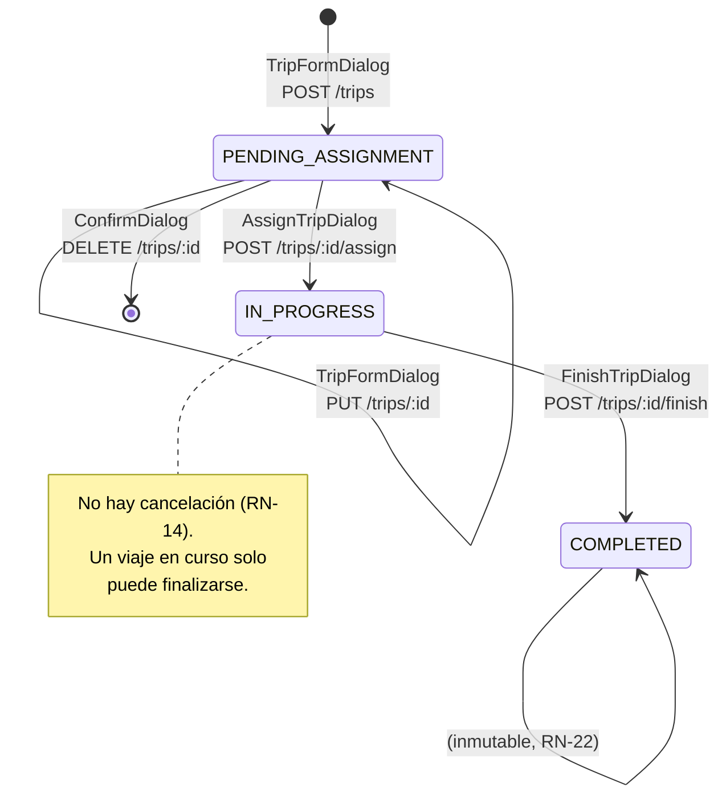
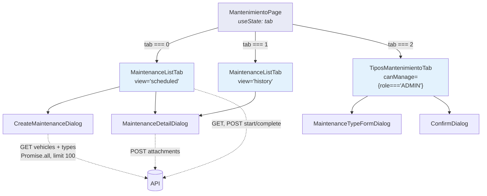
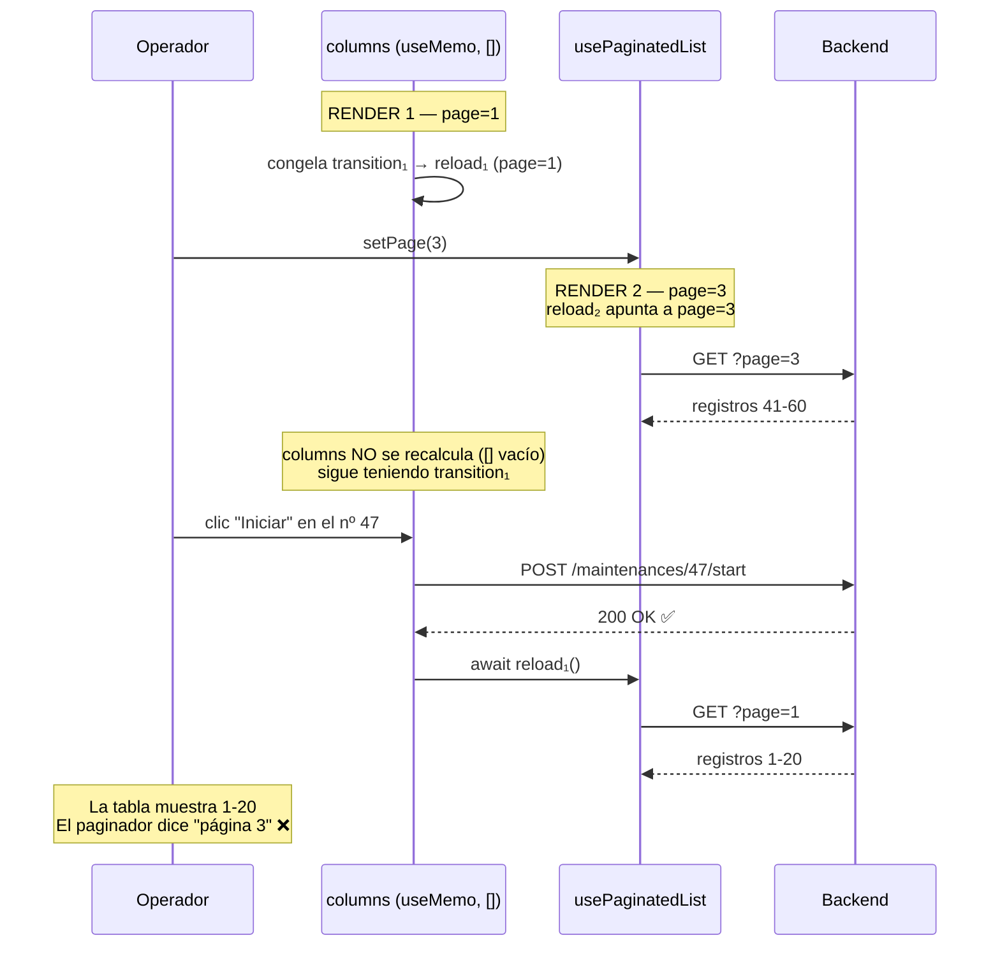

# Capítulo 22B — Las pantallas de viajes y mantenimiento

> **Archivos cubiertos** (11 archivos, 1.230 líneas)
>
> | Carpeta | Archivo | Líneas |
> |:--|:--|--:|
> | `pages/viajes/` | `ViajesPage.tsx` | 201 |
> | | `TripFormDialog.tsx` | 102 |
> | | `AssignTripDialog.tsx` | 105 |
> | | `FinishTripDialog.tsx` | 82 |
> | | `TripDetailDialog.tsx` | 79 |
> | `pages/mantenimiento/` | `MantenimientoPage.tsx` | 33 |
> | | `MaintenanceListTab.tsx` | 115 |
> | | `TiposMantenimientoTab.tsx` | 122 |
> | | `CreateMaintenanceDialog.tsx` | 125 |
> | | `MaintenanceDetailDialog.tsx` | 152 |
> | | `MaintenanceTypeFormDialog.tsx` | 114 |
>
> Además se analizan dos componentes compartidos que solo se usan aquí:
> `components/AddressAutocomplete.tsx` y `components/RouteMap.tsx`.

> **Nota de método.** El patrón de pantalla de listado ya está explicado línea por
> línea en **§22A.3**, con `VehiculosPage` como caso canónico. `ViajesPage`,
> `MaintenanceListTab` y `TiposMantenimientoTab` son instancias de ese mismo patrón:
> aquí **solo se explica lo que las diferencia**. En cambio, los **seis diálogos** sí
> se analizan completos, porque es en ellos donde vive la lógica de negocio del
> cliente — y donde están los hallazgos más caros de este capítulo.

---

## 22B.1 · Introducción

Los capítulos 12 y 13 explicaron el backend de viajes y mantenimiento: el patrón
*bloquear-releer-validar-escribir*, el `FOR UPDATE SKIP LOCKED` que elige vehículo
sin que dos operadores se pisen, las siete validaciones de la asignación, los cuatro
efectos en cascada de la finalización. Todo eso es invisible para el usuario. Lo que
el usuario ve son **seis cuadros de diálogo**.

Este capítulo trata de la traducción entre esos dos mundos. Y la pregunta que lo
organiza es incómoda:

> **¿Cuánta de la lógica de negocio del backend está reflejada en la interfaz, y qué
> pasa exactamente cuando no lo está?**

La respuesta no es uniforme. Hay diálogos que replican la regla del backend con
precisión quirúrgica (`FinishTripDialog` implementa RN-5 en el cliente y deshabilita
el botón), otros que la delegan por completo y se limitan a mostrar el error 422 que
vuelve (`MaintenanceTypeFormDialog` con `kmTarget >= kmAlert`), y al menos uno que
**contradice** al backend: `TripFormDialog` hace imposible borrar las observaciones de
un viaje, aunque el esquema Zod del backend acepta explícitamente `null` para ese campo.

También aparece aquí el hallazgo más revelador del frontend entero, y es de los que
solo se ven cruzando dos archivos que nadie leería juntos:

```
frontend/src/pages/mantenimiento/MaintenanceListTab.tsx:74
    // eslint-disable-next-line react-hooks/exhaustive-deps
```

Ese comentario silencia la regla `react-hooks/exhaustive-deps`. Es exactamente la
regla que habría detectado el cierre obsoleto de §22A.3.5. Y el proyecto **no tiene
ESLint instalado** — ni configuración, ni dependencia, ni script. El comentario
silencia a un linter que nunca corrió. Alguien sabía que las dependencias estaban
incompletas, escribió la supresión, y siguió adelante.

---

## 22B.2 · Conceptos previos

### 22B.2.1 · El diálogo como unidad de transacción

En una aplicación web tradicional (multipágina, §18.2.1), cada operación es una
página: `GET /viajes/nuevo` devuelve un formulario, `POST /viajes` lo procesa y
redirige. La unidad de trabajo es **la navegación**.

En una SPA con diálogos, la unidad de trabajo es **el componente montado**. Un diálogo
es un componente que:

1. **Nace** cuando `open` pasa a `true`.
2. **Acumula estado local** mientras el usuario escribe (un `useState` por campo).
3. **Emite** ese estado en una única llamada HTTP al confirmar.
4. **Muere** — o debería morir — al cerrarse.

Ese ciclo tiene una trampa que aparece en los seis diálogos de este capítulo y hay
que entenderla antes de leer el código.

### 22B.2.2 · El diálogo que no muere: por qué todos tienen un `useEffect` de reinicio

MUI renderiza `<Dialog open={false}>` de una forma particular: por omisión **el
contenido se desmonta** cuando `open` es `false` (`keepMounted` es `false` por
defecto). Pero el componente que *contiene* al `<Dialog>` — es decir,
`TripFormDialog` mismo — **sigue montado**, porque el padre lo renderiza siempre:

```tsx
// ViajesPage.tsx:184 — el diálogo está SIEMPRE en el árbol
<TripFormDialog open={formOpen} trip={editing} onClose={...} onSaved={...} />
```

Nunca hay un `{formOpen && <TripFormDialog .../>}`. La consecuencia es directa: los
`useState` de `TripFormDialog` **conservan su valor entre aperturas**. Si el usuario
escribe "Córdoba" en el destino, cancela, y vuelve a abrir el diálogo para crear otro
viaje, encontraría "Córdoba" todavía escrito.

De ahí que los seis diálogos compartan la misma estructura defensiva:

```tsx
useEffect(() => {
  if (open) {
    // reiniciar todos los campos
  }
}, [open, trip]);
```

**Por qué `if (open)` y no un `if (!open)`.** El reinicio se hace *al abrir*, no al
cerrar. La diferencia es visible: si se reiniciara al cerrar, el usuario vería los
campos vaciarse durante la animación de salida del diálogo (MUI la anima ~195 ms).
Reiniciando al abrir, el vaciado ocurre cuando el diálogo todavía no es visible.

**Por qué `trip` está en las dependencias.** Sin `trip`, el efecto solo correría al
cambiar `open`. Pero `ViajesPage` reutiliza *la misma instancia* del diálogo para
crear y para editar: hace `setEditing(t); setFormOpen(true)`. Ambos `setState` se
agrupan en un solo render (batching, §18.6.3), así que `open` y `trip` cambian juntos
y el efecto correría igual. El `trip` en las dependencias protege el caso raro en que
`trip` cambie con el diálogo ya abierto — y sobre todo, documenta la intención.

**La alternativa que el proyecto no usó.** Existe un patrón más limpio: montar el
diálogo condicionalmente y darle una `key`.

```tsx
{formOpen && <TripFormDialog key={editing?.id ?? 'new'} trip={editing} ... />}
```

Con esto, React desmonta y vuelve a montar el componente en cada apertura, los
`useState` nacen con su valor inicial, y los seis `useEffect` de reinicio **desaparecen**.
Se pierde la animación de cierre de MUI (el componente se va del árbol de golpe). Es
un intercambio razonable, pero el proyecto eligió el otro lado y lo eligió de forma
consistente en los seis diálogos, que es lo que importa.

### 22B.2.3 · Estado de control vs. estado de servidor

Los diálogos de este capítulo manejan tres clases de estado, y conviene nombrarlas
porque el código las mezcla en la misma lista de `useState`:

| Clase | Ejemplos | Origen | Vive |
|:--|:--|:--|:--|
| **De formulario** | `destination`, `arrivalKm`, `km` | El usuario lo escribe | Hasta el envío |
| **De control** | `submitting`, `uploading`, `busy`, `error` | La propia UI lo deriva | Un ciclo de petición |
| **De servidor** | `drivers`, `vehicles`, `types` | Una petición HTTP | Hasta cerrar el diálogo |

El estado de servidor dentro de un diálogo es el más problemático de los tres, y el
motivo es que **no se invalida solo**. Si `AssignTripDialog` carga la lista de choferes
disponibles al abrirse y el operador deja el diálogo abierto diez minutos, esa lista
puede estar completamente obsoleta: otro operador pudo haber asignado un viaje a uno
de esos choferes. El diálogo seguirá ofreciéndolo.

El proyecto **acepta** esa obsolescencia y la resuelve en el backend: la validación de
RN-19 (un solo viaje activo por chofer) se ejecuta dentro de la transacción, con la
fila del chofer bloqueada (§12.4.3). Si el chofer ya no está disponible, la asignación
falla con 409 y el diálogo muestra el mensaje. **Es la decisión correcta.** El cliente
propone, el servidor dispone. Una librería como TanStack Query resolvería el refresco
automático, pero no eliminaría la necesidad de la validación en el servidor — solo
haría el fallo menos frecuente.

### 22B.2.4 · `datetime-local`, y por qué aquí sí está bien resuelto

El capítulo 22A documentó el error de fechas más extendido del proyecto: mostrar una
columna `DATE` con `new Date(x).toLocaleDateString('es-AR')`, lo que en Argentina
(UTC−3) retrocede un día.

Este capítulo trata de campos `DATETIME`, que son un problema **distinto y opuesto**.
Conviene tener las dos reglas juntas:

| Tipo en la BD | Qué es | Para mostrar | Para un `<input>` |
|:--|:--|:--|:--|
| `DATE` (`licenseExpiryDate`) | Un **día del calendario**, sin hora | `iso.slice(0, 10)` reformateado, o `dayjs.utc(iso)` | `iso.slice(0, 10)` |
| `DATETIME` (`departureAt`) | Un **instante** en la línea de tiempo | `new Date(iso).toLocaleString()` ✅ | `isoToLocalInput(iso)` |

Un `<input type="datetime-local">` tiene una propiedad que causa casi todos los errores
de fecha en aplicaciones web: **su valor no tiene zona horaria**. El navegador entrega
la cadena `"2026-08-12T14:30"` y esa cadena significa *las dos y media de la tarde
donde está el usuario*. No es un instante: es una hora de reloj de pared.

El archivo `utils/datetime.ts` (24 líneas, ya presentado en §19.5.2) existe para
cruzar esa frontera en ambos sentidos:

```ts
/** ISO instant → datetime-local value in local time. */
export function isoToLocalInput(iso: string): string {
  const d = new Date(iso);
  return `${d.getFullYear()}-${pad(d.getMonth() + 1)}-${pad(d.getDate())}T${pad(d.getHours())}:${pad(d.getMinutes())}`;
}

/** datetime-local value (local time) → ISO instant (UTC), unambiguous for the API. */
export function localInputToIso(value: string): string {
  // `new Date("YYYY-MM-DDTHH:mm")` parses as LOCAL time; toISOString() → UTC.
  return new Date(value).toISOString();
}
```

Los métodos `getFullYear`, `getMonth`, `getDate`, `getHours` **sin `UTC` en el nombre**
devuelven los componentes en la zona horaria del navegador. Es exactamente lo que un
`datetime-local` necesita. Y en la vuelta, `new Date("2026-08-12T14:30")` — una cadena
ISO **sin sufijo `Z` y sin desplazamiento** — la especificación de ECMAScript ordena
interpretarla como hora local; `toISOString()` la convierte a UTC restando el
desplazamiento.

**El error que estas dos funciones evitan.** La tentación natural es escribir:

```tsx
setDepartureAt(trip.departureAt.slice(0, 16));   // ❌ "2026-08-12T17:30"
```

El backend guardó las 14:30 de Argentina como `2026-08-12T17:30:00.000Z`. El `slice`
toma los dígitos **UTC** y los mete en un input que los interpreta como **locales**: el
usuario ve las 17:30. Y aquí viene la parte fea — **el error es acumulativo**. Si
guarda sin tocar nada, se envían las 17:30 locales, que son las 20:30 UTC. Abre otra
vez: ve las 20:30. Cada edición corre el viaje tres horas hacia adelante.

Los dos diálogos que usan `datetime-local` en este capítulo —`TripFormDialog` y
`CreateMaintenanceDialog`— usan las funciones correctamente. **Es el único lugar del
frontend donde el manejo de fechas está bien hecho**, y el contraste con §22A.4 es lo
que hace tan visible que el bug de las fechas `DATE` no es ignorancia sino descuido: el
mismo equipo que escribió `utils/datetime.ts` y su comentario de nueve líneas
explicando el problema, dejó catorce `toLocaleDateString` sin UTC en las tablas.

### 22B.2.5 · Pestañas: qué significa `{tab === 0 && <X/>}`

`MantenimientoPage` es la única pantalla del sistema con pestañas. La forma en que las
implementa tiene una consecuencia que hay que entender antes de leer el código.

```tsx
{tab === 0 && <MaintenanceListTab view="scheduled" />}
{tab === 1 && <MaintenanceListTab view="history" />}
{tab === 2 && <TiposMantenimientoTab canManage={canManageTypes} />}
```

React reconcilia los hijos de un elemento **por posición** (§18.5.4). Los tres
elementos de arriba ocupan las posiciones 0, 1 y 2 del array de hijos. Con `tab === 0`:

```
[<MaintenanceListTab view="scheduled"/>, false, false]
```

Al pasar a `tab === 1`:

```
[false, <MaintenanceListTab view="history"/>, false]
```

React compara posición por posición. Posición 0: antes había un componente, ahora hay
`false` → **desmonta**. Posición 1: antes `false`, ahora un componente → **monta uno
nuevo**. Aunque el tipo de componente es el mismo (`MaintenanceListTab`), están en
posiciones distintas, así que React no reutiliza la instancia: destruye el estado del
primero y crea el segundo desde cero.

Esto es, casualmente, **lo que se quiere**: al cambiar de "Programados" a "Historial"
conviene que la paginación se reinicie y se haga una petición nueva. Si React hubiese
reutilizado la instancia, el cambio de la prop `view` habría cambiado la identidad de
`fetchFn` (que la tiene en sus dependencias) y disparado la recarga igual — pero la
página se habría quedado, por ejemplo, en la 4 de un listado que ahora tiene 2.

El comportamiento correcto se obtiene aquí por accidente de la reconciliación, no por
diseño explícito. Un `key` haría la intención visible:

```tsx
<MaintenanceListTab key={tab} view={tab === 0 ? 'scheduled' : 'history'} />
```

---

## 22B.3 · El módulo de viajes

### 22B.3.1 · `ViajesPage`: qué la diferencia del patrón canónico

`ViajesPage` sigue las siete piezas de §22A.3. Las diferencias son cuatro:

**1. Tres filtros en lugar de dos, y ninguno es de texto libre.**

```tsx
const [statusFilter, setStatusFilter] = useState<TripStatus | ''>('');
const [dateFrom, setDateFrom] = useState('');
const [dateTo, setDateTo] = useState('');
```

No hay `search`, y por lo tanto **no hay el par `search`/`appliedSearch`** que §22A.3.1
explicó (el desdoblamiento que evita una petición por tecla). Los tres filtros de
`ViajesPage` son selects y `<input type="date">`, que solo emiten `onChange` cuando el
usuario termina de elegir. La ausencia de `appliedSearch` no es una omisión: es que no
hace falta.

**2. Las fechas del filtro viajan como cadenas crudas.**

```tsx
dateFrom: dateFrom || undefined,   // "2026-08-01"
```

El estado guarda literalmente lo que devuelve `<input type="date">`: `"2026-08-01"`.
No se convierte a `Date` ni se ajusta a UTC. Del otro lado, `listTripsQuerySchema` lo
recibe con `z.coerce.date()`, que ejecuta `new Date("2026-08-01")` — y una cadena ISO
**solo con fecha** la especificación ordena interpretarla como **UTC medianoche**
(distinto de `"2026-08-01T00:00"`, que sería local; una asimetría desconcertante del
lenguaje, pero es la regla).

Así que `dateFrom` llega como `2026-08-01T00:00:00.000Z`. Y el repositorio hace:

```ts
// trips.repository.ts:33-38
if (filters.dateFrom || filters.dateTo) {
  // utcEndOfDay makes dateTo an inclusive upper bound; a raw lte would drop
  ...(filters.dateFrom ? { gte: filters.dateFrom } : {}),
  ...(filters.dateTo ? { lte: utcEndOfDay(filters.dateTo) } : {}),
```

`utcEndOfDay` lleva el límite superior a las 23:59:59.999 UTC de ese día, para que un
viaje que sale a las 18:00 del día "hasta" no quede fuera. **El filtro opera en días
UTC.** Un viaje que sale el 1 de agosto a las 22:00 hora argentina es, en UTC, el 2 de
agosto a las 01:00: filtrando "hasta el 1 de agosto" no aparece, aunque para el
operador salió el 1. Es un desajuste de un desplazamiento horario en los bordes del
rango, no un error de un día completo como el de §22A.4, pero conviene tenerlo
anotado.

**3. `useMemo(..., [])` — y aquí sí es correcto.**

```tsx
const columns = useMemo<Column<Trip>[]>(() => [ /* ... */ ], []);   // línea 119
```

En §22A.3.5 documenté que el `useMemo` de columnas de `VehiculosPage` produce un cierre
obsoleto. Aquí las dependencias son un array **vacío**, aún más agresivo. Y sin embargo
**no hay bug**. La razón está en lo que hacen los manejadores:

```tsx
onClick={() => setDetailTrip(t)}
onClick={() => { setEditing(t); setFormOpen(true); }}
onClick={() => setAssignTrip(t)}
onClick={() => setToDelete(t)}
onClick={() => setFinishTrip(t)}
```

Todos son **funciones `set` de `useState`**. React garantiza que la identidad de esas
funciones es **estable durante toda la vida del componente** — es una garantía
documentada, no un detalle de implementación. Capturar la del primer render y usarla en
el render número cuarenta da exactamente el mismo resultado. Y `t` no viene del cierre:
llega como argumento de `render(t)` en cada pintado.

`VehiculosPage` tiene el bug porque su manejador llama a `reload`, que **no** es
estable: `usePaginatedList` lo define con `useCallback(..., [fetchFn, page, limit])`, y
por lo tanto cambia de identidad cada vez que cambia la página.

**La regla, entonces:**

> Un `useMemo` de columnas con dependencias vacías es seguro **si y solo si** los
> manejadores usan exclusivamente valores de identidad estable: setters de `useState`,
> `dispatch` de `useReducer`, funciones de módulo. En cuanto uno llame a algo derivado
> del estado —`reload`, `items`, `user`— el cierre queda congelado.

`ViajesPage` cumple. `VehiculosPage` (§22A.3.5) y `MaintenanceListTab` (§22B.4.6) no.

**4. El error de acción se muestra, pero el de carga tiene prioridad.**

```tsx
{error ? (
  <Alert severity="error" sx={{ mb: 2 }}>{error}</Alert>
) : actionError ? (
  <Alert severity="error" sx={{ mb: 2 }} onClose={() => setActionError(null)}>{actionError}</Alert>
) : null}
```

Dos fuentes de error, un solo espacio en pantalla, resueltas con un ternario anidado.
`error` (de `usePaginatedList`, un fallo al listar) gana sobre `actionError` (un fallo
al eliminar). Es defendible: si el listado no cargó, el usuario no puede hacer nada de
todos modos. Nótese que solo el segundo tiene `onClose` — el de carga no se puede
descartar porque no tiene sentido descartarlo: desaparece cuando la carga tiene éxito.

Este bloque exacto, con el mismo ternario anidado, aparece **cuatro veces** en el
proyecto (`ViajesPage:133`, `MaintenanceListTab:92`, `TiposMantenimientoTab:84`, y las
pantallas de 22A). Es un candidato obvio a componente `<ErrorBanner primary secondary/>`,
y refuerza el hallazgo de §21.2.1: el catálogo de componentes se quedó corto.

### 22B.3.2 · La máquina de estados, dibujada con iconos

Lo más interesante de `ViajesPage` es que **la columna de acciones es una máquina de
estados**. El backend define tres estados y cuatro transiciones (§12.3.1); la tabla los
traduce a botones que aparecen y desaparecen:

```tsx
{t.status === 'PENDING_ASSIGNMENT' && (
  <>
    <Tooltip title="Editar">   {/* → PUT /trips/:id      */}
    <Tooltip title="Asignar">  {/* → POST /trips/:id/assign */}
    <Tooltip title="Eliminar"> {/* → DELETE /trips/:id   */}
  </>
)}
{t.status === 'IN_PROGRESS' && (
  <Tooltip title="Finalizar">  {/* → POST /trips/:id/finish */}
)}
```

Y "Ver detalle" fuera de los condicionales: disponible siempre.

| Estado | Acciones ofrecidas | Regla del backend |
|:--|:--|:--|
| `PENDING_ASSIGNMENT` | Ver · Editar · Asignar · Eliminar | A-4 (editable solo pendiente), RN-14 (no hay cancelación una vez en curso) |
| `IN_PROGRESS` | Ver · Finalizar | RN-22 (inmutable en curso) |
| `COMPLETED` | Ver | RN-22 (el historial no se toca) |

**La correspondencia con el backend es exacta.** Verifiqué las cuatro reglas contra
`trips.service.ts` y no hay ninguna acción ofrecida que el servidor vaya a rechazar por
estado, ni ninguna transición legal que la interfaz oculte. Es la máquina de estados
mejor reflejada del proyecto — comparar con §22A.3.5, donde `VehiculosPage` ofrece el
interruptor de activación sobre vehículos `IN_WORKSHOP` que el backend rechaza.

Un detalle que puede confundir al leer: el mensaje del diálogo de confirmación de
borrado.

```tsx
message={`¿Eliminar el viaje a ${toDelete?.destination}? Solo se pueden eliminar viajes pendientes de asignación.`}
```

La segunda frase es información que el usuario **no necesita en ese momento** — el botón
solo aparece sobre viajes pendientes, así que la condición ya está satisfecha. Está
escrita para tranquilizar ("no vas a romper el historial"), pero un usuario que la lea
literalmente puede quedarse dudando de si la operación va a funcionar. Un mensaje mejor
diría qué se pierde, no qué está permitido.

---

## 22B.4 · Explicación línea por línea de los diálogos

### 22B.4.1 · `TripFormDialog` (102 líneas) — crear y editar la ruta

```tsx
/** Fixed origin for every trip (RN-21) — shown read-only. */
const FIXED_ORIGIN = 'Ciudad Industria, Autopista Córdoba - Rosario, Rosario, Santa Fe';
```

**Línea 19.** RN-21 dice que todos los viajes salen del mismo depósito. El backend lo
implementa **no aceptando el campo**: `createTripSchema` (líneas 10-16) no tiene
`origin`, y el `validate` con Zod lo eliminaría del `body` aunque llegara (§7.4.3, la
protección contra asignación masiva). El servicio lo escribe desde una constante propia.

El frontend, por su parte, tiene **su propia copia de la cadena**. Son dos constantes
en dos repositorios que deben coincidir y nada las obliga a hacerlo. Si mañana la
empresa se muda, hay que cambiar los dos y desplegar los dos. Es la misma duplicación
de contrato que §19.3.4 documentó para los tipos: el precio de tener dos aplicaciones
independientes sin paquete compartido.

Y hay algo peor de lo que parece: **el backend guarda `origin` en cada fila de `trips`**
(no es un campo derivado). Los viajes históricos conservan el origen que tenían al
crearse. Así que tras la mudanza, `TripDetailDialog` mostraría el origen correcto de
cada viaje —viene de la BD—, pero el formulario mostraría el nuevo para todos. Es el
comportamiento deseable, y ocurre por casualidad.

```tsx
interface Props {
  open: boolean;
  /** null → create; a trip → edit (only allowed while PENDING_ASSIGNMENT, A-4). */
  trip?: Trip | null;
  onClose: () => void;
  onSaved: () => void;
}
```

**Líneas 21-27.** La firma de los seis diálogos del proyecto, con una variación:
`trip?: Trip | null` es **opcional y anulable** a la vez. `?` significa "la prop puede
no pasarse"; `| null` significa "puede pasarse valiendo `null`". Con
`trip = null` como valor por defecto (línea 31), las dos formas convergen en `null`, y
`isEdit` funciona igual se llame `<TripFormDialog/>` o `<TripFormDialog trip={null}/>`.

Es tolerancia innecesaria —`ViajesPage` siempre pasa la prop— pero inofensiva.

**La separación de `onClose` y `onSaved` sí es importante.** Son dos callbacks porque
representan dos salidas distintas del diálogo:

```tsx
onClose={() => setFormOpen(false)}                          // cancelar: cerrar y nada más
onSaved={() => { setFormOpen(false); void reload(); }}      // guardar: cerrar Y recargar
```

Si hubiera un solo `onClose(saved: boolean)`, el padre tendría que ramificar. Con dos
callbacks, cada uno hace una cosa. Y el `void` delante de `reload()` le dice a
TypeScript "sé que esto devuelve una promesa y elijo no esperarla" — sin él, con
`@typescript-eslint/no-floating-promises` activo, sería un error; sin ESLint instalado,
es solo documentación.

```tsx
const isEdit = trip !== null;
```

**Línea 32.** Un booleano derivado, calculado en cada render. No es estado: es una
función pura de las props. Guardarlo en un `useState` sería el error clásico de
duplicar la fuente de verdad.

Fíjese en el uso de `!==` y no `!=`. Con `!=` (comparación laxa), `undefined != null`
sería `false` — y como `trip` es opcional, podría llegar `undefined`. Aquí el valor por
defecto `= null` de la línea 31 lo normaliza antes, así que ambos operadores darían lo
mismo; pero la costumbre de `===`/`!==` es lo que hace que ese razonamiento ni siquiera
haga falta.

```tsx
useEffect(() => {
  if (open) {
    setDestination(trip?.destination ?? '');
    // Convert the stored ISO instant to a local wall-clock value for the input.
    setDepartureAt(trip?.departureAt ? isoToLocalInput(trip.departureAt) : '');
    setNotes(trip?.notes ?? '');
    setError(null);
  }
}, [open, trip]);
```

**Líneas 39-47.** El reinicio de §22B.2.2. Tres detalles:

**`trip?.destination ?? ''`** — encadena dos operadores. El `?.` corta si `trip` es
`null` (devolviendo `undefined` en vez de reventar), y el `??` convierte ese `undefined`
en cadena vacía. La cadena vacía es obligatoria: un `<TextField value={undefined}>` se
vuelve un campo **no controlado**, y React emite en consola la advertencia
"A component is changing an uncontrolled input to be controlled" en cuanto el usuario
escriba. Cuatro caracteres que evitan un bug de categoría entera.

**Por qué `??` y no `||`.** Para cadenas, `||` trataría `''` como ausente y también
devolvería `''` — el mismo resultado. Pero la costumbre importa: en la línea siguiente,
si el valor fuera numérico, `0 || ''` daría `''` y `0 ?? ''` daría `0`. `??` solo
sustituye `null` y `undefined`; `||` sustituye todo lo falsy (§1.4.7).

**`trip?.departureAt ? isoToLocalInput(...) : ''`** — aquí sí hace falta un ternario y
no un `??`, porque no se trata de sustituir el valor ausente sino de **no llamar a la
función** con un argumento inválido: `isoToLocalInput(undefined)` daría
`new Date(undefined)` → `Invalid Date` → la cadena `"NaN-aN-aNTaN:aN"` en el input.

```tsx
async function handleSubmit(e: FormEvent) {
  e.preventDefault();
```

**Líneas 49-50.** El `<form onSubmit>` (línea 71) captura el envío. Sin
`preventDefault()`, el navegador haría su comportamiento nativo: serializar el
formulario y **navegar**, recargando la SPA entera y perdiendo el estado de Zustand,
la ruta actual y el token en memoria (§20.3.2). Una línea que evita un desastre.

**Por qué un `<form>` y no un botón con `onClick`.** El `<form>` da tres cosas gratis:
Enter envía desde cualquier campo, `required` activa la validación nativa del navegador
antes de que `handleSubmit` corra, y los lectores de pantalla anuncian el conjunto como
formulario. `AssignTripDialog` y `FinishTripDialog` **no** usan `<form>` y por eso
Enter no funciona en ellos — una inconsistencia menor pero real entre diálogos hermanos.

```tsx
const payload = { destination, departureAt: localInputToIso(departureAt), ...(notes ? { notes } : {}) };
```

**Línea 55.** La línea más densa del archivo, y la que contiene el bug.

Tres partes:

1. `destination` — abreviatura de `destination: destination` (propiedad abreviada de
   ES2015).
2. `departureAt: localInputToIso(departureAt)` — la conversión de §22B.2.4, correcta.
3. `...(notes ? { notes } : {})` — **una propiedad condicional mediante *spread***.

La tercera merece desarme. `...` sobre un objeto copia sus propiedades en el literal
que lo contiene. Si `notes` tiene texto, el objeto es `{ notes: "..." }` y la propiedad
aparece. Si está vacío, el objeto es `{}` y **la clave `notes` no existe en el payload**.

Y `JSON.stringify` no serializa las claves ausentes. Así que el cuerpo HTTP es:

```json
{ "destination": "Córdoba", "departureAt": "2026-08-12T17:30:00.000Z" }
```

Sin `notes`.

**🔴 El bug: las observaciones no se pueden borrar.**

Al crear un viaje, omitir `notes` es correcto — el campo es opcional. Al **editar**, es
un error, y el esquema del backend demuestra que fue previsto:

```ts
// backend/src/modules/trips/trips.schemas.ts:24
notes: z.string().max(1000).nullable().optional(),
```

`.nullable()` no está ahí por casualidad. Significa que el backend **acepta
explícitamente `null`** para vaciar el campo. El servicio hace un `update` de Prisma con
lo que llegue: `notes: null` escribe `NULL`; `notes` ausente deja la columna intacta.

Así que el ciclo completo:

1. Un operador crea un viaje con la observación *"Cliente pidió llamar antes"*.
2. La información deja de ser cierta. Abre el diálogo, borra el texto, guarda.
3. El payload no incluye `notes`. La fila conserva *"Cliente pidió llamar antes"*.
4. El diálogo se cierra, la tabla se recarga. **Nada indica que la operación falló**:
   devolvió 200.
5. Abre el detalle: la observación sigue ahí.

El operador puede *reemplazar* la observación por un espacio en blanco —`" "` es
*truthy*— pero no borrarla. La corrección son cuatro caracteres:

```tsx
const payload = { destination, departureAt: localInputToIso(departureAt), notes: notes || null };
```

Con esto, crear envía `notes: null` (aceptado: `.nullable()`) y editar puede vaciar.

**El mismo patrón aparece tres veces más** en el capítulo:
`CreateMaintenanceDialog:70-71` (dos veces) y `MaintenanceTypeFormDialog:57-58`. En
esos dos casos el diálogo solo crea o el campo es numérico, así que la consecuencia es
menor — pero en `MaintenanceTypeFormDialog`, que **sí edita**, significa que
`monthsAlert` y `monthsTarget` no se pueden volver a poner en "sin límite" una vez
fijados.

```tsx
if (isEdit) {
  await tripsApi.update(trip.id, payload);
} else {
  await tripsApi.create(payload);
}
onSaved();
```

**Líneas 56-61.** `trip.id` sin `?.` — TypeScript lo permite porque `isEdit` es
`trip !== null` y el estrechamiento por flujo de control (§1.5.6) sabe que dentro del
`if` el valor no es nulo. Es análisis estático real, no una concesión: si se cambiara
`isEdit` por `const isEdit = Boolean(trip)`, TypeScript perdería la conexión y exigiría
el `?.`. (Existe una forma de conservarla: `const isEdit = trip !== null` es ya un
*type predicate* implícito para el compilador.)

`onSaved()` **solo se ejecuta si el `await` no lanzó**. Si la petición falla, el control
salta al `catch` y el diálogo permanece abierto con el error visible y los datos que el
usuario escribió intactos. Es el comportamiento correcto y merece decirse porque la
alternativa —cerrar siempre y mostrar el error en la página— haría perder lo escrito.

```tsx
} finally {
  setSubmitting(false);
}
```

**Líneas 64-66.** `finally` corre en los dos caminos. Sin él, un fallo dejaría
`submitting` en `true` para siempre y los botones deshabilitados: el usuario tendría que
cerrar y reabrir. Los seis diálogos lo hacen bien.

```tsx
<TextField
  label="Fecha y hora de salida"
  type="datetime-local"
  value={departureAt}
  onChange={(e) => setDepartureAt(e.target.value)}
  required
  fullWidth
  InputLabelProps={{ shrink: true }}
/>
```

**Líneas 83-91.** `InputLabelProps={{ shrink: true }}` es un requisito de MUI con los
inputs de fecha: por omisión la etiqueta flota *sobre* el campo y se encoge al escribir,
pero un `datetime-local` vacío ya muestra el formato `dd/mm/aaaa --:--`, que quedaría
tapado. `shrink: true` fuerza la etiqueta arriba desde el principio.

**⚠️ Lo que falta: `inputProps={{ min: ... }}`.** Nada impide programar un viaje para
el año pasado. Ni en el cliente (no hay `min`) ni en el servidor
(`departureAt: z.coerce.date()`, sin `.min()`). Verifiqué el esquema completo: no hay
otra validación de rango. Se puede crear hoy un viaje con salida el 3 de marzo de 2019,
asignarlo y finalizarlo. Aparecerá en los reportes de 2019.

Si es intencional —cargar viajes que ya ocurrieron para completar el histórico— debería
estar documentado; el resto del sistema es estricto con las fechas (RN-1 con licencias,
RN-5 con kilometrajes), así que la asimetría llama la atención.

```tsx
<AddressAutocomplete label="Destino" value={destination} onChange={setDestination} required />
```

**Línea 82.** Este componente merece su propia sección.

### 22B.4.2 · `AddressAutocomplete` — integración con Google Places, y una promesa incumplida

```tsx
const MAPS_KEY = import.meta.env.VITE_GOOGLE_MAPS_API_KEY;
```

**Línea 5.** Una variable de entorno de Vite. El prefijo `VITE_` es obligatorio para
que Vite la exponga al navegador (§18.3.4) — es un mecanismo de seguridad: sin el
prefijo, `import.meta.env` no la incluye y no puede filtrarse al bundle por accidente.
**Con** el prefijo, en cambio, la clave queda escrita en texto plano dentro del
JavaScript que se descarga. Cualquiera puede leerla.

Eso es inevitable con las APIs de Maps del lado del cliente, y Google lo asume: la
protección no es ocultar la clave sino **restringirla por referente HTTP** en la consola
de Google Cloud. Si no está restringida, cualquiera puede copiarla y consumir la cuota
facturada del proyecto. No hay nada en el repositorio que indique si se hizo — es una
tarea de configuración, no de código, y merece estar en el manual de despliegue.

```tsx
const onChangeRef = useRef(onChange);
onChangeRef.current = onChange;
```

**Líneas 24-25.** El patrón del **callback en una referencia**, y una de las piezas de
React mejor resueltas del proyecto.

El problema: el efecto de la línea 27 registra un *listener* de Google Places y tiene
dependencias `[]`, así que corre **una sola vez**. Ese listener llama a `onChange`. Si
capturara `onChange` directamente del cierre, capturaría la función del **primer
render** — que a su vez captura el `setDestination` de aquel momento. Con `setState` da
igual (es estable), pero si mañana el padre pasara una función que use estado, el
listener llamaría a una versión obsoleta. Es el cierre obsoleto de §22A.3.5 otra vez.

La solución: un objeto `ref` es **la misma caja** durante toda la vida del componente.
`onChangeRef.current = onChange` en el cuerpo la reescribe en cada render con la versión
fresca. El listener lee `onChangeRef.current` en el momento de dispararse, así que
siempre obtiene la última. El efecto sigue corriendo una vez.

**La asignación está en el cuerpo del componente, no en un efecto.** Técnicamente eso
es un efecto secundario durante el render, algo que React desaconseja porque en modo
concurrente un render puede descartarse. Para este caso concreto es la práctica
aceptada (es la base del `useEffectEvent` que React propone como API oficial), y la
alternativa —`useEffect(() => { ref.current = onChange })`— actualizaría la referencia
*después* del pintado, dejando una ventana en la que el listener vería la versión
anterior.

```tsx
useEffect(() => {
  if (!MAPS_KEY || !inputRef.current) return;
  let cancelled = false;
  let autocomplete: google.maps.places.Autocomplete | undefined;

  loadGoogleMaps(MAPS_KEY)
    .then(() => {
      if (cancelled || !inputRef.current) return;
      autocomplete = new google.maps.places.Autocomplete(inputRef.current, {
        fields: ['formatted_address', 'name', 'geometry'],
        componentRestrictions: { country: 'ar' },
      });
      // ...
    })
    .catch(() => {
      /* SDK failed to load — the field stays usable as free text. */
    });

  return () => {
    cancelled = true;
    if (autocomplete) google.maps.event.clearInstanceListeners(autocomplete);
  };
}, []);
```

**Líneas 27-53.** Cuatro decisiones buenas seguidas:

1. **Degradación elegante.** Sin clave, el efecto sale en la primera línea y el
   componente es un `<TextField>` normal. El sistema funciona sin Google Maps
   configurado. El `.catch()` vacío hace lo mismo si el SDK no carga (red caída,
   bloqueador de anuncios): el campo sigue siendo texto libre.

2. **La bandera `cancelled`.** `loadGoogleMaps` es asíncrona. Si el componente se
   desmonta mientras carga —el usuario cierra el diálogo—, el `.then()` se ejecutaría
   sobre un `inputRef.current` que ya es `null`, o peor, adjuntaría un autocompletado a
   un nodo huérfano que nunca se libera. La función de limpieza pone `cancelled = true`
   y el `.then()` se rinde. Es el patrón estándar para efectos asíncronos, y el proyecto
   lo aplica en **cinco** de sus efectos —`App.tsx:40`, este, `DashboardPage:29`,
   `ConfiguracionPage:28` y `MiDocumentacionPage:30`— pero **no** en los diálogos que
   cargan catálogos (§22B.4.3). En `AddressAutocomplete` es el único caso donde además
   hace falta liberar un recurso externo (`clearInstanceListeners`), no solo evitar un
   `setState`.

3. **La limpieza real.** `clearInstanceListeners` desregistra los listeners de Google.
   Sin eso, el objeto `Autocomplete` mantiene una referencia al nodo del DOM y al
   componente: una fuga de memoria por cada apertura del diálogo.

4. **`componentRestrictions: { country: 'ar' }`.** Restringe las sugerencias a
   Argentina. Reduce el ruido y, marginalmente, el coste por petición.

**⚠️ La promesa incumplida: `geometry` se pide y nunca se usa.**

```tsx
fields: ['formatted_address', 'name', 'geometry'],
```

`fields` le dice a Google qué datos devolver — **y determina la tarifa**: pedir
`geometry` mueve la petición de la categoría *Basic Data* a una más cara. El listener,
sin embargo, solo lee dos campos:

```tsx
const address = place.formatted_address ?? place.name ?? '';
if (address) onChangeRef.current(address);
```

`place.geometry` —las coordenadas— se descarta. Se está pagando por un dato que se tira.

Y eso conecta con un hallazgo mayor. El comentario del esquema del backend dice:

```ts
// backend/src/modules/trips/trips.schemas.ts:7-8
 * estimatedDistanceKm/estimatedTimeMin come from the route preview (Google Maps)
 * and are optional.
```

Rastreé los dos campos por todo el proyecto:

| Dónde | Qué hace |
|:--|:--|
| `prisma/schema.prisma` | Dos columnas en `trips` |
| `trips.schemas.ts:14-15, 25-26` | El esquema los acepta al crear y al actualizar |
| `trips.service.ts:114, 143` | El servicio los escribe en la BD |
| `trips.service.ts:47-48` | El servicio los devuelve en la respuesta |
| `frontend/src/api/trips.api.ts:12-13, 39-40` | El tipo del cliente los declara |
| `TripDetailDialog.tsx:41` | La pantalla los **muestra** |
| `MiViajePage.tsx:82` | La pantalla del chofer los **muestra** |
| **Quién los envía** | **Nadie.** Ni `TripFormDialog` ni ningún otro archivo del frontend. |

**🔴 Es un camino muerto de punta a punta.** Siete archivos, dos columnas de base de
datos, cuatro reglas de validación y dos pantallas construidas alrededor de dos campos
que **siempre valen `NULL`**. `TripDetailDialog` muestra invariablemente "—" en
"Distancia estimada", y en `MiViajePage` la fila directamente nunca se pinta
(`{trip.estimatedDistanceKm != null && ...}`).

La pieza que falta es pequeña: con `place.geometry` —que ya se está pagando— el
frontend podría llamar a la Distance Matrix API o a Directions, obtener distancia y
duración, y enviarlas en el payload. Está a unas veinte líneas. Es, con diferencia, la
funcionalidad más cerca de terminar de todo el proyecto, y la más visible cuando alguien
abre el detalle de un viaje y ve un guion.

### 22B.4.3 · `AssignTripDialog` (105 líneas) — el diálogo que confiesa lo que no controla

```tsx
/**
 * Assign a trip: the operator selects an available driver; the system picks
 * the vehicle automatically (RN-12). Only available drivers are offered.
 */
```

**Líneas 25-28.** El comentario es correcto en las tres afirmaciones. Lo verifiqué
contra `trips.service.ts` (§12.4) y `drivers.repository.ts`.

```tsx
useEffect(() => {
  if (!open) return;
  setDriverId('');
  setError(null);
  setLoadingDrivers(true);
  driversApi
    .list({ page: 1, limit: 100, available: true })
    .then((r) => setDrivers(r.items))
    .catch((err) => setError(apiErrorMessage(err)))
    .finally(() => setLoadingDrivers(false));
}, [open]);
```

**Líneas 36-46.** Reinicio y carga en el mismo efecto. Cuatro observaciones:

**`if (!open) return`, la guarda invertida.** `TripFormDialog` usa `if (open) { ... }`;
este usa la salida temprana. Mismo resultado, menos anidamiento. La inconsistencia entre
diálogos hermanos es cosmética.

**No hay bandera `cancelled`.** A diferencia de `AddressAutocomplete`, si el diálogo se
cierra mientras la petición vuela, el `.then()` ejecutará `setDrivers` sobre un
componente que ya no está montado. En React 18 eso **no** produce la vieja advertencia
"Can't perform a React state update on an unmounted component" —se eliminó en la 18
justamente porque generaba más ruido que valor— y el `setState` simplemente no hace
nada. Es inofensivo aquí. Vale la pena saber por qué es inofensivo, no asumirlo.

**`.catch()` seguido de `.finally()`.** El orden importa: `.finally` corre después de
que el `.catch` haya manejado el error, así que `loadingDrivers` vuelve a `false` en los
dos caminos. Si estuvieran al revés (`.finally().catch()`), también funcionaría, pero el
orden natural es el que está.

**⚠️ `limit: 100`.** La paginación se esquiva pidiendo cien elementos y confiando en
que alcanza. Si la empresa tiene 101 choferes disponibles, el número 101 **no aparece en
el selector y nada lo indica**: no hay mensaje, no hay puntos suspensivos, no hay
scroll infinito. El chofer simplemente no existe para el operador.

Cien es plausible para una PyME de logística y probablemente nunca falle. Pero es un
límite silencioso, y el mismo patrón se repite en `CreateMaintenanceDialog:49-50` (cien
vehículos y cien tipos). Lo correcto sería un `Autocomplete` de MUI con búsqueda en el
servidor —el endpoint ya soporta `search`— o, como mínimo, detectar
`r.total > r.items.length` y advertir.

```tsx
helperText={
  loadingDrivers
    ? 'Cargando choferes disponibles…'
    : drivers.length === 0
      ? 'No hay choferes disponibles'
      : 'Solo se listan choferes disponibles (licencia vigente, sin viaje activo)'
}
```

**Líneas 78-84.** Un ternario anidado de tres estados en el texto de ayuda. Esto está
**bien hecho** y es raro: la mayoría de las interfaces dejan el selector vacío y mudo
mientras cargan. Aquí el usuario siempre sabe en cuál de los tres mundos está.

El tercer caso —el mensaje que se ve normalmente— es el más valioso: explica **por qué
la lista puede ser más corta de lo esperado**. Sin él, un operador que no encuentra a
un chofer concreto no tiene forma de saber si está de viaje, si se le venció la
licencia, o si el sistema falló.

**⚠️ El texto está incompleto.** Menciona dos de las tres condiciones. El repositorio
filtra por tres:

```ts
// backend/src/modules/drivers/drivers.repository.ts:37-41
if (filters.available === true) {
  // RN-19: valid license + no active trip (+ active, non-deleted user).
  where.user = { is: { deletedAt: null, isActive: true } };      // ← 3ª condición
  where.licenseExpiryDate = { gte: utcStartOfToday() };          // ← licencia vigente
  where.trips = { none: { status: 'IN_PROGRESS' } };             // ← sin viaje activo
}
```

Un chofer **desactivado** (`isActive: false`) tampoco aparece, y el texto no lo dice.
Es la causa más probable de una consulta al soporte: "el chofer tiene licencia y no está
de viaje, ¿por qué no lo veo?". Añadir *"y usuario activo"* son tres palabras.

Nótese, de paso, el comentario `// A license expiring today is still valid today (RN-1)`
y el `gte: utcStartOfToday()`: la comparación es contra la medianoche UTC de hoy, así
que una licencia que vence hoy pasa el filtro. RN-1 dice exactamente eso. **Es una
implementación correcta de una regla sutil**, y contrasta con el bug de visualización de
§22A.4, donde esa misma fecha se muestra un día antes. El sistema calcula bien y
comunica mal.

```tsx
<Alert severity="info">
  El vehículo se asigna automáticamente entre los disponibles según reglas de negocio.
</Alert>
```

**Líneas 92-94.** Un cartel informativo permanente. Su función es **gestionar una
expectativa**: el operador viene de un flujo donde eligió el chofer y busca el selector
de vehículo. No existe. Sin este cartel, el diálogo parecería incompleto.

Lo que el cartel no dice es *cuál* es el criterio. El backend elige el vehículo
disponible con **menor kilometraje acumulado** (§12.4.4, `ORDER BY accumulated_km ASC`),
para repartir el desgaste de la flota. Es una regla que el operador querría conocer —y
que quizás querría poder saltarse en un caso puntual, cosa que el sistema no permite.
Decirlo ("se asigna el vehículo disponible con menos kilómetros") convertiría un mensaje
opaco en uno útil.

```tsx
<Button variant="contained" onClick={handleAssign} disabled={submitting || driverId === ''}>
```

**Línea 99.** `driverId === ''` es la comparación que exige el tipo
`useState<number | ''>('')`: un unión de número y cadena vacía, el modismo de MUI para
un select numérico sin selección. `''` es *falsy* como `0`, así que `!driverId` sería
un error si algún chofer tuviera id 0. Con `=== ''` la distinción es explícita.

### 22B.4.4 · `FinishTripDialog` (82 líneas) — RN-5 implementada dos veces

```tsx
const departureKm = trip?.departureKm ?? 0;
const invalid = arrivalKm === '' || Number(arrivalKm) <= departureKm;
```

**Líneas 50-51.** El corazón del diálogo, y la implementación en el cliente de RN-5
("el kilometraje de llegada debe ser mayor al de salida").

Se calculan en el cuerpo del componente, sin `useMemo`. Es correcto: son dos operaciones
triviales que se recalculan en cada render. `useMemo` aquí costaría más que ahorrar
—guardar el valor y comparar dependencias es más trabajo que una resta.

`Number('')` es `0`, no `NaN` (una peculiaridad de JavaScript, §1.4.3). Por eso hace
falta comprobar `arrivalKm === ''` primero: sin esa comprobación, un campo vacío daría
`0 <= departureKm` → `true` → inválido, que casualmente es el resultado correcto... salvo
si `departureKm` fuera 0, en cuyo caso `0 <= 0` sigue siendo `true`. La comprobación
explícita elimina la necesidad de ese razonamiento.

**⚠️ El `?? 0` degrada la validación.** `Trip.departureKm` es `number | null` en el
tipo del cliente, porque un viaje `PENDING_ASSIGNMENT` todavía no lo tiene: se fija en
la asignación, copiando `accumulatedKm` del vehículo (§12.4.5). El diálogo solo se abre
desde viajes `IN_PROGRESS`, así que el valor está siempre presente y el `?? 0` nunca
actúa.

Pero si por un fallo lo hiciera, la validación se volvería `Number(arrivalKm) <= 0`:
cualquier número positivo pasaría, y el texto de ayuda diría *"Debe ser mayor al inicial
(0 km)"*. Un valor por defecto que convierte un fallo ruidoso en uno silencioso. La
alternativa honesta es rendirse:

```tsx
if (!trip || trip.departureKm == null) return null;   // o un <Alert> explicando
```

```tsx
<TextField
  label="Kilometraje final"
  type="number"
  value={arrivalKm}
  onChange={(e) => setArrivalKm(e.target.value)}
  required
  fullWidth
  helperText={`Debe ser mayor al inicial (${departureKm.toLocaleString('es-AR')} km)`}
  error={arrivalKm !== '' && Number(arrivalKm) <= departureKm}
/>
```

**Líneas 62-71.** Tres capas de retroalimentación sobre la misma regla:

1. **`helperText`** — dice la regla y **el número concreto** a superar, siempre visible.
2. **`error`** — pinta el campo en rojo cuando el valor es inválido, **pero solo si el
   usuario ya escribió algo** (`arrivalKm !== ''`). Un campo vacío recién abierto no se
   pinta en rojo: no se regaña a alguien por no haber empezado.
3. **`disabled={submitting || invalid}`** (línea 76) — el botón no se puede pulsar.

Las tres capas responden a preguntas distintas: *qué tengo que hacer*, *lo que escribí
está mal*, *no puedo continuar*. Es la pieza de diseño de interacción más cuidada del
proyecto.

**Y la comparación es la misma que hace el backend**, verificado en `trips.service.ts`:
un `arrivalKm <= departureKm` que lanza `BusinessRuleError` → 422. La regla vive en dos
sitios, que es lo correcto: el cliente para la ergonomía, el servidor para la
integridad. Si alguien salta el cliente con `curl`, el servidor lo detiene.

**El `type="number"` no es una validación.** Es un modismo tan extendido que conviene
desactivarlo: `<input type="number">` restringe lo que se puede escribir en muchos
navegadores, pero `e.target.value` sigue siendo **una cadena** —de ahí el
`Number(arrivalKm)`— y puede contener `"1e5"`, `"-5"`, `"1.5"` o quedar vacía tras
escribir `"--"`. `finishTripSchema` en el backend lo trata correctamente con
`z.coerce.number().int().min(0)`.

Un detalle: el esquema exige **entero**, pero el input acepta decimales. Escribir
`150000.5` pasa la validación del cliente y **falla en el servidor** con un 422 poco
descriptivo. `inputProps={{ step: 1, min: departureKm + 1 }}` cerraría la brecha.

```tsx
<Button variant="contained" color="error" onClick={handleFinish} disabled={submitting || invalid}>
  Finalizar viaje
</Button>
```

**Líneas 76-78.** `color="error"` — rojo — para la acción principal. No es un borrado:
es la acción normal y esperada. El rojo está indicando **irreversibilidad**, y eso es
exacto: finalizar dispara cuatro efectos en cascada (§13 y §12.5.3) —el viaje pasa a
`COMPLETED`, el vehículo vuelve a `AVAILABLE`, se le suman los kilómetros recorridos, y
se registra la auditoría— y RN-22 hace el resultado inmutable. No hay "deshacer".

Discutible como convención de color, correcto como señal.

### 22B.4.5 · `TripDetailDialog` (79 líneas) — la vista de solo lectura

El diálogo más simple del capítulo, y el único **completamente sin estado**: ni un
`useState`, ni un `useEffect`. Recibe `trip` y pinta. Un componente puro.

```tsx
function Field({ label, value }: { label: string; value: string }) {
  return (
    <Grid item xs={6}>
      <Typography variant="caption" color="text.secondary">{label}</Typography>
      <Typography variant="body2">{value}</Typography>
    </Grid>
  );
}
```

**Líneas 15-24.** Un componente local, definido **fuera** del componente principal —lo
correcto: si estuviera dentro, se recrearía en cada render y React lo trataría como un
tipo nuevo, desmontando y remontando el subárbol completo (§18.5.3).

`MaintenanceDetailDialog` define uno idéntico llamado `Detail` (líneas 145-151). **Dos
componentes con el mismo cuerpo, distinto nombre, en archivos hermanos**, ninguno
exportado. Es exactamente lo que §21.2.1 anticipó: el catálogo de componentes se quedó
en ocho y el resto se copia.

```tsx
<StatusChip status={trip?.status ?? ''} />
```

**Línea 31.** El `?? ''` sortea el hecho de que `trip` puede ser `null` cuando el
diálogo está cerrado. `StatusChip` recibe una cadena vacía y renderiza su caso por
defecto. Funciona, pero es sintomático: el diálogo se renderiza siempre —está en el
árbol de `ViajesPage` con `open={detailTrip !== null}`— y el cuerpo se protege con
`{trip && (...)}` en la línea 34. El título, en cambio, quedó fuera de esa guarda y
necesita su propia defensa.

```tsx
<Field label="Salida" value={new Date(trip.departureAt).toLocaleString('es-AR')} />
```

**Línea 38.** `toLocaleString` sobre un `DATETIME`: **correcto** (§22B.2.4). El valor
guardado es un instante real; convertirlo a la zona del usuario es precisamente lo que
se quiere. Compárese con el bug de §22A.4, que aplica la misma familia de funciones a
columnas `DATE`, donde no hay instante que convertir.

```tsx
<Field label="Km salida" value={trip.departureKm?.toLocaleString('es-AR') ?? '—'} />
```

**Línea 48.** `?.` seguido de `??`, un modismo que se repite ocho veces en el archivo.
Si el valor es `null`, `?.` corta y `??` sustituye por el guion largo `—`. Diez
caracteres que cubren el caso de un viaje sin asignar.

`toLocaleString('es-AR')` sobre un número produce `150.000` con punto como separador de
miles, la convención argentina. Es el único formateo de números del proyecto y está bien
aplicado.

```tsx
/** Read-only trip detail. The Google Maps route view is a later integration. */
```

**Línea 26.** **⚠️ El comentario es incorrecto.** La integración **existe**: la línea 69
renderiza `<RouteMap origin={trip.origin} destination={trip.destination} />`. Es un
comentario que sobrevivió a la funcionalidad que describía.

Es el tercer comentario desactualizado del proyecto (§9.6.1 fue retirado tras verificar
el capítulo 15; los otros dos están en §10.2.3 y §14.5.2). Los comentarios que describen
estado —"esto es para después", "esto todavía no funciona"— caducan; los que describen
intención —"por qué está hecho así"— no. Este proyecto tiene comentarios excelentes del
segundo tipo y algunos accidentes del primero.

### 22B.4.6 · `RouteMap` — dos estrategias, cero configuración obligatoria

```tsx
const externalUrl = `https://www.google.com/maps/dir/?api=1&origin=${encodeURIComponent(origin)}&destination=${encodeURIComponent(destination)}`;

if (!MAPS_KEY) {
  return (
    <Button variant="outlined" startIcon={<OpenInNewIcon />} href={externalUrl} target="_blank" rel="noopener">
      Ver recorrido en Google Maps
    </Button>
    /* + una nota explicando cómo configurar la clave */
  );
}
```

**Líneas 22-35.** El camino sin clave. Sigue el mismo principio que
`AddressAutocomplete`: **el sistema funciona sin configuración de Google**, con una
funcionalidad reducida pero honesta. La URL `maps/dir/?api=1` es la API de URLs de
Google Maps, que es pública y gratuita: no requiere clave porque el usuario la abre en
su propio navegador con su propia sesión.

`encodeURIComponent` escapa el texto de las direcciones. Sin él, la dirección
`"Autopista Córdoba - Rosario, Rosario"` rompería la URL con sus espacios y comas.
Aplicado en las dos variantes, correctamente.

`rel="noopener"` junto a `target="_blank"` cierra una vulnerabilidad concreta: sin él,
la página abierta recibe una referencia `window.opener` a la nuestra y puede
redirigirla (*tabnabbing*). Los navegadores modernos lo aplican por defecto desde 2021,
pero escribirlo es gratis.

```tsx
const embedUrl = `https://www.google.com/maps/embed/v1/directions?key=${MAPS_KEY}&origin=...&destination=...`;

<iframe
  title="Recorrido del viaje"
  loading="lazy"
  referrerPolicy="no-referrer-when-downgrade"
  src={embedUrl}
/>
```

**Líneas 38-50.** El camino con clave, y el comentario del archivo explica bien la
decisión: *"embeds the route via the Maps Embed API (an iframe; lowest-cost option, no
JS SDK)"*.

Es una decisión de arquitectura correcta y poco obvia. Las alternativas eran:

| Opción | Coste | Peso | Control |
|:--|:--|:--|:--|
| **Maps Embed API** (elegida) | **Gratuita, sin límite** | Un `<iframe>` | Ninguno |
| Maps JavaScript API | Por carga de mapa | ~200 KB de SDK | Total |
| Directions API + render propio | Por petición | El SDK + el código | Total |

Para "mostrar un recorrido en un cuadro" la primera gana en todo lo que importa aquí.
Se pierde el control programático (no se pueden añadir marcadores ni leer la
polilínea), que es justamente lo que no se necesita.

`title` en el `<iframe>` es un requisito de accesibilidad: los lectores de pantalla lo
anuncian. `loading="lazy"` difiere la carga hasta que el elemento se acerca al
viewport — dentro de un diálogo que ya está visible tiene poco efecto, pero no molesta.

**La clave viaja en la URL del `<iframe>`**, visible en el HTML. Igual que en
`AddressAutocomplete`: inevitable, y la mitigación es restringirla por referente en
Google Cloud.

---

## 22B.5 · El módulo de mantenimiento

### 22B.5.1 · `MantenimientoPage` (33 líneas) — tres pestañas, dos componentes

```tsx
export function MantenimientoPage() {
  const { user } = useAuth();
  const [tab, setTab] = useState(0);
  const canManageTypes = user?.role === 'ADMIN';
```

**Líneas 12-15.** La única pantalla con pestañas del sistema. Es un contenedor puro:
no llama a ninguna API, no tiene lógica propia. Su única responsabilidad es decidir cuál
de los tres hijos se monta y pasarle `canManage` al tercero.

```tsx
<Tabs value={tab} onChange={(_e, v) => setTab(v)}>
```

**Línea 21.** El manejador de MUI recibe `(event, value)`. El evento no se usa y se
nombra `_e` — la convención de subrayado inicial para parámetros ignorados. Con
`@typescript-eslint/no-unused-vars` configurado con
`argsIgnorePattern: '^_'`, eso evitaría el aviso. Sin ESLint, es solo comunicación entre
personas.

**⚠️ Dos consecuencias del estado local de la pestaña.**

`tab` vive en un `useState` de `MantenimientoPage`. Cuando el usuario navega a otra
ruta, React Router desmonta la pantalla y el estado se pierde. Al volver, siempre se
abre en "Programados". Para un administrador que trabaja sobre "Tipos" y va y viene a
"Vehículos", es fricción real.

La solución estándar es llevar la pestaña a la URL —`/mantenimiento?tab=tipos`, con
`useSearchParams` de React Router (que ya es una dependencia)—. Eso además haría cada
pestaña enlazable y compartible, y arreglaría el botón "atrás" del navegador, que hoy
salta la pantalla entera en lugar de volver a la pestaña anterior.

**La tercera pestaña se le muestra al operador.** `<Tab label="Tipos" />` se renderiza
siempre; solo `canManage` es condicional. Un operador ve los tipos de mantenimiento en
modo lectura, sin botones. Es una decisión defendible —conocer los umbrales ayuda a
entender por qué salta una alerta— siempre que el backend permita el `GET` a ese rol.
Si no lo permite, el operador ve una pestaña que solo produce un error 403. **Es lo
primero que habría que probar** al validar esta pantalla.

### 22B.5.2 · `MaintenanceListTab` (115 líneas) — el linter fantasma

Sigue el patrón de §22A.3, con tres diferencias.

**1. El filtro no es estado: es una prop.**

```tsx
export function MaintenanceListTab({ view }: { view: 'scheduled' | 'history' }) {
  const fetchFn = useCallback(
    (params: PageParams) => maintenancesApi.list({ ...params, view }),
    [view],
  );
```

**Líneas 16-20.** El mismo componente sirve dos pestañas. `view` viaja al backend, que
traduce `'scheduled'` a `status IN (PENDING, IN_PROGRESS)` e `'history'` a
`status = COMPLETED` (§13.4.2). Que la partición se resuelva en el servidor y no
filtrando en el cliente es correcto: la paginación tiene que contar sobre el conjunto
ya filtrado.

`view` está en las dependencias del `useCallback` por rigor. En la práctica el
componente se desmonta y se remonta al cambiar de pestaña (§22B.2.5), así que `view`
nunca cambia en una instancia viva. Es la clase de dependencia correcta que no cuesta
nada y protege un refactor futuro.

**2. El truco de la fila fresca.**

```tsx
// The detail dialog should reflect fresh data after an upload; find the
// current version of the open maintenance in the reloaded rows.
const openDetail = detail ? (items.find((m) => m.id === detail.id) ?? detail) : null;
```

**Líneas 78-80.** Un problema real, resuelto con elegancia y con un borde suelto.

El problema: `MaintenanceDetailDialog` permite subir comprobantes. Al subir uno, llama a
`onChanged()` → `reload()` → llegan filas nuevas a `items`. Pero `detail` guarda **el
objeto que se capturó al abrir el diálogo**, con la lista de adjuntos vieja. El
comprobante recién subido no aparecería hasta cerrar y reabrir.

La solución: no pasar `detail` al diálogo, sino **buscar su versión actual** en `items`
por id. Después de la recarga, `items` tiene el mantenimiento con el adjunto nuevo, y el
diálogo se repinta con él. El `?? detail` es el respaldo si no lo encuentra.

Esto convierte a `detail` en lo que debería haber sido desde el principio: **un
identificador de qué está abierto**, no una copia de los datos. La versión aún más
limpia sería `useState<number | null>(null)` guardando solo el id; se necesita el objeto
completo únicamente para el respaldo.

**⚠️ El borde suelto.** El `?? detail` se activa en un caso concreto y no tan raro: si
la recarga devuelve una página donde el mantenimiento **ya no está**. Ocurre si otro
usuario lo completa (sale de "Programados" hacia "Historial") mientras el diálogo está
abierto. Entonces `items.find` devuelve `undefined`, se cae al `detail` viejo, y el
diálogo sigue mostrando `PENDING` sobre un registro que ya está completado —incluyendo
el botón de subir comprobante, que fallará con un 422 del backend.

Es un caso de concurrencia poco probable en una PyME con dos operadores, pero el
respaldo silencioso hace que, si ocurre, sea indistinguible del funcionamiento normal.
Detectar el `undefined` y cerrar el diálogo con un aviso sería más honesto.

**3. 🔴 El `eslint-disable` de un linter que no existe.**

```tsx
const columns = useMemo<Column<Maintenance>[]>(
  () => [ /* ... */ ],
  // eslint-disable-next-line react-hooks/exhaustive-deps
  [],
);
```

**Líneas 38-76.** Aquí convergen dos hallazgos.

**Primero, el cierre obsoleto.** Las columnas incluyen dos botones que llaman a
`transition(m, 'start' | 'complete')`. Y `transition` está declarada en el cuerpo del
componente:

```tsx
async function transition(m: Maintenance, action: 'start' | 'complete') {
  setActionError(null);
  try {
    await (action === 'start' ? maintenancesApi.start(m.id) : maintenancesApi.complete(m.id));
    await reload();          // ← reload NO es estable
  } catch (err) {
    setActionError(apiErrorMessage(err));
  }
}
```

Se recrea en cada render, capturando el `reload` de ese render. Pero `useMemo` con `[]`
congela las columnas del **primer** render, con la `transition` del primer render, que
cierra sobre el `reload` del primer render, que `usePaginatedList` construyó con
`page = 1`.

**El escenario, paso a paso:**

1. El operador abre "Programados", que tiene 60 mantenimientos en 3 páginas.
2. Va a la página 3. `setPage(3)` → `usePaginatedList` recrea `load` y `reload`.
   La tabla muestra los registros 41-60 correctamente.
3. Pulsa "Iniciar" en el mantenimiento nº 47.
4. `POST /maintenances/47/start` → **200 OK. El backend hace lo correcto.**
5. Se ejecuta `await reload()` — pero el `reload` del primer render, que pide
   `?page=1&limit=20`.
6. `items` se reemplaza por los registros 1-20. La tabla los pinta.
7. **El paginador sigue diciendo "página 3 de 3"**, porque `page` es estado
   independiente y nadie lo tocó.

El resultado es una tabla que muestra la página 1 mientras afirma estar en la 3. Los
datos son reales, la operación funcionó, pero el registro sobre el que el usuario actuó
desapareció de la vista sin explicación. Es un bug difícil de reportar —"a veces la
tabla salta"— y trivial de corregir: quitar el `useMemo` (39 elementos no justifican
memorizar) o mover `transition` a un `useCallback` y ponerlo en las dependencias.

**Segundo, y más interesante: el comentario de supresión.**

```tsx
// eslint-disable-next-line react-hooks/exhaustive-deps
```

`react-hooks/exhaustive-deps` es exactamente la regla que detecta este bug: analiza el
cuerpo del `useMemo`, encuentra que usa `transition`, ve que no está en las
dependencias, y avisa. Quien escribió esta línea **sabía** que las dependencias estaban
incompletas —no se suprime una regla por accidente— y decidió silenciarla.

Y entonces:

```
$ ls -a frontend/ | grep -i eslint
(nada)
$ grep -rn "eslint" frontend/package.json
(nada)
```

**No hay configuración de ESLint. No hay dependencia de ESLint. No hay script de lint.**
Ni en el frontend ni en el backend. El comentario silencia a un linter que nunca corrió
y que no está instalado.

Hay tres supresiones así en el frontend:

| Archivo | Línea | Regla silenciada | ¿Hay bug? |
|:--|:--|:--|:--|
| `MaintenanceListTab.tsx` | 74 | `react-hooks/exhaustive-deps` | 🔴 **Sí** — el descrito arriba |
| `AlertasPage.tsx` | 88 | `react-hooks/exhaustive-deps` | Por verificar (cap. 22C) |
| `UsuariosPage.tsx` | 123 | `react-hooks/exhaustive-deps` | Por verificar (§22A) |

Y seis más en el backend, silenciando `no-console` y `@typescript-eslint/no-namespace`
(`env.ts:40,43`, `mailer.ts:65,68,72`, `server.ts:8,14`, `auth.ts:17`).

**Nueve supresiones para cero linters.** La lectura más probable es que el código se
escribió con un editor que sugiere estas líneas automáticamente, o siguiendo la memoria
muscular de proyectos anteriores. El resultado es que el proyecto tiene **la cicatriz
sin la vacuna**: la evidencia de que alguien vio el problema, sin el mecanismo que lo
habría impedido.

Instalar ESLint con `eslint-plugin-react-hooks` es una tarea de veinte minutos que
habría detectado, además de este bug, los de §22A.3.5, y el que quede por confirmar en
`AlertasPage`. **Es la recomendación de mayor retorno del capítulo 25.**

```tsx
{ key: 'scheduled', label: 'Programado', render: (m) => new Date(m.scheduledAt).toLocaleDateString('es-AR') },
```

**Línea 42.** Verifiqué el esquema: `scheduledAt` es `DATETIME`, no `DATE`. Así que
`toLocaleDateString` **no** produce el bug de §22A.4 — no hay una medianoche UTC que se
desplace: hay un instante real que se convierte correctamente a la zona del usuario.

Lo que sí hay es **una pérdida de información**. `CreateMaintenanceDialog` pide fecha
*y hora* con un `datetime-local`. La tabla muestra solo el día. El operador programa un
mantenimiento para las 8:00 y la lista no distingue ese del que programó para las 16:00
del mismo día. La hora reaparece en el detalle (`MaintenanceDetailDialog:73` usa
`toLocaleString`, correctamente), pero en la vista donde el operador organiza su jornada
está ausente.

O se muestra la hora en la tabla, o se pide solo la fecha en el formulario. Pedir un
dato y no mostrarlo donde importa es lo que hay que evitar.

**Una última asimetría.** El botón "Registrar mantenimiento" solo aparece en la pestaña
"Programados":

```tsx
{view === 'scheduled' && ( <Button ...>Registrar mantenimiento</Button> )}
```

Es correcto —no tiene sentido registrar algo directamente en el historial— y es la
única diferencia visual entre las dos pestañas más allá de los datos.

### 22B.5.3 · `CreateMaintenanceDialog` (125 líneas) — el catálogo doble

```tsx
useEffect(() => {
  if (!open) return;
  setVehicleId(''); setMaintenanceTypeId(''); setScheduledAt('');
  setKm(''); setNextMaintenanceKm(''); setNotes(''); setError(null);
  Promise.all([
    vehiclesApi.list({ page: 1, limit: 100 }),
    maintenanceTypesApi.list({ page: 1, limit: 100 }),
  ])
    .then(([v, t]) => { setVehicles(v.items); setTypes(t.items); })
    .catch((err) => setError(apiErrorMessage(err)));
}, [open]);
```

**Líneas 39-57.** Siete reinicios y **dos** peticiones.

**`Promise.all` es la decisión correcta.** Lanza las dos peticiones en paralelo y espera
a las dos. Secuencialmente (`await` uno y luego el otro) el diálogo tardaría la suma;
así tarda el máximo. Con dos peticiones de ~80 ms, la diferencia es de 160 a 80 ms:
perceptible.

El precio de `Promise.all` es que **falla si cualquiera falla** — si los tipos cargan y
los vehículos no, no se muestra ninguno. `Promise.allSettled` permitiría el éxito
parcial, pero un diálogo con la mitad de los catálogos no sirve para nada. `all` es lo
adecuado aquí.

**La desestructuración `([v, t])`** aprovecha que `Promise.all` conserva el orden del
array de entrada, no el de resolución. TypeScript infiere una tupla, así que `v` es
`Paginated<Vehicle>` y `t` es `Paginated<MaintenanceType>` — con tipos distintos y
verificados. Invertir el orden daría un error de compilación.

**⚠️ Sin `loading`, a diferencia de `AssignTripDialog`.** Aquel tenía
`loadingDrivers` y un texto de ayuda de tres estados. Este no tiene nada: los dos
selectores aparecen vacíos hasta que la petición vuelve. En una red lenta, el usuario ve
un formulario que parece roto. Dos diálogos hermanos, escritos con criterios distintos.

**⚠️ `limit: 100` otra vez, y con un agravante.** `vehiclesApi.list({ page: 1, limit: 100 })`
**no pasa ningún filtro de estado**. El selector ofrece todos los vehículos no
eliminados: los disponibles, los que están de viaje, los que ya están en taller y los
**inactivos**.

Verifiqué qué hace el backend con eso:

```ts
// backend/src/modules/maintenances/maintenances.service.ts:97-98
const vehicle = await vehiclesRepository.findById(dto.vehicleId);
if (!vehicle) throw new NotFoundError(`Vehicle ${dto.vehicleId} not found`);
```

Y `findById`:

```ts
// backend/src/modules/vehicles/vehicles.repository.ts:32-34
findById(id: number, db: DbClient = prisma): Promise<Vehicle | null> {
  return db.vehicle.findFirst({ where: { id, deletedAt: null } });
},
```

**Solo comprueba que exista y no esté borrado.** No mira `status` ni `isActive`. Lo
único que el servicio impide es que haya **dos mantenimientos abiertos** para el mismo
vehículo, y lo hace bien —con la fila bloqueada dentro de la transacción, como explica
su propio comentario (§13.4.4).

De modo que se puede programar un mantenimiento para un vehículo dado de baja. Ni el
cliente ni el servidor lo impiden. ¿Es un bug? **Probablemente no**: un vehículo
inactivo puede estar precisamente inactivo *porque* se le va a hacer un mantenimiento
mayor. Pero es una decisión que no está escrita en ningún lado, y la forma de
comprobar que es deliberada sería una prueba que la fije.

Lo que sí es claramente mejorable es el selector: mostrar el estado junto a la patente
(`ABC123 — Ford Transit · En taller`) le daría al operador la información para decidir.
Hoy elige a ciegas.

```tsx
await maintenancesApi.create({
  vehicleId,
  maintenanceTypeId,
  scheduledAt: localInputToIso(scheduledAt),
  km: Number(km),
  ...(nextMaintenanceKm ? { nextMaintenanceKm: Number(nextMaintenanceKm) } : {}),
  ...(notes ? { notes } : {}),
});
```

**Líneas 65-72.** `localInputToIso` de nuevo — correcto. Y el *spread* condicional dos
veces, con la misma mecánica de §22B.4.1. Aquí el diálogo **solo crea**, así que no hay
bug de borrado; omitir los campos opcionales al crear es exactamente lo apropiado.

**⚠️ `km` no se contrasta con nada.** `createMaintenanceSchema` valida
`z.coerce.number().int().min(0)`. Ni el cliente ni el servidor comparan ese kilometraje
con el `accumulatedKm` real del vehículo. Se puede registrar un mantenimiento a 5 km
para un vehículo que lleva 200.000, o a 900.000 para uno nuevo.

El dato no es decorativo: `nextMaintenanceKm` se calcula a partir de él, y aunque §4.7.5
estableció que **ningún cálculo del sistema lee `nextMaintenanceKm`** (el motor de
alertas usa `min(kmAlert)` global, §14.4.3), el campo se muestra en el detalle y un
operador lo va a creer.

El selector ya tiene el vehículo cargado en `vehicles`, con su `accumulatedKm`. Bastaría
con precargar el campo:

```tsx
onChange={(e) => {
  const id = Number(e.target.value);
  setVehicleId(id);
  setKm(String(vehicles.find(v => v.id === id)?.accumulatedKm ?? ''));
}}
```

Precargar el valor correcto y dejar corregirlo es mejor que validar: elimina el error
más común (tipear mal) sin bloquear el caso legítimo.

```tsx
<TextField label="Próximo mant. (km, opc.)" type="number" value={nextMaintenanceKm}
  onChange={(e) => setNextMaintenanceKm(e.target.value)} fullWidth helperText="≥ kilometraje" />
```

**Línea 112.** El texto de ayuda enuncia la regla. **No hay ninguna validación en el
cliente**: ni `error`, ni botón deshabilitado. El backend sí la valida, con el
`superRefine` de §13.2.3:

```ts
// backend/src/modules/maintenances/maintenances.schemas.ts:20-27
if (data.km !== undefined && data.nextMaintenanceKm !== undefined &&
    data.nextMaintenanceKm !== null && data.nextMaintenanceKm < data.km) {
  ctx.addIssue({ code: z.ZodIssueCode.custom, path: ['nextMaintenanceKm'],
                 message: 'nextMaintenanceKm must be greater than or equal to km' });
}
```

Comparar con `FinishTripDialog`, que implementa su regla equivalente en las tres capas
(§22B.4.4). Aquí el usuario llena el formulario, pulsa Registrar, espera el viaje de
ida y vuelta, y recibe un mensaje **en inglés** —el `message` del `addIssue`— en un
`<Alert>` general, sin que el campo culpable se marque.

`error={nextMaintenanceKm !== '' && Number(nextMaintenanceKm) < Number(km)}` son
cincuenta caracteres.

**Un detalle sobre el mensaje en inglés.** Todos los mensajes de Zod del backend están
en inglés; toda la interfaz está en español. `apiErrorMessage` (§19.3.3) extrae el
mensaje del servidor y lo muestra tal cual. Así que las validaciones que el cliente no
duplica producen texto en inglés en una interfaz en español. Es un problema
transversal —no de este diálogo— y su solución correcta es un diccionario de códigos de
error, no traducir los mensajes en el backend: el backend no debería saber en qué idioma
habla el cliente.

### 22B.5.4 · `MaintenanceDetailDialog` (152 líneas) — adjuntos de solo añadir

Es el único diálogo del capítulo que **muta datos sin ser un formulario**: sube
archivos.

```tsx
const fileInput = useRef<HTMLInputElement>(null);
```

**Línea 33.** Una referencia a un nodo del DOM. Es la excepción legítima al principio de
que en React no se toca el DOM: `<input type="file">` **no se puede abrir
programáticamente sin llamar a su método `.click()`**. Es una restricción de seguridad
del navegador, no de React — el diálogo de selección de archivos solo puede abrirse por
un gesto real del usuario.

```tsx
<Button size="small" startIcon={<UploadFileIcon />} onClick={() => fileInput.current?.click()} disabled={uploading}>
  Subir
</Button>
<input ref={fileInput} type="file" hidden
  accept="application/pdf,image/jpeg,image/png"
  onChange={(e) => { const file = e.target.files?.[0]; if (file) void handleUpload(file); }}
/>
```

**Líneas 89-106.** El patrón del **input oculto**: el `<input type="file">` nativo es
imposible de estilar de forma consistente entre navegadores, así que se esconde con
`hidden` y se dispara desde un botón que sí se puede diseñar. El clic del usuario en el
botón **sí** cuenta como gesto de usuario, así que `.click()` funciona.

`accept` filtra el diálogo del sistema operativo a PDF, JPEG y PNG. **No es una
validación**: el usuario puede cambiar el filtro a "todos los archivos" y elegir un
`.exe`. La validación real vive en el backend, en el `fileFilter` de Multer (§7.7.2), y
el diálogo de la línea 111 informa el límite:

```tsx
Sin comprobantes. Formatos: PDF, JPG, PNG (máx. 1 MB).
```

El 1 MB es la constante `MAX_UPLOAD_BYTES` del backend (§5.4.2). **Otra constante
duplicada en dos repositorios** que nadie sincroniza. Si el backend sube el límite a
5 MB, este texto seguirá diciendo 1 MB.

```tsx
if (fileInput.current) fileInput.current.value = '';
```

**Línea 48.** Sutil y necesaria. Un `<input type="file">` guarda el archivo elegido en
su propiedad `value`. Si el usuario sube `factura.pdf`, falla, y vuelve a elegir
**el mismo archivo**, el navegador considera que el valor no cambió y **no dispara
`onChange`**. El botón parecería no responder.

Vaciar `value` en el `finally` obliga al navegador a tratar la siguiente selección como
nueva. Es de esas cosas que solo se aprenden al toparse con el bug, y está bien resuelta
en el único sitio donde hacía falta.

```tsx
await maintenancesApi.addAttachment(maintenance.id, file);
onChanged(); // reload list (and this dialog's data via parent)
```

**Líneas 42-43.** El comentario explica el circuito completo: subir → recargar la lista
→ el padre encuentra la versión fresca con `items.find` (§22B.5.2) → el diálogo se
repinta con el adjunto nuevo. Sin ese truco del padre, esta línea no tendría efecto
visible.

**No hay eliminación de adjuntos.** Es deliberado —el comentario del archivo dice
*"upload (F-9) and open (append-only)"*— y coherente con el backend, que no expone un
`DELETE`. Un comprobante de mantenimiento es un documento contable: se agrega, no se
quita. La interfaz refleja la regla correctamente.

```tsx
async function handleOpen(attachmentId: number) {
  if (!maintenance) return;
  try {
    await maintenancesApi.openAttachment(maintenance.id, attachmentId);
  } catch (err) { setError(apiErrorMessage(err)); }
}
```

**Líneas 52-59.** Detrás hay más de lo que parece. Los adjuntos están protegidos por
autenticación, así que no se puede poner la URL en un `<a href>`: el navegador no
enviaría la cabecera `Authorization` (el token vive en memoria, §20.3.2). `openAttachment`
usa el helper de `utils/blob.ts` (§19.6): pide el archivo con Axios, recibe un `Blob`,
crea una URL de objeto con `URL.createObjectURL` y la abre. Es el precio de tener
archivos protegidos y un token que no está en una cookie.

```tsx
secondary={`${(a.fileSize / 1024).toFixed(0)} KB · ${new Date(a.uploadedAt).toLocaleDateString('es-AR')}`}
```

**Línea 128.** `uploadedAt` es un `DATETIME`, así que la conversión es correcta; se
pierde la hora, que aquí importa poco.

`(a.fileSize / 1024).toFixed(0)` redondea a KB enteros. Un archivo de 400 bytes muestra
`"0 KB"`, que parece un error. Un `Math.max(1, ...)` o un formateo con decimales para
valores pequeños lo evitaría. Menor, pero visible.

**Dos elementos interactivos para la misma acción.** Cada adjunto tiene un
`ListItemButton` (toda la fila) **y** un `IconButton` en `secondaryAction`, ambos
llamando a `handleOpen(a.id)`. Para el ratón es una comodidad: el objetivo es grande.
Para un usuario de teclado o lector de pantalla significa **dos paradas de tabulación
por adjunto**, la segunda redundante. Con diez adjuntos son veinte tabulaciones para
recorrer diez elementos. El `aria-label="Abrir"` del `IconButton` está bien puesto, pero
no resuelve la duplicación.

### 22B.5.5 · `TiposMantenimientoTab` y `MaintenanceTypeFormDialog`

**`TiposMantenimientoTab`** (122 líneas) es el patrón de §22A.3 casi literal: mismo
`useCallback`, mismo `usePaginatedList`, mismas columnas condicionales con
`...(canManage ? [...] : [])`, mismo `ConfirmDialog`. Dos observaciones:

```tsx
const fetchFn = useCallback((params: PageParams) => maintenanceTypesApi.list(params), []);
```

**Línea 15.** Dependencias vacías, y **correcto**: no hay filtros, así que `fetchFn` no
depende de nada del componente. Es el caso más simple del patrón.

```tsx
const columns = useMemo<Column<MaintenanceType>[]>(() => [ /* ... */ ], [canManage]);
```

**Línea 71.** Dependencias `[canManage]`, exactamente como `VehiculosPage`. **Y aquí no
hay bug**, por la misma razón que en `ViajesPage` (§22B.3.1): los manejadores solo
llaman a `setEditing`, `setFormOpen` y `setToDelete`, que son setters estables. `reload`
se usa en `confirmDelete`, que está **fuera** del `useMemo` y se recrea en cada render.

Tres pantallas con el mismo `useMemo`, dos correctas y una con bug, y la diferencia está
únicamente en si el manejador toca `reload`. Es un ejemplo excelente de por qué la regla
`exhaustive-deps` existe: distinguir estos tres casos a ojo requiere saber qué
identidades son estables, y nadie lo hace de forma fiable en una revisión de código.

```tsx
message={`¿Eliminar "${toDelete?.name}"? No se puede eliminar si está en uso por algún mantenimiento.`}
```

**Línea 113.** Aquí sí es útil advertir la restricción antes de actuar: a diferencia del
borrado de viajes, la condición **no se puede comprobar desde la fila**. El usuario no
sabe si el tipo está en uso hasta intentarlo. El mensaje prepara para el 409 que puede
llegar (§13.6.2). Buena redacción de un caso que no se puede prevenir en el cliente.

**`MaintenanceTypeFormDialog`** (114 líneas) merece dos comentarios.

```tsx
/** Create/edit dialog for a maintenance type. Full-set semantics (PUT): the
 *  km/months thresholds are always submitted together (kmTarget ≥ kmAlert). */
```

**Líneas 23-24.** El comentario documenta la decisión de §13.5.1: el endpoint es un
`PUT` con semántica de conjunto completo. Por eso `handleSubmit` siempre envía `name`,
`description`, `kmAlert` y `kmTarget`, incluso si el usuario solo tocó uno.

```tsx
setKmAlert(type ? String(type.kmAlert) : '');
setMonthsAlert(type?.monthsAlert != null ? String(type.monthsAlert) : '');
```

**Líneas 40-43.** Dos guardas distintas para dos situaciones distintas, y la diferencia
es exacta:

- `kmAlert` es **obligatorio** en el modelo: si hay `type`, hay valor. Basta con
  `type ? ... : ''`.
- `monthsAlert` es **anulable**: puede haber `type` con `monthsAlert === null`. Con
  `type ? String(type.monthsAlert) : ''` se obtendría la cadena `"null"` escrita en el
  campo. El `!= null` lo evita.

El `!=` con dos signos —no `!==`— es **deliberado y correcto**: `!= null` es el único
uso idiomático de la comparación laxa en JavaScript, porque cubre `null` y `undefined`
a la vez. Escribir `!== null && !== undefined` sería equivalente y más largo. Quien
escribió esto sabía lo que hacía.

```tsx
...(monthsAlert ? { monthsAlert: Number(monthsAlert) } : {}),
...(monthsTarget ? { monthsTarget: Number(monthsTarget) } : {}),
```

**Líneas 57-58.** **⚠️ El bug de §22B.4.1, en su versión de edición.** Este diálogo
**sí edita**. Un administrador que fijó `monthsAlert: 6` y quiere volver a "sin control
por meses" borra el campo, guarda, y el `PUT` no incluye la clave. El valor sigue en 6.

A diferencia del caso de las observaciones de un viaje —donde el efecto es cosmético—
aquí el campo **alimenta el motor de alertas**: `monthsAlert` genera alertas de
mantenimiento por tiempo transcurrido (§14.4.2). Un administrador que cree haber
desactivado ese control seguirá recibiendo alertas y no entenderá por qué.

Y el `helperText="≥ km de alerta"` de la línea 96 repite el patrón de
`CreateMaintenanceDialog`: enuncia la regla, no la valida, y deja que el usuario descubra
el incumplimiento con un 422 en inglés.

---

## 22B.6 · Flujo interno: asignar y finalizar un viaje

### 22B.6.1 · Asignación, del clic a la fila actualizada

```
1.  El operador pulsa el icono de asignar en la fila del viaje 42.
      ViajesPage:97 → setAssignTrip(t)
2.  React re-renderiza. AssignTripDialog recibe open={true} trip={t}.
3.  El useEffect de la línea 36 dispara:
      GET /api/v1/drivers?page=1&limit=100&available=true
      → interceptor de Axios añade Authorization: Bearer <access>   (§19.4)
      → authenticate verifica la firma del JWT                       (§7.2)
      → authorize('ADMIN','OPERATOR') comprueba el rol               (§7.3)
      → drivers.repository filtra: usuario activo + licencia vigente + sin viaje activo
4.  Vuelven 7 choferes. setDrivers(...) → el selector se puebla.
5.  El operador elige a "Pérez, Juan". setDriverId(3).
      El botón Asignar se habilita (driverId ya no es '').
6.  Pulsa Asignar. handleAssign:
      POST /api/v1/trips/42/assign   { "driverId": 3 }
7.  El backend abre una transacción y ejecuta el patrón bloquear-releer-validar:
      a. lockTrip(42)                    SELECT ... FOR UPDATE
      b. relee el viaje: ¿sigue PENDING_ASSIGNMENT?
      c. lockDriver(3)                   SELECT ... FOR UPDATE
      d. valida licencia vigente (RN-1) y documentación (RN-4)
      e. valida que no tenga otro viaje activo (RN-19)
      f. pickAvailableVehicle(tx)        FOR UPDATE SKIP LOCKED
                                         ORDER BY accumulated_km ASC
      g. si no hay vehículo → 409 y ROLLBACK
      h. UPDATE trips  SET driver_id=3, vehicle_id=?, departure_km=?,
                           status='IN_PROGRESS'
      i. UPDATE vehicles SET status='ON_TRIP'
      j. INSERT audit_logs
      COMMIT
8.  200 OK. handleAssign resuelve, ejecuta onSaved().
9.  ViajesPage:185 → setAssignTrip(null) cierra el diálogo
                   → void reload() vuelve a pedir la página actual
10. usePaginatedList sustituye items. DataTable repinta.
    La fila 42 muestra ahora el chofer, el vehículo y el estado "En viaje".
    Las acciones de esa fila cambian: desaparecen Editar/Asignar/Eliminar,
    aparece Finalizar.
```

El paso 10 es donde se ve el valor del patrón: **nadie escribió código para cambiar los
botones de esa fila**. La columna de acciones es una función del `status`, el `status`
llegó nuevo del servidor, y React recalculó. El estado del servidor es la única fuente
de verdad y la interfaz es su proyección.

Y aquí funciona porque `ViajesPage` usa el `reload` correcto (§22B.3.1). En
`MaintenanceListTab`, el paso equivalente saltaría a la página 1.

### 22B.6.2 · Los cuatro efectos de finalizar

```
1.  FinishTripDialog: el operador escribe 152340. departureKm = 150000.
      invalid = false → el botón se habilita.
2.  POST /api/v1/trips/42/finish  { "arrivalKm": 152340 }
3.  Transacción:
      a. lockTrip(42), relee: ¿está IN_PROGRESS?
      b. RN-5: 152340 > 150000  ✓  (la misma comparación que hizo el cliente)
      c. UPDATE trips    SET arrival_km=152340, finished_at=NOW(),
                             finished_by=<actor>, status='COMPLETED'
      d. UPDATE vehicles SET accumulated_km = 152340,   ← ASIGNACIÓN, no suma
                             status='AVAILABLE'
      e. UPDATE drivers  SET completed_trips = +1,
                             avg_km = media incremental con tripKm = 2.340
      f. INSERT audit_logs
      COMMIT
4.  El vehículo vuelve al pozo de disponibles con el odómetro en 152.340.
5.  En la siguiente evaluación del motor de alertas (§14.4), ese vehículo
    se compara contra min(kmAlert) de los tipos de mantenimiento. Si cruzó
    el umbral, nace una alerta — sin que nadie la haya pedido.
```

El paso 5 es la conexión que hace del sistema algo más que un CRUD: **finalizar un
viaje puede hacer aparecer una alerta de mantenimiento**, a través de tres módulos que
no se llaman entre sí. El vínculo es un número en una columna.

> **Nota sobre el paso 3d.** El odómetro se actualiza con una **asignación absoluta**
> (`accumulatedKm: dto.arrivalKm`, `trips.service.ts:298`), no con un incremento
> `accumulated_km + tripKm`. En el camino feliz da lo mismo, porque `departureKm` era el
> `accumulatedKm` del vehículo en el momento de la asignación. La diferencia importa si
> algo más modificó el odómetro durante el viaje: la asignación lo **pisa**, el
> incremento lo habría respetado. El capítulo 23 desarrolla las consecuencias (§23.4.4).

---

## 22B.7 · Diagramas

### 22B.7.1 · La máquina de estados del viaje, con sus diálogos



### 22B.7.2 · Composición de la pantalla de mantenimiento



### 22B.7.3 · El cierre obsoleto de `MaintenanceListTab`, en el tiempo



---

## 22B.8 · Resumen

**Lo que este capítulo añade al patrón de §22A:**

1. **El diálogo como unidad de transacción.** Seis diálogos, la misma anatomía: props
   `open`/`onClose`/`onSaved`, un `useEffect` de reinicio, estado de formulario +
   control + servidor, `try/catch/finally`, y `onSaved()` solo en el camino feliz.

2. **Estado de servidor dentro de un diálogo.** Los catálogos se cargan al abrir y no
   se invalidan. El proyecto acepta la obsolescencia y la resuelve validando en el
   servidor dentro de la transacción. Es la decisión correcta.

3. **`datetime-local` bien resuelto.** El par `isoToLocalInput`/`localInputToIso` cruza
   la frontera entre instante y hora de reloj en los dos sentidos, y los dos diálogos
   que lo necesitan lo usan. Es el único manejo de fechas correcto del frontend, lo que
   hace del bug de §22A.4 un descuido y no una laguna.

4. **La máquina de estados dibujada con iconos.** La columna de acciones de `ViajesPage`
   es una proyección exacta de las transiciones legales del backend. Es la mejor
   correspondencia cliente-servidor del proyecto.

5. **La regla del `useMemo` de columnas.** Con dependencias incompletas es seguro **si y
   solo si** los manejadores usan identidades estables. Tres pantallas con el mismo
   `useMemo`: `ViajesPage` ✅, `TiposMantenimientoTab` ✅, `MaintenanceListTab` 🔴. La
   diferencia es una sola llamada a `reload`.

6. **Las tres capas de validación.** `FinishTripDialog` implementa RN-5 en texto de
   ayuda, marca de error y botón deshabilitado, y el backend la repite. Es el modelo. Al
   otro extremo, `CreateMaintenanceDialog` y `MaintenanceTypeFormDialog` enuncian su
   regla en un `helperText` y dejan que el usuario descubra el incumplimiento con un 422
   en inglés.

### 22B.8.1 · Hallazgos del capítulo

| # | Gravedad | Hallazgo | Dónde |
|--:|:--|:--|:--|
| 1 | 🔴 Alta | **Las observaciones no se pueden borrar.** `...(notes ? { notes } : {})` omite la clave; el backend acepta `null` explícitamente (`.nullable()`). Editar a vacío devuelve 200 y no cambia nada. | `TripFormDialog:55` vs `trips.schemas.ts:24` |
| 2 | 🔴 Alta | **`monthsAlert`/`monthsTarget` no se pueden desactivar.** Mismo *spread* condicional, pero el campo alimenta el motor de alertas: el administrador cree haber desactivado el control por tiempo y sigue recibiendo alertas. | `MaintenanceTypeFormDialog:57-58` |
| 3 | 🔴 Alta | **`estimatedDistanceKm`/`estimatedTimeMin`: camino muerto de punta a punta.** Dos columnas, cuatro validaciones, dos pantallas que los muestran, y **nadie los envía**. Siempre `NULL`. `AddressAutocomplete` ya pide `geometry` a Google (y lo paga) sin usarlo. | 7 archivos; ninguno escribe |
| 4 | 🔴 Alta | **Cierre obsoleto en `MaintenanceListTab`.** `useMemo([])` congela `transition` → `reload` con `page=1`. Iniciar o completar desde la página 3 salta a la 1 con el paginador diciendo 3. | `MaintenanceListTab:38-76` |
| 5 | 🔴 Alta | **Nueve `eslint-disable` sin ESLint instalado.** Tres silencian `exhaustive-deps` — la regla que habría detectado los hallazgos 4 y §22A.3.5. No hay config, ni dependencia, ni script. La cicatriz sin la vacuna. | 3 en `pages/`, 6 en `backend/src/` |
| 6 | ⚠️ Media | **`limit: 100` en tres selectores** (choferes, vehículos, tipos). El elemento 101 no aparece y nada lo indica. | `AssignTripDialog:42`, `CreateMaintenanceDialog:49-50` |
| 7 | ⚠️ Media | **El selector de vehículos no filtra ni muestra el estado.** Ofrece inactivos y en taller; el backend solo comprueba `deletedAt`. Puede ser deliberado, no está escrito en ningún lado. | `CreateMaintenanceDialog:49` vs `vehicles.repository.ts:32` |
| 8 | ⚠️ Media | **`km` del mantenimiento no se contrasta con `accumulatedKm`.** Se puede registrar a 5 km un vehículo con 200.000. El dato ya está cargado en el selector: bastaría con precargarlo. | `CreateMaintenanceDialog:109` |
| 9 | ⚠️ Media | **Se puede programar un viaje en el pasado.** Ni `min` en el input ni `.min()` en el esquema. Contrasta con el rigor de RN-1 y RN-5. | `TripFormDialog:83-91`, `trips.schemas.ts:12` |
| 10 | ⚠️ Media | **La pestaña de mantenimiento no está en la URL.** Se pierde al navegar, no es enlazable, y "atrás" salta la pantalla entera. `useSearchParams` ya es una dependencia. | `MantenimientoPage:14` |
| 11 | ⚠️ Media | **`nextMaintenanceKm` y `kmTarget`: regla enunciada, no validada.** El `helperText` la dice; el fallo llega como 422 en inglés en un `<Alert>` general, sin marcar el campo. | `CreateMaintenanceDialog:112`, `MaintenanceTypeFormDialog:96` |
| 12 | ⚠️ Baja | **El texto de choferes disponibles omite una condición de tres.** Dice "licencia vigente, sin viaje activo"; el filtro exige además usuario activo. | `AssignTripDialog:83` vs `drivers.repository.ts:37-41` |
| 13 | ⚠️ Baja | **Comentario desactualizado.** *"The Google Maps route view is a later integration"* — está implementada 43 líneas más abajo. | `TripDetailDialog:26` |
| 14 | ⚠️ Baja | **La lista de mantenimientos pierde la hora.** El formulario pide `datetime-local`; la tabla muestra solo el día. Dos turnos del mismo día son indistinguibles. | `MaintenanceListTab:42` |
| 15 | ⚠️ Baja | **`openDetail` cae en silencio a datos obsoletos** si el registro sale de la página (otro usuario lo completa). El diálogo muestra `PENDING` sobre algo ya completado. | `MaintenanceListTab:80` |
| 16 | ⚠️ Baja | **`departureKm ?? 0` degrada RN-5 en silencio.** Si el valor faltara, cualquier positivo pasaría y el texto diría "mayor al inicial (0 km)". | `FinishTripDialog:50` |
| 17 | ⚠️ Baja | **Dos paradas de tabulación por adjunto.** `ListItemButton` + `IconButton` con la misma acción. Diez adjuntos = veinte tabulaciones. | `MaintenanceDetailDialog:116-131` |
| 18 | ⚠️ Baja | **`Field` y `Detail`: el mismo componente duplicado** en archivos hermanos, ninguno exportado. Confirma §21.2.1. | `TripDetailDialog:15`, `MaintenanceDetailDialog:145` |
| 19 | ⚠️ Baja | **Enter no envía en dos diálogos.** `AssignTripDialog` y `FinishTripDialog` no usan `<form>`; los otros cuatro sí. | — |
| 20 | ⚠️ Baja | **`CreateMaintenanceDialog` no indica que está cargando.** Selectores vacíos y mudos, a diferencia de `AssignTripDialog`, que resuelve tres estados. | `CreateMaintenanceDialog:39-57` |
| 21 | ✅ Bueno | **El manejo de `datetime-local` es correcto.** El par de conversión evita el desplazamiento acumulativo en cada edición. | `TripFormDialog:43,55`, `CreateMaintenanceDialog:68` |
| 22 | ✅ Bueno | **RN-5 en tres capas.** Texto de ayuda con el número concreto, marca de error solo tras escribir, botón deshabilitado — más la validación del servidor. El modelo a seguir. | `FinishTripDialog:50-76` |
| 23 | ✅ Bueno | **La máquina de estados de `ViajesPage` es exacta.** Ninguna acción ofrecida que el backend rechace por estado; ninguna transición legal oculta. | `ViajesPage:89-114` |
| 24 | ✅ Bueno | **`AddressAutocomplete` y `RouteMap` degradan sin clave.** El sistema funciona sin Google configurado. Y `AddressAutocomplete` combina bandera de cancelación con liberación real del recurso externo (`clearInstanceListeners`). *(Corrección: la bandera `cancelled` está en cinco efectos del proyecto, no en uno solo — verificado en §22C.)* | `AddressAutocomplete:27-53`, `RouteMap:24-35` |
| 25 | ✅ Bueno | **El truco de la fila fresca.** `items.find(...) ?? detail` convierte el estado del diálogo en un identificador en lugar de una copia. | `MaintenanceListTab:80` |

---

## 22B.9 · Preguntas de repaso

<details>
<summary><b>1. ¿Por qué los seis diálogos necesitan un <code>useEffect</code> que reinicia los campos al abrirse?</b></summary>

Porque el padre los renderiza **siempre** —`<TripFormDialog open={formOpen} .../>`, nunca
`{formOpen && <TripFormDialog/>}`— así que el componente permanece montado y sus
`useState` conservan el valor entre aperturas. Sin el reinicio, al abrir el diálogo para
crear un viaje aparecerían los datos del anterior.

El reinicio se hace *al abrir* (`if (open)`) y no al cerrar, para que el vaciado ocurra
mientras el diálogo no es visible y no durante la animación de salida.

La alternativa es montar condicionalmente con una `key`: `{formOpen && <TripFormDialog
key={editing?.id ?? 'new'} .../>}`. Eso elimina los seis efectos, a costa de perder la
animación de cierre de MUI.
</details>

<details>
<summary><b>2. Explique por qué <code>useMemo(..., [])</code> produce un bug en <code>MaintenanceListTab</code> y no en <code>ViajesPage</code>.</b></summary>

Un `useMemo` con dependencias vacías congela el valor del **primer render**, incluidas
todas las funciones que su cuerpo capture por cierre.

En **`ViajesPage`**, los manejadores solo llaman a `setDetailTrip`, `setEditing`,
`setFormOpen`, `setAssignTrip`, `setFinishTrip` y `setToDelete`. React garantiza que la
identidad de los setters de `useState` es **estable durante toda la vida del
componente**: la del primer render es la misma que la del render cuarenta. Congelarlas no
tiene efecto. Y `t` no viene del cierre, llega como argumento de `render(t)`.

En **`MaintenanceListTab`**, los manejadores llaman a `transition`, que llama a
`reload`. Y `reload` **no** es estable: `usePaginatedList` lo define con
`useCallback(..., [fetchFn, page, limit])`, así que cambia de identidad cada vez que
cambia la página. El `useMemo` congeló el `reload` de `page = 1`. Actuar desde la
página 3 recarga la página 1 mientras el paginador sigue diciendo 3.

**La regla:** el `useMemo` de columnas es seguro si y solo si los manejadores usan
exclusivamente identidades estables (setters, `dispatch`, funciones de módulo). En cuanto
uno toque algo derivado del estado, el cierre queda congelado.
</details>

<details>
<summary><b>3. Un operador edita un viaje, borra el texto de las observaciones y guarda. La petición devuelve 200. ¿Qué pasó con las observaciones y por qué?</b></summary>

**Siguen guardadas.** El payload se construye así:

```tsx
const payload = { destination, departureAt: localInputToIso(departureAt), ...(notes ? { notes } : {}) };
```

Con `notes === ''` (falsy), el *spread* inserta `{}` y **la clave `notes` no existe** en
el objeto. `JSON.stringify` no serializa claves ausentes, así que el cuerpo HTTP no la
menciona. El `update` de Prisma deja la columna intacta.

Es un error del cliente, no del servidor: `updateTripSchema` declara
`notes: z.string().max(1000).nullable().optional()`. El `.nullable()` existe
precisamente para permitir el vaciado — alguien lo pensó en el backend y el frontend no
lo aprovechó.

La corrección es `notes: notes || null`.

El mismo patrón en `MaintenanceTypeFormDialog:57-58` es peor, porque `monthsAlert`
alimenta el motor de alertas: el administrador cree haber desactivado el control por
tiempo y sigue recibiendo alertas.
</details>

<details>
<summary><b>4. ¿Por qué <code>slice(0, 16)</code> sobre una fecha ISO para llenar un <code>datetime-local</code> es un error acumulativo, y no solo un error de visualización?</b></summary>

Un `<input type="datetime-local">` **no tiene zona horaria**: su valor es hora de reloj
de pared local. Una cadena ISO está en UTC.

Supongamos un viaje que sale a las 14:30 de Argentina (UTC−3), guardado como
`2026-08-12T17:30:00.000Z`.

- `slice(0, 16)` da `"2026-08-12T17:30"` → el input muestra **17:30**, tres horas de más.
- El usuario guarda sin tocar nada. `localInputToIso("2026-08-12T17:30")` interpreta esos
  dígitos como locales y produce `2026-08-12T20:30:00.000Z`.
- Al reabrir, el `slice` da `"2026-08-12T20:30"`. **El viaje se corrió otras tres horas.**

Cada ciclo de edición desplaza el instante en un desplazamiento horario completo. Con
`isoToLocalInput`, que usa `getHours()` (local) en vez de cortar dígitos UTC, el input
muestra 14:30 y `localInputToIso` devuelve exactamente el mismo instante: el ciclo es
idempotente.

Es el bug **inverso** al de §22A.4. Allí se usa una función local (`toLocaleDateString`)
sobre un dato que no es un instante (`DATE`); aquí se usaría una operación de texto (UTC)
sobre un dato que sí lo es (`DATETIME`).
</details>

<details>
<summary><b>5. ¿Qué revela el comentario <code>// eslint-disable-next-line react-hooks/exhaustive-deps</code> de <code>MaintenanceListTab:74</code>?</b></summary>

Tres cosas, en orden de importancia creciente:

1. **Que el autor sabía que las dependencias estaban incompletas.** Nadie escribe una
   supresión por accidente.
2. **Que la regla silenciada es exactamente la que detecta el bug.**
   `react-hooks/exhaustive-deps` habría avisado de que el `useMemo` usa `transition` sin
   declararla.
3. **Que el proyecto no tiene ESLint.** Ni configuración, ni dependencia en
   `package.json`, ni script. Verificado en ambos repositorios. **El comentario silencia
   a un linter que nunca corrió.**

Hay nueve supresiones así (tres en `pages/`, seis en el backend). El proyecto tiene la
cicatriz sin la vacuna: la evidencia de que alguien vio el problema, sin el mecanismo
que lo habría impedido.

Instalar ESLint con `eslint-plugin-react-hooks` es una tarea de veinte minutos que
habría detectado este bug y el de §22A.3.5.
</details>

<details>
<summary><b>6. Los campos <code>estimatedDistanceKm</code> y <code>estimatedTimeMin</code> aparecen en siete archivos. ¿Qué valor tienen en producción y por qué?</b></summary>

**Siempre `NULL`.** El camino está construido de punta a punta salvo por una pieza:

- La BD tiene las dos columnas.
- `trips.schemas.ts` las acepta al crear y al actualizar, con validación de rango.
- `trips.service.ts` las escribe y las devuelve.
- `trips.api.ts` las declara en el tipo del cliente.
- `TripDetailDialog:41` y `MiViajePage:82` las **muestran**.
- **Ningún archivo del frontend las envía nunca.**

`TripDetailDialog` muestra invariablemente "—" en "Distancia estimada", y en
`MiViajePage` la fila nunca se pinta.

Lo llamativo es que la pieza que falta está casi pagada: `AddressAutocomplete` ya pide
`geometry` a Google Places —lo que encarece la petición— y descarta las coordenadas. Con
ellas, una llamada a Distance Matrix daría distancia y duración para enviarlas en el
payload. Son unas veinte líneas.

Es la funcionalidad más cerca de terminar del proyecto y la más visible cuando alguien
abre el detalle de un viaje.
</details>

<details>
<summary><b>7. ¿Por qué <code>MaintenanceListTab</code> no pasa <code>detail</code> directamente al diálogo, sino <code>items.find(m =&gt; m.id === detail.id) ?? detail</code>?</b></summary>

Porque `detail` es una **fotografía** tomada al abrir el diálogo. Cuando el usuario sube
un comprobante, el diálogo llama a `onChanged()` → `reload()` y llegan filas nuevas a
`items` — pero `detail` sigue apuntando al objeto viejo, con la lista de adjuntos
anterior. El comprobante recién subido no aparecería hasta cerrar y reabrir.

Buscando por id en `items`, el diálogo siempre recibe la versión recién traída del
servidor. Convierte `detail` en lo que debía ser: un **identificador de qué está
abierto**, no una copia de datos.

**El borde suelto:** el `?? detail` se activa si la recarga devuelve una página donde el
mantenimiento ya no está — por ejemplo, si otro usuario lo completa y sale de
"Programados" hacia "Historial". Entonces el diálogo sigue mostrando `PENDING` sobre algo
ya completado, con el botón de subir comprobante que fallará con 422. El respaldo
silencioso hace ese caso indistinguible del normal.
</details>

<details>
<summary><b>8. Compare cómo <code>FinishTripDialog</code> y <code>CreateMaintenanceDialog</code> comunican su regla de negocio. ¿Qué diferencia hay para el usuario?</b></summary>

**`FinishTripDialog`** (RN-5, `arrivalKm > departureKm`) usa tres capas:

1. `helperText` con **el número concreto** a superar, visible desde el principio.
2. `error` que pinta el campo en rojo, pero **solo si el usuario ya escribió**
   (`arrivalKm !== ''`): no se regaña a alguien por no haber empezado.
3. `disabled` en el botón.

Responden a tres preguntas distintas: *qué tengo que hacer*, *lo que escribí está mal*,
*no puedo continuar*.

**`CreateMaintenanceDialog`** (`nextMaintenanceKm >= km`) tiene solo un
`helperText="≥ kilometraje"`. Sin marca de error, sin botón deshabilitado.

Para el usuario, la diferencia es: en el primero, el error se detecta **mientras escribe
y en el campo culpable**. En el segundo, llena el formulario completo, pulsa Registrar,
espera el viaje de ida y vuelta, y recibe *"nextMaintenanceKm must be greater than or
equal to km"* —**en inglés**, en un `<Alert>` general, sin que ningún campo se marque.

El mensaje en inglés es un problema transversal: todos los mensajes de Zod están en
inglés y `apiErrorMessage` los muestra tal cual. La solución correcta es un diccionario
de códigos en el cliente, no traducir en el backend: el servidor no debería saber en qué
idioma habla el cliente.
</details>

<details>
<summary><b>9. ¿Por qué al cambiar de la pestaña "Programados" a "Historial" se remonta el componente, si es el mismo <code>MaintenanceListTab</code>?</b></summary>

Porque React reconcilia los hijos **por posición**, no por tipo. El array de hijos es:

```
tab=0:  [<MaintenanceListTab view="scheduled"/>, false, false]
tab=1:  [false, <MaintenanceListTab view="history"/>, false]
```

Posición 0: había un componente, ahora `false` → **desmonta**. Posición 1: había `false`,
ahora un componente → **monta uno nuevo**. Aunque el tipo coincide, están en posiciones
distintas.

El efecto es el deseado: la paginación se reinicia y se pide desde la página 1. Pero
ocurre por accidente de la reconciliación, no por diseño. Si React hubiera reutilizado la
instancia, el cambio de `view` habría disparado la recarga igual (está en las
dependencias de `fetchFn`), pero la página habría quedado, por ejemplo, en la 4 de un
listado que ahora tiene 2.

Un `key={tab}` haría la intención explícita.
</details>

<details>
<summary><b>10. ¿Por qué <code>MaintenanceDetailDialog</code> necesita una <code>ref</code> al <code>&lt;input type="file"&gt;</code>, y por qué lo vacía en el <code>finally</code>?</b></summary>

**La `ref`** porque un `<input type="file">` solo puede abrirse llamando a su método
`.click()` — es una restricción de seguridad del navegador: el diálogo de selección de
archivos requiere un gesto real del usuario. Y el input nativo es imposible de estilar de
forma consistente entre navegadores, así que se oculta con `hidden` y se dispara desde un
botón que sí se puede diseñar. El clic en ese botón cuenta como gesto de usuario.

**El vaciado** porque el input guarda el archivo elegido en su propiedad `value`. Si el
usuario sube `factura.pdf`, la subida falla, y vuelve a elegir **el mismo archivo**, el
navegador considera que el valor no cambió y **no dispara `onChange`**. El botón parecería
no responder.

`fileInput.current.value = ''` en el `finally` obliga al navegador a tratar la siguiente
selección como nueva. Es de esas cosas que solo se aprenden al toparse con el bug, y está
bien resuelta en el único sitio donde hacía falta.
</details>

---

## 22B.10 · Ejercicios propuestos

### Nivel 1 — Comprensión

**1.1.** Recorra `TripFormDialog` y clasifique cada uno de sus cinco `useState` en las
tres categorías de §22B.2.3 (formulario / control / servidor). ¿Cuál de las tres no
aparece en este diálogo? ¿Por qué?

**1.2.** `ViajesPage` no tiene el par `search`/`appliedSearch` que sí tiene
`VehiculosPage` (§22A.3.1). Explique por qué no le hace falta, en términos de cuándo
emite `onChange` cada tipo de control.

**1.3.** Dibuje la tabla de acciones ofrecidas por estado en `ViajesPage` y contrástela
con las transiciones que permite `trips.service.ts`. ¿Hay alguna discrepancia?
(Compare el resultado con lo que ocurre en `VehiculosPage`, §22A.3.5.)

**1.4.** En `MaintenanceTypeFormDialog:40-43`, explique por qué `kmAlert` usa
`type ? ... : ''` y `monthsAlert` usa `type?.monthsAlert != null ? ... : ''`. ¿Qué se
vería en el campo si se usara la primera guarda para el segundo campo?

### Nivel 2 — Corrección

**2.1.** Corrija el hallazgo 1. Modifique `TripFormDialog:55` para que las observaciones
se puedan borrar, verificando primero contra `trips.schemas.ts` que el backend lo acepta.
Compruebe que al **crear** sigue funcionando.

**2.2.** Corrija el hallazgo 4 de las dos formas posibles: (a) eliminando el `useMemo`,
(b) envolviendo `transition` en un `useCallback` con sus dependencias correctas y
añadiéndola a las del `useMemo`. Justifique cuál preferiría en un proyecto real.

**2.3.** Instale ESLint con `eslint-plugin-react-hooks` en el frontend. Ejecute
`eslint src --ext .ts,.tsx` y **cuente los avisos**. ¿Cuántos de los hallazgos de §22A y
§22B aparecen? ¿Cuántos avisos hay que la revisión manual no detectó?

**2.4.** Añada retroalimentación de tres capas a `nextMaintenanceKm` en
`CreateMaintenanceDialog`, siguiendo el modelo de `FinishTripDialog`. Mida cuántas
líneas cuesta.

**2.5.** Precargue el campo `km` con el `accumulatedKm` del vehículo al seleccionarlo
(hallazgo 8). Muestre además el estado del vehículo en cada `MenuItem`
(`ABC123 — Ford Transit · En taller`).

### Nivel 3 — Diseño

**3.1.** **Cierre el camino muerto del hallazgo 3.** `AddressAutocomplete` ya pide
`geometry`. Diseñe la solución completa: dónde se calcula la distancia (¿Distance Matrix
en el cliente? ¿Directions en el backend?), quién paga la petición, qué pasa si falla,
y cómo llega el valor a `TripFormDialog`. Implemente la variante que elija.

**3.2.** Extraiga el bloque de doble error —el ternario anidado
`error ? ... : actionError ? ... : null` que aparece cuatro veces— a un componente
`<ErrorBanner primary secondary onDismiss/>`. Aplíquelo en las cuatro pantallas.

**3.3.** Lleve la pestaña de `MantenimientoPage` a la URL con `useSearchParams`
(hallazgo 10). Verifique que `/mantenimiento?tab=tipos` abre la pestaña correcta, que el
botón "atrás" vuelve a la pestaña anterior y no a la pantalla anterior, y que un enlace
compartido funciona.

**3.4.** Los seis diálogos comparten anatomía: props `open`/`onClose`/`onSaved`,
`useEffect` de reinicio, estado de control, `try/catch/finally`. Diseñe un hook
`useDialogForm<T>` que absorba lo repetido. Reescriba `TripFormDialog` y
`MaintenanceTypeFormDialog` con él y **evalúe honestamente si el resultado es mejor**:
¿cuántas líneas se ahorran? ¿qué flexibilidad se pierde? ¿un desarrollador nuevo
entendería más rápido el código con hook o sin él?

**3.5.** Reemplace el `limit: 100` de los tres selectores por un `Autocomplete` de MUI
con búsqueda en el servidor (los endpoints ya soportan `search`). Considere el rebote de
teclas, el estado de carga, y qué mostrar cuando no hay resultados.

**3.6.** Escriba pruebas con Vitest y Testing Library. Vitest **sí** se usa (28 casos en 8
archivos), pero `@testing-library/react` y `jsdom` están instalados y **ninguna prueba
renderiza un componente** (§20.9, hallazgo 1). Escriba las primeras, que **fijen** los tres
hallazgos de gravedad alta de este capítulo:
borrar observaciones, desactivar `monthsAlert`, y actuar desde la página 3 sin saltar a
la 1. Las pruebas deben **fallar** contra el código actual. Luego corrija y verifique
que pasan.

---

> **Siguiente:** [Capítulo 22C — Pantallas del chofer, tableros y consulta](./22c-frontend-chofer-tableros.md)
> **Anterior:** [Capítulo 22A — Las pantallas de listado y ABM](./22a-frontend-pantallas-abm.md)
