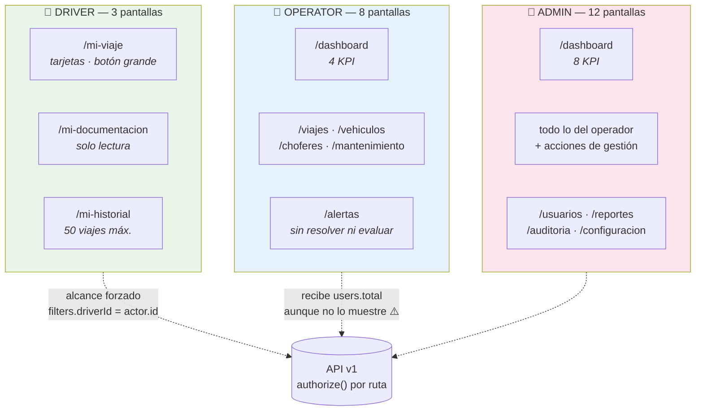
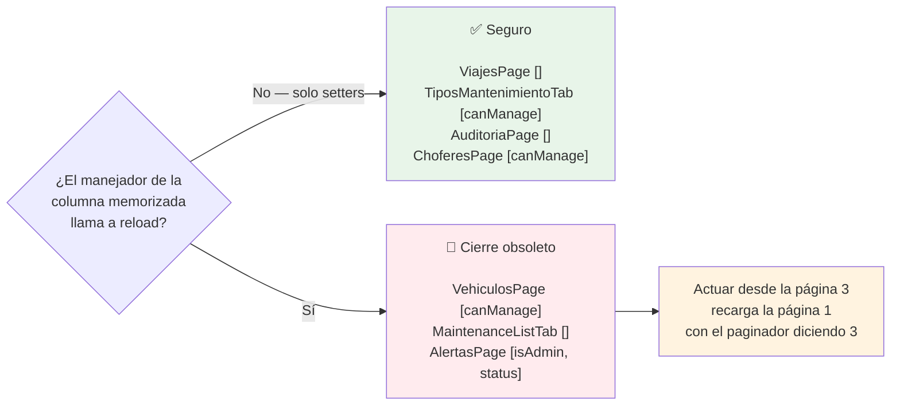
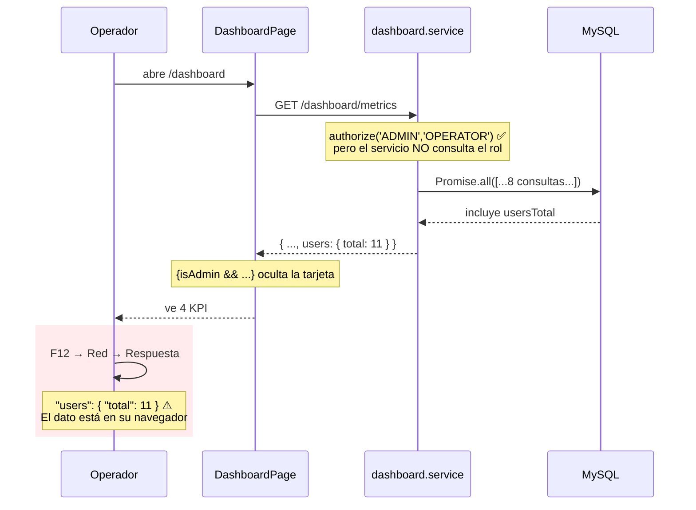

# Capítulo 22C — Pantallas del chofer, tableros y consulta

> **Archivos cubiertos** (9 archivos, 897 líneas)
>
> | Carpeta | Archivo | Líneas | Rol |
> |:--|:--|--:|:--|
> | `pages/chofer/` | `MiViajePage.tsx` | 114 | DRIVER |
> | | `MiDocumentacionPage.tsx` | 86 | DRIVER |
> | | `MiHistorialPage.tsx` | 42 | DRIVER |
> | `pages/dashboard/` | `DashboardPage.tsx` | 116 | ADMIN · OPERATOR |
> | `pages/alertas/` | `AlertasPage.tsx` | 134 | ADMIN · OPERATOR |
> | `pages/reportes/` | `ReportesPage.tsx` | 133 | ADMIN |
> | `pages/auditoria/` | `AuditoriaPage.tsx` | 92 | ADMIN |
> | | `AuditLogDetailDialog.tsx` | 98 | ADMIN |
> | `pages/configuracion/` | `ConfiguracionPage.tsx` | 124 | ADMIN |

> **Nota de método.** Igual que en 22B: el patrón de listado está explicado línea por
> línea en **§22A.3** y no se repite. Aquí interesan tres cosas nuevas que ninguna
> pantalla anterior tenía: **la interfaz de un rol distinto** (el chofer, que ve tres
> pantallas y nada más), **la presentación de datos agregados** (tableros, gráficos,
> informes) y **la consulta de datos que nadie puede modificar** (la auditoría).

---

## 22C.1 · Introducción

Este capítulo cierra el recorrido por las 29 pantallas. Las nueve que quedan tienen algo
en común que las separa de las diecinueve anteriores: **casi ninguna es un ABM**. No
crean, no editan, no borran. Muestran.

Y esa diferencia hace visible una pregunta que los capítulos anteriores no podían
plantear: **¿qué pasa cuando la interfaz es la única defensa?**

En un ABM, si la pantalla se equivoca, el servidor corrige: rechaza el 422, devuelve el
409, y el usuario ve un error. Aquí no hay nada que rechazar. Si `DashboardPage` decide
ocultar un dato al operador, y el servidor se lo envió igual, **el dato está en el
navegador del operador y solo un `if` de JavaScript lo separa de sus ojos**. Si
`ReportesPage` no acota el rango de fechas, y el backend tampoco, un informe de cien
años se calcula sin que nadie lo impida.

Los tres hallazgos principales del capítulo son de esa familia:

1. **El operador recibe `users.total` aunque la interfaz lo esconda.** Verificado en el
   servicio: el dato se calcula y se envía siempre; `DashboardPage:78` solo lo oculta
   con `{isAdmin && ...}`. Es §20.4.2 otra vez —*los guards son ergonomía, no
   seguridad*— pero aplicado a datos, no a rutas.
2. **El chofer con más de 50 viajes no puede ver los anteriores.** `MiHistorialPage`
   pide 50 elementos y **no renderiza paginador**: no hay forma de llegar al 51.
3. **`AlertasPage:88` esconde el tercer cierre obsoleto**, exactamente como predije al
   cerrar 22B a partir del `eslint-disable`. Con esto son tres pantallas con el mismo
   bug y cuatro sin él, y la regla de §22B.3.1 queda confirmada en las siete.

Y aparece un hallazgo distinto de todo lo anterior, que solo se ve leyendo esta pantalla
contra el capítulo 17: **tres campos de la configuración de la empresa no hacen nada**.
`timezone`, `language` y `dateFormat` se editan, se validan, se guardan en la base de
datos, y **ningún código del sistema los lee jamás**. La pantalla promete un control que
no existe.

---

## 22C.2 · Conceptos previos

### 22C.2.1 · La pantalla de recurso único

Las diecinueve pantallas anteriores mostraban **colecciones**: listas paginadas de
vehículos, viajes, mantenimientos. Cuatro de las de este capítulo muestran **un solo
objeto**: el viaje actual del chofer, las métricas del tablero, el informe generado, la
configuración de la empresa.

Eso cambia la anatomía. Sin colección no hay `usePaginatedList`, así que cada pantalla
vuelve a construir a mano lo que el hook resolvía:

```tsx
const [metrics, setMetrics] = useState<DashboardMetrics | null>(null);
const [loading, setLoading] = useState(true);
const [error, setError] = useState<string | null>(null);
```

Tres estados que representan los cuatro mundos posibles de un dato remoto:

| `loading` | `error` | dato | Situación |
|:--|:--|:--|:--|
| `true` | `null` | `null` | Cargando |
| `false` | texto | `null` | Falló |
| `false` | `null` | objeto | Cargado |
| `false` | `null` | `null` | **Cargó y no hay nada** |

El cuarto es el que se olvida. `MiViajePage` lo trata explícitamente —"No tenés un viaje
asignado en este momento"— y es la diferencia entre una pantalla útil y una pantalla en
blanco que parece rota.

Estas cuatro pantallas usan una técnica que ninguna anterior necesitaba: **las salidas
tempranas**.

```tsx
if (loading) return <CircularProgress />;
if (error)   return <Alert severity="error">{error}</Alert>;
if (!metrics) return null;

// a partir de aquí, metrics es DashboardMetrics, no null
```

Además de leerse mejor que un árbol de ternarios anidados, esto tiene un beneficio
concreto de TypeScript: después de `if (!metrics) return null`, el compilador **estrecha
el tipo** de `metrics` de `DashboardMetrics | null` a `DashboardMetrics`. Todo el JSX de
abajo accede a `metrics.trips.inProgress` sin un solo `?.`. El análisis de flujo de
control (§1.5.6) hace el trabajo que en las pantallas de colección hacía el `{trip && (...)}`.

### 22C.2.2 · Alcance en el servidor: cómo se protege al chofer

Las tres pantallas del chofer plantean un problema de autorización que ninguna anterior
tenía. `MiViajePage` pide "mi viaje actual" así:

```tsx
const { items } = await tripsApi.list({ page: 1, limit: 1, status: 'IN_PROGRESS' });
```

**No envía ningún identificador de chofer.** Es el mismo endpoint `GET /api/v1/trips`
que usa `ViajesPage` para mostrárselos todos a un operador. ¿Qué impide que el chofer
vea los viajes de sus compañeros?

Nada del lado del cliente. Todo del lado del servidor:

```ts
// backend/src/modules/trips/trips.service.ts:87-88
// P-CH-2/P-CH-5), regardless of any driverId passed in the query.
if (actor.role === 'DRIVER') filters.driverId = actor.id;
```

El servicio **sobrescribe** el filtro con la identidad del token. La frase clave del
comentario es *"regardless of any driverId passed in the query"*: si un chofer curioso
llamara a `GET /trips?driverId=7`, esa línea pisa el 7 con su propio id. No lo rechaza
con un 403 —simplemente lo ignora—, que para una consulta es la respuesta correcta.

Y hay una segunda barrera para el acceso individual:

```ts
// trips.service.ts:99
if (actor.role === 'DRIVER' && trip.driverId !== actor.id) {
```

Esta sí lanza. Cubre `GET /trips/:id`, donde no hay filtro que sobrescribir.

**Este es el patrón correcto y conviene nombrarlo:** *alcance forzado por el servidor*
(*server-side scoping*). El cliente no elige qué datos pide; el servidor decide qué
datos existen para quien pregunta. La alternativa —un endpoint `/my-trips` separado—
duplicaría código; la peor alternativa —confiar en que el cliente mande el `driverId`
correcto— sería el bug de referencia directa a objetos (IDOR) que §7.3.3 describió.

**El contraste con `MiDocumentacionPage` es instructivo.** Esa sí manda el id:

```tsx
const driverId = user?.id ?? 0;
documentsApi.list(driverId);          // GET /drivers/:id/documents
```

Porque el endpoint es *por chofer* y también lo usa el administrador. Ahí la protección
no puede ser sobrescribir un filtro: es la comprobación explícita `assertCanAccess` del
capítulo 11, que permite el acceso si el solicitante es administrador **o** si el id
coincide con el suyo. Dos endpoints, dos formas de proteger, ambas en el servidor.

### 22C.2.3 · Agregación: por qué el tablero no calcula nada

`DashboardPage` muestra ocho números y un gráfico. Podría haberlos calculado en el
cliente: pedir todos los viajes, contar los que están `IN_PROGRESS`, agrupar por mes.
**No lo hace**, y la razón es la del capítulo 16.

Contar en el cliente exige **traer todo lo que se va a contar**. Con 50.000 viajes
históricos, mostrar "3 viajes en curso" costaría descargar 50.000 objetos JSON —decenas
de megabytes— para descartar 49.997. La base de datos, en cambio, responde
`SELECT COUNT(*) WHERE status = 'IN_PROGRESS'` recorriendo un índice, y devuelve el
número 3.

La regla general:

> **Agregar donde están los datos.** El cliente pide números, no filas.

`dashboardApi.metrics()` devuelve un solo objeto con los ocho números ya calculados y la
serie mensual ya agrupada. La pantalla solo pinta. Esa es también la razón de que no
tenga estado derivado ni `useMemo`: no hay nada que derivar.

### 22C.2.4 · Recharts: cómo se dibuja un gráfico en React

Es la única librería del proyecto que aparece en una sola pantalla, y conviene explicar
qué hace porque su modelo de programación no se parece al del resto.

```tsx
<ResponsiveContainer width="100%" height="100%">
  <BarChart data={metrics.tripsPerMonth}>
    <CartesianGrid strokeDasharray="3 3" vertical={false} />
    <XAxis dataKey="month" />
    <YAxis allowDecimals={false} />
    <RechartsTooltip />
    <Bar dataKey="count" name="Viajes" fill="#1e88e5" radius={[4, 4, 0, 0]} />
  </BarChart>
</ResponsiveContainer>
```

Recharts es **declarativo**: en lugar de llamar a métodos para dibujar (como haría un
`<canvas>` o D3 puro), se describe el gráfico con componentes de React. `<XAxis>` no
dibuja un eje: le dice al `<BarChart>` padre que existe un eje X y qué campo usar. El
`BarChart` recoge esa información de sus hijos, calcula la geometría y emite **SVG**.

Que el resultado sea SVG y no `<canvas>` tiene consecuencias prácticas: cada barra es un
elemento del DOM, así que se puede inspeccionar, estilar con CSS y —lo importante—
escala sin pixelarse en pantallas de alta densidad. El precio es que con miles de puntos
el DOM se vuelve pesado; con doce meses, irrelevante.

**`dataKey`** es el vínculo entre los datos y el dibujo. `metrics.tripsPerMonth` es un
array de objetos `{ month: "2026-03", count: 12 }`; `dataKey="month"` le dice al eje X
qué propiedad leer, y `dataKey="count"` le dice a la barra cuál medir. Es *string-typed*:
si el backend renombrara `count` a `total`, TypeScript **no** avisaría y el gráfico
saldría vacío. Es la única parte del frontend donde el contrato con el servidor no está
verificado por el compilador.

**`ResponsiveContainer`** mide su elemento padre y redimensiona el gráfico. Exige que el
padre tenga altura explícita —de ahí el `<Box sx={{ height: 320 }}>` de la línea 101—
porque un contenedor de altura `100%` dentro de un padre sin altura mide cero, y el
gráfico desaparece. Es el error más común con Recharts y aquí está bien resuelto.

**`allowDecimals={false}`** en el eje Y: sin esta prop, Recharts puede elegir marcas
como 0 · 2,5 · 5 · 7,5 · 10. Medio viaje no existe. Un detalle pequeño y correcto.

**`fill="#1e88e5"`** es un color en crudo. Todo el resto del proyecto usa el tema de MUI
(§18.8), donde el color primario está definido una vez. Aquí se escribió el
hexadecimal —que casualmente coincide con `primary.main`— rompiendo el vínculo: si
alguien cambia el tema, el gráfico se queda con el azul viejo. Recharts no accede al
tema de MUI automáticamente, pero `useTheme()` lo resolvería en una línea.

---

## 22C.3 · Las tres pantallas del chofer

El chofer es el único rol con una interfaz propia. `RouteMap` de rutas (§21.6) le da
acceso a exactamente tres pantallas —`/mi-viaje`, `/mi-documentacion`,
`/mi-historial`— y ninguna otra. Es un subconjunto tan pequeño que casi es otra
aplicación.

Y se nota en el diseño. Estas tres pantallas **no usan `DataTable`**. Usan `<Card>`
apiladas verticalmente, botones grandes, y una jerarquía visual simple:

```tsx
<Button variant="contained" color="error" fullWidth size="large" onClick={...}>
  Cerrar hoja de ruta
</Button>
```

`fullWidth size="large"` sobre el botón principal. Es el único botón así del proyecto, y
la razón es evidente en cuanto se piensa en el contexto de uso: **el chofer está en la
cabina de un camión, probablemente con el teléfono, posiblemente con guantes**. Una
tabla con iconos de 20 píxeles no sirve. Las otras 26 pantallas asumen un escritorio;
estas tres asumen un móvil.

Es una decisión de diseño deliberada y correcta, y merece señalarse porque el proyecto
no la documenta en ningún lado: se deduce leyendo el código.

### 22C.3.1 · `MiViajePage` (114 líneas)

```tsx
/** Driver's current trip (P-CH-2). The list endpoint already scopes to the
 *  driver's own trips server-side. */
```

**Líneas 20-21.** El comentario es correcto y verificado contra `trips.service.ts:88`.
Es exactamente la clase de comentario que este manual valora: explica **por qué esta
llamada sin identificador es segura**, que es la pregunta que se hace cualquiera al
leer la línea 32.

```tsx
const { items } = await tripsApi.list({ page: 1, limit: 1, status: 'IN_PROGRESS' });
setTrip(items[0] ?? null);
```

**Líneas 32-33.** Una lista paginada usada para traer **un solo objeto**. `limit: 1` y
tomar el primer elemento.

Funciona porque RN-19 garantiza que un chofer tiene como máximo un viaje activo —y el
backend lo asegura con la fila del chofer bloqueada dentro de la transacción (§12.4.3).
Así que `items` tiene cero o un elemento, nunca dos.

Es una decisión razonable: reutiliza un endpoint existente en lugar de añadir
`GET /trips/current`. El precio es que **la interfaz depende de una regla de negocio para
ser correcta**. Si RN-19 se relajara —permitir que un chofer lleve dos viajes—, esta
pantalla mostraría uno arbitrario sin avisar. El `?? null` no distingue "no hay ninguno"
de "hay tres y te muestro el primero".

Un comentario que dijera *"RN-19 garantiza a lo sumo uno"* costaría una línea y ataría
la suposición a la regla que la sostiene.

```tsx
async function load() { /* ... */ }

useEffect(() => { void load(); }, []);
```

**Líneas 28-43.** `load` está declarada **fuera** del efecto para poder reutilizarla
desde `onSaved` (línea 101). Es el motivo por el que no está envuelta en `useCallback`:
el efecto tiene dependencias `[]` y no la incluye.

Aquí eso es **correcto**, y por una razón distinta a la de §22B.3.1. No es que `load` sea
estable —se recrea en cada render— sino que **el efecto solo debe correr al montar**. Si
`load` estuviera en las dependencias, el efecto correría en cada render, `load` llamaría
a `setTrip`, `setTrip` provocaría un render, el render recrearía `load`... el bucle
infinito de §21.4.1.

Con `[]` el efecto corre una vez con la `load` del primer render, que hace exactamente lo
mismo que cualquier otra: no cierra sobre estado, solo sobre `setTrip`, `setLoading` y
`setError`, los tres estables. **No hay cierre obsoleto** porque no hay nada obsoleto que
capturar.

**⚠️ No hay bandera `cancelled`.** Si el chofer sale de la pantalla mientras la petición
vuela, `setTrip` y `setLoading` se ejecutan sobre un componente desmontado. En React 18
eso es inocuo (§22B.4.3), pero es inconsistente: cuatro pantallas del proyecto sí la
tienen, incluida `MiDocumentacionPage`, su vecina de carpeta.

```tsx
if (!trip) {
  return (
    <Card><CardContent>
      <Stack spacing={1} alignItems="center" sx={{ py: 4 }}>
        <LocalShippingIcon sx={{ fontSize: 48, color: 'text.disabled' }} />
        <Typography color="text.secondary">No tenés un viaje asignado en este momento.</Typography>
      </Stack>
    </CardContent></Card>
  );
}
```

**Líneas 54-65.** El **estado vacío** hecho bien: un icono grande y apagado, una frase en
segunda persona del voseo rioplatense, y nada más. Sin botones, porque el chofer no puede
hacer nada al respecto: los viajes se los asigna un operador.

Compárese con `MiHistorialPage:20` —"Todavía no realizaste viajes."— y con
`MiDocumentacionPage:58` —"No tenés documentos cargados. Los carga el administrador."
Las tres están escritas con el mismo cuidado, y la tercera hace algo más: **explica quién
resuelve el problema**. Un chofer sin documentos no puede que le asignen viajes (RN-4), y
esa frase le dice a quién reclamar.

Es la parte mejor redactada del proyecto y contrasta con los mensajes de error de Zod en
inglés que llegan a la misma interfaz (§22B.5.3).

```tsx
<Row label="N° de viaje" value={`VJ-${String(trip.id).padStart(6, '0')}`} />
```

**Línea 77.** **⚠️ `padStart(6, ...)`** — seis dígitos.

`ViajesPage:72` y `TripDetailDialog:31` usan **cinco**:

```tsx
render: (t) => `VJ-${String(t.id).padStart(5, '0')}`
```

El mismo viaje es `VJ-00042` para el operador y `VJ-000042` para el chofer. Cuando el
chofer llama por radio para consultar por el viaje 000042, el operador busca 00042 y no
lo encuentra a la primera.

Es trivial de corregir y perfectamente invisible en una revisión de código: los dos
archivos son correctos por separado. Solo se ve poniéndolos uno al lado del otro. Y es
el argumento más concreto a favor de una constante compartida —`formatTripCode(id)`— que
cualquier razonamiento abstracto sobre duplicación.

```tsx
{trip.estimatedDistanceKm != null && <Row label="Distancia estimada" value={`${trip.estimatedDistanceKm} km`} />}
```

**Línea 82.** El campo del hallazgo 3 de §22B: **siempre `NULL`**, así que esta fila
**nunca se pinta**. Código muerto por dependencia de un dato que nadie escribe.

Nótese la diferencia con `TripDetailDialog:41`, que en la misma situación muestra un
guion. Aquí la fila desaparece; allí queda un "—". Dos formas de tratar la ausencia, y la
de aquí es mejor: en una pantalla móvil, una fila vacía es ruido.

```tsx
<FinishTripDialog open={finishOpen} trip={trip} onClose={...} onSaved={...} />
```

**Líneas 97-102.** **El mismo diálogo que usa el operador**, importado desde
`../viajes/FinishTripDialog`. Es la única pieza compartida entre la interfaz del chofer y
la del resto, y es reutilización legítima: la operación es idéntica, la regla RN-5 es la
misma, y el backend no distingue quién llama.

Verifiqué que el chofer tiene permiso: `POST /trips/:id/finish` está autorizado para
`ADMIN`, `OPERATOR` y `DRIVER`, con la comprobación adicional de que el viaje sea suyo
(`trips.service.ts:259`). La interfaz y el backend coinciden.

El botón que lo abre dice **"Cerrar hoja de ruta"**, no "Finalizar viaje". Es el
vocabulario del oficio, no el del modelo de datos. El diálogo que se abre, en cambio,
dice "Finalizar viaje" en su título — porque es el mismo componente que ve el operador.
Una inconsistencia de vocabulario que nace de la reutilización.

### 22C.3.2 · `MiDocumentacionPage` (86 líneas) — el distintivo correcto sobre la fecha equivocada

```tsx
/**
 * Driver's own documentation (P-CH-3), read-only: the driver can view and
 * open their documents but not upload them — uploading is Admin-only
 * (compliance decision). New documents are loaded by the Admin.
 */
```

**Líneas 16-20.** Un comentario que documenta **una decisión y su motivo**, no una
implementación. "Compliance decision" es la respuesta a "¿por qué el chofer no puede
subir su propia licencia renovada?": porque si pudiera, el registro de documentación
dejaría de ser una verificación y pasaría a ser una declaración jurada. Alguien tiene que
mirar el papel.

Es el mejor comentario del frontend.

```tsx
const driverId = user?.id ?? 0;

useEffect(() => {
  if (!driverId) return;
  let cancelled = false;
  // ...
}, [driverId]);
```

**Líneas 23-38.** El `?? 0` seguido de `if (!driverId) return` es una forma indirecta de
decir "si no hay usuario, no hagas nada". Funciona porque ningún id de usuario es 0
(`AUTO_INCREMENT` empieza en 1), pero **usa un valor válido del dominio como centinela**,
que es un antipatrón conocido: el día que un id 0 sea posible, la guarda falla en
silencio.

`const driverId = user?.id` sin el `?? 0`, con `if (driverId === undefined) return`, dice
lo mismo sin la suposición.

En la práctica el caso no ocurre: esta pantalla vive dentro de `ProtectedRoute`
(§20.4.1), así que `user` siempre existe. La guarda es defensa en profundidad.

**La bandera `cancelled` está bien implementada**, en las tres ramas de la promesa
(`then`, `catch`, `finally`). Es una de las cinco del proyecto —junto con `App.tsx:40`,
`AddressAutocomplete:29`, `DashboardPage:29` y `ConfiguracionPage:28`— y las cinco están
en pantallas de recurso único. Ninguno de los seis diálogos de §22B la tiene. La
distribución sugiere que se escribieron en momentos distintos, con criterios distintos.

```tsx
{d.expired && <Chip size="small" label="Vencido" color="error" />}
<Typography variant="caption" color="text.secondary">
  Vence: {new Date(d.expiryDate).toLocaleDateString('es-AR')}
</Typography>
```

**Líneas 69-73.** 🔴 **Aquí está el bug de §22A.4, y en su versión más embarazosa.**

Dos datos sobre el mismo documento, uno al lado del otro:

- **`d.expired`** es un booleano **calculado por el backend**, comparando la fecha de
  vencimiento contra `utcStartOfToday()` (§11.4.2). Es correcto: RN-1 dice que un
  documento vence *al final* del día de su fecha, y así se implementa.
- **`d.expiryDate`** es una columna `DATE`, que llega como `"2026-08-05T00:00:00.000Z"`.
  `new Date(...)` la interpreta como medianoche UTC; `toLocaleDateString('es-AR')` la
  convierte a hora argentina restando tres horas → las 21:00 del **4 de agosto** →
  muestra **04/08/2026**.

Así que el 5 de agosto de 2026, un chofer con la licencia venciendo ese mismo día ve:

```
Licencia                    (sin distintivo de vencido)
Vence: 04/08/2026
```

**El distintivo es correcto** —la licencia todavía sirve hoy, RN-1— **y la fecha dice
que venció ayer**. La pantalla se contradice a sí misma en dos líneas consecutivas.

Y el chofer que actúe sobre lo que lee —"se me venció, dejo de manejar"— actuará sobre el
dato equivocado. Al revés también: el 6 de agosto verá "Vence: 05/08/2026" **con** el
distintivo rojo, lo que al menos es coherente, pero un día tarde en la percepción.

Es el mismo error que `ChoferesPage:53`, `VehiculosPage:90` y `DriverDocumentsDialog:168`,
y este es el peor de los cuatro por dos razones: es el que ve la persona directamente
afectada, y es el único que aparece junto a un dato correcto que lo desmiente.

La corrección, con la regla fijada en §22B.2.4:

```tsx
Vence: {d.expiryDate.slice(0, 10).split('-').reverse().join('/')}
```

**⚠️ Y una asimetría de estados.** La pantalla trata "cargando" y "vacío" con dos
`<Typography>` distintos, pero **no muestra el número de documentos ni cuáles faltan**.
El backend conoce los cuatro tipos obligatorios (`DNI`, `LICENSE`, `ART`,
`PSYCHOPHYSICAL`) y el diccionario `DOC_LABELS:9-14` los tiene enumerados. Un chofer con
tres de cuatro ve tres tarjetas y no tiene forma de saber cuál falta — aunque esa
carencia es exactamente lo que le impedirá que le asignen un viaje (RN-4).

Recorrer `DOC_LABELS` y pintar los ausentes en gris con "Falta cargar" convertiría la
pantalla de un listado en una lista de verificación. Son unas diez líneas y cambia para
qué sirve la pantalla.

### 22C.3.3 · `MiHistorialPage` (42 líneas) — el hook a medias

La pantalla más corta del proyecto, y con el bug más fácil de pasar por alto.

```tsx
const { items, loading, error } = usePaginatedList<Trip>(fetchFn, 50);
```

**Línea 13.** Se usa el hook de paginación y se destructuran **tres** de sus once
valores. Los que no se toman son `total`, `page`, `setPage`, `limit`, `setLimit`,
`reload` y `hasMore`.

Y en el JSX no hay `<DataTable>`, ni `<TablePagination>`, ni un botón de "cargar más".
Solo un `.map` sobre `items` dentro de un `<Stack>`.

🔴 **Consecuencia: el chofer nunca puede ver más de 50 viajes.** El segundo argumento del
hook es el límite inicial, así que la petición es `?page=1&limit=50`. Devuelve los 50 más
recientes. **No existe ninguna interacción en la pantalla que cambie `page`.** El viaje
número 51 es inalcanzable.

Peor: **no hay ninguna señal de que falte algo**. `total` está disponible en el hook y no
se muestra. Un chofer con 200 viajes ve 50 tarjetas, llega al final, y no tiene forma de
saber si eso es todo su historial o solo el principio. La pantalla miente por omisión.

Para un chofer con dos años de antigüedad y un viaje cada dos días, 50 viajes son cinco
meses. **No es un límite teórico.**

Hay tres correcciones posibles, en orden creciente de esfuerzo:

1. **Mostrar `total`.** Una línea: "Mostrando 50 de 213 viajes". No arregla el acceso,
   pero elimina la mentira.
2. **Añadir `<TablePagination>`** con `page`/`setPage`, que ya están en el hook. Cinco
   líneas.
3. **Desplazamiento infinito** con `hasMore`, que es lo natural en una lista de tarjetas
   en móvil.

La tercera es la que corresponde al diseño de la pantalla. La primera debería estar de
todos modos.

```tsx
const fetchFn = useCallback(
  (params: PageParams) => tripsApi.list({ ...params, status: 'COMPLETED' }),
  [],
);
```

**Líneas 9-12.** Dependencias vacías y correcto: no hay filtros, y el alcance al chofer
lo pone el servidor (§22C.2.2). El mismo caso que `TiposMantenimientoTab:15`.

```tsx
{t.finishedAt ? new Date(t.finishedAt).toLocaleDateString('es-AR') : ''} · {t.vehicle?.licensePlate ?? ''}
```

**Línea 31.** `finishedAt` es `DATETIME`, así que la conversión es **correcta**. Se pierde
la hora, que aquí importa poco.

**⚠️ El separador queda huérfano.** Si faltaran los dos valores, la línea muestra
`" · "` solo: un punto medio flotando. Con datos reales no ocurre —un viaje `COMPLETED`
siempre tiene `finishedAt` y vehículo— pero el `?? ''` está puesto justamente para el
caso que no puede pasar, y no cubre su consecuencia. Es defensa a medias: o se confía en
el dato y se quitan las guardas, o se construye la línea filtrando los vacíos.

```tsx
<Chip label="FINALIZADO" color="success" size="small" />
```

**Línea 34.** Una etiqueta **constante**. La pantalla solo pide `status: 'COMPLETED'`, así
que todas las tarjetas dicen lo mismo. No es información: es decoración que ocupa el
lugar donde podría estar el kilometraje recorrido, que sí varía y sí le interesa al
chofer.

Nótese además que **no usa `<StatusChip>`**, el componente del proyecto para exactamente
esto (§21.2.3). Escribe el distintivo a mano con el color elegido a mano. Novena vez que
se reimplementa algo que ya existe.

---

## 22C.4 · Los tableros

### 22C.4.1 · `DashboardPage` (116 líneas) — ocultar no es proteger

```tsx
useEffect(() => {
  let cancelled = false;
  (async () => {
    try {
      const data = await dashboardApi.metrics();
      if (!cancelled) setMetrics(data);
    } catch (err) {
      if (!cancelled) setError(apiErrorMessage(err));
    } finally {
      if (!cancelled) setLoading(false);
    }
  })();
  return () => { cancelled = true; };
}, []);
```

**Líneas 28-43.** Una **IIFE asíncrona**: `(async () => { ... })()`. Es la forma de usar
`async/await` dentro de un `useEffect`, porque **la función del efecto no puede ser
`async`**. Si lo fuera, devolvería una promesa, y React espera que devuelva la función de
limpieza o `undefined`; recibiría una promesa, no sabría qué hacer con ella, y la
limpieza nunca se ejecutaría.

Las dos soluciones son declarar la función aparte y llamarla (`void load()`, como
`MiViajePage:42`) o esta IIFE. La IIFE mantiene el código junto; la función aparte
permite reutilizarla. `MiViajePage` necesita reutilizarla —para recargar tras finalizar
el viaje—; aquí no hay recarga, así que la IIFE es la elección adecuada.

Y la bandera `cancelled` está en las tres ramas, correctamente.

```tsx
const isAdmin = user?.role === 'ADMIN';
```

**Línea 55.** Calculado **después** de las salidas tempranas. Es correcto —no se usa
antes— pero rompe la convención de las otras pantallas, que lo declaran junto al
`useAuth()`. Cosmético.

```tsx
{isAdmin && (
  <Grid container spacing={3} sx={{ mt: 0 }}>
    <Grid item xs={6} md={3}><KpiCard label="Vehículos totales" value={metrics.fleet.total} /></Grid>
    <Grid item xs={6} md={3}><KpiCard label="Choferes activos" value={metrics.drivers.active} /></Grid>
    <Grid item xs={6} md={3}><KpiCard label="Mantenimientos pendientes" value={metrics.maintenances.pending} /></Grid>
    <Grid item xs={6} md={3}><KpiCard label="Usuarios del sistema" value={metrics.users.total} /></Grid>
  </Grid>
)}
```

**Líneas 78-93.** ⚠️ **La fila de administrador, y el hallazgo del capítulo.**

Cuatro tarjetas que solo ve el administrador. La pregunta correcta no es si el operador
las ve —no las ve— sino **si los datos llegaron a su navegador**.

Lo verifiqué en el servidor:

```ts
// backend/src/modules/dashboard/dashboard.routes.ts:12
dashboardRoutes.use(authenticate, authorize('ADMIN', 'OPERATOR'));
```

```ts
// backend/src/modules/dashboard/dashboard.service.ts:43-50, 87
const [fleet, trips, maint, driversTotal, driversActive, usersTotal, pendingAlerts, completed] =
  await Promise.all([
    // ...
    dashboardRepository.usersTotal(),
    // ...
  ]);
// ...
users: { total: usersTotal },
```

**El servicio no consulta el rol.** Calcula las ocho métricas siempre y las devuelve
siempre. Un operador que abra las herramientas de desarrollo, pestaña Red, y mire la
respuesta de `GET /api/v1/dashboard/metrics`, encuentra:

```json
{ "fleet": { "total": 14, ... }, "drivers": { "active": 9, ... },
  "maintenances": { "pending": 3 }, "users": { "total": 11 }, ... }
```

Los cuatro números "de administrador", completos.

**¿Es grave?** No mucho. Son recuentos agregados, no datos personales: saber que hay
once usuarios no permite hacer nada. El riesgo real es cero.

**¿Importa igual?** Sí, por dos motivos.

El primero es que **la decisión no está escrita en ningún lado**. Ni un comentario en el
servicio que diga "estos totales no son sensibles, se envían a ambos roles". El `{isAdmin
&& ...}` del cliente **parece** una regla de autorización y no lo es: es una decisión de
diseño de pantalla. Quien lea el frontend concluirá que el operador no debe conocer esos
números; quien lea el backend, que sí. Uno de los dos está equivocado y el código no
dice cuál.

El segundo es el precedente. Es exactamente el razonamiento de §20.4.2 —*los guards de
ruta son ergonomía, no seguridad*— aplicado a datos en vez de rutas. Hoy el dato oculto
es inofensivo. El día que alguien añada al tablero una métrica que sí lo sea —costes,
sueldos, márgenes— y siga el patrón establecido, la ocultará con un `{isAdmin && ...}` y
la enviará igual.

**La corrección** es de tres líneas en el servicio: no calcular las métricas de
administrador si el actor no lo es, y declarar los campos opcionales en el tipo. El
cliente ya está preparado — solo hay que cambiar `{isAdmin && ...}` por
`{metrics.users && ...}`, lo que además haría la interfaz una consecuencia del dato en
vez de una decisión paralela.

**Una observación sobre las tarjetas.** Las cuatro primeras (visibles para todos) pasan
`icon` y `color` a `KpiCard`; las cuatro de administrador no. La diferencia visual es
notable —las de arriba tienen icono y color, las de abajo son texto y número— y no
responde a ninguna jerarquía informativa: las tarjetas más restringidas son las más
pobres visualmente. Parece que se añadieron después y con menos cuidado.

### 22C.4.2 · `AlertasPage` (134 líneas) — el tercer cierre obsoleto, confirmado

Al cerrar el capítulo 22B anoté que `AlertasPage:88` tiene un
`eslint-disable-next-line react-hooks/exhaustive-deps` y que había que verificar si
escondía el mismo bug. **Lo esconde.**

```tsx
const columns = useMemo<Column<Alert>[]>(
  () => [
    // ...
    ...(isAdmin && status === 'PENDING'
      ? [{
          key: 'actions', /* ... */
          render: (a: Alert) => (
            <IconButton size="small" color="success" onClick={() => handleResolve(a)}>
          ),
        }]
      : []),
  ],
  // eslint-disable-next-line react-hooks/exhaustive-deps
  [isAdmin, status],
);
```

**Líneas 65-90.** Las dependencias son `[isAdmin, status]`. El manejador llama a
`handleResolve`, que llama a `reload`:

```tsx
async function handleResolve(a: Alert) {
  setActionError(null);
  try {
    await alertsApi.resolve(a.id);
    await reload();          // ← identidad inestable, cambia con page
  } catch (err) { setActionError(apiErrorMessage(err)); }
}
```

`isAdmin` no cambia nunca durante la sesión. `status` cambia solo al pulsar una pestaña.
**Cambiar de página no recalcula las columnas.** Así que el `handleResolve` congelado
cierra sobre el `reload` del último render en que cambió `status` — es decir, el de
`page = 1`.

**El escenario:** un administrador abre "Pendientes", que tiene 45 alertas en 3 páginas.
Va a la página 3, resuelve una alerta. El `POST /alerts/:id/resolve` devuelve 200 y la
alerta se resuelve de verdad. Luego `reload()` pide la página 1. La tabla muestra las
alertas 1-20 mientras el paginador dice "página 3".

Con esto, la regla de §22B.3.1 queda verificada en las **siete** pantallas que usan el
patrón:

| Pantalla | Deps del `useMemo` | ¿Toca `reload`? | Resultado |
|:--|:--|:--|:--|
| `ViajesPage` | `[]` | No — solo setters | ✅ |
| `TiposMantenimientoTab` | `[canManage]` | No — `confirmDelete` está fuera | ✅ |
| `AuditoriaPage` | `[]` | No — solo `setDetail` | ✅ |
| `ChoferesPage` (§22A) | `[canManage]` | No | ✅ |
| `VehiculosPage` (§22A) | `[canManage]` | **Sí** (`toggleActive`) | 🔴 |
| `MaintenanceListTab` (§22B) | `[]` | **Sí** (`transition`) | 🔴 |
| **`AlertasPage`** | `[isAdmin, status]` | **Sí** (`handleResolve`) | 🔴 |

Cuatro correctas, tres con bug, y **las tres con bug son exactamente las tres que
llaman a `reload` desde una columna memorizada**. La correlación es perfecta.

Y las tres supresiones de ESLint del frontend están en `VehiculosPage`… no: están en
`UsuariosPage:123`, `AlertasPage:88` y `MaintenanceListTab:74`. Dos de las tres marcan
un bug real; la de `UsuariosPage` marca un caso correcto. Quien las escribió no sabía
distinguir cuál era cuál — que es precisamente para lo que sirve la herramienta que no
instaló.

```tsx
const ALERT_LABELS: Record<string, string> = {
  LICENSE_EXPIRING: 'Licencia por vencer',
  // ... 8 entradas
};
// ...
render: (a) => ALERT_LABELS[a.alertType] ?? a.alertType,
```

**Líneas 13-22, 67.** Un diccionario de traducción con **respaldo al código crudo**. El
comentario lo justifica: *"extensible taxonomy C-4"* — si el backend añade un tipo de
alerta y el frontend no se actualiza, la tabla muestra `NEW_ALERT_TYPE` en lugar de
romperse o mostrar un hueco. Feo pero funcional, que es lo correcto para un valor que
puede crecer del lado del servidor.

Verifiqué que las ocho entradas cubren los ocho tipos que genera el motor de alertas
(§14.4). Están completas hoy.

El tipo es `Record<string, string>` y no `Record<AlertType, string>`. Con la segunda
forma, TypeScript **exigiría** que estuvieran los ocho y avisaría al añadir un noveno.
Con `string`, el diccionario puede quedarse corto en silencio — que es justo lo que el
respaldo está ahí para tapar. Se eligió tolerancia en tiempo de ejecución sobre garantía
en tiempo de compilación; con un `satisfies Record<AlertType, string>` se tendrían las
dos.

```tsx
async function handleEvaluate() {
  setEvaluating(true);
  try {
    const r = await alertsApi.evaluate();
    setToast(`Evaluación completa: ${r.created} nuevas, ${r.autoResolved} auto-resueltas`);
    await reload();
  } // ...
}
```

**Líneas 41-53.** El disparo manual del motor de alertas del capítulo 14. Tres cosas
bien hechas:

1. **Solo para administradores**, tanto en la interfaz (`isAdmin ? <Button/> : undefined`,
   línea 97) como en el servidor (`alerts.routes.ts:23`,
   `authorize('ADMIN')`). Verificado: coinciden.
2. **`disabled={evaluating}`** impide disparar dos evaluaciones a la vez. Y aunque el
   usuario lo consiguiera, el backend lo bloquea con el `GET_LOCK` de §14.4.5. Defensa en
   dos capas.
3. **El aviso emergente informa el resultado**: cuántas alertas se crearon y cuántas se
   resolvieron solas. Sin eso, pulsar "Evaluar" y ver la misma tabla parecería un fallo —
   cuando puede significar simplemente que no había nada nuevo. Los números convierten un
   silencio ambiguo en una respuesta.

Es el uso más justificado de un `Snackbar` del proyecto.

**⚠️ Lo que "Resolver" no dice.** El botón marca una alerta como resuelta. Pero el motor
de alertas es un **reconciliador** (§14.3): en cada evaluación compara el estado real
del mundo con las alertas existentes y crea las que faltan. Si un administrador resuelve
"Seguro vencido" del vehículo ABC123 **sin renovar el seguro**, la siguiente evaluación
vuelve a crear la alerta.

Eso es correcto por diseño —el sistema no debe olvidar un problema real porque alguien
cerró la ventana— pero la interfaz no lo comunica. Un administrador que resuelve doce
alertas y las ve reaparecer al día siguiente concluirá que el sistema está roto.

Basta con una frase en el diálogo o junto al botón: *"Si la condición persiste, la alerta
volverá a generarse en la próxima evaluación."* El sistema se comporta bien; solo no lo
explica.

**⚠️ La entidad se muestra en crudo.**

```tsx
{ key: 'entity', label: 'Entidad', render: (a) => `${a.entityType} #${a.entityId}` },
```

**Línea 69.** Produce `VEHICLE #7`. El tipo de alerta ya está traducido en la columna
anterior, pero la entidad no: el usuario ve el nombre técnico de la tabla y una clave
primaria.

Lo que necesita es la patente. Y **la alerta no la trae**: la relación es polimórfica sin
clave foránea (§3.7.2, `entityType` + `entityId` sin FK), así que el backend no puede
hacer un `include`. Resolverlo requiere que el servicio de alertas resuelva la etiqueta
al construir la respuesta —un `switch` sobre `entityType` con una consulta por tipo— o
que la guarde desnormalizada al crear la alerta.

Es la primera consecuencia visible de la decisión de modelado del capítulo 3, y aparece
justo donde más duele: en la pantalla cuyo propósito es que alguien actúe.

**El único uso correcto de `Tabs` del proyecto.**

```tsx
<Tabs value={tab} onChange={(_e, v) => { setTab(v); setPage(1); }}>
```

**Línea 112.** Compárese con `MantenimientoPage:21`, que solo hace `setTab(v)`. Aquí,
como el mismo `usePaginatedList` sirve a las dos pestañas —solo cambia `status` en
`fetchFn`—, **el componente no se desmonta** y `page` sobreviviría al cambio de pestaña.
Sin el `setPage(1)`, pasar de "Pendientes" página 3 a "Resueltas" pediría la página 3 de
las resueltas, que probablemente no existe.

`MantenimientoPage` no lo necesita porque su cambio de pestaña **sí** remonta el
componente (§22B.2.5). Dos implementaciones de pestañas, dos comportamientos distintos,
y cada una hace lo correcto para su caso. Que sea por análisis o por prueba y error, no
se puede saber leyendo el código.

---

## 22C.5 · Las pantallas de consulta

### 22C.5.1 · `ReportesPage` (133 líneas) — generación bajo demanda

Es la única pantalla del proyecto que **no carga nada al abrirse**. No hay `useEffect`.
El usuario elige un período, pulsa un botón, y entonces se pide el informe.

```tsx
async function generate() {
  if (!dateFrom || !dateTo) return;
  setLoading(true);
  setError(null);
  try {
    setReport(await reportsApi.trips(dateFrom, dateTo));
  } catch (err) { setError(apiErrorMessage(err)); }
  finally { setLoading(false); }
}
```

**Líneas 33-44.** La decisión es correcta: un informe es caro de calcular (§16.4) y no
tiene un valor por defecto sensato. ¿Qué período mostraría al abrir? ¿El mes? ¿El año?
Cualquier elección sería arbitraria y costaría una consulta que quizás nadie quería.

`setReport(await ...)` — el `await` se evalúa **antes** de que `setReport` se llame, así
que es equivalente a guardar en una variable. Compacto y correcto.

**⚠️ El período no tiene tope, ni aquí ni en el servidor.**

Los dos `<input type="date">` de las líneas 53-54 no tienen `min` ni `max`. El botón solo
exige que ambos estén llenos. Y el esquema del backend:

```ts
// backend/src/modules/reports/reports.schemas.ts:8-16
export const reportQuerySchema = z
  .object({ dateFrom: z.coerce.date(), dateTo: z.coerce.date() })
  .refine((data) => data.dateTo >= data.dateFrom, {
    path: ['dateTo'], message: 'dateTo must be greater than or equal to dateFrom' });
```

Valida el **orden** —`dateTo >= dateFrom`, correctamente— y nada más. `1900-01-01` a
`2100-01-01` pasa la validación. La consulta agrupa por chofer, por vehículo y por
destino sobre doscientos años de datos.

Con los volúmenes de una PyME no pasa nada: el informe tarda unos milisegundos más. Pero
confirma §16.4.1 y es la clase de endpoint que se convierte en un problema de
disponibilidad cuando la tabla crece y alguien lo llama en un bucle. Un tope de, digamos,
dos años en el `superRefine` sería una línea.

Nótese también que **no hay exportación**. El informe se ve en pantalla y no se puede
descargar en CSV ni en PDF. Para un informe de gestión que un administrador quiere llevar
a una reunión, es la primera cosa que va a pedir. El proyecto ya tiene el helper de
descarga de blobs (`utils/blob.ts`, §19.6) usado para los adjuntos.

```tsx
function ReportTable({ title, head, rows }: { title: string; head: string[]; rows: string[][] }) {
```

**Línea 99.** Un componente local que renderiza **tres tablas distintas** con la misma
forma. La firma es deliberadamente tonta: `string[][]`. Todo se convierte a texto antes
de entrar:

```tsx
rows={report.byDriver.map((d) => [d.name, d.dni, String(d.tripCount), d.totalKm.toLocaleString('es-AR')])}
```

**Línea 81.** El formateo ocurre **fuera** del componente, que solo pinta cadenas.

Es una decisión buena y poco intuitiva. La alternativa "correcta" sería un componente
genérico `<ReportTable<T> rows={T[]} columns={Column<T>[]}>` — es decir, reinventar
`DataTable`. Para tres tablas de solo lectura sin paginación ni acciones, `string[][]` es
más simple, más fácil de leer y no tiene ningún problema real. **La generalización tiene
un coste y aquí no se paga.**

```tsx
<TableCell key={h} align={i >= head.length - 2 ? 'right' : 'left'}>{h}</TableCell>
```

**Línea 108.** Las **dos últimas** columnas se alinean a la derecha, siempre. Funciona en
las dos primeras tablas —viajes y kilómetros son numéricos— pero en la tercera,
"Destinos más frecuentes" con dos columnas (`['Destino', 'Viajes']`), `head.length - 2`
es 0, así que **las dos** se alinean a la derecha. El destino, que es texto largo, queda
pegado al borde derecho de una tabla ancha.

Es un heurístico que se rompe en el caso límite. Pasar la alineación como parámetro
—`aligns={['left', 'right']}`— costaría lo mismo y sería explícito.

```tsx
{rows.length === 0 ? (
  <TableRow><TableCell colSpan={head.length} align="center" sx={{ py: 3, color: 'text.secondary' }}>
    Sin datos en el período
  </TableCell></TableRow>
) : ( /* ... */ )}
```

**Líneas 113-118.** Estado vacío **por tabla**, no por pantalla. Un período sin viajes
muestra las tres tablas con su encabezado y "Sin datos en el período" en cada una — en
lugar de tres cajas vacías. `colSpan={head.length}` hace que la celda ocupe todo el
ancho.

Correcto, y el detalle que más se olvida al construir tablas a mano.

```tsx
{rows.map((r, ri) => (<TableRow key={ri}>
```

**Línea 121.** `key={ri}` — **el índice como clave**. §18.5.4 explicó por qué suele ser
un error: si la lista se reordena o se inserta en medio, React asocia mal el estado de
cada fila.

Aquí es **inofensivo**, y por una razón precisa: las filas no tienen estado interno (son
texto), no se reordenan (llegan ordenadas del servidor), y la lista completa se reemplaza
de golpe al generar un informe nuevo. El único caso en que el índice como clave es
seguro, y este lo cumple.

Vale la pena saber *por qué* es seguro aquí, no asumir que "el índice como clave siempre
está mal".

### 22C.5.2 · `AuditoriaPage` y `AuditLogDetailDialog` — leer lo que nadie puede cambiar

`AuditoriaPage` es el patrón de §22A.3 casi sin variaciones: cuatro filtros, un
`useCallback`, `usePaginatedList`, `DataTable`, un diálogo de detalle. Tres observaciones.

**1. Es la única pantalla sin ninguna acción de escritura.** No hay botón de crear, ni de
editar, ni de borrar. El menú es un icono de ojo. Es la traducción a la interfaz de la
propiedad que el capítulo 15 llamó **inmutabilidad por ausencia**: el módulo de auditoría
no expone endpoints de escritura, así que no hay nada que dibujar. La pantalla es
consecuencia del backend, no una decisión propia.

Coherentemente, es también la única que **no destructura `reload`** del hook: no hay nada
que recargar salvo cambiando un filtro.

**2. Los catálogos están escritos a mano.**

```tsx
const ENTITIES = ['USER', 'DRIVER', 'VEHICLE', 'MAINTENANCE_TYPE', 'MAINTENANCE', 'DRIVER_DOCUMENT', 'TRIP', 'ALERT'];
const ACTIONS = ['CREATE', 'UPDATE', 'DELETE', 'ACTIVATE', 'DEACTIVATE', 'ASSIGN', 'FINISH', 'RESOLVE', 'VIEW_CREDENTIALS'];
```

**Líneas 10-11.** Diecisiete cadenas que deben coincidir con los valores que el backend
escribe en `audit_logs`. Son `string[]`, no un tipo unión, así que TypeScript no verifica
nada: si el backend empieza a registrar `EXPORT`, el filtro no lo ofrece y nadie se
entera.

Y a diferencia de `ALERT_LABELS`, **no se traducen**. La tabla muestra `VIEW_CREDENTIALS`
y `MAINTENANCE_TYPE` tal cual. Para una pantalla que solo ve el administrador es
defendible; para una pantalla cuyo propósito es que alguien audite qué pasó, un
diccionario de nueve entradas convertiría `VIEW_CREDENTIALS` en "Consultó credenciales",
que es lo que interesa saber.

Es el mismo problema de `AlertasPage` con las entidades, y aquí es más agudo: se
mezclan el nombre de la tabla y el de la acción, ambos en jerga técnica, en la pantalla
que debería contar una historia legible.

**3. `useMemo` con `[]` — y es seguro.** El único manejador llama a `setDetail`. Cuarto
caso correcto de la tabla de §22C.4.2.

**El diálogo de detalle** tiene la pieza más interesante:

```tsx
function Snapshot({ data }: { data: unknown }) {
  if (data === null || data === undefined) return <Typography>—</Typography>;
  if (typeof data !== 'object') return <Typography>{String(data)}</Typography>;
  const entries = Object.entries(data as Record<string, unknown>);
  if (entries.length === 0) return <Typography>—</Typography>;
  return (
    <Box component="dl" sx={{ m: 0 }}>
      {entries.map(([key, value]) => ( /* clave a la izquierda, valor a la derecha */ ))}
    </Box>
  );
}
```

**Líneas 16-41.** Recibe `unknown` —el tipo honesto para una columna `JSON`— y lo
**estrecha con comprobaciones sucesivas** antes de usarlo. `unknown` obliga a esto:
TypeScript no deja hacer `Object.entries(data)` hasta haber demostrado que es un objeto.
Es el uso correcto de `unknown` frente a `any`, que habría permitido cualquier cosa sin
avisar (§1.5.4).

El `<Box component="dl">` renderiza una **lista de definiciones** de HTML, el elemento
semánticamente correcto para pares clave-valor. Detalle de accesibilidad que casi nadie
aplica. *(Aunque no emite `<dt>`/`<dd>` para cada par, solo `<div>`s, así que la
semántica queda a medias.)*

```tsx
function formatValue(value: unknown): string {
  if (value === null || value === undefined) return '—';
  if (typeof value === 'object') return JSON.stringify(value);
  return String(value);
}
```

**Líneas 43-47.** ⚠️ **Aquí hay una conexión con el capítulo 15 que conviene dejar
anotada.**

`Snapshot` recorre **un solo nivel**: `Object.entries` da las claves de primer nivel, y
cualquier valor que sea un objeto se aplana con `JSON.stringify` a una sola línea de
texto.

Y `sanitize()` del backend (§15.4.3) **también recorre un solo nivel**:

```ts
for (const [key, value] of Object.entries(plain)) {
  result[key] = SENSITIVE_FIELDS.has(key) ? '[REDACTED]' : value;
}
```

Las dos limitaciones se alinean mal. Si algún módulo registrara un snapshot con un objeto
anidado que contuviera `passwordHash` —por ejemplo `{ user: { passwordHash: "..." } }`—
`sanitize` **no lo redactaría**, porque solo mira las claves de primer nivel (`user`), y
`formatValue` lo **imprimiría en pantalla** con `JSON.stringify`.

**Verifiqué que hoy no ocurre**: los trece módulos construyen sus snapshots con listas
blancas de campos planos (§9.6.1, §11.5.2), así que ningún objeto anidado con datos
sensibles llega a `audit_logs`. **No es un fallo actual.** Es una fragilidad: la
protección depende de una disciplina de trece módulos, no de un mecanismo. El día que
alguien pase un objeto de Prisma con un `include`, las dos capas fallan juntas.

Hacer `sanitize` recursivo es el arreglo correcto, y está en el backend, no aquí.

```tsx
<Typography variant="subtitle2" gutterBottom>Antes</Typography>
{/* ... */}
<Typography variant="subtitle2" gutterBottom>Después</Typography>
```

**Líneas 69 y 75.** Los dos snapshots, lado a lado en pantallas medianas
(`xs={12} md={6}`) y apilados en móvil. Es la presentación correcta para una comparación.

**Lo que falta es el resaltado de diferencias.** Con quince campos, encontrar cuál cambió
exige leer las dos columnas en paralelo. Un `previousData[key] !== newData[key]` para
pintar en negrita las claves que cambiaron son cinco líneas, y convierte la pantalla de
"aquí están los dos estados" en "esto es lo que pasó" — que es lo que un auditor
necesita.

Y **`Info` es la cuarta copia** del mismo componente de etiqueta y valor: `Field` en
`TripDetailDialog`, `Detail` en `MaintenanceDetailDialog`, `Row` en `MiViajePage`, `Info`
aquí. Cuatro nombres, cuatro archivos, prácticamente el mismo cuerpo, ninguno exportado.

### 22C.5.3 · `ConfiguracionPage` (124 líneas) — tres campos que no hacen nada

```tsx
function setField<K extends keyof CompanySettings>(key: K, value: CompanySettings[K]) {
  setSettings((prev) => (prev ? { ...prev, [key]: value } : prev));
}
```

**Líneas 37-39.** La pieza de TypeScript más elegante del frontend, y merece desarme
completo.

`K extends keyof CompanySettings` es un **genérico acotado**: `K` puede ser cualquiera de
las claves del tipo —`'companyName' | 'taxId' | 'address' | ...`— pero solo esas. Y
`value: CompanySettings[K]` es un **tipo indexado**: el tipo del valor **depende de la
clave concreta** que se haya pasado.

El resultado es que estas dos llamadas se comprueban de forma distinta:

```tsx
setField('companyName', 'ACME S.A.');   // ✅ K = 'companyName', value debe ser string
setField('companyName', 42);            // ❌ Error de compilación
```

Con una firma ingenua —`setField(key: string, value: unknown)`— nada de eso se
verificaría. Ocho campos protegidos con una función de tres líneas, y añadir un noveno al
tipo lo incluye automáticamente.

`setSettings((prev) => ...)` usa la **forma funcional** del setter. Es la correcta cuando
el valor nuevo depende del anterior: React garantiza que `prev` es el estado más
reciente, incluso si hay varias actualizaciones agrupadas en el mismo ciclo. Con
`setSettings({ ...settings, [key]: value })` y dos cambios en el mismo tick, el segundo
partiría del `settings` capturado en el render y perdería el primero.

`[key]: value` es una **clave computada**: los corchetes hacen que el nombre de la
propiedad sea el valor de la variable `key`, no la cadena `"key"`.

**El estado del servidor es el estado del formulario.**

`settings` es a la vez lo que vino del servidor y lo que el usuario está editando. No hay
copia. Eso tiene una consecuencia: **no se puede descartar cambios**. Si el
administrador modifica cuatro campos y se arrepiente, la única salida es recargar la
página.

También significa que no se puede saber **si hay cambios sin guardar**. El botón
"Guardar cambios" está siempre habilitado —salvo mientras guarda— aunque no se haya
tocado nada, y si el usuario navega a otra pantalla con cambios pendientes, se pierden en
silencio.

Guardar el objeto original en un `useRef` al cargar permitiría comparar y resolver las
tres cosas: deshabilitar el botón sin cambios, ofrecer "Descartar", y avisar al salir.

```tsx
const { companyName, taxId, address, phone, email, timezone, language, dateFormat } = settings;
const updated = await settingsApi.update({ companyName, taxId, address, phone, email, timezone, language, dateFormat });
```

**Líneas 47-48.** Se desestructuran los ocho campos editables y se reconstruye el objeto
a mano, en lugar de enviar `settings` entero.

Es **deliberado y correcto**: `settings` incluye campos que el servidor no acepta —`id`,
`updatedAt`— y mandarlos provocaría un rechazo del esquema Zod, o peor, se ignorarían en
silencio. Enumerar lo que se envía hace explícito el contrato.

Es la misma disciplina que el `validate` con Zod del backend (§7.4.3) aplicada en la otra
dirección: el cliente tampoco manda de más.

`setSettings(updated)` con la **respuesta del servidor**, no con lo que se envió. Si el
servidor normalizara algo —recortar espacios, poner el CUIT en mayúsculas— el formulario
lo refleja. Correcto.

**⚠️ Tres campos que no hacen nada.**

```tsx
<TextField label="Zona horaria" value={settings.timezone} onChange={(e) => setField('timezone', e.target.value)} fullWidth required />
<TextField label="Idioma" value={settings.language} onChange={(e) => setField('language', e.target.value)} fullWidth required />
<TextField label="Formato de fecha" value={settings.dateFormat} onChange={(e) => setField('dateFormat', e.target.value)} fullWidth required />
```

**Líneas 100-108.** Los tres campos de "Preferencias del sistema" se editan, se validan,
se guardan en la base de datos… y **nadie los lee**.

Busqué los tres identificadores en todo el código del backend y del frontend, excluyendo
el propio módulo de configuración. Las únicas apariciones de `timezone` y `dateFormat`
son **comentarios** que hablan del problema de las zonas horarias en `dates.ts`,
`trips.repository.ts` y `datetime.ts`. `language` no aparece en ningún sitio.

Las consecuencias, una por una:

- **`timezone`** no se usa. Toda la lógica de fechas del backend trabaja en UTC
  (`utcStartOfToday`, `utcEndOfDay`) y todo el formateo del frontend usa la zona del
  navegador (`toLocaleString`). Poner `"America/Argentina/Ushuaia"` no cambia nada.
- **`language`** no se usa. La interfaz está en español fijo y los mensajes de Zod en
  inglés fijo (§22B.5.3). No hay i18n.
- **`dateFormat`** no se usa. Todas las fechas se formatean con `'es-AR'` escrito
  literalmente en veintitantos sitios.

Los tres campos son `required`: el administrador **está obligado** a rellenar tres cosas
que no producen ningún efecto. La pantalla promete un control que no existe.

Esto no es un bug —nada se rompe— pero es la clase de deuda más cara de todas: **la
funcionalidad aparente**. Alguien va a cambiar el formato de fecha, va a ver que no
cambia nada, y va a reportar un error que no existe. O peor: no lo va a reportar, y va a
concluir que el sistema está roto en general.

Hay tres salidas honestas, en orden de esfuerzo: quitar los tres campos; dejarlos
deshabilitados con un "Próximamente"; o implementarlos —`dateFormat` es el más fácil, con
un helper de formateo centralizado que los veintitantos `toLocaleDateString` deberían
usar de todos modos (§22A.4).

**⚠️ Sin validación de formato.** `taxId` es el CUIT, que tiene un formato conocido
(`XX-XXXXXXXX-X` con dígito verificador). El campo lo acepta todo. `email` sí tiene
`type="email"`, que activa la validación nativa del navegador. `phone` no tiene ninguna.

**⚠️ El aviso emergente dice "Configuración guardada" y no dice qué.** Con dos tarjetas y
ocho campos, un aviso más específico ayudaría poco; el problema real es el anterior — que
tres de los ocho no hicieron nada y el mensaje afirma lo contrario.

---

## 22C.6 · Flujo interno: el día del chofer

```
07:30  El chofer abre la aplicación en el móvil.
       LoginPage → POST /auth/login
       → JWT de acceso (15 min) en memoria + cookie httpOnly de refresco (7 días)
       → useAuthStore guarda { user, accessToken }
       → RouteMap ve role === 'DRIVER' y renderiza SOLO tres rutas
       → redirección a /mi-viaje

07:31  MiViajePage monta.
       GET /trips?page=1&limit=1&status=IN_PROGRESS
       → authenticate: verifica la firma del JWT              (§7.2)
       → trips.service.ts:88: filters.driverId = actor.id     ← el alcance forzado
       → devuelve 0 elementos
       → items[0] ?? null → trip = null
       → "No tenés un viaje asignado en este momento."

08:15  Un operador le asigna el viaje 87 desde AssignTripDialog.
       El chofer NO se entera: no hay WebSocket, ni sondeo, ni notificación.
       Su pantalla sigue diciendo que no tiene viaje.

08:20  El chofer recarga (o vuelve a entrar a la pantalla).
       Ahora sí: VJ-000087, destino, vehículo, mapa, y el botón grande.

08:22  Toca "Ver recorrido en Google Maps" y sale de la aplicación.
       RouteMap sin clave → enlace externo → se abre la aplicación de Maps.

16:40  Vuelve. El JWT de acceso caducó hace horas.
       Pulsa "Cerrar hoja de ruta" → FinishTripDialog → escribe 152340.
       POST /trips/87/finish → 401 (token caducado)
       → el interceptor de Axios lo captura                   (§19.4.3)
       → POST /auth/refresh con la cookie
       → nuevo par de tokens, rotación del de refresco
       → reintenta el POST original → 200
       El chofer no ve nada de esto. Ni un parpadeo.

16:40  onSaved() → void load() → GET /trips?...&status=IN_PROGRESS
       → 0 elementos → "No tenés un viaje asignado en este momento."

16:41  Va a /mi-historial. El viaje 87 está arriba de todo.
       Si es su viaje número 51 o posterior... también está arriba,
       porque la lista está ordenada por fecha descendente.
       El problema del hallazgo 2 solo aparece al buscar los ANTIGUOS.
```

**Dos observaciones sobre este recorrido:**

La primera es el hueco de las 08:15. **El chofer no tiene forma de enterarse de que le
asignaron un viaje** salvo recargando. No hay notificaciones, ni sondeo periódico, ni
sockets. Para una aplicación cuyo usuario está en la calle, es la carencia funcional más
grande del sistema — y no aparece en ninguna lista de errores porque no es un error:
nunca se construyó. Un `setInterval` de 60 segundos en `MiViajePage` sería la versión
mínima; una notificación *push* del navegador, la correcta.

La segunda son las 16:40. El refresco transparente (§19.4.3) es la pieza del proyecto que
más trabajo hace por su tamaño. Sin él, el chofer habría sido expulsado a la pantalla de
inicio de sesión **con el kilometraje ya escrito**, en la cabina de un camión, ocho horas
después de haber entrado. Con él, no nota nada.

---

## 22C.7 · Diagramas

### 22C.7.1 · Las tres interfaces del sistema



### 22C.7.2 · El cierre obsoleto: las siete pantallas del patrón



### 22C.7.3 · El dato que se envía y no se muestra



---

## 22C.8 · Resumen

**Lo que este capítulo añade:**

1. **La pantalla de recurso único.** Cuatro de las nueve no usan `usePaginatedList`:
   reconstruyen `loading`/`error`/dato a mano y usan salidas tempranas, que además
   estrechan el tipo y eliminan los `?.` del JSX.

2. **El alcance forzado por el servidor.** `trips.service.ts:88` sobrescribe el filtro
   con la identidad del token *"regardless of any driverId passed in the query"*. El
   chofer pide sin identificarse y el servidor decide qué existe para él. Es el patrón
   correcto contra IDOR.

3. **La interfaz del chofer es otra aplicación.** Tres pantallas, sin tablas, tarjetas
   apiladas, un botón `fullWidth size="large"`, vocabulario del oficio ("Cerrar hoja de
   ruta"). Diseñada para un móvil en una cabina. No está documentado en ningún lado: se
   deduce del código.

4. **Agregar donde están los datos.** El tablero pide ocho números, no cincuenta mil
   filas. Ese es el motivo de que no tenga estado derivado ni `useMemo`.

5. **La regla del cierre obsoleto, cerrada.** Siete pantallas usan el patrón; las tres
   que llaman a `reload` desde una columna memorizada tienen el bug, las cuatro que solo
   usan setters no. Correlación perfecta.

6. **Ocultar no es proteger.** El operador recibe `users.total`. Hoy es inofensivo; el
   problema es que el patrón queda establecido para el día que el dato no lo sea.

### 22C.8.1 · Hallazgos del capítulo

| # | Gravedad | Hallazgo | Dónde |
|--:|:--|:--|:--|
| 1 | 🔴 Alta | **El chofer no puede ver más de 50 viajes.** `usePaginatedList(fetchFn, 50)` sin paginador: `page`, `setPage` y `total` se descartan. El viaje 51 es inalcanzable y **nada indica que falte algo**. Cinco meses de historial para un chofer de ritmo normal. | `MiHistorialPage:13` |
| 2 | 🔴 Alta | **La pantalla del chofer se contradice sobre su propia licencia.** El distintivo "Vencido" lo calcula el backend correctamente (RN-1); la fecha al lado se muestra un día antes por el bug de §22A.4. El día del vencimiento: sin distintivo, y "Vence: ayer". | `MiDocumentacionPage:69-72` |
| 3 | 🔴 Alta | **Tercer cierre obsoleto, confirmado.** `AlertasPage` memoriza columnas con `[isAdmin, status]`; el manejador llama a `handleResolve` → `reload`. Resolver desde la página 3 salta a la 1. Predicho al cerrar 22B a partir del `eslint-disable`. | `AlertasPage:65-90` |
| 4 | ⚠️ Media | **Tres campos de configuración no hacen nada.** `timezone`, `language` y `dateFormat` se editan, se validan como `required`, se guardan — y **ningún código los lee**. Verificado por búsqueda en los dos repositorios. Funcionalidad aparente. | `ConfiguracionPage:100-108` |
| 5 | ⚠️ Media | **El operador recibe `users.total` aunque no lo vea.** El servicio no consulta el rol: calcula y envía las ocho métricas siempre. Visible en las herramientas de desarrollo. Inofensivo hoy; el patrón es el problema. | `DashboardPage:78` vs `dashboard.service.ts:43-87` |
| 6 | ⚠️ Media | **El chofer no se entera de que le asignaron un viaje.** Sin sondeo, sin sockets, sin notificaciones. Debe recargar. Para un usuario en la calle, la carencia funcional más grande del sistema. | `MiViajePage:41-43` |
| 7 | ⚠️ Media | **"Resolver" no advierte que la alerta volverá.** El motor es un reconciliador (§14.3): si la condición persiste, la alerta se regenera. Correcto por diseño, no comunicado. Doce alertas resueltas que reaparecen parecen un sistema roto. | `AlertasPage:55-63` |
| 8 | ⚠️ Media | **El período del informe no tiene tope.** Ni `min`/`max` en el cliente ni límite en `reportQuerySchema` (solo valida el orden). `1900-2100` es un informe válido. Confirma §16.4.1. | `ReportesPage:53-54`, `reports.schemas.ts:8-16` |
| 9 | ⚠️ Media | **El mismo viaje tiene dos códigos.** `padStart(6)` para el chofer, `padStart(5)` para el operador. `VJ-000042` y `VJ-00042`. Invisible en revisión: los dos archivos son correctos por separado. | `MiViajePage:77` vs `ViajesPage:72` |
| 10 | ⚠️ Baja | **Las alertas muestran `VEHICLE #7`** en vez de la patente. Consecuencia directa de la relación polimórfica sin FK (§3.7.2): el backend no puede hacer `include`. Duele en la pantalla cuyo fin es que alguien actúe. | `AlertasPage:69` |
| 11 | ⚠️ Baja | **La auditoría no traduce nada.** `VIEW_CREDENTIALS`, `MAINTENANCE_TYPE` en crudo, en la pantalla que debería contar una historia legible. `AlertasPage` sí traduce sus tipos. | `AuditoriaPage:10-11, 40-41` |
| 12 | ⚠️ Baja | **`Snapshot` y `sanitize` fallan en el mismo nivel.** Los dos recorren solo el primer nivel; `formatValue` imprime los objetos anidados con `JSON.stringify`. **Hoy no hay riesgo** (los 13 módulos usan listas blancas planas), pero las dos capas fallarían juntas. | `AuditLogDetailDialog:16-47` + §15.4.3 |
| 13 | ⚠️ Baja | **La configuración no permite descartar cambios.** El estado del servidor *es* el estado del formulario. Sin copia original: el botón está siempre habilitado, no se puede deshacer, y navegar pierde los cambios en silencio. | `ConfiguracionPage:21,37-39` |
| 14 | ⚠️ Baja | **La documentación del chofer no dice qué falta.** Lista lo cargado; los cuatro tipos obligatorios están en `DOC_LABELS`. Un chofer con 3 de 4 no sabe cuál le impide que le asignen viajes (RN-4). | `MiDocumentacionPage:9-14, 62` |
| 15 | ⚠️ Baja | **Alineación por heurístico.** "las dos últimas columnas a la derecha" se rompe en la tabla de dos columnas: el destino, texto largo, queda alineado a la derecha. | `ReportesPage:108,123` |
| 16 | ⚠️ Baja | **`fill="#1e88e5"` en crudo**, fuera del tema de MUI. Coincide con `primary.main` hoy; cambiar el tema no cambia el gráfico. | `DashboardPage:108` |
| 17 | ⚠️ Baja | **`Info` es la cuarta copia** de la etiqueta-valor: `Field`, `Detail`, `Row`, `Info`. Cuatro archivos, ninguno exportado. Y `MiHistorialPage:34` reimplementa `StatusChip` a mano. | 4 archivos |
| 18 | ⚠️ Baja | **`MiViajePage` depende de RN-19 sin decirlo.** `items[0] ?? null` es correcto porque un chofer tiene a lo sumo un viaje activo. Sin comentario, la suposición es invisible. | `MiViajePage:32-33` |
| 19 | ✅ Bueno | **Alcance forzado por el servidor.** `filters.driverId = actor.id` *"regardless of any driverId passed in the query"*, más la comprobación explícita para el acceso individual. El patrón correcto contra IDOR. | `trips.service.ts:87-88, 99` |
| 20 | ✅ Bueno | **Los estados vacíos del chofer están bien escritos.** Icono, voseo, y `MiDocumentacionPage` además dice **quién** resuelve el problema. La mejor redacción del proyecto. | `MiViajePage:54-65`, `MiDocumentacionPage:58` |
| 21 | ✅ Bueno | **`setField` genérico.** `K extends keyof T` + `T[K]` + forma funcional del setter + clave computada. Ocho campos con seguridad de tipos en tres líneas. La mejor pieza de TypeScript del frontend. | `ConfiguracionPage:37-39` |
| 22 | ✅ Bueno | **El envío enumera los campos.** Se desestructuran los ocho editables en vez de mandar `settings` entero con `id` y `updatedAt`. La disciplina de §7.4.3 en dirección inversa. | `ConfiguracionPage:47-48` |
| 23 | ✅ Bueno | **`ReportTable` con `string[][]` es la simplificación correcta.** Generalizar sería reinventar `DataTable` para tres tablas sin paginación ni acciones. | `ReportesPage:99` |
| 24 | ✅ Bueno | **El aviso de la evaluación informa números.** "3 nuevas, 1 auto-resuelta" convierte un silencio ambiguo en una respuesta. Y `disabled={evaluating}` + `GET_LOCK` es defensa en dos capas. | `AlertasPage:41-53` |
| 25 | ✅ Bueno | **`Snapshot` recibe `unknown` y lo estrecha.** El tipo honesto para una columna `JSON`, con comprobaciones sucesivas antes de usarlo. `any` no habría avisado de nada. | `AuditLogDetailDialog:16-26` |
| 26 | ✅ Bueno | **`AlertasPage` reinicia la página al cambiar de pestaña** y `MantenimientoPage` no lo necesita. Cada una hace lo correcto para su forma de montar. | `AlertasPage:112` |

---

## 22C.9 · Preguntas de repaso

<details>
<summary><b>1. <code>MiViajePage</code> pide <code>GET /trips</code> sin enviar ningún identificador de chofer. ¿Qué impide que un chofer vea los viajes de sus compañeros?</b></summary>

El servidor, en dos puntos distintos:

```ts
// trips.service.ts:87-88 — para el listado
// P-CH-2/P-CH-5), regardless of any driverId passed in the query.
if (actor.role === 'DRIVER') filters.driverId = actor.id;

// trips.service.ts:99 — para el acceso individual
if (actor.role === 'DRIVER' && trip.driverId !== actor.id) { /* lanza */ }
```

El primero **sobrescribe** el filtro con la identidad del token. Un chofer que llamara a
`GET /trips?driverId=7` vería su `7` pisado por su propio id — no recibe un 403, el
parámetro simplemente se ignora, que para una consulta es la respuesta correcta.

El segundo **lanza**, porque en `GET /trips/:id` no hay filtro que sobrescribir.

Es el patrón de **alcance forzado por el servidor**: el cliente no elige qué datos pide,
el servidor decide qué datos existen para quien pregunta. La alternativa mala —confiar en
que el cliente mande el `driverId` correcto— sería el bug IDOR de §7.3.3.

`MiDocumentacionPage` usa la otra variante: **sí** manda el id, porque el endpoint es por
chofer y también lo usa el administrador. Ahí protege `assertCanAccess` (§11), que
permite el acceso si es administrador **o** si el id coincide con el suyo.
</details>

<details>
<summary><b>2. El 5 de agosto de 2026, un chofer con la licencia venciendo ese mismo día abre <code>/mi-documentacion</code>. ¿Qué ve, y por qué es contradictorio?</b></summary>

Ve:

```
Licencia                      (sin distintivo de "Vencido")
Vence: 04/08/2026
```

El distintivo y la fecha vienen de sitios distintos:

- **`d.expired`** lo calcula el **backend** comparando contra `utcStartOfToday()`. RN-1
  dice que un documento sirve hasta el final del día de su fecha, así que hoy no está
  vencido. **Correcto.**
- **`d.expiryDate`** es una columna `DATE` que llega como `"2026-08-05T00:00:00.000Z"`.
  `new Date(...).toLocaleDateString('es-AR')` la interpreta como medianoche UTC y la
  convierte a hora argentina restando tres horas → 21:00 del 4 de agosto → muestra
  **04/08/2026**. **Incorrecto** (§22A.4).

Así que la pantalla afirma dos cosas incompatibles en líneas consecutivas: el distintivo
dice "vigente", la fecha dice "venció ayer".

Es el peor de los cuatro sitios donde aparece el bug, por dos razones: lo ve la persona
directamente afectada, y es el único que aparece junto a un dato correcto que lo
desmiente.

La corrección es la regla de §22B.2.4 para columnas `DATE`:
`d.expiryDate.slice(0, 10)` reformateado, o `dayjs.utc(...)`.
</details>

<details>
<summary><b>3. Enuncie la regla del cierre obsoleto verificada en las siete pantallas y aplíquela a <code>AlertasPage</code>.</b></summary>

**La regla (§22B.3.1):** un `useMemo` de columnas con dependencias incompletas es seguro
**si y solo si** los manejadores usan exclusivamente identidades estables — setters de
`useState`, `dispatch`, funciones de módulo. En cuanto uno llame a algo derivado del
estado, el cierre queda congelado.

**En `AlertasPage`:** las dependencias son `[isAdmin, status]`. El manejador llama a
`handleResolve`, que llama a `reload`. Y `reload` cambia de identidad con `page`
(`useCallback(..., [fetchFn, page, limit])`).

`isAdmin` no cambia nunca; `status` solo al pulsar una pestaña. **Cambiar de página no
recalcula las columnas.** El `handleResolve` congelado cierra sobre el `reload` de
`page = 1`.

Resultado: resolver una alerta desde la página 3 devuelve 200, la alerta se resuelve de
verdad, y la tabla salta a mostrar la página 1 mientras el paginador dice 3.

**El balance de las siete:** `ViajesPage`, `TiposMantenimientoTab`, `AuditoriaPage` y
`ChoferesPage` no tocan `reload` → correctas. `VehiculosPage`, `MaintenanceListTab` y
`AlertasPage` sí → las tres con bug. Correlación perfecta.
</details>

<details>
<summary><b>4. Un operador abre el tablero y ve cuatro tarjetas. ¿Cuántos números le envió el servidor?</b></summary>

**Los ocho.** El servicio no consulta el rol:

```ts
// dashboard.service.ts:43-50
const [fleet, trips, maint, driversTotal, driversActive, usersTotal, pendingAlerts, completed] =
  await Promise.all([ /* ... */ dashboardRepository.usersTotal(), /* ... */ ]);
// línea 87
users: { total: usersTotal },
```

La ruta autoriza a `ADMIN` y `OPERATOR` (`dashboard.routes.ts:12`) y el servicio calcula
y devuelve todo. El `{isAdmin && ...}` de `DashboardPage:78` **solo oculta las tarjetas
en pantalla**; el JSON con `"users": { "total": 11 }` está en el navegador del operador y
se ve abriendo las herramientas de desarrollo.

**El riesgo real es cero** — son recuentos agregados, no datos personales.

**Importa por dos motivos.** Primero, la decisión no está escrita en ningún lado: quien
lea el frontend concluirá que el operador no debe conocer esos números, quien lea el
backend, que sí. Uno de los dos se equivoca y el código no dice cuál. Segundo, el
precedente: es §20.4.2 —*los guards son ergonomía, no seguridad*— aplicado a datos. El día
que alguien añada costes o sueldos al tablero y siga el patrón, los ocultará con un `if` y
los enviará igual.
</details>

<details>
<summary><b>5. Un chofer con dos años de antigüedad busca un viaje de hace ocho meses en <code>/mi-historial</code>. ¿Lo encuentra?</b></summary>

**No, y la pantalla no le dice que no puede.**

```tsx
const { items, loading, error } = usePaginatedList<Trip>(fetchFn, 50);
```

Se destructuran tres de los once valores del hook. `total`, `page`, `setPage`, `limit`,
`setLimit`, `reload` y `hasMore` se descartan. Y el JSX no tiene paginador, ni botón de
"cargar más", ni desplazamiento infinito: solo un `.map` sobre `items`.

La petición es `?page=1&limit=50` y **nada en la pantalla puede cambiar `page`**. El viaje
51 es inalcanzable.

Peor: `total` está disponible y no se muestra. El chofer llega al final de las 50
tarjetas y no tiene forma de saber si eso es todo su historial o el principio. **La
pantalla miente por omisión.**

Con un viaje cada dos días, 50 viajes son cinco meses. No es un límite teórico.

Tres correcciones, en orden de esfuerzo: mostrar `total` ("50 de 213"), que al menos
elimina la mentira; añadir `<TablePagination>` con `page`/`setPage`, que ya están en el
hook; o desplazamiento infinito con `hasMore`, que es lo natural para una lista de
tarjetas en móvil.
</details>

<details>
<summary><b>6. ¿Por qué el <code>useEffect</code> de <code>DashboardPage</code> envuelve todo en <code>(async () =&gt; { ... })()</code> en vez de declararse <code>async</code>?</b></summary>

Porque **la función del efecto no puede ser `async`**. Si lo fuera devolvería una promesa,
y React espera que devuelva la función de limpieza o `undefined`. Recibiría una promesa,
no sabría qué hacer con ella, y **la limpieza nunca se ejecutaría** — en este caso, la
que pone `cancelled = true`.

Las dos salidas son declarar la función aparte y llamarla (`void load()`, como
`MiViajePage:42`) o esta IIFE asíncrona, que mantiene el código junto.

`MiViajePage` necesita la función aparte porque la reutiliza desde `onSaved` para recargar
tras finalizar el viaje. `DashboardPage` no recarga nunca, así que la IIFE es lo adecuado.

Sobre `void load()`: el `void` le dice a TypeScript "sé que esto devuelve una promesa y
elijo no esperarla". Sin él, con `@typescript-eslint/no-floating-promises` activo sería un
error; sin ESLint instalado (§22B.5.2), es solo comunicación entre personas.
</details>

<details>
<summary><b>7. Desarme <code>setField&lt;K extends keyof CompanySettings&gt;(key: K, value: CompanySettings[K])</code>.</b></summary>

Tres mecanismos de TypeScript encadenados:

**`K extends keyof CompanySettings`** — un genérico **acotado**. `K` puede ser cualquiera
de las claves del tipo (`'companyName' | 'taxId' | ...`) pero solo esas.

**`value: CompanySettings[K]`** — un **tipo indexado**: el tipo del valor depende de la
clave concreta que se haya pasado en esa llamada.

El efecto conjunto:

```tsx
setField('companyName', 'ACME S.A.');   // ✅ K se infiere 'companyName', value debe ser string
setField('companyName', 42);            // ❌ Error de compilación
setField('inventado', 'x');             // ❌ 'inventado' no es keyof CompanySettings
```

Con `setField(key: string, value: unknown)` nada de eso se verificaría.

**`setSettings((prev) => ...)`** — la **forma funcional** del setter, correcta cuando el
valor nuevo depende del anterior: React garantiza que `prev` es el estado más reciente
incluso con varias actualizaciones agrupadas en el mismo ciclo. Con
`setSettings({ ...settings, [key]: value })` y dos cambios en el mismo tick, el segundo
partiría del `settings` capturado en el render y perdería el primero.

**`[key]: value`** — una **clave computada**: los corchetes hacen que el nombre de la
propiedad sea el valor de la variable, no la cadena `"key"`.

Ocho campos protegidos con tres líneas, y añadir un noveno al tipo lo incluye
automáticamente.
</details>

<details>
<summary><b>8. Un administrador cambia "Formato de fecha" a <code>YYYY-MM-DD</code> y guarda. Ve "Configuración guardada". ¿Qué cambió?</b></summary>

**Nada.** El valor se guardó en la columna `date_format` de `company_settings` y **ningún
código del sistema lo lee jamás**.

Busqué `dateFormat` en los dos repositorios: las únicas apariciones fuera del propio
módulo de configuración son **comentarios** sobre zonas horarias en `dates.ts` y
`datetime.ts`. Todas las fechas del frontend se formatean con `'es-AR'` escrito
literalmente en veintitantos sitios.

Lo mismo pasa con los otros dos campos de "Preferencias del sistema":

- **`timezone`** no se usa. El backend trabaja en UTC (`utcStartOfToday`, `utcEndOfDay`) y
  el frontend formatea en la zona del navegador.
- **`language`** no se usa. La interfaz está en español fijo, los mensajes de Zod en
  inglés fijo (§22B.5.3). No hay i18n.

Y los tres son `required`: el administrador **está obligado** a rellenar tres cosas
inertes.

No es un bug —nada se rompe— pero es la deuda más cara: **funcionalidad aparente**.
Alguien va a cambiar el formato, va a ver que no cambia nada, y va a reportar un error que
no existe. O peor: va a concluir que el sistema está roto en general.

Tres salidas honestas: quitarlos; deshabilitarlos con "Próximamente"; o implementar
`dateFormat`, que es el más fácil y obligaría a centralizar el formateo — cosa que hay
que hacer de todos modos para arreglar §22A.4.
</details>

<details>
<summary><b>9. ¿Por qué <code>AlertasPage:112</code> hace <code>setPage(1)</code> al cambiar de pestaña y <code>MantenimientoPage:21</code> no?</b></summary>

Porque las dos pestañas se implementan igual pero se **montan** distinto.

En **`AlertasPage`**, el mismo `usePaginatedList` sirve a las dos pestañas: solo cambia
`status` dentro de `fetchFn`. El componente **no se desmonta**, así que `page`
sobreviviría al cambio. Sin `setPage(1)`, pasar de "Pendientes" página 3 a "Resueltas"
pediría la página 3 de las resueltas, que probablemente no existe → tabla vacía sin
explicación.

En **`MantenimientoPage`**, las pestañas renderizan **elementos en posiciones distintas**
del array de hijos:

```
tab=0:  [<MaintenanceListTab view="scheduled"/>, false, false]
tab=1:  [false, <MaintenanceListTab view="history"/>, false]
```

React reconcilia por posición: desmonta el de la posición 0 y monta uno nuevo en la 1.
Aunque el tipo coincide, la instancia es nueva y `page` nace en 1. El `setPage` sería
redundante.

Cada implementación hace lo correcto para su caso. Si eso salió de un análisis o de
prueba y error, no se puede saber leyendo el código.
</details>

<details>
<summary><b>10. ¿Por qué la columna "Entidad" de las alertas muestra <code>VEHICLE #7</code> en vez de la patente, y qué haría falta para arreglarlo?</b></summary>

Porque la relación entre una alerta y su entidad es **polimórfica sin clave foránea**
(§3.7.2): la tabla `alerts` guarda `entity_type` (`'VEHICLE'`) y `entity_id` (`7`) como
dos columnas sueltas, sin FK.

Sin FK, **Prisma no puede hacer un `include`**. No hay ninguna relación declarada que
seguir, así que el backend devuelve los dos valores en crudo y el frontend los concatena.

Arreglarlo requiere una de dos cosas, ambas en el backend:

1. **Resolver la etiqueta al construir la respuesta** — un `switch` sobre `entityType`
   con una consulta por tipo. Correcto pero es un N+1 disfrazado si no se agrupa.
2. **Desnormalizar al crear la alerta** — guardar `entity_label` con la patente en el
   momento de generarla. Más rápido de leer, y para una alerta es incluso más correcto:
   registra cómo se llamaba la entidad *cuando saltó*, igual que los snapshots de
   auditoría.

Es la primera consecuencia visible de la decisión de modelado del capítulo 3, y aparece
justo donde más duele: en la pantalla cuyo propósito es que alguien actúe sobre un
vehículo concreto.
</details>

---

## 22C.10 · Ejercicios propuestos

### Nivel 1 — Comprensión

**1.1.** Enumere qué pantallas ve cada uno de los tres roles y contraste el resultado con
`RouteMap` (§21.6) y con los `authorize()` de las rutas del backend. ¿Hay alguna pantalla
que la interfaz oculte y el backend permita, o al revés?

**1.2.** `MiViajePage`, `DashboardPage`, `ReportesPage` y `ConfiguracionPage` reconstruyen
a mano lo que `usePaginatedList` hace por las otras. Liste qué estados declara cada una y
señale cuál de los cuatro mundos de §22C.2.1 trata cada una explícitamente.

**1.3.** Recorra los cuatro sitios donde se formatea un vencimiento (`ChoferesPage:53`,
`VehiculosPage:90`, `DriverDocumentsDialog:168`, `MiDocumentacionPage:72`) y explique por
qué el cuarto es el peor de los cuatro.

**1.4.** `DashboardPage:108` escribe `fill="#1e88e5"`. Busque ese color en `theme.ts`
(§18.8). ¿Coincide con alguna entrada del tema? ¿Qué pasaría si alguien cambiara la
paleta?

### Nivel 2 — Corrección

**2.1.** Corrija el hallazgo 1 de las tres formas propuestas y compárelas: mostrar
`total`, añadir `<TablePagination>`, y desplazamiento infinito con `hasMore`. ¿Cuál
corresponde al diseño móvil de la pantalla?

**2.2.** Corrija el hallazgo 2 aplicando la regla de §22B.2.4. Escriba un helper
`formatDateOnly(iso: string)` en `utils/` y aplíquelo a los **cuatro** sitios. Verifique
con un documento que vence hoy que el distintivo y la fecha ya coinciden.

**2.3.** Corrija el hallazgo 3 en `AlertasPage`. Luego repase las siete pantallas de la
tabla de §22C.4.2 y compruebe que la regla se cumple en todas.

**2.4.** Cierre el hallazgo 5 en el backend: haga que `dashboard.service` no calcule las
métricas de administrador si el actor no lo es, declare esos campos opcionales en el
tipo, y cambie el cliente a `{metrics.users && ...}`. La interfaz debe pasar a ser una
consecuencia del dato, no una decisión paralela.

**2.5.** Unifique el código de viaje en un helper `formatTripCode(id)` y aplíquelo en los
tres sitios (hallazgo 9). Decida cuántos dígitos y justifique.

**2.6.** Añada al informe el resaltado de diferencias en `AuditLogDetailDialog`: compare
`previousData[key]` con `newData[key]` y pinte en negrita las claves que cambiaron.

### Nivel 3 — Diseño

**3.1.** **Resuelva el hallazgo 6.** El chofer no se entera de que le asignaron un viaje.
Diseñe e implemente la solución: ¿sondeo con `setInterval`? ¿SSE? ¿WebSocket?
¿notificaciones *push*? Evalúe cada opción contra el contexto real —un móvil en una
cabina, con la aplicación probablemente en segundo plano— y contra el coste de
implementación. Implemente la que elija.

**3.2.** **Decida qué hacer con los tres campos inertes** (hallazgo 4). Si elige
implementar `dateFormat`, note que eso obliga a centralizar todo el formateo de fechas —
lo cual arregla §22A.4 de paso. Escriba la propuesta con su justificación antes de
codificar.

**3.3.** Resuelva la columna "Entidad" de las alertas (hallazgo 10) con las dos
estrategias del punto 10 del repaso: resolución en la respuesta y desnormalización al
crear. Implemente una y argumente cuál es mejor para una alerta concreta.

**3.4.** Añada exportación a CSV al informe usando `utils/blob.ts` (§19.6), que ya existe
para los adjuntos. Decida si se genera en el cliente a partir de los datos que ya tiene, o
en el servidor con un endpoint nuevo, y justifique.

**3.5.** Convierta `MiDocumentacionPage` de listado en **lista de verificación**: recorra
`DOC_LABELS`, pinte en gris los tipos ausentes con "Falta cargar", y muestre el estado
global de la documentación del chofer respecto de RN-4.

**3.6.** Extraiga las cuatro copias de la etiqueta-valor (`Field`, `Detail`, `Row`, `Info`)
a un único `<LabeledValue label value orientation>` en `components/`. Aplíquelo en los
cuatro archivos. Mida cuántas líneas se eliminan y decida si el componente merece vivir en
`components/` o si el problema real era otro.

**3.7.** **Auditoría de la superficie de datos.** Recorra los trece endpoints del sistema y
compruebe, para cada uno, si envía al cliente algún campo que la interfaz no muestra.
`users.total` es el caso que este capítulo encontró; busque los demás. Documente el
resultado en una tabla y clasifique cada caso como inofensivo, dudoso o a corregir.

---

> **Siguiente:** [Capítulo 23 — Flujos end-to-end: los seis casos de uso completos](./23-flujos-end-to-end.md)
> **Anterior:** [Capítulo 22B — Las pantallas de viajes y mantenimiento](./22b-frontend-viajes-mantenimiento.md)
