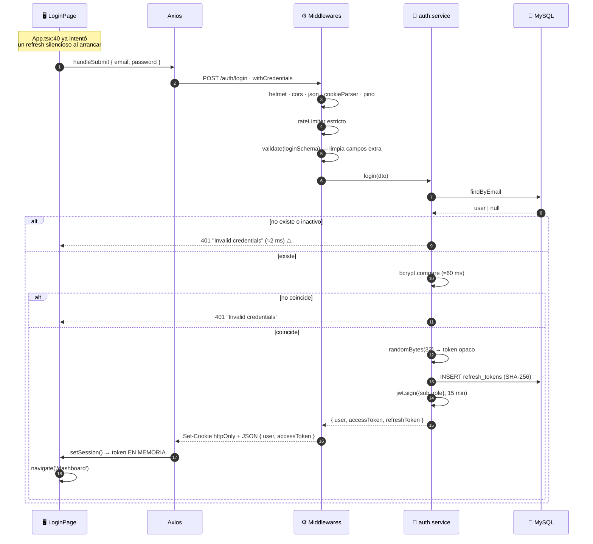
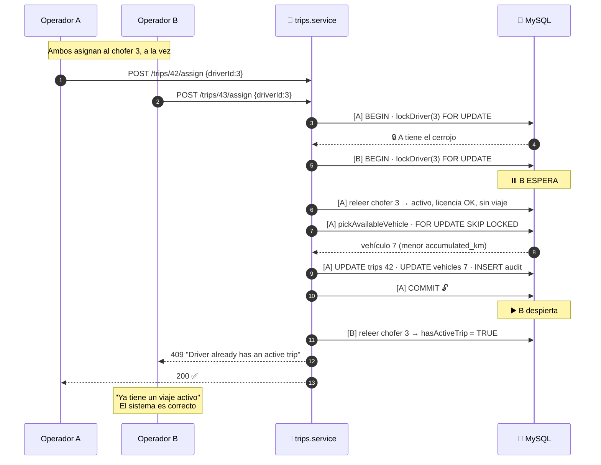
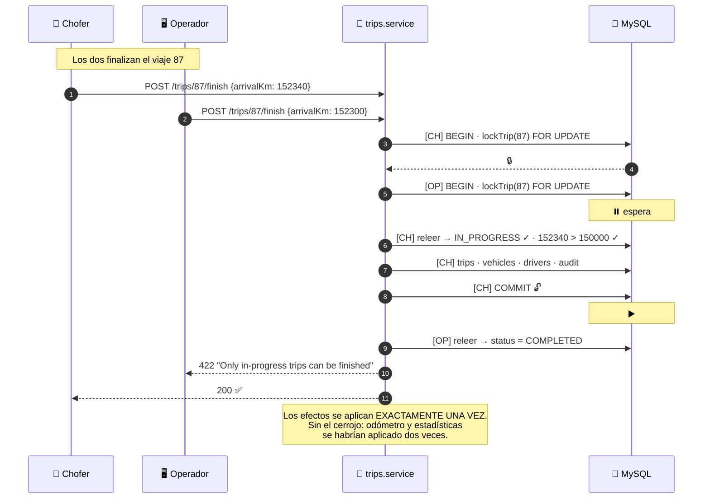
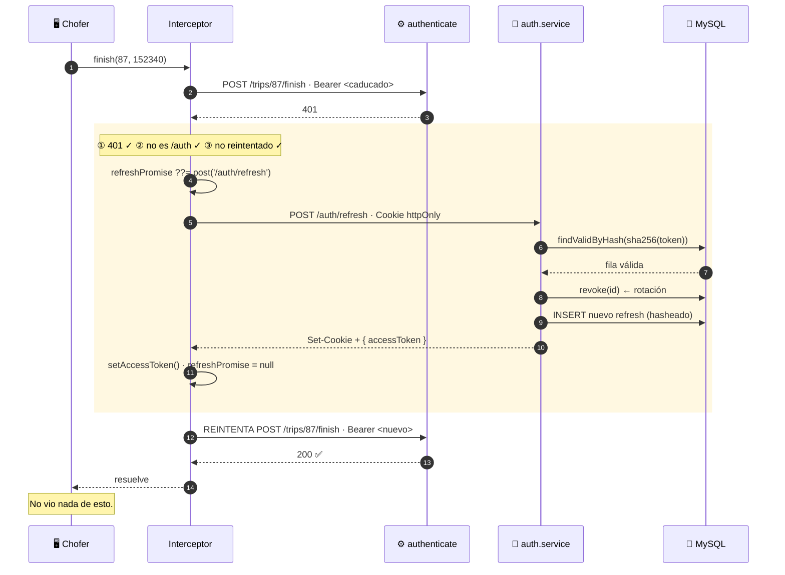
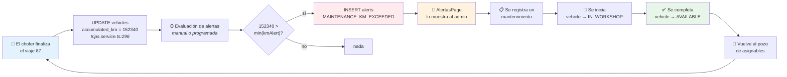

# Capítulo 23 — Flujos end-to-end: del clic al píxel

> **Este capítulo no presenta código nuevo.** Los veintidós capítulos anteriores
> explicaron cada archivo por separado. Aquí se recorren **seis casos de uso completos**,
> siguiendo un solo dato a través de las cinco capas —navegador, Express, servicio,
> repositorio, MySQL— y de vuelta hasta el píxel repintado.
>
> Cada paso cita **archivo y línea exactos**, verificados contra el código.

---

## 23.1 · Introducción

Hay dos formas de entender un sistema. La primera es la que ocupó los capítulos 3 a 22:
abrir cada archivo y explicar qué hace. Es exhaustiva y es necesaria, pero deja un hueco
—el que este capítulo llena.

El hueco es este: **ningún archivo del proyecto contiene un caso de uso completo**. Cuando
un operador asigna un viaje, el trabajo se reparte entre catorce archivos de dos
repositorios distintos, y ninguno de los catorce sabe que participa en algo llamado
"asignar un viaje". `AssignTripDialog` sabe hacer un POST. `authenticate` sabe verificar
una firma. `pickAvailableVehicle` sabe escribir una consulta SQL. El caso de uso existe
solo en la suma, y la suma no está escrita en ningún lado.

Este capítulo la escribe.

**Los seis flujos elegidos** no son los seis más frecuentes: son los seis que **atraviesan
más capas y revelan más decisiones**.

| # | Flujo | Qué revela |
|--:|:--|:--|
| 1 | **Iniciar sesión** | Doble token, hashing, cookies, el arranque de la aplicación |
| 2 | **Crear y asignar un viaje** | Bloqueos, `SKIP LOCKED`, siete validaciones bajo cerrojo |
| 3 | **Finalizar un viaje** | Cinco efectos en cascada y una asignación que pisa |
| 4 | **El token caduca a mitad de una acción** | El refresco transparente y sus tres protecciones |
| 5 | **Subir un documento** | *Multipart*, disco, compensación ante fallo |
| 6 | **Evaluar las alertas** | Reconciliación, cerrojo consultivo, el ciclo que se cierra |

Y hay una pregunta que los recorre todos:

> **¿Qué pasa si dos personas hacen esto exactamente a la vez?**

Es la pregunta que separa un trabajo académico de un sistema que funciona. El proyecto se
la hizo —el patrón *bloquear-releer-validar-escribir* está en cuatro sitios y los
comentarios lo explican— y es, con diferencia, lo mejor que tiene.

### 23.1.1 · La leyenda de las capas

Todos los diagramas usan los mismos cinco carriles:

```
🖥️  NAVEGADOR    React, Zustand, Axios              frontend/src/
🔌  HTTP          la red
⚙️  EXPRESS       middlewares, rutas, controlador     backend/src/middlewares|*.routes|*.controller
🧠  SERVICIO      reglas de negocio, transacciones    backend/src/modules/*/*.service.ts
🗄️  REPOSITORIO   Prisma, SQL                        backend/src/modules/*/*.repository.ts
💾  MYSQL         filas, índices, cerrojos
```

La regla arquitectónica del capítulo 2 dice que **cada capa solo habla con la de abajo**.
Los seis flujos la respetan sin excepción — lo verifiqué. No hay ni un controlador que
llame a Prisma, ni un repositorio que lance un `BusinessRuleError`.

---

## 23.2 · Conceptos previos

### 23.2.1 · Los seis middlewares, siempre en el mismo orden

Toda petición que entra al backend atraviesa la misma cadena antes de llegar a su
controlador. El orden está fijado en `app.ts:30-39` y **el orden es la semántica**: mover
una línea cambia el comportamiento.

```ts
app.use(helmet());                                              // app.ts:30
app.use(cors({ origin: env.CORS_ORIGIN, credentials: true }));  // app.ts:31
app.use(express.json({ limit: '100kb' }));                      // app.ts:32
app.use(cookieParser());                                        // app.ts:33
app.use(pinoHttp({ redact: ['req.headers.authorization', 'req.headers.cookie'] })); // app.ts:34-39
```

| Orden | Middleware | Qué hace | Qué pasaría si estuviera después |
|--:|:--|:--|:--|
| 1 | `helmet` | Cabeceras de seguridad | Las respuestas de error no las llevarían |
| 2 | `cors` | Autoriza el origen · `credentials: true` para la cookie | El navegador rechazaría la respuesta antes de leerla |
| 3 | `express.json` | Analiza el cuerpo → `req.body`, tope 100 kB | `req.body` sería `undefined` en las rutas |
| 4 | `cookieParser` | Analiza `Cookie:` → `req.cookies` | `/auth/refresh` no encontraría el token |
| 5 | `pinoHttp` | Registro por petición, **con credenciales tachadas** | Se registrarían peticiones sin respuesta |

El `redact` de la línea 37 merece una nota: sin él, **cada petición autenticada dejaría el
JWT completo escrito en el registro**. Un registro filtrado sería equivalente a un volcado
de sesiones. Dos entradas en un array que evitan una clase entera de incidentes.

Después de la cadena global vienen los específicos de ruta, que sí varían:

```
authenticate → authorize(...) → validate(schema) → upload → controlador
```

### 23.2.2 · Las cinco cosas que pueden fallar, y cómo se ven

Cada flujo puede romperse en cinco sitios distintos, y el usuario ve algo diferente en
cada uno. Conviene tener el mapa antes de recorrer los flujos:

| Falla en | Ejemplo | Código | Lo lanza | Lo ve el usuario como |
|:--|:--|:--|:--|:--|
| **Autenticación** | Token caducado | 401 | `authenticate` (`middlewares/authenticate.ts`) | Nada — el refresco lo resuelve (§23.6) |
| **Autorización** | Operador borrando un usuario | 403 | `authorize` | "No tenés permiso…" |
| **Forma del dato** | `arrivalKm: "abc"` | 422 | `validate` con Zod | El mensaje de Zod, **en inglés** |
| **Regla de negocio** | `arrivalKm <= departureKm` | 422 | El servicio, `BusinessRuleError` | El mensaje del servicio, en inglés |
| **Concurrencia** | Otro ya tomó el vehículo | 409 | El servicio, `ConflictError` | "Ya tiene un viaje activo…" |

Los cinco convergen en el mismo sitio: `errorHandler` (`middlewares/error-handler.ts`,
§7.5), que traduce la excepción a un JSON uniforme. Y del otro lado, `apiErrorMessage`
(§19.3.3) lo extrae para pintarlo.

**El problema de idioma queda expuesto aquí.** Tres de las cinco filas producen texto en
inglés dentro de una interfaz en español, porque los mensajes se escriben en el backend y
el cliente los muestra tal cual. Es el hallazgo de §22B.5.3 visto desde el flujo: no es un
descuido de una pantalla, es una decisión arquitectónica que afecta a todas.

### 23.2.3 · El patrón que aparece cuatro veces

Antes de recorrer los flujos hay que entender el patrón que los sostiene, porque sin él
tres de los seis serían incorrectos bajo concurrencia.

**El problema.** Un servicio típico hace esto:

```ts
const trip = await repo.findById(id);          // 1. leer
if (trip.status !== 'PENDING') throw ...;      // 2. validar
await repo.update(id, { status: 'IN_PROGRESS' }); // 3. escribir
```

Entre el paso 1 y el 3 pasa tiempo — milisegundos, pero tiempo. Si dos peticiones
ejecutan ese código a la vez, **las dos leen `PENDING`, las dos pasan la validación, y las
dos escriben**. El viaje se asigna dos veces. Es una condición de carrera de tipo
*tiempo-de-comprobación a tiempo-de-uso* (TOCTOU).

**La solución del proyecto: bloquear, releer, validar, escribir.**

```ts
await prisma.$transaction(async (tx) => {
  await repo.lockTrip(id, tx);                    // 1. BLOQUEAR   SELECT ... FOR UPDATE
  const trip = await repo.findById(id, tx);       // 2. RELEER     dentro del cerrojo
  if (trip.status !== 'IN_PROGRESS') throw ...;   // 3. VALIDAR    sobre el dato fresco
  await repo.update(id, { ... }, tx);             // 4. ESCRIBIR
});
```

`SELECT ... FOR UPDATE` toma un **cerrojo pesimista** sobre la fila. La segunda petición
que lo intente **se queda esperando** en el paso 1 hasta que la primera hace `COMMIT`.
Cuando por fin entra, el paso 2 lee el estado **ya modificado** y el paso 3 la rechaza.

La palabra clave es **releer**. Bloquear sin releer no sirve de nada: se seguiría
validando contra la fotografía vieja. El comentario de `trips.service.ts:265-268` lo dice
con precisión:

```
// Lock the trip and RE-READ under the lock: two concurrent finishes
// (driver and operator at once) serialize here, so the effects
// (odometer, driver stats) are applied exactly once. The loser sees
// the trip already COMPLETED and is rejected.
```

**Dónde está el patrón:**

| Flujo | Qué se bloquea | Archivo:línea | Regla que protege |
|:--|:--|:--|:--|
| Asignar viaje | El chofer | `trips.service.ts:185` | RN-19 (un viaje activo) |
| Asignar viaje | El vehículo | `trips.repository.ts` (`SKIP LOCKED`) | RN-12 (selección automática) |
| Finalizar viaje | El viaje | `trips.service.ts:269` | Efectos exactamente una vez |
| Crear mantenimiento | El vehículo | `maintenances.service.ts:111` | Un mantenimiento abierto |
| Evaluar alertas | **Toda la evaluación** | `alerts.service.ts` (`GET_LOCK`) | Una evaluación a la vez |

Cinco usos, cuatro variantes distintas del mismo mecanismo. Se desarrollan en los flujos
correspondientes.

---

## 23.3 · Flujo 1 — Iniciar sesión

**Punto de partida:** el navegador en `/login`, campos vacíos.
**Punto de llegada:** el tablero pintado con las métricas cargadas.

### 23.3.1 · El recorrido

```
① ARRANQUE (antes de que el usuario toque nada)

   index.html carga /src/main.tsx
   main.tsx    monta <App/> dentro de <StrictMode> y <ThemeProvider>
   App.tsx:40  let cancelled = false
   App.tsx     intenta POST /api/v1/auth/refresh con la cookie
               → si hay sesión previa: setSession(user, accessToken) y adentro
               → si no: setInitialized() y a /login
   
   Este intento silencioso es lo que hace que recargar la página no
   expulse al usuario, aunque el token de acceso viva solo en memoria.

② EL USUARIO ESCRIBE Y ENVÍA

   LoginPage       dos useState controlados
                   handleSubmit → e.preventDefault()
   authApi.login() POST /api/v1/auth/login
                   { email, password }
                   withCredentials: true       ← imprescindible para la cookie

③ EXPRESS

   app.ts:30-39    helmet · cors · json · cookieParser · pinoHttp
                   pinoHttp registra la petición SIN el cuerpo
   auth.routes     rateLimiter estricto      ← contra fuerza bruta
                   validate(loginSchema)     ← forma del dato + limpieza de campos extra
   auth.controller extrae req.body ya validado

④ SERVICIO — auth.service.ts:57-71

   línea 58   usersRepository.findByEmail(dto.email)
   línea 62   if (!user || !user.isActive) throw UnauthorizedError('Invalid credentials')
   línea 65   await bcrypt.compare(dto.password, user.passwordHash)
   línea 66   if (!passwordMatches) throw UnauthorizedError('Invalid credentials')
   línea 70   return issueSession(user)

⑤ EMISIÓN DE LA SESIÓN — auth.service.ts:39-54

   línea 42   randomBytes(32).toString('hex')      ← token opaco, 256 bits
   línea 43   expira en REFRESH_TOKEN_TTL_DAYS días
   línea 46   createRefreshToken(user.id, sha256(refreshToken), expiresAt)
                                            ↑ se guarda el HASH, no el token
   línea 50   signAccessToken(user)   → JWT { sub, role }, 15 min

⑥ LA RESPUESTA

   auth.controller  res.cookie('refreshToken', ..., {
                      httpOnly: true,    ← JavaScript no puede leerla
                      secure: producción,
                      sameSite: 'lax',   ← no viaja en peticiones de terceros
                      path: '/api/v1/auth',  ← solo a las rutas de auth
                      maxAge: 7 días
                    })
                    res.json({ data: { user, accessToken } })
                                              ↑ el de acceso NO va en cookie

⑦ DE VUELTA EN EL NAVEGADOR

   authApi.login   resuelve
   useAuthStore    setSession(user, accessToken)
                   → el token queda en una variable de módulo, en MEMORIA
   LoginPage       navigate('/dashboard')
   ProtectedRoute  ve user !== null → deja pasar
   RouteMap        role === 'ADMIN' → renderiza las 12 rutas de admin
   DashboardPage   monta → useEffect → GET /dashboard/metrics
                   el interceptor de Axios añade Authorization: Bearer <token>
                   → 8 números y una serie mensual
                   → 8 KpiCard + un BarChart de Recharts

   Total: 3 peticiones HTTP (refresh fallido, login, metrics).
```

### 23.3.2 · Las tres decisiones que este flujo revela

**1. El mismo error para tres fallos distintos.**

```ts
// auth.service.ts:60-64
// Same error for "not found", "inactive" and "wrong password":
// never reveal which credential failed (account enumeration).
if (!user || !user.isActive) {
  throw new UnauthorizedError('Invalid credentials');
}
```

Si el servidor respondiera "ese email no existe" para uno y "contraseña incorrecta" para
otro, un atacante podría **enumerar cuentas**: probar mil emails y quedarse con los que
dan el segundo mensaje. Después ya solo le falta la contraseña de una cuenta que sabe que
existe.

El proyecto devuelve `Invalid credentials` en los tres casos. Es correcto y está
comentado.

**⚠️ Lo que no cierra: el canal de tiempo.** Cuando el email no existe, la línea 62 lanza
**inmediatamente**. Cuando existe, la línea 65 ejecuta `bcrypt.compare`, que por diseño
tarda decenas de milisegundos. La diferencia es medible:

```
Email inexistente:   ~2 ms   (una consulta y a la calle)
Email real:         ~60 ms   (consulta + bcrypt)
```

Un atacante que cronometre las respuestas distingue los dos casos sin leer el mensaje. La
protección del comentario funciona contra la lectura, no contra el reloj.

La mitigación estándar es comparar siempre contra un hash señuelo:

```ts
const hash = user?.passwordHash ?? DUMMY_HASH;
const matches = await bcrypt.compare(dto.password, hash);
if (!user || !user.isActive || !matches) throw new UnauthorizedError('Invalid credentials');
```

Para un sistema interno de una PyME, el riesgo es bajo. Pero el comentario afirma
*"never reveal which credential failed"* y el reloj lo revela.

**2. Dos tokens con propiedades opuestas.**

| | Token de acceso | Token de refresco |
|:--|:--|:--|
| **Formato** | JWT firmado, legible | 32 bytes al azar, opaco |
| **Vida** | 15 minutos | 7 días |
| **Dónde vive** | Memoria de JavaScript | Cookie `httpOnly` |
| **En la BD** | No existe | Su **SHA-256** |
| **Se puede revocar** | No | Sí (`revoked = true`) |
| **Lo lee un XSS** | Difícil (no está en `localStorage`) | **No** (`httpOnly`) |
| **Lo usa un CSRF** | No (va en cabecera) | Limitado (`sameSite: 'lax'`) |

La combinación cubre las dos amenazas principales de las aplicaciones web con una división
del trabajo elegante: **el token que un XSS podría robar dura quince minutos; el que dura
una semana, un XSS no puede leerlo.**

Y `sha256(refreshToken)` en la línea 46 añade la tercera capa: si alguien se lleva la base
de datos, obtiene hashes. **Un hash de refresco no sirve para autenticarse**, porque el
servidor compara `sha256(loQueLlega)` contra lo guardado. Es exactamente el mismo
razonamiento que justifica no guardar contraseñas en claro.

**3. 🔴 La rotación no detecta el robo, aunque el comentario dice que sí.**

```ts
// auth.service.ts:73-77
/**
 * Refresh token ROTATION: each refresh revokes the used token and issues
 * a new pair. A replayed (already-revoked) token is treated as theft and
 * revokes every session of the user.
 */
```

La primera frase es cierta: la línea 90 revoca el usado y la 91 emite uno nuevo.

**La segunda no.** La detección de reutilización exige distinguir dos casos: *token que
nunca existió* y *token que existió y ya fue revocado*. Solo el segundo es evidencia de
robo — significa que alguien está usando una copia.

Pero la línea 79 pregunta por un token **válido**:

```ts
const stored = await authRepository.findValidByHash(sha256(refreshToken));
if (!stored) { throw new UnauthorizedError('Invalid or expired refresh token'); }
```

Y `findValidByHash` filtra por `revoked: false`. Así que un token revocado **no se
encuentra** y sale por el mismo camino que uno inventado: un 401 y nada más.

El único `revokeAllForUser` del archivo está en la línea 86, y solo se alcanza cuando el
token es válido pero el usuario está inactivo o borrado — que no es robo, es baja.

**Lo que haría falta** son unas seis líneas:

```ts
const stored = await authRepository.findByHash(sha256(refreshToken));   // sin filtrar
if (!stored) throw new UnauthorizedError('Invalid or expired refresh token');
if (stored.revoked) {
  await authRepository.revokeAllForUser(stored.userId);   // ← esto sí es robo
  throw new UnauthorizedError('Invalid or expired refresh token');
}
if (stored.expiresAt < new Date()) throw new UnauthorizedError('...');
```

**Por qué importa que el comentario mienta.** Un comentario incorrecto es peor que ninguno.
Quien audite este código leerá "se detecta el robo", lo dará por hecho, y no lo verificará.
La única forma de encontrar el hueco es leer `findValidByHash`, que está en otro archivo.

Es el hallazgo de seguridad más importante del manual.

### 23.3.3 · Diagrama



---

## 23.4 · Flujo 2 — Crear y asignar un viaje

El flujo más denso del sistema: **siete validaciones, dos cerrojos y tres efectos**, todo
dentro de una transacción.

### 23.4.1 · Fase A — Crear (el trámite fácil)

```
🖥️  TripFormDialog   destino (Google Places) + fecha/hora + observaciones
                     línea 55: localInputToIso(departureAt)  ← hora local → instante UTC
                     línea 55: ...(notes ? {notes} : {})     ← 🔴 impide borrar al editar
    POST /api/v1/trips { destination, departureAt }

⚙️  trips.routes     authenticate → authorize('ADMIN','OPERATOR') → validate(createTripSchema)
    trips.schemas:10-16   NO acepta `origin` (RN-21: el origen es fijo)
                          NO acepta driver ni vehicle (llegan en la asignación)
                          departureAt: z.coerce.date()  ← ⚠️ sin mínimo: se admite el pasado

🧠  trips.service    escribe origin desde su propia constante
    → INSERT trips (status='PENDING_ASSIGNMENT')
    → INSERT audit_logs (CREATE, TRIP)

🖥️  onSaved() → setFormOpen(false) → void reload() → la fila aparece
    con tres acciones: Editar · Asignar · Eliminar
```

Sin sorpresas. Toda la complejidad está en la fase siguiente.

### 23.4.2 · Fase B — Asignar (siete validaciones bajo cerrojo)

```
🖥️  AssignTripDialog
    línea 42: driversApi.list({ page:1, limit:100, available:true })
              ⚠️ el chofer 101 no aparece y nada lo indica
    → drivers.repository:37-41 filtra por TRES condiciones:
        · user.isActive && user.deletedAt IS NULL
        · licenseExpiryDate >= utcStartOfToday()   ← RN-1: vence al final del día
        · trips: { none: { status: 'IN_PROGRESS' } }
    ⚠️ el texto de ayuda (línea 83) solo menciona dos de las tres

    El operador elige. POST /api/v1/trips/42/assign { driverId: 3 }
```

Y entonces empieza lo interesante — `trips.service.ts:171-248`:

```
🧠  FUERA DE LA TRANSACCIÓN (lecturas baratas, para fallar rápido)

    línea 172   getExistingOrFail(42)
    línea 173   ① ¿status === 'PENDING_ASSIGNMENT'?          → 422 si no
    línea 178   driversRepository.findById(3)
    línea 179   ② ¿el chofer existe?                          → 404 si no

    El comentario de la línea 177 es explícito sobre por qué esto no basta:
      "Driver eligibility (read outside the tx; re-verified under lock below)"

🧠  ABRE LA TRANSACCIÓN — línea 181

    línea 185   lockDriver(3, tx)      SELECT user_id FROM drivers
                                       WHERE user_id = 3 FOR UPDATE
                ← toda otra asignación a ESTE chofer espera aquí

    línea 190   findById(3, tx)        ← RELEER bajo el cerrojo
                El comentario de la 187-189 explica por qué:
                  "the pre-lock read could be stale if the driver was
                   deactivated in the meantime"

    línea 192   ③ ¿lockedDriver.user.isActive?                → 422
    línea 196   ④ ¿licenseExpiryDate >= utcStartOfToday()?    → 422 (RN-1)
    línea 204   ⑤ ¿hasExpiredActive(3, tx)?                   → 422 (RN-4)
    línea 208   ⑥ ¿hasActiveTrip(3, tx)?                      → 409 (RN-19)

    línea 213   pickAvailableVehicle(tx)
                  SELECT id FROM vehicles
                  WHERE status='AVAILABLE' AND deleted_at IS NULL
                  ORDER BY accumulated_km ASC
                  LIMIT 1
                  FOR UPDATE SKIP LOCKED        ← la joya del proyecto
    línea 214   ⑦ ¿hay vehículo?                              → 409

🧠  LOS TRES EFECTOS — líneas 222-244

    línea 222   UPDATE trips SET status='IN_PROGRESS', driver_id=3,
                                 vehicle_id=?, departure_km=<accumulatedKm>,
                                 assigned_at=NOW()
    línea 233   UPDATE vehicles SET status='ON_TRIP'
    línea 234   INSERT audit_logs (ASSIGN, TRIP, antes/después)

    COMMIT ← los dos cerrojos se liberan aquí, no antes
```

### 23.4.3 · `FOR UPDATE SKIP LOCKED`, la línea mejor pensada del proyecto

```sql
SELECT id FROM vehicles
WHERE status = 'AVAILABLE' AND deleted_at IS NULL
ORDER BY accumulated_km ASC
LIMIT 1
FOR UPDATE SKIP LOCKED
```

Cinco decisiones en seis líneas. Vale la pena desarmarlas una por una.

**`ORDER BY accumulated_km ASC`** — elige el vehículo con **menos kilómetros**. Reparte el
desgaste de la flota en lugar de castigar siempre al mismo. Es una decisión de negocio
escrita en SQL, y **la interfaz no la comunica**: `AssignTripDialog:93` solo dice "según
reglas de negocio" (§22B.4.3).

**`FOR UPDATE`** — bloquea la fila elegida hasta el `COMMIT`. Sin esto, dos asignaciones
simultáneas elegirían el mismo vehículo: las dos leen `AVAILABLE`, las dos lo asignan.

**`SKIP LOCKED`** — y aquí está la diferencia entre correcto y **correcto y rápido**.

Con `FOR UPDATE` a secas, la segunda petición **espera** a que la primera termine, y
entonces relee. Como la primera puso ese vehículo en `ON_TRIP`, la segunda ya no lo ve y
elige el siguiente. Funciona, pero serializa: con diez operadores asignando a la vez, el
décimo espera nueve transacciones.

Con `SKIP LOCKED`, la segunda petición **salta** las filas bloqueadas y se lleva la
siguiente disponible en el acto. Diez operadores obtienen diez vehículos distintos **en
paralelo**, sin esperarse.

```
Sin SKIP LOCKED:   A──────► B(espera)──────► C(espera)──────►   3 × t
Con SKIP LOCKED:   A──────►
                   B──────►                                      1 × t
                   C──────►
```

Es la construcción canónica de **cola de trabajo en SQL**, la misma que usan los sistemas
de colas basados en PostgreSQL o MySQL. Encontrarla en un trabajo académico de logística
es notable.

**`LIMIT 1`** — sin él, `FOR UPDATE` bloquearía todas las filas que cumplen la condición:
la flota entera. Con `LIMIT 1`, exactamente una.

**`deleted_at IS NULL`** — el borrado lógico de RN-20. Un vehículo dado de baja no se
asigna aunque su `status` siguiera diciendo `AVAILABLE`.

**⚠️ Lo que la consulta no comprueba: el seguro.** No hay ninguna condición sobre
`insuranceExpiryDate`. Un vehículo con el seguro vencido —o **sin seguro cargado**— se
asigna con normalidad.

Y aquí es donde tres capítulos se cruzan y aparece el hueco:

| Dónde | Qué dice / hace |
|:--|:--|
| `vehicles.service.ts:20` | El comentario afirma que el seguro se *"surfaces as alertable"* |
| `alerts.service.ts:149` | **No genera alerta si `insuranceExpiryDate` es `NULL`** |
| `trips.repository.ts` (esta consulta) | **No filtra por seguro** |
| `VehiculosPage:90` | Muestra "—" cuando no hay seguro, sin distintivo de aviso |

**Un vehículo sin seguro cargado circula sin que nada en el sistema lo señale.** Ni la
asignación lo bloquea, ni el motor de alertas lo avisa, ni la pantalla lo destaca. Los
tres huecos por separado son defendibles; juntos dejan un vehículo sin cobertura en la
calle.

Es el hallazgo que mejor ilustra por qué hacía falta este capítulo: **ninguno de los
cuatro archivos es incorrecto leído solo**.

### 23.4.4 · Las siete validaciones, ordenadas por lo que cuestan

| # | Qué comprueba | Línea | Dentro del cerrojo | Código |
|--:|:--|:--|:--:|:--|
| ① | El viaje está pendiente | 173 | No | 422 |
| ② | El chofer existe | 179 | No | 404 |
| ③ | El chofer está activo | 192 | **Sí** | 422 |
| ④ | Licencia vigente (RN-1) | 196 | **Sí** | 422 |
| ⑤ | Sin documentación vencida (RN-4) | 204 | **Sí** | 422 |
| ⑥ | Sin otro viaje activo (RN-19) | 208 | **Sí** | 409 |
| ⑦ | Hay vehículo disponible (RN-12) | 214 | **Sí** | 409 |

**El orden no es casual.** Las dos primeras son lecturas baratas fuera de la transacción:
fallan rápido y no cuestan un cerrojo. Las cinco siguientes están dentro porque **todas
pueden cambiar entre la lectura previa y la escritura**, y validar sobre datos viejos sería
validar sobre nada.

**Una nota sobre RN-4**, que tiene el comentario más honesto del proyecto:

```ts
// trips.service.ts:199-203
// RN-4: no EXPIRED active documentation blocks assignment.
// Deliberate simplification (business decision for this case): the
// ABSENCE of documents does NOT block — a driver with no documents
// loaded is still assignable. This avoids day-to-day operational
// blocks; it is intentional, not an oversight.
```

Un chofer **sin ningún documento cargado** es asignable; uno con un documento vencido, no.
Puede parecer al revés de lo razonable, y el comentario se adelanta a la objeción:
*"it is intentional, not an oversight"*.

**La decisión es defendible** —evita que el sistema se bloquee mientras se digitaliza el
archivo— y está documentada, que es lo que la separa de un descuido. Pero abre un hueco
real: la forma de saltarse RN-4 es **no cargar el documento**. Y la pantalla del chofer
tampoco le dice cuáles le faltan (§22C, hallazgo 14).

### 23.4.5 · Diagrama: dos operadores asignando a la vez



---

## 23.5 · Flujo 3 — Finalizar un viaje

`trips.service.ts:256-329`. Cinco efectos en una transacción, y un detalle que conviene
mirar de cerca.

```
🖥️  FinishTripDialog (operador) o MiViajePage (chofer) — el MISMO componente
    línea 51: invalid = arrivalKm === '' || Number(arrivalKm) <= departureKm
              ← RN-5 en el cliente, con tres capas de aviso (§22B.4.4)
    POST /api/v1/trips/87/finish { arrivalKm: 152340 }

⚙️  authenticate → authorize('ADMIN','OPERATOR','DRIVER') → validate(finishTripSchema)
    finishTripSchema: z.coerce.number().int().min(0)
    ⚠️ exige ENTERO, pero el input acepta decimales → 422 poco descriptivo

🧠  FUERA DE LA TRANSACCIÓN — líneas 258-261

    línea 258   getExistingOrFail(87)
    línea 259   if (actor.role === 'DRIVER' && preview.driverId !== actor.id) → 403
                El comentario de la 257 justifica que esté fuera:
                  "Early ownership check (authorization does not change with concurrency)"
                La autorización no depende del estado; validarla dos veces
                no aportaría nada.

🧠  DENTRO DE LA TRANSACCIÓN — líneas 264-327

    línea 269   lockTrip(87, tx)              SELECT ... FOR UPDATE
    línea 270   findById(87, tx)              ← RELEER
    línea 272   ¿status === 'IN_PROGRESS'?    → 422 si ya se finalizó
    línea 276   ¿departureKm !== null && arrivalKm > departureKm?  → 422 (RN-5)
    línea 282   tripKm = 152340 - 150000 = 2340

    ── EFECTO 1: el viaje ──────────────── línea 284
       UPDATE trips SET status='COMPLETED', arrival_km=152340,
                        finished_at=NOW(), finished_by=<actor>

    ── EFECTO 2: el odómetro ───────────── línea 296
       UPDATE vehicles SET accumulated_km = 152340,   ← ASIGNACIÓN
                           status='AVAILABLE'

    ── EFECTO 3: estadísticas del chofer ─ línea 303
       newCount = completedTrips + 1
       newAvg   = (avgKm × completedTrips + 2340) / newCount
       UPDATE drivers SET completed_trips=?, avg_km=?

    ── EFECTO 4: la auditoría ──────────── línea 315
       INSERT audit_logs (FINISH, TRIP, antes/después)

    COMMIT

🖥️  onSaved() → reload()
    · Desde ViajesPage: la fila pasa a "Finalizado" y pierde sus acciones
    · Desde MiViajePage: vuelve "No tenés un viaje asignado en este momento"

⏰  EFECTO 5 — DIFERIDO, EN OTRO MÓDULO
    En la próxima evaluación de alertas, el vehículo 7 se compara contra
    min(kmAlert). Si 152.340 cruzó el umbral, nace una alerta de
    mantenimiento. Nadie la pidió. (§23.8)
```

### 23.5.1 · El odómetro se asigna, no se incrementa

```ts
// trips.service.ts:296-300
await vehiclesRepository.update(
  existing.vehicleId,
  { accumulatedKm: dto.arrivalKm, status: 'AVAILABLE' },
  tx,
);
```

`accumulatedKm: dto.arrivalKm`. **Una asignación absoluta**, no un
`accumulated_km + tripKm`.

En el camino feliz da el mismo resultado, y por una razón concreta: en la asignación, la
línea 228 hizo `departureKm: vehicle.accumulatedKm`. Así que el odómetro al salir era
exactamente `departureKm`, y sumarle `arrivalKm - departureKm` da `arrivalKm`. Los dos
caminos coinciden.

**La diferencia aparece si algo modificó el odómetro durante el viaje.** La asignación lo
**pisa**; el incremento lo habría respetado.

¿Puede pasar? Hoy, no: mientras el viaje está en curso el vehículo está `ON_TRIP`, y el
único sitio que escribe `accumulatedKm` es este. Pero conviene notar que **`vehicles.service`
permite editar el vehículo** y que `maintenances` no toca ese campo. La invariante se
sostiene por la ausencia de escritores, no por un mecanismo.

**Cuál es mejor.** La asignación, en realidad — y por un motivo que merece decirse: el
odómetro es una **lectura del mundo real**, no un agregado calculado. Si el chofer escribe
152.340 porque eso es lo que marca el tablero, ese es el valor correcto, incluso si no
coincide con la suma de los tramos registrados. La asignación toma el dato de la realidad
como autoridad; el incremento tomaría la contabilidad interna. Para un odómetro, la
realidad gana.

La asignación absoluta es, entonces, **la decisión correcta por accidente o por criterio**
— el código no lo dice y no hay comentario.

### 23.5.2 · La media incremental y su deriva

```ts
// trips.service.ts:306-307
const newCount = driver.completedTrips + 1;
const newAvg = (Number(driver.avgKm) * driver.completedTrips + tripKm) / newCount;
```

Es la fórmula de la **media móvil**: reconstruye la suma total multiplicando la media
anterior por el conteo anterior, añade el valor nuevo, y divide.

**La ventaja** es evidente: calcular la media real exigiría `SELECT AVG(...)` sobre todos
los viajes del chofer en cada finalización. Con la fórmula incremental son dos números que
ya están en la fila. Es **desnormalización deliberada**: se guarda un dato derivado para no
recalcularlo.

**El precio** es la deriva de coma flotante. `avgKm` es `Decimal` en la base de datos y se
convierte a `number` de JavaScript con `Number(driver.avgKm)` — es decir, a un flotante de
doble precisión. Cada finalización multiplica, suma y divide sobre un valor ya redondeado.
Tras cientos de viajes, `avgKm` diverge lentamente de la media verdadera.

Con cifras reales el error es despreciable —del orden de fracciones de kilómetro tras mil
viajes— pero es **irrecuperable sin recalcular desde los viajes**. Y no hay ningún proceso
que lo haga.

Un `SELECT AVG(arrival_km - departure_km)` periódico, o simplemente calcular la media al
leerla en lugar de guardarla, eliminaría el problema. Para este sistema, la desnormalización
está justificada; que no haya forma de reconciliarla, no.

### 23.5.3 · Diagrama: el chofer y el operador finalizan a la vez



---

## 23.6 · Flujo 4 — El token caduca a mitad de una acción

Es el flujo que **el usuario nunca ve**, y precisamente por eso el más interesante: si
funciona, no pasa nada; si no funcionara, la aplicación sería inusable.

**El escenario real.** Un chofer entra a las 07:30. El token de acceso dura 15 minutos.
A las 16:40 pulsa "Cerrar hoja de ruta" con el kilometraje ya escrito. Su token caducó
hace nueve horas.

```
🖥️  FinishTripDialog → tripsApi.finish(87, 152340)
    Interceptor de petición (axios.ts): Authorization: Bearer <token caducado>

⚙️  authenticate → jwt.verify() lanza TokenExpiredError
    → 401 { error: { message: 'Invalid or expired token' } }

🖥️  INTERCEPTOR DE RESPUESTA — api/axios.ts

    ① ¿status === 401?                                  sí
    ② ¿isAuthEndpoint(url)?                             no
       ← si fuera /auth/refresh, NO se reintentaría: sería un bucle infinito
    ③ ¿config._retried?                                 no
       ← marca en la propia petición; se pone a true antes de reintentar,
         así una petición se reintenta UNA sola vez

    refreshPromise ??= axios.post('/auth/refresh', {}, { withCredentials: true })
    ↑ EL OPERADOR MÁS IMPORTANTE DEL ARCHIVO

    `??=` asigna solo si es null/undefined. Si diez peticiones reciben 401
    a la vez, la primera crea la promesa y las otras nueve se enganchan a
    la MISMA. Un solo POST /auth/refresh, no diez.

    Y usa `axios` PELADO, no la instancia configurada: si usara la instancia,
    su propio interceptor capturaría un eventual 401 del refresco y se
    llamaría a sí mismo.

⚙️  POST /api/v1/auth/refresh
    cookieParser (app.ts:33) analiza la cookie → req.cookies.refreshToken
    auth.service.ts:78-92:
      línea 79   findValidByHash(sha256(token))    ← busca por el HASH
      línea 84   findById(stored.userId)
      línea 85   ¿usuario activo?     → si no: revokeAllForUser + 401
      línea 90   revoke(stored.id)    ← ROTACIÓN: el usado deja de valer
      línea 91   issueSession(user)   ← par nuevo

    Set-Cookie con el refresco nuevo + JSON con el acceso nuevo

🖥️  useAuthStore.setAccessToken(nuevo)
    refreshPromise = null                ← se libera para el próximo ciclo
    config._retried = true
    → REINTENTA POST /trips/87/finish con el token nuevo
    → 200 ✅

🖥️  El chofer ve el diálogo cerrarse y "No tenés un viaje asignado".
    Ni un parpadeo. Ni una pantalla de login. Ni el kilometraje perdido.
```

### 23.6.1 · Las tres protecciones, y qué rompería sin cada una

```ts
if (status === 401 && !isAuthEndpoint(config.url) && !config._retried) {
  refreshPromise ??= axios.post('/auth/refresh', {}, { withCredentials: true });
  // ...
}
```

| Protección | Sin ella |
|:--|:--|
| **`isAuthEndpoint`** | Si el refresco devuelve 401, el interceptor intentaría refrescar el refresco. Recursión infinita, pestaña congelada. |
| **`_retried`** | Una petición que sigue dando 401 tras refrescar entraría en bucle: refresca, reintenta, 401, refresca… |
| **`??=`** | Diez peticiones simultáneas → diez `POST /auth/refresh`. Y como **cada refresco revoca el anterior**, las nueve últimas usarían un token ya revocado → nueve 401 → sesión perdida. |

La tercera es la que **la rotación hace obligatoria**. Sin rotación, diez refrescos
paralelos serían solo ineficientes. Con rotación, son fatales. Las dos decisiones —rotar y
deduplicar— están acopladas, y el código lo resuelve con tres caracteres.

### 23.6.2 · Diagrama



---

## 23.7 · Flujo 5 — Subir un documento de chofer

El único flujo con **multipart**, disco y compensación ante fallo.

```
🖥️  DriverDocumentsDialog
    <input type="file" hidden accept="application/pdf,image/jpeg,image/png">
    ← `accept` filtra el diálogo del SO. NO es una validación: el usuario
      puede cambiarlo a "todos los archivos".
    FormData: file + documentType + expiryDate
    POST /api/v1/drivers/3/documents   (Content-Type: multipart/form-data)

⚙️  app.ts:51    apiV1.use('/drivers/:driverId/documents', documentsRoutes)
                 ← ruta anidada; el router usa mergeParams para ver :driverId
    authenticate → authorize('ADMIN') → upload.single('file') → validate(...)

    upload (middlewares/upload.ts):
      · memoryStorage       ← el archivo va a RAM, no a disco directamente
      · limits.fileSize     ← MAX_UPLOAD_BYTES (1 MB)
      · fileFilter          ← LA validación real de tipo MIME

    ⚠️ El texto "máx. 1 MB" está escrito a mano en el frontend.
       Si el backend cambia el límite, el texto miente.

🧠  documents.service
    ① assertCanAccess(actor, driverId)   ← admin, o el propio chofer
    ② ¿el chofer existe?                 → 404
    ③ storeFile(req.file)                ← shared/utils/files.ts
       - nombre aleatorio (no el del usuario: evita traversal y colisiones)
       - escribe en UPLOAD_DIR
       ← ESTA ESCRITURA OCURRE FUERA DE LA TRANSACCIÓN
    ④ INSERT driver_documents + INSERT audit_logs

    ⑤ SI EL INSERT FALLA:
       safeUnlink(rutaDelArchivo)        ← COMPENSACIÓN

🖥️  onSaved() → reload() → la nueva tarjeta aparece
```

### 23.7.1 · Por qué hace falta compensar

Aquí hay un problema que ninguna transacción de base de datos puede resolver:

> **El sistema de archivos no participa en la transacción de MySQL.**

`prisma.$transaction` puede deshacer un `INSERT`. **No puede deshacer un `fs.writeFile`.**
Son dos sistemas de almacenamiento distintos, sin coordinador que los una.

Los dos órdenes posibles fallan de formas distintas:

| Orden | Si falla lo segundo | Resultado |
|:--|:--|:--|
| **Archivo → fila** | El `INSERT` revienta | Archivo **huérfano** en disco: ocupa espacio, nadie lo referencia |
| **Fila → archivo** | La escritura revienta | Fila **rota**: la interfaz muestra el documento y al abrirlo da 404 |

El proyecto elige el primero **y añade la compensación**: si el `INSERT` falla,
`safeUnlink` borra el archivo. Es el patrón de **transacción compensatoria**, la
aproximación práctica a la atomicidad cuando hay dos sistemas.

**Es la elección correcta**, por una razón que conviene explicitar: de los dos fallos, el
huérfano es **silencioso e inofensivo** (basura en disco) y la fila rota es **visible y
confusa** (el usuario ve un documento que no existe). Cuando hay que elegir qué se rompe,
se elige lo que no se ve.

**⚠️ La compensación no es perfecta**, y no puede serlo. Si el proceso muere entre la
escritura del archivo y el `safeUnlink`, el archivo queda. La solución completa —una tarea
periódica que borre los archivos de `UPLOAD_DIR` sin fila que los referencie— no existe en
el proyecto. Para un sistema de esta escala es aceptable; conviene saber que el disco
crece monótonamente ante fallos.

**Sobre `storeFile` y el nombre aleatorio.** Guardar el archivo con el nombre que envió el
usuario sería un fallo de seguridad de manual: un nombre como `../../etc/passwd`
escribiría fuera del directorio previsto (*path traversal*), y dos choferes subiendo
`licencia.pdf` se pisarían. El nombre aleatorio resuelve las dos cosas de una vez, y el
original se guarda en la columna `file_name` para mostrarlo.

**Sobre `memoryStorage`.** Multer puede escribir directo a disco (`diskStorage`) o retener
en RAM. Con `memoryStorage`, el `fileFilter` decide **antes** de que nada toque el disco:
un archivo rechazado nunca se escribe. El precio es RAM proporcional a las subidas
concurrentes — con un tope de 1 MB, irrelevante.

---

## 23.8 · Flujo 6 — Evaluar las alertas

El único flujo que **no nace de un dato que el usuario escribe**, sino de comparar el
mundo consigo mismo.

```
🖥️  AlertasPage:41  handleEvaluate()
    disabled={evaluating}   ← primera capa contra el doble disparo
    POST /api/v1/alerts/evaluate

⚙️  alerts.routes.ts:23   authorize('ADMIN')   ← solo administradores
                          y la interfaz solo le muestra el botón al admin

🧠  alerts.service — dentro de una transacción

    ── EL CERROJO CONSULTIVO ──
    SELECT GET_LOCK('<EVALUATE_LOCK>', 10) AS locked

    No bloquea una fila: bloquea un NOMBRE. Es un semáforo global de MySQL.
    Si otra evaluación está en curso, esta espera hasta 10 segundos y se
    rinde. Segunda capa contra el doble disparo — y la que de verdad
    protege, porque `disabled` solo cubre un navegador.

    ── LA RECONCILIACIÓN ──

    1. Leer el ESTADO DESEADO: recorrer el mundo y calcular qué alertas
       DEBERÍAN existir ahora mismo.

       · licencias por vencer / vencidas      ← drivers.licenseExpiryDate
       · documentos por vencer / vencidos     ← driver_documents.expiryDate
       · seguros por vencer / vencidos        ← vehicles.insuranceExpiryDate
                                                ⚠️ NO alerta si es NULL (línea 149)
       · km de mantenimiento superado         ← vehicles.accumulatedKm
       · vehículos inactivos                  ← vehicles.status

       El umbral de km es GLOBAL:
         const minType = await db.maintenanceType.aggregate({ _min: { kmAlert: true } });
       Un solo min(kmAlert) para toda la flota, no uno por tipo.

    2. Leer el ESTADO ACTUAL: las alertas PENDING que ya existen.

    3. RECONCILIAR:
       · deseada y no existe   → INSERT  (created++)
       · existe y ya no toca   → RESOLVED automáticamente (autoResolved++)
       · existe y sigue tocando → no hacer nada

    COMMIT · RELEASE_LOCK

🖥️  Snackbar: "Evaluación completa: 3 nuevas, 1 auto-resuelta"
    await reload() → la tabla se repinta
```

### 23.8.1 · Reconciliación: el patrón, y por qué "Resolver" es engañoso

El motor de alertas **no reacciona a eventos**. Nadie le avisa de que un viaje terminó o
de que una licencia venció. En cada ejecución **recalcula desde cero** qué alertas
deberían existir y ajusta la realidad para que coincida.

Es el patrón de **reconciliación**, el mismo que usan los controladores de Kubernetes: no
"crear un contenedor cuando alguien lo pida", sino "comparar lo deseado con lo real y
corregir la diferencia".

**La ventaja es la idempotencia.** Ejecutar la evaluación diez veces seguidas da el mismo
resultado que ejecutarla una. No hay eventos perdidos que dejen el sistema inconsistente,
ni eventos duplicados que creen alertas dobles. Si el servidor estuvo caído tres días, la
primera evaluación al volver pone todo al día.

**La consecuencia es lo que §22C, hallazgo 7 señaló.** Un administrador resuelve
"Seguro vencido" del vehículo ABC123 **sin renovar el seguro**. La siguiente evaluación
compara el mundo con las alertas, ve que la condición sigue, y **crea la alerta otra vez**.

Eso es **correcto por diseño**: el sistema no debe olvidar un problema real porque alguien
cerró la ventana. Pero la interfaz no lo dice, y un administrador que resuelve doce
alertas y las ve reaparecer al día siguiente concluirá que el sistema está roto.

Una frase junto al botón —*"Si la condición persiste, la alerta volverá a generarse"*—
convertiría un comportamiento correcto e incomprensible en uno correcto y comprensible.

### 23.8.2 · `GET_LOCK`: la cuarta variante de cerrojo

Es el cuarto mecanismo de exclusión del proyecto, y el más distinto:

| Mecanismo | Alcance | Dónde |
|:--|:--|:--|
| `SELECT ... FOR UPDATE` | Una fila | Chofer, viaje, vehículo |
| `FOR UPDATE SKIP LOCKED` | Una fila, **sin esperar** | Selección de vehículo |
| Índice `UNIQUE` | Un valor de columna | Email, patente |
| **`GET_LOCK(nombre, seg)`** | **Un nombre arbitrario** | La evaluación entera |

`GET_LOCK` es un **cerrojo consultivo** (*advisory lock*): no está atado a ninguna fila ni
tabla. Bloquea una cadena de texto. Cualquier conexión que pida el mismo nombre espera.

Es la herramienta correcta para "que esto no corra dos veces a la vez", cuando *esto* no
es una fila sino **un proceso completo que toca decenas de filas de seis tablas**. No hay
una fila que bloquear; hay una operación.

El tiempo de espera de 10 segundos es una decisión razonable: si otra evaluación lleva más
de diez segundos, algo va mal y es mejor rendirse que acumular peticiones.

### 23.8.3 · El ciclo completo, cerrado



**Este es el sistema entero en un diagrama.** Un viaje mueve un número; el número cruza un
umbral; nace una alerta; alguien programa un mantenimiento; el vehículo sale de
circulación y vuelve; queda disponible para el siguiente viaje.

Y lo notable es que **los cinco módulos que participan no se llaman entre sí**. `trips` no
sabe que existe `alerts`. `alerts` no sabe que existe `maintenances`. El único vínculo
entre ellos es **una columna de una tabla**: `vehicles.accumulated_km`.

Es acoplamiento por datos compartidos, no por llamadas. Tiene una ventaja —los módulos se
pueden modificar por separado— y un coste: **el ciclo no está escrito en ningún archivo**.
Nadie que lea `trips.service.ts` sospecha que está alimentando al motor de alertas.

Es exactamente el hueco que este capítulo existía para llenar.

---

## 23.9 · Resumen

**Lo que los seis flujos revelan y ningún capítulo anterior podía mostrar:**

1. **El sistema es correcto bajo concurrencia, y lo es deliberadamente.** El patrón
   *bloquear-releer-validar-escribir* aparece cinco veces, con cuatro mecanismos distintos
   (`FOR UPDATE`, `SKIP LOCKED`, `UNIQUE`, `GET_LOCK`), y los comentarios explican el
   porqué en cada sitio. Es lo mejor del proyecto.

2. **`FOR UPDATE SKIP LOCKED` es la línea mejor pensada.** Convierte una selección
   correcta pero serializada en una correcta y paralela. Es la construcción canónica de
   cola de trabajo en SQL.

3. **Los huecos importantes viven entre archivos.** El del seguro necesita cuatro archivos
   para verse; el ciclo de las alertas, cinco módulos que no se llaman entre sí; la
   detección de robo de tokens, dos archivos y un comentario que miente.

4. **El refresco transparente es la pieza con mejor relación trabajo/tamaño.** Tres
   protecciones en una condición, un `??=` que evita que la rotación destruya la sesión, y
   el usuario no ve nada.

5. **Los mensajes en inglés no son un descuido de pantalla, son arquitectura.** Tres de
   los cinco modos de fallo producen texto del backend que el cliente muestra tal cual.

### 23.9.1 · Hallazgos del capítulo

| # | Gravedad | Hallazgo | Dónde |
|--:|:--|:--|:--|
| 1 | 🔴 Alta | **La rotación no detecta el robo de tokens**, aunque el comentario afirma que sí. `findValidByHash` filtra `revoked: false`, así que un token revocado sale por el mismo camino que uno inventado. El único `revokeAllForUser` cubre la baja de usuario, no el robo. **Un comentario incorrecto es peor que ninguno: quien audite dará el mecanismo por hecho.** | `auth.service.ts:73-92` |
| 2 | 🔴 Alta | **Un vehículo sin seguro circula sin señal.** `pickAvailableVehicle` no filtra por seguro, `alerts.service.ts:149` no alerta si es `NULL`, `VehiculosPage:90` muestra "—" sin aviso, y `vehicles.service.ts:20` afirma que se *"surfaces as alertable"*. Los cuatro son defendibles por separado. | 4 archivos |
| 3 | ⚠️ Media | **El canal de tiempo delata las cuentas existentes.** Email inexistente ≈2 ms; email real ≈60 ms por `bcrypt.compare`. El comentario dice *"never reveal which credential failed"* y el reloj lo revela. Mitigación: comparar siempre contra un hash señuelo. | `auth.service.ts:58-68` |
| 4 | ⚠️ Media | **`avgKm` deriva y nadie la reconcilia.** Media incremental sobre un `Decimal` convertido a flotante, sin proceso de recálculo. El error es despreciable pero **irrecuperable**. | `trips.service.ts:306-307` |
| 5 | ⚠️ Media | **Los archivos huérfanos se acumulan.** `safeUnlink` compensa el `INSERT` fallido, pero si el proceso muere entre la escritura y la compensación, el archivo queda. No hay tarea de limpieza. | `documents.service` + `files.ts` |
| 6 | ⚠️ Baja | **RN-4 se salta no cargando el documento.** La ausencia no bloquea, solo lo vencido. Está **comentado y es deliberado** (`trips.service.ts:199-203`), pero el hueco existe y la pantalla del chofer no le dice qué le falta. | `trips.service.ts:204` |
| 7 | ⚠️ Baja | **El criterio de selección de vehículo no se comunica.** `ORDER BY accumulated_km ASC` reparte el desgaste; la interfaz solo dice "según reglas de negocio". | `trips.repository.ts` vs `AssignTripDialog:93` |
| 8 | ⚠️ Baja | **La asignación absoluta del odómetro no está comentada.** `accumulatedKm: dto.arrivalKm` es la decisión correcta —el odómetro es una lectura del mundo, no un agregado— pero se lee como si pudiera ser un descuido. | `trips.service.ts:298` |
| 9 | ✅ Bueno | **`FOR UPDATE SKIP LOCKED`.** Diez operadores obtienen diez vehículos en paralelo en lugar de esperarse en fila. Construcción canónica de cola de trabajo. | `trips.repository.ts` |
| 10 | ✅ Bueno | **Bloquear-releer-validar-escribir, cinco veces, con comentarios que explican el porqué.** `trips.service.ts:187-189` y `265-268` son los mejores. | 5 sitios |
| 11 | ✅ Bueno | **Las tres protecciones del refresco.** `isAuthEndpoint` evita la recursión, `_retried` evita el bucle, y `??=` evita que diez refrescos paralelos destruyan la sesión por la rotación. | `api/axios.ts` |
| 12 | ✅ Bueno | **La compensación elige bien qué romper.** De los dos fallos posibles, deja el silencioso (archivo huérfano) y evita el visible (fila sin archivo). | `documents.service` |
| 13 | ✅ Bueno | **`redact` en el registro.** Sin esas dos entradas, cada petición autenticada dejaría el JWT completo escrito. | `app.ts:37` |
| 14 | ✅ Bueno | **La reconciliación es idempotente.** Diez evaluaciones dan el mismo resultado que una; tres días de caída se ponen al día en la primera. | `alerts.service` |
| 15 | ✅ Bueno | **`GET_LOCK` para lo que no es una fila.** Cuarto mecanismo de exclusión, y el correcto cuando la unidad a proteger es un proceso completo. | `alerts.service` |

---

## 23.10 · Preguntas de repaso

<details>
<summary><b>1. ¿Por qué no basta con bloquear la fila? ¿Qué añade el "releer"?</b></summary>

Porque el bloqueo detiene a la segunda petición, pero **no actualiza los datos que la
primera ya leyó**.

Si el código fuera:

```ts
const trip = await repo.findById(id);        // lee ANTES del cerrojo
await prisma.$transaction(async (tx) => {
  await repo.lockTrip(id, tx);
  if (trip.status !== 'IN_PROGRESS') throw ...;   // ❌ valida la copia VIEJA
```

La segunda petición esperaría correctamente en `lockTrip`, entraría cuando la primera hace
`COMMIT`… y validaría contra la variable `trip` que leyó **antes de esperar**, cuando el
estado todavía era `IN_PROGRESS`. Pasaría la validación y escribiría. El cerrojo no habría
servido de nada.

Por eso `trips.service.ts:270` vuelve a leer **dentro** de la transacción, con `tx`:

```ts
await tripsRepository.lockTrip(id, tx);
const existing = await tripsRepository.findById(id, tx);   // ← relee bajo el cerrojo
if (existing.status !== 'IN_PROGRESS') throw ...;
```

El comentario de las líneas 187-189, en `assign`, lo dice explícitamente:
*"the pre-lock read could be stale if the driver was deactivated in the meantime"*.
</details>

<details>
<summary><b>2. Explique <code>FOR UPDATE SKIP LOCKED</code> y qué se perdería quitando <code>SKIP LOCKED</code>.</b></summary>

`FOR UPDATE` bloquea las filas seleccionadas hasta el `COMMIT`. `SKIP LOCKED` añade:
**si una fila ya está bloqueada por otra transacción, sáltala y sigue buscando**.

Sin `SKIP LOCKED`, la selección **seguiría siendo correcta pero se serializaría**: la
segunda petición esperaría a que la primera hiciera `COMMIT`, entonces releería, vería que
ese vehículo pasó a `ON_TRIP`, y elegiría el siguiente. Resultado correcto, tiempo = suma.

Con `SKIP LOCKED`, la segunda salta la fila bloqueada y se lleva la siguiente disponible
**inmediatamente**. Diez operadores obtienen diez vehículos distintos en paralelo.

```
Sin:   A──►  B(espera)──►  C(espera)──►     3 × t
Con:   A──►
       B──►                                 1 × t
       C──►
```

Es la construcción canónica de **cola de trabajo en SQL**: la misma que usan los sistemas
de colas basados en bases de datos relacionales.

El `LIMIT 1` es igual de necesario: sin él, `FOR UPDATE` bloquearía **todas** las filas que
cumplen la condición — la flota entera.
</details>

<details>
<summary><b>3. ¿Por qué el comentario sobre la detección de robo de tokens es incorrecto, y qué haría falta?</b></summary>

El comentario (`auth.service.ts:73-77`) dice:

> *"A replayed (already-revoked) token is treated as theft and revokes every session."*

Detectar la reutilización exige **distinguir dos casos**: token que nunca existió, y token
que existió y ya fue revocado. Solo el segundo es evidencia de robo.

Pero la línea 79 pregunta por un token **válido**:

```ts
const stored = await authRepository.findValidByHash(sha256(refreshToken));
if (!stored) { throw new UnauthorizedError('Invalid or expired refresh token'); }
```

Y `findValidByHash` filtra por `revoked: false`. Un token revocado **no se encuentra** y
sale por la misma puerta que uno inventado: un 401 y nada más.

El único `revokeAllForUser` está en la línea 86 y solo se alcanza con un token válido cuyo
usuario está inactivo o borrado — que es una baja, no un robo.

**Lo que haría falta:**

```ts
const stored = await authRepository.findByHash(sha256(refreshToken));   // sin filtrar
if (!stored) throw new UnauthorizedError('Invalid or expired refresh token');
if (stored.revoked) {
  await authRepository.revokeAllForUser(stored.userId);   // ← esto sí es robo
  throw new UnauthorizedError('Invalid or expired refresh token');
}
if (stored.expiresAt < new Date()) throw new UnauthorizedError('...');
```

**Por qué importa que el comentario mienta:** quien audite el código leerá que el mecanismo
existe, lo dará por hecho, y no lo verificará. La única forma de encontrar el hueco es
abrir `findValidByHash`, que está en otro archivo.
</details>

<details>
<summary><b>4. Diez peticiones reciben 401 a la vez. ¿Cuántos <code>POST /auth/refresh</code> se envían y por qué es crítico?</b></summary>

**Uno.** Gracias a:

```ts
refreshPromise ??= axios.post('/auth/refresh', {}, { withCredentials: true });
```

`??=` asigna solo si el operando izquierdo es `null` o `undefined`. La primera petición
crea la promesa; las otras nueve encuentran una promesa ya existente y **se enganchan a
ella**. Todas esperan la misma respuesta.

**Por qué es crítico y no solo eficiente:** el backend hace **rotación**. Cada refresco
revoca el token usado (`auth.service.ts:90`) y emite uno nuevo. Con diez refrescos
paralelos, el primero revoca el token; los otros nueve lo presentan **ya revocado** →
`findValidByHash` no lo encuentra → nueve 401 → **sesión perdida**.

Las dos decisiones —rotar y deduplicar— están acopladas. Sin rotación, diez refrescos
serían solo ineficientes; con rotación, son fatales. Tres caracteres lo resuelven.

Y `refreshPromise = null` después libera la variable para el próximo ciclo.
</details>

<details>
<summary><b>5. ¿Por qué se guarda el archivo antes de insertar la fila, y no al revés?</b></summary>

Porque **el sistema de archivos no participa en la transacción de MySQL**.
`prisma.$transaction` puede deshacer un `INSERT`; no puede deshacer un `fs.writeFile`.

Los dos órdenes fallan distinto:

| Orden | Si falla lo segundo | Resultado |
|:--|:--|:--|
| Archivo → fila | El `INSERT` revienta | **Archivo huérfano**: basura en disco, nadie lo ve |
| Fila → archivo | La escritura revienta | **Fila rota**: la interfaz muestra el documento, al abrirlo da 404 |

El proyecto elige el primero **y compensa**: si el `INSERT` falla, `safeUnlink` borra el
archivo. Es una **transacción compensatoria**.

El criterio: de los dos fallos, se deja el **silencioso e inofensivo** y se evita el
**visible y confuso**.

**No es perfecto**: si el proceso muere entre la escritura y el `safeUnlink`, el archivo
queda. La solución completa —una tarea que borre los archivos sin fila que los
referencie— no existe. El disco crece monótonamente ante fallos.
</details>

<details>
<summary><b>6. ¿Por qué reaparece una alerta que el administrador ya resolvió?</b></summary>

Porque el motor es un **reconciliador**, no un sistema de eventos. En cada ejecución
recalcula desde cero qué alertas **deberían** existir según el estado del mundo, y ajusta:

- deseada y no existe → la crea
- existe y ya no corresponde → la resuelve automáticamente
- existe y sigue correspondiendo → no toca nada

Si el administrador resuelve "Seguro vencido" **sin renovar el seguro**, la condición
sigue siendo cierta. La siguiente evaluación ve que debería existir esa alerta, no la
encuentra entre las pendientes, y **la crea de nuevo**.

**Es correcto por diseño:** el sistema no debe olvidar un problema real porque alguien
cerró la ventana.

**La ventaja del patrón es la idempotencia:** diez evaluaciones dan el mismo resultado que
una, no hay eventos perdidos ni duplicados, y tres días de caída se ponen al día en la
primera ejecución al volver.

**El problema es de comunicación.** La interfaz no lo explica, y un administrador que
resuelve doce alertas y las ve volver concluirá que el sistema está roto. Una frase junto
al botón lo arreglaría.
</details>

<details>
<summary><b>7. El sistema tiene cuatro mecanismos de exclusión mutua. Enumérelos y diga cuándo se usa cada uno.</b></summary>

| Mecanismo | Qué bloquea | Cuándo | Dónde |
|:--|:--|:--|:--|
| `SELECT ... FOR UPDATE` | Una fila; los demás **esperan** | Hay que serializar el acceso a un registro concreto | Chofer (`trips.service.ts:185`), viaje (`:269`), vehículo (`maintenances.service.ts:111`) |
| `FOR UPDATE SKIP LOCKED` | Una fila; los demás **saltan** | Se toma "uno cualquiera del pozo" y esperar sería absurdo | `pickAvailableVehicle` |
| Índice `UNIQUE` | Un valor de columna | La unicidad es una propiedad del dato, no del flujo | Email, patente, DNI |
| `GET_LOCK(nombre, seg)` | **Un nombre arbitrario** | La unidad a proteger es un proceso completo, no una fila | Evaluación de alertas |

El cuarto es el más distinto: es un **cerrojo consultivo**, no atado a ninguna fila ni
tabla. Bloquea una cadena de texto. Es la herramienta correcta cuando lo que no debe correr
dos veces a la vez toca decenas de filas de seis tablas y no hay una fila que bloquear.

El tercero merece una nota: un `UNIQUE` no es un cerrojo, pero cumple la misma función
—impedir dos escrituras incompatibles— **sin coste de coordinación**, porque lo garantiza
el índice. Cuando la regla se puede expresar como unicidad, es siempre mejor que un
cerrojo. El comentario de `maintenances.service.ts:107-110` lo dice al revés: explica que
usa un cerrojo **porque** no hay `UNIQUE` que respalde la regla.
</details>

<details>
<summary><b>8. Un vehículo sin seguro cargado, ¿puede salir de viaje? Recorra las cuatro capas.</b></summary>

**Sí, y nada en el sistema lo señala.**

| Capa | Qué hace | Qué debería hacer |
|:--|:--|:--|
| `trips.repository` — `pickAvailableVehicle` | Filtra `status='AVAILABLE'` y `deleted_at IS NULL`. **Nada sobre el seguro.** | Excluirlo, o al menos advertir |
| `alerts.service.ts:149` | **No genera alerta si `insuranceExpiryDate` es `NULL`.** Solo alerta sobre seguros que existen y están por vencer o vencidos. | Alertar sobre la ausencia |
| `VehiculosPage:90` | Muestra `'—'` sin distintivo ni color | Marcarlo como incompleto |
| `vehicles.service.ts:20` | El comentario afirma que el seguro se *"surfaces as alertable"* | Ser cierto |

**Cada uno es defendible leído solo.** El repositorio hace su trabajo (elegir un vehículo
disponible). El motor de alertas evita ruido sobre datos que no existen. La pantalla usa
el guion que usa para cualquier campo vacío. El comentario describe lo que el autor creía.

**Juntos dejan un vehículo sin cobertura en la calle sin una sola señal.**

Es el mejor ejemplo de por qué la lectura archivo por archivo no basta: el fallo no está en
ningún archivo, está en el hueco entre cuatro.
</details>

<details>
<summary><b>9. ¿Por qué el odómetro se asigna (<code>accumulatedKm = arrivalKm</code>) en vez de incrementarse?</b></summary>

En el camino feliz **dan el mismo resultado**, porque en la asignación la línea 228 hizo
`departureKm: vehicle.accumulatedKm`. El odómetro al salir era `departureKm`, y sumarle
`arrivalKm - departureKm` da `arrivalKm`.

**La diferencia aparece si algo modificó el odómetro durante el viaje**: la asignación lo
pisa, el incremento lo habría respetado. Hoy no puede pasar —el vehículo está `ON_TRIP` y
este es el único sitio que escribe ese campo— pero la invariante se sostiene por **ausencia
de escritores**, no por un mecanismo.

**Y la asignación es la decisión correcta**, por un motivo que merece decirse: el odómetro
es una **lectura del mundo real**, no un agregado calculado. Si el chofer escribe 152.340
porque eso marca el tablero, ese es el valor correcto aunque no coincida con la suma de los
tramos registrados. La asignación toma la realidad como autoridad; el incremento tomaría
la contabilidad interna. Para un odómetro, la realidad gana.

Lo que falta es el comentario que lo diga: tal como está, se lee como si pudiera ser un
descuido.
</details>

<details>
<summary><b>10. ¿Por qué el orden de los middlewares en <code>app.ts:30-39</code> es semántico y no estético?</b></summary>

Porque cada uno prepara lo que el siguiente necesita, y moverlos cambia el comportamiento:

| Si `express.json` fuera después de las rutas | `req.body` sería `undefined` — ninguna ruta POST funcionaría |
| Si `cookieParser` fuera después | `req.cookies` no existiría → `/auth/refresh` no encontraría el token → **nadie mantendría la sesión** |
| Si `cors` fuera después | El navegador rechazaría la respuesta antes de que el código la leyera |
| Si `helmet` fuera después | Las respuestas de error saldrían sin cabeceras de seguridad |
| Si `pinoHttp` fuera el primero | Registraría peticiones antes de que se pudiera saber cómo terminan |

Y el `redact` de la línea 37:

```ts
redact: ['req.headers.authorization', 'req.headers.cookie'],  // never log credentials
```

Sin esas dos entradas, **cada petición autenticada dejaría el JWT completo escrito en el
registro**. Un registro filtrado —o simplemente visible para alguien de operaciones— sería
equivalente a un volcado de sesiones activas. Dos líneas de configuración que evitan una
clase entera de incidentes.
</details>

---

## 23.11 · Ejercicios propuestos

### Nivel 1 — Comprensión

**1.1.** Dibuje el flujo completo de **crear un vehículo**, siguiendo el formato de este
capítulo: cinco capas, archivo:línea, y qué ve el usuario en cada modo de fallo.

**1.2.** Recorra los cinco modos de fallo de §23.2.2 y localice, para cada uno, el archivo
y la línea exactos donde se lanza la excepción y donde se traduce a JSON.

**1.3.** El flujo de asignación tiene siete validaciones. Diga, para cada una, qué pasaría
si estuviera **fuera** de la transacción en vez de dentro. ¿Cuáles darían el mismo
resultado y cuáles abrirían una carrera?

**1.4.** Compare el manejo de fechas de los seis flujos: cuáles usan `DATE`, cuáles
`DATETIME`, y en cuál de los dos aparece el bug de §22A.4.

### Nivel 2 — Verificación

**2.1.** **Reproduzca la carrera de la asignación.** Escriba un script que lance dos
`POST /trips/:id/assign` simultáneos al mismo chofer y verifique que uno devuelve 409.
Luego **comente la línea 185** (`lockDriver`), repita, y observe qué pasa.

**2.2.** **Mida el canal de tiempo del hallazgo 3.** Cronometre `POST /auth/login` con un
email inexistente y con uno real (contraseña incorrecta en ambos), cien veces cada uno.
Compare las distribuciones. Implemente la mitigación del hash señuelo y vuelva a medir.

**2.3.** **Demuestre el hallazgo 1.** Obtenga un token de refresco, úselo (queda revocado
por la rotación), y **vuelva a usarlo**. Verifique que el sistema responde 401 pero **no**
revoca las demás sesiones — es decir, que el otro dispositivo del usuario sigue
funcionando. Implemente la detección correcta y repita.

**2.4.** **Verifique el hallazgo 2 de punta a punta.** Cree un vehículo sin
`insuranceExpiryDate`, asígnelo a un viaje, ejecute la evaluación de alertas, y confirme
que en ningún punto aparece una señal.

**2.5.** Provoque el fallo compensado: haga que el `INSERT` de `driver_documents` falle
(por ejemplo con un `documentType` inválido tras la subida) y verifique con `ls` que el
archivo **no** quedó en `UPLOAD_DIR`.

### Nivel 3 — Diseño

**3.1.** **Corrija el hallazgo 1.** Implemente la detección de reutilización de tokens con
las seis líneas de §23.3.2. Añada pruebas que cubran los tres casos: token inexistente,
token válido, token revocado. Verifique que el tercero revoca **todas** las sesiones del
usuario.

**3.2.** **Cierre el hueco del seguro (hallazgo 2).** Decida en qué capa hacerlo —¿bloquear
en `pickAvailableVehicle`? ¿alertar sobre la ausencia? ¿ambas?— y argumente. Note que
bloquear la asignación puede dejar la operación paralizada si falta cargar un dato;
alertar no paraliza pero tampoco impide. Implemente su decisión y corrija el comentario de
`vehicles.service.ts:20` para que sea cierto.

**3.3.** **Reconcilie `avgKm` (hallazgo 4).** Escriba un proceso —endpoint administrativo o
tarea programada— que recalcule `completed_trips` y `avg_km` de todos los choferes desde
la tabla `trips`. Compare el resultado con los valores guardados en una base con datos de
prueba y reporte la deriva.

**3.4.** **Escriba el recolector de huérfanos (hallazgo 5).** Una tarea que recorra
`UPLOAD_DIR` y borre los archivos que no aparecen en `driver_documents.file_path` ni en
`maintenance_attachments.file_path`. Piense qué pasa si corre **mientras** alguien está
subiendo un archivo, y protéjalo.

**3.5.** **Diseñe el séptimo flujo: dar de baja a un chofer.** Hoy no existe pantalla
(§22A, hallazgo 2) pero el endpoint sí. Recorra qué debería pasar: ¿qué se hace si tiene un
viaje en curso? ¿sus documentos? ¿sus viajes históricos? ¿su usuario? ¿la lápida del email?
Escriba el flujo completo con las cinco capas antes de tocar código, y contrástelo con lo
que `users.service` hace hoy.

**3.6.** **Automatice la evaluación de alertas.** Hoy solo se dispara manualmente desde
`AlertasPage`. Diseñe la ejecución periódica: ¿`setInterval` en el proceso de Node? ¿un
cron del sistema llamando al endpoint? ¿una tabla de tareas? Considere qué pasa con dos
instancias del backend corriendo a la vez —note que `GET_LOCK` ya lo cubre— y qué frecuencia
tiene sentido dado que las alertas son de vencimientos y kilometraje.

**3.7.** **Cierre el hueco de idioma (§23.2.2).** Diseñe un esquema de códigos de error:
el backend devuelve `{ code: 'RN_5_ARRIVAL_KM', params: { departureKm: 150000 } }` y el
cliente lo traduce. Implemente el mecanismo para tres errores y evalúe cuánto trabajo sería
migrar los demás.

---

> **Siguiente:** [Capítulo 24 — Las 44 dependencias, una por una](./24-dependencias.md)
> **Anterior:** [Capítulo 22C — Pantallas del chofer, tableros y consulta](./22c-frontend-chofer-tableros.md)
