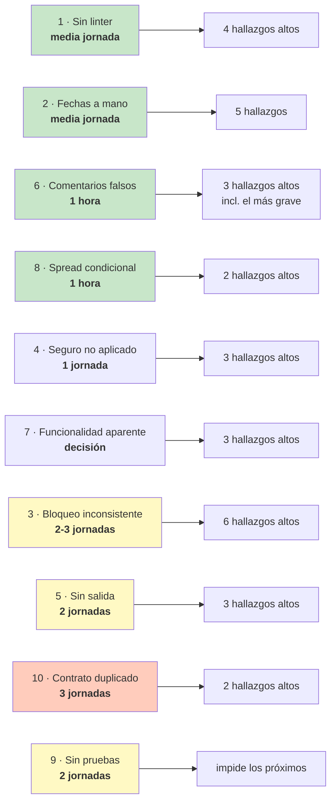

# Capítulo 25 — Los hallazgos, consolidados y priorizados

> **Este capítulo no analiza código nuevo.** Toma los **208 hallazgos** repartidos por los
> veinticuatro capítulos anteriores, los agrupa por **causa raíz**, y los ordena en un plan
> de acción con estimaciones honestas.
>
> Es el capítulo que se lee primero si hay que decidir qué arreglar.

---

## 25.1 · Introducción

Veinticuatro capítulos produjeron 208 hallazgos. Presentados así, en una lista, son
inútiles: nadie arregla 208 cosas, y una lista plana no dice por dónde empezar.

Este capítulo hace tres cosas que las tablas por capítulo no podían hacer.

**Primero, el censo honesto** — incluyendo un hueco del propio manual que conviene
declarar antes de seguir.

**Segundo, y es la parte que importa: agrupar por causa raíz.** Los 49 hallazgos de
gravedad alta **no son 49 problemas**. Son unos **diez problemas** que se manifiestan
cuarenta y nueve veces. Tres pantallas tienen el mismo cierre obsoleto: es un problema, no
tres. Cuatro sitios muestran las fechas mal: es un problema. Cinco módulos bloquean filas
de forma inconsistente: es un problema.

Esa reducción cambia la conversación. "Hay 49 bugs graves" paraliza. "Hay diez decisiones
que tomar, y dos de ellas son de veinte minutos" se puede empezar el lunes.

**Tercero, priorizar por lo que cuesta y lo que evita**, no por gravedad nominal. El
hallazgo más grave del manual —la detección de robo de tokens— cuesta seis líneas. El más
extendido —las fechas— cuesta media jornada. Empezar por ahí no es una cuestión de
gravedad: es que el retorno es absurdo.

### 25.1.1 · Cómo se leyó este proyecto

Antes de las conclusiones, una nota sobre el método, porque afecta a cuánto se pueden creer.

**Todo hallazgo se verificó contra el código antes de escribirse.** No hay ninguno derivado
de "esto suele estar mal" o "aquí probablemente falta". Cuando una afirmación requería
saber qué hace otro archivo, se abrió ese archivo.

**Y esa disciplina se puso a prueba cuatro veces.** El manual retiró o corrigió cuatro
afirmaciones propias:

| Dónde | Qué decía | Qué era cierto |
|:--|:--|:--|
| §9.6.1 | Un comentario sobre la auditoría era «engañoso» | `sanitize()` **sí existe** y sí redacta (visto en §15) |
| §22B.4.2 | `AddressAutocomplete` era «el único» con bandera `cancelled` | Hay **cinco** (visto en §22C) |
| §22B.6.2 | Finalizar hace `accumulated_km + tripKm` | Hace `accumulatedKm = arrivalKm` — **asignación absoluta** |
| §22B ej. 3.6 | Vitest estaba «instalado y sin usar» | Vitest **sí se usa**: 28 casos. Testing Library no |

Las cuatro se corrigieron en el texto original, con nota. Se dejan visibles a propósito:
**un informe que nunca se equivoca es un informe que no se verificó**.

---

## 25.2 · El censo

### 25.2.1 · Los 208 hallazgos

| Gravedad | Cantidad | Qué significa |
|:--|--:|:--|
| 🔴 **Alta** | **49** | Corrompe datos, expone información, bloquea una operación sin salida, o miente al usuario |
| ⚠️ **Media** | **75** | Degrada la experiencia, complica el mantenimiento, o falla en un caso realista |
| ⚠️ **Baja** | **84** | Inconsistencia, duplicación, detalle cosmético |
| **Total** | **208** | |
| ✅ **Positivos** | 28 | Decisiones destacadas, documentadas para no perderlas en un refactor |

**Por capítulo:**

| Capítulo | Alta | Media | Baja |
|:--|--:|--:|--:|
| 08 · Auth | 3 | 3 | 3 |
| 09 · Users | 2 | 4 | 4 |
| 10 · Vehicles | 2 | 3 | 4 |
| 11 · Drivers y documentos | 3 | 4 | 4 |
| 12 · Trips | 4 | 4 | 3 |
| 13 · Maintenance | 3 | 3 | 3 |
| 14 · Alerts | 3 | 4 | 4 |
| 15 · Audit logs | 2 | 4 | 4 |
| 16 · Dashboard y reports | 1 | 5 | 4 |
| 17 · Settings | 3 | 2 | 3 |
| 18 · Frontend bootstrap | 2 | 5 | 4 |
| 19 · Capa de API | 3 | 4 | 3 |
| 20 · Auth y estado | 2 | 4 | 4 |
| 21 · Componentes | 3 | 4 | 4 |
| 22A · Pantallas ABM | 3 | 4 | 4 |
| 22B · Viajes y mantenimiento | 5 | 6 | 9 |
| 22C · Chofer y tableros | 3 | 6 | 9 |
| 23 · Flujos end-to-end | 2 | 3 | 3 |
| 24 · Dependencias | 3 | 4 | 4 |

### 25.2.2 · ⚠️ Un hueco del propio manual

**Los capítulos 02 a 07 no tienen tabla de hallazgos.**

Esos seis capítulos —arquitectura, base de datos, Prisma, bootstrap, capa compartida,
middlewares— señalan problemas **en el cuerpo del texto**, con las marcas 🔴 y ⚠️ en su
sitio, pero **nunca los consolidan al final**. Son 197 marcas inline que este capítulo no
puede contar con la misma precisión que las 208 tabuladas.

El formato de diez secciones se estabilizó a partir del capítulo 08. Los seis primeros se
escribieron antes.

**Consecuencia práctica:** el censo de 208 es **un piso, no un techo**. Los hallazgos de
esos seis capítulos existen y están explicados donde corresponde —el `currentYear` calculado
al cargar el módulo, la inconsistencia de `tsconfig` entre repositorios, el índice que falta
en `audit_logs`— pero no entran en las cuentas de este capítulo.

**Cerrarlo es el ejercicio 3.7**, y es trabajo de una jornada: releer seis capítulos y
tabular lo que ya está escrito.

---

## 25.3 · Las diez causas raíz

Aquí está el argumento central del capítulo. Los 49 hallazgos de gravedad alta se agrupan
en **diez causas**, y dos de ellas explican once hallazgos entre las dos.

### Causa 1 — No hay linter · explica 4 hallazgos altos

| Hallazgo | Dónde |
|:--|:--|
| Cierre obsoleto en `toggleActive` | §22A.3.5 · `VehiculosPage` |
| Cierre obsoleto en `transition` | §22B.5.2 · `MaintenanceListTab` |
| Cierre obsoleto en `handleResolve` | §22C.4.2 · `AlertasPage` |
| Nueve `eslint-disable` sin ESLint | §24.6.1 · ambos repositorios |

**El mismo bug, tres veces**, y la regla `react-hooks/exhaustive-deps` detecta los tres. No
está instalada. Y hay nueve comentarios que la silencian.

De esos nueve, tres apuntan a `exhaustive-deps`. **Dos tapan un bug real y uno marca un caso
correcto** — quien los escribió no podía distinguirlos, que es exactamente para lo que sirve
la herramienta ausente. Y el cuarto cierre obsoleto, en `VehiculosPage`, ni siquiera tiene
supresión: nadie lo vio.

**Coste de la causa:** instalar y configurar ESLint. **Media jornada.**
**Retorno:** cuatro hallazgos altos, más los avisos que la revisión manual no encontró.

> **Es la mejor relación coste/beneficio del proyecto entero.** Si solo se hace una cosa de
> este capítulo, es esta.

### Causa 2 — Fechas manejadas a mano · explica 5 hallazgos altos y medios

| Hallazgo | Dónde |
|:--|:--|
| Vencimientos un día antes (4 sitios) | §22A.4 |
| Distintivo correcto junto a fecha errónea | §22C.3.2 · `MiDocumentacionPage` |
| Tabla y formulario discrepan sobre el mismo dato | §22A.4 vs `VehicleFormDialog:40` |
| `@mui/x-date-pickers` y `dayjs` instalados y sin usar | §24.5.3 |

Una columna `DATE` llega como medianoche UTC. `new Date(x).toLocaleDateString('es-AR')` la
convierte a hora argentina restando tres horas y **cruza al día anterior**.

**Y la herramienta que lo evitaba estaba instalada.** `dayjs` con su extensión UTC resuelve
el caso en una línea; `@mui/x-date-pickers` hace que el problema ni se plantee. Los dos
paquetes están en `package.json`, se descargan en cada instalación, y tienen **cero
apariciones** en el código.

Lo que hace esta causa especialmente cara es **dónde** aparece: licencias, seguros y
documentos — exactamente los datos sobre los que el sistema alerta. Un chofer ve que su
licencia «venció ayer» el día en que todavía es válida, **con el distintivo de vencimiento
correctamente ausente al lado**.

**Coste:** un helper `formatDateOnly` y catorce sustituciones. **Media jornada.**
**Retorno:** el bug más extendido y más visible del proyecto.

### Causa 3 — Bloqueo inconsistente entre módulos · explica 6 hallazgos altos

| Hallazgo | Dónde |
|:--|:--|
| `vehicles.deactivate` y `softDelete` no bloquean | §10.9 |
| `maintenances.start` no bloquea, aunque `create` sí | §13.9 |
| `maintenances.complete` escribe sin leer | §13.9 |
| `trips.update` y `delete` no bloquean | §12.9 |
| Carrera que deja el sistema sin administradores | §9.9 |
| El documento activo por tipo no tiene red en la base | §11.9 |

El capítulo 23 mostró que el patrón *bloquear-releer-validar-escribir* está bien
implementado **en cinco sitios**. El problema es que **no está en todos los que lo
necesitan**, y la inconsistencia es lo que hace daño: `trips` bloquea el vehículo,
`vehicles` no. Los dos módulos escriben la misma fila con criterios distintos.

El caso más claro está en `maintenances`: **el módulo tiene `lockVehicle`, lo usa en
`create`, y no lo usa en `start`**. Un vehículo puede quedar `IN_WORKSHOP` y con un viaje
`IN_PROGRESS` a la vez. Y de ahí sale un parche en **otro** módulo: `vehicles.deactivate`
tiene que prohibir desactivar un vehículo en el taller porque `maintenances.complete`
escribe `AVAILABLE` sin mirar.

La carrera de los administradores es la de peor consecuencia: **dos administradores
desactivándose mutuamente en paralelo pueden dejar el sistema sin ninguno**, y la
recuperación exige acceso directo a MySQL.

**Coste:** auditar los 13 módulos y añadir bloqueo donde falta. **Dos o tres jornadas**, y
requiere entender bien cada regla — no es mecánico.
**Retorno:** corrección bajo concurrencia real.

### Causa 4 — El seguro no se aplica en ninguna capa · explica 3 hallazgos altos

| Capa | Qué hace |
|:--|:--|
| `pickAvailableVehicle` | **No filtra** por seguro (§12.9, §23.4.3) |
| `alerts.service.ts:149` | **No alerta** si `insuranceExpiryDate` es `NULL` (§14.9) |
| `VehiculosPage:90` | Muestra `—` sin distintivo (§22A) |
| `vehicles.service.ts:20` | El comentario afirma que se *«surfaces as alertable»* |

**Un vehículo sin seguro circula sin que nada lo señale.** Cada capa es defendible leída
sola; juntas dejan un vehículo sin cobertura en la calle.

Y hay una variante peor: un vehículo **con** seguro vencido también se asigna. El sistema
lo detecta, lo alerta, lo expone en el campo `insuranceValid` — **y no lo aplica**.

**Coste:** decidir la política (¿bloquear la asignación? ¿solo alertar?) e implementarla en
las capas elegidas. **Una jornada.**
**Retorno:** la única implicación potencialmente legal del proyecto.

### Causa 5 — Operaciones sin salida · explica 3 hallazgos altos

| Hallazgo | Consecuencia |
|:--|:--|
| No existe cancelar un viaje (§12.9) | Un camión averiado deja viaje, vehículo y chofer **bloqueados permanentemente** |
| No existe cancelar un mantenimiento (§13.9) | Uno programado por error bloquea el vehículo indefinidamente |
| No hay forma de dar de baja a un chofer desde la interfaz (§22A) | El endpoint existe; ninguna pantalla lo expone |

Los tres son el mismo error de diseño: **modelar el camino feliz y no la corrección**.

El primero es el más grave y merece verse entero. Un viaje `IN_PROGRESS` solo puede
finalizarse, y finalizar exige `arrivalKm > departureKm` (RN-5). Si el camión se avería a
la salida, **no hay forma de cerrar el viaje**: no se puede cancelar (no existe la
transición) y no se puede finalizar con cero kilómetros (la regla lo prohíbe). El chofer
queda con un viaje activo para siempre, así que no se le puede asignar otro; el vehículo
queda `ON_TRIP`, así que sale del pozo de disponibles.

**La única salida es un `UPDATE` manual en MySQL.**

**Coste:** diseñar y añadir las transiciones de cancelación, con auditoría y reglas de
quién puede. **Dos jornadas.**
**Retorno:** que el sistema se pueda operar sin acceso a la base.

### Causa 6 — Comentarios que afirman lo que no hay · explica 3 hallazgos altos

| Comentario | Realidad |
|:--|:--|
| «*A replayed token is treated as theft and revokes every session*» (§8.9, §23.3.2) | `findValidByHash` filtra `revoked: false`: el token revocado sale como uno inventado |
| «*surfaced as alertable*» sobre el seguro (§14.9) | No alerta si el campo es `NULL` |
| «*Read-only trip detail. The Google Maps route view is a later integration*» (§22C) | Está implementada 43 líneas más abajo |

Esta causa es distinta de las demás: **el código no está mal, la documentación miente**.

Y el primero es, con diferencia, **el hallazgo más importante del manual**. No porque el
hueco sea grande —son seis líneas— sino porque el comentario lo declara resuelto. Quien
audite este código leerá «se detecta el robo», lo dará por hecho, y no lo verificará. La
única forma de encontrarlo es abrir `findValidByHash`, que está en otro archivo.

> **Un comentario incorrecto es peor que ninguno.** Un archivo sin comentarios invita a
> leer el código; uno con un comentario falso invita a no leerlo.

**Coste:** seis líneas para el primero, dos correcciones de texto para los otros dos.
**Una hora.**
**Retorno:** el hallazgo de seguridad más importante, cerrado.

### Causa 7 — Funcionalidad aparente · explica 3 hallazgos altos

| Hallazgo | Alcance |
|:--|:--|
| Ningún campo de la configuración lo lee el backend (§17.9) | 8 campos que se editan, validan, auditan y no afectan a nada |
| `estimatedDistanceKm` / `estimatedTimeMin` (§22B.4.2) | 7 archivos, 2 columnas, 2 pantallas que los muestran, **nadie los envía** |
| `@mui/x-date-pickers` y `@testing-library/react` (§24) | Instalados, declarados, sin usar |

Es la deuda más cara de todas, y la más fácil de subestimar: **nada se rompe**.

Un administrador cambia el formato de fecha en `/configuracion`, ve «Configuración
guardada», y no cambia nada. Un operador abre el detalle de un viaje y ve un guion en
«Distancia estimada», siempre. Nadie reporta un error, porque no hay error: hay una
promesa que el sistema no cumple.

El coste real no es técnico sino de confianza. Quien descubra que tres campos no hacen nada
dejará de creerse el resto de la pantalla.

**Coste:** decidir para cada caso entre implementar, deshabilitar con «Próximamente» o
eliminar. **Media jornada de decisión**, luego variable.
**Retorno:** que la interfaz no mienta.

### Causa 8 — El cliente no puede corregir lo que envía · explica 2 hallazgos altos

| Hallazgo | Dónde |
|:--|:--|
| Las observaciones de un viaje no se pueden borrar | §22B.4.1 |
| `monthsAlert` / `monthsTarget` no se pueden desactivar | §22B.5.5 |

El mismo modismo, dos veces:

```tsx
...(notes ? { notes } : {})
```

Si el campo está vacío, la clave **no existe** en el payload, y el `update` de Prisma deja
la columna intacta. **Y los esquemas del backend declaran `.nullable()` precisamente para
permitir el vaciado** — alguien lo pensó en el servidor y el cliente no lo aprovechó.

La segunda instancia es peor: `monthsAlert` alimenta el motor de alertas. Un administrador
cree haber desactivado el control por tiempo y sigue recibiendo alertas.

**Coste:** `notes: notes || null` en cuatro sitios. **Una hora.**

### Causa 9 — Sin pruebas de lo que importa · afecta a todo lo anterior

28 casos, todos de funciones puras y esquemas Zod. Cero servicios, cero repositorios, cero
endpoints, cero componentes, **cero concurrencia**.

`trips.service.assign`, con sus siete validaciones y dos cerrojos, no tiene una sola prueba.
Es el código que más la necesita, y el que rompería más silenciosamente.

**La causa es estructural, no negligencia.** Probar un servicio exige una base de datos de
pruebas o sustituir Prisma por un doble, y ninguna de las dos cosas está montada: no hay
`docker-compose` de pruebas, ni utilidades de simulación, ni datos independientes del seed.

> **La infraestructura de pruebas se detuvo justo antes de la parte cara.**

Esta causa es distinta de las ocho anteriores porque **no arregla ningún hallazgo: impide
los siguientes**. Y es la razón de que todas las correcciones de este capítulo se propongan
con una prueba que las fije.

**Coste:** montar la infraestructura (MySQL efímero, migración y siembra automáticas,
limpieza entre pruebas). **Dos jornadas** para lo mínimo utilizable.

### Causa 10 — Duplicación de contrato entre repositorios · explica 2 hallazgos altos

| Hallazgo | Dónde |
|:--|:--|
| No hay validación de las respuestas en el frontend | §19.9 |
| `(data.meta as PaginationMeta)` fuerza un tipo opcional en 7 clientes | §19.9 |

El backend valida con Zod todo lo que entra. El frontend **confía ciegamente** en todo lo
que recibe y **reescribe a mano** los tipos que el backend ya declaró.

Cualquier divergencia del contrato —un campo renombrado, uno que pasa a ser opcional— es un
`TypeError` en tiempo de ejecución, con el compilador en verde.

**Coste:** convertir el repositorio en un espacio de trabajo con un paquete compartido de
esquemas. **Tres jornadas**, y complica el despliegue.
**Retorno:** el contrato deja de ser una convención y pasa a ser una restricción.

### 25.3.1 · El resumen que importa



**Las cuatro causas verdes suman poco más de una jornada y cierran catorce hallazgos
altos** — casi un tercio del total, incluido el más grave del manual.

---

## 25.4 · El plan de acción

### 25.4.1 · Fase 0 — La primera jornada

Todo lo de esta fase es de bajo riesgo, alto retorno, y no requiere decisiones de negocio.

| # | Qué | Causa | Coste | Cierra |
|--:|:--|:--:|:--|:--|
| 1 | **Detección de robo de tokens** — reemplazar `findValidByHash` por `findByHash` y distinguir revocado de inexistente | 6 | 1 h | 🔴 §8.9-1, §23-1 |
| 2 | **Instalar ESLint** con `eslint-plugin-react-hooks` y `@typescript-eslint`, y correrlo | 1 | 2 h | 🔴 §24-2 |
| 3 | **Corregir los tres cierres obsoletos** que el punto 2 marca | 1 | 1 h | 🔴 §22A-3, §22B-4, §22C-3 |
| 4 | **`notes: notes \|\| null`** en los cuatro sitios | 8 | 1 h | 🔴 §22B-1, §22B-2 |
| 5 | **Corregir los tres comentarios falsos** | 6 | 30 min | 🔴 §14-1, §22C-13 |
| 6 | **`timeout` en Axios** | — | 15 min | 🔴 §19-1 |

**Total: una jornada. Cierra 12 hallazgos altos.**

El punto 1 va primero deliberadamente: es el de mayor gravedad y el de menor coste. No
tiene sentido que siga abierto un día más.

### 25.4.2 · Fase 1 — La primera semana

| # | Qué | Causa | Coste | Cierra |
|--:|:--|:--:|:--|:--|
| 7 | **Centralizar el formateo de fechas** — un `formatDateOnly` con `dayjs.utc`, aplicado a los 14 sitios | 2 | 4 h | 🔴 §22A-1, §22C-2 |
| 8 | **Decidir sobre `x-date-pickers`**: usarlo o desinstalarlo | 2, 7 | 2 h | 🔴 §24-1 |
| 9 | **Política del seguro**: decidir e implementar en las capas elegidas | 4 | 6 h | 🔴 §12-1, §14-1 |
| 10 | **Paginador en `MiHistorialPage`** | — | 1 h | 🔴 §22C-1 |
| 11 | **Acotar el período de los informes** (cliente y servidor) | — | 2 h | 🔴 §16-1 |
| 12 | **`sanitize` recursivo** en la auditoría | — | 2 h | 🔴 §15-1 |
| 13 | **Auditar el login/logout** | — | 3 h | 🔴 §15-2 |
| 14 | **Infraestructura de pruebas** — MySQL efímero, migración y siembra, limpieza | 9 | 12 h | *habilita todo lo demás* |

**Total: una semana. Cierra 8 hallazgos altos más y monta la red de seguridad.**

El punto 14 se pone al final de la semana a propósito: cuesta más que todo lo anterior
junto, y es el único cuyo retorno no es un hallazgo cerrado. Pero sin él, la fase 2 se hace
a ciegas.

### 25.4.3 · Fase 2 — El primer mes

Aquí ya hace falta entender el negocio, no solo el código.

| # | Qué | Causa | Coste |
|--:|:--|:--:|:--|
| 15 | **Auditar el bloqueo en los 13 módulos** y añadirlo donde falta | 3 | 3 jornadas |
| 16 | **Regla del último administrador** | 3 | 4 h |
| 17 | **Cancelación de viajes y mantenimientos** | 5 | 2 jornadas |
| 18 | **Baja de chofer desde la interfaz** | 5 | 1 jornada |
| 19 | **Decidir sobre los 8 campos de configuración** | 7 | 1 jornada |
| 20 | **Cerrar o eliminar `estimatedDistanceKm`** | 7 | 1 jornada |
| 21 | **Pruebas de servicio para las cuatro carreras** del capítulo 23 | 9 | 2 jornadas |

**Total: un mes de trabajo a tiempo parcial.**

Los puntos 17, 18, 19 y 20 **no son decisiones técnicas**. ¿Quién puede cancelar un viaje?
¿Qué pasa con los kilómetros de un viaje cancelado? ¿La configuración debe funcionar o debe
desaparecer? Nadie del equipo de desarrollo puede responder solo.

### 25.4.4 · Fase 3 — Lo estructural

| # | Qué | Causa | Coste | Cuándo |
|--:|:--|:--:|:--|:--|
| 22 | **Paquete compartido de esquemas Zod** | 10 | 3 jornadas | Si el proyecto continúa |
| 23 | **Notificaciones al chofer** (§22C-6) | — | 3 jornadas | Si se usa en la calle |
| 24 | **Evaluación automática de alertas** | — | 1 jornada | Antes de producción |
| 25 | **Almacén compartido para el límite de peticiones** | — | 4 h | Si hay más de una instancia |
| 26 | **Recolector de archivos huérfanos** | — | 1 jornada | Si el disco importa |
| 27 | **Actualizar `multer` a 2.x** | — | 4 h | **Antes de producción** |
| 28 | **Tabular los hallazgos de los capítulos 02-07** | — | 1 jornada | Para cerrar el manual |

### 25.4.5 · Lo que NO hay que hacer

Tan importante como la lista anterior. De los 208 hallazgos, **muchos no merecen tocarse**,
y decirlo evita que alguien queme una semana en lo cosmético:

| No tocar | Por qué |
|:--|:--|
| Las 84 de gravedad baja, en bloque | Duplicaciones y detalles cosméticos. Se arreglan **cuando se pase por ahí**, no en una campaña |
| Las 4 copias del componente etiqueta-valor | Extraerlas ahorra ~40 líneas y no arregla nada |
| El ternario anidado del doble error, ×6 | Ídem |
| Migrar a Express 5, React 19, Zod 4 | No hay ningún hallazgo que lo requiera |
| Sustituir Prisma, Zustand o Axios | Las tres elecciones son correctas |
| Reescribir `usePaginatedList` con TanStack Query | Tentador y desproporcionado. Evaluarlo (ej. 3.5), no hacerlo por reflejo |
| «Arreglar» el odómetro absoluto | §23.5.1: es la decisión correcta. Solo **falta el comentario** |
| Quitar el `?? 0` de `FinishTripDialog` | Baja, y el caso no ocurre |

> **Un plan de acción que no dice qué ignorar no es un plan: es la misma lista otra vez.**

---

## 25.5 · Lo que este proyecto hace bien

Veinticuatro capítulos de crítica dan una impresión distorsionada. Los 28 positivos
registrados no son cortesía: son decisiones que **hay que proteger de un refactor
descuidado**.

**Las cinco que más destacan:**

**1. La corrección bajo concurrencia es deliberada, no accidental.** El patrón
*bloquear-releer-validar-escribir* aparece cinco veces, con cuatro mecanismos distintos
(`FOR UPDATE`, `SKIP LOCKED`, `UNIQUE`, `GET_LOCK`), y **los comentarios explican el porqué
en cada sitio**. `trips.service.ts:187-189` y `:265-268` son los mejores comentarios del
proyecto. Que la causa 3 sea "está en cinco sitios y faltan otros tantos" no debe tapar que
en esos cinco está bien.

**2. `FOR UPDATE SKIP LOCKED`.** Convierte una selección de vehículo correcta pero
serializada en una correcta y paralela. Es la construcción canónica de cola de trabajo en
SQL, la misma que usan los sistemas de colas sobre bases relacionales. **Encontrarla en un
trabajo académico es notable.**

**3. El refresco transparente.** Tres protecciones en una sola condición —`isAuthEndpoint`
contra la recursión, `_retried` contra el bucle, `??=` contra que la rotación destruya la
sesión— y el usuario no ve nada. Un chofer con el token caducado hace nueve horas pulsa un
botón y funciona. **Es la pieza con mejor relación trabajo/tamaño del proyecto.**

**4. La degradación elegante, aplicada consistentemente.** `AddressAutocomplete` sin clave
de Google es un campo de texto. `RouteMap` sin clave es un enlace. El mailer sin SMTP
registra en consola. **El sistema arranca y funciona sin ninguna integración externa
configurada**, y en los tres casos está comentado.

**5. Prisma 7 con el adaptador sin Rust.** Sin binario de 20 MB por plataforma: contenedores
más pequeños, arranque inmediato, sin problemas de arquitectura. Es una decisión de 2025 en
un proyecto académico.

**Y una que se ve solo en conjunto:** la arquitectura por capas se respeta **sin una sola
excepción** en 6.802 líneas de backend. No hay un controlador que llame a Prisma ni un
repositorio que lance un error de negocio. Eso no se consigue por casualidad, y es lo que
hace que los ~15 días de trabajo de este plan sean viables: **cada corrección toca una capa,
no cinco.**

---

## 25.6 · Resumen

| | |
|:--|:--|
| **Hallazgos tabulados** | 208 (49 altos · 75 medios · 84 bajos) + 28 positivos |
| **No tabulados** | Los capítulos 02-07, ~197 marcas inline. El censo es un piso |
| **Causas raíz de los 49 altos** | **10** |
| **Fase 0** | 1 jornada → cierra **12 altos** |
| **Fase 1** | 1 semana → cierra **8 altos** + infraestructura de pruebas |
| **Fase 2** | 1 mes parcial → lo que exige decisiones de negocio |
| **Correcciones al propio manual** | 4, todas visibles con nota |

**Las tres conclusiones:**

1. **49 hallazgos altos son 10 problemas.** Tres pantallas con el mismo cierre obsoleto son
   un problema. Cuatro sitios con la misma fecha mal son un problema.

2. **Cuatro de esas diez causas cuestan poco más de una jornada entre todas y cierran
   catorce hallazgos altos**, incluido el más grave del manual. El desequilibrio entre
   coste y retorno es tan grande que el orden de trabajo se decide solo.

3. **El proyecto está bien construido y mal terminado.** La arquitectura es correcta y
   consistente; la concurrencia está pensada; las dependencias son buenas elecciones. Lo
   que falta es el último tramo: el linter que nadie instaló, las pruebas que se detuvieron
   antes de la parte cara, los paquetes que se declararon y no se usaron, los comentarios
   que se escribieron para una implementación que no llegó.

> **Casi todos los hallazgos altos son cosas que alguien empezó y no cerró.** Esa es una
> categoría de deuda mucho más barata que la alternativa, que sería un diseño equivocado.

---

## 25.7 · Preguntas de repaso

<details>
<summary><b>1. ¿Por qué agrupar por causa raíz cambia la decisión de por dónde empezar?</b></summary>

Porque una lista de 49 hallazgos altos sugiere 49 tareas, y eso paraliza. Agrupados,
**son 10 problemas**, y el coste de cada uno varía en dos órdenes de magnitud.

Ejemplo concreto: tres hallazgos altos son «cierre obsoleto» en tres pantallas distintas.
Tratados como tres bugs, son tres investigaciones y tres correcciones. Tratados como una
causa —«no hay linter»— son **una instalación de dos horas que los encuentra los tres**, más
los que la revisión manual no vio.

Y la agrupación revela el desequilibrio que decide el orden: cuatro causas cuestan poco más
de una jornada entre todas y cierran catorce hallazgos altos. Sin agrupar, esos catorce
parecerían catorce tareas comparables al resto.
</details>

<details>
<summary><b>2. Se puede hacer una sola cosa de este capítulo. ¿Cuál y por qué?</b></summary>

**Instalar ESLint con `eslint-plugin-react-hooks`** (causa 1) — con la corrección de la
detección de robo de tokens muy cerca.

ESLint gana por el retorno: dos horas de configuración que cierran cuatro hallazgos altos
—los tres cierres obsoletos más las nueve supresiones falsas— y **siguen trabajando después**.
Es la única corrección del plan que previene bugs futuros en lugar de arreglar los
presentes.

El detalle que lo hace evidente: de las tres supresiones de `exhaustive-deps` que hay en el
código, **dos tapan un bug real y una marca un caso correcto**. Quien las escribió no podía
distinguirlas. Y hay un cuarto cierre obsoleto sin supresión: nadie lo vio.

**El argumento a favor de la otra:** la detección de robo de tokens es el hallazgo de mayor
gravedad del manual y cuesta seis líneas. Si el criterio es «riesgo», va primera. Por eso en
el plan es el punto 1 y ESLint el 2 — la fase 0 completa cabe en una jornada y no obliga a
elegir.
</details>

<details>
<summary><b>3. ¿Por qué la causa 7, «funcionalidad aparente», es alta si nada se rompe?</b></summary>

Precisamente **porque nada se rompe**.

Un administrador cambia «Formato de fecha» en `/configuracion`, ve «Configuración guardada»,
y no cambia nada — ningún código del sistema lee ese campo. Un operador abre el detalle de
un viaje y ve un guion en «Distancia estimada», siempre, porque nadie envía nunca ese dato.

**Nadie reporta un error, porque no hay error.** Hay una promesa que el sistema no cumple.

El coste no es técnico sino de confianza: quien descubra que tres campos de una pantalla no
hacen nada dejará de creerse el resto de la pantalla. Y de la aplicación.

Es peor que un bug visible por dos razones: un bug se reporta y se arregla; esto no se
reporta. Y un bug afecta a una función; esto contamina la credibilidad de todo lo que lo
rodea.

**El arreglo suele ser gratis:** deshabilitar los campos con un «Próximamente» cuesta
minutos y convierte una mentira en una expectativa honesta.
</details>

<details>
<summary><b>4. La causa 9 «no arregla ningún hallazgo». ¿Por qué está en el plan?</b></summary>

Porque **impide los siguientes**.

Las causas 1 a 8 y 10 arreglan lo que ya está roto. La 9 —montar la infraestructura de
pruebas— no cierra ni un hallazgo: monta la red que evita que las correcciones introduzcan
regresiones, y que los mismos bugs vuelvan dentro de seis meses.

Y hay un argumento más concreto. Las correcciones más delicadas del plan son las de la
causa 3, bloqueo bajo concurrencia. **Esas correcciones no se pueden verificar a mano**: hay
que lanzar dos peticiones simultáneas y comprobar que una es rechazada. Sin infraestructura
de pruebas, la fase 2 se hace a ciegas.

Por eso está al final de la fase 1 —cuesta más que todo lo anterior junto— y antes de la
fase 2, que es la que la necesita.

**La causa de que falte es estructural, no negligencia:** probar un servicio exige una base
de datos de pruebas o un doble de Prisma, y ninguna de las dos cosas está montada. La
infraestructura se detuvo justo antes de la parte cara.
</details>

<details>
<summary><b>5. ¿Por qué el capítulo dedica una sección a lo que NO hay que hacer?</b></summary>

Porque sin ella, el plan es la misma lista de 208 otra vez.

De los 208 hallazgos, **84 son de gravedad baja**: duplicaciones, inconsistencias
cosméticas, detalles. Extraer las cuatro copias del componente etiqueta-valor ahorra unas
40 líneas y **no arregla nada**. Unificar el ternario del doble error, igual. Son mejoras
que se hacen **cuando se pasa por ahí**, no en una campaña.

Y hay dos trampas concretas que la sección desactiva:

- **Migrar por reflejo.** Express 5, React 19, Zod 4, TanStack Query. Ninguna la exige
  ningún hallazgo. Migrar consume semanas y produce cero hallazgos cerrados.
- **«Arreglar» lo que está bien.** El odómetro con asignación absoluta parece un descuido y
  **es la decisión correcta** (§23.5.1): el odómetro es una lectura del mundo real, no un
  agregado. Lo único que falta es el comentario que lo diga. Alguien que lo «corrija» a un
  incremento habría empeorado el sistema.

Ese último caso es la razón de que el manual registre 28 **positivos**: son decisiones que
hay que proteger de un refactor bienintencionado.
</details>

<details>
<summary><b>6. El manual corrigió cuatro afirmaciones propias. ¿Por qué dejarlas visibles?</b></summary>

Porque **un informe que nunca se equivoca es un informe que no se verificó**.

Las cuatro salieron de la misma disciplina —comprobar cada afirmación contra el código antes
de escribirla— aplicada tarde:

| Decía | Era |
|:--|:--|
| El comentario de auditoría es «engañoso» (§9.6.1) | `sanitize()` **sí existe** y sí redacta |
| `AddressAutocomplete` es «el único» con `cancelled` | Hay **cinco** |
| Finalizar hace `accumulated_km + tripKm` | Hace `accumulatedKm = arrivalKm` |
| Vitest está «instalado y sin usar» | Se usa: **28 casos** |

La primera es la más instructiva: se afirmó que un comentario mentía y **el comentario era
cierto**. Se descubrió seis capítulos después, al leer el archivo que implementaba lo que el
comentario prometía.

Es exactamente el error que este manual le reprocha al proyecto en la causa 6 —afirmar algo
sin verificar que se cumple— cometido por el propio manual.

Dejarlas visibles permite calibrar el resto: si cuatro de más de doscientas afirmaciones
necesitaron corrección y las cuatro están señaladas, el lector puede estimar cuánto fiarse
de las que quedan.
</details>

---

## 25.8 · Ejercicios propuestos

### Nivel 1 — Comprensión

**1.1.** Recorra los 49 hallazgos altos y asígnele a cada uno su causa raíz. ¿Alguno encaja
en dos? ¿Alguno no encaja en ninguna de las diez?

**1.2.** Para cada una de las diez causas, localice el **primer** capítulo donde aparece un
síntoma. ¿Cuántos capítulos pasan entre el primer síntoma y el momento en que la causa se
hace visible?

**1.3.** La sección 25.4.5 dice qué no hacer. Elija tres elementos de esa lista y construya
el argumento **a favor** de hacerlos. ¿Cuál de los tres le parece más defendible?

**1.4.** Los capítulos 02-07 no tienen tabla de hallazgos. Ábralos, cuente las marcas 🔴 y
⚠️, y estime cuántos hallazgos añadirían al censo.

### Nivel 2 — Ejecución

**2.1.** **Ejecute la fase 0 completa.** Los seis puntos, en orden. Mida el tiempo real de
cada uno y compárelo con la estimación. ¿Cuál se desvió más y por qué?

**2.2.** Antes de tocar nada, **escriba las pruebas que fijan los doce hallazgos que la
fase 0 cierra**. Deben fallar contra el código actual. Luego corrija y verifique que pasan.

**2.3.** Instale ESLint (punto 2) y **antes de corregir nada**, guarde la salida completa.
Clasifique cada aviso en: hallazgo ya documentado en el manual, hallazgo nuevo real, o falso
positivo. ¿Cuántos hay de cada clase?

**2.4.** Ejecute el punto 7 (centralizar fechas) y verifique con un documento que vence
**hoy** que el distintivo y la fecha ya coinciden en las cuatro pantallas afectadas.

### Nivel 3 — Decisión

**3.1.** **Escriba la propuesta de la política del seguro** (causa 4) para presentarla a
quien decide. Debe incluir: las tres opciones (bloquear la asignación / solo alertar /
ambas), qué pasa con la flota actual si se bloquea, el coste de cada una, y una
recomendación argumentada. **Máximo una página.**

**3.2.** **Diseñe la cancelación de viajes** (causa 5). Responda antes de codificar: ¿quién
puede cancelar? ¿en qué estados? ¿qué pasa con el vehículo, el chofer y los kilómetros?
¿se audita como `CANCEL` o como `FINISH`? ¿un viaje cancelado cuenta en los informes?
Contrástelo con lo que hoy obliga a hacer un `UPDATE` manual en MySQL.

**3.3.** **Decida sobre los ocho campos de configuración** (causa 7). Para cada uno:
implementar, deshabilitar con «Próximamente», o eliminar. Justifique cada decisión y estime
el coste total de la opción elegida.

**3.4.** **Reordene el plan para un contexto distinto.** Suponga que el sistema entra en
producción en dos semanas con una flota de 15 vehículos y 20 choferes. ¿Qué cambia de
prioridad? ¿Qué de la fase 2 sube a la 0? ¿Qué de la fase 0 puede esperar? Justifique con
el riesgo real, no con la gravedad nominal.

**3.5.** **Construya el argumento contrario a este capítulo.** Suponga que el proyecto es un
trabajo académico ya entregado y aprobado, que nadie lo va a poner en producción, y que el
único objetivo es aprender. ¿Qué partes del plan siguen teniendo sentido? ¿Cuáles no?
¿Cambia el orden?

**3.6.** **Cierre el hueco del manual.** Añada a los capítulos 02-07 su tabla de hallazgos
consolidada, con el mismo formato que los demás, a partir de las marcas que ya tienen. Luego
**actualice el censo de este capítulo** con las cifras reales.

**3.7.** **Escriba el informe ejecutivo de una página.** Destinatario: quien paga el
desarrollo, sin formación técnica. Debe responder tres preguntas: ¿el sistema se puede poner
en producción? ¿qué hay que arreglar antes? ¿cuánto cuesta? Sin jerga, sin nombres de
archivo, sin listas de 208 elementos.

---

> **Siguiente:** [Capítulo 26 — Banco de ejercicios y cierre](./26-ejercicios-y-cierre.md)
> **Anterior:** [Capítulo 24 — Las 50 dependencias, una por una](./24-dependencias.md)
